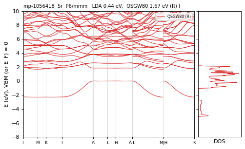

# GW1500 QSGW80 — bands and DOS, 1 atoms per cell

[README](README.md) · [table](table.md)

Gray: LDA. Red: QSGW80 adopted (condition in parentheses). Blue dashed: another QSGW80 result when its gap differs by more than 0.1 eV. Energies from the VBM (insulators) or E_F (metals). Right: total DOS.

**mp-1056418** Sr — QSGW80 **1.67** R eV I vs2025 — ecalj 989a18637 (fp32, t_tetrakbt +300)

