# GW1500 QSGW80 — bands and DOS, 2 atoms per cell

[README](README.md) · [table](table.md)

Gray: LDA. Red: QSGW80 adopted (condition in parentheses). Blue dashed: another QSGW80 result when its gap differs by more than 0.1 eV. Energies from the VBM (insulators) or E_F (metals). Right: total DOS.

**mp-23231** AgBr — QSGW80 **2.44** N / M ≈ eV I  — ecalj b695fa65c (tf32, t_tetrakbt -300)

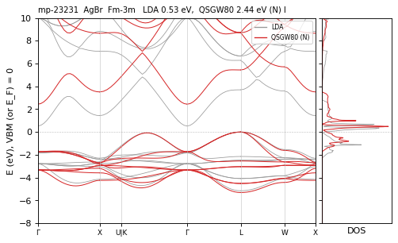

**mp-22922** AgCl — QSGW80 **2.92** N / M ≈ eV I  — ecalj b695fa65c (tf32, t_tetrakbt -300)

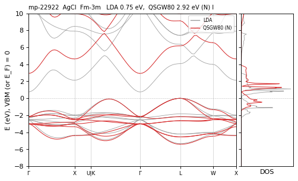

**mp-22919** AgI — QSGW80 **2.10** N / M 1.96 eV I differs — ecalj b695fa65c (tf32, t_tetrakbt -300)

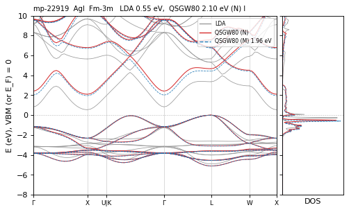

**mp-22925** AgI — QSGW80 **3.01** N / M ≈ eV D  — ecalj b695fa65c (tf32, t_tetrakbt -300)

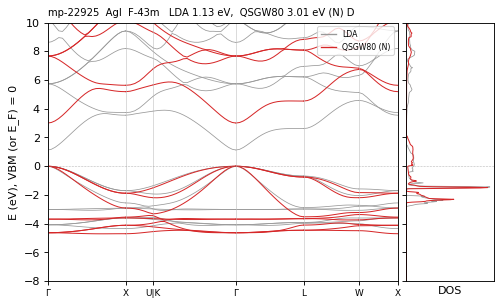

**mp-2172** AlAs — QSGW80 **2.21** N / M ≈ eV I  — ecalj b695fa65c (tf32, t_tetrakbt -300)

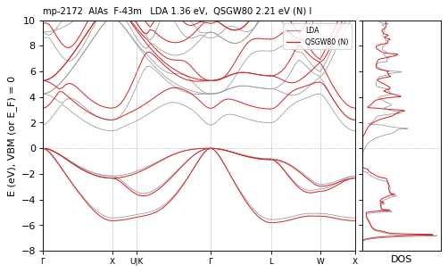

**mp-1330** AlN — QSGW80 **6.37** N / M ≈ eV I  — ecalj b695fa65c (tf32, t_tetrakbt -300)

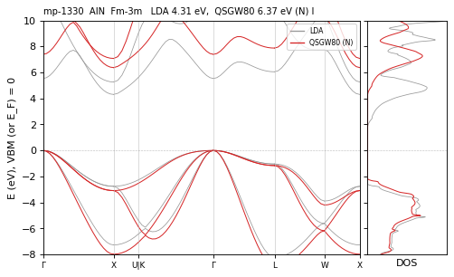

**mp-1550** AlP — QSGW80 **2.48** N / M ≈ eV I  — ecalj b695fa65c (tf32, t_tetrakbt -300)

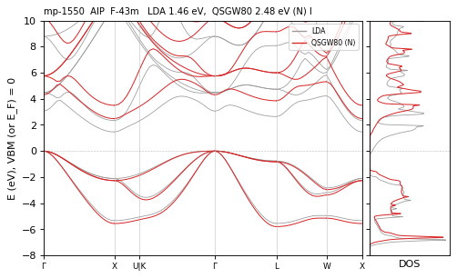

**mp-2624** AlSb — QSGW80 **1.89** N / M ≈ eV I  — ecalj b695fa65c (tf32, t_tetrakbt -300)

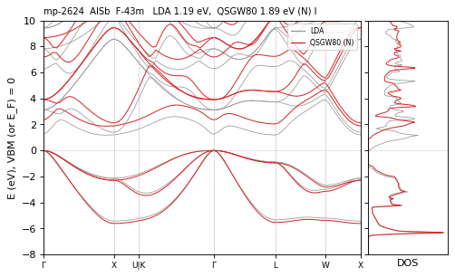

**mp-10044** BAs — QSGW80 **1.86** N / M ≈ eV I  — ecalj b695fa65c (tf32, t_tetrakbt -300)

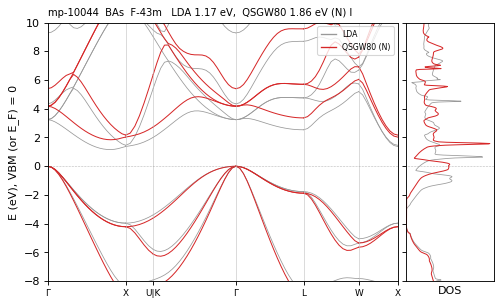

**mp-1639** BN — QSGW80 **6.34** N / M 6.25 eV I differs — ecalj b695fa65c (tf32, t_tetrakbt -300)

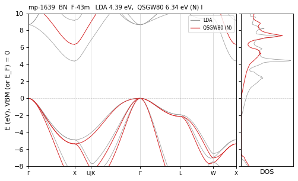

**mp-685145** BN — QSGW80 **5.96** N / M 5.87 eV I differs — ecalj b695fa65c (tf32, t_tetrakbt -300)

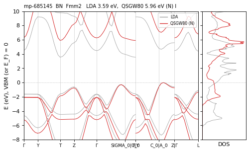

**mp-1479** BP — QSGW80 **2.05** N / M ≈ eV I  — ecalj b695fa65c (tf32, t_tetrakbt -300)

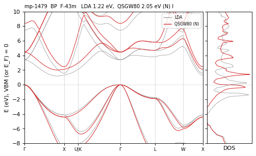

**mp-1342** BaO — QSGW80 **4.19** R eV D  — ecalj 989a18637 (fp32, t_tetrakbt +300)

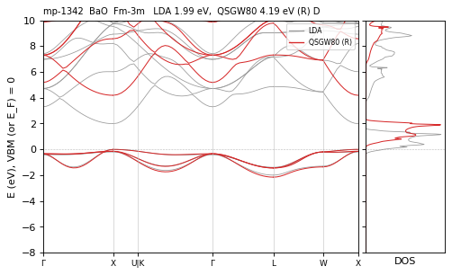

**mp-1500** BaS — QSGW80 **3.92** R eV I  — ecalj 989a18637 (fp32, t_tetrakbt +300)

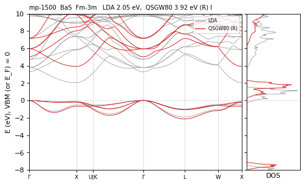

**mp-10680** BaSe — QSGW80 **2.69** N / M 2.75 eV I differs — ecalj b695fa65c (tf32, t_tetrakbt -300)

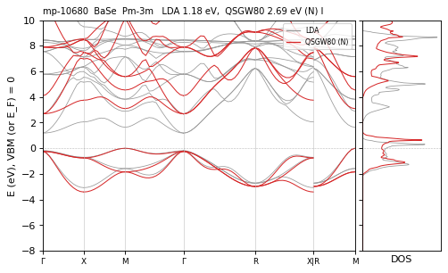

**mp-1253** BaSe — QSGW80 **3.57** R eV I  — ecalj 989a18637 (fp32, t_tetrakbt +300)

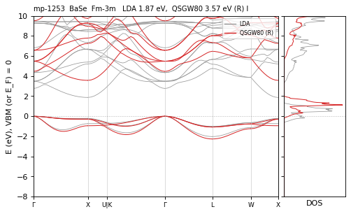

**mp-1000** BaTe — QSGW80 **2.96** N / M ≈ eV I  — ecalj b695fa65c (tf32, t_tetrakbt -300)

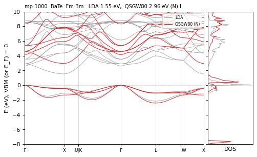

**mp-2600** BaTe — QSGW80 **1.95** R eV I  — ecalj 989a18637 (fp32, t_tetrakbt +300)

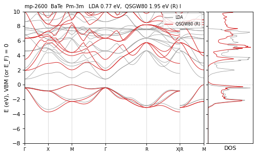

**mp-1794** BeO — QSGW80 **11.10** N / M 11.37 eV I CHECK — ecalj b695fa65c (tf32, t_tetrakbt -300)

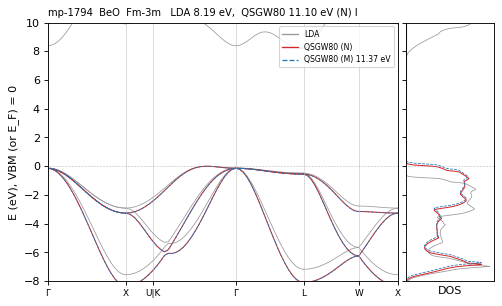

**mp-422** BeS — QSGW80 **4.64** N / M 4.58 eV I differs — ecalj b695fa65c (tf32, t_tetrakbt -300)

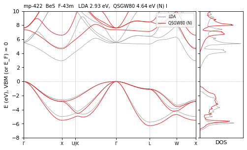

**mp-1541** BeSe — QSGW80 **3.93** N / M ≈ eV I  — ecalj b695fa65c (tf32, t_tetrakbt -300)

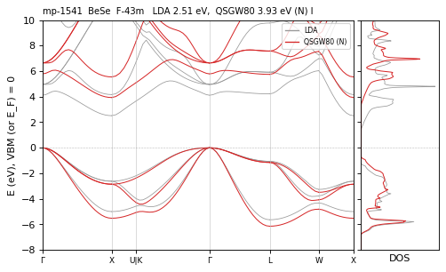

**mp-252** BeTe — QSGW80 **2.86** N / M ≈ eV I  — ecalj b695fa65c (tf32, t_tetrakbt -300)

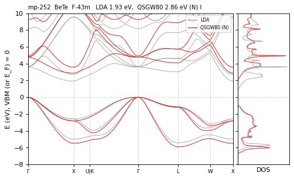

**mp-169** C2 — QSGW80 **2.52** R · path 0 (semimetal?) eV  path-metal LDA≠PBE vs2025 — ecalj 989a18637 (fp32, t_tetrakbt +300)

*graphite-like: the bands cross E_F at K, which the 8x8x8 mesh misses; a semimetal, the gap on the mesh is not physical*

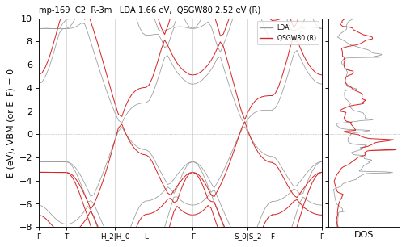

**mp-66** C2 — QSGW80 **5.80** N / M ≈ eV I  — ecalj b695fa65c (tf32, t_tetrakbt -300)

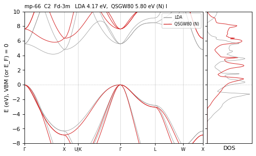

**mp-2605** CaO — QSGW80 **6.60** N / R ≈ eV I  — ecalj 989a18637 (tf32, t_tetrakbt -300)

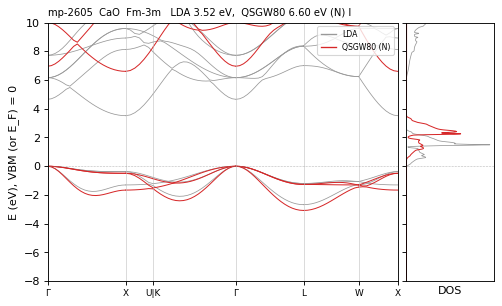

**mp-1672** CaS — QSGW80 **4.34** N / M ≈ eV I  — ecalj b695fa65c (tf32, t_tetrakbt -300)

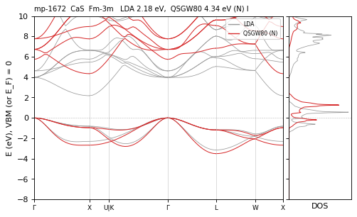

**mp-1415** CaSe — QSGW80 **3.85** R eV I  — ecalj 989a18637 (fp32, t_tetrakbt +300)

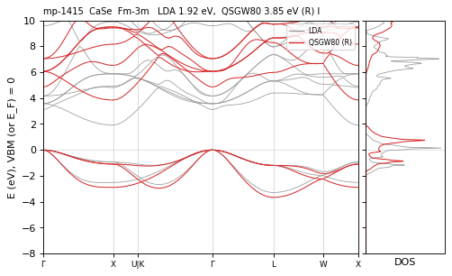

**mp-1519** CaTe — QSGW80 **2.96** R eV I  — ecalj 989a18637 (fp32, t_tetrakbt +300)

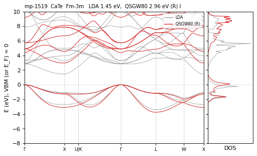

**mp-2469** CdS — QSGW80 **2.33** N / M ≈ eV D  — ecalj b695fa65c (tf32, t_tetrakbt -300)

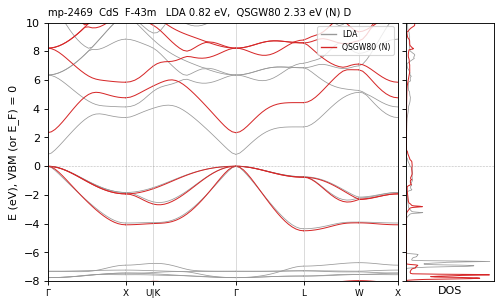

**mp-370** CdS — QSGW80 **1.30** N / M ≈ eV I  — ecalj b695fa65c (tf32, t_tetrakbt -300)

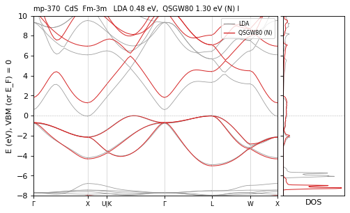

**mp-2691** CdSe — QSGW80 **1.73** N / M ≈ eV D  — ecalj b695fa65c (tf32, t_tetrakbt -300)

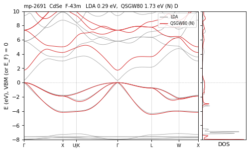

**mp-406** CdTe — QSGW80 **1.67** N / M ≈ eV D  — ecalj b695fa65c (tf32, t_tetrakbt -300)

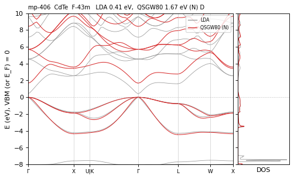

**mp-2667** CsAu — QSGW80 **2.37** R eV I  — ecalj 989a18637 (fp32, t_tetrakbt +300)

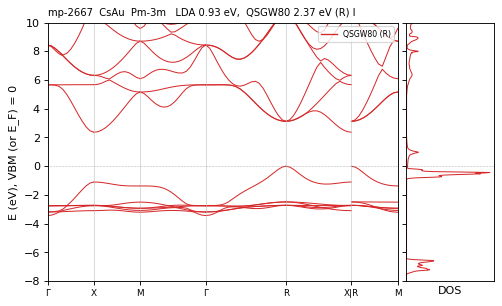

**mp-22906** CsBr — QSGW80 **6.97** R eV D  — ecalj 989a18637 (fp32, t_tetrakbt +300)

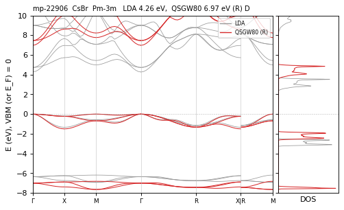

**mp-571222** CsBr — QSGW80 **7.05** R eV D  — ecalj 989a18637 (fp32, t_tetrakbt +300)

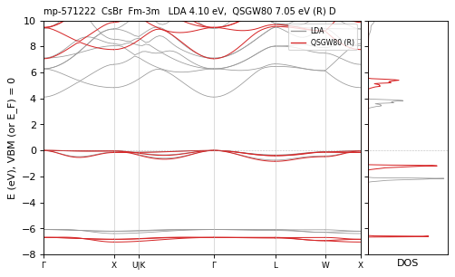

**mp-22865** CsCl — QSGW80 **7.98** R eV D  — ecalj 989a18637 (fp32, t_tetrakbt +300)

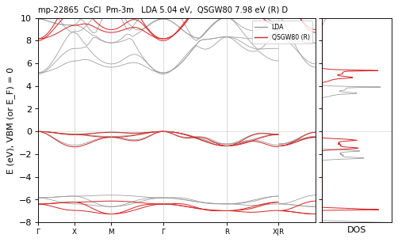

**mp-573697** CsCl — QSGW80 **7.81** R eV I  — ecalj 989a18637 (fp32, t_tetrakbt +300)

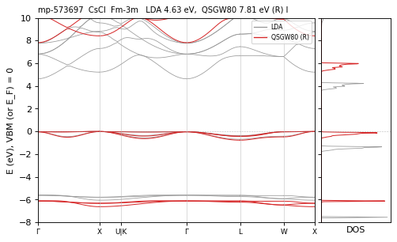

**mp-1784** CsF — QSGW80 **8.87** R eV I  — ecalj 989a18637 (fp32, t_tetrakbt +300)

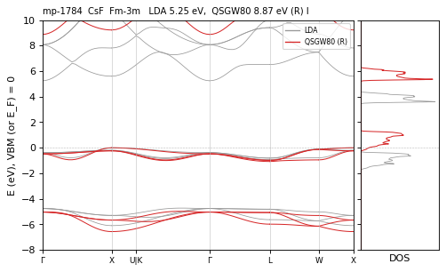

**mp-8455** CsF — QSGW80 **9.64** R eV D  — ecalj 989a18637 (fp32, t_tetrakbt +300)

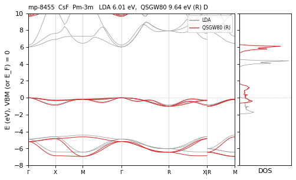

**mp-1057286** CsH — QSGW80 **4.67** N / M 4.60 eV D differs — ecalj b695fa65c (tf32, t_tetrakbt -300)

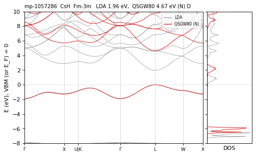

**mp-632319** CsH — QSGW80 **4.70** R eV I  — ecalj 989a18637 (fp32, t_tetrakbt +300)

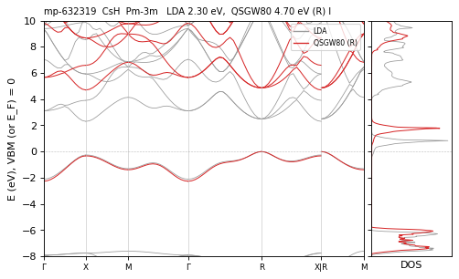

**mp-1056920** CsI — QSGW80 **5.84** N / M 5.75 eV I differs — ecalj b695fa65c (tf32, t_tetrakbt -300)

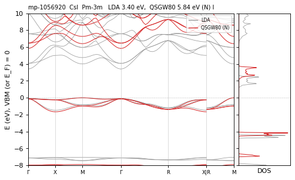

**mp-614603** CsI — QSGW80 **6.31** R eV D  — ecalj 989a18637 (fp32, t_tetrakbt +300)

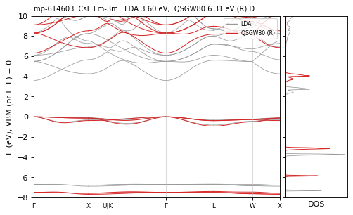

**mp-22913** CuBr — QSGW80 **2.43** N / M ≈ eV D  — ecalj 989a18637 (tf32, t_tetrakbt -300)

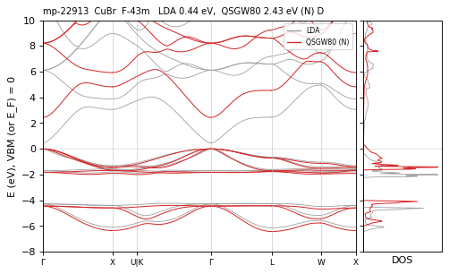

**mp-570354** CuBr — QSGW80 **1.93** N / M ≈ eV I  — ecalj b695fa65c (tf32, t_tetrakbt -300)

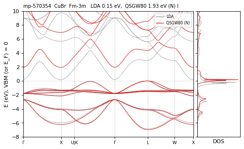

**mp-22914** CuCl — QSGW80 **2.70** N / M ≈ eV D  — ecalj b695fa65c (tf32, t_tetrakbt -300)

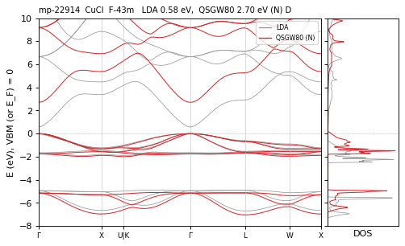

**mp-571386** CuCl — QSGW80 **2.30** N / M ≈ eV I  — ecalj b695fa65c (tf32, t_tetrakbt -300)

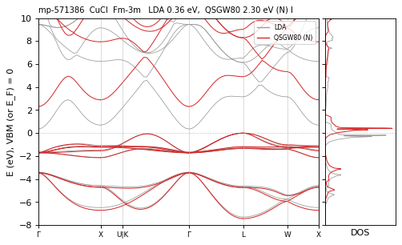

**mp-22895** CuI — QSGW80 **2.80** N / M 2.86 eV D differs — ecalj b695fa65c (tf32, t_tetrakbt -300)

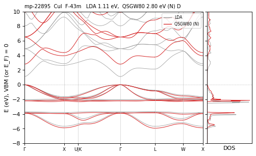

**mp-2534** GaAs — QSGW80 **1.05** N / M ≈ eV D  — ecalj b695fa65c (tf32, t_tetrakbt -300)

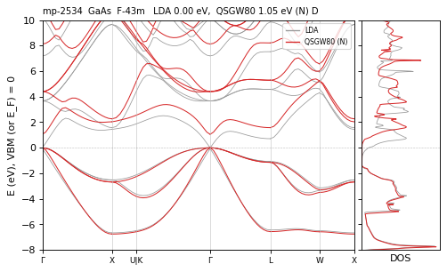

**mp-2853** GaN — QSGW80 **1.53** N / M ≈ eV I  — ecalj b695fa65c (tf32, t_tetrakbt -300)

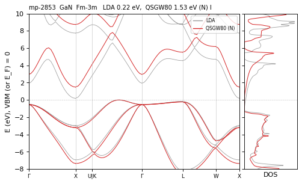

**mp-2490** GaP — QSGW80 **2.29** N / M ≈ eV I  — ecalj b695fa65c (tf32, t_tetrakbt -300)

**mp-10759** GeSe — QSGW80 **0.20** N / M ≈ eV I  — ecalj b695fa65c (tf32, t_tetrakbt -300)

**mp-2612** GeTe — QSGW80 **0.44** N / M ≈ eV D  — ecalj b695fa65c (tf32, t_tetrakbt -300)

**mp-938** GeTe — QSGW80 **0.67** N / M ≈ eV I  — ecalj b695fa65c (tf32, t_tetrakbt -300)

**mp-632291** H2 — QSGW80 **14.68** N / M ≈ eV I vs2025 — ecalj b695fa65c (tf32, t_tetrakbt -300)

*2025 values equal to LDA (the 2025 QSGW of H2 had not run)*

**mp-20351** InP — QSGW80 **1.23** N / M ≈ eV D  — ecalj b695fa65c (tf32, t_tetrakbt -300)

**mp-23251** KBr — QSGW80 **7.28** R eV D  — ecalj 989a18637 (fp32, t_tetrakbt +300)

**mp-570891** KBr — QSGW80 **6.52** R eV I  — ecalj 989a18637 (fp32, t_tetrakbt +300)

**mp-23193** KCl — QSGW80 **8.31** N / M 8.19 eV D differs — ecalj b695fa65c (tf32, t_tetrakbt -300)

**mp-23289** KCl — QSGW80 **7.78** N / M ≈ eV I  — ecalj b695fa65c (tf32, t_tetrakbt -300)

**mp-463** KF — QSGW80 **10.49** N / M ≈ eV D  — ecalj b695fa65c (tf32, t_tetrakbt -300)

**mp-8454** KF — QSGW80 **10.58** N / M ≈ eV I  — ecalj b695fa65c (tf32, t_tetrakbt -300)

**mp-24084** KH — QSGW80 **6.38** N / M 6.33 eV D differs — ecalj b695fa65c (tf32, t_tetrakbt -300)

**mp-22898** KI — QSGW80 **6.34** R eV D  — ecalj 989a18637 (fp32, t_tetrakbt +300)

**mp-22901** KI — QSGW80 **5.43** R eV I  — ecalj 989a18637 (fp32, t_tetrakbt +300)

**mp-23259** LiBr — QSGW80 **7.66** N / M 7.59 eV D differs — ecalj b695fa65c (tf32, t_tetrakbt -300)

**mp-22905** LiCl — QSGW80 **9.43** N / M ≈ eV D  — ecalj 989a18637 (tf32, t_tetrakbt -300)

**mp-1138** LiF — QSGW80 **13.68** N / M 13.48 eV D differs — ecalj b695fa65c (tf32, t_tetrakbt -300)

**mp-23703** LiH — QSGW80 **5.55** N / M ≈ eV D vs2025 — ecalj b695fa65c (tf32, t_tetrakbt -300)

*2025 values equal to LDA (the 2025 QSGW of LiH had not run)*

**mp-22899** LiI — QSGW80 **6.24** N / M ≈ eV I  — ecalj b695fa65c (tf32, t_tetrakbt -300)

**mp-1009129** MgO — QSGW80 **5.89** N / M 6.12 eV I CHECK — ecalj b695fa65c (tf32, t_tetrakbt -300)

**mp-1265** MgO — QSGW80 **8.18** N / M 8.33 eV D differs — ecalj b695fa65c (tf32, t_tetrakbt -300)

*May 8.33 vs 8.18 eV: traced to the old all-TF32 --mp of the May production (README, reliability of M)*

**mp-1315** MgS — QSGW80 **4.52** N / M ≈ eV I  — ecalj b695fa65c (tf32, t_tetrakbt -300)

**mp-10760** MgSe — QSGW80 **3.23** N / M ≈ eV I  — ecalj b695fa65c (tf32, t_tetrakbt -300)

**mp-22916** NaBr — QSGW80 **7.04** N / M ≈ eV D  — ecalj b695fa65c (tf32, t_tetrakbt -300)

**mp-22851** NaCl — QSGW80 **6.95** N / M 6.79 eV I differs — ecalj b695fa65c (tf32, t_tetrakbt -300)

**mp-22862** NaCl — QSGW80 **8.42** N / M 8.35 eV D differs — ecalj b695fa65c (tf32, t_tetrakbt -300)

**mp-682** NaF — QSGW80 **11.48** R eV D  — ecalj 989a18637 (fp32, t_tetrakbt +300)

**mp-23870** NaH — QSGW80 **6.72** N / M ≈ eV I  — ecalj 989a18637 (tf32, t_tetrakbt -300)

**mp-23268** NaI — QSGW80 **5.95** N / M ≈ eV D  — ecalj b695fa65c (tf32, t_tetrakbt -300)

**mp-21276** PbS — QSGW80 **0.75** N / M ≈ eV D  — ecalj b695fa65c (tf32, t_tetrakbt -300)

**mp-2201** PbSe — QSGW80 **0.71** N / M ≈ eV D  — ecalj b695fa65c (tf32, t_tetrakbt -300)

**mp-30373** RbAu — QSGW80 **1.48** R eV I  — ecalj 989a18637 (fp32, t_tetrakbt +300)

**mp-22867** RbBr — QSGW80 **7.10** R eV D  — ecalj 989a18637 (fp32, t_tetrakbt +300)

**mp-23303** RbBr — QSGW80 **6.71** R eV I  — ecalj 989a18637 (fp32, t_tetrakbt +300)

**mp-23295** RbCl — QSGW80 **7.98** R eV D  — ecalj 989a18637 (fp32, t_tetrakbt +300)

**mp-23299** RbCl — QSGW80 **7.89** R eV I  — ecalj 989a18637 (fp32, t_tetrakbt +300)

**mp-2064** RbF — QSGW80 **10.48** N / M 10.28 eV D CHECK — ecalj b695fa65c (tf32, t_tetrakbt -300)

**mp-24721** RbH — QSGW80 **5.51** N / M 5.43 eV D differs — ecalj b695fa65c (tf32, t_tetrakbt -300)

**mp-22903** RbI — QSGW80 **6.28** R eV D  — ecalj 989a18637 (fp32, t_tetrakbt +300)

**mp-23302** RbI — QSGW80 **5.56** R eV I  — ecalj 989a18637 (fp32, t_tetrakbt +300)

**mp-149** Si2 — QSGW80 **1.20** N / M ≈ eV I  — ecalj b695fa65c (tf32, t_tetrakbt -300)

**mp-8062** SiC — QSGW80 **2.35** N / M ≈ eV I  — ecalj b695fa65c (tf32, t_tetrakbt -300)

**mp-10013** SnS — QSGW80 **0.54** N / M ≈ eV I  — ecalj b695fa65c (tf32, t_tetrakbt -300)

**mp-1876** SnS — QSGW80 **0.78** N / M ≈ · path 0.03 eV D path<mesh(mesh) vs2025 — ecalj b695fa65c (tf32, t_tetrakbt -300)

**mp-2693** SnSe — QSGW80 **0.79** N / M ≈ · path 0.12 eV D path<mesh(mesh) vs2025 — ecalj b695fa65c (tf32, t_tetrakbt -300)

**mp-16364** SnTe — QSGW80 **0.31** N / M ≈ eV I  — ecalj b695fa65c (tf32, t_tetrakbt -300)

**mp-1883** SnTe — QSGW80 **0.05** N / M 0.37 eV D CHECK — ecalj b695fa65c (tf32, t_tetrakbt -300)

**mp-2472** SrO — QSGW80 **5.54** N / M 5.43 eV I differs — ecalj b695fa65c (tf32, t_tetrakbt -300)

**mp-10627** SrS — QSGW80 **3.28** N / M ≈ eV I  — ecalj b695fa65c (tf32, t_tetrakbt -300)

**mp-1087** SrS — QSGW80 **4.17** N / R ≈ eV I  — ecalj 989a18637 (tf32, t_tetrakbt -300)

*bands drawn again (job_band had failed without atmpnu)*

**mp-2758** SrSe — QSGW80 **3.77** N / R ≈ eV I  — ecalj 989a18637 (tf32, t_tetrakbt -300)

**mp-10653** SrTe — QSGW80 **1.36** N / M ≈ eV D  — ecalj b695fa65c (tf32, t_tetrakbt -300)

**mp-1958** SrTe — QSGW80 **2.99** R eV I  — ecalj 989a18637 (fp32, t_tetrakbt +300)

**mp-19717** TePb — QSGW80 **1.09** N / M ≈ eV D  — ecalj b695fa65c (tf32, t_tetrakbt -300)

**mp-22875** TlBr — QSGW80 **3.17** N / M 3.07 eV D differs — ecalj b695fa65c (tf32, t_tetrakbt -300)

**mp-568560** TlBr — QSGW80 **3.56** N / M 3.73 eV D differs — ecalj b695fa65c (tf32, t_tetrakbt -300)

**mp-23167** TlCl — QSGW80 **3.47** N / M ≈ eV D  — ecalj b695fa65c (tf32, t_tetrakbt -300)

**mp-569639** TlCl — QSGW80 **3.94** N / R ≈ eV D  — ecalj 989a18637 (tf32, t_tetrakbt -300)

**mp-23197** TlI — QSGW80 **2.72** R eV I  — ecalj 989a18637 (fp32, t_tetrakbt +300)

**mp-571102** TlI — QSGW80 **3.26** N / M ≈ eV D  — ecalj b695fa65c (tf32, t_tetrakbt -300)

**mp-2114** YN — QSGW80 **0.99** N / M ≈ eV I  — ecalj b695fa65c (tf32, t_tetrakbt -300)

**mp-1986** ZnO — QSGW80 **3.04** N / R ≈ eV D  — ecalj 989a18637 (tf32, t_tetrakbt -300)

**mp-2229** ZnO — QSGW80 **2.78** N / M ≈ eV I  — ecalj b695fa65c (tf32, t_tetrakbt -300)

**mp-10695** ZnS — QSGW80 **3.69** N / M ≈ eV D  — ecalj b695fa65c (tf32, t_tetrakbt -300)

**mp-1190** ZnSe — QSGW80 **2.75** N / M ≈ eV D  — ecalj b695fa65c (tf32, t_tetrakbt -300)

**mp-2176** ZnTe — QSGW80 **2.45** N / M ≈ eV D  — ecalj b695fa65c (tf32, t_tetrakbt -300)

