# GW1500 QSGW80 — bands and DOS, 3 atoms per cell

[README](README.md) · [table](table.md)

Gray: LDA. Red: QSGW80 adopted (condition in parentheses). Blue dashed: another QSGW80 result when its gap differs by more than 0.1 eV. Energies from the VBM (insulators) or E_F (metals). Right: total DOS.

**mp-9519** AgCN — QSGW80 **6.82** N / M ≈ eV I  — ecalj b695fa65c (tf32, t_tetrakbt -300)

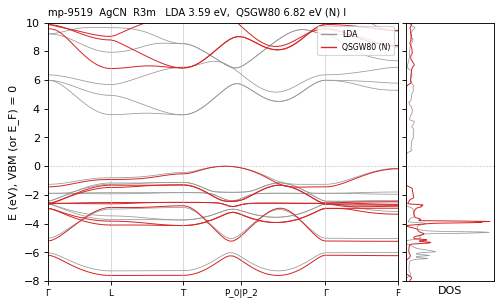

**mp-7188** Al2Os — QSGW80 **0.98** N / M ≈ · path 0.79 eV I path<mesh(mesh) — ecalj b695fa65c (tf32, t_tetrakbt -300)

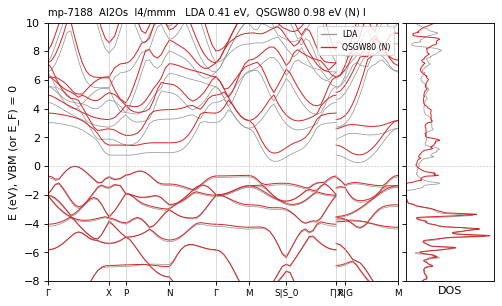

**mp-29196** AuCN — QSGW80 **3.82** N / M 3.88 eV I differs — ecalj b695fa65c (tf32, t_tetrakbt -300)

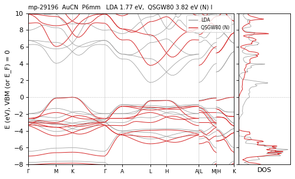

**mp-1018141** BaC2 — QSGW80 **3.29** N / M ≈ eV I  — ecalj 989a18637 (tf32, t_tetrakbt -300)

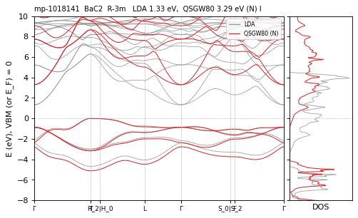

**mp-1735** BaC2 — QSGW80 **3.86** N / M ≈ eV I  — ecalj b695fa65c (tf32, t_tetrakbt -300)

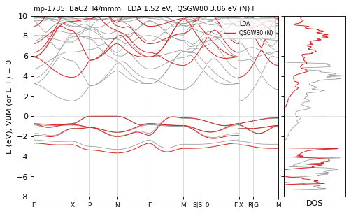

**mp-568662** BaCl2 — QSGW80 **8.00** N / R ≈ eV I  — ecalj b695fa65c (tf32, t_tetrakbt -300)

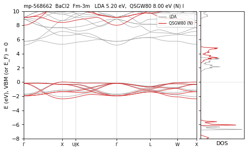

**mp-1029** BaF2 — QSGW80 **10.37** N / M 10.62 eV I CHECK — ecalj b695fa65c (tf32, t_tetrakbt -300)

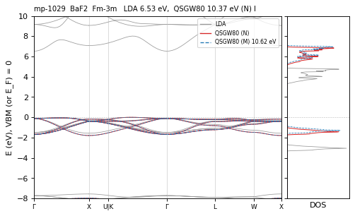

**mp-10616** BaLiAs — QSGW80 **1.39** N / M ≈ eV D  — ecalj b695fa65c (tf32, t_tetrakbt -300)

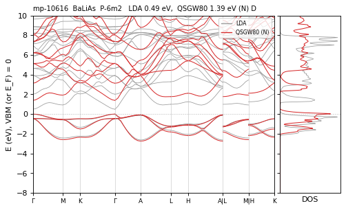

**mp-10615** BaLiP — QSGW80 **1.51** N / M ≈ eV D  — ecalj b695fa65c (tf32, t_tetrakbt -300)

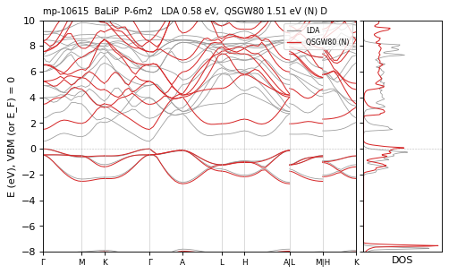

**mp-1006878** BaO2 — QSGW80 **5.17** N / M 5.01 eV I differs — ecalj b695fa65c (tf32, t_tetrakbt -300)

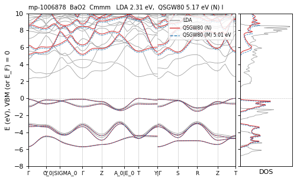

**mp-1105** BaO2 — QSGW80 **4.93** N / R ≈ eV D  — ecalj b695fa65c (tf32, t_tetrakbt -300)

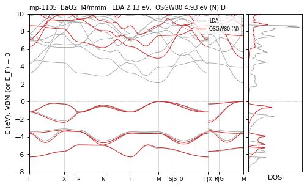

**mp-1569** Be2C — QSGW80 **2.09** N / M ≈ eV I  — ecalj b695fa65c (tf32, t_tetrakbt -300)

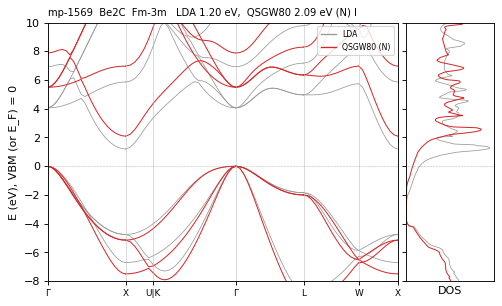

**mp-22965** BiTeI — QSGW80 **1.88** N / M ≈ eV I  — ecalj b695fa65c (tf32, t_tetrakbt -300)

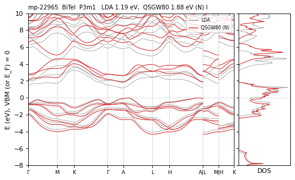

**mp-30068** CIN — QSGW80 **7.61** N / M 7.71 eV D differs — ecalj b695fa65c (tf32, t_tetrakbt -300)

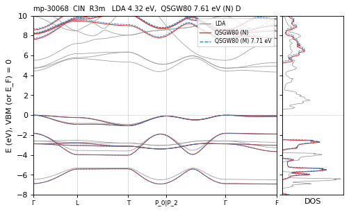

**mp-28240** CSO — QSGW80 **8.56** N / M 8.44 eV I differs — ecalj b695fa65c (tf32, t_tetrakbt -300)

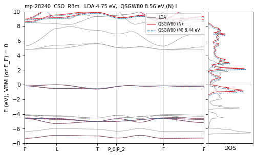

**mp-2482** CaC2 — QSGW80 **3.52** N / M ≈ eV I  — ecalj b695fa65c (tf32, t_tetrakbt -300)

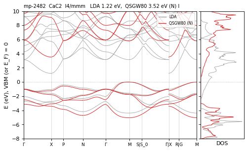

**mp-2741** CaF2 — QSGW80 **11.12** N / M 11.04 eV I differs — ecalj b695fa65c (tf32, t_tetrakbt -300)

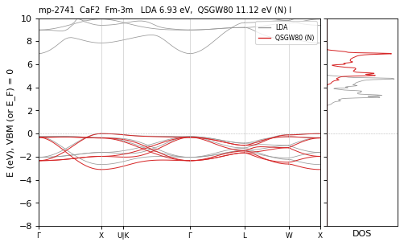

**mp-30031** CaI2 — QSGW80 **6.08** N / R ≈ eV I  — ecalj b695fa65c (tf32, t_tetrakbt -300)

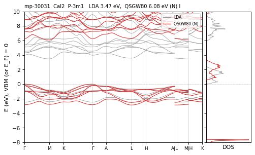

**mp-634859** CaO2 — QSGW80 **6.39** N / M 6.25 eV I differs — ecalj b695fa65c (tf32, t_tetrakbt -300)

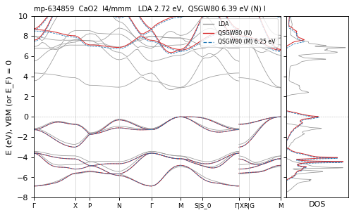

**mp-568690** CdBr2 — QSGW80 **4.86** N / R ≈ eV I  — ecalj b695fa65c (tf32, t_tetrakbt -300)

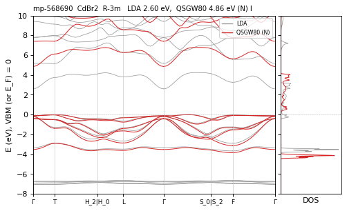

**mp-22881** CdCl2 — QSGW80 **5.99** N / R ≈ eV I  — ecalj b695fa65c (tf32, t_tetrakbt -300)

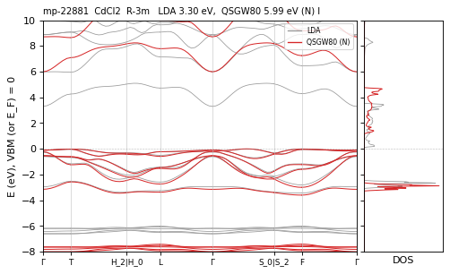

**mp-241** CdF2 — QSGW80 **6.48** N / M 6.42 eV I differs — ecalj b695fa65c (tf32, t_tetrakbt -300)

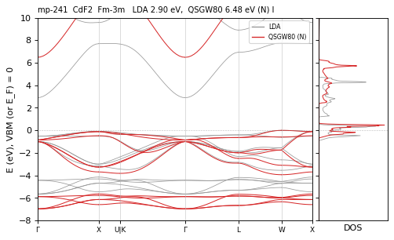

**mp-567259** CdI2 — QSGW80 **3.97** N / M ≈ eV I  — ecalj b695fa65c (tf32, t_tetrakbt -300)

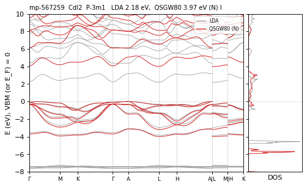

**mp-7988** Cs2O — QSGW80 **2.28** N / R ≈ eV I  — ecalj b695fa65c (tf32, t_tetrakbt -300)

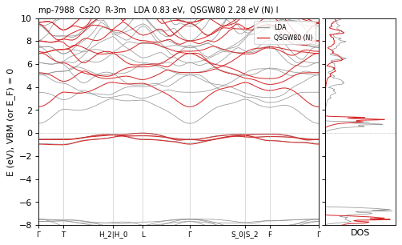

**mp-567677** GeI2 — QSGW80 **3.09** N / M ≈ · path 2.96 eV I path<mesh(mesh) — ecalj b695fa65c (tf32, t_tetrakbt -300)

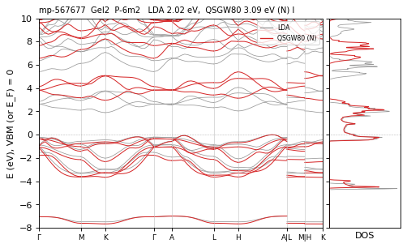

**mp-644272** HCN — QSGW80 **11.05** N / M 11.11 eV I differs — ecalj b695fa65c (tf32, t_tetrakbt -300)

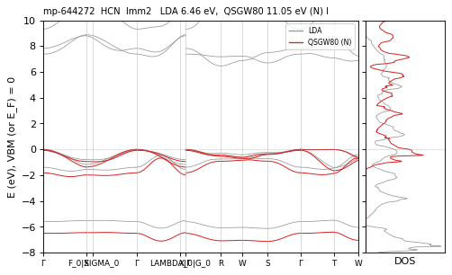

**mp-644385** HCN — QSGW80 **11.38** N / M 11.30 eV I differs — ecalj b695fa65c (tf32, t_tetrakbt -300)

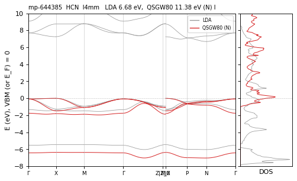

**mp-550893** HfO2 — QSGW80 **5.75** N / M 5.68 eV D differs — ecalj b695fa65c (tf32, t_tetrakbt -300)

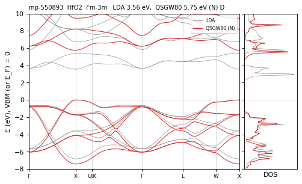

**mp-985829** HfS2 — QSGW80 **2.45** N / M ≈ eV I  — ecalj b695fa65c (tf32, t_tetrakbt -300)

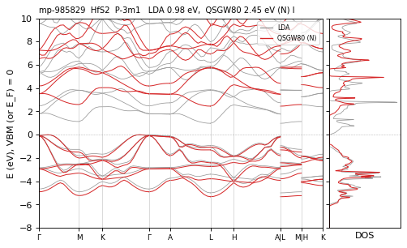

**mp-985831** HfSe2 — QSGW80 **1.62** N / M ≈ eV I  — ecalj b695fa65c (tf32, t_tetrakbt -300)

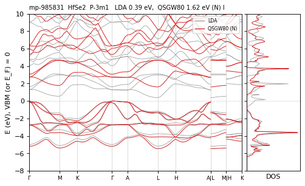

**mp-11869** HfSnPd — QSGW80 **0.45** N / M ≈ eV I  — ecalj b695fa65c (tf32, t_tetrakbt -300)

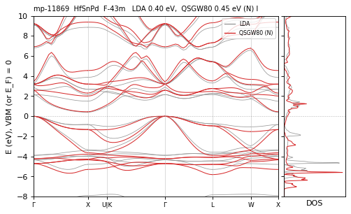

**mp-569360** Hg3 — QSGW80 **0.00** N / R ≈ eV metal  — ecalj 989a18637 (tf32, t_tetrakbt -300)

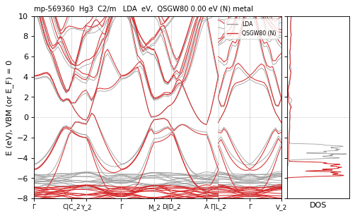

**mp-8177** HgF2 — QSGW80 **3.60** N / M 3.68 eV I differs — ecalj 989a18637 (tf32, t_tetrakbt -300)

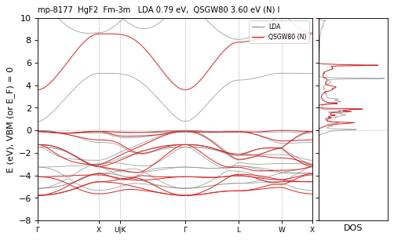

**mp-2278** HgO2 — QSGW80 **1.77** N / R ≈ eV I  — ecalj b695fa65c (tf32, t_tetrakbt -300)

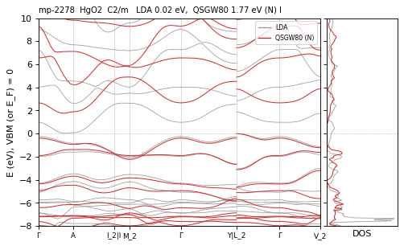

**mp-971** K2O — QSGW80 **3.98** N / M 3.84 eV I differs — ecalj b695fa65c (tf32, t_tetrakbt -300)

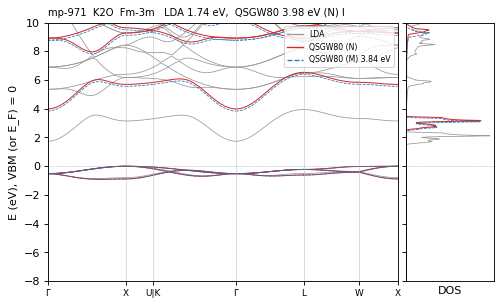

**mp-1062676** K2Pt — QSGW80 **3.05** N / M ≈ eV I  — ecalj b695fa65c (tf32, t_tetrakbt -300)

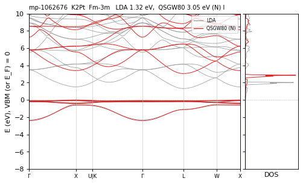

**mp-1022** K2S — QSGW80 **4.35** N / M ≈ eV I  — ecalj b695fa65c (tf32, t_tetrakbt -300)

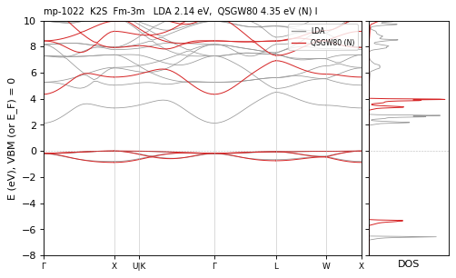

**mp-8426** K2Se — QSGW80 **4.11** N / R ≈ eV I  — ecalj b695fa65c (tf32, t_tetrakbt -300)

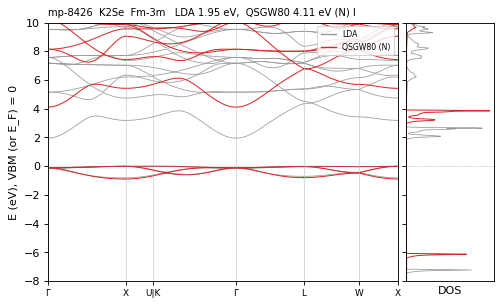

**mp-1747** K2Te — QSGW80 **3.93** N / R ≈ eV I  — ecalj b695fa65c (tf32, t_tetrakbt -300)

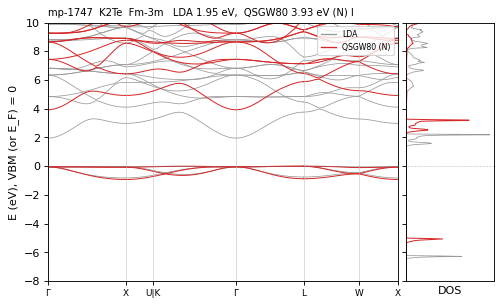

**mp-20134** KCN — QSGW80 **8.75** N / M 8.69 eV I differs — ecalj b695fa65c (tf32, t_tetrakbt -300)

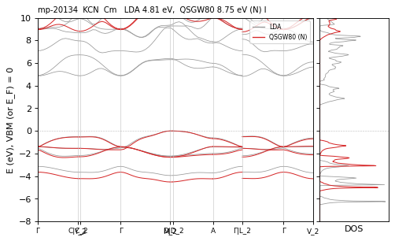

**mp-15687** KZnAs — QSGW80 **1.30** N / R ≈ eV I  — ecalj b695fa65c (tf32, t_tetrakbt -300)

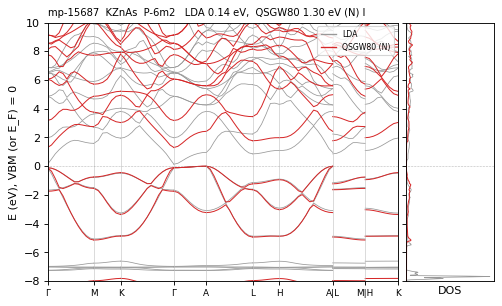

**mp-10161** KZnSb — QSGW80 **1.39** N / M ≈ eV I  — ecalj b695fa65c (tf32, t_tetrakbt -300)

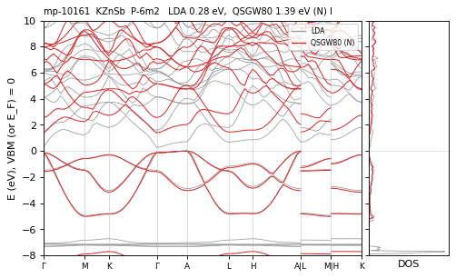

**mp-1960** Li2O — QSGW80 **7.97** N / M 8.08 eV I differs — ecalj b695fa65c (tf32, t_tetrakbt -300)

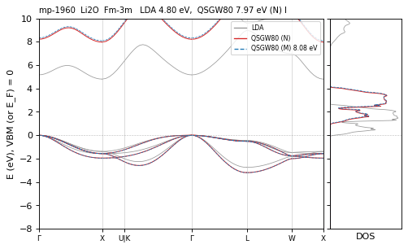

**mp-1153** Li2S — QSGW80 **5.29** N / M ≈ eV I  — ecalj b695fa65c (tf32, t_tetrakbt -300)

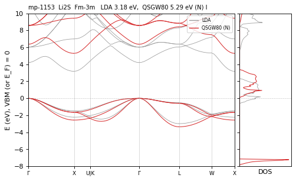

**mp-2286** Li2Se — QSGW80 **4.67** N / M 4.58 eV I differs — ecalj b695fa65c (tf32, t_tetrakbt -300)

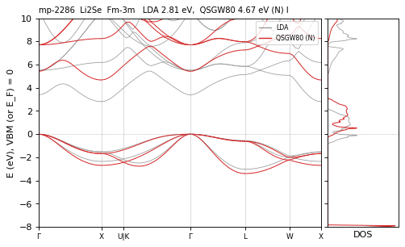

**mp-2530** Li2Te — QSGW80 **3.83** N / M ≈ eV I  — ecalj b695fa65c (tf32, t_tetrakbt -300)

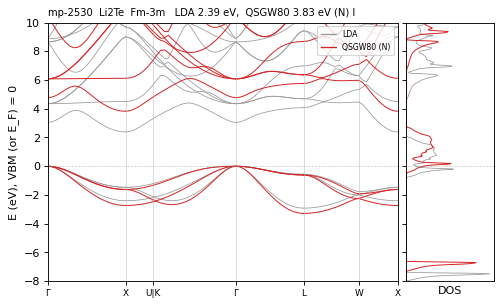

**mp-5920** LiAlGe — QSGW80 **0.47** N / M ≈ eV I  — ecalj b695fa65c (tf32, t_tetrakbt -300)

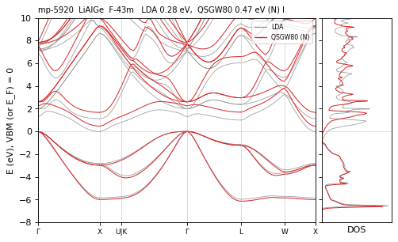

**mp-3161** LiAlSi — QSGW80 **0.48** N / M ≈ eV I  — ecalj b695fa65c (tf32, t_tetrakbt -300)

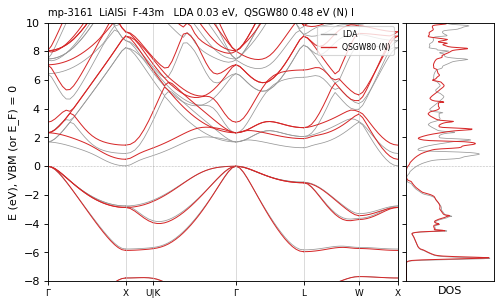

**mp-11390** LiGaSi — QSGW80 **0.54** N / M ≈ eV I  — ecalj b695fa65c (tf32, t_tetrakbt -300)

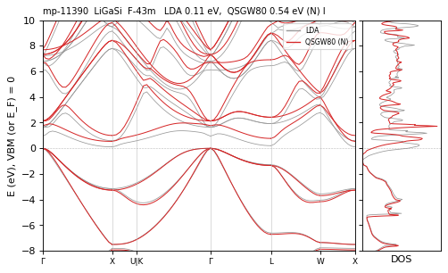

**mp-12558** LiMgAs — QSGW80 **2.29** N / M ≈ eV I  — ecalj b695fa65c (tf32, t_tetrakbt -300)

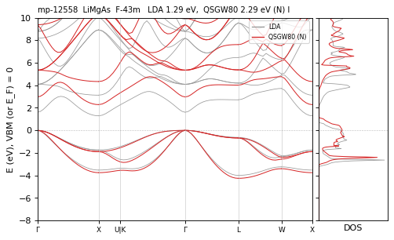

**mp-570213** LiMgBi — QSGW80 **1.39** N / M ≈ eV D  — ecalj b695fa65c (tf32, t_tetrakbt -300)

**mp-9124** LiZnAs — QSGW80 **1.70** N / M ≈ eV D  — ecalj b695fa65c (tf32, t_tetrakbt -300)

**mp-7575** LiZnN — QSGW80 **2.02** N / M ≈ eV D  — ecalj b695fa65c (tf32, t_tetrakbt -300)

**mp-10182** LiZnP — QSGW80 **1.93** N / M ≈ eV I  — ecalj b695fa65c (tf32, t_tetrakbt -300)

**mp-408** Mg2Ge — QSGW80 **0.65** N / M ≈ eV I  — ecalj b695fa65c (tf32, t_tetrakbt -300)

**mp-1367** Mg2Si — QSGW80 **0.63** N / M ≈ eV I  — ecalj b695fa65c (tf32, t_tetrakbt -300)

**mp-30034** MgBr2 — QSGW80 **6.88** N / M 6.96 eV D differs — ecalj b695fa65c (tf32, t_tetrakbt -300)

**mp-570259** MgCl2 — QSGW80 **8.48** N / M 8.38 eV D differs — ecalj 989a18637 (tf32, t_tetrakbt -300)

**mp-23205** MgI2 — QSGW80 **5.56** N / M ≈ eV I  — ecalj b695fa65c (tf32, t_tetrakbt -300)

**mp-1434** MoS2 — QSGW80 **1.76** N / M 1.71 · path 1.58 eV I differs path<mesh(mesh) — ecalj b695fa65c (tf32, t_tetrakbt -300)

**mp-2352** Na2O — QSGW80 **4.82** N / M 4.99 eV D differs — ecalj b695fa65c (tf32, t_tetrakbt -300)

**mp-648** Na2S — QSGW80 **4.68** N / M ≈ eV D  — ecalj b695fa65c (tf32, t_tetrakbt -300)

**mp-1266** Na2Se — QSGW80 **4.13** N / M ≈ eV D  — ecalj b695fa65c (tf32, t_tetrakbt -300)

**mp-2784** Na2Te — QSGW80 **3.81** N / M ≈ eV D  — ecalj b695fa65c (tf32, t_tetrakbt -300)

**mp-9437** NbFeSb — QSGW80 **0.80** N / M ≈ eV I  — ecalj b695fa65c (tf32, t_tetrakbt -300)

**mp-505297** NbSbRu — QSGW80 **0.68** N / R ≈ eV I  — ecalj b695fa65c (tf32, t_tetrakbt -300)

**mp-25210** NiO2 — QSGW80 **2.52** N / R ≈ eV I  — ecalj b695fa65c (tf32, t_tetrakbt -300)

**mp-35925** NiO2 — QSGW80 **3.82** N / R ≈ eV I  — ecalj b695fa65c (tf32, t_tetrakbt -300)

**mp-510753** NiO2 — QSGW80 **2.35** N / M 2.42 eV I differs — ecalj b695fa65c (tf32, t_tetrakbt -300)

**mp-315** PbF2 — QSGW80 **6.91** N / M ≈ eV I  — ecalj b695fa65c (tf32, t_tetrakbt -300)

**mp-22883** PbI2 — QSGW80 **3.55** N / R ≈ eV D  — ecalj b695fa65c (tf32, t_tetrakbt -300)

**mp-22893** PbI2 — QSGW80 **3.48** N / M ≈ eV D  — ecalj b695fa65c (tf32, t_tetrakbt -300)

**mp-617** PtO2 — QSGW80 **3.00** N / M ≈ eV I  — ecalj b695fa65c (tf32, t_tetrakbt -300)

**mp-762** PtS2 — QSGW80 **1.78** N / M ≈ eV I  — ecalj b695fa65c (tf32, t_tetrakbt -300)

**mp-1115** PtSe2 — QSGW80 **0.87** N / M ≈ eV I  — ecalj b695fa65c (tf32, t_tetrakbt -300)

**mp-1394** Rb2O — QSGW80 **3.33** N / R ≈ eV I  — ecalj b695fa65c (tf32, t_tetrakbt -300)

**mp-8041** Rb2S — QSGW80 **3.92** N / R ≈ eV I  — ecalj b695fa65c (tf32, t_tetrakbt -300)

**mp-11327** Rb2Se — QSGW80 **3.70** N / R ≈ eV I  — ecalj b695fa65c (tf32, t_tetrakbt -300)

**mp-441** Rb2Te — QSGW80 **3.70** N / R ≈ eV I  — ecalj b695fa65c (tf32, t_tetrakbt -300)

**mp-30459** ScNiBi — QSGW80 **0.35** N / M ≈ eV I  — ecalj b695fa65c (tf32, t_tetrakbt -300)

**mp-3432** ScNiSb — QSGW80 **0.50** N / M ≈ eV I  — ecalj b695fa65c (tf32, t_tetrakbt -300)

**mp-569779** ScSbPd — QSGW80 **0.40** N / M ≈ eV I  — ecalj b695fa65c (tf32, t_tetrakbt -300)

**mp-7173** ScSbPt — QSGW80 **0.81** N / M ≈ eV I  — ecalj b695fa65c (tf32, t_tetrakbt -300)

**mp-2894** ScSnAu — QSGW80 **0.14** N / M ≈ / R ≈ eV I  — ecalj 989a18637 (tf32, t_tetrakbt -300)

**mp-14** Se3 — QSGW80 **2.14** N / M ≈ · path 2.03 eV I path<mesh(mesh) — ecalj b695fa65c (tf32, t_tetrakbt -300)

**mp-1170** SnS2 — QSGW80 **2.69** N / M ≈ eV I  — ecalj b695fa65c (tf32, t_tetrakbt -300)

**mp-665** SnSe2 — QSGW80 **1.50** N / M ≈ eV I  — ecalj b695fa65c (tf32, t_tetrakbt -300)

**mp-2630** SrC2 — QSGW80 **3.83** N / M ≈ eV I  — ecalj 989a18637 (tf32, t_tetrakbt -300)

**mp-23209** SrCl2 — QSGW80 **7.82** N / R ≈ eV I  — ecalj b695fa65c (tf32, t_tetrakbt -300)

**mp-981** SrF2 — QSGW80 **10.82** N / M 10.64 eV I differs — ecalj b695fa65c (tf32, t_tetrakbt -300)

**mp-10614** SrLiP — QSGW80 **1.60** N / M ≈ eV I  — ecalj b695fa65c (tf32, t_tetrakbt -300)

**mp-2697** SrO2 — QSGW80 **5.76** N / R ≈ eV D  — ecalj b695fa65c (tf32, t_tetrakbt -300)

**mp-31454** TaSbRu — QSGW80 **1.04** N / M ≈ eV I  — ecalj b695fa65c (tf32, t_tetrakbt -300)

**mp-19** Te3 — QSGW80 **0.90** N / M ≈ · path 0.64 eV I path<mesh(mesh) — ecalj b695fa65c (tf32, t_tetrakbt -300)

**mp-5967** TiCoSb — QSGW80 **1.30** N / M ≈ eV I  — ecalj b695fa65c (tf32, t_tetrakbt -300)

**mp-1008680** TiGePt — QSGW80 **1.23** N / M ≈ eV I  — ecalj b695fa65c (tf32, t_tetrakbt -300)

**mp-924130** TiNiSn — QSGW80 **0.59** N / M ≈ eV I  — ecalj b695fa65c (tf32, t_tetrakbt -300)

**mp-1062030** TiS2 — QSGW80 **2.32** M eV I vs2025 — ecalj 2026-04/05 (~/bin2, all-TF32 --mp)

**mp-30847** TiSnPt — QSGW80 **1.06** N / M ≈ eV I  — ecalj b695fa65c (tf32, t_tetrakbt -300)

**mp-567636** VFeSb — QSGW80 **0.57** N / M ≈ eV I  — ecalj b695fa65c (tf32, t_tetrakbt -300)

**mp-31455** VSbRu — QSGW80 **0.42** N / M ≈ eV I  — ecalj b695fa65c (tf32, t_tetrakbt -300)

**mp-9813** WS2 — QSGW80 **2.00** N / R ≈ · path 1.78 eV I path<mesh(mesh) — ecalj b695fa65c (tf32, t_tetrakbt -300)

**mp-28797** YHSe — QSGW80 **2.51** N / M ≈ eV I  — ecalj b695fa65c (tf32, t_tetrakbt -300)

**mp-30460** YNiBi — QSGW80 **0.46** N / M ≈ eV I  — ecalj b695fa65c (tf32, t_tetrakbt -300)

**mp-11520** YNiSb — QSGW80 **0.60** N / M ≈ eV I  — ecalj b695fa65c (tf32, t_tetrakbt -300)

**mp-4964** YSbPt — QSGW80 **0.61** N / M ≈ eV D  — ecalj b695fa65c (tf32, t_tetrakbt -300)

**mp-569960** ZnBr2 — QSGW80 **5.54** N / R ≈ eV I  — ecalj b695fa65c (tf32, t_tetrakbt -300)

**mp-1008601** ZrAg2 — QSGW80 **0.04** N / M ≈ eV metal  — ecalj b695fa65c (tf32, t_tetrakbt -300)

**mp-23162** ZrCl2 — QSGW80 **1.90** N / M ≈ · path 1.73 eV I path<mesh(mesh) — ecalj 989a18637 (tf32, t_tetrakbt -300)

**mp-31451** ZrCoBi — QSGW80 **1.15** N / M ≈ eV I  — ecalj b695fa65c (tf32, t_tetrakbt -300)

**mp-1565** ZrO2 — QSGW80 **5.30** N / M ≈ eV I  — ecalj b695fa65c (tf32, t_tetrakbt -300)

**mp-1186** ZrS2 — QSGW80 **2.18** N / M ≈ eV I  — ecalj b695fa65c (tf32, t_tetrakbt -300)

**mp-2076** ZrSe2 — QSGW80 **1.38** N / M ≈ eV I  — ecalj b695fa65c (tf32, t_tetrakbt -300)

**mp-22689** ZrSnPd — QSGW80 **0.26** N / M ≈ eV I  — ecalj b695fa65c (tf32, t_tetrakbt -300)

