# GW1500 QSGW80 — bands and DOS, 4 atoms per cell

[README](README.md) · [table](table.md)

Gray: LDA. Red: QSGW80 adopted (condition in parentheses). Blue dashed: another QSGW80 result when its gap differs by more than 0.1 eV. Energies from the VBM (insulators) or E_F (metals). Right: total DOS.

**mp-570301** Ag2Br2 — QSGW80 **2.42** N / M ≈ eV I  — ecalj b695fa65c (tf32, t_tetrakbt -300)

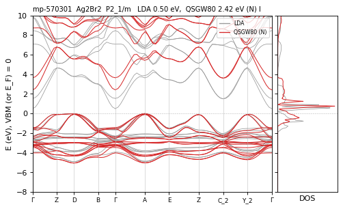

**mp-570687** Ag2Cl2 — QSGW80 **2.82** N / M ≈ eV I  — ecalj b695fa65c (tf32, t_tetrakbt -300)

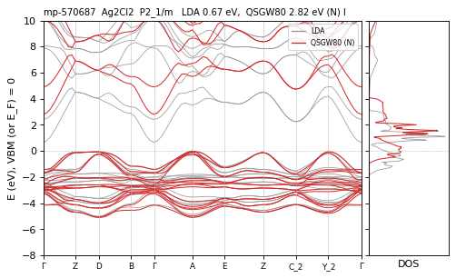

**mp-570858** Ag2Cl2 — QSGW80 **2.24** N / M ≈ eV I  — ecalj 989a18637 (tf32, t_tetrakbt -300)

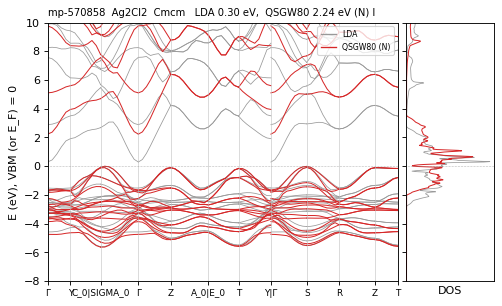

**mp-22894** Ag2I2 — QSGW80 **3.03** N / M 3.09 eV D differs — ecalj 989a18637 (tf32, t_tetrakbt -300)

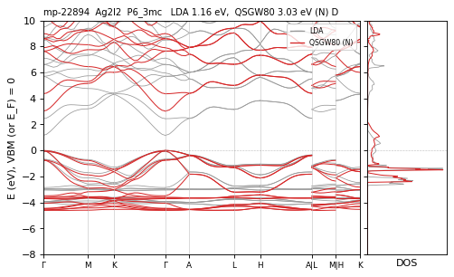

**mp-567809** Ag2I2 — QSGW80 **2.93** N / M ≈ eV D  — ecalj b695fa65c (tf32, t_tetrakbt -300)

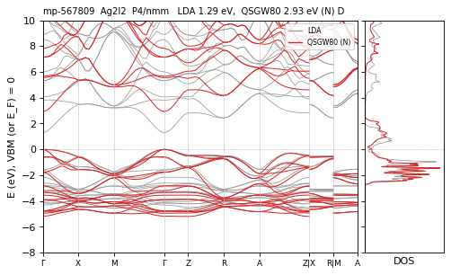

**mp-568927** Ag2I2 — QSGW80 **2.16** M eV I  — ecalj 2026-04/05 (~/bin2, all-TF32 --mp)

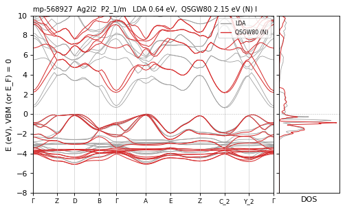

**mp-29678** AgBiS2 — QSGW80 **0.96** N / M ≈ eV I  — ecalj b695fa65c (tf32, t_tetrakbt -300)

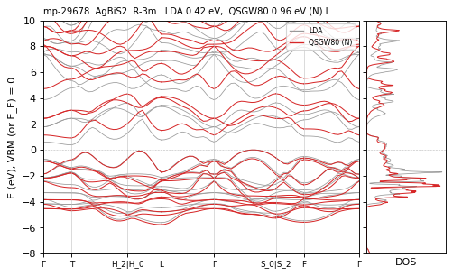

**mp-5770** AgNO2 — QSGW80 **4.97** R eV I  — ecalj 989a18637 (fp32, t_tetrakbt +300)

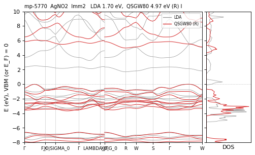

**mp-1018033** AgRhO2 — QSGW80 **1.77** N / M 1.56 · path 1.64 eV I CHECK path<mesh(mesh) — ecalj 989a18637 (tf32, t_tetrakbt -300)

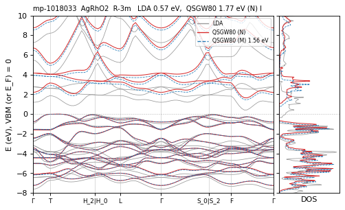

**mp-661** Al2N2 — QSGW80 **6.07** M eV D  — ecalj 2026-04/05 (~/bin2, all-TF32 --mp)

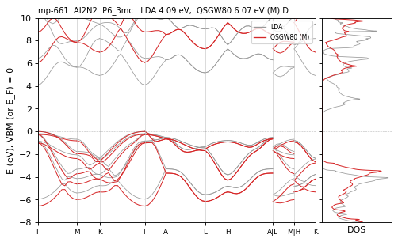

**mp-7885** AlAgS2 — QSGW80 **2.87** N / M ≈ eV I  — ecalj b695fa65c (tf32, t_tetrakbt -300)

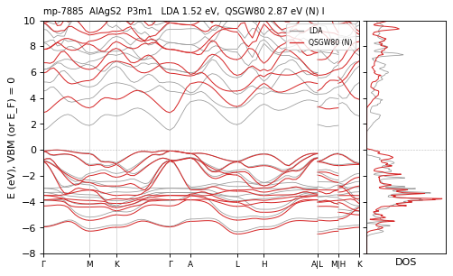

**mp-3748** AlCuO2 — QSGW80 **3.34** M eV I  — ecalj 2026-04/05 (~/bin2, all-TF32 --mp)

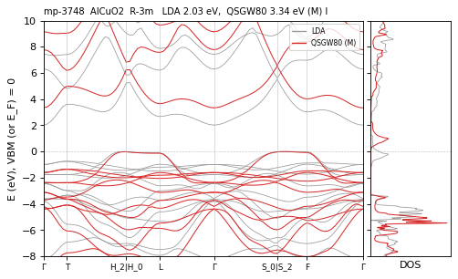

**mp-8039** AlF3 — QSGW80 **12.84** R eV I  — ecalj 989a18637 (fp32, t_tetrakbt +300)

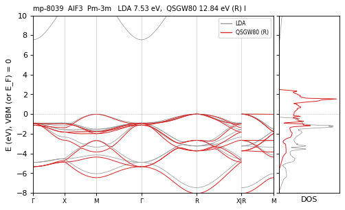

**mp-2793** Au2Se2 — QSGW80 **0.64** N / M ≈ · path 0.54 eV I path<mesh(mesh) — ecalj b695fa65c (tf32, t_tetrakbt -300)

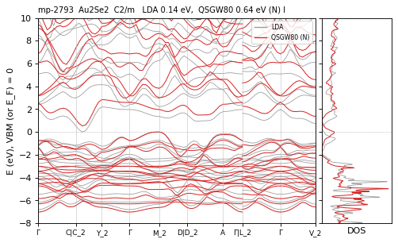

**mp-2653** B2N2 — QSGW80 **7.50** N / M ≈ · path 7.16 eV I path<mesh(mesh) — ecalj b695fa65c (tf32, t_tetrakbt -300)

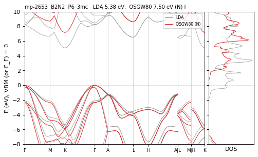

**mp-7991** B2N2 — QSGW80 **6.54** M · path 6.30 eV I path<mesh(mesh) vs2025 — ecalj 2026-04/05 (~/bin2, all-TF32 --mp)

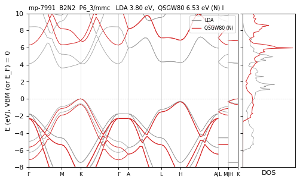

**mp-984** B2N2 — QSGW80 **6.54** M · path 6.41 eV I path<mesh(mesh) vs2025 — ecalj 2026-04/05 (~/bin2, all-TF32 --mp)

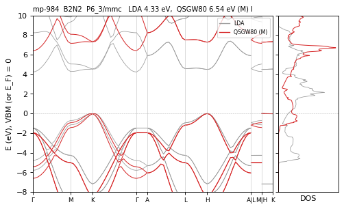

**mp-1008559** B2P2 — QSGW80 **1.96** N / M ≈ · path 1.75 eV I path<mesh(mesh) — ecalj b695fa65c (tf32, t_tetrakbt -300)

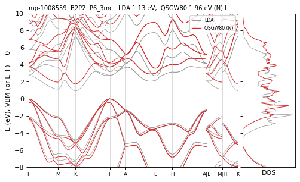

**mp-1018098** Ba2BrN — QSGW80 **2.32** R eV D  — ecalj 989a18637 (fp32, t_tetrakbt +300)

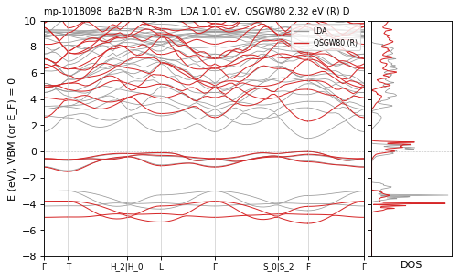

**mp-1018099** Ba2NCl — QSGW80 **2.36** N / M 2.22 eV D differs — ecalj b695fa65c (tf32, t_tetrakbt -300)

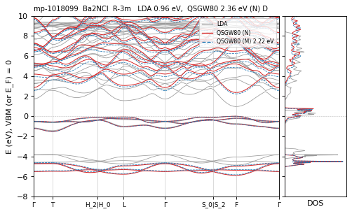

**mp-1018096** Ba2NF — QSGW80 **2.36** N / M 2.11 eV D CHECK — ecalj b695fa65c (tf32, t_tetrakbt -300)

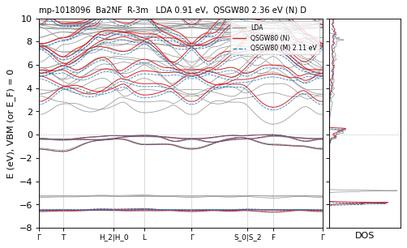

**mp-1008500** Ba2O2 — QSGW80 **4.34** N / M 4.28 eV I differs — ecalj b695fa65c (tf32, t_tetrakbt -300)

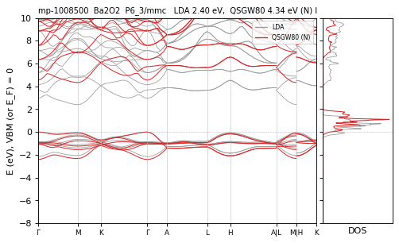

**mp-7487** Ba2O2 — QSGW80 **4.27** N / M ≈ eV I  — ecalj b695fa65c (tf32, t_tetrakbt -300)

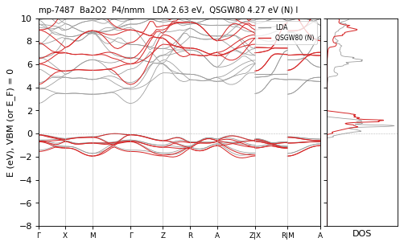

**mp-27869** Ba2PCl — QSGW80 **2.42** M eV D N:FAIL(1) — ecalj 2026-04/05 (~/bin2, all-TF32 --mp)

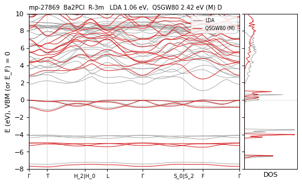

**mp-1008505** Ba2Pd2 — QSGW80 **0.30** N / M ≈ · path 0 (semimetal?) eV  path-metal — ecalj b695fa65c (tf32, t_tetrakbt -300)

*the bands cross E_F on the path while the mesh gives 0.29 eV*

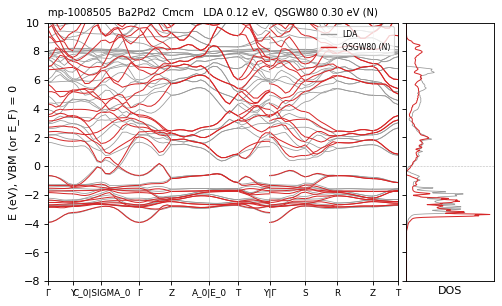

**mp-1207108** BaAlGeH — QSGW80 **1.36** N / R ≈ eV I  — ecalj b695fa65c (tf32, t_tetrakbt -300)

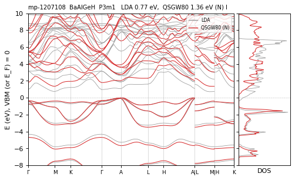

**mp-571093** BaAlSiH — QSGW80 **1.33** N / M ≈ eV I  — ecalj b695fa65c (tf32, t_tetrakbt -300)

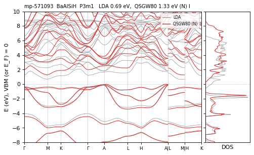

**mp-1018095** BaGaGeH — QSGW80 **0.69** M eV D  — ecalj 2026-04/05 (~/bin2, all-TF32 --mp)

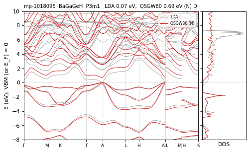

**mp-1018094** BaGaSnH — QSGW80 **0.66** N / M 0.57 eV D differs — ecalj b695fa65c (tf32, t_tetrakbt -300)

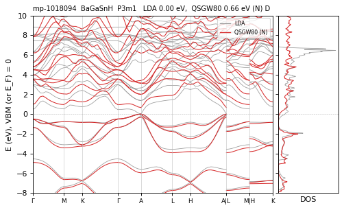

**mp-3915** BaHgO2 — QSGW80 **4.62** R eV I  — ecalj 989a18637 (fp32, t_tetrakbt +300)

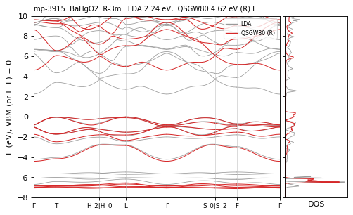

**mp-2542** Be2O2 — QSGW80 **10.96** M eV D  — ecalj 2026-04/05 (~/bin2, all-TF32 --mp)

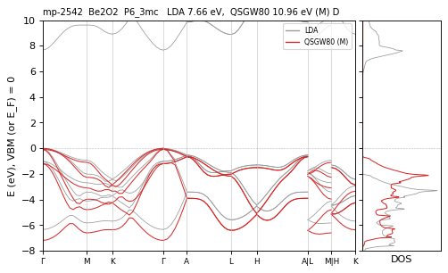

**mp-23301** BiF3 — QSGW80 **6.41** N / M ≈ · path 6.30 eV I path<mesh(mesh) — ecalj 989a18637 (tf32, t_tetrakbt -300)

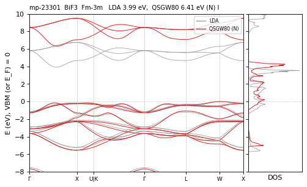

**mp-1066781** Br2Cl2 — QSGW80 **4.37** M eV I  — ecalj 2026-04/05 (~/bin2, all-TF32 --mp)

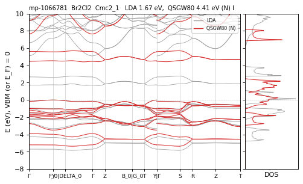

**mp-23154** Br4 — QSGW80 **3.51** N / M 3.72 eV I CHECK — ecalj 989a18637 (tf32, t_tetrakbt -300)

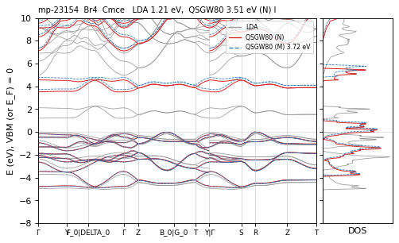

**mp-2516584** C4 — QSGW80 **2.40** M · path 0 (semimetal?) eV  path-metal vs2025 — ecalj 2026-04/05 (~/bin2, all-TF32 --mp)

*graphite-like: the bands cross E_F on the path, which the 8x8x8 mesh misses; a semimetal, the gap on the mesh is not physical*

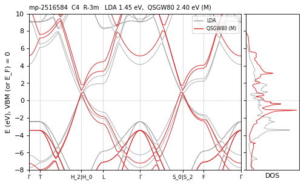

**mp-47** C4 — QSGW80 **5.23** N / M ≈ · path 4.84 eV I path<mesh(mesh) vs2025 — ecalj b695fa65c (tf32, t_tetrakbt -300)

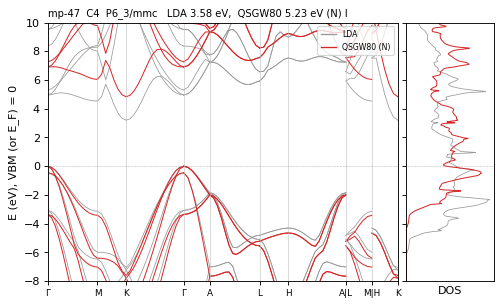

**mp-569304** C4 — QSGW80 **3.68** R · path 0 (semimetal?) eV  path-metal LDA≠PBE vs2025 — ecalj 989a18637 (fp32, t_tetrakbt +300)

*graphite-like fragment (invalid structure); the bands cross E_F on the path*

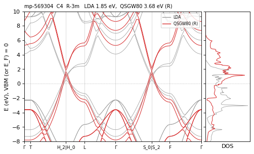

**mp-28554** Ca2AsI — QSGW80 **2.84** M eV I  — ecalj 2026-04/05 (~/bin2, all-TF32 --mp)

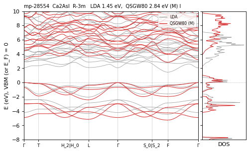

**mp-23009** Ca2BrN — QSGW80 **3.87** M eV I  — ecalj 2026-04/05 (~/bin2, all-TF32 --mp)

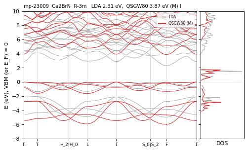

**mp-22936** Ca2NCl — QSGW80 **4.15** R eV I  — ecalj 989a18637 (fp32, t_tetrakbt +300)

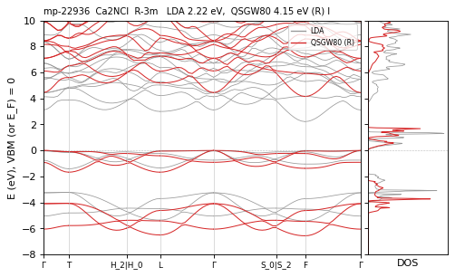

**mp-23040** Ca2PI — QSGW80 **2.94** R eV I  — ecalj 989a18637 (fp32, t_tetrakbt +300)

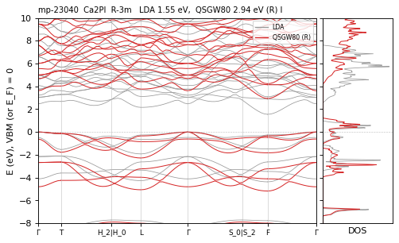

**mp-568177** CaAlSiH — QSGW80 **1.03** N / M ≈ eV I  — ecalj b695fa65c (tf32, t_tetrakbt -300)

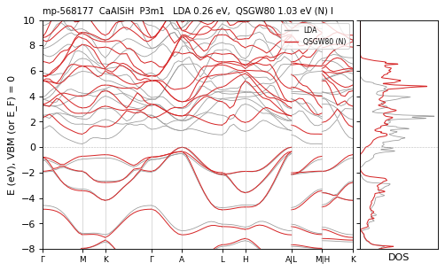

**mp-4124** CaCN2 — QSGW80 **5.48** N / R ≈ eV I  — ecalj b695fa65c (tf32, t_tetrakbt -300)

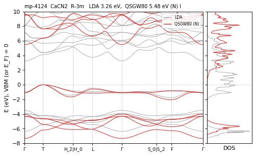

**mp-7041** CaHgO2 — QSGW80 **4.44** N / R ≈ eV I  — ecalj b695fa65c (tf32, t_tetrakbt -300)

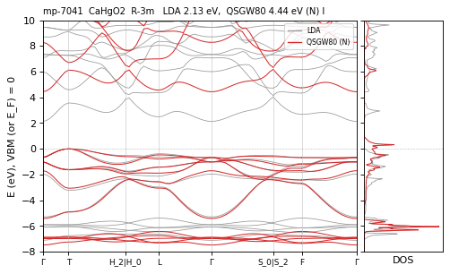

**mp-672** Cd2S2 — QSGW80 **2.41** N / M ≈ eV D  — ecalj b695fa65c (tf32, t_tetrakbt -300)

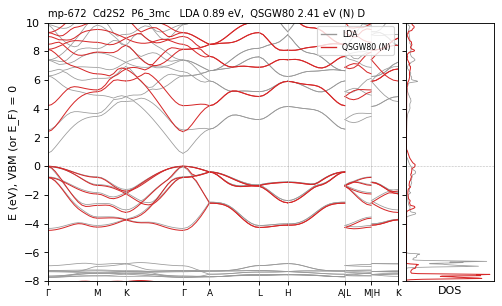

**mp-1070** Cd2Se2 — QSGW80 **1.78** M eV D  — ecalj 2026-04/05 (~/bin2, all-TF32 --mp)

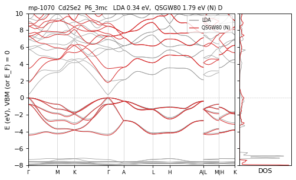

**mp-12779** Cd2Te2 — QSGW80 **1.72** M eV D  — ecalj 2026-04/05 (~/bin2, all-TF32 --mp)

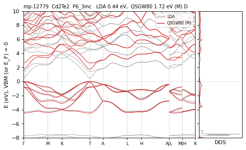

**mp-10969** CdCN2 — QSGW80 **3.82** N / R ≈ eV I  — ecalj b695fa65c (tf32, t_tetrakbt -300)

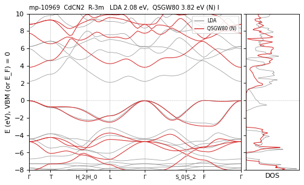

**mp-9146** CdHgO2 — QSGW80 **2.02** M eV I  — ecalj 2026-04/05 (~/bin2, all-TF32 --mp)

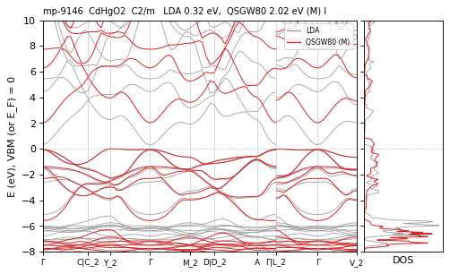

**mp-22848** Cl4 — QSGW80 **5.86** N / M 5.79 eV D differs — ecalj b695fa65c (tf32, t_tetrakbt -300)

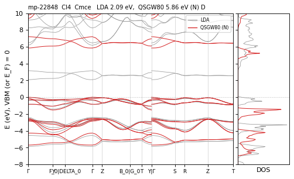

**mp-7896** Cs2O2 — QSGW80 **4.01** N / M 3.95 eV I differs — ecalj b695fa65c (tf32, t_tetrakbt -300)

**mp-29266** Cs2S2 — QSGW80 **3.90** M eV I  — ecalj 2026-04/05 (~/bin2, all-TF32 --mp)

**mp-635413** Cs3Bi — QSGW80 **1.07** M eV I  — ecalj 2026-04/05 (~/bin2, all-TF32 --mp)

**mp-10378** Cs3Sb — QSGW80 **1.66** M eV I  — ecalj 2026-04/05 (~/bin2, all-TF32 --mp)

**mp-1065405** CsAuC2 — QSGW80 **4.04** M eV I  — ecalj 2026-04/05 (~/bin2, all-TF32 --mp)

**mp-28650** CsBr2F — QSGW80 **4.67** N / M ≈ eV I  — ecalj b695fa65c (tf32, t_tetrakbt -300)

**mp-22990** CsICl2 — QSGW80 **4.98** M eV I  — ecalj 2026-04/05 (~/bin2, all-TF32 --mp)

**mp-581024** CsK2Sb — QSGW80 **2.02** M eV D  — ecalj 2026-04/05 (~/bin2, all-TF32 --mp)

**mp-22917** Cu2Br2 — QSGW80 **2.84** N / M 2.78 eV D differs — ecalj b695fa65c (tf32, t_tetrakbt -300)

**mp-23227** Cu2Br2 — QSGW80 **2.31** N / M ≈ eV D  — ecalj 989a18637 (tf32, t_tetrakbt -300)

**mp-24093** Cu2H2 — QSGW80 **1.36** N / M ≈ eV I  — ecalj b695fa65c (tf32, t_tetrakbt -300)

**mp-1007922** Cu2I2 — QSGW80 **2.54** N / M ≈ eV D  — ecalj b695fa65c (tf32, t_tetrakbt -300)

**mp-22863** Cu2I2 — QSGW80 **3.10** N / M 3.03 eV D differs — ecalj b695fa65c (tf32, t_tetrakbt -300)

**mp-569346** Cu2I2 — QSGW80 **2.83** N / M ≈ eV D  — ecalj b695fa65c (tf32, t_tetrakbt -300)

**mp-1933** Cu3N — QSGW80 **0.86** N / M ≈ eV I  — ecalj b695fa65c (tf32, t_tetrakbt -300)

**mp-29643** CuAsSe2 — QSGW80 **0.95** M · path 0.53 eV I path<mesh(mesh) — ecalj 2026-04/05 (~/bin2, all-TF32 --mp)

**mp-672285** CuCSN — QSGW80 **3.60** N / M 3.29 eV I CHECK — ecalj b695fa65c (tf32, t_tetrakbt -300)

**mp-14116** CuRhO2 — QSGW80 **2.03** N / M 1.94 eV I differs — ecalj 989a18637 (tf32, t_tetrakbt -300)

**mp-561203** F4 — QSGW80 **9.93** R eV D  — ecalj 989a18637 (fp32, t_tetrakbt +300)

**mp-804** Ga2N2 — QSGW80 **3.29** M eV D  — ecalj 2026-04/05 (~/bin2, all-TF32 --mp)

**mp-1018275** Ga2P2 — QSGW80 **1.42** M eV I  — ecalj 2026-04/05 (~/bin2, all-TF32 --mp)

**mp-9889** Ga2S2 — QSGW80 **2.98** R eV D  — ecalj 989a18637 (fp32, t_tetrakbt +300)

**mp-11342** Ga2Se2 — QSGW80 **2.58** M eV D  — ecalj 2026-04/05 (~/bin2, all-TF32 --mp)

**mp-4280** GaCuO2 — QSGW80 **2.59** N / M 2.08 eV I CHECK — ecalj 989a18637 (tf32, t_tetrakbt -300)

**mp-632229** H2Br2 — QSGW80 **7.78** N / M 7.69 eV D differs — ecalj b695fa65c (tf32, t_tetrakbt -300)

**mp-632326** H2Cl2 — QSGW80 **9.30** N / M ≈ eV D  — ecalj b695fa65c (tf32, t_tetrakbt -300)

**mp-632296** H2F2 — QSGW80 **12.25** N / R ≈ eV D  — ecalj b695fa65c (tf32, t_tetrakbt -300)

**mp-24504** H4 — QSGW80 **15.75** N / M ≈ eV D vs2025 — ecalj 989a18637 (tf32, t_tetrakbt -300)

*2025 values equal to LDA (the 2025 QSGW of H4 had not run)*

**mp-23177** Hg2Br2 — QSGW80 **3.60** N / M ≈ · path 3.50 eV I path<mesh(mesh) — ecalj b695fa65c (tf32, t_tetrakbt -300)

**mp-22897** Hg2Cl2 — QSGW80 **4.07** M eV I  — ecalj 2026-04/05 (~/bin2, all-TF32 --mp)

**mp-706** Hg2F2 — QSGW80 **2.89** R eV I  — ecalj 989a18637 (fp32, t_tetrakbt +300)

**mp-22859** Hg2I2 — QSGW80 **2.91** N / M 2.85 eV I differs — ecalj b695fa65c (tf32, t_tetrakbt -300)

**mp-1525634** I4 — QSGW80 **2.13** N / M ≈ eV I  — ecalj b695fa65c (tf32, t_tetrakbt -300)

**mp-23153** I4 — QSGW80 **2.16** N / M ≈ eV I  — ecalj 989a18637 (tf32, t_tetrakbt -300)

**mp-22870** In2Br2 — QSGW80 **1.99** N / M ≈ eV I  — ecalj b695fa65c (tf32, t_tetrakbt -300)

**mp-571555** In2Cl2 — QSGW80 **2.18** M eV I  — ecalj 2026-04/05 (~/bin2, all-TF32 --mp)

**mp-571636** In2Cl2 — QSGW80 **2.52** N / M 2.47 eV I differs — ecalj 989a18637 (tf32, t_tetrakbt -300)

**mp-23202** In2I2 — QSGW80 **2.14** N / M ≈ eV I  — ecalj b695fa65c (tf32, t_tetrakbt -300)

**mp-21405** In2Se2 — QSGW80 **1.89** M eV I  — ecalj 2026-04/05 (~/bin2, all-TF32 --mp)

**mp-22691** In2Se2 — QSGW80 **1.28** M eV D  — ecalj 2026-04/05 (~/bin2, all-TF32 --mp)

**mp-22660** InAgO2 — QSGW80 **1.98** R eV I  — ecalj 989a18637 (fp32, t_tetrakbt +300)

**mp-20162** InAgS2 — QSGW80 **0.81** N / M 0.73 eV D differs — ecalj b695fa65c (tf32, t_tetrakbt -300)

**mp-20930** InCuO2 — QSGW80 **1.96** N / R ≈ eV I  — ecalj b695fa65c (tf32, t_tetrakbt -300)

**mp-568516** K3Bi — QSGW80 **0.96** N / M ≈ eV D  — ecalj b695fa65c (tf32, t_tetrakbt -300)

**mp-10159** K3Sb — QSGW80 **1.72** M eV D  — ecalj 2026-04/05 (~/bin2, all-TF32 --mp)

**mp-10102** KAgC2 — QSGW80 **4.58** M eV I  — ecalj 2026-04/05 (~/bin2, all-TF32 --mp)

**mp-10423** KAuC2 — QSGW80 **3.93** N / M ≈ / R ≈ eV I  — ecalj 989a18637 (tf32, t_tetrakbt -300)

**mp-27418** KAuO2 — QSGW80 **3.46** M eV I  — ecalj 2026-04/05 (~/bin2, all-TF32 --mp)

**mp-34857** KNO2 — QSGW80 **7.17** R eV D  — ecalj 989a18637 (fp32, t_tetrakbt +300)

**mp-546787** KNO2 — QSGW80 **7.05** R eV I  — ecalj 989a18637 (fp32, t_tetrakbt +300)

**mp-15724** KNa2Sb — QSGW80 **1.82** N / M ≈ eV D  — ecalj b695fa65c (tf32, t_tetrakbt -300)

**mp-8188** KScO2 — QSGW80 **6.22** M eV I  — ecalj 2026-04/05 (~/bin2, all-TF32 --mp)

**mp-8175** KTlO2 — QSGW80 **2.23** N / R ≈ eV I  — ecalj b695fa65c (tf32, t_tetrakbt -300)

**mp-8409** KYO2 — QSGW80 **6.48** N / M 6.05 eV D CHECK — ecalj b695fa65c (tf32, t_tetrakbt -300)

**mp-1006888** KYS2 — QSGW80 **4.02** N / M 3.42 / R ≈ eV I CHECK — ecalj 989a18637 (tf32, t_tetrakbt -300)

**mp-16763** KYTe2 — QSGW80 **2.44** R eV I  — ecalj 989a18637 (fp32, t_tetrakbt +300)

**mp-16238** Li2AgSb — QSGW80 **0.84** N / M ≈ eV D  — ecalj b695fa65c (tf32, t_tetrakbt -300)

**mp-1378** Li2C2 — QSGW80 **5.78** M eV I  — ecalj 2026-04/05 (~/bin2, all-TF32 --mp)

**mp-15988** Li2CuSb — QSGW80 **0.94** M eV I  — ecalj 2026-04/05 (~/bin2, all-TF32 --mp)

**mp-568273** Li2I2 — QSGW80 **6.32** N / M 6.23 eV I differs — ecalj b695fa65c (tf32, t_tetrakbt -300)

**mp-570935** Li2I2 — QSGW80 **6.62** N / M ≈ eV D  — ecalj b695fa65c (tf32, t_tetrakbt -300)

**mp-23222** Li3Bi — QSGW80 **1.00** M eV I  — ecalj 2026-04/05 (~/bin2, all-TF32 --mp)

**mp-2251** Li3N — QSGW80 **2.45** N / M ≈ eV I  — ecalj b695fa65c (tf32, t_tetrakbt -300)

**mp-2074** Li3Sb — QSGW80 **1.48** N / M ≈ eV I  — ecalj b695fa65c (tf32, t_tetrakbt -300)

**mp-571454** LiAgC2 — QSGW80 **3.33** N / M ≈ eV I  — ecalj 989a18637 (tf32, t_tetrakbt -300)

**mp-8001** LiAlO2 — QSGW80 **9.84** N / R ≈ eV I  — ecalj b695fa65c (tf32, t_tetrakbt -300)

**mp-29868** LiAuC2 — QSGW80 **3.00** M eV I  — ecalj 2026-04/05 (~/bin2, all-TF32 --mp)

**mp-22526** LiCoO2 — QSGW80 **3.30** N / R 3.19 eV I differs — ecalj b695fa65c (tf32, t_tetrakbt -300)

*N 3.30 vs R 3.19 eV (NOTCONV in May): slow convergence within the 0.1 eV criterion*

**mp-9158** LiCuO2 — QSGW80 **2.32** M eV I  — ecalj 2026-04/05 (~/bin2, all-TF32 --mp)

**mp-8002** LiGaO2 — QSGW80 **6.18** N / M 4.75 eV I CHECK — ecalj 989a18637 (tf32, t_tetrakbt -300)

*May value 4.75 eV wrong (N 6.18, 2025 6.55)*

**mp-24199** LiHF2 — QSGW80 **13.03** N / M 11.96 eV I CHECK vs2025 — ecalj 989a18637 (tf32, t_tetrakbt -300)

**mp-10618** LiInSe2 — QSGW80 **1.70** M eV I  — ecalj 2026-04/05 (~/bin2, all-TF32 --mp)

**mp-2659** LiN3 — QSGW80 **6.62** N / M 6.50 eV I differs vs2025 — ecalj 989a18637 (tf32, t_tetrakbt -300)

**mp-14115** LiRhO2 — QSGW80 **3.14** M eV I  — ecalj 2026-04/05 (~/bin2, all-TF32 --mp)

**mp-1001786** LiScS2 — QSGW80 **3.04** N / M 2.75 / R ≈ eV I CHECK — ecalj 989a18637 (tf32, t_tetrakbt -300)

**mp-15788** LiYS2 — QSGW80 **3.29** N / M 2.99 eV I CHECK — ecalj b695fa65c (tf32, t_tetrakbt -300)

**mp-15794** LiYSe2 — QSGW80 **2.70** R eV I  — ecalj 989a18637 (fp32, t_tetrakbt +300)

**mp-549706** Mg2O2 — QSGW80 **6.54** N / R ≈ eV D  — ecalj b695fa65c (tf32, t_tetrakbt -300)

**mp-1018040** Mg2Se2 — QSGW80 **4.47** M eV D  — ecalj 2026-04/05 (~/bin2, all-TF32 --mp)

**mp-1039** Mg2Te2 — QSGW80 **3.92** N / M ≈ eV D  — ecalj b695fa65c (tf32, t_tetrakbt -300)

**mp-9166** MgCN2 — QSGW80 **6.28** R eV I  — ecalj 989a18637 (fp32, t_tetrakbt +300)

**mp-1017514** MgSiN2 — QSGW80 **6.06** N / R ≈ eV I  — ecalj b695fa65c (tf32, t_tetrakbt -300)

**mp-570747** N4 — QSGW80 **13.25** N / M ≈ eV I  — ecalj b695fa65c (tf32, t_tetrakbt -300)

**mp-672233** N4 — QSGW80 **13.50** N / M 13.72 eV I CHECK — ecalj b695fa65c (tf32, t_tetrakbt -300)

**mp-11180** Na2C2 — QSGW80 **6.24** M eV I  — ecalj 2026-04/05 (~/bin2, all-TF32 --mp)

**mp-723629** Na2I2 — QSGW80 **5.41** N / M ≈ eV I  — ecalj b695fa65c (tf32, t_tetrakbt -300)

**mp-8860** Na3As — QSGW80 **1.21** N / M 1.15 eV D differs — ecalj b695fa65c (tf32, t_tetrakbt -300)

**mp-7748** NaAlO2 — QSGW80 **7.85** N / R ≈ eV D  — ecalj b695fa65c (tf32, t_tetrakbt -300)

**mp-10422** NaAuC2 — QSGW80 **2.93** N / M ≈ eV I  — ecalj 989a18637 (tf32, t_tetrakbt -300)

**mp-546500** NaCNO — QSGW80 **7.67** N / R ≈ eV I  — ecalj b695fa65c (tf32, t_tetrakbt -300)

**mp-18921** NaCoO2 — QSGW80 **3.38** R eV I LDA≠PBE vs2025 — ecalj 989a18637 (fp32, t_tetrakbt +300)

**mp-4541** NaCuO2 — QSGW80 **2.84** N / M 2.93 eV I differs — ecalj 989a18637 (tf32, t_tetrakbt -300)

**mp-27837** NaHF2 — QSGW80 **12.06** N / R ≈ eV D  — ecalj b695fa65c (tf32, t_tetrakbt -300)

**mp-5175** NaInO2 — QSGW80 **4.11** N / R ≈ eV I  — ecalj b695fa65c (tf32, t_tetrakbt -300)

**mp-20289** NaInS2 — QSGW80 **3.11** N / M 3.03 eV I differs — ecalj 989a18637 (tf32, t_tetrakbt -300)

**mp-22473** NaInSe2 — QSGW80 **2.08** R eV I  — ecalj 989a18637 (fp32, t_tetrakbt +300)

**mp-5077** NaLi2Sb — QSGW80 **1.54** N / M 1.42 eV I differs — ecalj b695fa65c (tf32, t_tetrakbt -300)

**mp-1066400** NaN3 — QSGW80 **7.07** N / M 6.71 eV I CHECK — ecalj b695fa65c (tf32, t_tetrakbt -300)

**mp-22003** NaN3 — QSGW80 **7.31** N / M 5.83 / R ≈ eV I CHECK — ecalj 989a18637 (tf32, t_tetrakbt -300)

**mp-570538** NaN3 — QSGW80 **7.22** M eV I  — ecalj 2026-04/05 (~/bin2, all-TF32 --mp)

**mp-2964** NaNO2 — QSGW80 **6.96** M eV I  — ecalj 2026-04/05 (~/bin2, all-TF32 --mp)

**mp-7017** NaNbN2 — QSGW80 **1.75** M eV I  — ecalj 2026-04/05 (~/bin2, all-TF32 --mp)

**mp-8830** NaRhO2 — QSGW80 **3.32** R eV I  — ecalj 989a18637 (fp32, t_tetrakbt +300)

**mp-7914** NaScO2 — QSGW80 **7.09** N / M 6.53 eV I CHECK — ecalj 989a18637 (tf32, t_tetrakbt -300)

**mp-999460** NaScS2 — QSGW80 **3.41** R eV I  — ecalj 989a18637 (fp32, t_tetrakbt +300)

**mp-5475** NaTaN2 — QSGW80 **2.30** M eV I  — ecalj 2026-04/05 (~/bin2, all-TF32 --mp)

**mp-3056** NaTlO2 — QSGW80 **1.98** N / M 1.47 / R ≈ eV I CHECK — ecalj 989a18637 (tf32, t_tetrakbt -300)

**mp-10226** NaYS2 — QSGW80 **3.87** R eV I  — ecalj 989a18637 (fp32, t_tetrakbt +300)

**mp-999448** NaYSe2 — QSGW80 **3.21** N / M 3.11 eV I differs — ecalj 989a18637 (tf32, t_tetrakbt -300)

**mp-9339** Nb2P2 — QSGW80 **0.00** N / R ≈ eV metal  — ecalj 989a18637 (tf32, t_tetrakbt -300)

**mp-157** P4 — QSGW80 **0.75** M eV D  — ecalj 2026-04/05 (~/bin2, all-TF32 --mp)

**mp-19921** Pb2O2 — QSGW80 **2.38** N / M ≈ eV I  — ecalj b695fa65c (tf32, t_tetrakbt -300)

**mp-1018115** Pb2S2 — QSGW80 **1.62** M eV I  — ecalj 2026-04/05 (~/bin2, all-TF32 --mp)

**mp-20526** Pb2S2 — QSGW80 **3.24** M · path 3.13 eV D path<mesh(mesh) — ecalj 2026-04/05 (~/bin2, all-TF32 --mp)

**mp-561320** Pb2S2 — QSGW80 **4.12** M eV D  — ecalj 2026-04/05 (~/bin2, all-TF32 --mp)

**mp-726184** Pb2S2 — QSGW80 **3.74** M eV D  — ecalj 2026-04/05 (~/bin2, all-TF32 --mp)

**mp-727323** Pb2S2 — QSGW80 **3.23** M · path 3.12 eV I path<mesh(mesh) — ecalj 2026-04/05 (~/bin2, all-TF32 --mp)

**mp-1063670** Pb2Se2 — QSGW80 **1.35** N / M ≈ eV I  — ecalj 989a18637 (tf32, t_tetrakbt -300)

**mp-22009** Pb2Se2 — QSGW80 **2.93** M · path 2.71 eV D path<mesh(mesh) — ecalj 2026-04/05 (~/bin2, all-TF32 --mp)

**mp-288** Pt2S2 — QSGW80 **1.20** M eV D  — ecalj 2026-04/05 (~/bin2, all-TF32 --mp)

**mp-7895** Rb2O2 — QSGW80 **4.53** M eV I  — ecalj 2026-04/05 (~/bin2, all-TF32 --mp)

**mp-558071** Rb2S2 — QSGW80 **4.07** N / M ≈ eV I  — ecalj b695fa65c (tf32, t_tetrakbt -300)

**mp-10421** RbAuC2 — QSGW80 **4.21** N / M 4.08 eV I differs — ecalj b695fa65c (tf32, t_tetrakbt -300)

**mp-30041** RbBiS2 — QSGW80 **2.21** R eV I  — ecalj 989a18637 (fp32, t_tetrakbt +300)

**mp-5841** RbCuC2 — QSGW80 **3.88** M eV I  — ecalj 2026-04/05 (~/bin2, all-TF32 --mp)

**mp-581833** RbN3 — QSGW80 **6.42** N / R ≈ eV I  — ecalj b695fa65c (tf32, t_tetrakbt -300)

**mp-8145** RbScO2 — QSGW80 **5.41** M eV I  — ecalj 2026-04/05 (~/bin2, all-TF32 --mp)

**mp-8176** RbTlO2 — QSGW80 **2.17** N / M 1.80 eV I CHECK — ecalj b695fa65c (tf32, t_tetrakbt -300)

**mp-14437** RbYO2 — QSGW80 **5.95** N / R ≈ eV I  — ecalj b695fa65c (tf32, t_tetrakbt -300)

**mp-999265** RbYS2 — QSGW80 **3.93** N / M 3.57 eV I CHECK — ecalj 989a18637 (tf32, t_tetrakbt -300)

**mp-973185** ScAgO2 — QSGW80 **4.04** N / M 3.52 eV I CHECK — ecalj 989a18637 (tf32, t_tetrakbt -300)

**mp-12908** ScAgSe2 — QSGW80 **1.72** N / M ≈ eV I  — ecalj b695fa65c (tf32, t_tetrakbt -300)

**mp-4636** ScCuO2 — QSGW80 **4.01** N / M 4.12 / R ≈ eV I differs — ecalj 989a18637 (tf32, t_tetrakbt -300)

**mp-6980** ScCuS2 — QSGW80 **1.97** N / M ≈ eV I  — ecalj b695fa65c (tf32, t_tetrakbt -300)

**mp-10694** ScF3 — QSGW80 **11.94** N / M 11.65 eV I CHECK — ecalj 989a18637 (tf32, t_tetrakbt -300)

**mp-559092** ScF3 — QSGW80 **11.88** R eV I  — ecalj 989a18637 (fp32, t_tetrakbt +300)

**mp-13313** ScTlSe2 — QSGW80 **1.21** N / M ≈ eV I  — ecalj b695fa65c (tf32, t_tetrakbt -300)

**mp-13314** ScTlTe2 — QSGW80 **0.67** N / M ≈ eV I  — ecalj b695fa65c (tf32, t_tetrakbt -300)

**mp-7140** Si2C2 — QSGW80 **3.53** M · path 3.26 eV I path<mesh(mesh) — ecalj 2026-04/05 (~/bin2, all-TF32 --mp)

**mp-29803** Si2H2 — QSGW80 **3.78** M eV I  — ecalj 2026-04/05 (~/bin2, all-TF32 --mp)

**mp-165** Si4 — QSGW80 **0.97** N / M ≈ eV I  — ecalj b695fa65c (tf32, t_tetrakbt -300)

**mp-2097** Sn2O2 — QSGW80 **0.78** M eV I  — ecalj 2026-04/05 (~/bin2, all-TF32 --mp)

**mp-545552** Sn2O2 — QSGW80 **2.38** M eV I  — ecalj 2026-04/05 (~/bin2, all-TF32 --mp)

**mp-1379** Sn2S2 — QSGW80 **1.92** M eV I  — ecalj 2026-04/05 (~/bin2, all-TF32 --mp)

**mp-554134** Sn2S2 — QSGW80 **4.00** R eV I  — ecalj 989a18637 (fp32, t_tetrakbt +300)

**mp-559676** Sn2S2 — QSGW80 **0.83** N / M ≈ eV I  — ecalj b695fa65c (tf32, t_tetrakbt -300)

**mp-727322** Sn2S2 — QSGW80 **2.69** M eV D  — ecalj 2026-04/05 (~/bin2, all-TF32 --mp)

**mp-8781** Sn2S2 — QSGW80 **3.03** M eV D  — ecalj 2026-04/05 (~/bin2, all-TF32 --mp)

**mp-2168** Sn2Se2 — QSGW80 **0.64** N / M ≈ eV I  — ecalj b695fa65c (tf32, t_tetrakbt -300)

**mp-8936** Sn2Se2 — QSGW80 **1.95** M eV D  — ecalj 2026-04/05 (~/bin2, all-TF32 --mp)

**mp-23056** Sr2BrN — QSGW80 **3.28** R eV D  — ecalj 989a18637 (fp32, t_tetrakbt +300)

**mp-690794** Sr2HN — QSGW80 **2.99** N / M 2.80 eV D differs — ecalj b695fa65c (tf32, t_tetrakbt -300)

**mp-569677** Sr2IN — QSGW80 **2.98** N / M 2.80 eV I differs — ecalj b695fa65c (tf32, t_tetrakbt -300)

**mp-23033** Sr2NCl — QSGW80 **3.19** M eV D  — ecalj 2026-04/05 (~/bin2, all-TF32 --mp)

**mp-980057** SrAlGeH — QSGW80 **1.39** N / M ≈ eV I  — ecalj b695fa65c (tf32, t_tetrakbt -300)

**mp-570485** SrAlSiH — QSGW80 **1.23** N / M ≈ eV I  — ecalj b695fa65c (tf32, t_tetrakbt -300)

**mp-978847** SrGaGeH — QSGW80 **1.13** N / M ≈ eV I  — ecalj b695fa65c (tf32, t_tetrakbt -300)

**mp-9383** SrHfN2 — QSGW80 **1.20** R eV I  — ecalj 989a18637 (fp32, t_tetrakbt +300)

**mp-665922** SrHgO2 — QSGW80 **4.52** N / M 3.47 eV I CHECK — ecalj 989a18637 (tf32, t_tetrakbt -300)

**mp-9382** SrZrN2 — QSGW80 **1.17** N / M ≈ eV I  — ecalj b695fa65c (tf32, t_tetrakbt -300)

**mp-8927** TaCuN2 — QSGW80 **1.23** N / M ≈ eV I  — ecalj b695fa65c (tf32, t_tetrakbt -300)

**mp-999135** TaCuN2 — QSGW80 **1.02** M eV I  — ecalj 2026-04/05 (~/bin2, all-TF32 --mp)

**mp-19963** TiFe2Sn — QSGW80 **0.06** M eV I  — ecalj 2026-04/05 (~/bin2, all-TF32 --mp)

**mp-568949** Tl2Br2 — QSGW80 **3.44** N / M 3.51 eV D differs — ecalj b695fa65c (tf32, t_tetrakbt -300)

**mp-571079** Tl2Cl2 — QSGW80 **3.89** M eV D  — ecalj 2026-04/05 (~/bin2, all-TF32 --mp)

**mp-557835** Tl2F2 — QSGW80 **4.72** M · path 4.58 eV I path<mesh(mesh) — ecalj 2026-04/05 (~/bin2, all-TF32 --mp)

**mp-22858** Tl2I2 — QSGW80 **3.19** N / M ≈ eV D  — ecalj b695fa65c (tf32, t_tetrakbt -300)

**mp-554310** TlBiS2 — QSGW80 **0.81** M eV D  — ecalj 2026-04/05 (~/bin2, all-TF32 --mp)

**mp-29662** TlBiSe2 — QSGW80 **0.48** N / M ≈ eV D  — ecalj b695fa65c (tf32, t_tetrakbt -300)

**mp-27438** TlBiTe2 — QSGW80 **0.64** M eV D  — ecalj 2026-04/05 (~/bin2, all-TF32 --mp)

**mp-22566** TlInS2 — QSGW80 **1.30** N / M 1.45 eV I differs — ecalj 989a18637 (tf32, t_tetrakbt -300)

**mp-4573** TlSbTe2 — QSGW80 **0.29** N / R ≈ eV D  — ecalj 989a18637 (tf32, t_tetrakbt -300)

**mp-19390** WO3 — QSGW80 **1.53** M eV I  — ecalj 2026-04/05 (~/bin2, all-TF32 --mp)

**mp-6972** YCuO2 — QSGW80 **4.37** N / R ≈ eV I  — ecalj b695fa65c (tf32, t_tetrakbt -300)

**mp-1066131** YTlS2 — QSGW80 **2.29** N / M 2.58 / R ≈ eV I CHECK — ecalj 989a18637 (tf32, t_tetrakbt -300)

**mp-1067744** YTlSe2 — QSGW80 **2.00** N / M 1.88 eV I differs — ecalj b695fa65c (tf32, t_tetrakbt -300)

**mp-1065514** YTlTe2 — QSGW80 **1.23** N / M ≈ eV I  — ecalj b695fa65c (tf32, t_tetrakbt -300)

**mp-2133** Zn2O2 — QSGW80 **3.15** N / M ≈ eV D  — ecalj b695fa65c (tf32, t_tetrakbt -300)

**mp-560588** Zn2S2 — QSGW80 **3.74** N / M ≈ eV D  — ecalj b695fa65c (tf32, t_tetrakbt -300)

**mp-380** Zn2Se2 — QSGW80 **2.77** M eV D  — ecalj 2026-04/05 (~/bin2, all-TF32 --mp)

