# GW1500 QSGW80 — bands and DOS, 5 atoms per cell

[README](README.md) · [table](table.md)

Gray: LDA. Red: QSGW80 adopted (condition in parentheses). Blue dashed: another QSGW80 result when its gap differs by more than 0.1 eV. Energies from the VBM (insulators) or E_F (metals). Right: total DOS.

**mp-22995** Ag3SI — QSGW80 **1.53** M eV I  — ecalj 2026-04/05 (~/bin2, all-TF32 --mp)

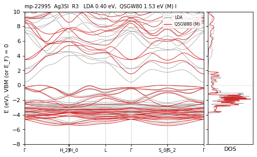

**mp-558189** Ag3SI — QSGW80 **1.81** R eV I  — ecalj 989a18637 (fp32, t_tetrakbt +300)

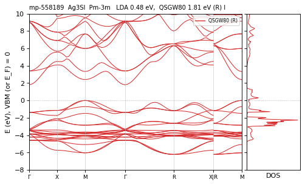

**mp-8196** AgNO3 — QSGW80 **5.06** R eV I  — ecalj 989a18637 (fp32, t_tetrakbt +300)

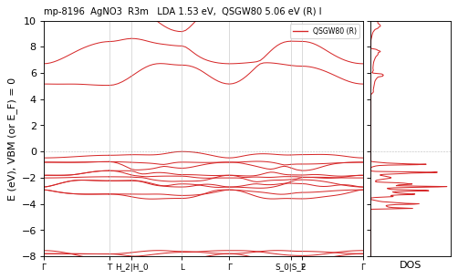

**mp-9307** Ba2ZnN2 — QSGW80 **1.54** R eV I  — ecalj 989a18637 (fp32, t_tetrakbt +300)

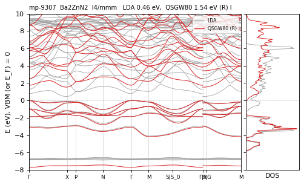

**mp-8579** BaAg2S2 — QSGW80 **1.98** M eV D  — ecalj 2026-04/05 (~/bin2, all-TF32 --mp)

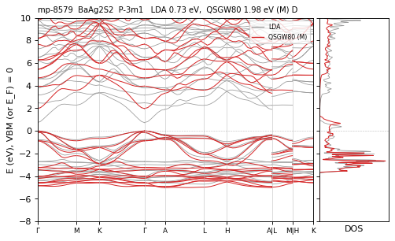

**mp-4559** BaCO3 — QSGW80 **7.47** R eV I  — ecalj 989a18637 (fp32, t_tetrakbt +300)

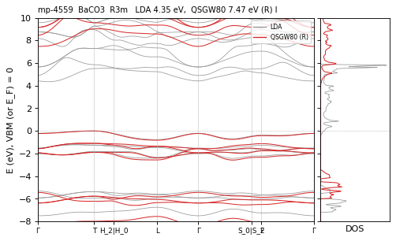

**mp-8281** BaCd2As2 — QSGW80 **0.85** M eV D  — ecalj 2026-04/05 (~/bin2, all-TF32 --mp)

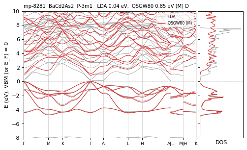

**mp-8279** BaCd2P2 — QSGW80 **1.31** M eV D  — ecalj 2026-04/05 (~/bin2, all-TF32 --mp)

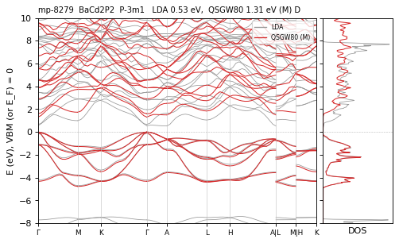

**mp-4255** BaCu2S2 — QSGW80 **1.52** N / M ≈ eV D  — ecalj 989a18637 (tf32, t_tetrakbt -300)

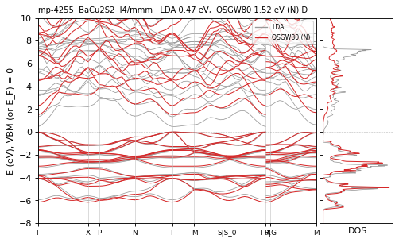

**mp-10437** BaCu2Se2 — QSGW80 **1.32** M eV D  — ecalj 2026-04/05 (~/bin2, all-TF32 --mp)

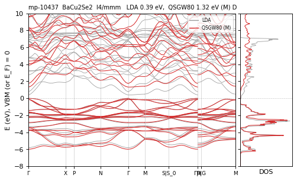

**mp-10250** BaLiF3 — QSGW80 **10.86** R eV D  — ecalj 989a18637 (fp32, t_tetrakbt +300)

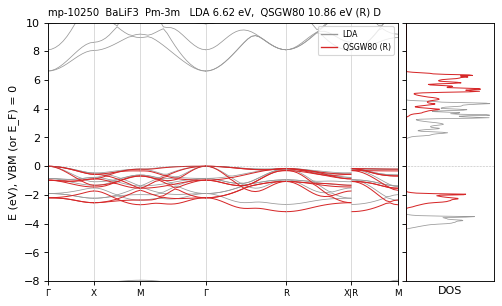

**mp-23818** BaLiH3 — QSGW80 **4.33** M eV I  — ecalj 2026-04/05 (~/bin2, all-TF32 --mp)

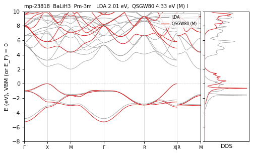

**mp-632808** BaLiH3 — QSGW80 **3.46** M eV I  — ecalj 2026-04/05 (~/bin2, all-TF32 --mp)

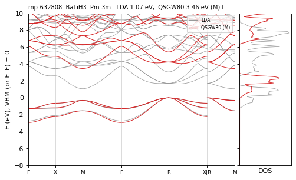

**mp-8280** BaMg2As2 — QSGW80 **2.00** M eV I  — ecalj 2026-04/05 (~/bin2, all-TF32 --mp)

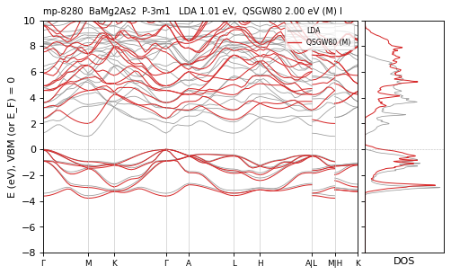

**mp-29209** BaMg2Bi2 — QSGW80 **1.25** M eV D  — ecalj 2026-04/05 (~/bin2, all-TF32 --mp)

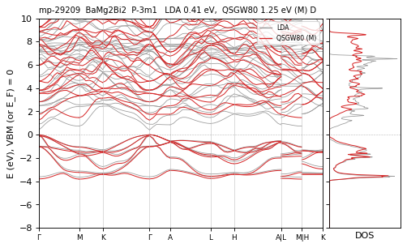

**mp-8278** BaMg2P2 — QSGW80 **2.10** M eV I  — ecalj 2026-04/05 (~/bin2, all-TF32 --mp)

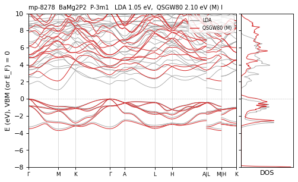

**mp-9567** BaMg2Sb2 — QSGW80 **1.67** M eV I  — ecalj 2026-04/05 (~/bin2, all-TF32 --mp)

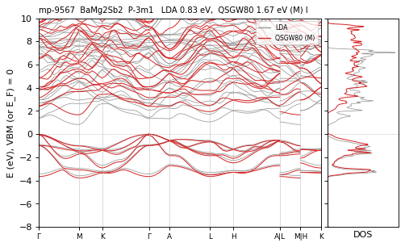

**mp-3163** BaSnO3 — QSGW80 **2.74** N / M 2.35 eV I CHECK — ecalj 989a18637 (tf32, t_tetrakbt -300)

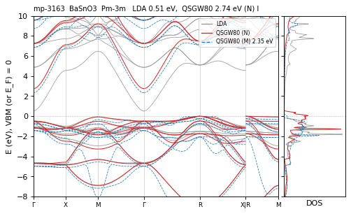

**mp-5020** BaTiO3 — QSGW80 **4.20** M eV I  — ecalj 2026-04/05 (~/bin2, all-TF32 --mp)

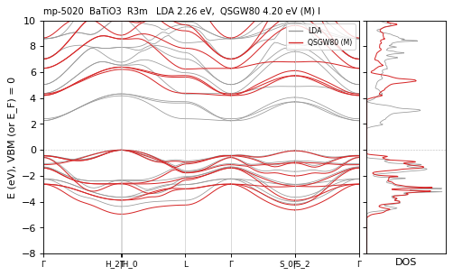

**mp-5777** BaTiO3 — QSGW80 **4.00** N / M ≈ eV I  — ecalj 989a18637 (tf32, t_tetrakbt -300)

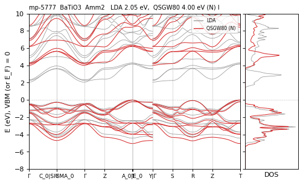

**mp-5986** BaTiO3 — QSGW80 **3.39** M eV I  — ecalj 2026-04/05 (~/bin2, all-TF32 --mp)

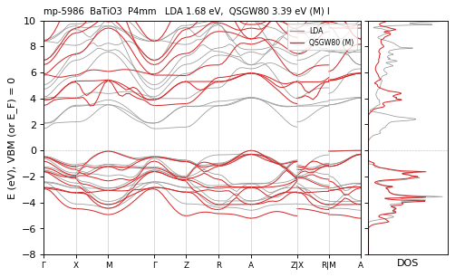

**mp-644497** BaTiO3 — QSGW80 **2.71** R eV I  — ecalj 989a18637 (fp32, t_tetrakbt +300)

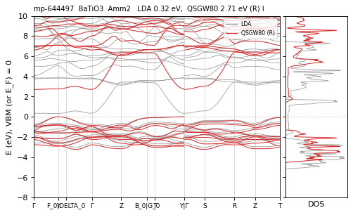

**mp-3834** BaZrO3 — QSGW80 **5.33** M eV I  — ecalj 2026-04/05 (~/bin2, all-TF32 --mp)

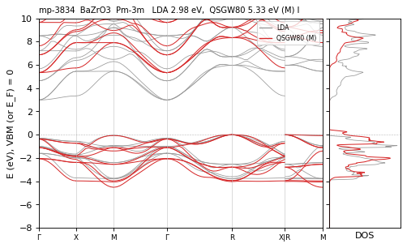

**mp-1017552** Bi2O3 — QSGW80 **1.87** M eV I  — ecalj 2026-04/05 (~/bin2, all-TF32 --mp)

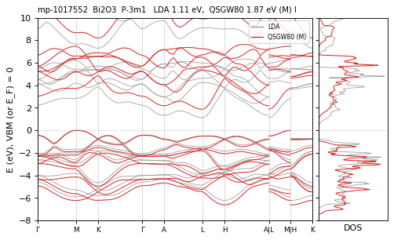

**mp-541837** Bi2Se3 — QSGW80 **0.80** N / M 0.71 eV D differs — ecalj 989a18637 (tf32, t_tetrakbt -300)

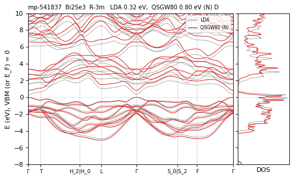

**mp-552098** Bi2SeO2 — QSGW80 **0.97** R eV I  — ecalj 989a18637 (fp32, t_tetrakbt +300)

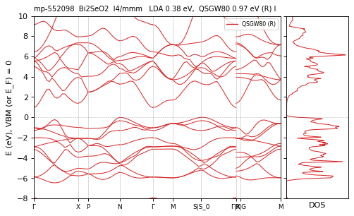

**mp-27910** Bi2Te2S — QSGW80 **0.82** M eV D  — ecalj 2026-04/05 (~/bin2, all-TF32 --mp)

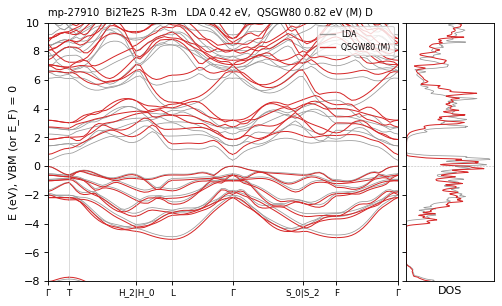

**mp-29666** Bi2Te2Se — QSGW80 **0.79** M eV D  — ecalj 2026-04/05 (~/bin2, all-TF32 --mp)

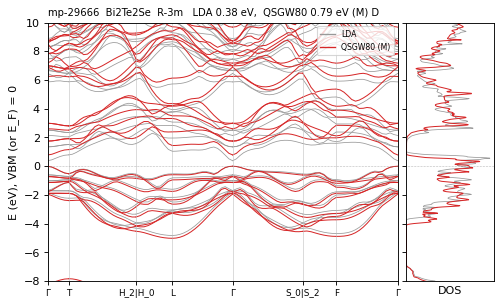

**mp-34202** Bi2Te3 — QSGW80 **0.87** M eV D  — ecalj 2026-04/05 (~/bin2, all-TF32 --mp)

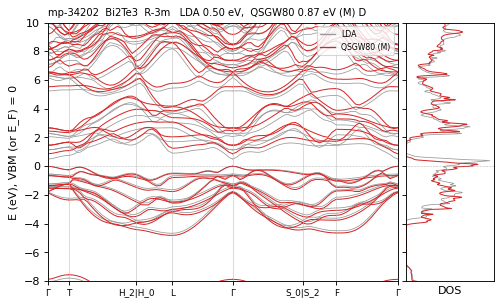

**mp-31406** Bi2TeSe2 — QSGW80 **1.40** M eV I  — ecalj 2026-04/05 (~/bin2, all-TF32 --mp)

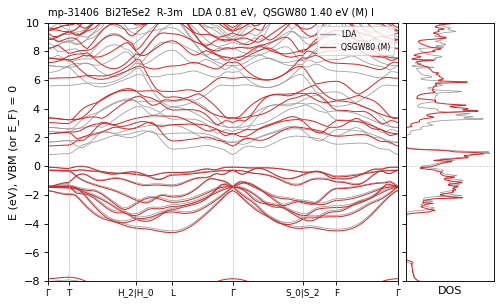

**mp-27962** CI4 — QSGW80 **3.28** R eV D  — ecalj 989a18637 (fp32, t_tetrakbt +300)

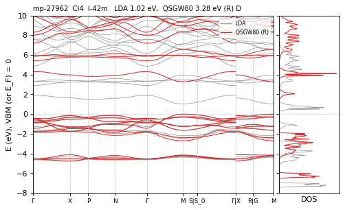

**mp-8818** Ca2ZnN2 — QSGW80 **1.97** R eV I  — ecalj 989a18637 (fp32, t_tetrakbt +300)

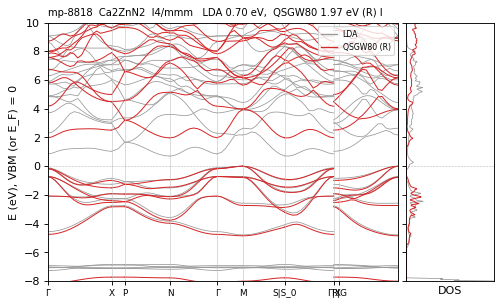

**mp-7223** Ca3AsN — QSGW80 **1.81** M eV D  — ecalj 2026-04/05 (~/bin2, all-TF32 --mp)

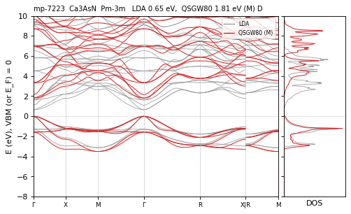

**mp-31149** Ca3BiN — QSGW80 **1.29** M eV D  — ecalj 2026-04/05 (~/bin2, all-TF32 --mp)

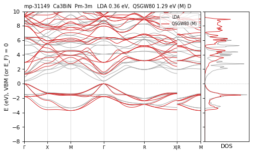

**mp-13146** Ca3N2 — QSGW80 **2.40** M eV I  — ecalj 2026-04/05 (~/bin2, all-TF32 --mp)

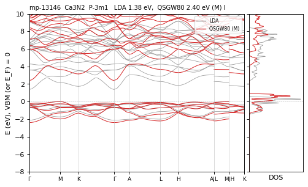

**mp-11824** Ca3PN — QSGW80 **1.90** M eV D  — ecalj 2026-04/05 (~/bin2, all-TF32 --mp)

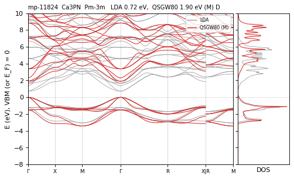

**mp-1018630** CaBe2As2 — QSGW80 **1.49** M eV I  — ecalj 2026-04/05 (~/bin2, all-TF32 --mp)

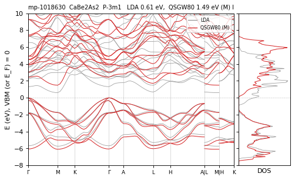

**mp-1017548** CaBe2P2 — QSGW80 **1.66** M eV I  — ecalj 2026-04/05 (~/bin2, all-TF32 --mp)

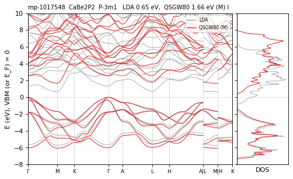

**mp-7067** CaCd2As2 — QSGW80 **0.94** M eV D  — ecalj 2026-04/05 (~/bin2, all-TF32 --mp)

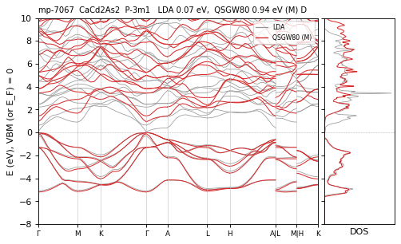

**mp-9570** CaCd2P2 — QSGW80 **1.50** M eV D  — ecalj 2026-04/05 (~/bin2, all-TF32 --mp)

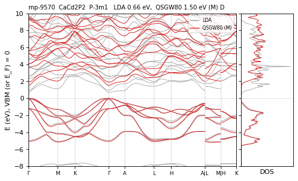

**mp-7430** CaCd2Sb2 — QSGW80 **0.80** M eV I  — ecalj 2026-04/05 (~/bin2, all-TF32 --mp)

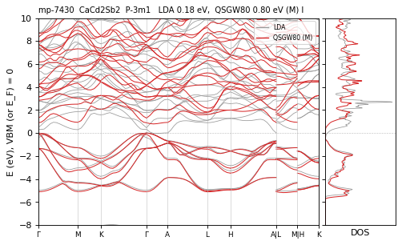

**mp-1070099** CaGa2As2 — QSGW80 **0.38** M eV I  — ecalj 2026-04/05 (~/bin2, all-TF32 --mp)

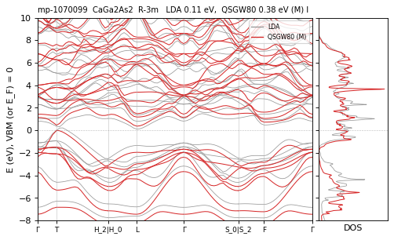

**mp-23879** CaH2O2 — QSGW80 **7.33** M eV D  — ecalj 2026-04/05 (~/bin2, all-TF32 --mp)

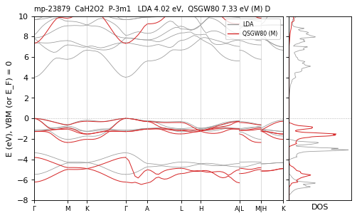

**mp-9564** CaMg2As2 — QSGW80 **2.25** M eV I  — ecalj 2026-04/05 (~/bin2, all-TF32 --mp)

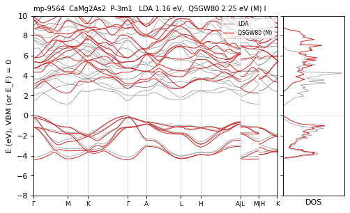

**mp-29208** CaMg2Bi2 — QSGW80 **1.29** M eV D  — ecalj 2026-04/05 (~/bin2, all-TF32 --mp)

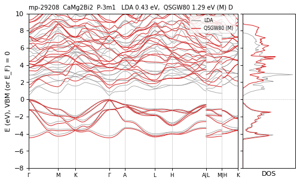

**mp-5795** CaMg2N2 — QSGW80 **3.59** M eV D  — ecalj 2026-04/05 (~/bin2, all-TF32 --mp)

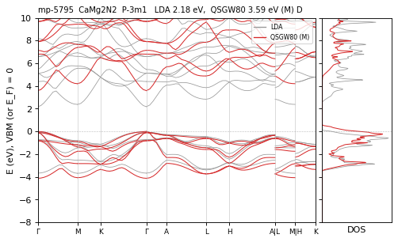

**mp-9565** CaMg2Sb2 — QSGW80 **1.62** M eV I  — ecalj 2026-04/05 (~/bin2, all-TF32 --mp)

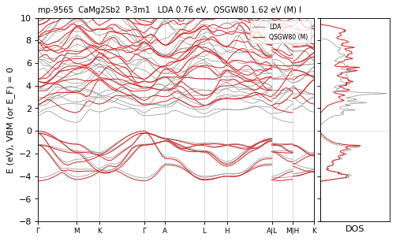

**mp-5893** CaSiO3 — QSGW80 **6.19** M eV I  — ecalj 2026-04/05 (~/bin2, all-TF32 --mp)

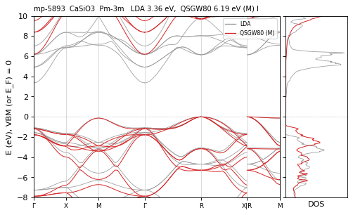

**mp-7986** CaSnO3 — QSGW80 **3.59** N / M 3.92 eV I CHECK — ecalj 989a18637 (tf32, t_tetrakbt -300)

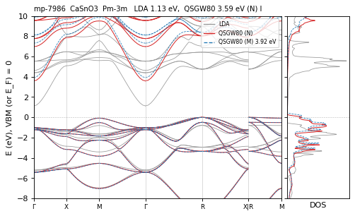

**mp-5827** CaTiO3 — QSGW80 **3.82** M eV I  — ecalj 2026-04/05 (~/bin2, all-TF32 --mp)

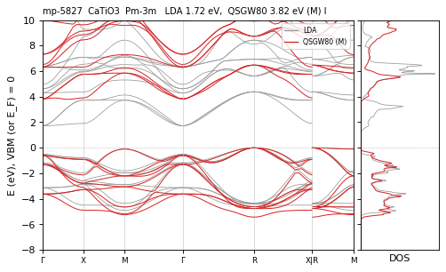

**mp-9571** CaZn2As2 — QSGW80 **1.40** M eV D  — ecalj 2026-04/05 (~/bin2, all-TF32 --mp)

**mp-9569** CaZn2P2 — QSGW80 **1.69** M eV I  — ecalj 2026-04/05 (~/bin2, all-TF32 --mp)

**mp-542112** CaZrO3 — QSGW80 **5.44** M eV I  — ecalj 2026-04/05 (~/bin2, all-TF32 --mp)

**mp-625548** CdH2O2 — QSGW80 **4.16** R eV I  — ecalj 989a18637 (fp32, t_tetrakbt +300)

**mp-27710** CrB4 — QSGW80 **0.00** N / R ≈ eV metal  — ecalj 989a18637 (tf32, t_tetrakbt -300)

**mp-7232** Cs2HgO2 — QSGW80 **4.35** R eV I  — ecalj 989a18637 (fp32, t_tetrakbt +300)

**mp-505824** Cs2PdC2 — QSGW80 **3.12** M eV D  — ecalj 2026-04/05 (~/bin2, all-TF32 --mp)

**mp-505825** Cs2PtC2 — QSGW80 **2.43** M eV I  — ecalj 2026-04/05 (~/bin2, all-TF32 --mp)

**mp-28873** CsBrO3 — QSGW80 **7.06** R eV D  — ecalj 989a18637 (fp32, t_tetrakbt +300)

**mp-30056** CsCaBr3 — QSGW80 **6.98** M eV I  — ecalj 2026-04/05 (~/bin2, all-TF32 --mp)

**mp-7104** CsCaF3 — QSGW80 **11.35** M eV D  — ecalj 2026-04/05 (~/bin2, all-TF32 --mp)

**mp-644203** CsCaH3 — QSGW80 **5.93** M eV D  — ecalj 2026-04/05 (~/bin2, all-TF32 --mp)

**mp-570231** CsCdBr3 — QSGW80 **2.77** N / M ≈ eV I  — ecalj 989a18637 (tf32, t_tetrakbt -300)

**mp-568544** CsCdCl3 — QSGW80 **4.21** M eV I  — ecalj 2026-04/05 (~/bin2, all-TF32 --mp)

**mp-8399** CsCdF3 — QSGW80 **6.98** M eV I  — ecalj 2026-04/05 (~/bin2, all-TF32 --mp)

**mp-1068340** CsGeBr3 — QSGW80 **2.56** M eV D  — ecalj 2026-04/05 (~/bin2, all-TF32 --mp)

**mp-570223** CsGeBr3 — QSGW80 **1.45** M eV D  — ecalj 2026-04/05 (~/bin2, all-TF32 --mp)

**mp-22988** CsGeCl3 — QSGW80 **3.84** M eV D  — ecalj 2026-04/05 (~/bin2, all-TF32 --mp)

**mp-28377** CsGeI3 — QSGW80 **1.96** M eV D  — ecalj 2026-04/05 (~/bin2, all-TF32 --mp)

**mp-561947** CsHgF3 — QSGW80 **3.48** N / M ≈ eV I  — ecalj 989a18637 (tf32, t_tetrakbt -300)

**mp-8401** CsMgF3 — QSGW80 **10.82** M eV D  — ecalj 2026-04/05 (~/bin2, all-TF32 --mp)

**mp-600089** CsPbBr3 — QSGW80 **3.10** M eV D  — ecalj 2026-04/05 (~/bin2, all-TF32 --mp)

**mp-23037** CsPbCl3 — QSGW80 **3.77** N / M ≈ eV D  — ecalj 989a18637 (tf32, t_tetrakbt -300)

**mp-5811** CsPbF3 — QSGW80 **5.08** M eV D  — ecalj 2026-04/05 (~/bin2, all-TF32 --mp)

**mp-1069538** CsPbI3 — QSGW80 **2.29** M eV D  — ecalj 2026-04/05 (~/bin2, all-TF32 --mp)

**mp-27214** CsSnBr3 — QSGW80 **1.47** M eV D  — ecalj 2026-04/05 (~/bin2, all-TF32 --mp)

**mp-1070375** CsSnCl3 — QSGW80 **1.99** M eV D  — ecalj 2026-04/05 (~/bin2, all-TF32 --mp)

**mp-614013** CsSnI3 — QSGW80 **1.24** M eV D  — ecalj 2026-04/05 (~/bin2, all-TF32 --mp)

**mp-8397** CsSrF3 — QSGW80 **10.31** M eV D  — ecalj 2026-04/05 (~/bin2, all-TF32 --mp)

**mp-9816** GeF4 — QSGW80 **10.54** R eV I  — ecalj 989a18637 (fp32, t_tetrakbt +300)

**mp-1017567** Hf2SN2 — QSGW80 **2.08** M · path 1.87 eV I path<mesh(mesh) — ecalj 2026-04/05 (~/bin2, all-TF32 --mp)

**mp-1069533** Hf2SN2 — QSGW80 **3.25** M eV I  — ecalj 2026-04/05 (~/bin2, all-TF32 --mp)

**mp-22535** HfPbO3 — QSGW80 **3.58** R eV D  — ecalj 989a18637 (fp32, t_tetrakbt +300)

**mp-1017565** In2Se3 — QSGW80 **0.94** M eV I  — ecalj 2026-04/05 (~/bin2, all-TF32 --mp)

**mp-10408** K2CN2 — QSGW80 **5.61** M eV D  — ecalj 2026-04/05 (~/bin2, all-TF32 --mp)

**mp-5860** K2HgO2 — QSGW80 **4.49** R eV I  — ecalj 989a18637 (fp32, t_tetrakbt +300)

**mp-1068977** K2PdC2 — QSGW80 **2.86** M eV I  — ecalj 2026-04/05 (~/bin2, all-TF32 --mp)

**mp-540584** K2PdO2 — QSGW80 **3.78** M eV I  — ecalj 2026-04/05 (~/bin2, all-TF32 --mp)

**mp-1068941** K2PdS2 — QSGW80 **2.62** M eV I  — ecalj 2026-04/05 (~/bin2, all-TF32 --mp)

**mp-1069706** K2PdSe2 — QSGW80 **2.05** M eV I  — ecalj 2026-04/05 (~/bin2, all-TF32 --mp)

**mp-976876** K2PtC2 — QSGW80 **2.12** M eV I  — ecalj 2026-04/05 (~/bin2, all-TF32 --mp)

**mp-7928** K2PtS2 — QSGW80 **2.88** M eV I  — ecalj 2026-04/05 (~/bin2, all-TF32 --mp)

**mp-8621** K2PtSe2 — QSGW80 **2.41** M eV I  — ecalj 2026-04/05 (~/bin2, all-TF32 --mp)

**mp-1068813** K2Te2Pd — QSGW80 **1.59** M eV I  — ecalj 2026-04/05 (~/bin2, all-TF32 --mp)

**mp-8623** K2Te2Pt — QSGW80 **1.85** M eV I  — ecalj 2026-04/05 (~/bin2, all-TF32 --mp)

**mp-9200** K3AuO — QSGW80 **2.17** M eV I  — ecalj 2026-04/05 (~/bin2, all-TF32 --mp)

**mp-28166** K3BrO — QSGW80 **3.22** M eV D  — ecalj 2026-04/05 (~/bin2, all-TF32 --mp)

**mp-28171** K3IO — QSGW80 **3.17** M eV D  — ecalj 2026-04/05 (~/bin2, all-TF32 --mp)

**mp-22958** KBrO3 — QSGW80 **6.97** M eV D  — ecalj 2026-04/05 (~/bin2, all-TF32 --mp)

**mp-4950** KCaF3 — QSGW80 **10.41** R eV I  — ecalj 989a18637 (fp32, t_tetrakbt +300)

**mp-10175** KCdF3 — QSGW80 **6.90** M eV I  — ecalj 2026-04/05 (~/bin2, all-TF32 --mp)

**mp-550506** KClO3 — QSGW80 **8.76** R eV I  — ecalj 989a18637 (fp32, t_tetrakbt +300)

**mp-552729** KIO3 — QSGW80 **4.59** N / M ≈ eV D  — ecalj 989a18637 (tf32, t_tetrakbt -300)

**mp-3448** KMgF3 — QSGW80 **12.00** R eV I  — ecalj 989a18637 (fp32, t_tetrakbt +300)

**mp-23737** KMgH3 — QSGW80 **5.29** M eV I  — ecalj 2026-04/05 (~/bin2, all-TF32 --mp)

**mp-6920** KNO3 — QSGW80 **7.28** N / M 7.37 eV D differs — ecalj 989a18637 (tf32, t_tetrakbt -300)

**mp-4342** KNbO3 — QSGW80 **2.88** M eV I  — ecalj 2026-04/05 (~/bin2, all-TF32 --mp)

**mp-5246** KNbO3 — QSGW80 **3.46** M eV I  — ecalj 2026-04/05 (~/bin2, all-TF32 --mp)

**mp-7375** KNbO3 — QSGW80 **3.67** M eV I  — ecalj 2026-04/05 (~/bin2, all-TF32 --mp)

**mp-935811** KNbO3 — QSGW80 **2.66** M eV I  — ecalj 2026-04/05 (~/bin2, all-TF32 --mp)

**mp-3614** KTaO3 — QSGW80 **3.94** N / M 4.00 eV I differs — ecalj 989a18637 (tf32, t_tetrakbt -300)

**mp-5878** KZnF3 — QSGW80 **8.19** M eV I  — ecalj 2026-04/05 (~/bin2, all-TF32 --mp)

**mp-9610** Li2CN2 — QSGW80 **5.76** N / M 5.86 eV D differs — ecalj 989a18637 (tf32, t_tetrakbt -300)

**mp-19183** Li2NiO2 — QSGW80 **2.78** R eV I  — ecalj 989a18637 (fp32, t_tetrakbt +300)

**mp-7608** Li2PdO2 — QSGW80 **3.54** M eV I  — ecalj 2026-04/05 (~/bin2, all-TF32 --mp)

**mp-3216** Li2ZrN2 — QSGW80 **2.99** M eV I  — ecalj 2026-04/05 (~/bin2, all-TF32 --mp)

**mp-28593** Li3BrO — QSGW80 **7.16** R eV D  — ecalj 989a18637 (fp32, t_tetrakbt +300)

**mp-2646** Mg3Sb2 — QSGW80 **0.85** M eV I  — ecalj 2026-04/05 (~/bin2, all-TF32 --mp)

**mp-9514** MgAl2C2 — QSGW80 **2.57** M eV I  — ecalj 2026-04/05 (~/bin2, all-TF32 --mp)

**mp-865185** MgBe2As2 — QSGW80 **1.38** M · path 1.16 eV I path<mesh(mesh) — ecalj 2026-04/05 (~/bin2, all-TF32 --mp)

**mp-11917** MgBe2N2 — QSGW80 **5.87** M eV I  — ecalj 2026-04/05 (~/bin2, all-TF32 --mp)

**mp-1017628** MgBe2P2 — QSGW80 **1.74** M · path 1.52 eV I path<mesh(mesh) — ecalj 2026-04/05 (~/bin2, all-TF32 --mp)

**mp-30247** MgH2O2 — QSGW80 **8.15** R eV D  — ecalj 989a18637 (fp32, t_tetrakbt +300)

**mp-541989** Na2CN2 — QSGW80 **5.57** R eV I  — ecalj 989a18637 (fp32, t_tetrakbt +300)

**mp-4961** Na2HgO2 — QSGW80 **3.79** R eV I  — ecalj 989a18637 (fp32, t_tetrakbt +300)

**mp-4823** Na2PdC2 — QSGW80 **2.12** M eV I  — ecalj 2026-04/05 (~/bin2, all-TF32 --mp)

**mp-4366** Na2PtC2 — QSGW80 **1.37** M eV I  — ecalj 2026-04/05 (~/bin2, all-TF32 --mp)

**mp-22313** Na2PtO2 — QSGW80 **3.81** M eV I  — ecalj 2026-04/05 (~/bin2, all-TF32 --mp)

**mp-28602** Na3ClO — QSGW80 **5.01** M eV D  — ecalj 2026-04/05 (~/bin2, all-TF32 --mp)

**mp-560399** NaMgF3 — QSGW80 **10.72** R eV I  — ecalj 989a18637 (fp32, t_tetrakbt +300)

**mp-3136** NaNbO3 — QSGW80 **2.84** M eV I  — ecalj 2026-04/05 (~/bin2, all-TF32 --mp)

**mp-4170** NaTaO3 — QSGW80 **4.18** M eV I  — ecalj 2026-04/05 (~/bin2, all-TF32 --mp)

**mp-12725** NbAgO3 — QSGW80 **2.44** N / R ≈ eV I  — ecalj 989a18637 (tf32, t_tetrakbt -300)

**mp-551905** OsO4 — QSGW80 **6.33** R eV I  — ecalj 989a18637 (fp32, t_tetrakbt +300)

**mp-341** PbF4 — QSGW80 **5.13** R eV I  — ecalj 989a18637 (fp32, t_tetrakbt +300)

**mp-1069193** PdN2Cl2 — QSGW80 **1.23** M eV I  — ecalj 2026-04/05 (~/bin2, all-TF32 --mp)

**mp-5072** Rb2HgO2 — QSGW80 **4.46** R eV D  — ecalj 989a18637 (fp32, t_tetrakbt +300)

**mp-10918** Rb2PdC2 — QSGW80 **2.90** M eV I  — ecalj 2026-04/05 (~/bin2, all-TF32 --mp)

**mp-1069771** Rb2PdSe2 — QSGW80 **2.19** M eV I  — ecalj 2026-04/05 (~/bin2, all-TF32 --mp)

**mp-10919** Rb2PtC2 — QSGW80 **2.36** M eV D  — ecalj 2026-04/05 (~/bin2, all-TF32 --mp)

**mp-7929** Rb2PtS2 — QSGW80 **2.76** M eV I  — ecalj 2026-04/05 (~/bin2, all-TF32 --mp)

**mp-8622** Rb2PtSe2 — QSGW80 **2.40** M eV I  — ecalj 2026-04/05 (~/bin2, all-TF32 --mp)

**mp-1070356** Rb2Te2Pd — QSGW80 **1.41** M eV I  — ecalj 2026-04/05 (~/bin2, all-TF32 --mp)

**mp-1070498** Rb2Te2Pt — QSGW80 **2.09** M eV I  — ecalj 2026-04/05 (~/bin2, all-TF32 --mp)

**mp-4405** Rb3AuO — QSGW80 **1.85** M eV I  — ecalj 2026-04/05 (~/bin2, all-TF32 --mp)

**mp-30055** Rb3BrO — QSGW80 **2.58** M eV D  — ecalj 2026-04/05 (~/bin2, all-TF32 --mp)

**mp-28872** RbBrO3 — QSGW80 **6.92** M eV D  — ecalj 2026-04/05 (~/bin2, all-TF32 --mp)

**mp-3654** RbCaF3 — QSGW80 **10.59** M eV I  — ecalj 2026-04/05 (~/bin2, all-TF32 --mp)

**mp-23949** RbCaH3 — QSGW80 **6.24** M eV I  — ecalj 2026-04/05 (~/bin2, all-TF32 --mp)

**mp-6951** RbCdF3 — QSGW80 **7.04** R eV I  — ecalj 989a18637 (fp32, t_tetrakbt +300)

**mp-23011** RbClO3 — QSGW80 **8.81** R eV I  — ecalj 989a18637 (fp32, t_tetrakbt +300)

**mp-571458** RbGeI3 — QSGW80 **1.11** M eV D  — ecalj 2026-04/05 (~/bin2, all-TF32 --mp)

**mp-7482** RbHgF3 — QSGW80 **3.42** M eV I  — ecalj 2026-04/05 (~/bin2, all-TF32 --mp)

**mp-27193** RbIO3 — QSGW80 **4.96** M eV D  — ecalj 2026-04/05 (~/bin2, all-TF32 --mp)

**mp-8402** RbMgF3 — QSGW80 **11.85** N / M 12.01 eV I differs — ecalj 989a18637 (tf32, t_tetrakbt -300)

**mp-21043** RbPbF3 — QSGW80 **5.53** N / M 5.72 eV I differs — ecalj 989a18637 (tf32, t_tetrakbt -300)

**mp-3525** Sb2Te2Se — QSGW80 **0.35** M eV D  — ecalj 2026-04/05 (~/bin2, all-TF32 --mp)

**mp-1201** Sb2Te3 — QSGW80 **0.50** M eV D  — ecalj 2026-04/05 (~/bin2, all-TF32 --mp)

**mp-571550** Sb2TeSe2 — QSGW80 **0.81** M eV D  — ecalj 2026-04/05 (~/bin2, all-TF32 --mp)

**mp-8612** Sb2TeSe2 — QSGW80 **0.73** M eV I  — ecalj 2026-04/05 (~/bin2, all-TF32 --mp)

**mp-1818** SiF4 — QSGW80 **13.02** M eV I  — ecalj 2026-04/05 (~/bin2, all-TF32 --mp)

**mp-2706** SnF4 — QSGW80 **7.47** N / M 7.30 eV I differs — ecalj 989a18637 (tf32, t_tetrakbt -300)

**mp-571436** SnI4 — QSGW80 **3.36** M eV I  — ecalj 2026-04/05 (~/bin2, all-TF32 --mp)

**mp-1069819** SnN2F2 — QSGW80 **4.12** N / M 3.61 eV D CHECK — ecalj 989a18637 (tf32, t_tetrakbt -300)

**mp-9306** Sr2ZnN2 — QSGW80 **1.63** M eV D  — ecalj 2026-04/05 (~/bin2, all-TF32 --mp)

**mp-570008** Sr3BiN — QSGW80 **1.01** M eV D  — ecalj 2026-04/05 (~/bin2, all-TF32 --mp)

**mp-7752** Sr3SbN — QSGW80 **1.06** M eV D  — ecalj 2026-04/05 (~/bin2, all-TF32 --mp)

**mp-1068011** SrAlH3 — QSGW80 **1.20** M eV I  — ecalj 2026-04/05 (~/bin2, all-TF32 --mp)

**mp-7771** SrCd2As2 — QSGW80 **0.88** M eV D  — ecalj 2026-04/05 (~/bin2, all-TF32 --mp)

**mp-8277** SrCd2P2 — QSGW80 **1.40** M eV D  — ecalj 2026-04/05 (~/bin2, all-TF32 --mp)

**mp-4551** SrHfO3 — QSGW80 **6.14** M eV I  — ecalj 2026-04/05 (~/bin2, all-TF32 --mp)

**mp-24419** SrLiH3 — QSGW80 **4.35** M eV I  — ecalj 2026-04/05 (~/bin2, all-TF32 --mp)

**mp-863260** SrMg2As2 — QSGW80 **2.23** M eV I  — ecalj 2026-04/05 (~/bin2, all-TF32 --mp)

**mp-1069695** SrMg2Bi2 — QSGW80 **1.34** M eV D  — ecalj 2026-04/05 (~/bin2, all-TF32 --mp)

**mp-10550** SrMg2N2 — QSGW80 **2.96** M eV D  — ecalj 2026-04/05 (~/bin2, all-TF32 --mp)

**mp-9566** SrMg2Sb2 — QSGW80 **1.77** M eV I  — ecalj 2026-04/05 (~/bin2, all-TF32 --mp)

**mp-1017439** SrSiO3 — QSGW80 **4.77** M eV I  — ecalj 2026-04/05 (~/bin2, all-TF32 --mp)

**mp-9379** SrSn2As2 — QSGW80 **0.06** N / R ≈ eV I QSGW<LDA — ecalj 989a18637 (tf32, t_tetrakbt -300)

**mp-546973** SrSnO3 — QSGW80 **3.09** M eV I  — ecalj 2026-04/05 (~/bin2, all-TF32 --mp)

**mp-5229** SrTiO3 — QSGW80 **3.60** M eV I  — ecalj 2026-04/05 (~/bin2, all-TF32 --mp)

**mp-7770** SrZn2As2 — QSGW80 **1.24** M eV D  — ecalj 2026-04/05 (~/bin2, all-TF32 --mp)

**mp-8276** SrZn2P2 — QSGW80 **1.56** M eV I  — ecalj 2026-04/05 (~/bin2, all-TF32 --mp)

**mp-3323** SrZrO3 — QSGW80 **5.47** N / M ≈ eV I  — ecalj 989a18637 (tf32, t_tetrakbt -300)

**mp-19845** TiPbO3 — QSGW80 **2.72** M eV I  — ecalj 2026-04/05 (~/bin2, all-TF32 --mp)

**mp-20459** TiPbO3 — QSGW80 **3.22** M eV I  — ecalj 2026-04/05 (~/bin2, all-TF32 --mp)

**mp-29798** TlBrO3 — QSGW80 **5.68** R eV I  — ecalj 989a18637 (fp32, t_tetrakbt +300)

**mp-29738** TlClO3 — QSGW80 **6.82** R eV I  — ecalj 989a18637 (fp32, t_tetrakbt +300)

**mp-22981** TlIO3 — QSGW80 **4.50** R eV D  — ecalj 989a18637 (fp32, t_tetrakbt +300)

**mp-14099** ZnAgF3 — QSGW80 **5.47** N / R ≈ eV I  — ecalj 989a18637 (tf32, t_tetrakbt -300)

**mp-553875** Zr2SN2 — QSGW80 **1.72** M · path 1.52 eV I path<mesh(mesh) — ecalj 2026-04/05 (~/bin2, all-TF32 --mp)

**mp-1068577** ZrPbO3 — QSGW80 **3.43** N / R ≈ eV I  — ecalj 989a18637 (tf32, t_tetrakbt -300)

**mp-20337** ZrPbO3 — QSGW80 **3.96** M eV I  — ecalj 2026-04/05 (~/bin2, all-TF32 --mp)

