# GW1500 QSGW80 — bands and DOS, 6 atoms per cell

[README](README.md) · [table](table.md)

Gray: LDA. Red: QSGW80 adopted (condition in parentheses). Blue dashed: another QSGW80 result when its gap differs by more than 0.1 eV. Energies from the VBM (insulators) or E_F (metals). Right: total DOS.

**mp-22993** AgClO4 — QSGW80 **6.10** R eV I  — ecalj 989a18637 (fp32, t_tetrakbt +300)

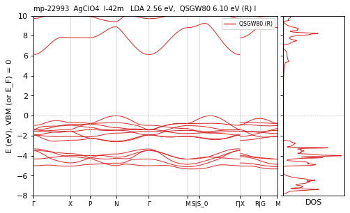

**mp-551758** AgClO4 — QSGW80 **5.58** R eV I  — ecalj 989a18637 (fp32, t_tetrakbt +300)

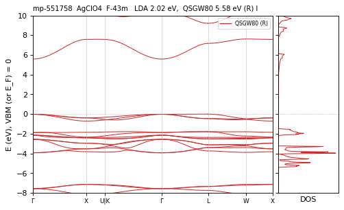

**mp-27863** Al2Cl2O2 — QSGW80 **8.94** M eV I  — ecalj 2026-04/05 (~/bin2, all-TF32 --mp)

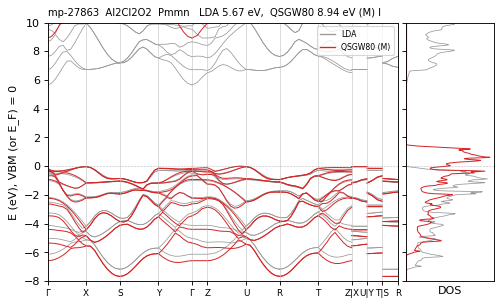

**mp-10910** Al4Ru2 — QSGW80 **0.46** M eV I  — ecalj 2026-04/05 (~/bin2, all-TF32 --mp)

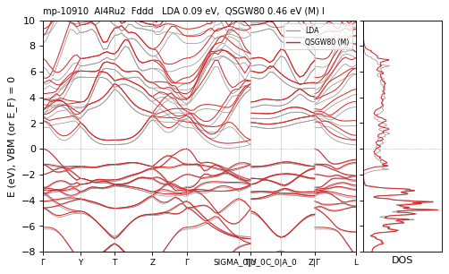

**mp-7849** AlAsO4 — QSGW80 **8.28** R eV D  — ecalj 989a18637 (fp32, t_tetrakbt +300)

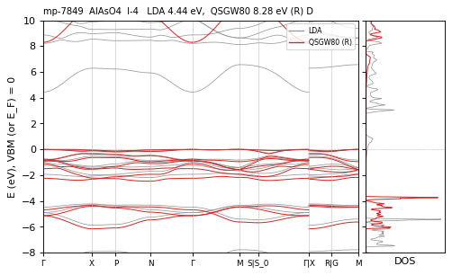

**mp-551798** AlPO4 — QSGW80 **1.34** R eV I  — ecalj 989a18637 (fp32, t_tetrakbt +300)

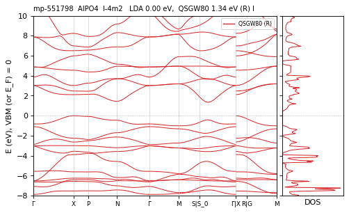

**mp-7848** AlPO4 — QSGW80 **9.62** M eV D  — ecalj 2026-04/05 (~/bin2, all-TF32 --mp)

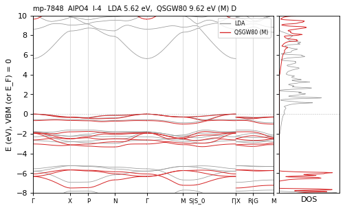

**mp-1071955** AlPS4 — QSGW80 **4.79** N / M ≈ eV I  — ecalj 989a18637 (tf32, t_tetrakbt -300)

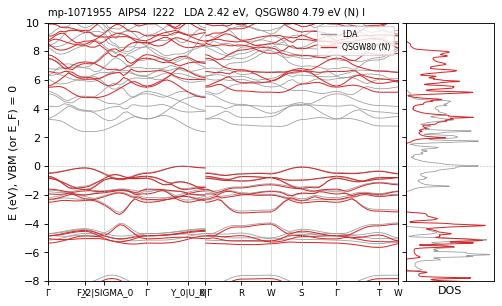

**mp-5606** AlTlF4 — QSGW80 **7.23** R eV I  — ecalj 989a18637 (fp32, t_tetrakbt +300)

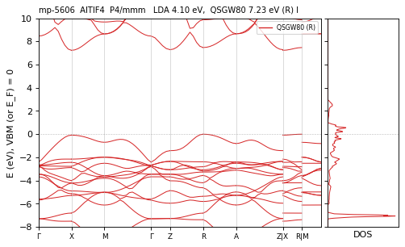

**mp-1182867** AlWO4 — QSGW80 **0.00** N / R ≈ eV metal  — ecalj 989a18637 (tf32, t_tetrakbt -300)

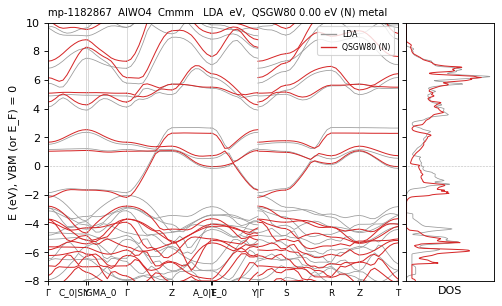

**mp-2455** As4Os2 — QSGW80 **1.00** M eV I  — ecalj 2026-04/05 (~/bin2, all-TF32 --mp)

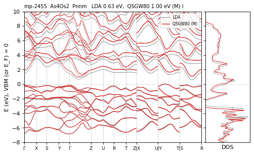

**mp-766** As4Ru2 — QSGW80 **0.76** M eV I  — ecalj 2026-04/05 (~/bin2, all-TF32 --mp)

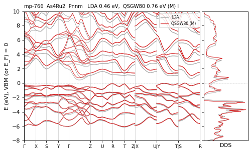

**mp-947** Au4S2 — QSGW80 **3.20** M eV D  — ecalj 2026-04/05 (~/bin2, all-TF32 --mp)

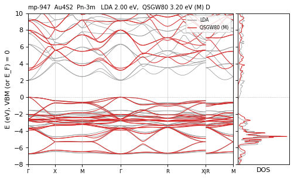

**mp-3277** BAsO4 — QSGW80 **8.26** M eV I  — ecalj 2026-04/05 (~/bin2, all-TF32 --mp)

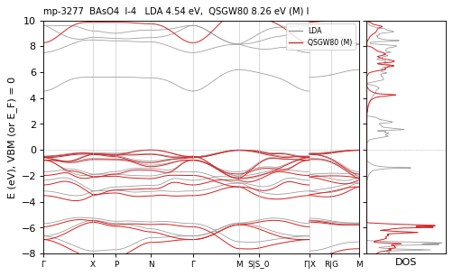

**mp-3589** BPO4 — QSGW80 **11.01** M eV I  — ecalj 2026-04/05 (~/bin2, all-TF32 --mp)

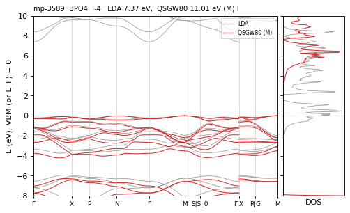

**mp-27724** BPS4 — QSGW80 **4.13** M eV I  — ecalj 2026-04/05 (~/bin2, all-TF32 --mp)

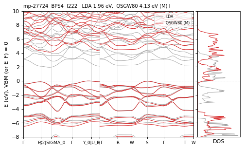

**mp-9899** Ba2Ag2P2 — QSGW80 **0.80** M eV I  — ecalj 2026-04/05 (~/bin2, all-TF32 --mp)

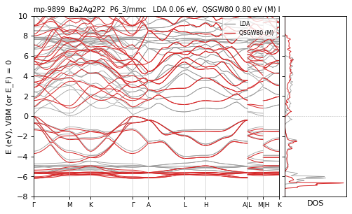

**mp-1205316** Ba2Ag2Sb2 — QSGW80 **0.69** M eV I  — ecalj 2026-04/05 (~/bin2, all-TF32 --mp)

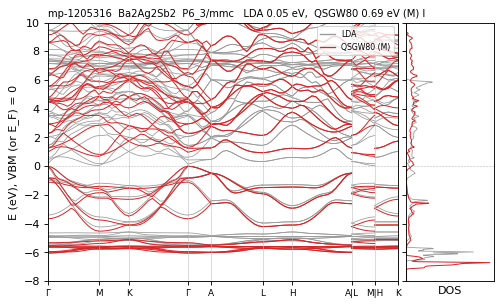

**mp-23070** Ba2Br2F2 — QSGW80 **7.43** N / M ≈ eV D  — ecalj 989a18637 (tf32, t_tetrakbt -300)

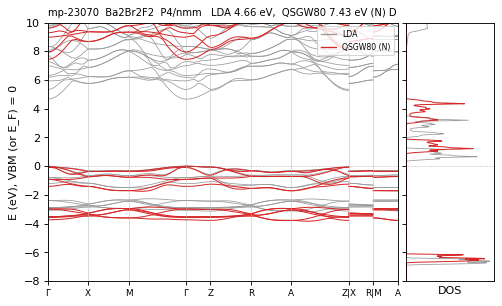

**mp-10293** Ba2C4 — QSGW80 **4.39** M eV I  — ecalj 2026-04/05 (~/bin2, all-TF32 --mp)

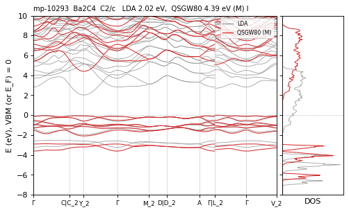

**mp-23432** Ba2Cl2F2 — QSGW80 **8.35** M eV D  — ecalj 2026-04/05 (~/bin2, all-TF32 --mp)

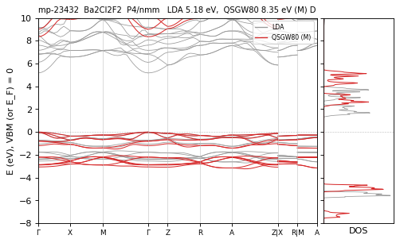

**mp-552934** Ba2CuBrO2 — QSGW80 **4.39** R eV I  — ecalj 989a18637 (fp32, t_tetrakbt +300)

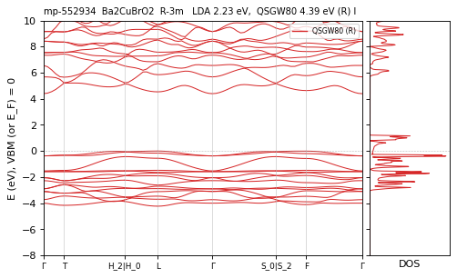

**mp-551456** Ba2CuClO2 — QSGW80 **4.46** R eV I  — ecalj 989a18637 (fp32, t_tetrakbt +300)

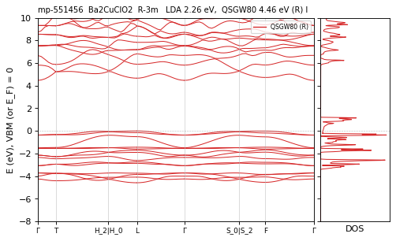

**mp-8644** Ba2F4 — QSGW80 **9.77** M eV D  — ecalj 2026-04/05 (~/bin2, all-TF32 --mp)

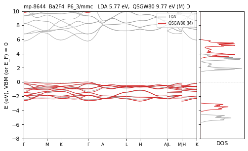

**mp-24424** Ba2H2Br2 — QSGW80 **5.36** M eV D  — ecalj 2026-04/05 (~/bin2, all-TF32 --mp)

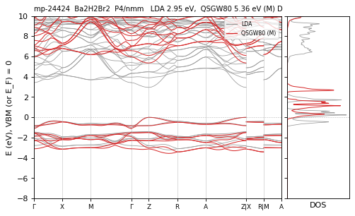

**mp-23861** Ba2H2Cl2 — QSGW80 **5.85** N / M 5.91 eV D differs — ecalj 989a18637 (tf32, t_tetrakbt -300)

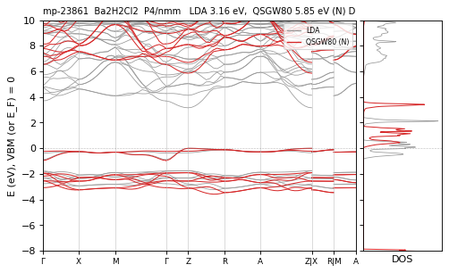

**mp-23862** Ba2H2I2 — QSGW80 **4.65** M eV D  — ecalj 2026-04/05 (~/bin2, all-TF32 --mp)

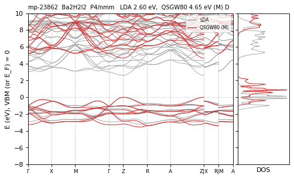

**mp-1018651** Ba2H3I — QSGW80 **4.11** M eV I  — ecalj 2026-04/05 (~/bin2, all-TF32 --mp)

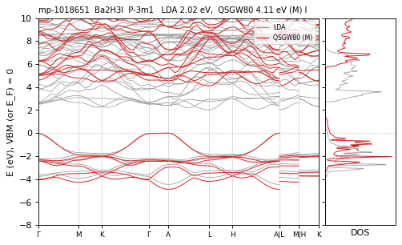

**mp-22951** Ba2I2F2 — QSGW80 **6.14** N / M ≈ eV D  — ecalj 989a18637 (tf32, t_tetrakbt -300)

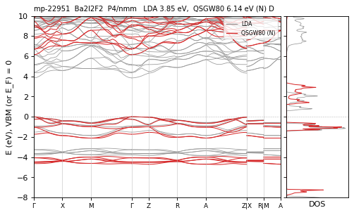

**mp-13277** Ba2Li2P2 — QSGW80 **1.89** M eV D  — ecalj 2026-04/05 (~/bin2, all-TF32 --mp)

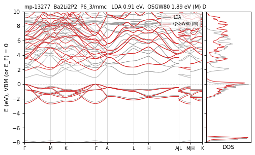

**mp-10485** Ba2Li2Sb2 — QSGW80 **1.62** M eV I  — ecalj 2026-04/05 (~/bin2, all-TF32 --mp)

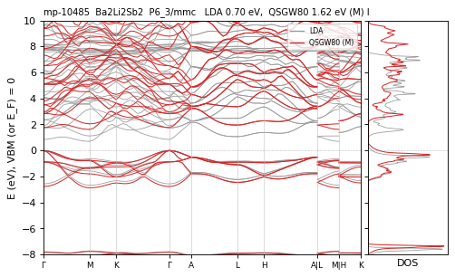

**mp-684** Ba2S4 — QSGW80 **3.72** M eV D  — ecalj 2026-04/05 (~/bin2, all-TF32 --mp)

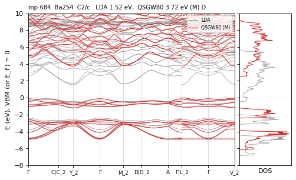

**mp-7547** Ba2Se4 — QSGW80 **2.41** M eV I  — ecalj 2026-04/05 (~/bin2, all-TF32 --mp)

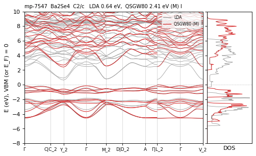

**mp-2150** Ba2Te4 — QSGW80 **1.48** M eV I  — ecalj 2026-04/05 (~/bin2, all-TF32 --mp)

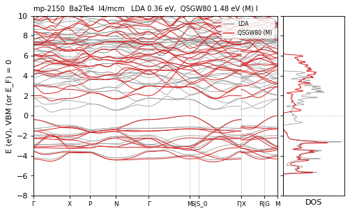

**mp-3307** BaSO4 — QSGW80 **7.12** R eV I  — ecalj 989a18637 (fp32, t_tetrakbt +300)

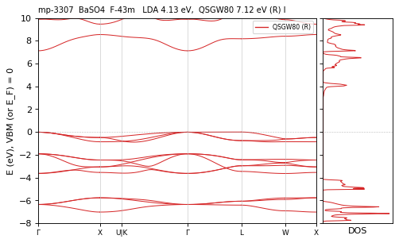

**mp-30139** Be2Br4 — QSGW80 **7.89** M eV I  — ecalj 2026-04/05 (~/bin2, all-TF32 --mp)

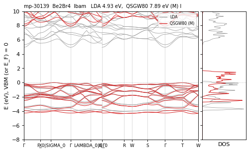

**mp-23267** Be2Cl4 — QSGW80 **9.43** M eV I  — ecalj 2026-04/05 (~/bin2, all-TF32 --mp)

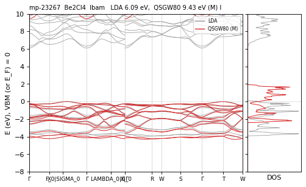

**mp-570886** Be2I4 — QSGW80 **6.14** M eV I  — ecalj 2026-04/05 (~/bin2, all-TF32 --mp)

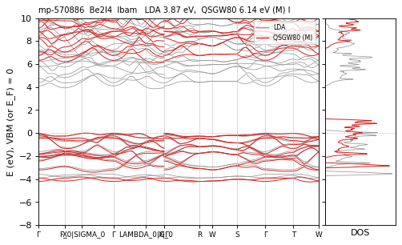

**mp-1072399** Be5Pt — QSGW80 **0.35** M eV I  — ecalj 2026-04/05 (~/bin2, all-TF32 --mp)

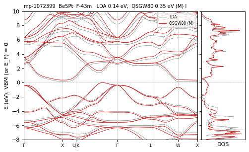

**mp-5046** BeSO4 — QSGW80 **10.60** M eV I  — ecalj 2026-04/05 (~/bin2, all-TF32 --mp)

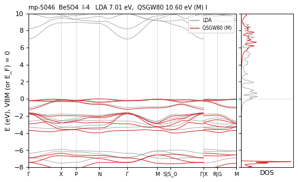

**mp-23072** Bi2Br2O2 — QSGW80 **3.26** M eV I  — ecalj 2026-04/05 (~/bin2, all-TF32 --mp)

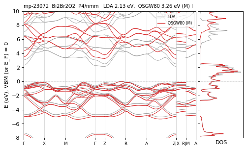

**mp-22939** Bi2Cl2O2 — QSGW80 **3.73** M eV I  — ecalj 2026-04/05 (~/bin2, all-TF32 --mp)

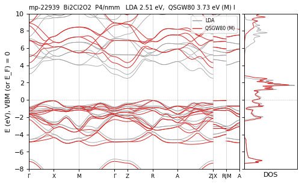

**mp-22987** Bi2I2O2 — QSGW80 **2.56** M eV I  — ecalj 2026-04/05 (~/bin2, all-TF32 --mp)

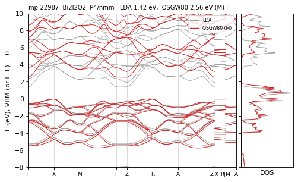

**mp-23074** Bi2O2F2 — QSGW80 **5.00** M eV D  — ecalj 2026-04/05 (~/bin2, all-TF32 --mp)

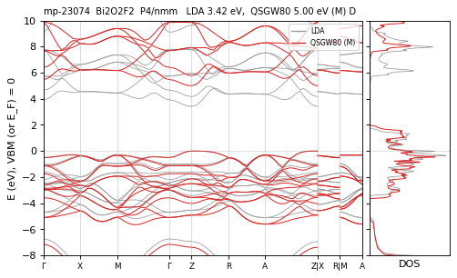

**mp-28944** Bi2Te2Cl2 — QSGW80 **2.28** M eV I  — ecalj 2026-04/05 (~/bin2, all-TF32 --mp)

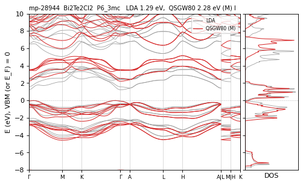

**mp-27743** BiF5 — QSGW80 **5.55** R eV I  — ecalj 989a18637 (fp32, t_tetrakbt +300)

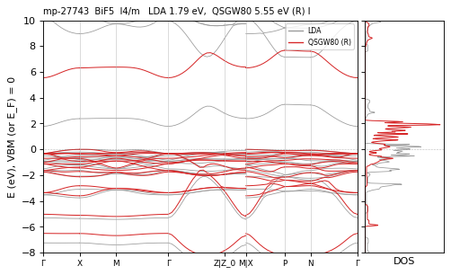

**mp-27989** C2Br2N2 — QSGW80 **8.52** M eV D  — ecalj 2026-04/05 (~/bin2, all-TF32 --mp)

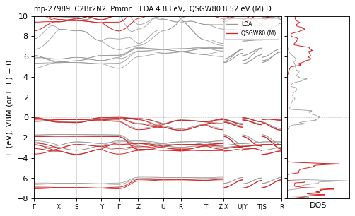

**mp-730189** C2Br2N2 — QSGW80 **8.41** N / M 8.29 eV I differs — ecalj 989a18637 (tf32, t_tetrakbt -300)

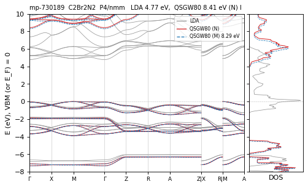

**mp-27502** C2N2Cl2 — QSGW80 **9.17** M eV D  — ecalj 2026-04/05 (~/bin2, all-TF32 --mp)

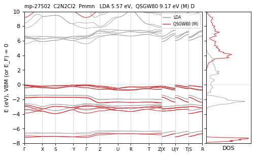

**mp-1077316** C2O4 — QSGW80 **11.20** R eV I  — ecalj 989a18637 (fp32, t_tetrakbt +300)

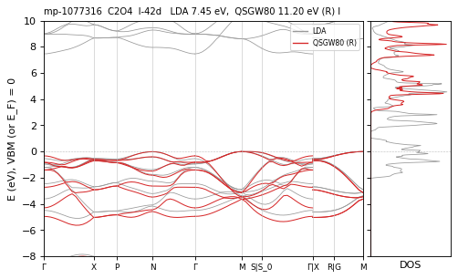

**mp-1077906** C2O4 — QSGW80 **10.09** M eV I  — ecalj 2026-04/05 (~/bin2, all-TF32 --mp)

**mp-644607** C2O4 — QSGW80 **10.28** R eV I  — ecalj 989a18637 (fp32, t_tetrakbt +300)

**mp-2232** C2S4 — QSGW80 **6.62** M eV I  — ecalj 2026-04/05 (~/bin2, all-TF32 --mp)

**mp-1071625** C2Se4 — QSGW80 **4.58** M eV I  — ecalj 2026-04/05 (~/bin2, all-TF32 --mp)

**mp-22888** Ca2Br4 — QSGW80 **7.15** M eV D  — ecalj 2026-04/05 (~/bin2, all-TF32 --mp)

**mp-571166** Ca2Br4 — QSGW80 **7.08** R eV D  — ecalj 989a18637 (fp32, t_tetrakbt +300)

**mp-1575** Ca2C4 — QSGW80 **4.29** M eV I  — ecalj 2026-04/05 (~/bin2, all-TF32 --mp)

**mp-917** Ca2C4 — QSGW80 **4.53** M eV I  — ecalj 2026-04/05 (~/bin2, all-TF32 --mp)

**mp-27546** Ca2Cl2F2 — QSGW80 **9.07** M eV D  — ecalj 2026-04/05 (~/bin2, all-TF32 --mp)

**mp-22904** Ca2Cl4 — QSGW80 **8.37** R eV D  — ecalj 989a18637 (fp32, t_tetrakbt +300)

**mp-23214** Ca2Cl4 — QSGW80 **8.44** N / M 8.38 eV D differs — ecalj 989a18637 (tf32, t_tetrakbt -300)

**mp-24422** Ca2H2Br2 — QSGW80 **6.63** M eV I  — ecalj 2026-04/05 (~/bin2, all-TF32 --mp)

**mp-23859** Ca2H2Cl2 — QSGW80 **6.44** M eV D  — ecalj 2026-04/05 (~/bin2, all-TF32 --mp)

**mp-24204** Ca2H2I2 — QSGW80 **5.41** M eV I  — ecalj 2026-04/05 (~/bin2, all-TF32 --mp)

**mp-1018656** Ca2H3Br — QSGW80 **3.83** R eV I  — ecalj 989a18637 (fp32, t_tetrakbt +300)

**mp-1205322** Ca2H4 — QSGW80 **2.79** M · path 2.64 eV I path<mesh(mesh) — ecalj 2026-04/05 (~/bin2, all-TF32 --mp)

**mp-24809** Ca2H4 — QSGW80 **2.77** M · path 2.61 eV I path<mesh(mesh) — ecalj 2026-04/05 (~/bin2, all-TF32 --mp)

**mp-471** Cd2As4 — QSGW80 **0.77** M eV I  — ecalj 2026-04/05 (~/bin2, all-TF32 --mp)

**mp-27934** Cd2Br4 — QSGW80 **4.96** M eV I  — ecalj 2026-04/05 (~/bin2, all-TF32 --mp)

**mp-28248** Cd2I4 — QSGW80 **3.94** M eV I  — ecalj 2026-04/05 (~/bin2, all-TF32 --mp)

**mp-1492** Cd3Te3 — QSGW80 **0.73** M eV D  — ecalj 2026-04/05 (~/bin2, all-TF32 --mp)

**mp-1077383** Cs2Au2S2 — QSGW80 **3.51** M eV I  — ecalj 2026-04/05 (~/bin2, all-TF32 --mp)

**mp-574599** Cs2Au2Se2 — QSGW80 **3.26** M eV I  — ecalj 2026-04/05 (~/bin2, all-TF32 --mp)

**mp-22935** Cs2Br2F2 — QSGW80 **5.40** M eV I  — ecalj 2026-04/05 (~/bin2, all-TF32 --mp)

**mp-541037** Cs2Cu2O2 — QSGW80 **2.86** M eV I  — ecalj 2026-04/05 (~/bin2, all-TF32 --mp)

**mp-6973** Cs2Na2S2 — QSGW80 **4.32** M eV I  — ecalj 2026-04/05 (~/bin2, all-TF32 --mp)

**mp-8658** Cs2Na2Se2 — QSGW80 **3.85** M eV I  — ecalj 2026-04/05 (~/bin2, all-TF32 --mp)

**mp-5339** Cs2Na2Te2 — QSGW80 **3.57** M eV I  — ecalj 2026-04/05 (~/bin2, all-TF32 --mp)

**mp-1541909** Cs2Te2Au2 — QSGW80 **2.72** M eV I  — ecalj 2026-04/05 (~/bin2, all-TF32 --mp)

**mp-573755** Cs2Te2Au2 — QSGW80 **2.34** M eV D  — ecalj 2026-04/05 (~/bin2, all-TF32 --mp)

**mp-13548** Cs4Pt2 — QSGW80 **3.10** M eV I  — ecalj 2026-04/05 (~/bin2, all-TF32 --mp)

**mp-1077814** Cs4S2 — QSGW80 **3.78** M eV I  — ecalj 2026-04/05 (~/bin2, all-TF32 --mp)

**mp-569272** Cs4Se2 — QSGW80 **3.49** R eV I  — ecalj 989a18637 (fp32, t_tetrakbt +300)

**mp-9384** CsAu3S2 — QSGW80 **3.44** M eV I  — ecalj 2026-04/05 (~/bin2, all-TF32 --mp)

**mp-9386** CsAu3Se2 — QSGW80 **3.32** M eV I  — ecalj 2026-04/05 (~/bin2, all-TF32 --mp)

**mp-546711** CsClO4 — QSGW80 **8.95** N / M 0.26 / R ≈ eV D CHECK — ecalj 989a18637 (tf32, t_tetrakbt -300)

**mp-553303** CsCu3O2 — QSGW80 **3.28** N / M 3.39 eV I differs — ecalj 989a18637 (tf32, t_tetrakbt -300)

**mp-7786** CsCu3S2 — QSGW80 **3.07** M eV I  — ecalj 2026-04/05 (~/bin2, all-TF32 --mp)

**mp-1077811** Cu2Ag2S2 — QSGW80 **1.38** M eV I  — ecalj 2026-04/05 (~/bin2, all-TF32 --mp)

**mp-8911** Cu2Ag2S2 — QSGW80 **1.00** M eV I  — ecalj 2026-04/05 (~/bin2, all-TF32 --mp)

**mp-1072589** Cu2GeS3 — QSGW80 **0.48** M eV D  — ecalj 2026-04/05 (~/bin2, all-TF32 --mp)

**mp-361** Cu4O2 — QSGW80 **1.91** N / M ≈ eV D  — ecalj 989a18637 (tf32, t_tetrakbt -300)

**mp-2008** Fe2As4 — QSGW80 **0.42** M eV I  — ecalj 2026-04/05 (~/bin2, all-TF32 --mp)

**mp-20027** Fe2P4 — QSGW80 **0.64** M eV I  — ecalj 2026-04/05 (~/bin2, all-TF32 --mp)

**mp-1522** Fe2S4 — QSGW80 **1.29** M eV I  — ecalj 2026-04/05 (~/bin2, all-TF32 --mp)

**mp-760** Fe2Se4 — QSGW80 **0.68** M eV I  — ecalj 2026-04/05 (~/bin2, all-TF32 --mp)

**mp-19880** Fe2Te4 — QSGW80 **0.39** M eV I  — ecalj 2026-04/05 (~/bin2, all-TF32 --mp)

**mp-8211** Ga2Ge2Te2 — QSGW80 **1.06** M eV D  — ecalj 2026-04/05 (~/bin2, all-TF32 --mp)

**mp-570875** Ga4Os2 — QSGW80 **1.06** M eV I  — ecalj 2026-04/05 (~/bin2, all-TF32 --mp)

**mp-1072429** Ga4Ru2 — QSGW80 **0.44** M eV I  — ecalj 2026-04/05 (~/bin2, all-TF32 --mp)

**mp-29403** GaCuI4 — QSGW80 **3.51** M eV D  — ecalj 2026-04/05 (~/bin2, all-TF32 --mp)

**mp-1072104** Ge2O4 — QSGW80 **3.85** M eV D  — ecalj 2026-04/05 (~/bin2, all-TF32 --mp)

**mp-470** Ge2O4 — QSGW80 **4.25** M eV D  — ecalj 2026-04/05 (~/bin2, all-TF32 --mp)

**mp-1071032** Ge2S4 — QSGW80 **2.82** M eV I  — ecalj 2026-04/05 (~/bin2, all-TF32 --mp)

**mp-7582** Ge2S4 — QSGW80 **4.17** M eV I  — ecalj 2026-04/05 (~/bin2, all-TF32 --mp)

**mp-10074** Ge2Se4 — QSGW80 **2.88** M eV I  — ecalj 2026-04/05 (~/bin2, all-TF32 --mp)

**mp-36248** H4BrN — QSGW80 **6.85** N / R ≈ eV I  — ecalj 989a18637 (tf32, t_tetrakbt -300)

**mp-30302** Hf2Br2N2 — QSGW80 **3.45** R eV I path<mesh(noLDA) — ecalj 989a18637 (fp32, t_tetrakbt +300)

**mp-568346** Hf2Br2N2 — QSGW80 **3.83** M eV D  — ecalj 2026-04/05 (~/bin2, all-TF32 --mp)

**mp-567441** Hf2I2N2 — QSGW80 **2.30** R eV I  — ecalj 989a18637 (fp32, t_tetrakbt +300)

**mp-541911** Hf2N2Cl2 — QSGW80 **3.96** M · path 3.84 eV I path<mesh(mesh) — ecalj 2026-04/05 (~/bin2, all-TF32 --mp)

**mp-1018721** Hf2O4 — QSGW80 **6.87** M eV I  — ecalj 2026-04/05 (~/bin2, all-TF32 --mp)

**mp-23292** Hg2Br4 — QSGW80 **4.49** M eV I  — ecalj 2026-04/05 (~/bin2, all-TF32 --mp)

**mp-570172** Hg2I2Br2 — QSGW80 **4.10** N / M ≈ eV I  — ecalj 989a18637 (tf32, t_tetrakbt -300)

**mp-23173** Hg2I4 — QSGW80 **3.85** M eV I  — ecalj 2026-04/05 (~/bin2, all-TF32 --mp)

**mp-23192** Hg2I4 — QSGW80 **2.60** M eV D  — ecalj 2026-04/05 (~/bin2, all-TF32 --mp)

**mp-1077107** Hg3O3 — QSGW80 **2.60** M eV I  — ecalj 2026-04/05 (~/bin2, all-TF32 --mp)

**mp-7826** Hg3O3 — QSGW80 **2.58** M eV I  — ecalj 2026-04/05 (~/bin2, all-TF32 --mp)

**mp-634** Hg3S3 — QSGW80 **0.00** N / R ≈ eV metal  — ecalj 989a18637 (tf32, t_tetrakbt -300)

**mp-9252** Hg3S3 — QSGW80 **2.80** M eV I  — ecalj 2026-04/05 (~/bin2, all-TF32 --mp)

**mp-1018722** Hg3Se3 — QSGW80 **1.81** M eV I  — ecalj 2026-04/05 (~/bin2, all-TF32 --mp)

**mp-1071269** Hg3Te3 — QSGW80 **1.16** N / M ≈ eV I  — ecalj 989a18637 (tf32, t_tetrakbt -300)

**mp-358** Hg3Te3 — QSGW80 **1.12** M eV I  — ecalj 2026-04/05 (~/bin2, all-TF32 --mp)

**mp-1077098** Hg6 — QSGW80 **1.79** M eV I  — ecalj 2026-04/05 (~/bin2, all-TF32 --mp)

**mp-27703** In2Br2O2 — QSGW80 **4.00** N / M ≈ eV I  — ecalj 989a18637 (tf32, t_tetrakbt -300)

**mp-27702** In2Cl2O2 — QSGW80 **4.51** M eV I  — ecalj 2026-04/05 (~/bin2, all-TF32 --mp)

**mp-20790** InPS4 — QSGW80 **3.85** M eV I  — ecalj 2026-04/05 (~/bin2, all-TF32 --mp)

**mp-16236** K2Ag2Se2 — QSGW80 **1.65** M eV D  — ecalj 2026-04/05 (~/bin2, all-TF32 --mp)

**mp-7077** K2Au2S2 — QSGW80 **3.67** M eV I  — ecalj 2026-04/05 (~/bin2, all-TF32 --mp)

**mp-9881** K2Au2Se2 — QSGW80 **3.38** M eV I  — ecalj 2026-04/05 (~/bin2, all-TF32 --mp)

**mp-1077078** K2C2N2 — QSGW80 **8.96** M eV I  — ecalj 2026-04/05 (~/bin2, all-TF32 --mp)

**mp-1018736** K2Cd2As2 — QSGW80 **0.90** M eV D  — ecalj 2026-04/05 (~/bin2, all-TF32 --mp)

**mp-7435** K2Cu2Se2 — QSGW80 **1.76** N / M ≈ eV D  — ecalj 989a18637 (tf32, t_tetrakbt -300)

**mp-7436** K2Cu2Te2 — QSGW80 **1.98** N / M ≈ eV D  — ecalj 989a18637 (tf32, t_tetrakbt -300)

**mp-634676** K2H2S2 — QSGW80 **5.67** M eV D  — ecalj 2026-04/05 (~/bin2, all-TF32 --mp)

**mp-722181** K2Li2S2 — QSGW80 **4.81** M eV D  — ecalj 2026-04/05 (~/bin2, all-TF32 --mp)

**mp-8430** K2Li2S2 — QSGW80 **5.08** M eV I  — ecalj 2026-04/05 (~/bin2, all-TF32 --mp)

**mp-8756** K2Li2Se2 — QSGW80 **4.43** N / M ≈ eV I  — ecalj 989a18637 (tf32, t_tetrakbt -300)

**mp-4495** K2Li2Te2 — QSGW80 **4.02** M eV D  — ecalj 2026-04/05 (~/bin2, all-TF32 --mp)

**mp-1019089** K2Mg2As2 — QSGW80 **2.34** M eV I  — ecalj 2026-04/05 (~/bin2, all-TF32 --mp)

**mp-1019105** K2Mg2Bi2 — QSGW80 **1.29** M eV D  — ecalj 2026-04/05 (~/bin2, all-TF32 --mp)

**mp-1018737** K2Mg2P2 — QSGW80 **2.85** M eV I  — ecalj 2026-04/05 (~/bin2, all-TF32 --mp)

**mp-7089** K2Mg2Sb2 — QSGW80 **2.34** M eV D  — ecalj 2026-04/05 (~/bin2, all-TF32 --mp)

**mp-6948** K2Na2O2 — QSGW80 **4.93** N / M ≈ eV I  — ecalj 989a18637 (tf32, t_tetrakbt -300)

**mp-29055** K2Sb4 — QSGW80 **0.72** M eV I  — ecalj 2026-04/05 (~/bin2, all-TF32 --mp)

**mp-3481** K2Sn2As2 — QSGW80 **1.02** M eV I  — ecalj 2026-04/05 (~/bin2, all-TF32 --mp)

**mp-3486** K2Sn2Sb2 — QSGW80 **0.85** M eV I  — ecalj 2026-04/05 (~/bin2, all-TF32 --mp)

**mp-27716** K2Tl2O2 — QSGW80 **2.33** R eV I  — ecalj 989a18637 (fp32, t_tetrakbt +300)

**mp-7421** K2Zn2As2 — QSGW80 **1.54** M eV D  — ecalj 2026-04/05 (~/bin2, all-TF32 --mp)

**mp-7437** K2Zn2P2 — QSGW80 **1.98** M eV D  — ecalj 2026-04/05 (~/bin2, all-TF32 --mp)

**mp-7438** K2Zn2Sb2 — QSGW80 **1.67** M eV D  — ecalj 2026-04/05 (~/bin2, all-TF32 --mp)

**mp-559278** K4S2 — QSGW80 **3.84** M eV D  — ecalj 2026-04/05 (~/bin2, all-TF32 --mp)

**mp-5347** KAlF4 — QSGW80 **11.81** M eV I  — ecalj 2026-04/05 (~/bin2, all-TF32 --mp)

**mp-567299** KC2IN2 — QSGW80 **7.59** R eV D  — ecalj 989a18637 (fp32, t_tetrakbt +300)

**mp-546633** KClO4 — QSGW80 **8.93** M eV I  — ecalj 2026-04/05 (~/bin2, all-TF32 --mp)

**mp-1019888** KNa2BN2 — QSGW80 **3.87** M eV I  — ecalj 2026-04/05 (~/bin2, all-TF32 --mp)

**mp-545359** KNa2CuO2 — QSGW80 **3.76** M eV I  — ecalj 2026-04/05 (~/bin2, all-TF32 --mp)

**mp-9244** Li2B2C2 — QSGW80 **1.98** M · path 1.59 eV I path<mesh(mesh) — ecalj 2026-04/05 (~/bin2, all-TF32 --mp)

**mp-9562** Li2Be2As2 — QSGW80 **1.77** M eV I  — ecalj 2026-04/05 (~/bin2, all-TF32 --mp)

**mp-9915** Li2Be2P2 — QSGW80 **2.00** M eV I  — ecalj 2026-04/05 (~/bin2, all-TF32 --mp)

**mp-9575** Li2Be2Sb2 — QSGW80 **1.42** M eV I  — ecalj 2026-04/05 (~/bin2, all-TF32 --mp)

**mp-23856** Li2H2O2 — QSGW80 **7.88** R eV D  — ecalj 989a18637 (fp32, t_tetrakbt +300)

**mp-9919** Li2Zn2Sb2 — QSGW80 **1.03** M eV D  — ecalj 2026-04/05 (~/bin2, all-TF32 --mp)

**mp-29149** Li4NCl — QSGW80 **3.36** M eV I  — ecalj 2026-04/05 (~/bin2, all-TF32 --mp)

**mp-29771** Mg2C4 — QSGW80 **4.66** M eV I  — ecalj 2026-04/05 (~/bin2, all-TF32 --mp)

**mp-1072956** Mg2F4 — QSGW80 **11.85** N / M 12.42 eV D CHECK — ecalj 989a18637 (tf32, t_tetrakbt -300)

**mp-1249** Mg2F4 — QSGW80 **12.15** R eV D  — ecalj 989a18637 (fp32, t_tetrakbt +300)

**mp-23710** Mg2H4 — QSGW80 **6.54** M eV I  — ecalj 2026-04/05 (~/bin2, all-TF32 --mp)

**mp-1018809** Mo2S4 — QSGW80 **2.06** N / M 1.99 · path 1.86 eV I differs path<mesh(mesh) — ecalj 989a18637 (tf32, t_tetrakbt -300)

**mp-2815** Mo2S4 — QSGW80 **2.19** M · path 1.98 eV I path<mesh(mesh) — ecalj 2026-04/05 (~/bin2, all-TF32 --mp)

**mp-1018807** Mo2Se4 — QSGW80 **1.97** M · path 1.82 eV I path<mesh(mesh) — ecalj 2026-04/05 (~/bin2, all-TF32 --mp)

**mp-1634** Mo2Se4 — QSGW80 **1.75** M eV I  — ecalj 2026-04/05 (~/bin2, all-TF32 --mp)

**mp-9573** Na2Be2As2 — QSGW80 **2.29** M eV I  — ecalj 2026-04/05 (~/bin2, all-TF32 --mp)

**mp-9574** Na2Be2Sb2 — QSGW80 **1.75** M eV I  — ecalj 2026-04/05 (~/bin2, all-TF32 --mp)

**mp-30053** Na2C2N2 — QSGW80 **9.10** R eV I  — ecalj 989a18637 (fp32, t_tetrakbt +300)

**mp-7433** Na2Cu2Se2 — QSGW80 **1.31** M eV D  — ecalj 2026-04/05 (~/bin2, all-TF32 --mp)

**mp-7434** Na2Cu2Te2 — QSGW80 **1.75** M eV D  — ecalj 2026-04/05 (~/bin2, all-TF32 --mp)

**mp-23891** Na2H2O2 — QSGW80 **6.79** R eV D  — ecalj 989a18637 (fp32, t_tetrakbt +300)

**mp-23940** Na2H2O2 — QSGW80 **6.81** R eV D  — ecalj 989a18637 (fp32, t_tetrakbt +300)

**mp-634657** Na2H2S2 — QSGW80 **5.72** M eV D  — ecalj 2026-04/05 (~/bin2, all-TF32 --mp)

**mp-8452** Na2Li2S2 — QSGW80 **5.17** M eV D  — ecalj 2026-04/05 (~/bin2, all-TF32 --mp)

**mp-5962** Na2Mg2As2 — QSGW80 **2.19** M eV D  — ecalj 2026-04/05 (~/bin2, all-TF32 --mp)

**mp-7090** Na2Mg2Sb2 — QSGW80 **1.95** M eV I  — ecalj 2026-04/05 (~/bin2, all-TF32 --mp)

**mp-12433** Na2Sn2N2 — QSGW80 **1.81** M eV I  — ecalj 2026-04/05 (~/bin2, all-TF32 --mp)

**mp-29529** Na2Sn2P2 — QSGW80 **1.25** M eV I  — ecalj 2026-04/05 (~/bin2, all-TF32 --mp)

**mp-13097** Na2Zn2As2 — QSGW80 **1.38** M eV D  — ecalj 2026-04/05 (~/bin2, all-TF32 --mp)

**mp-4824** Na2Zn2P2 — QSGW80 **1.97** M eV D  — ecalj 2026-04/05 (~/bin2, all-TF32 --mp)

**mp-8374** Na4S2 — QSGW80 **3.53** M eV D  — ecalj 2026-04/05 (~/bin2, all-TF32 --mp)

**mp-7723** NaAlF4 — QSGW80 **10.60** R eV I  — ecalj 989a18637 (fp32, t_tetrakbt +300)

**mp-546118** NaClO4 — QSGW80 **7.90** R eV I  — ecalj 989a18637 (fp32, t_tetrakbt +300)

**mp-1969** Nb2Sb4 — QSGW80 **0.00** N / R ≈ eV metal  — ecalj 989a18637 (tf32, t_tetrakbt -300)

**mp-486** Ni2P4 — QSGW80 **0.50** N / M ≈ eV I  — ecalj 989a18637 (tf32, t_tetrakbt -300)

**mp-29443** P2I4 — QSGW80 **3.36** M eV D  — ecalj 2026-04/05 (~/bin2, all-TF32 --mp)

**mp-2319** P4Os2 — QSGW80 **1.09** M eV I  — ecalj 2026-04/05 (~/bin2, all-TF32 --mp)

**mp-28266** P4Pd2 — QSGW80 **0.76** M eV I  — ecalj 2026-04/05 (~/bin2, all-TF32 --mp)

**mp-1413** P4Ru2 — QSGW80 **0.82** N / M ≈ eV I  — ecalj 989a18637 (tf32, t_tetrakbt -300)

**mp-23008** Pb2Br2F2 — QSGW80 **4.02** M eV D  — ecalj 2026-04/05 (~/bin2, all-TF32 --mp)

**mp-22964** Pb2Cl2F2 — QSGW80 **5.19** M eV I  — ecalj 2026-04/05 (~/bin2, all-TF32 --mp)

**mp-613652** Pb2Cl2F2 — QSGW80 **5.74** N / M 5.84 eV I differs — ecalj 989a18637 (tf32, t_tetrakbt -300)

**mp-22969** Pb2I2F2 — QSGW80 **3.37** M eV D  — ecalj 2026-04/05 (~/bin2, all-TF32 --mp)

**mp-540789** Pb2I4 — QSGW80 **3.57** M eV D  — ecalj 2026-04/05 (~/bin2, all-TF32 --mp)

**mp-567503** Pb2I4 — QSGW80 **3.58** M eV D  — ecalj 2026-04/05 (~/bin2, all-TF32 --mp)

**mp-569595** Pb2I4 — QSGW80 **3.65** M eV I  — ecalj 2026-04/05 (~/bin2, all-TF32 --mp)

**mp-1018888** Pd2Cl4 — QSGW80 **3.60** M eV I  — ecalj 2026-04/05 (~/bin2, all-TF32 --mp)

**mp-1018891** Pd2Cl4 — QSGW80 **2.42** M eV I  — ecalj 2026-04/05 (~/bin2, all-TF32 --mp)

**mp-569008** Pd2Cl4 — QSGW80 **3.13** N / M 3.21 eV I differs — ecalj 989a18637 (tf32, t_tetrakbt -300)

**mp-569017** Pd2I4 — QSGW80 **1.86** N / M ≈ eV I  — ecalj 989a18637 (tf32, t_tetrakbt -300)

**mp-567484** Pt2Cl4 — QSGW80 **3.24** N / M ≈ eV I  — ecalj 989a18637 (tf32, t_tetrakbt -300)

**mp-1285** Pt2O4 — QSGW80 **1.68** M eV I  — ecalj 2026-04/05 (~/bin2, all-TF32 --mp)

**mp-7868** Pt2O4 — QSGW80 **3.39** N / M ≈ eV I  — ecalj 989a18637 (tf32, t_tetrakbt -300)

**mp-9010** Rb2Au2S2 — QSGW80 **3.64** M eV I  — ecalj 2026-04/05 (~/bin2, all-TF32 --mp)

**mp-9731** Rb2Au2Se2 — QSGW80 **3.33** M eV I  — ecalj 2026-04/05 (~/bin2, all-TF32 --mp)

**mp-9845** Rb2Ca2As2 — QSGW80 **2.42** N / M ≈ eV I  — ecalj 989a18637 (tf32, t_tetrakbt -300)

**mp-9846** Rb2Ca2Sb2 — QSGW80 **2.58** M eV I  — ecalj 2026-04/05 (~/bin2, all-TF32 --mp)

**mp-626620** Rb2H2O2 — QSGW80 **6.66** R eV D  — ecalj 989a18637 (fp32, t_tetrakbt +300)

**mp-643043** Rb2H2O2 — QSGW80 **6.43** R eV I  — ecalj 989a18637 (fp32, t_tetrakbt +300)

**mp-696804** Rb2H2S2 — QSGW80 **5.61** M eV D  — ecalj 2026-04/05 (~/bin2, all-TF32 --mp)

**mp-8751** Rb2Li2S2 — QSGW80 **4.67** M eV I  — ecalj 2026-04/05 (~/bin2, all-TF32 --mp)

**mp-9250** Rb2Li2Se2 — QSGW80 **4.14** M eV I  — ecalj 2026-04/05 (~/bin2, all-TF32 --mp)

**mp-8453** Rb2Na2O2 — QSGW80 **4.62** N / M 4.74 eV I differs — ecalj 989a18637 (tf32, t_tetrakbt -300)

**mp-8799** Rb2Na2S2 — QSGW80 **4.25** M eV I  — ecalj 2026-04/05 (~/bin2, all-TF32 --mp)

**mp-568018** Rb2Sb4 — QSGW80 **1.04** M eV I  — ecalj 2026-04/05 (~/bin2, all-TF32 --mp)

**mp-9008** Rb2Te2Au2 — QSGW80 **1.95** M eV D  — ecalj 2026-04/05 (~/bin2, all-TF32 --mp)

**mp-721469** Rb4S2 — QSGW80 **3.66** N / M ≈ eV D  — ecalj 989a18637 (tf32, t_tetrakbt -300)

**mp-5479** RbAlF4 — QSGW80 **11.67** R eV I  — ecalj 989a18637 (fp32, t_tetrakbt +300)

**mp-9385** RbAu3Se2 — QSGW80 **2.67** N / M ≈ eV I  — ecalj 989a18637 (tf32, t_tetrakbt -300)

**mp-550759** RbClO4 — QSGW80 **8.97** M eV D  — ecalj 2026-04/05 (~/bin2, all-TF32 --mp)

**mp-568100** ReNCl4 — QSGW80 **2.90** M eV I  — ecalj 2026-04/05 (~/bin2, all-TF32 --mp)

**mp-27726** S2O4 — QSGW80 **6.66** R eV I  — ecalj 989a18637 (fp32, t_tetrakbt +300)

**mp-7** S6 — QSGW80 **4.01** R eV D  — ecalj 989a18637 (fp32, t_tetrakbt +300)

**mp-28051** Sb2Te2I2 — QSGW80 **1.41** M eV I  — ecalj 2026-04/05 (~/bin2, all-TF32 --mp)

**mp-2695** Sb4Os2 — QSGW80 **0.63** N / M ≈ eV I  — ecalj 989a18637 (tf32, t_tetrakbt -300)

**mp-20928** Sb4Ru2 — QSGW80 **0.25** M eV I  — ecalj 2026-04/05 (~/bin2, all-TF32 --mp)

**mp-546279** Sc2Br2O2 — QSGW80 **6.42** N / M 6.34 eV I differs — ecalj 989a18637 (tf32, t_tetrakbt -300)

**mp-147** Se6 — QSGW80 **2.56** M eV I  — ecalj 2026-04/05 (~/bin2, all-TF32 --mp)

**mp-1071820** Si2O4 — QSGW80 **8.11** R eV I  — ecalj 989a18637 (fp32, t_tetrakbt +300)

**mp-546794** Si2O4 — QSGW80 **9.44** R eV D  — ecalj 989a18637 (fp32, t_tetrakbt +300)

**mp-6947** Si2O4 — QSGW80 **8.10** M eV D  — ecalj 2026-04/05 (~/bin2, all-TF32 --mp)

**mp-7905** Si2O4 — QSGW80 **8.24** M eV I  — ecalj 2026-04/05 (~/bin2, all-TF32 --mp)

**mp-8352** Si2O4 — QSGW80 **8.91** M eV I  — ecalj 2026-04/05 (~/bin2, all-TF32 --mp)

**mp-1602** Si2S4 — QSGW80 **4.90** M eV I  — ecalj 2026-04/05 (~/bin2, all-TF32 --mp)

**mp-7583** Si2S4 — QSGW80 **4.83** M eV I  — ecalj 2026-04/05 (~/bin2, all-TF32 --mp)

**mp-1179443** Si2Se4 — QSGW80 **3.71** M eV D  — ecalj 2026-04/05 (~/bin2, all-TF32 --mp)

**mp-568264** Si2Se4 — QSGW80 **3.69** M eV I  — ecalj 2026-04/05 (~/bin2, all-TF32 --mp)

**mp-550172** Sn2O4 — QSGW80 **2.79** M eV D  — ecalj 2026-04/05 (~/bin2, all-TF32 --mp)

**mp-856** Sn2O4 — QSGW80 **3.15** M eV D  — ecalj 2026-04/05 (~/bin2, all-TF32 --mp)

**mp-9984** Sn2S4 — QSGW80 **2.65** M eV I  — ecalj 2026-04/05 (~/bin2, all-TF32 --mp)

**mp-10667** Sr2Ag2P2 — QSGW80 **0.84** N / M ≈ eV D  — ecalj 989a18637 (tf32, t_tetrakbt -300)

**mp-1077553** Sr2BBrN2 — QSGW80 **4.10** R eV I  — ecalj 989a18637 (fp32, t_tetrakbt +300)

**mp-23024** Sr2Br2F2 — QSGW80 **7.64** M eV D  — ecalj 2026-04/05 (~/bin2, all-TF32 --mp)

**mp-10497** Sr2C4 — QSGW80 **4.42** R eV I  — ecalj 989a18637 (fp32, t_tetrakbt +300)

**mp-22957** Sr2Cl2F2 — QSGW80 **8.66** M eV D  — ecalj 2026-04/05 (~/bin2, all-TF32 --mp)

**mp-12557** Sr2Cu2As2 — QSGW80 **0.53** M eV I  — ecalj 2026-04/05 (~/bin2, all-TF32 --mp)

**mp-552537** Sr2CuBrO2 — QSGW80 **4.74** N / M 4.51 eV I CHECK — ecalj 989a18637 (tf32, t_tetrakbt -300)

**mp-1019258** Sr2F4 — QSGW80 **9.64** M eV D  — ecalj 2026-04/05 (~/bin2, all-TF32 --mp)

**mp-24423** Sr2H2Br2 — QSGW80 **5.85** M eV D  — ecalj 2026-04/05 (~/bin2, all-TF32 --mp)

**mp-23860** Sr2H2Cl2 — QSGW80 **6.38** M eV D  — ecalj 2026-04/05 (~/bin2, all-TF32 --mp)

**mp-24205** Sr2H2I2 — QSGW80 **5.39** M eV I  — ecalj 2026-04/05 (~/bin2, all-TF32 --mp)

**mp-1019269** Sr2H3I — QSGW80 **3.96** R eV I  — ecalj 989a18637 (fp32, t_tetrakbt +300)

**mp-1179094** Sr2H4 — QSGW80 **3.28** M · path 3.15 eV I path<mesh(mesh) — ecalj 2026-04/05 (~/bin2, all-TF32 --mp)

**mp-23759** Sr2H4 — QSGW80 **3.34** M · path 3.20 eV I path<mesh(mesh) — ecalj 2026-04/05 (~/bin2, all-TF32 --mp)

**mp-29754** Sr2Li2N2 — QSGW80 **1.17** M eV I  — ecalj 2026-04/05 (~/bin2, all-TF32 --mp)

**mp-13276** Sr2Li2P2 — QSGW80 **2.35** M eV I  — ecalj 2026-04/05 (~/bin2, all-TF32 --mp)

**mp-4359** Sr2PdO3 — QSGW80 **2.18** N / M 2.61 eV I CHECK — ecalj 989a18637 (tf32, t_tetrakbt -300)

**mp-1950** Sr2S4 — QSGW80 **3.00** M eV I  — ecalj 2026-04/05 (~/bin2, all-TF32 --mp)

**mp-7811** SrSO4 — QSGW80 **6.58** R eV I  — ecalj 989a18637 (fp32, t_tetrakbt +300)

**mp-12561** Ta2As4 — QSGW80 **0.00** N / R ≈ eV metal  — ecalj 989a18637 (tf32, t_tetrakbt -300)

**mp-22945** Te2Rh2Cl2 — QSGW80 **1.59** M eV D  — ecalj 2026-04/05 (~/bin2, all-TF32 --mp)

**mp-602** Te4Mo2 — QSGW80 **1.43** M eV I  — ecalj 2026-04/05 (~/bin2, all-TF32 --mp)

**mp-267** Te4Ru2 — QSGW80 **0.69** N / M ≈ eV I  — ecalj 989a18637 (tf32, t_tetrakbt -300)

**mp-1019322** Te4W2 — QSGW80 **1.68** M · path 1.40 eV D path<mesh(mesh) — ecalj 2026-04/05 (~/bin2, all-TF32 --mp)

**mp-27849** Ti2Br2N2 — QSGW80 **1.79** M eV D  — ecalj 2026-04/05 (~/bin2, all-TF32 --mp)

**mp-27850** Ti2N2Cl2 — QSGW80 **1.95** M eV D  — ecalj 2026-04/05 (~/bin2, all-TF32 --mp)

**mp-390** Ti2O4 — QSGW80 **4.05** N / M 3.91 eV I differs — ecalj 989a18637 (tf32, t_tetrakbt -300)

**mp-27484** Tl4O2 — QSGW80 **1.16** M eV D  — ecalj 2026-04/05 (~/bin2, all-TF32 --mp)

**mp-551470** Tl4O2 — QSGW80 **1.14** M eV I  — ecalj 2026-04/05 (~/bin2, all-TF32 --mp)

**mp-30530** TlClO4 — QSGW80 **7.63** R eV D  — ecalj 989a18637 (fp32, t_tetrakbt +300)

**mp-1072660** V2As4 — QSGW80 **0.00** N / R ≈ eV metal  — ecalj 989a18637 (tf32, t_tetrakbt -300)

**mp-224** W2S4 — QSGW80 **2.22** M · path 1.97 eV I path<mesh(mesh) — ecalj 2026-04/05 (~/bin2, all-TF32 --mp)

**mp-1821** W2Se4 — QSGW80 **2.04** M · path 1.90 eV I path<mesh(mesh) — ecalj 2026-04/05 (~/bin2, all-TF32 --mp)

**mp-28260** WBr4O — QSGW80 **2.76** M eV I  — ecalj 2026-04/05 (~/bin2, all-TF32 --mp)

**mp-27754** WCl4O — QSGW80 **3.88** M eV I  — ecalj 2026-04/05 (~/bin2, all-TF32 --mp)

**mp-27985** Y2Cl2O2 — QSGW80 **6.98** R eV D  — ecalj 989a18637 (fp32, t_tetrakbt +300)

**mp-552120** Y2Cl2O2 — QSGW80 **6.82** N / M 6.50 eV I CHECK — ecalj 989a18637 (tf32, t_tetrakbt -300)

**mp-10219** Y2O2F2 — QSGW80 **7.52** N / M 7.58 eV I differs — ecalj 989a18637 (tf32, t_tetrakbt -300)

**mp-3637** Y2O2F2 — QSGW80 **7.27** M eV D  — ecalj 2026-04/05 (~/bin2, all-TF32 --mp)

**mp-10086** Y2S2F2 — QSGW80 **2.77** N / M ≈ eV D  — ecalj 989a18637 (tf32, t_tetrakbt -300)

**mp-22909** Zn2Cl4 — QSGW80 **6.93** M eV D  — ecalj 2026-04/05 (~/bin2, all-TF32 --mp)

**mp-567279** Zn2Cl4 — QSGW80 **6.80** M eV D  — ecalj 2026-04/05 (~/bin2, all-TF32 --mp)

**mp-1873** Zn2F4 — QSGW80 **8.05** R eV I  — ecalj 989a18637 (fp32, t_tetrakbt +300)

**mp-1071319** Zn3Te3 — QSGW80 **1.10** M eV D  — ecalj 2026-04/05 (~/bin2, all-TF32 --mp)

**mp-571195** Zn3Te3 — QSGW80 **2.17** M eV D  — ecalj 2026-04/05 (~/bin2, all-TF32 --mp)

**mp-545756** ZnSO4 — QSGW80 **8.54** N / M 8.77 eV D CHECK — ecalj 989a18637 (tf32, t_tetrakbt -300)

**mp-541912** Zr2Br2N2 — QSGW80 **2.91** M · path 2.78 eV I path<mesh(mesh) — ecalj 2026-04/05 (~/bin2, all-TF32 --mp)

**mp-570157** Zr2Br2N2 — QSGW80 **3.41** M eV D  — ecalj 2026-04/05 (~/bin2, all-TF32 --mp)

**mp-23052** Zr2I2N2 — QSGW80 **2.88** R eV D  — ecalj 989a18637 (fp32, t_tetrakbt +300)

**mp-580886** Zr2I2N2 — QSGW80 **2.00** M · path 1.90 eV I path<mesh(mesh) — ecalj 2026-04/05 (~/bin2, all-TF32 --mp)

**mp-542791** Zr2N2Cl2 — QSGW80 **3.25** M · path 3.12 eV I path<mesh(mesh) — ecalj 2026-04/05 (~/bin2, all-TF32 --mp)

**mp-2574** Zr2O4 — QSGW80 **6.23** M eV I  — ecalj 2026-04/05 (~/bin2, all-TF32 --mp)

**mp-8231** Zr2S2O2 — QSGW80 **1.74** M eV D  — ecalj 2026-04/05 (~/bin2, all-TF32 --mp)

