# GW1500 QSGW80 — bands and DOS, 7 atoms per cell

[README](README.md) · [table](table.md)

Gray: LDA. Red: QSGW80 adopted (condition in parentheses). Blue dashed: another QSGW80 result when its gap differs by more than 0.1 eV. Energies from the VBM (insulators) or E_F (metals). Right: total DOS.

**mp-23485** Ag2HgI4 — QSGW80 **2.63** M eV D  — ecalj 2026-04/05 (~/bin2, all-TF32 --mp)

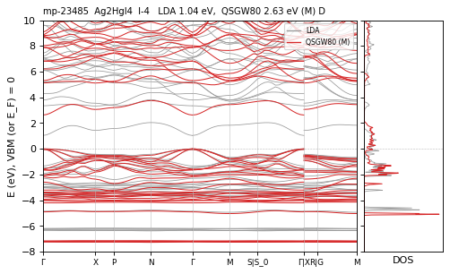

**mp-570256** Ag2HgI4 — QSGW80 **2.54** M eV D  — ecalj 2026-04/05 (~/bin2, all-TF32 --mp)

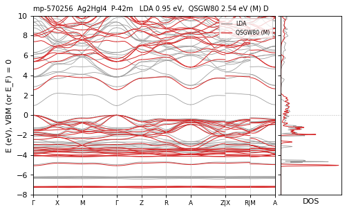

**mp-5928** Al2CdS4 — QSGW80 **4.47** M eV I  — ecalj 2026-04/05 (~/bin2, all-TF32 --mp)

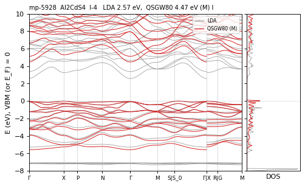

**mp-3159** Al2CdSe4 — QSGW80 **3.49** N / M 3.43 eV D differs — ecalj 989a18637 (tf32, t_tetrakbt -300)

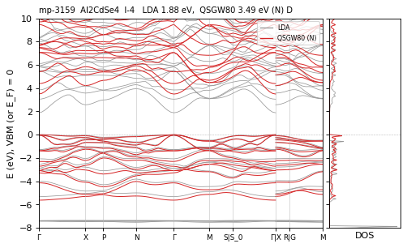

**mp-7909** Al2CdTe4 — QSGW80 **2.71** M eV D  — ecalj 2026-04/05 (~/bin2, all-TF32 --mp)

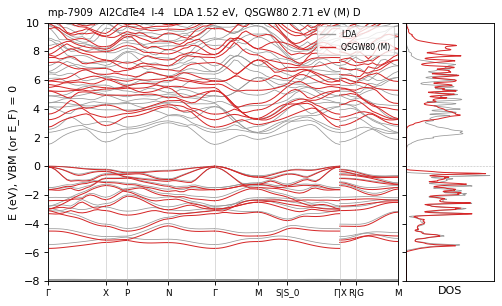

**mp-7906** Al2HgS4 — QSGW80 **3.49** M eV I  — ecalj 2026-04/05 (~/bin2, all-TF32 --mp)

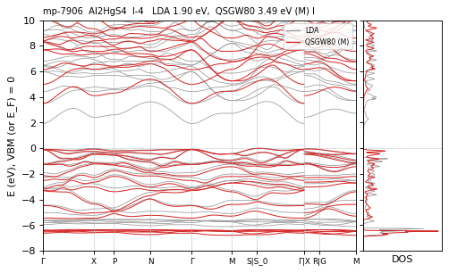

**mp-3038** Al2HgSe4 — QSGW80 **2.67** M eV D  — ecalj 2026-04/05 (~/bin2, all-TF32 --mp)

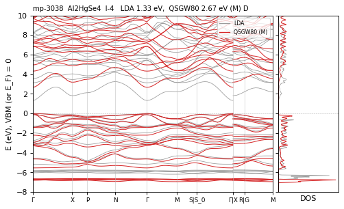

**mp-7910** Al2HgTe4 — QSGW80 **2.05** M eV D  — ecalj 2026-04/05 (~/bin2, all-TF32 --mp)

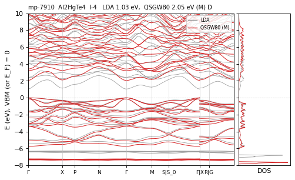

**mp-9254** Al2Te5 — QSGW80 **1.74** M eV I  — ecalj 2026-04/05 (~/bin2, all-TF32 --mp)

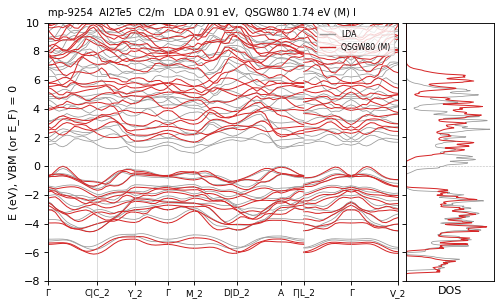

**mp-7907** Al2ZnSe4 — QSGW80 **3.79** M eV D  — ecalj 2026-04/05 (~/bin2, all-TF32 --mp)

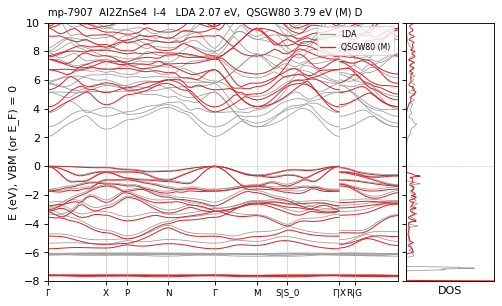

**mp-7908** Al2ZnTe4 — QSGW80 **2.72** M eV I  — ecalj 2026-04/05 (~/bin2, all-TF32 --mp)

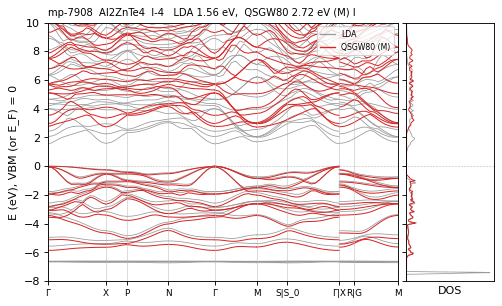

**mp-1591** Al4C3 — QSGW80 **2.24** M eV I  — ecalj 2026-04/05 (~/bin2, all-TF32 --mp)

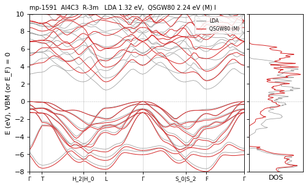

**mp-9321** Ba2HfS4 — QSGW80 **2.20** N / M ≈ eV I  — ecalj 989a18637 (tf32, t_tetrakbt -300)

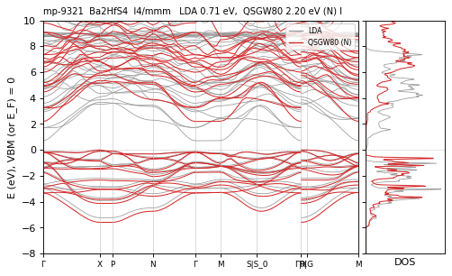

**mp-20098** Ba2PbO4 — QSGW80 **2.64** N / M 2.57 eV I differs — ecalj 989a18637 (tf32, t_tetrakbt -300)

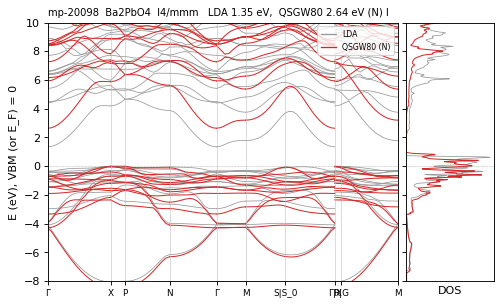

**mp-3359** Ba2SnO4 — QSGW80 **4.73** N / M 4.87 eV I differs — ecalj 989a18637 (tf32, t_tetrakbt -300)

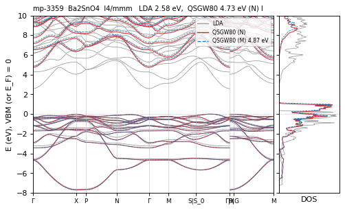

**mp-8335** Ba2ZrO4 — QSGW80 **5.40** R eV I  — ecalj 989a18637 (fp32, t_tetrakbt +300)

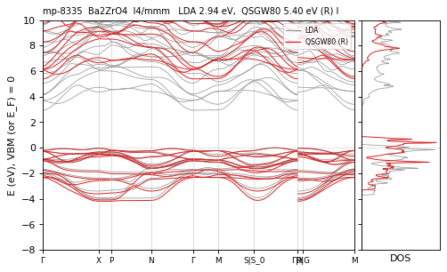

**mp-3813** Ba2ZrS4 — QSGW80 **1.87** M eV I  — ecalj 2026-04/05 (~/bin2, all-TF32 --mp)

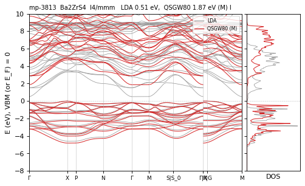

**mp-545788** Ba3ZnN2O — QSGW80 **1.57** M eV I  — ecalj 2026-04/05 (~/bin2, all-TF32 --mp)

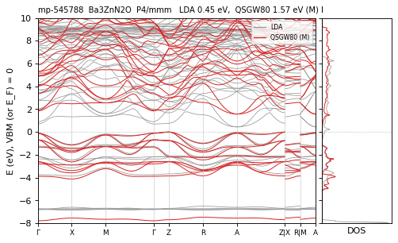

**mp-8300** Ba4As2O — QSGW80 **1.63** M eV D  — ecalj 2026-04/05 (~/bin2, all-TF32 --mp)

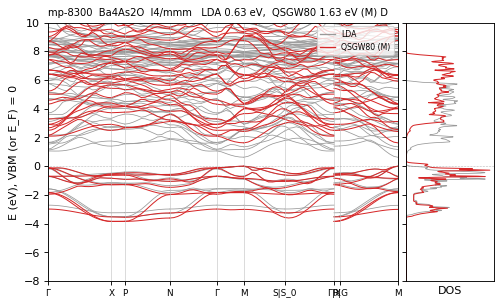

**mp-9774** Ba4Sb2O — QSGW80 **1.71** M eV D  — ecalj 2026-04/05 (~/bin2, all-TF32 --mp)

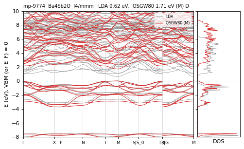

**mp-550751** BaBeSiO4 — QSGW80 **7.05** M eV I  — ecalj 2026-04/05 (~/bin2, all-TF32 --mp)

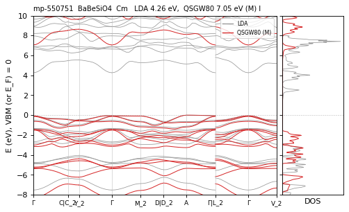

**mp-1077866** BaZnBO3F — QSGW80 **6.34** N / M ≈ eV I  — ecalj 989a18637 (tf32, t_tetrakbt -300)

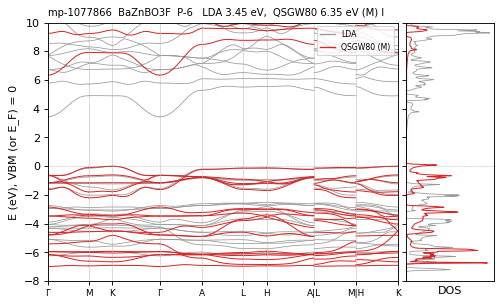

**mp-676250** Bi2Te4Pb — QSGW80 **1.03** N / M ≈ eV D  — ecalj 989a18637 (tf32, t_tetrakbt -300)

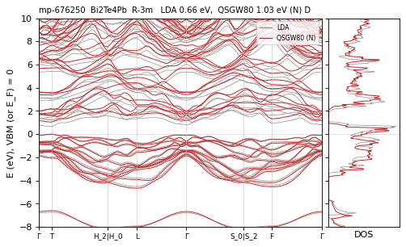

**mp-570572** C3N4 — QSGW80 **3.75** R eV D  — ecalj 989a18637 (fp32, t_tetrakbt +300)

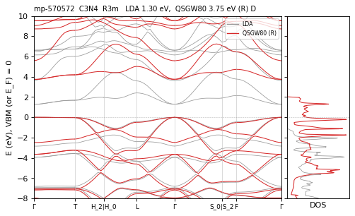

**mp-571653** C3N4 — QSGW80 **4.49** M eV D  — ecalj 2026-04/05 (~/bin2, all-TF32 --mp)

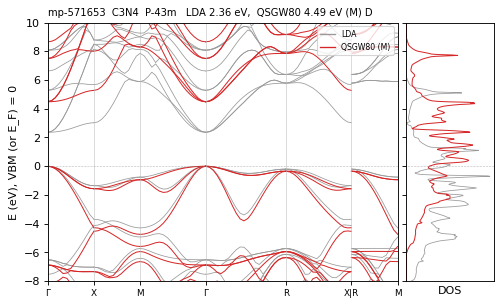

**mp-13650** Ca2GeO4 — QSGW80 **5.32** M eV I  — ecalj 2026-04/05 (~/bin2, all-TF32 --mp)

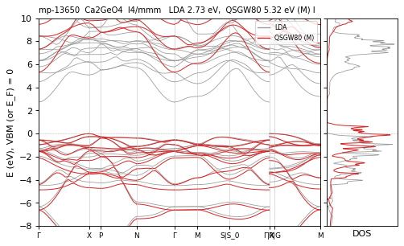

**mp-8682** Ca2SiO4 — QSGW80 **7.19** R eV I  — ecalj 989a18637 (fp32, t_tetrakbt +300)

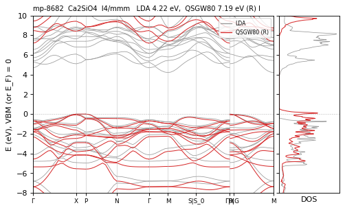

**mp-27294** Ca3AsBr3 — QSGW80 **3.55** M eV D  — ecalj 2026-04/05 (~/bin2, all-TF32 --mp)

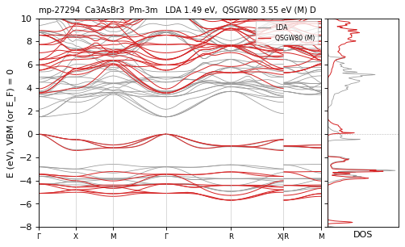

**mp-28069** Ca3AsCl3 — QSGW80 **3.97** M eV D  — ecalj 2026-04/05 (~/bin2, all-TF32 --mp)

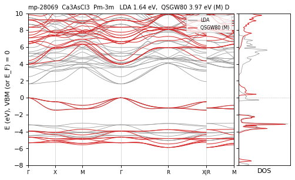

**mp-30315** Ca3BN3 — QSGW80 **1.41** M eV I  — ecalj 2026-04/05 (~/bin2, all-TF32 --mp)

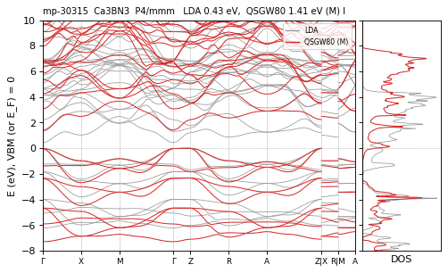

**mp-29342** Ca3PCl3 — QSGW80 **3.93** N / M 4.03 eV D differs — ecalj 989a18637 (tf32, t_tetrakbt -300)

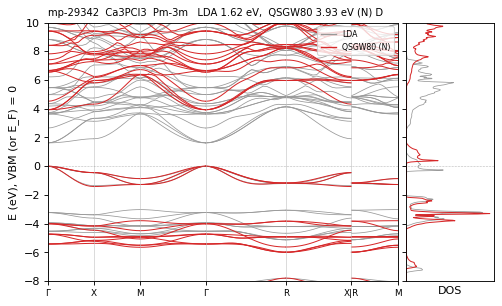

**mp-8789** Ca4As2O — QSGW80 **2.45** N / M 2.50 eV I differs — ecalj 989a18637 (tf32, t_tetrakbt -300)

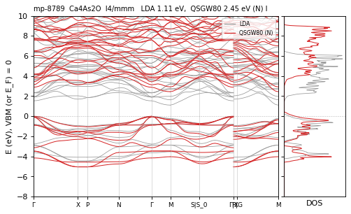

**mp-551873** Ca4Bi2O — QSGW80 **1.95** N / M ≈ eV I  — ecalj 989a18637 (tf32, t_tetrakbt -300)

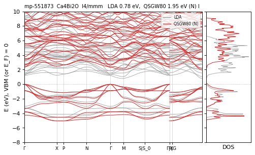

**mp-5380** Ca4P2O — QSGW80 **2.58** N / M 2.50 eV I differs — ecalj 989a18637 (tf32, t_tetrakbt -300)

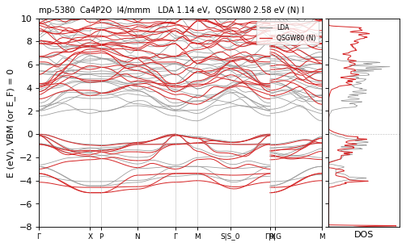

**mp-13660** Ca4Sb2O — QSGW80 **2.01** M eV I  — ecalj 2026-04/05 (~/bin2, all-TF32 --mp)

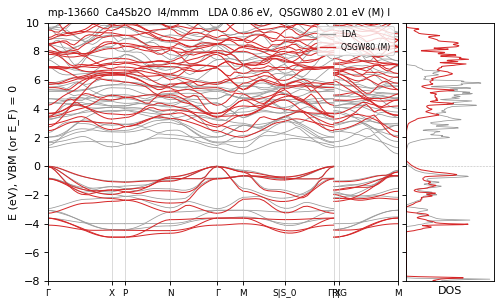

**mp-1025377** CdAg2I4 — QSGW80 **3.43** N / M 3.49 eV D differs — ecalj 989a18637 (tf32, t_tetrakbt -300)

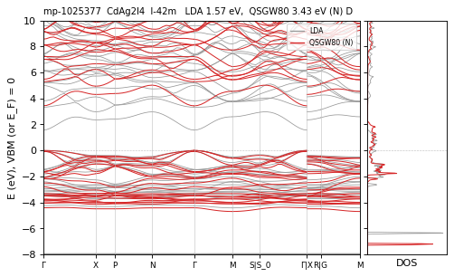

**mp-4452** CdGa2S4 — QSGW80 **3.57** M eV D  — ecalj 2026-04/05 (~/bin2, all-TF32 --mp)

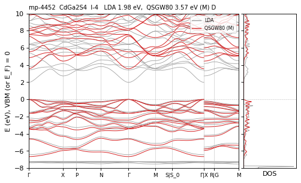

**mp-3772** CdGa2Se4 — QSGW80 **2.59** N / M ≈ eV D  — ecalj 989a18637 (tf32, t_tetrakbt -300)

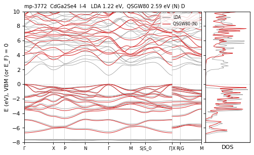

**mp-13949** CdGa2Te4 — QSGW80 **2.00** M eV D  — ecalj 2026-04/05 (~/bin2, all-TF32 --mp)

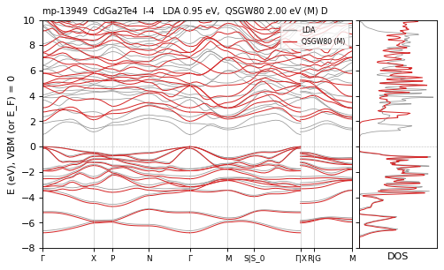

**mp-22304** CdIn2Se4 — QSGW80 **2.02** M eV D  — ecalj 2026-04/05 (~/bin2, all-TF32 --mp)

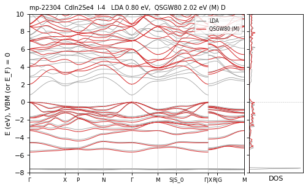

**mp-568032** CdIn2Se4 — QSGW80 **1.97** M eV D  — ecalj 2026-04/05 (~/bin2, all-TF32 --mp)

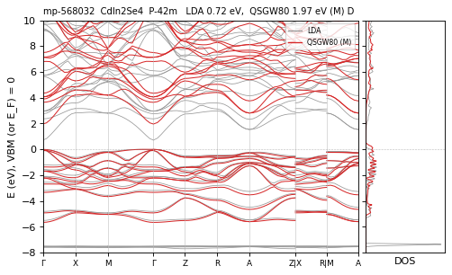

**mp-568661** CdIn2Se4 — QSGW80 **1.79** M eV D  — ecalj 2026-04/05 (~/bin2, all-TF32 --mp)

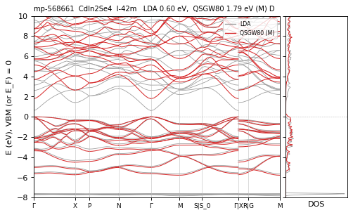

**mp-21374** CdIn2Te4 — QSGW80 **1.70** N / M ≈ eV D  — ecalj 989a18637 (tf32, t_tetrakbt -300)

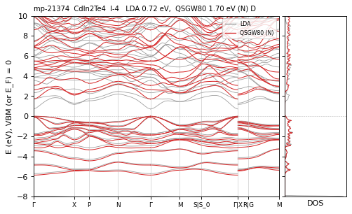

**mp-1077904** CdPb2Cl2O2 — QSGW80 **3.95** R eV I  — ecalj 989a18637 (fp32, t_tetrakbt +300)

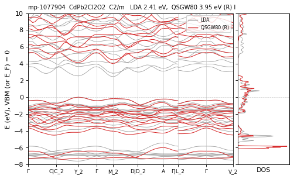

**mp-15157** Cs2CaF4 — QSGW80 **9.99** R eV I  — ecalj 989a18637 (fp32, t_tetrakbt +300)

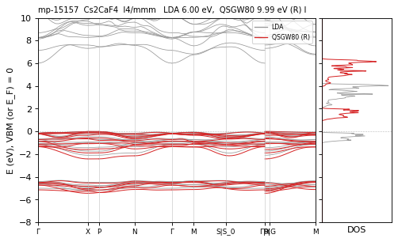

**mp-697133** Cs2CaH4 — QSGW80 **5.64** R eV I  — ecalj 989a18637 (fp32, t_tetrakbt +300)

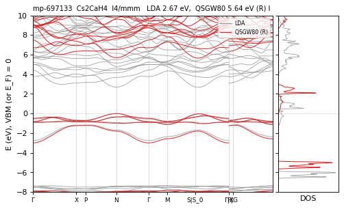

**mp-8963** Cs2HgF4 — QSGW80 **5.11** R eV I  — ecalj 989a18637 (fp32, t_tetrakbt +300)

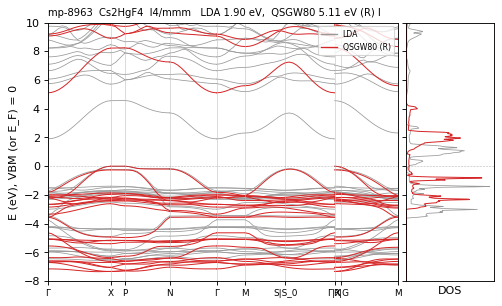

**mp-23752** Cs2MgH4 — QSGW80 **5.34** M eV I  — ecalj 2026-04/05 (~/bin2, all-TF32 --mp)

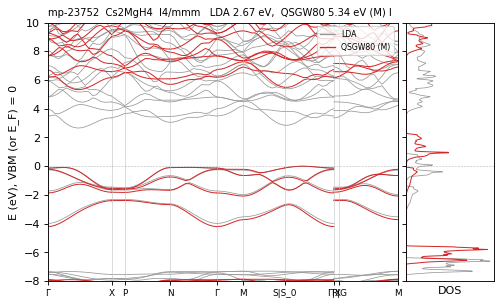

**mp-1078085** Cs2PdCl4 — QSGW80 **4.59** M eV D  — ecalj 2026-04/05 (~/bin2, all-TF32 --mp)

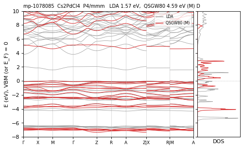

**mp-551629** CsLiMoO4 — QSGW80 **6.91** M eV D  — ecalj 2026-04/05 (~/bin2, all-TF32 --mp)

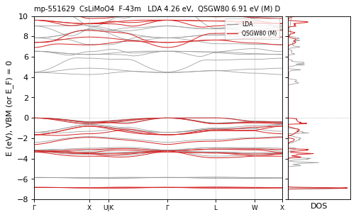

**mp-23353** Cu2HgI4 — QSGW80 **1.85** M eV D  — ecalj 2026-04/05 (~/bin2, all-TF32 --mp)

**mp-568598** Cu2HgI4 — QSGW80 **1.55** M eV I  — ecalj 2026-04/05 (~/bin2, all-TF32 --mp)

**mp-557373** Cu2WS4 — QSGW80 **2.70** M eV I  — ecalj 2026-04/05 (~/bin2, all-TF32 --mp)

**mp-8976** Cu2WS4 — QSGW80 **2.62** N / M ≈ eV I  — ecalj 989a18637 (tf32, t_tetrakbt -300)

**mp-4809** Ga2HgS4 — QSGW80 **2.83** M eV D  — ecalj 2026-04/05 (~/bin2, all-TF32 --mp)

**mp-4730** Ga2HgSe4 — QSGW80 **1.97** M eV D  — ecalj 2026-04/05 (~/bin2, all-TF32 --mp)

**mp-16337** Ga2HgTe4 — QSGW80 **1.46** M eV D  — ecalj 2026-04/05 (~/bin2, all-TF32 --mp)

**mp-2371** Ga2Te5 — QSGW80 **1.55** N / M ≈ eV I  — ecalj 989a18637 (tf32, t_tetrakbt -300)

**mp-27948** GeBi2Te4 — QSGW80 **1.05** M eV D  — ecalj 2026-04/05 (~/bin2, all-TF32 --mp)

**mp-14790** GeTe4As2 — QSGW80 **0.74** N / M ≈ · path 0.43 eV D path<mesh(mesh) — ecalj 989a18637 (tf32, t_tetrakbt -300)

**mp-3167** Hg2GeSe4 — QSGW80 **1.21** N / M ≈ eV D  — ecalj 989a18637 (tf32, t_tetrakbt -300)

**mp-655275** HgC2S2N2 — QSGW80 **4.25** M eV I  — ecalj 2026-04/05 (~/bin2, all-TF32 --mp)

**mp-546862** HgPb2Cl2O2 — QSGW80 **3.64** R eV I  — ecalj 989a18637 (fp32, t_tetrakbt +300)

**mp-20731** In2HgSe4 — QSGW80 **1.56** M eV D  — ecalj 2026-04/05 (~/bin2, all-TF32 --mp)

**mp-19765** In2HgTe4 — QSGW80 **1.28** M eV D  — ecalj 2026-04/05 (~/bin2, all-TF32 --mp)

**mp-1077901** InCo3SnS2 — QSGW80 **0.27** R eV I  — ecalj 989a18637 (fp32, t_tetrakbt +300)

**mp-643257** K2H4Pd — QSGW80 **5.47** M eV D  — ecalj 2026-04/05 (~/bin2, all-TF32 --mp)

**mp-27207** K2MgCl4 — QSGW80 **7.93** N / M ≈ eV I  — ecalj 989a18637 (tf32, t_tetrakbt -300)

**mp-31212** K2MgF4 — QSGW80 **11.15** R eV I  — ecalj 989a18637 (fp32, t_tetrakbt +300)

**mp-23956** K2MgH4 — QSGW80 **6.27** N / M 6.20 eV I differs — ecalj 989a18637 (tf32, t_tetrakbt -300)

**mp-27138** K2PdBr4 — QSGW80 **3.76** M eV I  — ecalj 2026-04/05 (~/bin2, all-TF32 --mp)

**mp-22956** K2PdCl4 — QSGW80 **4.32** M eV I  — ecalj 2026-04/05 (~/bin2, all-TF32 --mp)

**mp-28163** K2PdF4 — QSGW80 **6.51** N / M 6.60 eV I differs — ecalj 989a18637 (tf32, t_tetrakbt -300)

**mp-27243** K2PtBr4 — QSGW80 **3.95** N / M ≈ eV I  — ecalj 989a18637 (tf32, t_tetrakbt -300)

**mp-22934** K2PtCl4 — QSGW80 **4.62** R eV I  — ecalj 989a18637 (fp32, t_tetrakbt +300)

**mp-7502** K2Sn2O3 — QSGW80 **2.47** M eV D  — ecalj 2026-04/05 (~/bin2, all-TF32 --mp)

**mp-9583** K2ZnF4 — QSGW80 **8.86** R eV I  — ecalj 989a18637 (fp32, t_tetrakbt +300)

**mp-29584** K4BeAs2 — QSGW80 **1.99** N / M 2.04 eV I differs — ecalj 989a18637 (tf32, t_tetrakbt -300)

**mp-9872** K4BeP2 — QSGW80 **2.25** R eV I  — ecalj 989a18637 (fp32, t_tetrakbt +300)

**mp-28627** K4Br2O — QSGW80 **3.40** R eV D  — ecalj 989a18637 (fp32, t_tetrakbt +300)

**mp-29585** K4CdAs2 — QSGW80 **1.62** N / M 1.11 / R ≈ eV I CHECK — ecalj 989a18637 (tf32, t_tetrakbt -300)

**mp-28302** K4CdP2 — QSGW80 **1.70** M eV I  — ecalj 2026-04/05 (~/bin2, all-TF32 --mp)

**mp-29484** K4HgAs2 — QSGW80 **1.55** M eV I  — ecalj 2026-04/05 (~/bin2, all-TF32 --mp)

**mp-8753** K4HgP2 — QSGW80 **1.93** N / M 1.64 / R ≈ eV I CHECK — ecalj 989a18637 (tf32, t_tetrakbt -300)

**mp-571461** K4ZnAs2 — QSGW80 **1.78** R eV I  — ecalj 989a18637 (fp32, t_tetrakbt +300)

**mp-11719** K4ZnP2 — QSGW80 **2.01** N / M 1.89 eV I differs — ecalj 989a18637 (tf32, t_tetrakbt -300)

**mp-6867** KCaCO3F — QSGW80 **7.40** M eV I  — ecalj 2026-04/05 (~/bin2, all-TF32 --mp)

**mp-865427** KSrCO3F — QSGW80 **7.09** M eV D  — ecalj 2026-04/05 (~/bin2, all-TF32 --mp)

**mp-29009** Li2MgBr4 — QSGW80 **7.13** M eV D  — ecalj 2026-04/05 (~/bin2, all-TF32 --mp)

**mp-549308** LiGeBO4 — QSGW80 **5.75** R eV I  — ecalj 989a18637 (fp32, t_tetrakbt +300)

**mp-8873** LiGeBO4 — QSGW80 **7.63** R eV I  — ecalj 989a18637 (fp32, t_tetrakbt +300)

**mp-8874** LiSiBO4 — QSGW80 **9.48** M eV I  — ecalj 2026-04/05 (~/bin2, all-TF32 --mp)

**mp-11175** LiZnPS4 — QSGW80 **4.61** M eV I  — ecalj 2026-04/05 (~/bin2, all-TF32 --mp)

**mp-7983** Mg2SiO4 — QSGW80 **6.35** R eV I  — ecalj 989a18637 (fp32, t_tetrakbt +300)

**mp-7604** Mg3NF3 — QSGW80 **7.03** M eV D  — ecalj 2026-04/05 (~/bin2, all-TF32 --mp)

**mp-16755** MgAl2S4 — QSGW80 **3.94** M eV D  — ecalj 2026-04/05 (~/bin2, all-TF32 --mp)

**mp-9479** MgAl2Se4 — QSGW80 **2.77** M eV D  — ecalj 2026-04/05 (~/bin2, all-TF32 --mp)

**mp-558836** MoF6 — QSGW80 **7.84** M eV I  — ecalj 2026-04/05 (~/bin2, all-TF32 --mp)

**mp-643260** Na2H4Pd — QSGW80 **4.65** N / M 4.53 eV D differs — ecalj 989a18637 (tf32, t_tetrakbt -300)

**mp-697096** Na2H4Pt — QSGW80 **4.43** M eV I  — ecalj 2026-04/05 (~/bin2, all-TF32 --mp)

**mp-28599** Na4Br2O — QSGW80 **4.71** M eV D  — ecalj 2026-04/05 (~/bin2, all-TF32 --mp)

**mp-8752** Na4CdP2 — QSGW80 **1.84** M eV I  — ecalj 2026-04/05 (~/bin2, all-TF32 --mp)

**mp-28591** Na4HgP2 — QSGW80 **1.96** R eV I  — ecalj 989a18637 (fp32, t_tetrakbt +300)

**mp-22937** Na4I2O — QSGW80 **4.76** R eV D  — ecalj 989a18637 (fp32, t_tetrakbt +300)

**mp-10426** Nb2O5 — QSGW80 **3.09** M eV I  — ecalj 2026-04/05 (~/bin2, all-TF32 --mp)

**mp-1595** Nb2O5 — QSGW80 **3.88** M eV I  — ecalj 2026-04/05 (~/bin2, all-TF32 --mp)

**mp-551826** NbTlBr4O — QSGW80 **2.67** R eV I  — ecalj 989a18637 (fp32, t_tetrakbt +300)

**mp-24517** Rb2CaH4 — QSGW80 **6.23** N / M ≈ eV D  — ecalj 989a18637 (tf32, t_tetrakbt -300)

**mp-29873** Rb2CdCl4 — QSGW80 **5.88** N / M 5.69 eV I differs — ecalj 989a18637 (tf32, t_tetrakbt -300)

**mp-8962** Rb2HgF4 — QSGW80 **5.09** R eV I  — ecalj 989a18637 (fp32, t_tetrakbt +300)

**mp-8861** Rb2MgF4 — QSGW80 **10.69** N / M 10.58 eV I differs — ecalj 989a18637 (tf32, t_tetrakbt -300)

**mp-7863** Rb2Sn2O3 — QSGW80 **2.41** R eV D  — ecalj 989a18637 (fp32, t_tetrakbt +300)

**mp-31002** Rb2Te5 — QSGW80 **0.98** N / M ≈ eV I  — ecalj 989a18637 (tf32, t_tetrakbt -300)

**mp-1077942** Rb2TeSe4 — QSGW80 **2.02** N / M ≈ eV I  — ecalj 989a18637 (tf32, t_tetrakbt -300)

**mp-30004** Rb4Br2O — QSGW80 **2.82** R eV D  — ecalj 989a18637 (fp32, t_tetrakbt +300)

**mp-863745** RbSrCO3F — QSGW80 **7.26** N / M 5.33 eV D CHECK — ecalj 989a18637 (tf32, t_tetrakbt -300)

*May value 5.33 eV wrong (N 7.26, 2025 8.01)*

**mp-8560** SF6 — QSGW80 **12.14** N / M 12.55 eV D CHECK — ecalj 989a18637 (tf32, t_tetrakbt -300)

**mp-31507** Sb2Te4Pb — QSGW80 **0.68** N / M ≈ eV D  — ecalj 989a18637 (tf32, t_tetrakbt -300)

**mp-7700** SiB6 — QSGW80 **0.27** R eV I  — ecalj 989a18637 (fp32, t_tetrakbt +300)

**mp-10955** SnHg2Se4 — QSGW80 **1.00** M eV D  — ecalj 2026-04/05 (~/bin2, all-TF32 --mp)

**mp-27947** SnSb2Te4 — QSGW80 **0.52** M eV D  — ecalj 2026-04/05 (~/bin2, all-TF32 --mp)

**mp-567655** Sr2CN2Cl2 — QSGW80 **6.25** N / M ≈ eV I  — ecalj 989a18637 (tf32, t_tetrakbt -300)

**mp-3376** Sr2SnO4 — QSGW80 **5.04** R eV I  — ecalj 989a18637 (fp32, t_tetrakbt +300)

**mp-5532** Sr2TiO4 — QSGW80 **4.06** R eV I vs2025 — ecalj 989a18637 (fp32, t_tetrakbt +300)

**mp-8299** Sr4As2O — QSGW80 **2.25** M eV I  — ecalj 2026-04/05 (~/bin2, all-TF32 --mp)

**mp-8298** Sr4P2O — QSGW80 **2.25** N / M 2.32 eV I differs — ecalj 989a18637 (tf32, t_tetrakbt -300)

**mp-570097** SrLi4P2 — QSGW80 **1.88** R eV I  — ecalj 989a18637 (fp32, t_tetrakbt +300)

**mp-554867** Ta2O5 — QSGW80 **1.85** M eV I  — ecalj 2026-04/05 (~/bin2, all-TF32 --mp)

**mp-624688** Ta2O5 — QSGW80 **4.03** N / M 4.47 eV I CHECK — ecalj 989a18637 (tf32, t_tetrakbt -300)

**mp-1025299** Tl2CdTe4 — QSGW80 **0.53** M eV D  — ecalj 2026-04/05 (~/bin2, all-TF32 --mp)

**mp-29889** Tl2PdCl4 — QSGW80 **2.98** M eV I  — ecalj 2026-04/05 (~/bin2, all-TF32 --mp)

**mp-9791** Tl3AsS3 — QSGW80 **1.79** N / M ≈ eV I  — ecalj 989a18637 (tf32, t_tetrakbt -300)

**mp-7684** Tl3AsSe3 — QSGW80 **1.32** M eV D  — ecalj 2026-04/05 (~/bin2, all-TF32 --mp)

**mp-8393** Tl3SbS3 — QSGW80 **2.14** N / M ≈ eV D  — ecalj 989a18637 (tf32, t_tetrakbt -300)

**mp-720166** V2O5 — QSGW80 **2.42** M eV I  — ecalj 2026-04/05 (~/bin2, all-TF32 --mp)

**mp-28483** WBr6 — QSGW80 **2.15** M eV D  — ecalj 2026-04/05 (~/bin2, all-TF32 --mp)

**mp-571518** WCl6 — QSGW80 **3.50** R eV I  — ecalj 989a18637 (fp32, t_tetrakbt +300)

**mp-546864** Y2CN2O2 — QSGW80 **5.57** N / M 5.73 eV I differs — ecalj 989a18637 (tf32, t_tetrakbt -300)

**mp-1078049** ZnGa2S4 — QSGW80 **3.47** N / M ≈ eV D  — ecalj 989a18637 (tf32, t_tetrakbt -300)

**mp-5350** ZnGa2S4 — QSGW80 **3.81** N / M ≈ eV D  — ecalj 989a18637 (tf32, t_tetrakbt -300)

**mp-15776** ZnGa2Se4 — QSGW80 **2.74** N / M ≈ eV D  — ecalj 989a18637 (tf32, t_tetrakbt -300)

**mp-15777** ZnGa2Te4 — QSGW80 **1.94** M eV I  — ecalj 2026-04/05 (~/bin2, all-TF32 --mp)

**mp-22253** ZnIn2S4 — QSGW80 **1.14** M eV D  — ecalj 2026-04/05 (~/bin2, all-TF32 --mp)

**mp-541937** ZnIn2S4 — QSGW80 **1.15** M eV D  — ecalj 2026-04/05 (~/bin2, all-TF32 --mp)

**mp-22607** ZnIn2Se4 — QSGW80 **2.11** N / M ≈ eV D  — ecalj 989a18637 (tf32, t_tetrakbt -300)

**mp-20832** ZnIn2Te4 — QSGW80 **1.77** M eV D  — ecalj 2026-04/05 (~/bin2, all-TF32 --mp)

