# GW1500 QSGW80 — bands and DOS, 8 atoms per cell

[README](README.md) · [table](table.md)

Gray: LDA. Red: QSGW80 adopted (condition in parentheses). Blue dashed: another QSGW80 result when its gap differs by more than 0.1 eV. Energies from the VBM (insulators) or E_F (metals). Right: total DOS.

**mp-545730** Ag2C2N2O2 — QSGW80 **3.44** R eV I  — ecalj 989a18637 (fp32, t_tetrakbt +300)

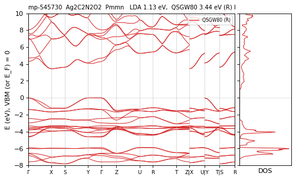

**mp-6070** Ag2C2N2O2 — QSGW80 **4.64** R eV I  — ecalj 989a18637 (fp32, t_tetrakbt +300)

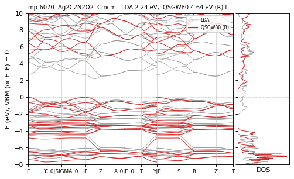

**mp-6781** Ag2C2N2O2 — QSGW80 **5.60** R eV I  — ecalj 989a18637 (fp32, t_tetrakbt +300)

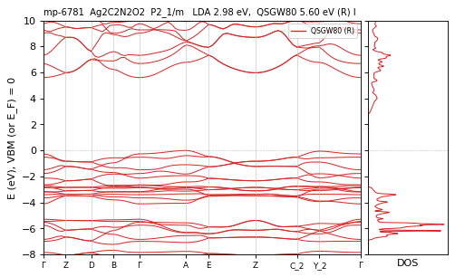

**mp-1079156** Ag2Cl2O4 — QSGW80 **4.21** R eV I  — ecalj 989a18637 (fp32, t_tetrakbt +300)

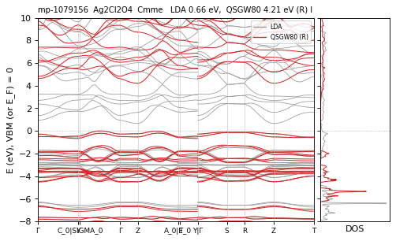

**mp-552169** Ag2Cl2O4 — QSGW80 **3.80** R eV D  — ecalj 989a18637 (fp32, t_tetrakbt +300)

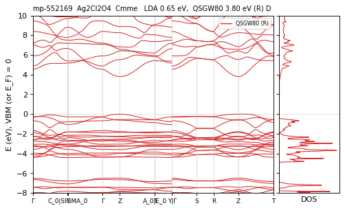

**mp-2247** Ag2N6 — QSGW80 **3.64** R eV I  — ecalj 989a18637 (fp32, t_tetrakbt +300)

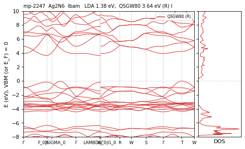

**mp-571297** Ag2N6 — QSGW80 **3.33** R eV D  — ecalj 989a18637 (fp32, t_tetrakbt +300)

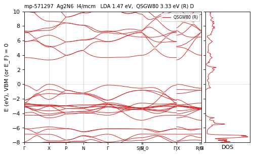

**mp-559470** Ag2Pb2Br2O2 — QSGW80 **1.72** M eV D  — ecalj 2026-04/05 (~/bin2, all-TF32 --mp)

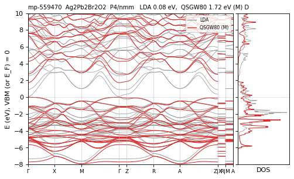

**mp-580941** Ag4I4 — QSGW80 **3.09** M eV D  — ecalj 2026-04/05 (~/bin2, all-TF32 --mp)

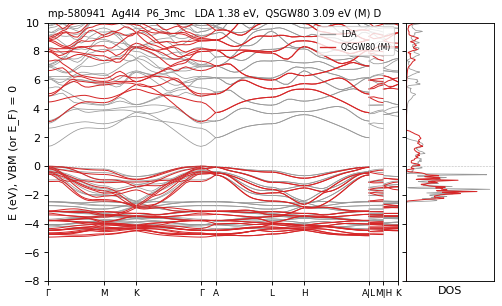

**mp-1079720** Ag4O4 — QSGW80 **0.62** M eV I  — ecalj 2026-04/05 (~/bin2, all-TF32 --mp)

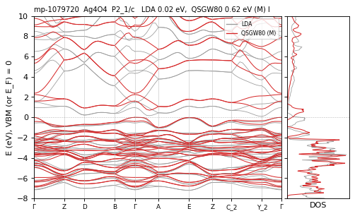

**mp-9631** Al2Ag2O4 — QSGW80 **3.22** M eV I  — ecalj 2026-04/05 (~/bin2, all-TF32 --mp)

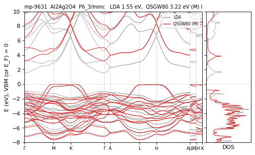

**mp-5782** Al2Ag2S4 — QSGW80 **3.49** M eV D  — ecalj 2026-04/05 (~/bin2, all-TF32 --mp)

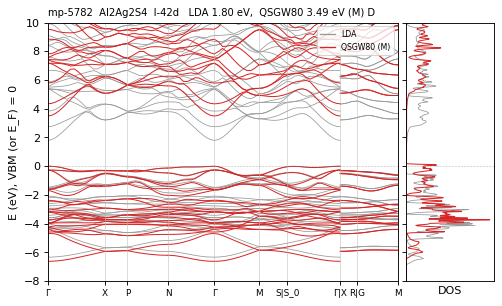

**mp-14091** Al2Ag2Se4 — QSGW80 **2.62** M eV D  — ecalj 2026-04/05 (~/bin2, all-TF32 --mp)

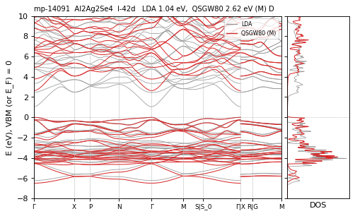

**mp-14092** Al2Ag2Te4 — QSGW80 **2.21** M eV D  — ecalj 2026-04/05 (~/bin2, all-TF32 --mp)

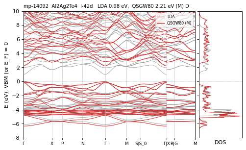

**mp-25469** Al2Cl6 — QSGW80 **8.01** M eV I  — ecalj 2026-04/05 (~/bin2, all-TF32 --mp)

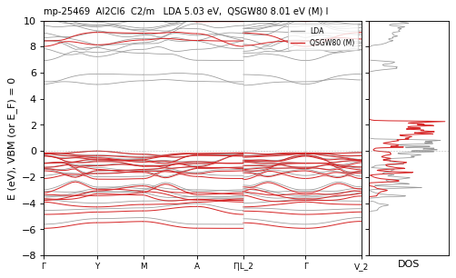

**mp-3098** Al2Cu2O4 — QSGW80 **3.86** R eV I  — ecalj 989a18637 (fp32, t_tetrakbt +300)

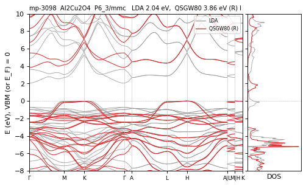

**mp-4979** Al2Cu2S4 — QSGW80 **3.09** M eV D  — ecalj 2026-04/05 (~/bin2, all-TF32 --mp)

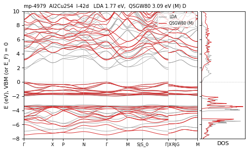

**mp-8016** Al2Cu2Se4 — QSGW80 **2.32** M eV D  — ecalj 2026-04/05 (~/bin2, all-TF32 --mp)

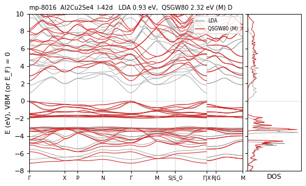

**mp-8017** Al2Cu2Te4 — QSGW80 **2.24** M eV D  — ecalj 2026-04/05 (~/bin2, all-TF32 --mp)

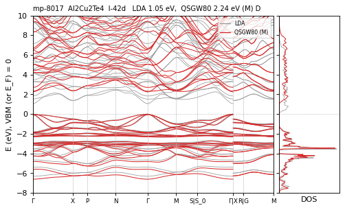

**mp-468** Al2F6 — QSGW80 **13.20** R eV D  — ecalj 989a18637 (fp32, t_tetrakbt +300)

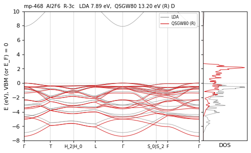

**mp-23807** Al2H2O4 — QSGW80 **8.63** R eV D  — ecalj 989a18637 (fp32, t_tetrakbt +300)

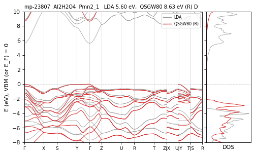

**mp-23933** Al2H6 — QSGW80 **5.12** M eV I  — ecalj 2026-04/05 (~/bin2, all-TF32 --mp)

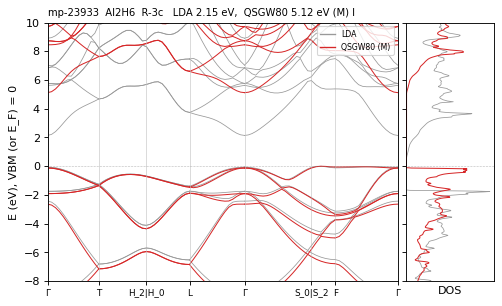

**mp-9579** Al2Tl2Se4 — QSGW80 **1.40** M eV I  — ecalj 2026-04/05 (~/bin2, all-TF32 --mp)

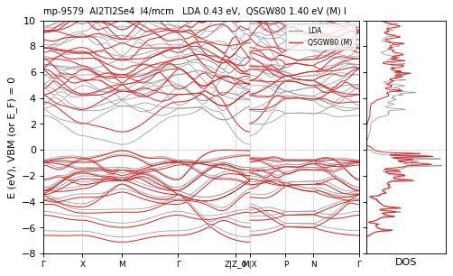

**mp-23218** As2I6 — QSGW80 **3.41** R eV I  — ecalj 989a18637 (fp32, t_tetrakbt +300)

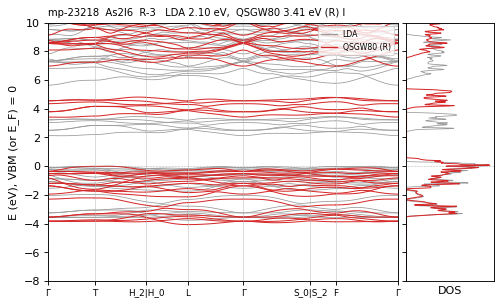

**mp-561703** Au2C2Cl2O2 — QSGW80 **5.60** M eV I  — ecalj 2026-04/05 (~/bin2, all-TF32 --mp)

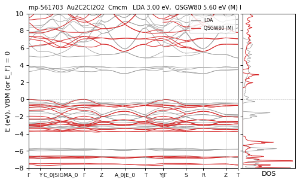

**mp-505366** Au4Br4 — QSGW80 **3.12** N / M ≈ eV D  — ecalj 989a18637 (tf32, t_tetrakbt -300)

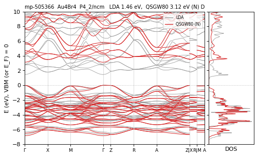

**mp-570140** Au4Br4 — QSGW80 **3.47** R eV D  — ecalj 989a18637 (fp32, t_tetrakbt +300)

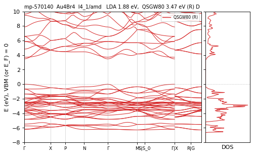

**mp-32780** Au4Cl4 — QSGW80 **3.24** M eV D  — ecalj 2026-04/05 (~/bin2, all-TF32 --mp)

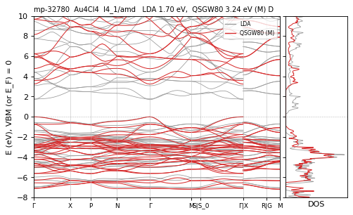

**mp-27725** Au4I4 — QSGW80 **3.07** M eV I  — ecalj 2026-04/05 (~/bin2, all-TF32 --mp)

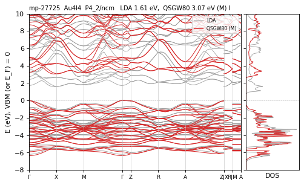

**mp-23225** B2Br6 — QSGW80 **6.72** M eV I  — ecalj 2026-04/05 (~/bin2, all-TF32 --mp)

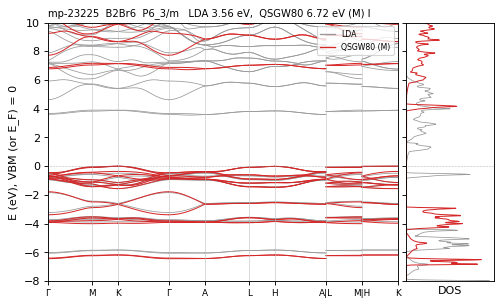

**mp-23184** B2Cl6 — QSGW80 **8.34** R eV I  — ecalj 989a18637 (fp32, t_tetrakbt +300)

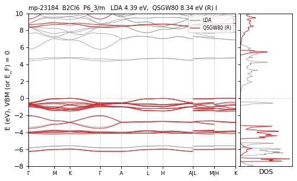

**mp-23189** B2I6 — QSGW80 **4.87** M eV I  — ecalj 2026-04/05 (~/bin2, all-TF32 --mp)

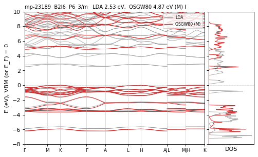

**mp-1086652** Ba2Ag2S2F2 — QSGW80 **2.77** M eV D  — ecalj 2026-04/05 (~/bin2, all-TF32 --mp)

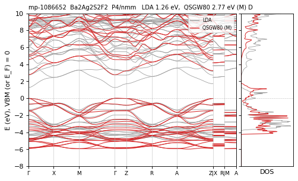

**mp-1079647** Ba2Ag2Se2F2 — QSGW80 **2.57** M eV D  — ecalj 2026-04/05 (~/bin2, all-TF32 --mp)

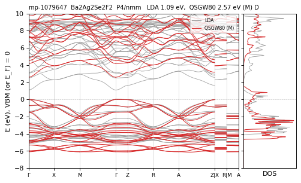

**mp-16742** Ba2Ag2Te2F2 — QSGW80 **2.68** N / M ≈ eV D  — ecalj 989a18637 (tf32, t_tetrakbt -300)

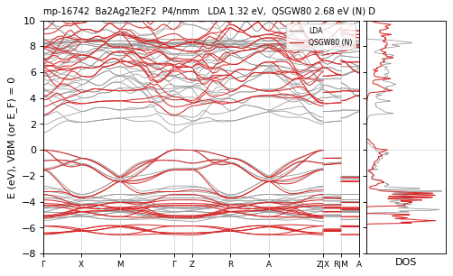

**mp-1095151** Ba2Cd2As2F2 — QSGW80 **1.95** M eV D  — ecalj 2026-04/05 (~/bin2, all-TF32 --mp)

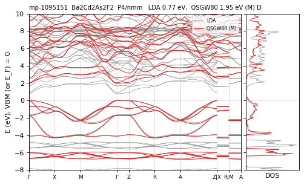

**mp-1079603** Ba2Cd2P2F2 — QSGW80 **2.23** M eV D  — ecalj 2026-04/05 (~/bin2, all-TF32 --mp)

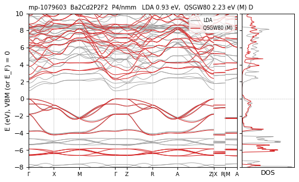

**mp-1078693** Ba2Cd2Sb2F2 — QSGW80 **1.18** M eV D  — ecalj 2026-04/05 (~/bin2, all-TF32 --mp)

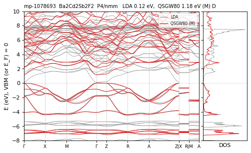

**mp-1080650** Ba2Cu2S2F2 — QSGW80 **3.08** M eV D  — ecalj 2026-04/05 (~/bin2, all-TF32 --mp)

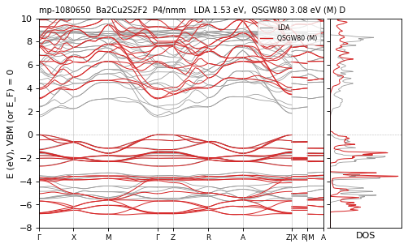

**mp-9195** Ba2Cu2Se2F2 — QSGW80 **2.76** N / M ≈ eV D  — ecalj 989a18637 (tf32, t_tetrakbt -300)

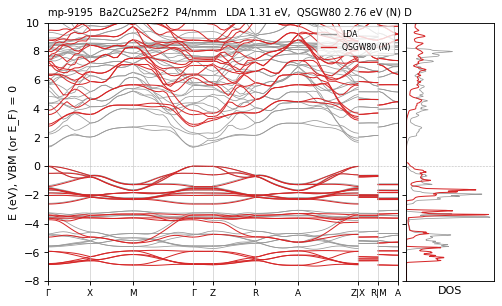

**mp-13287** Ba2Cu2Te2F2 — QSGW80 **2.21** M eV D  — ecalj 2026-04/05 (~/bin2, all-TF32 --mp)

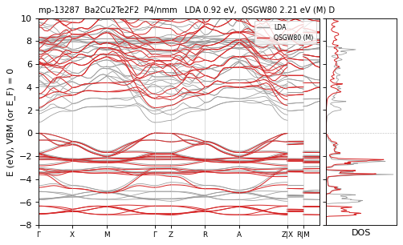

**mp-10322** Ba2Hf2N4 — QSGW80 **2.59** M eV I  — ecalj 2026-04/05 (~/bin2, all-TF32 --mp)

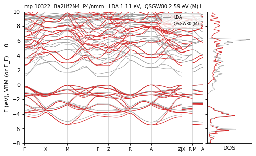

**mp-18943** Ba2Ni2O4 — QSGW80 **2.23** N / M ≈ eV D LDA≠PBE — ecalj 989a18637 (tf32, t_tetrakbt -300)

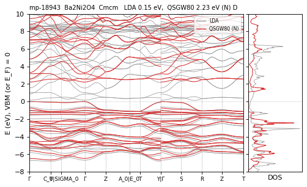

**mp-7808** Ba2P6 — QSGW80 **1.41** M eV I  — ecalj 2026-04/05 (~/bin2, all-TF32 --mp)

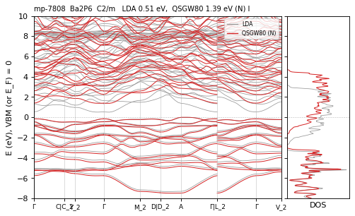

**mp-4009** Ba2Pd2S4 — QSGW80 **1.45** M eV D  — ecalj 2026-04/05 (~/bin2, all-TF32 --mp)

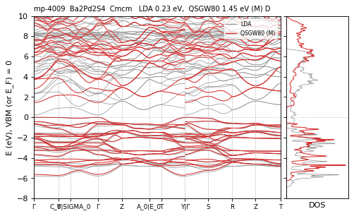

**mp-239** Ba2S6 — QSGW80 **3.04** M eV I  — ecalj 2026-04/05 (~/bin2, all-TF32 --mp)

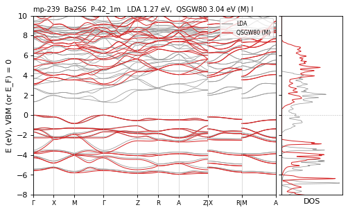

**mp-7548** Ba2Se6 — QSGW80 **2.25** M eV I  — ecalj 2026-04/05 (~/bin2, all-TF32 --mp)

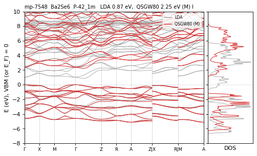

**mp-8234** Ba2Te6 — QSGW80 **1.65** M eV I  — ecalj 2026-04/05 (~/bin2, all-TF32 --mp)

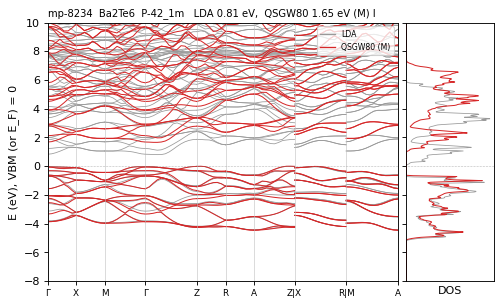

**mp-1079320** Ba2Zn2As2F2 — QSGW80 **1.34** M eV D  — ecalj 2026-04/05 (~/bin2, all-TF32 --mp)

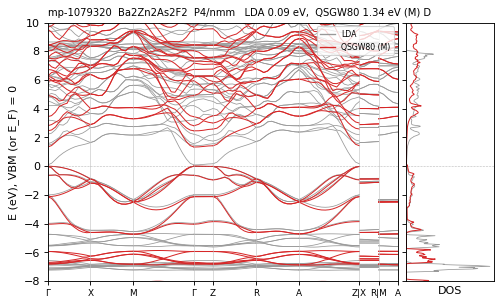

**mp-548469** Ba2Zn2S2O2 — QSGW80 **3.94** N / M 4.05 eV D differs — ecalj 989a18637 (tf32, t_tetrakbt -300)

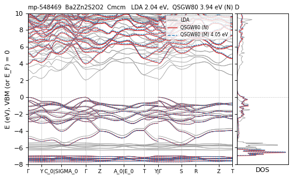

**mp-3104** Ba2Zr2N4 — QSGW80 **2.47** R eV D  — ecalj 989a18637 (fp32, t_tetrakbt +300)

**mp-1078191** Ba4Te2O2 — QSGW80 **3.23** R eV D  — ecalj 989a18637 (fp32, t_tetrakbt +300)

**mp-7394** BaAg2GeS4 — QSGW80 **1.73** M eV I  — ecalj 2026-04/05 (~/bin2, all-TF32 --mp)

**mp-569790** BaAg2GeSe4 — QSGW80 **1.05** M eV I  — ecalj 2026-04/05 (~/bin2, all-TF32 --mp)

**mp-555166** BaAg2SnS4 — QSGW80 **1.63** M eV I  — ecalj 2026-04/05 (~/bin2, all-TF32 --mp)

**mp-569114** BaAg2SnSe4 — QSGW80 **1.00** M eV I  — ecalj 2026-04/05 (~/bin2, all-TF32 --mp)

**mp-14006** BaGeF6 — QSGW80 **10.57** R eV D  — ecalj 989a18637 (fp32, t_tetrakbt +300)

**mp-1080511** BaMgC2O4 — QSGW80 **3.84** R eV D  — ecalj 989a18637 (fp32, t_tetrakbt +300)

**mp-613910** BaNiF6 — QSGW80 **5.37** M eV D  — ecalj 2026-04/05 (~/bin2, all-TF32 --mp)

**mp-19799** BaPbF6 — QSGW80 **6.64** M eV I  — ecalj 2026-04/05 (~/bin2, all-TF32 --mp)

**mp-5588** BaSiF6 — QSGW80 **12.11** M eV D  — ecalj 2026-04/05 (~/bin2, all-TF32 --mp)

**mp-8290** BaSnF6 — QSGW80 **9.69** R eV I  — ecalj 989a18637 (fp32, t_tetrakbt +300)

**mp-8291** BaTiF6 — QSGW80 **8.73** R eV I vs2025 — ecalj 989a18637 (fp32, t_tetrakbt +300)

**mp-7599** Be4O4 — QSGW80 **10.49** M eV I  — ecalj 2026-04/05 (~/bin2, all-TF32 --mp)

**mp-568301** Bi2Br6 — QSGW80 **4.21** M eV D  — ecalj 2026-04/05 (~/bin2, all-TF32 --mp)

**mp-30200** Bi2CO5 — QSGW80 **2.59** M eV I  — ecalj 2026-04/05 (~/bin2, all-TF32 --mp)

**mp-22849** Bi2I6 — QSGW80 **3.49** M eV I  — ecalj 2026-04/05 (~/bin2, all-TF32 --mp)

**mp-569157** Bi2I6 — QSGW80 **3.33** M eV I  — ecalj 2026-04/05 (~/bin2, all-TF32 --mp)

**mp-568388** Bi4I4 — QSGW80 **1.44** R eV D  — ecalj 989a18637 (fp32, t_tetrakbt +300)

**mp-23435** Bi4Te2I2 — QSGW80 **0.33** R eV I  — ecalj 989a18637 (fp32, t_tetrakbt +300)

**mp-23297** Br2F6 — QSGW80 **5.90** N / M 5.76 eV I differs — ecalj 989a18637 (tf32, t_tetrakbt -300)

**mp-11875** C4O4 — QSGW80 **12.11** N / M 12.29 eV D differs — ecalj 989a18637 (tf32, t_tetrakbt -300)

**mp-729933** C4O4 — QSGW80 **11.75** M eV I  — ecalj 2026-04/05 (~/bin2, all-TF32 --mp)

**mp-569416** C8 — QSGW80 **4.97** M · path 0 (semimetal?) eV  path-metal LDA≠PBE vs2025 — ecalj 2026-04/05 (~/bin2, all-TF32 --mp)

*graphite-like fragment (invalid structure); the bands cross E_F on the path*

**mp-570002** C8 — QSGW80 **4.59** M · path 4.44 eV I path<mesh(mesh) — ecalj 2026-04/05 (~/bin2, all-TF32 --mp)

**mp-7801** Ca2Ge2N4 — QSGW80 **4.11** M eV D  — ecalj 2026-04/05 (~/bin2, all-TF32 --mp)

**mp-642725** Ca2H2Cl2O2 — QSGW80 **8.27** M eV D  — ecalj 2026-04/05 (~/bin2, all-TF32 --mp)

**mp-9122** Ca2P6 — QSGW80 **0.44** M eV D  — ecalj 2026-04/05 (~/bin2, all-TF32 --mp)

**mp-7204** Ca2Zn2S2O2 — QSGW80 **4.42** M eV D  — ecalj 2026-04/05 (~/bin2, all-TF32 --mp)

**mp-28553** Ca4I2N2 — QSGW80 **3.54** M eV D  — ecalj 2026-04/05 (~/bin2, all-TF32 --mp)

**mp-1079707** Ca4O4 — QSGW80 **4.85** R / M 4.72 eV D differs — ecalj 989a18637 (fp32, t_tetrakbt +300)

**mp-20463** CaPbF6 — QSGW80 **8.32** R eV I vs2025 — ecalj 989a18637 (fp32, t_tetrakbt +300)

**mp-7922** CaPdF6 — QSGW80 **6.31** R eV I  — ecalj 989a18637 (fp32, t_tetrakbt +300)

**mp-8255** CaPtF6 — QSGW80 **7.09** N / M 6.61 eV I CHECK — ecalj 989a18637 (tf32, t_tetrakbt -300)

**mp-4782** CaSnF6 — QSGW80 **10.61** R eV D  — ecalj 989a18637 (fp32, t_tetrakbt +300)

**mp-8224** CaSnF6 — QSGW80 **10.66** R eV D  — ecalj 989a18637 (fp32, t_tetrakbt +300)

**mp-4953** Cd2Ge2As4 — QSGW80 **0.38** M eV D  — ecalj 2026-04/05 (~/bin2, all-TF32 --mp)

**mp-3668** Cd2Ge2P4 — QSGW80 **1.57** M eV D  — ecalj 2026-04/05 (~/bin2, all-TF32 --mp)

**mp-644222** Cd2H2Cl2O2 — QSGW80 **4.75** M eV I  — ecalj 2026-04/05 (~/bin2, all-TF32 --mp)

**mp-3078** Cd2Si2As4 — QSGW80 **1.38** R eV D  — ecalj 989a18637 (fp32, t_tetrakbt +300)

**mp-4666** Cd2Si2P4 — QSGW80 **1.98** M eV D  — ecalj 2026-04/05 (~/bin2, all-TF32 --mp)

**mp-3829** Cd2Sn2As4 — QSGW80 **0.06** N / M ≈ / R ≈ eV D QSGW<LDA — ecalj 989a18637 (tf32, t_tetrakbt -300)

*CdSnAs2: QSGW80 (0.05-0.06 eV in M, R and N) below LDA (0.11 eV); experiment 0.26 eV. A small-gap chalcopyrite with s-p band ordering at Γ; to be checked*

**mp-5213** Cd2Sn2P4 — QSGW80 **1.00** M eV D  — ecalj 2026-04/05 (~/bin2, all-TF32 --mp)

**mp-1087540** CdCu2SiTe4 — QSGW80 **1.08** M eV D  — ecalj 2026-04/05 (~/bin2, all-TF32 --mp)

**mp-13984** CdPdF6 — QSGW80 **5.47** R eV D  — ecalj 989a18637 (fp32, t_tetrakbt +300)

**mp-5858** CdPtF6 — QSGW80 **5.73** M eV D  — ecalj 2026-04/05 (~/bin2, all-TF32 --mp)

**mp-13907** CdSnF6 — QSGW80 **8.22** R eV D  — ecalj 989a18637 (fp32, t_tetrakbt +300)

**mp-29504** Cl4F4 — QSGW80 **5.95** R eV D  — ecalj 989a18637 (fp32, t_tetrakbt +300)

**mp-19178** Co2Ag2O4 — QSGW80 **1.84** M · path 1.66 eV I path<mesh(mesh) vs2025 — ecalj 2026-04/05 (~/bin2, all-TF32 --mp)

**mp-510421** Cr2O6 — QSGW80 **4.24** R eV I  — ecalj 989a18637 (fp32, t_tetrakbt +300)

**mp-715566** Cr2O6 — QSGW80 **4.37** M eV I  — ecalj 2026-04/05 (~/bin2, all-TF32 --mp)

**mp-23454** Cs2Ag2Br4 — QSGW80 **4.07** M eV I  — ecalj 2026-04/05 (~/bin2, all-TF32 --mp)

**mp-571100** Cs2Ag2Br4 — QSGW80 **3.95** R eV I  — ecalj 989a18637 (fp32, t_tetrakbt +300)

**mp-10101** Cs2Ag2C4 — QSGW80 **4.83** M eV D  — ecalj 2026-04/05 (~/bin2, all-TF32 --mp)

**mp-542772** Cs2Ag2Cl4 — QSGW80 **4.73** R eV I  — ecalj 989a18637 (fp32, t_tetrakbt +300)

**mp-567558** Cs2Ag2Cl4 — QSGW80 **4.66** M eV I  — ecalj 2026-04/05 (~/bin2, all-TF32 --mp)

**mp-14069** Cs2Al2O4 — QSGW80 **7.06** M eV D  — ecalj 2026-04/05 (~/bin2, all-TF32 --mp)

**mp-29506** Cs2Bi2O4 — QSGW80 **4.13** M eV D  — ecalj 2026-04/05 (~/bin2, all-TF32 --mp)

**mp-552131** Cs2Cl2O4 — QSGW80 **5.56** M eV I  — ecalj 2026-04/05 (~/bin2, all-TF32 --mp)

**mp-553310** Cs2Cu2O4 — QSGW80 **3.15** M eV I  — ecalj 2026-04/05 (~/bin2, all-TF32 --mp)

**mp-5038** Cs2Ga2S4 — QSGW80 **4.98** M eV I  — ecalj 2026-04/05 (~/bin2, all-TF32 --mp)

**mp-24668** Cs2H2F4 — QSGW80 **10.66** R eV D  — ecalj 989a18637 (fp32, t_tetrakbt +300)

**mp-23057** Cs2Li2Br4 — QSGW80 **7.02** M eV I  — ecalj 2026-04/05 (~/bin2, all-TF32 --mp)

**mp-23364** Cs2Li2Cl4 — QSGW80 **7.96** N / M 7.84 eV I differs — ecalj 989a18637 (tf32, t_tetrakbt -300)

**mp-510557** Cs2N6 — QSGW80 **6.65** R eV I  — ecalj 989a18637 (fp32, t_tetrakbt +300)

**mp-8978** Cs2Nb2N4 — QSGW80 **2.50** M eV I  — ecalj 2026-04/05 (~/bin2, all-TF32 --mp)

**mp-510273** Cs2Sb2O4 — QSGW80 **4.31** R eV I  — ecalj 989a18637 (fp32, t_tetrakbt +300)

**mp-1079694** Cs4I4 — QSGW80 **5.41** M eV D N:TIMEOUT — ecalj 2026-04/05 (~/bin2, all-TF32 --mp)

*N timed out (2 h) at iteration 3 with 5.43 eV, agreeing with M 5.41; bands from that iteration (the May band plot was of the April iteration 5, 3.30 eV)*

**mp-8361** Cs4Te4 — QSGW80 **2.53** R eV I  — ecalj 989a18637 (fp32, t_tetrakbt +300)

**mp-9820** CsAsF6 — QSGW80 **10.66** M eV I  — ecalj 2026-04/05 (~/bin2, all-TF32 --mp)

**mp-27422** CsBiF6 — QSGW80 **7.08** R eV I  — ecalj 989a18637 (fp32, t_tetrakbt +300)

**mp-541226** CsBrF6 — QSGW80 **7.19** R eV I  — ecalj 989a18637 (fp32, t_tetrakbt +300)

**mp-1079080** CsCd4As3 — QSGW80 **0.80** M eV D  — ecalj 2026-04/05 (~/bin2, all-TF32 --mp)

**mp-11980** CsNbF6 — QSGW80 **9.23** R eV I  — ecalj 989a18637 (fp32, t_tetrakbt +300)

**mp-9636** CsSbF6 — QSGW80 **10.20** N / M 9.52 / R ≈ eV I CHECK — ecalj 989a18637 (tf32, t_tetrakbt -300)

**mp-1101093** CsZn4P3 — QSGW80 **1.10** M eV D  — ecalj 2026-04/05 (~/bin2, all-TF32 --mp)

**mp-12954** Cu2B2S4 — QSGW80 **2.66** N / M ≈ eV D  — ecalj 989a18637 (tf32, t_tetrakbt -300)

**mp-983565** Cu2B2Se4 — QSGW80 **2.27** M eV D  — ecalj 2026-04/05 (~/bin2, all-TF32 --mp)

**mp-23116** Cu2Bi2Se2O2 — QSGW80 **0.85** M eV I  — ecalj 2026-04/05 (~/bin2, all-TF32 --mp)

**mp-562090** Cu2C2Cl2O2 — QSGW80 **5.45** M eV I  — ecalj 2026-04/05 (~/bin2, all-TF32 --mp)

**mp-559044** Cu2C2S2N2 — QSGW80 **3.56** M eV D  — ecalj 2026-04/05 (~/bin2, all-TF32 --mp)

**mp-1078469** Cu2P2N4 — QSGW80 **3.15** M eV I  — ecalj 2026-04/05 (~/bin2, all-TF32 --mp)

**mp-557510** Cu3TeS3Cl — QSGW80 **1.65** M eV I  — ecalj 2026-04/05 (~/bin2, all-TF32 --mp)

**mp-871** Fe4Si4 — QSGW80 **0.28** M eV D  — ecalj 2026-04/05 (~/bin2, all-TF32 --mp)

**mp-5342** Ga2Ag2S4 — QSGW80 **2.37** M eV D  — ecalj 2026-04/05 (~/bin2, all-TF32 --mp)

**mp-556916** Ga2Ag2S4 — QSGW80 **2.24** M eV D  — ecalj 2026-04/05 (~/bin2, all-TF32 --mp)

**mp-5518** Ga2Ag2Se4 — QSGW80 **1.50** N / M 1.55 eV D differs — ecalj 989a18637 (tf32, t_tetrakbt -300)

**mp-4899** Ga2Ag2Te4 — QSGW80 **1.24** M eV D  — ecalj 2026-04/05 (~/bin2, all-TF32 --mp)

**mp-30952** Ga2Cl6 — QSGW80 **7.35** R eV D  — ecalj 989a18637 (fp32, t_tetrakbt +300)

**mp-571266** Ga2Cl6 — QSGW80 **7.68** R eV I  — ecalj 989a18637 (fp32, t_tetrakbt +300)

**mp-5238** Ga2Cu2S4 — QSGW80 **1.93** M eV D  — ecalj 2026-04/05 (~/bin2, all-TF32 --mp)

**mp-4840** Ga2Cu2Se4 — QSGW80 **1.23** M eV D  — ecalj 2026-04/05 (~/bin2, all-TF32 --mp)

**mp-3839** Ga2Cu2Te4 — QSGW80 **1.22** M eV D  — ecalj 2026-04/05 (~/bin2, all-TF32 --mp)

**mp-588** Ga2F6 — QSGW80 **9.77** R eV I  — ecalj 989a18637 (fp32, t_tetrakbt +300)

**mp-23803** Ga2H2O4 — QSGW80 **5.84** N / M ≈ eV D  — ecalj 989a18637 (tf32, t_tetrakbt -300)

**mp-2507** Ga4S4 — QSGW80 **3.08** M eV I  — ecalj 2026-04/05 (~/bin2, all-TF32 --mp)

**mp-556742** Ga4S4 — QSGW80 **3.18** M eV I  — ecalj 2026-04/05 (~/bin2, all-TF32 --mp)

**mp-1572** Ga4Se4 — QSGW80 **2.31** M eV D  — ecalj 2026-04/05 (~/bin2, all-TF32 --mp)

**mp-1943** Ga4Se4 — QSGW80 **2.29** M eV D  — ecalj 2026-04/05 (~/bin2, all-TF32 --mp)

**mp-10009** Ga4Te4 — QSGW80 **1.39** M eV I  — ecalj 2026-04/05 (~/bin2, all-TF32 --mp)

**mp-1025397** Ge4Ru4 — QSGW80 **0.27** M eV I  — ecalj 2026-04/05 (~/bin2, all-TF32 --mp)

**mp-2242** Ge4S4 — QSGW80 **1.70** M eV I  — ecalj 2026-04/05 (~/bin2, all-TF32 --mp)

**mp-700** Ge4Se4 — QSGW80 **1.40** M eV D  — ecalj 2026-04/05 (~/bin2, all-TF32 --mp)

**mp-1080459** Ge4Te4 — QSGW80 **0.73** M eV I  — ecalj 2026-04/05 (~/bin2, all-TF32 --mp)

**mp-643364** H2Pb2Cl2O2 — QSGW80 **4.37** M eV I  — ecalj 2026-04/05 (~/bin2, all-TF32 --mp)

**mp-730101** H8 — QSGW80 **15.23** R eV D  — ecalj 989a18637 (fp32, t_tetrakbt +300)

**mp-9922** Hf2S6 — QSGW80 **2.30** R eV I  — ecalj 989a18637 (fp32, t_tetrakbt +300)

**mp-15622** Hf2Se6 — QSGW80 **1.38** M eV I  — ecalj 2026-04/05 (~/bin2, all-TF32 --mp)

**mp-1224** Hg4O4 — QSGW80 **2.49** M eV I  — ecalj 2026-04/05 (~/bin2, all-TF32 --mp)

**mp-1546049** I2Cl6 — QSGW80 **3.83** M eV I  — ecalj 2026-04/05 (~/bin2, all-TF32 --mp)

**mp-27729** I2Cl6 — QSGW80 **4.35** M eV I  — ecalj 2026-04/05 (~/bin2, all-TF32 --mp)

**mp-19833** In2Ag2S4 — QSGW80 **1.59** M eV D  — ecalj 2026-04/05 (~/bin2, all-TF32 --mp)

**mp-22386** In2Ag2Te4 — QSGW80 **0.96** M eV D  — ecalj 2026-04/05 (~/bin2, all-TF32 --mp)

**mp-570219** In2Br6 — QSGW80 **4.61** R eV I  — ecalj 989a18637 (fp32, t_tetrakbt +300)

**mp-6949** In2F6 — QSGW80 **8.14** R eV D  — ecalj 989a18637 (fp32, t_tetrakbt +300)

**mp-504535** In2H2O4 — QSGW80 **3.89** M eV D  — ecalj 2026-04/05 (~/bin2, all-TF32 --mp)

**mp-632711** In2H2O4 — QSGW80 **4.06** M eV D  — ecalj 2026-04/05 (~/bin2, all-TF32 --mp)

**mp-19795** In4S4 — QSGW80 **2.20** M eV I  — ecalj 2026-04/05 (~/bin2, all-TF32 --mp)

**mp-630528** In4S4 — QSGW80 **0.86** M eV I  — ecalj 2026-04/05 (~/bin2, all-TF32 --mp)

**mp-1079260** In4Se4 — QSGW80 **1.80** N / M ≈ eV D  — ecalj 989a18637 (tf32, t_tetrakbt -300)

**mp-20485** In4Se4 — QSGW80 **1.45** M eV D  — ecalj 2026-04/05 (~/bin2, all-TF32 --mp)

**mp-22604** InAsF6 — QSGW80 **6.95** R eV I  — ecalj 989a18637 (fp32, t_tetrakbt +300)

**mp-559521** InBi2S4Cl — QSGW80 **2.27** M eV I  — ecalj 2026-04/05 (~/bin2, all-TF32 --mp)

**mp-27397** Ir2Br6 — QSGW80 **3.06** M eV I  — ecalj 2026-04/05 (~/bin2, all-TF32 --mp)

**mp-27666** Ir2Cl6 — QSGW80 **3.96** M eV I  — ecalj 2026-04/05 (~/bin2, all-TF32 --mp)

**mp-2437** Ir2F6 — QSGW80 **4.37** R eV I  — ecalj 989a18637 (fp32, t_tetrakbt +300)

**mp-1084785** K2Al2O4 — QSGW80 **5.63** M eV D  — ecalj 2026-04/05 (~/bin2, all-TF32 --mp)

**mp-10165** K2Al2Te4 — QSGW80 **2.92** M eV I  — ecalj 2026-04/05 (~/bin2, all-TF32 --mp)

**mp-9486** K2AlF5 — QSGW80 **11.09** M eV I  — ecalj 2026-04/05 (~/bin2, all-TF32 --mp)

**mp-30988** K2Bi2O4 — QSGW80 **3.21** M eV D  — ecalj 2026-04/05 (~/bin2, all-TF32 --mp)

**mp-1079645** K2CdSnSe4 — QSGW80 **2.91** M eV I  — ecalj 2026-04/05 (~/bin2, all-TF32 --mp)

**mp-31368** K2Cl2O4 — QSGW80 **5.96** M eV I  — ecalj 2026-04/05 (~/bin2, all-TF32 --mp)

**mp-5256** K2Cu2C4 — QSGW80 **4.00** M eV D  — ecalj 2026-04/05 (~/bin2, all-TF32 --mp)

**mp-3982** K2Cu2O4 — QSGW80 **3.48** R eV I  — ecalj 989a18637 (fp32, t_tetrakbt +300)

**mp-23846** K2H2F4 — QSGW80 **11.75** M eV D  — ecalj 2026-04/05 (~/bin2, all-TF32 --mp)

**mp-24428** K2H4N2 — QSGW80 **5.02** R eV D  — ecalj 989a18637 (fp32, t_tetrakbt +300)

**mp-19851** K2In2Te4 — QSGW80 **2.03** M eV I  — ecalj 2026-04/05 (~/bin2, all-TF32 --mp)

**mp-28994** K2Li4As2 — QSGW80 **1.81** M eV D  — ecalj 2026-04/05 (~/bin2, all-TF32 --mp)

**mp-827** K2N6 — QSGW80 **7.32** M eV D  — ecalj 2026-04/05 (~/bin2, all-TF32 --mp)

**mp-7938** K2Nb2S4 — QSGW80 **1.52** M eV I  — ecalj 2026-04/05 (~/bin2, all-TF32 --mp)

**mp-10417** K2Sb2O4 — QSGW80 **3.62** M eV D  — ecalj 2026-04/05 (~/bin2, all-TF32 --mp)

**mp-11703** K2Sb2S4 — QSGW80 **2.77** N / M ≈ eV D  — ecalj 989a18637 (tf32, t_tetrakbt -300)

**mp-568968** K2SnHgSe4 — QSGW80 **2.62** M eV I  — ecalj 2026-04/05 (~/bin2, all-TF32 --mp)

**mp-14206** K3Ag3As2 — QSGW80 **1.98** N / M ≈ eV D  — ecalj 989a18637 (tf32, t_tetrakbt -300)

**mp-14205** K3Cu3As2 — QSGW80 **2.13** M eV I  — ecalj 2026-04/05 (~/bin2, all-TF32 --mp)

**mp-7439** K3Cu3P2 — QSGW80 **1.99** M eV I  — ecalj 2026-04/05 (~/bin2, all-TF32 --mp)

**mp-9273** K3Sb2Au3 — QSGW80 **1.62** R eV I  — ecalj 989a18637 (fp32, t_tetrakbt +300)

**mp-9911** K3SbS4 — QSGW80 **4.17** N / M ≈ eV I  — ecalj 989a18637 (tf32, t_tetrakbt -300)

**mp-19052** K3VO4 — QSGW80 **6.18** R eV I  — ecalj 989a18637 (fp32, t_tetrakbt +300)

**mp-7642** K4Ag2As2 — QSGW80 **2.08** M eV I  — ecalj 2026-04/05 (~/bin2, all-TF32 --mp)

**mp-9778** K4Ag2P2 — QSGW80 **2.19** R eV I  — ecalj 989a18637 (fp32, t_tetrakbt +300)

**mp-1084770** K4Bi2Au2 — QSGW80 **1.71** M eV I  — ecalj 2026-04/05 (~/bin2, all-TF32 --mp)

**mp-1079679** K4Cd2Sn2 — QSGW80 **0.44** N / M ≈ eV I  — ecalj 989a18637 (tf32, t_tetrakbt -300)

**mp-15684** K4Cu2As2 — QSGW80 **2.06** M eV I  — ecalj 2026-04/05 (~/bin2, all-TF32 --mp)

**mp-8446** K4Cu2P2 — QSGW80 **2.16** R eV I  — ecalj 989a18637 (fp32, t_tetrakbt +300)

**mp-10381** K4Cu2Sb2 — QSGW80 **2.04** N / M ≈ eV I  — ecalj 989a18637 (tf32, t_tetrakbt -300)

**mp-2672** K4O4 — QSGW80 **5.44** M eV I  — ecalj 2026-04/05 (~/bin2, all-TF32 --mp)

**mp-9687** K4P2Au2 — QSGW80 **1.81** R eV I  — ecalj 989a18637 (fp32, t_tetrakbt +300)

**mp-863757** K4Sb2Au2 — QSGW80 **1.78** R eV I  — ecalj 989a18637 (fp32, t_tetrakbt +300)

**mp-2072** K4Te4 — QSGW80 **2.28** M eV D  — ecalj 2026-04/05 (~/bin2, all-TF32 --mp)

**mp-27999** K5CuSb2 — QSGW80 **1.65** N / M 1.90 / R ≈ eV I CHECK — ecalj 989a18637 (tf32, t_tetrakbt -300)

**mp-14018** K6As2 — QSGW80 **1.00** M eV D  — ecalj 2026-04/05 (~/bin2, all-TF32 --mp)

**mp-569940** K6Bi2 — QSGW80 **0.78** M eV D  — ecalj 2026-04/05 (~/bin2, all-TF32 --mp)

**mp-7897** K6P2 — QSGW80 **1.14** M eV I  — ecalj 2026-04/05 (~/bin2, all-TF32 --mp)

**mp-14017** K6Sb2 — QSGW80 **1.30** M eV D  — ecalj 2026-04/05 (~/bin2, all-TF32 --mp)

**mp-12015** KAg2AsO4 — QSGW80 **2.42** N / M 2.83 eV I CHECK — ecalj 989a18637 (tf32, t_tetrakbt -300)

**mp-12532** KAg2PS4 — QSGW80 **2.64** M eV I  — ecalj 2026-04/05 (~/bin2, all-TF32 --mp)

**mp-9490** KAg2SbS4 — QSGW80 **1.82** M eV I  — ecalj 2026-04/05 (~/bin2, all-TF32 --mp)

**mp-4266** KAsF6 — QSGW80 **10.32** M eV D  — ecalj 2026-04/05 (~/bin2, all-TF32 --mp)

**mp-7569** KAsF6 — QSGW80 **10.54** R eV D  — ecalj 989a18637 (fp32, t_tetrakbt +300)

**mp-4608** KPF6 — QSGW80 **12.55** N / M 12.09 eV D CHECK — ecalj 989a18637 (tf32, t_tetrakbt -300)

**mp-643033** KPH2SO3 — QSGW80 **7.14** M eV I  — ecalj 2026-04/05 (~/bin2, all-TF32 --mp)

**mp-1087504** KZn4P3 — QSGW80 **1.42** M eV I  — ecalj 2026-04/05 (~/bin2, all-TF32 --mp)

**mp-4586** Li2Al2Te4 — QSGW80 **3.48** M eV D  — ecalj 2026-04/05 (~/bin2, all-TF32 --mp)

**mp-555874** Li2As2S4 — QSGW80 **1.94** N / M ≈ eV D  — ecalj 989a18637 (tf32, t_tetrakbt -300)

**mp-1078724** Li2As2Se4 — QSGW80 **1.41** M eV D  — ecalj 2026-04/05 (~/bin2, all-TF32 --mp)

**mp-14232** Li2B2O4 — QSGW80 **10.38** R eV I  — ecalj 989a18637 (fp32, t_tetrakbt +300)

**mp-1205315** Li2Bi2O4 — QSGW80 **1.91** M eV I  — ecalj 2026-04/05 (~/bin2, all-TF32 --mp)

**mp-7611** Li2CaGeO4 — QSGW80 **6.69** M eV I  — ecalj 2026-04/05 (~/bin2, all-TF32 --mp)

**mp-7610** Li2CaSiO4 — QSGW80 **7.86** M eV I  — ecalj 2026-04/05 (~/bin2, all-TF32 --mp)

**mp-5048** Li2Ga2Te4 — QSGW80 **2.81** M eV I  — ecalj 2026-04/05 (~/bin2, all-TF32 --mp)

**mp-19896** Li2GePbS4 — QSGW80 **3.35** M eV I  — ecalj 2026-04/05 (~/bin2, all-TF32 --mp)

**mp-5488** Li2In2O4 — QSGW80 **3.85** M eV I  — ecalj 2026-04/05 (~/bin2, all-TF32 --mp)

**mp-20187** Li2In2Se4 — QSGW80 **2.95** M eV D  — ecalj 2026-04/05 (~/bin2, all-TF32 --mp)

**mp-20782** Li2In2Te4 — QSGW80 **2.48** M eV D  — ecalj 2026-04/05 (~/bin2, all-TF32 --mp)

**mp-3924** Li2Nb2O4 — QSGW80 **2.74** N / M 2.80 eV I differs — ecalj 989a18637 (tf32, t_tetrakbt -300)

**mp-7936** Li2Nb2S4 — QSGW80 **1.40** M · path 1.28 eV I path<mesh(mesh) — ecalj 2026-04/05 (~/bin2, all-TF32 --mp)

**mp-3524** Li2P2N4 — QSGW80 **5.51** M eV I  — ecalj 2026-04/05 (~/bin2, all-TF32 --mp)

**mp-1079885** Li2Sb2S4 — QSGW80 **0.78** M eV I  — ecalj 2026-04/05 (~/bin2, all-TF32 --mp)

**mp-5840** Li2Sc2O4 — QSGW80 **6.82** R eV I  — ecalj 989a18637 (fp32, t_tetrakbt +300)

**mp-8179** Li2Tl2O4 — QSGW80 **1.39** M eV I  — ecalj 2026-04/05 (~/bin2, all-TF32 --mp)

**mp-558312** Li4O4 — QSGW80 **5.42** N / M 5.61 eV D differs — ecalj 989a18637 (tf32, t_tetrakbt -300)

**mp-841** Li4O4 — QSGW80 **5.84** M eV D  — ecalj 2026-04/05 (~/bin2, all-TF32 --mp)

**mp-29025** Li5Br2N — QSGW80 **4.49** R eV I  — ecalj 989a18637 (fp32, t_tetrakbt +300)

**mp-29151** Li5NCl2 — QSGW80 **4.08** R eV I  — ecalj 989a18637 (fp32, t_tetrakbt +300)

**mp-757** Li6As2 — QSGW80 **1.72** M · path 1.55 eV I path<mesh(mesh) — ecalj 2026-04/05 (~/bin2, all-TF32 --mp)

**mp-2341** Li6N2 — QSGW80 **2.87** N / M 2.81 · path 2.66 eV I differs path<mesh(mesh) — ecalj 989a18637 (tf32, t_tetrakbt -300)

**mp-736** Li6P2 — QSGW80 **1.82** M · path 1.65 eV I path<mesh(mesh) — ecalj 2026-04/05 (~/bin2, all-TF32 --mp)

**mp-7955** Li6Sb2 — QSGW80 **1.45** M · path 1.30 eV I path<mesh(mesh) — ecalj 2026-04/05 (~/bin2, all-TF32 --mp)

**mp-9144** LiAsF6 — QSGW80 **10.81** M eV I  — ecalj 2026-04/05 (~/bin2, all-TF32 --mp)

**mp-1079483** LiAuF6 — QSGW80 **6.05** R eV I  — ecalj 989a18637 (fp32, t_tetrakbt +300)

**mp-27419** LiBiF6 — QSGW80 **6.73** R eV I  — ecalj 989a18637 (fp32, t_tetrakbt +300)

**mp-1078799** LiNbF6 — QSGW80 **9.16** N / M 8.71 eV I CHECK — ecalj 989a18637 (tf32, t_tetrakbt -300)

**mp-9143** LiPF6 — QSGW80 **13.52** R eV I  — ecalj 989a18637 (fp32, t_tetrakbt +300)

**mp-3980** LiSbF6 — QSGW80 **10.16** R eV I  — ecalj 989a18637 (fp32, t_tetrakbt +300)

**mp-1080679** LiTaF6 — QSGW80 **10.97** R eV I  — ecalj 989a18637 (fp32, t_tetrakbt +300)

**mp-1016200** Mg2Ge2As4 — QSGW80 **1.63** M eV D  — ecalj 2026-04/05 (~/bin2, all-TF32 --mp)

**mp-34903** Mg2Ge2P4 — QSGW80 **2.19** M eV D  — ecalj 2026-04/05 (~/bin2, all-TF32 --mp)

**mp-864954** Mg2Mo2N4 — QSGW80 **1.58** M · path 1.32 eV I path<mesh(mesh) — ecalj 2026-04/05 (~/bin2, all-TF32 --mp)

**mp-1016197** Mg2Si2As4 — QSGW80 **1.83** M eV D  — ecalj 2026-04/05 (~/bin2, all-TF32 --mp)

**mp-2961** Mg2Si2P4 — QSGW80 **2.13** M eV D  — ecalj 2026-04/05 (~/bin2, all-TF32 --mp)

**mp-7589** Mg4N2F2 — QSGW80 **4.70** R eV I  — ecalj 989a18637 (fp32, t_tetrakbt +300)

**mp-19734** MgPbF6 — QSGW80 **7.31** R eV I  — ecalj 989a18637 (fp32, t_tetrakbt +300)

**mp-7921** MgPdF6 — QSGW80 **5.91** R eV D  — ecalj 989a18637 (fp32, t_tetrakbt +300)

**mp-562561** Mo2O6 — QSGW80 **3.64** M eV I  — ecalj 2026-04/05 (~/bin2, all-TF32 --mp)

**mp-796276** Mo2O6 — QSGW80 **0.98** N / M 1.07 / R ≈ eV I differs QSGW<LDA — ecalj 989a18637 (tf32, t_tetrakbt -300)

*the CBM at Γ is a strongly dispersive interlayer (nearly-free-electron-like) state, which QSGW80 leaves near 1 eV while the Mo d bands go up: hence QSGW < LDA. Depends on how the basis describes the interlayer space (no empty spheres); to be checked*

**mp-1095181** N6Cl2 — QSGW80 **6.51** R eV I  — ecalj 989a18637 (fp32, t_tetrakbt +300)

**mp-154** N8 — QSGW80 **13.93** M eV I  — ecalj 2026-04/05 (~/bin2, all-TF32 --mp)

**mp-25** N8 — QSGW80 **13.39** R eV I  — ecalj 989a18637 (fp32, t_tetrakbt +300)

**mp-10166** Na2Al2Se4 — QSGW80 **3.82** M eV I  — ecalj 2026-04/05 (~/bin2, all-TF32 --mp)

**mp-10163** Na2Al2Te4 — QSGW80 **2.31** M eV I  — ecalj 2026-04/05 (~/bin2, all-TF32 --mp)

**mp-20343** Na2Au2O4 — QSGW80 **3.28** R eV I  — ecalj 989a18637 (fp32, t_tetrakbt +300)

**mp-22984** Na2Bi2O4 — QSGW80 **2.31** M eV D  — ecalj 2026-04/05 (~/bin2, all-TF32 --mp)

**mp-561075** Na2CdSnS4 — QSGW80 **3.47** M eV D  — ecalj 2026-04/05 (~/bin2, all-TF32 --mp)

**mp-30965** Na2Cl2O4 — QSGW80 **6.22** N / M 6.40 eV D differs — ecalj 989a18637 (tf32, t_tetrakbt -300)

**mp-867515** Na2Co2O4 — QSGW80 **3.68** R eV I LDA≠PBE — ecalj 989a18637 (fp32, t_tetrakbt +300)

*bands drawn again from the converged sigm (the plot was of iteration 10, before the extension to 19)*

**mp-10164** Na2Ga2Te4 — QSGW80 **1.10** M eV I  — ecalj 2026-04/05 (~/bin2, all-TF32 --mp)

**mp-22483** Na2In2Te4 — QSGW80 **1.54** M eV I  — ecalj 2026-04/05 (~/bin2, all-TF32 --mp)

**mp-3744** Na2Nb2O4 — QSGW80 **2.70** N / M ≈ eV I  — ecalj 989a18637 (tf32, t_tetrakbt -300)

**mp-7937** Na2Nb2S4 — QSGW80 **1.37** M eV I  — ecalj 2026-04/05 (~/bin2, all-TF32 --mp)

**mp-7939** Na2Nb2Se4 — QSGW80 **1.21** M eV I  — ecalj 2026-04/05 (~/bin2, all-TF32 --mp)

**mp-10572** Na2P2N4 — QSGW80 **6.91** N / M ≈ eV I  — ecalj 989a18637 (tf32, t_tetrakbt -300)

**mp-5414** Na2Sb2S4 — QSGW80 **1.81** M eV I  — ecalj 2026-04/05 (~/bin2, all-TF32 --mp)

**mp-557179** Na2Sb2S4 — QSGW80 **1.44** M · path 0.91 eV D path<mesh(mesh) vs2025 — ecalj 2026-04/05 (~/bin2, all-TF32 --mp)

**mp-1078419** Na3PSe4 — QSGW80 **2.73** M eV D  — ecalj 2026-04/05 (~/bin2, all-TF32 --mp)

**mp-8703** Na3SbSe4 — QSGW80 **2.54** M eV D  — ecalj 2026-04/05 (~/bin2, all-TF32 --mp)

**mp-7392** Na4Ag2Sb2 — QSGW80 **1.22** M eV I  — ecalj 2026-04/05 (~/bin2, all-TF32 --mp)

**mp-7773** Na4As2Au2 — QSGW80 **0.87** N / M ≈ eV I  — ecalj 989a18637 (tf32, t_tetrakbt -300)

**mp-1078709** Na4Bi2Au2 — QSGW80 **0.72** M eV I  — ecalj 2026-04/05 (~/bin2, all-TF32 --mp)

**mp-15685** Na4Cu2As2 — QSGW80 **1.34** M eV I  — ecalj 2026-04/05 (~/bin2, all-TF32 --mp)

**mp-7639** Na4Cu2P2 — QSGW80 **1.39** M eV I  — ecalj 2026-04/05 (~/bin2, all-TF32 --mp)

**mp-2400** Na4S4 — QSGW80 **3.36** M eV D  — ecalj 2026-04/05 (~/bin2, all-TF32 --mp)

**mp-7774** Na4Sb2Au2 — QSGW80 **0.77** M eV I  — ecalj 2026-04/05 (~/bin2, all-TF32 --mp)

**mp-15668** Na4Se4 — QSGW80 **2.27** M eV D  — ecalj 2026-04/05 (~/bin2, all-TF32 --mp)

**mp-1136** Na6As2 — QSGW80 **1.13** M eV D  — ecalj 2026-04/05 (~/bin2, all-TF32 --mp)

**mp-1598** Na6P2 — QSGW80 **1.40** M eV D  — ecalj 2026-04/05 (~/bin2, all-TF32 --mp)

**mp-7956** Na6Sb2 — QSGW80 **1.40** M eV D  — ecalj 2026-04/05 (~/bin2, all-TF32 --mp)

**mp-1079088** NaAsF6 — QSGW80 **11.07** N / M ≈ / R ≈ eV I  — ecalj 989a18637 (tf32, t_tetrakbt -300)

**mp-1087215** NaAsF6 — QSGW80 **11.19** R eV D  — ecalj 989a18637 (fp32, t_tetrakbt +300)

**mp-27420** NaBiF6 — QSGW80 **7.24** R eV I  — ecalj 989a18637 (fp32, t_tetrakbt +300)

**mp-10474** NaPF6 — QSGW80 **12.78** N / M ≈ / R ≈ eV D  — ecalj 989a18637 (tf32, t_tetrakbt -300)

**mp-5955** NaSbF6 — QSGW80 **10.62** R eV D  — ecalj 989a18637 (fp32, t_tetrakbt +300)

**mp-550070** Nb2Br4O2 — QSGW80 **2.38** M eV I  — ecalj 2026-04/05 (~/bin2, all-TF32 --mp)

**mp-549720** Nb2I4O2 — QSGW80 **1.69** M eV I  — ecalj 2026-04/05 (~/bin2, all-TF32 --mp)

**mp-5621** NbCu3S4 — QSGW80 **2.68** M eV I  — ecalj 2026-04/05 (~/bin2, all-TF32 --mp)

**mp-4043** NbCu3Se4 — QSGW80 **2.29** M eV I  — ecalj 2026-04/05 (~/bin2, all-TF32 --mp)

**mp-991676** NbCu3Te4 — QSGW80 **1.57** M eV I  — ecalj 2026-04/05 (~/bin2, all-TF32 --mp)

**mp-1091384** NbTl3S4 — QSGW80 **3.45** M eV I  — ecalj 2026-04/05 (~/bin2, all-TF32 --mp)

**mp-1025396** NbTl3Se4 — QSGW80 **2.97** M eV D  — ecalj 2026-04/05 (~/bin2, all-TF32 --mp)

**mp-12957** O8 — QSGW80 **4.19** N / M 4.35 eV I differs — ecalj 989a18637 (tf32, t_tetrakbt -300)

**mp-27529** P2I6 — QSGW80 **3.80** M eV D  — ecalj 2026-04/05 (~/bin2, all-TF32 --mp)

**mp-560008** P2N2F4 — QSGW80 **9.13** R eV D  — ecalj 989a18637 (fp32, t_tetrakbt +300)

**mp-1954** P3N5 — QSGW80 **4.26** M eV I  — ecalj 2026-04/05 (~/bin2, all-TF32 --mp)

**mp-12883** P8 — QSGW80 **5.04** M eV I  — ecalj 2026-04/05 (~/bin2, all-TF32 --mp)

**mp-20878** Pb4O4 — QSGW80 **3.17** M eV I  — ecalj 2026-04/05 (~/bin2, all-TF32 --mp)

**mp-550714** Pb4O4 — QSGW80 **3.37** M eV I  — ecalj 2026-04/05 (~/bin2, all-TF32 --mp)

**mp-1078500** Pb4S4 — QSGW80 **1.72** M eV I  — ecalj 2026-04/05 (~/bin2, all-TF32 --mp)

**mp-1079172** Pb4Se4 — QSGW80 **1.75** M eV D  — ecalj 2026-04/05 (~/bin2, all-TF32 --mp)

**mp-20458** PtPbF6 — QSGW80 **5.11** R eV I  — ecalj 989a18637 (fp32, t_tetrakbt +300)

**mp-14070** Rb2Al2O4 — QSGW80 **6.35** R eV D  — ecalj 989a18637 (fp32, t_tetrakbt +300)

**mp-7472** Rb2Au2O4 — QSGW80 **4.08** R eV I  — ecalj 989a18637 (fp32, t_tetrakbt +300)

**mp-29521** Rb2Bi2O4 — QSGW80 **3.67** N / M 3.93 eV D CHECK — ecalj 989a18637 (tf32, t_tetrakbt -300)

**mp-549590** Rb2Cl2O4 — QSGW80 **6.12** N / M 6.04 eV I differs — ecalj 989a18637 (tf32, t_tetrakbt -300)

**mp-5425** Rb2Cu2C4 — QSGW80 **4.01** M eV D  — ecalj 2026-04/05 (~/bin2, all-TF32 --mp)

**mp-7467** Rb2Cu2O4 — QSGW80 **3.53** R eV I  — ecalj 989a18637 (fp32, t_tetrakbt +300)

**mp-29764** Rb2H2F4 — QSGW80 **11.31** R eV I  — ecalj 989a18637 (fp32, t_tetrakbt +300)

**mp-697144** Rb2H4N2 — QSGW80 **4.78** R eV I  — ecalj 989a18637 (fp32, t_tetrakbt +300)

**mp-22255** Rb2In2Te4 — QSGW80 **2.23** M eV I  — ecalj 2026-04/05 (~/bin2, all-TF32 --mp)

**mp-28237** Rb2Li2Br4 — QSGW80 **6.94** M eV D  — ecalj 2026-04/05 (~/bin2, all-TF32 --mp)

**mp-28243** Rb2Li2Cl4 — QSGW80 **8.03** M eV D  — ecalj 2026-04/05 (~/bin2, all-TF32 --mp)

**mp-743** Rb2N6 — QSGW80 **6.89** M eV I  — ecalj 2026-04/05 (~/bin2, all-TF32 --mp)

**mp-10418** Rb2Sb2O4 — QSGW80 **4.10** M eV D  — ecalj 2026-04/05 (~/bin2, all-TF32 --mp)

**mp-7650** Rb2Sc2O4 — QSGW80 **6.06** N / M 6.21 eV I differs vs2025 — ecalj 989a18637 (tf32, t_tetrakbt -300)

*the 2025 2nd-shot value (1.64 eV) is below LDA (3.35 eV): the 2025 value is wrong*

**mp-1080691** Rb2SnHgTe4 — QSGW80 **1.57** M eV I  — ecalj 2026-04/05 (~/bin2, all-TF32 --mp)

**mp-16764** Rb2Y2Te4 — QSGW80 **2.58** M eV I  — ecalj 2026-04/05 (~/bin2, all-TF32 --mp)

**mp-9274** Rb3Sb2Au3 — QSGW80 **1.83** R eV I  — ecalj 989a18637 (fp32, t_tetrakbt +300)

**mp-8360** Rb4Te4 — QSGW80 **2.27** R eV I  — ecalj 989a18637 (fp32, t_tetrakbt +300)

**mp-16319** Rb6Sb2 — QSGW80 **0.91** M eV I  — ecalj 2026-04/05 (~/bin2, all-TF32 --mp)

**mp-9819** RbAsF6 — QSGW80 **10.53** M eV D  — ecalj 2026-04/05 (~/bin2, all-TF32 --mp)

**mp-696736** RbBe2F5 — QSGW80 **11.95** R eV D  — ecalj 989a18637 (fp32, t_tetrakbt +300)

**mp-27421** RbBiF6 — QSGW80 **6.99** N / M 6.65 eV I CHECK — ecalj 989a18637 (tf32, t_tetrakbt -300)

**mp-9821** RbSbF6 — QSGW80 **10.11** R eV I  — ecalj 989a18637 (fp32, t_tetrakbt +300)

**mp-975140** RbZn4P3 — QSGW80 **1.18** M eV D  — ecalj 2026-04/05 (~/bin2, all-TF32 --mp)

**mp-27871** Rh2Br6 — QSGW80 **2.61** M eV I  — ecalj 2026-04/05 (~/bin2, all-TF32 --mp)

**mp-27770** Rh2Cl6 — QSGW80 **3.40** N / M ≈ eV I  — ecalj 989a18637 (tf32, t_tetrakbt -300)

**mp-2068** Rh2F6 — QSGW80 **4.00** N / M 3.62 eV I CHECK vs2025 — ecalj 989a18637 (tf32, t_tetrakbt -300)

**mp-28099** S4Br4 — QSGW80 **4.10** M eV I  — ecalj 2026-04/05 (~/bin2, all-TF32 --mp)

**mp-236** S4N4 — QSGW80 **5.41** M eV I  — ecalj 2026-04/05 (~/bin2, all-TF32 --mp)

**mp-1880** Sb2F6 — QSGW80 **7.31** R eV I  — ecalj 989a18637 (fp32, t_tetrakbt +300)

**mp-23281** Sb2I6 — QSGW80 **2.90** M eV I  — ecalj 2026-04/05 (~/bin2, all-TF32 --mp)

**mp-1080747** Sc2Al2C2O2 — QSGW80 **2.64** N / M ≈ eV I  — ecalj 989a18637 (tf32, t_tetrakbt -300)

**mp-972937** Sc2Al2C2O2 — QSGW80 **1.54** M eV I  — ecalj 2026-04/05 (~/bin2, all-TF32 --mp)

**mp-23309** Sc2Cl6 — QSGW80 **7.02** N / M 6.30 eV I CHECK — ecalj 989a18637 (tf32, t_tetrakbt -300)

**mp-3642** Sc2Cu2O4 — QSGW80 **4.17** M eV I  — ecalj 2026-04/05 (~/bin2, all-TF32 --mp)

**mp-1078300** Sc2F6 — QSGW80 **11.94** R eV D  — ecalj 989a18637 (fp32, t_tetrakbt +300)

**mp-13312** Sc2Tl2S4 — QSGW80 **1.61** M eV I  — ecalj 2026-04/05 (~/bin2, all-TF32 --mp)

**mp-570589** Se4Br4 — QSGW80 **3.17** R eV I  — ecalj 989a18637 (fp32, t_tetrakbt +300)

**mp-1078181** Si2Br6 — QSGW80 **6.48** M eV I  — ecalj 2026-04/05 (~/bin2, all-TF32 --mp)

**mp-1078195** Si2I6 — QSGW80 **4.94** N / M 5.16 / R ≈ eV I CHECK — ecalj 989a18637 (tf32, t_tetrakbt -300)

**mp-8311** Si3NiP4 — QSGW80 **0.71** M eV I  — ecalj 2026-04/05 (~/bin2, all-TF32 --mp)

**mp-2488** Si4Os4 — QSGW80 **0.82** M eV I  — ecalj 2026-04/05 (~/bin2, all-TF32 --mp)

**mp-189** Si4Ru4 — QSGW80 **0.41** M eV I  — ecalj 2026-04/05 (~/bin2, all-TF32 --mp)

**mp-8289** Sn2F6 — QSGW80 **5.88** M eV I  — ecalj 2026-04/05 (~/bin2, all-TF32 --mp)

**mp-1078644** Sn4O4 — QSGW80 **2.23** M eV I  — ecalj 2026-04/05 (~/bin2, all-TF32 --mp)

**mp-2231** Sn4S4 — QSGW80 **1.43** M eV I  — ecalj 2026-04/05 (~/bin2, all-TF32 --mp)

**mp-691** Sn4Se4 — QSGW80 **1.24** R eV I path<mesh(noLDA) — ecalj 989a18637 (fp32, t_tetrakbt +300)

**mp-1078562** Sr2Ag2S2F2 — QSGW80 **2.65** M eV D  — ecalj 2026-04/05 (~/bin2, all-TF32 --mp)

**mp-1080438** Sr2Ag2Te2F2 — QSGW80 **2.46** M eV D  — ecalj 2026-04/05 (~/bin2, all-TF32 --mp)

**mp-12444** Sr2Cu2S2F2 — QSGW80 **3.04** M eV D  — ecalj 2026-04/05 (~/bin2, all-TF32 --mp)

**mp-21228** Sr2Cu2Se2F2 — QSGW80 **2.58** M eV D  — ecalj 2026-04/05 (~/bin2, all-TF32 --mp)

**mp-1091416** Sr2Cu2Te2F2 — QSGW80 **2.70** M eV D  — ecalj 2026-04/05 (~/bin2, all-TF32 --mp)

**mp-1080045** Sr2H2Br2O2 — QSGW80 **6.98** R eV D  — ecalj 989a18637 (fp32, t_tetrakbt +300)

**mp-24066** Sr2H2Cl2O2 — QSGW80 **7.86** R eV D  — ecalj 989a18637 (fp32, t_tetrakbt +300)

**mp-11108** Sr2P6 — QSGW80 **0.35** M eV D  — ecalj 2026-04/05 (~/bin2, all-TF32 --mp)

**mp-1175** Sr2S6 — QSGW80 **2.74** M eV D  — ecalj 2026-04/05 (~/bin2, all-TF32 --mp)

**mp-9517** Sr2Ti2N4 — QSGW80 **2.04** M eV D  — ecalj 2026-04/05 (~/bin2, all-TF32 --mp)

**mp-1080135** Sr2Zn2As2F2 — QSGW80 **1.80** M eV D  — ecalj 2026-04/05 (~/bin2, all-TF32 --mp)

**mp-555718** SrNiF6 — QSGW80 **5.22** R eV I  — ecalj 989a18637 (fp32, t_tetrakbt +300)

**mp-29027** Ta2I4O2 — QSGW80 **1.88** R eV I  — ecalj 989a18637 (fp32, t_tetrakbt +300)

**mp-10748** TaCu3S4 — QSGW80 **3.07** M eV I  — ecalj 2026-04/05 (~/bin2, all-TF32 --mp)

**mp-4081** TaCu3Se4 — QSGW80 **2.63** M eV I  — ecalj 2026-04/05 (~/bin2, all-TF32 --mp)

**mp-9295** TaCu3Te4 — QSGW80 **1.81** M eV I  — ecalj 2026-04/05 (~/bin2, all-TF32 --mp)

**mp-7562** TaTl3S4 — QSGW80 **3.54** M eV I  — ecalj 2026-04/05 (~/bin2, all-TF32 --mp)

**mp-10644** TaTl3Se4 — QSGW80 **3.07** M eV D  — ecalj 2026-04/05 (~/bin2, all-TF32 --mp)

**mp-2552** Te2O6 — QSGW80 **3.62** N / M 3.17 eV I CHECK — ecalj 989a18637 (tf32, t_tetrakbt -300)

**mp-573321** Te2Pd2I4 — QSGW80 **1.14** R eV I  — ecalj 989a18637 (fp32, t_tetrakbt +300)

**mp-569766** Te4I4 — QSGW80 **1.52** M eV I  — ecalj 2026-04/05 (~/bin2, all-TF32 --mp)

**mp-1079574** Te4Pb4 — QSGW80 **1.24** M eV I  — ecalj 2026-04/05 (~/bin2, all-TF32 --mp)

**mp-685022** Te4Pb4 — QSGW80 **1.06** R eV I  — ecalj 989a18637 (fp32, t_tetrakbt +300)

**mp-9920** Ti2S6 — QSGW80 **1.15** M eV I  — ecalj 2026-04/05 (~/bin2, all-TF32 --mp)

**mp-623024** TiCdF6 — QSGW80 **8.83** R eV D vs2025 — ecalj 989a18637 (fp32, t_tetrakbt +300)

**mp-27801** Tl2Ag2I4 — QSGW80 **2.74** M eV D  — ecalj 2026-04/05 (~/bin2, all-TF32 --mp)

**mp-568890** Tl2CdGeTe4 — QSGW80 **0.93** M eV I  — ecalj 2026-04/05 (~/bin2, all-TF32 --mp)

**mp-570076** Tl2CdSnTe4 — QSGW80 **0.95** R eV I  — ecalj 989a18637 (fp32, t_tetrakbt +300)

**mp-9580** Tl2Ga2Se4 — QSGW80 **1.36** M eV D  — ecalj 2026-04/05 (~/bin2, all-TF32 --mp)

**mp-3785** Tl2Ga2Te4 — QSGW80 **1.08** M eV D  — ecalj 2026-04/05 (~/bin2, all-TF32 --mp)

**mp-569246** Tl2HgGeTe4 — QSGW80 **0.57** M eV I  — ecalj 2026-04/05 (~/bin2, all-TF32 --mp)

**mp-1078621** Tl2In2S4 — QSGW80 **1.76** N / M ≈ eV D  — ecalj 989a18637 (tf32, t_tetrakbt -300)

**mp-20042** Tl2In2S4 — QSGW80 **1.17** M · path 0.94 eV I path<mesh(mesh) — ecalj 2026-04/05 (~/bin2, all-TF32 --mp)

**mp-22232** Tl2In2Se4 — QSGW80 **1.44** M eV D  — ecalj 2026-04/05 (~/bin2, all-TF32 --mp)

**mp-22791** Tl2In2Te4 — QSGW80 **1.18** N / M ≈ eV I  — ecalj 989a18637 (tf32, t_tetrakbt -300)

**mp-870** Tl2N6 — QSGW80 **2.96** R eV I  — ecalj 989a18637 (fp32, t_tetrakbt +300)

**mp-1079426** Tl2SiHgSe4 — QSGW80 **1.75** M eV I  — ecalj 2026-04/05 (~/bin2, all-TF32 --mp)

**mp-1078676** Tl2SnHgSe4 — QSGW80 **1.61** M eV D  — ecalj 2026-04/05 (~/bin2, all-TF32 --mp)

**mp-570051** Tl2SnHgTe4 — QSGW80 **0.65** R eV I  — ecalj 989a18637 (fp32, t_tetrakbt +300)

**mp-29047** Tl3VO4 — QSGW80 **3.59** R eV I  — ecalj 989a18637 (fp32, t_tetrakbt +300)

**mp-5513** Tl3VS4 — QSGW80 **2.95** M eV I  — ecalj 2026-04/05 (~/bin2, all-TF32 --mp)

**mp-1025549** Tl3VSe4 — QSGW80 **2.31** N / M ≈ eV I  — ecalj 989a18637 (tf32, t_tetrakbt -300)

**mp-720** Tl4F4 — QSGW80 **4.73** R eV I  — ecalj 989a18637 (fp32, t_tetrakbt +300)

**mp-322** Tl4S4 — QSGW80 **1.43** M eV I  — ecalj 2026-04/05 (~/bin2, all-TF32 --mp)

**mp-1836** Tl4Se4 — QSGW80 **0.84** M eV I  — ecalj 2026-04/05 (~/bin2, all-TF32 --mp)

**mp-555911** TlAsF6 — QSGW80 **8.46** R eV I  — ecalj 989a18637 (fp32, t_tetrakbt +300)

**mp-8348** TlSbF6 — QSGW80 **7.80** R eV I  — ecalj 989a18637 (fp32, t_tetrakbt +300)

**mp-19412** VAg3O4 — QSGW80 **2.11** M eV I  — ecalj 2026-04/05 (~/bin2, all-TF32 --mp)

**mp-510657** VCu3O4 — QSGW80 **0.72** M eV I  — ecalj 2026-04/05 (~/bin2, all-TF32 --mp)

**mp-3762** VCu3S4 — QSGW80 **1.96** M eV I  — ecalj 2026-04/05 (~/bin2, all-TF32 --mp)

**mp-21855** VCu3Se4 — QSGW80 **1.66** M eV I  — ecalj 2026-04/05 (~/bin2, all-TF32 --mp)

**mp-991652** VCu3Te4 — QSGW80 **1.14** M eV I  — ecalj 2026-04/05 (~/bin2, all-TF32 --mp)

**mp-19443** W2O6 — QSGW80 **1.77** M eV D  — ecalj 2026-04/05 (~/bin2, all-TF32 --mp)

**mp-12903** Y2Ag2Te4 — QSGW80 **1.58** N / M ≈ eV I  — ecalj 989a18637 (tf32, t_tetrakbt -300)

**mp-27455** Y2Cl6 — QSGW80 **7.88** R eV I  — ecalj 989a18637 (fp32, t_tetrakbt +300)

**mp-2918** Y2Cu2O4 — QSGW80 **4.46** R eV I  — ecalj 989a18637 (fp32, t_tetrakbt +300)

**mp-626151** Y2H2O4 — QSGW80 **6.11** R eV I  — ecalj 989a18637 (fp32, t_tetrakbt +300)

**mp-571442** Y2I6 — QSGW80 **4.84** R eV I  — ecalj 989a18637 (fp32, t_tetrakbt +300)

**mp-546011** Y2Zn2As2O2 — QSGW80 **1.96** M eV I  — ecalj 2026-04/05 (~/bin2, all-TF32 --mp)

**mp-12509** Y2Zn2P2O2 — QSGW80 **2.04** M eV I  — ecalj 2026-04/05 (~/bin2, all-TF32 --mp)

**mp-553243** YBi2BrO4 — QSGW80 **2.53** M eV I  — ecalj 2026-04/05 (~/bin2, all-TF32 --mp)

**mp-552604** YBi2ClO4 — QSGW80 **2.63** R eV I  — ecalj 989a18637 (fp32, t_tetrakbt +300)

**mp-551816** YBi2IO4 — QSGW80 **2.46** R eV I  — ecalj 989a18637 (fp32, t_tetrakbt +300)

**mp-4008** Zn2Ge2As4 — QSGW80 **1.03** N / M ≈ eV D  — ecalj 989a18637 (tf32, t_tetrakbt -300)

**mp-4524** Zn2Ge2P4 — QSGW80 **1.96** M eV I  — ecalj 2026-04/05 (~/bin2, all-TF32 --mp)

**mp-3595** Zn2Si2As4 — QSGW80 **1.71** R eV D  — ecalj 989a18637 (fp32, t_tetrakbt +300)

**mp-4763** Zn2Si2P4 — QSGW80 **1.98** M eV D  — ecalj 2026-04/05 (~/bin2, all-TF32 --mp)

**mp-4175** Zn2Sn2P4 — QSGW80 **1.58** R eV D  — ecalj 989a18637 (fp32, t_tetrakbt +300)

**mp-10281** Zn4S4 — QSGW80 **3.68** M eV D  — ecalj 2026-04/05 (~/bin2, all-TF32 --mp)

**mp-1079889** ZnAg2SnS4 — QSGW80 **1.30** M eV D  — ecalj 2026-04/05 (~/bin2, all-TF32 --mp)

**mp-6408** ZnCu2GeS4 — QSGW80 **1.47** M eV D  — ecalj 2026-04/05 (~/bin2, all-TF32 --mp)

**mp-1078498** ZnCu2SiTe4 — QSGW80 **0.94** N / M ≈ eV I  — ecalj 989a18637 (tf32, t_tetrakbt -300)

**mp-1079541** ZnCu2SnS4 — QSGW80 **1.12** M eV D  — ecalj 2026-04/05 (~/bin2, all-TF32 --mp)

**mp-13610** ZnPbF6 — QSGW80 **5.70** R eV D  — ecalj 989a18637 (fp32, t_tetrakbt +300)

**mp-13983** ZnPdF6 — QSGW80 **5.10** R eV D  — ecalj 989a18637 (fp32, t_tetrakbt +300)

**mp-8256** ZnPtF6 — QSGW80 **6.00** R eV D  — ecalj 989a18637 (fp32, t_tetrakbt +300)

**mp-13903** ZnSnF6 — QSGW80 **8.37** R eV D  — ecalj 989a18637 (fp32, t_tetrakbt +300)

**mp-9921** Zr2S6 — QSGW80 **2.33** N / M 2.41 eV I differs — ecalj 989a18637 (tf32, t_tetrakbt -300)

**mp-1683** Zr2Se6 — QSGW80 **1.52** M eV I  — ecalj 2026-04/05 (~/bin2, all-TF32 --mp)

