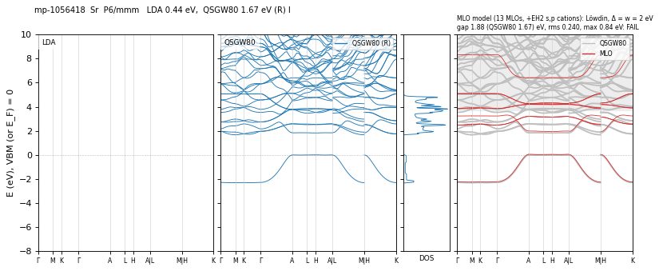

# GW1500 QSGW80 — bands and DOS, 1 atoms per cell

[README](README.md) · [table](table.md)

Left: LDA. Middle: QSGW80 adopted (blue, condition in parentheses; green dashed: another QSGW80 result when its gap differs by more than 0.1 eV) and the total DOS. Right: the MLO model of the standard recipe (red) on the QSGW80 bands (gray), with its conditions and check; shaded: outside the window of the check ([README](README.md#mlo-models)). Energies from the VBM (insulators) or E_F (metals).

**mp-1056418** Sr — QSGW80 **1.67** R eV I vs2025 — ecalj 989a18637 (fp32, t_tetrakbt +300) — MLO SKIPPED (b2) 13 gap 1.88 rms 0.240 max 0.84 (ecalj 27d52b5af)

<small>runs: M FAILED · R NOGAP NOGAP (09-30) · R 1.67 (10-01) · E1 0.17 FAIL(1) (10-05, ES 2) · E 0.17 FAIL(1) (10-05, ES 2, es-a) · E 1.62 MAXITER (10-07, ES 2, es-c)</small>

