# GW1500 QSGW80 — bands and DOS, 2 atoms per cell

[README](README.md) · [table](table.md)

Left: LDA. Middle: QSGW80 adopted (blue, condition in parentheses; green dashed: another QSGW80 result when its gap differs by more than 0.1 eV) and the total DOS. Right: the MLO model of the standard recipe (red) on the QSGW80 bands (gray), with its conditions and check; shaded: outside the window of the check ([README](README.md#mlo-models)). Energies from the VBM (insulators) or E_F (metals).

**mp-23231** AgBr — QSGW80 **2.44** N / M ≈ eV I  — ecalj b695fa65c (tf32, t_tetrakbt -300) — MLO PASS (b1) 18 gap 2.44 rms 0.001 max 0.01 (ecalj fb2da026b)

<small>runs: M 2.44 · N 2.44 (10-02)</small>

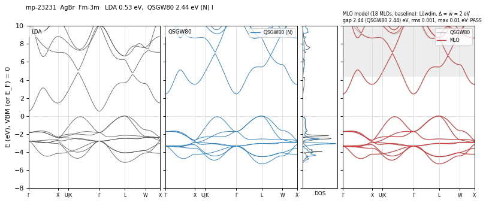

**mp-22922** AgCl — QSGW80 **2.92** N / M ≈ eV I  — ecalj b695fa65c (tf32, t_tetrakbt -300) — MLO PASS (b1) 18 gap 2.92 rms 0.001 max 0.01 (ecalj fb2da026b)

<small>runs: M 2.92 · N 2.92 (10-02)</small>

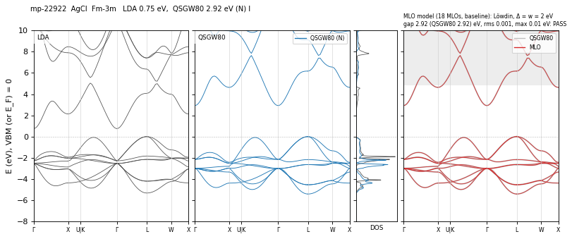

**mp-22919** AgI — QSGW80 **2.10** N / M 1.96 eV I differs — ecalj b695fa65c (tf32, t_tetrakbt -300) — MLO PASS (b1) 18 gap 2.10 rms 0.001 max 0.01 (ecalj fb2da026b)

<small>runs: M 1.96 · N 2.10 (10-02)</small>

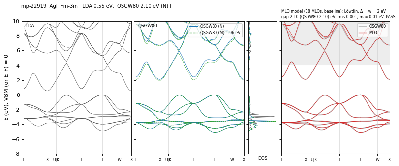

**mp-22925** AgI — QSGW80 **3.01** N / M ≈ eV D  — ecalj b695fa65c (tf32, t_tetrakbt -300) — MLO PASS (b2all) 22 gap 3.01 rms 0.001 max 0.01 (ecalj fb2da026b)

<small>runs: M 3.01 · N 3.01 (10-03)</small>

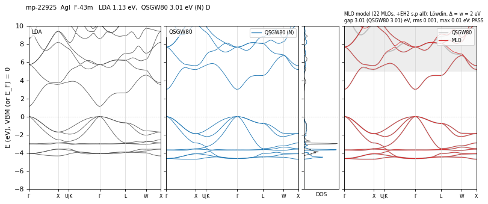

**mp-2172** AlAs — QSGW80 **2.21** N / M ≈ eV I  — ecalj b695fa65c (tf32, t_tetrakbt -300) — MLO PASS (b2) 22 gap 2.21 rms 0.004 max 0.03 (ecalj fb2da026b)

<small>runs: M 2.22 · N 2.21 (10-03)</small>

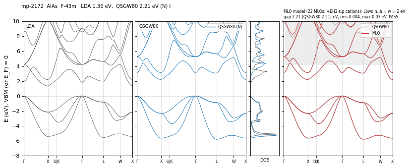

**mp-1330** AlN — QSGW80 **6.37** N / M ≈ eV I  — ecalj b695fa65c (tf32, t_tetrakbt -300) — MLO PASS (b1) 13 gap 6.37 rms 0.004 max 0.03 (ecalj a1d6c0e11)

<small>runs: M 6.39 · N 6.37 (10-02)</small>

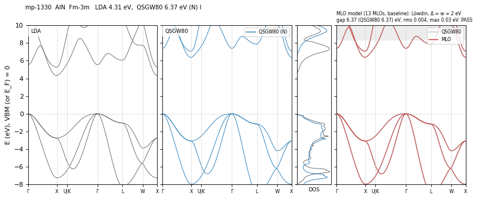

**mp-1550** AlP — QSGW80 **2.48** N / M ≈ eV I  — ecalj b695fa65c (tf32, t_tetrakbt -300) — MLO PASS (b1) 18 gap 2.48 rms 0.007 max 0.05 (ecalj 96ec5c1ee)

<small>runs: M 2.49 · N 2.48 (10-03)</small>

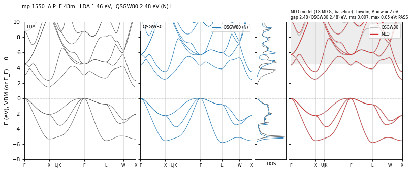

**mp-2624** AlSb — QSGW80 **1.89** N / M ≈ eV I  — ecalj b695fa65c (tf32, t_tetrakbt -300) — MLO PASS (b2) 22 gap 1.88 rms 0.006 max 0.06 (ecalj fb2da026b)

<small>runs: M 1.89 · N 1.89 (10-03)</small>

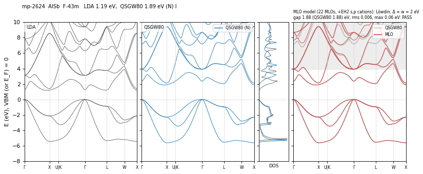

**mp-10044** BAs — QSGW80 **1.86** N / M ≈ eV I  — ecalj b695fa65c (tf32, t_tetrakbt -300) — MLO PASS (b1) 13 gap 1.85 rms 0.005 max 0.03 (ecalj 5baf562f0)

<small>runs: M 1.87 · N 1.86 (10-02)</small>

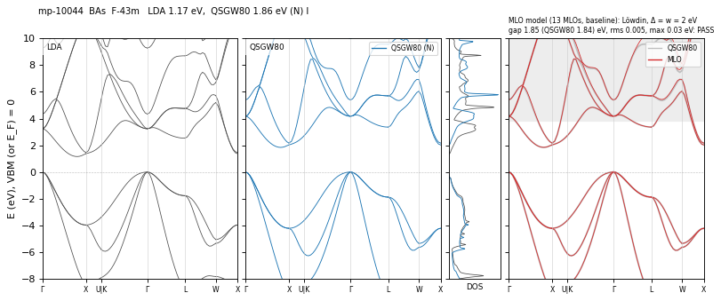

**mp-1639** BN — QSGW80 **6.34** N / M 6.25 eV I differs — ecalj b695fa65c (tf32, t_tetrakbt -300) — MLO PASS (b1) 8 gap 6.34 rms 0.006 max 0.04 (ecalj 0c4d16ceb)

<small>runs: M 6.25 · N 6.34 (10-03)</small>

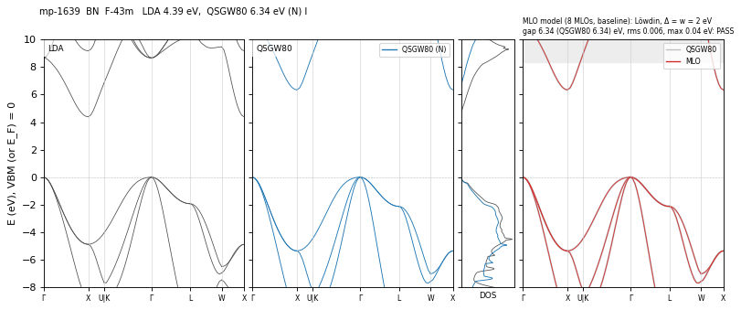

**mp-685145** BN — QSGW80 **5.95** E / M 5.87 / N ≈ eV I differs — ecalj 0601771b4 (tf32, t_tetrakbt -300) with ES, ES rule es-c — MLO FAIR (b2all, ES) 16 gap 5.89 rms 0.058 max 0.24 (ecalj c9932cbfc)

<small>runs: M 5.87 · N 5.96 (10-03) · E 5.95 (10-06, ES 0, es-c)</small>

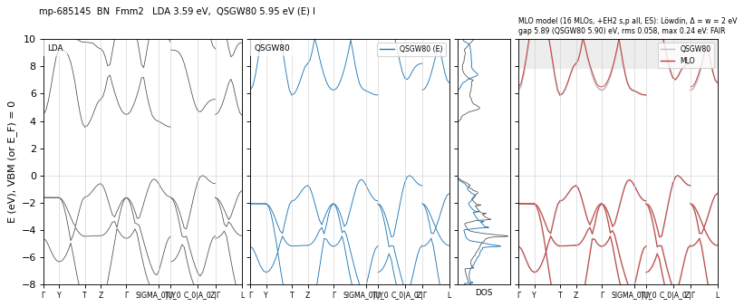

**mp-1479** BP — QSGW80 **2.05** N / M ≈ eV I  — ecalj b695fa65c (tf32, t_tetrakbt -300) — MLO PASS (b1) 13 gap 2.02 rms 0.004 max 0.01 (ecalj 96ec5c1ee)

<small>runs: M 2.06 · N 2.05 (10-03)</small>

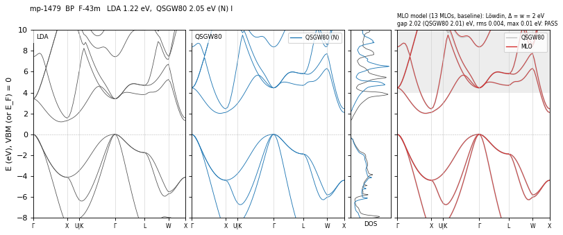

**mp-1342** BaO — QSGW80 **4.19** N / R ≈ eV D  — ecalj 989a18637 (tf32, t_tetrakbt -300) — MLO PASS (b1) 16 gap 4.19 rms 0.003 max 0.02 (ecalj fb2da026b)

<small>runs: M 4.19 · R 4.19 (09-30) · N 4.19 (10-05)</small>

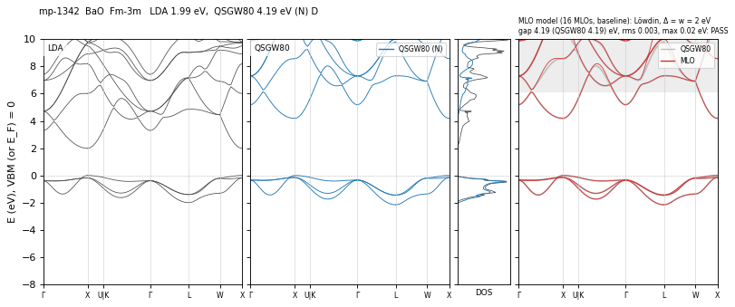

**mp-1500** BaS — QSGW80 **3.92** N / R ≈ eV I  — ecalj 989a18637 (tf32, t_tetrakbt -300) — MLO PASS (b2) 25 gap 3.92 rms 0.009 max 0.06 (ecalj fb2da026b)

<small>runs: M 3.82 · R 3.92 (09-30) · N 3.92 (10-05)</small>

**mp-10680** BaSe — QSGW80 **2.69** N / M 2.75 eV I differs — ecalj b695fa65c (tf32, t_tetrakbt -300) — MLO PASS (b1) 21 gap 2.69 rms 0.005 max 0.04 (ecalj a1d6c0e11)

<small>runs: M 2.75 · N 2.69 (10-02)</small>

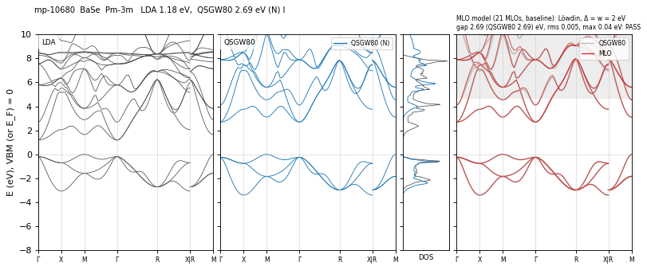

**mp-1253** BaSe — QSGW80 **3.57** N / R ≈ eV I  — ecalj 989a18637 (tf32, t_tetrakbt -300) — MLO PASS (b2) 25 gap 3.57 rms 0.012 max 0.07 (ecalj fb2da026b)

<small>runs: M 3.54 · R 3.57 (09-30) · N 3.57 (10-05)</small>

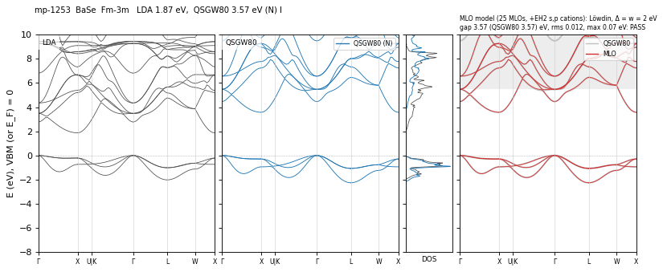

**mp-1000** BaTe — QSGW80 **2.96** N / M ≈ eV I  — ecalj b695fa65c (tf32, t_tetrakbt -300) — MLO PASS (b2d) 34 gap 2.96 rms 0.003 max 0.02 (ecalj 7d5dfe714)

<small>runs: M 2.93 · N 2.96 (10-02)</small>

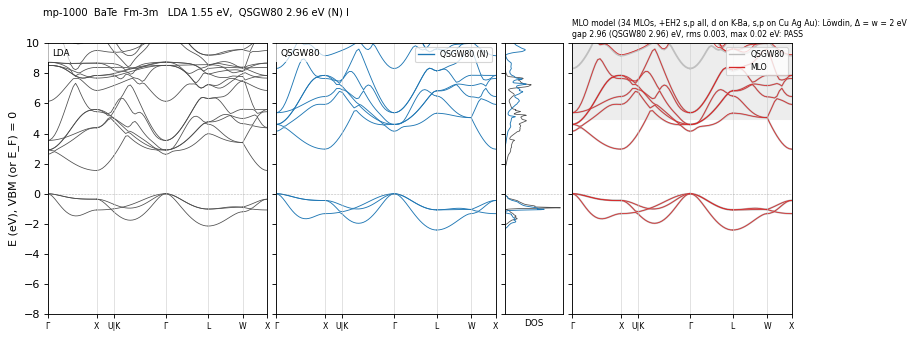

**mp-2600** BaTe — QSGW80 **1.95** N / R ≈ eV I  — ecalj 989a18637 (tf32, t_tetrakbt -300) — MLO PASS (b2) 25 gap 1.95 rms 0.002 max 0.01 (ecalj fb2da026b)

<small>runs: M 1.94 · R 1.95 (09-30) · N 1.95 (10-05)</small>

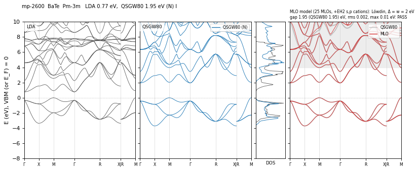

**mp-1794** BeO — QSGW80 **11.10** N / M 11.37 eV I CHECK — ecalj b695fa65c (tf32, t_tetrakbt -300) — MLO PASS (b1) 8 gap 11.10 rms 0.012 max 0.08 (ecalj 0c4d16ceb)

<small>runs: M 11.37 · N 11.10 (10-02)</small>

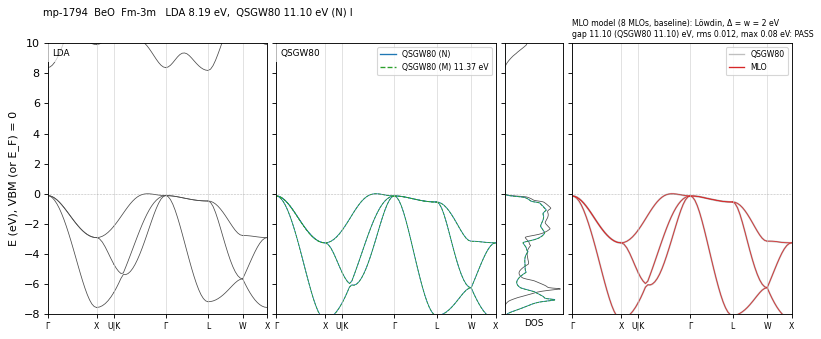

**mp-422** BeS — QSGW80 **4.64** N / M 4.58 eV I differs — ecalj b695fa65c (tf32, t_tetrakbt -300) — MLO PASS (b1) 13 gap 4.64 rms 0.002 max 0.02 (ecalj 614ab5eb8)

<small>runs: M 4.58 · N 4.64 (10-02)</small>

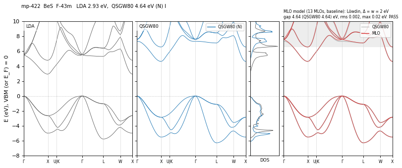

**mp-1541** BeSe — QSGW80 **3.93** N / M ≈ eV I  — ecalj b695fa65c (tf32, t_tetrakbt -300) — MLO PASS (b2) 17 gap 3.93 rms 0.004 max 0.01 (ecalj 96ec5c1ee)

<small>runs: M 3.94 · N 3.93 (10-03)</small>

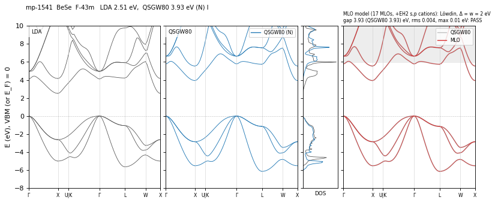

**mp-252** BeTe — QSGW80 **2.86** N / M ≈ eV I  — ecalj b695fa65c (tf32, t_tetrakbt -300) — MLO PASS (b2) 17 gap 2.86 rms 0.003 max 0.04 (ecalj fb2da026b)

<small>runs: M 2.88 · N 2.86 (10-03)</small>

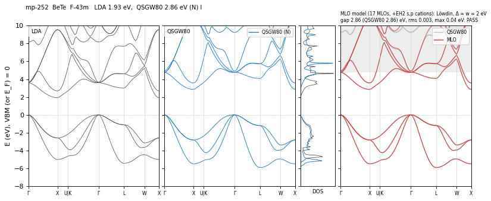

**mp-169** C2 — QSGW80 **2.52** N / R ≈ · path 0 (semimetal?) eV  path-metal LDA≠PBE vs2025 — ecalj 989a18637 (tf32, t_tetrakbt -300) — MLO PASS (b1) 8 gap 0.19 rms 0.006 max 0.03 (ecalj fb2da026b)

*graphite-like: the bands cross E_F at K, which the 8x8x8 mesh misses; a semimetal, the gap on the mesh is not physical*

<small>runs: M 2.94 · R 2.52 (10-01) · N 2.52 (10-05)</small>

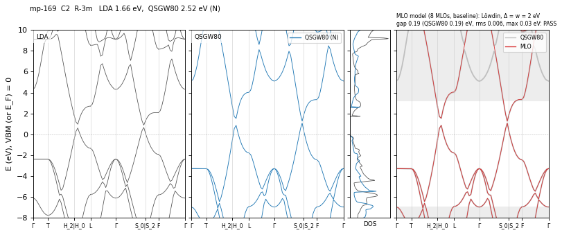

**mp-66** C2 — QSGW80 **5.80** N / M ≈ eV I  — ecalj b695fa65c (tf32, t_tetrakbt -300) — MLO PASS (b1) 8 gap 5.80 rms 0.012 max 0.04 (ecalj 614ab5eb8)

<small>runs: M 5.81 · N 5.80 (10-03)</small>

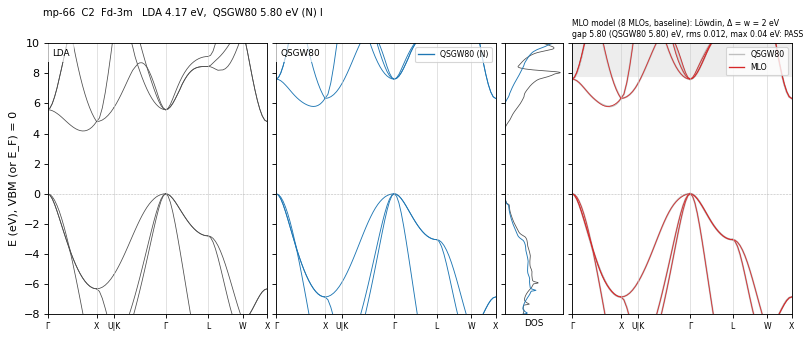

**mp-2605** CaO — QSGW80 **6.60** N / R ≈ eV I  — ecalj 989a18637 (tf32, t_tetrakbt -300) — MLO PASS (b1) 13 gap 6.60 rms 0.003 max 0.03 (ecalj fb2da026b)

<small>runs: M 6.53 · R 6.60 (10-01) · N 6.60 (10-03)</small>

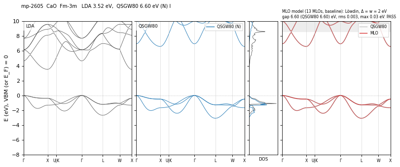

**mp-1672** CaS — QSGW80 **4.34** N / M ≈ eV I  — ecalj b695fa65c (tf32, t_tetrakbt -300) — MLO PASS (b1) 18 gap 4.34 rms 0.001 max 0.01 (ecalj 0c4d16ceb)

<small>runs: M 4.38 · N 4.34 (10-02)</small>

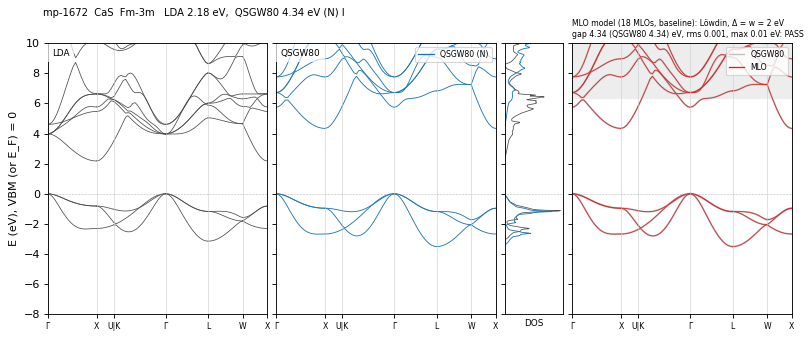

**mp-1415** CaSe — QSGW80 **3.85** N / R ≈ eV I  — ecalj 989a18637 (tf32, t_tetrakbt -300) — MLO PASS (b1) 18 gap 3.85 rms 0.004 max 0.02 (ecalj fb2da026b)

<small>runs: M 3.89 · R 3.85 (09-30) · N 3.85 (10-05)</small>

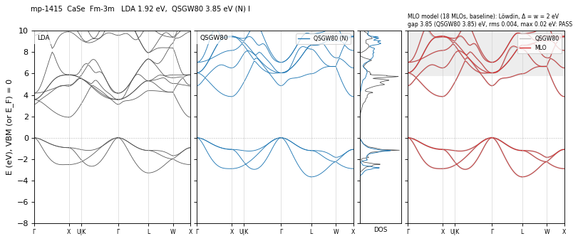

**mp-1519** CaTe — QSGW80 **2.96** N / R ≈ eV I  — ecalj 989a18637 (tf32, t_tetrakbt -300) — MLO PASS (b2) 22 gap 2.96 rms 0.005 max 0.05 (ecalj fb2da026b)

<small>runs: M 2.97 · R 2.96 (09-30) · N 2.96 (10-05)</small>

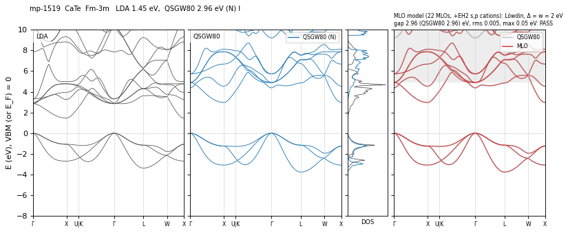

**mp-2469** CdS — QSGW80 **2.33** N / M ≈ eV D  — ecalj b695fa65c (tf32, t_tetrakbt -300) — MLO PASS (b1) 18 gap 2.35 rms 0.007 max 0.04 (ecalj fb2da026b)

<small>runs: M 2.34 · N 2.33 (10-02)</small>

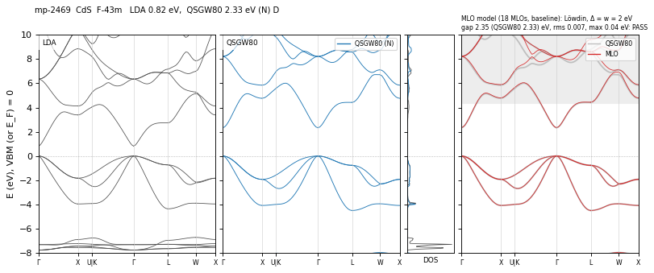

**mp-370** CdS — QSGW80 **1.30** N / M ≈ eV I  — ecalj b695fa65c (tf32, t_tetrakbt -300) — MLO PASS (b1) 18 gap 1.29 rms 0.002 max 0.01 (ecalj 614ab5eb8)

<small>runs: M 1.33 · N 1.30 (10-03)</small>

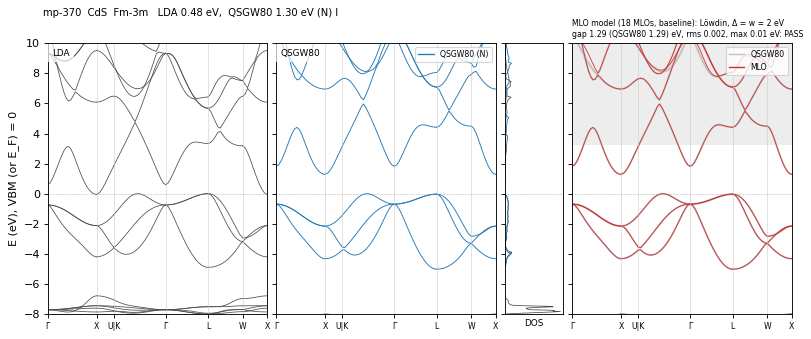

**mp-2691** CdSe — QSGW80 **1.73** N / M ≈ eV D  — ecalj b695fa65c (tf32, t_tetrakbt -300) — MLO PASS (b1) 18 gap 1.74 rms 0.011 max 0.05 (ecalj fb2da026b)

<small>runs: M 1.74 · N 1.73 (10-03)</small>

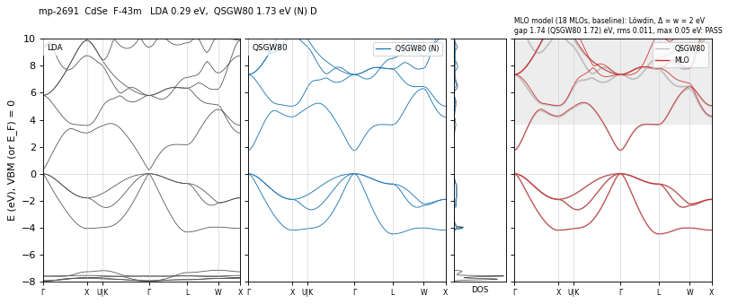

**mp-406** CdTe — QSGW80 **1.67** N / M ≈ eV D  — ecalj b695fa65c (tf32, t_tetrakbt -300) — MLO PASS (b2) 22 gap 1.67 rms 0.003 max 0.02 (ecalj 614ab5eb8)

<small>runs: M 1.66 · N 1.67 (10-02)</small>

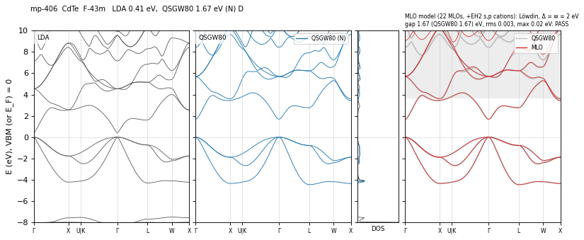

**mp-2667** CsAu — QSGW80 **2.37** N / R ≈ eV I  — ecalj 989a18637 (tf32, t_tetrakbt -300) — MLO PASS (b1) 21 gap 2.37 rms 0.001 max 0.01 (ecalj fb2da026b)

<small>runs: M 2.37 · R 2.37 (09-30) · N 2.37 (10-05)</small>

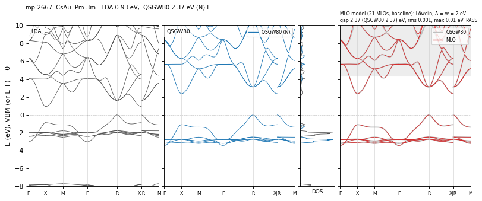

**mp-22906** CsBr — QSGW80 **6.97** N / R ≈ eV D  — ecalj 989a18637 (tf32, t_tetrakbt -300) — MLO PASS (b2) 25 gap 6.97 rms 0.001 max 0.01 (ecalj fb2da026b)

<small>runs: M 6.96 · R 6.97 (09-30) · N 6.97 (10-05)</small>

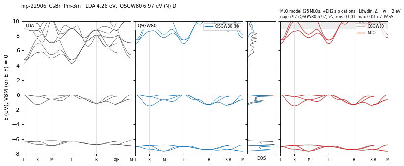

**mp-571222** CsBr — QSGW80 **7.05** N / R ≈ eV D  — ecalj 989a18637 (tf32, t_tetrakbt -300) — MLO PASS (b2d) 34 gap 7.05 rms 0.003 max 0.03 (ecalj fb2da026b)

<small>runs: M 6.81 · R 7.05 (09-30) · N 7.05 (10-05)</small>

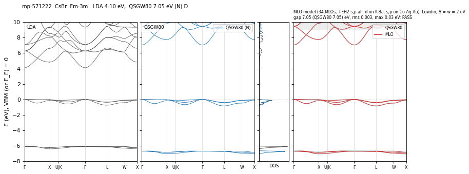

**mp-22865** CsCl — QSGW80 **7.98** N / R ≈ eV D  — ecalj 989a18637 (tf32, t_tetrakbt -300) — MLO PASS (b2) 25 gap 7.98 rms 0.001 max 0.01 (ecalj fb2da026b)

<small>runs: M 7.91 · R 7.98 (09-30) · N 7.98 (10-05)</small>

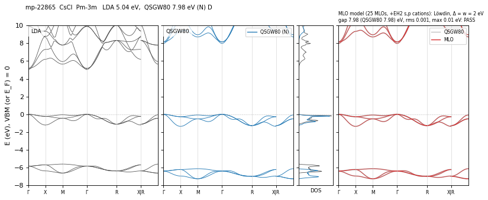

**mp-573697** CsCl — QSGW80 **7.81** N / R ≈ eV I  — ecalj 989a18637 (tf32, t_tetrakbt -300) — MLO PASS (b2d) 34 gap 7.81 rms 0.003 max 0.03 (ecalj fb2da026b)

<small>runs: M 7.74 · R 7.81 (09-30) · N 7.81 (10-05)</small>

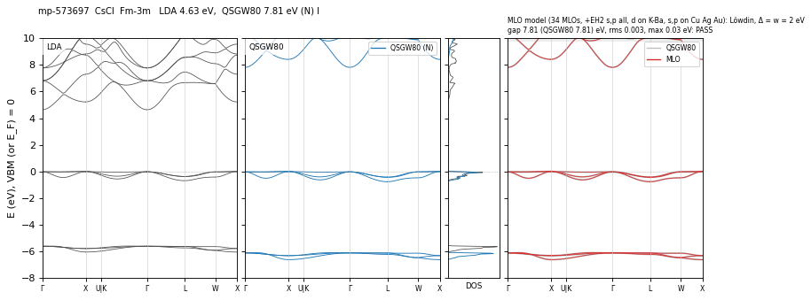

**mp-1784** CsF — QSGW80 **8.87** N / R ≈ eV I  — ecalj 989a18637 (tf32, t_tetrakbt -300) — MLO OK (b2) 21 gap 8.87 rms 0.008 max 0.10 (ecalj 1fd34b1c0)

<small>runs: M 8.73 · R 8.87 (09-30) · N 8.87 (10-05)</small>

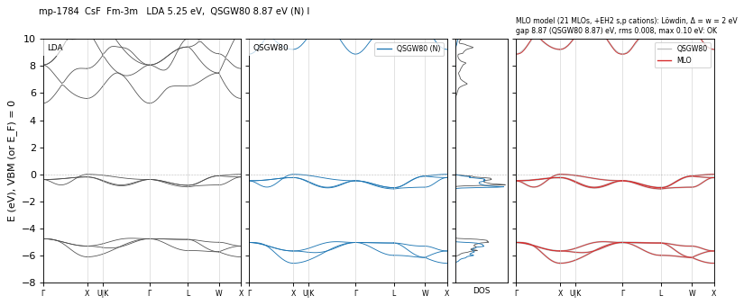

**mp-8455** CsF — QSGW80 **9.64** N / R ≈ eV D  — ecalj 989a18637 (tf32, t_tetrakbt -300) — MLO PASS (b2) 21 gap 9.64 rms 0.003 max 0.03 (ecalj fb2da026b)

<small>runs: M 9.64 · R 9.64 (09-30) · N 9.64 (10-05)</small>

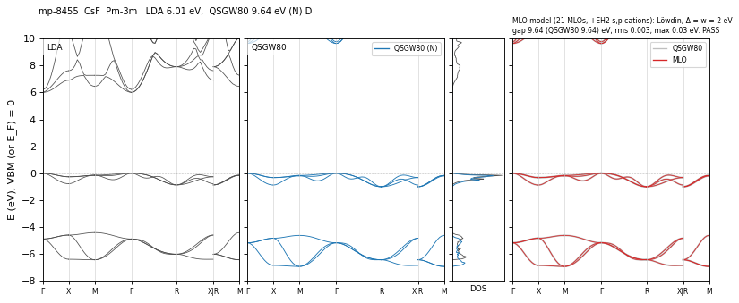

**mp-1057286** CsH — QSGW80 **4.67** N / M 4.60 eV D differs — ecalj b695fa65c (tf32, t_tetrakbt -300) — MLO PASS (b2d) 29 gap 4.67 rms 0.006 max 0.02 (ecalj 7d5dfe714)

<small>runs: M 4.60 · N 4.67 (10-03)</small>

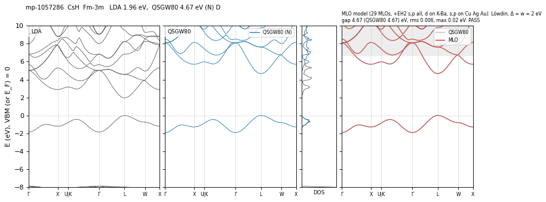

**mp-632319** CsH — QSGW80 **4.70** N / R ≈ eV I  — ecalj 989a18637 (tf32, t_tetrakbt -300) — MLO PASS (b1) 16 gap 4.70 rms 0.004 max 0.02 (ecalj fb2da026b)

<small>runs: M 4.59 · R 4.70 (09-30) · N 4.70 (10-05)</small>

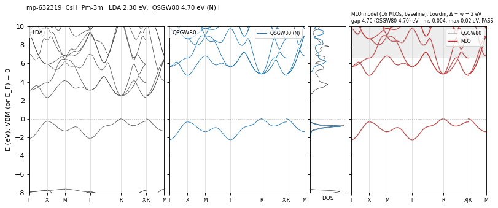

**mp-1056920** CsI — QSGW80 **5.84** N / M 5.75 eV I differs — ecalj b695fa65c (tf32, t_tetrakbt -300) — MLO PASS (b2) 25 gap 5.84 rms 0.003 max 0.02 (ecalj 614ab5eb8)

<small>runs: M 5.75 · N 5.84 (10-02)</small>

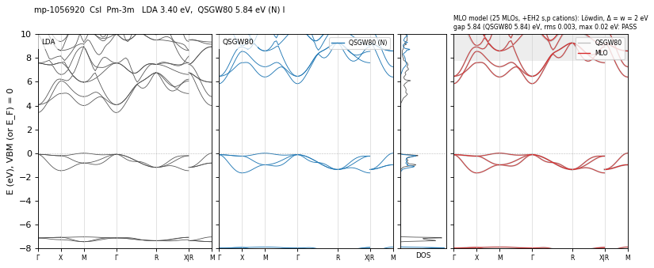

**mp-614603** CsI — QSGW80 **6.09** E / E1 ≈ / N 6.31 / R 6.31 eV D CHECK — ecalj 0601771b4 (tf32, t_tetrakbt -300) with ES, ES rule es-c — MLO PASS (b1, ES) 29 gap 6.09 rms 0.001 max 0.01 (ecalj a45169f3c)

<small>runs: M 6.21 · R 6.31 (09-30) · E1 6.08 (10-05, ES 2) · N 6.31 (10-05) · E 6.09 (10-06, ES 2, es-c)</small>

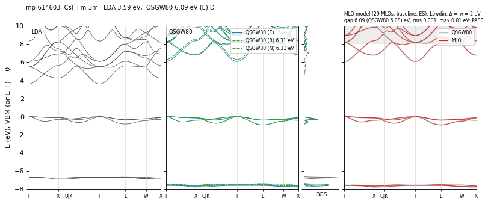

**mp-22913** CuBr — QSGW80 **2.43** N / M ≈ eV D  — ecalj 989a18637 (tf32, t_tetrakbt -300) — MLO PASS (b2all) 22 gap 2.43 rms 0.001 max 0.01 (ecalj fb2da026b)

<small>runs: M 2.41 · N 2.43 (10-02)</small>

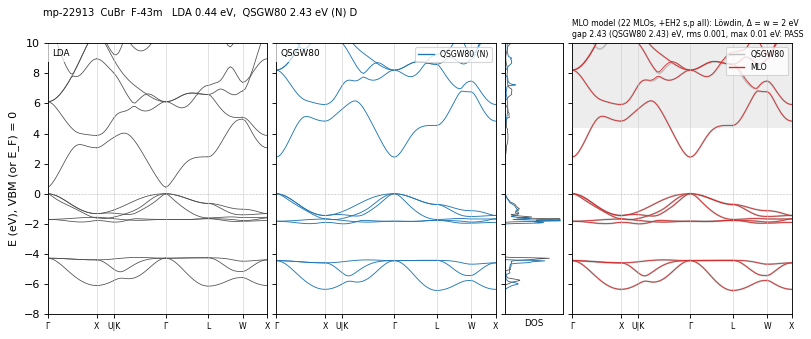

**mp-570354** CuBr — QSGW80 **1.93** N / M ≈ eV I  — ecalj b695fa65c (tf32, t_tetrakbt -300) — MLO PASS (b1) 18 gap 1.93 rms 0.002 max 0.02 (ecalj 614ab5eb8)

<small>runs: M 1.93 · N 1.93 (10-03)</small>

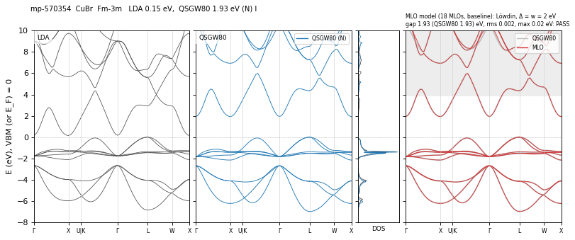

**mp-22914** CuCl — QSGW80 **2.70** N / M ≈ eV D  — ecalj b695fa65c (tf32, t_tetrakbt -300) — MLO PASS (b1) 18 gap 2.73 rms 0.010 max 0.09 (ecalj fb2da026b)

<small>runs: M 2.73 · N 2.70 (10-03)</small>

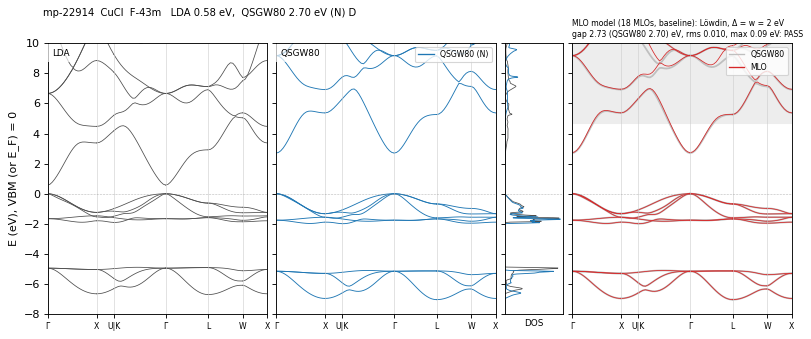

**mp-571386** CuCl — QSGW80 **2.30** N / M ≈ eV I  — ecalj b695fa65c (tf32, t_tetrakbt -300) — MLO PASS (b1) 18 gap 2.30 rms 0.001 max 0.01 (ecalj 614ab5eb8)

<small>runs: M 2.32 · N 2.30 (10-02)</small>

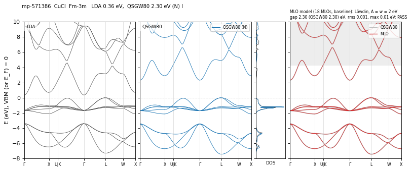

**mp-22895** CuI — QSGW80 **2.80** N / M 2.86 eV D differs — ecalj b695fa65c (tf32, t_tetrakbt -300) — MLO PASS (b2all) 22 gap 2.80 rms 0.003 max 0.03 (ecalj fb2da026b)

<small>runs: M 2.86 · N 2.80 (10-03)</small>

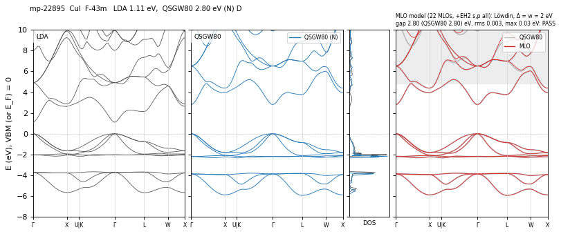

**mp-2534** GaAs — QSGW80 **1.05** N / M ≈ eV D  — ecalj b695fa65c (tf32, t_tetrakbt -300) — MLO PASS (b1) 23 gap 1.06 rms 0.007 max 0.06 (ecalj fb2da026b)

<small>runs: M 1.04 · N 1.05 (10-02)</small>

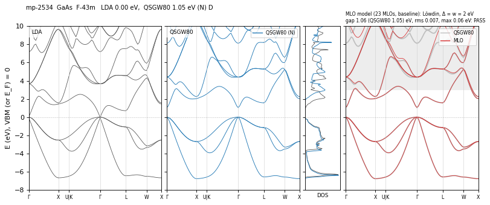

**mp-2853** GaN — QSGW80 **1.53** N / M ≈ eV I  — ecalj b695fa65c (tf32, t_tetrakbt -300) — MLO PASS (b1) 18 gap 1.49 rms 0.004 max 0.02 (ecalj fb2da026b)

<small>runs: M 1.51 · N 1.53 (10-02)</small>

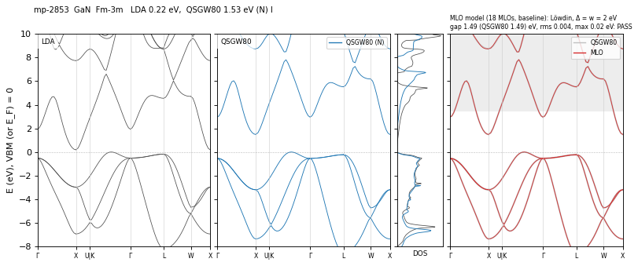

**mp-2490** GaP — QSGW80 **2.29** N / M ≈ eV I  — ecalj b695fa65c (tf32, t_tetrakbt -300) — MLO PASS (b1) 23 gap 2.27 rms 0.006 max 0.10 (ecalj fb2da026b)

<small>runs: M 2.29 · N 2.29 (10-03)</small>

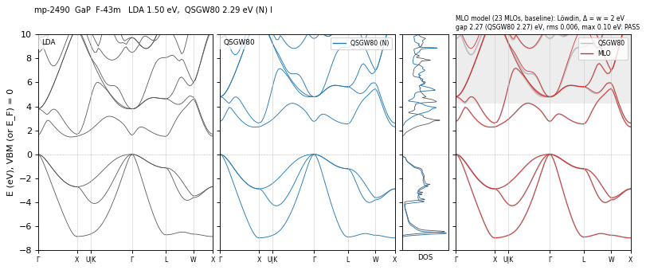

**mp-10759** GeSe — QSGW80 **0.20** N / M ≈ eV I  — ecalj b695fa65c (tf32, t_tetrakbt -300) — MLO PASS (b1) 18 gap 0.10 rms 0.004 max 0.01 (ecalj a1d6c0e11)

<small>runs: M 0.20 · N 0.20 (10-02)</small>

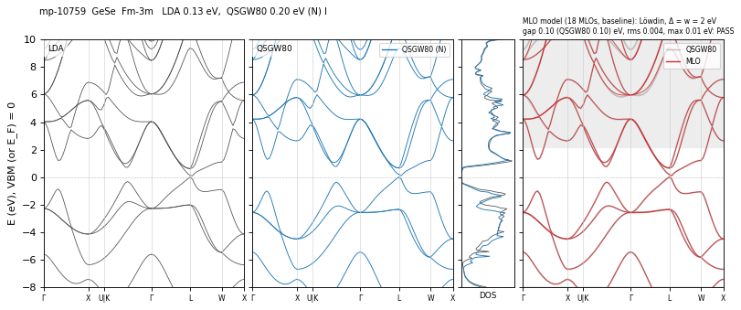

**mp-2612** GeTe — QSGW80 **0.44** N / M ≈ eV D  — ecalj b695fa65c (tf32, t_tetrakbt -300) — MLO PASS (b1) 18 gap 0.44 rms 0.005 max 0.02 (ecalj fb2da026b)

<small>runs: M 0.44 · N 0.44 (10-03)</small>

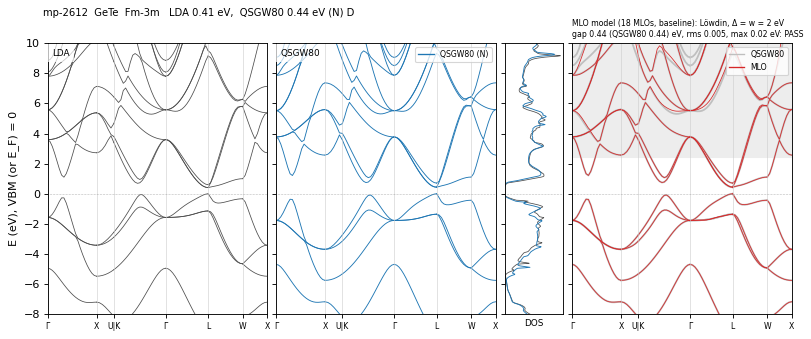

**mp-938** GeTe — QSGW80 **0.67** N / M ≈ eV I  — ecalj b695fa65c (tf32, t_tetrakbt -300) — MLO PASS (b1) 18 gap 0.87 rms 0.002 max 0.01 (ecalj 614ab5eb8)

<small>runs: M 0.66 · N 0.67 (10-03)</small>

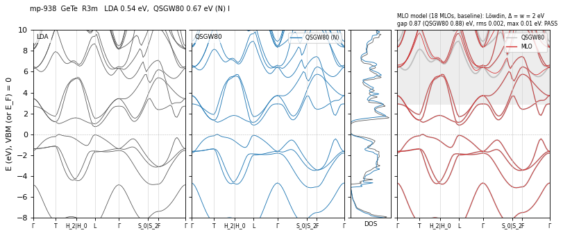

**mp-632291** H2 — QSGW80 **14.48** E / M 14.63 / N 14.68 eV I differs vs2025 — ecalj 0601771b4 (tf32, t_tetrakbt -300) with ES, ES rule es-a — MLO FAIR (x_s_only, ES) 6 gap 14.47 rms 0.033 max 0.11 (ecalj d2878d537)

*MLO by hand from 2026-10-07 (variant x_s_only): H s + EH2 s + ES s only (6 MLOs), max 0.114 eV (inner 0.109); the standard b2 (EH2 s,p) 0.525 eV with a singular MLO overlap*

<small>runs: M 14.63 · N 14.68 (10-02) · E 14.48 (10-06, ES 2, es-a)</small>

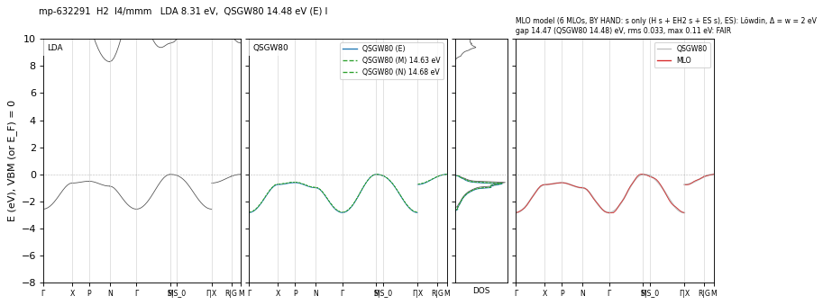

**mp-20351** InP — QSGW80 **1.23** N / M ≈ eV D  — ecalj b695fa65c (tf32, t_tetrakbt -300) — MLO PASS (b1) 23 gap 1.24 rms 0.006 max 0.04 (ecalj fb2da026b)

<small>runs: M 1.23 · N 1.23 (10-03)</small>

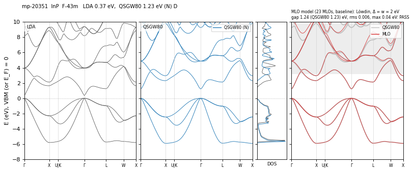

**mp-23251** KBr — QSGW80 **7.28** N / R ≈ eV D  — ecalj 989a18637 (tf32, t_tetrakbt -300) — MLO PASS (b2) 25 gap 7.28 rms 0.003 max 0.03 (ecalj fb2da026b)

<small>runs: M 7.18 · R 7.28 (09-30) · N 7.28 (10-05)</small>

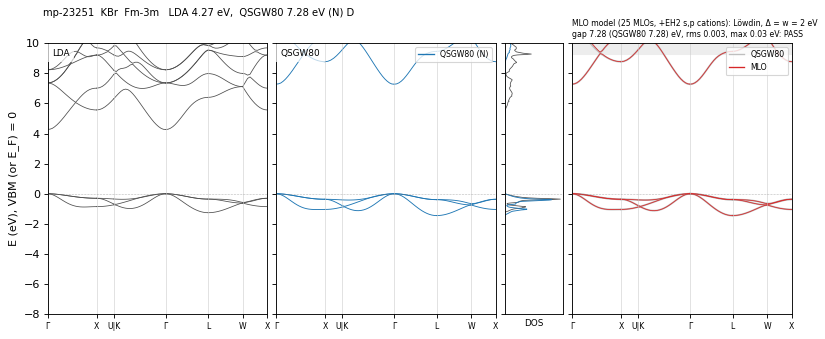

**mp-570891** KBr — QSGW80 **6.52** N / R ≈ eV I  — ecalj 989a18637 (tf32, t_tetrakbt -300) — MLO PASS (b2) 25 gap 6.52 rms 0.002 max 0.02 (ecalj fb2da026b)

<small>runs: M 6.51 · R 6.52 (09-30) · N 6.52 (10-05)</small>

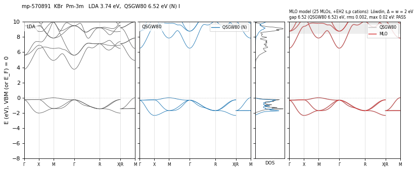

**mp-23193** KCl — QSGW80 **8.31** N / M 8.19 eV D differs — ecalj b695fa65c (tf32, t_tetrakbt -300) — MLO PASS (b2) 25 gap 8.31 rms 0.002 max 0.02 (ecalj fb2da026b)

<small>runs: M 8.19 · N 8.31 (10-03)</small>

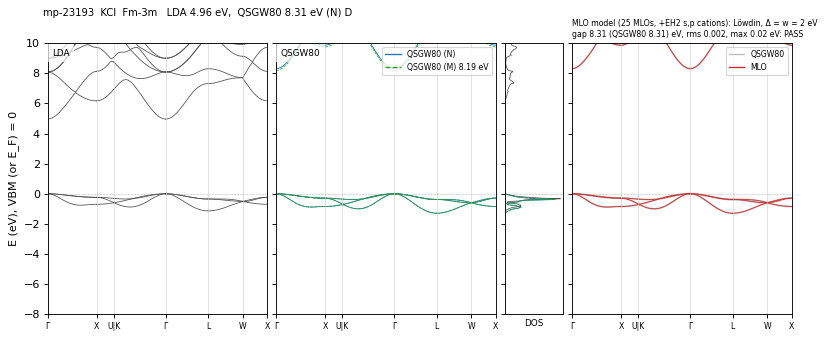

**mp-23289** KCl — QSGW80 **7.78** N / M ≈ eV I  — ecalj b695fa65c (tf32, t_tetrakbt -300) — MLO PASS (b2) 25 gap 7.78 rms 0.002 max 0.02 (ecalj fb2da026b)

<small>runs: M 7.76 · N 7.78 (10-03)</small>

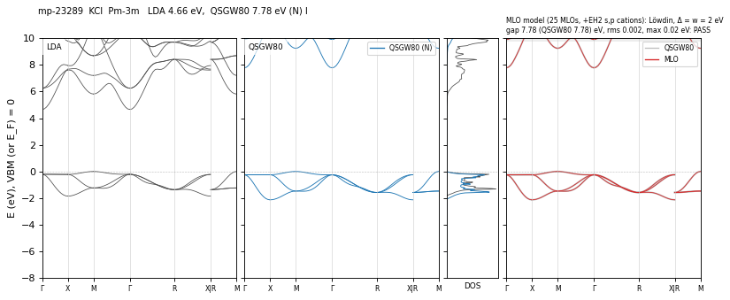

**mp-463** KF — QSGW80 **10.49** N / M ≈ eV D  — ecalj b695fa65c (tf32, t_tetrakbt -300) — MLO PASS (b1) 16 gap 10.49 rms 0.003 max 0.03 (ecalj 614ab5eb8)

<small>runs: M 10.52 · N 10.49 (10-02)</small>

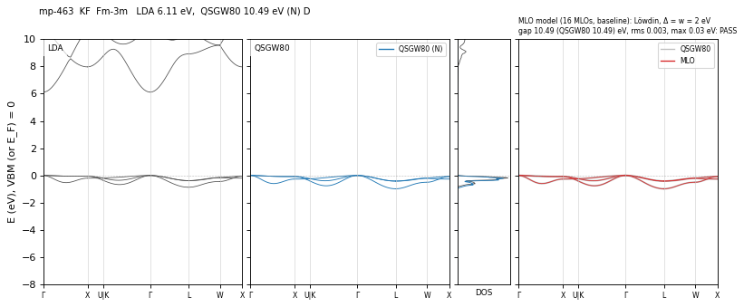

**mp-8454** KF — QSGW80 **10.58** N / M ≈ eV I  — ecalj b695fa65c (tf32, t_tetrakbt -300) — MLO PASS (b1) 16 gap 10.58 rms 0.004 max 0.04 (ecalj 614ab5eb8)

<small>runs: M 10.54 · N 10.58 (10-02)</small>

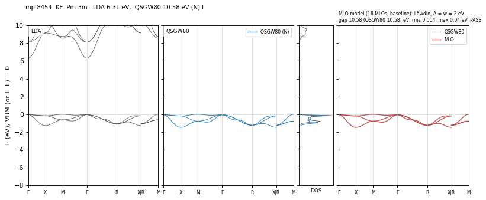

**mp-24084** KH — QSGW80 **6.38** N / M 6.33 eV D differs — ecalj b695fa65c (tf32, t_tetrakbt -300) — MLO PASS (b1) 16 gap 6.38 rms 0.010 max 0.06 (ecalj fb2da026b)

<small>runs: M 6.33 · N 6.38 (10-03)</small>

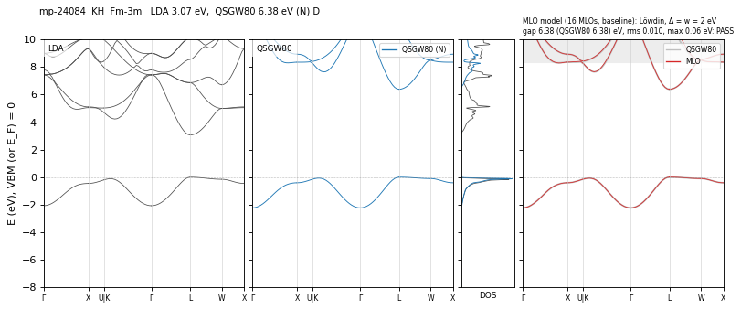

**mp-22898** KI — QSGW80 **6.34** N / R ≈ eV D  — ecalj 989a18637 (tf32, t_tetrakbt -300) — MLO PASS (b2d) 34 gap 6.34 rms 0.003 max 0.02 (ecalj fb2da026b)

<small>runs: M 6.52 · R 6.34 (09-30) · N 6.34 (10-05)</small>

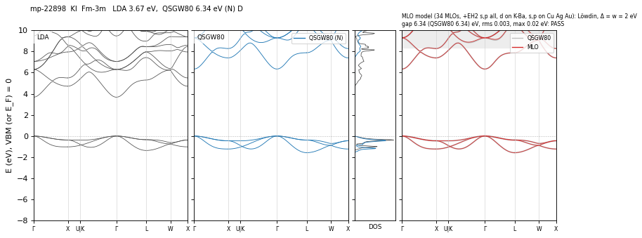

**mp-22901** KI — QSGW80 **5.43** N / R ≈ eV I  — ecalj 989a18637 (tf32, t_tetrakbt -300) — MLO PASS (b2) 25 gap 5.43 rms 0.002 max 0.02 (ecalj fb2da026b)

<small>runs: M 5.48 · R 5.43 (09-30) · N 5.43 (10-05)</small>

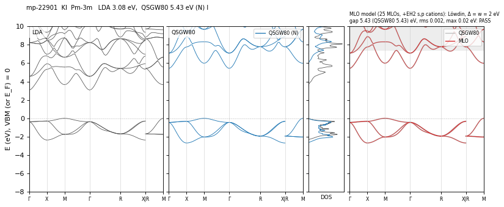

**mp-23259** LiBr — QSGW80 **7.66** N / M 7.59 eV D differs — ecalj b695fa65c (tf32, t_tetrakbt -300) — MLO PASS (b1) 13 gap 7.66 rms 0.003 max 0.02 (ecalj fb2da026b)

<small>runs: M 7.59 · N 7.66 (10-02)</small>

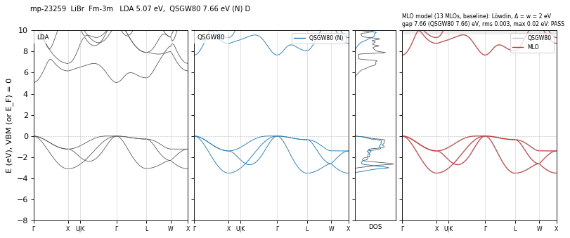

**mp-22905** LiCl — QSGW80 **9.43** N / M ≈ eV D  — ecalj 989a18637 (tf32, t_tetrakbt -300) — MLO PASS (b1) 13 gap 9.42 rms 0.004 max 0.03 (ecalj fb2da026b)

<small>runs: M 9.38 · N 9.43 (10-02)</small>

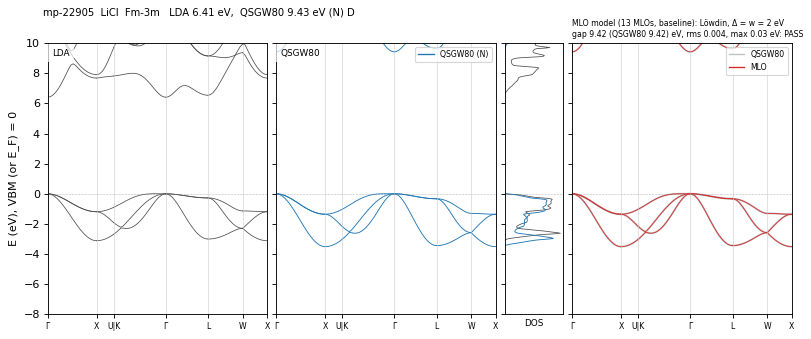

**mp-1138** LiF — QSGW80 **13.68** N / M 13.48 eV D differs — ecalj b695fa65c (tf32, t_tetrakbt -300) — MLO PASS (b1) 8 gap 13.67 rms 0.005 max 0.04 (ecalj a1d6c0e11)

<small>runs: M 13.48 · N 13.68 (10-02)</small>

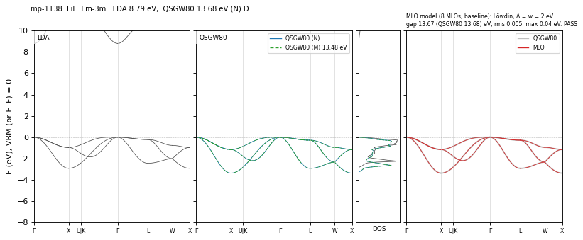

**mp-23703** LiH — QSGW80 **5.55** N / M ≈ eV D vs2025 — ecalj b695fa65c (tf32, t_tetrakbt -300) — MLO PASS (b1) 8 gap 5.55 rms 0.014 max 0.05 (ecalj fb2da026b)

*2025 values equal to LDA (the 2025 QSGW of LiH had not run)*

<small>runs: M 5.55 · N 5.55 (10-02)</small>

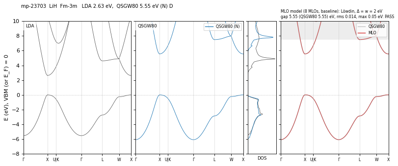

**mp-22899** LiI — QSGW80 **6.24** N / M ≈ eV I  — ecalj b695fa65c (tf32, t_tetrakbt -300) — MLO PASS (b1) 13 gap 6.23 rms 0.004 max 0.05 (ecalj fb2da026b)

<small>runs: M 6.22 · N 6.24 (10-03)</small>

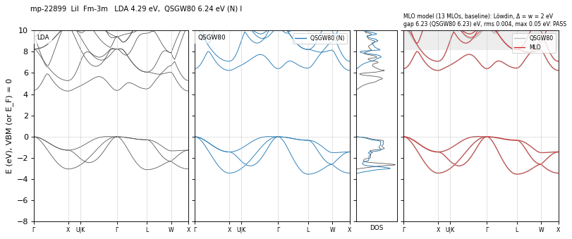

**mp-1009129** MgO — QSGW80 **5.89** N / M 6.12 eV I CHECK — ecalj b695fa65c (tf32, t_tetrakbt -300) — MLO PASS (b1) 13 gap 5.88 rms 0.003 max 0.02 (ecalj a1d6c0e11)

<small>runs: M 6.12 · N 5.89 (10-02)</small>

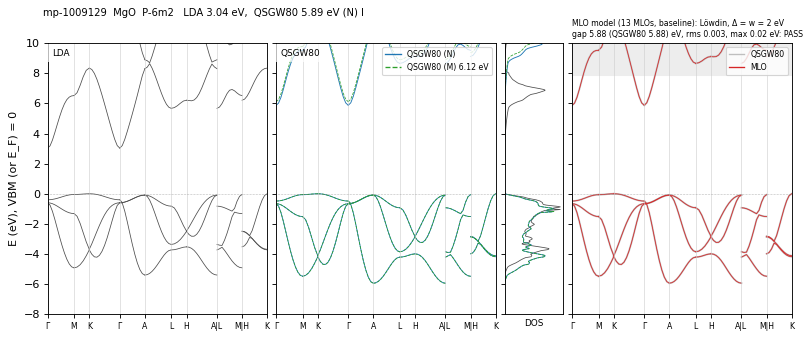

**mp-1265** MgO — QSGW80 **8.18** N / M 8.33 eV D differs — ecalj b695fa65c (tf32, t_tetrakbt -300) — MLO PASS (b1) 13 gap 8.18 rms 0.002 max 0.01 (ecalj a1d6c0e11)

*May 8.33 vs 8.18 eV: traced to the old all-TF32 --mp of the May production (README, reliability of M)*

<small>runs: M 8.33 · N 8.18 (10-02)</small>

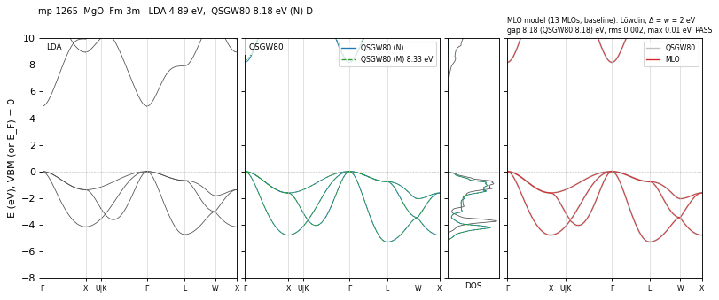

**mp-1315** MgS — QSGW80 **4.52** N / M ≈ eV I  — ecalj b695fa65c (tf32, t_tetrakbt -300) — MLO PASS (b1) 18 gap 4.52 rms 0.002 max 0.01 (ecalj a1d6c0e11)

<small>runs: M 4.52 · N 4.52 (10-03)</small>

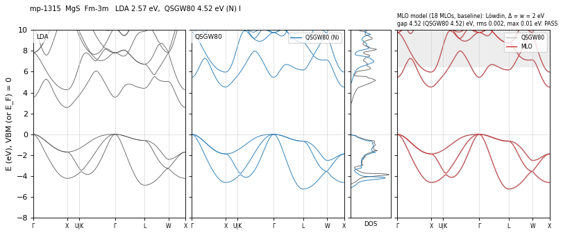

**mp-10760** MgSe — QSGW80 **3.23** N / M ≈ eV I  — ecalj b695fa65c (tf32, t_tetrakbt -300) — MLO PASS (b1) 18 gap 3.23 rms 0.002 max 0.01 (ecalj a1d6c0e11)

<small>runs: M 3.25 · N 3.23 (10-02)</small>

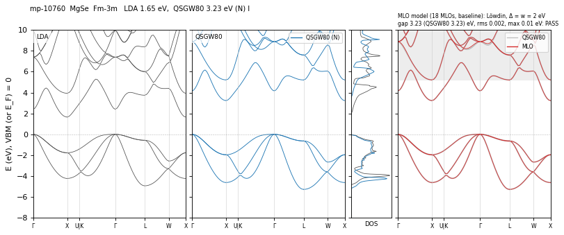

**mp-22916** NaBr — QSGW80 **7.04** N / M ≈ eV D  — ecalj b695fa65c (tf32, t_tetrakbt -300) — MLO PASS (b1) 18 gap 7.04 rms 0.010 max 0.07 (ecalj fb2da026b)

<small>runs: M 7.08 · N 7.04 (10-02)</small>

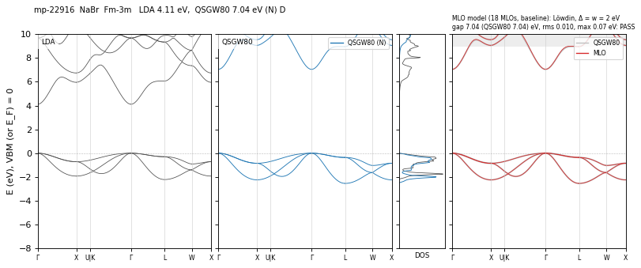

**mp-22851** NaCl — QSGW80 **6.95** N / M 6.79 eV I differs — ecalj b695fa65c (tf32, t_tetrakbt -300) — MLO PASS (b1) 18 gap 6.95 rms 0.001 max 0.01 (ecalj fb2da026b)

<small>runs: M 6.79 · N 6.95 (10-02)</small>

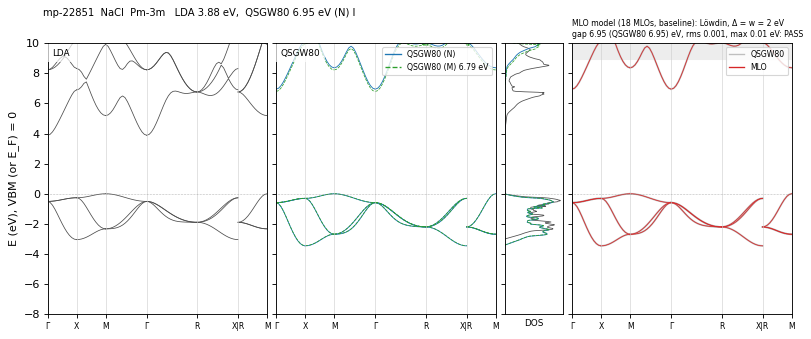

**mp-22862** NaCl — QSGW80 **8.42** N / M 8.35 eV D differs — ecalj b695fa65c (tf32, t_tetrakbt -300) — MLO PASS (b1) 18 gap 8.42 rms 0.002 max 0.02 (ecalj fb2da026b)

<small>runs: M 8.35 · N 8.42 (10-02)</small>

**mp-682** NaF — QSGW80 **11.48** N / R ≈ eV D  — ecalj 989a18637 (tf32, t_tetrakbt -300) — MLO PASS (b1) 13 gap 11.48 rms 0.001 max 0.01 (ecalj fb2da026b)

<small>runs: M 11.46 · R 11.48 (10-01) · N 11.48 (10-05)</small>

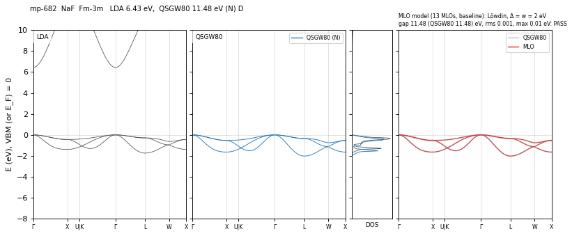

**mp-23870** NaH — QSGW80 **6.72** N / M ≈ eV I  — ecalj 989a18637 (tf32, t_tetrakbt -300) — MLO PASS (b1) 13 gap 6.72 rms 0.008 max 0.03 (ecalj fb2da026b)

<small>runs: M 6.73 · N 6.72 (10-02)</small>

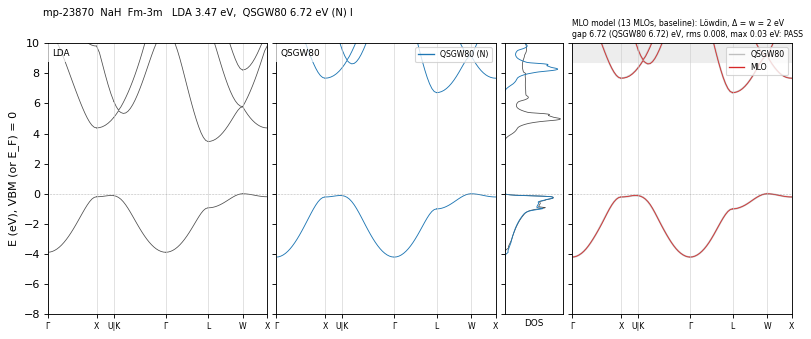

**mp-23268** NaI — QSGW80 **5.95** N / M ≈ eV D  — ecalj b695fa65c (tf32, t_tetrakbt -300) — MLO PASS (b2) 22 gap 5.95 rms 0.002 max 0.01 (ecalj fb2da026b)

<small>runs: M 5.91 · N 5.95 (10-02)</small>

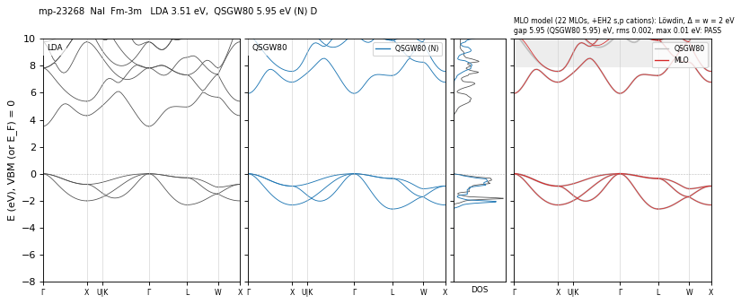

**mp-21276** PbS — QSGW80 **0.75** N / M ≈ eV D  — ecalj b695fa65c (tf32, t_tetrakbt -300) — MLO PASS (b1) 18 gap 0.75 rms 0.001 max 0.01 (ecalj fb2da026b)

<small>runs: M 0.75 · N 0.75 (10-02)</small>

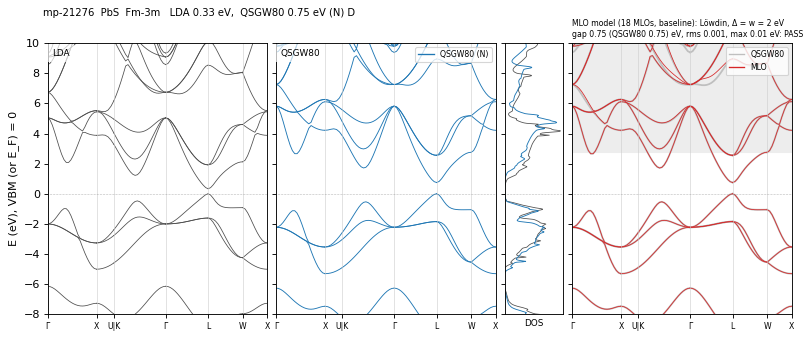

**mp-2201** PbSe — QSGW80 **0.71** N / M ≈ eV D  — ecalj b695fa65c (tf32, t_tetrakbt -300) — MLO PASS (b1) 18 gap 0.71 rms 0.003 max 0.02 (ecalj fb2da026b)

<small>runs: M 0.72 · N 0.71 (10-03)</small>

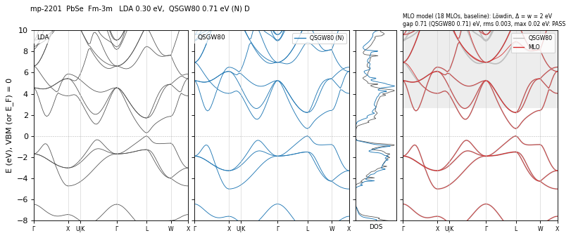

**mp-30373** RbAu — QSGW80 **1.48** N / R ≈ eV I  — ecalj 989a18637 (tf32, t_tetrakbt -300) — MLO PASS (b1) 21 gap 1.48 rms 0.001 max 0.00 (ecalj fb2da026b)

<small>runs: M 1.49 · R 1.48 (09-30) · N 1.48 (10-05)</small>

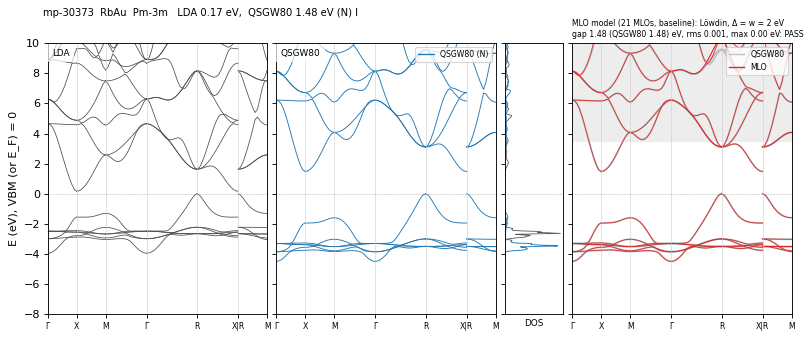

**mp-22867** RbBr — QSGW80 **7.10** N / R ≈ eV D  — ecalj 989a18637 (tf32, t_tetrakbt -300) — MLO PASS (b2) 25 gap 7.10 rms 0.005 max 0.08 (ecalj fb2da026b)

<small>runs: M 7.00 · R 7.10 (09-30) · N 7.10 (10-05)</small>

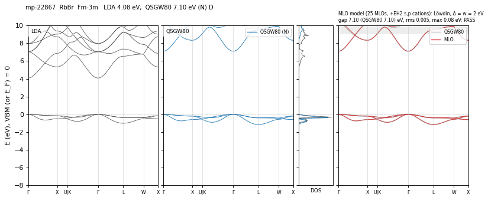

**mp-23303** RbBr — QSGW80 **6.71** N / R ≈ eV I  — ecalj 989a18637 (tf32, t_tetrakbt -300) — MLO PASS (b2) 25 gap 6.71 rms 0.002 max 0.01 (ecalj fb2da026b)

<small>runs: M 6.73 · R 6.71 (09-30) · N 6.71 (10-05)</small>

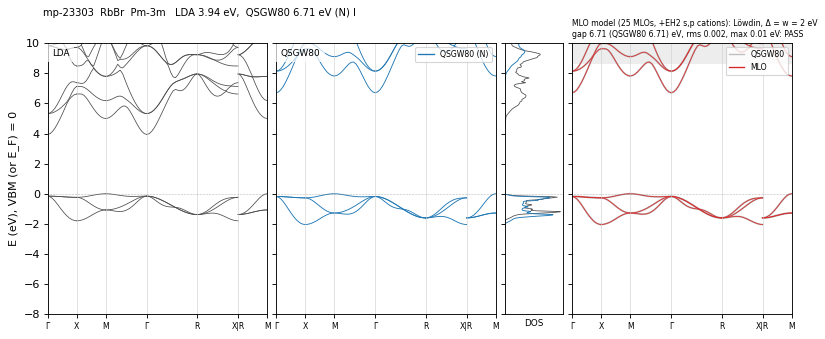

**mp-23295** RbCl — QSGW80 **7.98** N / R ≈ eV D  — ecalj 989a18637 (tf32, t_tetrakbt -300) — MLO PASS (b2) 25 gap 7.98 rms 0.003 max 0.05 (ecalj fb2da026b)

<small>runs: M 7.94 · R 7.98 (09-30) · N 7.98 (10-05)</small>

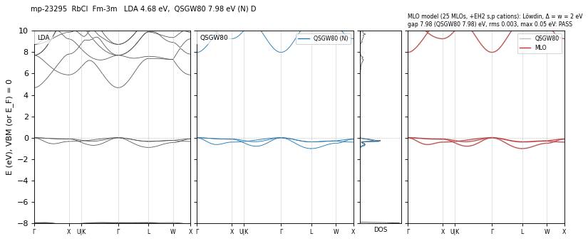

**mp-23299** RbCl — QSGW80 **7.89** N / R ≈ eV I  — ecalj 989a18637 (tf32, t_tetrakbt -300) — MLO PASS (b2) 30 gap 7.89 rms 0.003 max 0.02 (ecalj fb2da026b)

<small>runs: M 7.90 · R 7.89 (09-30) · N 7.89 (10-05)</small>

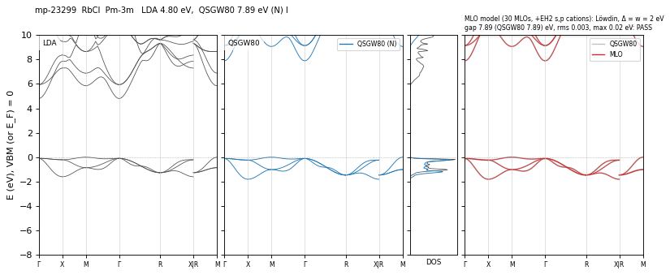

**mp-2064** RbF — QSGW80 **10.48** N / M 10.28 eV D CHECK — ecalj b695fa65c (tf32, t_tetrakbt -300) — MLO PASS (b1) 13 gap 10.48 rms 0.008 max 0.07 (ecalj fb2da026b)

<small>runs: M 10.28 · N 10.48 (10-03)</small>

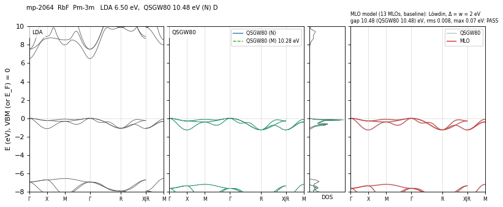

**mp-24721** RbH — QSGW80 **5.51** N / M 5.43 eV D differs — ecalj b695fa65c (tf32, t_tetrakbt -300) — MLO PASS (b1) 16 gap 5.50 rms 0.012 max 0.07 (ecalj fb2da026b)

<small>runs: M 5.43 · N 5.51 (10-03)</small>

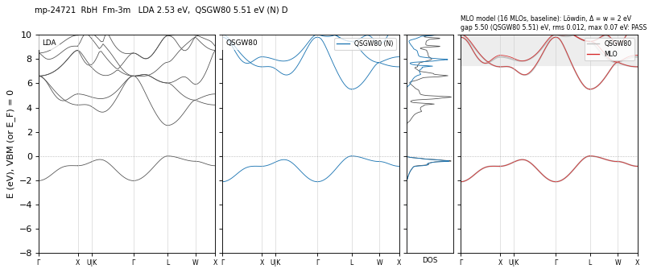

**mp-22903** RbI — QSGW80 **6.11** E / E1 ≈ / N 6.28 / R 6.28 eV D differs — ecalj 0601771b4 (tf32, t_tetrakbt -300) with ES, ES rule es-c — MLO PASS (b1, ES) 23 gap 6.11 rms 0.002 max 0.03 (ecalj f16f0ea3d)

<small>runs: M 6.16 · R 6.28 (09-30) · E1 6.10 (10-05, ES 2) · N 6.28 (10-05) · E 6.11 (10-06, ES 2, es-c)</small>

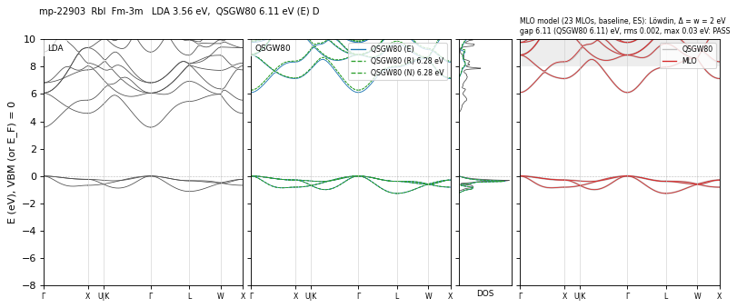

**mp-23302** RbI — QSGW80 **5.56** N / R ≈ eV I  — ecalj 989a18637 (tf32, t_tetrakbt -300) — MLO PASS (b2) 25 gap 5.56 rms 0.002 max 0.01 (ecalj fb2da026b)

<small>runs: M 5.42 · R 5.56 (09-30) · N 5.56 (10-05)</small>

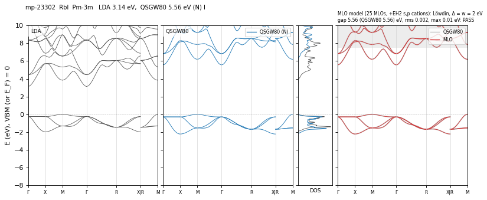

**mp-149** Si2 — QSGW80 **1.20** N / M ≈ eV I  — ecalj b695fa65c (tf32, t_tetrakbt -300) — MLO PASS (b1) 18 gap 1.15 rms 0.005 max 0.03 (ecalj 96ec5c1ee)

<small>runs: M 1.20 · N 1.20 (10-03)</small>

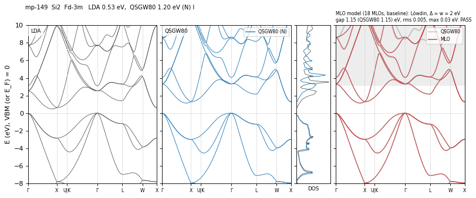

**mp-8062** SiC — QSGW80 **2.35** N / M ≈ eV I  — ecalj b695fa65c (tf32, t_tetrakbt -300) — MLO PASS (b1) 13 gap 2.35 rms 0.003 max 0.01 (ecalj 614ab5eb8)

<small>runs: M 2.34 · N 2.35 (10-03)</small>

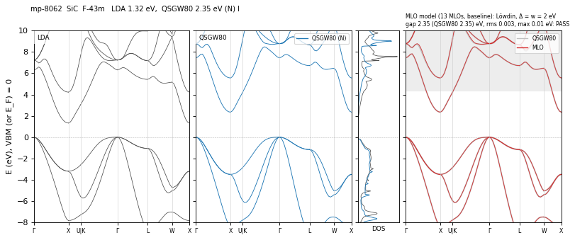

**mp-10013** SnS — QSGW80 **0.54** N / M ≈ eV I  — ecalj b695fa65c (tf32, t_tetrakbt -300) — MLO PASS (b1) 18 gap 0.55 rms 0.012 max 0.07 (ecalj 5baf562f0)

<small>runs: M 0.55 · N 0.54 (10-02)</small>

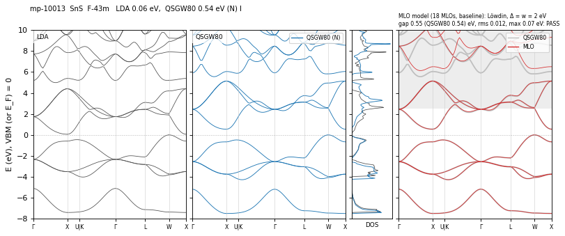

**mp-1876** SnS — QSGW80 **0.78** N / M ≈ · path 0.03 eV D path<mesh(mesh) vs2025 — ecalj b695fa65c (tf32, t_tetrakbt -300) — MLO PASS (b1) 18 gap 0.22 rms 0.002 max 0.01 (ecalj 0c4d16ceb)

<small>runs: M 0.79 · N 0.78 (10-03)</small>

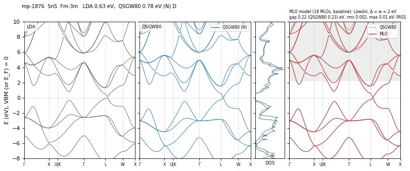

**mp-2693** SnSe — QSGW80 **0.79** N / M ≈ · path 0.12 eV D path<mesh(mesh) vs2025 — ecalj b695fa65c (tf32, t_tetrakbt -300) — MLO PASS (b1) 18 gap 0.25 rms 0.003 max 0.02 (ecalj fb2da026b)

<small>runs: M 0.79 · N 0.79 (10-02)</small>

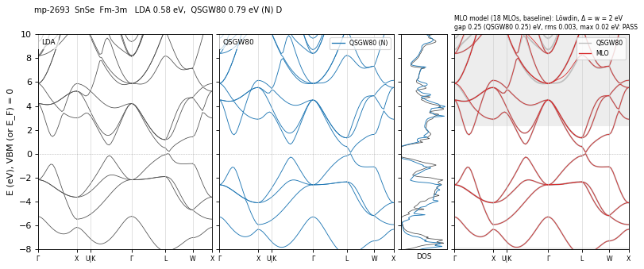

**mp-16364** SnTe — QSGW80 **0.32** E / E1 ≈ / M ≈ / N ≈ eV I  — ecalj 0601771b4 (tf32, t_tetrakbt -300) with ES, ES rule es-c — MLO PASS (b1, ES) 20 gap 0.32 rms 0.001 max 0.00 (ecalj f16f0ea3d)

<small>runs: M 0.30 · N 0.31 (10-02) · E1 0.32 (10-05, ES 2) · E 0.32 (10-06, ES 2, es-c)</small>

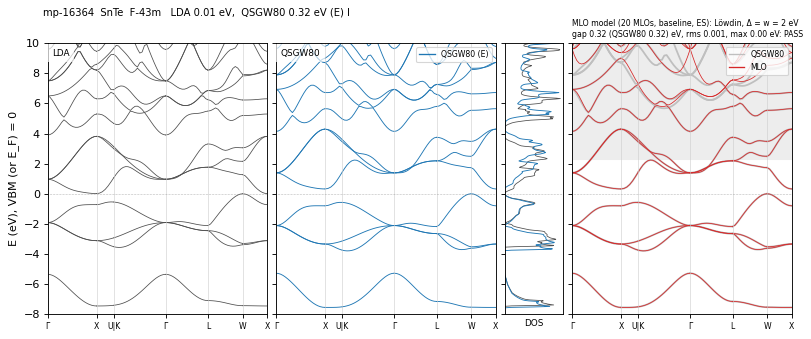

**mp-1883** SnTe — QSGW80 **0.05** N / M 0.37 eV D CHECK — ecalj b695fa65c (tf32, t_tetrakbt -300) — MLO PASS (b1) 18 gap 0.05 rms 0.004 max 0.02 (ecalj 0c4d16ceb)

<small>runs: M 0.37 · N 0.05 (10-03)</small>

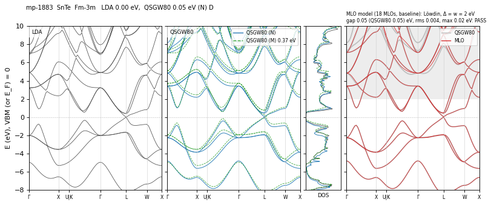

**mp-2472** SrO — QSGW80 **5.54** N / M 5.43 eV I differs — ecalj b695fa65c (tf32, t_tetrakbt -300) — MLO PASS (b1) 16 gap 5.54 rms 0.007 max 0.06 (ecalj fb2da026b)

<small>runs: M 5.43 · N 5.54 (10-03)</small>

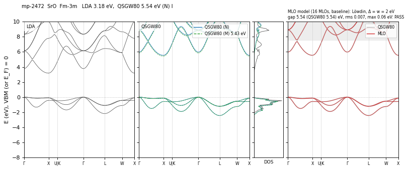

**mp-10627** SrS — QSGW80 **3.28** N / M ≈ eV I  — ecalj b695fa65c (tf32, t_tetrakbt -300) — MLO PASS (b1) 18 gap 3.28 rms 0.002 max 0.02 (ecalj a1d6c0e11)

<small>runs: M 3.33 · N 3.28 (10-02)</small>

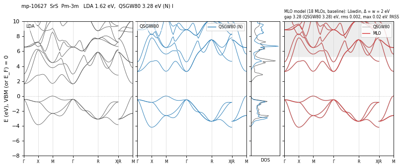

**mp-1087** SrS — QSGW80 **4.17** N / R ≈ eV I  — ecalj 989a18637 (tf32, t_tetrakbt -300) — MLO PASS (b1) 21 gap 4.17 rms 0.003 max 0.02 (ecalj a1d6c0e11)

*bands drawn again (job_band had failed without atmpnu)*

<small>runs: M 4.12 · R 4.17 (09-30) · N 4.17 (10-03)</small>

**mp-2758** SrSe — QSGW80 **3.77** N / R ≈ eV I  — ecalj 989a18637 (tf32, t_tetrakbt -300) — MLO PASS (b1) 18 gap 3.77 rms 0.007 max 0.07 (ecalj fb2da026b)

<small>runs: M 3.74 · R 3.77 (09-30) · N 3.77 (10-03)</small>

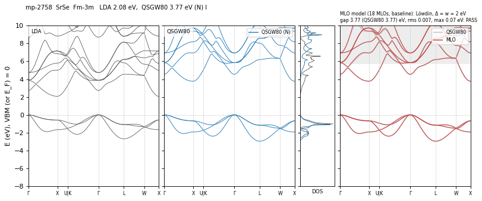

**mp-10653** SrTe — QSGW80 **1.36** N / M ≈ eV D  — ecalj b695fa65c (tf32, t_tetrakbt -300) — MLO PASS (b1) 18 gap 1.36 rms 0.002 max 0.01 (ecalj a1d6c0e11)

<small>runs: M 1.36 · N 1.36 (10-02)</small>

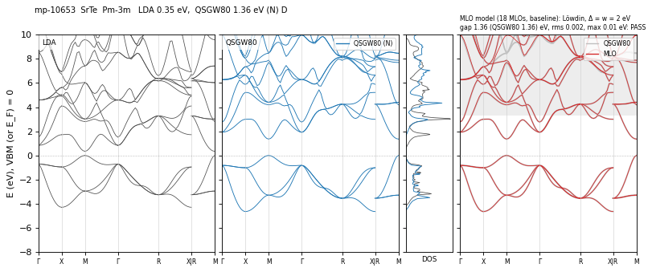

**mp-1958** SrTe — QSGW80 **2.99** N / R ≈ eV I  — ecalj 989a18637 (tf32, t_tetrakbt -300) — MLO PASS (b2) 22 gap 2.99 rms 0.008 max 0.05 (ecalj fb2da026b)

<small>runs: M 2.96 · R 2.99 (09-30) · N 2.99 (10-05)</small>

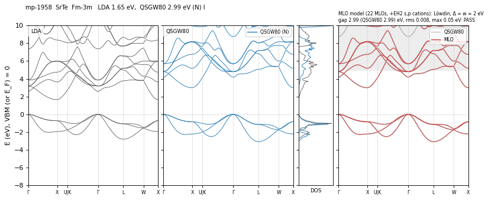

**mp-19717** TePb — QSGW80 **1.09** N / M ≈ eV D  — ecalj b695fa65c (tf32, t_tetrakbt -300) — MLO PASS (b1) 18 gap 1.09 rms 0.004 max 0.02 (ecalj fb2da026b)

<small>runs: M 1.10 · N 1.09 (10-02)</small>

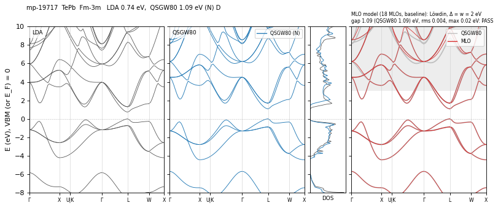

**mp-22875** TlBr — QSGW80 **3.17** N / M 3.07 eV D differs — ecalj b695fa65c (tf32, t_tetrakbt -300) — MLO PASS (b1) 23 gap 3.17 rms 0.002 max 0.02 (ecalj fb2da026b)

<small>runs: M 3.07 · N 3.17 (10-03)</small>

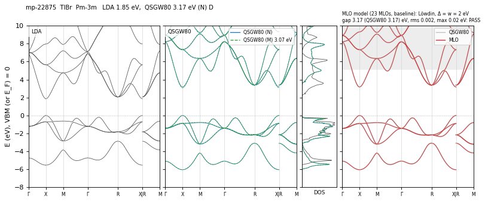

**mp-568560** TlBr — QSGW80 **3.56** N / M 3.73 eV D differs — ecalj b695fa65c (tf32, t_tetrakbt -300) — MLO PASS (b1) 23 gap 3.56 rms 0.003 max 0.02 (ecalj 614ab5eb8)

<small>runs: M 3.73 · N 3.56 (10-02)</small>

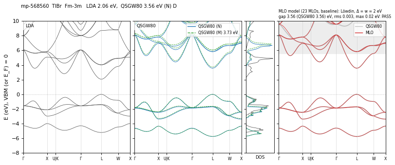

**mp-23167** TlCl — QSGW80 **3.47** N / M ≈ eV D  — ecalj b695fa65c (tf32, t_tetrakbt -300) — MLO PASS (b1) 23 gap 3.47 rms 0.001 max 0.01 (ecalj fb2da026b)

<small>runs: M 3.48 · N 3.47 (10-02)</small>

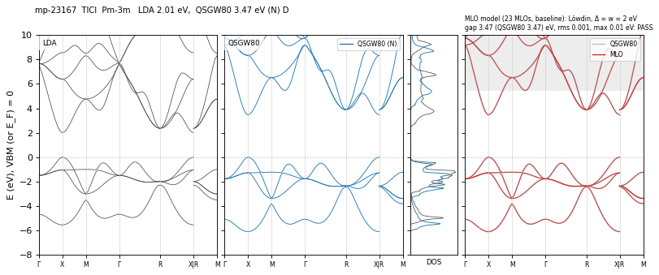

**mp-569639** TlCl — QSGW80 **3.94** N / R ≈ eV D  — ecalj 989a18637 (tf32, t_tetrakbt -300) — MLO PASS (b1) 23 gap 3.94 rms 0.001 max 0.01 (ecalj fb2da026b)

<small>runs: M 1.25 · R 3.94 (10-01) · N 3.94 (10-03)</small>

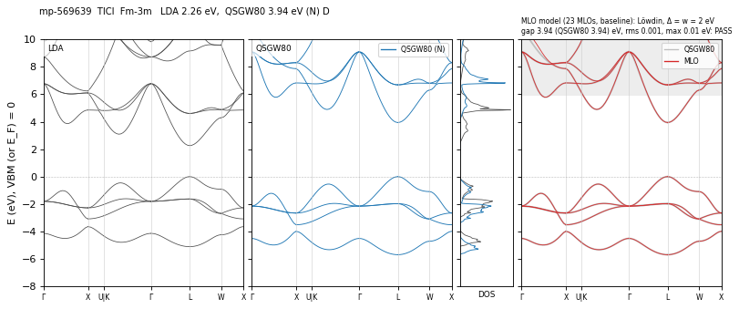

**mp-23197** TlI — QSGW80 **2.72** N / R ≈ eV I  — ecalj 989a18637 (tf32, t_tetrakbt -300) — MLO PASS (b1) 23 gap 2.67 rms 0.001 max 0.01 (ecalj fb2da026b)

<small>runs: M FAILED · R 2.72 (09-30) · N 2.72 (10-05)</small>

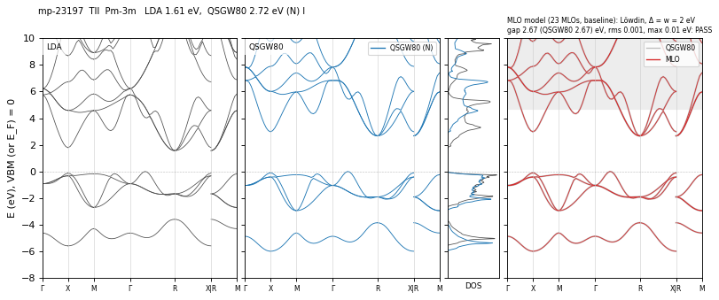

**mp-571102** TlI — QSGW80 **3.26** N / M ≈ eV D  — ecalj b695fa65c (tf32, t_tetrakbt -300) — MLO PASS (b1) 23 gap 3.26 rms 0.008 max 0.07 (ecalj 614ab5eb8)

<small>runs: M 3.25 · N 3.26 (10-03)</small>

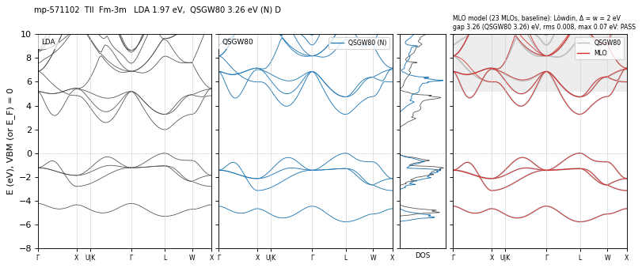

**mp-2114** YN — QSGW80 **0.99** N / M ≈ eV I  — ecalj b695fa65c (tf32, t_tetrakbt -300) — MLO PASS (b1) 13 gap 0.99 rms 0.002 max 0.01 (ecalj fb2da026b)

<small>runs: M 1.00 · N 0.99 (10-03)</small>

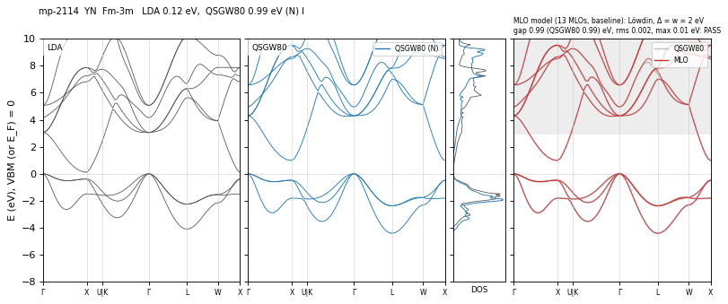

**mp-1986** ZnO — QSGW80 **3.04** N / R ≈ eV D  — ecalj 989a18637 (tf32, t_tetrakbt -300) — MLO PASS (b1) 13 gap 3.04 rms 0.001 max 0.01 (ecalj fb2da026b)

<small>runs: M 2.94 · R 3.04 (10-01) · N 3.04 (10-03)</small>

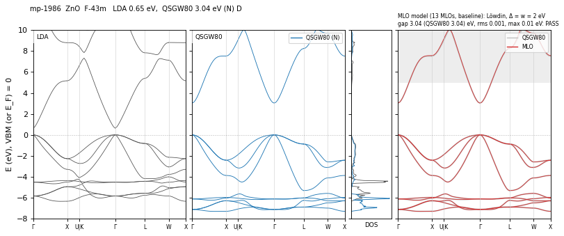

**mp-2229** ZnO — QSGW80 **2.78** N / M ≈ eV I  — ecalj b695fa65c (tf32, t_tetrakbt -300) — MLO PASS (b1) 13 gap 2.78 rms 0.001 max 0.01 (ecalj fb2da026b)

<small>runs: M 2.74 · N 2.78 (10-02)</small>

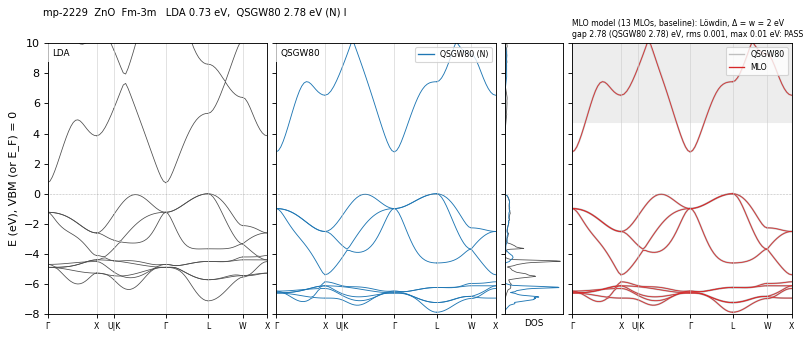

**mp-10695** ZnS — QSGW80 **3.69** N / M ≈ eV D  — ecalj b695fa65c (tf32, t_tetrakbt -300) — MLO PASS (b1) 18 gap 3.72 rms 0.008 max 0.06 (ecalj a1d6c0e11)

<small>runs: M 3.68 · N 3.69 (10-03)</small>

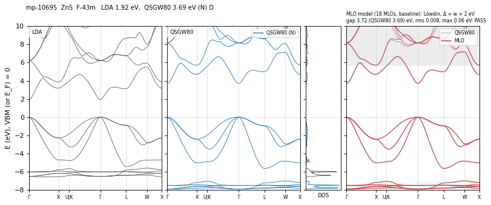

**mp-1190** ZnSe — QSGW80 **2.75** N / M ≈ eV D  — ecalj b695fa65c (tf32, t_tetrakbt -300) — MLO PASS (b1) 18 gap 2.78 rms 0.011 max 0.07 (ecalj a1d6c0e11)

<small>runs: M 2.73 · N 2.75 (10-03)</small>

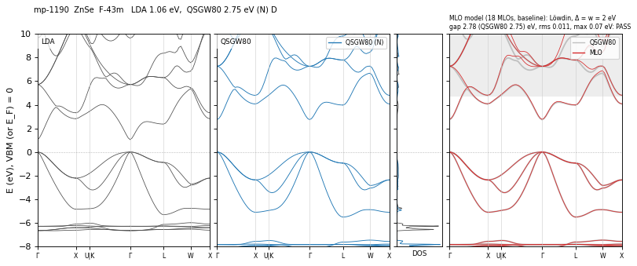

**mp-2176** ZnTe — QSGW80 **2.45** N / M ≈ eV D  — ecalj b695fa65c (tf32, t_tetrakbt -300) — MLO PASS (b2) 22 gap 2.45 rms 0.003 max 0.03 (ecalj fb2da026b)

<small>runs: M 2.43 · N 2.45 (10-03)</small>

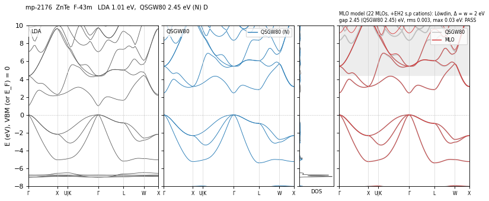

