# GW1500 QSGW80 — bands and DOS, 3 atoms per cell

[README](README.md) · [table](table.md)

Left: LDA. Middle: QSGW80 adopted (blue, condition in parentheses; green dashed: another QSGW80 result when its gap differs by more than 0.1 eV) and the total DOS. Right: the MLO model of the standard recipe (red) on the QSGW80 bands (gray), with its conditions and check; shaded: outside the window of the check ([README](README.md#mlo-models)). Energies from the VBM (insulators) or E_F (metals).

**mp-9519** AgCN — QSGW80 **6.82** N / M ≈ eV I  — ecalj b695fa65c (tf32, t_tetrakbt -300) — MLO PASS (b2d) 29 gap 6.80 rms 0.004 max 0.03 (ecalj 1fd34b1c0)

<small>runs: M 6.78 · N 6.82 (10-03)</small>

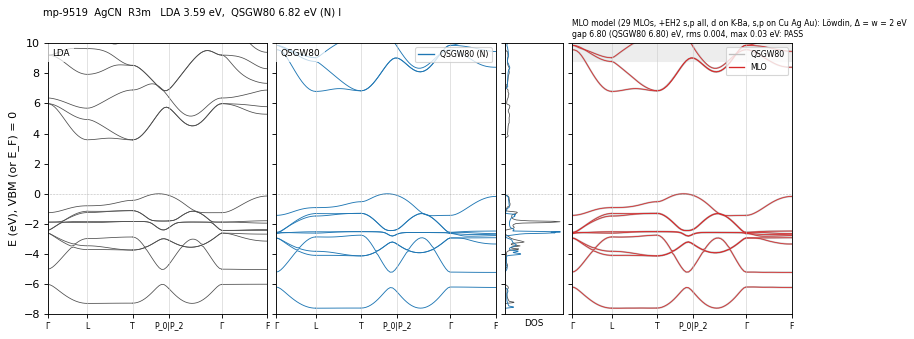

**mp-7188** Al2Os — QSGW80 **0.98** N / M ≈ · path 0.79 eV I path<mesh(mesh) — ecalj b695fa65c (tf32, t_tetrakbt -300) — MLO PASS (b1) 27 gap 0.80 rms 0.003 max 0.02 (ecalj 614ab5eb8)

<small>runs: M 1.01 · N 0.98 (10-03)</small>

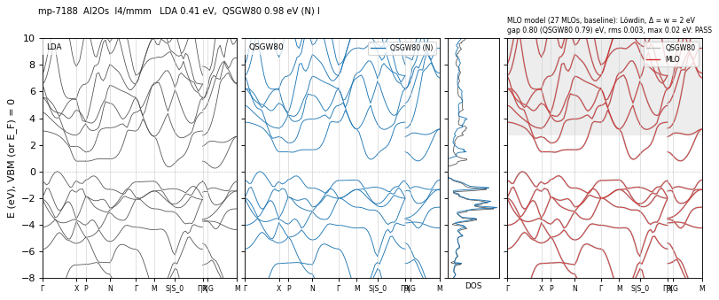

**mp-29196** AuCN — QSGW80 **3.81** E / E1 ≈ / M 3.88 / N ≈ eV I differs — ecalj 0601771b4 (tf32, t_tetrakbt -300) with ES, ES rule es-c — MLO PASS (b1, ES) 19 gap 3.78 rms 0.002 max 0.03 (ecalj f16f0ea3d)

<small>runs: M 3.88 · N 3.82 (10-03) · E1 3.80 (10-05, ES 1) · E 3.81 (10-06, ES 2, es-c)</small>

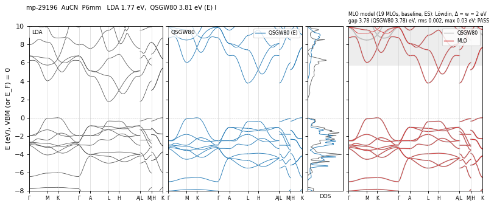

**mp-1018141** BaC2 — QSGW80 **3.29** N / M ≈ eV I  — ecalj 989a18637 (tf32, t_tetrakbt -300) — MLO PASS (b2) 32 gap 3.29 rms 0.006 max 0.03 (ecalj a1d6c0e11)

<small>runs: M 3.25 · N 3.29 (10-02)</small>

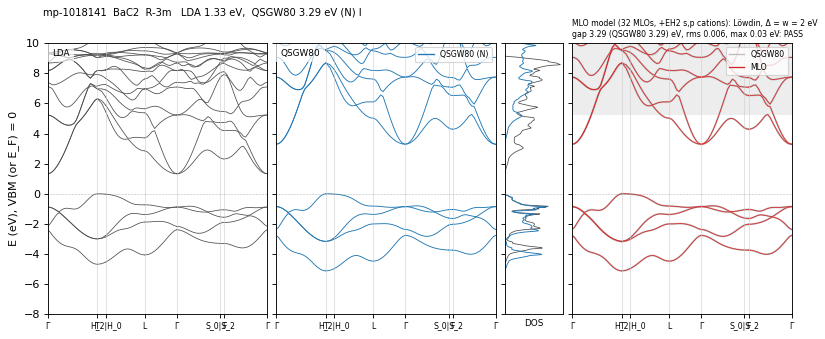

**mp-1735** BaC2 — QSGW80 **3.86** N / M ≈ eV I  — ecalj b695fa65c (tf32, t_tetrakbt -300) — MLO PASS (b2) 32 gap 3.86 rms 0.007 max 0.06 (ecalj 0c4d16ceb)

<small>runs: M 3.87 · N 3.86 (10-03)</small>

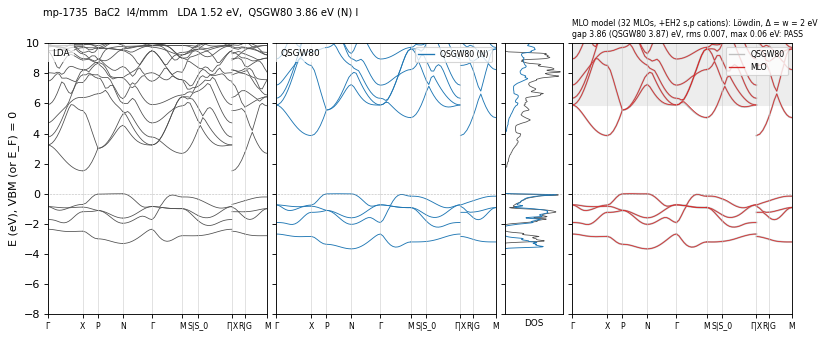

**mp-568662** BaCl2 — QSGW80 **8.00** E / E1 ≈ / N ≈ / R ≈ eV I  — ecalj 0601771b4 (tf32, t_tetrakbt -300) with ES, ES rule es-c — MLO PASS (b1, ES) 34 gap 8.00 rms 0.001 max 0.01 (ecalj a45169f3c)

<small>runs: M 7.91 · R 8.00 (09-30) · N 8.00 (10-03) · E1 8.00 (10-05, ES 1) · E 8.00 (10-06, ES 1, es-c)</small>

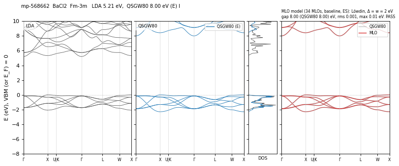

**mp-1029** BaF2 — QSGW80 **10.27** E / E1 ≈ / M 10.62 / N 10.37 eV I CHECK — ecalj 0601771b4 (tf32, t_tetrakbt -300) with ES, ES rule es-c — MLO PASS (b1, ES) 21 gap 10.26 rms 0.001 max 0.01 (ecalj f16f0ea3d)

<small>runs: M 10.62 · N 10.37 (10-03) · E1 10.26 (10-05, ES 1) · E 10.27 (10-06, ES 1, es-c)</small>

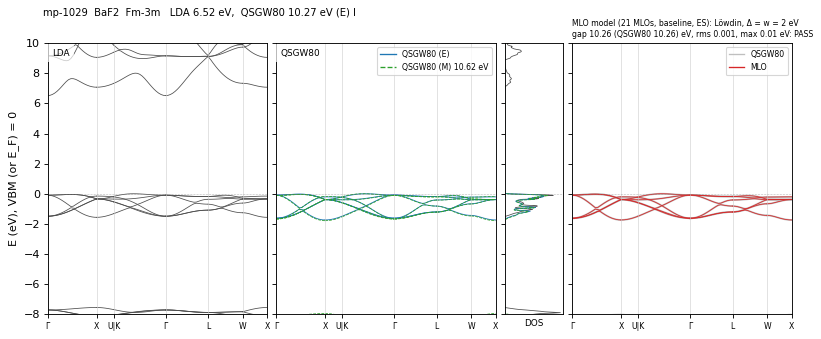

**mp-10616** BaLiAs — QSGW80 **1.39** N / M ≈ eV D  — ecalj b695fa65c (tf32, t_tetrakbt -300) — MLO PASS (b2) 33 gap 1.39 rms 0.002 max 0.01 (ecalj a1d6c0e11)

<small>runs: M 1.40 · N 1.39 (10-03)</small>

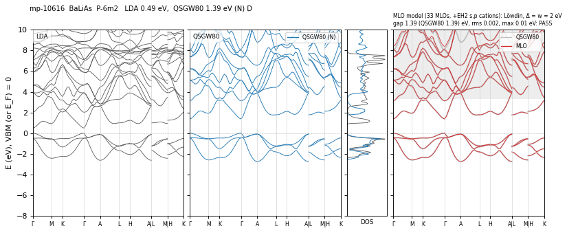

**mp-10615** BaLiP — QSGW80 **1.51** N / M ≈ eV D  — ecalj b695fa65c (tf32, t_tetrakbt -300) — MLO PASS (b1) 25 gap 1.51 rms 0.017 max 0.08 (ecalj a1d6c0e11)

<small>runs: M 1.49 · N 1.51 (10-03)</small>

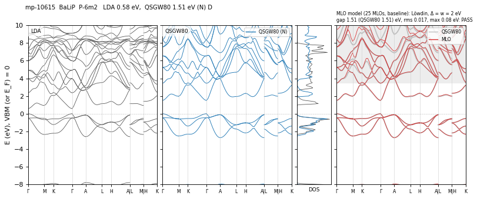

**mp-1006878** BaO2 — QSGW80 **5.17** N / M 5.01 eV I differs — ecalj b695fa65c (tf32, t_tetrakbt -300) — MLO PASS (b2) 29 gap 5.17 rms 0.005 max 0.03 (ecalj 839fa113b)

<small>runs: M 5.01 · N 5.17 (10-03)</small>

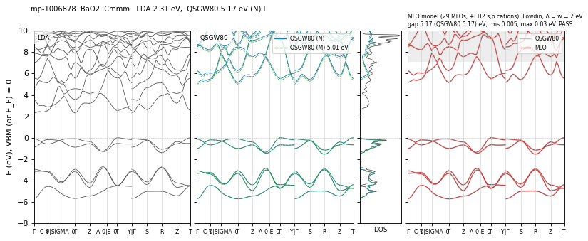

**mp-1105** BaO2 — QSGW80 **4.93** N / R ≈ eV D  — ecalj b695fa65c (tf32, t_tetrakbt -300) — MLO PASS (b2) 24 gap 4.93 rms 0.003 max 0.02 (ecalj a1d6c0e11)

<small>runs: M 5.11 · R 4.93 (10-01) · N 4.93 (10-03)</small>

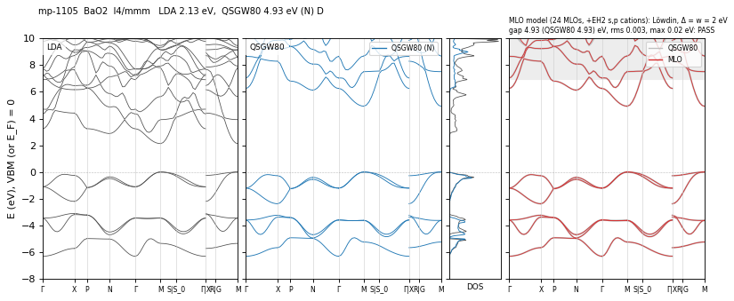

**mp-1569** Be2C — QSGW80 **2.09** N / M ≈ eV I  — ecalj b695fa65c (tf32, t_tetrakbt -300) — MLO PASS (b1) 12 gap 2.09 rms 0.004 max 0.01 (ecalj 0c4d16ceb)

<small>runs: M 2.10 · N 2.09 (10-03)</small>

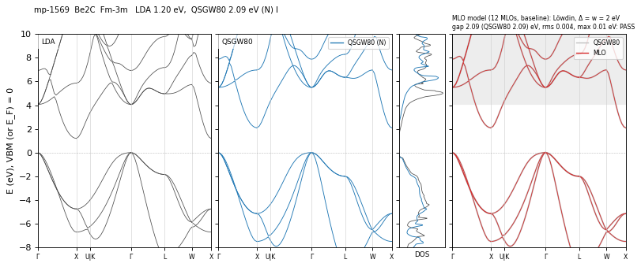

**mp-22965** BiTeI — QSGW80 **1.88** N / M ≈ eV I  — ecalj b695fa65c (tf32, t_tetrakbt -300) — MLO PASS (b1) 27 gap 1.86 rms 0.003 max 0.02 (ecalj fb2da026b)

<small>runs: M 1.88 · N 1.88 (10-03)</small>

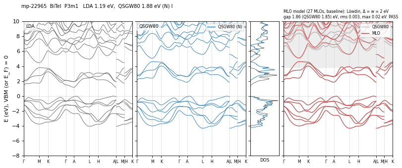

**mp-30068** CIN — QSGW80 **7.49** E / M 7.71 / N 7.61 eV D CHECK — ecalj 0601771b4 (tf32, t_tetrakbt -300) with ES, ES rule es-c — MLO PASS (b2all, ES) 32 gap 7.52 rms 0.003 max 0.02 (ecalj d90296348)

<small>runs: M 7.71 · N 7.61 (10-03) · E FAIL(1) FAIL(1) (10-06, ES 3, es-a) · E 7.49 (10-06, ES 3, es-c)</small>

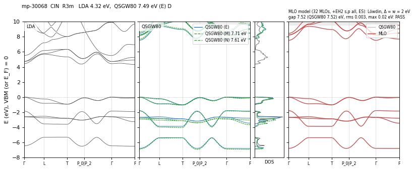

**mp-28240** CSO — QSGW80 **8.28** E / E1 8.36 / M 8.44 / N 8.56 eV I CHECK — ecalj 0601771b4 (tf32, t_tetrakbt -300) with ES, ES rule es-c — MLO PASS (b2, ES) 24 gap 8.28 rms 0.005 max 0.04 (ecalj f16f0ea3d)

<small>runs: M 8.44 · N 8.56 (10-03) · E1 8.36 (10-05, ES 1) · E 8.28 (10-06, ES 3, es-c)</small>

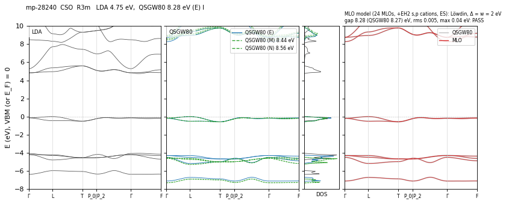

**mp-2482** CaC2 — QSGW80 **3.52** N / M ≈ eV I  — ecalj b695fa65c (tf32, t_tetrakbt -300) — MLO PASS (b1) 17 gap 3.52 rms 0.003 max 0.03 (ecalj fb2da026b)

<small>runs: M 3.47 · N 3.52 (10-03)</small>

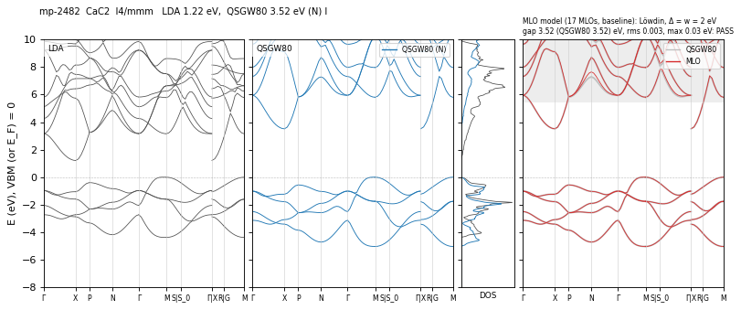

**mp-2741** CaF2 — QSGW80 **11.12** N / M 11.04 eV I differs — ecalj b695fa65c (tf32, t_tetrakbt -300) — MLO PASS (b2) 24 gap 11.12 rms 0.004 max 0.02 (ecalj fb2da026b)

<small>runs: M 11.04 · N 11.12 (10-03)</small>

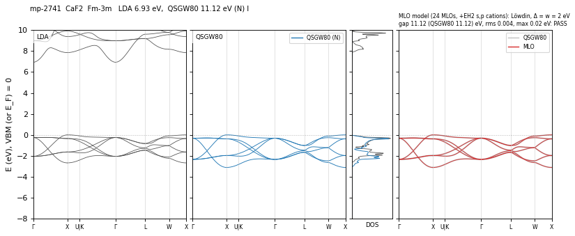

**mp-30031** CaI2 — QSGW80 **6.09** E / E1 ≈ / N ≈ / R ≈ eV I  — ecalj 0601771b4 (tf32, t_tetrakbt -300) with ES, ES rule es-c — MLO PASS (b2, ES) 32 gap 6.10 rms 0.011 max 0.06 (ecalj a45169f3c)

<small>runs: M 6.09 · R 6.08 (09-30) · N 6.08 (10-03) · E1 6.09 (10-05, ES 1) · E 6.09 (10-06, ES 1, es-c)</small>

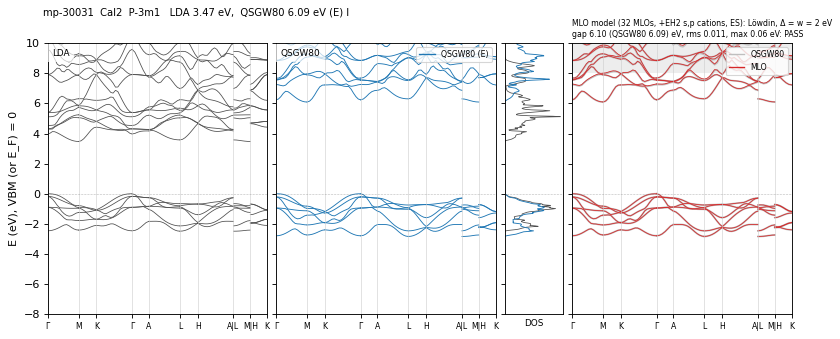

**mp-634859** CaO2 — QSGW80 **6.39** N / M 6.25 eV I differs — ecalj b695fa65c (tf32, t_tetrakbt -300) — MLO PASS (b1) 20 gap 6.36 rms 0.001 max 0.01 (ecalj 614ab5eb8)

<small>runs: M 6.25 · N 6.39 (10-03)</small>

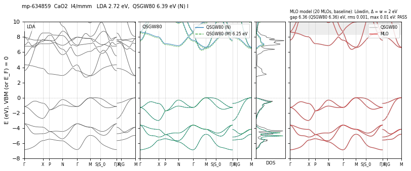

**mp-568690** CdBr2 — QSGW80 **4.86** N / R ≈ eV I  — ecalj b695fa65c (tf32, t_tetrakbt -300) — MLO PASS (b1) 27 gap 4.92 rms 0.015 max 0.08 (ecalj 614ab5eb8)

<small>runs: M 4.43 · R 4.86 (10-01) · N 4.86 (10-03)</small>

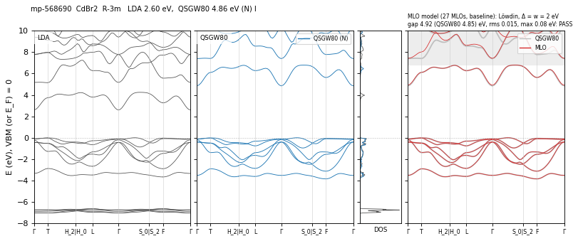

**mp-22881** CdCl2 — QSGW80 **5.99** N / R ≈ eV I  — ecalj b695fa65c (tf32, t_tetrakbt -300) — MLO PASS (b1) 27 gap 6.05 rms 0.012 max 0.09 (ecalj fb2da026b)

<small>runs: M 5.57 · R 5.99 (10-01) · N 5.99 (10-03)</small>

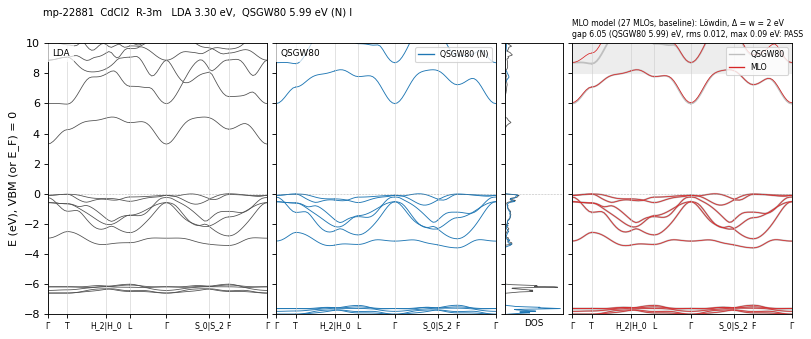

**mp-241** CdF2 — QSGW80 **6.48** N / M 6.42 eV I differs — ecalj b695fa65c (tf32, t_tetrakbt -300) — MLO PASS (b1) 17 gap 6.48 rms 0.001 max 0.01 (ecalj fb2da026b)

<small>runs: M 6.42 · N 6.48 (10-03)</small>

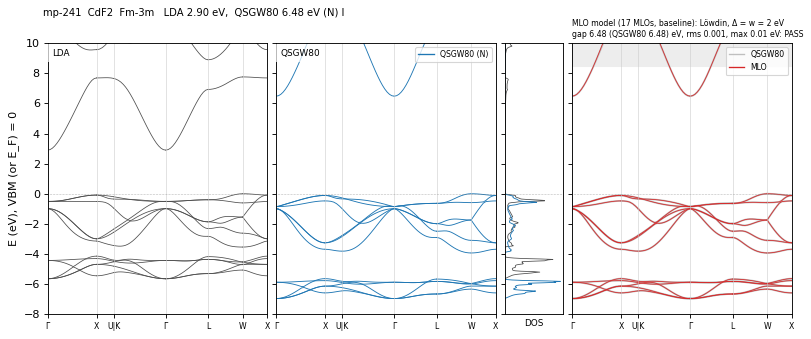

**mp-567259** CdI2 — QSGW80 **3.96** E / E1 ≈ / M ≈ / N ≈ eV I  — ecalj 0601771b4 (tf32, t_tetrakbt -300) with ES, ES rule es-c — MLO PASS (b1, ES) 28 gap 3.98 rms 0.002 max 0.01 (ecalj a45169f3c)

<small>runs: M 3.99 · N 3.97 (10-03) · E1 3.96 (10-05, ES 1) · E 3.96 (10-06, ES 1, es-c)</small>

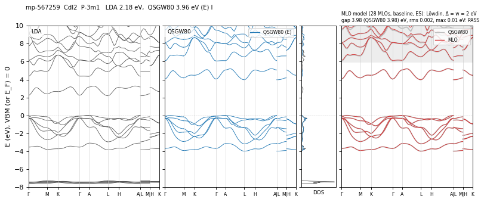

**mp-7988** Cs2O — QSGW80 **2.28** N / R ≈ eV I  — ecalj b695fa65c (tf32, t_tetrakbt -300) — MLO PASS (b2) 36 gap 2.28 rms 0.006 max 0.05 (ecalj 614ab5eb8)

<small>runs: M 2.03 · R 2.28 (09-30) · N 2.28 (10-03)</small>

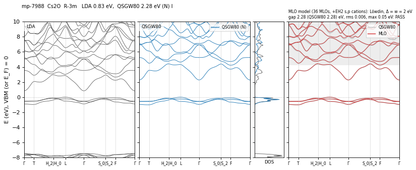

**mp-567677** GeI2 — QSGW80 **3.09** E / E1 ≈ / M ≈ / N ≈ · path 2.96 eV I path<mesh(mesh) — ecalj 0601771b4 (tf32, t_tetrakbt -300) with ES, ES rule es-c — MLO PASS (b1, ES) 31 gap 2.96 rms 0.001 max 0.01 (ecalj a45169f3c)

<small>runs: M 3.12 · N 3.09 (10-03) · E1 3.09 (10-05, ES 1) · E 3.09 (10-06, ES 1, es-c)</small>

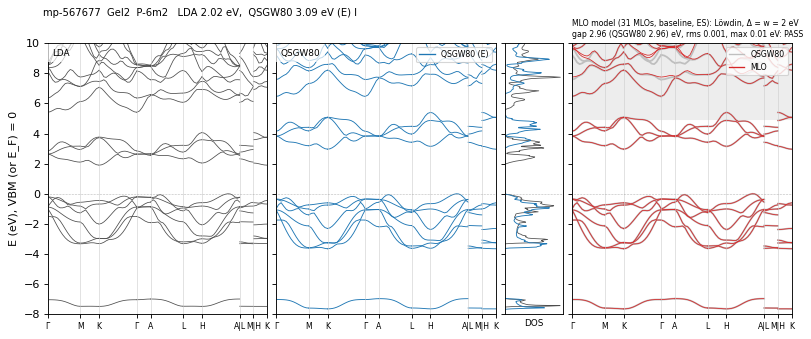

**mp-644272** HCN — QSGW80 **10.70** E / E1 ≈ / M 11.11 / N 11.05 eV I CHECK — ecalj 0601771b4 (tf32, t_tetrakbt -300) with ES, ES rule es-c — MLO PASS (b2, ES) 24 gap 10.70 rms 0.009 max 0.06 (ecalj a45169f3c)

<small>runs: M 11.11 · N 11.05 (10-03) · E1 10.72 (10-05, ES 1) · E 10.70 (10-06, ES 1, es-c)</small>

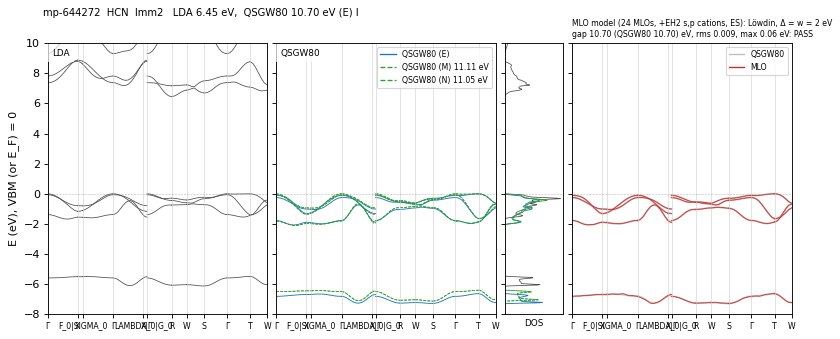

**mp-644385** HCN — QSGW80 **11.30** E / E1 10.96 / M ≈ / N 11.38 eV I CHECK — ecalj 0601771b4 (tf32, t_tetrakbt -300) with ES, ES rule es-c — MLO PASS (b2all, ES) 26 gap 11.30 rms 0.012 max 0.05 (ecalj a45169f3c)

<small>runs: M 11.30 · N 11.38 (10-03) · E1 10.96 (10-05, ES 1) · E 11.30 (10-06, ES 2, es-c)</small>

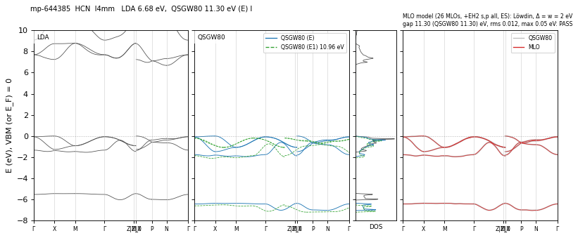

**mp-550893** HfO2 — QSGW80 **5.75** N / M 5.68 eV D differs — ecalj b695fa65c (tf32, t_tetrakbt -300) — MLO PASS (b2all) 32 gap 5.75 rms 0.002 max 0.01 (ecalj 614ab5eb8)

<small>runs: M 5.68 · N 5.75 (10-03)</small>

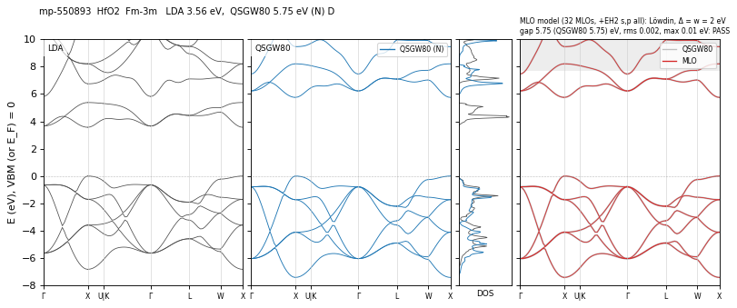

**mp-985829** HfS2 — QSGW80 **2.45** N / M ≈ eV I  — ecalj b695fa65c (tf32, t_tetrakbt -300) — MLO PASS (b1) 34 gap 2.45 rms 0.001 max 0.01 (ecalj 614ab5eb8)

<small>runs: M 2.47 · N 2.45 (10-03)</small>

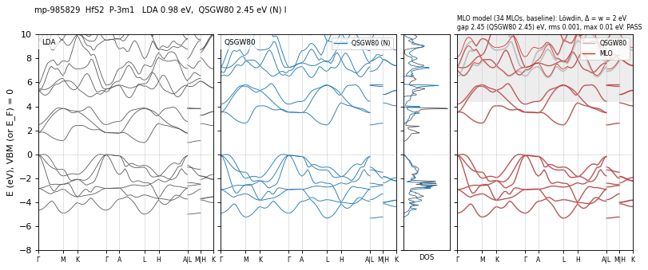

**mp-985831** HfSe2 — QSGW80 **1.62** N / M ≈ eV I  — ecalj b695fa65c (tf32, t_tetrakbt -300) — MLO PASS (b1) 34 gap 1.62 rms 0.002 max 0.02 (ecalj 614ab5eb8)

<small>runs: M 1.60 · N 1.62 (10-03)</small>

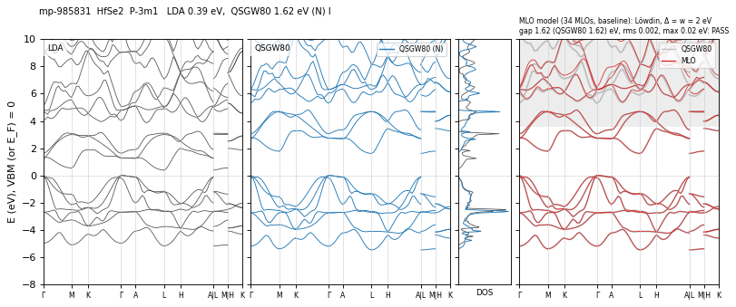

**mp-11869** HfSnPd — QSGW80 **0.45** N / M ≈ eV I  — ecalj b695fa65c (tf32, t_tetrakbt -300) — MLO PASS (b1) 34 gap 0.45 rms 0.002 max 0.01 (ecalj a1d6c0e11)

<small>runs: M 0.44 · N 0.45 (10-03)</small>

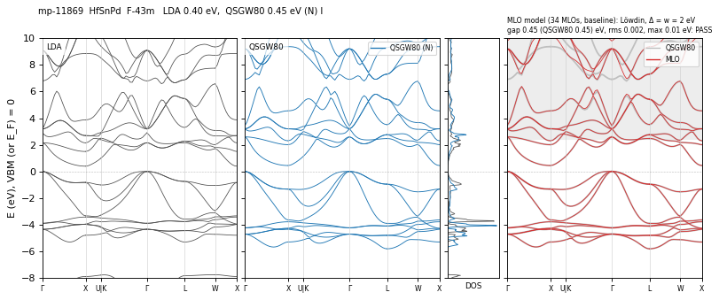

**mp-569360** Hg3 — QSGW80 **0.00** N / R ≈ eV metal  — ecalj 989a18637 (tf32, t_tetrakbt -300) — MLO PASS (b1) 27 rms 0.004 max 0.04 (ecalj fb2da026b)

<small>runs: M UNKNOWN · R CONVERGED_METAL (09-30) · N CONVERGED_METAL (10-02)</small>

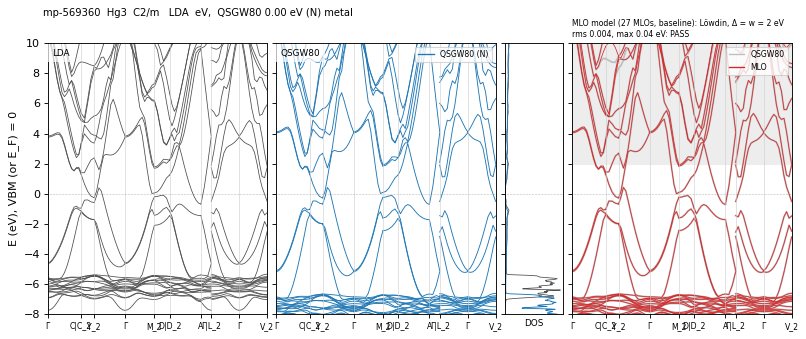

**mp-8177** HgF2 — QSGW80 **3.60** N / M 3.68 eV I differs — ecalj 989a18637 (tf32, t_tetrakbt -300) — MLO PASS (b1) 17 gap 3.60 rms 0.000 max 0.00 (ecalj fb2da026b)

<small>runs: M 3.68 · N 3.60 (10-02)</small>

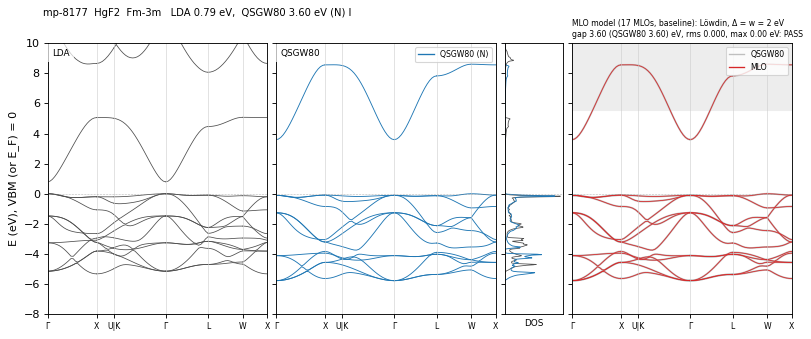

**mp-2278** HgO2 — QSGW80 **1.77** N / R ≈ eV I  — ecalj b695fa65c (tf32, t_tetrakbt -300) — MLO PASS (b1) 17 gap 1.76 rms 0.001 max 0.00 (ecalj fb2da026b)

<small>runs: M 1.86 · R 1.77 (10-01) · N 1.77 (10-03)</small>

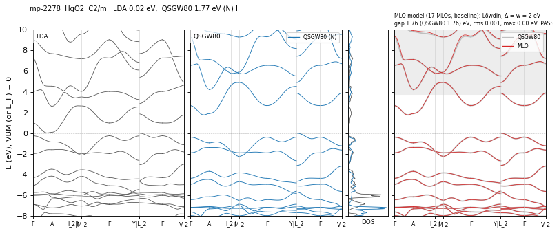

**mp-971** K2O — QSGW80 **3.98** N / M 3.84 eV I differs — ecalj b695fa65c (tf32, t_tetrakbt -300) — MLO PASS (b2) 36 gap 3.98 rms 0.003 max 0.01 (ecalj 614ab5eb8)

<small>runs: M 3.84 · N 3.98 (10-03)</small>

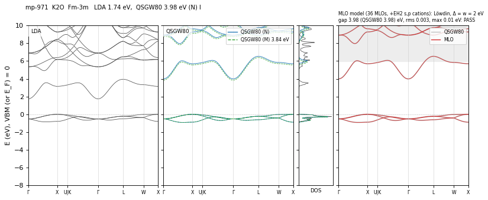

**mp-1062676** K2Pt — QSGW80 **2.99** E / E1 ≈ / M 3.05 / N 3.05 eV I differs — ecalj 0601771b4 (tf32, t_tetrakbt -300) with ES, ES rule es-c — MLO PASS (b1, ES) 37 gap 2.99 rms 0.001 max 0.00 (ecalj f16f0ea3d)

<small>runs: M 3.05 · N 3.05 (10-03) · E1 2.98 (10-05, ES 1) · E 2.99 (10-06, ES 1, es-c)</small>

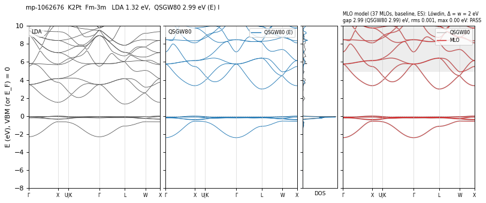

**mp-1022** K2S — QSGW80 **4.35** E / E1 ≈ / M ≈ / N ≈ eV I  — ecalj 0601771b4 (tf32, t_tetrakbt -300) with ES, ES rule es-c — MLO PASS (b1, ES) 37 gap 4.35 rms 0.001 max 0.00 (ecalj f16f0ea3d)

<small>runs: M 4.34 · N 4.35 (10-03) · E1 4.35 (10-05, ES 1) · E 4.35 (10-06, ES 1, es-c)</small>

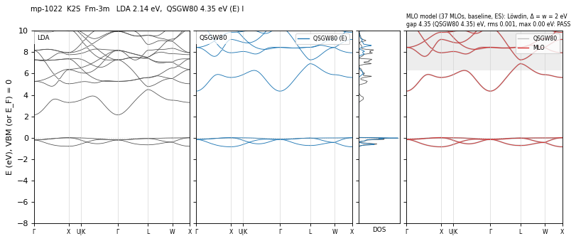

**mp-8426** K2Se — QSGW80 **4.10** E / E1 ≈ / N ≈ / R ≈ eV I  — ecalj 0601771b4 (tf32, t_tetrakbt -300) with ES, ES rule es-c — MLO PASS (b1, ES) 37 gap 4.10 rms 0.001 max 0.00 (ecalj a45169f3c)

<small>runs: M 3.85 · R 4.11 (09-30) · N 4.11 (10-03) · E1 4.09 (10-05, ES 1) · E 4.10 (10-06, ES 1, es-c)</small>

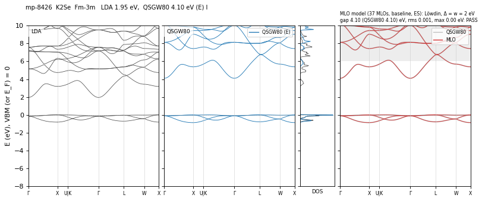

**mp-1747** K2Te — QSGW80 **3.88** E / E1 ≈ / N ≈ / R ≈ eV I  — ecalj 0601771b4 (tf32, t_tetrakbt -300) with ES, ES rule es-c — MLO PASS (b1, ES) 37 gap 3.88 rms 0.000 max 0.00 (ecalj f16f0ea3d)

<small>runs: M 3.80 · R 3.93 (09-30) · N 3.93 (10-03) · E1 3.87 (10-05, ES 1) · E 3.88 (10-06, ES 1, es-c)</small>

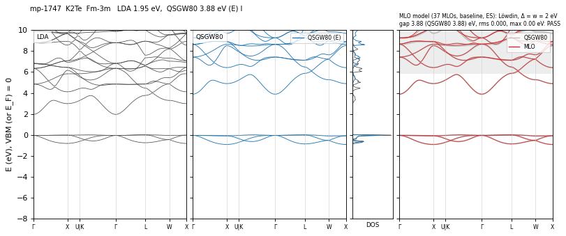

**mp-20134** KCN — QSGW80 **8.75** N / M 8.69 eV I differs — ecalj b695fa65c (tf32, t_tetrakbt -300) — MLO PASS (b2) 28 gap 8.75 rms 0.009 max 0.07 (ecalj fb2da026b)

<small>runs: M 8.69 · N 8.75 (10-03)</small>

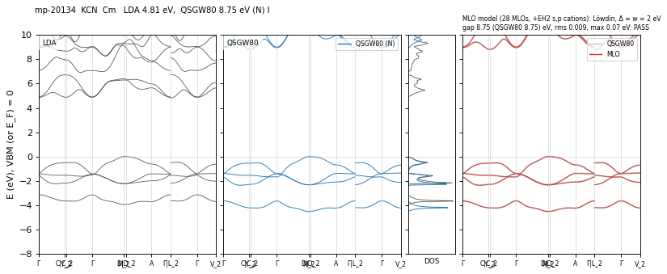

**mp-15687** KZnAs — QSGW80 **1.30** N / R ≈ eV I  — ecalj b695fa65c (tf32, t_tetrakbt -300) — MLO PASS (b2) 38 gap 1.30 rms 0.004 max 0.02 (ecalj 0c4d16ceb)

<small>runs: M 1.28 · R 1.30 (09-30) · N 1.30 (10-03)</small>

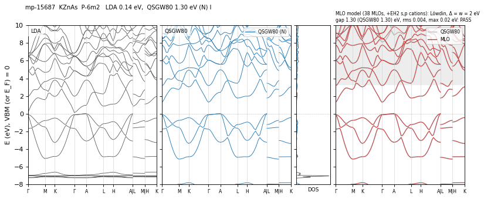

**mp-10161** KZnSb — QSGW80 **1.39** N / M ≈ eV I  — ecalj b695fa65c (tf32, t_tetrakbt -300) — MLO PASS (b2) 43 gap 1.40 rms 0.003 max 0.02 (ecalj a1d6c0e11)

<small>runs: M 1.40 · N 1.39 (10-03)</small>

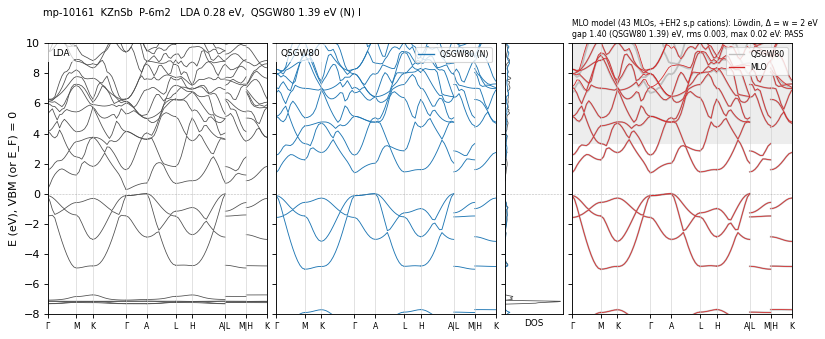

**mp-1960** Li2O — QSGW80 **7.97** N / M 8.08 eV I differs — ecalj b695fa65c (tf32, t_tetrakbt -300) — MLO PASS (b1) 12 gap 7.97 rms 0.002 max 0.02 (ecalj fb2da026b)

<small>runs: M 8.08 · N 7.97 (10-03)</small>

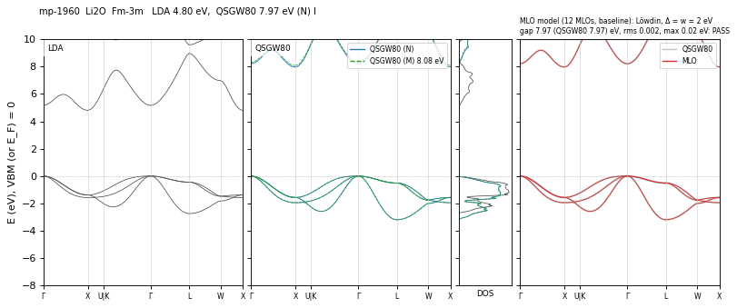

**mp-1153** Li2S — QSGW80 **5.29** N / M ≈ eV I  — ecalj b695fa65c (tf32, t_tetrakbt -300) — MLO PASS (b1) 17 gap 5.29 rms 0.012 max 0.09 (ecalj a1d6c0e11)

<small>runs: M 5.25 · N 5.29 (10-03)</small>

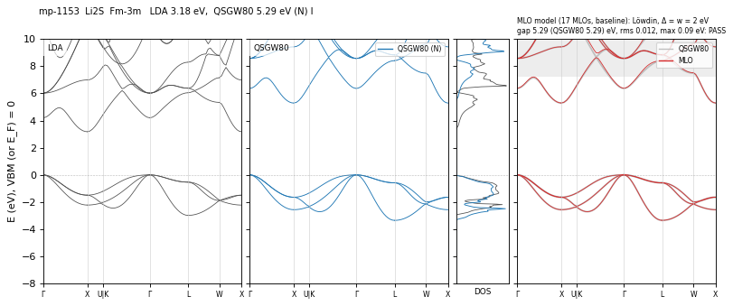

**mp-2286** Li2Se — QSGW80 **4.67** N / M 4.58 eV I differs — ecalj b695fa65c (tf32, t_tetrakbt -300) — MLO PASS (b2) 25 gap 4.67 rms 0.003 max 0.02 (ecalj fb2da026b)

<small>runs: M 4.58 · N 4.67 (10-03)</small>

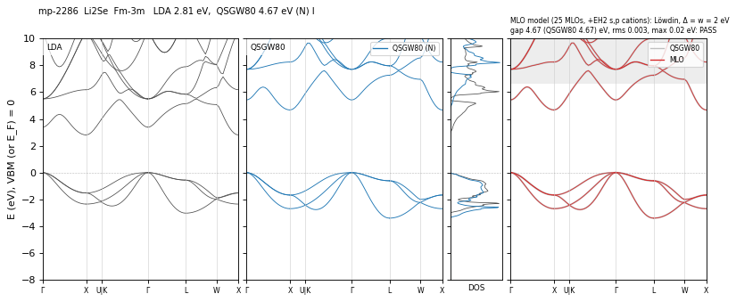

**mp-2530** Li2Te — QSGW80 **3.87** E / E1 ≈ / M 3.81 / N ≈ eV I differs — ecalj 0601771b4 (tf32, t_tetrakbt -300) with ES, ES rule es-c — MLO PASS (b1, ES) 18 gap 3.87 rms 0.001 max 0.00 (ecalj f16f0ea3d)

<small>runs: M 3.81 · N 3.83 (10-03) · E1 3.85 (10-05, ES 1) · E 3.87 (10-06, ES 1, es-c)</small>

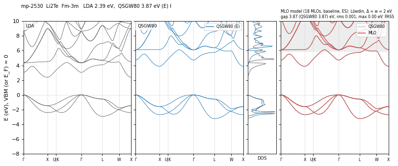

**mp-5920** LiAlGe — QSGW80 **0.47** N / M ≈ eV I  — ecalj b695fa65c (tf32, t_tetrakbt -300) — MLO PASS (b1) 22 gap 0.47 rms 0.003 max 0.01 (ecalj 614ab5eb8)

<small>runs: M 0.47 · N 0.47 (10-03)</small>

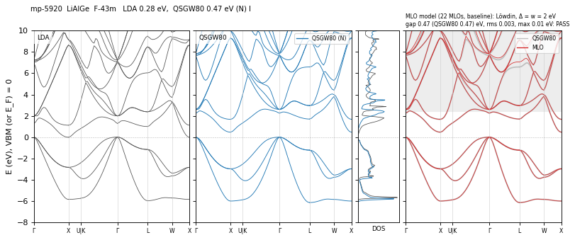

**mp-3161** LiAlSi — QSGW80 **0.48** N / M ≈ eV I  — ecalj b695fa65c (tf32, t_tetrakbt -300) — MLO PASS (b1) 22 gap 0.49 rms 0.002 max 0.01 (ecalj 614ab5eb8)

<small>runs: M 0.48 · N 0.48 (10-03)</small>

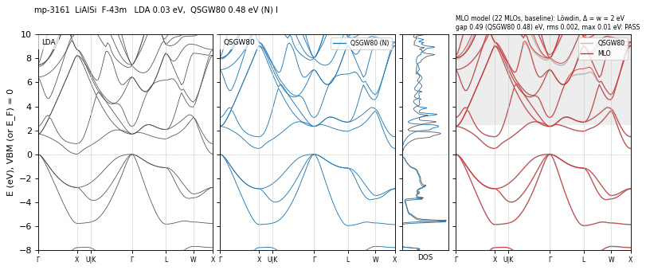

**mp-11390** LiGaSi — QSGW80 **0.54** N / M ≈ eV I  — ecalj b695fa65c (tf32, t_tetrakbt -300) — MLO PASS (b1) 27 gap 0.54 rms 0.002 max 0.01 (ecalj a1d6c0e11)

<small>runs: M 0.53 · N 0.54 (10-03)</small>

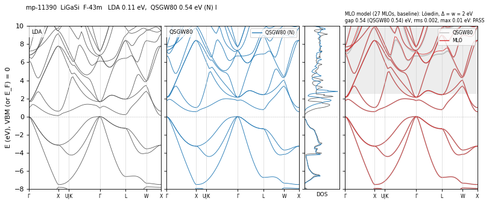

**mp-12558** LiMgAs — QSGW80 **2.29** N / M ≈ eV I  — ecalj b695fa65c (tf32, t_tetrakbt -300) — MLO PASS (b1) 22 gap 2.29 rms 0.007 max 0.04 (ecalj a1d6c0e11)

<small>runs: M 2.29 · N 2.29 (10-03)</small>

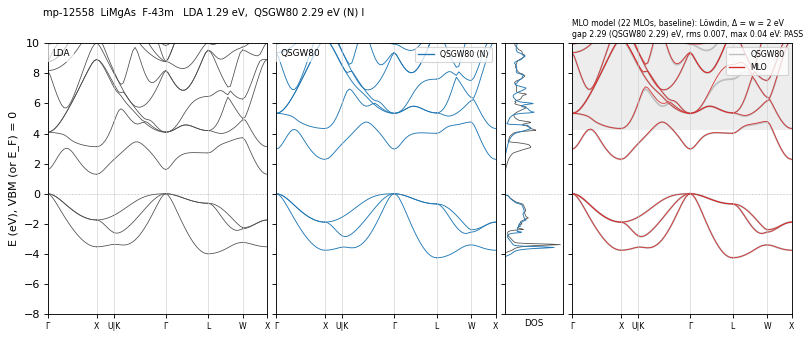

**mp-570213** LiMgBi — QSGW80 **1.39** E / E1 ≈ / M ≈ / N ≈ eV D  — ecalj 0601771b4 (tf32, t_tetrakbt -300) with ES, ES rule es-c — MLO PASS (b1, ES) 23 gap 1.39 rms 0.001 max 0.00 (ecalj a45169f3c)

<small>runs: M 1.36 · N 1.39 (10-03) · E1 1.39 (10-05, ES 1) · E 1.39 (10-06, ES 1, es-c)</small>

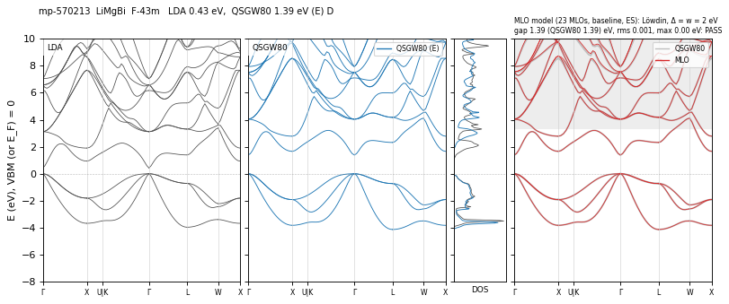

**mp-9124** LiZnAs — QSGW80 **1.70** N / M ≈ eV D  — ecalj b695fa65c (tf32, t_tetrakbt -300) — MLO PASS (b1) 27 gap 1.70 rms 0.004 max 0.03 (ecalj 614ab5eb8)

<small>runs: M 1.69 · N 1.70 (10-03)</small>

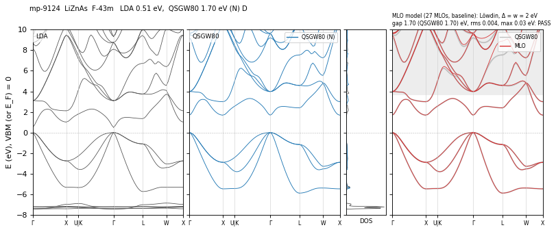

**mp-7575** LiZnN — QSGW80 **2.02** N / M ≈ eV D  — ecalj b695fa65c (tf32, t_tetrakbt -300) — MLO PASS (b1) 17 gap 2.02 rms 0.001 max 0.00 (ecalj 614ab5eb8)

<small>runs: M 2.01 · N 2.02 (10-03)</small>

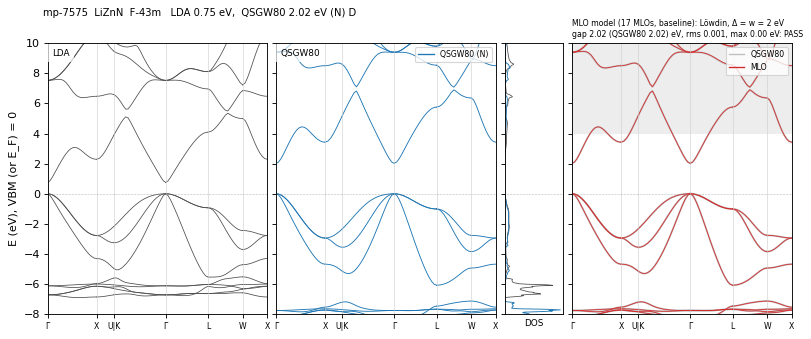

**mp-10182** LiZnP — QSGW80 **1.93** N / M ≈ eV I  — ecalj b695fa65c (tf32, t_tetrakbt -300) — MLO PASS (b1) 22 gap 1.94 rms 0.004 max 0.03 (ecalj a1d6c0e11)

<small>runs: M 1.93 · N 1.93 (10-03)</small>

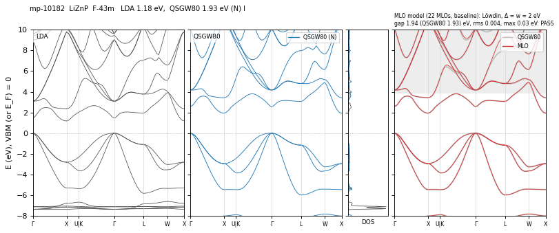

**mp-408** Mg2Ge — QSGW80 **0.65** N / M ≈ eV I  — ecalj b695fa65c (tf32, t_tetrakbt -300) — MLO PASS (b1) 27 gap 0.65 rms 0.006 max 0.05 (ecalj 614ab5eb8)

<small>runs: M 0.65 · N 0.65 (10-03)</small>

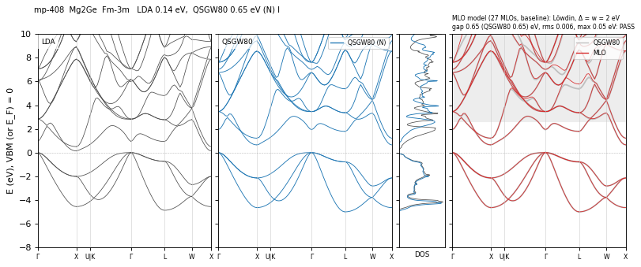

**mp-1367** Mg2Si — QSGW80 **0.63** N / M ≈ eV I  — ecalj b695fa65c (tf32, t_tetrakbt -300) — MLO PASS (b1) 27 gap 0.64 rms 0.004 max 0.04 (ecalj a1d6c0e11)

<small>runs: M 0.64 · N 0.63 (10-03)</small>

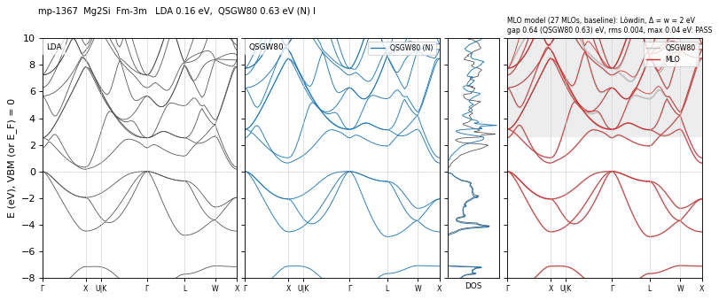

**mp-30034** MgBr2 — QSGW80 **6.88** N / M 6.96 eV D differs — ecalj b695fa65c (tf32, t_tetrakbt -300) — MLO PASS (b2) 31 gap 6.92 rms 0.011 max 0.08 (ecalj 614ab5eb8)

<small>runs: M 6.96 · N 6.88 (10-03)</small>

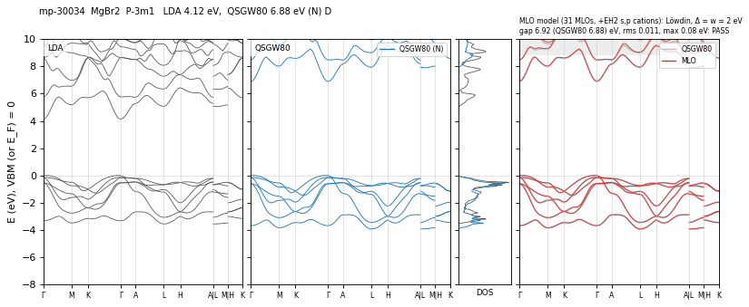

**mp-570259** MgCl2 — QSGW80 **8.48** N / M 8.38 eV D differs — ecalj 989a18637 (tf32, t_tetrakbt -300) — MLO PASS (b2) 31 gap 8.52 rms 0.010 max 0.09 (ecalj fb2da026b)

<small>runs: M 8.38 · N 8.48 (10-02)</small>

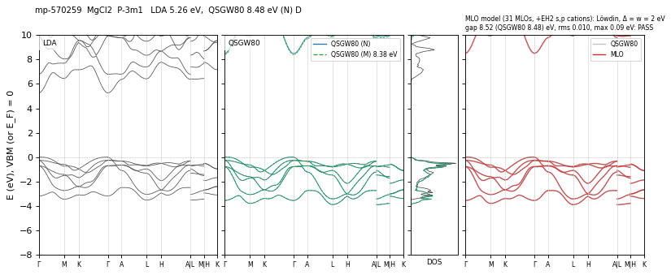

**mp-23205** MgI2 — QSGW80 **5.56** N / M ≈ eV I  — ecalj b695fa65c (tf32, t_tetrakbt -300) — MLO PASS (b2all) 39 gap 5.55 rms 0.002 max 0.02 (ecalj fb2da026b)

<small>runs: M 5.53 · N 5.56 (10-03)</small>

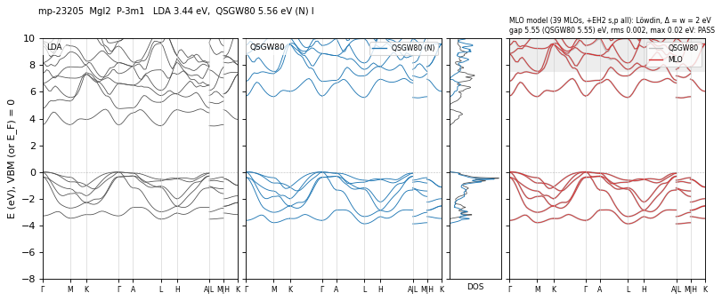

**mp-1434** MoS2 — QSGW80 **1.76** N / M 1.71 · path 1.58 eV I differs path<mesh(mesh) — ecalj b695fa65c (tf32, t_tetrakbt -300) — MLO PASS (b1) 27 gap 1.58 rms 0.001 max 0.01 (ecalj 96ec5c1ee)

<small>runs: M 1.71 · N 1.76 (10-03)</small>

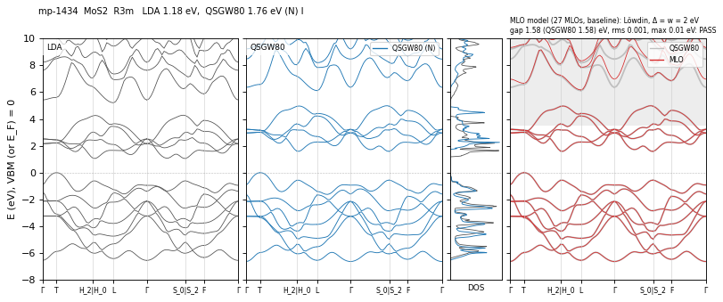

**mp-2352** Na2O — QSGW80 **4.82** N / M 4.99 eV D differs — ecalj b695fa65c (tf32, t_tetrakbt -300) — MLO PASS (b1) 22 gap 4.82 rms 0.001 max 0.01 (ecalj fb2da026b)

<small>runs: M 4.99 · N 4.82 (10-03)</small>

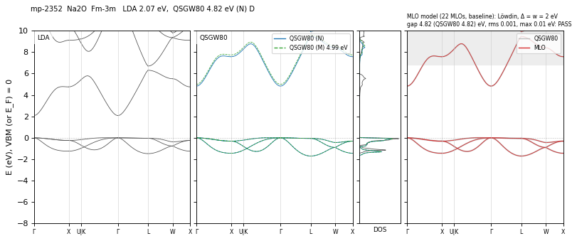

**mp-648** Na2S — QSGW80 **4.68** N / M ≈ eV D  — ecalj b695fa65c (tf32, t_tetrakbt -300) — MLO PASS (b2) 35 gap 4.68 rms 0.002 max 0.01 (ecalj 614ab5eb8)

<small>runs: M 4.69 · N 4.68 (10-03)</small>

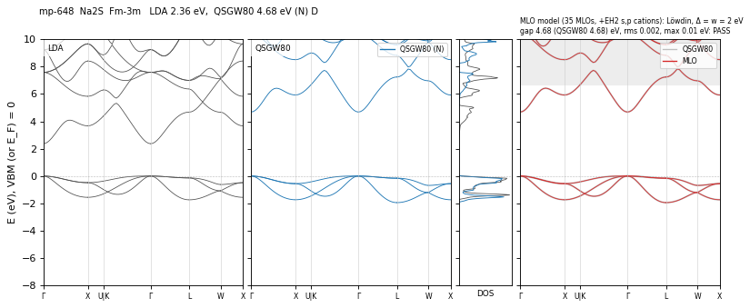

**mp-1266** Na2Se — QSGW80 **4.08** E / E1 ≈ / M 4.17 / N ≈ eV D differs — ecalj 0601771b4 (tf32, t_tetrakbt -300) with ES, ES rule es-c — MLO PASS (b1, ES) 28 gap 4.08 rms 0.001 max 0.00 (ecalj f16f0ea3d)

<small>runs: M 4.17 · N 4.13 (10-03) · E1 4.08 (10-05, ES 1) · E 4.08 (10-06, ES 1, es-c)</small>

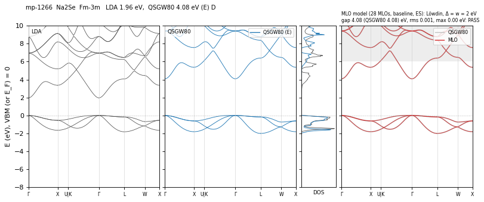

**mp-2784** Na2Te — QSGW80 **3.78** E / E1 ≈ / M ≈ / N ≈ eV D  — ecalj 0601771b4 (tf32, t_tetrakbt -300) with ES, ES rule es-c — MLO PASS (b1, ES) 31 gap 3.78 rms 0.001 max 0.00 (ecalj f16f0ea3d)

<small>runs: M 3.81 · N 3.81 (10-03) · E1 3.78 (10-05, ES 1) · E 3.78 (10-06, ES 1, es-c)</small>

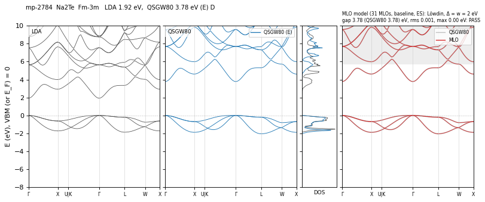

**mp-9437** NbFeSb — QSGW80 **0.80** N / M ≈ eV I  — ecalj b695fa65c (tf32, t_tetrakbt -300) — MLO PASS (b1) 27 gap 0.80 rms 0.001 max 0.01 (ecalj 614ab5eb8)

<small>runs: M 0.80 · N 0.80 (10-03)</small>

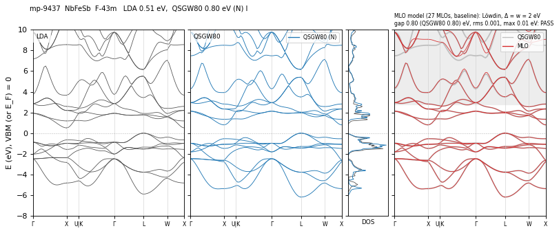

**mp-505297** NbSbRu — QSGW80 **0.68** N / R ≈ eV I  — ecalj b695fa65c (tf32, t_tetrakbt -300) — MLO PASS (b1) 27 gap 0.68 rms 0.001 max 0.01 (ecalj 614ab5eb8)

<small>runs: M 0.67 · R 0.68 (09-30) · N 0.68 (10-03)</small>

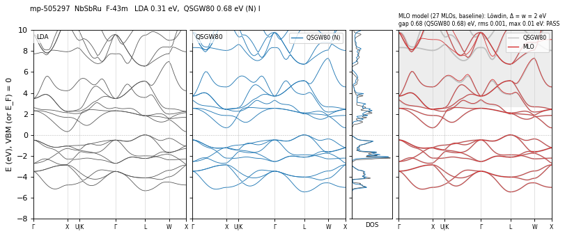

**mp-25210** NiO2 — QSGW80 **2.52** N / R ≈ eV I  — ecalj b695fa65c (tf32, t_tetrakbt -300) — MLO PASS (b1) 17 gap 2.66 rms 0.001 max 0.01 (ecalj fb2da026b)

<small>runs: M 2.18 · R 2.52 (10-01) · N 2.52 (10-03)</small>

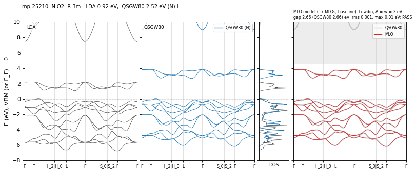

**mp-35925** NiO2 — QSGW80 **3.83** E / N ≈ / R ≈ eV I  — ecalj 0601771b4 (tf32, t_tetrakbt -300) with ES, ES rule es-c — MLO PASS (b1, ES) 19 gap 3.82 rms 0.002 max 0.01 (ecalj c9932cbfc)

<small>runs: M 3.80 · R 3.82 (10-01) · N 3.82 (10-03) · E1 FAIL(1) FAIL(1) (10-05, ES 2) · E FAIL(1) FAIL(1) (10-05, ES 2, es-a) · E FAIL(1) FAIL(1) (10-06, ES 2, es-a) · E 3.83 (10-06, ES 2, es-c)</small>

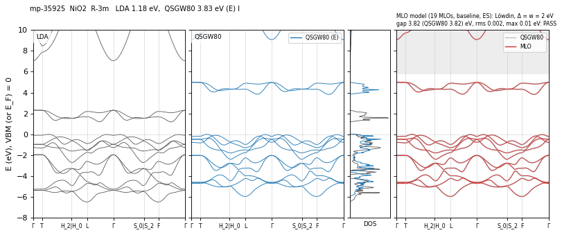

**mp-510753** NiO2 — QSGW80 **2.35** N / M 2.42 eV I differs — ecalj b695fa65c (tf32, t_tetrakbt -300) — MLO PASS (b1) 17 gap 2.45 rms 0.001 max 0.01 (ecalj 614ab5eb8)

<small>runs: M 2.42 · N 2.35 (10-03)</small>

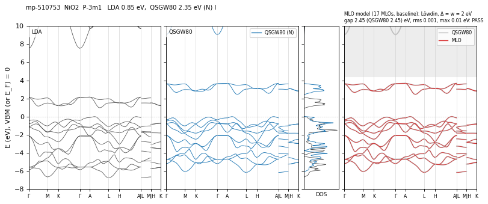

**mp-315** PbF2 — QSGW80 **6.91** N / M ≈ eV I  — ecalj b695fa65c (tf32, t_tetrakbt -300) — MLO PASS (b1) 22 gap 6.91 rms 0.010 max 0.08 (ecalj 614ab5eb8)

<small>runs: M 6.87 · N 6.91 (10-03)</small>

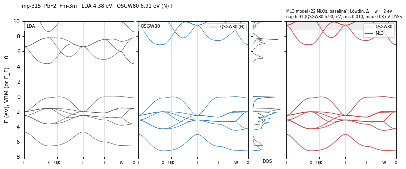

**mp-22883** PbI2 — QSGW80 **3.54** E / E1 ≈ / N ≈ / R ≈ eV I  — ecalj 0601771b4 (tf32, t_tetrakbt -300) with ES, ES rule es-c — MLO PASS (b1, ES) 28 gap 3.53 rms 0.002 max 0.01 (ecalj f16f0ea3d)

<small>runs: M 3.71 · R 3.55 (10-01) · N 3.55 (10-03) · E1 3.54 (10-05, ES 1) · E 3.54 (10-06, ES 1, es-c)</small>

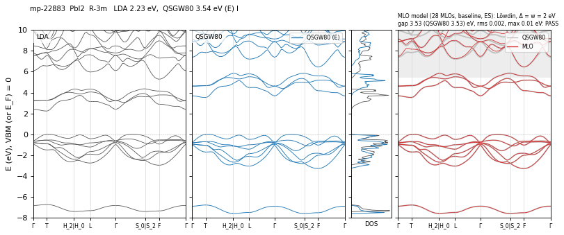

**mp-22893** PbI2 — QSGW80 **3.48** E / E1 ≈ / M ≈ / N ≈ eV D  — ecalj 0601771b4 (tf32, t_tetrakbt -300) with ES, ES rule es-c — MLO PASS (b1, ES) 28 gap 3.48 rms 0.002 max 0.01 (ecalj f16f0ea3d)

<small>runs: M 3.49 · N 3.48 (10-03) · E1 3.48 (10-05, ES 1) · E 3.48 (10-06, ES 1, es-c)</small>

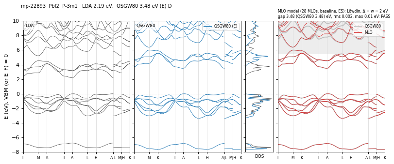

**mp-617** PtO2 — QSGW80 **3.00** N / M ≈ eV I  — ecalj b695fa65c (tf32, t_tetrakbt -300) — MLO PASS (b1) 17 gap 3.14 rms 0.001 max 0.01 (ecalj 614ab5eb8)

<small>runs: M 2.99 · N 3.00 (10-03)</small>

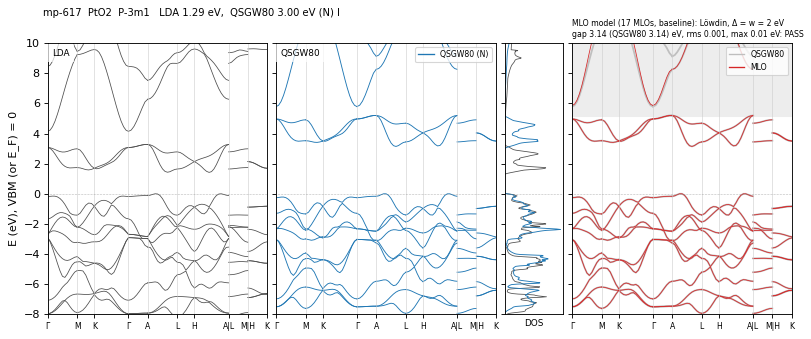

**mp-762** PtS2 — QSGW80 **1.78** N / M ≈ eV I  — ecalj b695fa65c (tf32, t_tetrakbt -300) — MLO PASS (b1) 27 gap 1.95 rms 0.001 max 0.01 (ecalj 614ab5eb8)

<small>runs: M 1.79 · N 1.78 (10-03)</small>

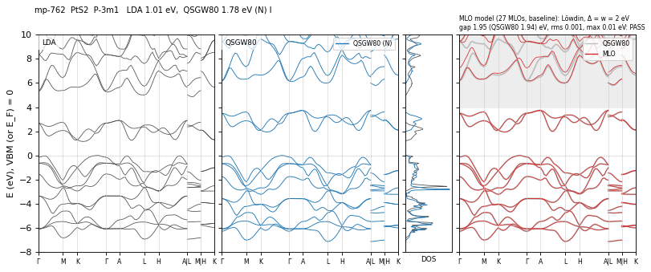

**mp-1115** PtSe2 — QSGW80 **0.87** N / M ≈ eV I  — ecalj b695fa65c (tf32, t_tetrakbt -300) — MLO PASS (b1) 27 gap 1.01 rms 0.002 max 0.01 (ecalj a1d6c0e11)

<small>runs: M 0.87 · N 0.87 (10-03)</small>

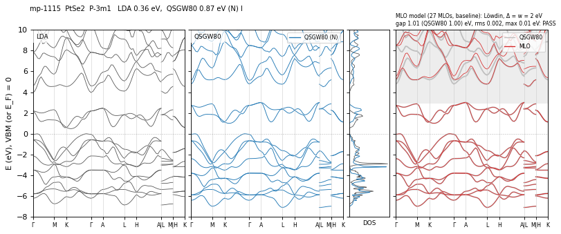

**mp-1394** Rb2O — QSGW80 **3.33** N / R ≈ eV I  — ecalj b695fa65c (tf32, t_tetrakbt -300) — MLO PASS (b2) 36 gap 3.33 rms 0.003 max 0.01 (ecalj a1d6c0e11)

<small>runs: M 3.13 · R 3.33 (09-30) · N 3.33 (10-03)</small>

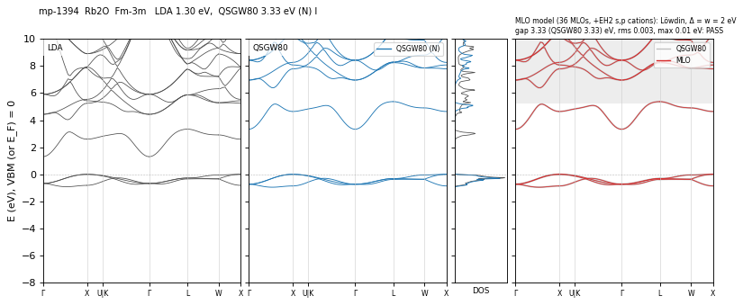

**mp-8041** Rb2S — QSGW80 **3.89** E / E1 ≈ / N ≈ / R ≈ eV I  — ecalj 0601771b4 (tf32, t_tetrakbt -300) with ES, ES rule es-c — MLO PASS (b1, ES) 37 gap 3.89 rms 0.000 max 0.00 (ecalj a45169f3c)

<small>runs: M 3.84 · R 3.92 (09-30) · N 3.92 (10-03) · E1 3.88 (10-05, ES 1) · E 3.89 (10-06, ES 1, es-c)</small>

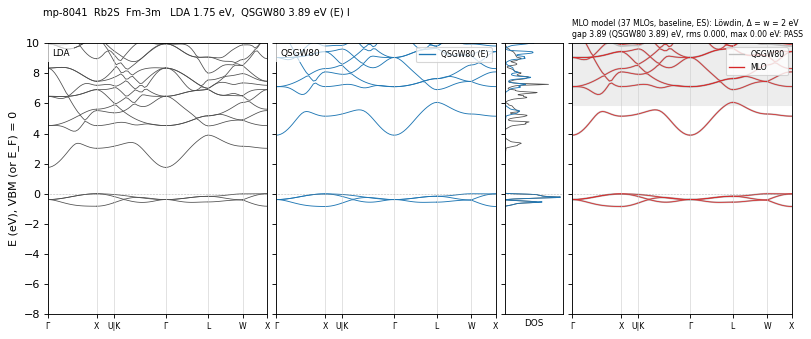

**mp-11327** Rb2Se — QSGW80 **3.69** E / E1 ≈ / N ≈ / R ≈ eV I  — ecalj 0601771b4 (tf32, t_tetrakbt -300) with ES, ES rule es-c — MLO PASS (b1, ES) 37 gap 3.69 rms 0.000 max 0.00 (ecalj f16f0ea3d)

<small>runs: M 3.45 · R 3.70 (09-30) · N 3.70 (10-03) · E1 3.67 (10-05, ES 1) · E 3.69 (10-06, ES 1, es-c)</small>

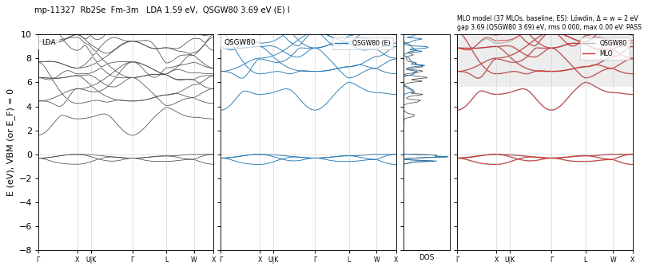

**mp-441** Rb2Te — QSGW80 **3.62** E / E1 ≈ / N 3.70 / R 3.70 eV I differs — ecalj 0601771b4 (tf32, t_tetrakbt -300) with ES, ES rule es-c — MLO PASS (b1, ES) 37 gap 3.62 rms 0.000 max 0.00 (ecalj a45169f3c)

<small>runs: M 3.62 · R 3.70 (09-30) · N 3.70 (10-03) · E1 3.61 (10-05, ES 1) · E 3.62 (10-06, ES 1, es-c)</small>

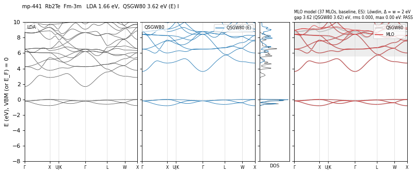

**mp-30459** ScNiBi — QSGW80 **0.35** N / M ≈ eV I  — ecalj b695fa65c (tf32, t_tetrakbt -300) — MLO PASS (b1) 27 gap 0.35 rms 0.002 max 0.01 (ecalj 614ab5eb8)

<small>runs: M 0.35 · N 0.35 (10-03)</small>

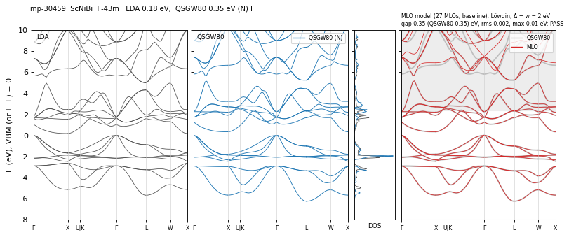

**mp-3432** ScNiSb — QSGW80 **0.50** N / M ≈ eV I  — ecalj b695fa65c (tf32, t_tetrakbt -300) — MLO PASS (b1) 27 gap 0.50 rms 0.002 max 0.01 (ecalj 614ab5eb8)

<small>runs: M 0.50 · N 0.50 (10-03)</small>

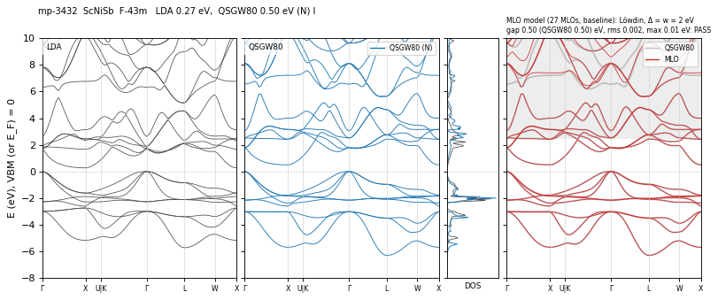

**mp-569779** ScSbPd — QSGW80 **0.40** N / M ≈ eV I  — ecalj b695fa65c (tf32, t_tetrakbt -300) — MLO PASS (b1) 27 gap 0.40 rms 0.003 max 0.02 (ecalj 614ab5eb8)

<small>runs: M 0.39 · N 0.40 (10-03)</small>

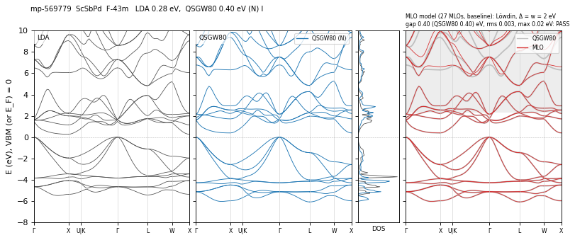

**mp-7173** ScSbPt — QSGW80 **0.81** N / M ≈ eV I  — ecalj b695fa65c (tf32, t_tetrakbt -300) — MLO PASS (b1) 27 gap 0.82 rms 0.004 max 0.04 (ecalj 614ab5eb8)

<small>runs: M 0.81 · N 0.81 (10-03)</small>

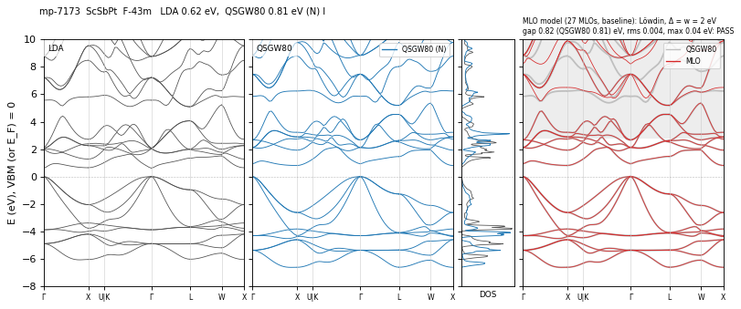

**mp-2894** ScSnAu — QSGW80 **0.14** N / M ≈ / R ≈ eV I  — ecalj 989a18637 (tf32, t_tetrakbt -300) — MLO PASS (b1) 27 gap 0.15 rms 0.003 max 0.02 (ecalj fb2da026b)

<small>runs: M 0.15 · R 0.14 (10-01) · N 0.14 (10-02)</small>

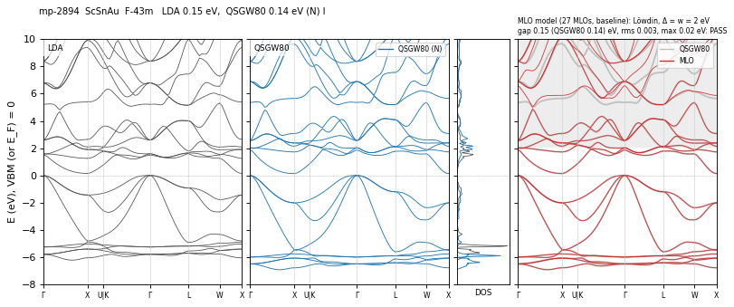

**mp-14** Se3 — QSGW80 **2.14** N / M ≈ · path 2.03 eV I path<mesh(mesh) — ecalj b695fa65c (tf32, t_tetrakbt -300) — MLO PASS (b1) 27 gap 2.03 rms 0.009 max 0.05 (ecalj a1d6c0e11)

<small>runs: M 2.15 · N 2.14 (10-03)</small>

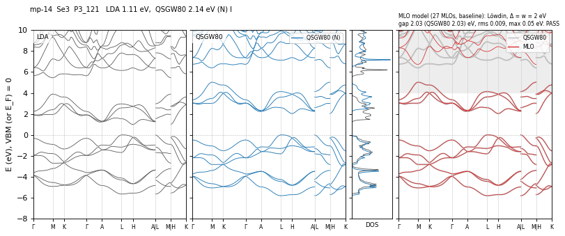

**mp-1170** SnS2 — QSGW80 **2.69** N / M ≈ eV I  — ecalj b695fa65c (tf32, t_tetrakbt -300) — MLO PASS (b1) 27 gap 2.69 rms 0.002 max 0.02 (ecalj a1d6c0e11)

<small>runs: M 2.70 · N 2.69 (10-03)</small>

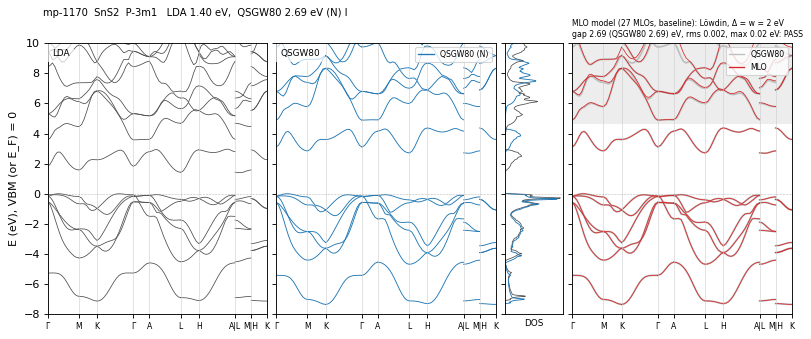

**mp-665** SnSe2 — QSGW80 **1.50** N / M ≈ eV I  — ecalj b695fa65c (tf32, t_tetrakbt -300) — MLO PASS (b1) 27 gap 1.52 rms 0.002 max 0.01 (ecalj 614ab5eb8)

<small>runs: M 1.48 · N 1.50 (10-03)</small>

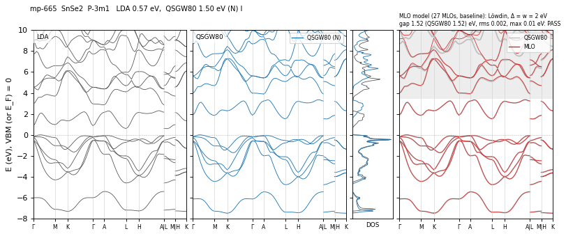

**mp-2630** SrC2 — QSGW80 **3.83** N / M ≈ eV I  — ecalj 989a18637 (tf32, t_tetrakbt -300) — MLO PASS (b1) 20 gap 3.82 rms 0.003 max 0.03 (ecalj fb2da026b)

<small>runs: M 3.83 · N 3.83 (10-02)</small>

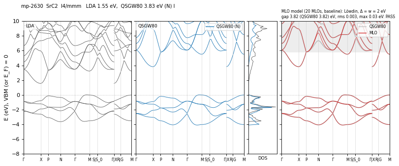

**mp-23209** SrCl2 — QSGW80 **7.84** E / E1 ≈ / N ≈ / R ≈ eV I  — ecalj 0601771b4 (tf32, t_tetrakbt -300) with ES, ES rule es-c — MLO PASS (b1, ES) 31 gap 7.84 rms 0.001 max 0.01 (ecalj f16f0ea3d)

<small>runs: M 7.75 · R 7.82 (09-30) · N 7.82 (10-03) · E1 7.84 (10-05, ES 1) · E 7.84 (10-06, ES 1, es-c)</small>

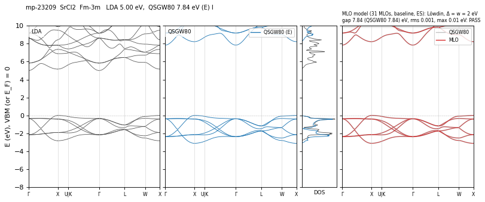

**mp-981** SrF2 — QSGW80 **10.82** N / M 10.64 eV I differs — ecalj b695fa65c (tf32, t_tetrakbt -300) — MLO PASS (b2) 24 gap 10.82 rms 0.002 max 0.01 (ecalj 614ab5eb8)

<small>runs: M 10.64 · N 10.82 (10-03)</small>

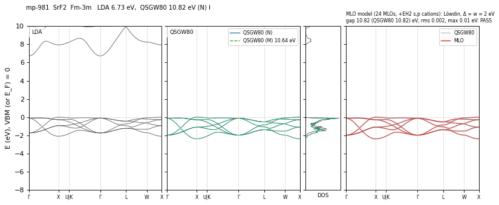

**mp-10614** SrLiP — QSGW80 **1.60** N / M ≈ eV I  — ecalj b695fa65c (tf32, t_tetrakbt -300) — MLO PASS (b1) 22 gap 1.60 rms 0.004 max 0.03 (ecalj a1d6c0e11)

<small>runs: M 1.58 · N 1.60 (10-03)</small>

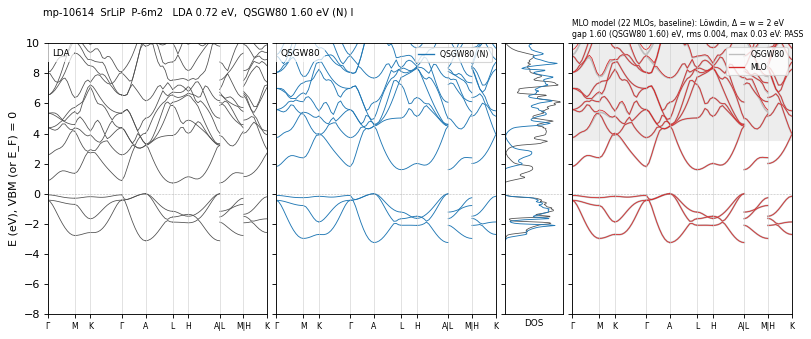

**mp-2697** SrO2 — QSGW80 **5.76** N / R ≈ eV D  — ecalj b695fa65c (tf32, t_tetrakbt -300) — MLO PASS (b1) 20 gap 5.76 rms 0.002 max 0.01 (ecalj fb2da026b)

<small>runs: M FAILED · R 5.76 (09-30) · N 5.76 (10-03)</small>

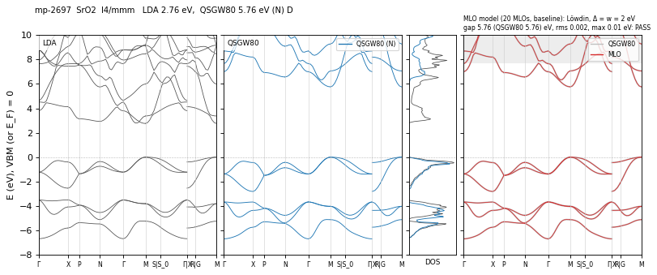

**mp-31454** TaSbRu — QSGW80 **1.04** N / M ≈ eV I  — ecalj b695fa65c (tf32, t_tetrakbt -300) — MLO PASS (b1) 27 gap 1.04 rms 0.003 max 0.02 (ecalj 614ab5eb8)

<small>runs: M 1.04 · N 1.04 (10-03)</small>

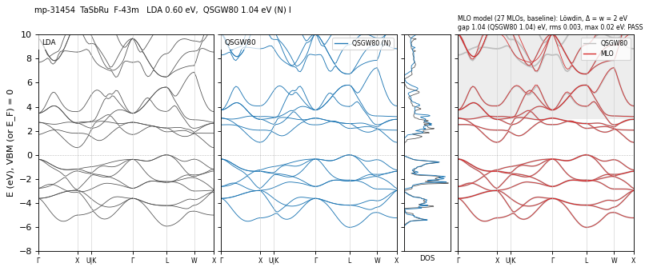

**mp-19** Te3 — QSGW80 **0.90** N / M ≈ · path 0.64 eV I path<mesh(mesh) — ecalj b695fa65c (tf32, t_tetrakbt -300) — MLO PASS (b1) 27 gap 0.64 rms 0.003 max 0.02 (ecalj ac90a3312)

<small>runs: M 0.91 · N 0.90 (10-03)</small>

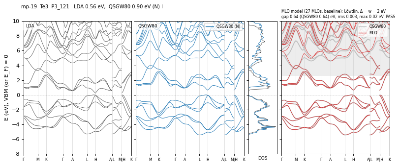

**mp-5967** TiCoSb — QSGW80 **1.30** N / M ≈ eV I  — ecalj b695fa65c (tf32, t_tetrakbt -300) — MLO PASS (b1) 27 gap 1.30 rms 0.001 max 0.01 (ecalj 614ab5eb8)

<small>runs: M 1.31 · N 1.30 (10-03)</small>

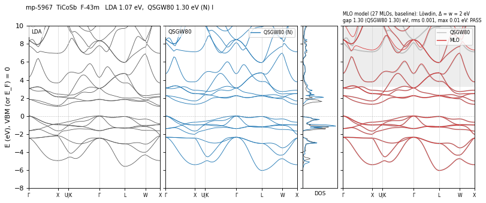

**mp-1008680** TiGePt — QSGW80 **1.23** N / M ≈ eV I  — ecalj b695fa65c (tf32, t_tetrakbt -300) — MLO PASS (b1) 27 gap 1.23 rms 0.002 max 0.01 (ecalj a1d6c0e11)

<small>runs: M 1.23 · N 1.23 (10-03)</small>

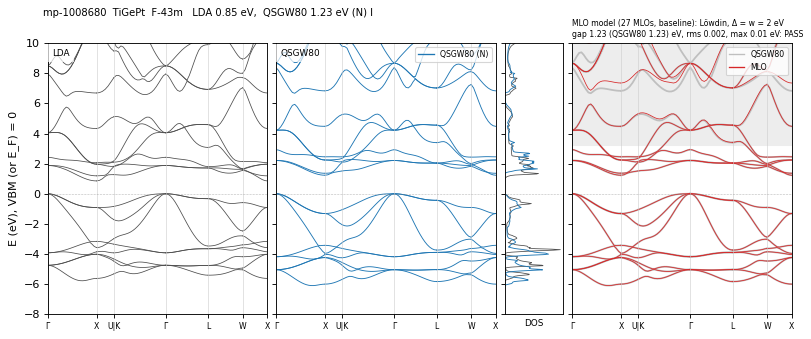

**mp-924130** TiNiSn — QSGW80 **0.59** N / M ≈ eV I  — ecalj b695fa65c (tf32, t_tetrakbt -300) — MLO PASS (b1) 27 gap 0.59 rms 0.001 max 0.00 (ecalj 614ab5eb8)

<small>runs: M 0.59 · N 0.59 (10-03)</small>

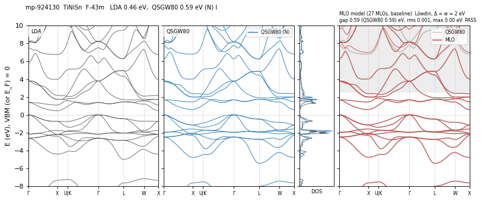

**mp-1062030** TiS2 — QSGW80 **2.34** E / M ≈ / N ≈ eV I vs2025 — ecalj 0601771b4 (tf32, t_tetrakbt -300) with ES, ES rule es-c — MLO PASS (b1, ES) 31 gap 2.34 rms 0.001 max 0.01 (ecalj f09035a49)

<small>runs: M 2.32 · N 2.35 (10-04) · E1 FAIL(1) FAIL(1) (10-05, ES 1) · E FAIL(1) FAIL(1) (10-05, ES 1, es-a) · E 2.34 (10-07, ES 1, es-c)</small>

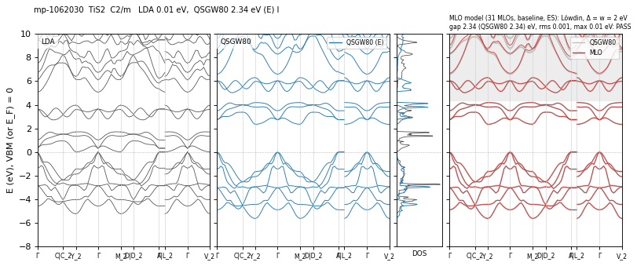

**mp-30847** TiSnPt — QSGW80 **1.06** N / M ≈ eV I  — ecalj b695fa65c (tf32, t_tetrakbt -300) — MLO PASS (b1) 27 gap 1.07 rms 0.002 max 0.02 (ecalj 614ab5eb8)

<small>runs: M 1.06 · N 1.06 (10-03)</small>

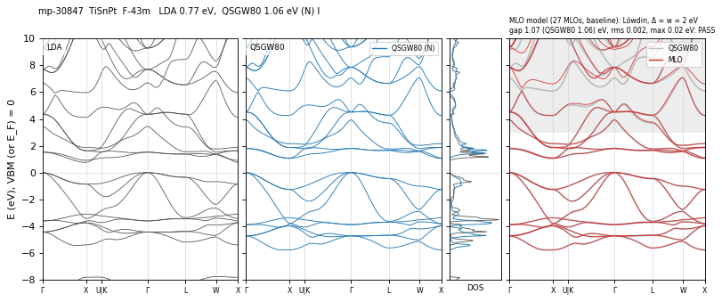

**mp-567636** VFeSb — QSGW80 **0.57** N / M ≈ eV I  — ecalj b695fa65c (tf32, t_tetrakbt -300) — MLO PASS (b1) 27 gap 0.57 rms 0.001 max 0.01 (ecalj 614ab5eb8)

<small>runs: M 0.57 · N 0.57 (10-03)</small>

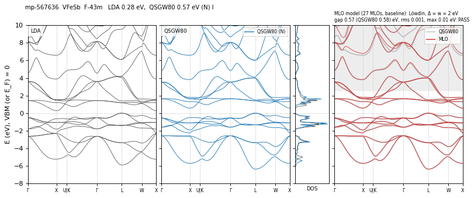

**mp-31455** VSbRu — QSGW80 **0.42** N / M ≈ eV I  — ecalj b695fa65c (tf32, t_tetrakbt -300) — MLO PASS (b1) 27 gap 0.42 rms 0.001 max 0.01 (ecalj 614ab5eb8)

<small>runs: M 0.42 · N 0.42 (10-03)</small>

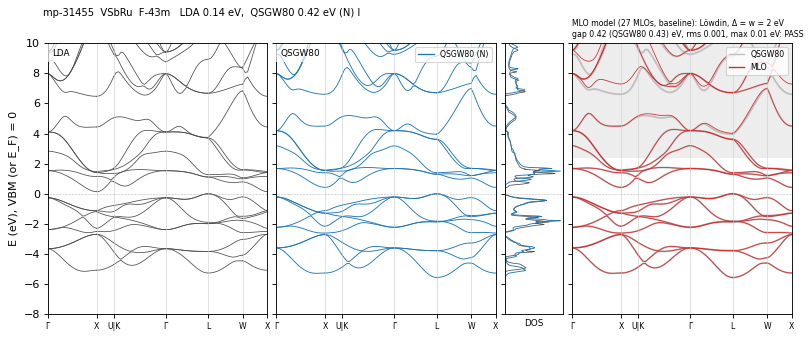

**mp-9813** WS2 — QSGW80 **2.00** N / R ≈ · path 1.78 eV I path<mesh(mesh) — ecalj b695fa65c (tf32, t_tetrakbt -300) — MLO PASS (b1) 27 gap 1.78 rms 0.002 max 0.01 (ecalj 614ab5eb8)

<small>runs: M 1.32 · R 2.00 (10-01) · N 2.00 (10-03)</small>

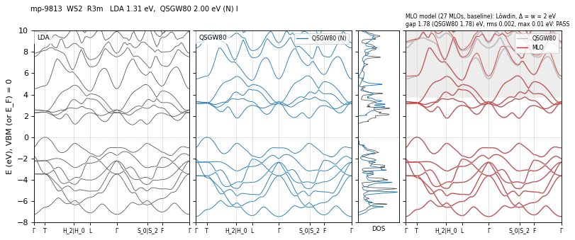

**mp-28797** YHSe — QSGW80 **2.51** N / M ≈ eV I  — ecalj b695fa65c (tf32, t_tetrakbt -300) — MLO PASS (b1) 22 gap 2.51 rms 0.001 max 0.01 (ecalj fb2da026b)

<small>runs: M 2.51 · N 2.51 (10-03)</small>

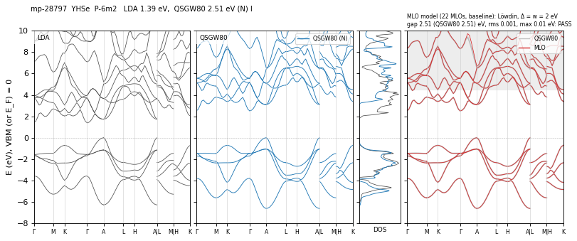

**mp-30460** YNiBi — QSGW80 **0.46** N / M ≈ eV I  — ecalj b695fa65c (tf32, t_tetrakbt -300) — MLO PASS (b1) 27 gap 0.46 rms 0.003 max 0.01 (ecalj 614ab5eb8)

<small>runs: M 0.45 · N 0.46 (10-03)</small>

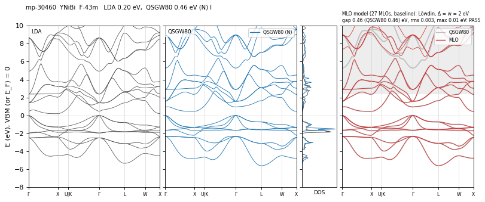

**mp-11520** YNiSb — QSGW80 **0.60** N / M ≈ eV I  — ecalj b695fa65c (tf32, t_tetrakbt -300) — MLO PASS (b1) 27 gap 0.60 rms 0.002 max 0.02 (ecalj a1d6c0e11)

<small>runs: M 0.60 · N 0.60 (10-03)</small>

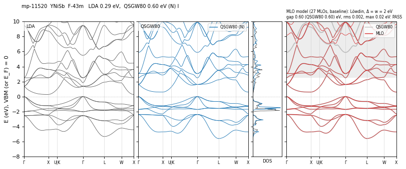

**mp-4964** YSbPt — QSGW80 **0.61** N / M ≈ eV D  — ecalj b695fa65c (tf32, t_tetrakbt -300) — MLO PASS (b1) 27 gap 0.62 rms 0.004 max 0.04 (ecalj 614ab5eb8)

<small>runs: M 0.62 · N 0.61 (10-03)</small>

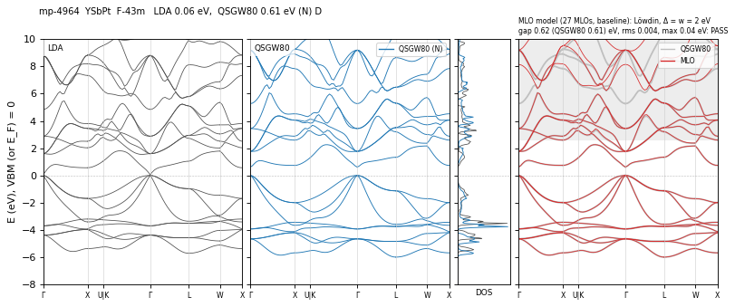

**mp-569960** ZnBr2 — QSGW80 **5.55** E / E1 ≈ / N ≈ / R ≈ eV I  — ecalj 0601771b4 (tf32, t_tetrakbt -300) with ES, ES rule es-c — MLO PASS (b1, ES) 31 gap 5.57 rms 0.001 max 0.01 (ecalj a45169f3c)

<small>runs: M 5.74 · R 5.55 (10-01) · N 5.54 (10-03) · E1 5.54 (10-05, ES 1) · E 5.55 (10-06, ES 1, es-c)</small>

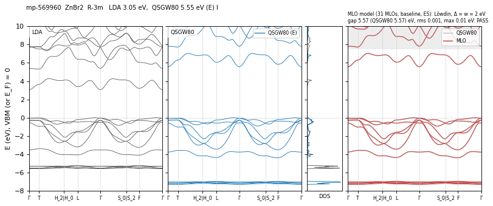

**mp-1008601** ZrAg2 — QSGW80 **0.04** N / M ≈ eV metal  — ecalj b695fa65c (tf32, t_tetrakbt -300) — MLO PASS (b1) 27 rms 0.002 max 0.03 (ecalj a1d6c0e11)

<small>runs: M 0.04 · N 0.04 (10-03)</small>

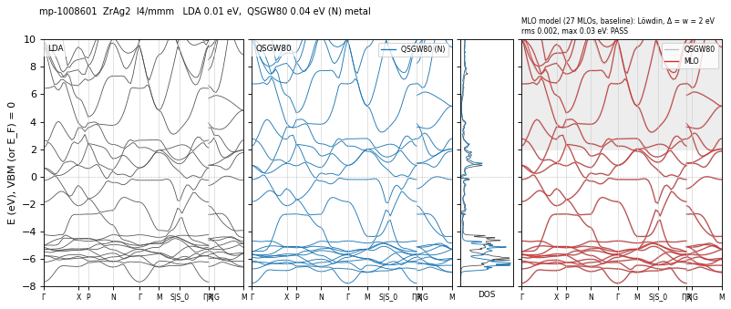

**mp-23162** ZrCl2 — QSGW80 **1.90** N / M ≈ · path 1.73 eV I path<mesh(mesh) — ecalj 989a18637 (tf32, t_tetrakbt -300) — MLO PASS (b2all) 35 gap 1.74 rms 0.001 max 0.01 (ecalj fb2da026b)

<small>runs: M 1.88 · N 1.90 (10-02)</small>

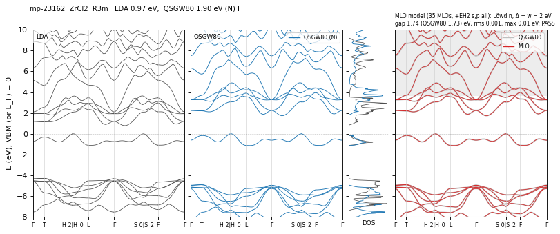

**mp-31451** ZrCoBi — QSGW80 **1.15** N / M ≈ eV I  — ecalj b695fa65c (tf32, t_tetrakbt -300) — MLO PASS (b1) 27 gap 1.16 rms 0.004 max 0.04 (ecalj 614ab5eb8)

<small>runs: M 1.15 · N 1.15 (10-03)</small>

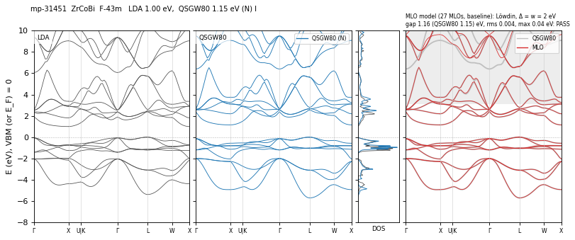

**mp-1565** ZrO2 — QSGW80 **5.30** N / M ≈ eV I  — ecalj b695fa65c (tf32, t_tetrakbt -300) — MLO PASS (b1) 17 gap 5.30 rms 0.003 max 0.02 (ecalj 0c4d16ceb)

<small>runs: M 5.30 · N 5.30 (10-03)</small>

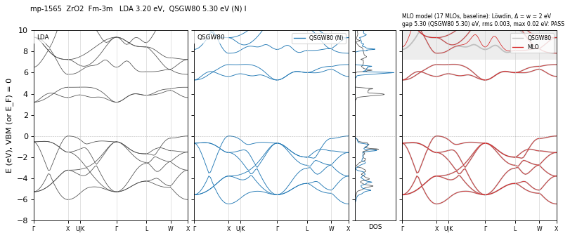

**mp-1186** ZrS2 — QSGW80 **2.18** N / M ≈ eV I  — ecalj b695fa65c (tf32, t_tetrakbt -300) — MLO PASS (b1) 27 gap 2.17 rms 0.001 max 0.01 (ecalj a1d6c0e11)

<small>runs: M 2.17 · N 2.18 (10-03)</small>

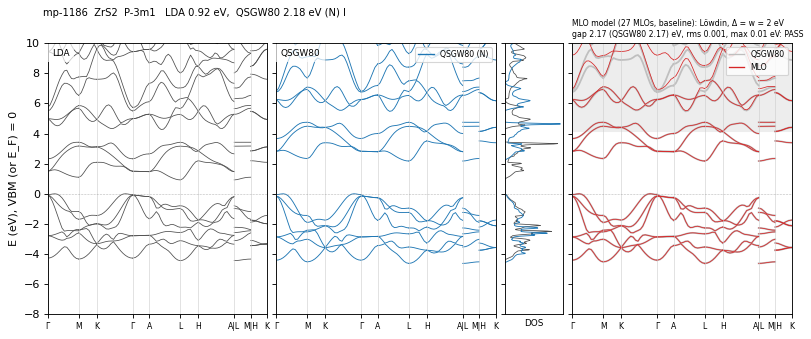

**mp-2076** ZrSe2 — QSGW80 **1.38** N / M ≈ eV I  — ecalj b695fa65c (tf32, t_tetrakbt -300) — MLO PASS (b1) 27 gap 1.38 rms 0.001 max 0.01 (ecalj fb2da026b)

<small>runs: M 1.39 · N 1.38 (10-03)</small>

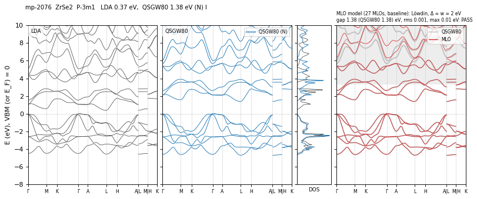

**mp-22689** ZrSnPd — QSGW80 **0.26** N / M ≈ eV I  — ecalj b695fa65c (tf32, t_tetrakbt -300) — MLO PASS (b1) 27 gap 0.22 rms 0.001 max 0.01 (ecalj fb2da026b)

<small>runs: M 0.26 · N 0.26 (10-03)</small>

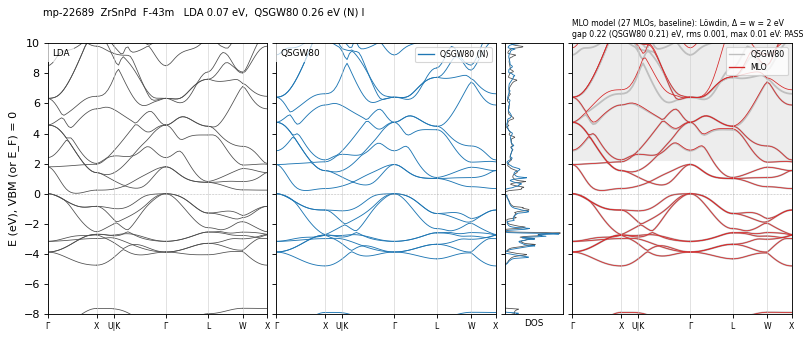

