# GW1500 QSGW80 — bands and DOS, 5 atoms per cell

[README](README.md) · [table](table.md)

Left: LDA. Middle: QSGW80 adopted (blue, condition in parentheses; green dashed: another QSGW80 result when its gap differs by more than 0.1 eV) and the total DOS. Right: the MLO model of the standard recipe (red) on the QSGW80 bands (gray), with its conditions and check; shaded: outside the window of the check ([README](README.md#mlo-models)). Energies from the VBM (insulators) or E_F (metals).

**mp-22995** Ag3SI — QSGW80 **1.58** N / M ≈ eV I  — ecalj b695fa65c (tf32, t_tetrakbt -300) — MLO PASS (b1) 45 gap 1.59 rms 0.001 max 0.01 (ecalj fb2da026b)

<small>runs: M 1.53 · N 1.58 (10-04)</small>

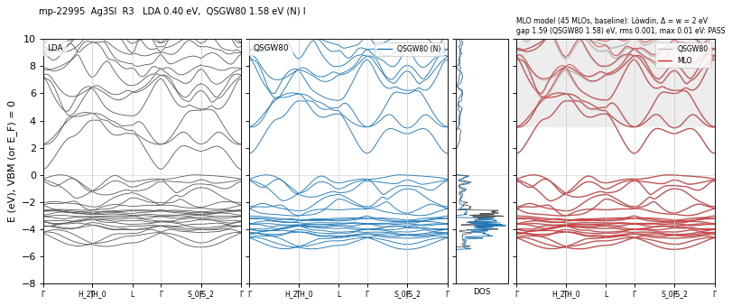

**mp-558189** Ag3SI — QSGW80 **1.81** N / R ≈ eV I  — ecalj b695fa65c (tf32, t_tetrakbt -300) — MLO PASS (b1) 45 gap 1.81 rms 0.001 max 0.02 (ecalj 614ab5eb8)

<small>runs: M FAILED · R 1.81 (09-30) · N 1.81 (10-04)</small>

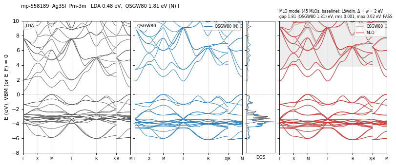

**mp-8196** AgNO3 — QSGW80 **5.06** N / R ≈ eV I  — ecalj b695fa65c (tf32, t_tetrakbt -300) — MLO PASS (b1) 25 gap 5.06 rms 0.001 max 0.01 (ecalj 614ab5eb8)

<small>runs: M FAILED · R 5.06 (09-30) · N 5.06 (10-04)</small>

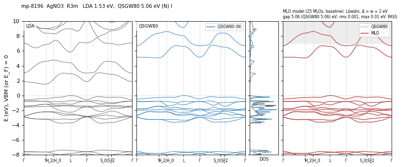

**mp-9307** Ba2ZnN2 — QSGW80 **1.54** N / R ≈ eV I  — ecalj b695fa65c (tf32, t_tetrakbt -300) — MLO PASS (b2) 53 gap 1.53 rms 0.003 max 0.02 (ecalj 614ab5eb8)

<small>runs: M 1.76 · R 1.54 (10-01) · N 1.54 (10-04)</small>

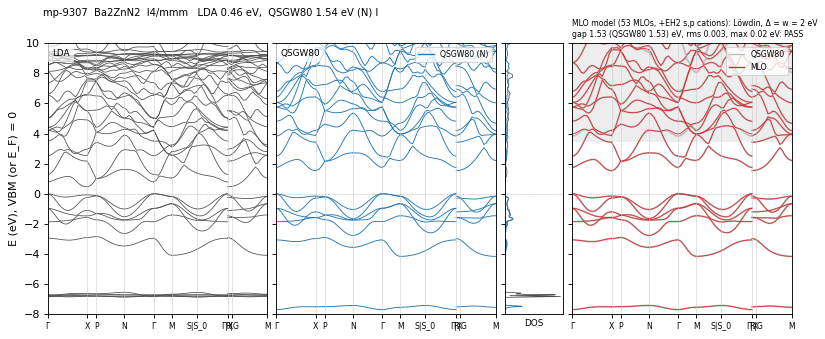

**mp-8579** BaAg2S2 — QSGW80 **1.97** N / M ≈ eV D  — ecalj b695fa65c (tf32, t_tetrakbt -300) — MLO PASS (b1) 48 gap 1.97 rms 0.003 max 0.03 (ecalj 614ab5eb8)

<small>runs: M 1.98 · N 1.97 (10-04)</small>

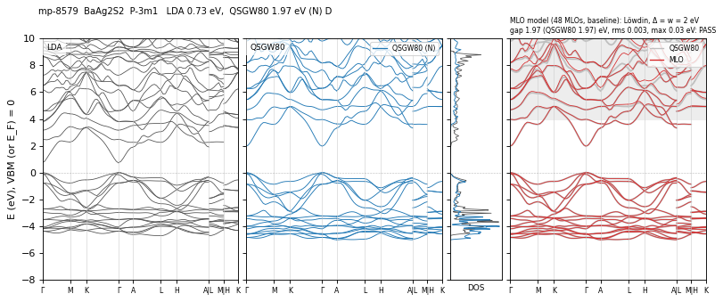

**mp-4559** BaCO3 — QSGW80 **7.47** N / R ≈ eV I  — ecalj b695fa65c (tf32, t_tetrakbt -300) — MLO PASS (b2) 36 gap 7.47 rms 0.004 max 0.04 (ecalj 614ab5eb8)

<small>runs: M FAILED · R 7.47 (09-30) · N 7.47 (10-04)</small>

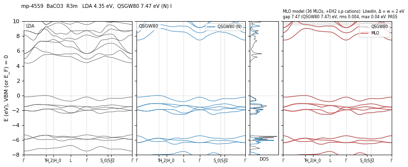

**mp-8281** BaCd2As2 — QSGW80 **0.84** N / M ≈ eV D  — ecalj b695fa65c (tf32, t_tetrakbt -300) — MLO PASS (b2) 60 gap 0.84 rms 0.001 max 0.01 (ecalj 614ab5eb8)

<small>runs: M 0.85 · N 0.84 (10-04)</small>

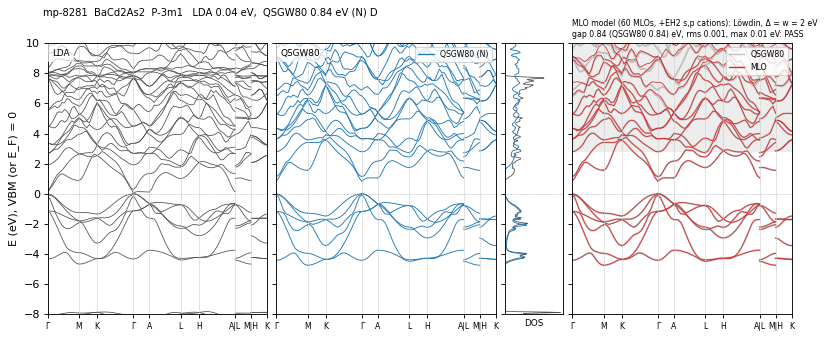

**mp-8279** BaCd2P2 — QSGW80 **1.32** N / M ≈ eV D  — ecalj b695fa65c (tf32, t_tetrakbt -300) — MLO PASS (b2) 60 gap 1.32 rms 0.001 max 0.01 (ecalj 614ab5eb8)

<small>runs: M 1.31 · N 1.32 (10-04)</small>

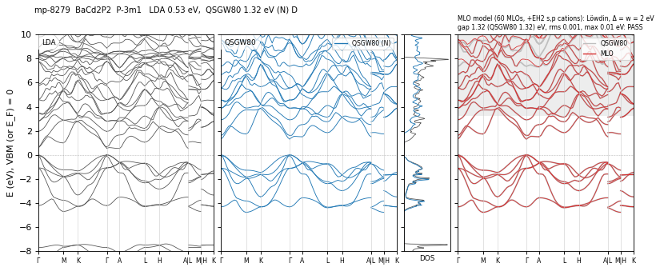

**mp-4255** BaCu2S2 — QSGW80 **1.52** N / M ≈ eV D  — ecalj 989a18637 (tf32, t_tetrakbt -300) — MLO PASS (b1) 48 gap 1.52 rms 0.001 max 0.01 (ecalj fb2da026b)

<small>runs: M 1.52 · N 1.52 (10-03)</small>

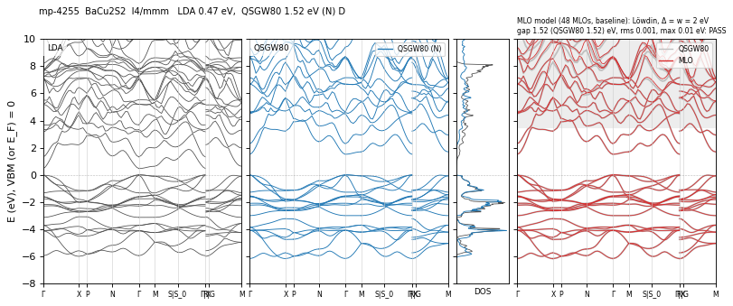

**mp-10437** BaCu2Se2 — QSGW80 **1.34** N / M ≈ eV D  — ecalj b695fa65c (tf32, t_tetrakbt -300) — MLO PASS (b1) 48 gap 1.34 rms 0.001 max 0.02 (ecalj a1d6c0e11)

<small>runs: M 1.32 · N 1.34 (10-04)</small>

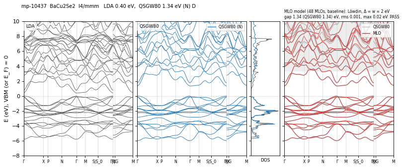

**mp-10250** BaLiF3 — QSGW80 **10.86** N / R ≈ eV D  — ecalj b695fa65c (tf32, t_tetrakbt -300) — MLO PASS (b1) 28 gap 10.86 rms 0.001 max 0.01 (ecalj a1d6c0e11)

<small>runs: M 11.09 · R 10.86 (10-01) · N 10.86 (10-04)</small>

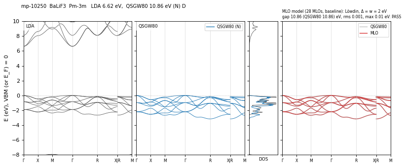

**mp-23818** BaLiH3 — QSGW80 **4.31** N / M ≈ eV I  — ecalj b695fa65c (tf32, t_tetrakbt -300) — MLO PASS (b1) 28 gap 4.31 rms 0.003 max 0.02 (ecalj fb2da026b)

<small>runs: M 4.33 · N 4.31 (10-03)</small>

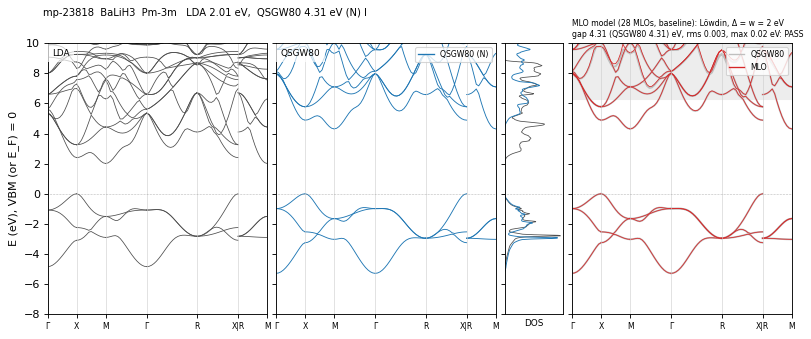

**mp-632808** BaLiH3 — QSGW80 **3.53** N / M 3.46 eV I differs — ecalj b695fa65c (tf32, t_tetrakbt -300) — MLO PASS (b2) 48 gap 3.53 rms 0.003 max 0.01 (ecalj 614ab5eb8)

<small>runs: M 3.46 · N 3.53 (10-04)</small>

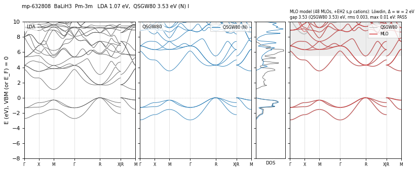

**mp-8280** BaMg2As2 — QSGW80 **1.98** N / M ≈ eV I  — ecalj b695fa65c (tf32, t_tetrakbt -300) — MLO PASS (b2) 60 gap 1.98 rms 0.001 max 0.01 (ecalj 614ab5eb8)

<small>runs: M 2.00 · N 1.98 (10-04)</small>

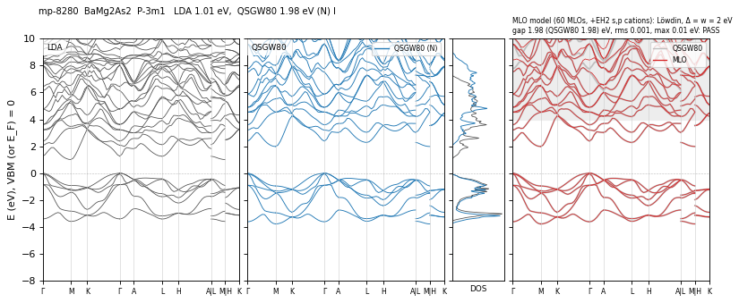

**mp-29209** BaMg2Bi2 — QSGW80 **1.24** E / M ≈ / N ≈ eV D  — ecalj 614ab5eb8 (tf32, t_tetrakbt -300) with ES, ES rule es-a — MLO PASS (b2, ES) 69 gap 1.24 rms 0.002 max 0.01 (ecalj 7827f9424)

<small>runs: M 1.25 · N 1.25 (10-04) · E 1.24 (10-05, ES 1, es-a)</small>

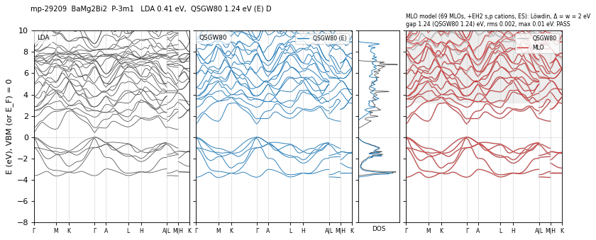

**mp-8278** BaMg2P2 — QSGW80 **2.10** N / M ≈ eV I  — ecalj b695fa65c (tf32, t_tetrakbt -300) — MLO PASS (b2) 60 gap 2.10 rms 0.001 max 0.01 (ecalj 614ab5eb8)

<small>runs: M 2.10 · N 2.10 (10-04)</small>

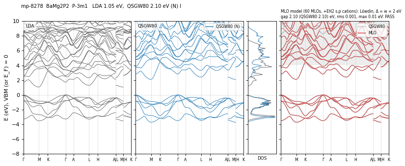

**mp-9567** BaMg2Sb2 — QSGW80 **1.69** E / M ≈ / N ≈ eV I  — ecalj 614ab5eb8 (tf32, t_tetrakbt -300) with ES, ES rule es-a — MLO PASS (b2, ES) 61 gap 1.69 rms 0.002 max 0.01 (ecalj f481126f0)

<small>runs: M 1.67 · N 1.67 (10-04) · E 1.69 (10-05, ES 1, es-a)</small>

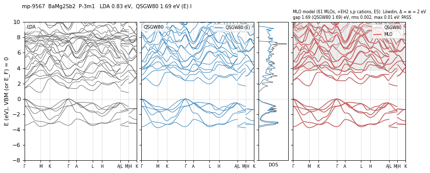

**mp-3163** BaSnO3 — QSGW80 **2.74** N / M 2.35 eV I CHECK — ecalj 989a18637 (tf32, t_tetrakbt -300) — MLO PASS (b1) 33 gap 2.74 rms 0.001 max 0.01 (ecalj fb2da026b)

<small>runs: M 2.35 · N 2.74 (10-03)</small>

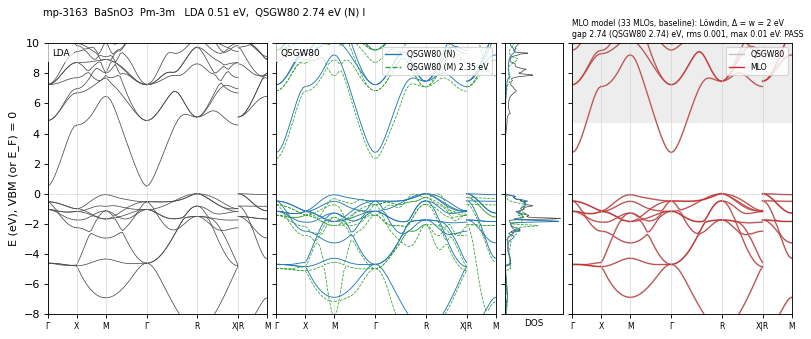

**mp-5020** BaTiO3 — QSGW80 **4.24** N / M ≈ eV I  — ecalj b695fa65c (tf32, t_tetrakbt -300) — MLO PASS (b1) 33 gap 4.24 rms 0.001 max 0.01 (ecalj 614ab5eb8)

<small>runs: M 4.20 · N 4.24 (10-04)</small>

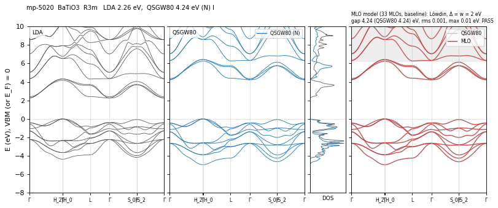

**mp-5777** BaTiO3 — QSGW80 **4.00** N / M ≈ eV I  — ecalj 989a18637 (tf32, t_tetrakbt -300) — MLO PASS (b1) 33 gap 4.00 rms 0.001 max 0.01 (ecalj fb2da026b)

<small>runs: M 3.97 · N 4.00 (10-03)</small>

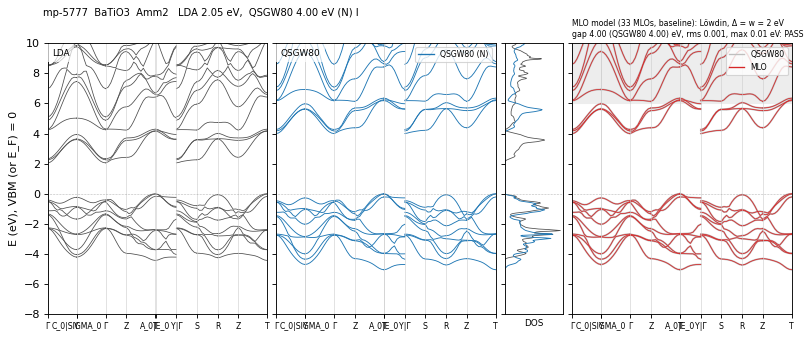

**mp-5986** BaTiO3 — QSGW80 **3.52** N / M 3.39 eV I differs — ecalj b695fa65c (tf32, t_tetrakbt -300) — MLO PASS (b1) 33 gap 3.52 rms 0.001 max 0.01 (ecalj 614ab5eb8)

<small>runs: M 3.39 · N 3.52 (10-04)</small>

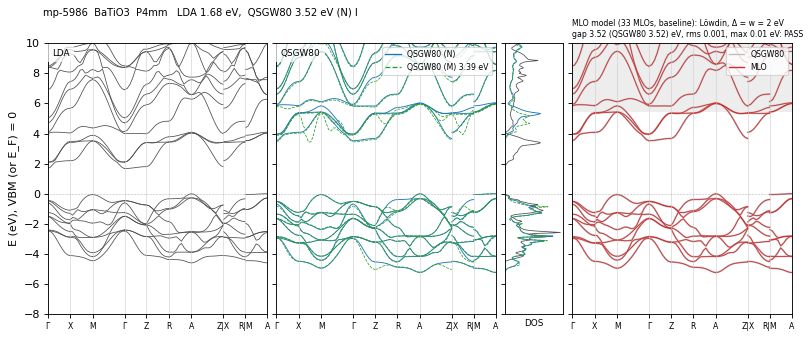

**mp-644497** BaTiO3 — QSGW80 **2.71** N / R ≈ eV I  — ecalj b695fa65c (tf32, t_tetrakbt -300) — MLO PASS (b2all) 49 gap 2.71 rms 0.003 max 0.05 (ecalj 614ab5eb8)

<small>runs: M 2.66 · R 2.71 (10-01) · N 2.71 (10-04)</small>

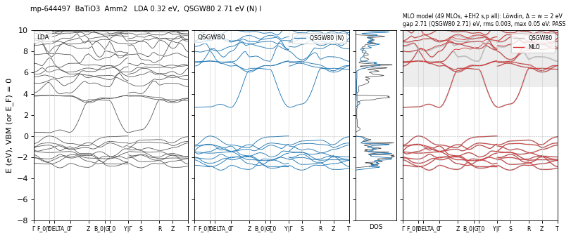

**mp-3834** BaZrO3 — QSGW80 **5.29** N / M ≈ eV I  — ecalj b695fa65c (tf32, t_tetrakbt -300) — MLO PASS (b1) 33 gap 5.29 rms 0.001 max 0.01 (ecalj 614ab5eb8)

<small>runs: M 5.33 · N 5.29 (10-04)</small>

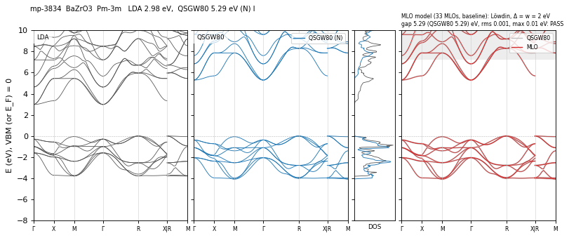

**mp-1017552** Bi2O3 — QSGW80 **1.83** N / M ≈ eV I  — ecalj b695fa65c (tf32, t_tetrakbt -300) — MLO PASS (b1) 30 gap 1.83 rms 0.006 max 0.04 (ecalj a1d6c0e11)

<small>runs: M 1.87 · N 1.83 (10-04)</small>

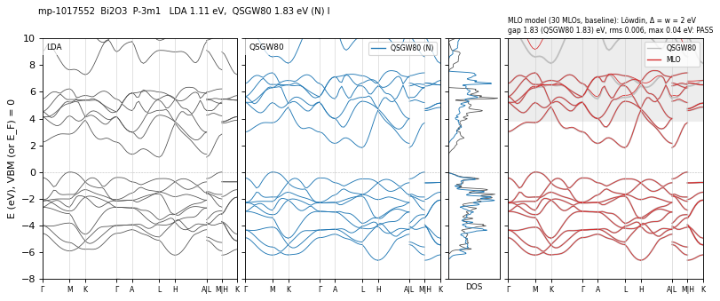

**mp-541837** Bi2Se3 — QSGW80 **0.80** N / M 0.71 eV D differs — ecalj 989a18637 (tf32, t_tetrakbt -300) — MLO PASS (b1) 45 gap 0.80 rms 0.002 max 0.03 (ecalj fb2da026b)

<small>runs: M 0.71 · N 0.80 (10-03)</small>

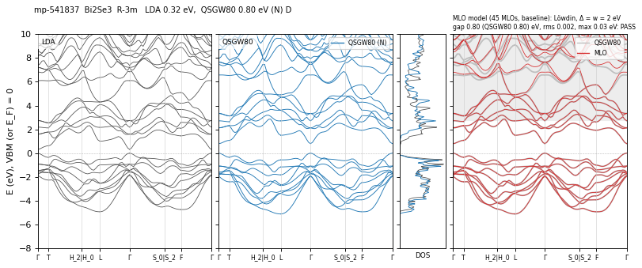

**mp-552098** Bi2SeO2 — QSGW80 **0.97** N / R ≈ eV I  — ecalj b695fa65c (tf32, t_tetrakbt -300) — MLO PASS (b1) 35 gap 0.96 rms 0.001 max 0.00 (ecalj 614ab5eb8)

<small>runs: M FAILED · R 0.97 (09-30) · N 0.97 (10-04)</small>

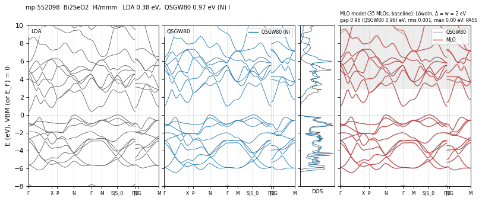

**mp-27910** Bi2Te2S — QSGW80 **0.82** N / M ≈ eV D  — ecalj b695fa65c (tf32, t_tetrakbt -300) — MLO PASS (b1) 45 gap 0.83 rms 0.003 max 0.02 (ecalj fb2da026b)

<small>runs: M 0.82 · N 0.82 (10-03)</small>

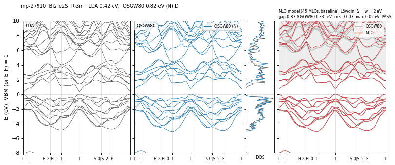

**mp-29666** Bi2Te2Se — QSGW80 **0.78** N / M ≈ eV D  — ecalj 989a18637 (tf32, t_tetrakbt -300) — MLO PASS (b1) 45 gap 0.78 rms 0.003 max 0.02 (ecalj fb2da026b)

<small>runs: M 0.79 · N 0.74 FAIL(1) (10-04) · N 0.78 (10-06)</small>

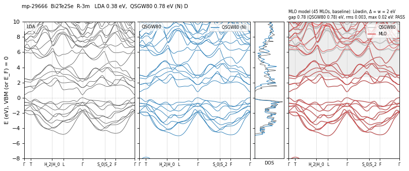

**mp-34202** Bi2Te3 — QSGW80 **0.88** N / M ≈ eV D  — ecalj b695fa65c (tf32, t_tetrakbt -300) — MLO PASS (b1) 45 gap 0.88 rms 0.003 max 0.03 (ecalj 614ab5eb8)

<small>runs: M 0.87 · N 0.88 (10-03)</small>

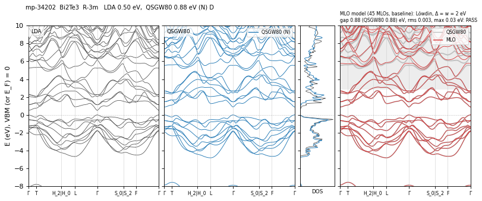

**mp-31406** Bi2TeSe2 — QSGW80 **1.42** E / M ≈ / N ≈ eV I  — ecalj 614ab5eb8 (tf32, t_tetrakbt -300) with ES, ES rule es-a — MLO PASS (b1, ES) 46 gap 1.43 rms 0.002 max 0.02 (ecalj 7827f9424)

<small>runs: M 1.40 · N 1.40 (10-03) · E 1.42 (10-05, ES 1, es-a)</small>

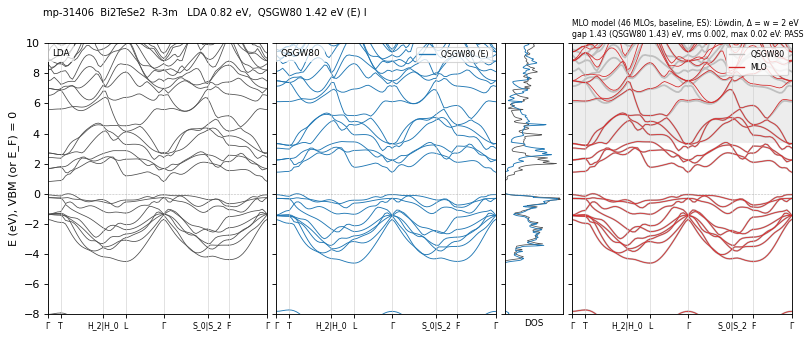

**mp-27962** CI4 — QSGW80 **3.18** E / N 3.28 / R 3.28 eV D differs — ecalj 614ab5eb8 (tf32, t_tetrakbt -300) with ES, ES rule es-a — MLO PASS (b1, ES) 50 gap 3.18 rms 0.000 max 0.00 (ecalj 7827f9424)

<small>runs: M 3.35 · R 3.28 (10-01) · N 3.28 (10-04) · E 3.18 (10-05, ES 7, es-a)</small>

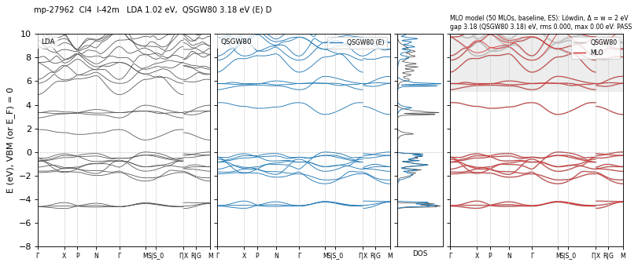

**mp-8818** Ca2ZnN2 — QSGW80 **1.97** N / R ≈ eV I  — ecalj b695fa65c (tf32, t_tetrakbt -300) — MLO PASS (b2) 47 gap 1.97 rms 0.002 max 0.01 (ecalj 614ab5eb8)

<small>runs: M 2.02 · R 1.97 (10-01) · N 1.97 (10-04)</small>

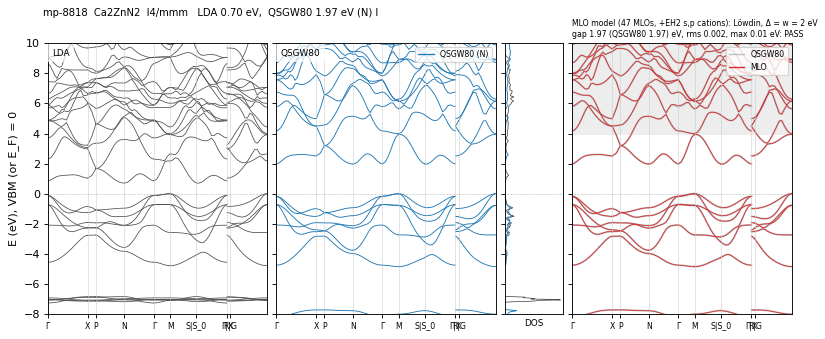

**mp-7223** Ca3AsN — QSGW80 **1.80** N / M ≈ eV D  — ecalj b695fa65c (tf32, t_tetrakbt -300) — MLO PASS (b1) 40 gap 1.80 rms 0.001 max 0.01 (ecalj 614ab5eb8)

<small>runs: M 1.81 · N 1.80 (10-04)</small>

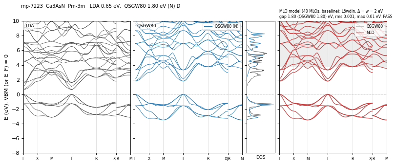

**mp-31149** Ca3BiN — QSGW80 **1.32** N / M ≈ eV D  — ecalj b695fa65c (tf32, t_tetrakbt -300) — MLO PASS (b1) 40 gap 1.32 rms 0.001 max 0.01 (ecalj 614ab5eb8)

<small>runs: M 1.29 · N 1.32 (10-03)</small>

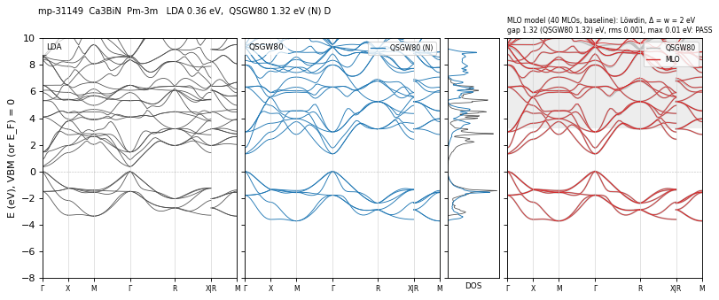

**mp-13146** Ca3N2 — QSGW80 **2.38** N / M ≈ eV I  — ecalj b695fa65c (tf32, t_tetrakbt -300) — MLO PASS (b1) 35 gap 2.39 rms 0.004 max 0.02 (ecalj a1d6c0e11)

<small>runs: M 2.40 · N 2.38 (10-03)</small>

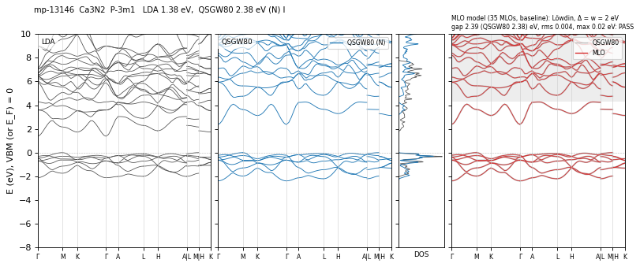

**mp-11824** Ca3PN — QSGW80 **1.94** N / M ≈ eV D  — ecalj b695fa65c (tf32, t_tetrakbt -300) — MLO PASS (b1) 40 gap 1.94 rms 0.001 max 0.01 (ecalj a1d6c0e11)

<small>runs: M 1.90 · N 1.94 (10-04)</small>

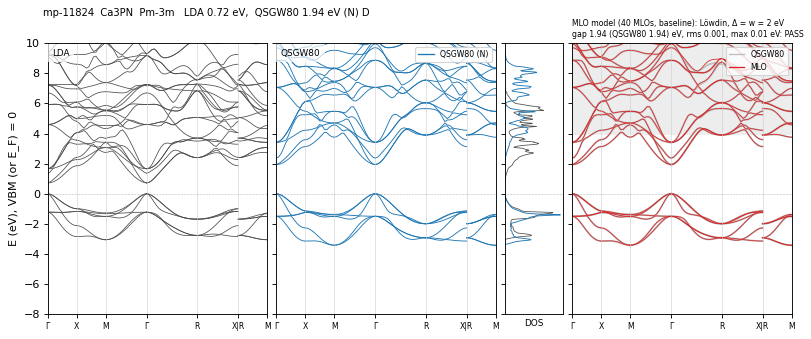

**mp-1018630** CaBe2As2 — QSGW80 **1.51** N / M ≈ eV I  — ecalj b695fa65c (tf32, t_tetrakbt -300) — MLO PASS (b1) 35 gap 1.52 rms 0.004 max 0.06 (ecalj a1d6c0e11)

<small>runs: M 1.49 · N 1.51 (10-04)</small>

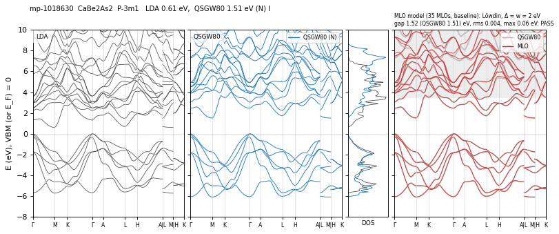

**mp-1017548** CaBe2P2 — QSGW80 **1.66** N / M ≈ eV I  — ecalj b695fa65c (tf32, t_tetrakbt -300) — MLO PASS (b1) 35 gap 1.67 rms 0.002 max 0.01 (ecalj a1d6c0e11)

<small>runs: M 1.66 · N 1.66 (10-03)</small>

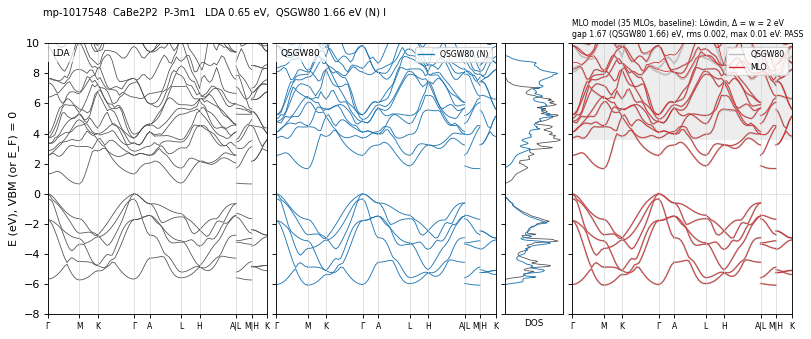

**mp-7067** CaCd2As2 — QSGW80 **0.95** N / M ≈ eV D  — ecalj b695fa65c (tf32, t_tetrakbt -300) — MLO PASS (b2) 57 gap 0.95 rms 0.002 max 0.01 (ecalj 614ab5eb8)

<small>runs: M 0.94 · N 0.95 (10-04)</small>

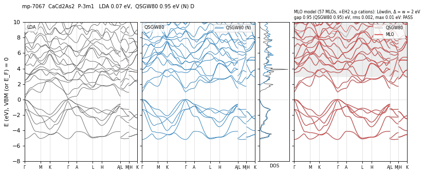

**mp-9570** CaCd2P2 — QSGW80 **1.51** N / M ≈ eV D  — ecalj b695fa65c (tf32, t_tetrakbt -300) — MLO PASS (b2) 57 gap 1.51 rms 0.001 max 0.01 (ecalj 614ab5eb8)

<small>runs: M 1.50 · N 1.51 (10-03)</small>

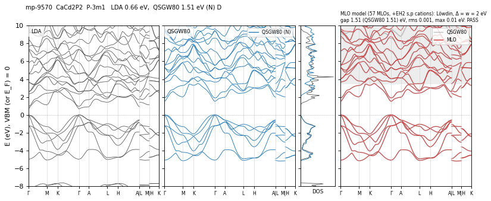

**mp-7430** CaCd2Sb2 — QSGW80 **0.81** N / M ≈ eV I  — ecalj b695fa65c (tf32, t_tetrakbt -300) — MLO PASS (b2) 57 gap 0.80 rms 0.002 max 0.01 (ecalj 614ab5eb8)

<small>runs: M 0.80 · N 0.81 (10-03)</small>

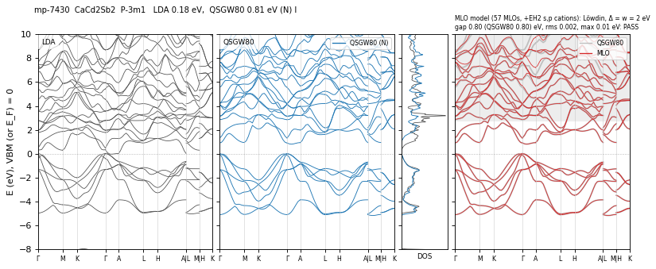

**mp-1070099** CaGa2As2 — QSGW80 **0.37** N / M ≈ eV I  — ecalj b695fa65c (tf32, t_tetrakbt -300) — MLO PASS (b1) 55 gap 0.37 rms 0.008 max 0.06 (ecalj a1d6c0e11)

<small>runs: M 0.38 · N 0.37 (10-04)</small>

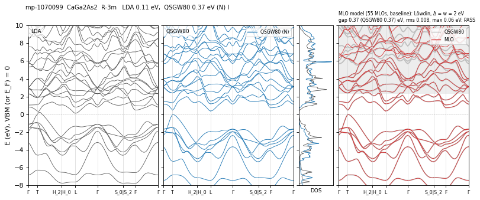

**mp-23879** CaH2O2 — QSGW80 **7.54** N / M 7.33 eV D CHECK — ecalj b695fa65c (tf32, t_tetrakbt -300) — MLO PASS (b2) 37 gap 7.54 rms 0.003 max 0.02 (ecalj fb2da026b)

<small>runs: M 7.33 · N 7.54 (10-04)</small>

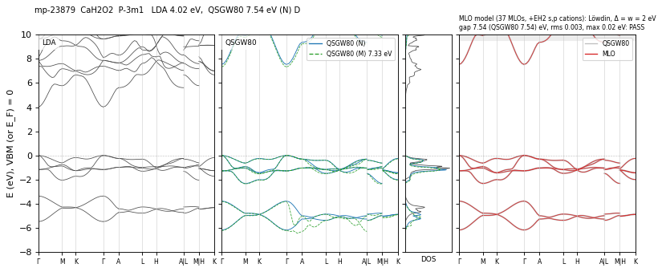

**mp-9564** CaMg2As2 — QSGW80 **2.24** N / M ≈ eV I  — ecalj b695fa65c (tf32, t_tetrakbt -300) — MLO PASS (b2) 57 gap 2.24 rms 0.002 max 0.01 (ecalj 614ab5eb8)

<small>runs: M 2.25 · N 2.24 (10-04)</small>

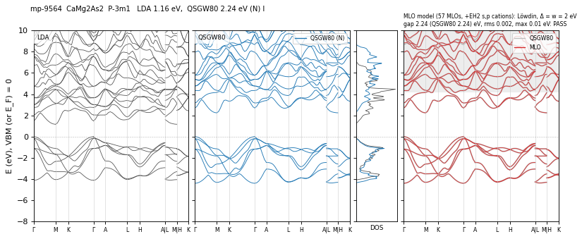

**mp-29208** CaMg2Bi2 — QSGW80 **1.27** E / M ≈ / N ≈ eV D  — ecalj 614ab5eb8 (tf32, t_tetrakbt -300) with ES, ES rule es-a — MLO PASS (b1, ES) 46 gap 1.27 rms 0.007 max 0.04 (ecalj 7827f9424)

<small>runs: M 1.29 · N 1.29 (10-03) · E 1.27 (10-05, ES 1, es-a)</small>

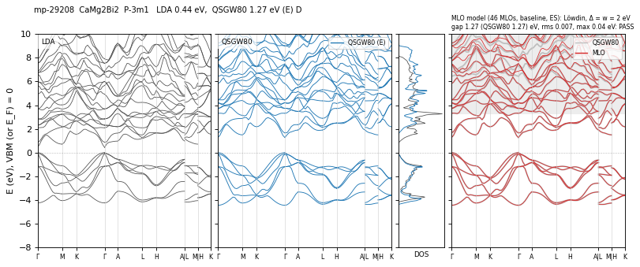

**mp-5795** CaMg2N2 — QSGW80 **3.60** N / M ≈ eV D  — ecalj b695fa65c (tf32, t_tetrakbt -300) — MLO PASS (b1) 35 gap 3.61 rms 0.002 max 0.02 (ecalj 614ab5eb8)

<small>runs: M 3.59 · N 3.60 (10-03)</small>

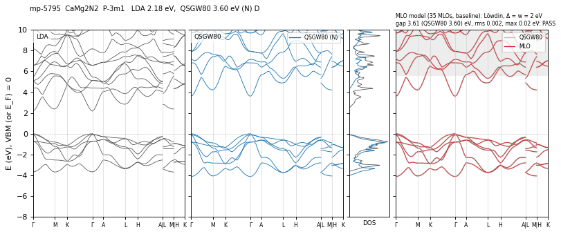

**mp-9565** CaMg2Sb2 — QSGW80 **1.66** E / M ≈ / N ≈ eV I  — ecalj 614ab5eb8 (tf32, t_tetrakbt -300) with ES, ES rule es-a — MLO PASS (b1, ES) 46 gap 1.66 rms 0.004 max 0.02 (ecalj f481126f0)

<small>runs: M 1.62 · N 1.64 (10-03) · E 1.66 (10-05, ES 1, es-a)</small>

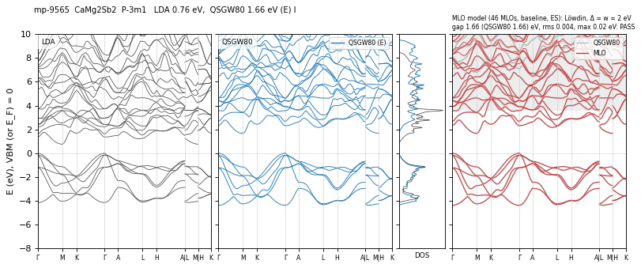

**mp-5893** CaSiO3 — QSGW80 **6.29** N / M 6.19 eV I differs — ecalj b695fa65c (tf32, t_tetrakbt -300) — MLO PASS (b1) 30 gap 6.29 rms 0.001 max 0.00 (ecalj 614ab5eb8)

<small>runs: M 6.19 · N 6.29 (10-03)</small>

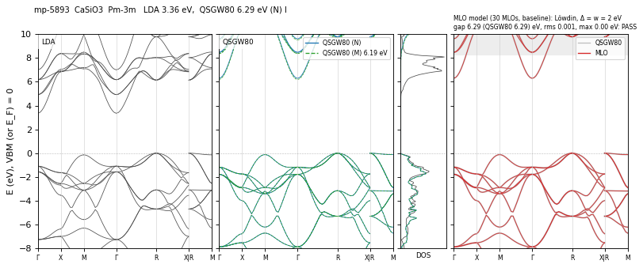

**mp-7986** CaSnO3 — QSGW80 **3.59** N / M 3.92 eV I CHECK — ecalj 989a18637 (tf32, t_tetrakbt -300) — MLO PASS (b1) 30 gap 3.59 rms 0.001 max 0.00 (ecalj fb2da026b)

<small>runs: M 3.92 · N 3.59 (10-03)</small>

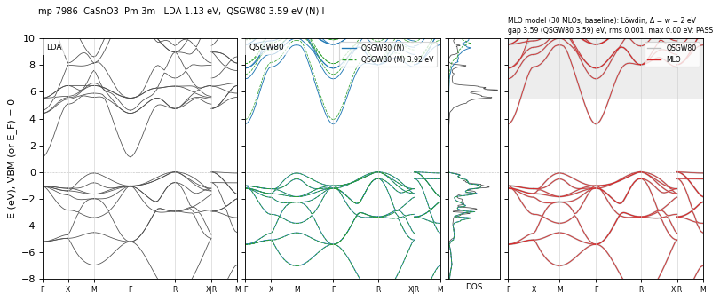

**mp-5827** CaTiO3 — QSGW80 **3.75** N / M 3.82 eV I differs — ecalj b695fa65c (tf32, t_tetrakbt -300) — MLO PASS (b1) 30 gap 3.75 rms 0.001 max 0.02 (ecalj 614ab5eb8)

<small>runs: M 3.82 · N 3.75 (10-04)</small>

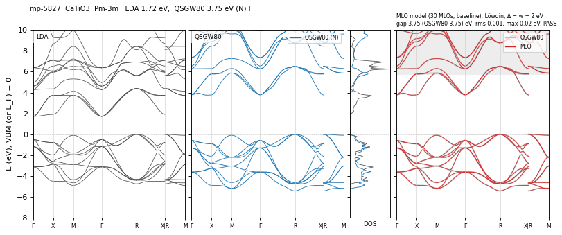

**mp-9571** CaZn2As2 — QSGW80 **1.39** N / M ≈ eV D  — ecalj b695fa65c (tf32, t_tetrakbt -300) — MLO PASS (b1) 55 gap 1.39 rms 0.005 max 0.04 (ecalj 614ab5eb8)

<small>runs: M 1.40 · N 1.39 (10-04)</small>

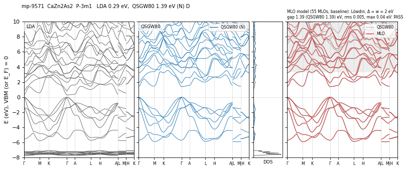

**mp-9569** CaZn2P2 — QSGW80 **1.69** N / M ≈ eV I  — ecalj b695fa65c (tf32, t_tetrakbt -300) — MLO PASS (b2) 57 gap 1.69 rms 0.002 max 0.01 (ecalj 614ab5eb8)

<small>runs: M 1.69 · N 1.69 (10-04)</small>

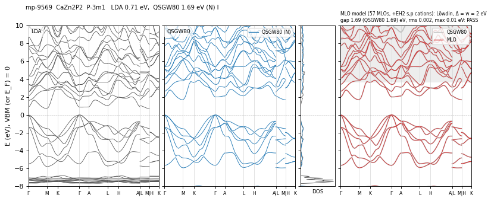

**mp-542112** CaZrO3 — QSGW80 **5.39** N / M 5.44 eV I differs — ecalj b695fa65c (tf32, t_tetrakbt -300) — MLO PASS (b1) 30 gap 5.39 rms 0.001 max 0.03 (ecalj 614ab5eb8)

<small>runs: M 5.44 · N 5.39 (10-04)</small>

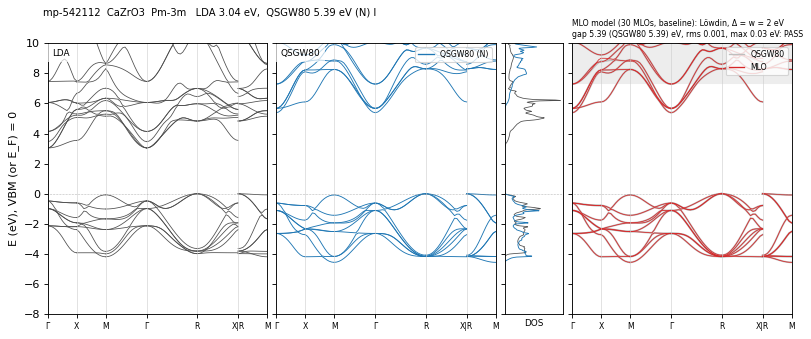

**mp-625548** CdH2O2 — QSGW80 **4.16** N / R ≈ eV I  — ecalj b695fa65c (tf32, t_tetrakbt -300) — MLO PASS (b1) 25 gap 4.17 rms 0.001 max 0.02 (ecalj 614ab5eb8)

<small>runs: M FAILED · R 4.16 (09-30) · N 4.16 (10-04)</small>

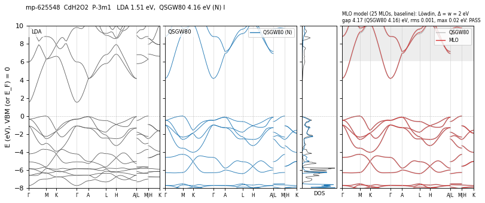

**mp-27710** CrB4 — QSGW80 **0.00** N / R ≈ eV metal  — ecalj 989a18637 (tf32, t_tetrakbt -300) — MLO PASS (b1) 25 rms 0.002 max 0.02 (ecalj fb2da026b)

<small>runs: M UNKNOWN · R CONVERGED_METAL (09-30) · N CONVERGED_METAL (10-03)</small>

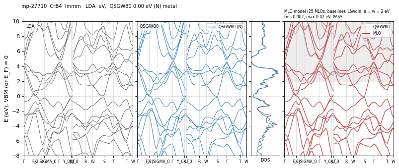

**mp-7232** Cs2HgO2 — QSGW80 **4.35** N / R ≈ eV I  — ecalj b695fa65c (tf32, t_tetrakbt -300) — MLO PASS (b2) 53 gap 4.35 rms 0.004 max 0.04 (ecalj 614ab5eb8)

<small>runs: M 4.29 · R 4.35 (10-01) · N 4.35 (10-04)</small>

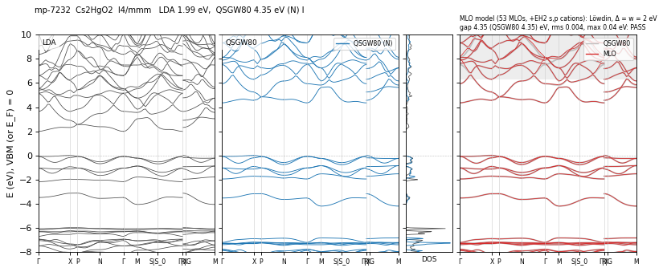

**mp-505824** Cs2PdC2 — QSGW80 **3.16** N / M ≈ eV D  — ecalj b695fa65c (tf32, t_tetrakbt -300) — MLO PASS (b2) 57 gap 3.16 rms 0.006 max 0.04 (ecalj 614ab5eb8)

<small>runs: M 3.12 · N 3.16 (10-04)</small>

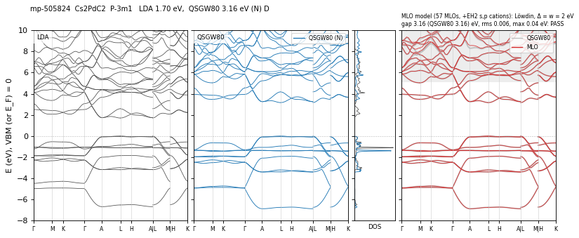

**mp-505825** Cs2PtC2 — QSGW80 **2.46** N / M ≈ eV I  — ecalj b695fa65c (tf32, t_tetrakbt -300) — MLO PASS (b2) 57 gap 2.47 rms 0.005 max 0.03 (ecalj 614ab5eb8)

<small>runs: M 2.43 · N 2.46 (10-03)</small>

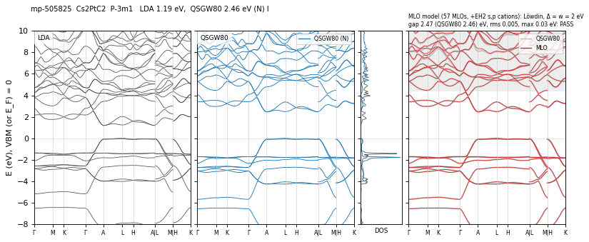

**mp-28873** CsBrO3 — QSGW80 **7.06** N / R ≈ eV D  — ecalj b695fa65c (tf32, t_tetrakbt -300) — MLO PASS (b2) 35 gap 7.06 rms 0.006 max 0.05 (ecalj fb2da026b)

<small>runs: M 4.98 · R 7.06 (10-01) · N 7.06 (10-04)</small>

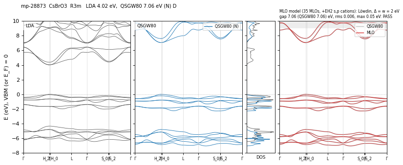

**mp-30056** CsCaBr3 — QSGW80 **7.00** N / M ≈ eV I  — ecalj b695fa65c (tf32, t_tetrakbt -300) — MLO PASS (b2) 56 gap 7.00 rms 0.008 max 0.09 (ecalj 614ab5eb8)

<small>runs: M 6.98 · N 7.00 (10-04)</small>

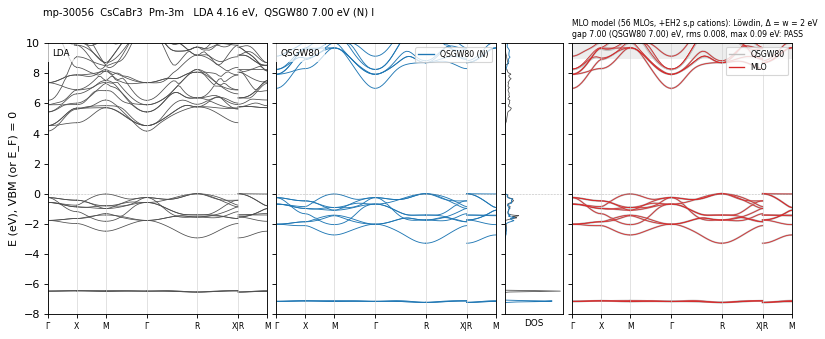

**mp-7104** CsCaF3 — QSGW80 **11.07** N / M 11.35 eV D CHECK — ecalj b695fa65c (tf32, t_tetrakbt -300) — MLO PASS (b2) 45 gap 11.07 rms 0.001 max 0.02 (ecalj 614ab5eb8)

<small>runs: M 11.35 · N 11.07 (10-04)</small>

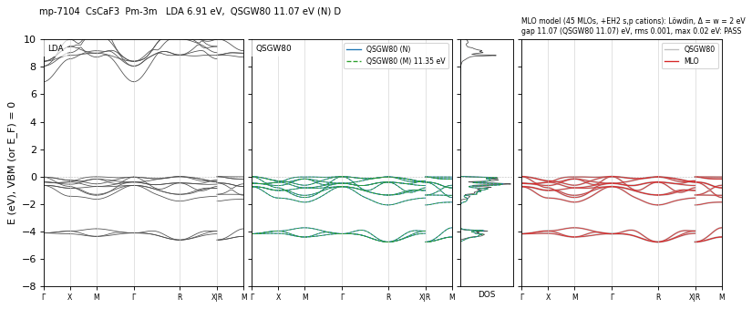

**mp-644203** CsCaH3 — QSGW80 **5.95** N / M ≈ eV D  — ecalj b695fa65c (tf32, t_tetrakbt -300) — MLO PASS (b1) 33 gap 5.95 rms 0.015 max 0.10 (ecalj 614ab5eb8)

<small>runs: M 5.93 · N 5.95 (10-03)</small>

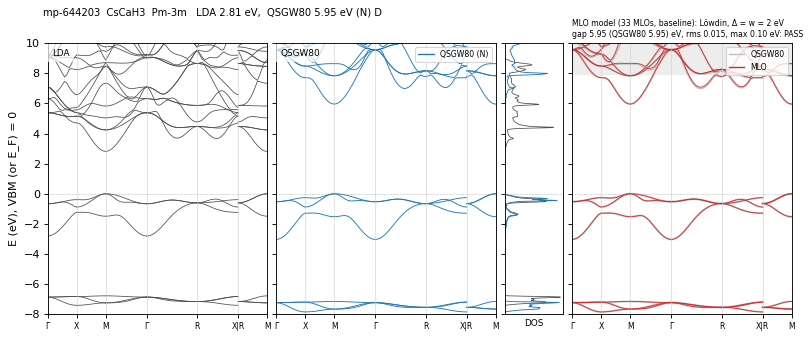

**mp-570231** CsCdBr3 — QSGW80 **2.77** N / M ≈ eV I  — ecalj 989a18637 (tf32, t_tetrakbt -300) — MLO PASS (b1) 48 gap 2.78 rms 0.000 max 0.00 (ecalj fb2da026b)

<small>runs: M 2.78 · N 2.77 (10-03)</small>

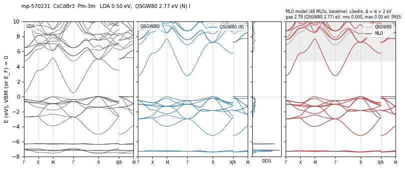

**mp-568544** CsCdCl3 — QSGW80 **4.20** N / M ≈ eV I  — ecalj b695fa65c (tf32, t_tetrakbt -300) — MLO PASS (b1) 48 gap 4.20 rms 0.001 max 0.01 (ecalj 614ab5eb8)

<small>runs: M 4.21 · N 4.20 (10-04)</small>

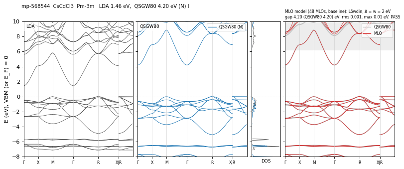

**mp-8399** CsCdF3 — QSGW80 **7.01** N / M ≈ eV I  — ecalj b695fa65c (tf32, t_tetrakbt -300) — MLO PASS (b1) 34 gap 7.01 rms 0.002 max 0.03 (ecalj 614ab5eb8)

<small>runs: M 6.98 · N 7.01 (10-03)</small>

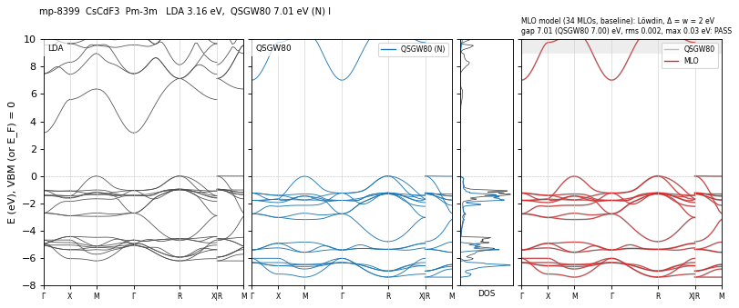

**mp-1068340** CsGeBr3 — QSGW80 **2.52** N / M ≈ eV D  — ecalj b695fa65c (tf32, t_tetrakbt -300) — MLO PASS (b2) 56 gap 2.52 rms 0.001 max 0.00 (ecalj a1d6c0e11)

<small>runs: M 2.56 · N 2.52 (10-04)</small>

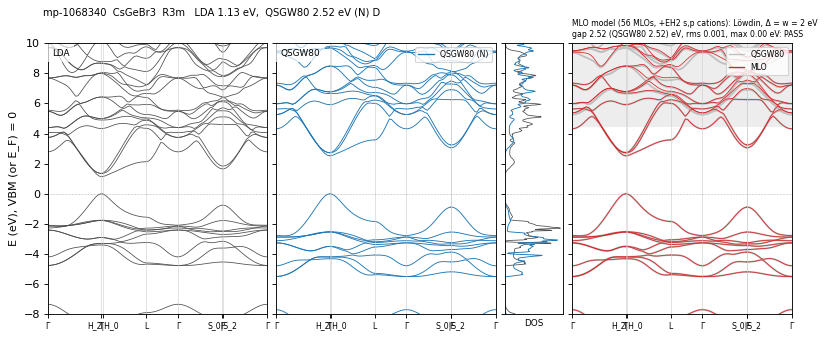

**mp-570223** CsGeBr3 — QSGW80 **1.44** N / M ≈ eV D  — ecalj b695fa65c (tf32, t_tetrakbt -300) — MLO PASS (b1) 48 gap 1.44 rms 0.001 max 0.01 (ecalj 614ab5eb8)

<small>runs: M 1.45 · N 1.44 (10-03)</small>

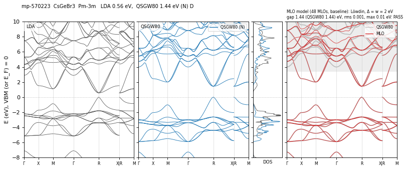

**mp-22988** CsGeCl3 — QSGW80 **3.88** N / M ≈ eV D  — ecalj b695fa65c (tf32, t_tetrakbt -300) — MLO PASS (b2) 56 gap 3.88 rms 0.001 max 0.01 (ecalj fb2da026b)

<small>runs: M 3.84 · N 3.88 (10-04)</small>

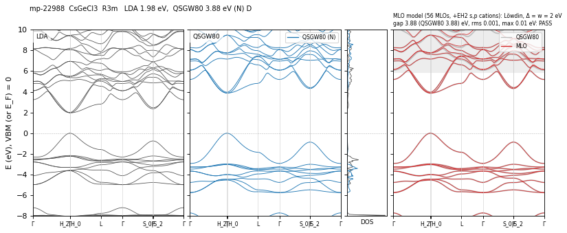

**mp-28377** CsGeI3 — QSGW80 **1.93** N / M ≈ eV D  — ecalj b695fa65c (tf32, t_tetrakbt -300) — MLO PASS (b1) 48 gap 1.93 rms 0.005 max 0.04 (ecalj fb2da026b)

<small>runs: M 1.96 · N 1.93 (10-04)</small>

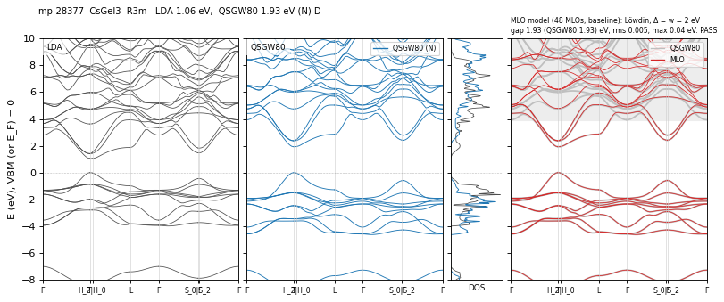

**mp-561947** CsHgF3 — QSGW80 **3.48** N / M ≈ eV I  — ecalj 989a18637 (tf32, t_tetrakbt -300) — MLO PASS (b1) 34 gap 3.48 rms 0.000 max 0.00 (ecalj fb2da026b)

<small>runs: M 3.43 · N 3.48 (10-03)</small>

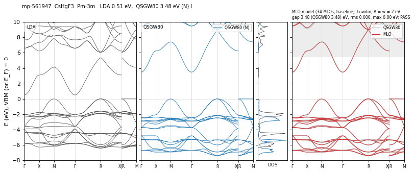

**mp-8401** CsMgF3 — QSGW80 **10.78** N / M ≈ eV D  — ecalj b695fa65c (tf32, t_tetrakbt -300) — MLO PASS (b1) 34 gap 10.78 rms 0.007 max 0.08 (ecalj 614ab5eb8)

<small>runs: M 10.82 · N 10.78 (10-04)</small>

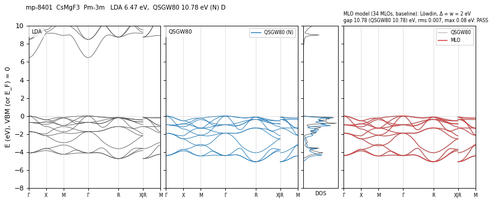

**mp-600089** CsPbBr3 — QSGW80 **3.11** N / M ≈ eV D  — ecalj b695fa65c (tf32, t_tetrakbt -300) — MLO PASS (b2) 56 gap 3.11 rms 0.000 max 0.00 (ecalj 614ab5eb8)

<small>runs: M 3.10 · N 3.11 (10-04)</small>

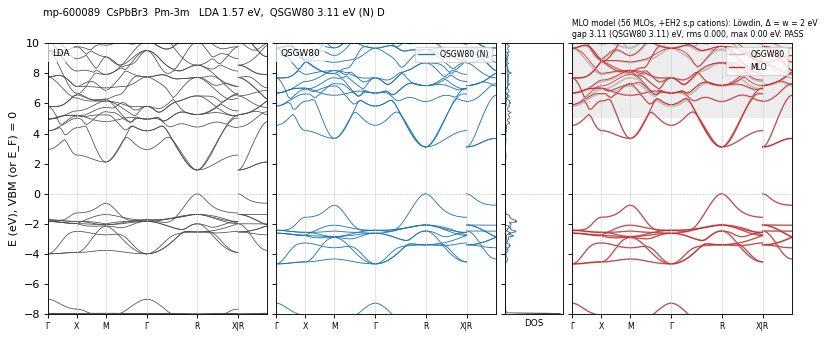

**mp-23037** CsPbCl3 — QSGW80 **3.77** N / M ≈ eV D  — ecalj 989a18637 (tf32, t_tetrakbt -300) — MLO PASS (b2) 56 gap 3.77 rms 0.001 max 0.00 (ecalj fb2da026b)

<small>runs: M 3.77 · N 3.77 (10-03)</small>

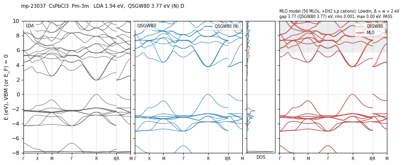

**mp-5811** CsPbF3 — QSGW80 **5.09** N / M ≈ eV D  — ecalj b695fa65c (tf32, t_tetrakbt -300) — MLO PASS (b2) 47 gap 5.09 rms 0.001 max 0.01 (ecalj 614ab5eb8)

<small>runs: M 5.08 · N 5.09 (10-03)</small>

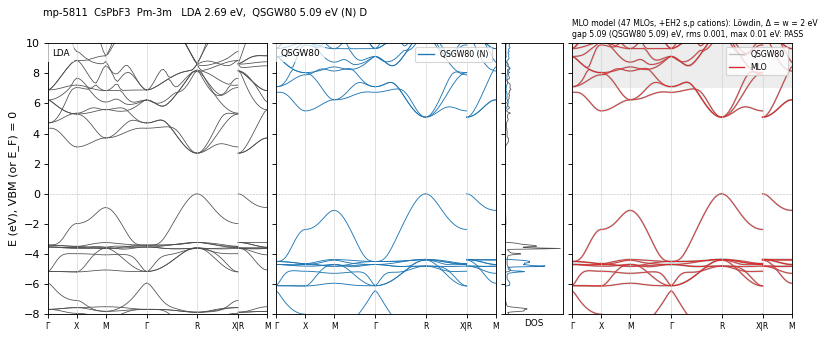

**mp-1069538** CsPbI3 — QSGW80 **2.30** E / M ≈ / N ≈ eV D  — ecalj 614ab5eb8 (tf32, t_tetrakbt -300) with ES, ES rule es-a — MLO PASS (b1, ES) 51 gap 2.30 rms 0.001 max 0.01 (ecalj 7827f9424)

<small>runs: M 2.29 · N 2.34 (10-04) · E 2.30 (10-05, ES 3, es-a)</small>

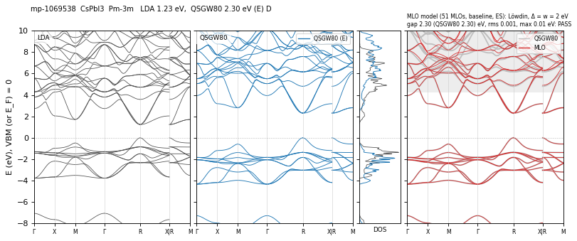

**mp-27214** CsSnBr3 — QSGW80 **1.48** N / M ≈ eV D  — ecalj b695fa65c (tf32, t_tetrakbt -300) — MLO PASS (b2) 56 gap 1.48 rms 0.000 max 0.00 (ecalj fb2da026b)

<small>runs: M 1.47 · N 1.48 (10-04)</small>

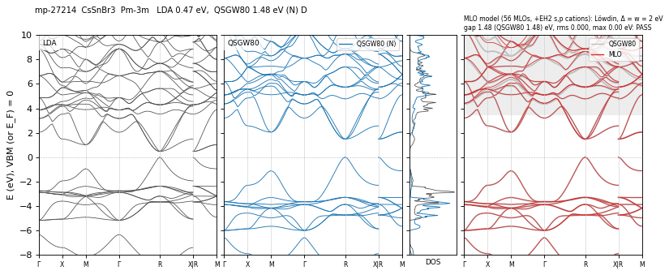

**mp-1070375** CsSnCl3 — QSGW80 **2.03** N / M ≈ eV D  — ecalj b695fa65c (tf32, t_tetrakbt -300) — MLO PASS (b2) 56 gap 2.03 rms 0.001 max 0.00 (ecalj a1d6c0e11)

<small>runs: M 1.99 · N 2.03 (10-04)</small>

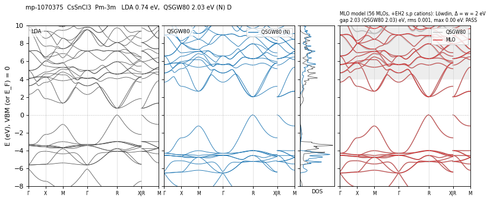

**mp-614013** CsSnI3 — QSGW80 **1.18** E / M 1.24 / N ≈ eV D differs — ecalj 614ab5eb8 (tf32, t_tetrakbt -300) with ES, ES rule es-a — MLO PASS (b1, ES) 51 gap 1.18 rms 0.001 max 0.01 (ecalj 8e51a3d5a)

<small>runs: M 1.24 · N 1.22 (10-03) · E 1.18 (10-05, ES 3, es-a)</small>

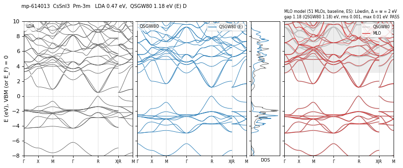

**mp-8397** CsSrF3 — QSGW80 **10.28** N / M ≈ eV D  — ecalj b695fa65c (tf32, t_tetrakbt -300) — MLO PASS (b2) 45 gap 10.28 rms 0.001 max 0.01 (ecalj 614ab5eb8)

<small>runs: M 10.31 · N 10.28 (10-04)</small>

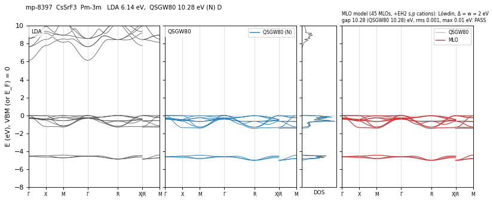

**mp-9816** GeF4 — QSGW80 **10.43** E / N 10.54 / R 10.54 eV I differs — ecalj 0601771b4 (tf32, t_tetrakbt -300) with ES, ES rule es-c — MLO PASS (b1, ES) 28 gap 10.43 rms 0.001 max 0.00 (ecalj f16f0ea3d)

<small>runs: M 10.64 · R 10.54 (10-01) · N 10.54 (10-04) · E 10.43 (10-06, ES 3, es-c)</small>

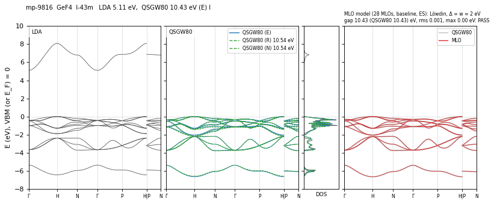

**mp-1017567** Hf2SN2 — QSGW80 **2.07** N / M ≈ · path 1.87 eV I path<mesh(mesh) — ecalj b695fa65c (tf32, t_tetrakbt -300) — MLO PASS (b1) 49 gap 1.86 rms 0.009 max 0.09 (ecalj a1d6c0e11)

<small>runs: M 2.08 · N 2.07 (10-04)</small>

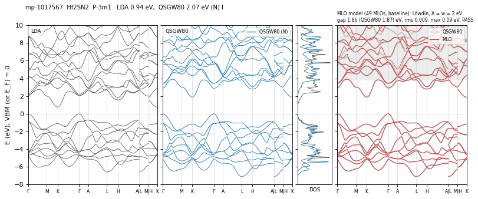

**mp-1069533** Hf2SN2 — QSGW80 **3.22** N / M ≈ eV I  — ecalj b695fa65c (tf32, t_tetrakbt -300) — MLO PASS (b2all) 61 gap 3.22 rms 0.001 max 0.00 (ecalj a1d6c0e11)

<small>runs: M 3.25 · N 3.22 (10-04)</small>

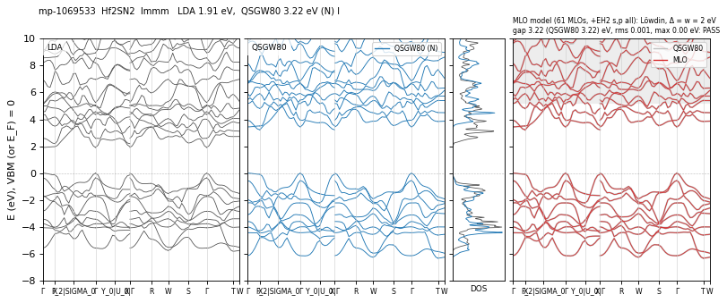

**mp-22535** HfPbO3 — QSGW80 **3.58** N / R ≈ eV D  — ecalj b695fa65c (tf32, t_tetrakbt -300) — MLO PASS (b1) 42 gap 3.58 rms 0.000 max 0.00 (ecalj fb2da026b)

<small>runs: M FAILED · R 3.58 (09-30) · N 3.58 (10-04)</small>

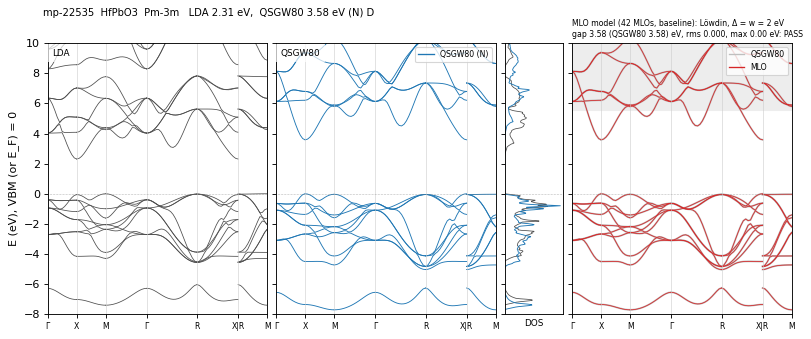

**mp-1017565** In2Se3 — QSGW80 **0.96** E / M ≈ / N ≈ eV I  — ecalj 614ab5eb8 (tf32, t_tetrakbt -300) with ES, ES rule es-a — MLO PASS (b1, ES) 56 gap 0.94 rms 0.001 max 0.01 (ecalj 7827f9424)

<small>runs: M 0.94 · N 0.93 (10-03) · E 0.96 (10-05, ES 1, es-a)</small>

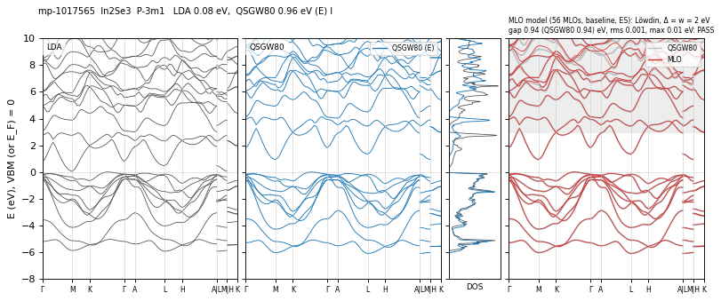

**mp-10408** K2CN2 — QSGW80 **5.66** N / M 5.61 eV D differs — ecalj b695fa65c (tf32, t_tetrakbt -300) — MLO PASS (b2) 48 gap 5.66 rms 0.004 max 0.04 (ecalj a1d6c0e11)

<small>runs: M 5.61 · N 5.66 (10-04)</small>

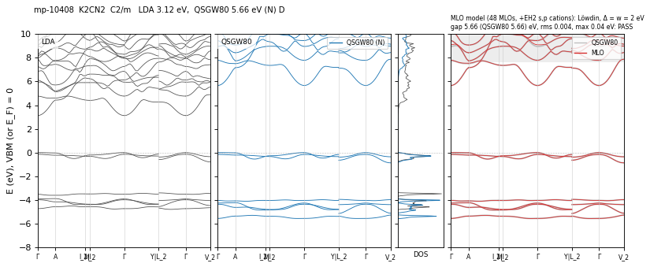

**mp-5860** K2HgO2 — QSGW80 **4.49** N / R ≈ eV I  — ecalj b695fa65c (tf32, t_tetrakbt -300) — MLO PASS (b2) 53 gap 4.49 rms 0.002 max 0.02 (ecalj 614ab5eb8)

<small>runs: M 3.97 · R 4.49 (10-01) · N 4.49 (10-04)</small>

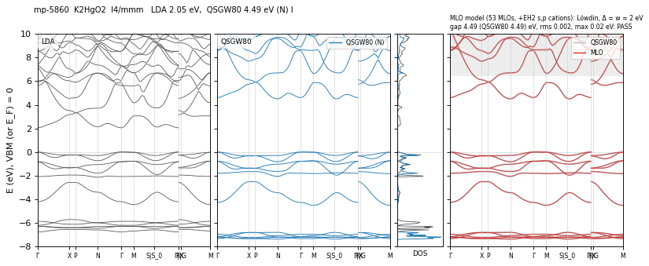

**mp-1068977** K2PdC2 — QSGW80 **2.90** N / M ≈ eV I  — ecalj b695fa65c (tf32, t_tetrakbt -300) — MLO PASS (b2) 57 gap 2.90 rms 0.001 max 0.01 (ecalj a1d6c0e11)

<small>runs: M 2.86 · N 2.90 (10-04)</small>

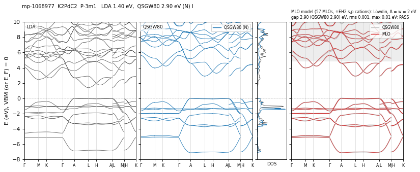

**mp-540584** K2PdO2 — QSGW80 **3.90** N / M 3.78 eV I differs — ecalj b695fa65c (tf32, t_tetrakbt -300) — MLO PASS (b1) 41 gap 3.90 rms 0.002 max 0.03 (ecalj 614ab5eb8)

<small>runs: M 3.78 · N 3.90 (10-04)</small>

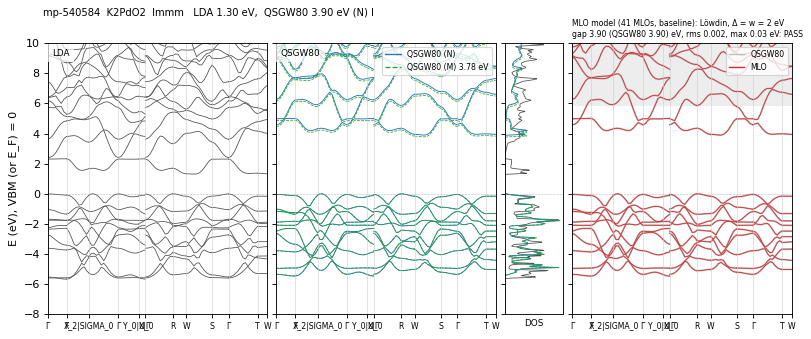

**mp-1068941** K2PdS2 — QSGW80 **2.64** N / M ≈ eV I  — ecalj b695fa65c (tf32, t_tetrakbt -300) — MLO PASS (b1) 51 gap 2.67 rms 0.001 max 0.01 (ecalj a1d6c0e11)

<small>runs: M 2.62 · N 2.64 (10-04)</small>

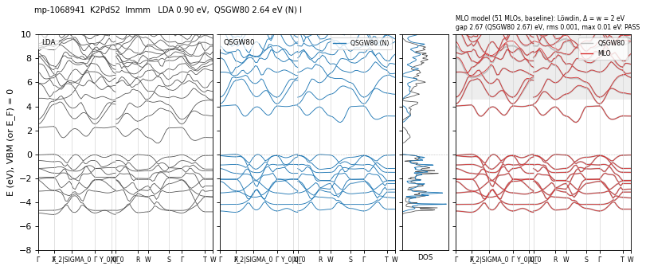

**mp-1069706** K2PdSe2 — QSGW80 **2.05** N / M ≈ eV I  — ecalj b695fa65c (tf32, t_tetrakbt -300) — MLO PASS (b1) 51 gap 2.08 rms 0.001 max 0.02 (ecalj a1d6c0e11)

<small>runs: M 2.05 · N 2.05 (10-04)</small>

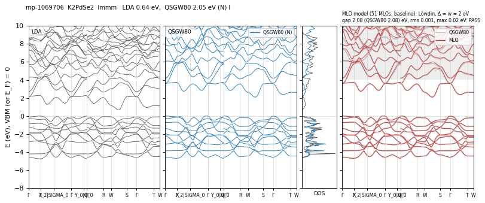

**mp-976876** K2PtC2 — QSGW80 **2.14** N / M ≈ eV I  — ecalj b695fa65c (tf32, t_tetrakbt -300) — MLO PASS (b2) 57 gap 2.14 rms 0.001 max 0.01 (ecalj 614ab5eb8)

<small>runs: M 2.12 · N 2.14 (10-03)</small>

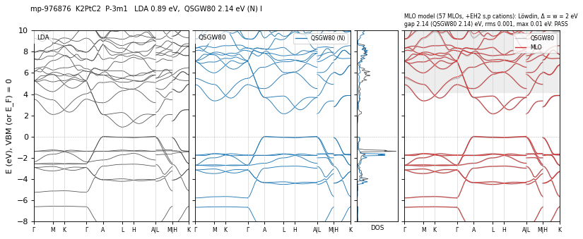

**mp-7928** K2PtS2 — QSGW80 **2.82** N / M 2.88 eV I differs — ecalj b695fa65c (tf32, t_tetrakbt -300) — MLO PASS (b1) 51 gap 2.86 rms 0.004 max 0.05 (ecalj 614ab5eb8)

<small>runs: M 2.88 · N 2.82 (10-04)</small>

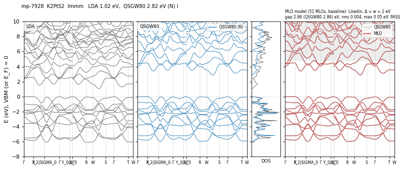

**mp-8621** K2PtSe2 — QSGW80 **2.35** N / M 2.41 eV I differs — ecalj b695fa65c (tf32, t_tetrakbt -300) — MLO PASS (b1) 51 gap 2.38 rms 0.007 max 0.08 (ecalj 614ab5eb8)

<small>runs: M 2.41 · N 2.35 (10-04)</small>

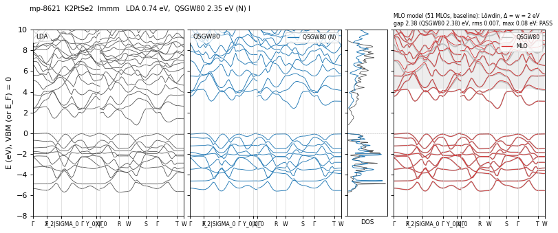

**mp-1068813** K2Te2Pd — QSGW80 **1.61** E / M ≈ / N ≈ eV I  — ecalj 614ab5eb8 (tf32, t_tetrakbt -300) with ES, ES rule es-a — MLO PASS (b2, ES) 60 gap 1.64 rms 0.001 max 0.01 (ecalj 7827f9424)

<small>runs: M 1.59 · N 1.61 (10-03) · E 1.61 (10-05, ES 1, es-a)</small>

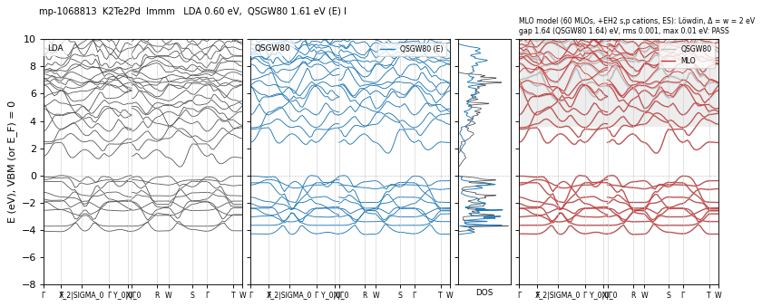

**mp-8623** K2Te2Pt — QSGW80 **1.84** N / M ≈ eV I  — ecalj b695fa65c (tf32, t_tetrakbt -300) — MLO PASS (b2) 59 gap 1.88 rms 0.001 max 0.01 (ecalj 614ab5eb8)

<small>runs: M 1.85 · N 1.84 (10-04)</small>

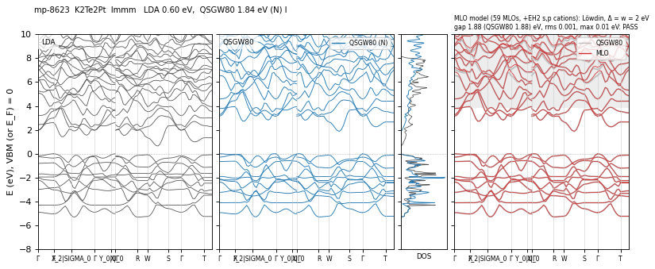

**mp-9200** K3AuO — QSGW80 **2.17** N / M ≈ eV I  — ecalj b695fa65c (tf32, t_tetrakbt -300) — MLO PASS (b1) 49 gap 2.17 rms 0.004 max 0.03 (ecalj 614ab5eb8)

<small>runs: M 2.17 · N 2.17 (10-03)</small>

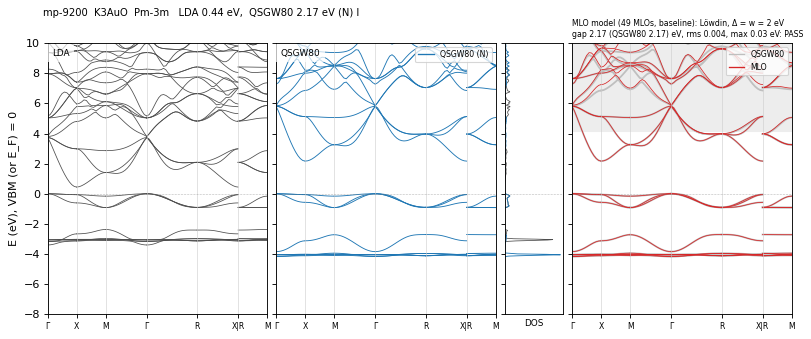

**mp-28166** K3BrO — QSGW80 **3.30** N / M 3.22 eV D differs — ecalj b695fa65c (tf32, t_tetrakbt -300) — MLO PASS (b2) 61 gap 3.30 rms 0.001 max 0.01 (ecalj fb2da026b)

<small>runs: M 3.22 · N 3.30 (10-04)</small>

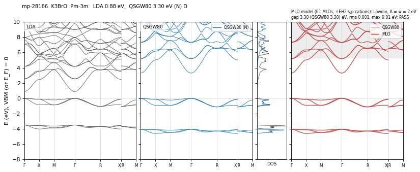

**mp-28171** K3IO — QSGW80 **3.26** N / M 3.17 eV D differs — ecalj b695fa65c (tf32, t_tetrakbt -300) — MLO PASS (b2) 61 gap 3.26 rms 0.001 max 0.01 (ecalj fb2da026b)

<small>runs: M 3.17 · N 3.26 (10-04)</small>

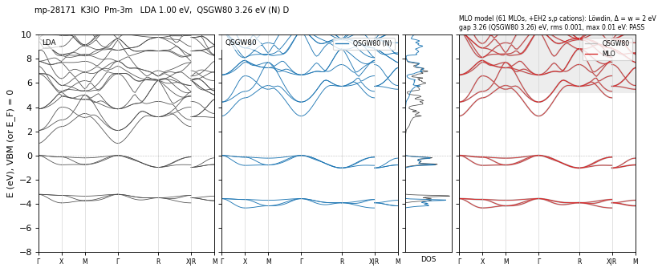

**mp-22958** KBrO3 — QSGW80 **6.65** N / M 6.97 eV D CHECK — ecalj b695fa65c (tf32, t_tetrakbt -300) — MLO PASS (b2) 37 gap 6.65 rms 0.001 max 0.00 (ecalj fb2da026b)

<small>runs: M 6.97 · N 6.65 (10-04)</small>

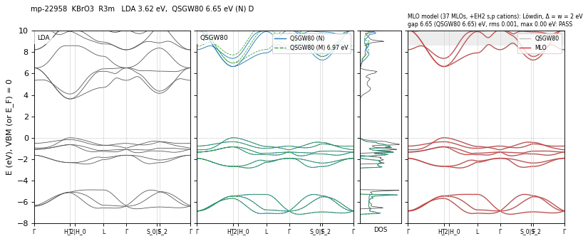

**mp-4950** KCaF3 — QSGW80 **10.41** N / R ≈ eV I  — ecalj b695fa65c (tf32, t_tetrakbt -300) — MLO PASS (b2) 44 gap 10.41 rms 0.001 max 0.01 (ecalj 614ab5eb8)

<small>runs: M 14.03 · R 10.41 (10-01) · N 10.41 (10-04)</small>

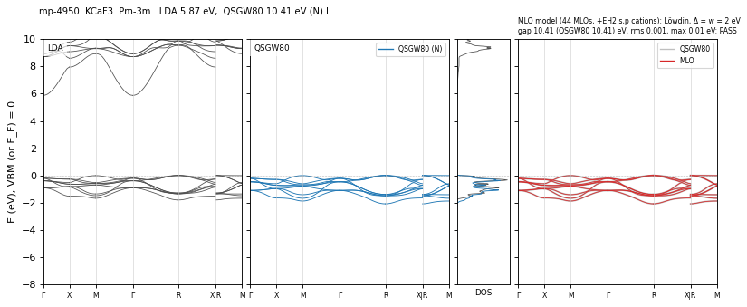

**mp-10175** KCdF3 — QSGW80 **7.06** N / M 6.90 eV I differs — ecalj b695fa65c (tf32, t_tetrakbt -300) — MLO PASS (b1) 33 gap 7.06 rms 0.001 max 0.02 (ecalj a1d6c0e11)

<small>runs: M 6.90 · N 7.06 (10-03)</small>

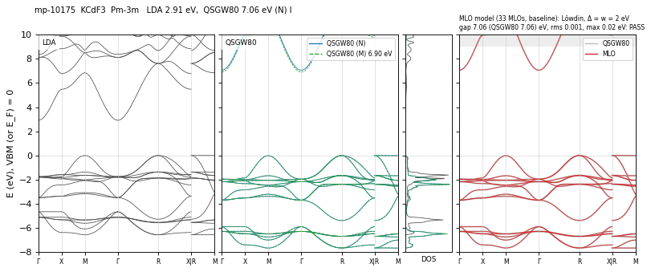

**mp-550506** KClO3 — QSGW80 **8.76** N / R ≈ eV I  — ecalj b695fa65c (tf32, t_tetrakbt -300) — MLO PASS (b2all) 53 gap 8.76 rms 0.002 max 0.01 (ecalj 614ab5eb8)

<small>runs: M 9.26 · R 8.76 (10-01) · N 8.76 (10-04)</small>

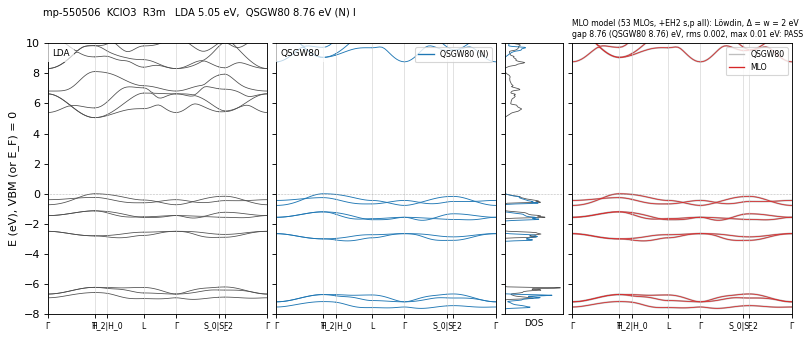

**mp-552729** KIO3 — QSGW80 **4.59** N / M ≈ eV D  — ecalj 989a18637 (tf32, t_tetrakbt -300) — MLO PASS (b1) 33 gap 4.59 rms 0.002 max 0.01 (ecalj fb2da026b)

<small>runs: M 4.55 · N 4.59 (10-03)</small>

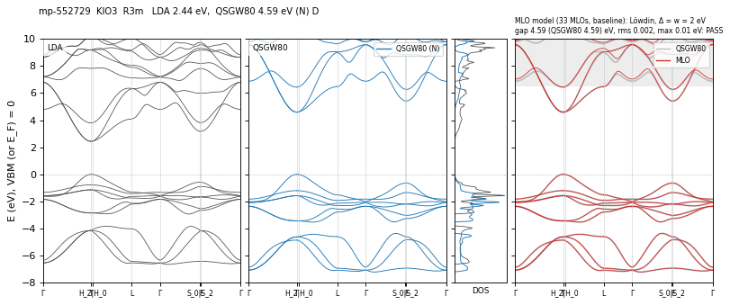

**mp-3448** KMgF3 — QSGW80 **12.00** N / R ≈ eV I  — ecalj b695fa65c (tf32, t_tetrakbt -300) — MLO PASS (b1) 33 gap 12.00 rms 0.003 max 0.08 (ecalj 614ab5eb8)

<small>runs: M 12.02 · R 12.00 (10-01) · N 12.00 (10-04)</small>

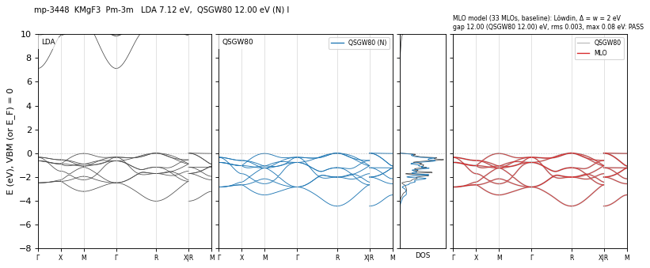

**mp-23737** KMgH3 — QSGW80 **5.36** N / M 5.29 eV I differs — ecalj b695fa65c (tf32, t_tetrakbt -300) — MLO PASS (b1) 33 gap 5.36 rms 0.002 max 0.01 (ecalj fb2da026b)

<small>runs: M 5.29 · N 5.36 (10-03)</small>

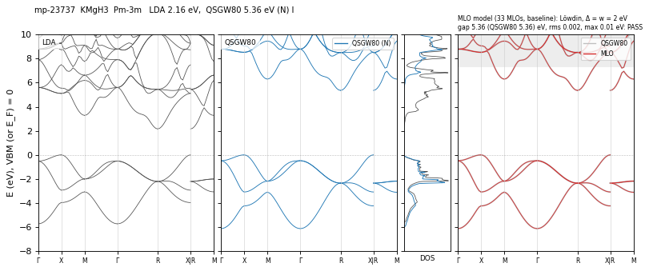

**mp-6920** KNO3 — QSGW80 **7.28** N / M 7.37 eV D differs — ecalj 989a18637 (tf32, t_tetrakbt -300) — MLO PASS (b2) 32 gap 7.29 rms 0.002 max 0.01 (ecalj fb2da026b)

<small>runs: M 7.37 · N 7.28 (10-03)</small>

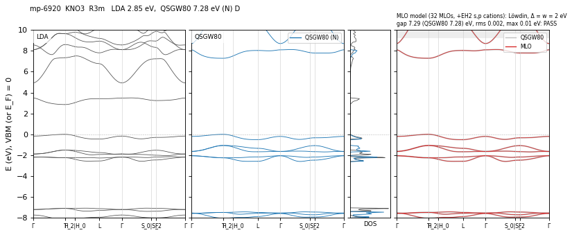

**mp-4342** KNbO3 — QSGW80 **2.87** N / M ≈ eV I  — ecalj b695fa65c (tf32, t_tetrakbt -300) — MLO PASS (b1) 33 gap 2.87 rms 0.001 max 0.01 (ecalj 614ab5eb8)

<small>runs: M 2.88 · N 2.87 (10-04)</small>

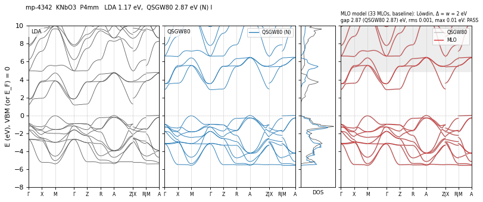

**mp-5246** KNbO3 — QSGW80 **3.41** N / M 3.46 eV I differs — ecalj b695fa65c (tf32, t_tetrakbt -300) — MLO PASS (b1) 33 gap 3.41 rms 0.001 max 0.01 (ecalj 614ab5eb8)

<small>runs: M 3.46 · N 3.41 (10-04)</small>

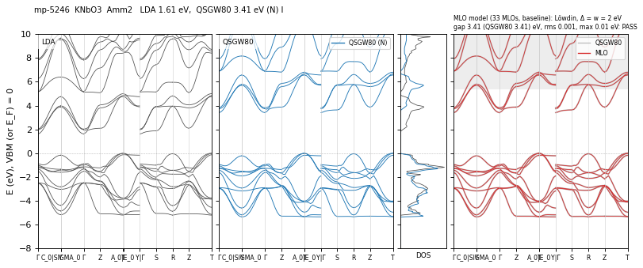

**mp-7375** KNbO3 — QSGW80 **3.69** N / M ≈ eV I  — ecalj b695fa65c (tf32, t_tetrakbt -300) — MLO PASS (b1) 33 gap 3.69 rms 0.001 max 0.01 (ecalj 614ab5eb8)

<small>runs: M 3.67 · N 3.69 (10-03)</small>

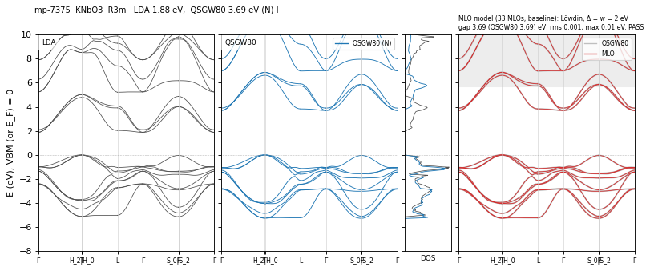

**mp-935811** KNbO3 — QSGW80 **2.70** N / M ≈ eV I  — ecalj b695fa65c (tf32, t_tetrakbt -300) — MLO PASS (b1) 33 gap 2.70 rms 0.001 max 0.00 (ecalj 614ab5eb8)

<small>runs: M 2.66 · N 2.70 (10-04)</small>

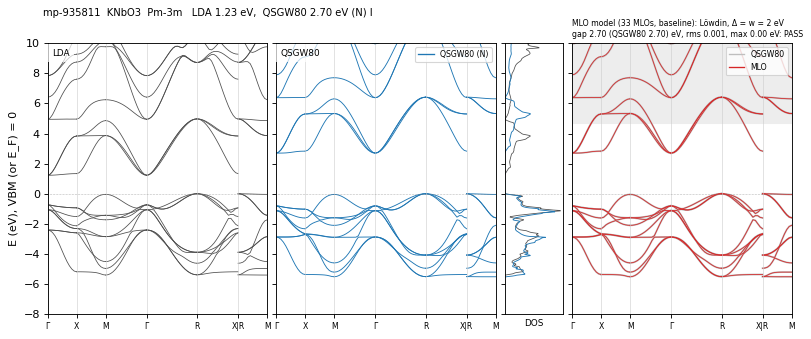

**mp-3614** KTaO3 — QSGW80 **3.94** N / M 4.00 eV I differs — ecalj 989a18637 (tf32, t_tetrakbt -300) — MLO PASS (b1) 33 gap 3.94 rms 0.001 max 0.00 (ecalj fb2da026b)

<small>runs: M 4.00 · N 3.94 (10-03)</small>

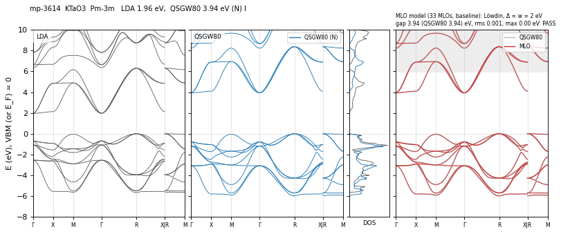

**mp-5878** KZnF3 — QSGW80 **8.41** N / M 8.19 eV I CHECK — ecalj b695fa65c (tf32, t_tetrakbt -300) — MLO PASS (b1) 33 gap 8.41 rms 0.000 max 0.01 (ecalj 614ab5eb8)

<small>runs: M 8.19 · N 8.41 (10-03)</small>

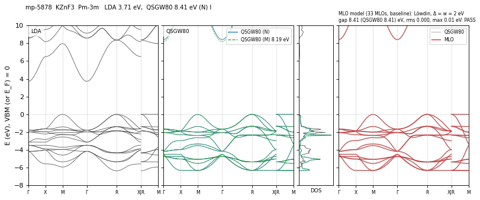

**mp-9610** Li2CN2 — QSGW80 **5.76** E / M 5.86 / N ≈ eV D differs — ecalj 614ab5eb8 (tf32, t_tetrakbt -300) with ES, ES rule es-a — MLO PASS (b2, ES) 32 gap 5.76 rms 0.004 max 0.05 (ecalj f481126f0)

<small>runs: M 5.86 · N 5.76 (10-03) · E 5.76 (10-05, ES 0, es-a)</small>

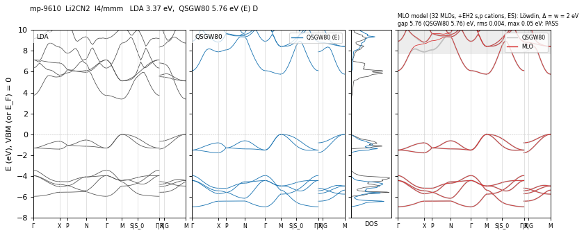

**mp-19183** Li2NiO2 — QSGW80 **2.81** N / R ≈ eV I  — ecalj b695fa65c (tf32, t_tetrakbt -300) — MLO PASS (b2) 33 gap 3.08 rms 0.002 max 0.02 (ecalj fb2da026b)

<small>runs: M 3.78 · R 2.78 (10-01) · N 2.81 (10-04)</small>

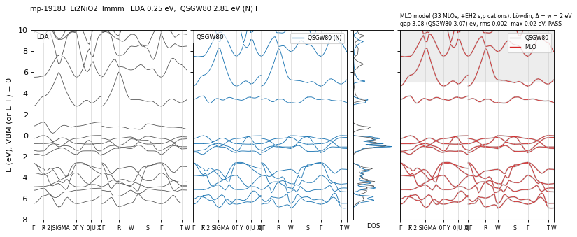

**mp-7608** Li2PdO2 — QSGW80 **3.57** N / M ≈ eV I  — ecalj b695fa65c (tf32, t_tetrakbt -300) — MLO PASS (b1) 25 gap 3.54 rms 0.001 max 0.01 (ecalj 614ab5eb8)

<small>runs: M 3.54 · N 3.57 (10-03)</small>

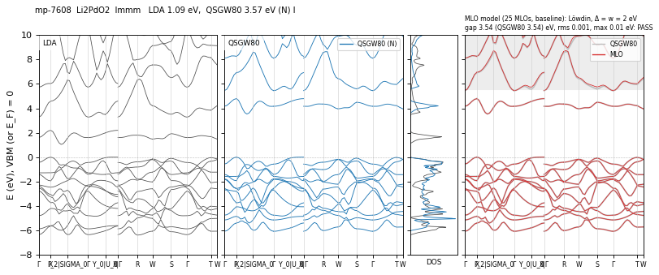

**mp-3216** Li2ZrN2 — QSGW80 **3.02** N / M ≈ eV I  — ecalj b695fa65c (tf32, t_tetrakbt -300) — MLO PASS (b1) 25 gap 3.02 rms 0.001 max 0.00 (ecalj 614ab5eb8)

<small>runs: M 2.99 · N 3.02 (10-04)</small>

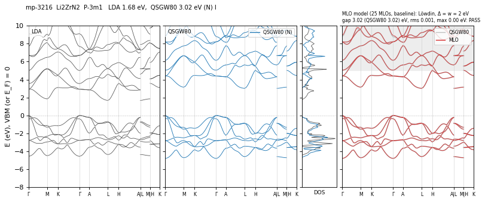

**mp-28593** Li3BrO — QSGW80 **7.16** N / R ≈ eV D  — ecalj b695fa65c (tf32, t_tetrakbt -300) — MLO PASS (b1) 25 gap 7.16 rms 0.005 max 0.08 (ecalj fb2da026b)

<small>runs: M 7.03 · R 7.16 (10-01) · N 7.16 (10-04)</small>

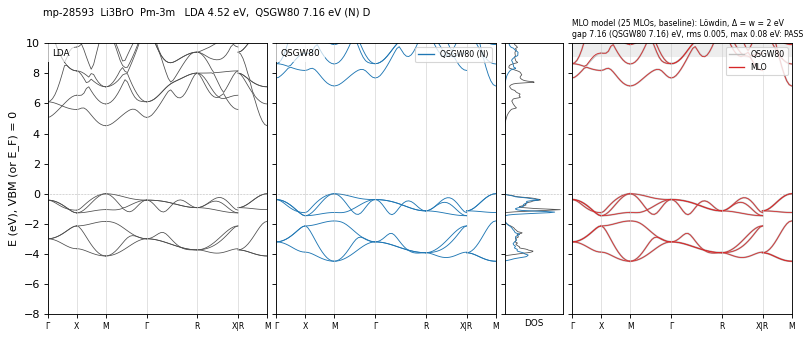

**mp-2646** Mg3Sb2 — QSGW80 **0.86** N / M ≈ eV I  — ecalj b695fa65c (tf32, t_tetrakbt -300) — MLO PASS (b2) 57 gap 0.82 rms 0.002 max 0.01 (ecalj fb2da026b)

<small>runs: M 0.85 · N 0.86 (10-04)</small>

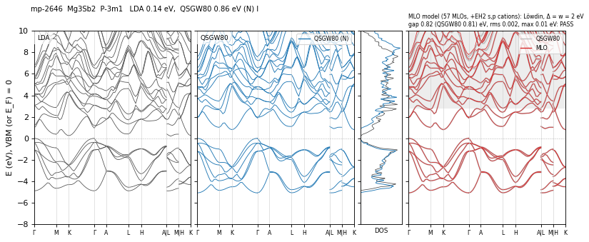

**mp-9514** MgAl2C2 — QSGW80 **2.58** N / M ≈ eV I  — ecalj b695fa65c (tf32, t_tetrakbt -300) — MLO PASS (b1) 35 gap 2.57 rms 0.002 max 0.03 (ecalj 614ab5eb8)

<small>runs: M 2.57 · N 2.58 (10-04)</small>

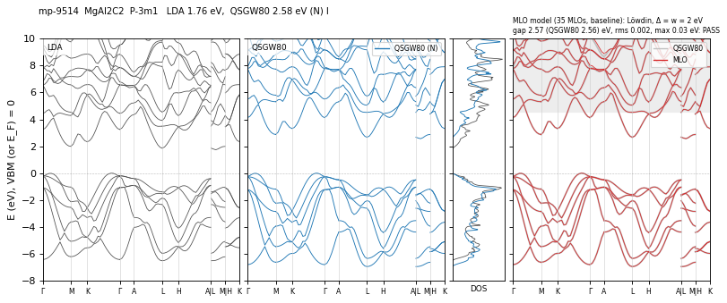

**mp-865185** MgBe2As2 — QSGW80 **1.38** N / M ≈ · path 1.16 eV I path<mesh(mesh) — ecalj b695fa65c (tf32, t_tetrakbt -300) — MLO PASS (b1) 35 gap 1.17 rms 0.004 max 0.04 (ecalj 614ab5eb8)

<small>runs: M 1.38 · N 1.38 (10-04)</small>

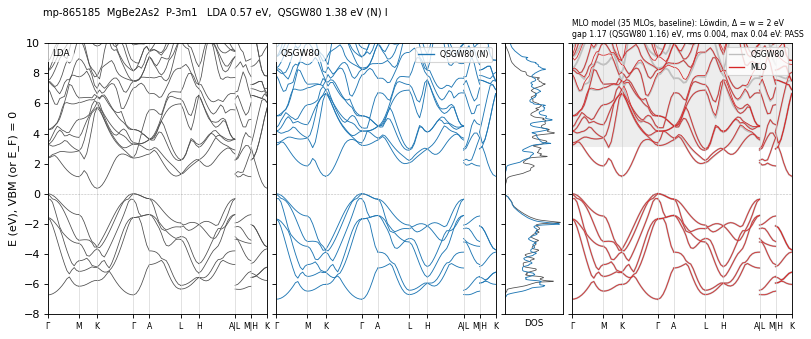

**mp-11917** MgBe2N2 — QSGW80 **5.97** N / M 5.87 eV I differs — ecalj b695fa65c (tf32, t_tetrakbt -300) — MLO PASS (b1) 25 gap 5.97 rms 0.002 max 0.01 (ecalj a1d6c0e11)

<small>runs: M 5.87 · N 5.97 (10-04)</small>

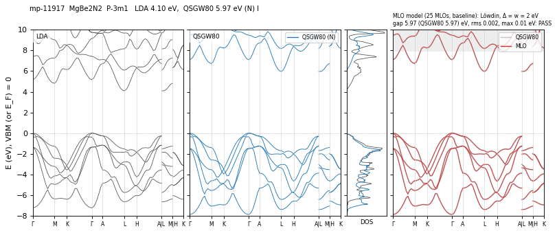

**mp-1017628** MgBe2P2 — QSGW80 **1.74** N / M ≈ · path 1.52 eV I path<mesh(mesh) — ecalj b695fa65c (tf32, t_tetrakbt -300) — MLO PASS (b1) 35 gap 1.52 rms 0.002 max 0.02 (ecalj a1d6c0e11)

<small>runs: M 1.74 · N 1.74 (10-04)</small>

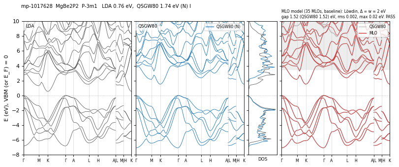

**mp-30247** MgH2O2 — QSGW80 **8.15** N / R ≈ eV D  — ecalj b695fa65c (tf32, t_tetrakbt -300) — MLO PASS (b2) 37 gap 8.15 rms 0.005 max 0.04 (ecalj 614ab5eb8)

<small>runs: M 8.02 · R 8.15 (10-01) · N 8.15 (10-04)</small>

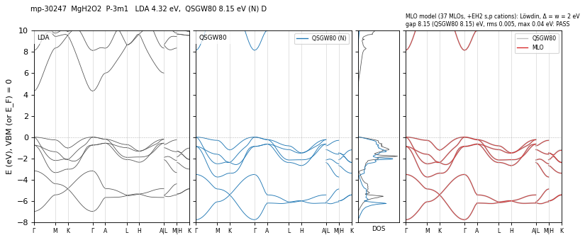

**mp-541989** Na2CN2 — QSGW80 **5.57** N / R ≈ eV I  — ecalj b695fa65c (tf32, t_tetrakbt -300) — MLO PASS (b1) 30 gap 5.57 rms 0.004 max 0.05 (ecalj 614ab5eb8)

<small>runs: M 5.45 · R 5.57 (10-01) · N 5.57 (10-04)</small>

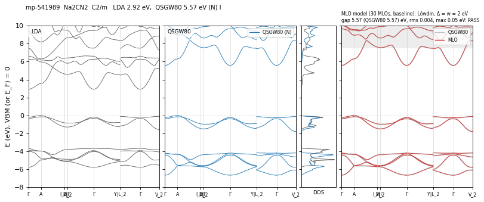

**mp-4961** Na2HgO2 — QSGW80 **3.79** N / R ≈ eV I  — ecalj b695fa65c (tf32, t_tetrakbt -300) — MLO PASS (b2) 47 gap 3.77 rms 0.003 max 0.03 (ecalj 614ab5eb8)

<small>runs: M 4.96 · R 3.79 (10-01) · N 3.79 (10-04)</small>

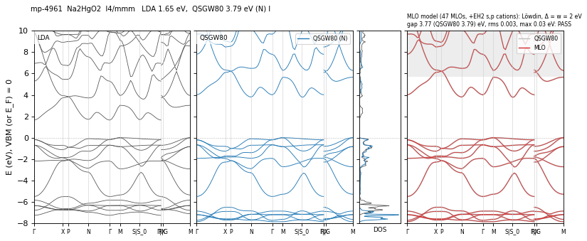

**mp-4823** Na2PdC2 — QSGW80 **2.12** N / M ≈ eV I  — ecalj b695fa65c (tf32, t_tetrakbt -300) — MLO PASS (b1) 35 gap 2.14 rms 0.009 max 0.08 (ecalj 614ab5eb8)

<small>runs: M 2.12 · N 2.12 (10-03)</small>

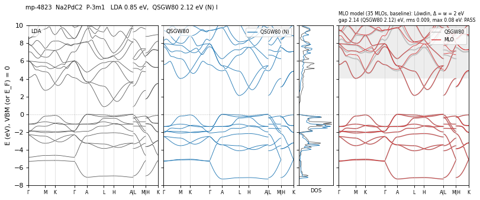

**mp-4366** Na2PtC2 — QSGW80 **1.36** N / M ≈ eV I  — ecalj b695fa65c (tf32, t_tetrakbt -300) — MLO PASS (b1) 35 gap 1.38 rms 0.008 max 0.06 (ecalj 614ab5eb8)

<small>runs: M 1.37 · N 1.36 (10-03)</small>

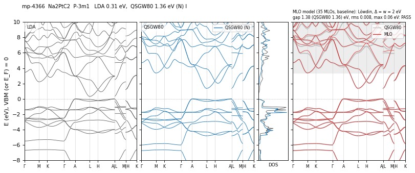

**mp-22313** Na2PtO2 — QSGW80 **3.84** N / M ≈ eV I  — ecalj b695fa65c (tf32, t_tetrakbt -300) — MLO PASS (b1) 35 gap 3.81 rms 0.002 max 0.02 (ecalj fb2da026b)

<small>runs: M 3.81 · N 3.84 (10-04)</small>

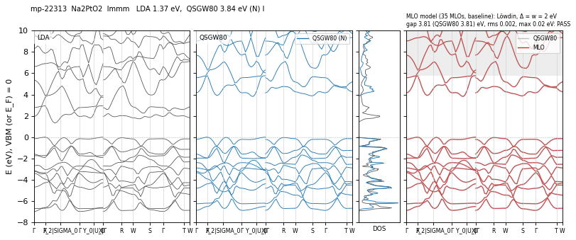

**mp-28602** Na3ClO — QSGW80 **5.20** N / M 5.01 eV D differs — ecalj b695fa65c (tf32, t_tetrakbt -300) — MLO PASS (b1) 40 gap 5.20 rms 0.002 max 0.03 (ecalj fb2da026b)

<small>runs: M 5.01 · N 5.20 (10-04)</small>

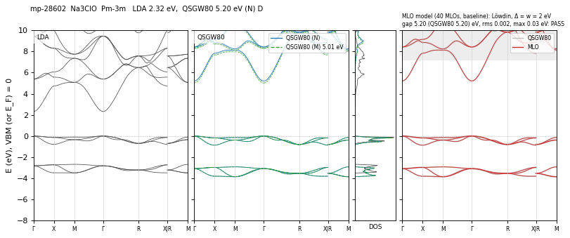

**mp-560399** NaMgF3 — QSGW80 **10.72** N / R ≈ eV I  — ecalj b695fa65c (tf32, t_tetrakbt -300) — MLO PASS (b1) 30 gap 10.72 rms 0.000 max 0.01 (ecalj 614ab5eb8)

<small>runs: M 11.12 · R 10.72 (10-01) · N 10.72 (10-04)</small>

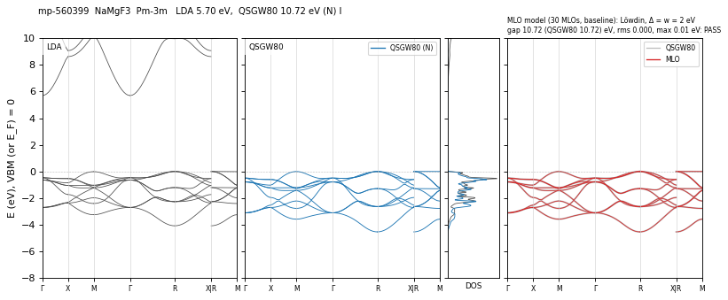

**mp-3136** NaNbO3 — QSGW80 **2.82** N / M ≈ eV I  — ecalj b695fa65c (tf32, t_tetrakbt -300) — MLO PASS (b1) 30 gap 2.82 rms 0.001 max 0.00 (ecalj 614ab5eb8)

<small>runs: M 2.84 · N 2.82 (10-04)</small>

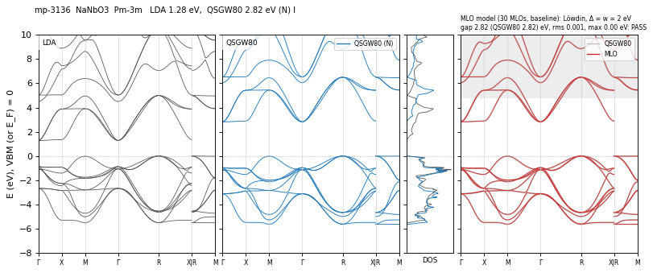

**mp-4170** NaTaO3 — QSGW80 **4.22** N / M ≈ eV I  — ecalj b695fa65c (tf32, t_tetrakbt -300) — MLO PASS (b1) 30 gap 4.23 rms 0.001 max 0.00 (ecalj 614ab5eb8)

<small>runs: M 4.18 · N 4.22 (10-04)</small>

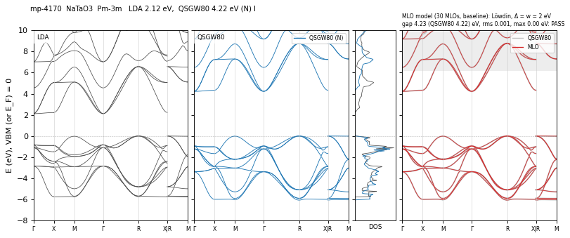

**mp-12725** NbAgO3 — QSGW80 **2.44** N / R ≈ eV I  — ecalj 989a18637 (tf32, t_tetrakbt -300) — MLO PASS (b1) 30 gap 2.44 rms 0.000 max 0.00 (ecalj a1d6c0e11)

<small>runs: M FAILED · R 2.44 (09-30) · N 2.44 (10-03)</small>

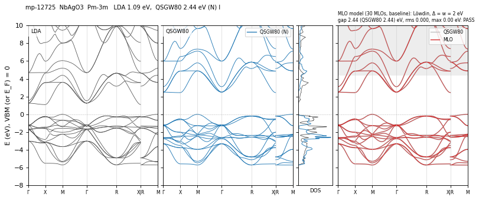

**mp-551905** OsO4 — QSGW80 **6.25** E / N 6.33 / R 6.33 eV I differs — ecalj 0601771b4 (tf32, t_tetrakbt -300) with ES, ES rule es-c — MLO PASS (b1, ES) 28 gap 6.25 rms 0.001 max 0.00 (ecalj f16f0ea3d)

<small>runs: M 8.95 · R 6.33 (10-01) · N 6.33 (10-04) · E 6.25 (10-06, ES 3, es-c)</small>

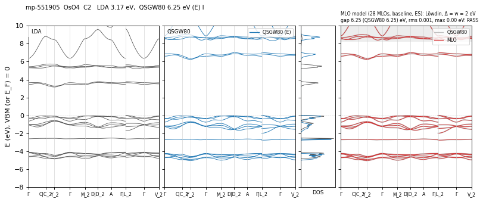

**mp-341** PbF4 — QSGW80 **5.13** N / R ≈ eV I  — ecalj b695fa65c (tf32, t_tetrakbt -300) — MLO PASS (b1) 30 gap 5.13 rms 0.001 max 0.01 (ecalj 614ab5eb8)

<small>runs: M 5.36 · R 5.13 (10-01) · N 5.13 (10-04)</small>

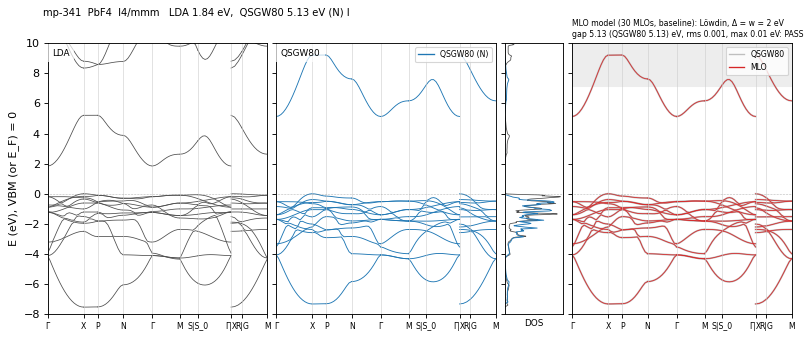

**mp-1069193** PdN2Cl2 — QSGW80 **1.26** E / M ≈ / N ≈ eV I  — ecalj 614ab5eb8 (tf32, t_tetrakbt -300) with ES, ES rule es-a — MLO PASS (b1, ES) 40 gap 1.26 rms 0.000 max 0.00 (ecalj 7827f9424)

<small>runs: M 1.23 · N 1.23 (10-03) · E 1.26 (10-05, ES 2, es-a)</small>

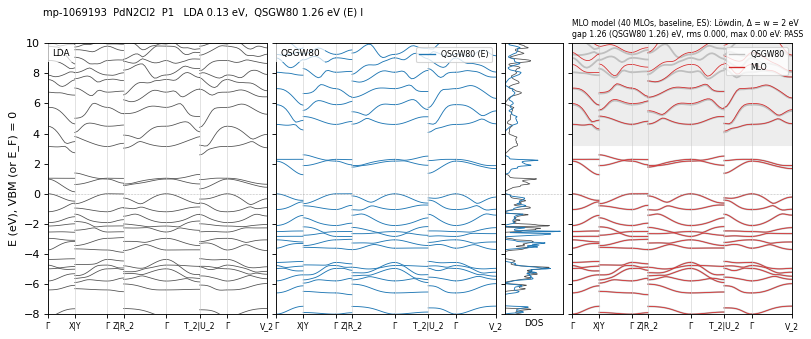

**mp-5072** Rb2HgO2 — QSGW80 **4.46** N / R ≈ eV D  — ecalj b695fa65c (tf32, t_tetrakbt -300) — MLO PASS (b2) 53 gap 4.46 rms 0.001 max 0.01 (ecalj 614ab5eb8)

<small>runs: M 3.98 · R 4.46 (10-01) · N 4.46 (10-04)</small>

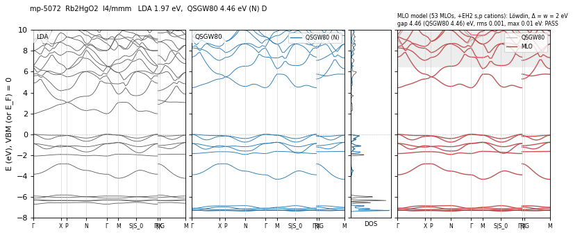

**mp-10918** Rb2PdC2 — QSGW80 **3.06** N / M 2.90 eV D differs — ecalj b695fa65c (tf32, t_tetrakbt -300) — MLO PASS (b2) 57 gap 3.06 rms 0.002 max 0.02 (ecalj a1d6c0e11)

<small>runs: M 2.90 · N 3.06 (10-03)</small>

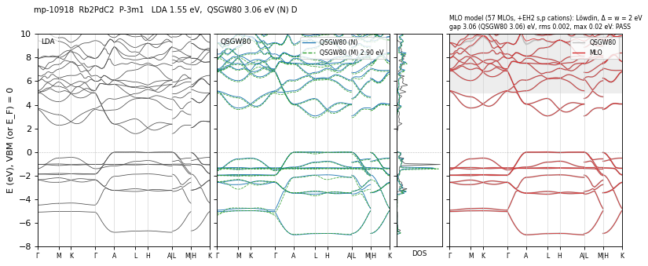

**mp-1069771** Rb2PdSe2 — QSGW80 **2.21** N / M ≈ eV I  — ecalj b695fa65c (tf32, t_tetrakbt -300) — MLO PASS (b1) 51 gap 2.26 rms 0.003 max 0.04 (ecalj a1d6c0e11)

<small>runs: M 2.19 · N 2.21 (10-04)</small>

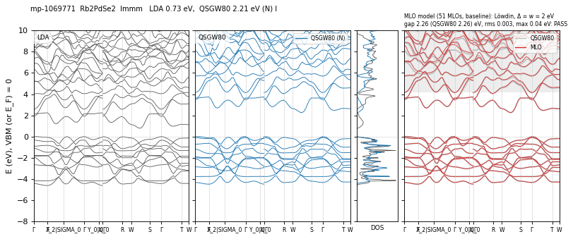

**mp-10919** Rb2PtC2 — QSGW80 **2.31** N / M ≈ eV D  — ecalj b695fa65c (tf32, t_tetrakbt -300) — MLO PASS (b2) 57 gap 2.31 rms 0.001 max 0.01 (ecalj a1d6c0e11)

<small>runs: M 2.36 · N 2.31 (10-04)</small>

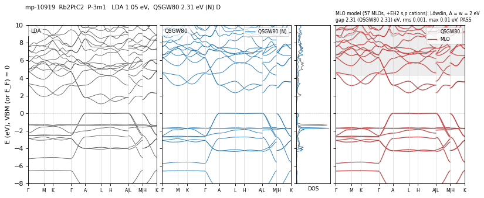

**mp-7929** Rb2PtS2 — QSGW80 **2.80** N / M ≈ eV I  — ecalj b695fa65c (tf32, t_tetrakbt -300) — MLO PASS (b1) 51 gap 2.85 rms 0.006 max 0.06 (ecalj 614ab5eb8)

<small>runs: M 2.76 · N 2.80 (10-04)</small>

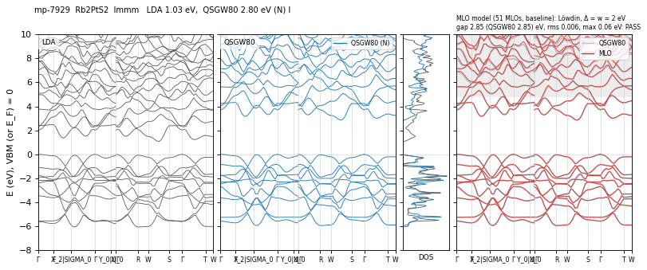

**mp-8622** Rb2PtSe2 — QSGW80 **2.41** N / M ≈ eV I  — ecalj b695fa65c (tf32, t_tetrakbt -300) — MLO PASS (b2) 59 gap 2.47 rms 0.001 max 0.01 (ecalj 614ab5eb8)

<small>runs: M 2.40 · N 2.41 (10-04)</small>

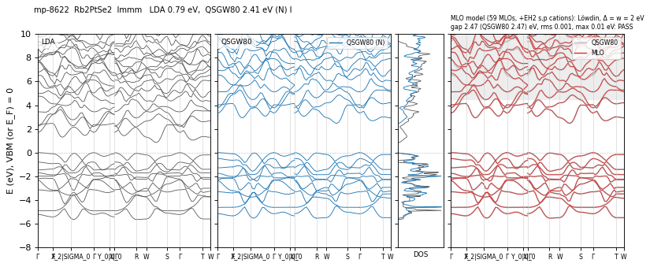

**mp-1070356** Rb2Te2Pd — QSGW80 **1.41** N / M ≈ eV I  — ecalj b695fa65c (tf32, t_tetrakbt -300) — MLO PASS (b2) 59 gap 1.46 rms 0.001 max 0.01 (ecalj a1d6c0e11)

<small>runs: M 1.41 · N 1.41 (10-04)</small>

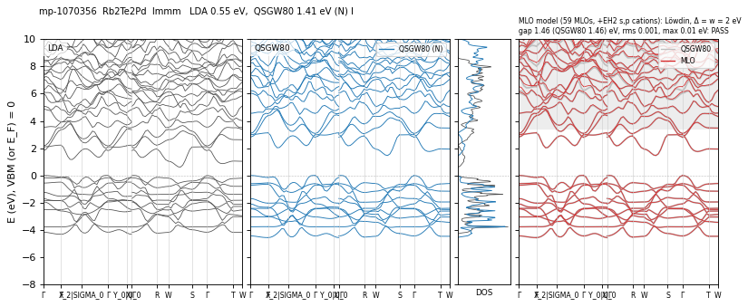

**mp-1070498** Rb2Te2Pt — QSGW80 **2.07** N / M ≈ eV I  — ecalj b695fa65c (tf32, t_tetrakbt -300) — MLO PASS (b2) 59 gap 2.10 rms 0.001 max 0.01 (ecalj a1d6c0e11)

<small>runs: M 2.09 · N 2.07 (10-04)</small>

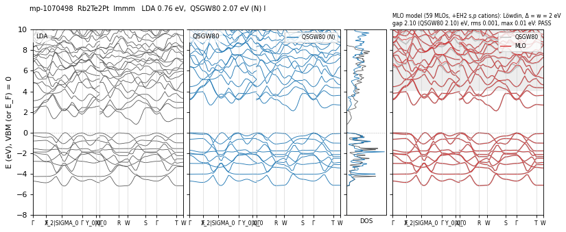

**mp-4405** Rb3AuO — QSGW80 **1.74** N / M 1.85 eV I differs — ecalj b695fa65c (tf32, t_tetrakbt -300) — MLO PASS (b1) 49 gap 1.74 rms 0.008 max 0.07 (ecalj 614ab5eb8)

<small>runs: M 1.85 · N 1.74 (10-04)</small>

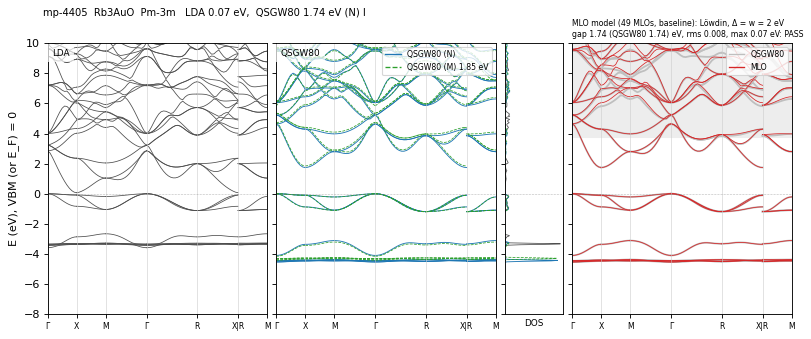

**mp-30055** Rb3BrO — QSGW80 **2.60** N / M ≈ eV D  — ecalj b695fa65c (tf32, t_tetrakbt -300) — MLO PASS (b2) 61 gap 2.60 rms 0.001 max 0.00 (ecalj 614ab5eb8)

<small>runs: M 2.58 · N 2.60 (10-04)</small>

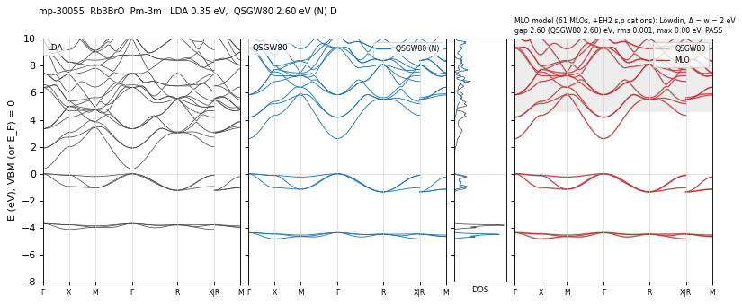

**mp-28872** RbBrO3 — QSGW80 **6.82** N / M 6.92 eV D differs — ecalj b695fa65c (tf32, t_tetrakbt -300) — MLO PASS (b2) 37 gap 6.82 rms 0.001 max 0.01 (ecalj fb2da026b)

<small>runs: M 6.92 · N 6.82 (10-04)</small>

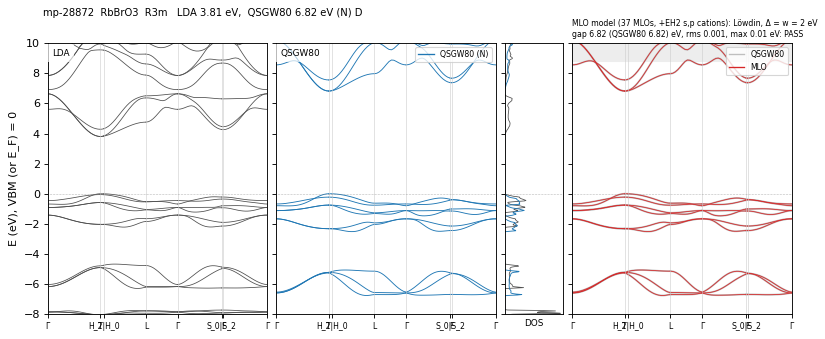

**mp-3654** RbCaF3 — QSGW80 **10.75** N / M 10.59 eV I differs — ecalj b695fa65c (tf32, t_tetrakbt -300) — MLO PASS (b1) 36 gap 10.75 rms 0.005 max 0.09 (ecalj 614ab5eb8)

<small>runs: M 10.59 · N 10.75 (10-03)</small>

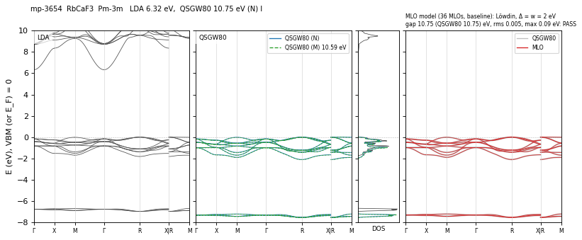

**mp-23949** RbCaH3 — QSGW80 **6.24** N / M ≈ eV I  — ecalj b695fa65c (tf32, t_tetrakbt -300) — MLO PASS (b1) 33 gap 6.24 rms 0.022 max 0.08 (ecalj fb2da026b)

<small>runs: M 6.24 · N 6.24 (10-04)</small>

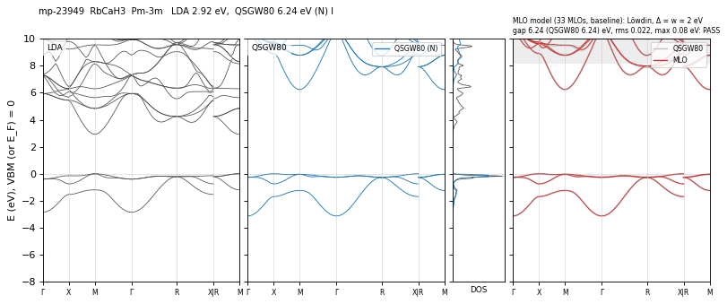

**mp-6951** RbCdF3 — QSGW80 **7.04** N / R ≈ eV I  — ecalj b695fa65c (tf32, t_tetrakbt -300) — MLO PASS (b1) 33 gap 7.04 rms 0.001 max 0.01 (ecalj 614ab5eb8)

<small>runs: M 7.41 · R 7.04 (10-01) · N 7.04 (10-04)</small>

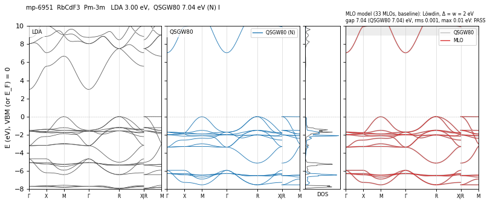

**mp-23011** RbClO3 — QSGW80 **8.81** N / R ≈ eV I  — ecalj b695fa65c (tf32, t_tetrakbt -300) — MLO PASS (b2all) 53 gap 8.81 rms 0.002 max 0.01 (ecalj fb2da026b)

<small>runs: M FAILED · R 8.81 (09-30) · N 8.81 (10-04)</small>

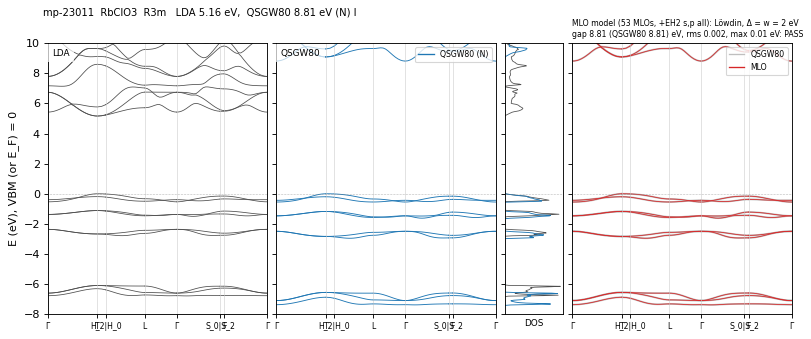

**mp-571458** RbGeI3 — QSGW80 **1.10** N / M ≈ eV D  — ecalj b695fa65c (tf32, t_tetrakbt -300) — MLO PASS (b1) 48 gap 1.10 rms 0.002 max 0.01 (ecalj 614ab5eb8)

<small>runs: M 1.11 · N 1.10 (10-03)</small>

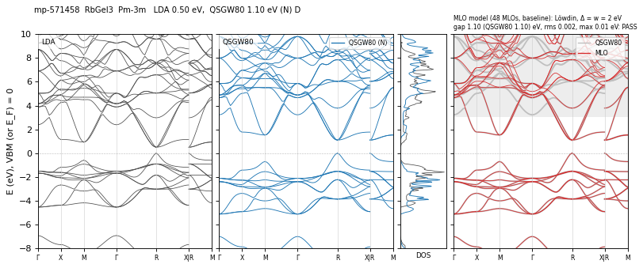

**mp-7482** RbHgF3 — QSGW80 **3.56** N / M 3.42 eV I differs — ecalj b695fa65c (tf32, t_tetrakbt -300) — MLO PASS (b1) 33 gap 3.56 rms 0.000 max 0.00 (ecalj 614ab5eb8)

<small>runs: M 3.42 · N 3.56 (10-04)</small>

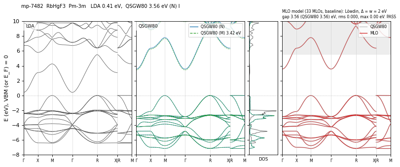

**mp-27193** RbIO3 — QSGW80 **4.99** N / M ≈ eV D  — ecalj b695fa65c (tf32, t_tetrakbt -300) — MLO PASS (b1) 33 gap 4.99 rms 0.001 max 0.01 (ecalj fb2da026b)

<small>runs: M 4.96 · N 4.99 (10-04)</small>

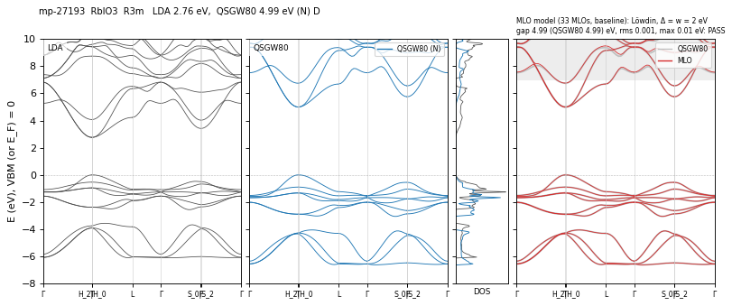

**mp-8402** RbMgF3 — QSGW80 **11.85** N / M 12.01 eV I differs — ecalj 989a18637 (tf32, t_tetrakbt -300) — MLO PASS (b1) 33 gap 11.85 rms 0.002 max 0.04 (ecalj fb2da026b)

<small>runs: M 12.01 · N 11.85 (10-03)</small>

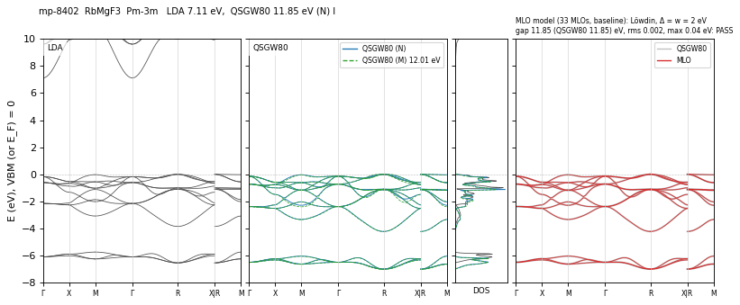

**mp-21043** RbPbF3 — QSGW80 **5.53** N / M 5.72 eV I differs — ecalj 989a18637 (tf32, t_tetrakbt -300) — MLO PASS (b2) 46 gap 5.53 rms 0.001 max 0.01 (ecalj fb2da026b)

<small>runs: M 5.72 · N 5.53 (10-03)</small>

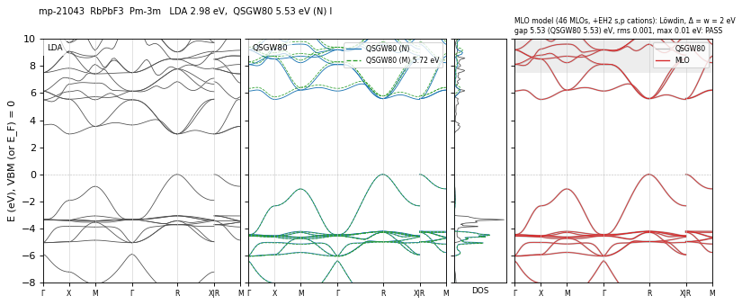

**mp-3525** Sb2Te2Se — QSGW80 **0.35** N / M ≈ eV D  — ecalj b695fa65c (tf32, t_tetrakbt -300) — MLO PASS (b1) 45 gap 0.35 rms 0.002 max 0.01 (ecalj 614ab5eb8)

<small>runs: M 0.35 · N 0.35 (10-04)</small>

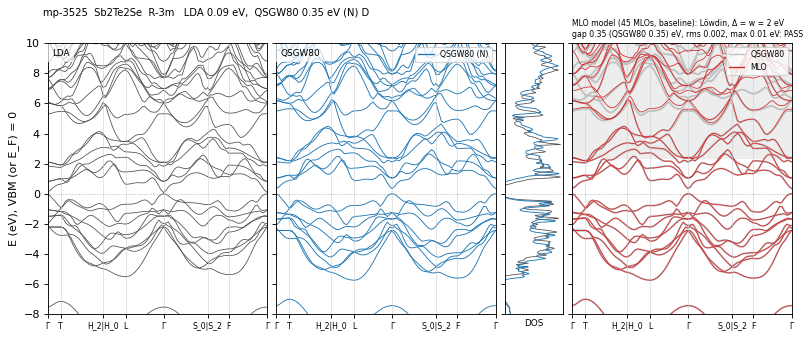

**mp-1201** Sb2Te3 — QSGW80 **0.49** N / M ≈ eV D  — ecalj b695fa65c (tf32, t_tetrakbt -300) — MLO PASS (b1) 45 gap 0.49 rms 0.002 max 0.02 (ecalj a1d6c0e11)

<small>runs: M 0.50 · N 0.49 (10-04)</small>

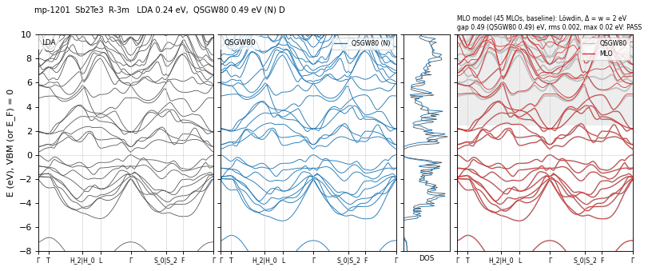

**mp-571550** Sb2TeSe2 — QSGW80 **0.89** N / M 0.81 eV D differs — ecalj b695fa65c (tf32, t_tetrakbt -300) — MLO PASS (b1) 45 gap 0.92 rms 0.002 max 0.02 (ecalj 614ab5eb8)

<small>runs: M 0.81 · N 0.89 (10-04)</small>

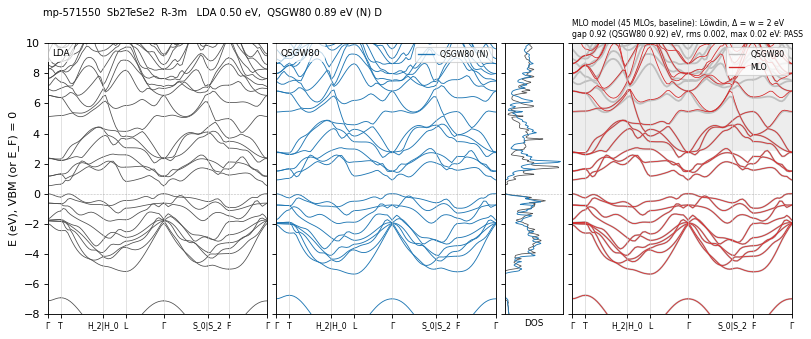

**mp-8612** Sb2TeSe2 — QSGW80 **0.73** N / M ≈ eV I  — ecalj b695fa65c (tf32, t_tetrakbt -300) — MLO PASS (b1) 45 gap 0.71 rms 0.002 max 0.02 (ecalj 614ab5eb8)

<small>runs: M 0.73 · N 0.73 (10-04)</small>

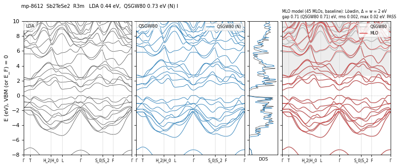

**mp-1818** SiF4 — QSGW80 **12.99** E / M ≈ / N 13.11 eV I differs — ecalj 0601771b4 (tf32, t_tetrakbt -300) with ES, ES rule es-c — MLO PASS (b1, ES) 28 gap 12.99 rms 0.001 max 0.01 (ecalj f16f0ea3d)

<small>runs: M 13.02 · N 13.11 (10-04) · E 12.99 (10-06, ES 3, es-c)</small>

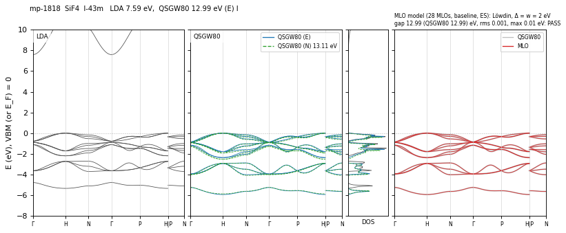

**mp-2706** SnF4 — QSGW80 **7.47** N / M 7.30 eV I differs — ecalj 989a18637 (tf32, t_tetrakbt -300) — MLO PASS (b1) 30 gap 7.48 rms 0.002 max 0.02 (ecalj fb2da026b)

<small>runs: M 7.30 · N 7.47 (10-03)</small>

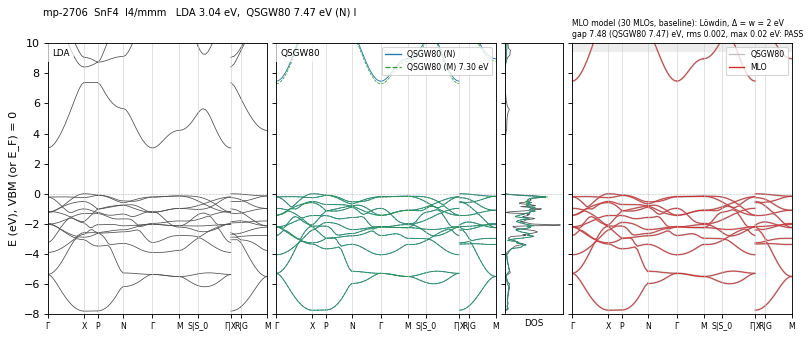

**mp-571436** SnI4 — QSGW80 **3.24** E / M 3.36 / N 3.33 eV I differs — ecalj 614ab5eb8 (tf32, t_tetrakbt -300) with ES, ES rule es-a — MLO PASS (b1, ES) 52 gap 3.24 rms 0.000 max 0.00 (ecalj 7827f9424)

<small>runs: M 3.36 · N 3.33 (10-04) · E 3.24 (10-05, ES 7, es-a)</small>

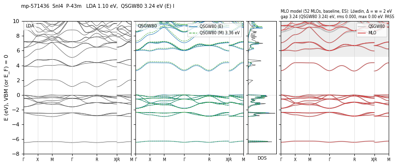

**mp-1069819** SnN2F2 — QSGW80 **4.14** E / M 3.61 / N ≈ eV D CHECK — ecalj 0601771b4 (tf32, t_tetrakbt -300) with ES, ES rule es-c — MLO PASS (b1, ES) 32 gap 4.15 rms 0.009 max 0.05 (ecalj f16f0ea3d)

<small>runs: M 3.61 · N 4.12 (10-03) · E 4.14 (10-06, ES 2, es-c)</small>

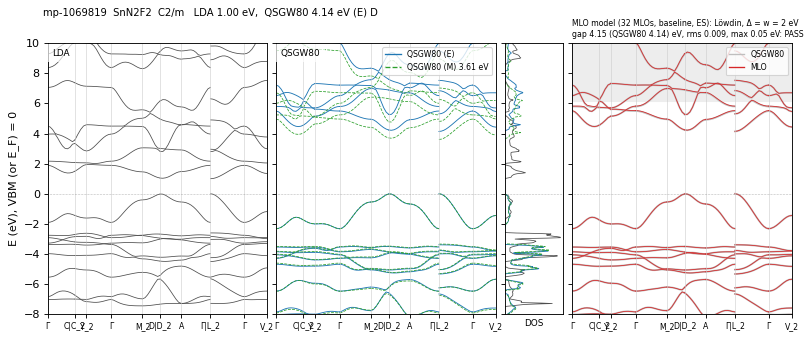

**mp-9306** Sr2ZnN2 — QSGW80 **1.81** N / M 1.63 eV D differs — ecalj b695fa65c (tf32, t_tetrakbt -300) — MLO PASS (b2) 47 gap 1.81 rms 0.002 max 0.02 (ecalj 614ab5eb8)

<small>runs: M 1.63 · N 1.81 (10-04)</small>

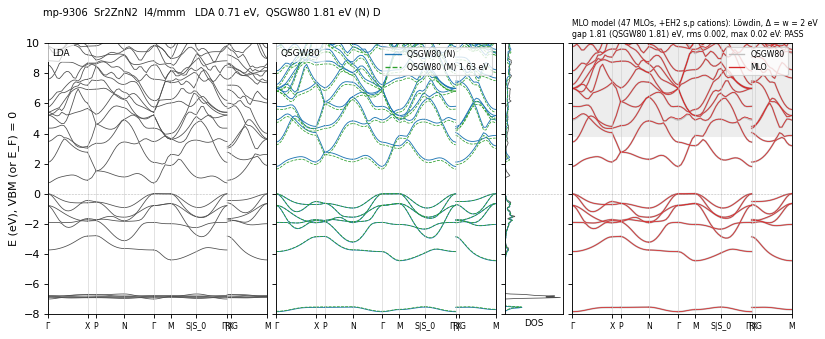

**mp-570008** Sr3BiN — QSGW80 **1.02** N / M ≈ eV D  — ecalj b695fa65c (tf32, t_tetrakbt -300) — MLO PASS (b1) 40 gap 1.02 rms 0.002 max 0.03 (ecalj 614ab5eb8)

<small>runs: M 1.01 · N 1.02 (10-03)</small>

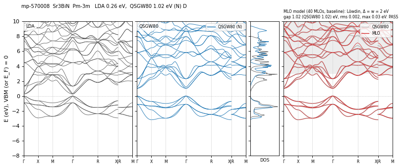

**mp-7752** Sr3SbN — QSGW80 **1.07** N / M ≈ eV D  — ecalj b695fa65c (tf32, t_tetrakbt -300) — MLO PASS (b1) 40 gap 1.07 rms 0.001 max 0.01 (ecalj 614ab5eb8)

<small>runs: M 1.06 · N 1.07 (10-04)</small>

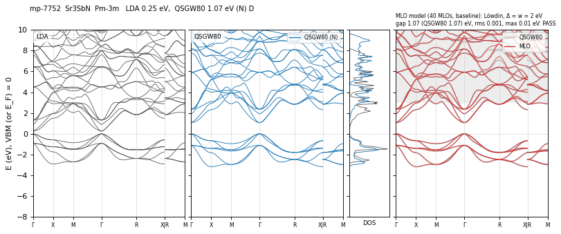

**mp-1068011** SrAlH3 — QSGW80 **1.21** N / M ≈ eV I  — ecalj b695fa65c (tf32, t_tetrakbt -300) — MLO PASS (b1) 30 gap 1.21 rms 0.001 max 0.01 (ecalj a1d6c0e11)

<small>runs: M 1.20 · N 1.21 (10-04)</small>

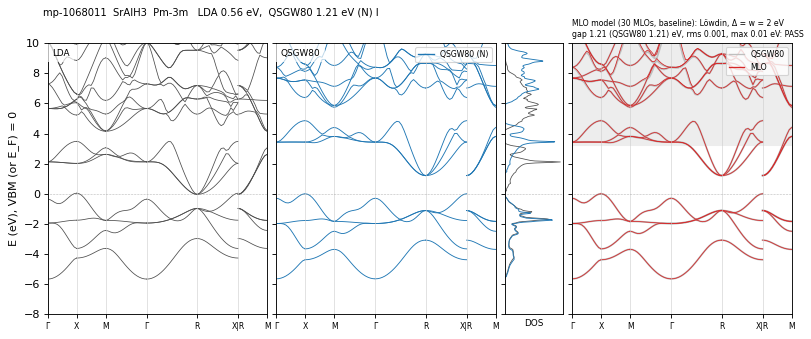

**mp-7771** SrCd2As2 — QSGW80 **0.87** N / M ≈ eV D  — ecalj b695fa65c (tf32, t_tetrakbt -300) — MLO PASS (b2) 57 gap 0.87 rms 0.001 max 0.01 (ecalj 614ab5eb8)

<small>runs: M 0.88 · N 0.87 (10-04)</small>

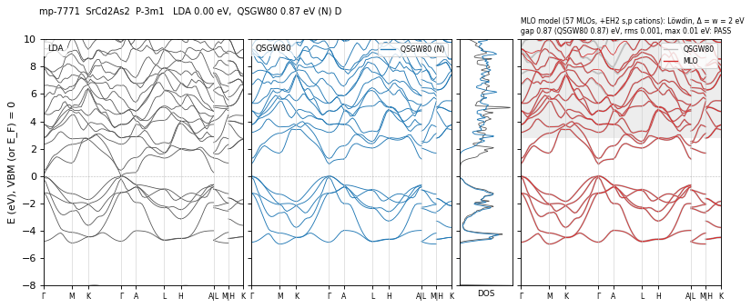

**mp-8277** SrCd2P2 — QSGW80 **1.40** N / M ≈ eV D  — ecalj b695fa65c (tf32, t_tetrakbt -300) — MLO PASS (b2) 57 gap 1.40 rms 0.001 max 0.00 (ecalj 614ab5eb8)

<small>runs: M 1.40 · N 1.40 (10-04)</small>

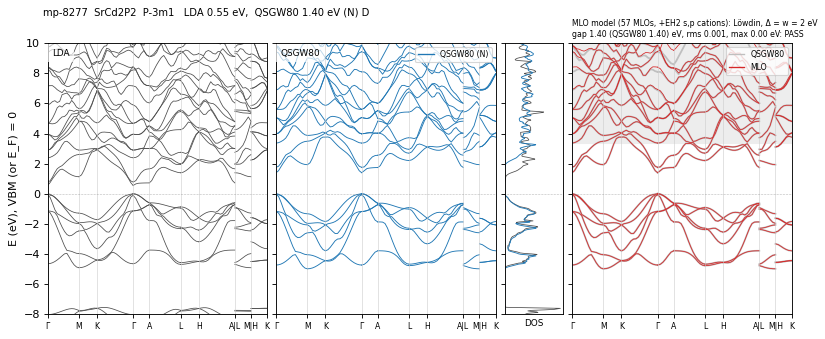

**mp-4551** SrHfO3 — QSGW80 **6.23** N / M 6.14 eV I differs — ecalj b695fa65c (tf32, t_tetrakbt -300) — MLO PASS (b1) 40 gap 6.23 rms 0.001 max 0.01 (ecalj 614ab5eb8)

<small>runs: M 6.14 · N 6.23 (10-04)</small>

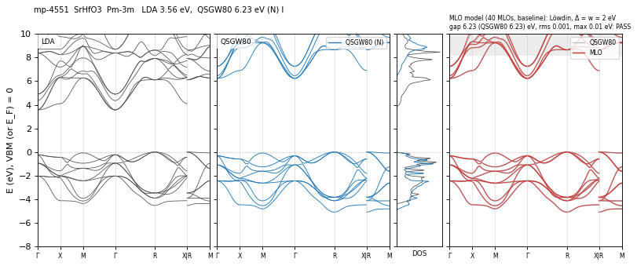

**mp-24419** SrLiH3 — QSGW80 **4.27** N / M 4.35 eV I differs — ecalj b695fa65c (tf32, t_tetrakbt -300) — MLO PASS (b2) 48 gap 4.27 rms 0.004 max 0.02 (ecalj fb2da026b)

<small>runs: M 4.35 · N 4.27 (10-04)</small>

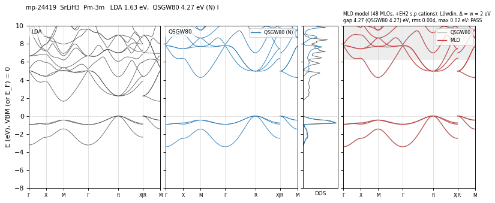

**mp-863260** SrMg2As2 — QSGW80 **2.23** N / M ≈ eV I  — ecalj b695fa65c (tf32, t_tetrakbt -300) — MLO PASS (b1) 45 gap 2.24 rms 0.011 max 0.09 (ecalj 614ab5eb8)

<small>runs: M 2.23 · N 2.23 (10-04)</small>

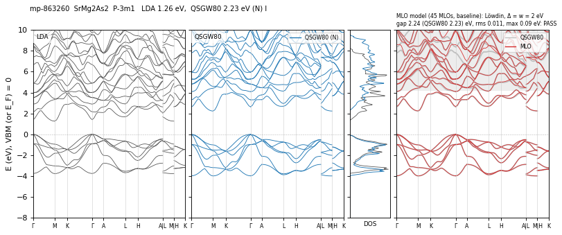

**mp-1069695** SrMg2Bi2 — QSGW80 **1.33** E / M ≈ / N ≈ eV D  — ecalj 614ab5eb8 (tf32, t_tetrakbt -300) with ES, ES rule es-a — MLO PASS (b1, ES) 46 gap 1.33 rms 0.014 max 0.07 (ecalj 7827f9424)

<small>runs: M 1.34 · N 1.34 (10-04) · E 1.33 (10-05, ES 1, es-a)</small>

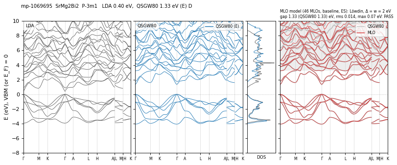

**mp-10550** SrMg2N2 — QSGW80 **3.00** N / M ≈ eV D  — ecalj b695fa65c (tf32, t_tetrakbt -300) — MLO PASS (b1) 38 gap 3.00 rms 0.002 max 0.02 (ecalj a1d6c0e11)

<small>runs: M 2.96 · N 3.00 (10-03)</small>

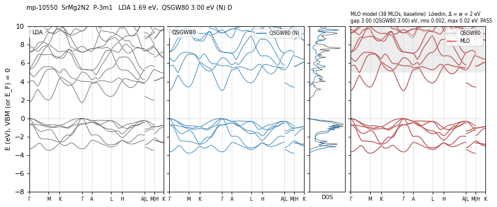

**mp-9566** SrMg2Sb2 — QSGW80 **1.79** E / M ≈ / N ≈ eV I  — ecalj 614ab5eb8 (tf32, t_tetrakbt -300) with ES, ES rule es-a — MLO PASS (b1, ES) 46 gap 1.79 rms 0.010 max 0.06 (ecalj f481126f0)

<small>runs: M 1.77 · N 1.76 (10-04) · E 1.79 (10-05, ES 1, es-a)</small>

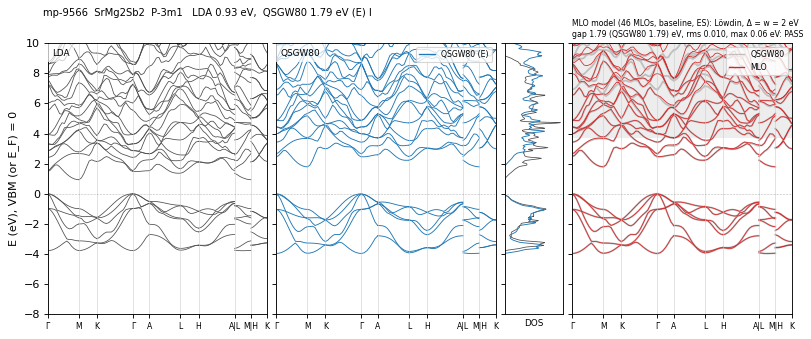

**mp-1017439** SrSiO3 — QSGW80 **4.94** N / M 4.77 eV I differs — ecalj b695fa65c (tf32, t_tetrakbt -300) — MLO PASS (b1) 33 gap 4.95 rms 0.001 max 0.00 (ecalj a1d6c0e11)

<small>runs: M 4.77 · N 4.94 (10-03)</small>

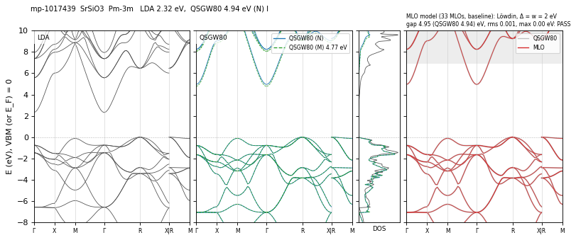

**mp-9379** SrSn2As2 — QSGW80 **0.06** N / R ≈ eV I QSGW<LDA — ecalj 989a18637 (tf32, t_tetrakbt -300) — MLO PASS (b1) 45 rms 0.003 max 0.02 (ecalj fb2da026b)

<small>runs: M UNKNOWN · R 0.04 (09-30) · N 0.06 (10-03)</small>

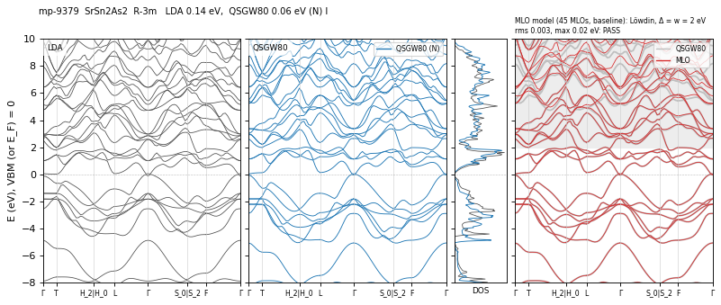

**mp-546973** SrSnO3 — QSGW80 **3.07** N / M ≈ eV I  — ecalj b695fa65c (tf32, t_tetrakbt -300) — MLO PASS (b1) 33 gap 3.07 rms 0.001 max 0.00 (ecalj 614ab5eb8)

<small>runs: M 3.09 · N 3.07 (10-04)</small>

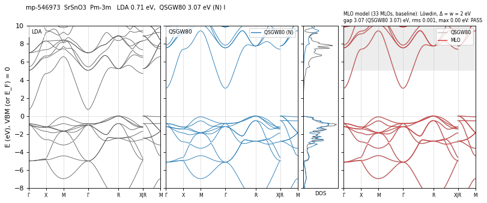

**mp-5229** SrTiO3 — QSGW80 **3.63** N / M ≈ eV I  — ecalj b695fa65c (tf32, t_tetrakbt -300) — MLO PASS (b1) 33 gap 3.63 rms 0.001 max 0.01 (ecalj 614ab5eb8)

<small>runs: M 3.60 · N 3.63 (10-04)</small>

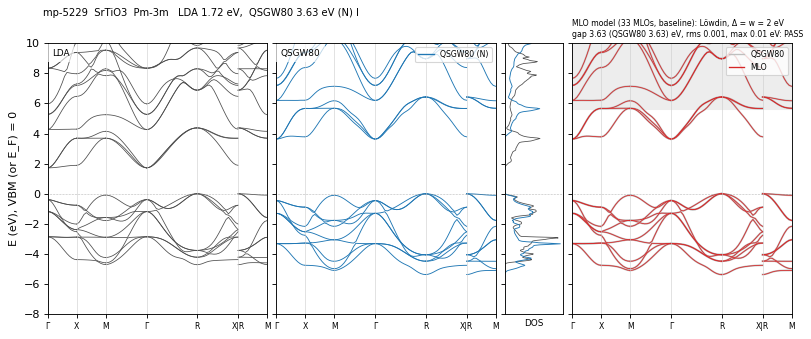

**mp-7770** SrZn2As2 — QSGW80 **1.24** N / M ≈ eV D  — ecalj b695fa65c (tf32, t_tetrakbt -300) — MLO PASS (b1) 55 gap 1.24 rms 0.005 max 0.04 (ecalj 614ab5eb8)

<small>runs: M 1.24 · N 1.24 (10-04)</small>

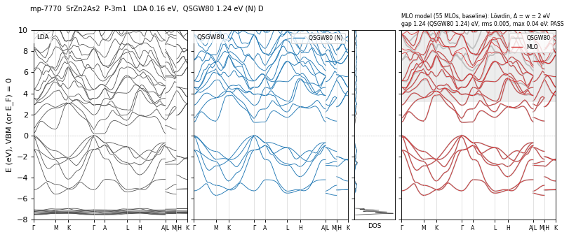

**mp-8276** SrZn2P2 — QSGW80 **1.57** N / M ≈ eV I  — ecalj b695fa65c (tf32, t_tetrakbt -300) — MLO PASS (b1) 45 gap 1.58 rms 0.006 max 0.04 (ecalj 614ab5eb8)

<small>runs: M 1.56 · N 1.57 (10-04)</small>

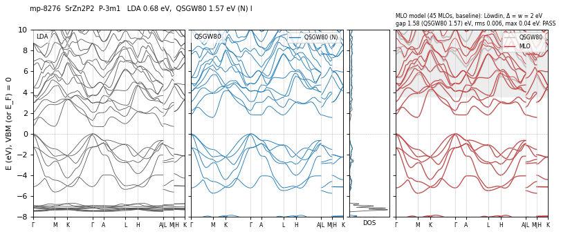

**mp-3323** SrZrO3 — QSGW80 **5.47** N / M ≈ eV I  — ecalj 989a18637 (tf32, t_tetrakbt -300) — MLO PASS (b1) 33 gap 5.47 rms 0.001 max 0.01 (ecalj fb2da026b)

<small>runs: M 5.50 · N 5.47 (10-03)</small>

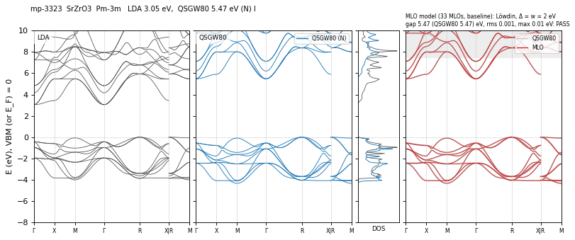

**mp-19845** TiPbO3 — QSGW80 **2.89** N / M 2.72 eV I differs — ecalj b695fa65c (tf32, t_tetrakbt -300) — MLO PASS (b1) 35 gap 2.89 rms 0.001 max 0.01 (ecalj fb2da026b)

<small>runs: M 2.72 · N 2.89 (10-03)</small>

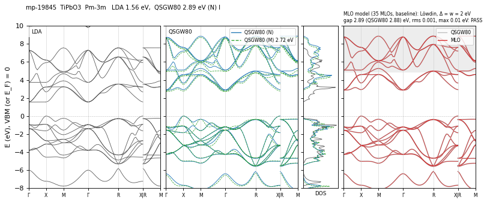

**mp-20459** TiPbO3 — QSGW80 **3.22** N / M ≈ eV I  — ecalj b695fa65c (tf32, t_tetrakbt -300) — MLO PASS (b1) 35 gap 3.22 rms 0.001 max 0.01 (ecalj fb2da026b)

<small>runs: M 3.22 · N 3.22 (10-04)</small>

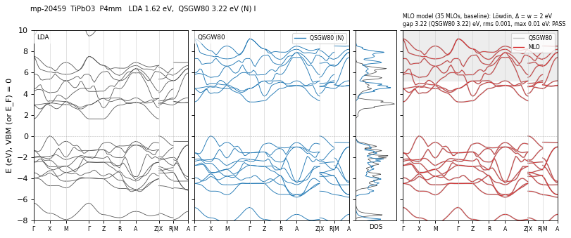

**mp-29798** TlBrO3 — QSGW80 **5.68** N / R ≈ eV I  — ecalj b695fa65c (tf32, t_tetrakbt -300) — MLO PASS (b1) 35 gap 5.68 rms 0.001 max 0.00 (ecalj fb2da026b)

<small>runs: M FAILED · R 5.68 (09-30) · N 5.68 (10-04)</small>

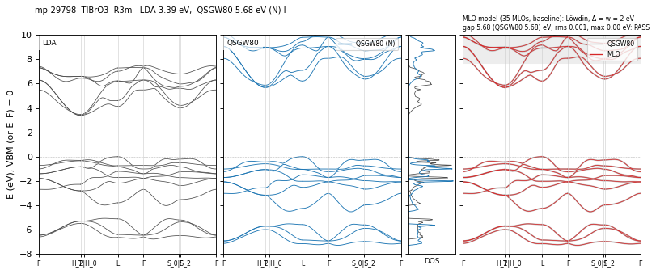

**mp-29738** TlClO3 — QSGW80 **6.82** N / R ≈ eV I  — ecalj b695fa65c (tf32, t_tetrakbt -300) — MLO PASS (b1) 35 gap 6.82 rms 0.004 max 0.03 (ecalj fb2da026b)

<small>runs: M FAILED · R 6.82 (09-30) · N 6.82 (10-04)</small>

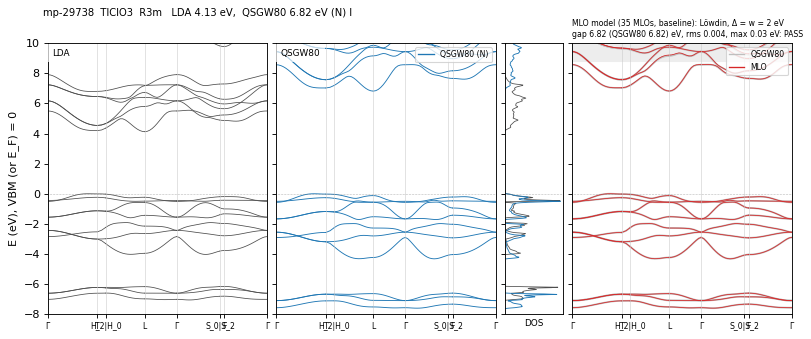

**mp-22981** TlIO3 — QSGW80 **4.50** N / R ≈ eV D  — ecalj b695fa65c (tf32, t_tetrakbt -300) — MLO PASS (b1) 35 gap 4.50 rms 0.001 max 0.00 (ecalj fb2da026b)

<small>runs: M FAILED · R 4.50 (09-30) · N 4.50 (10-04)</small>

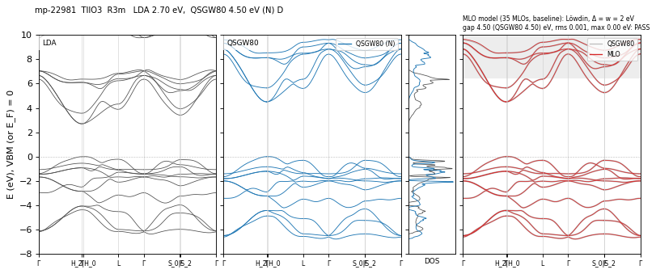

**mp-14099** ZnAgF3 — QSGW80 **5.47** N / R ≈ eV I  — ecalj 989a18637 (tf32, t_tetrakbt -300) — MLO PASS (b1) 30 gap 5.47 rms 0.000 max 0.00 (ecalj 96ec5c1ee)

<small>runs: M FAILED · R 5.47 (09-30) · N 5.47 (10-03)</small>

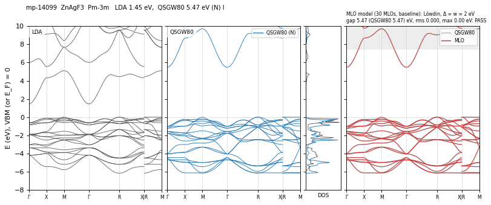

**mp-553875** Zr2SN2 — QSGW80 **1.67** N / M 1.72 · path 1.46 eV I differs path<mesh(mesh) — ecalj b695fa65c (tf32, t_tetrakbt -300) — MLO PASS (b1) 35 gap 1.46 rms 0.004 max 0.06 (ecalj 614ab5eb8)

<small>runs: M 1.72 · N 1.67 (10-04)</small>

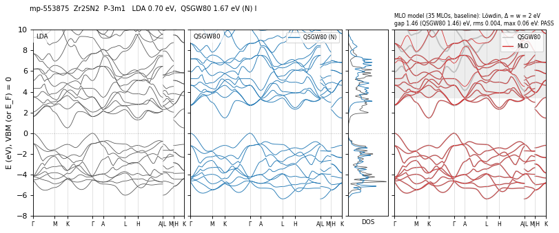

**mp-1068577** ZrPbO3 — QSGW80 **3.43** N / R ≈ eV I  — ecalj 989a18637 (tf32, t_tetrakbt -300) — MLO PASS (b1) 30 gap 3.43 rms 0.001 max 0.01 (ecalj a1d6c0e11)

<small>runs: M FAILED · R 3.43 (09-30) · N 3.43 (10-03)</small>

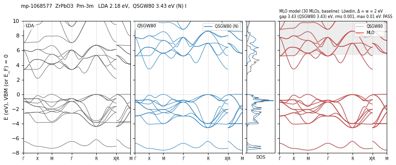

**mp-20337** ZrPbO3 — QSGW80 **3.92** N / M ≈ eV I  — ecalj b695fa65c (tf32, t_tetrakbt -300) — MLO PASS (b1) 35 gap 3.92 rms 0.001 max 0.01 (ecalj fb2da026b)

<small>runs: M 3.96 · N 3.92 (10-04)</small>

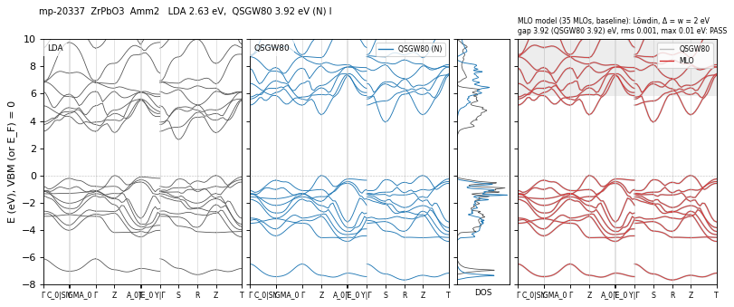

