# GW1500 QSGW80 — bands and DOS, 6 atoms per cell

[README](README.md) · [table](table.md)

Left: LDA. Middle: QSGW80 adopted (blue, condition in parentheses; green dashed: another QSGW80 result when its gap differs by more than 0.1 eV) and the total DOS. Right: the MLO model of the standard recipe (red) on the QSGW80 bands (gray), with its conditions and check; shaded: outside the window of the check ([README](README.md#mlo-models)). Energies from the VBM (insulators) or E_F (metals).

**mp-22993** AgClO4 — QSGW80 **6.10** N / R ≈ eV I  — ecalj 989a18637 (tf32, t_tetrakbt -300) — MLO PASS (b1) 34 gap 6.10 rms 0.001 max 0.01 (ecalj fb2da026b)

<small>runs: M FAILED · R 6.10 (09-30) · N 6.10 (10-05)</small>

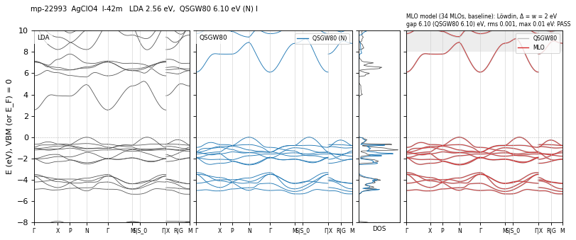

**mp-551758** AgClO4 — QSGW80 **5.58** E / N ≈ / R ≈ eV I  — ecalj 614ab5eb8 (tf32, t_tetrakbt -300) with ES, ES rule es-a — MLO PASS (b1, ES) 35 gap 5.58 rms 0.000 max 0.00 (ecalj a297c38f9)

<small>runs: M FAILED · R 5.58 (09-30) · N 5.58 (10-05) · E 5.58 (10-06, ES 1, es-a)</small>

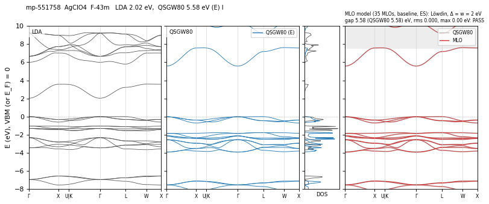

**mp-27863** Al2Cl2O2 — QSGW80 **8.92** N / M ≈ eV I  — ecalj 989a18637 (tf32, t_tetrakbt -300) — MLO PASS (b2all) 68 gap 8.90 rms 0.001 max 0.01 (ecalj fb2da026b)

<small>runs: M 8.94 · N 8.92 (10-04)</small>

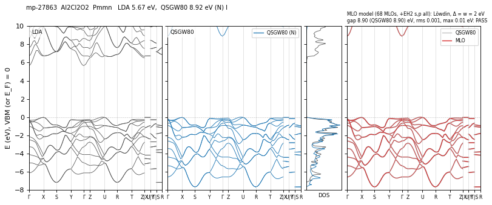

**mp-10910** Al4Ru2 — QSGW80 **0.46** N / M ≈ eV I  — ecalj 989a18637 (tf32, t_tetrakbt -300) — MLO PASS (b1) 54 gap 0.43 rms 0.001 max 0.01 (ecalj fb2da026b)

<small>runs: M 0.46 · N 0.46 (10-05)</small>

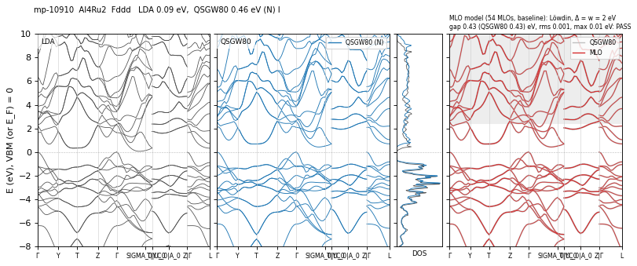

**mp-7849** AlAsO4 — QSGW80 **8.07** E / N 8.28 / R 8.28 eV I CHECK — ecalj 614ab5eb8 (tf32, t_tetrakbt -300) with ES, ES rule es-a — MLO PASS (b1, ES) 36 gap 8.07 rms 0.003 max 0.05 (ecalj 1bbefe015)

<small>runs: M 8.02 · R 8.28 (10-01) · N 8.28 (10-05) · E 8.07 (10-06, ES 2, es-a)</small>

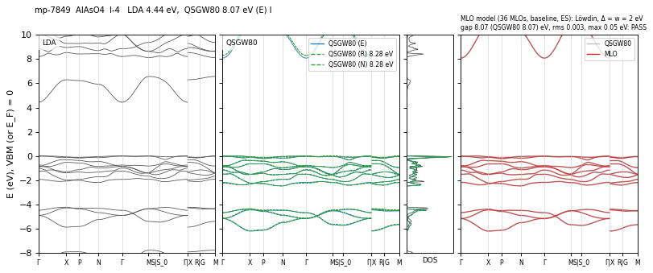

**mp-551798** AlPO4 — QSGW80 **1.34** E / N ≈ / R ≈ eV I  — ecalj 614ab5eb8 (tf32, t_tetrakbt -300) with ES, ES rule es-a — MLO PASS (b1, ES) 35 gap 1.34 rms 0.002 max 0.02 (ecalj 1bbefe015)

<small>runs: M FAILED · R 1.34 (09-30) · N 1.34 (10-05) · E 1.34 (10-06, ES 1, es-a)</small>

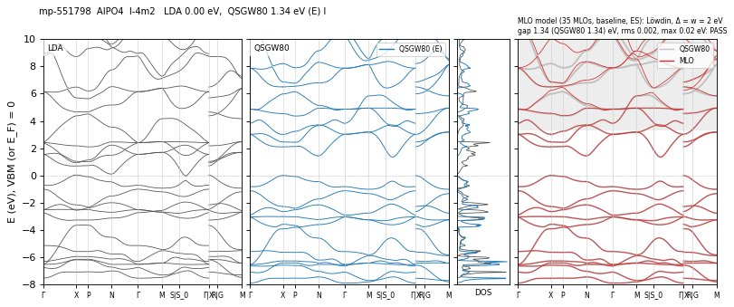

**mp-7848** AlPO4 — QSGW80 **9.25** E / M 9.62 / N 9.41 eV D CHECK — ecalj 614ab5eb8 (tf32, t_tetrakbt -300) with ES, ES rule es-a — MLO PASS (b1, ES) 38 gap 9.25 rms 0.003 max 0.03 (ecalj 1bbefe015)

<small>runs: M 9.62 · N 9.41 (10-05) · E 9.25 (10-06, ES 1, es-a)</small>

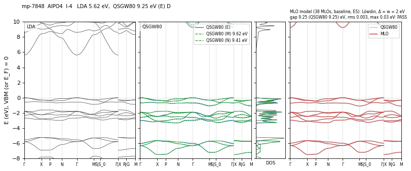

**mp-1071955** AlPS4 — QSGW80 **4.71** E / M 4.80 / N 4.79 eV I differs — ecalj 614ab5eb8 (tf32, t_tetrakbt -300) with ES, ES rule es-a — MLO PASS (b2all, ES) 79 gap 4.69 rms 0.001 max 0.01 (ecalj f481126f0)

<small>runs: M 4.80 · N 4.79 (10-03) · E 4.71 (10-05, ES 1, es-a)</small>

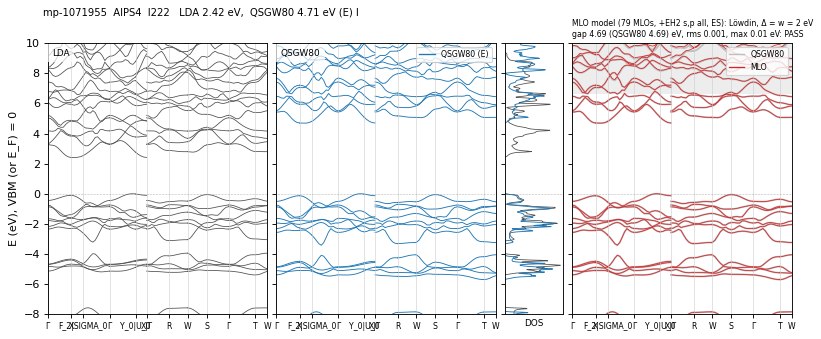

**mp-5606** AlTlF4 — QSGW80 **7.23** N / R ≈ eV I  — ecalj 989a18637 (tf32, t_tetrakbt -300) — MLO PASS (b1) 39 gap 7.23 rms 0.002 max 0.03 (ecalj fb2da026b)

<small>runs: M FAILED · R 7.23 (09-30) · N 7.23 (10-05)</small>

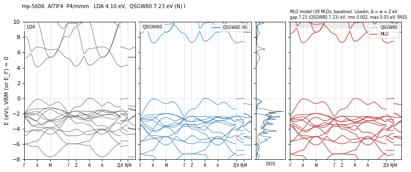

**mp-1182867** AlWO4 — QSGW80 **0.00** N / R ≈ eV metal  — ecalj 989a18637 (tf32, t_tetrakbt -300) — MLO PASS (b1) 34 rms 0.001 max 0.01 (ecalj a1d6c0e11)

<small>runs: M UNKNOWN · R CONVERGED_METAL (09-30) · N CONVERGED_METAL (10-03)</small>

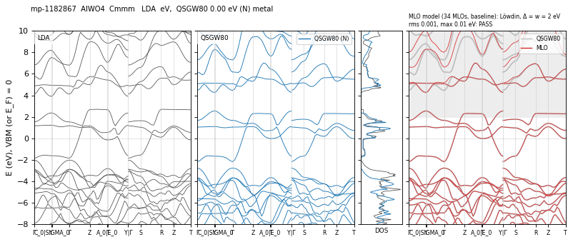

**mp-2455** As4Os2 — QSGW80 **1.00** N / M ≈ eV I  — ecalj 989a18637 (tf32, t_tetrakbt -300) — MLO PASS (b1) 54 gap 0.98 rms 0.001 max 0.01 (ecalj fb2da026b)

<small>runs: M 1.00 · N 1.00 (10-04)</small>

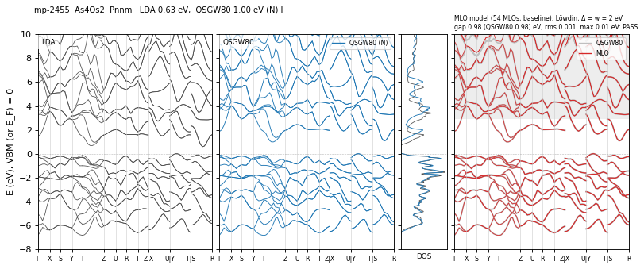

**mp-766** As4Ru2 — QSGW80 **0.75** N / M ≈ eV I  — ecalj 989a18637 (tf32, t_tetrakbt -300) — MLO PASS (b1) 54 gap 0.73 rms 0.001 max 0.01 (ecalj fb2da026b)

<small>runs: M 0.76 · N 0.75 (10-05)</small>

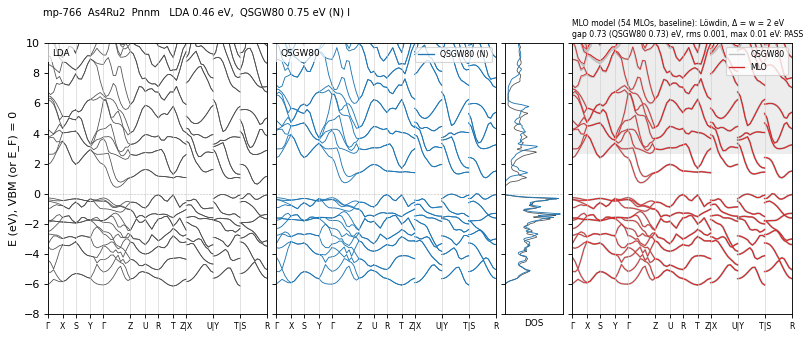

**mp-947** Au4S2 — QSGW80 **3.25** N / M ≈ eV D  — ecalj 989a18637 (tf32, t_tetrakbt -300) — MLO PASS (b2d) 78 gap 3.25 rms 0.001 max 0.01 (ecalj 1fd34b1c0)

<small>runs: M 3.20 · N 3.25 (10-05)</small>

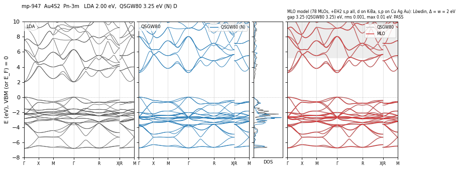

**mp-3277** BAsO4 — QSGW80 **8.08** N / M 8.26 eV I differs — ecalj 989a18637 (tf32, t_tetrakbt -300) — MLO PASS (b2) 33 gap 8.17 rms 0.014 max 0.09 (ecalj fb2da026b)

<small>runs: M 8.26 · N 8.08 (10-04)</small>

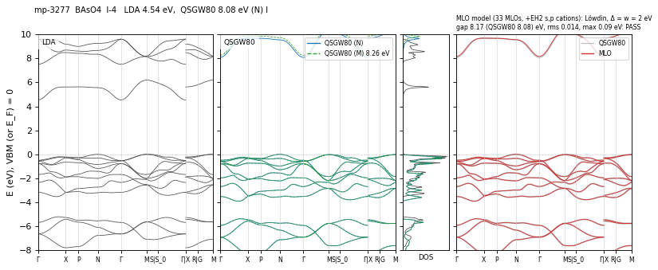

**mp-3589** BPO4 — QSGW80 **10.91** N / M 11.01 eV I differs — ecalj 989a18637 (tf32, t_tetrakbt -300) — MLO PASS (b2all) 53 gap 10.91 rms 0.003 max 0.03 (ecalj fb2da026b)

<small>runs: M 11.01 · N 10.91 (10-03)</small>

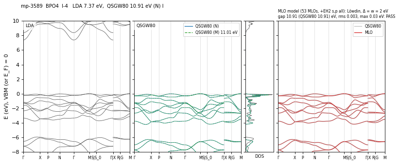

**mp-27724** BPS4 — QSGW80 **4.20** N / M 4.13 eV I differs — ecalj 989a18637 (tf32, t_tetrakbt -300) — MLO PASS (b2all) 73 gap 4.19 rms 0.001 max 0.01 (ecalj fb2da026b)

<small>runs: M 4.13 · N 4.20 (10-05)</small>

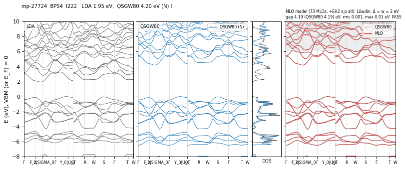

**mp-9899** Ba2Ag2P2 — QSGW80 **0.81** N / M ≈ eV I  — ecalj 989a18637 (tf32, t_tetrakbt -300) — MLO PASS (b2) 68 gap 0.81 rms 0.001 max 0.02 (ecalj fb2da026b)

<small>runs: M 0.80 · N 0.81 (10-04)</small>

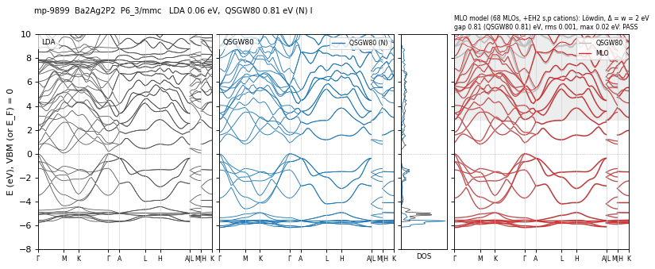

**mp-1205316** Ba2Ag2Sb2 — QSGW80 **0.69** N / M ≈ eV I  — ecalj 989a18637 (tf32, t_tetrakbt -300) — MLO PASS (b2) 68 gap 0.69 rms 0.002 max 0.02 (ecalj a1d6c0e11)

<small>runs: M 0.69 · N 0.69 (10-04)</small>

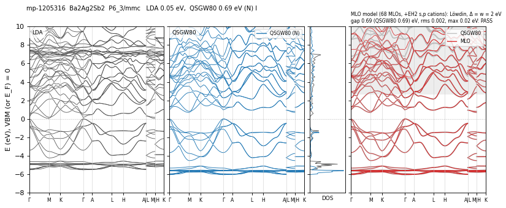

**mp-23070** Ba2Br2F2 — QSGW80 **7.43** N / M ≈ eV D  — ecalj 989a18637 (tf32, t_tetrakbt -300) — MLO PASS (b2) 58 gap 7.43 rms 0.001 max 0.01 (ecalj fb2da026b)

<small>runs: M 7.43 · N 7.43 (10-03)</small>

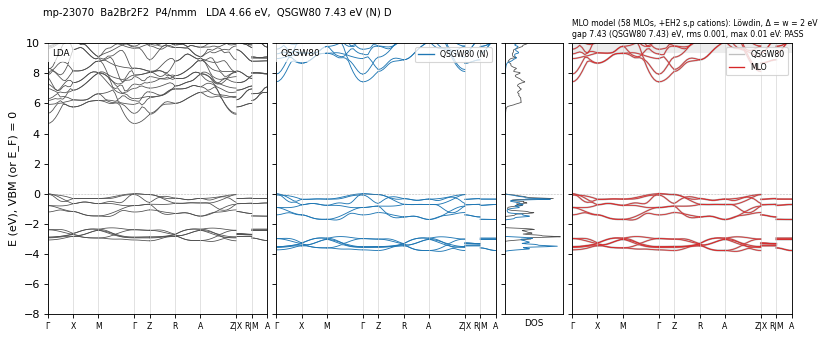

**mp-10293** Ba2C4 — QSGW80 **4.33** N / M 4.39 eV I differs — ecalj 989a18637 (tf32, t_tetrakbt -300) — MLO PASS (b2) 64 gap 4.34 rms 0.004 max 0.02 (ecalj a1d6c0e11)

<small>runs: M 4.39 · N 4.33 (10-04)</small>

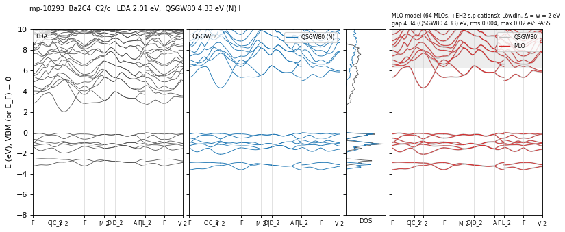

**mp-23432** Ba2Cl2F2 — QSGW80 **8.32** N / M ≈ eV D  — ecalj 989a18637 (tf32, t_tetrakbt -300) — MLO PASS (b2) 58 gap 8.32 rms 0.001 max 0.01 (ecalj fb2da026b)

<small>runs: M 8.35 · N 8.32 (10-05)</small>

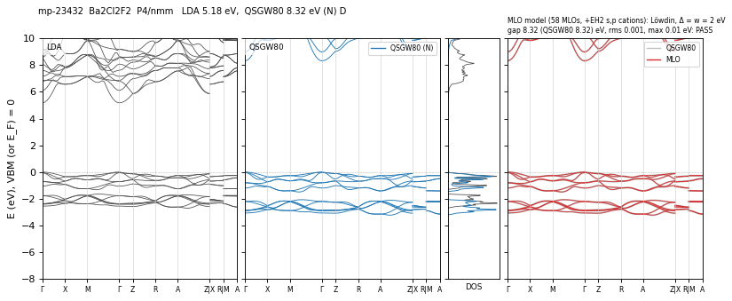

**mp-552934** Ba2CuBrO2 — QSGW80 **4.31** E / N 4.39 / R 4.39 eV I differs — ecalj 0601771b4 (tf32, t_tetrakbt -300) with ES, ES rule es-b — MLO PASS (b2, ES) 60 gap 4.31 rms 0.002 max 0.01 (ecalj 1fd918e7e)

<small>runs: M FAILED · R 4.39 (09-30) · N 4.39 (10-04) · E FAIL(1) FAIL(1) (10-06, ES 2, es-a) · E 4.31 (10-06, ES 2, es-b)</small>

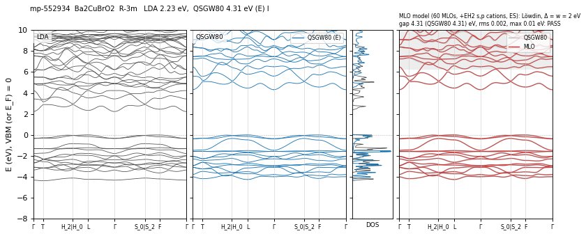

**mp-551456** Ba2CuClO2 — QSGW80 **4.37** E / N 4.47 / R 4.46 eV I differs — ecalj 0601771b4 (tf32, t_tetrakbt -300) with ES, ES rule es-b — MLO PASS (b2, ES) 60 gap 4.37 rms 0.001 max 0.01 (ecalj 1fd918e7e)

<small>runs: M FAILED · R 4.46 (09-30) · N 4.47 (10-04) · E FAIL(1) FAIL(1) (10-06, ES 2, es-a) · E 4.37 (10-06, ES 2, es-b)</small>

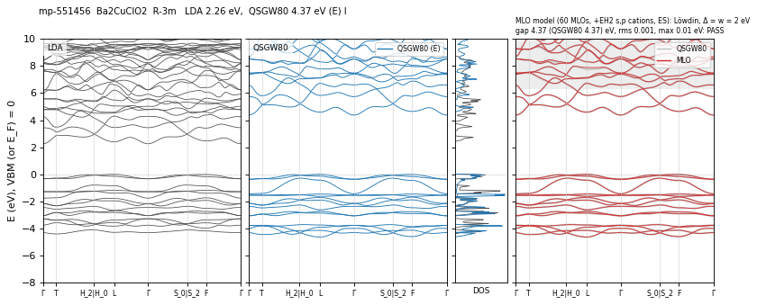

**mp-8644** Ba2F4 — QSGW80 **9.64** N / M 9.77 eV D differs — ecalj 989a18637 (tf32, t_tetrakbt -300) — MLO PASS (b2) 48 gap 9.64 rms 0.001 max 0.00 (ecalj fb2da026b)

<small>runs: M 9.77 · N 9.64 (10-04)</small>

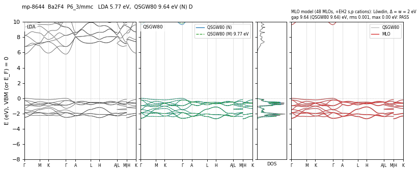

**mp-24424** Ba2H2Br2 — QSGW80 **5.35** N / M ≈ eV D  — ecalj 989a18637 (tf32, t_tetrakbt -300) — MLO PASS (b2) 66 gap 5.35 rms 0.001 max 0.01 (ecalj fb2da026b)

<small>runs: M 5.36 · N 5.35 (10-04)</small>

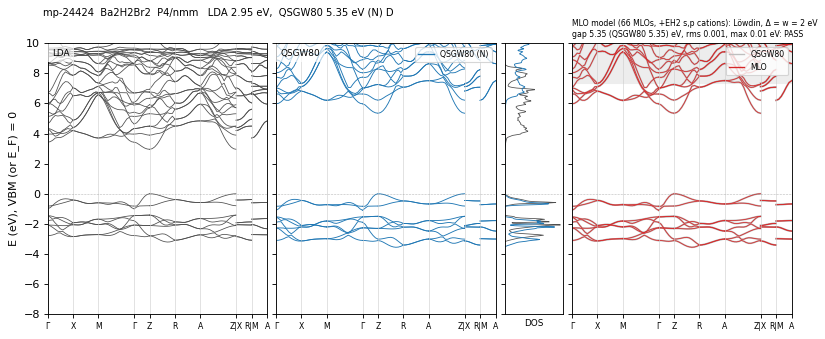

**mp-23861** Ba2H2Cl2 — QSGW80 **5.85** N / M 5.91 eV D differs — ecalj 989a18637 (tf32, t_tetrakbt -300) — MLO PASS (b2) 66 gap 5.86 rms 0.001 max 0.01 (ecalj fb2da026b)

<small>runs: M 5.91 · N 5.85 (10-03)</small>

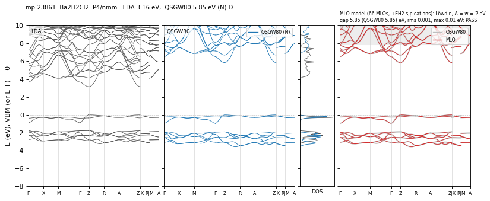

**mp-23862** Ba2H2I2 — QSGW80 **4.63** N / M ≈ eV D  — ecalj 989a18637 (tf32, t_tetrakbt -300) — MLO PASS (b2) 66 gap 4.63 rms 0.003 max 0.03 (ecalj fb2da026b)

<small>runs: M 4.65 · N 4.63 (10-04)</small>

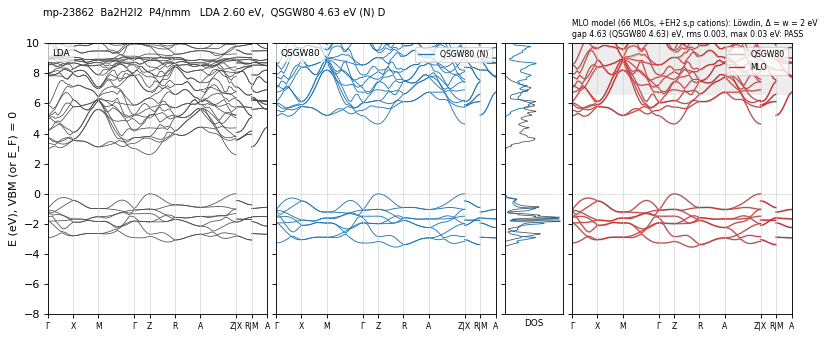

**mp-1018651** Ba2H3I — QSGW80 **4.10** N / M ≈ eV I  — ecalj 989a18637 (tf32, t_tetrakbt -300) — MLO PASS (b2) 65 gap 4.10 rms 0.002 max 0.01 (ecalj fb2da026b)

<small>runs: M 4.11 · N 4.10 (10-05)</small>

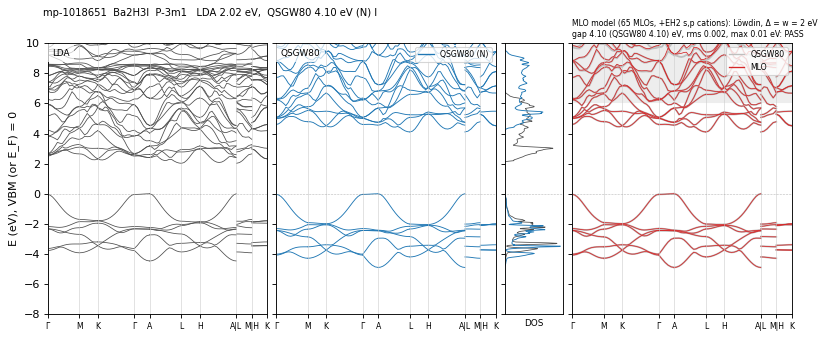

**mp-22951** Ba2I2F2 — QSGW80 **6.14** N / M ≈ eV D  — ecalj 989a18637 (tf32, t_tetrakbt -300) — MLO PASS (b2) 58 gap 6.15 rms 0.003 max 0.02 (ecalj fb2da026b)

<small>runs: M 6.11 · N 6.14 (10-03)</small>

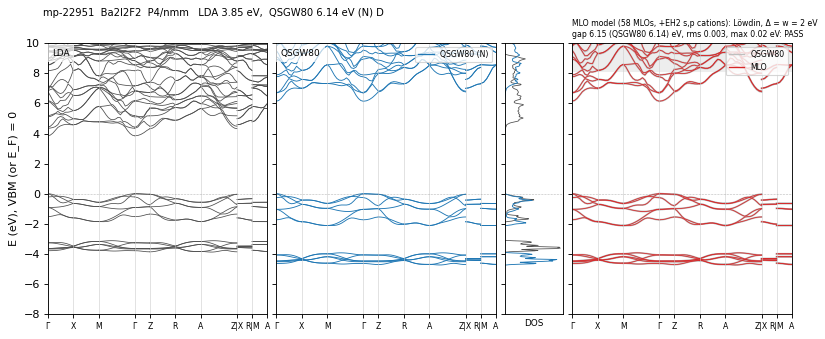

**mp-13277** Ba2Li2P2 — QSGW80 **1.90** N / M ≈ eV D  — ecalj 989a18637 (tf32, t_tetrakbt -300) — MLO PASS (b2) 66 gap 1.90 rms 0.002 max 0.01 (ecalj a1d6c0e11)

<small>runs: M 1.89 · N 1.90 (10-04)</small>

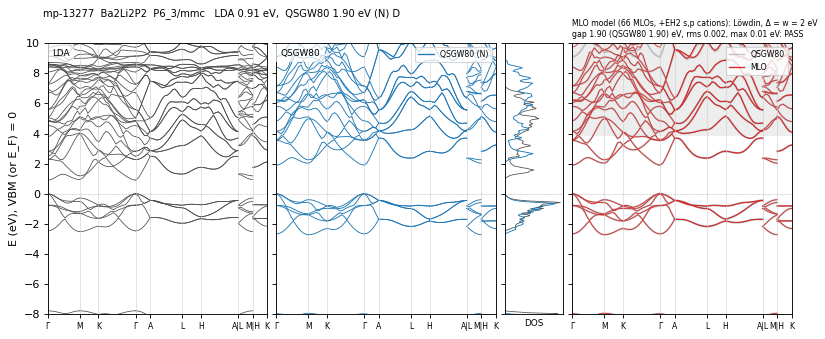

**mp-10485** Ba2Li2Sb2 — QSGW80 **1.62** N / M ≈ eV I  — ecalj 989a18637 (tf32, t_tetrakbt -300) — MLO PASS (b2) 66 gap 1.62 rms 0.002 max 0.01 (ecalj a1d6c0e11)

<small>runs: M 1.62 · N 1.62 (10-03)</small>

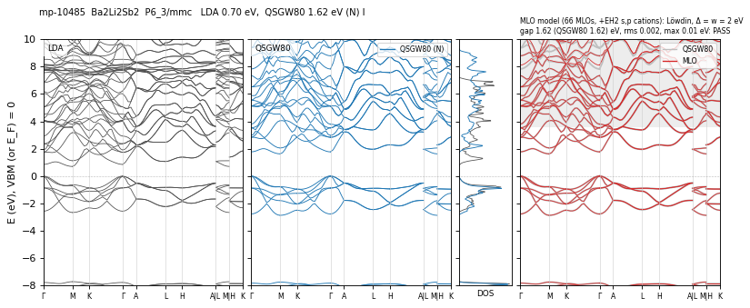

**mp-684** Ba2S4 — QSGW80 **3.64** N / M 3.72 eV D differs — ecalj 989a18637 (tf32, t_tetrakbt -300) — MLO PASS (b2) 68 gap 3.64 rms 0.011 max 0.06 (ecalj fb2da026b)

<small>runs: M 3.72 · N 3.64 (10-05)</small>

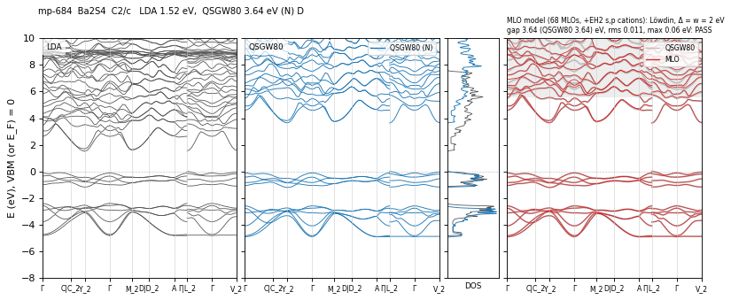

**mp-7547** Ba2Se4 — QSGW80 **2.33** N / M 2.41 eV I differs — ecalj 989a18637 (tf32, t_tetrakbt -300) — MLO PASS (b2) 68 gap 2.33 rms 0.004 max 0.04 (ecalj fb2da026b)

<small>runs: M 2.41 · N 2.33 (10-04)</small>

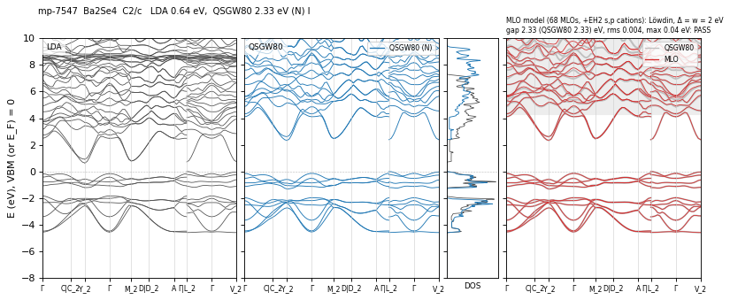

**mp-2150** Ba2Te4 — QSGW80 **1.47** N / M ≈ eV I  — ecalj 989a18637 (tf32, t_tetrakbt -300) — MLO PASS (b2all) 84 gap 1.47 rms 0.003 max 0.03 (ecalj fb2da026b)

<small>runs: M 1.48 · N 1.47 (10-05)</small>

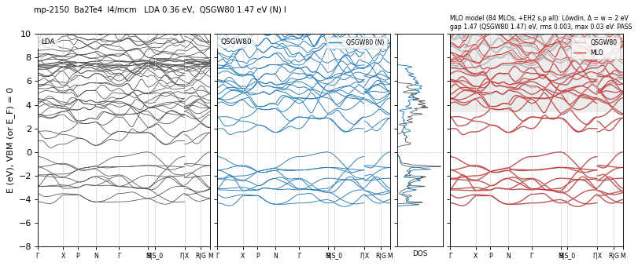

**mp-3307** BaSO4 — QSGW80 **6.99** E / N 7.12 / R 7.12 eV I differs — ecalj 614ab5eb8 (tf32, t_tetrakbt -300) with ES, ES rule es-a — MLO PASS (b1, ES) 38 gap 6.99 rms 0.001 max 0.00 (ecalj a863cf27f)

<small>runs: M FAILED · R 7.12 (09-30) · N 7.12 (10-05) · E 6.99 (10-06, ES 1, es-a)</small>

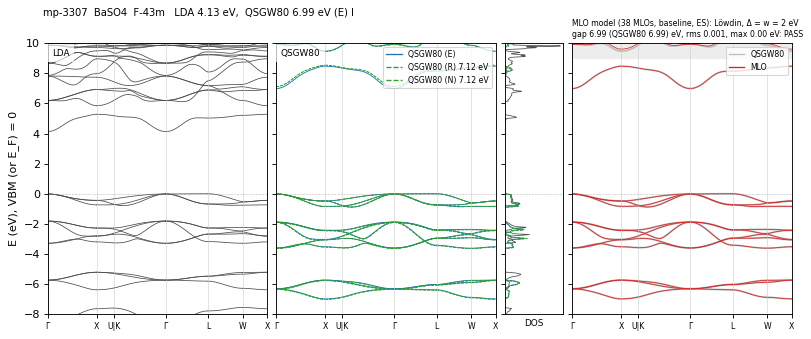

**mp-30139** Be2Br4 — QSGW80 **7.90** N / M ≈ eV I  — ecalj 989a18637 (tf32, t_tetrakbt -300) — MLO PASS (b2all) 68 gap 7.90 rms 0.005 max 0.04 (ecalj fb2da026b)

<small>runs: M 7.89 · N 7.90 (10-03)</small>

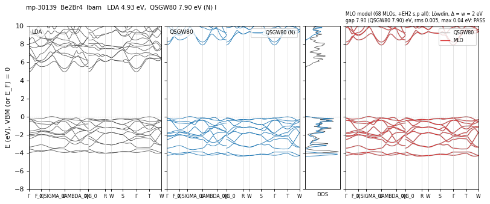

**mp-23267** Be2Cl4 — QSGW80 **9.43** N / M ≈ eV I  — ecalj 989a18637 (tf32, t_tetrakbt -300) — MLO PASS (b2all) 68 gap 9.42 rms 0.003 max 0.02 (ecalj fb2da026b)

<small>runs: M 9.43 · N 9.43 (10-05)</small>

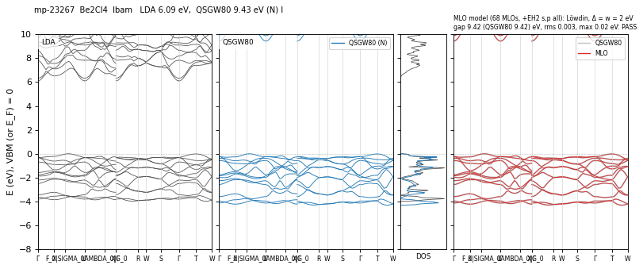

**mp-570886** Be2I4 — QSGW80 **6.09** N / M ≈ eV I  — ecalj 989a18637 (tf32, t_tetrakbt -300) — MLO PASS (b2all) 68 gap 6.08 rms 0.010 max 0.10 (ecalj fb2da026b)

<small>runs: M 6.14 · N 6.09 (10-03)</small>

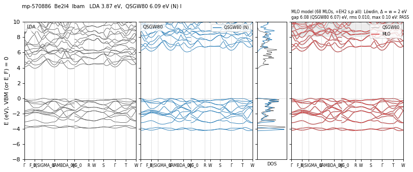

**mp-1072399** Be5Pt — QSGW80 **0.36** N / M ≈ eV I  — ecalj 989a18637 (tf32, t_tetrakbt -300) — MLO PASS (b1) 29 gap 0.35 rms 0.001 max 0.01 (ecalj a1d6c0e11)

<small>runs: M 0.35 · N 0.36 (10-03)</small>

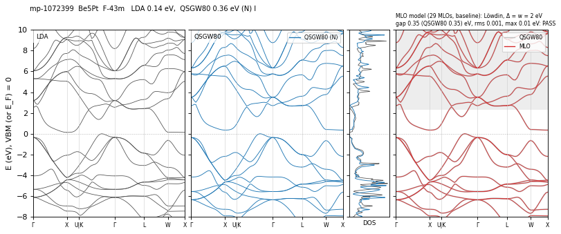

**mp-5046** BeSO4 — QSGW80 **10.63** N / M ≈ eV I  — ecalj 989a18637 (tf32, t_tetrakbt -300) — MLO PASS (b2all) 53 gap 10.63 rms 0.003 max 0.04 (ecalj fb2da026b)

<small>runs: M 10.60 · N 10.63 (10-04)</small>

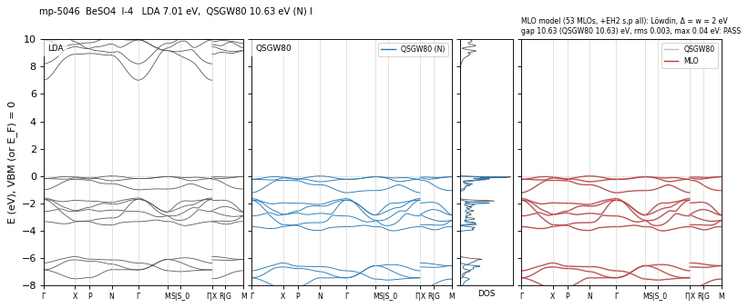

**mp-23072** Bi2Br2O2 — QSGW80 **3.30** N / M ≈ eV I  — ecalj 989a18637 (tf32, t_tetrakbt -300) — MLO PASS (b1) 44 gap 3.29 rms 0.001 max 0.01 (ecalj fb2da026b)

<small>runs: M 3.26 · N 3.30 (10-05)</small>

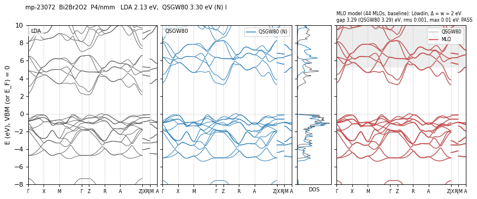

**mp-22939** Bi2Cl2O2 — QSGW80 **3.74** N / M ≈ eV I  — ecalj 989a18637 (tf32, t_tetrakbt -300) — MLO PASS (b1) 44 gap 3.73 rms 0.001 max 0.01 (ecalj fb2da026b)

<small>runs: M 3.73 · N 3.74 (10-04)</small>

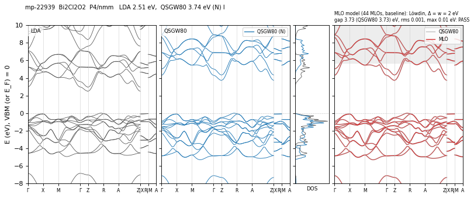

**mp-22987** Bi2I2O2 — QSGW80 **2.51** N / M ≈ eV I  — ecalj 989a18637 (tf32, t_tetrakbt -300) — MLO PASS (b1) 44 gap 2.50 rms 0.003 max 0.03 (ecalj fb2da026b)

<small>runs: M 2.56 · N 2.51 (10-04)</small>

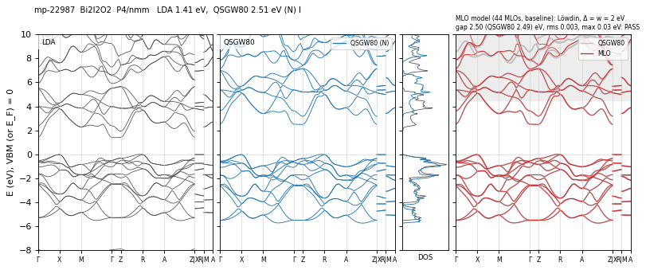

**mp-23074** Bi2O2F2 — QSGW80 **5.08** N / M 5.00 eV D differs — ecalj 989a18637 (tf32, t_tetrakbt -300) — MLO PASS (b1) 34 gap 5.08 rms 0.002 max 0.02 (ecalj fb2da026b)

<small>runs: M 5.00 · N 5.08 (10-04)</small>

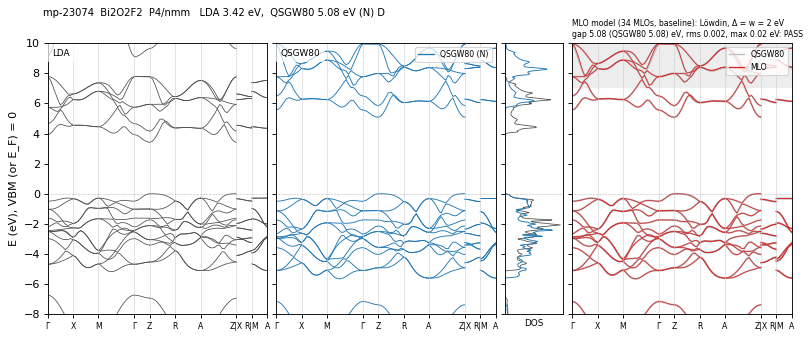

**mp-28944** Bi2Te2Cl2 — QSGW80 **2.27** N / M ≈ eV I  — ecalj 989a18637 (tf32, t_tetrakbt -300) — MLO PASS (b1) 54 gap 2.21 rms 0.003 max 0.02 (ecalj fb2da026b)

<small>runs: M 2.28 · N 2.27 (10-04)</small>

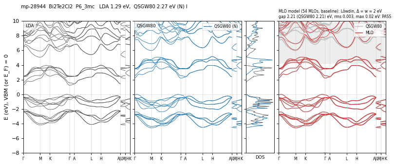

**mp-27743** BiF5 — QSGW80 **5.55** N / R ≈ eV I  — ecalj 989a18637 (tf32, t_tetrakbt -300) — MLO PASS (b1) 34 gap 5.55 rms 0.000 max 0.00 (ecalj fb2da026b)

<small>runs: M 5.44 · R 5.55 (10-01) · N 5.55 (10-05)</small>

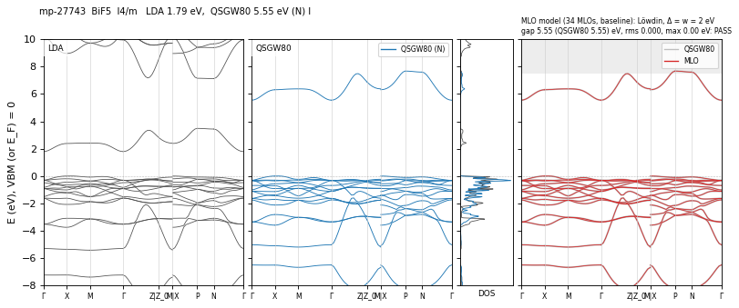

**mp-27989** C2Br2N2 — QSGW80 **8.08** E / M 8.52 / N 8.50 eV D CHECK — ecalj 614ab5eb8 (tf32, t_tetrakbt -300) with ES, ES rule es-a — MLO PASS (b2, ES) 54 gap 8.08 rms 0.001 max 0.01 (ecalj 75eff0d12)

<small>runs: M 8.52 · N 8.50 (10-04) · E 8.08 (10-06, ES 6, es-a)</small>

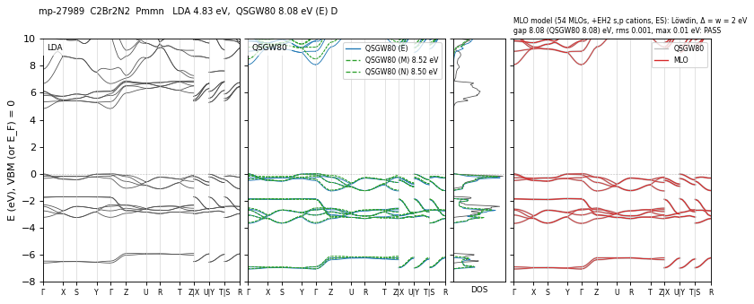

**mp-730189** C2Br2N2 — QSGW80 **8.35** E / M 8.29 / N 8.41 eV D differs — ecalj 614ab5eb8 (tf32, t_tetrakbt -300) with ES, ES rule es-a — MLO OK (b2all, ES) 66 gap 8.35 rms 0.002 max 0.16 (ecalj 1bbefe015)

<small>runs: M 8.29 · N 8.41 (10-03) · E 8.35 (10-06, ES 2, es-a)</small>

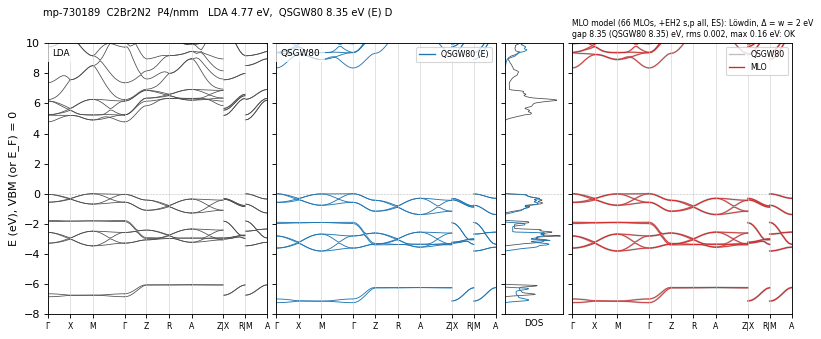

**mp-27502** C2N2Cl2 — QSGW80 **9.01** E / M 9.17 / N 9.33 eV D CHECK — ecalj 614ab5eb8 (tf32, t_tetrakbt -300) with ES, ES rule es-a — MLO PASS (b2all, ES) 66 gap 9.02 rms 0.002 max 0.01 (ecalj 75eff0d12)

<small>runs: M 9.17 · N 9.33 (10-05) · E 9.01 (10-05, ES 2, es-a)</small>

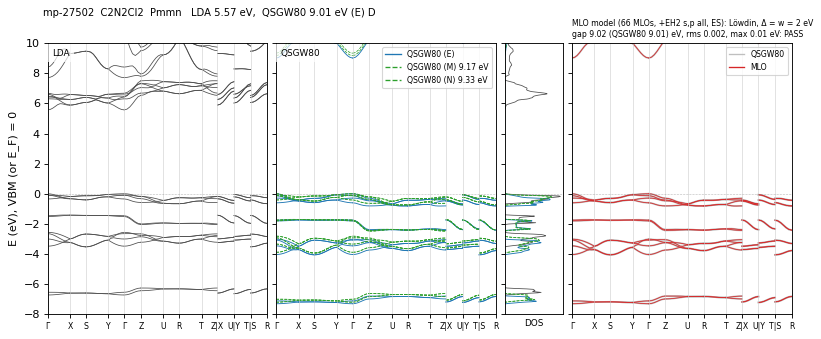

**mp-1077316** C2O4 — QSGW80 **11.20** N / R ≈ eV I  — ecalj 989a18637 (tf32, t_tetrakbt -300) — MLO PASS (b2) 32 gap 11.21 rms 0.010 max 0.07 (ecalj fb2da026b)

<small>runs: M 11.45 · R 11.20 (10-01) · N 11.20 (10-05)</small>

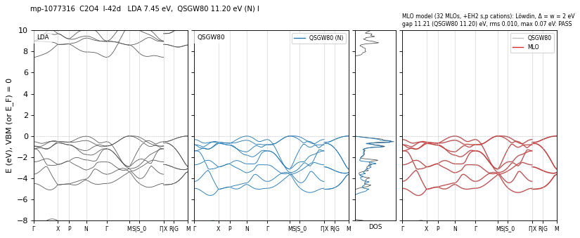

**mp-1077906** C2O4 — QSGW80 **9.98** E / M 10.09 / N 10.28 eV I CHECK — ecalj 0601771b4 (tf32, t_tetrakbt -300) with ES, ES rule es-c — MLO PASS (b2, ES) 36 gap 9.98 rms 0.002 max 0.01 (ecalj f16f0ea3d)

<small>runs: M 10.09 · N 10.28 (10-05) · E 9.98 (10-06, ES 4, es-c)</small>

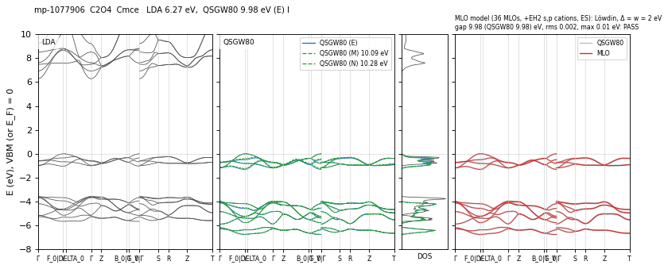

**mp-644607** C2O4 — QSGW80 **10.18** E / N 10.28 / R 10.28 eV I differs — ecalj 0601771b4 (tf32, t_tetrakbt -300) with ES, ES rule es-c — MLO PASS (b1, ES) 28 gap 10.18 rms 0.002 max 0.06 (ecalj f16f0ea3d)

<small>runs: M 10.26 · R 10.28 (10-01) · N 10.28 (10-05) · E 10.18 (10-06, ES 4, es-c)</small>

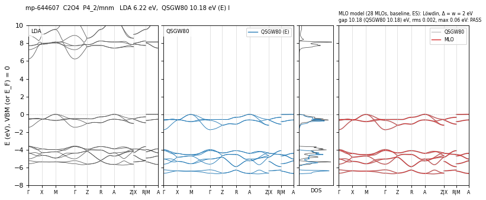

**mp-2232** C2S4 — QSGW80 **6.52** E / M 6.62 / N ≈ eV I differs — ecalj 614ab5eb8 (tf32, t_tetrakbt -300) with ES, ES rule es-a — MLO PASS (b2, ES) 60 gap 6.53 rms 0.009 max 0.06 (ecalj 7d5dfe714)

<small>runs: M 6.62 · N 6.55 (10-04) · E 6.52 (10-05, ES 8, es-a)</small>

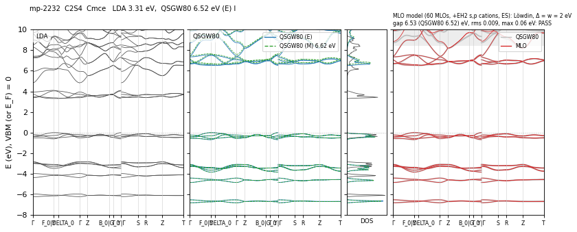

**mp-1071625** C2Se4 — QSGW80 **4.50** E / M 4.58 / N 4.57 eV I differs — ecalj 614ab5eb8 (tf32, t_tetrakbt -300) with ES, ES rule es-a — MLO PASS (b1, ES) 52 gap 4.50 rms 0.012 max 0.09 (ecalj f481126f0)

<small>runs: M 4.58 · N 4.57 (10-04) · E 4.50 (10-05, ES 8, es-a)</small>

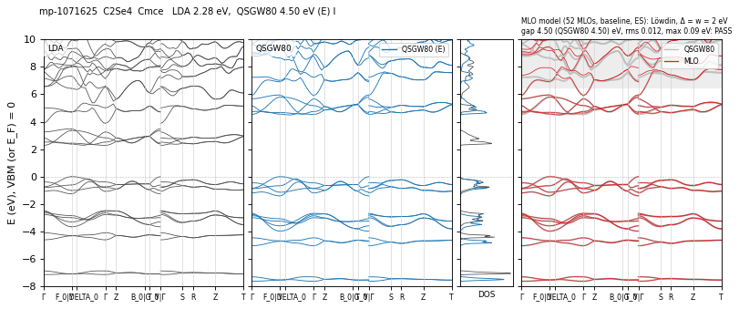

**mp-22888** Ca2Br4 — QSGW80 **7.19** N / M ≈ eV D  — ecalj 989a18637 (tf32, t_tetrakbt -300) — MLO PASS (b2) 62 gap 7.21 rms 0.008 max 0.06 (ecalj fb2da026b)

<small>runs: M 7.15 · N 7.19 (10-03)</small>

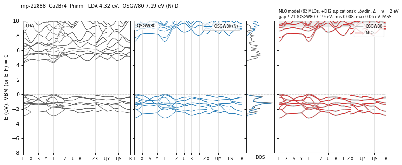

**mp-571166** Ca2Br4 — QSGW80 **7.08** N / R ≈ eV D  — ecalj b695fa65c (tf32, t_tetrakbt -300) — MLO PASS (b2) 62 gap 7.09 rms 0.008 max 0.08 (ecalj 614ab5eb8)

<small>runs: M 6.98 · R 7.08 (10-01) · N 7.08 (10-04)</small>

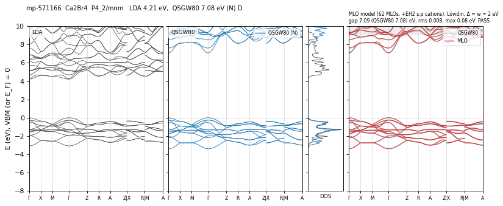

**mp-1575** Ca2C4 — QSGW80 **4.32** N / M ≈ eV I  — ecalj 989a18637 (tf32, t_tetrakbt -300) — MLO PASS (b1) 34 gap 4.31 rms 0.009 max 0.09 (ecalj 0c4d16ceb)

<small>runs: M 4.29 · N 4.32 (10-04)</small>

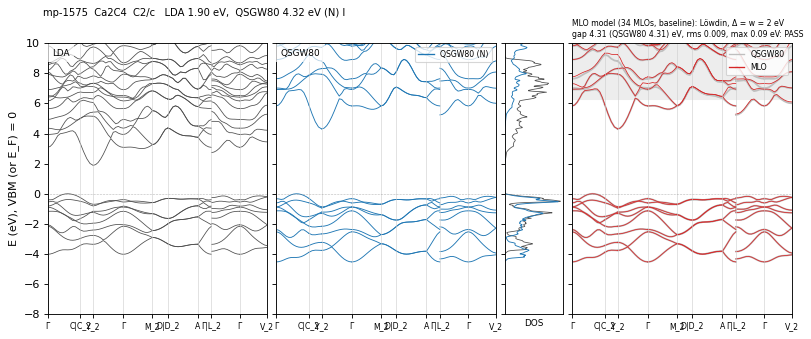

**mp-917** Ca2C4 — QSGW80 **4.59** N / M 4.53 eV I differs — ecalj 989a18637 (tf32, t_tetrakbt -300) — MLO PASS (b2) 58 gap 4.63 rms 0.003 max 0.02 (ecalj fb2da026b)

<small>runs: M 4.53 · N 4.59 (10-05)</small>

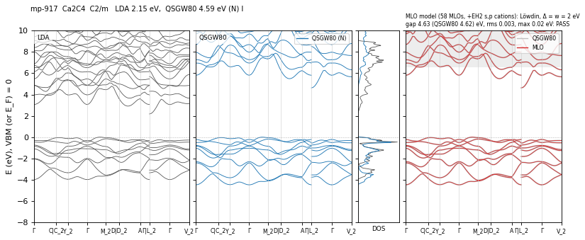

**mp-27546** Ca2Cl2F2 — QSGW80 **9.01** N / M 9.07 eV D differs — ecalj 989a18637 (tf32, t_tetrakbt -300) — MLO PASS (b2) 58 gap 9.01 rms 0.001 max 0.01 (ecalj fb2da026b)

<small>runs: M 9.07 · N 9.01 (10-05)</small>

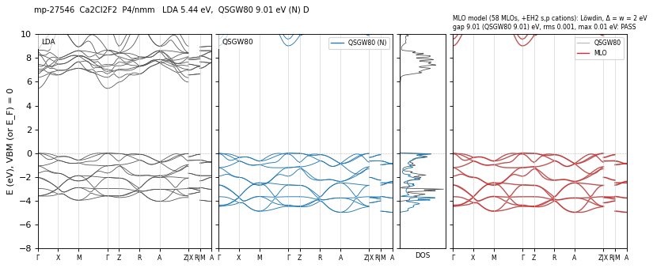

**mp-22904** Ca2Cl4 — QSGW80 **8.37** N / R ≈ eV D  — ecalj b695fa65c (tf32, t_tetrakbt -300) — MLO PASS (b2) 62 gap 8.38 rms 0.005 max 0.07 (ecalj fb2da026b)

<small>runs: M 8.45 · R 8.37 (10-01) · N 8.37 (10-05)</small>

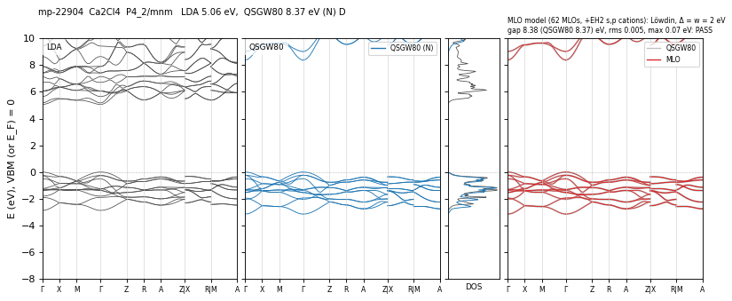

**mp-23214** Ca2Cl4 — QSGW80 **8.44** N / M 8.38 eV D differs — ecalj 989a18637 (tf32, t_tetrakbt -300) — MLO PASS (b2) 62 gap 8.45 rms 0.005 max 0.07 (ecalj fb2da026b)

<small>runs: M 8.38 · N 8.44 (10-03)</small>

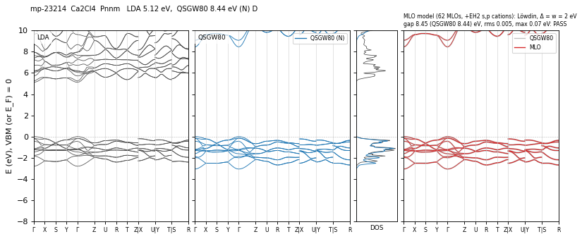

**mp-24422** Ca2H2Br2 — QSGW80 **6.63** N / M ≈ eV I  — ecalj 989a18637 (tf32, t_tetrakbt -300) — MLO PASS (b2) 60 gap 6.63 rms 0.002 max 0.02 (ecalj fb2da026b)

<small>runs: M 6.63 · N 6.63 (10-05)</small>

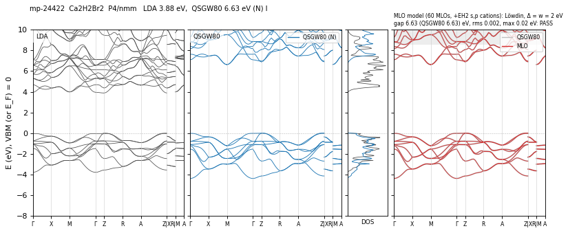

**mp-23859** Ca2H2Cl2 — QSGW80 **6.48** N / M ≈ eV D  — ecalj 989a18637 (tf32, t_tetrakbt -300) — MLO PASS (b2) 60 gap 6.48 rms 0.002 max 0.02 (ecalj fb2da026b)

<small>runs: M 6.44 · N 6.48 (10-05)</small>

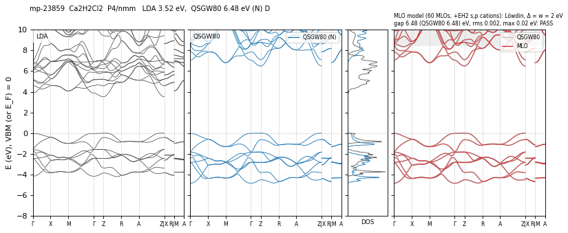

**mp-24204** Ca2H2I2 — QSGW80 **5.44** N / M ≈ eV I  — ecalj 989a18637 (tf32, t_tetrakbt -300) — MLO PASS (b2all) 68 gap 5.44 rms 0.002 max 0.01 (ecalj fb2da026b)

<small>runs: M 5.41 · N 5.44 (10-04)</small>

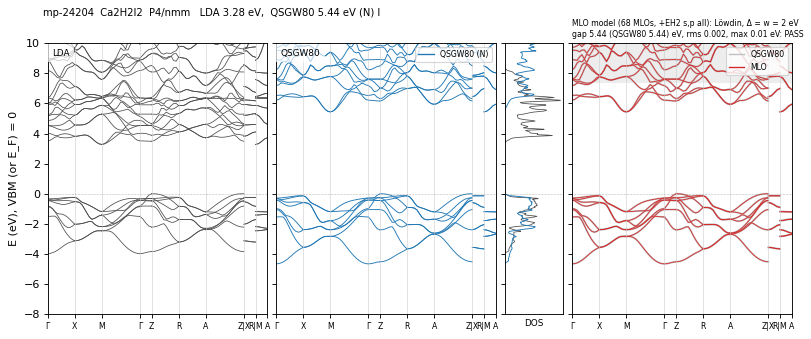

**mp-1018656** Ca2H3Br — QSGW80 **3.83** N / R ≈ eV I  — ecalj 989a18637 (tf32, t_tetrakbt -300) — MLO PASS (b1) 39 gap 3.82 rms 0.002 max 0.02 (ecalj fb2da026b)

<small>runs: M FAILED · R 3.83 (09-30) · N 3.83 (10-05)</small>

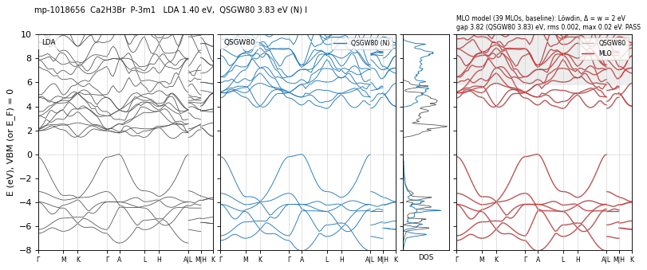

**mp-1205322** Ca2H4 — QSGW80 **2.79** N / M ≈ · path 2.64 eV I path<mesh(mesh) — ecalj 989a18637 (tf32, t_tetrakbt -300) — MLO PASS (b1) 34 gap 2.64 rms 0.002 max 0.02 (ecalj a1d6c0e11)

<small>runs: M 2.79 · N 2.79 (10-04)</small>

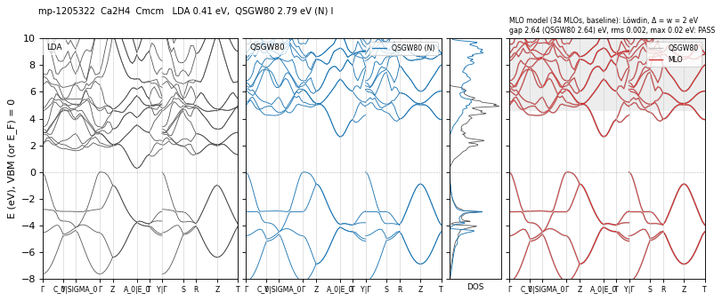

**mp-24809** Ca2H4 — QSGW80 **2.78** N / M ≈ · path 2.62 eV I path<mesh(mesh) — ecalj 989a18637 (tf32, t_tetrakbt -300) — MLO PASS (b1) 34 gap 2.62 rms 0.002 max 0.01 (ecalj fb2da026b)

<small>runs: M 2.77 · N 2.78 (10-05)</small>

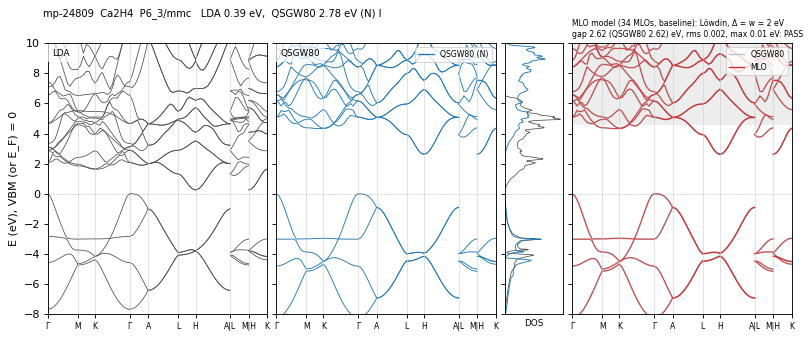

**mp-471** Cd2As4 — QSGW80 **0.77** N / M ≈ eV I  — ecalj 989a18637 (tf32, t_tetrakbt -300) — MLO PASS (b1) 54 gap 0.78 rms 0.006 max 0.05 (ecalj fb2da026b)

<small>runs: M 0.77 · N 0.77 (10-04)</small>

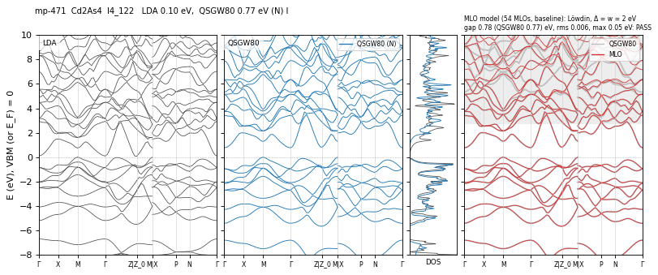

**mp-27934** Cd2Br4 — QSGW80 **4.95** N / M ≈ eV I  — ecalj 989a18637 (tf32, t_tetrakbt -300) — MLO PASS (b1) 54 gap 5.01 rms 0.012 max 0.08 (ecalj fb2da026b)

<small>runs: M 4.96 · N 4.95 (10-04)</small>

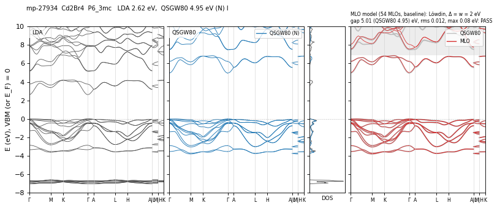

**mp-28248** Cd2I4 — QSGW80 **3.97** E / M ≈ / N ≈ eV I  — ecalj 614ab5eb8 (tf32, t_tetrakbt -300) with ES, ES rule es-a — MLO PASS (b1, ES) 56 gap 3.98 rms 0.001 max 0.01 (ecalj a863cf27f)

<small>runs: M 3.94 · N 3.96 (10-03) · E 3.97 (10-06, ES 2, es-a)</small>

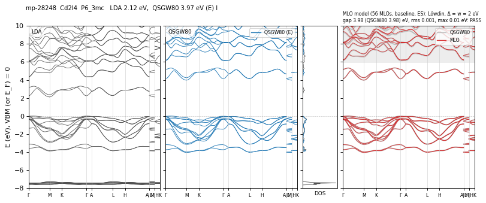

**mp-1492** Cd3Te3 — QSGW80 **0.72** N / M ≈ eV D  — ecalj 989a18637 (tf32, t_tetrakbt -300) — MLO PASS (b1) 54 gap 0.73 rms 0.004 max 0.04 (ecalj fb2da026b)

<small>runs: M 0.73 · N 0.72 (10-05)</small>

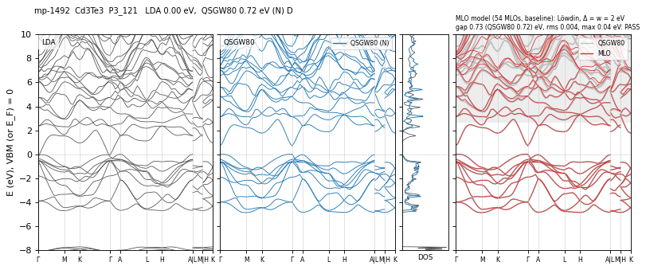

**mp-1077383** Cs2Au2S2 — QSGW80 **3.49** N / M ≈ eV I  — ecalj 989a18637 (tf32, t_tetrakbt -300) — MLO PASS (b2d) 86 gap 3.46 rms 0.002 max 0.03 (ecalj 7d5dfe714)

<small>runs: M 3.51 · N 3.49 (10-04)</small>

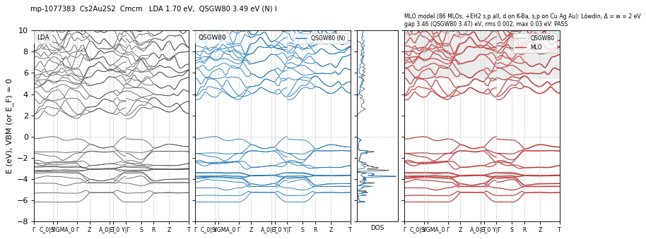

**mp-574599** Cs2Au2Se2 — QSGW80 **3.30** N / M ≈ eV I  — ecalj 989a18637 (tf32, t_tetrakbt -300) — MLO PASS (b2d) 86 gap 3.27 rms 0.003 max 0.03 (ecalj 7d5dfe714)

<small>runs: M 3.26 · N 3.30 (10-04)</small>

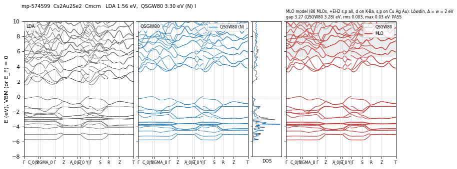

**mp-22935** Cs2Br2F2 — QSGW80 **5.66** E / M 5.40 / N ≈ eV I CHECK — ecalj 614ab5eb8 (tf32, t_tetrakbt -300) with ES, ES rule es-a — MLO PASS (b1, ES) 56 gap 5.68 rms 0.003 max 0.04 (ecalj 1fd34b1c0)

<small>runs: M 5.40 · N 5.63 (10-04) · E 5.66 (10-05, ES 1, es-a)</small>

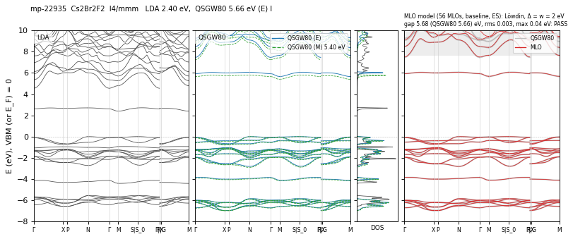

**mp-541037** Cs2Cu2O2 — QSGW80 **2.88** N / M ≈ eV I  — ecalj 989a18637 (tf32, t_tetrakbt -300) — MLO PASS (b2d) 76 gap 2.88 rms 0.004 max 0.05 (ecalj 7d5dfe714)

<small>runs: M 2.86 · N 2.88 (10-03)</small>

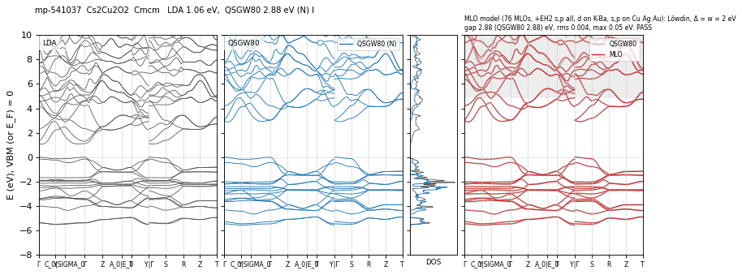

**mp-6973** Cs2Na2S2 — QSGW80 **4.31** N / M ≈ eV I  — ecalj 989a18637 (tf32, t_tetrakbt -300) — MLO PASS (b2) 76 gap 4.31 rms 0.003 max 0.02 (ecalj fb2da026b)

<small>runs: M 4.32 · N 4.31 (10-05)</small>

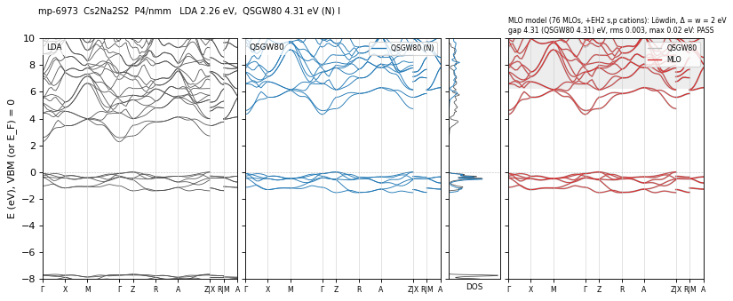

**mp-8658** Cs2Na2Se2 — QSGW80 **3.86** N / M ≈ eV I  — ecalj 989a18637 (tf32, t_tetrakbt -300) — MLO PASS (b2) 76 gap 3.86 rms 0.006 max 0.03 (ecalj fb2da026b)

<small>runs: M 3.85 · N 3.86 (10-04)</small>

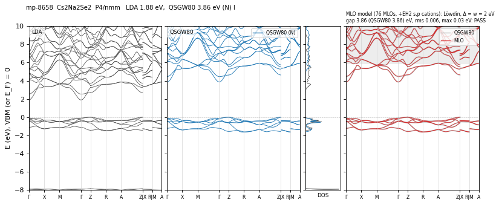

**mp-5339** Cs2Na2Te2 — QSGW80 **3.59** N / M ≈ eV I  — ecalj 989a18637 (tf32, t_tetrakbt -300) — MLO PASS (b2d) 94 gap 3.59 rms 0.001 max 0.01 (ecalj 7d5dfe714)

<small>runs: M 3.57 · N 3.59 (10-05)</small>

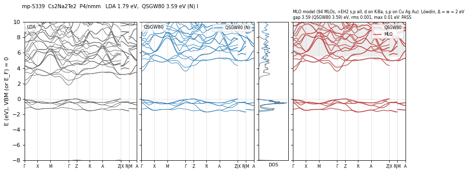

**mp-1541909** Cs2Te2Au2 — QSGW80 **2.70** N / M ≈ eV I  — ecalj 989a18637 (tf32, t_tetrakbt -300) — MLO PASS (b2d) 86 gap 2.68 rms 0.002 max 0.02 (ecalj 7d5dfe714)

<small>runs: M 2.72 · N 2.70 (10-04)</small>

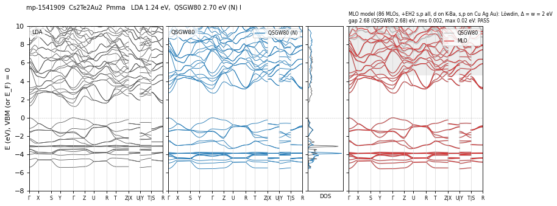

**mp-573755** Cs2Te2Au2 — QSGW80 **2.30** N / M ≈ eV D  — ecalj 989a18637 (tf32, t_tetrakbt -300) — MLO PASS (b2all) 76 gap 2.31 rms 0.004 max 0.07 (ecalj fb2da026b)

<small>runs: M 2.34 · N 2.30 (10-04)</small>

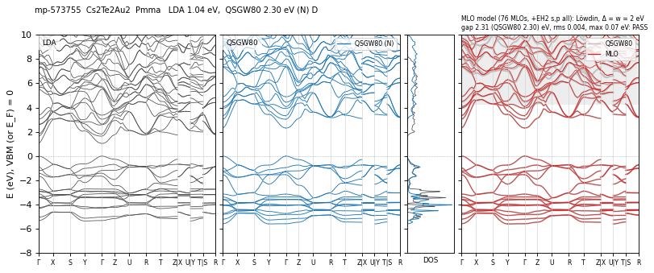

**mp-13548** Cs4Pt2 — QSGW80 **3.11** N / M ≈ eV I  — ecalj 989a18637 (tf32, t_tetrakbt -300) — MLO PASS (b1) 66 gap 3.11 rms 0.009 max 0.07 (ecalj a1d6c0e11)

<small>runs: M 3.10 · N 3.11 (10-04)</small>

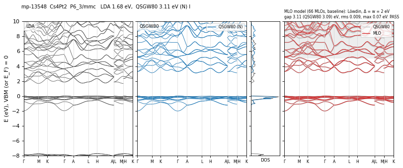

**mp-1077814** Cs4S2 — QSGW80 **3.78** N / M ≈ eV I  — ecalj 989a18637 (tf32, t_tetrakbt -300) — MLO PASS (b2) 82 gap 3.74 rms 0.003 max 0.01 (ecalj a1d6c0e11)

<small>runs: M 3.78 · N 3.78 (10-04)</small>

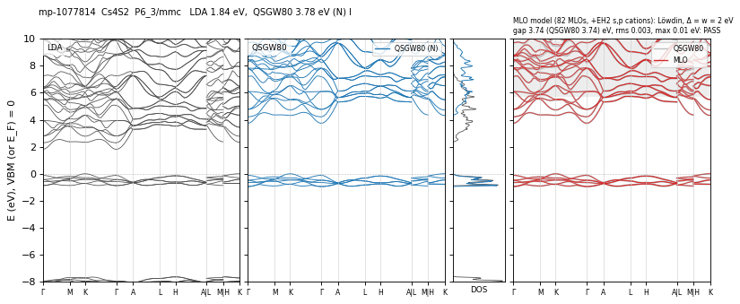

**mp-569272** Cs4Se2 — QSGW80 **3.49** R / N ≈ eV I N:TIMEOUT — ecalj 989a18637 (fp32, t_tetrakbt +300) — MLO PASS (b2all) 90 gap 3.50 rms 0.016 max 0.10 (ecalj 722819fa9)

<small>runs: M 3.81 · R 3.49 (10-01) · N 3.49 TIMEOUT (10-04) · N SKIP SKIP (10-04)</small>

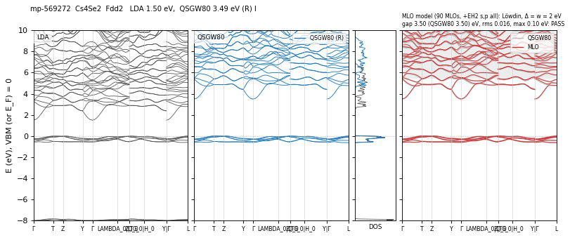

**mp-9384** CsAu3S2 — QSGW80 **3.43** N / M ≈ eV I  — ecalj 989a18637 (tf32, t_tetrakbt -300) — MLO PASS (b2d) 86 gap 3.43 rms 0.001 max 0.01 (ecalj 1fd34b1c0)

<small>runs: M 3.44 · N 3.43 (10-05)</small>

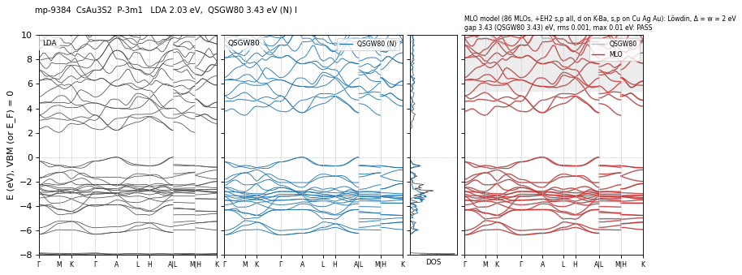

**mp-9386** CsAu3Se2 — QSGW80 **3.24** N / M 3.32 eV I differs — ecalj 989a18637 (tf32, t_tetrakbt -300) — MLO PASS (b2d) 86 gap 3.24 rms 0.001 max 0.01 (ecalj 1fd34b1c0)

<small>runs: M 3.32 · N 3.24 (10-04)</small>

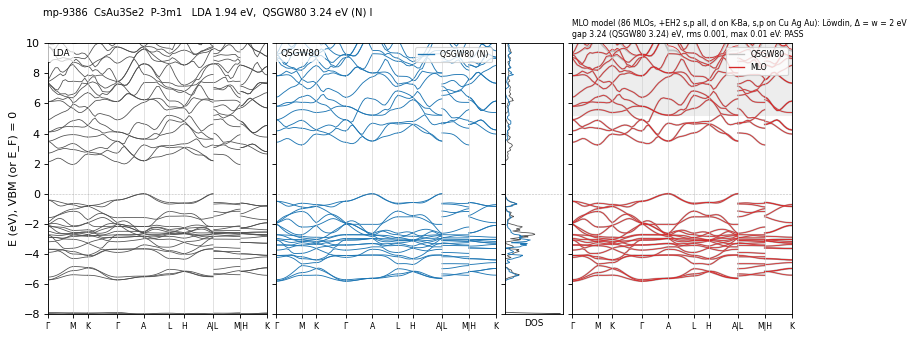

**mp-546711** CsClO4 — QSGW80 **8.87** E / M 0.26 / N 8.95 / R 8.95 eV D CHECK — ecalj 614ab5eb8 (tf32, t_tetrakbt -300) with ES, ES rule es-a — MLO PASS (b1, ES) 42 gap 8.88 rms 0.002 max 0.02 (ecalj a863cf27f)

<small>runs: M 0.26 · R 8.95 (09-30) · N 8.95 (10-03) · E 8.87 (10-06, ES 1, es-a)</small>

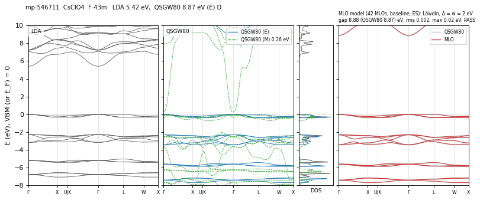

**mp-553303** CsCu3O2 — QSGW80 **3.28** N / M 3.39 eV I differs — ecalj 989a18637 (tf32, t_tetrakbt -300) — MLO PASS (b2d) 76 gap 3.28 rms 0.001 max 0.01 (ecalj 1fd34b1c0)

<small>runs: M 3.39 · N 3.28 (10-03)</small>

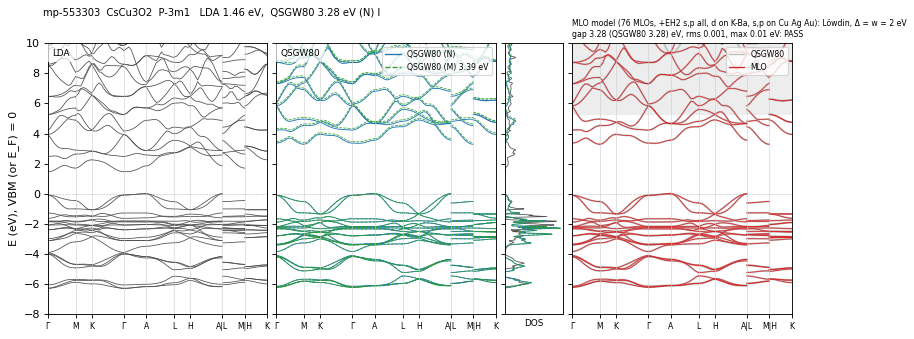

**mp-7786** CsCu3S2 — QSGW80 **3.02** E / M ≈ / N ≈ eV I  — ecalj 614ab5eb8 (tf32, t_tetrakbt -300) with ES, ES rule es-a — MLO PASS (b1, ES) 60 gap 3.02 rms 0.005 max 0.08 (ecalj 1bbefe015)

<small>runs: M 3.07 · N 2.99 (10-04) · E 3.02 (10-06, ES 3, es-a)</small>

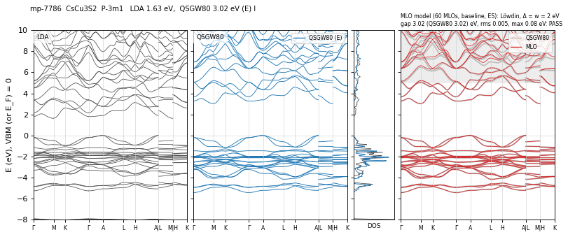

**mp-1077811** Cu2Ag2S2 — QSGW80 **1.37** N / M ≈ eV I  — ecalj 989a18637 (tf32, t_tetrakbt -300) — MLO PASS (b1) 54 gap 1.34 rms 0.001 max 0.02 (ecalj a1d6c0e11)

<small>runs: M 1.38 · N 1.37 (10-04)</small>

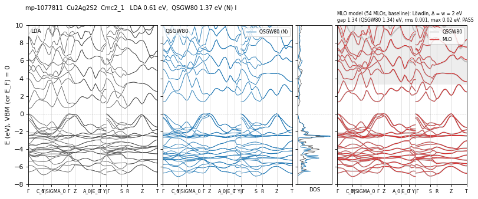

**mp-8911** Cu2Ag2S2 — QSGW80 **0.99** N / M ≈ eV I  — ecalj 989a18637 (tf32, t_tetrakbt -300) — MLO PASS (b1) 54 gap 0.98 rms 0.002 max 0.04 (ecalj fb2da026b)

<small>runs: M 1.00 · N 0.99 (10-03)</small>

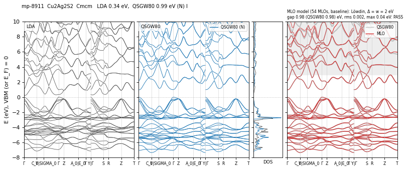

**mp-1072589** Cu2GeS3 — QSGW80 **0.48** N / M ≈ eV D  — ecalj 989a18637 (tf32, t_tetrakbt -300) — MLO PASS (b1) 54 gap 0.49 rms 0.001 max 0.01 (ecalj a1d6c0e11)

<small>runs: M 0.48 · N 0.48 (10-04)</small>

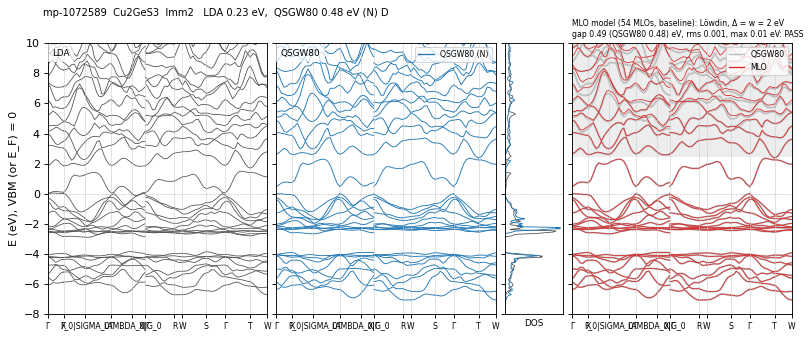

**mp-361** Cu4O2 — QSGW80 **1.91** N / M ≈ eV D  — ecalj 989a18637 (tf32, t_tetrakbt -300) — MLO PASS (b1) 44 gap 1.91 rms 0.008 max 0.07 (ecalj fb2da026b)

<small>runs: M 1.92 · N 1.91 (10-03)</small>

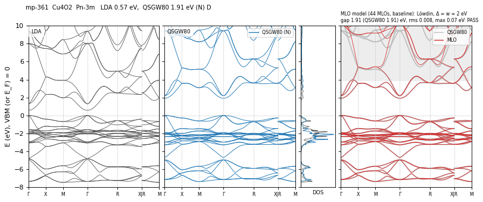

**mp-2008** Fe2As4 — QSGW80 **0.42** N / M ≈ eV I  — ecalj 989a18637 (tf32, t_tetrakbt -300) — MLO PASS (b1) 54 gap 0.41 rms 0.001 max 0.01 (ecalj fb2da026b)

<small>runs: M 0.42 · N 0.42 (10-03)</small>

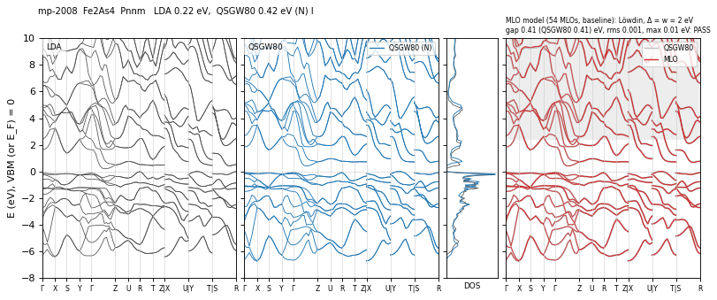

**mp-20027** Fe2P4 — QSGW80 **0.63** N / M ≈ eV I  — ecalj 989a18637 (tf32, t_tetrakbt -300) — MLO PASS (b1) 54 gap 0.63 rms 0.001 max 0.01 (ecalj fb2da026b)

<small>runs: M 0.64 · N 0.63 (10-04)</small>

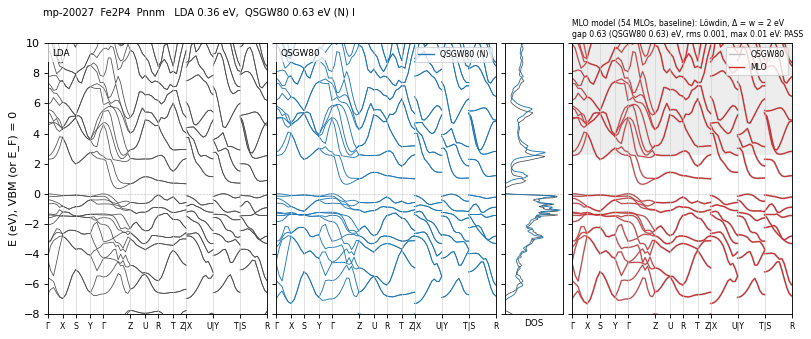

**mp-1522** Fe2S4 — QSGW80 **1.29** N / M ≈ eV I  — ecalj 989a18637 (tf32, t_tetrakbt -300) — MLO PASS (b1) 54 gap 1.26 rms 0.000 max 0.00 (ecalj 96ec5c1ee)

<small>runs: M 1.29 · N 1.29 (10-04)</small>

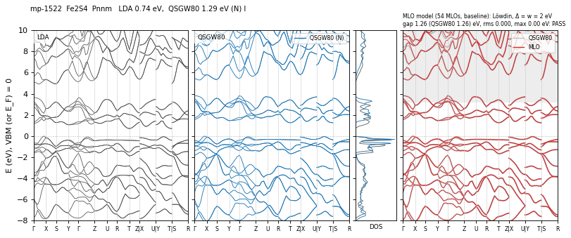

**mp-760** Fe2Se4 — QSGW80 **0.67** N / M ≈ eV I  — ecalj 989a18637 (tf32, t_tetrakbt -300) — MLO PASS (b1) 54 gap 0.69 rms 0.000 max 0.00 (ecalj fb2da026b)

<small>runs: M 0.68 · N 0.67 (10-04)</small>

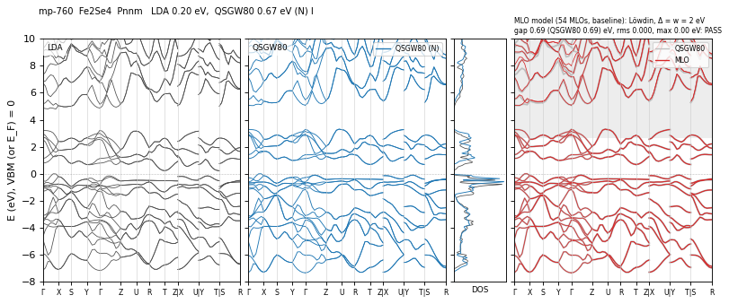

**mp-19880** Fe2Te4 — QSGW80 **0.39** N / M ≈ eV I  — ecalj 989a18637 (tf32, t_tetrakbt -300) — MLO PASS (b1) 54 gap 0.37 rms 0.001 max 0.01 (ecalj fb2da026b)

<small>runs: M 0.39 · N 0.39 (10-05)</small>

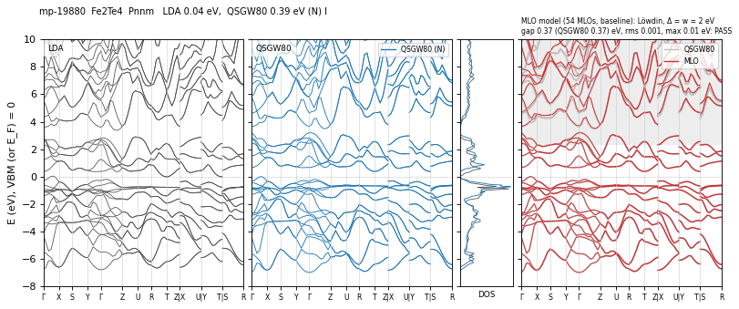

**mp-8211** Ga2Ge2Te2 — QSGW80 **1.12** E / M 1.06 / N ≈ eV D differs — ecalj 614ab5eb8 (tf32, t_tetrakbt -300) with ES, ES rule es-a — MLO PASS (b1, ES) 65 gap 1.12 rms 0.010 max 0.09 (ecalj 1bbefe015)

<small>runs: M 1.06 · N 1.11 (10-04) · E 1.12 (10-06, ES 1, es-a)</small>

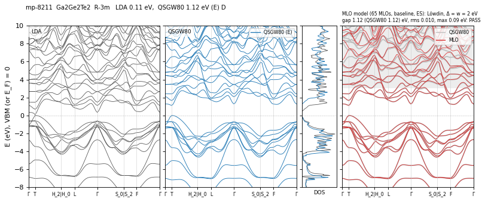

**mp-570875** Ga4Os2 — QSGW80 **1.06** N / M ≈ eV I  — ecalj 989a18637 (tf32, t_tetrakbt -300) — MLO PASS (b1) 74 gap 1.04 rms 0.002 max 0.01 (ecalj fb2da026b)

<small>runs: M 1.06 · N 1.06 (10-05)</small>

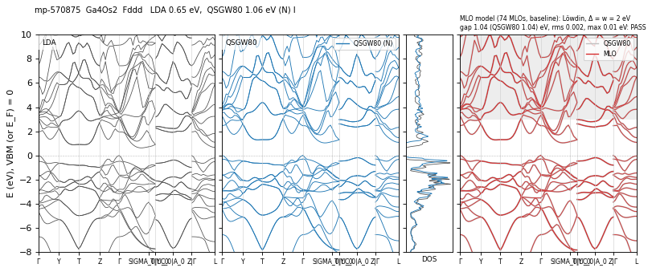

**mp-1072429** Ga4Ru2 — QSGW80 **0.44** N / M ≈ eV I  — ecalj 989a18637 (tf32, t_tetrakbt -300) — MLO PASS (b1) 74 gap 0.42 rms 0.001 max 0.01 (ecalj fb2da026b)

<small>runs: M 0.44 · N 0.44 (10-05)</small>

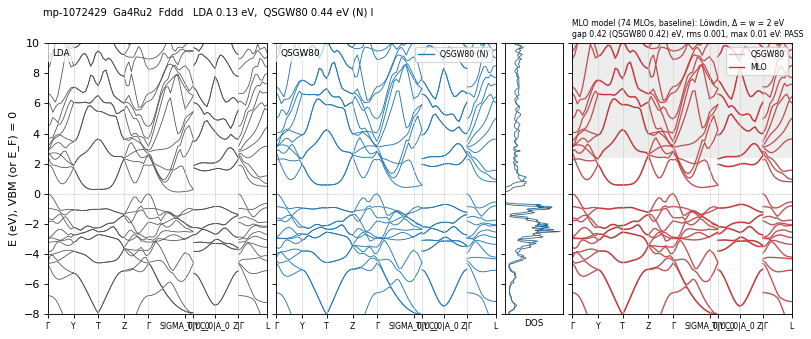

**mp-29403** GaCuI4 — QSGW80 **3.51** N / M ≈ eV D  — ecalj 989a18637 (tf32, t_tetrakbt -300) — MLO PASS (b2all) 79 gap 3.51 rms 0.004 max 0.03 (ecalj fb2da026b)

<small>runs: M 3.51 · N 3.51 (10-04)</small>

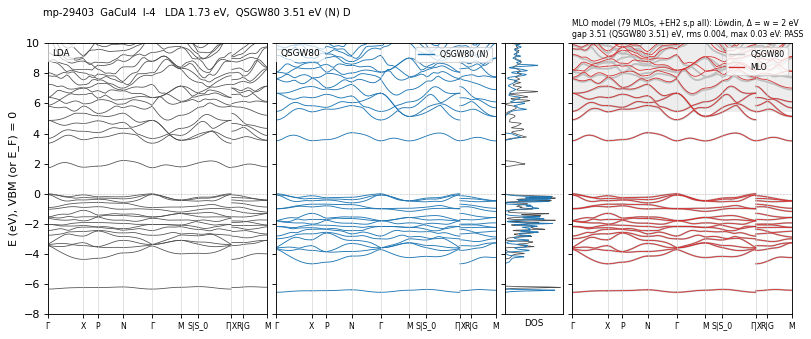

**mp-1072104** Ge2O4 — QSGW80 **3.69** N / M 3.85 eV D differs — ecalj 989a18637 (tf32, t_tetrakbt -300) — MLO PASS (b1) 34 gap 3.69 rms 0.001 max 0.00 (ecalj a1d6c0e11)

<small>runs: M 3.85 · N 3.69 (10-04)</small>

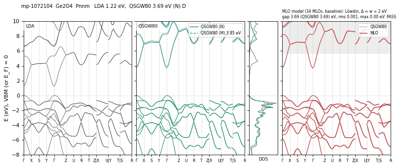

**mp-470** Ge2O4 — QSGW80 **4.21** N / M ≈ eV D  — ecalj 989a18637 (tf32, t_tetrakbt -300) — MLO PASS (b1) 34 gap 4.21 rms 0.001 max 0.01 (ecalj fb2da026b)

<small>runs: M 4.25 · N 4.21 (10-03)</small>

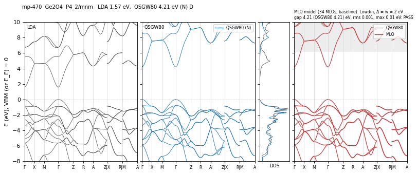

**mp-1071032** Ge2S4 — QSGW80 **2.82** N / M ≈ eV I  — ecalj 989a18637 (tf32, t_tetrakbt -300) — MLO PASS (b1) 54 gap 2.82 rms 0.005 max 0.05 (ecalj fb2da026b)

<small>runs: M 2.82 · N 2.82 (10-05)</small>

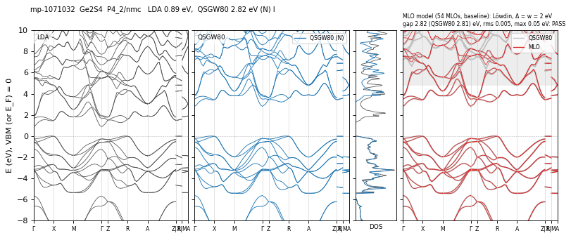

**mp-7582** Ge2S4 — QSGW80 **4.20** N / M ≈ eV I  — ecalj 989a18637 (tf32, t_tetrakbt -300) — MLO PASS (b1) 54 gap 4.20 rms 0.017 max 0.09 (ecalj fb2da026b)

<small>runs: M 4.17 · N 4.20 (10-04)</small>

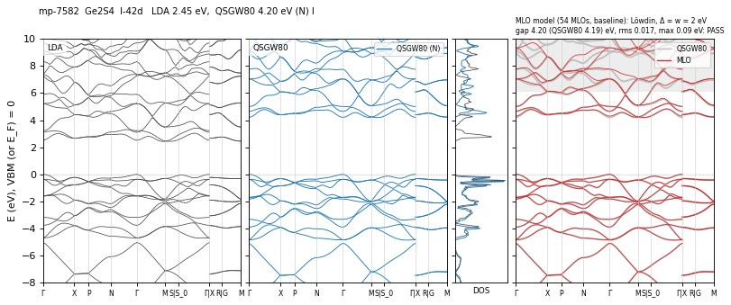

**mp-10074** Ge2Se4 — QSGW80 **2.86** N / M ≈ eV I  — ecalj 989a18637 (tf32, t_tetrakbt -300) — MLO PASS (b2) 62 gap 2.85 rms 0.004 max 0.03 (ecalj fb2da026b)

<small>runs: M 2.88 · N 2.86 (10-05)</small>

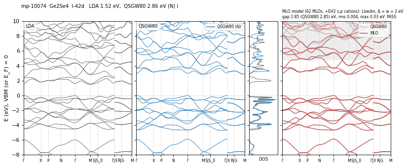

**mp-36248** H4BrN — QSGW80 **6.85** N / R ≈ eV I  — ecalj 989a18637 (tf32, t_tetrakbt -300) — MLO PASS (b2) 45 gap 6.85 rms 0.004 max 0.04 (ecalj fb2da026b)

<small>runs: M FAILED · R 6.85 (09-30) · N 6.85 (10-03)</small>

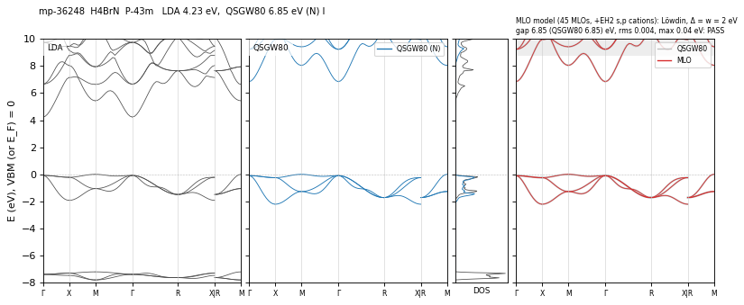

**mp-30302** Hf2Br2N2 — QSGW80 **3.45** N / R ≈ · path 3.35 eV I path<mesh(mesh) — ecalj b695fa65c (tf32, t_tetrakbt -300) — MLO PASS (b2all) 74 gap 3.35 rms 0.001 max 0.01 (ecalj 614ab5eb8)

<small>runs: M FAILED · R 3.45 (09-30) · N 3.45 (10-05)</small>

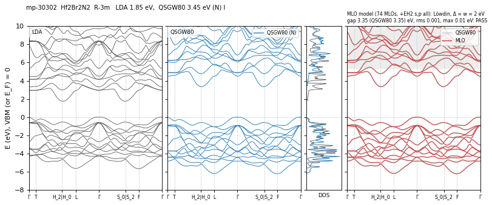

**mp-568346** Hf2Br2N2 — QSGW80 **3.80** N / M ≈ eV D  — ecalj 989a18637 (tf32, t_tetrakbt -300) — MLO PASS (b2all) 74 gap 3.80 rms 0.001 max 0.00 (ecalj fb2da026b)

<small>runs: M 3.83 · N 3.80 (10-04)</small>

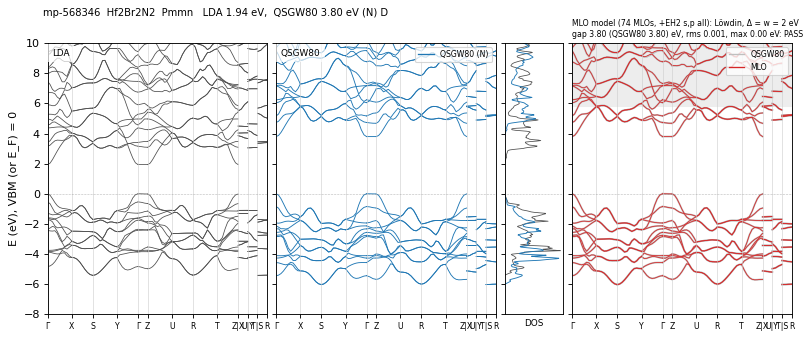

**mp-567441** Hf2I2N2 — QSGW80 **2.30** N / R ≈ eV I  — ecalj b695fa65c (tf32, t_tetrakbt -300) — MLO PASS (b2all) 74 gap 2.22 rms 0.001 max 0.01 (ecalj 614ab5eb8)

<small>runs: M FAILED · R 2.30 (09-30) · N 2.30 (10-04)</small>

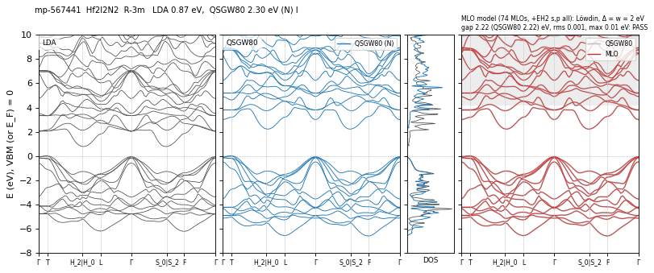

**mp-541911** Hf2N2Cl2 — QSGW80 **4.00** N / M ≈ · path 3.88 eV I path<mesh(mesh) — ecalj 989a18637 (tf32, t_tetrakbt -300) — MLO PASS (b2all) 74 gap 3.88 rms 0.001 max 0.00 (ecalj fb2da026b)

<small>runs: M 3.96 · N 4.00 (10-03)</small>

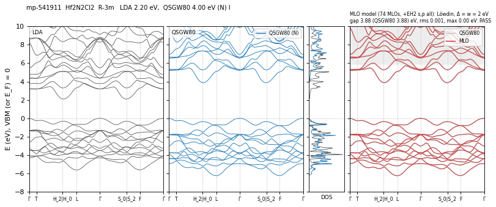

**mp-1018721** Hf2O4 — QSGW80 **6.86** N / M ≈ eV I  — ecalj 989a18637 (tf32, t_tetrakbt -300) — MLO PASS (b2all) 64 gap 6.86 rms 0.001 max 0.01 (ecalj fb2da026b)

<small>runs: M 6.87 · N 6.86 (10-05)</small>

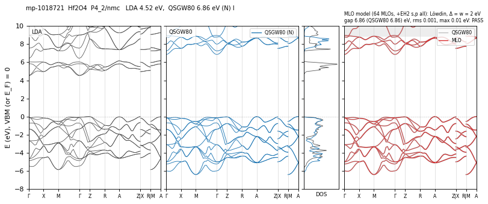

**mp-23292** Hg2Br4 — QSGW80 **4.45** E / M ≈ / N 4.51 eV D differs — ecalj 614ab5eb8 (tf32, t_tetrakbt -300) with ES, ES rule es-a — MLO PASS (b1, ES) 58 gap 4.46 rms 0.001 max 0.01 (ecalj 75eff0d12)

<small>runs: M 4.49 · N 4.51 (10-04) · E 4.45 (10-05, ES 4, es-a)</small>

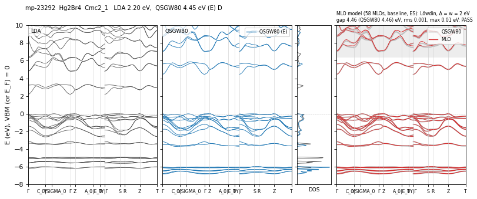

**mp-570172** Hg2I2Br2 — QSGW80 **4.03** E / M 4.11 / N 4.10 eV D differs — ecalj 614ab5eb8 (tf32, t_tetrakbt -300) with ES, ES rule es-a — MLO PASS (b1, ES) 58 gap 4.03 rms 0.001 max 0.01 (ecalj 1bbefe015)

<small>runs: M 4.11 · N 4.10 (10-03) · E 4.03 (10-06, ES 4, es-a)</small>

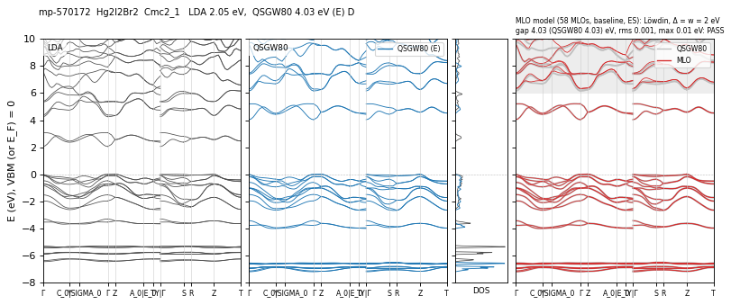

**mp-23173** Hg2I4 — QSGW80 **3.82** E / M ≈ / N ≈ eV I  — ecalj 614ab5eb8 (tf32, t_tetrakbt -300) with ES, ES rule es-a — MLO PASS (b2, ES) 66 gap 3.82 rms 0.001 max 0.01 (ecalj 75eff0d12)

<small>runs: M 3.85 · N 3.85 (10-04) · E 3.82 (10-05, ES 4, es-a)</small>

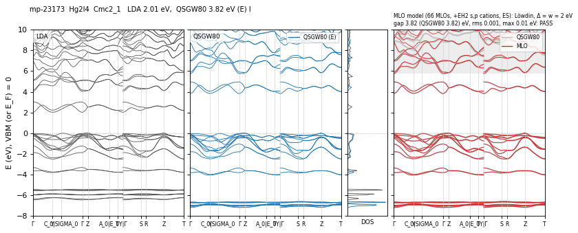

**mp-23192** Hg2I4 — QSGW80 **2.56** N / M ≈ eV D  — ecalj 989a18637 (tf32, t_tetrakbt -300) — MLO PASS (b1) 54 gap 2.61 rms 0.005 max 0.04 (ecalj fb2da026b)

<small>runs: M 2.60 · N 2.56 (10-03)</small>

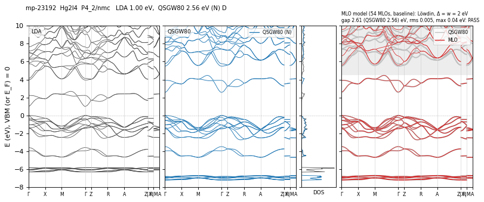

**mp-1077107** Hg3O3 — QSGW80 **2.59** N / M ≈ eV I  — ecalj 989a18637 (tf32, t_tetrakbt -300) — MLO PASS (b1) 39 gap 2.58 rms 0.001 max 0.03 (ecalj a1d6c0e11)

<small>runs: M 2.60 · N 2.59 (10-03)</small>

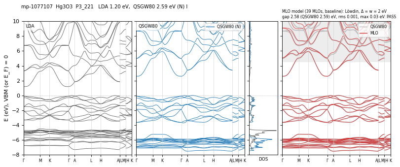

**mp-7826** Hg3O3 — QSGW80 **2.49** N / M 2.58 eV I differs — ecalj 989a18637 (tf32, t_tetrakbt -300) — MLO PASS (b1) 39 gap 2.48 rms 0.001 max 0.02 (ecalj fb2da026b)

<small>runs: M 2.58 · N 2.49 (10-05)</small>

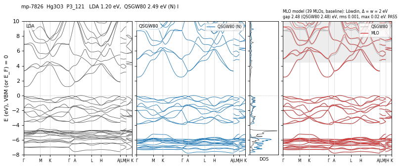

**mp-634** Hg3S3 — QSGW80 **0.00** N / R ≈ eV metal  — ecalj 989a18637 (tf32, t_tetrakbt -300) — MLO PASS (b1) 54 rms 0.000 max 0.00 (ecalj fb2da026b)

<small>runs: M UNKNOWN · R CONVERGED_METAL (10-01) · N CONVERGED_METAL (10-03)</small>

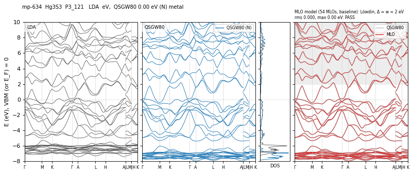

**mp-9252** Hg3S3 — QSGW80 **2.80** N / M ≈ eV I  — ecalj 989a18637 (tf32, t_tetrakbt -300) — MLO PASS (b2) 66 gap 2.80 rms 0.001 max 0.00 (ecalj fb2da026b)

<small>runs: M 2.80 · N 2.80 (10-05)</small>

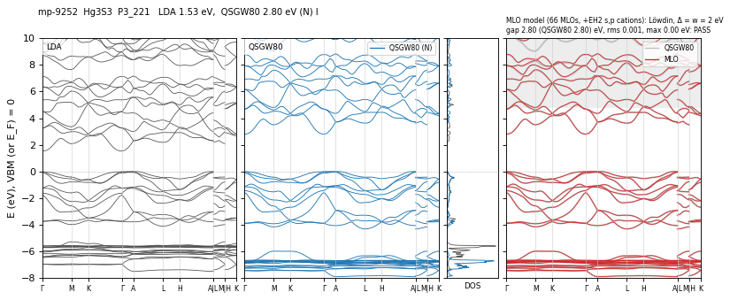

**mp-1018722** Hg3Se3 — QSGW80 **1.80** N / M ≈ eV I  — ecalj 989a18637 (tf32, t_tetrakbt -300) — MLO PASS (b1) 54 gap 1.80 rms 0.007 max 0.10 (ecalj fb2da026b)

<small>runs: M 1.81 · N 1.80 (10-05)</small>

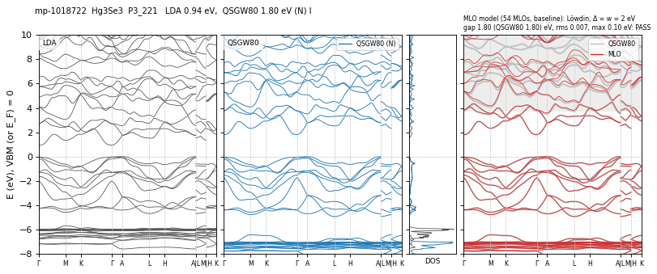

**mp-1071269** Hg3Te3 — QSGW80 **1.16** N / M ≈ eV I  — ecalj 989a18637 (tf32, t_tetrakbt -300) — MLO PASS (b1) 54 gap 1.17 rms 0.009 max 0.09 (ecalj a1d6c0e11)

<small>runs: M 1.16 · N 1.16 (10-03)</small>

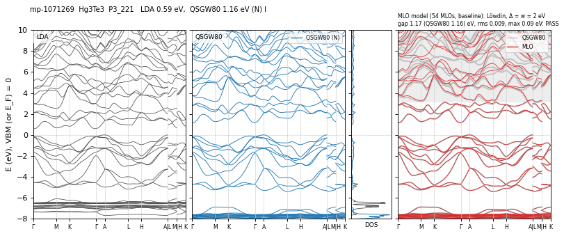

**mp-358** Hg3Te3 — QSGW80 **1.11** N / M ≈ eV I  — ecalj 989a18637 (tf32, t_tetrakbt -300) — MLO PASS (b1) 54 gap 1.11 rms 0.008 max 0.09 (ecalj fb2da026b)

<small>runs: M 1.12 · N 1.11 (10-04)</small>

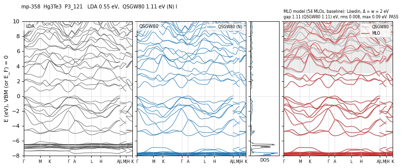

**mp-1077098** Hg6 — QSGW80 **1.79** N / M ≈ eV I  — ecalj 989a18637 (tf32, t_tetrakbt -300) — MLO PASS (b1) 54 gap 1.79 rms 0.001 max 0.01 (ecalj a1d6c0e11)

<small>runs: M 1.79 · N 1.79 (10-04)</small>

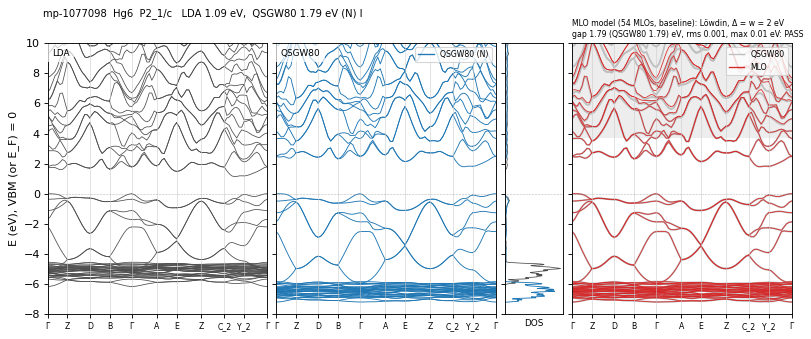

**mp-27703** In2Br2O2 — QSGW80 **4.00** N / M ≈ eV I  — ecalj 989a18637 (tf32, t_tetrakbt -300) — MLO PASS (b1) 54 gap 4.06 rms 0.006 max 0.06 (ecalj fb2da026b)

<small>runs: M 3.97 · N 4.00 (10-03)</small>

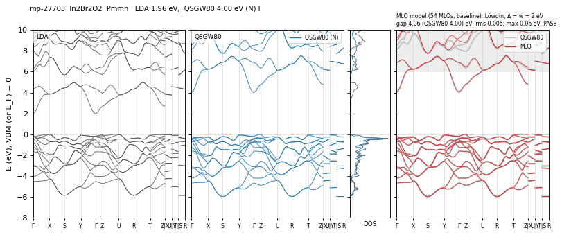

**mp-27702** In2Cl2O2 — QSGW80 **4.56** N / M 4.51 eV I differs — ecalj 989a18637 (tf32, t_tetrakbt -300) — MLO PASS (b1) 54 gap 4.62 rms 0.006 max 0.06 (ecalj fb2da026b)

<small>runs: M 4.51 · N 4.56 (10-05)</small>

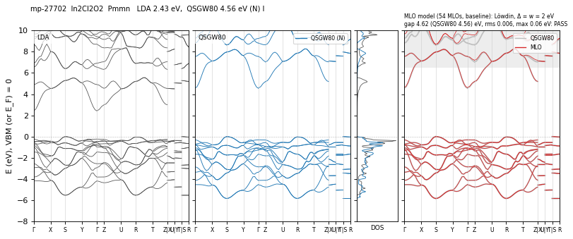

**mp-20790** InPS4 — QSGW80 **3.86** N / M ≈ eV I  — ecalj 989a18637 (tf32, t_tetrakbt -300) — MLO PASS (b2all) 83 gap 3.86 rms 0.001 max 0.01 (ecalj fb2da026b)

<small>runs: M 3.85 · N 3.86 (10-04)</small>

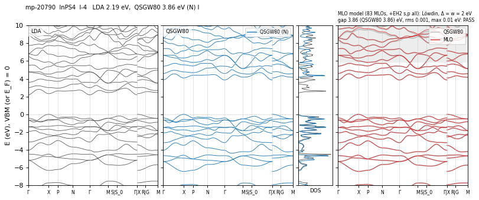

**mp-16236** K2Ag2Se2 — QSGW80 **1.67** N / M ≈ eV D  — ecalj 989a18637 (tf32, t_tetrakbt -300) — MLO PASS (b1) 60 gap 1.68 rms 0.005 max 0.07 (ecalj 0c4d16ceb)

<small>runs: M 1.65 · N 1.67 (10-04)</small>

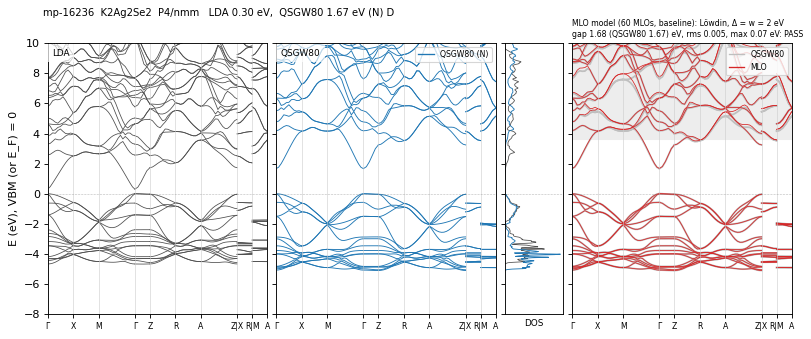

**mp-7077** K2Au2S2 — QSGW80 **3.73** N / M 3.67 eV I differs — ecalj 989a18637 (tf32, t_tetrakbt -300) — MLO PASS (b2) 68 gap 3.67 rms 0.004 max 0.04 (ecalj fb2da026b)

<small>runs: M 3.67 · N 3.73 (10-05)</small>

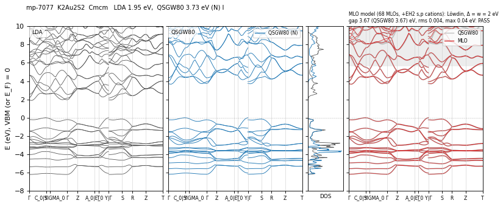

**mp-9881** K2Au2Se2 — QSGW80 **3.36** N / M ≈ eV I  — ecalj 989a18637 (tf32, t_tetrakbt -300) — MLO PASS (b2) 68 gap 3.34 rms 0.005 max 0.07 (ecalj fb2da026b)

<small>runs: M 3.38 · N 3.36 (10-05)</small>

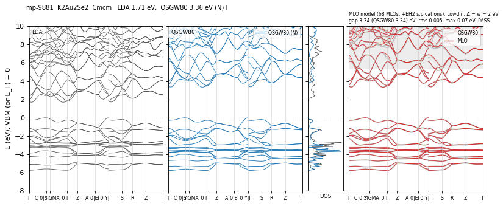

**mp-1077078** K2C2N2 — QSGW80 **9.04** N / M 8.96 eV I differs — ecalj 989a18637 (tf32, t_tetrakbt -300) — MLO PASS (b2all) 64 gap 9.04 rms 0.007 max 0.04 (ecalj a1d6c0e11)

<small>runs: M 8.96 · N 9.04 (10-03)</small>

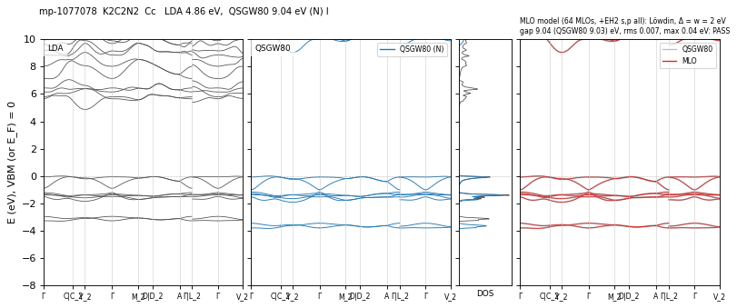

**mp-1018736** K2Cd2As2 — QSGW80 **0.91** N / M ≈ eV D  — ecalj 989a18637 (tf32, t_tetrakbt -300) — MLO PASS (b2) 76 gap 0.91 rms 0.001 max 0.01 (ecalj a1d6c0e11)

<small>runs: M 0.90 · N 0.91 (10-04)</small>

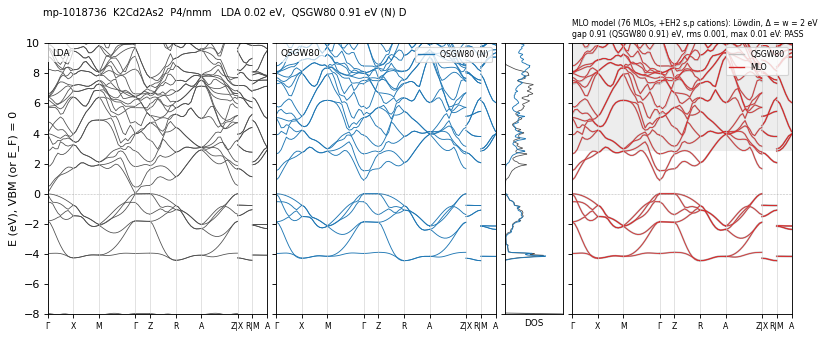

**mp-7435** K2Cu2Se2 — QSGW80 **1.76** N / M ≈ eV D  — ecalj 989a18637 (tf32, t_tetrakbt -300) — MLO PASS (b1) 60 gap 1.77 rms 0.008 max 0.08 (ecalj fb2da026b)

<small>runs: M 1.77 · N 1.76 (10-03)</small>

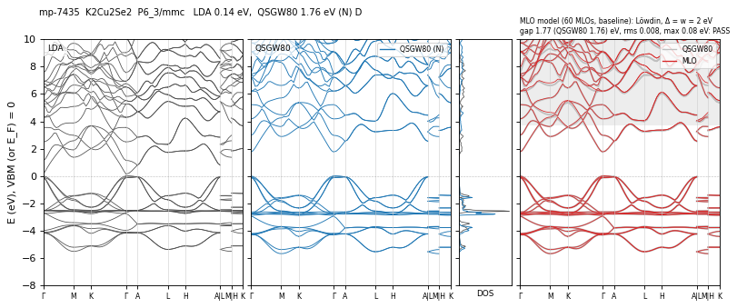

**mp-7436** K2Cu2Te2 — QSGW80 **1.98** N / M ≈ eV D  — ecalj 989a18637 (tf32, t_tetrakbt -300) — MLO PASS (b2) 68 gap 1.98 rms 0.003 max 0.03 (ecalj fb2da026b)

<small>runs: M 2.02 · N 1.98 (10-03)</small>

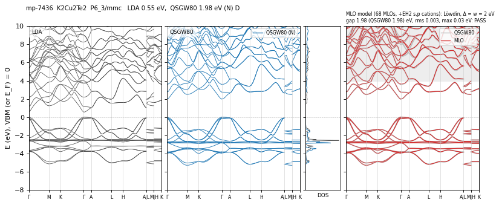

**mp-634676** K2H2S2 — QSGW80 **5.81** N / M 5.67 eV D differs — ecalj 989a18637 (tf32, t_tetrakbt -300) — MLO PASS (b2) 66 gap 5.81 rms 0.009 max 0.06 (ecalj fb2da026b)

<small>runs: M 5.67 · N 5.81 (10-04)</small>

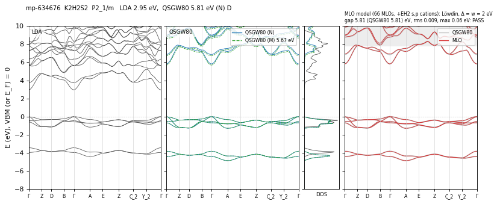

**mp-722181** K2Li2S2 — QSGW80 **4.81** N / M ≈ eV D  — ecalj 989a18637 (tf32, t_tetrakbt -300) — MLO PASS (b2) 66 gap 4.81 rms 0.002 max 0.01 (ecalj fb2da026b)

<small>runs: M 4.81 · N 4.81 (10-05)</small>

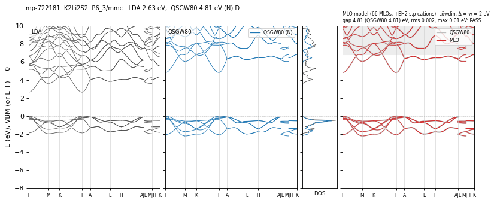

**mp-8430** K2Li2S2 — QSGW80 **5.05** N / M ≈ eV I  — ecalj 989a18637 (tf32, t_tetrakbt -300) — MLO PASS (b2) 66 gap 5.05 rms 0.001 max 0.01 (ecalj fb2da026b)

<small>runs: M 5.08 · N 5.05 (10-04)</small>

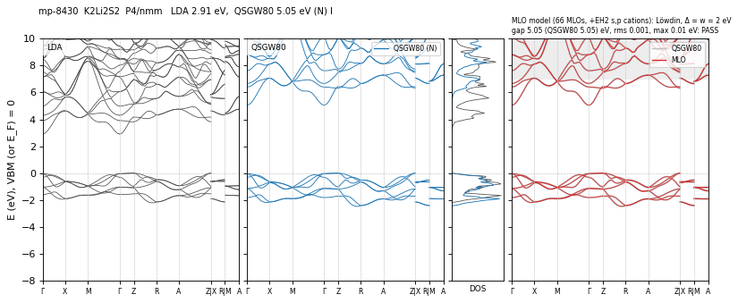

**mp-8756** K2Li2Se2 — QSGW80 **4.43** N / M ≈ eV I  — ecalj 989a18637 (tf32, t_tetrakbt -300) — MLO PASS (b2) 66 gap 4.43 rms 0.002 max 0.01 (ecalj fb2da026b)

<small>runs: M 4.42 · N 4.43 (10-03)</small>

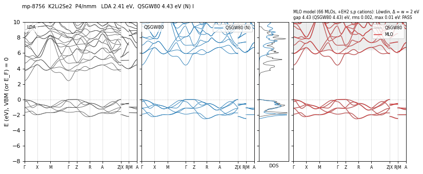

**mp-4495** K2Li2Te2 — QSGW80 **4.02** N / M ≈ eV D  — ecalj 989a18637 (tf32, t_tetrakbt -300) — MLO PASS (b2) 66 gap 4.02 rms 0.007 max 0.04 (ecalj fb2da026b)

<small>runs: M 4.02 · N 4.02 (10-04)</small>

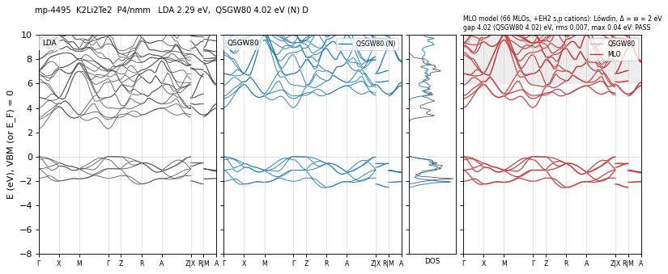

**mp-1019089** K2Mg2As2 — QSGW80 **2.34** N / M ≈ eV I  — ecalj 989a18637 (tf32, t_tetrakbt -300) — MLO PASS (b2) 76 gap 2.34 rms 0.002 max 0.02 (ecalj fb2da026b)

<small>runs: M 2.34 · N 2.34 (10-05)</small>

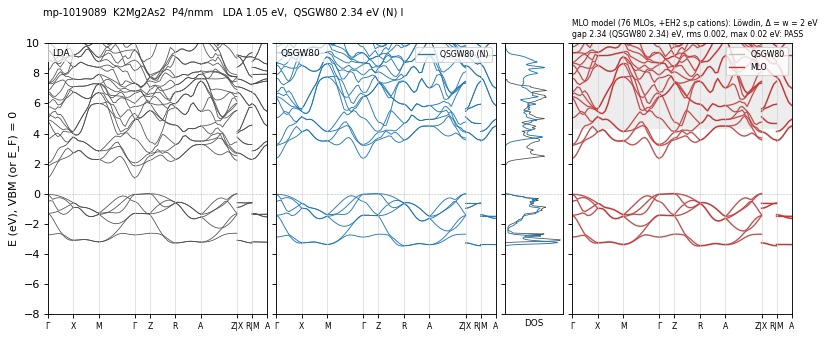

**mp-1019105** K2Mg2Bi2 — QSGW80 **1.28** N / M ≈ eV D  — ecalj 989a18637 (tf32, t_tetrakbt -300) — MLO PASS (b2) 84 gap 1.28 rms 0.002 max 0.05 (ecalj a1d6c0e11)

<small>runs: M 1.29 · N 1.28 (10-04)</small>

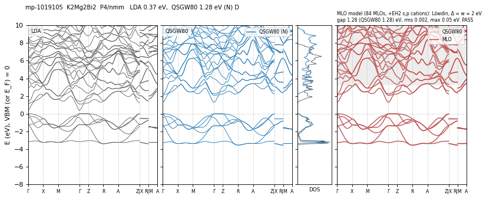

**mp-1018737** K2Mg2P2 — QSGW80 **2.84** N / M ≈ eV I  — ecalj 989a18637 (tf32, t_tetrakbt -300) — MLO PASS (b2) 76 gap 2.84 rms 0.002 max 0.01 (ecalj fb2da026b)

<small>runs: M 2.85 · N 2.84 (10-05)</small>

**mp-7089** K2Mg2Sb2 — QSGW80 **2.35** N / M ≈ eV D  — ecalj 989a18637 (tf32, t_tetrakbt -300) — MLO PASS (b2) 76 gap 2.35 rms 0.005 max 0.04 (ecalj fb2da026b)

<small>runs: M 2.34 · N 2.35 (10-04)</small>

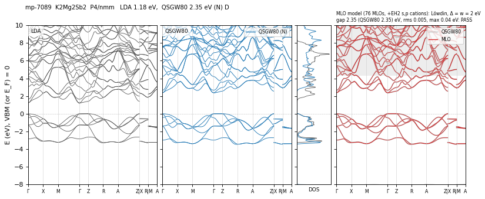

**mp-6948** K2Na2O2 — QSGW80 **4.93** N / M ≈ eV I  — ecalj 989a18637 (tf32, t_tetrakbt -300) — MLO PASS (b1) 50 gap 4.94 rms 0.000 max 0.00 (ecalj fb2da026b)

<small>runs: M 4.96 · N 4.93 (10-03)</small>

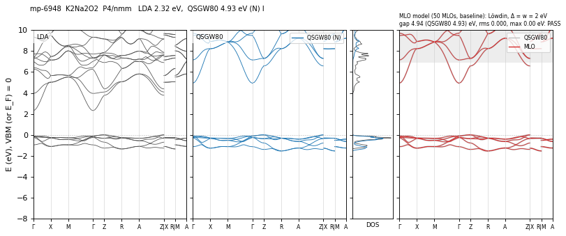

**mp-29055** K2Sb4 — QSGW80 **0.73** N / M ≈ eV I  — ecalj 989a18637 (tf32, t_tetrakbt -300) — MLO PASS (b2) 62 gap 0.75 rms 0.002 max 0.02 (ecalj fb2da026b)

<small>runs: M 0.72 · N 0.73 (10-05)</small>

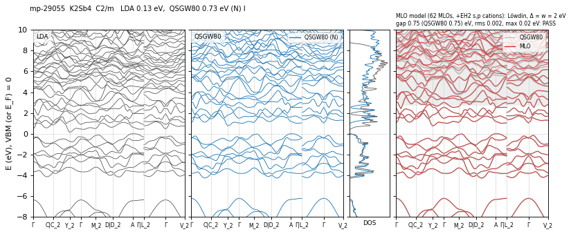

**mp-3481** K2Sn2As2 — QSGW80 **1.02** N / M ≈ eV I  — ecalj 989a18637 (tf32, t_tetrakbt -300) — MLO PASS (b2) 76 gap 1.01 rms 0.002 max 0.02 (ecalj fb2da026b)

<small>runs: M 1.02 · N 1.02 (10-04)</small>

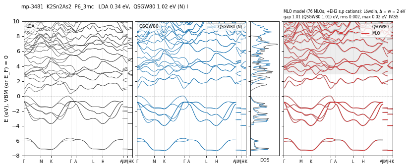

**mp-3486** K2Sn2Sb2 — QSGW80 **0.86** N / M ≈ eV I  — ecalj 989a18637 (tf32, t_tetrakbt -300) — MLO PASS (b2) 70 gap 0.84 rms 0.002 max 0.02 (ecalj fb2da026b)

<small>runs: M 0.85 · N 0.86 (10-04)</small>

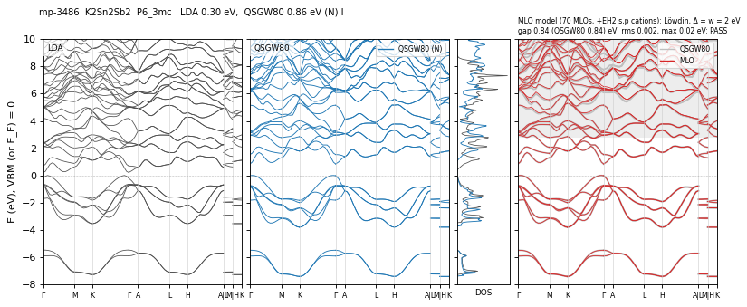

**mp-27716** K2Tl2O2 — QSGW80 **2.33** N / R ≈ eV I  — ecalj b695fa65c (tf32, t_tetrakbt -300) — MLO PASS (b2) 76 gap 2.57 rms 0.002 max 0.01 (ecalj fb2da026b)

<small>runs: M 2.57 · R 2.33 (10-01) · N 2.33 (10-04)</small>

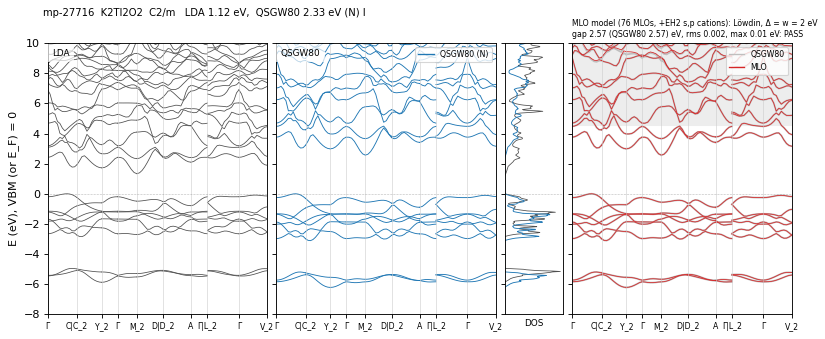

**mp-7421** K2Zn2As2 — QSGW80 **1.55** N / M ≈ eV D  — ecalj 989a18637 (tf32, t_tetrakbt -300) — MLO PASS (b2) 76 gap 1.55 rms 0.003 max 0.02 (ecalj fb2da026b)

<small>runs: M 1.54 · N 1.55 (10-04)</small>

**mp-7437** K2Zn2P2 — QSGW80 **1.98** N / M ≈ eV D  — ecalj 989a18637 (tf32, t_tetrakbt -300) — MLO PASS (b2) 76 gap 1.98 rms 0.003 max 0.02 (ecalj fb2da026b)

<small>runs: M 1.98 · N 1.98 (10-05)</small>

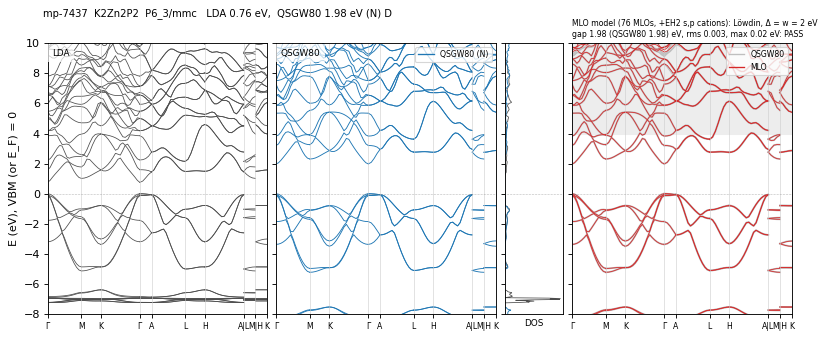

**mp-7438** K2Zn2Sb2 — QSGW80 **1.67** N / M ≈ eV D  — ecalj 989a18637 (tf32, t_tetrakbt -300) — MLO PASS (b2) 86 gap 1.67 rms 0.003 max 0.03 (ecalj fb2da026b)

<small>runs: M 1.67 · N 1.67 (10-05)</small>

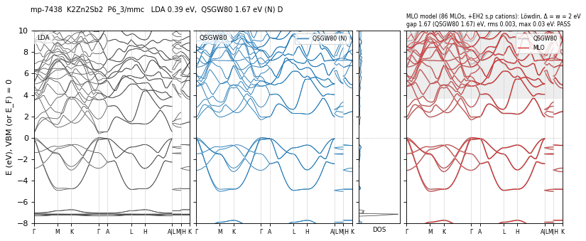

**mp-559278** K4S2 — QSGW80 **3.86** N / M ≈ eV D  — ecalj 989a18637 (tf32, t_tetrakbt -300) — MLO PASS (b1) 66 gap 3.86 rms 0.003 max 0.02 (ecalj fb2da026b)

<small>runs: M 3.84 · N 3.86 (10-04)</small>

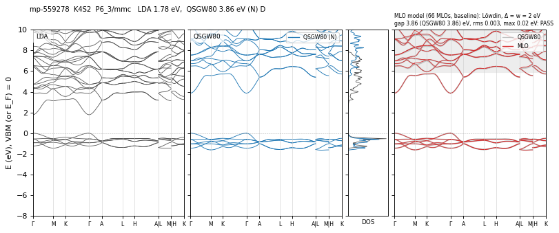

**mp-5347** KAlF4 — QSGW80 **11.70** N / M 11.81 eV I differs — ecalj 989a18637 (tf32, t_tetrakbt -300) — MLO PASS (b2) 45 gap 11.70 rms 0.001 max 0.02 (ecalj fb2da026b)

<small>runs: M 11.81 · N 11.70 (10-05)</small>

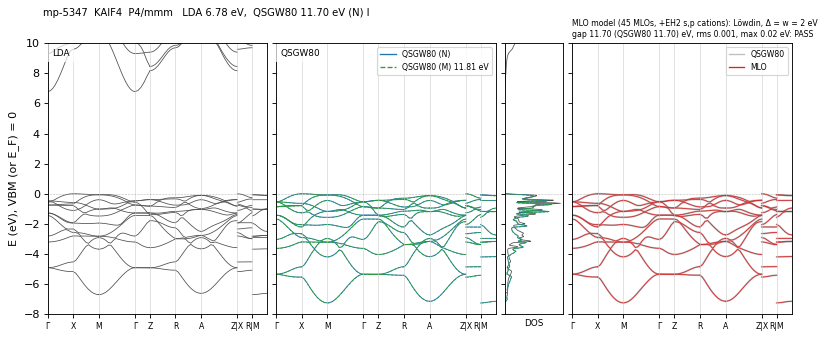

**mp-567299** KC2IN2 — QSGW80 **7.53** E / R 7.59 eV D differs N:SKIP — ecalj 614ab5eb8 (tf32, t_tetrakbt -300) with ES, ES rule es-a — MLO PASS (b2all, ES) 63 gap 7.53 rms 0.003 max 0.02 (ecalj 1bbefe015)

<small>runs: M FAILED · R 7.59 (09-30) · N 7.17 FAIL(1) (10-05) · N SKIP SKIP (10-05) · E 7.53 (10-06, ES 2, es-a)</small>

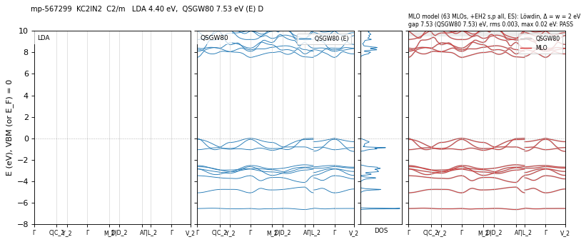

**mp-546633** KClO4 — QSGW80 **8.73** E / M 8.93 / N ≈ eV I CHECK — ecalj 614ab5eb8 (tf32, t_tetrakbt -300) with ES, ES rule es-a — MLO PASS (b1, ES) 41 gap 8.73 rms 0.000 max 0.00 (ecalj a863cf27f)

<small>runs: M 8.93 · N 8.77 (10-05) · E 8.73 (10-06, ES 1, es-a)</small>

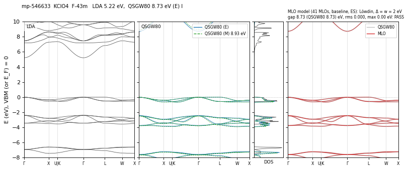

**mp-1019888** KNa2BN2 — QSGW80 **3.85** N / M ≈ eV I  — ecalj 989a18637 (tf32, t_tetrakbt -300) — MLO PASS (b1) 42 gap 3.85 rms 0.002 max 0.03 (ecalj a1d6c0e11)

<small>runs: M 3.87 · N 3.85 (10-04)</small>

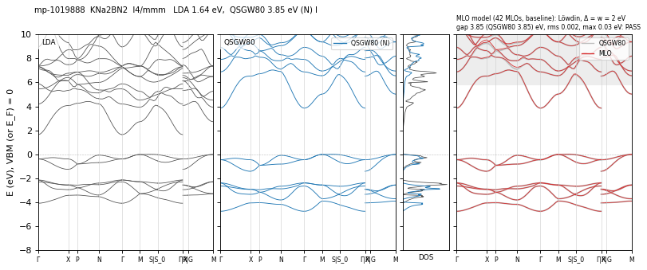

**mp-545359** KNa2CuO2 — QSGW80 **4.06** N / M 3.76 eV I CHECK — ecalj 989a18637 (tf32, t_tetrakbt -300) — MLO PASS (b1) 47 gap 4.06 rms 0.006 max 0.09 (ecalj fb2da026b)

<small>runs: M 3.76 · N 4.06 (10-04)</small>

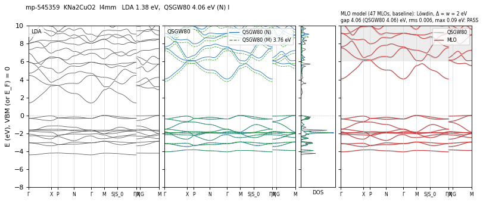

**mp-9244** Li2B2C2 — QSGW80 **1.98** N / M ≈ · path 1.59 eV I path<mesh(mesh) — ecalj 989a18637 (tf32, t_tetrakbt -300) — MLO PASS (b1) 24 gap 1.59 rms 0.007 max 0.04 (ecalj fb2da026b)

<small>runs: M 1.98 · N 1.98 (10-05)</small>

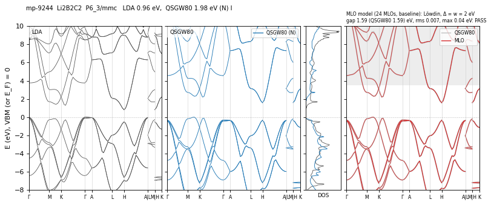

**mp-9562** Li2Be2As2 — QSGW80 **1.78** N / M ≈ eV I  — ecalj 989a18637 (tf32, t_tetrakbt -300) — MLO PASS (b1) 34 gap 1.78 rms 0.005 max 0.04 (ecalj fb2da026b)

<small>runs: M 1.77 · N 1.78 (10-05)</small>

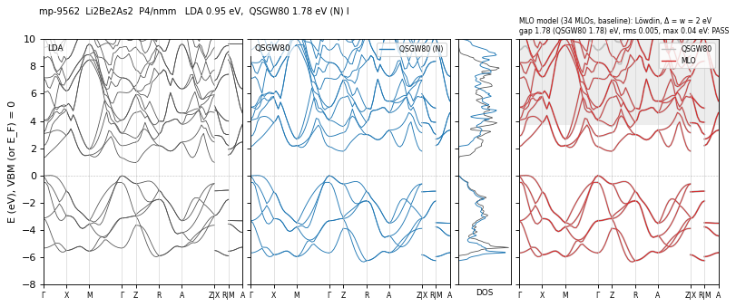

**mp-9915** Li2Be2P2 — QSGW80 **2.01** N / M ≈ eV I  — ecalj 989a18637 (tf32, t_tetrakbt -300) — MLO PASS (b1) 34 gap 2.01 rms 0.002 max 0.02 (ecalj fb2da026b)

<small>runs: M 2.00 · N 2.01 (10-04)</small>

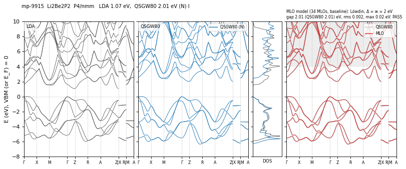

**mp-9575** Li2Be2Sb2 — QSGW80 **1.42** N / M ≈ eV I  — ecalj 989a18637 (tf32, t_tetrakbt -300) — MLO PASS (b1) 34 gap 1.42 rms 0.001 max 0.01 (ecalj fb2da026b)

<small>runs: M 1.42 · N 1.42 (10-04)</small>

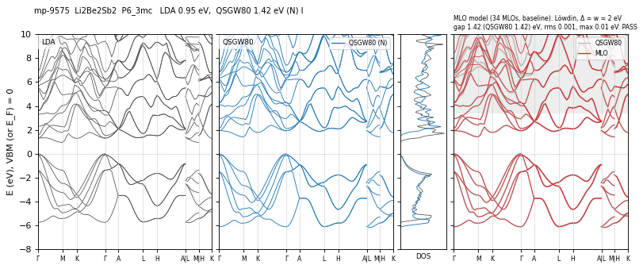

**mp-23856** Li2H2O2 — QSGW80 **7.88** N / R ≈ eV D  — ecalj 989a18637 (tf32, t_tetrakbt -300) — MLO PASS (b2) 40 gap 7.88 rms 0.004 max 0.04 (ecalj fb2da026b)

<small>runs: M 7.90 · R 7.88 (10-01) · N 7.88 (10-05)</small>

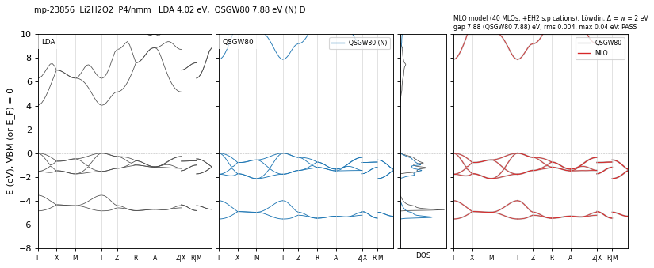

**mp-9919** Li2Zn2Sb2 — QSGW80 **1.03** N / M ≈ eV D  — ecalj 989a18637 (tf32, t_tetrakbt -300) — MLO PASS (b1) 54 gap 1.03 rms 0.002 max 0.01 (ecalj fb2da026b)

<small>runs: M 1.03 · N 1.03 (10-04)</small>

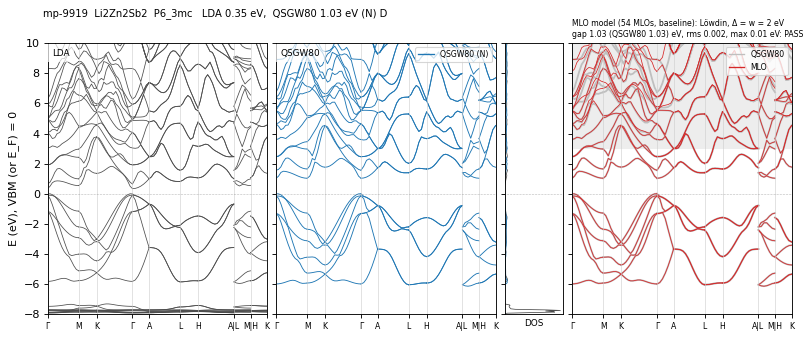

**mp-29149** Li4NCl — QSGW80 **3.66** N / M 3.36 eV I CHECK — ecalj 989a18637 (tf32, t_tetrakbt -300) — MLO PASS (b2) 45 gap 3.66 rms 0.002 max 0.01 (ecalj fb2da026b)

<small>runs: M 3.36 · N 3.66 (10-04)</small>

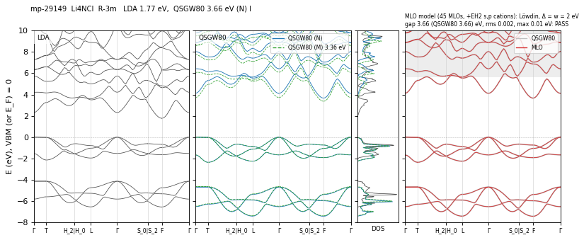

**mp-29771** Mg2C4 — QSGW80 **4.68** N / M ≈ eV I  — ecalj 989a18637 (tf32, t_tetrakbt -300) — MLO PASS (b2) 58 gap 4.68 rms 0.004 max 0.04 (ecalj fb2da026b)

<small>runs: M 4.66 · N 4.68 (10-04)</small>

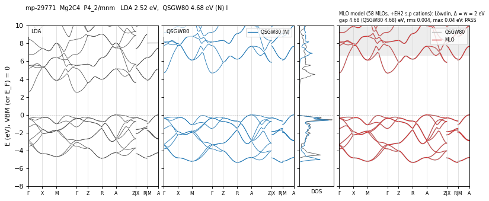

**mp-1072956** Mg2F4 — QSGW80 **11.85** N / M 12.42 eV D CHECK — ecalj 989a18637 (tf32, t_tetrakbt -300) — MLO PASS (b2) 42 gap 11.85 rms 0.001 max 0.00 (ecalj a1d6c0e11)

<small>runs: M 12.42 · N 11.85 (10-02)</small>

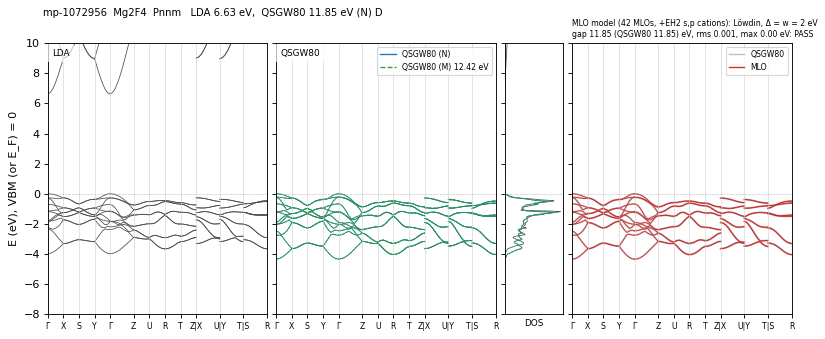

**mp-1249** Mg2F4 — QSGW80 **12.15** N / R ≈ eV D  — ecalj 989a18637 (tf32, t_tetrakbt -300) — MLO PASS (b2) 42 gap 12.15 rms 0.001 max 0.01 (ecalj fb2da026b)

<small>runs: M 11.84 · R 12.15 (10-01) · N 12.15 (10-05)</small>

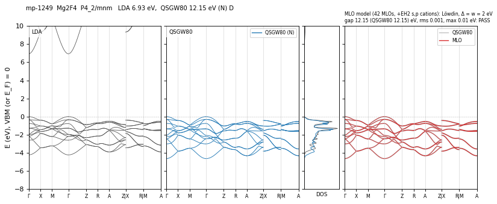

**mp-23710** Mg2H4 — QSGW80 **6.52** N / M ≈ eV I  — ecalj 989a18637 (tf32, t_tetrakbt -300) — MLO PASS (b1) 34 gap 6.49 rms 0.011 max 0.07 (ecalj fb2da026b)

<small>runs: M 6.54 · N 6.52 (10-05)</small>

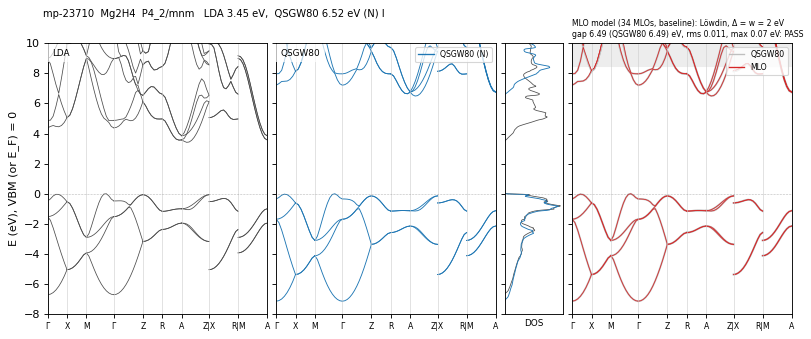

**mp-1018809** Mo2S4 — QSGW80 **2.06** N / M 1.99 · path 1.86 eV I differs path<mesh(mesh) — ecalj 989a18637 (tf32, t_tetrakbt -300) — MLO PASS (b1) 54 gap 1.85 rms 0.001 max 0.01 (ecalj a1d6c0e11)

<small>runs: M 1.99 · N 2.06 (10-03)</small>

**mp-2815** Mo2S4 — QSGW80 **2.18** N / M ≈ · path 1.97 eV I path<mesh(mesh) — ecalj 989a18637 (tf32, t_tetrakbt -300) — MLO PASS (b1) 54 gap 1.97 rms 0.002 max 0.01 (ecalj fb2da026b)

<small>runs: M 2.19 · N 2.18 (10-04)</small>

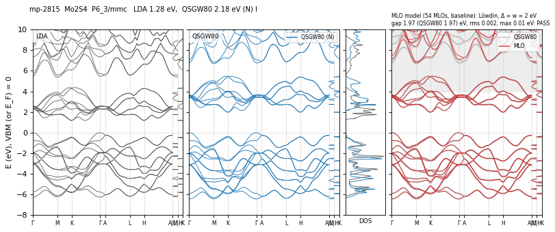

**mp-1018807** Mo2Se4 — QSGW80 **1.96** N / M ≈ · path 1.81 eV I path<mesh(mesh) — ecalj 989a18637 (tf32, t_tetrakbt -300) — MLO PASS (b1) 54 gap 1.81 rms 0.002 max 0.02 (ecalj fb2da026b)

<small>runs: M 1.97 · N 1.96 (10-05)</small>

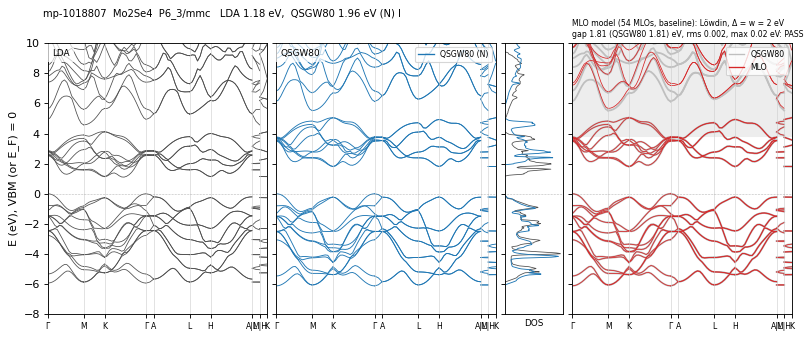

**mp-1634** Mo2Se4 — QSGW80 **1.74** N / M ≈ eV I  — ecalj 989a18637 (tf32, t_tetrakbt -300) — MLO PASS (b1) 54 gap 1.65 rms 0.002 max 0.02 (ecalj 0c4d16ceb)

<small>runs: M 1.75 · N 1.74 (10-04)</small>

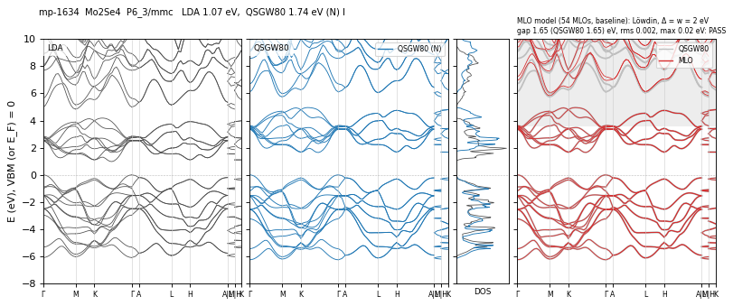

**mp-9573** Na2Be2As2 — QSGW80 **2.30** N / M ≈ eV I  — ecalj 989a18637 (tf32, t_tetrakbt -300) — MLO PASS (b1) 44 gap 2.30 rms 0.003 max 0.03 (ecalj fb2da026b)

<small>runs: M 2.29 · N 2.30 (10-04)</small>

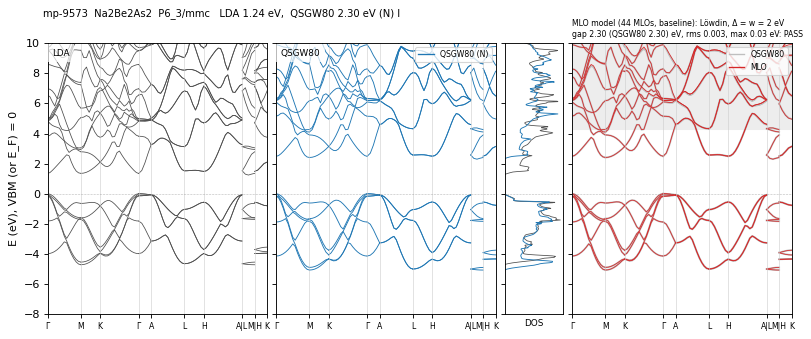

**mp-9574** Na2Be2Sb2 — QSGW80 **1.76** N / M ≈ eV I  — ecalj 989a18637 (tf32, t_tetrakbt -300) — MLO PASS (b2) 60 gap 1.76 rms 0.003 max 0.02 (ecalj fb2da026b)

<small>runs: M 1.75 · N 1.76 (10-05)</small>

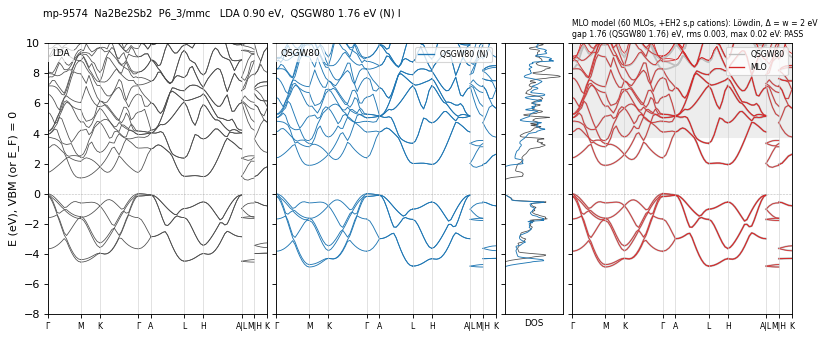

**mp-30053** Na2C2N2 — QSGW80 **9.10** N / R ≈ eV I  — ecalj 989a18637 (tf32, t_tetrakbt -300) — MLO PASS (b2all) 58 gap 9.10 rms 0.004 max 0.02 (ecalj fb2da026b)

<small>runs: M 8.83 · R 9.10 (10-01) · N 9.10 (10-05)</small>

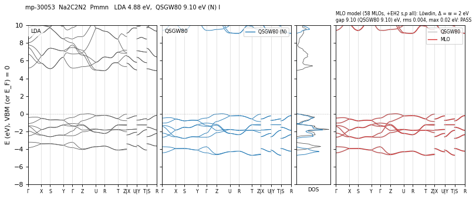

**mp-7433** Na2Cu2Se2 — QSGW80 **1.28** N / M ≈ eV D  — ecalj 989a18637 (tf32, t_tetrakbt -300) — MLO PASS (b1) 54 gap 1.28 rms 0.000 max 0.00 (ecalj fb2da026b)

<small>runs: M 1.31 · N 1.28 (10-04)</small>

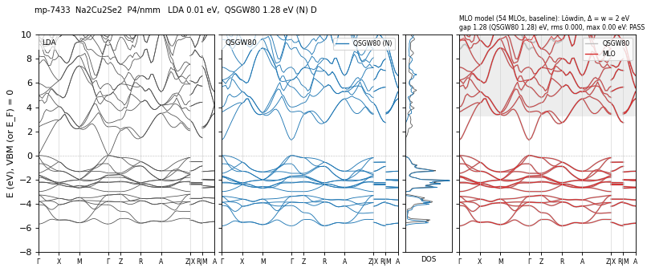

**mp-7434** Na2Cu2Te2 — QSGW80 **1.75** N / M ≈ eV D  — ecalj 989a18637 (tf32, t_tetrakbt -300) — MLO PASS (b1) 54 gap 1.75 rms 0.005 max 0.06 (ecalj fb2da026b)

<small>runs: M 1.75 · N 1.75 (10-05)</small>

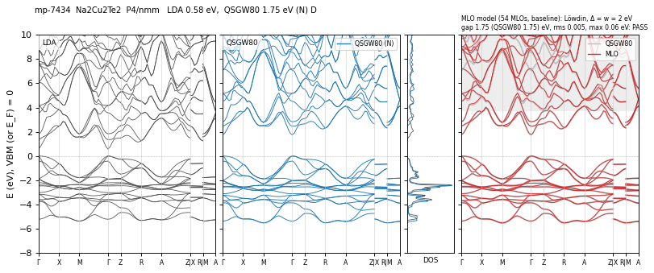

**mp-23891** Na2H2O2 — QSGW80 **6.79** R eV D N:SKIP — ecalj 989a18637 (fp32, t_tetrakbt +300) — MLO PASS (b1) 34 gap 6.79 rms 0.001 max 0.00 (ecalj 27d52b5af)

<small>runs: M 6.85 · R 6.79 (10-01) · N 6.79 FAIL(1) (10-05) · N SKIP SKIP (10-05)</small>

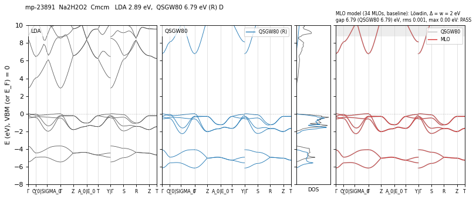

**mp-23940** Na2H2O2 — QSGW80 **6.81** N / R ≈ eV D  — ecalj 989a18637 (tf32, t_tetrakbt -300) — MLO PASS (b1) 34 gap 6.81 rms 0.001 max 0.00 (ecalj fb2da026b)

<small>runs: M 6.58 · R 6.81 (10-01) · N 6.81 (10-05)</small>

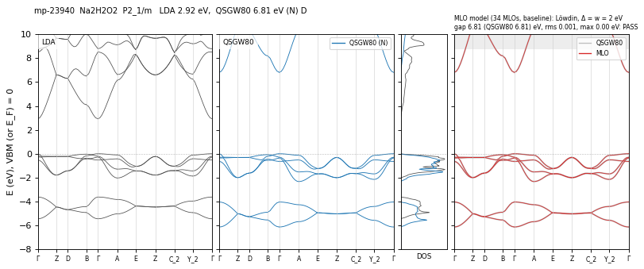

**mp-634657** Na2H2S2 — QSGW80 **5.64** N / M 5.72 eV D differs — ecalj 989a18637 (tf32, t_tetrakbt -300) — MLO PASS (b1) 44 gap 5.64 rms 0.014 max 0.09 (ecalj fb2da026b)

<small>runs: M 5.72 · N 5.64 (10-04)</small>

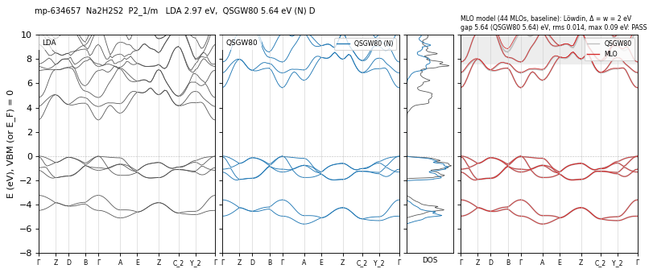

**mp-8452** Na2Li2S2 — QSGW80 **5.14** N / M ≈ eV D  — ecalj 989a18637 (tf32, t_tetrakbt -300) — MLO PASS (b1) 44 gap 5.14 rms 0.000 max 0.00 (ecalj fb2da026b)

<small>runs: M 5.17 · N 5.14 (10-03)</small>

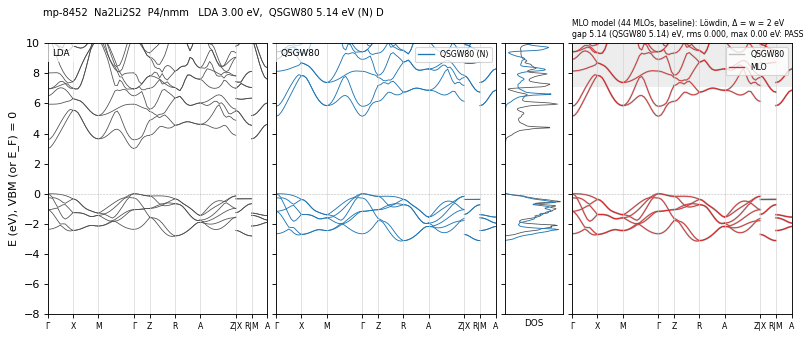

**mp-5962** Na2Mg2As2 — QSGW80 **2.20** N / M ≈ eV D  — ecalj 989a18637 (tf32, t_tetrakbt -300) — MLO PASS (b1) 54 gap 2.20 rms 0.004 max 0.03 (ecalj fb2da026b)

<small>runs: M 2.19 · N 2.20 (10-04)</small>

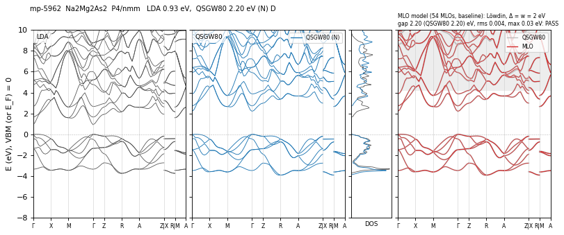

**mp-7090** Na2Mg2Sb2 — QSGW80 **1.95** N / M ≈ eV I  — ecalj 989a18637 (tf32, t_tetrakbt -300) — MLO PASS (b1) 54 gap 1.90 rms 0.014 max 0.10 (ecalj fb2da026b)

<small>runs: M 1.95 · N 1.95 (10-03)</small>

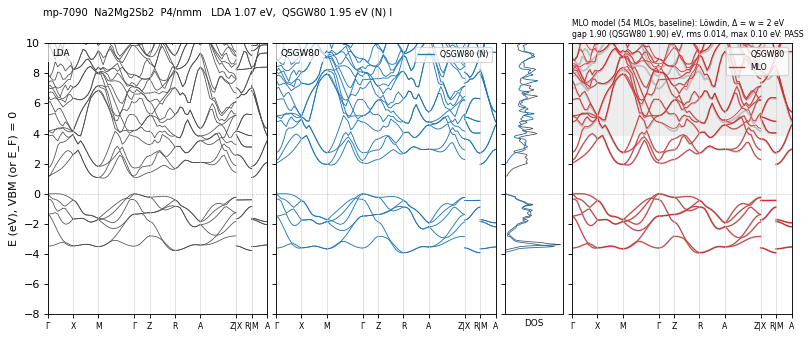

**mp-12433** Na2Sn2N2 — QSGW80 **1.81** N / M ≈ eV I  — ecalj 989a18637 (tf32, t_tetrakbt -300) — MLO PASS (b1) 44 gap 1.81 rms 0.003 max 0.02 (ecalj a1d6c0e11)

<small>runs: M 1.81 · N 1.81 (10-04)</small>

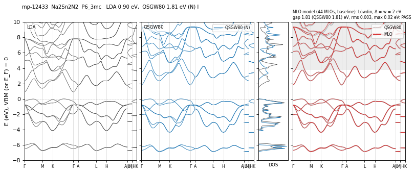

**mp-29529** Na2Sn2P2 — QSGW80 **1.25** N / M ≈ eV I  — ecalj 989a18637 (tf32, t_tetrakbt -300) — MLO PASS (b1) 54 gap 1.24 rms 0.005 max 0.03 (ecalj fb2da026b)

<small>runs: M 1.25 · N 1.25 (10-03)</small>

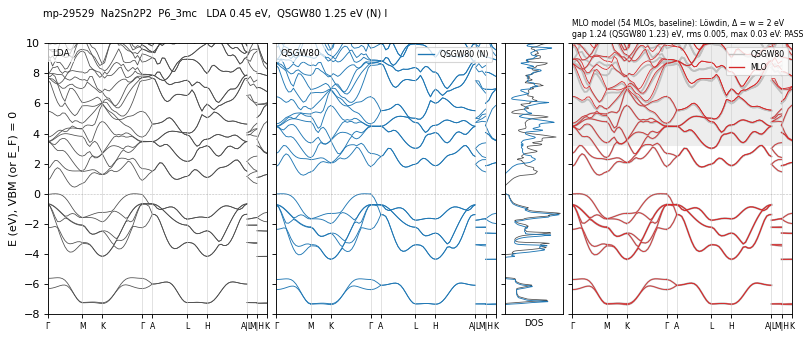

**mp-13097** Na2Zn2As2 — QSGW80 **1.37** N / M ≈ eV D  — ecalj 989a18637 (tf32, t_tetrakbt -300) — MLO PASS (b1) 64 gap 1.37 rms 0.001 max 0.01 (ecalj a1d6c0e11)

<small>runs: M 1.38 · N 1.37 (10-04)</small>

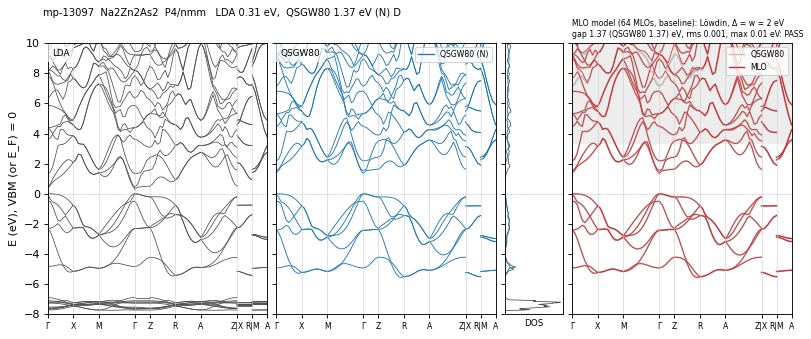

**mp-4824** Na2Zn2P2 — QSGW80 **1.97** N / M ≈ eV D  — ecalj 989a18637 (tf32, t_tetrakbt -300) — MLO PASS (b1) 54 gap 1.97 rms 0.001 max 0.01 (ecalj fb2da026b)

<small>runs: M 1.97 · N 1.97 (10-05)</small>

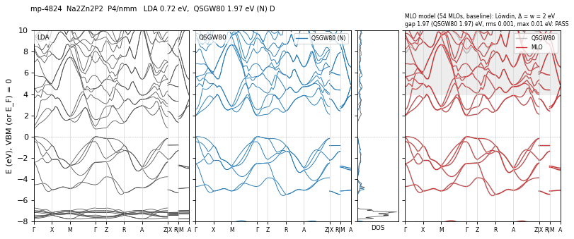

**mp-8374** Na4S2 — QSGW80 **3.51** N / M ≈ eV D  — ecalj 989a18637 (tf32, t_tetrakbt -300) — MLO PASS (b1) 54 gap 3.51 rms 0.000 max 0.00 (ecalj fb2da026b)

<small>runs: M 3.53 · N 3.51 (10-03)</small>

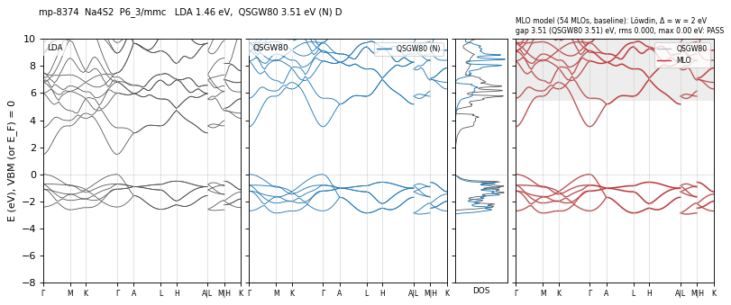

**mp-7723** NaAlF4 — QSGW80 **10.60** N / R ≈ eV I  — ecalj b695fa65c (tf32, t_tetrakbt -300) — MLO PASS (b2) 42 gap 10.60 rms 0.001 max 0.01 (ecalj 614ab5eb8)

<small>runs: M 10.85 · R 10.60 (10-01) · N 10.60 (10-04)</small>

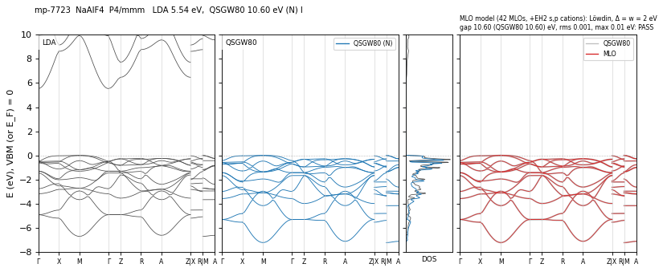

**mp-546118** NaClO4 — QSGW80 **7.90** E / N ≈ / R ≈ eV I  — ecalj 614ab5eb8 (tf32, t_tetrakbt -300) with ES, ES rule es-a — MLO PASS (b1, ES) 41 gap 7.90 rms 0.000 max 0.00 (ecalj a863cf27f)

<small>runs: M 7.72 · R 7.90 (10-01) · N 7.90 (10-05) · E 7.90 (10-06, ES 1, es-a)</small>

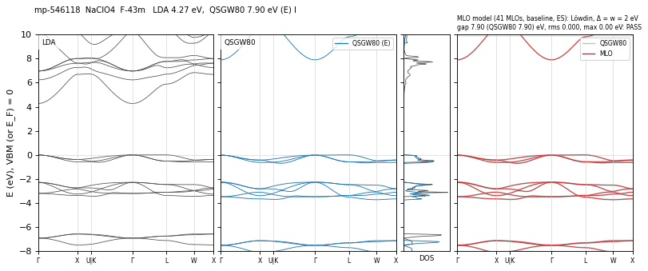

**mp-1969** Nb2Sb4 — QSGW80 **0.00** N / R ≈ eV metal  — ecalj 989a18637 (tf32, t_tetrakbt -300) — MLO PASS (b1) 54 rms 0.001 max 0.00 (ecalj fb2da026b)

<small>runs: M UNKNOWN · R CONVERGED_METAL (10-01) · N CONVERGED_METAL (10-03)</small>

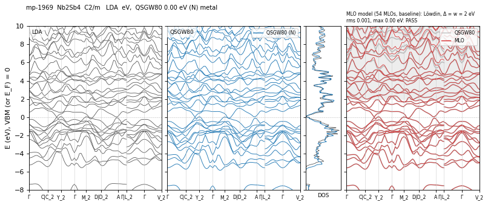

**mp-486** Ni2P4 — QSGW80 **0.50** N / M ≈ eV I  — ecalj 989a18637 (tf32, t_tetrakbt -300) — MLO PASS (b1) 54 gap 1.01 rms 0.001 max 0.01 (ecalj fb2da026b)

<small>runs: M 0.49 · N 0.50 (10-03)</small>

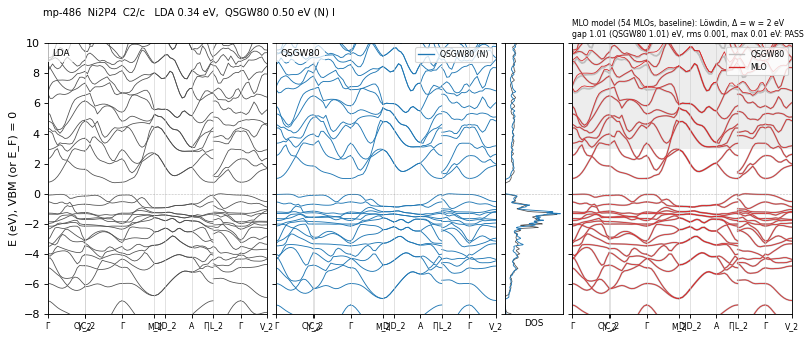

**mp-29443** P2I4 — QSGW80 **3.33** E / M ≈ / N ≈ eV D  — ecalj 614ab5eb8 (tf32, t_tetrakbt -300) with ES, ES rule es-a — MLO PASS (b1, ES) 60 gap 3.42 rms 0.006 max 0.03 (ecalj a863cf27f)

<small>runs: M 3.36 · N 3.37 (10-05) · E 3.33 (10-06, ES 6, es-a)</small>

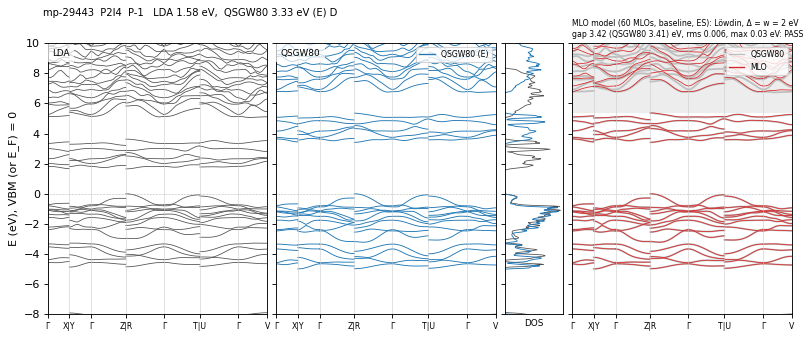

**mp-2319** P4Os2 — QSGW80 **1.09** N / M ≈ eV I  — ecalj 989a18637 (tf32, t_tetrakbt -300) — MLO PASS (b1) 54 gap 1.08 rms 0.001 max 0.01 (ecalj fb2da026b)

<small>runs: M 1.09 · N 1.09 (10-04)</small>

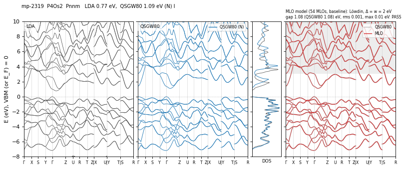

**mp-28266** P4Pd2 — QSGW80 **0.75** N / M ≈ eV I  — ecalj 989a18637 (tf32, t_tetrakbt -300) — MLO PASS (b1) 54 gap 1.00 rms 0.001 max 0.01 (ecalj fb2da026b)

<small>runs: M 0.76 · N 0.75 (10-04)</small>

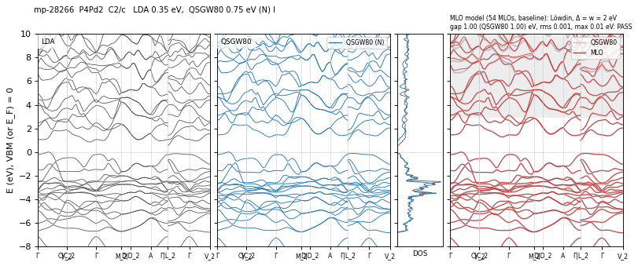

**mp-1413** P4Ru2 — QSGW80 **0.82** N / M ≈ eV I  — ecalj 989a18637 (tf32, t_tetrakbt -300) — MLO PASS (b1) 54 gap 0.79 rms 0.001 max 0.01 (ecalj 96ec5c1ee)

<small>runs: M 0.82 · N 0.82 (10-03)</small>

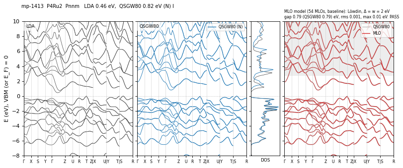

**mp-23008** Pb2Br2F2 — QSGW80 **3.98** N / M ≈ eV D  — ecalj 989a18637 (tf32, t_tetrakbt -300) — MLO PASS (b1) 54 gap 3.98 rms 0.001 max 0.01 (ecalj fb2da026b)

<small>runs: M 4.02 · N 3.98 (10-03)</small>

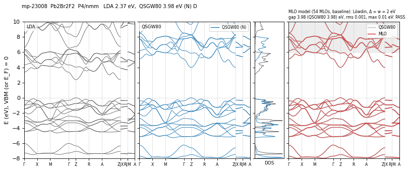

**mp-22964** Pb2Cl2F2 — QSGW80 **5.15** N / M ≈ eV I  — ecalj 989a18637 (tf32, t_tetrakbt -300) — MLO PASS (b1) 54 gap 5.14 rms 0.001 max 0.00 (ecalj fb2da026b)

<small>runs: M 5.19 · N 5.15 (10-04)</small>

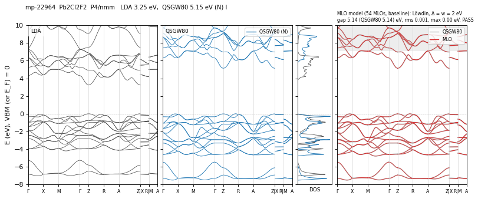

**mp-613652** Pb2Cl2F2 — QSGW80 **5.74** N / M 5.84 eV I differs — ecalj 989a18637 (tf32, t_tetrakbt -300) — MLO PASS (b2) 62 gap 5.71 rms 0.001 max 0.01 (ecalj fb2da026b)

<small>runs: M 5.84 · N 5.74 (10-03)</small>

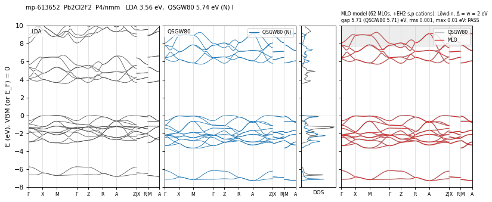

**mp-22969** Pb2I2F2 — QSGW80 **3.41** N / M ≈ eV D  — ecalj 989a18637 (tf32, t_tetrakbt -300) — MLO PASS (b1) 54 gap 3.41 rms 0.006 max 0.06 (ecalj fb2da026b)

<small>runs: M 3.37 · N 3.41 (10-04)</small>

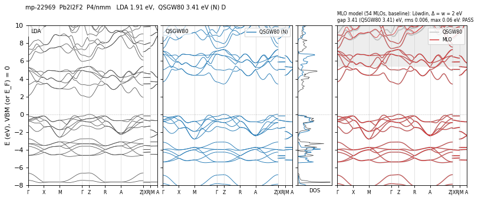

**mp-540789** Pb2I4 — QSGW80 **3.64** E / M 3.57 / N ≈ eV I differs — ecalj 614ab5eb8 (tf32, t_tetrakbt -300) with ES, ES rule es-a — MLO PASS (b1, ES) 56 gap 3.63 rms 0.002 max 0.01 (ecalj 1bbefe015)

<small>runs: M 3.57 · N 3.64 (10-04) · E 3.64 (10-06, ES 2, es-a)</small>

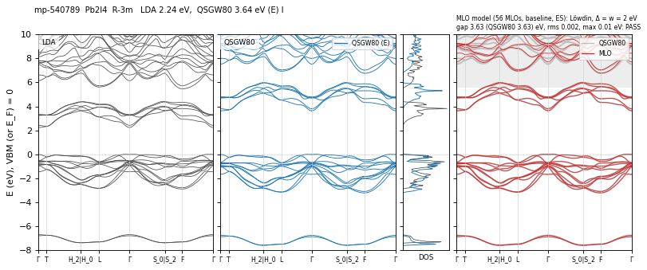

**mp-567503** Pb2I4 — QSGW80 **3.57** E / M ≈ / N ≈ eV D  — ecalj 614ab5eb8 (tf32, t_tetrakbt -300) with ES, ES rule es-a — MLO PASS (b1, ES) 56 gap 3.57 rms 0.002 max 0.01 (ecalj 1bbefe015)

<small>runs: M 3.58 · N 3.58 (10-05) · E 3.57 (10-06, ES 2, es-a)</small>

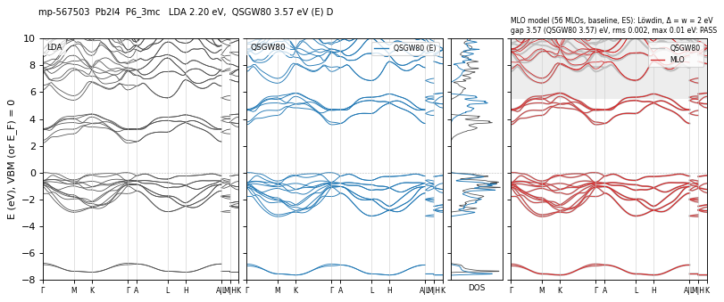

**mp-569595** Pb2I4 — QSGW80 **3.66** E / M ≈ / N ≈ eV I  — ecalj 614ab5eb8 (tf32, t_tetrakbt -300) with ES, ES rule es-a — MLO PASS (b1, ES) 56 gap 3.66 rms 0.002 max 0.01 (ecalj 1bbefe015)

<small>runs: M 3.65 · N 3.66 (10-05) · E 3.66 (10-06, ES 2, es-a)</small>

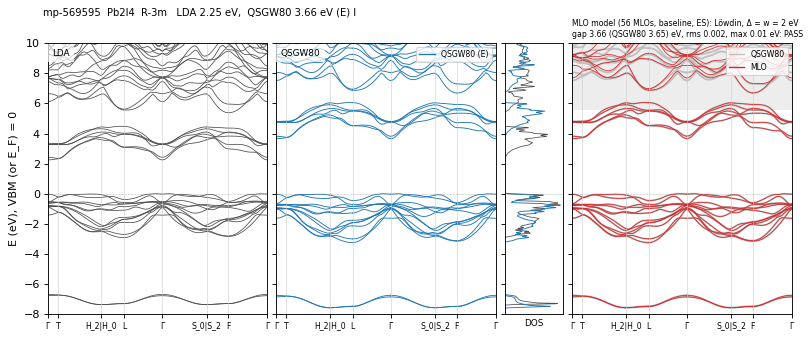

**mp-1018888** Pd2Cl4 — QSGW80 **3.60** N / M ≈ eV I  — ecalj 989a18637 (tf32, t_tetrakbt -300) — MLO PASS (b1) 54 gap 3.61 rms 0.002 max 0.02 (ecalj a1d6c0e11)

<small>runs: M 3.60 · N 3.60 (10-03)</small>

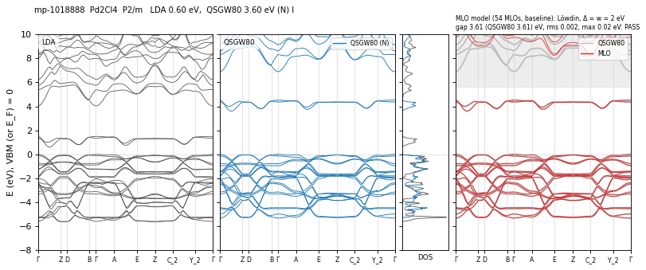

**mp-1018891** Pd2Cl4 — QSGW80 **2.42** N / M ≈ eV I  — ecalj 989a18637 (tf32, t_tetrakbt -300) — MLO PASS (b1) 54 gap 2.43 rms 0.001 max 0.00 (ecalj a1d6c0e11)

<small>runs: M 2.42 · N 2.42 (10-04)</small>

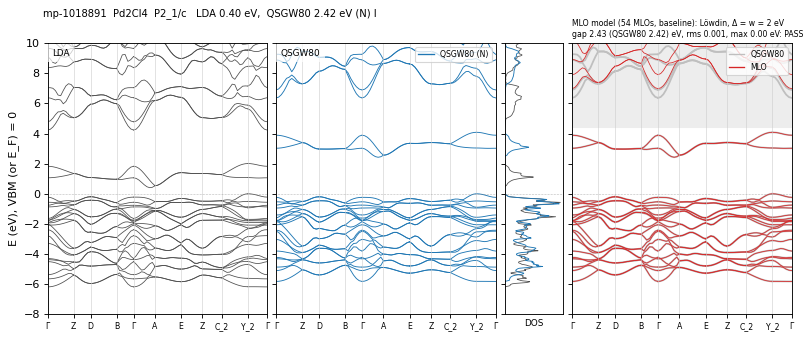

**mp-569008** Pd2Cl4 — QSGW80 **3.13** N / M 3.21 eV I differs — ecalj 989a18637 (tf32, t_tetrakbt -300) — MLO PASS (b1) 54 gap 3.13 rms 0.001 max 0.01 (ecalj fb2da026b)

<small>runs: M 3.21 · N 3.13 (10-03)</small>

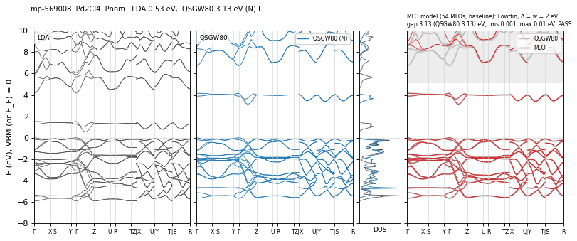

**mp-569017** Pd2I4 — QSGW80 **1.84** E / M 1.89 / N ≈ eV I differs — ecalj 614ab5eb8 (tf32, t_tetrakbt -300) with ES, ES rule es-a — MLO PASS (b1, ES) 56 gap 1.84 rms 0.000 max 0.00 (ecalj 1bbefe015)

<small>runs: M 1.89 · N 1.86 (10-03) · E 1.84 (10-06, ES 2, es-a)</small>

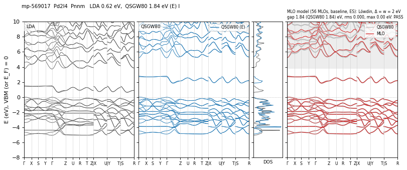

**mp-567484** Pt2Cl4 — QSGW80 **3.24** N / M ≈ eV I  — ecalj 989a18637 (tf32, t_tetrakbt -300) — MLO PASS (b1) 54 gap 3.24 rms 0.002 max 0.01 (ecalj fb2da026b)

<small>runs: M 3.23 · N 3.24 (10-03)</small>

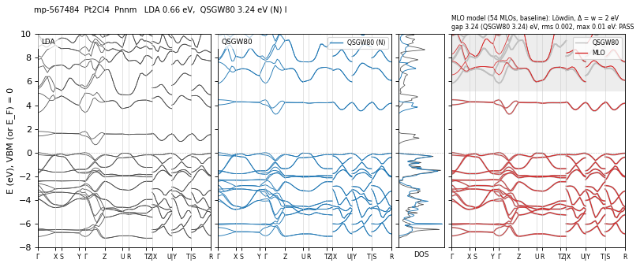

**mp-1285** Pt2O4 — QSGW80 **1.65** N / M ≈ eV I  — ecalj 989a18637 (tf32, t_tetrakbt -300) — MLO PASS (b1) 34 gap 1.65 rms 0.001 max 0.01 (ecalj a1d6c0e11)

<small>runs: M 1.68 · N 1.65 (10-03)</small>

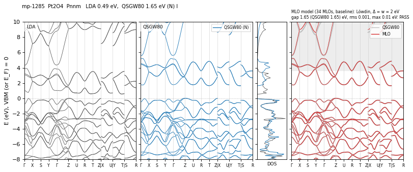

**mp-7868** Pt2O4 — QSGW80 **3.39** N / M ≈ eV I  — ecalj 989a18637 (tf32, t_tetrakbt -300) — MLO PASS (b1) 34 gap 3.34 rms 0.001 max 0.01 (ecalj fb2da026b)

<small>runs: M 3.40 · N 3.39 (10-03)</small>

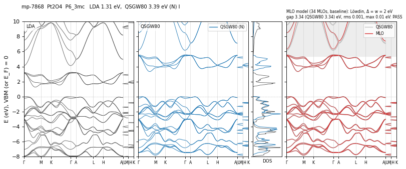

**mp-9010** Rb2Au2S2 — QSGW80 **3.61** N / M ≈ eV I  — ecalj 989a18637 (tf32, t_tetrakbt -300) — MLO PASS (b2) 68 gap 3.58 rms 0.003 max 0.08 (ecalj fb2da026b)

<small>runs: M 3.64 · N 3.61 (10-04)</small>

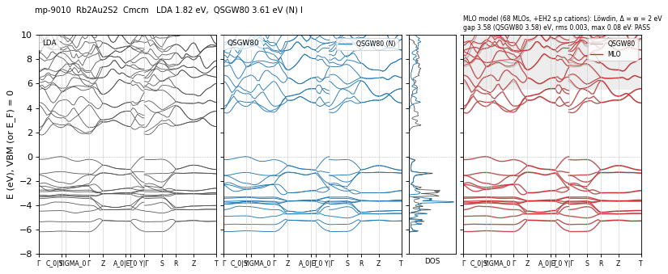

**mp-9731** Rb2Au2Se2 — QSGW80 **3.31** N / M ≈ eV I  — ecalj 989a18637 (tf32, t_tetrakbt -300) — MLO PASS (b2) 68 gap 3.29 rms 0.005 max 0.09 (ecalj fb2da026b)

<small>runs: M 3.33 · N 3.31 (10-04)</small>

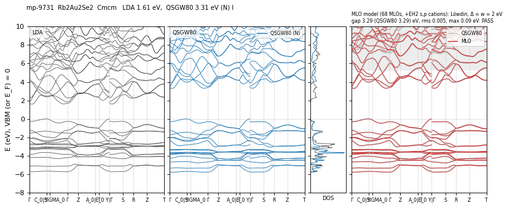

**mp-9845** Rb2Ca2As2 — QSGW80 **2.42** N / M ≈ eV I  — ecalj 989a18637 (tf32, t_tetrakbt -300) — MLO PASS (b2) 76 gap 2.42 rms 0.002 max 0.01 (ecalj fb2da026b)

<small>runs: M 2.44 · N 2.42 (10-03)</small>

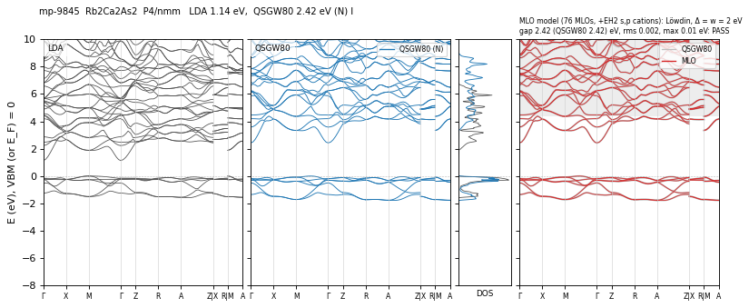

**mp-9846** Rb2Ca2Sb2 — QSGW80 **2.55** N / M ≈ eV I  — ecalj 989a18637 (tf32, t_tetrakbt -300) — MLO PASS (b2) 76 gap 2.54 rms 0.007 max 0.07 (ecalj fb2da026b)

<small>runs: M 2.58 · N 2.55 (10-04)</small>

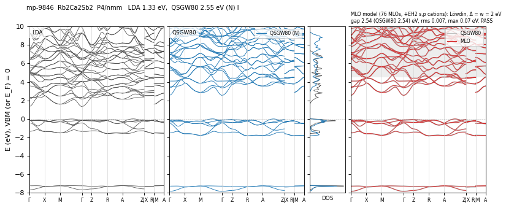

**mp-626620** Rb2H2O2 — QSGW80 **6.66** N / R ≈ eV D  — ecalj b695fa65c (tf32, t_tetrakbt -300) — MLO PASS (b1) 40 gap 6.66 rms 0.003 max 0.04 (ecalj 614ab5eb8)

<small>runs: M 6.37 · R 6.66 (10-01) · N 6.66 (10-04)</small>

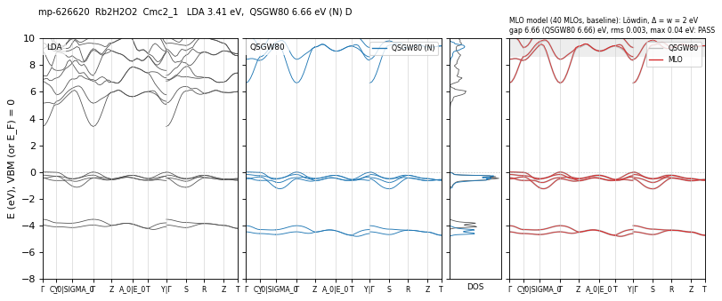

**mp-643043** Rb2H2O2 — QSGW80 **6.43** N / R ≈ eV I  — ecalj 989a18637 (tf32, t_tetrakbt -300) — MLO PASS (b1) 40 gap 6.44 rms 0.006 max 0.09 (ecalj fb2da026b)

<small>runs: M FAILED · R 6.43 (09-30) · N 6.43 (10-05)</small>

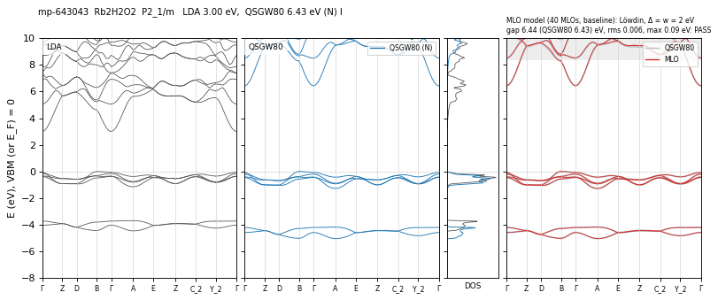

**mp-696804** Rb2H2S2 — QSGW80 **5.62** N / M ≈ eV D  — ecalj 989a18637 (tf32, t_tetrakbt -300) — MLO PASS (b2) 66 gap 5.62 rms 0.010 max 0.10 (ecalj fb2da026b)

<small>runs: M 5.61 · N 5.62 (10-04)</small>

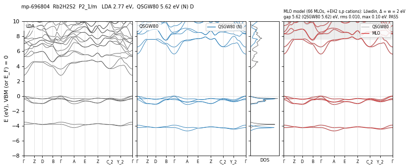

**mp-8751** Rb2Li2S2 — QSGW80 **4.66** N / M ≈ eV I  — ecalj 989a18637 (tf32, t_tetrakbt -300) — MLO PASS (b2) 66 gap 4.65 rms 0.001 max 0.01 (ecalj fb2da026b)

<small>runs: M 4.67 · N 4.66 (10-05)</small>

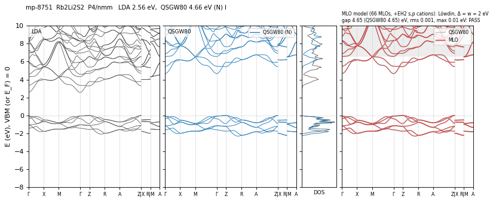

**mp-9250** Rb2Li2Se2 — QSGW80 **4.12** N / M ≈ eV I  — ecalj 989a18637 (tf32, t_tetrakbt -300) — MLO PASS (b2) 66 gap 4.12 rms 0.001 max 0.01 (ecalj fb2da026b)

<small>runs: M 4.14 · N 4.12 (10-04)</small>

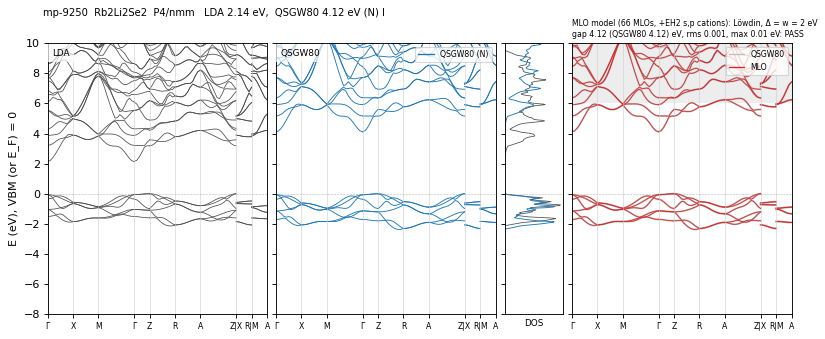

**mp-8453** Rb2Na2O2 — QSGW80 **4.62** N / M 4.74 eV I differs — ecalj 989a18637 (tf32, t_tetrakbt -300) — MLO PASS (b1) 50 gap 4.62 rms 0.001 max 0.01 (ecalj fb2da026b)

<small>runs: M 4.74 · N 4.62 (10-03)</small>

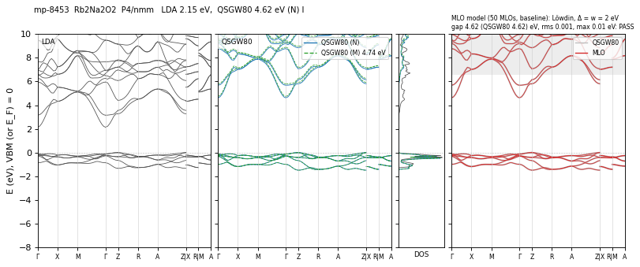

**mp-8799** Rb2Na2S2 — QSGW80 **4.30** N / M ≈ eV I  — ecalj 989a18637 (tf32, t_tetrakbt -300) — MLO PASS (b2) 76 gap 4.30 rms 0.001 max 0.00 (ecalj fb2da026b)

<small>runs: M 4.25 · N 4.30 (10-05)</small>

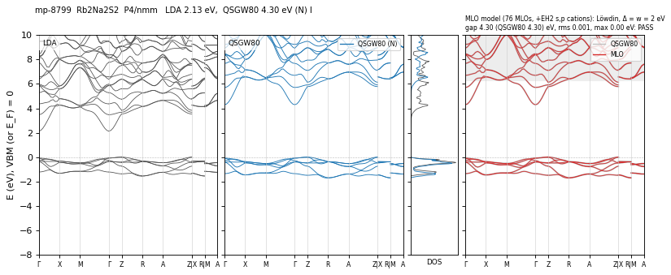

**mp-568018** Rb2Sb4 — QSGW80 **1.08** N / M ≈ eV I  — ecalj 989a18637 (tf32, t_tetrakbt -300) — MLO PASS (b2) 68 gap 1.08 rms 0.007 max 0.07 (ecalj fb2da026b)

<small>runs: M 1.04 · N 1.08 (10-05)</small>

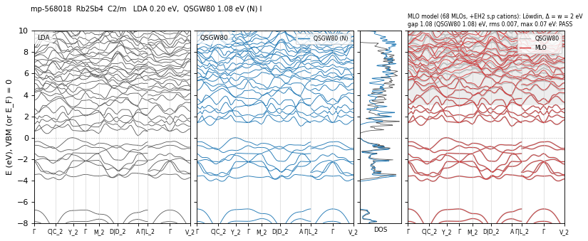

**mp-9008** Rb2Te2Au2 — QSGW80 **1.96** N / M ≈ eV D  — ecalj 989a18637 (tf32, t_tetrakbt -300) — MLO PASS (b2) 68 gap 1.97 rms 0.002 max 0.03 (ecalj fb2da026b)

<small>runs: M 1.95 · N 1.96 (10-04)</small>

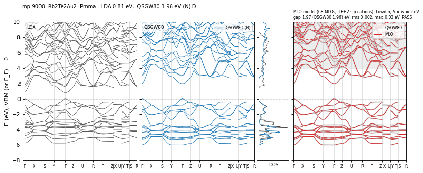

**mp-721469** Rb4S2 — QSGW80 **3.66** N / M ≈ eV D  — ecalj 989a18637 (tf32, t_tetrakbt -300) — MLO PASS (b1) 66 gap 3.67 rms 0.007 max 0.06 (ecalj fb2da026b)

<small>runs: M 3.62 · N 3.66 (10-03)</small>

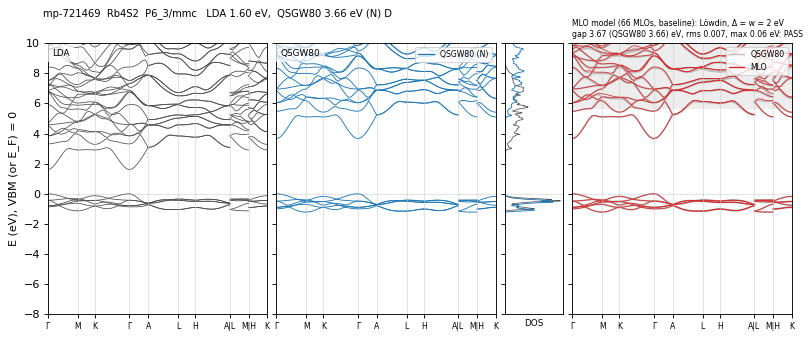

**mp-5479** RbAlF4 — QSGW80 **11.67** N / R ≈ eV I  — ecalj 989a18637 (tf32, t_tetrakbt -300) — MLO PASS (b2) 46 gap 11.67 rms 0.001 max 0.02 (ecalj fb2da026b)

<small>runs: M 12.07 · R 11.67 (10-01) · N 11.67 (10-05)</small>

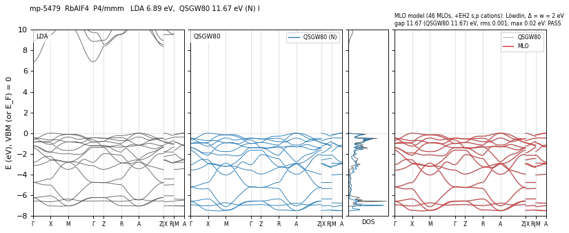

**mp-9385** RbAu3Se2 — QSGW80 **2.67** N / M ≈ eV I  — ecalj 989a18637 (tf32, t_tetrakbt -300) — MLO PASS (b2) 61 gap 2.70 rms 0.007 max 0.05 (ecalj fb2da026b)

<small>runs: M 2.67 · N 2.67 (10-03)</small>

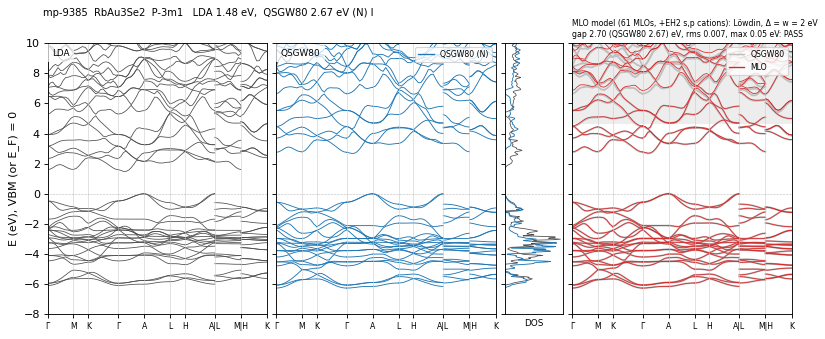

**mp-550759** RbClO4 — QSGW80 **8.81** E / M 8.97 / N 8.90 eV D differs — ecalj 614ab5eb8 (tf32, t_tetrakbt -300) with ES, ES rule es-a — MLO PASS (b1, ES) 42 gap 8.81 rms 0.000 max 0.00 (ecalj a297c38f9)

<small>runs: M 8.97 · N 8.90 (10-04) · E 8.81 (10-06, ES 1, es-a)</small>

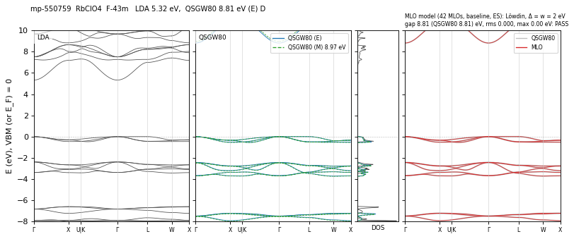

**mp-568100** ReNCl4 — QSGW80 **2.86** N / M ≈ eV I  — ecalj 989a18637 (tf32, t_tetrakbt -300) — MLO PASS (b1) 49 gap 2.86 rms 0.001 max 0.01 (ecalj fb2da026b)

<small>runs: M 2.90 · N 2.86 (10-03)</small>

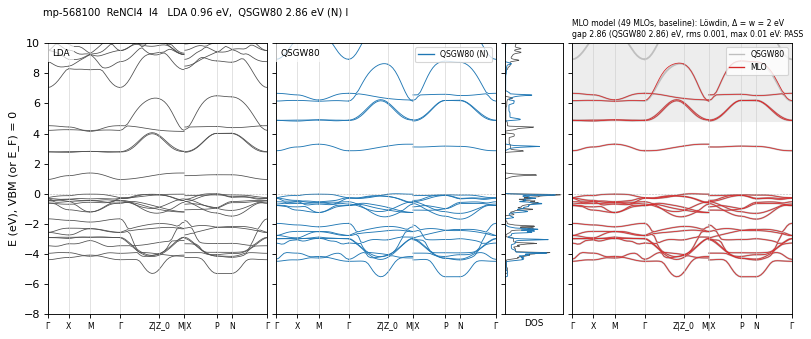

**mp-27726** S2O4 — QSGW80 **6.46** E / N 6.66 / R 6.66 eV I differs — ecalj 614ab5eb8 (tf32, t_tetrakbt -300) with ES, ES rule es-a — MLO PASS (b1, ES) 42 gap 6.46 rms 0.001 max 0.00 (ecalj 75eff0d12)

<small>runs: M 6.95 · R 6.66 (10-01) · N 6.66 (10-05) · E 6.46 (10-06, ES 2, es-a)</small>

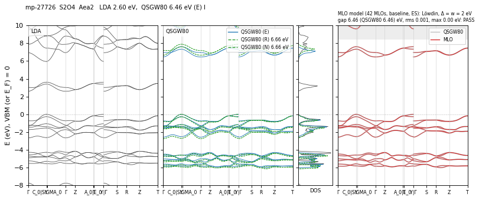

**mp-7** S6 — QSGW80 **3.93** E / N 4.01 / R 4.01 eV D differs — ecalj 614ab5eb8 (tf32, t_tetrakbt -300) with ES, ES rule es-a — MLO PASS (b1, ES) 61 gap 4.02 rms 0.001 max 0.00 (ecalj 1bbefe015)

<small>runs: M 4.58 · R 4.01 (10-01) · N 4.01 (10-04) · E 3.93 (10-06, ES 7, es-a)</small>

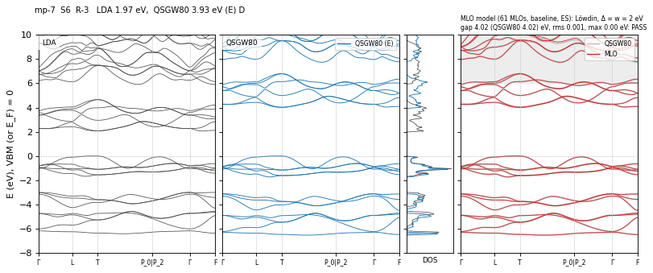

**mp-28051** Sb2Te2I2 — QSGW80 **1.37** N / M ≈ eV I  — ecalj 989a18637 (tf32, t_tetrakbt -300) — MLO PASS (b1) 54 gap 1.35 rms 0.003 max 0.02 (ecalj fb2da026b)

<small>runs: M 1.41 · N 1.37 (10-03)</small>

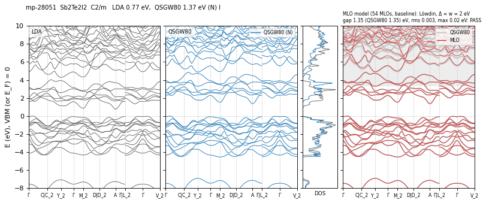

**mp-2695** Sb4Os2 — QSGW80 **0.63** N / M ≈ eV I  — ecalj 989a18637 (tf32, t_tetrakbt -300) — MLO PASS (b1) 54 gap 0.64 rms 0.001 max 0.01 (ecalj fb2da026b)

<small>runs: M 0.64 · N 0.63 (10-03)</small>

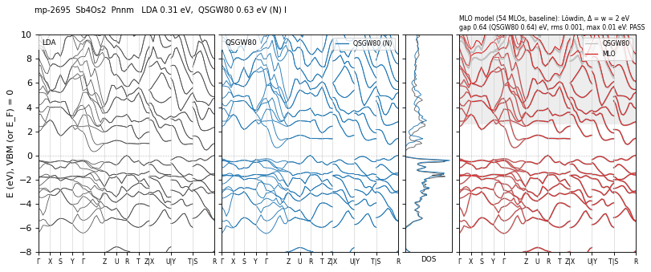

**mp-20928** Sb4Ru2 — QSGW80 **0.25** N / M ≈ eV I  — ecalj 989a18637 (tf32, t_tetrakbt -300) — MLO PASS (b1) 54 gap 0.23 rms 0.001 max 0.01 (ecalj fb2da026b)

<small>runs: M 0.25 · N 0.25 (10-03)</small>

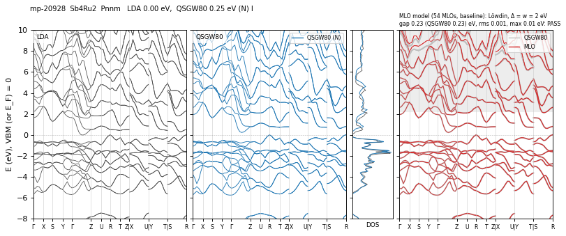

**mp-546279** Sc2Br2O2 — QSGW80 **6.42** N / M 6.34 eV I differs — ecalj 989a18637 (tf32, t_tetrakbt -300) — MLO PASS (b2all) 60 gap 6.41 rms 0.001 max 0.00 (ecalj fb2da026b)

<small>runs: M 6.34 · N 6.42 (10-03)</small>

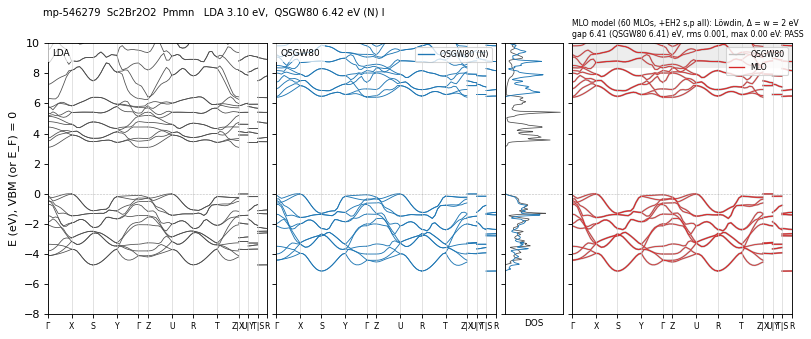

**mp-147** Se6 — QSGW80 **2.46** E / M 2.56 / N 2.53 eV I differs — ecalj 614ab5eb8 (tf32, t_tetrakbt -300) with ES, ES rule es-a — MLO PASS (b1, ES) 61 gap 2.61 rms 0.001 max 0.00 (ecalj f481126f0)

<small>runs: M 2.56 · N 2.53 (10-05) · E 2.46 (10-05, ES 7, es-a)</small>

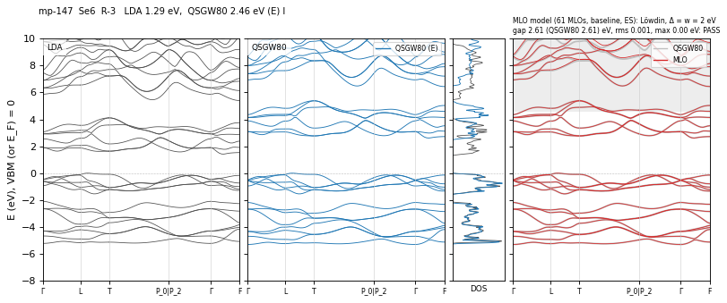

**mp-1071820** Si2O4 — QSGW80 **8.11** N / R ≈ eV I  — ecalj 989a18637 (tf32, t_tetrakbt -300) — MLO PASS (b2) 42 gap 8.12 rms 0.002 max 0.03 (ecalj fb2da026b)

<small>runs: M 7.79 · R 8.11 (10-01) · N 8.11 (10-05)</small>

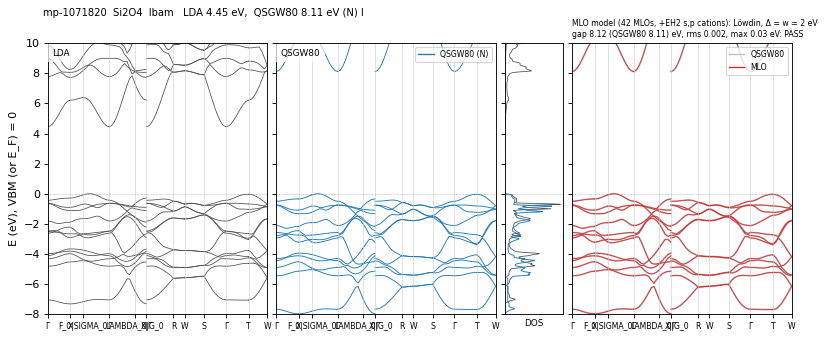

**mp-546794** Si2O4 — QSGW80 **9.24** E / N 9.44 / R 9.44 eV D differs — ecalj 614ab5eb8 (tf32, t_tetrakbt -300) with ES, ES rule es-a — MLO PASS (b1, ES) 36 gap 9.24 rms 0.004 max 0.07 (ecalj a297c38f9)

<small>runs: M 9.44 · R 9.44 (10-01) · N 9.44 (10-05) · E 9.24 (10-06, ES 2, es-a)</small>

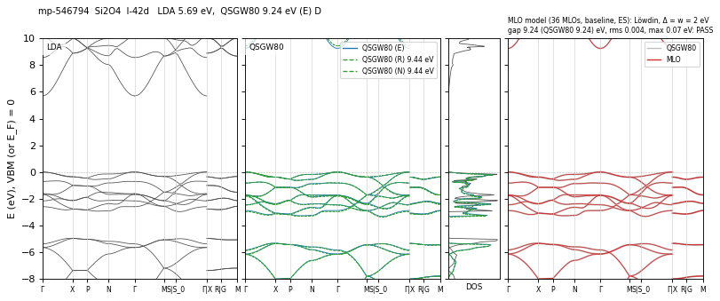

**mp-6947** Si2O4 — QSGW80 **8.12** N / M ≈ eV D  — ecalj 989a18637 (tf32, t_tetrakbt -300) — MLO PASS (b1) 34 gap 8.14 rms 0.002 max 0.02 (ecalj fb2da026b)

<small>runs: M 8.10 · N 8.12 (10-04)</small>

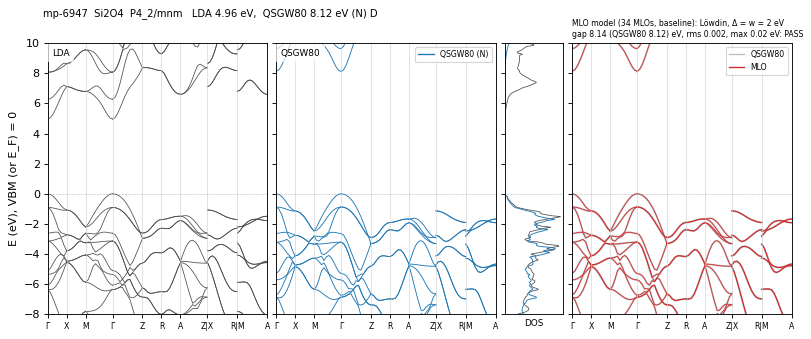

**mp-7905** Si2O4 — QSGW80 **8.21** E / M ≈ / N ≈ eV I  — ecalj 0601771b4 (tf32, t_tetrakbt -300) with ES, ES rule es-c — MLO PASS (b2, ES) 44 gap 8.21 rms 0.002 max 0.01 (ecalj c9932cbfc)

<small>runs: M 8.24 · N 8.23 (10-05) · E FAIL(1) FAIL(1) (10-06, ES 2, es-a) · E 8.21 (10-06, ES 2, es-c)</small>

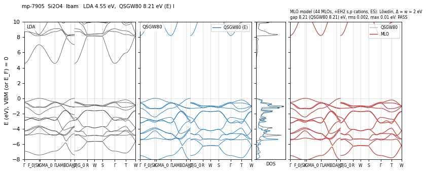

**mp-8352** Si2O4 — QSGW80 **8.86** E / M 8.91 / N 8.97 eV I differs — ecalj 614ab5eb8 (tf32, t_tetrakbt -300) with ES, ES rule es-a — MLO PASS (b1, ES) 42 gap 8.86 rms 0.001 max 0.00 (ecalj 1bbefe015)

<small>runs: M 8.91 · N 8.97 (10-04) · E 8.86 (10-06, ES 2, es-a)</small>

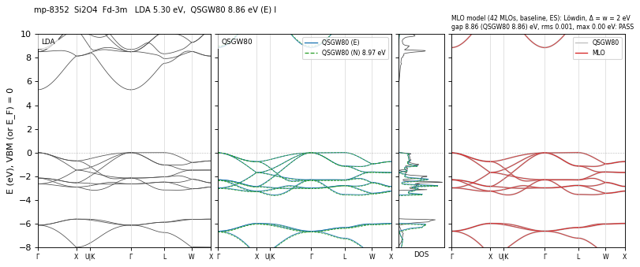

**mp-1602** Si2S4 — QSGW80 **5.01** N / M 4.90 eV I differs — ecalj 989a18637 (tf32, t_tetrakbt -300) — MLO PASS (b2all) 78 gap 5.01 rms 0.002 max 0.02 (ecalj 0c4d16ceb)

<small>runs: M 4.90 · N 5.01 (10-04)</small>

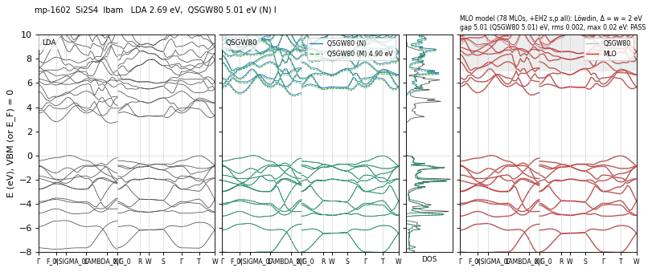

**mp-7583** Si2S4 — QSGW80 **4.79** N / M ≈ eV I  — ecalj 989a18637 (tf32, t_tetrakbt -300) — MLO PASS (b2) 62 gap 4.77 rms 0.009 max 0.06 (ecalj fb2da026b)

<small>runs: M 4.83 · N 4.79 (10-03)</small>

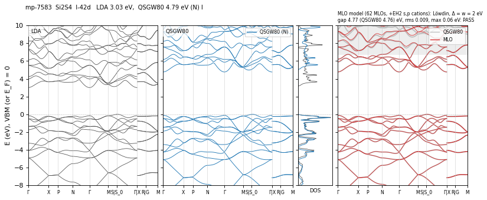

**mp-1179443** Si2Se4 — QSGW80 **3.66** E / M ≈ / N 3.71 eV I differs — ecalj 614ab5eb8 (tf32, t_tetrakbt -300) with ES, ES rule es-a — MLO PASS (b2all, ES) 80 gap 3.66 rms 0.003 max 0.03 (ecalj f481126f0)

<small>runs: M 3.71 · N 3.71 (10-04) · E 3.66 (10-05, ES 2, es-a)</small>

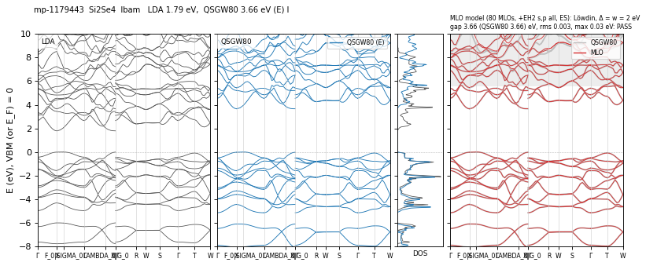

**mp-568264** Si2Se4 — QSGW80 **3.69** N / M ≈ eV I  — ecalj 989a18637 (tf32, t_tetrakbt -300) — MLO PASS (b2all) 78 gap 3.68 rms 0.003 max 0.03 (ecalj fb2da026b)

<small>runs: M 3.69 · N 3.69 (10-05)</small>

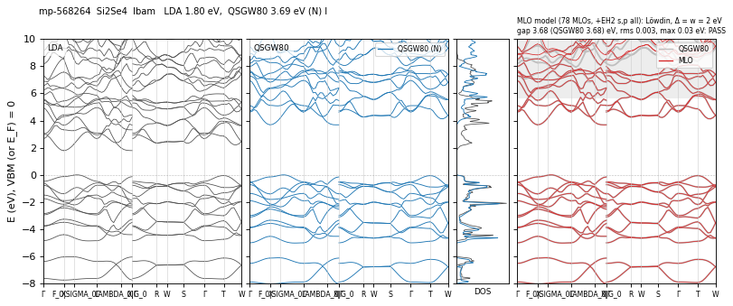

**mp-550172** Sn2O4 — QSGW80 **2.72** N / M 2.79 eV D differs — ecalj 989a18637 (tf32, t_tetrakbt -300) — MLO PASS (b1) 34 gap 2.72 rms 0.000 max 0.00 (ecalj fb2da026b)

<small>runs: M 2.79 · N 2.72 (10-05)</small>

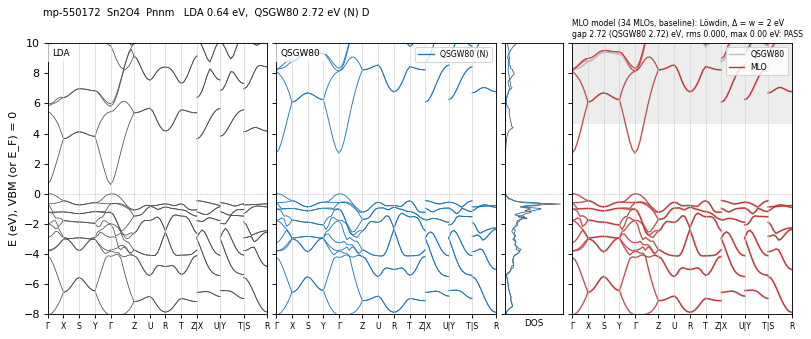

**mp-856** Sn2O4 — QSGW80 **3.13** N / M ≈ eV D  — ecalj 989a18637 (tf32, t_tetrakbt -300) — MLO PASS (b1) 34 gap 3.13 rms 0.001 max 0.00 (ecalj fb2da026b)

<small>runs: M 3.15 · N 3.13 (10-05)</small>

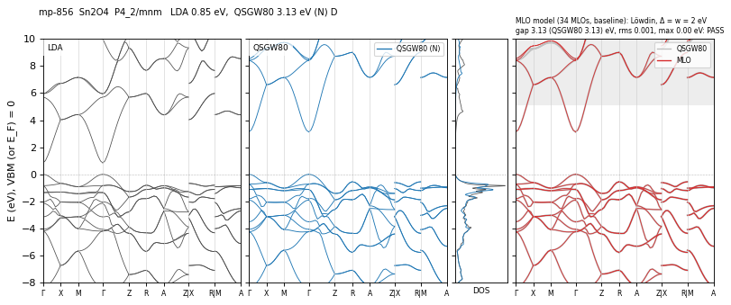

**mp-9984** Sn2S4 — QSGW80 **2.64** N / M ≈ eV I  — ecalj 989a18637 (tf32, t_tetrakbt -300) — MLO PASS (b1) 54 gap 2.63 rms 0.002 max 0.01 (ecalj fb2da026b)

<small>runs: M 2.65 · N 2.64 (10-04)</small>

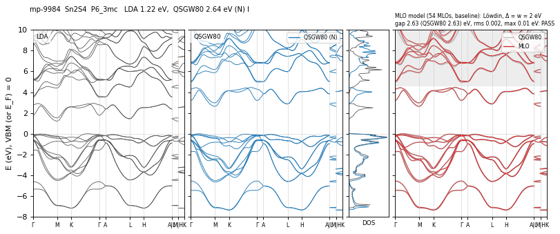

**mp-10667** Sr2Ag2P2 — QSGW80 **0.84** N / M ≈ eV D  — ecalj 989a18637 (tf32, t_tetrakbt -300) — MLO PASS (b1) 54 gap 0.84 rms 0.001 max 0.01 (ecalj a1d6c0e11)

<small>runs: M 0.84 · N 0.84 (10-03)</small>

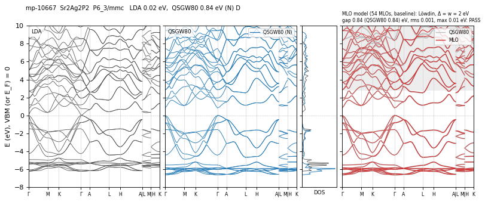

**mp-1077553** Sr2BBrN2 — QSGW80 **4.10** N / R ≈ eV I  — ecalj 989a18637 (tf32, t_tetrakbt -300) — MLO PASS (b2) 51 gap 4.10 rms 0.001 max 0.00 (ecalj fb2da026b)

<small>runs: M FAILED · R 4.10 (09-30) · N 4.10 (10-05)</small>

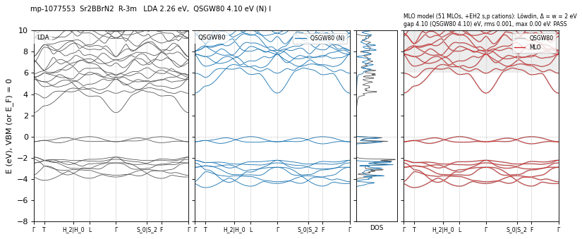

**mp-23024** Sr2Br2F2 — QSGW80 **7.72** N / M 7.64 eV D differs — ecalj 989a18637 (tf32, t_tetrakbt -300) — MLO PASS (b2) 58 gap 7.72 rms 0.001 max 0.00 (ecalj fb2da026b)

<small>runs: M 7.64 · N 7.72 (10-04)</small>

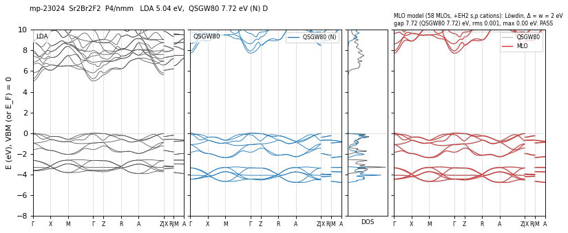

**mp-10497** Sr2C4 — QSGW80 **4.42** N / R ≈ eV I  — ecalj 989a18637 (tf32, t_tetrakbt -300) — MLO PASS (b2) 64 gap 4.41 rms 0.003 max 0.02 (ecalj fb2da026b)

<small>runs: M FAILED · R 4.42 (09-30) · N 4.42 (10-05)</small>

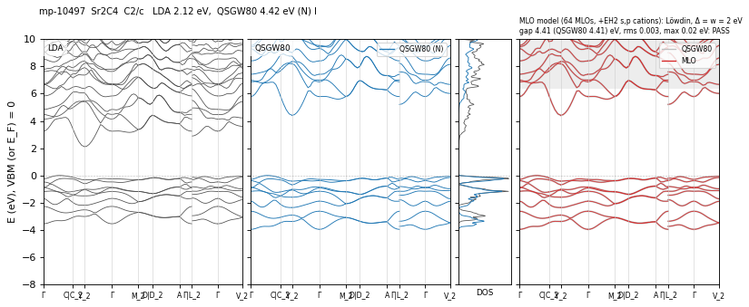

**mp-22957** Sr2Cl2F2 — QSGW80 **8.73** N / M 8.66 eV D differs — ecalj 989a18637 (tf32, t_tetrakbt -300) — MLO PASS (b2) 58 gap 8.73 rms 0.001 max 0.00 (ecalj fb2da026b)

<small>runs: M 8.66 · N 8.73 (10-05)</small>

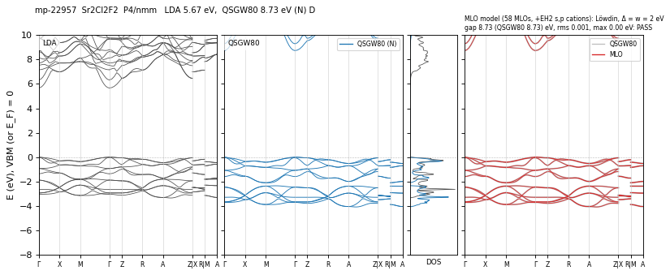

**mp-12557** Sr2Cu2As2 — QSGW80 **0.53** N / M ≈ eV I  — ecalj 989a18637 (tf32, t_tetrakbt -300) — MLO PASS (b1) 54 gap 0.53 rms 0.001 max 0.02 (ecalj a1d6c0e11)

<small>runs: M 0.53 · N 0.53 (10-03)</small>

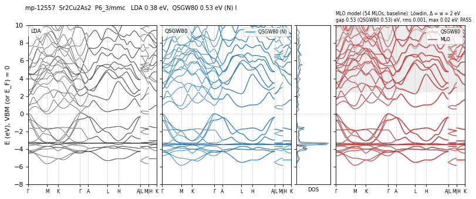

**mp-552537** Sr2CuBrO2 — QSGW80 **4.74** N / M 4.51 eV I CHECK — ecalj 989a18637 (tf32, t_tetrakbt -300) — MLO PASS (b2) 58 gap 4.74 rms 0.005 max 0.05 (ecalj fb2da026b)

<small>runs: M 4.51 · N 4.74 (10-03)</small>

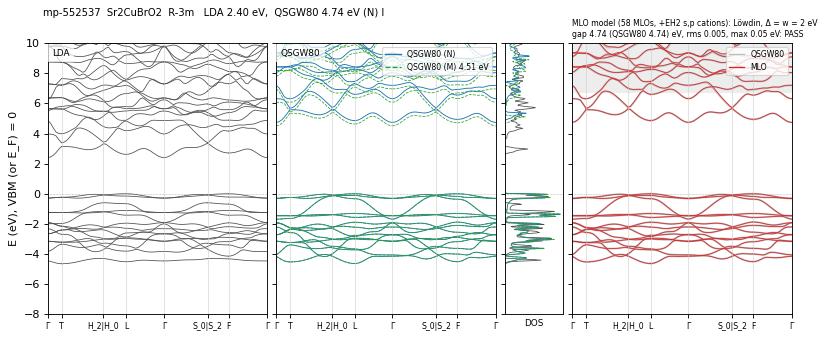

**mp-1019258** Sr2F4 — QSGW80 **9.78** N / M 9.64 eV D differs — ecalj 989a18637 (tf32, t_tetrakbt -300) — MLO PASS (b1) 40 gap 9.79 rms 0.004 max 0.05 (ecalj a1d6c0e11)

<small>runs: M 9.64 · N 9.78 (10-03)</small>

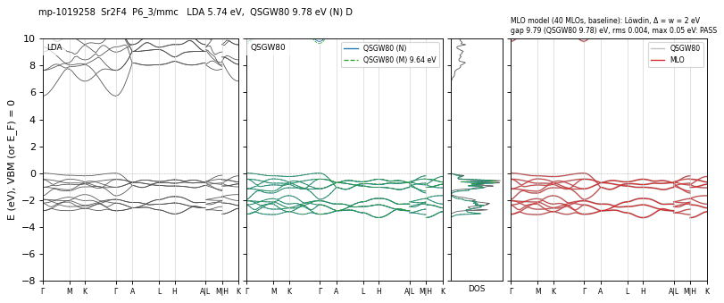

**mp-24423** Sr2H2Br2 — QSGW80 **5.86** N / M ≈ eV D  — ecalj 989a18637 (tf32, t_tetrakbt -300) — MLO PASS (b2) 66 gap 5.86 rms 0.001 max 0.01 (ecalj fb2da026b)

<small>runs: M 5.85 · N 5.86 (10-04)</small>

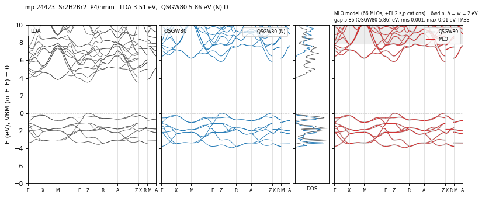

**mp-23860** Sr2H2Cl2 — QSGW80 **6.31** N / M 6.38 eV D differs — ecalj 989a18637 (tf32, t_tetrakbt -300) — MLO PASS (b2) 66 gap 6.31 rms 0.001 max 0.01 (ecalj fb2da026b)

<small>runs: M 6.38 · N 6.31 (10-03)</small>

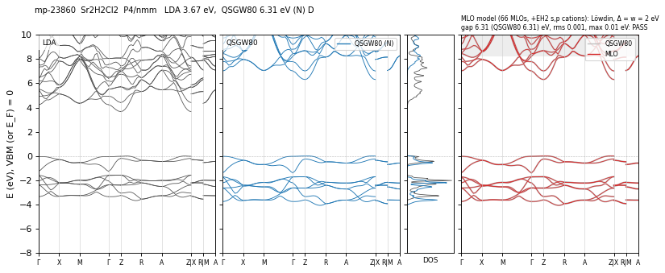

**mp-24205** Sr2H2I2 — QSGW80 **5.31** N / M 5.39 eV I differs — ecalj 989a18637 (tf32, t_tetrakbt -300) — MLO PASS (b2) 60 gap 5.31 rms 0.006 max 0.06 (ecalj fb2da026b)

<small>runs: M 5.39 · N 5.31 (10-04)</small>

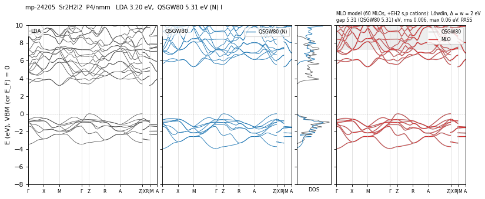

**mp-1019269** Sr2H3I — QSGW80 **3.96** N / R ≈ eV I  — ecalj 989a18637 (tf32, t_tetrakbt -300) — MLO PASS (b2) 59 gap 3.97 rms 0.002 max 0.01 (ecalj fb2da026b)

<small>runs: M FAILED · R 3.96 (09-30) · N 3.96 (10-05)</small>

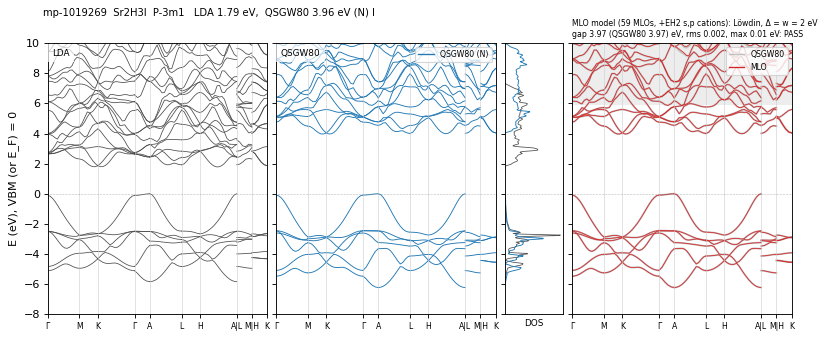

**mp-1179094** Sr2H4 — QSGW80 **3.29** N / M ≈ · path 3.16 eV I path<mesh(mesh) — ecalj 989a18637 (tf32, t_tetrakbt -300) — MLO PASS (b1) 34 gap 3.16 rms 0.002 max 0.01 (ecalj a1d6c0e11)

<small>runs: M 3.28 · N 3.29 (10-03)</small>

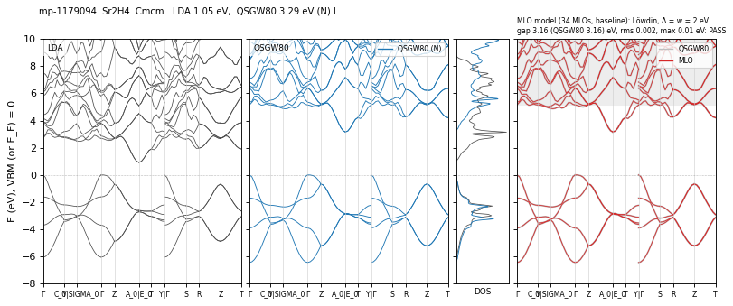

**mp-23759** Sr2H4 — QSGW80 **3.31** N / M ≈ · path 3.18 eV I path<mesh(mesh) — ecalj 989a18637 (tf32, t_tetrakbt -300) — MLO PASS (b1) 34 gap 3.18 rms 0.002 max 0.01 (ecalj fb2da026b)

<small>runs: M 3.34 · N 3.31 (10-05)</small>

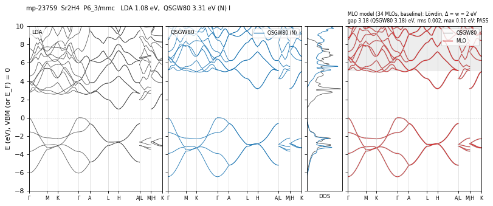

**mp-29754** Sr2Li2N2 — QSGW80 **1.17** N / M ≈ eV I  — ecalj 989a18637 (tf32, t_tetrakbt -300) — MLO PASS (b1) 40 gap 1.18 rms 0.008 max 0.07 (ecalj fb2da026b)

<small>runs: M 1.17 · N 1.17 (10-05)</small>

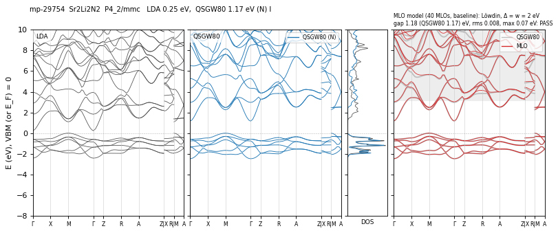

**mp-13276** Sr2Li2P2 — QSGW80 **2.36** N / M ≈ eV I  — ecalj 989a18637 (tf32, t_tetrakbt -300) — MLO PASS (b1) 44 gap 2.36 rms 0.002 max 0.02 (ecalj a1d6c0e11)

<small>runs: M 2.35 · N 2.36 (10-05)</small>

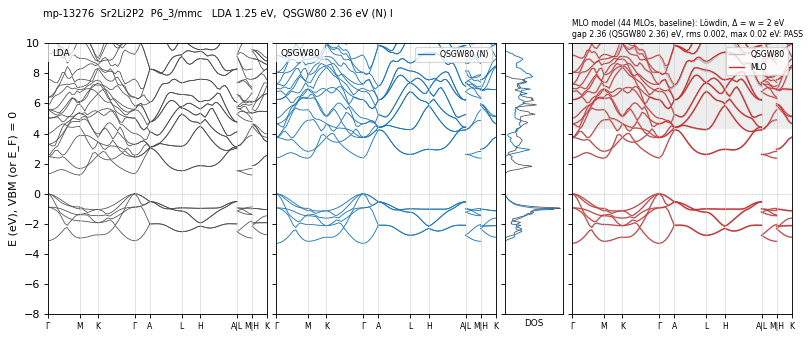

**mp-4359** Sr2PdO3 — QSGW80 **2.18** N / M 2.61 eV I CHECK — ecalj 989a18637 (tf32, t_tetrakbt -300) — MLO PASS (b1) 45 gap 2.18 rms 0.001 max 0.00 (ecalj fb2da026b)

<small>runs: M 2.61 · N 2.18 (10-03)</small>

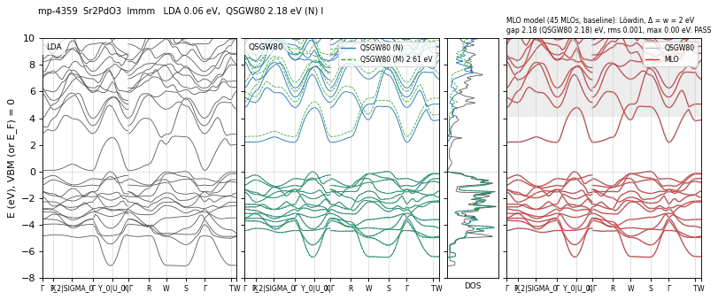

**mp-1950** Sr2S4 — QSGW80 **3.00** N / M ≈ eV I  — ecalj 989a18637 (tf32, t_tetrakbt -300) — MLO PASS (b1) 54 gap 3.00 rms 0.007 max 0.08 (ecalj fb2da026b)

<small>runs: M 3.00 · N 3.00 (10-05)</small>

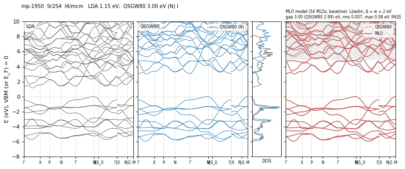

**mp-7811** SrSO4 — QSGW80 **6.49** E / N 6.58 / R 6.58 eV I differs — ecalj 614ab5eb8 (tf32, t_tetrakbt -300) with ES, ES rule es-a — MLO PASS (b1, ES) 38 gap 6.49 rms 0.001 max 0.00 (ecalj 1bbefe015)

<small>runs: M FAILED · R 6.58 (09-30) · N 6.58 (10-05) · E 6.49 (10-06, ES 1, es-a)</small>

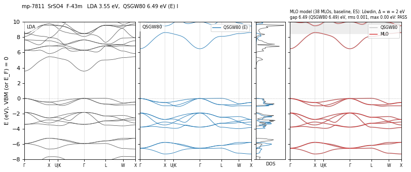

**mp-12561** Ta2As4 — QSGW80 **0.00** N / R ≈ eV metal  — ecalj 989a18637 (tf32, t_tetrakbt -300) — MLO PASS (b1) 54 rms 0.001 max 0.01 (ecalj a1d6c0e11)

<small>runs: M UNKNOWN · R CONVERGED_METAL (10-01) · N CONVERGED_METAL (10-03)</small>

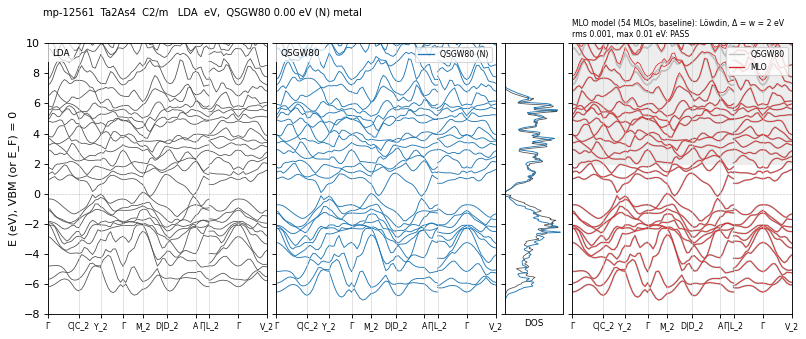

**mp-22945** Te2Rh2Cl2 — QSGW80 **1.54** N / M ≈ eV D  — ecalj 989a18637 (tf32, t_tetrakbt -300) — MLO PASS (b1) 54 gap 1.55 rms 0.001 max 0.01 (ecalj fb2da026b)

<small>runs: M 1.59 · N 1.54 (10-05)</small>

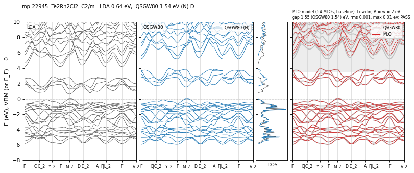

**mp-602** Te4Mo2 — QSGW80 **1.42** N / M ≈ eV I  — ecalj 989a18637 (tf32, t_tetrakbt -300) — MLO PASS (b1) 54 gap 1.33 rms 0.002 max 0.02 (ecalj fb2da026b)

<small>runs: M 1.43 · N 1.42 (10-04)</small>

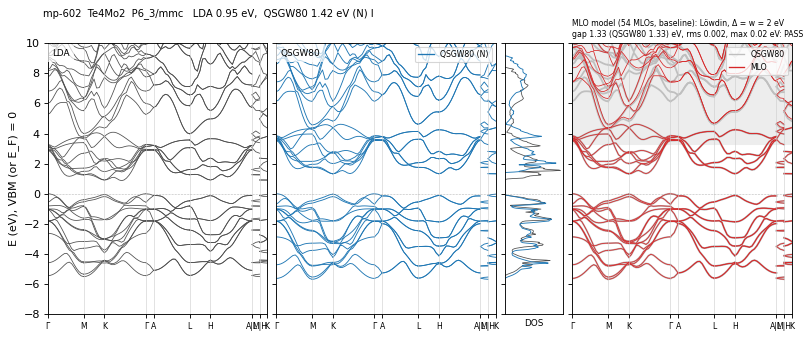

**mp-267** Te4Ru2 — QSGW80 **0.69** N / M ≈ eV I  — ecalj 989a18637 (tf32, t_tetrakbt -300) — MLO PASS (b1) 54 gap 0.68 rms 0.001 max 0.02 (ecalj fb2da026b)

<small>runs: M 0.69 · N 0.69 (10-03)</small>

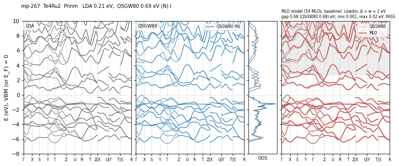

**mp-1019322** Te4W2 — QSGW80 **1.68** N / M ≈ · path 1.40 eV D path<mesh(mesh) — ecalj 989a18637 (tf32, t_tetrakbt -300) — MLO PASS (b1) 54 gap 1.41 rms 0.004 max 0.04 (ecalj a1d6c0e11)

<small>runs: M 1.68 · N 1.68 (10-04)</small>

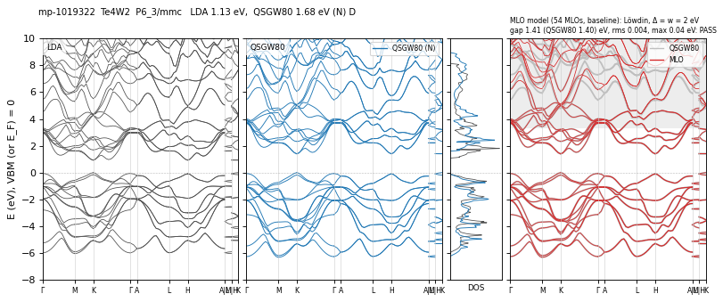

**mp-27849** Ti2Br2N2 — QSGW80 **1.78** N / M ≈ eV D  — ecalj 989a18637 (tf32, t_tetrakbt -300) — MLO PASS (b1) 44 gap 1.78 rms 0.001 max 0.03 (ecalj fb2da026b)

<small>runs: M 1.79 · N 1.78 (10-05)</small>

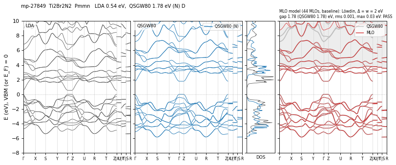

**mp-27850** Ti2N2Cl2 — QSGW80 **1.90** N / M ≈ eV D  — ecalj 989a18637 (tf32, t_tetrakbt -300) — MLO PASS (b1) 44 gap 1.90 rms 0.002 max 0.02 (ecalj fb2da026b)

<small>runs: M 1.95 · N 1.90 (10-05)</small>

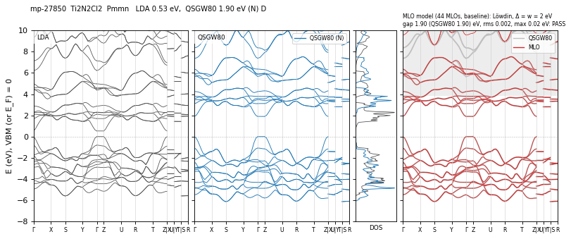

**mp-390** Ti2O4 — QSGW80 **4.05** N / M 3.91 eV I differs — ecalj 989a18637 (tf32, t_tetrakbt -300) — MLO PASS (b1) 34 gap 4.02 rms 0.001 max 0.01 (ecalj fb2da026b)

<small>runs: M 3.91 · N 4.05 (10-03)</small>

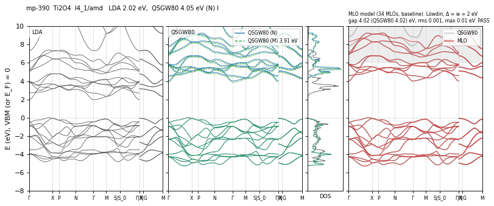

**mp-27484** Tl4O2 — QSGW80 **1.14** N / M ≈ eV D  — ecalj 989a18637 (tf32, t_tetrakbt -300) — MLO PASS (b1) 64 gap 1.13 rms 0.002 max 0.02 (ecalj fb2da026b)

<small>runs: M 1.16 · N 1.14 (10-04)</small>

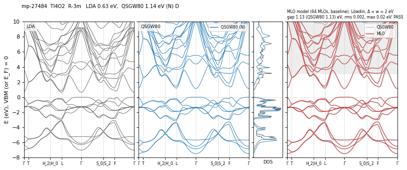

**mp-551470** Tl4O2 — QSGW80 **1.13** N / M ≈ eV I  — ecalj 989a18637 (tf32, t_tetrakbt -300) — MLO PASS (b1) 64 gap 1.12 rms 0.002 max 0.02 (ecalj fb2da026b)

<small>runs: M 1.14 · N 1.13 (10-03)</small>

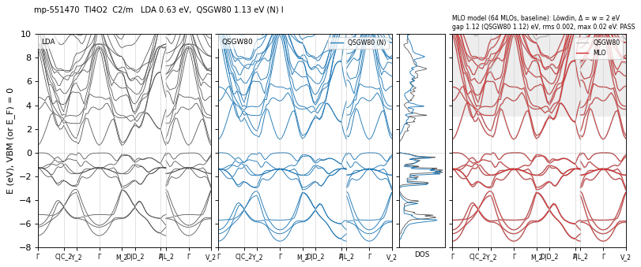

**mp-30530** TlClO4 — QSGW80 **7.65** E / N ≈ / R ≈ eV D  — ecalj 614ab5eb8 (tf32, t_tetrakbt -300) with ES, ES rule es-a — MLO PASS (b1, ES) 40 gap 7.65 rms 0.002 max 0.02 (ecalj a863cf27f)

<small>runs: M FAILED · R 7.63 (09-30) · N 7.63 (10-05) · E 7.65 (10-06, ES 1, es-a)</small>

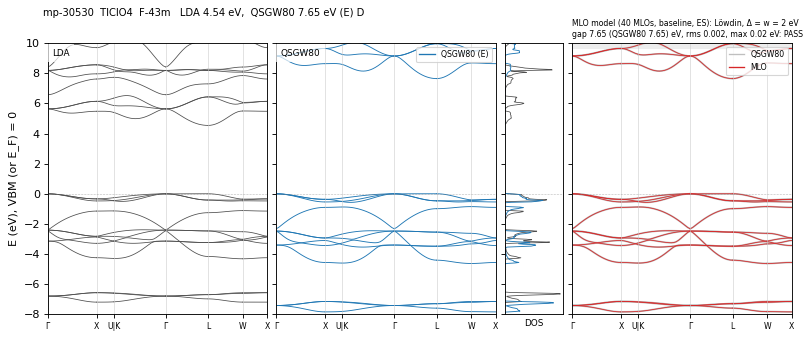

**mp-1072660** V2As4 — QSGW80 **0.00** N / R ≈ eV metal  — ecalj 989a18637 (tf32, t_tetrakbt -300) — MLO PASS (b1) 54 rms 0.001 max 0.01 (ecalj a1d6c0e11)

<small>runs: M UNKNOWN · R CONVERGED_METAL (09-30) · N CONVERGED_METAL (10-03)</small>

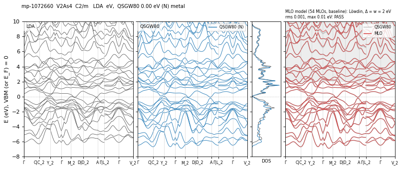

**mp-224** W2S4 — QSGW80 **2.20** N / M ≈ · path 1.96 eV I path<mesh(mesh) — ecalj 989a18637 (tf32, t_tetrakbt -300) — MLO PASS (b1) 54 gap 1.96 rms 0.002 max 0.01 (ecalj fb2da026b)

<small>runs: M 2.22 · N 2.20 (10-03)</small>

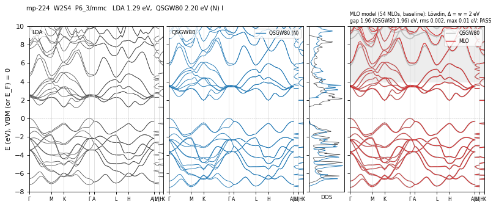

**mp-1821** W2Se4 — QSGW80 **2.02** N / M ≈ · path 1.88 eV I path<mesh(mesh) — ecalj 989a18637 (tf32, t_tetrakbt -300) — MLO PASS (b1) 54 gap 1.89 rms 0.003 max 0.03 (ecalj fb2da026b)

<small>runs: M 2.04 · N 2.02 (10-05)</small>

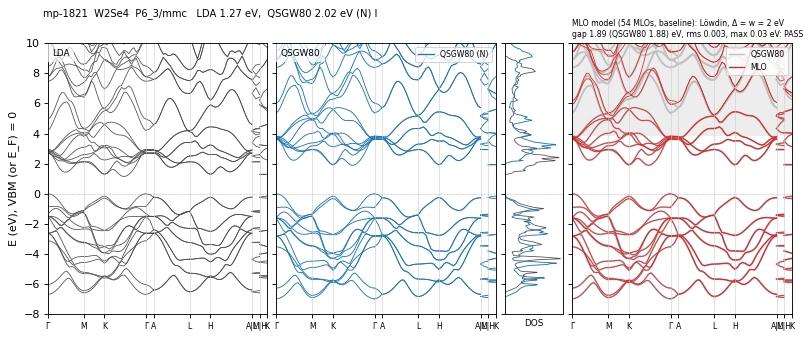

**mp-28260** WBr4O — QSGW80 **2.63** N / M 2.76 eV I differs — ecalj 989a18637 (tf32, t_tetrakbt -300) — MLO PASS (b1) 49 gap 2.63 rms 0.001 max 0.00 (ecalj fb2da026b)

<small>runs: M 2.76 · N 2.63 (10-05)</small>

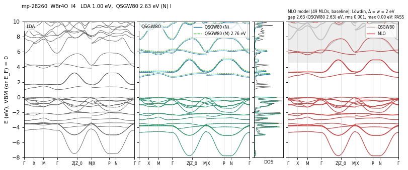

**mp-27754** WCl4O — QSGW80 **3.77** N / M 3.88 eV I differs — ecalj 989a18637 (tf32, t_tetrakbt -300) — MLO PASS (b1) 49 gap 3.77 rms 0.000 max 0.00 (ecalj fb2da026b)

<small>runs: M 3.88 · N 3.77 (10-05)</small>

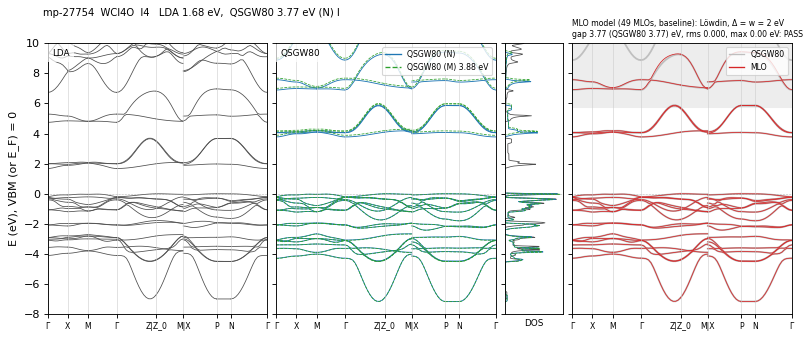

**mp-27985** Y2Cl2O2 — QSGW80 **6.98** N / R ≈ eV D  — ecalj 989a18637 (tf32, t_tetrakbt -300) — MLO PASS (b2all) 60 gap 6.98 rms 0.002 max 0.04 (ecalj fb2da026b)

<small>runs: M FAILED · R 6.98 (09-30) · N 6.98 (10-05)</small>

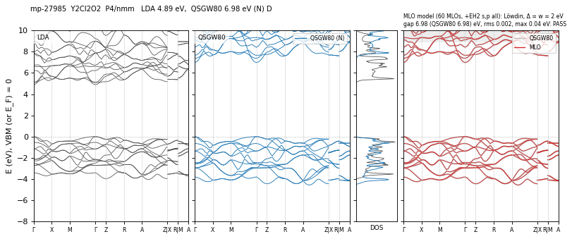

**mp-552120** Y2Cl2O2 — QSGW80 **6.82** N / M 6.50 eV I CHECK — ecalj 989a18637 (tf32, t_tetrakbt -300) — MLO PASS (b2all) 60 gap 6.74 rms 0.001 max 0.01 (ecalj fb2da026b)

<small>runs: M 6.50 · N 6.82 (10-03)</small>

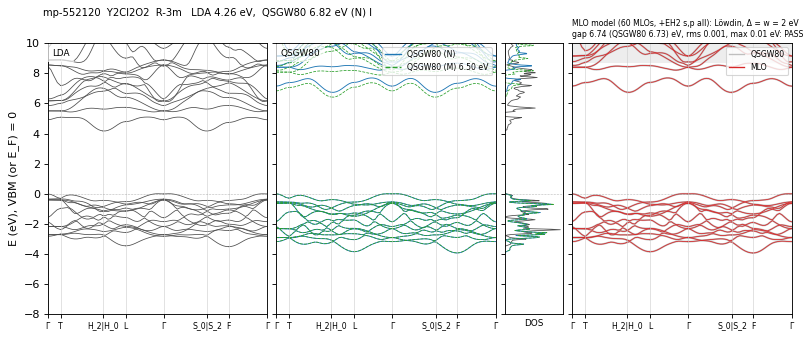

**mp-10219** Y2O2F2 — QSGW80 **7.52** N / M 7.58 eV I differs — ecalj 989a18637 (tf32, t_tetrakbt -300) — MLO PASS (b2all) 56 gap 7.52 rms 0.001 max 0.01 (ecalj a1d6c0e11)

<small>runs: M 7.58 · N 7.52 (10-03)</small>

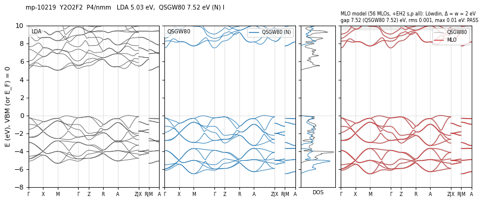

**mp-3637** Y2O2F2 — QSGW80 **7.72** N / M 7.27 eV D CHECK — ecalj 989a18637 (tf32, t_tetrakbt -300) — MLO PASS (b2all) 56 gap 7.62 rms 0.001 max 0.01 (ecalj fb2da026b)

<small>runs: M 7.27 · N 7.72 (10-04)</small>

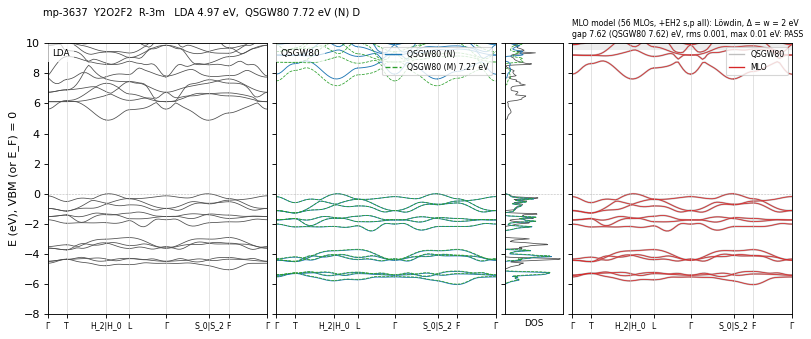

**mp-10086** Y2S2F2 — QSGW80 **2.77** N / M ≈ eV D  — ecalj 989a18637 (tf32, t_tetrakbt -300) — MLO PASS (b1) 50 gap 2.77 rms 0.000 max 0.00 (ecalj a1d6c0e11)

<small>runs: M 2.76 · N 2.77 (10-03)</small>

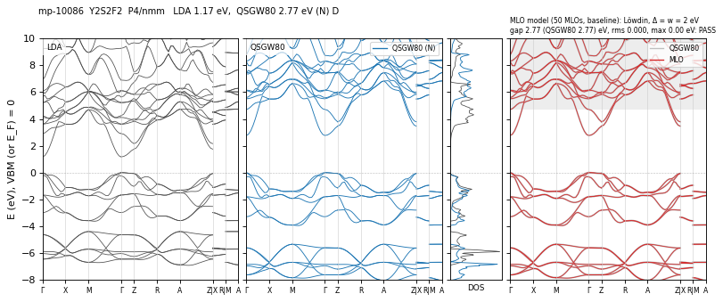

**mp-22909** Zn2Cl4 — QSGW80 **6.97** N / M ≈ eV D  — ecalj 989a18637 (tf32, t_tetrakbt -300) — MLO PASS (b2) 62 gap 7.00 rms 0.004 max 0.03 (ecalj fb2da026b)

<small>runs: M 6.93 · N 6.97 (10-05)</small>

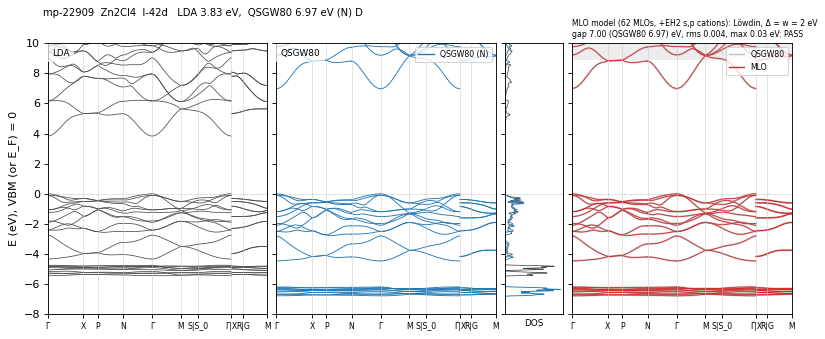

**mp-567279** Zn2Cl4 — QSGW80 **6.78** N / M ≈ eV D  — ecalj 989a18637 (tf32, t_tetrakbt -300) — MLO PASS (b2) 62 gap 6.79 rms 0.002 max 0.02 (ecalj fb2da026b)

<small>runs: M 6.80 · N 6.78 (10-04)</small>

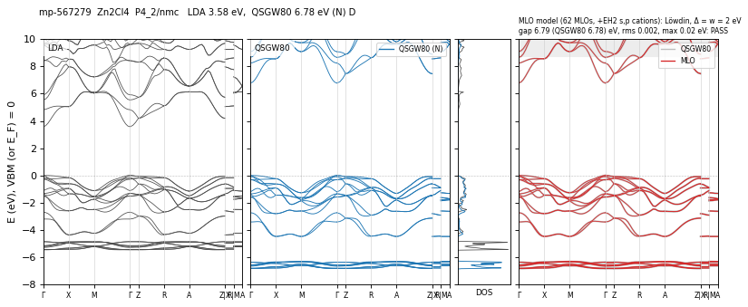

**mp-1873** Zn2F4 — QSGW80 **8.05** N / R ≈ eV I  — ecalj 989a18637 (tf32, t_tetrakbt -300) — MLO PASS (b1) 34 gap 8.07 rms 0.003 max 0.08 (ecalj fb2da026b)

<small>runs: M 8.48 · R 8.05 (10-01) · N 8.05 (10-05)</small>

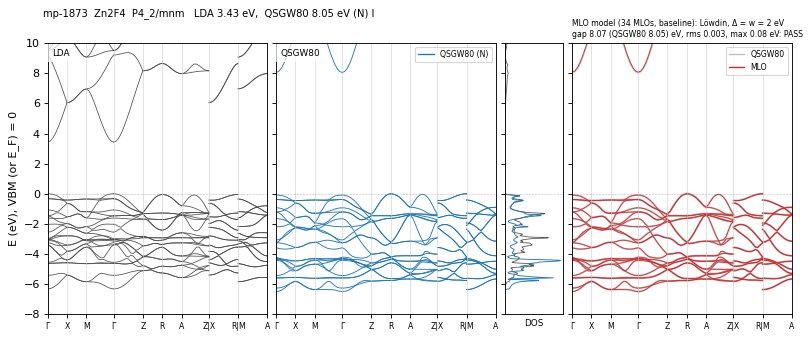

**mp-1071319** Zn3Te3 — QSGW80 **1.10** N / M ≈ eV D  — ecalj 989a18637 (tf32, t_tetrakbt -300) — MLO PASS (b1) 69 gap 1.11 rms 0.004 max 0.03 (ecalj fb2da026b)

<small>runs: M 1.10 · N 1.10 (10-05)</small>

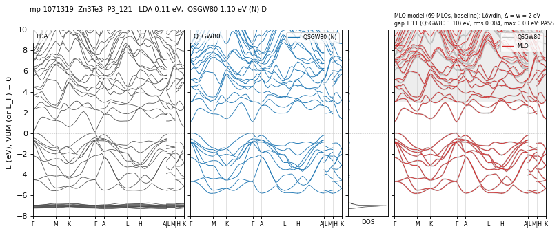

**mp-571195** Zn3Te3 — QSGW80 **2.18** N / M ≈ eV D  — ecalj 989a18637 (tf32, t_tetrakbt -300) — MLO PASS (b2) 66 gap 2.18 rms 0.002 max 0.01 (ecalj fb2da026b)

<small>runs: M 2.17 · N 2.18 (10-05)</small>

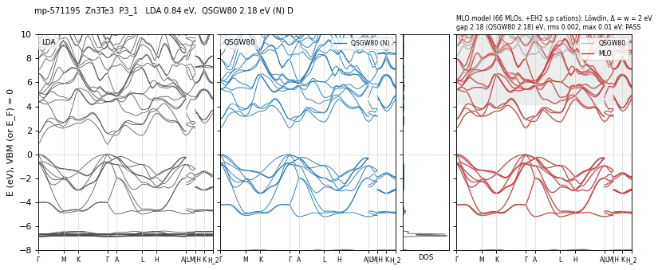

**mp-545756** ZnSO4 — QSGW80 **8.58** E / M 8.77 / N ≈ eV D differs — ecalj 0601771b4 (tf32, t_tetrakbt -300) with ES, ES rule es-c — MLO PASS (b1, ES) 38 gap 8.59 rms 0.004 max 0.07 (ecalj 1fd918e7e)

<small>runs: M 8.77 · N 8.54 (10-03) · E FAIL(1) FAIL(1) (10-06, ES 1, es-a) · E 8.58 (10-06, ES 1, es-c)</small>

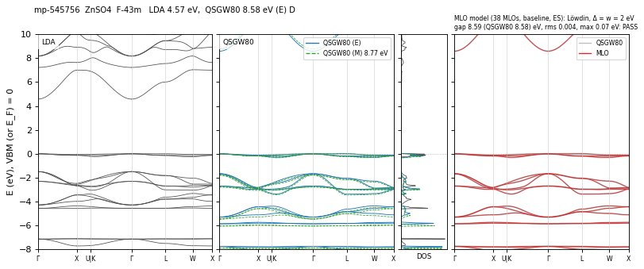

**mp-541912** Zr2Br2N2 — QSGW80 **2.94** N / M ≈ · path 2.82 eV I path<mesh(mesh) — ecalj 989a18637 (tf32, t_tetrakbt -300) — MLO PASS (b2all) 60 gap 2.81 rms 0.001 max 0.01 (ecalj fb2da026b)

<small>runs: M 2.91 · N 2.94 (10-05)</small>

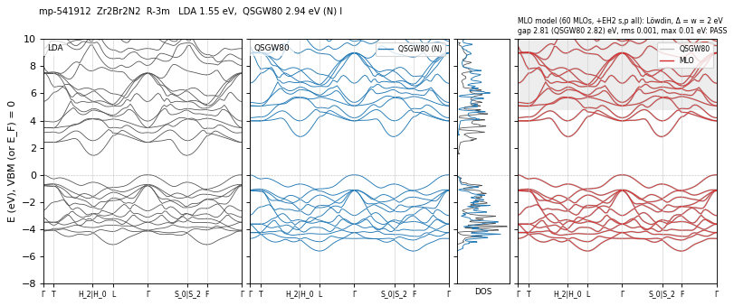

**mp-570157** Zr2Br2N2 — QSGW80 **3.37** N / M ≈ eV D  — ecalj 989a18637 (tf32, t_tetrakbt -300) — MLO PASS (b2all) 60 gap 3.37 rms 0.001 max 0.00 (ecalj fb2da026b)

<small>runs: M 3.41 · N 3.37 (10-05)</small>

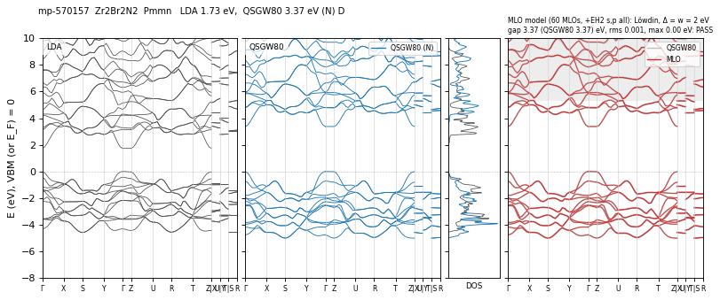

**mp-23052** Zr2I2N2 — QSGW80 **2.88** N / R ≈ eV D  — ecalj b695fa65c (tf32, t_tetrakbt -300) — MLO PASS (b2all) 60 gap 2.88 rms 0.001 max 0.00 (ecalj fb2da026b)

<small>runs: M FAILED · R 2.88 (09-30) · N 2.88 (10-05)</small>

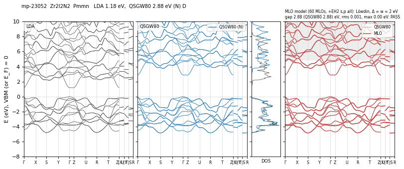

**mp-580886** Zr2I2N2 — QSGW80 **2.12** N / M 2.00 · path 2.02 eV I differs path<mesh(mesh) — ecalj 989a18637 (tf32, t_tetrakbt -300) — MLO PASS (b2all) 60 gap 2.02 rms 0.001 max 0.01 (ecalj fb2da026b)

<small>runs: M 2.00 · N 2.12 (10-05)</small>

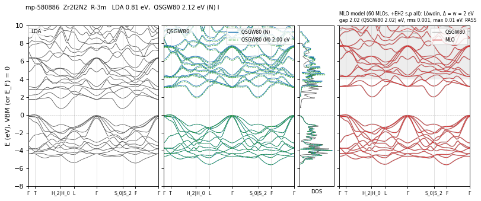

**mp-542791** Zr2N2Cl2 — QSGW80 **3.35** N / M 3.25 · path 3.22 eV I differs path<mesh(mesh) — ecalj 989a18637 (tf32, t_tetrakbt -300) — MLO PASS (b2all) 60 gap 3.21 rms 0.001 max 0.00 (ecalj fb2da026b)

<small>runs: M 3.25 · N 3.35 (10-04)</small>

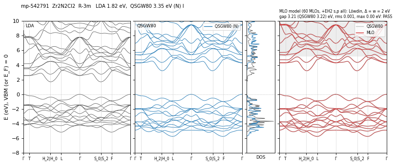

**mp-2574** Zr2O4 — QSGW80 **6.14** N / M 6.23 eV I differs — ecalj 989a18637 (tf32, t_tetrakbt -300) — MLO PASS (b1) 34 gap 6.14 rms 0.004 max 0.02 (ecalj fb2da026b)

<small>runs: M 6.23 · N 6.14 (10-05)</small>

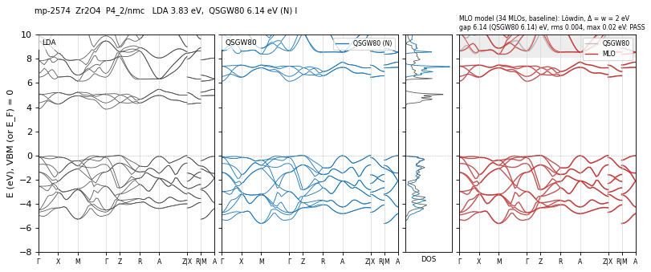

**mp-8231** Zr2S2O2 — QSGW80 **1.72** N / M ≈ eV D  — ecalj 989a18637 (tf32, t_tetrakbt -300) — MLO PASS (b1) 44 gap 1.72 rms 0.001 max 0.00 (ecalj fb2da026b)

<small>runs: M 1.74 · N 1.72 (10-04)</small>

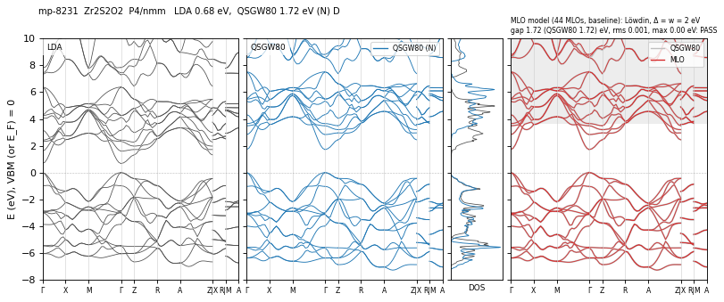

