# GW1500 QSGW80 — bands and DOS, 7 atoms per cell

[README](README.md) · [table](table.md)

Left: LDA. Middle: QSGW80 adopted (blue, condition in parentheses; green dashed: another QSGW80 result when its gap differs by more than 0.1 eV) and the total DOS. Right: the MLO model of the standard recipe (red) on the QSGW80 bands (gray), with its conditions and check; shaded: outside the window of the check ([README](README.md#mlo-models)). Energies from the VBM (insulators) or E_F (metals).

**mp-23485** Ag2HgI4 — QSGW80 **2.63** N / M ≈ eV D  — ecalj 989a18637 (tf32, t_tetrakbt -300) — MLO PASS (b1) 63 gap 2.70 rms 0.006 max 0.07 (ecalj fb2da026b)

<small>runs: M 2.63 · N 2.63 (10-04)</small>

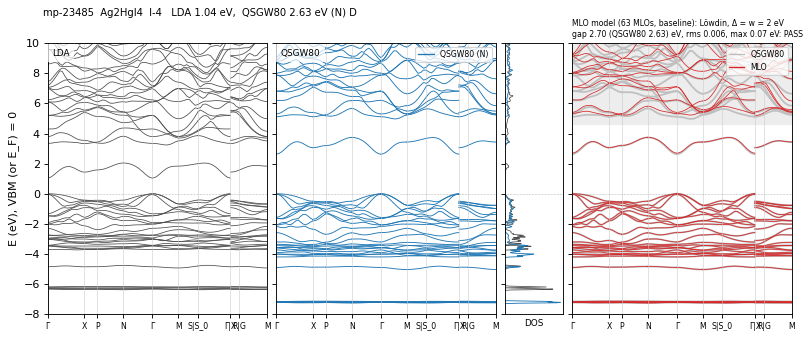

**mp-570256** Ag2HgI4 — QSGW80 **2.50** N / M ≈ eV D  — ecalj 989a18637 (tf32, t_tetrakbt -300) — MLO PASS (b1) 63 gap 2.55 rms 0.004 max 0.05 (ecalj fb2da026b)

<small>runs: M 2.54 · N 2.50 (10-04)</small>

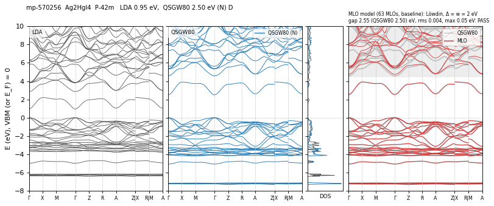

**mp-5928** Al2CdS4 — QSGW80 **4.46** N / M ≈ eV I  — ecalj 989a18637 (tf32, t_tetrakbt -300) — MLO PASS (b2) 75 gap 4.46 rms 0.001 max 0.00 (ecalj fb2da026b)

<small>runs: M 4.47 · N 4.46 (10-04)</small>

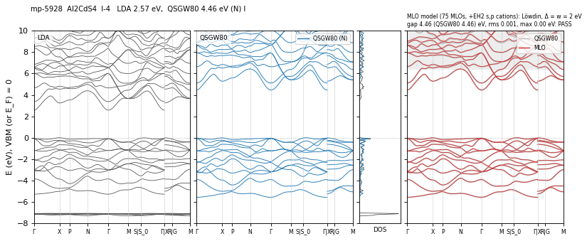

**mp-3159** Al2CdSe4 — QSGW80 **3.49** N / M 3.43 eV D differs — ecalj 989a18637 (tf32, t_tetrakbt -300) — MLO PASS (b2) 75 gap 3.49 rms 0.002 max 0.02 (ecalj fb2da026b)

<small>runs: M 3.43 · N 3.49 (10-03)</small>

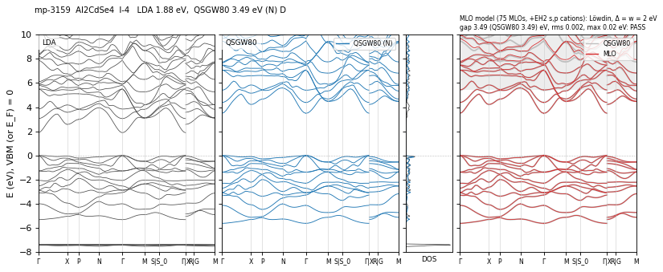

**mp-7909** Al2CdTe4 — QSGW80 **2.71** N / M ≈ eV D  — ecalj 989a18637 (tf32, t_tetrakbt -300) — MLO PASS (b2) 75 gap 2.71 rms 0.004 max 0.03 (ecalj fb2da026b)

<small>runs: M 2.71 · N 2.71 (10-04)</small>

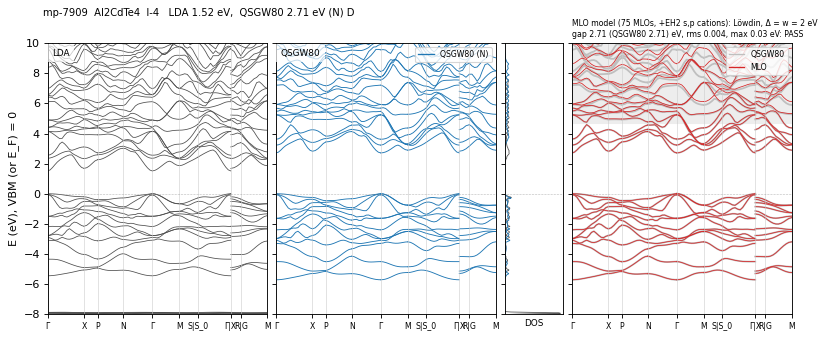

**mp-7906** Al2HgS4 — QSGW80 **3.49** N / M ≈ eV I  — ecalj 989a18637 (tf32, t_tetrakbt -300) — MLO PASS (b1) 63 gap 3.52 rms 0.005 max 0.04 (ecalj fb2da026b)

<small>runs: M 3.49 · N 3.49 (10-03)</small>

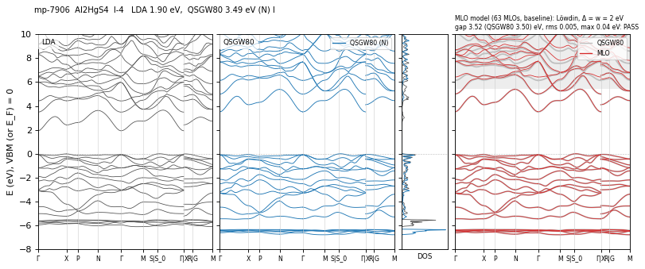

**mp-3038** Al2HgSe4 — QSGW80 **2.67** N / M ≈ eV D  — ecalj 989a18637 (tf32, t_tetrakbt -300) — MLO PASS (b1) 63 gap 2.69 rms 0.006 max 0.07 (ecalj fb2da026b)

<small>runs: M 2.67 · N 2.67 (10-04)</small>

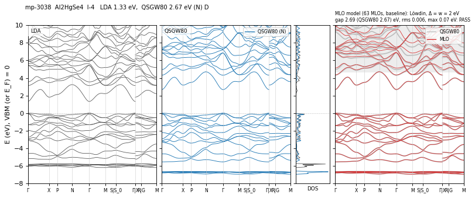

**mp-7910** Al2HgTe4 — QSGW80 **2.01** N / M ≈ eV D  — ecalj 989a18637 (tf32, t_tetrakbt -300) — MLO PASS (b2) 75 gap 2.01 rms 0.002 max 0.02 (ecalj fb2da026b)

<small>runs: M 2.05 · N 2.01 (10-04)</small>

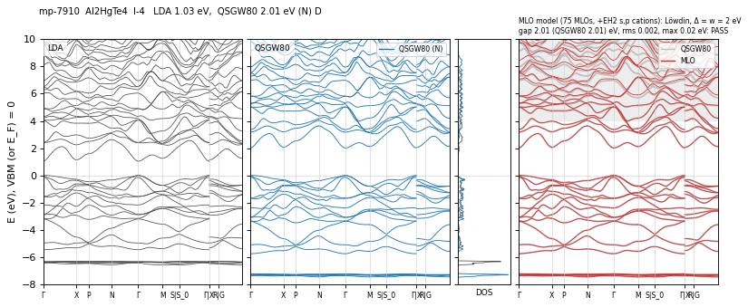

**mp-9254** Al2Te5 — QSGW80 **1.74** N / M ≈ eV I  — ecalj 989a18637 (tf32, t_tetrakbt -300) — MLO PASS (b2) 71 gap 1.68 rms 0.006 max 0.05 (ecalj fb2da026b)

<small>runs: M 1.74 · N 1.74 (10-03)</small>

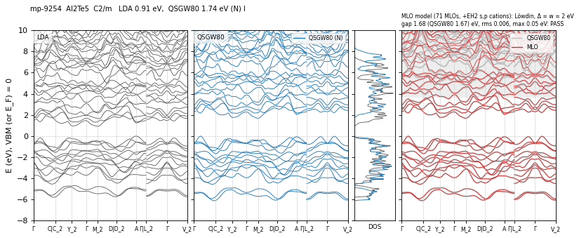

**mp-7907** Al2ZnSe4 — QSGW80 **3.74** N / M ≈ eV D  — ecalj 989a18637 (tf32, t_tetrakbt -300) — MLO PASS (b2) 75 gap 3.74 rms 0.002 max 0.01 (ecalj fb2da026b)

<small>runs: M 3.79 · N 3.74 (10-04)</small>

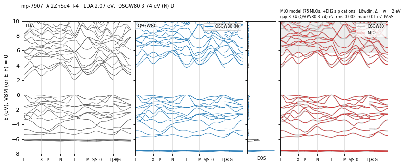

**mp-7908** Al2ZnTe4 — QSGW80 **2.68** N / M ≈ eV I  — ecalj 989a18637 (tf32, t_tetrakbt -300) — MLO PASS (b2) 80 gap 2.69 rms 0.002 max 0.02 (ecalj fb2da026b)

<small>runs: M 2.72 · N 2.68 (10-04)</small>

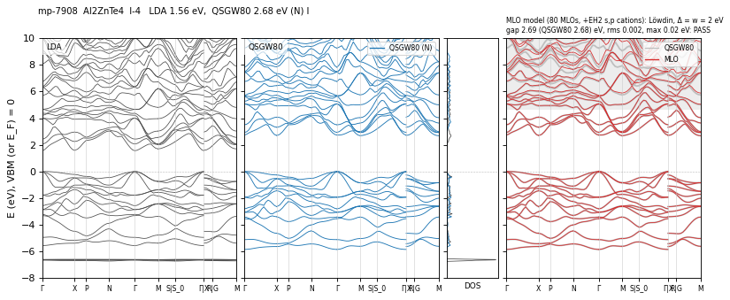

**mp-1591** Al4C3 — QSGW80 **2.24** N / M ≈ eV I  — ecalj 989a18637 (tf32, t_tetrakbt -300) — MLO PASS (b2) 76 gap 2.24 rms 0.003 max 0.02 (ecalj 0c4d16ceb)

<small>runs: M 2.24 · N 2.24 (10-04)</small>

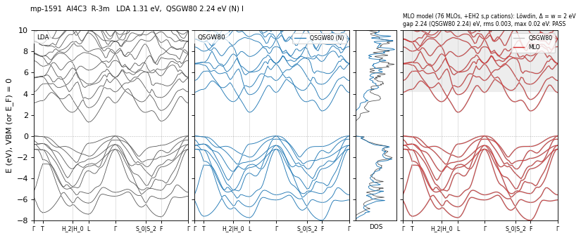

**mp-9321** Ba2HfS4 — QSGW80 **2.20** N / M ≈ eV I  — ecalj 989a18637 (tf32, t_tetrakbt -300) — MLO PASS (b2) 84 gap 2.20 rms 0.006 max 0.08 (ecalj fb2da026b)

<small>runs: M 2.21 · N 2.20 (10-03)</small>

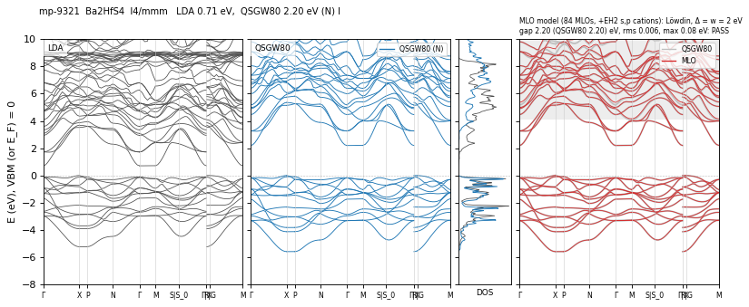

**mp-20098** Ba2PbO4 — QSGW80 **2.64** N / M 2.57 eV I differs — ecalj 989a18637 (tf32, t_tetrakbt -300) — MLO PASS (b1) 54 gap 2.65 rms 0.001 max 0.01 (ecalj fb2da026b)

<small>runs: M 2.57 · N 2.64 (10-03)</small>

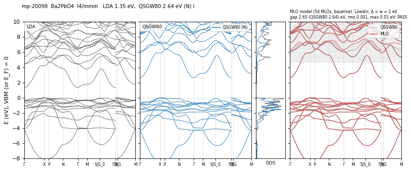

**mp-3359** Ba2SnO4 — QSGW80 **4.73** N / M 4.87 eV I differs — ecalj 989a18637 (tf32, t_tetrakbt -300) — MLO PASS (b1) 49 gap 4.76 rms 0.005 max 0.04 (ecalj fb2da026b)

<small>runs: M 4.87 · N 4.73 (10-03)</small>

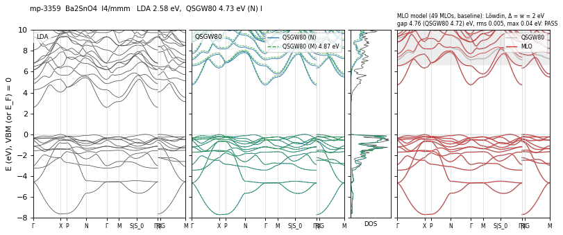

**mp-8335** Ba2ZrO4 — QSGW80 **5.40** N / R ≈ eV I  — ecalj 989a18637 (tf32, t_tetrakbt -300) — MLO PASS (b2) 57 gap 5.39 rms 0.002 max 0.02 (ecalj fb2da026b)

<small>runs: M 5.35 · R 5.40 (10-01) · N 5.40 (10-06)</small>

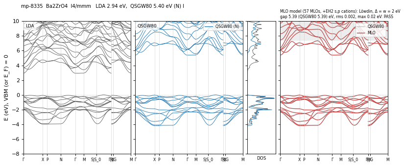

**mp-3813** Ba2ZrS4 — QSGW80 **1.85** N / M ≈ eV I  — ecalj 989a18637 (tf32, t_tetrakbt -300) — MLO PASS (b1) 69 gap 1.85 rms 0.005 max 0.06 (ecalj fb2da026b)

<small>runs: M 1.87 · N 1.85 (10-04)</small>

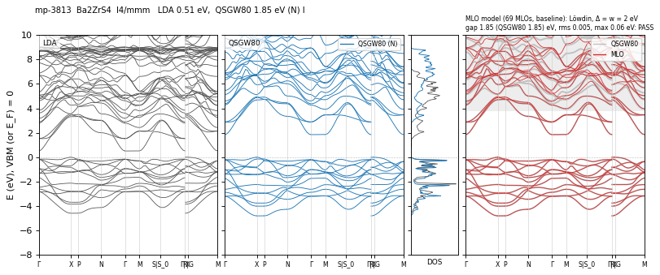

**mp-545788** Ba3ZnN2O — QSGW80 **1.62** N / M 1.57 eV I differs — ecalj 989a18637 (tf32, t_tetrakbt -300) — MLO PASS (b2) 73 gap 1.62 rms 0.003 max 0.02 (ecalj fb2da026b)

<small>runs: M 1.57 · N 1.62 (10-04)</small>

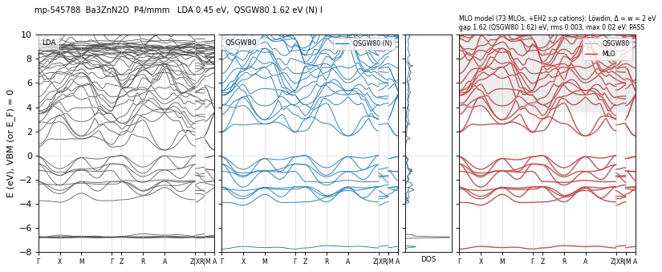

**mp-8300** Ba4As2O — QSGW80 **1.68** N / M ≈ eV D  — ecalj 989a18637 (tf32, t_tetrakbt -300) — MLO PASS (b2) 86 gap 1.69 rms 0.004 max 0.03 (ecalj fb2da026b)

<small>runs: M 1.63 · N 1.68 (10-04)</small>

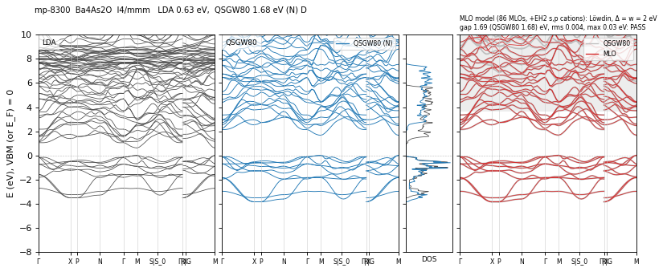

**mp-9774** Ba4Sb2O — QSGW80 **1.62** N / M 1.71 eV D differs — ecalj 989a18637 (tf32, t_tetrakbt -300) — MLO PASS (b2) 86 gap 1.66 rms 0.008 max 0.06 (ecalj fb2da026b)

<small>runs: M 1.71 · N 1.62 (10-04)</small>

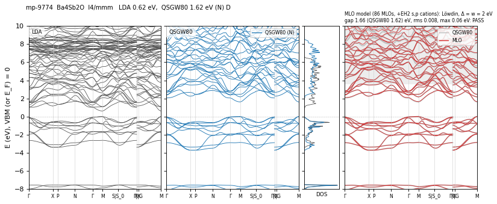

**mp-550751** BaBeSiO4 — QSGW80 **6.93** E / M 7.05 / N 7.05 eV I differs — ecalj 0601771b4 (tf32, t_tetrakbt -300) with ES, ES rule es-c — MLO PASS (b1, ES) 42 gap 6.93 rms 0.002 max 0.01 (ecalj f09035a49)

<small>runs: M 7.05 · N 7.05 (10-04) · E 6.93 (10-07, ES 1, es-c)</small>

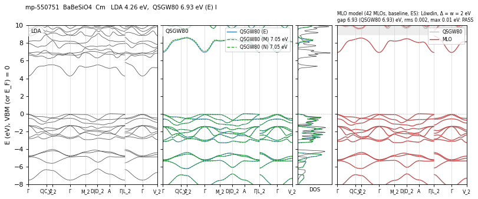

**mp-1077866** BaZnBO3F — QSGW80 **6.34** N / M ≈ eV I  — ecalj 989a18637 (tf32, t_tetrakbt -300) — MLO PASS (b2) 53 gap 6.32 rms 0.002 max 0.02 (ecalj a1d6c0e11)

<small>runs: M 6.35 · N 6.34 (10-03)</small>

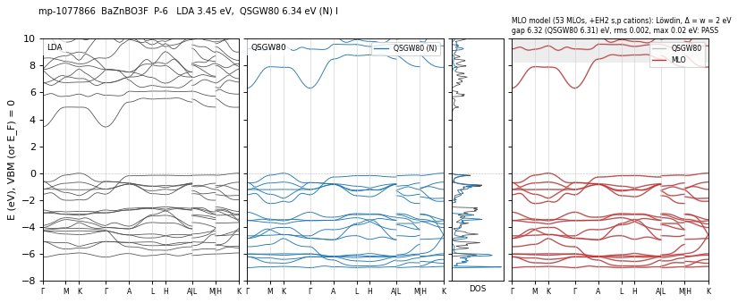

**mp-676250** Bi2Te4Pb — QSGW80 **1.03** N / M ≈ eV D  — ecalj 989a18637 (tf32, t_tetrakbt -300) — MLO PASS (b1) 63 gap 1.04 rms 0.002 max 0.01 (ecalj fb2da026b)

<small>runs: M 1.04 · N 1.03 (10-03)</small>

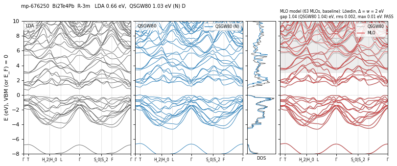

**mp-570572** C3N4 — QSGW80 **3.68** E / N 3.75 / R 3.75 eV I differs — ecalj 0601771b4 (tf32, t_tetrakbt -300) with ES, ES rule es-c — MLO PASS (b1, ES) 31 gap 3.68 rms 0.003 max 0.02 (ecalj f09035a49)

*ES placed by hand from 2026-10-07 03:13 (es_custom): ctrlg_addes.py --rmin 1.8, three ES in the voids between the layers (2.96, 2.54, 2.30 a.u.); without them the MLO misses the state at Gamma at the top of the window*

<small>runs: M 3.92 · R 3.75 (10-01) · N 3.75 (10-06) · E 3.68 (10-07, ES 3, es-c)</small>

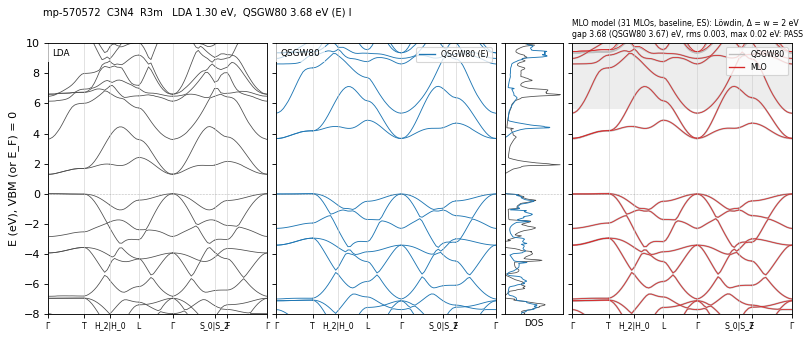

**mp-571653** C3N4 — QSGW80 **4.30** N / M 4.49 eV D differs — ecalj 989a18637 (tf32, t_tetrakbt -300) — MLO PASS (b1) 28 gap 4.30 rms 0.002 max 0.01 (ecalj fb2da026b)

<small>runs: M 4.49 · N 4.30 (10-04)</small>

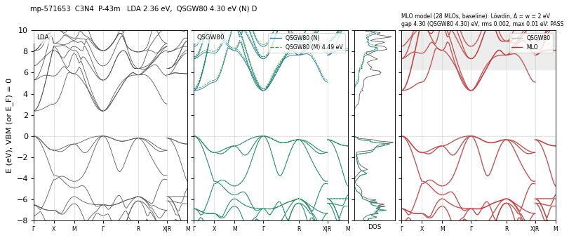

**mp-13650** Ca2GeO4 — QSGW80 **5.32** N / M ≈ eV I  — ecalj 989a18637 (tf32, t_tetrakbt -300) — MLO PASS (b1) 43 gap 5.32 rms 0.000 max 0.00 (ecalj a1d6c0e11)

<small>runs: M 5.32 · N 5.32 (10-04)</small>

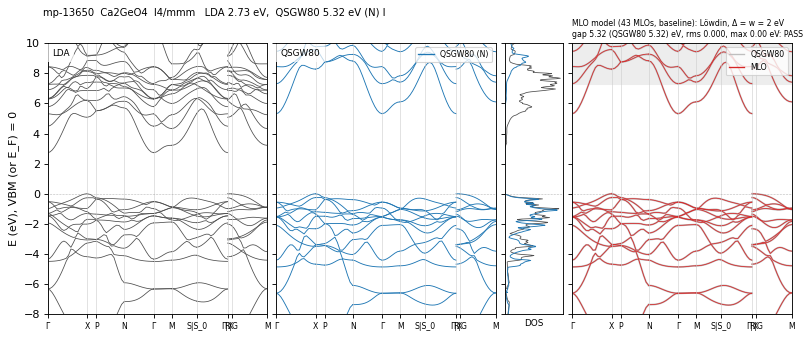

**mp-8682** Ca2SiO4 — QSGW80 **7.19** N / R ≈ eV I  — ecalj 989a18637 (tf32, t_tetrakbt -300) — MLO PASS (b1) 43 gap 7.19 rms 0.001 max 0.01 (ecalj fb2da026b)

<small>runs: M 7.36 · R 7.19 (10-01) · N 7.19 (10-05)</small>

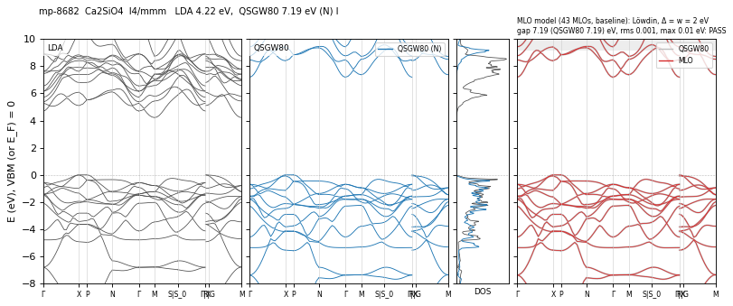

**mp-27294** Ca3AsBr3 — QSGW80 **3.54** N / M ≈ eV D  — ecalj 989a18637 (tf32, t_tetrakbt -300) — MLO PASS (b2) 75 gap 3.54 rms 0.005 max 0.05 (ecalj fb2da026b)

<small>runs: M 3.55 · N 3.54 (10-04)</small>

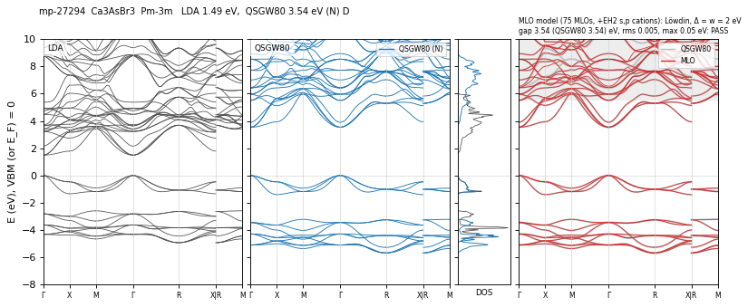

**mp-28069** Ca3AsCl3 — QSGW80 **3.94** N / M ≈ eV D  — ecalj 989a18637 (tf32, t_tetrakbt -300) — MLO PASS (b2) 75 gap 3.94 rms 0.003 max 0.03 (ecalj fb2da026b)

<small>runs: M 3.97 · N 3.94 (10-03)</small>

**mp-30315** Ca3BN3 — QSGW80 **1.40** N / M ≈ eV I  — ecalj 989a18637 (tf32, t_tetrakbt -300) — MLO PASS (b1) 43 gap 1.41 rms 0.009 max 0.06 (ecalj fb2da026b)

<small>runs: M 1.41 · N 1.40 (10-04)</small>

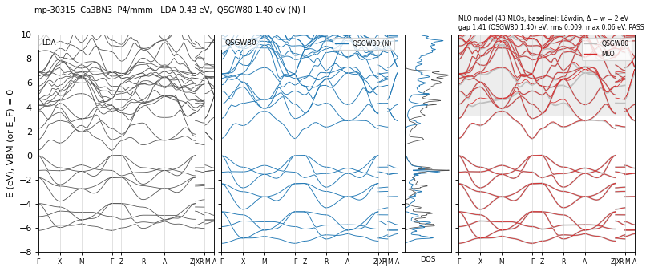

**mp-29342** Ca3PCl3 — QSGW80 **3.93** N / M 4.03 eV D differs — ecalj 989a18637 (tf32, t_tetrakbt -300) — MLO PASS (b2) 75 gap 3.93 rms 0.003 max 0.04 (ecalj fb2da026b)

<small>runs: M 4.03 · N 3.93 (10-03)</small>

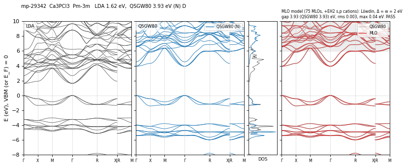

**mp-8789** Ca4As2O — QSGW80 **2.45** N / M 2.50 eV I differs — ecalj 989a18637 (tf32, t_tetrakbt -300) — MLO PASS (b1) 58 gap 2.45 rms 0.009 max 0.08 (ecalj fb2da026b)

<small>runs: M 2.50 · N 2.45 (10-03)</small>

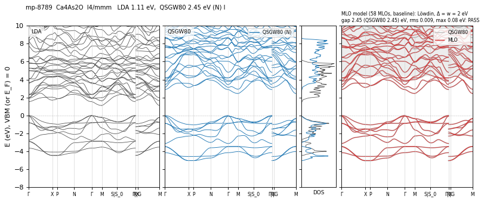

**mp-551873** Ca4Bi2O — QSGW80 **1.95** N / M ≈ eV I  — ecalj 989a18637 (tf32, t_tetrakbt -300) — MLO PASS (b2) 82 gap 1.96 rms 0.003 max 0.03 (ecalj fb2da026b)

<small>runs: M 1.93 · N 1.95 (10-03)</small>

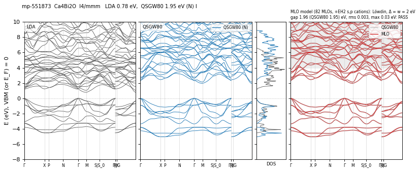

**mp-5380** Ca4P2O — QSGW80 **2.58** N / M 2.50 eV I differs — ecalj 989a18637 (tf32, t_tetrakbt -300) — MLO PASS (b1) 58 gap 2.58 rms 0.009 max 0.08 (ecalj fb2da026b)

<small>runs: M 2.50 · N 2.58 (10-03)</small>

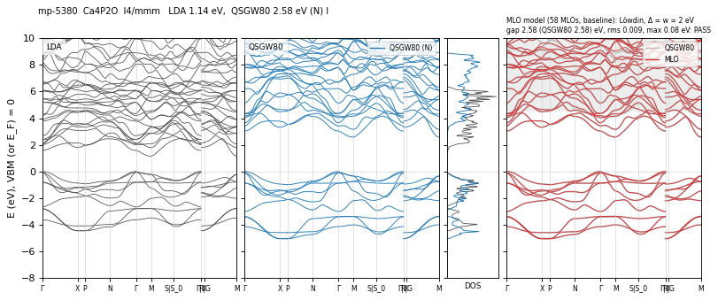

**mp-13660** Ca4Sb2O — QSGW80 **2.06** N / M ≈ eV I  — ecalj 989a18637 (tf32, t_tetrakbt -300) — MLO PASS (b1) 58 gap 2.07 rms 0.010 max 0.09 (ecalj a1d6c0e11)

<small>runs: M 2.01 · N 2.06 (10-04)</small>

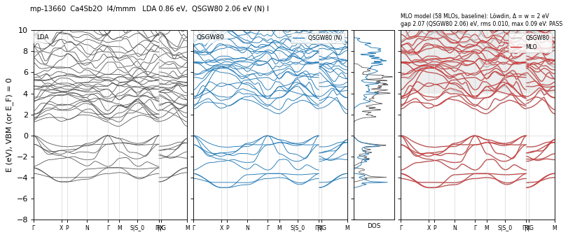

**mp-1025377** CdAg2I4 — QSGW80 **3.43** N / M 3.49 eV D differs — ecalj 989a18637 (tf32, t_tetrakbt -300) — MLO PASS (b2) 67 gap 3.48 rms 0.007 max 0.08 (ecalj a1d6c0e11)

<small>runs: M 3.49 · N 3.43 (10-03)</small>

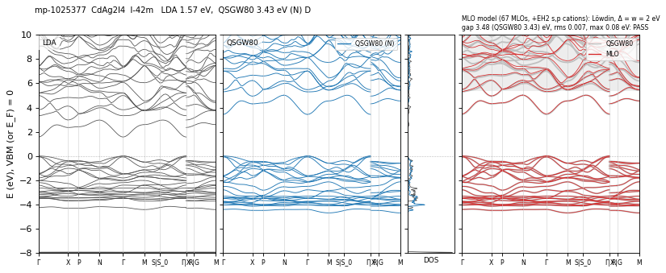

**mp-4452** CdGa2S4 — QSGW80 **3.56** N / M ≈ eV D  — ecalj 989a18637 (tf32, t_tetrakbt -300) — MLO PASS (b1) 73 gap 3.58 rms 0.009 max 0.05 (ecalj fb2da026b)

<small>runs: M 3.57 · N 3.56 (10-04)</small>

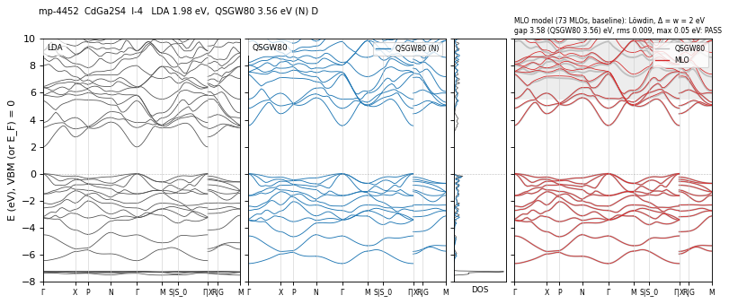

**mp-3772** CdGa2Se4 — QSGW80 **2.59** N / M ≈ eV D  — ecalj 989a18637 (tf32, t_tetrakbt -300) — MLO PASS (b1) 73 gap 2.61 rms 0.010 max 0.05 (ecalj fb2da026b)

<small>runs: M 2.58 · N 2.59 (10-03)</small>

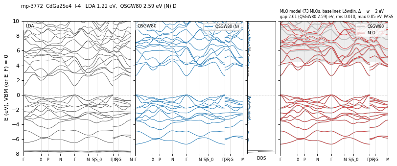

**mp-13949** CdGa2Te4 — QSGW80 **2.00** N / M ≈ eV D  — ecalj 989a18637 (tf32, t_tetrakbt -300) — MLO PASS (b2) 85 gap 2.00 rms 0.002 max 0.02 (ecalj 96ec5c1ee)

<small>runs: M 2.00 · N 2.00 (10-03)</small>

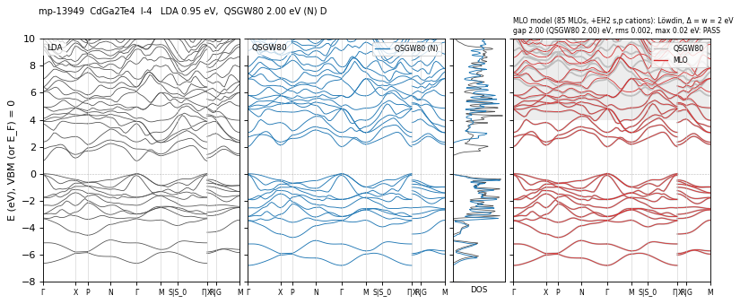

**mp-22304** CdIn2Se4 — QSGW80 **2.03** N / M ≈ eV D  — ecalj 989a18637 (tf32, t_tetrakbt -300) — MLO PASS (b1) 73 gap 2.05 rms 0.006 max 0.04 (ecalj fb2da026b)

<small>runs: M 2.02 · N 2.03 (10-04)</small>

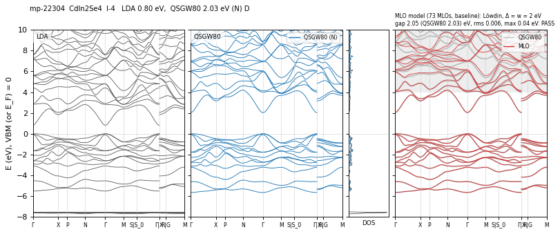

**mp-568032** CdIn2Se4 — QSGW80 **1.96** N / M ≈ eV D  — ecalj 989a18637 (tf32, t_tetrakbt -300) — MLO PASS (b1) 73 gap 1.97 rms 0.004 max 0.03 (ecalj fb2da026b)

<small>runs: M 1.97 · N 1.96 (10-04)</small>

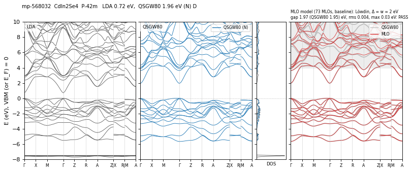

**mp-568661** CdIn2Se4 — QSGW80 **1.82** N / M ≈ eV D  — ecalj 989a18637 (tf32, t_tetrakbt -300) — MLO PASS (b1) 73 gap 1.84 rms 0.004 max 0.03 (ecalj fb2da026b)

<small>runs: M 1.79 · N 1.82 (10-04)</small>

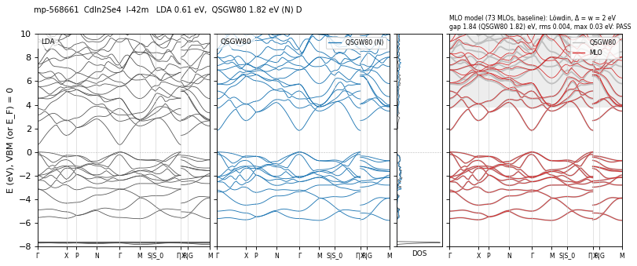

**mp-21374** CdIn2Te4 — QSGW80 **1.70** N / M ≈ eV D  — ecalj 989a18637 (tf32, t_tetrakbt -300) — MLO PASS (b2) 85 gap 1.70 rms 0.002 max 0.01 (ecalj fb2da026b)

<small>runs: M 1.73 · N 1.70 (10-03)</small>

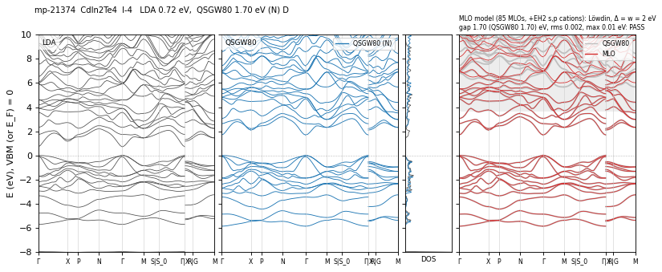

**mp-1077904** CdPb2Cl2O2 — QSGW80 **3.95** N / R ≈ eV I  — ecalj 989a18637 (tf32, t_tetrakbt -300) — MLO PASS (b1) 63 gap 4.01 rms 0.005 max 0.05 (ecalj fb2da026b)

<small>runs: M 4.04 · R 3.95 (10-01) · N 3.95 (10-06)</small>

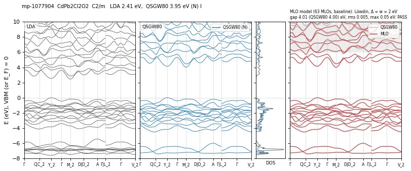

**mp-15157** Cs2CaF4 — QSGW80 **9.99** N / R ≈ eV I  — ecalj 989a18637 (tf32, t_tetrakbt -300) — MLO PASS (b2) 66 gap 9.99 rms 0.009 max 0.09 (ecalj fb2da026b)

<small>runs: M 9.87 · R 9.99 (10-01) · N 9.99 (10-06)</small>

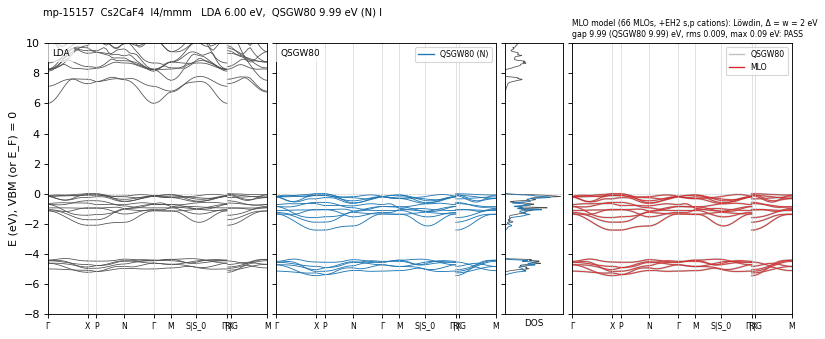

**mp-697133** Cs2CaH4 — QSGW80 **5.64** N / R ≈ eV I  — ecalj 989a18637 (tf32, t_tetrakbt -300) — MLO PASS (b2d) 92 gap 5.64 rms 0.002 max 0.02 (ecalj fb2da026b)

<small>runs: M 5.13 · R 5.64 (10-01) · N 5.64 (10-06)</small>

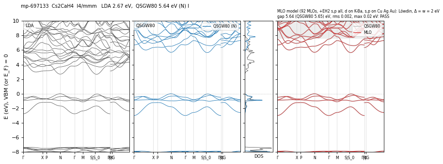

**mp-8963** Cs2HgF4 — QSGW80 **5.11** N / R ≈ eV I  — ecalj 989a18637 (tf32, t_tetrakbt -300) — MLO PASS (b1) 51 gap 5.16 rms 0.005 max 0.05 (ecalj fb2da026b)

<small>runs: M 4.31 · R 5.11 (10-01) · N 5.11 (10-06)</small>

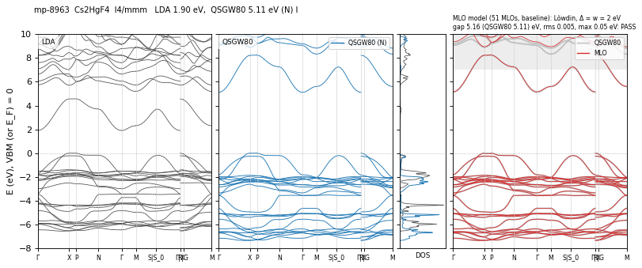

**mp-23752** Cs2MgH4 — QSGW80 **5.30** N / M ≈ eV I  — ecalj 989a18637 (tf32, t_tetrakbt -300) — MLO PASS (b2) 77 gap 5.28 rms 0.010 max 0.07 (ecalj fb2da026b)

<small>runs: M 5.34 · N 5.30 (10-04)</small>

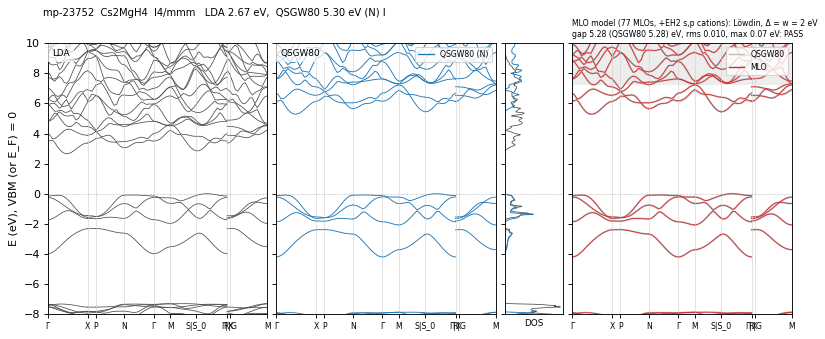

**mp-1078085** Cs2PdCl4 — QSGW80 **4.74** E / M 4.59 / N ≈ eV D differs — ecalj 614ab5eb8 (tf32, t_tetrakbt -300) with ES, ES rule es-a — MLO PASS (b1, ES) 73 gap 4.74 rms 0.002 max 0.01 (ecalj f1c43557a)

<small>runs: M 4.59 · N 4.75 (10-04) · E 4.74 (10-06, ES 1, es-a)</small>

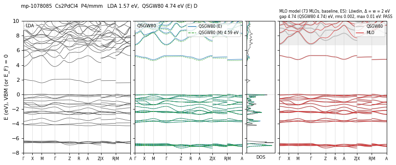

**mp-551629** CsLiMoO4 — QSGW80 **7.00** E / M 6.91 / N 7.10 eV I differs — ecalj 0601771b4 (tf32, t_tetrakbt -300) with ES, ES rule es-c — MLO PASS (b1, ES) 45 gap 7.00 rms 0.001 max 0.00 (ecalj f09035a49)

<small>runs: M 6.91 · N 7.10 (10-03) · E 7.00 (10-07, ES 1, es-c)</small>

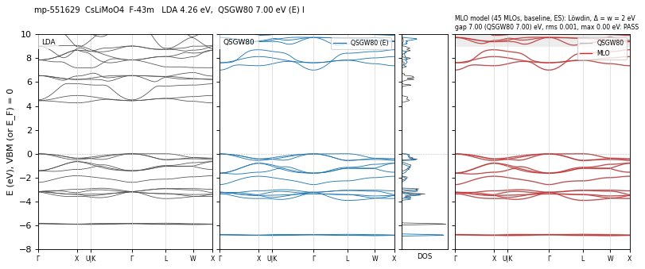

**mp-23353** Cu2HgI4 — QSGW80 **1.88** N / M ≈ eV D  — ecalj 989a18637 (tf32, t_tetrakbt -300) — MLO PASS (b1) 63 gap 1.94 rms 0.004 max 0.06 (ecalj fb2da026b)

<small>runs: M 1.85 · N 1.88 (10-03)</small>

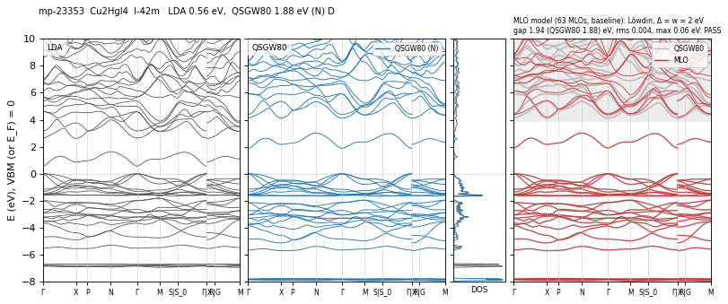

**mp-568598** Cu2HgI4 — QSGW80 **1.53** N / M ≈ eV I  — ecalj 989a18637 (tf32, t_tetrakbt -300) — MLO PASS (b1) 63 gap 1.53 rms 0.002 max 0.03 (ecalj fb2da026b)

<small>runs: M 1.55 · N 1.53 (10-04)</small>

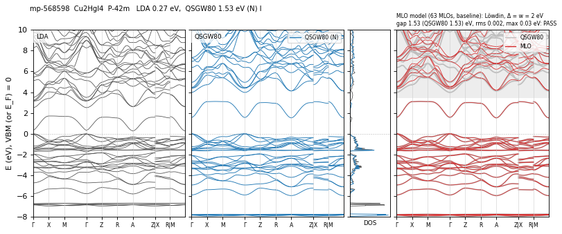

**mp-557373** Cu2WS4 — QSGW80 **2.70** N / M ≈ eV I  — ecalj 989a18637 (tf32, t_tetrakbt -300) — MLO PASS (b2all) 79 gap 2.70 rms 0.001 max 0.00 (ecalj fb2da026b)

<small>runs: M 2.70 · N 2.70 (10-04)</small>

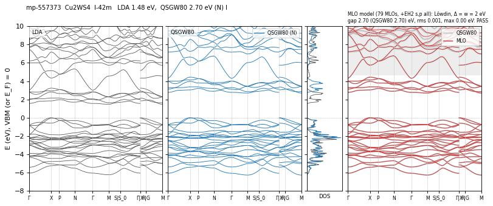

**mp-8976** Cu2WS4 — QSGW80 **2.62** N / M ≈ eV I  — ecalj 989a18637 (tf32, t_tetrakbt -300) — MLO PASS (b2all) 79 gap 2.62 rms 0.001 max 0.01 (ecalj fb2da026b)

<small>runs: M 2.62 · N 2.62 (10-03)</small>

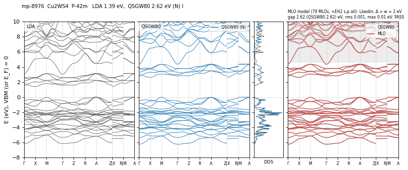

**mp-4809** Ga2HgS4 — QSGW80 **2.79** N / M ≈ eV D  — ecalj 989a18637 (tf32, t_tetrakbt -300) — MLO PASS (b1) 73 gap 2.80 rms 0.002 max 0.02 (ecalj fb2da026b)

<small>runs: M 2.83 · N 2.79 (10-04)</small>

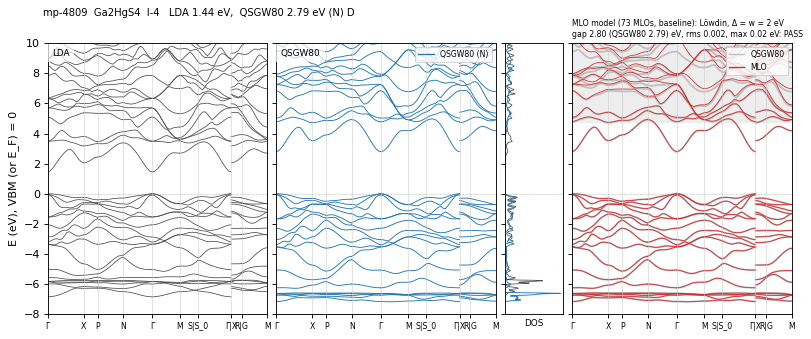

**mp-4730** Ga2HgSe4 — QSGW80 **1.95** N / M ≈ eV D  — ecalj 989a18637 (tf32, t_tetrakbt -300) — MLO PASS (b1) 73 gap 1.96 rms 0.004 max 0.04 (ecalj fb2da026b)

<small>runs: M 1.97 · N 1.95 (10-03)</small>

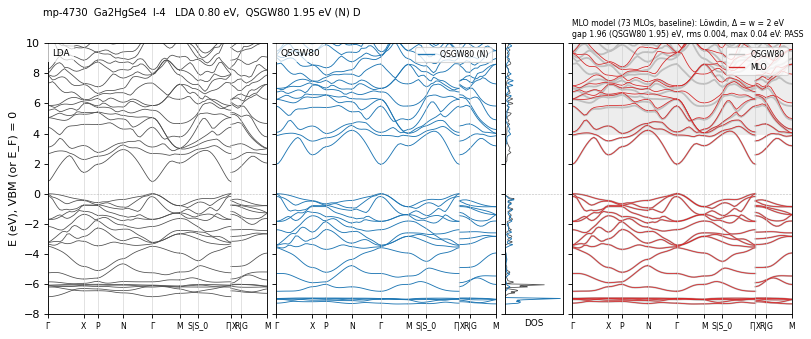

**mp-16337** Ga2HgTe4 — QSGW80 **1.45** N / M ≈ eV D  — ecalj 989a18637 (tf32, t_tetrakbt -300) — MLO PASS (b1) 73 gap 1.47 rms 0.010 max 0.07 (ecalj 0c4d16ceb)

<small>runs: M 1.46 · N 1.45 (10-04)</small>

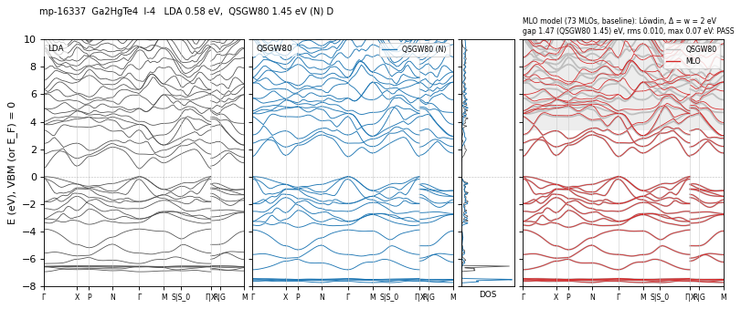

**mp-2371** Ga2Te5 — QSGW80 **1.52** E / M ≈ / N ≈ eV I  — ecalj 614ab5eb8 (tf32, t_tetrakbt -300) with ES, ES rule es-b — MLO PASS (b1, ES) 74 gap 1.53 rms 0.002 max 0.02 (ecalj bb1cb4dcc)

<small>runs: M 1.55 · N 1.55 (10-03) · E 1.52 (10-06, ES 1, es-b)</small>

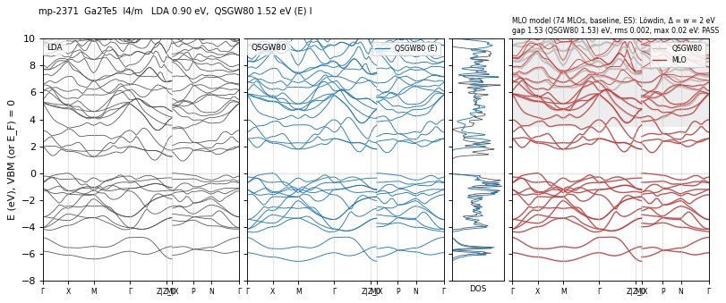

**mp-27948** GeBi2Te4 — QSGW80 **1.06** N / M ≈ eV D  — ecalj 989a18637 (tf32, t_tetrakbt -300) — MLO PASS (b1) 63 gap 1.06 rms 0.003 max 0.03 (ecalj fb2da026b)

<small>runs: M 1.05 · N 1.06 (10-03)</small>

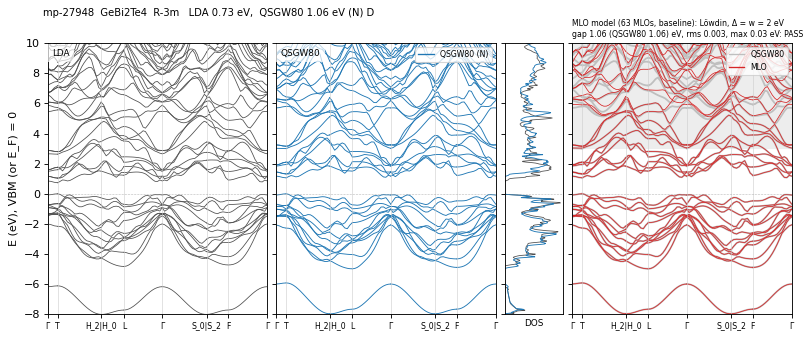

**mp-14790** GeTe4As2 — QSGW80 **0.74** N / M ≈ · path 0.43 eV D path<mesh(mesh) — ecalj 989a18637 (tf32, t_tetrakbt -300) — MLO PASS (b1) 63 gap 0.43 rms 0.001 max 0.01 (ecalj 96ec5c1ee)

<small>runs: M 0.74 · N 0.74 (10-03)</small>

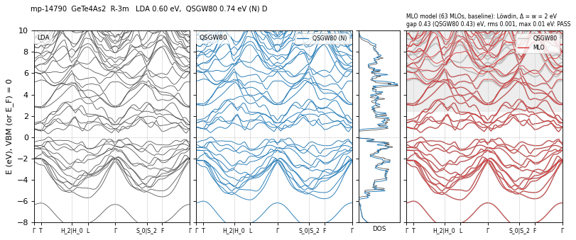

**mp-3167** Hg2GeSe4 — QSGW80 **1.21** N / M ≈ eV D  — ecalj 989a18637 (tf32, t_tetrakbt -300) — MLO PASS (b1) 63 gap 1.22 rms 0.002 max 0.01 (ecalj fb2da026b)

<small>runs: M 1.20 · N 1.21 (10-03)</small>

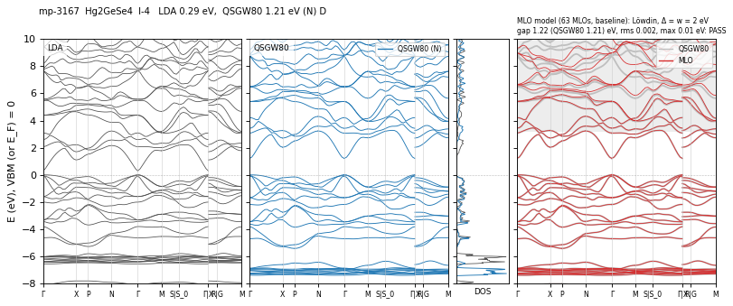

**mp-655275** HgC2S2N2 — QSGW80 **4.09** E / M 4.25 / N 4.25 eV I differs — ecalj 0601771b4 (tf32, t_tetrakbt -300) with ES, ES rule es-c — MLO PASS (b1, ES) 49 gap 4.10 rms 0.001 max 0.01 (ecalj f09035a49)

<small>runs: M 4.25 · N 4.25 (10-04) · E 4.09 (10-07, ES 3, es-c)</small>

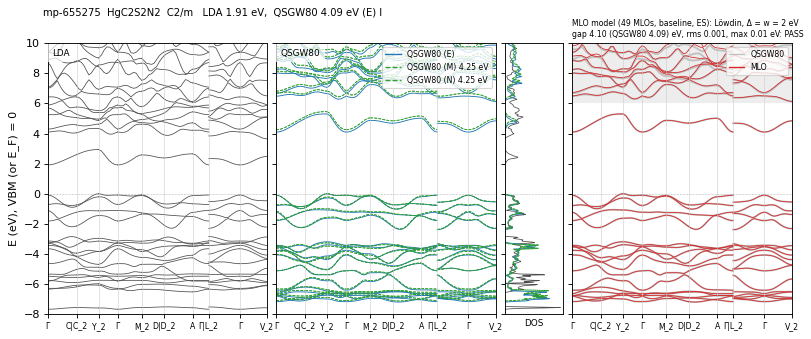

**mp-546862** HgPb2Cl2O2 — QSGW80 **3.64** N / R ≈ eV I  — ecalj 989a18637 (tf32, t_tetrakbt -300) — MLO PASS (b1) 63 gap 3.64 rms 0.001 max 0.01 (ecalj fb2da026b)

<small>runs: M FAILED · R 3.64 (09-30) · N 3.64 (10-06)</small>

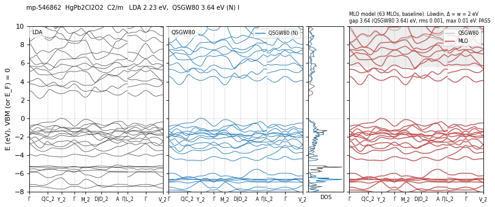

**mp-20731** In2HgSe4 — QSGW80 **1.52** N / M ≈ eV D  — ecalj 989a18637 (tf32, t_tetrakbt -300) — MLO PASS (b1) 73 gap 1.53 rms 0.003 max 0.02 (ecalj fb2da026b)

<small>runs: M 1.56 · N 1.52 (10-03)</small>

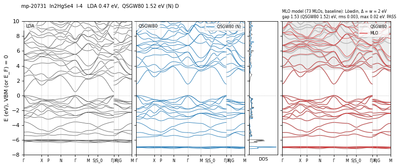

**mp-19765** In2HgTe4 — QSGW80 **1.25** N / M ≈ eV D  — ecalj 989a18637 (tf32, t_tetrakbt -300) — MLO PASS (b1) 73 gap 1.27 rms 0.009 max 0.07 (ecalj fb2da026b)

<small>runs: M 1.28 · N 1.25 (10-04)</small>

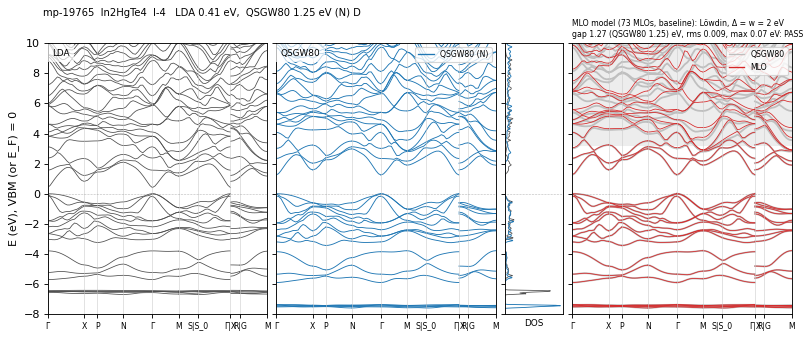

**mp-1077901** InCo3SnS2 — QSGW80 **0.27** N / R ≈ eV I  — ecalj 989a18637 (tf32, t_tetrakbt -300) — MLO PASS (b1) 68 gap 0.27 rms 0.001 max 0.00 (ecalj fb2da026b)

<small>runs: M FAILED · R 0.27 (09-30) · N 0.27 (10-05)</small>

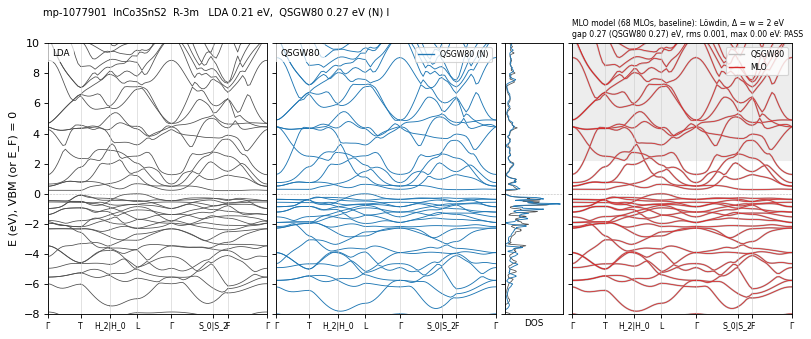

**mp-643257** K2H4Pd — QSGW80 **5.25** E / M 5.47 / N 5.34 eV D CHECK — ecalj 0601771b4 (tf32, t_tetrakbt -300) with ES, ES rule es-c — MLO PASS (b1, ES) 53 gap 5.25 rms 0.004 max 0.03 (ecalj f09035a49)

<small>runs: M 5.47 · N 5.34 (10-04) · E 5.25 (10-07, ES 1, es-c)</small>

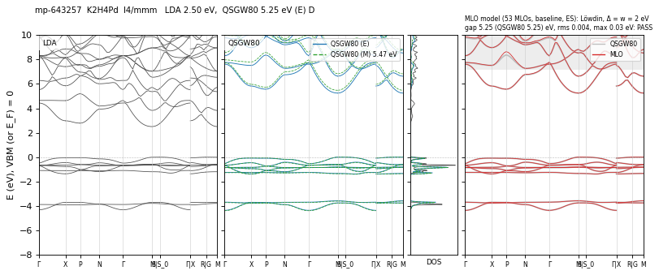

**mp-27207** K2MgCl4 — QSGW80 **7.83** E / M 7.96 / N 7.93 eV I differs — ecalj 0601771b4 (tf32, t_tetrakbt -300) with ES, ES rule es-c — MLO PASS (b2, ES) 83 gap 7.83 rms 0.001 max 0.01 (ecalj 6dc7758fc)

<small>runs: M 7.96 · N 7.93 (10-03) · E 7.83 FAIL(1) (10-06, ES 2, es-b) · E 7.83 (10-06, ES 2, es-c)</small>

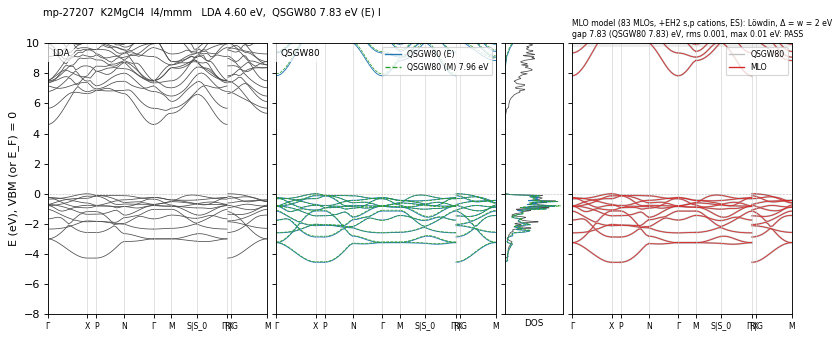

**mp-31212** K2MgF4 — QSGW80 **11.15** N / R ≈ eV I  — ecalj 989a18637 (tf32, t_tetrakbt -300) — MLO PASS (b2) 61 gap 11.15 rms 0.001 max 0.02 (ecalj fb2da026b)

<small>runs: M 9.70 · R 11.15 (10-01) · N 11.15 (10-06)</small>

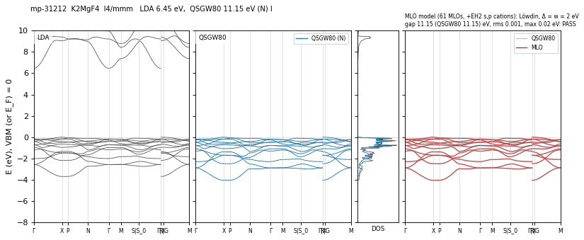

**mp-23956** K2MgH4 — QSGW80 **6.27** N / M 6.20 eV I differs — ecalj 989a18637 (tf32, t_tetrakbt -300) — MLO PASS (b2) 77 gap 6.24 rms 0.005 max 0.04 (ecalj fb2da026b)

<small>runs: M 6.20 · N 6.27 (10-03)</small>

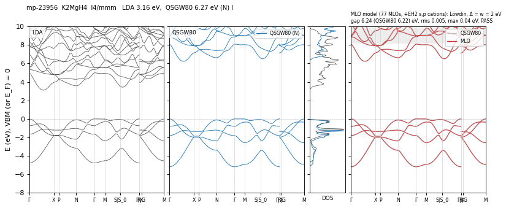

**mp-27138** K2PdBr4 — QSGW80 **3.69** E / M 3.76 / N ≈ eV I differs — ecalj 0601771b4 (tf32, t_tetrakbt -300) with ES, ES rule es-c — MLO PASS (b1, ES) 73 gap 3.69 rms 0.001 max 0.01 (ecalj c9932cbfc)

<small>runs: M 3.76 · N 3.66 (10-04) · E FAIL(1) FAIL(1) (10-06, ES 1, es-b) · E 3.69 (10-06, ES 1, es-c)</small>

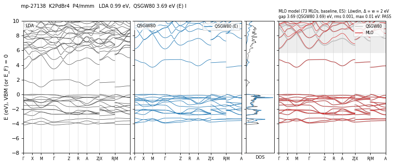

**mp-22956** K2PdCl4 — QSGW80 **4.39** E / M 4.32 / N ≈ eV I differs — ecalj 614ab5eb8 (tf32, t_tetrakbt -300) with ES, ES rule es-a — MLO PASS (b1, ES) 73 gap 4.39 rms 0.001 max 0.00 (ecalj bb1cb4dcc)

<small>runs: M 4.32 · N 4.36 (10-03) · E 4.39 (10-06, ES 1, es-a)</small>

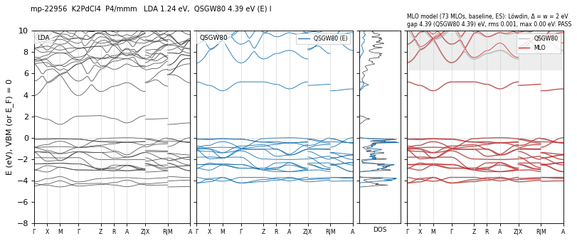

**mp-28163** K2PdF4 — QSGW80 **6.51** N / M 6.60 eV I differs — ecalj 989a18637 (tf32, t_tetrakbt -300) — MLO PASS (b2) 57 gap 6.51 rms 0.001 max 0.01 (ecalj fb2da026b)

<small>runs: M 6.60 · N 6.51 (10-03)</small>

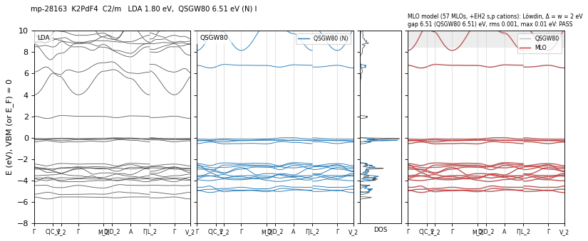

**mp-27243** K2PtBr4 — QSGW80 **3.97** E / M ≈ / N ≈ eV I  — ecalj 0601771b4 (tf32, t_tetrakbt -300) with ES, ES rule es-c — MLO PASS (b1, ES) 73 gap 3.97 rms 0.003 max 0.04 (ecalj f16f0ea3d)

<small>runs: M 3.97 · N 3.95 (10-03) · E TIMEOUT TIMEOUT (10-06, ES 1, es-b) · E 3.97 (10-06, ES 1, es-c)</small>

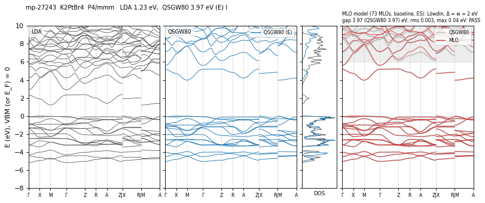

**mp-22934** K2PtCl4 — QSGW80 **4.63** E / N ≈ / R ≈ eV I  — ecalj 614ab5eb8 (tf32, t_tetrakbt -300) with ES, ES rule es-a — MLO PASS (b2, ES) 81 gap 4.63 rms 0.000 max 0.05 (ecalj 225f15ef0)

<small>runs: M 4.82 · R 4.62 (10-01) · N 4.62 (10-06) · E 4.63 (10-06, ES 1, es-a)</small>

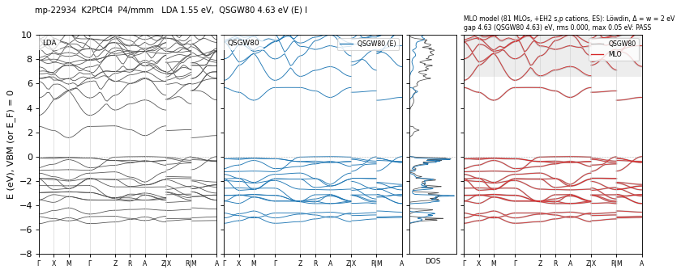

**mp-7502** K2Sn2O3 — QSGW80 **2.45** N / M ≈ eV D  — ecalj 989a18637 (tf32, t_tetrakbt -300) — MLO PASS (b2) 70 gap 2.46 rms 0.001 max 0.01 (ecalj fb2da026b)

<small>runs: M 2.47 · N 2.45 (10-04)</small>

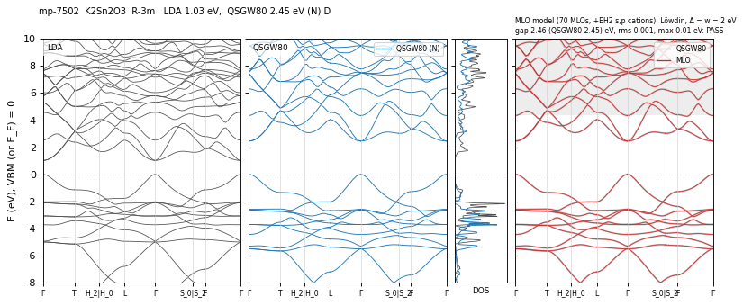

**mp-9583** K2ZnF4 — QSGW80 **8.86** N / R ≈ eV I  — ecalj 989a18637 (tf32, t_tetrakbt -300) — MLO PASS (b2) 61 gap 8.86 rms 0.001 max 0.02 (ecalj fb2da026b)

<small>runs: M FAILED · R 8.86 (09-30) · N 8.86 (10-06)</small>

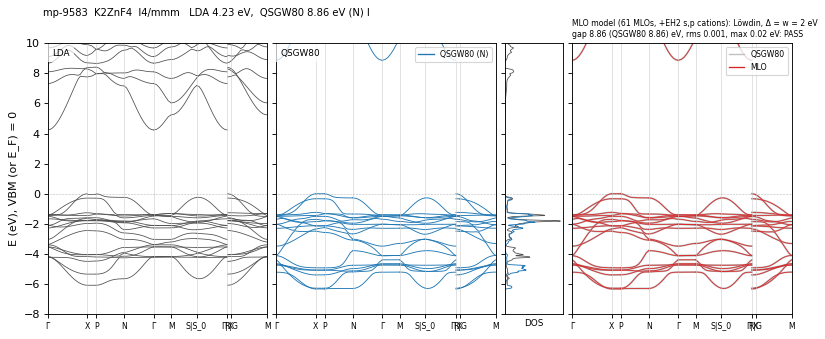

**mp-29584** K4BeAs2 — QSGW80 **2.00** E / M ≈ / N ≈ eV I  — ecalj 0601771b4 (tf32, t_tetrakbt -300) with ES, ES rule es-c — MLO PASS (b2, ES) 94 gap 2.00 rms 0.001 max 0.00 (ecalj f09035a49)

<small>runs: M 2.04 · N 1.99 (10-03) · E 2.00 (10-07, ES 1, es-c)</small>

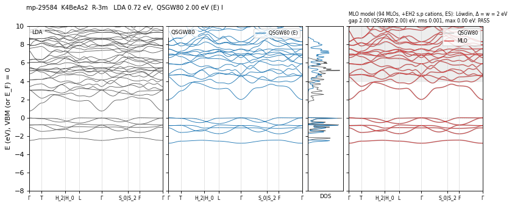

**mp-9872** K4BeP2 — QSGW80 **2.24** E / N ≈ / R ≈ eV I  — ecalj 0601771b4 (tf32, t_tetrakbt -300) with ES, ES rule es-c — MLO PASS (b2, ES) 91 gap 2.24 rms 0.001 max 0.00 (ecalj 27d52b5af)

*ES placed by hand from 2026-10-07 12:01 (es_custom): one ES of 2.2 a.u. (2.9 a.u. of the rule broke the LDA between the large K spheres)*

<small>runs: M 1.65 · R 2.25 (10-01) · N 2.25 (10-06) · E FAIL(1) FAIL(1) (10-07, ES 1, es-c) · E 2.24 (10-07, ES 1, es-c)</small>

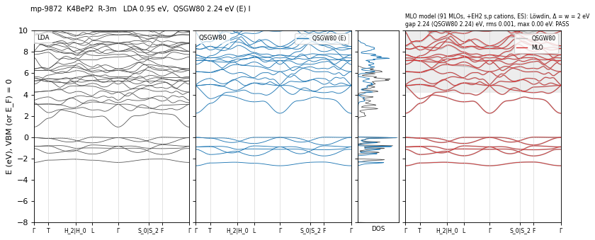

**mp-28627** K4Br2O — QSGW80 **3.40** N / R ≈ eV D  — ecalj 989a18637 (tf32, t_tetrakbt -300) — MLO PASS (b2d) 118 gap 3.40 rms 0.001 max 0.01 (ecalj fb2da026b)

<small>runs: M 3.39 · R 3.40 (10-01) · N 3.40 (10-06)</small>

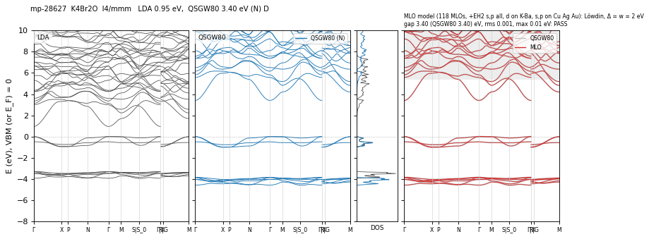

**mp-29585** K4CdAs2 — QSGW80 **1.61** E / M 1.11 / N ≈ / R ≈ eV I CHECK — ecalj 0601771b4 (tf32, t_tetrakbt -300) with ES, ES rule es-c — MLO PASS (b2, ES) 96 gap 1.61 rms 0.002 max 0.01 (ecalj f09035a49)

<small>runs: M 1.11 · R 1.62 (10-01) · N 1.62 (10-03) · E 1.61 (10-07, ES 1, es-c)</small>

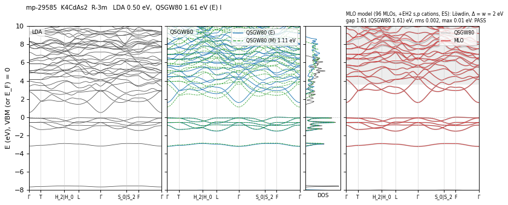

**mp-28302** K4CdP2 — QSGW80 **1.80** E / M 1.70 / N ≈ eV I differs — ecalj 614ab5eb8 (tf32, t_tetrakbt -300) with ES, ES rule es-c — MLO PASS (b2, ES) 96 gap 1.80 rms 0.001 max 0.01 (ecalj c9932cbfc)

<small>runs: M 1.70 · N 1.81 (10-03) · E 1.80 (10-06, ES 1, es-c)</small>

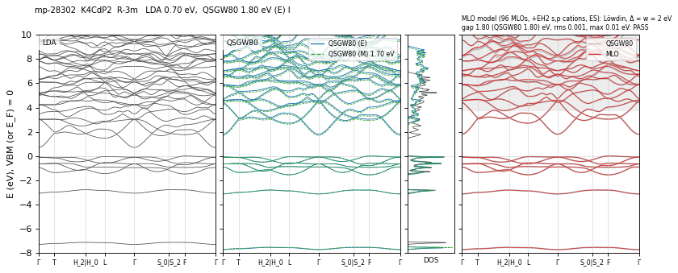

**mp-29484** K4HgAs2 — QSGW80 **1.71** E / M 1.55 / N ≈ eV I differs — ecalj 0601771b4 (tf32, t_tetrakbt -300) with ES, ES rule es-c — MLO PASS (b2, ES) 96 gap 1.71 rms 0.001 max 0.01 (ecalj f16f0ea3d)

<small>runs: M 1.55 · N 1.72 (10-04) · E 1.71 (10-06, ES 1, es-c)</small>

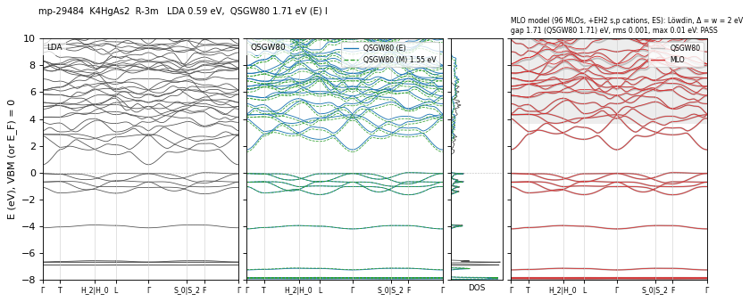

**mp-8753** K4HgP2 — QSGW80 **1.92** E / M 1.64 / N ≈ / R ≈ eV I CHECK — ecalj 0601771b4 (tf32, t_tetrakbt -300) with ES, ES rule es-c — MLO PASS (b2, ES) 96 gap 1.92 rms 0.001 max 0.01 (ecalj f09035a49)

<small>runs: M 1.64 · R 1.93 (10-01) · N 1.93 (10-03) · E 1.92 (10-07, ES 1, es-c)</small>

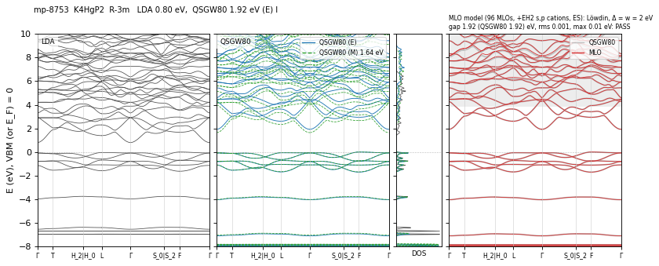

**mp-571461** K4ZnAs2 — QSGW80 **1.78** E / N ≈ / R ≈ eV I  — ecalj 0601771b4 (tf32, t_tetrakbt -300) with ES, ES rule es-c — MLO PASS (b2, ES) 96 gap 1.78 rms 0.001 max 0.01 (ecalj f09035a49)

<small>runs: M FAILED · R 1.78 (09-30) · N 1.78 (10-06) · E 1.78 (10-07, ES 1, es-c)</small>

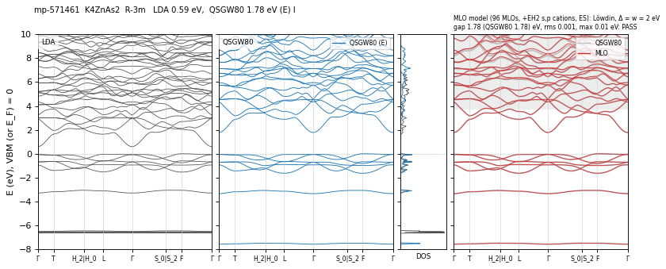

**mp-11719** K4ZnP2 — QSGW80 **2.00** E / M 1.89 / N ≈ eV I differs — ecalj 614ab5eb8 (tf32, t_tetrakbt -300) with ES, ES rule es-a — MLO PASS (b2, ES) 96 gap 2.00 rms 0.001 max 0.01 (ecalj f1c43557a)

<small>runs: M 1.89 · N 2.01 (10-03) · E 2.00 (10-06, ES 1, es-a)</small>

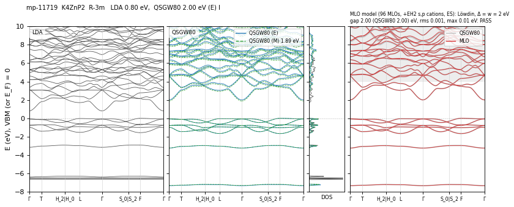

**mp-6867** KCaCO3F — QSGW80 **7.43** E / M ≈ / N 7.51 eV D differs — ecalj 0601771b4 (tf32, t_tetrakbt -300) with ES, ES rule es-c — MLO PASS (b1, ES) 45 gap 7.43 rms 0.001 max 0.01 (ecalj f09035a49)

<small>runs: M 7.40 · N 7.51 (10-03) · E 7.43 (10-07, ES 1, es-c)</small>

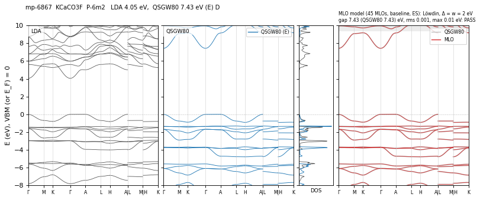

**mp-865427** KSrCO3F — QSGW80 **7.17** E / M 7.09 / N 7.22 eV D differs — ecalj 0601771b4 (tf32, t_tetrakbt -300) with ES, ES rule es-c — MLO PASS (b1, ES) 45 gap 7.17 rms 0.002 max 0.03 (ecalj f09035a49)

<small>runs: M 7.09 · N 7.22 (10-04) · E 7.17 (10-07, ES 1, es-c)</small>

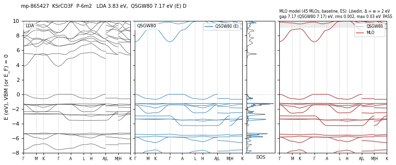

**mp-29009** Li2MgBr4 — QSGW80 **7.05** N / M 7.13 eV D differs — ecalj 989a18637 (tf32, t_tetrakbt -300) — MLO PASS (b2) 65 gap 7.06 rms 0.004 max 0.03 (ecalj fb2da026b)

<small>runs: M 7.13 · N 7.05 (10-04)</small>

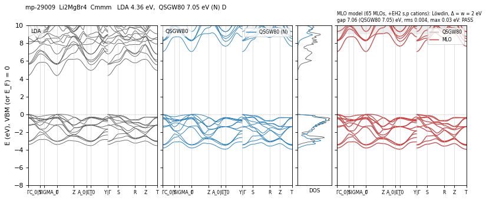

**mp-549308** LiGeBO4 — QSGW80 **5.75** N / R ≈ eV I  — ecalj 989a18637 (tf32, t_tetrakbt -300) — MLO PASS (b1) 33 gap 5.79 rms 0.010 max 0.06 (ecalj fb2da026b)

<small>runs: M 5.66 · R 5.75 (10-01) · N 5.75 (10-05)</small>

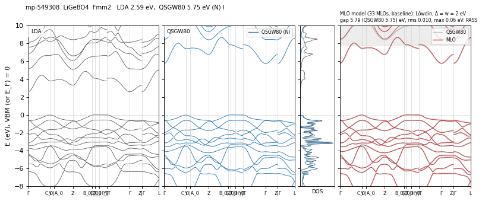

**mp-8873** LiGeBO4 — QSGW80 **7.63** N / R ≈ eV I  — ecalj 989a18637 (tf32, t_tetrakbt -300) — MLO PASS (b2) 45 gap 7.64 rms 0.001 max 0.01 (ecalj fb2da026b)

<small>runs: M 7.87 · R 7.63 (10-01) · N 7.63 (10-06)</small>

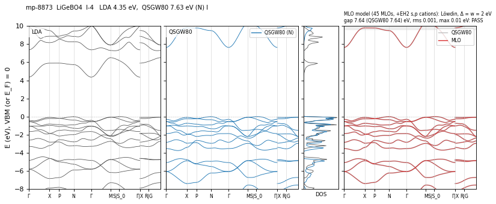

**mp-8874** LiSiBO4 — QSGW80 **9.59** N / M 9.48 eV I differs — ecalj 989a18637 (tf32, t_tetrakbt -300) — MLO PASS (b2) 45 gap 9.59 rms 0.001 max 0.01 (ecalj fb2da026b)

<small>runs: M 9.48 · N 9.59 (10-03)</small>

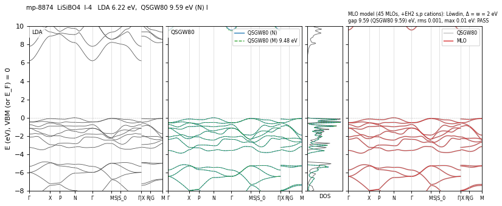

**mp-11175** LiZnPS4 — QSGW80 **4.52** N / M 4.61 eV I differs — ecalj 989a18637 (tf32, t_tetrakbt -300) — MLO PASS (b2) 66 gap 4.54 rms 0.010 max 0.09 (ecalj a1d6c0e11)

<small>runs: M 4.61 · N 4.52 (10-04)</small>

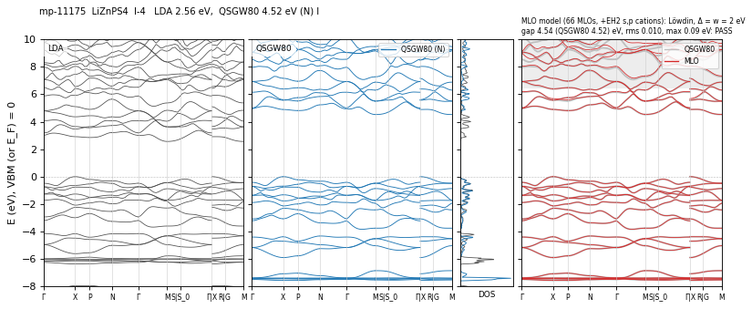

**mp-7983** Mg2SiO4 — QSGW80 **6.35** N / R ≈ eV I  — ecalj 989a18637 (tf32, t_tetrakbt -300) — MLO PASS (b1) 43 gap 6.35 rms 0.000 max 0.00 (ecalj fb2da026b)

<small>runs: M FAILED · R 6.35 (09-30) · N 6.35 (10-06)</small>

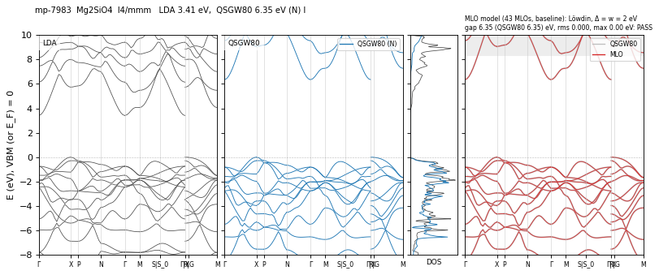

**mp-7604** Mg3NF3 — QSGW80 **7.16** N / M 7.03 eV D differs — ecalj 989a18637 (tf32, t_tetrakbt -300) — MLO PASS (b2) 55 gap 7.17 rms 0.001 max 0.02 (ecalj fb2da026b)

<small>runs: M 7.03 · N 7.16 (10-04)</small>

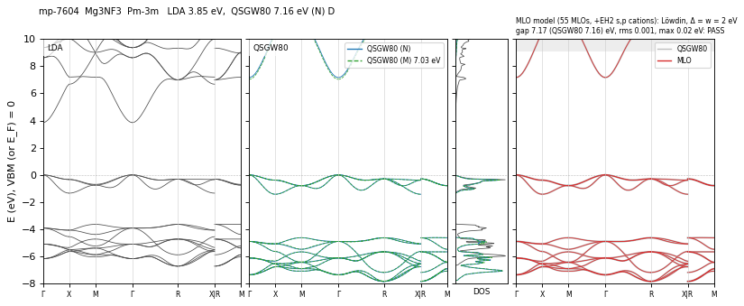

**mp-16755** MgAl2S4 — QSGW80 **3.85** E / M 3.94 / N 3.93 eV D differs — ecalj 614ab5eb8 (tf32, t_tetrakbt -300) with ES, ES rule es-a — MLO PASS (b2, ES) 79 gap 3.85 rms 0.002 max 0.02 (ecalj bb1cb4dcc)

<small>runs: M 3.94 · N 3.93 (10-04) · E 3.85 (10-06, ES 1, es-a)</small>

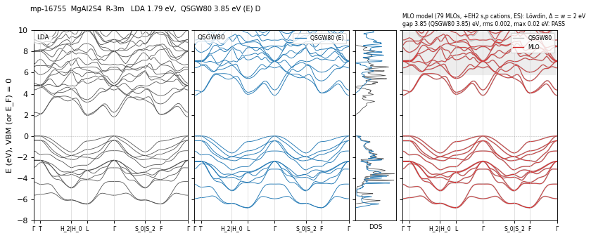

**mp-9479** MgAl2Se4 — QSGW80 **2.70** E / M 2.77 / N 2.76 eV D differs — ecalj 0601771b4 (tf32, t_tetrakbt -300) with ES, ES rule es-c — MLO PASS (b1, ES) 67 gap 2.70 rms 0.010 max 0.07 (ecalj f09035a49)

<small>runs: M 2.77 · N 2.76 (10-04) · E 2.70 (10-07, ES 1, es-c)</small>

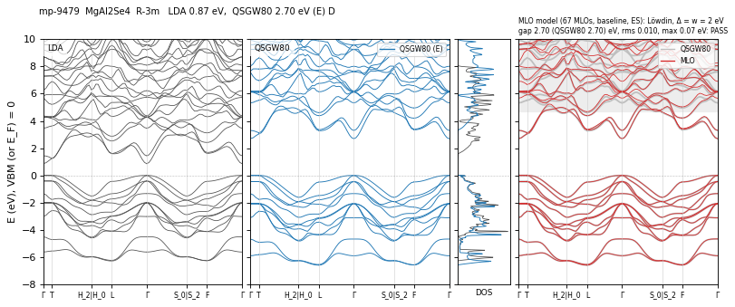

**mp-558836** MoF6 — QSGW80 **7.97** E / M 7.84 / N 8.14 eV I differs — ecalj 0601771b4 (tf32, t_tetrakbt -300) with ES, ES rule es-c — MLO PASS (b1, ES) 37 gap 7.97 rms 0.000 max 0.00 (ecalj f16f0ea3d)

<small>runs: M 7.84 · N 8.14 (10-04) · E 7.97 (10-06, ES 4, es-c)</small>

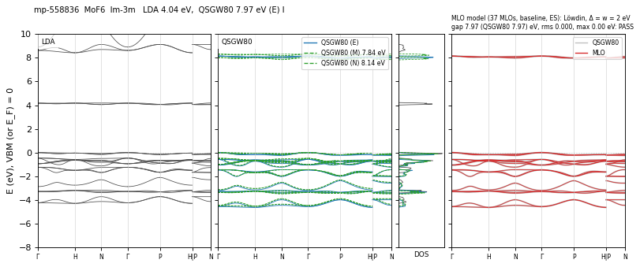

**mp-643260** Na2H4Pd — QSGW80 **4.65** N / M 4.53 eV D differs — ecalj 989a18637 (tf32, t_tetrakbt -300) — MLO PASS (b2) 67 gap 4.65 rms 0.006 max 0.04 (ecalj fb2da026b)

<small>runs: M 4.53 · N 4.65 (10-03)</small>

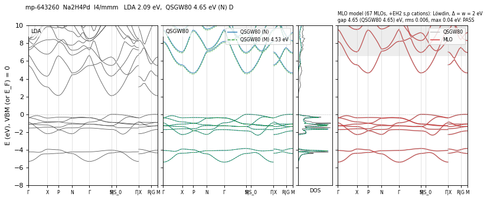

**mp-697096** Na2H4Pt — QSGW80 **4.41** N / M ≈ eV I  — ecalj 989a18637 (tf32, t_tetrakbt -300) — MLO PASS (b2) 67 gap 4.41 rms 0.006 max 0.05 (ecalj fb2da026b)

<small>runs: M 4.43 · N 4.41 (10-03)</small>

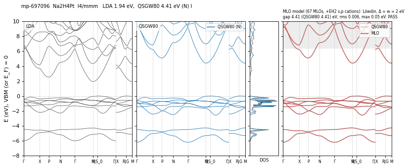

**mp-28599** Na4Br2O — QSGW80 **4.90** N / M 4.71 eV D differs — ecalj 989a18637 (tf32, t_tetrakbt -300) — MLO PASS (b2) 74 gap 4.90 rms 0.001 max 0.01 (ecalj fb2da026b)

<small>runs: M 4.71 · N 4.90 (10-03)</small>

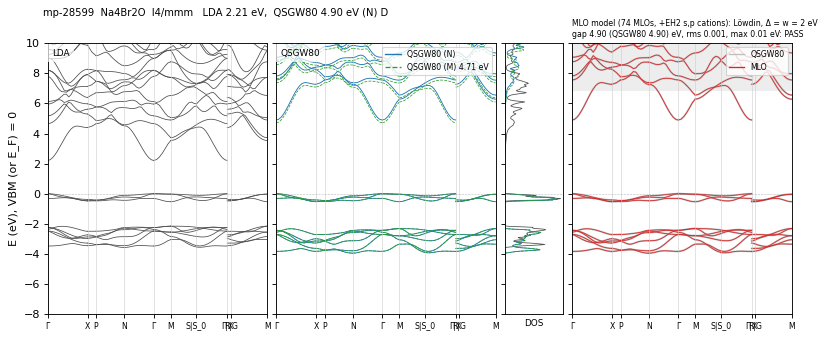

**mp-8752** Na4CdP2 — QSGW80 **1.79** N / M 1.84 eV I differs — ecalj 989a18637 (tf32, t_tetrakbt -300) — MLO PASS (b2) 83 gap 1.79 rms 0.001 max 0.01 (ecalj fb2da026b)

<small>runs: M 1.84 · N 1.79 (10-04)</small>

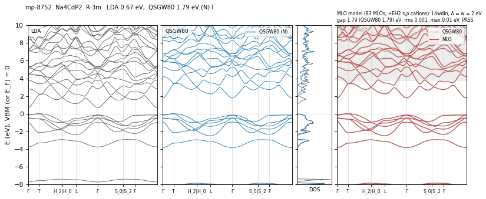

**mp-28591** Na4HgP2 — QSGW80 **1.96** N / R ≈ eV I  — ecalj 989a18637 (tf32, t_tetrakbt -300) — MLO PASS (b2) 83 gap 1.96 rms 0.001 max 0.01 (ecalj fb2da026b)

<small>runs: M 2.10 · R 1.96 (10-01) · N 1.96 (10-06)</small>

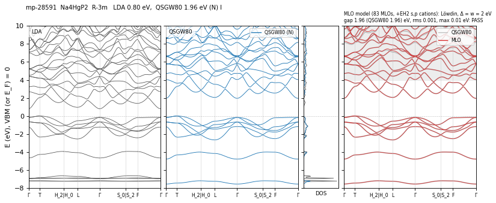

**mp-22937** Na4I2O — QSGW80 **4.76** N / R ≈ eV D  — ecalj 989a18637 (tf32, t_tetrakbt -300) — MLO PASS (b2) 74 gap 4.76 rms 0.005 max 0.05 (ecalj fb2da026b)

<small>runs: M 4.62 · R 4.76 (10-01) · N 4.76 (10-06)</small>

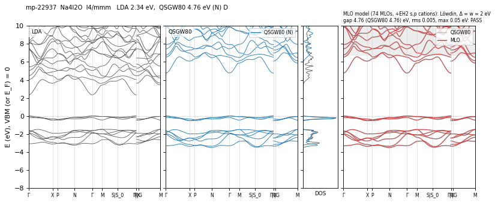

**mp-10426** Nb2O5 — QSGW80 **2.99** N / M 3.09 eV I differs — ecalj 989a18637 (tf32, t_tetrakbt -300) — MLO PASS (b1) 38 gap 2.99 rms 0.003 max 0.07 (ecalj a1d6c0e11)

<small>runs: M 3.09 · N 2.99 (10-03)</small>

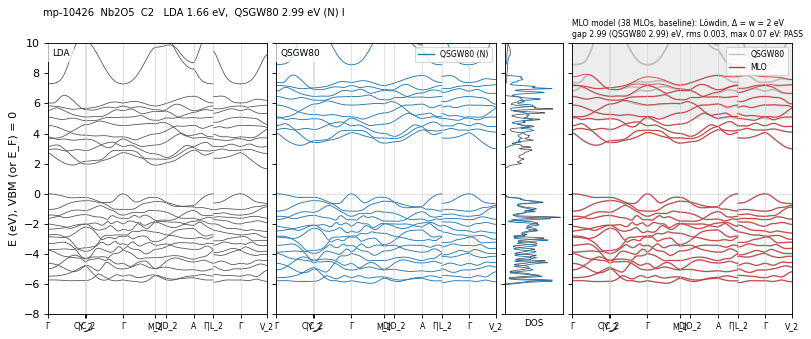

**mp-1595** Nb2O5 — QSGW80 **3.86** E / M ≈ / N ≈ eV I  — ecalj 614ab5eb8 (tf32, t_tetrakbt -300) with ES, ES rule es-a — MLO PASS (b1, ES) 42 gap 3.86 rms 0.001 max 0.01 (ecalj f1c43557a)

<small>runs: M 3.88 · N 3.83 (10-04) · E 3.86 (10-06, ES 1, es-a)</small>

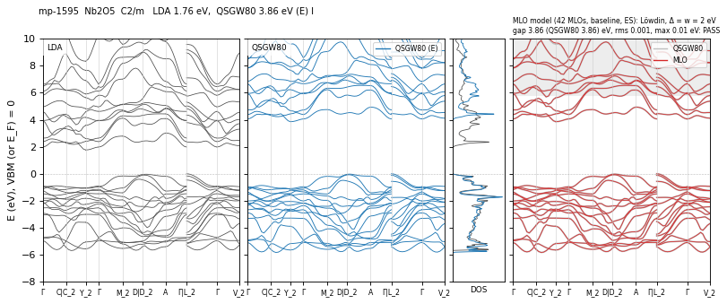

**mp-551826** NbTlBr4O — QSGW80 **2.67** N / R ≈ eV I  — ecalj 989a18637 (tf32, t_tetrakbt -300) — MLO PASS (b1) 63 gap 2.67 rms 0.001 max 0.03 (ecalj fb2da026b)

<small>runs: M FAILED · R 2.67 (09-30) · N 2.67 (10-06)</small>

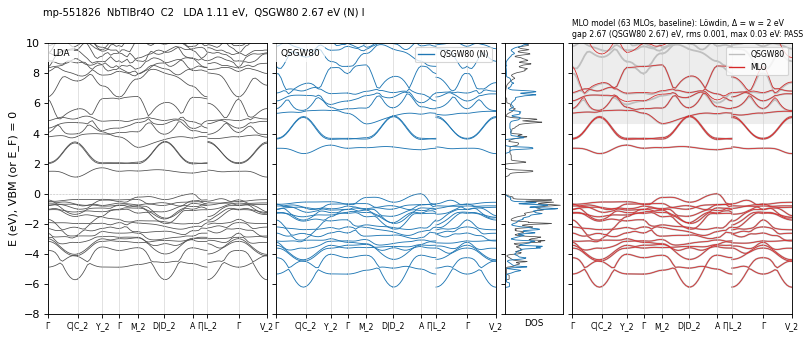

**mp-24517** Rb2CaH4 — QSGW80 **6.23** N / M ≈ eV D  — ecalj 989a18637 (tf32, t_tetrakbt -300) — MLO PASS (b2) 77 gap 6.22 rms 0.004 max 0.05 (ecalj fb2da026b)

<small>runs: M 6.23 · N 6.23 (10-03)</small>

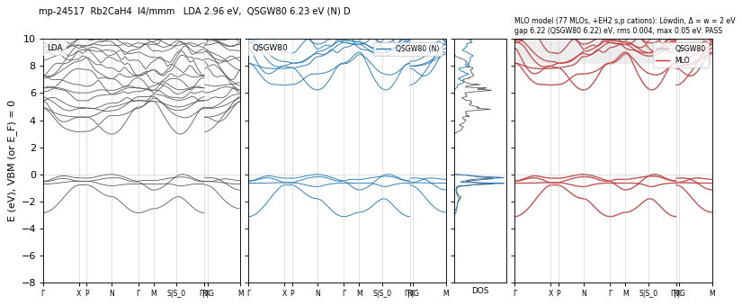

**mp-29873** Rb2CdCl4 — QSGW80 **5.87** E / M 5.69 / N ≈ eV I differs — ecalj 0601771b4 (tf32, t_tetrakbt -300) with ES, ES rule es-c — MLO PASS (b1, ES) 71 gap 5.87 rms 0.001 max 0.01 (ecalj f09035a49)

<small>runs: M 5.69 · N 5.88 (10-03) · E 5.87 (10-07, ES 2, es-c)</small>

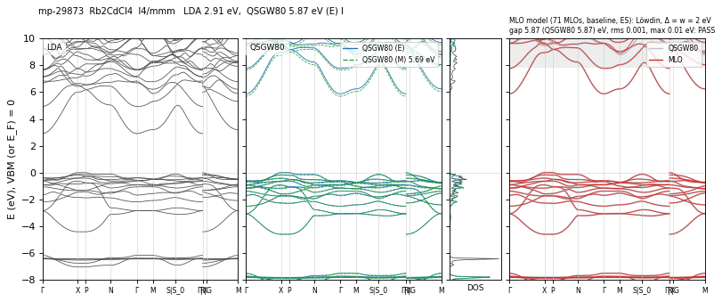

**mp-8962** Rb2HgF4 — QSGW80 **5.09** N / R ≈ eV I  — ecalj 989a18637 (tf32, t_tetrakbt -300) — MLO PASS (b1) 49 gap 5.10 rms 0.002 max 0.01 (ecalj fb2da026b)

<small>runs: M 4.41 · R 5.09 (10-01) · N 5.09 (10-06)</small>

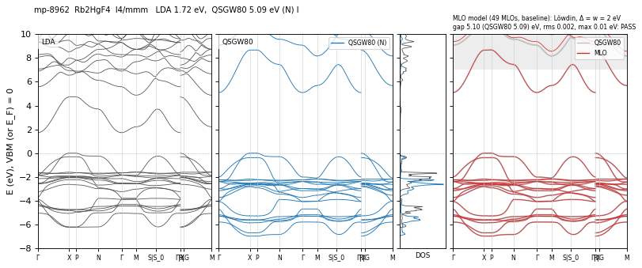

**mp-8861** Rb2MgF4 — QSGW80 **10.69** N / M 10.58 eV I differs — ecalj 989a18637 (tf32, t_tetrakbt -300) — MLO PASS (b1) 49 gap 10.70 rms 0.005 max 0.10 (ecalj fb2da026b)

<small>runs: M 10.58 · N 10.69 (10-03)</small>

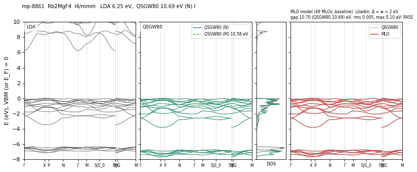

**mp-7863** Rb2Sn2O3 — QSGW80 **2.41** N / R ≈ eV D  — ecalj 989a18637 (tf32, t_tetrakbt -300) — MLO PASS (b2) 70 gap 2.41 rms 0.001 max 0.00 (ecalj fb2da026b)

<small>runs: M 2.46 · R 2.41 (10-01) · N 2.41 (10-06)</small>

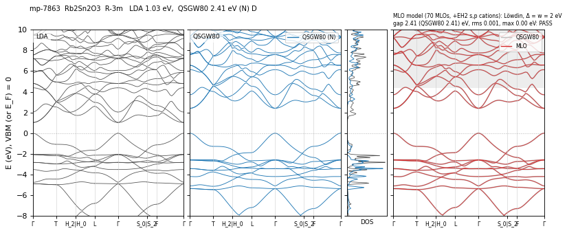

**mp-31002** Rb2Te5 — QSGW80 **0.98** N / M ≈ eV I  — ecalj 989a18637 (tf32, t_tetrakbt -300) — MLO PASS (b1) 69 gap 0.98 rms 0.008 max 0.06 (ecalj fb2da026b)

<small>runs: M 1.00 · N 0.98 (10-03)</small>

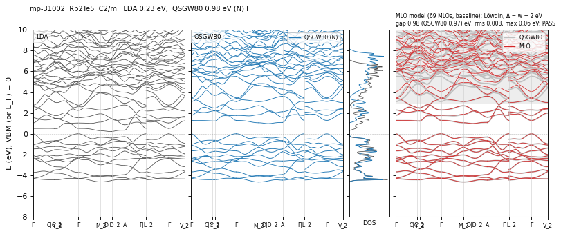

**mp-1077942** Rb2TeSe4 — QSGW80 **2.02** N / M ≈ eV I  — ecalj 989a18637 (tf32, t_tetrakbt -300) — MLO PASS (b1) 69 gap 2.02 rms 0.007 max 0.05 (ecalj a1d6c0e11)

<small>runs: M 2.04 · N 2.02 (10-03)</small>

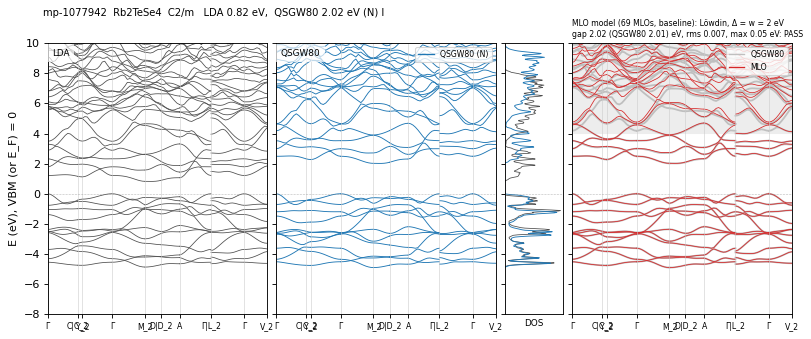

**mp-30004** Rb4Br2O — QSGW80 **2.78** E / N ≈ / R ≈ eV D  — ecalj 0601771b4 (tf32, t_tetrakbt -300) with ES, ES rule es-c — MLO PASS (b1, ES) 72 gap 2.78 rms 0.006 max 0.10 (ecalj f09035a49)

<small>runs: M 6.36 · R 2.82 (10-01) · N 2.82 (10-06) · E 2.78 (10-07, ES 2, es-c)</small>

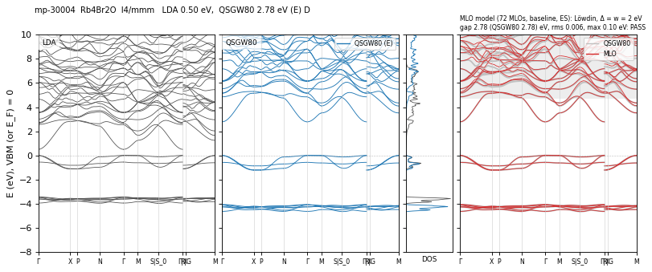

**mp-863745** RbSrCO3F — QSGW80 **7.15** E / M 5.33 / N 7.26 eV D CHECK — ecalj 0601771b4 (tf32, t_tetrakbt -300) with ES, ES rule es-c — MLO PASS (b1, ES) 45 gap 7.15 rms 0.001 max 0.01 (ecalj f09035a49)

*May value 5.33 eV wrong (N 7.26, 2025 8.01)*

<small>runs: M 5.33 · N 7.26 (10-02) · E 7.15 (10-07, ES 1, es-c)</small>

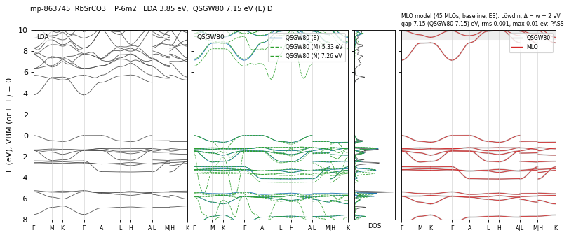

**mp-8560** SF6 — QSGW80 **11.89** E / M 12.55 / N 12.14 eV D CHECK — ecalj 0601771b4 (tf32, t_tetrakbt -300) with ES, ES rule es-c — MLO PASS (b1, ES) 37 gap 11.89 rms 0.000 max 0.00 (ecalj f16f0ea3d)

<small>runs: M 12.55 · N 12.14 (10-03) · E 11.89 (10-06, ES 4, es-c)</small>

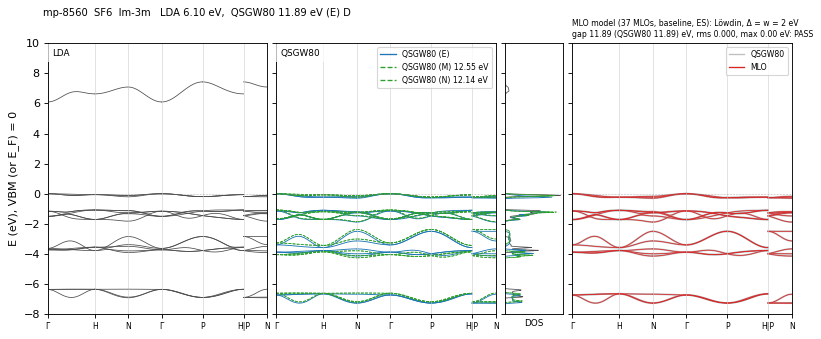

**mp-31507** Sb2Te4Pb — QSGW80 **0.68** N / M ≈ eV D  — ecalj 989a18637 (tf32, t_tetrakbt -300) — MLO PASS (b1) 63 gap 0.68 rms 0.002 max 0.01 (ecalj fb2da026b)

<small>runs: M 0.68 · N 0.68 (10-03)</small>

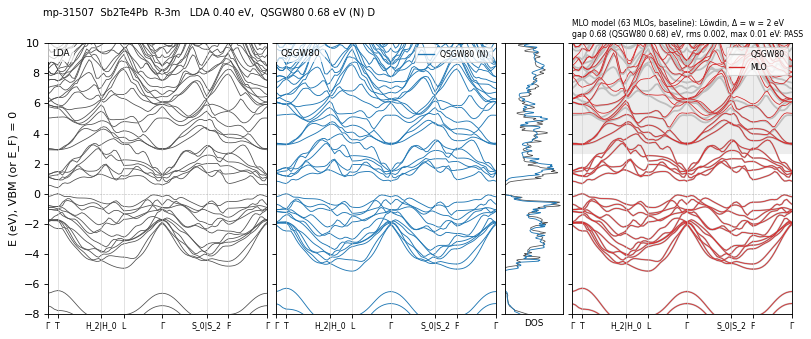

**mp-7700** SiB6 — QSGW80 **0.27** N / R ≈ eV I  — ecalj 989a18637 (tf32, t_tetrakbt -300) — MLO PASS (b1) 33 gap 0.26 rms 0.001 max 0.01 (ecalj fb2da026b)

<small>runs: M FAILED · R 0.27 (09-30) · N 0.27 (10-05)</small>

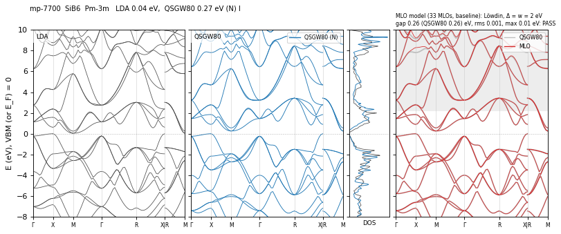

**mp-10955** SnHg2Se4 — QSGW80 **1.01** N / M ≈ eV D  — ecalj 989a18637 (tf32, t_tetrakbt -300) — MLO PASS (b1) 63 gap 1.01 rms 0.001 max 0.01 (ecalj a1d6c0e11)

<small>runs: M 1.00 · N 1.01 (10-04)</small>

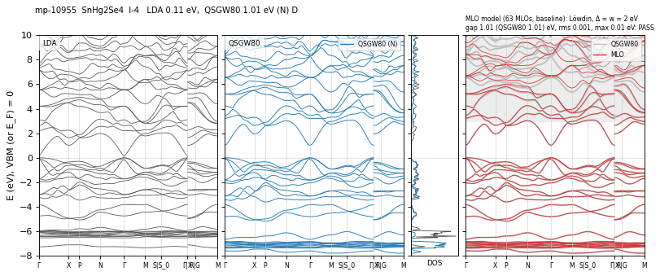

**mp-27947** SnSb2Te4 — QSGW80 **0.51** N / M ≈ eV D  — ecalj 989a18637 (tf32, t_tetrakbt -300) — MLO PASS (b1) 63 gap 0.51 rms 0.002 max 0.01 (ecalj fb2da026b)

<small>runs: M 0.52 · N 0.51 (10-04)</small>

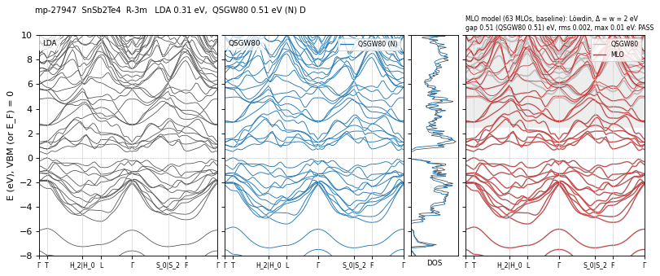

**mp-567655** Sr2CN2Cl2 — QSGW80 **6.25** N / M ≈ eV I  — ecalj 989a18637 (tf32, t_tetrakbt -300) — MLO PASS (b2) 66 gap 6.25 rms 0.003 max 0.04 (ecalj fb2da026b)

<small>runs: M 6.29 · N 6.25 (10-03)</small>

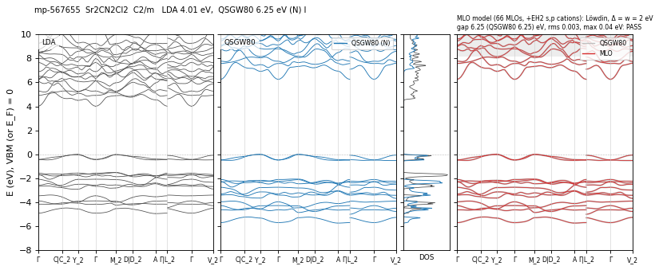

**mp-3376** Sr2SnO4 — QSGW80 **5.04** N / R ≈ eV I  — ecalj 989a18637 (tf32, t_tetrakbt -300) — MLO PASS (b1) 49 gap 5.04 rms 0.001 max 0.00 (ecalj fb2da026b)

<small>runs: M 5.22 · R 5.04 (10-01) · N 5.04 (10-06)</small>

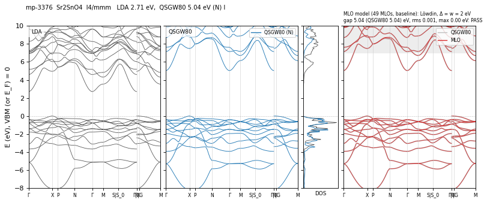

**mp-5532** Sr2TiO4 — QSGW80 **4.06** N / R ≈ eV I vs2025 — ecalj 989a18637 (tf32, t_tetrakbt -300) — MLO PASS (b1) 49 gap 4.07 rms 0.001 max 0.01 (ecalj fb2da026b)

<small>runs: M 4.26 · R 4.06 (10-01) · N 4.06 (10-05)</small>

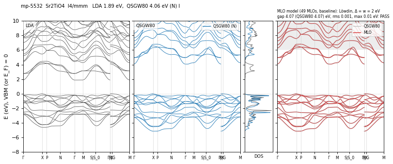

**mp-8299** Sr4As2O — QSGW80 **2.17** N / M 2.25 eV I differs — ecalj 989a18637 (tf32, t_tetrakbt -300) — MLO PASS (b2) 86 gap 2.17 rms 0.001 max 0.01 (ecalj fb2da026b)

<small>runs: M 2.25 · N 2.17 (10-03)</small>

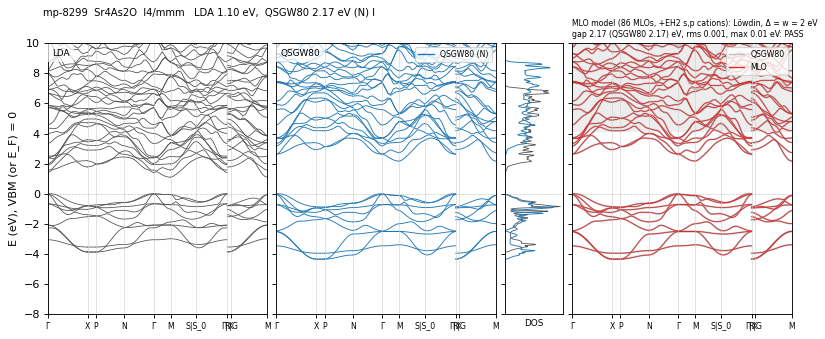

**mp-8298** Sr4P2O — QSGW80 **2.25** N / M 2.32 eV I differs — ecalj 989a18637 (tf32, t_tetrakbt -300) — MLO PASS (b2) 86 gap 2.26 rms 0.001 max 0.01 (ecalj fb2da026b)

<small>runs: M 2.32 · N 2.25 (10-03)</small>

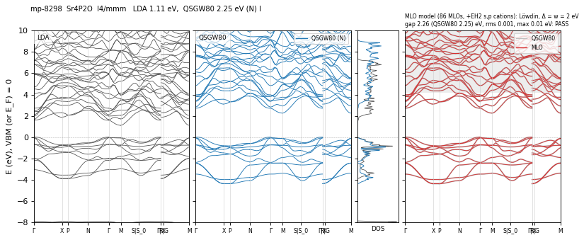

**mp-570097** SrLi4P2 — QSGW80 **1.88** N / R ≈ eV I  — ecalj 989a18637 (tf32, t_tetrakbt -300) — MLO PASS (b1) 43 gap 1.88 rms 0.001 max 0.01 (ecalj fb2da026b)

<small>runs: M 2.27 · R 1.88 (10-01) · N 1.88 (10-05)</small>

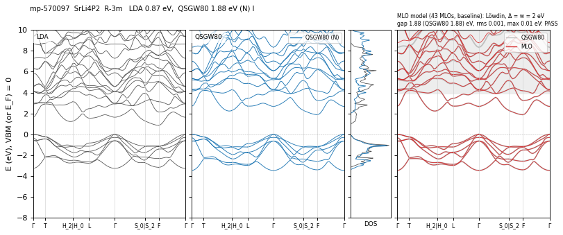

**mp-554867** Ta2O5 — QSGW80 **1.76** N / M 1.85 eV I differs — ecalj 989a18637 (tf32, t_tetrakbt -300) — MLO PASS (b1) 38 gap 1.76 rms 0.003 max 0.04 (ecalj fb2da026b)

<small>runs: M 1.85 · N 1.76 (10-04)</small>

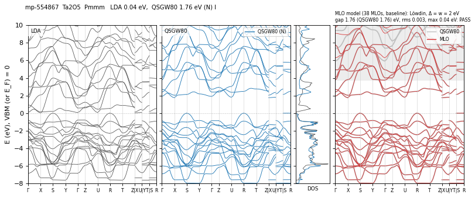

**mp-624688** Ta2O5 — QSGW80 **4.03** N / M 4.47 eV I CHECK — ecalj 989a18637 (tf32, t_tetrakbt -300) — MLO PASS (b2all) 58 gap 4.03 rms 0.001 max 0.01 (ecalj fb2da026b)

<small>runs: M 4.47 · N 4.03 (10-03)</small>

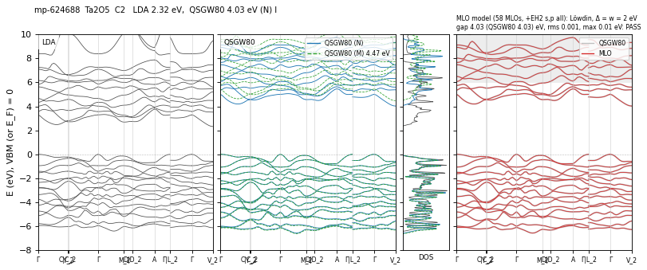

**mp-1025299** Tl2CdTe4 — QSGW80 **0.52** N / M ≈ eV D  — ecalj 989a18637 (tf32, t_tetrakbt -300) — MLO PASS (b1) 73 gap 0.53 rms 0.002 max 0.01 (ecalj a1d6c0e11)

<small>runs: M 0.53 · N 0.52 (10-04)</small>

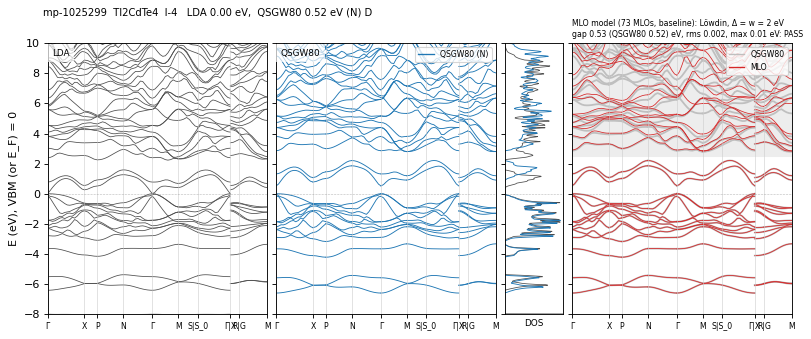

**mp-29889** Tl2PdCl4 — QSGW80 **2.94** E / M ≈ / N ≈ eV I  — ecalj 0601771b4 (tf32, t_tetrakbt -300) with ES, ES rule es-c — MLO PASS (b1, ES) 77 gap 2.94 rms 0.000 max 0.00 (ecalj f09035a49)

<small>runs: M 2.98 · N 2.93 (10-04) · E 2.94 (10-07, ES 1, es-c)</small>

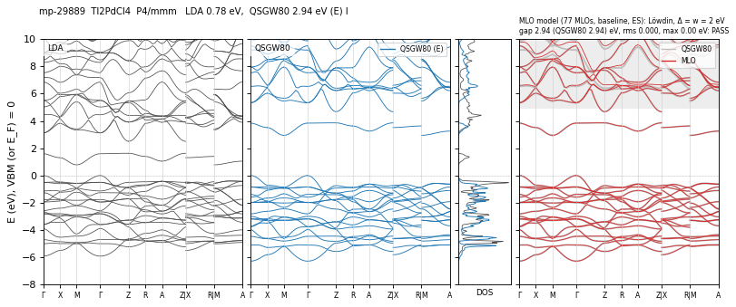

**mp-9791** Tl3AsS3 — QSGW80 **1.79** N / M ≈ eV I  — ecalj 989a18637 (tf32, t_tetrakbt -300) — MLO PASS (b1) 78 gap 1.79 rms 0.000 max 0.00 (ecalj fb2da026b)

<small>runs: M 1.79 · N 1.79 (10-03)</small>

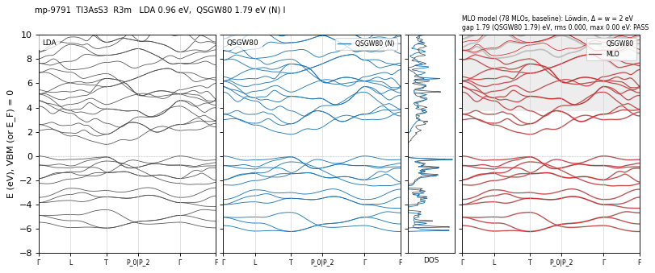

**mp-7684** Tl3AsSe3 — QSGW80 **1.30** N / M ≈ eV D  — ecalj 989a18637 (tf32, t_tetrakbt -300) — MLO PASS (b1) 78 gap 1.30 rms 0.001 max 0.01 (ecalj fb2da026b)

<small>runs: M 1.32 · N 1.30 (10-04)</small>

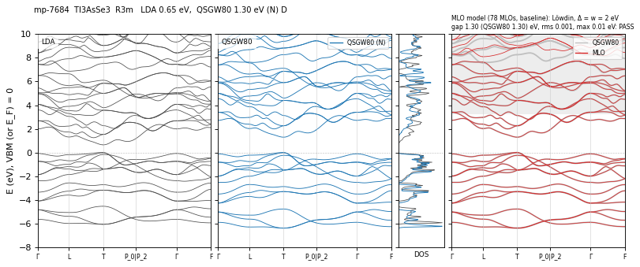

**mp-8393** Tl3SbS3 — QSGW80 **2.14** N / M ≈ eV D  — ecalj 989a18637 (tf32, t_tetrakbt -300) — MLO PASS (b1) 78 gap 2.22 rms 0.001 max 0.01 (ecalj fb2da026b)

<small>runs: M 2.13 · N 2.14 (10-03)</small>

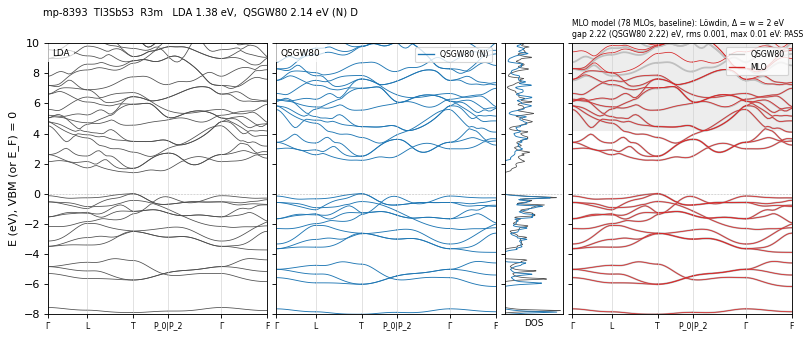

**mp-720166** V2O5 — QSGW80 **2.35** N / M 2.42 eV I differs — ecalj 989a18637 (tf32, t_tetrakbt -300) — MLO PASS (b1) 38 gap 2.29 rms 0.001 max 0.01 (ecalj fb2da026b)

<small>runs: M 2.42 · N 2.35 (10-04)</small>

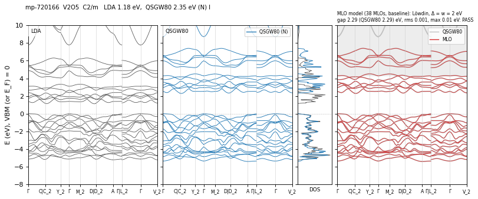

**mp-28483** WBr6 — QSGW80 **2.09** E / M 2.15 / N ≈ eV D differs — ecalj 614ab5eb8 (tf32, t_tetrakbt -300) with ES, ES rule es-c — MLO PASS (b1, ES) 72 gap 2.09 rms 0.000 max 0.00 (ecalj d90296348)

<small>runs: M 2.15 · N 2.06 (10-03) · E 2.09 (10-06, ES 9, es-c)</small>

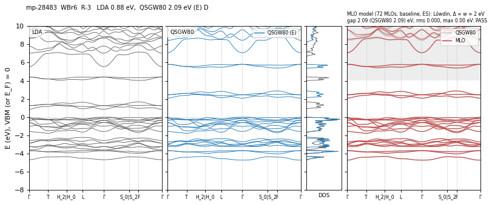

**mp-571518** WCl6 — QSGW80 **3.46** E / N ≈ / R ≈ eV I  — ecalj 0601771b4 (tf32, t_tetrakbt -300) with ES, ES rule es-c — MLO PASS (b1, ES) 66 gap 3.46 rms 0.000 max 0.00 (ecalj f09035a49)

<small>runs: M 3.96 · R 3.50 (10-01) · N 3.51 (10-06) · E 3.46 (10-07, ES 3, es-c)</small>

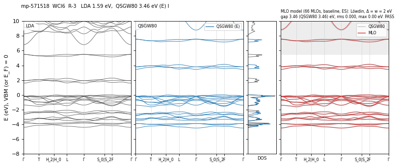

**mp-546864** Y2CN2O2 — QSGW80 **5.35** E / M 5.73 / N 5.57 eV D CHECK — ecalj 0601771b4 (tf32, t_tetrakbt -300) with ES, ES rule es-c — MLO PASS (b2all, ES) 60 gap 5.35 rms 0.001 max 0.01 (ecalj f09035a49)

<small>runs: M 5.73 · N 5.57 (10-03) · E 5.35 (10-07, ES 2, es-c)</small>

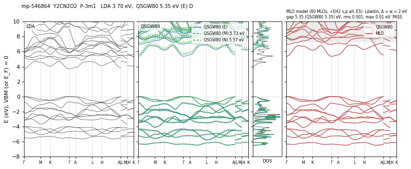

**mp-1078049** ZnGa2S4 — QSGW80 **3.47** N / M ≈ eV D  — ecalj 989a18637 (tf32, t_tetrakbt -300) — MLO PASS (b1) 73 gap 3.49 rms 0.004 max 0.04 (ecalj a1d6c0e11)

<small>runs: M 3.50 · N 3.47 (10-03)</small>

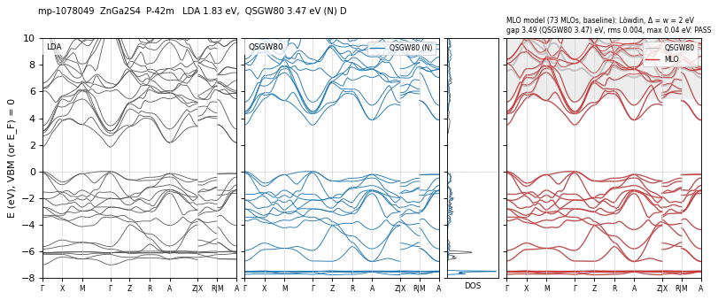

**mp-5350** ZnGa2S4 — QSGW80 **3.81** N / M ≈ eV D  — ecalj 989a18637 (tf32, t_tetrakbt -300) — MLO PASS (b1) 73 gap 3.84 rms 0.006 max 0.07 (ecalj fb2da026b)

<small>runs: M 3.82 · N 3.81 (10-03)</small>

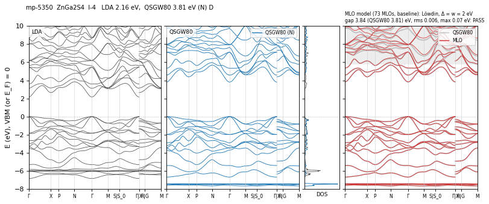

**mp-15776** ZnGa2Se4 — QSGW80 **2.74** N / M ≈ eV D  — ecalj 989a18637 (tf32, t_tetrakbt -300) — MLO PASS (b1) 73 gap 2.77 rms 0.006 max 0.06 (ecalj 0c4d16ceb)

<small>runs: M 2.75 · N 2.74 (10-03)</small>

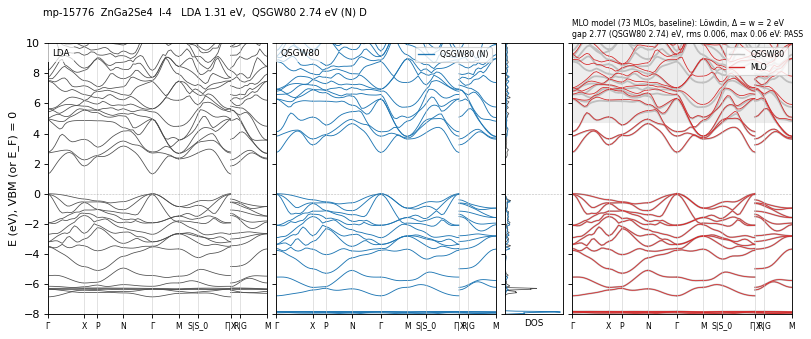

**mp-15777** ZnGa2Te4 — QSGW80 **1.93** N / M ≈ eV I  — ecalj 989a18637 (tf32, t_tetrakbt -300) — MLO PASS (b1) 78 gap 1.94 rms 0.014 max 0.10 (ecalj 0c4d16ceb)

<small>runs: M 1.94 · N 1.93 (10-03)</small>

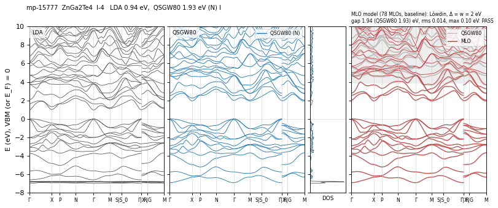

**mp-22253** ZnIn2S4 — QSGW80 **1.13** N / M ≈ eV D  — ecalj 989a18637 (tf32, t_tetrakbt -300) — MLO PASS (b1) 73 gap 1.14 rms 0.004 max 0.03 (ecalj fb2da026b)

<small>runs: M 1.14 · N 1.13 (10-04)</small>

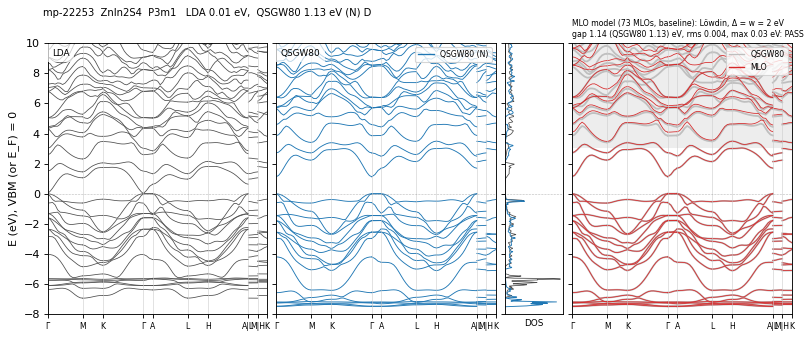

**mp-541937** ZnIn2S4 — QSGW80 **1.16** N / M ≈ eV D  — ecalj 989a18637 (tf32, t_tetrakbt -300) — MLO PASS (b1) 73 gap 1.17 rms 0.004 max 0.04 (ecalj fb2da026b)

<small>runs: M 1.15 · N 1.16 (10-03)</small>

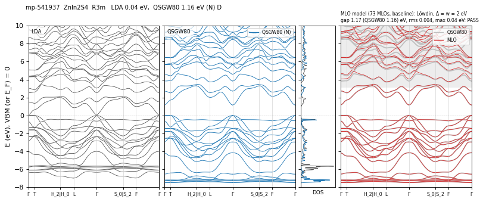

**mp-22607** ZnIn2Se4 — QSGW80 **2.11** N / M ≈ eV D  — ecalj 989a18637 (tf32, t_tetrakbt -300) — MLO PASS (b1) 73 gap 2.13 rms 0.005 max 0.04 (ecalj fb2da026b)

<small>runs: M 2.13 · N 2.11 (10-03)</small>

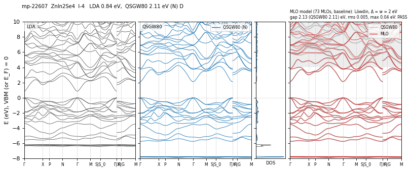

**mp-20832** ZnIn2Te4 — QSGW80 **1.73** N / M ≈ eV D  — ecalj 989a18637 (tf32, t_tetrakbt -300) — MLO PASS (b2) 90 gap 1.73 rms 0.001 max 0.01 (ecalj fb2da026b)

<small>runs: M 1.77 · N 1.73 (10-03)</small>

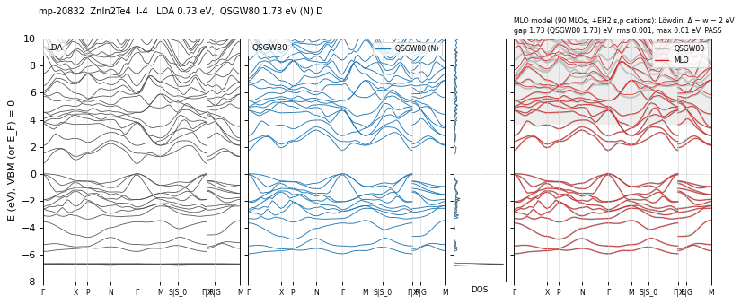

