# GW1500 QSGW80 — bands and DOS, 8 atoms per cell

[README](README.md) · [table](table.md)

Left: LDA. Middle: QSGW80 adopted (blue, condition in parentheses; green dashed: another QSGW80 result when its gap differs by more than 0.1 eV) and the total DOS. Right: the MLO model of the standard recipe (red) on the QSGW80 bands (gray), with its conditions and check; shaded: outside the window of the check ([README](README.md#mlo-models)). Energies from the VBM (insulators) or E_F (metals).

**mp-545730** Ag2C2N2O2 — QSGW80 **3.44** N / R ≈ eV I  — ecalj 989a18637 (tf32, t_tetrakbt -300) — MLO PASS (b2all) 66 gap 3.44 rms 0.001 max 0.01 (ecalj fb2da026b)

<small>runs: M FAILED · R 3.44 (09-30) · N 3.44 (10-06)</small>

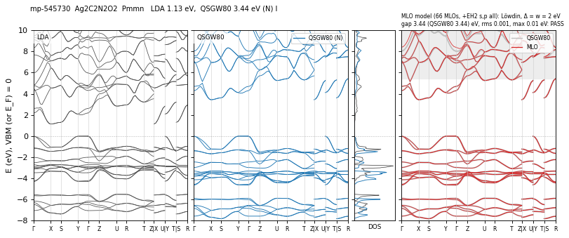

**mp-6070** Ag2C2N2O2 — QSGW80 **4.59** E / N 4.64 / R 4.64 eV I differs — ecalj 0601771b4 (tf32, t_tetrakbt -300) with ES, ES rule es-c — MLO PASS (b1, ES) 44 gap 4.56 rms 0.002 max 0.02 (ecalj 00792e927)

<small>runs: M 4.72 · R 4.64 (10-01) · N 4.64 (10-06) · E 4.59 (10-07, ES 2, es-c)</small>

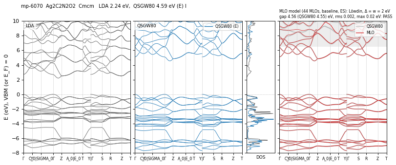

**mp-6781** Ag2C2N2O2 — QSGW80 **5.60** N / R ≈ eV I  — ecalj 989a18637 (tf32, t_tetrakbt -300) — MLO PASS (b2all) 66 gap 5.62 rms 0.003 max 0.05 (ecalj fb2da026b)

<small>runs: M 5.72 · R 5.60 (09-30) · N 5.60 (10-06)</small>

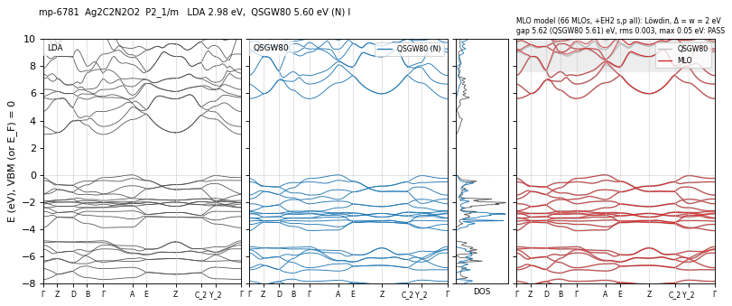

**mp-1079156** Ag2Cl2O4 — QSGW80 **4.06** E / N 4.21 / R 4.21 eV I differs — ecalj 0601771b4 (tf32, t_tetrakbt -300) with ES, ES rule es-c — MLO PASS (b1, ES) 62 gap 4.05 rms 0.001 max 0.01 (ecalj d2878d537)

<small>runs: M 4.18 · R 4.21 (10-01) · N 4.21 (10-06) · E 4.06 (10-07, ES 4, es-c)</small>

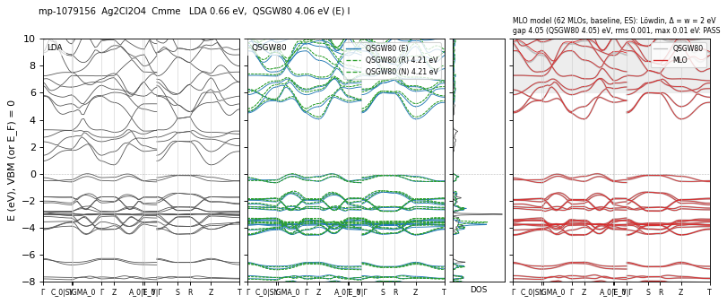

**mp-552169** Ag2Cl2O4 — QSGW80 **3.76** E / N ≈ / R ≈ eV D  — ecalj 0601771b4 (tf32, t_tetrakbt -300) with ES, ES rule es-c — MLO PASS (b1, ES) 60 gap 3.75 rms 0.000 max 0.00 (ecalj 6dc7758fc)

<small>runs: M FAILED · R 3.80 (09-30) · N 3.80 (10-06) · E 3.76 (10-06, ES 2, es-c)</small>

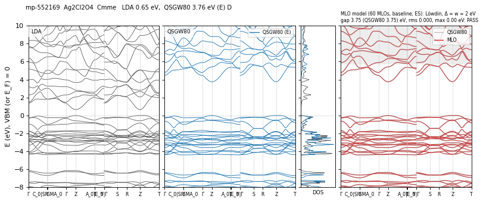

**mp-2247** Ag2N6 — QSGW80 **3.64** N / R ≈ eV I  — ecalj 989a18637 (tf32, t_tetrakbt -300) — MLO PASS (b1) 42 gap 3.64 rms 0.005 max 0.09 (ecalj fb2da026b)

<small>runs: M FAILED · R 3.64 (09-30) · N 3.64 (10-05)</small>

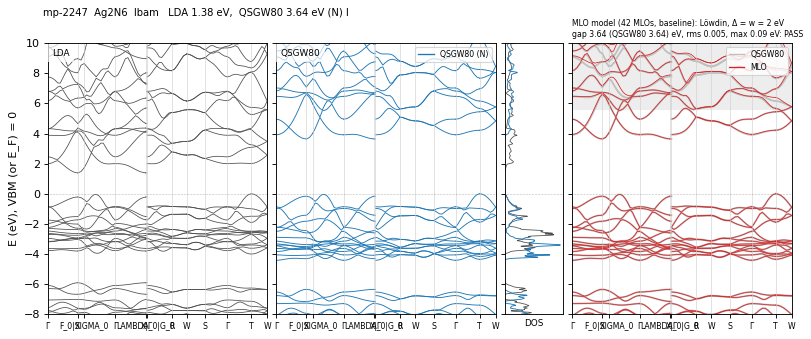

**mp-571297** Ag2N6 — QSGW80 **3.33** N / R ≈ eV D  — ecalj 989a18637 (tf32, t_tetrakbt -300) — MLO PASS (b1) 42 gap 3.33 rms 0.001 max 0.01 (ecalj fb2da026b)

<small>runs: M FAILED · R 3.33 (09-30) · N 3.33 (10-06)</small>

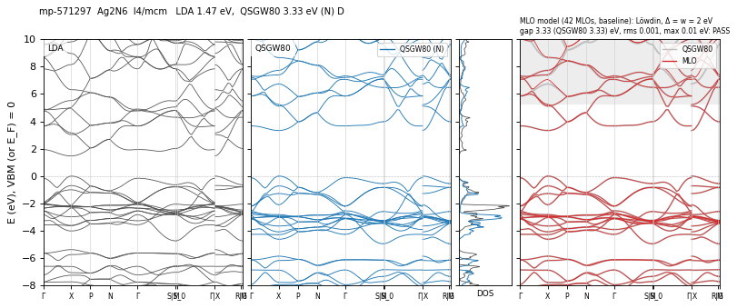

**mp-559470** Ag2Pb2Br2O2 — QSGW80 **1.69** E / M ≈ / N ≈ eV D  — ecalj 0601771b4 (tf32, t_tetrakbt -300) with ES, ES rule es-c — MLO PASS (b1, ES) 74 gap 1.69 rms 0.001 max 0.01 (ecalj 6dc7758fc)

<small>runs: M 1.72 · N 1.73 (10-04) · E 1.69 (10-06, ES 2, es-c)</small>

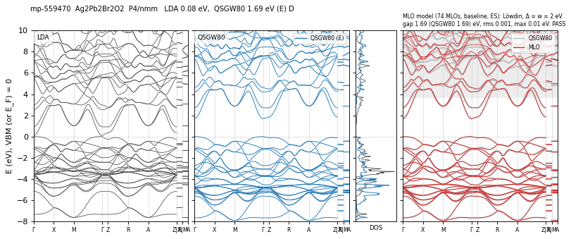

**mp-580941** Ag4I4 — QSGW80 **3.10** E / M ≈ / N ≈ eV D  — ecalj 0601771b4 (tf32, t_tetrakbt -300) with ES, ES rule es-c — MLO PASS (b1, ES) 74 gap 3.10 rms 0.005 max 0.05 (ecalj 00792e927)

<small>runs: M 3.09 · N 3.08 (10-04) · E 3.10 (10-07, ES 2, es-c)</small>

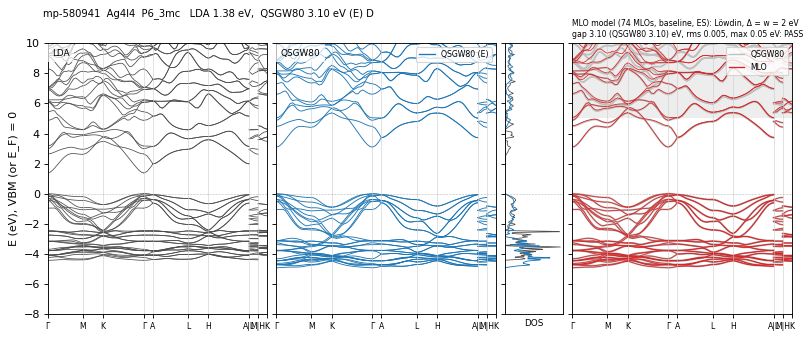

**mp-1079720** Ag4O4 — QSGW80 **0.59** N / M ≈ eV I  — ecalj 989a18637 (tf32, t_tetrakbt -300) — MLO PASS (b1) 52 gap 0.67 rms 0.000 max 0.00 (ecalj a1d6c0e11)

<small>runs: M 0.62 · N 0.59 (10-04)</small>

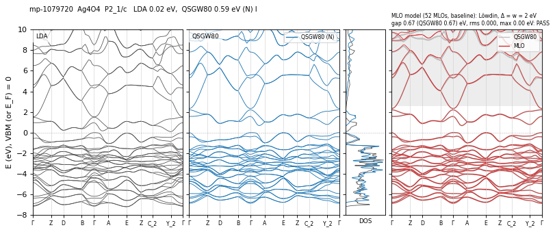

**mp-9631** Al2Ag2O4 — QSGW80 **3.32** N / M 3.22 eV I differs — ecalj 989a18637 (tf32, t_tetrakbt -300) — MLO PASS (b1) 52 gap 3.31 rms 0.005 max 0.06 (ecalj fb2da026b)

<small>runs: M 3.22 · N 3.32 (10-05)</small>

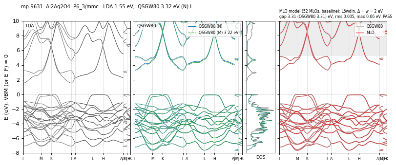

**mp-5782** Al2Ag2S4 — QSGW80 **3.43** N / M 3.49 eV D differs — ecalj 989a18637 (tf32, t_tetrakbt -300) — MLO PASS (b1) 72 gap 3.43 rms 0.003 max 0.04 (ecalj fb2da026b)

<small>runs: M 3.49 · N 3.43 (10-05)</small>

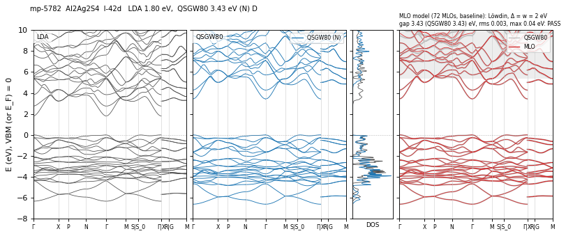

**mp-14091** Al2Ag2Se4 — QSGW80 **2.58** N / M ≈ eV D  — ecalj 989a18637 (tf32, t_tetrakbt -300) — MLO PASS (b1) 72 gap 2.59 rms 0.005 max 0.06 (ecalj fb2da026b)

<small>runs: M 2.62 · N 2.58 (10-05)</small>

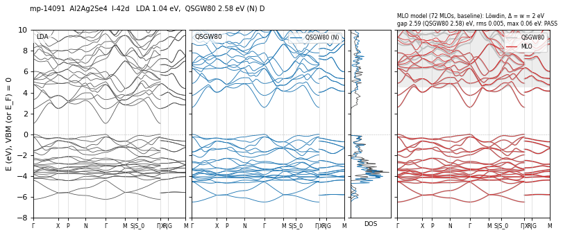

**mp-14092** Al2Ag2Te4 — QSGW80 **2.23** N / M ≈ eV D  — ecalj 989a18637 (tf32, t_tetrakbt -300) — MLO PASS (b2) 80 gap 2.23 rms 0.005 max 0.05 (ecalj fb2da026b)

<small>runs: M 2.21 · N 2.23 (10-05)</small>

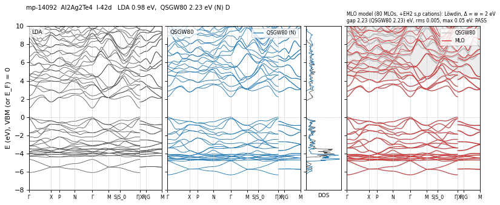

**mp-25469** Al2Cl6 — QSGW80 **8.22** N / M 8.01 eV I CHECK — ecalj 989a18637 (tf32, t_tetrakbt -300) — MLO PASS (b2all) 104 gap 8.22 rms 0.000 max 0.00 (ecalj fb2da026b)

<small>runs: M 8.01 · N 8.22 (10-03)</small>

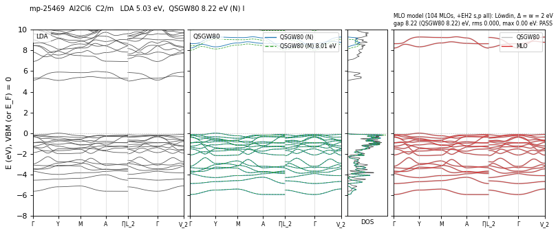

**mp-3098** Al2Cu2O4 — QSGW80 **3.86** N / R ≈ eV I  — ecalj 989a18637 (tf32, t_tetrakbt -300) — MLO PASS (b2) 60 gap 3.84 rms 0.008 max 0.10 (ecalj fb2da026b)

<small>runs: M 3.81 · R 3.86 (10-01) · N 3.86 (10-06)</small>

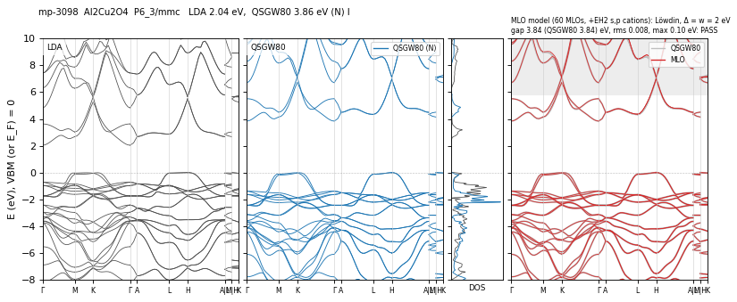

**mp-4979** Al2Cu2S4 — QSGW80 **3.09** N / M ≈ eV D  — ecalj 989a18637 (tf32, t_tetrakbt -300) — MLO PASS (b1) 72 gap 3.12 rms 0.007 max 0.07 (ecalj fb2da026b)

<small>runs: M 3.09 · N 3.09 (10-03)</small>

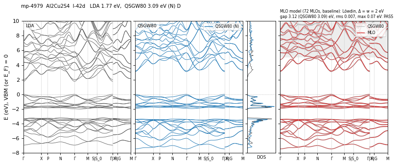

**mp-8016** Al2Cu2Se4 — QSGW80 **2.29** N / M ≈ eV D  — ecalj 989a18637 (tf32, t_tetrakbt -300) — MLO PASS (b1) 72 gap 2.33 rms 0.008 max 0.09 (ecalj fb2da026b)

<small>runs: M 2.32 · N 2.29 (10-05)</small>

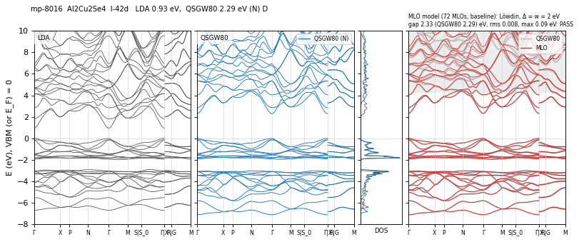

**mp-8017** Al2Cu2Te4 — QSGW80 **2.21** N / M ≈ eV D  — ecalj 989a18637 (tf32, t_tetrakbt -300) — MLO PASS (b2) 80 gap 2.22 rms 0.005 max 0.06 (ecalj fb2da026b)

<small>runs: M 2.24 · N 2.21 (10-04)</small>

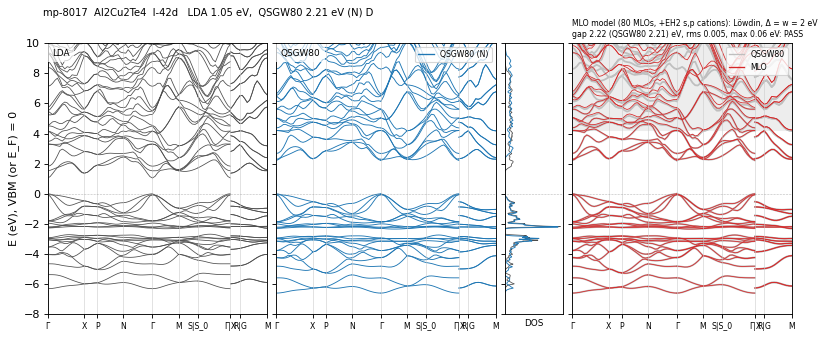

**mp-468** Al2F6 — QSGW80 **13.20** N / R ≈ eV D  — ecalj 989a18637 (tf32, t_tetrakbt -300) — MLO PASS (b2) 50 gap 13.22 rms 0.005 max 0.06 (ecalj fb2da026b)

<small>runs: M FAILED · R 13.20 (09-30) · N 13.20 (10-05)</small>

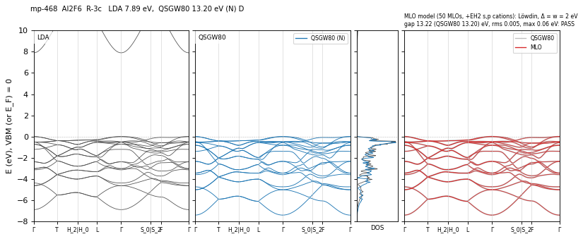

**mp-23807** Al2H2O4 — QSGW80 **8.63** N / R ≈ eV D  — ecalj 989a18637 (tf32, t_tetrakbt -300) — MLO PASS (b1) 42 gap 8.64 rms 0.002 max 0.05 (ecalj fb2da026b)

<small>runs: M 8.42 · R 8.63 (10-01) · N 8.63 (10-05)</small>

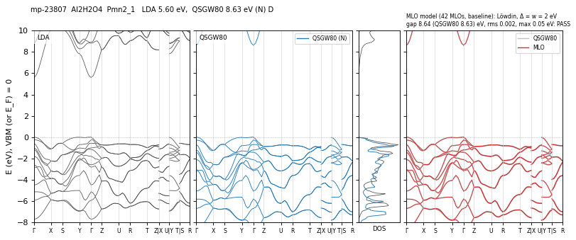

**mp-23933** Al2H6 — QSGW80 **5.07** N / M 5.12 eV I differs — ecalj 989a18637 (tf32, t_tetrakbt -300) — MLO PASS (b1) 42 gap 5.06 rms 0.012 max 0.08 (ecalj fb2da026b)

<small>runs: M 5.12 · N 5.07 (10-04)</small>

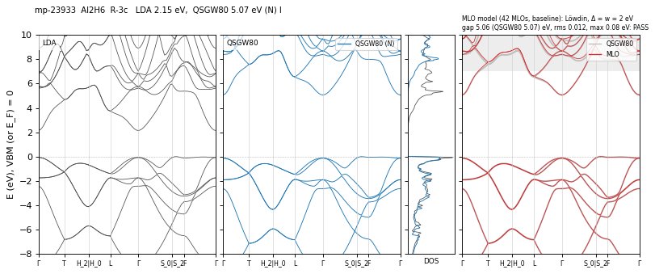

**mp-9579** Al2Tl2Se4 — QSGW80 **1.40** N / M ≈ eV I  — ecalj 989a18637 (tf32, t_tetrakbt -300) — MLO PASS (b1) 82 gap 1.39 rms 0.001 max 0.01 (ecalj fb2da026b)

<small>runs: M 1.40 · N 1.40 (10-05)</small>

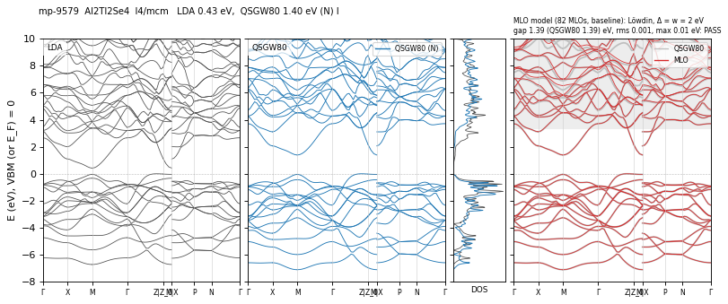

**mp-23218** As2I6 — QSGW80 **3.38** E / N ≈ / R ≈ eV I  — ecalj 0601771b4 (tf32, t_tetrakbt -300) with ES, ES rule es-c — MLO PASS (b1, ES) 82 gap 3.38 rms 0.001 max 0.01 (ecalj f09035a49)

<small>runs: M 2.69 · R 3.41 (10-01) · N 3.41 (10-06) · E 3.38 (10-07, ES 4, es-c)</small>

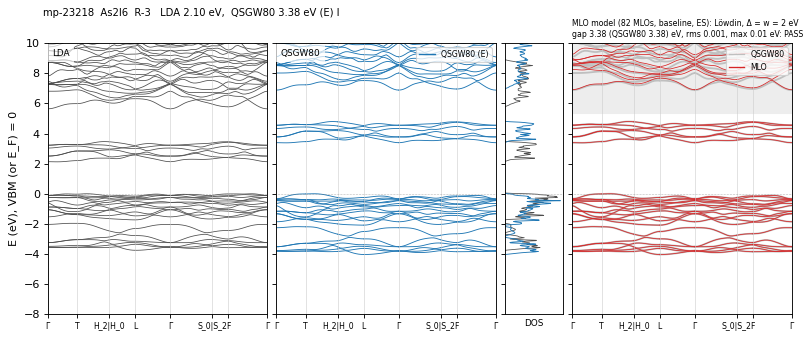

**mp-561703** Au2C2Cl2O2 — QSGW80 **5.78** E / M 5.60 / N ≈ eV I differs — ecalj 0601771b4 (tf32, t_tetrakbt -300) with ES, ES rule es-c — MLO PASS (b2d, ES) 88 gap 5.78 rms 0.001 max 0.01 (ecalj 6dc7758fc)

<small>runs: M 5.60 · N 5.80 (10-05) · E 5.78 (10-06, ES 4, es-c)</small>

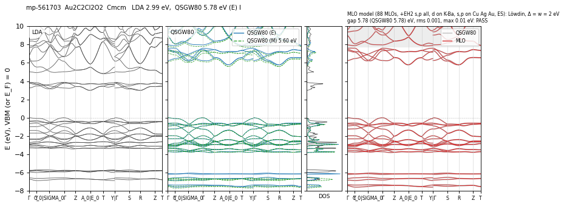

**mp-505366** Au4Br4 — QSGW80 **3.12** N / M ≈ eV D  — ecalj 989a18637 (tf32, t_tetrakbt -300) — MLO PASS (b2all) 88 gap 3.12 rms 0.002 max 0.02 (ecalj fb2da026b)

<small>runs: M 3.10 · N 3.12 (10-03)</small>

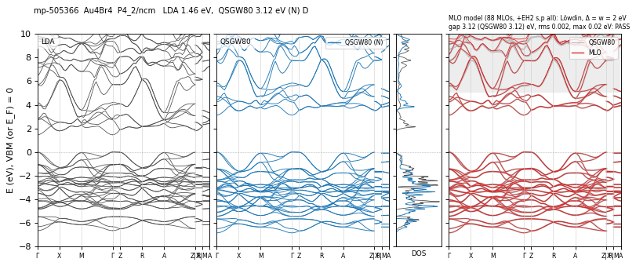

**mp-570140** Au4Br4 — QSGW80 **3.48** N / R ≈ eV D  — ecalj 989a18637 (tf32, t_tetrakbt -300) — MLO PASS (b2d) 104 gap 3.47 rms 0.000 max 0.01 (ecalj fb2da026b)

<small>runs: M FAILED · R 3.47 (09-30) · N 3.48 (10-06)</small>

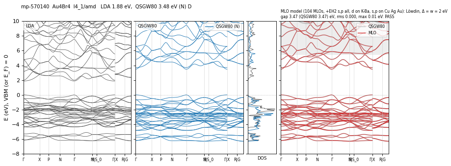

**mp-32780** Au4Cl4 — QSGW80 **3.17** N / M 3.24 eV D differs — ecalj 989a18637 (tf32, t_tetrakbt -300) — MLO PASS (b2all) 88 gap 3.18 rms 0.002 max 0.05 (ecalj fb2da026b)

<small>runs: M 3.24 · N 3.17 (10-04)</small>

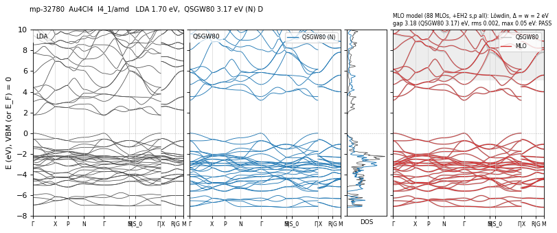

**mp-27725** Au4I4 — QSGW80 **3.05** N / M ≈ eV I  — ecalj 989a18637 (tf32, t_tetrakbt -300) — MLO PASS (b2all) 88 gap 3.03 rms 0.006 max 0.07 (ecalj fb2da026b)

<small>runs: M 3.07 · N 3.05 (10-05)</small>

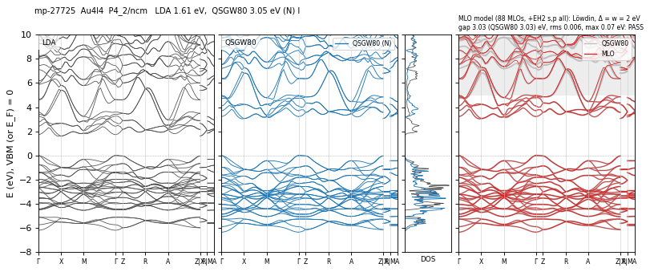

**mp-23225** B2Br6 — QSGW80 **6.61** E / M 6.72 / N 6.76 eV I differs — ecalj 0601771b4 (tf32, t_tetrakbt -300) with ES, ES rule es-c — MLO PASS (b2, ES) 82 gap 6.61 rms 0.001 max 0.09 (ecalj f09035a49)

<small>runs: M 6.72 · N 6.76 (10-03) · E 6.61 (10-07, ES 6, es-c)</small>

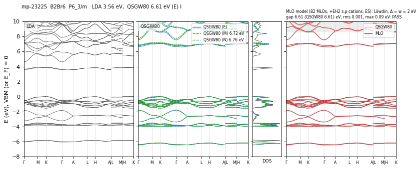

**mp-23184** B2Cl6 — QSGW80 **8.15** E / N 8.34 / R 8.34 eV I differs — ecalj 0601771b4 (tf32, t_tetrakbt -300) with ES, ES rule es-c — MLO PASS (b1, ES) 74 gap 8.15 rms 0.001 max 0.01 (ecalj 27d52b5af)

<small>runs: M 8.82 · R 8.34 (10-01) · N 8.34 (10-06) · E 8.15 (10-07, ES 6, es-c)</small>

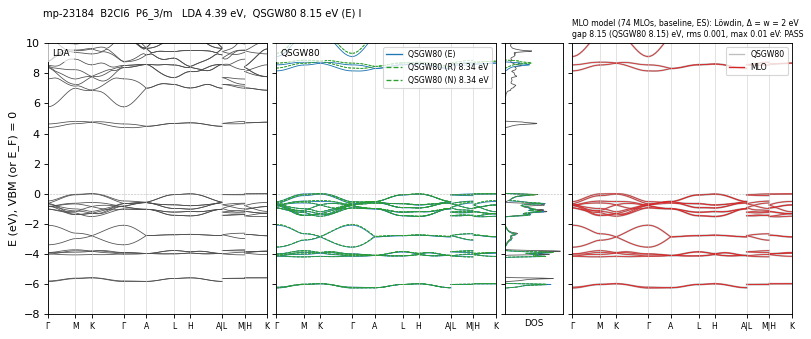

**mp-23189** B2I6 — QSGW80 **4.81** E / M 4.87 / N 4.90 eV I differs — ecalj 0601771b4 (tf32, t_tetrakbt -300) with ES, ES rule es-c — MLO PASS (b2all, ES) 106 gap 4.81 rms 0.001 max 0.00 (ecalj f09035a49)

<small>runs: M 4.87 · N 4.90 (10-05) · E 4.81 (10-07, ES 6, es-c)</small>

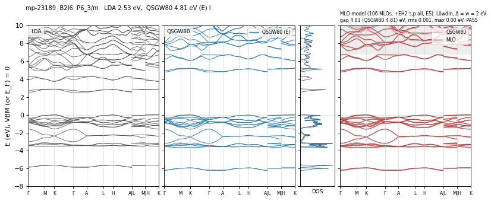

**mp-1086652** Ba2Ag2S2F2 — QSGW80 **2.81** N / M ≈ eV D  — ecalj 989a18637 (tf32, t_tetrakbt -300) — MLO PASS (b1) 68 gap 2.85 rms 0.003 max 0.09 (ecalj a1d6c0e11)

<small>runs: M 2.77 · N 2.81 (10-05)</small>

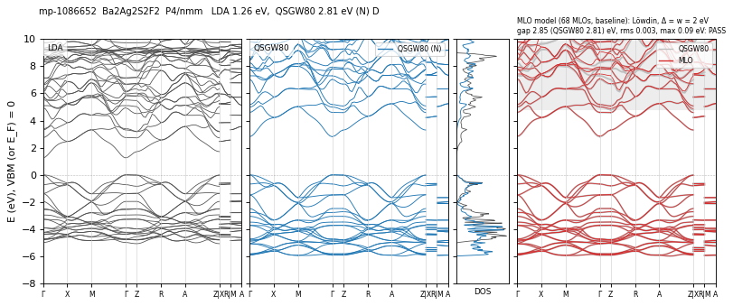

**mp-1079647** Ba2Ag2Se2F2 — QSGW80 **2.59** N / M ≈ eV D  — ecalj 989a18637 (tf32, t_tetrakbt -300) — MLO PASS (b1) 68 gap 2.63 rms 0.005 max 0.05 (ecalj fb2da026b)

<small>runs: M 2.57 · N 2.59 (10-05)</small>

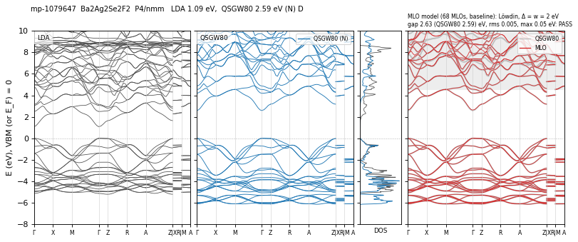

**mp-16742** Ba2Ag2Te2F2 — QSGW80 **2.68** N / M ≈ eV D  — ecalj 989a18637 (tf32, t_tetrakbt -300) — MLO PASS (b1) 68 gap 2.73 rms 0.009 max 0.08 (ecalj 0c4d16ceb)

<small>runs: M 2.67 · N 2.68 (10-03)</small>

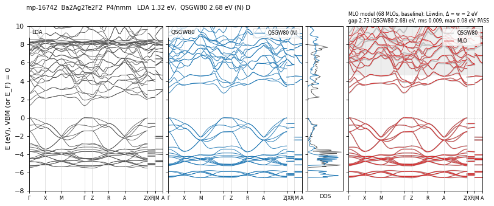

**mp-1095151** Ba2Cd2As2F2 — QSGW80 **1.96** N / M ≈ eV D  — ecalj 989a18637 (tf32, t_tetrakbt -300) — MLO PASS (b1) 68 gap 1.96 rms 0.009 max 0.05 (ecalj a1d6c0e11)

<small>runs: M 1.95 · N 1.96 (10-04)</small>

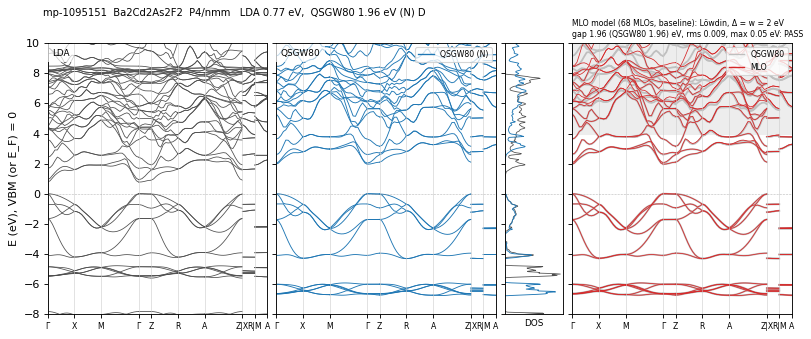

**mp-1079603** Ba2Cd2P2F2 — QSGW80 **2.22** N / M ≈ eV D  — ecalj 989a18637 (tf32, t_tetrakbt -300) — MLO PASS (b1) 68 gap 2.22 rms 0.008 max 0.04 (ecalj a1d6c0e11)

<small>runs: M 2.23 · N 2.22 (10-04)</small>

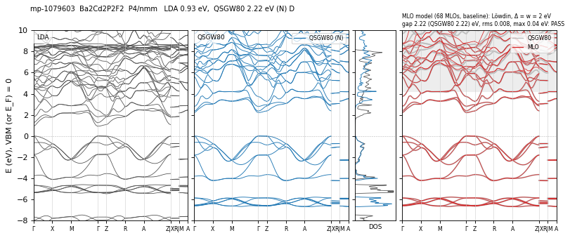

**mp-1078693** Ba2Cd2Sb2F2 — QSGW80 **1.17** N / M ≈ eV D  — ecalj 989a18637 (tf32, t_tetrakbt -300) — MLO PASS (b1) 68 gap 1.17 rms 0.012 max 0.09 (ecalj a1d6c0e11)

<small>runs: M 1.18 · N 1.17 (10-04)</small>

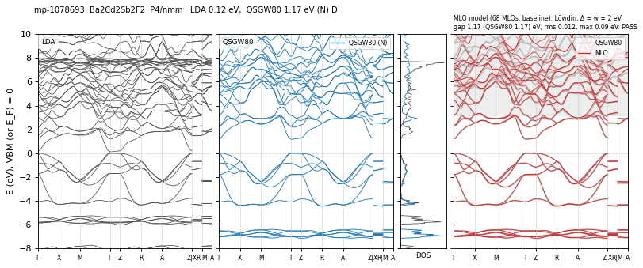

**mp-1080650** Ba2Cu2S2F2 — QSGW80 **3.11** N / M ≈ eV D  — ecalj 989a18637 (tf32, t_tetrakbt -300) — MLO PASS (b2) 76 gap 3.11 rms 0.001 max 0.01 (ecalj a1d6c0e11)

<small>runs: M 3.08 · N 3.11 (10-04)</small>

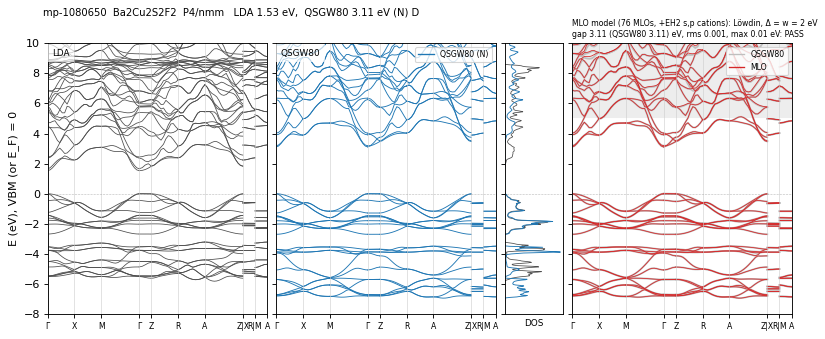

**mp-9195** Ba2Cu2Se2F2 — QSGW80 **2.76** N / M ≈ eV D  — ecalj 989a18637 (tf32, t_tetrakbt -300) — MLO PASS (b2) 76 gap 2.76 rms 0.002 max 0.01 (ecalj fb2da026b)

<small>runs: M 2.75 · N 2.76 (10-03)</small>

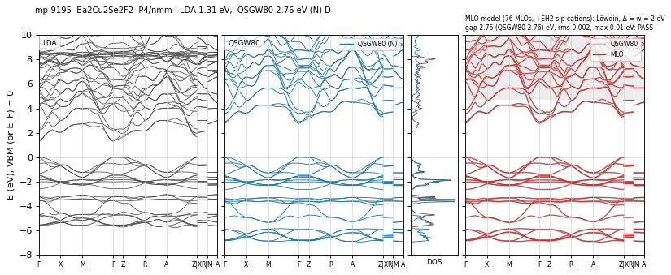

**mp-13287** Ba2Cu2Te2F2 — QSGW80 **2.19** N / M ≈ eV D  — ecalj 989a18637 (tf32, t_tetrakbt -300) — MLO PASS (b2) 76 gap 2.19 rms 0.002 max 0.02 (ecalj a1d6c0e11)

<small>runs: M 2.21 · N 2.19 (10-04)</small>

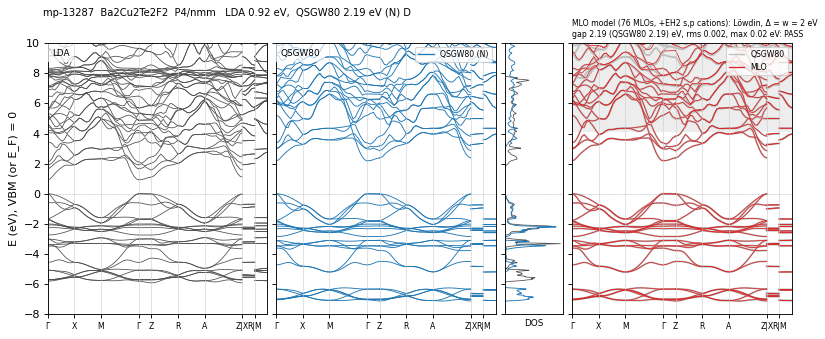

**mp-10322** Ba2Hf2N4 — QSGW80 **2.59** N / M ≈ eV I  — ecalj 989a18637 (tf32, t_tetrakbt -300) — MLO PASS (b1) 72 gap 2.59 rms 0.007 max 0.09 (ecalj a1d6c0e11)

<small>runs: M 2.59 · N 2.59 (10-04)</small>

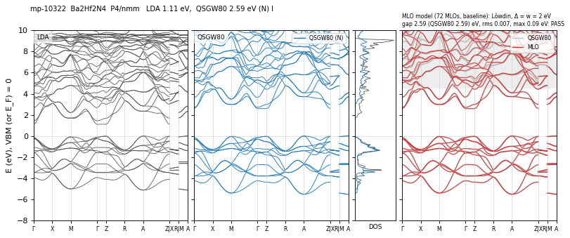

**mp-18943** Ba2Ni2O4 — QSGW80 **2.23** N / M ≈ eV D LDA≠PBE — ecalj 989a18637 (tf32, t_tetrakbt -300) — MLO PASS (b2) 66 gap 2.23 rms 0.001 max 0.02 (ecalj fb2da026b)

<small>runs: M 2.18 · N 2.23 (10-03)</small>

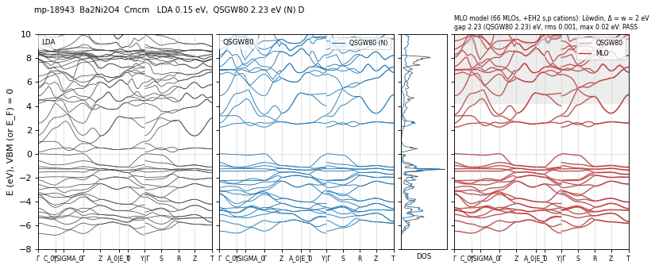

**mp-7808** Ba2P6 — QSGW80 **1.39** N / M ≈ eV I  — ecalj 989a18637 (tf32, t_tetrakbt -300) — MLO PASS (b2) 86 gap 1.38 rms 0.003 max 0.02 (ecalj fb2da026b)

<small>runs: M 1.41 · N 1.39 (10-03)</small>

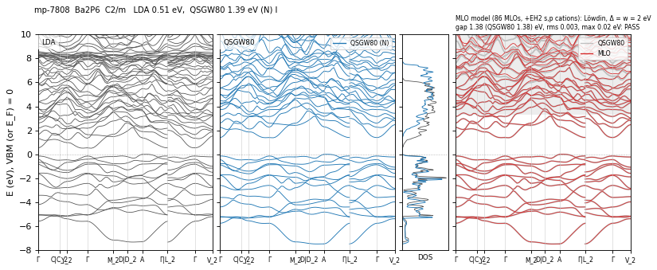

**mp-4009** Ba2Pd2S4 — QSGW80 **1.42** N / M ≈ eV D  — ecalj 989a18637 (tf32, t_tetrakbt -300) — MLO PASS (b2) 86 gap 1.42 rms 0.008 max 0.09 (ecalj fb2da026b)

<small>runs: M 1.45 · N 1.42 (10-04)</small>

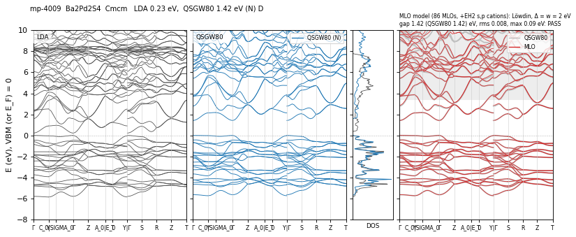

**mp-239** Ba2S6 — QSGW80 **3.01** N / M ≈ eV I  — ecalj 989a18637 (tf32, t_tetrakbt -300) — MLO PASS (b1) 78 gap 3.01 rms 0.009 max 0.06 (ecalj fb2da026b)

<small>runs: M 3.04 · N 3.01 (10-04)</small>

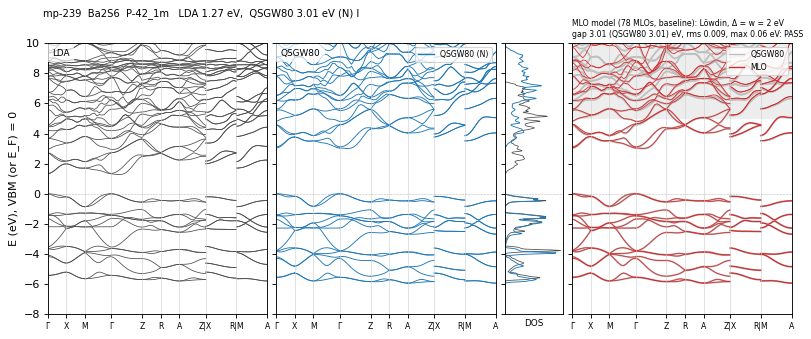

**mp-7548** Ba2Se6 — QSGW80 **2.26** N / M ≈ eV I  — ecalj 989a18637 (tf32, t_tetrakbt -300) — MLO PASS (b1) 78 gap 2.26 rms 0.006 max 0.04 (ecalj fb2da026b)

<small>runs: M 2.25 · N 2.26 (10-05)</small>

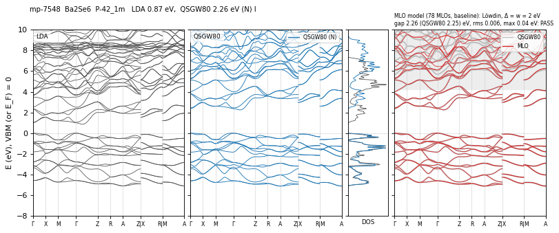

**mp-8234** Ba2Te6 — QSGW80 **1.63** N / M ≈ eV I  — ecalj 989a18637 (tf32, t_tetrakbt -300) — MLO PASS (b1) 78 gap 1.64 rms 0.006 max 0.06 (ecalj fb2da026b)

<small>runs: M 1.65 · N 1.63 (10-05)</small>

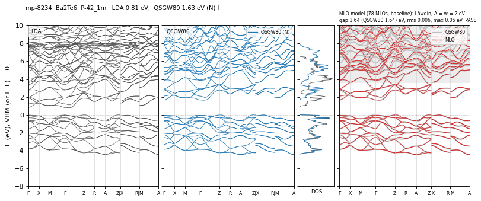

**mp-1079320** Ba2Zn2As2F2 — QSGW80 **1.35** N / M ≈ eV D  — ecalj 989a18637 (tf32, t_tetrakbt -300) — MLO PASS (b1) 78 gap 1.35 rms 0.008 max 0.10 (ecalj fb2da026b)

<small>runs: M 1.34 · N 1.35 (10-05)</small>

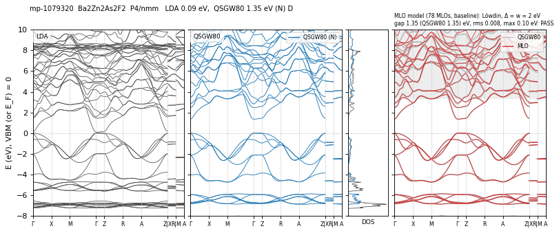

**mp-548469** Ba2Zn2S2O2 — QSGW80 **3.94** N / M 4.05 eV D differs — ecalj 989a18637 (tf32, t_tetrakbt -300) — MLO PASS (b2) 84 gap 3.94 rms 0.001 max 0.00 (ecalj fb2da026b)

<small>runs: M 4.05 · N 3.94 (10-03)</small>

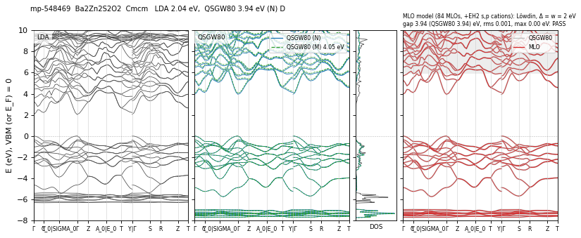

**mp-3104** Ba2Zr2N4 — QSGW80 **2.47** N / R ≈ eV D  — ecalj 989a18637 (tf32, t_tetrakbt -300) — MLO PASS (b2) 66 gap 2.47 rms 0.001 max 0.01 (ecalj fb2da026b)

<small>runs: M 2.45 · R 2.47 (10-01) · N 2.47 (10-06)</small>

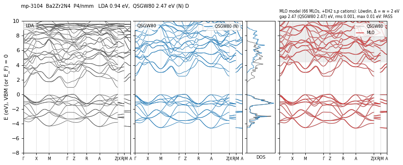

**mp-1078191** Ba4Te2O2 — QSGW80 **3.23** N / R ≈ eV D  — ecalj 989a18637 (tf32, t_tetrakbt -300) — MLO PASS (b2) 90 gap 3.27 rms 0.008 max 0.06 (ecalj fb2da026b)

<small>runs: M 3.00 · R 3.23 (10-01) · N 3.23 (10-06)</small>

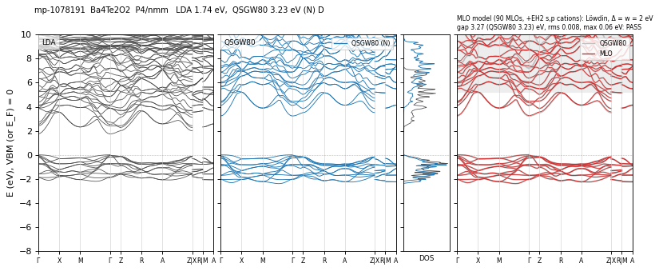

**mp-7394** BaAg2GeS4 — QSGW80 **1.74** N / M ≈ eV I  — ecalj 989a18637 (tf32, t_tetrakbt -300) — MLO PASS (b1) 75 gap 1.75 rms 0.002 max 0.02 (ecalj fb2da026b)

<small>runs: M 1.73 · N 1.74 (10-05)</small>

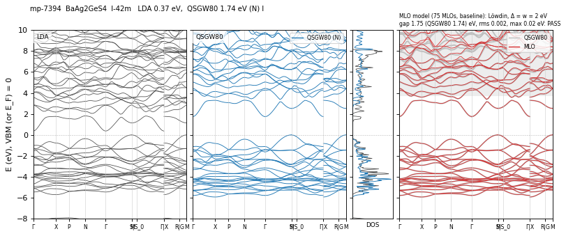

**mp-569790** BaAg2GeSe4 — QSGW80 **1.03** N / M ≈ eV I  — ecalj 989a18637 (tf32, t_tetrakbt -300) — MLO PASS (b1) 75 gap 1.08 rms 0.008 max 0.07 (ecalj fb2da026b)

<small>runs: M 1.05 · N 1.03 (10-03)</small>

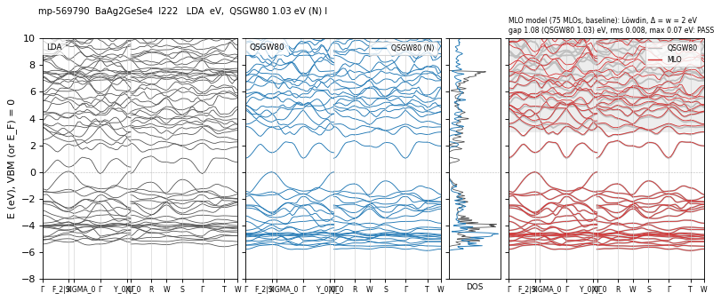

**mp-555166** BaAg2SnS4 — QSGW80 **1.63** N / M ≈ eV I  — ecalj 989a18637 (tf32, t_tetrakbt -300) — MLO PASS (b2) 83 gap 1.64 rms 0.005 max 0.10 (ecalj fb2da026b)

<small>runs: M 1.63 · N 1.63 (10-05)</small>

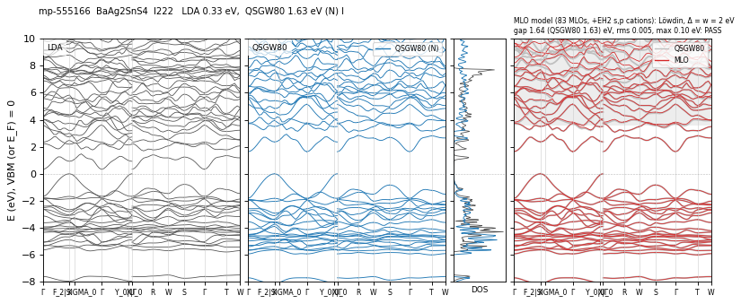

**mp-569114** BaAg2SnSe4 — QSGW80 **1.02** N / M ≈ eV I  — ecalj 989a18637 (tf32, t_tetrakbt -300) — MLO PASS (b2) 83 gap 1.03 rms 0.003 max 0.06 (ecalj fb2da026b)

<small>runs: M 1.00 · N 1.02 (10-05)</small>

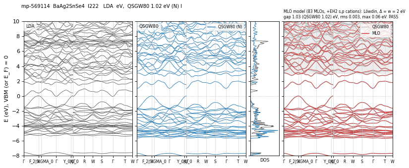

**mp-14006** BaGeF6 — QSGW80 **10.57** N / R ≈ eV D  — ecalj 989a18637 (tf32, t_tetrakbt -300) — MLO PASS (b2) 53 gap 10.57 rms 0.001 max 0.01 (ecalj fb2da026b)

<small>runs: M FAILED · R 10.57 (09-30) · N 10.57 (10-05)</small>

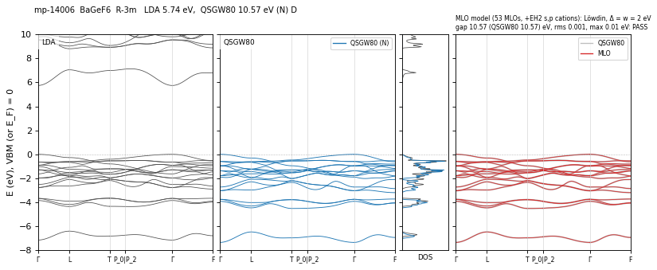

**mp-1080511** BaMgC2O4 — QSGW80 **3.84** N / R ≈ eV D  — ecalj 989a18637 (tf32, t_tetrakbt -300) — MLO PASS (b2) 61 gap 3.85 rms 0.001 max 0.01 (ecalj fb2da026b)

<small>runs: M FAILED · R 3.84 (09-30) · N 3.84 (10-06)</small>

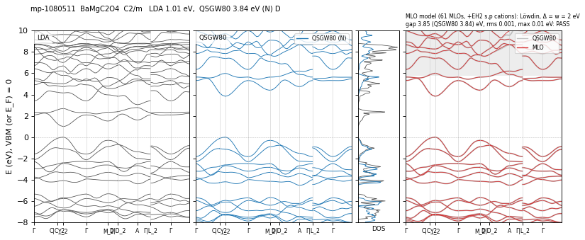

**mp-613910** BaNiF6 — QSGW80 **5.43** N / M 5.37 eV I differs — ecalj 989a18637 (tf32, t_tetrakbt -300) — MLO PASS (b1) 45 gap 5.43 rms 0.001 max 0.00 (ecalj fb2da026b)

<small>runs: M 5.37 · N 5.43 (10-05)</small>

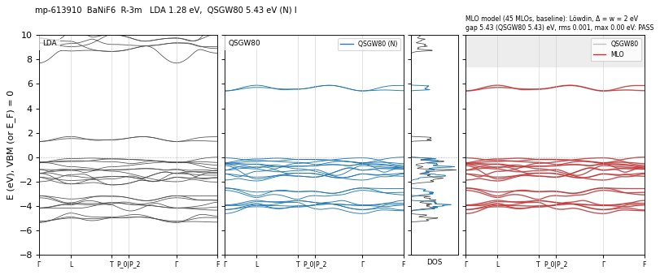

**mp-19799** BaPbF6 — QSGW80 **6.86** N / M 6.64 eV I CHECK — ecalj 989a18637 (tf32, t_tetrakbt -300) — MLO PASS (b1) 50 gap 6.87 rms 0.001 max 0.01 (ecalj fb2da026b)

<small>runs: M 6.64 · N 6.86 (10-04)</small>

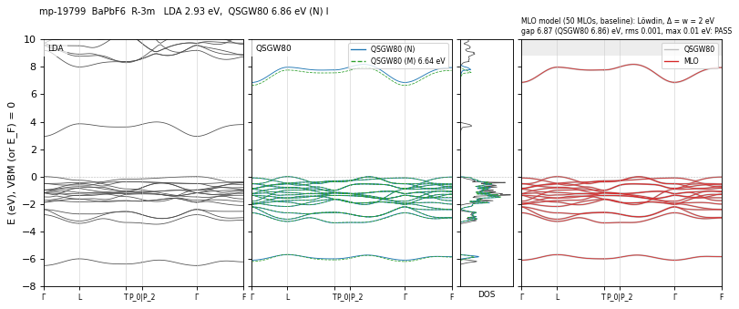

**mp-5588** BaSiF6 — QSGW80 **12.21** N / M 12.11 eV D differs — ecalj 989a18637 (tf32, t_tetrakbt -300) — MLO PASS (b2) 53 gap 12.21 rms 0.002 max 0.02 (ecalj fb2da026b)

<small>runs: M 12.11 · N 12.21 (10-05)</small>

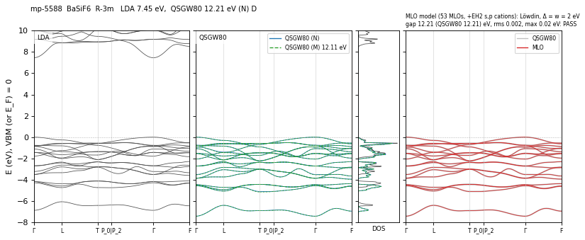

**mp-8290** BaSnF6 — QSGW80 **9.69** N / R ≈ eV I  — ecalj 989a18637 (tf32, t_tetrakbt -300) — MLO PASS (b1) 50 gap 9.78 rms 0.011 max 0.08 (ecalj fb2da026b)

<small>runs: M 9.62 · R 9.69 (10-01) · N 9.69 (10-05)</small>

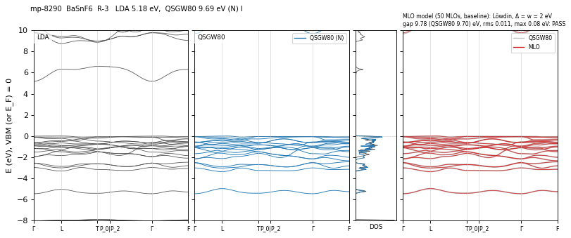

**mp-8291** BaTiF6 — QSGW80 **8.73** N / R ≈ eV I vs2025 — ecalj 989a18637 (tf32, t_tetrakbt -300) — MLO PASS (b1) 45 gap 8.73 rms 0.001 max 0.01 (ecalj fb2da026b)

<small>runs: M 8.60 · R 8.73 (10-01) · N 8.73 (10-05)</small>

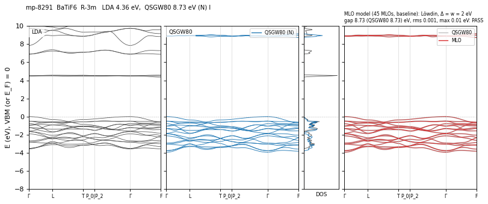

**mp-7599** Be4O4 — QSGW80 **10.39** N / M 10.49 eV I differs — ecalj 989a18637 (tf32, t_tetrakbt -300) — MLO PASS (b2) 48 gap 10.36 rms 0.002 max 0.03 (ecalj fb2da026b)

<small>runs: M 10.49 · N 10.39 (10-05)</small>

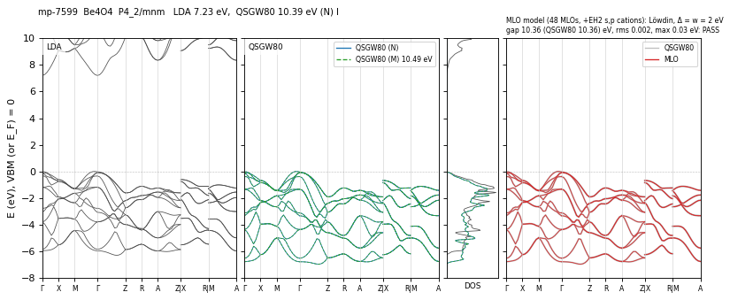

**mp-568301** Bi2Br6 — QSGW80 **4.20** E / M ≈ / N ≈ eV D  — ecalj 0601771b4 (tf32, t_tetrakbt -300) with ES, ES rule es-c — MLO PASS (b1, ES) 73 gap 4.23 rms 0.004 max 0.03 (ecalj 6dc7758fc)

<small>runs: M 4.21 · N 4.21 (10-05) · E 4.20 (10-06, ES 1, es-c)</small>

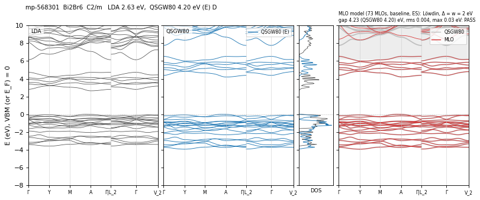

**mp-30200** Bi2CO5 — QSGW80 **2.75** N / M 2.59 eV I differs — ecalj 989a18637 (tf32, t_tetrakbt -300) — MLO PASS (b1) 42 gap 2.76 rms 0.005 max 0.05 (ecalj fb2da026b)

<small>runs: M 2.59 · N 2.75 (10-05)</small>

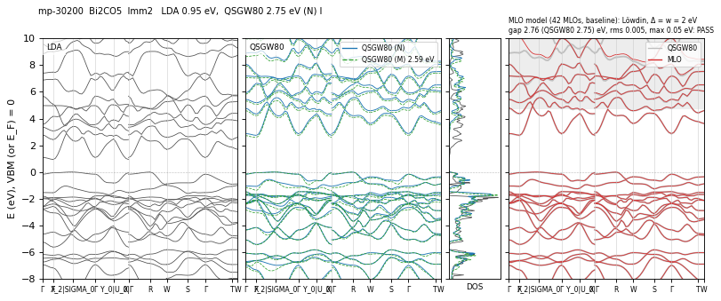

**mp-22849** Bi2I6 — QSGW80 **3.50** E / M ≈ / N ≈ eV I  — ecalj 0601771b4 (tf32, t_tetrakbt -300) with ES, ES rule es-c — MLO PASS (b1, ES) 76 gap 3.51 rms 0.001 max 0.01 (ecalj 27d52b5af)

<small>runs: M 3.49 · N 3.51 (10-04) · E 3.50 (10-07, ES 4, es-c)</small>

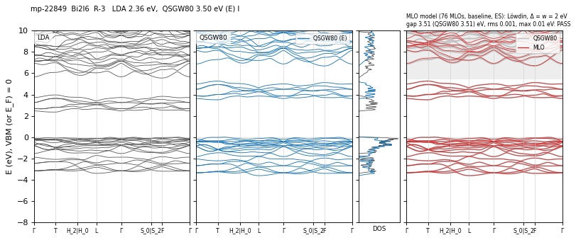

**mp-569157** Bi2I6 — QSGW80 **3.35** E / M ≈ / N ≈ eV I  — ecalj 0601771b4 (tf32, t_tetrakbt -300) with ES, ES rule es-c — MLO PASS (b1, ES) 76 gap 3.36 rms 0.001 max 0.01 (ecalj 6dc7758fc)

<small>runs: M 3.33 · N 3.36 (10-04) · E 3.35 (10-06, ES 4, es-c)</small>

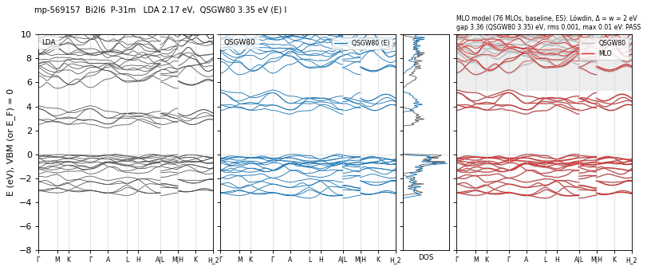

**mp-568388** Bi4I4 — QSGW80 **1.44** E / N ≈ / R ≈ eV D N:TIMEOUT — ecalj 0601771b4 (tf32, t_tetrakbt -300) with ES, ES rule es-c — MLO PASS (b1, ES) 73 gap 1.45 rms 0.004 max 0.03 (ecalj 00792e927)

<small>runs: M 1.30 · R 1.44 (09-30) · N 1.44 TIMEOUT (10-06) · E 1.44 (10-07, ES 1, es-c)</small>

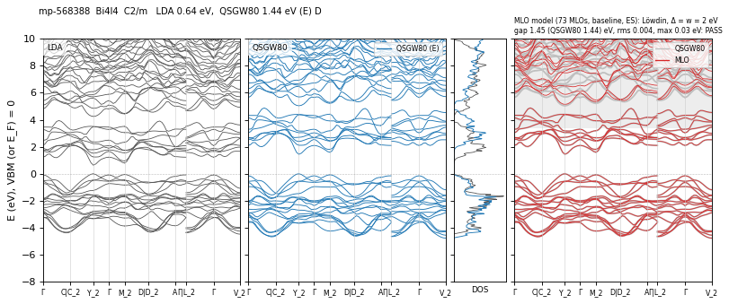

**mp-23435** Bi4Te2I2 — QSGW80 **0.33** R eV I N:TIMEOUT — ecalj 989a18637 (fp32, t_tetrakbt +300) — MLO PASS (b1) 72 gap 0.30 rms 0.004 max 0.02 (ecalj 27d52b5af)

<small>runs: M 0.24 · R 0.33 (09-30) · N 0.24 TIMEOUT (10-06)</small>

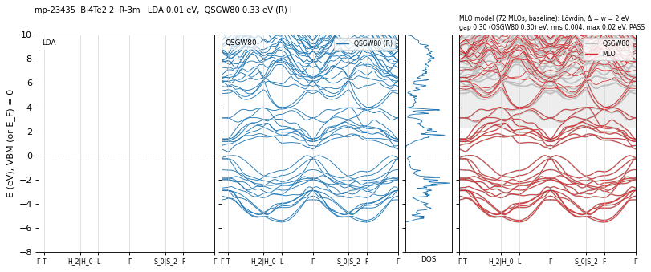

**mp-23297** Br2F6 — QSGW80 **5.91** E / M 5.76 / N ≈ eV I differs — ecalj 0601771b4 (tf32, t_tetrakbt -300) with ES, ES rule es-c — MLO PASS (b1, ES) 48 gap 5.91 rms 0.000 max 0.00 (ecalj f16f0ea3d)

<small>runs: M 5.76 · N 5.90 (10-03) · E 5.91 (10-06, ES 6, es-c)</small>

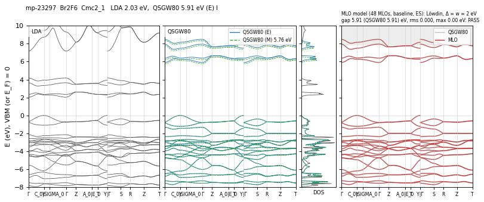

**mp-11875** C4O4 — QSGW80 **11.98** E / M 12.29 / N 12.11 eV D CHECK — ecalj 0601771b4 (tf32, t_tetrakbt -300) with ES, ES rule es-c — MLO PASS (b2, ES) 52 gap 11.99 rms 0.018 max 0.07 (ecalj 27d52b5af)

*ES by hand from 2026-10-07 14:39: 2.5 a.u., s (the rule gave 3.5 a.u., the QSGW80 gap swung 7.7-9.6 eV for 10 iterations); MLO PASS 0.072 eV*

<small>runs: M 12.29 · N 12.11 (10-03) · E 9.28 MAXITER (10-07, ES 4, es-c) · E 11.98 (10-07, ES 4, es-c)</small>

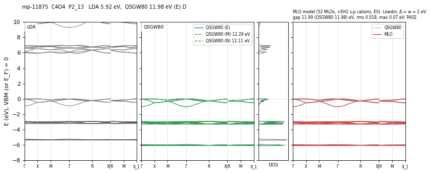

**mp-729933** C4O4 — QSGW80 **11.39** E / M 11.75 / N 11.82 eV I CHECK — ecalj 0601771b4 (tf32, t_tetrakbt -300) with ES, ES rule es-c — MLO PASS (b2, ES) 64 gap 11.38 rms 0.005 max 0.04 (ecalj 00792e927)

<small>runs: M 11.75 · N 11.82 (10-05) · E 11.39 (10-07, ES 4, es-c)</small>

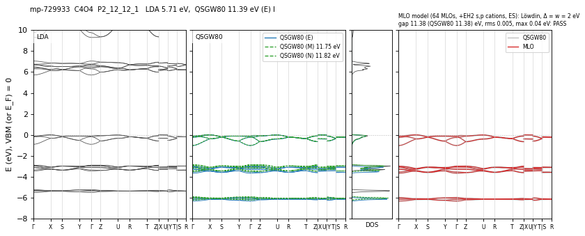

**mp-569416** C8 — QSGW80 **4.15** E / M 4.97 · path 0 (semimetal?) eV  CHECK path-metal LDA≠PBE vs2025 N:TIMEOUT — ecalj 0601771b4 (tf32, t_tetrakbt -300) with ES, ES rule es-c — MLO PASS (b1, ES) 33 gap 0.21 rms 0.005 max 0.02 (ecalj 00792e927)

*graphite-like fragment (invalid structure); the bands cross E_F on the path*

<small>runs: M 4.97 · N 4.15 TIMEOUT (10-06) · E 4.15 (10-07, ES 1, es-c)</small>

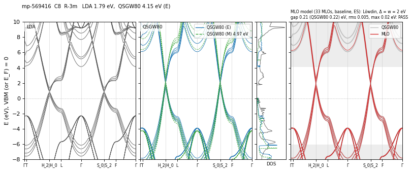

**mp-570002** C8 — QSGW80 **4.64** N / M 4.59 · path 4.49 eV I differs path<mesh(mesh) — ecalj 989a18637 (tf32, t_tetrakbt -300) — MLO PASS (b2) 64 gap 4.50 rms 0.011 max 0.07 (ecalj fb2da026b)

<small>runs: M 4.59 · N 4.64 (10-05)</small>

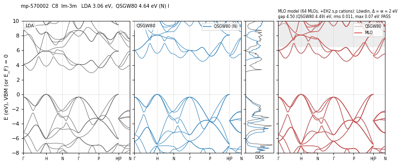

**mp-7801** Ca2Ge2N4 — QSGW80 **4.08** N / M ≈ eV D  — ecalj 989a18637 (tf32, t_tetrakbt -300) — MLO PASS (b1) 52 gap 4.08 rms 0.001 max 0.01 (ecalj fb2da026b)

<small>runs: M 4.11 · N 4.08 (10-04)</small>

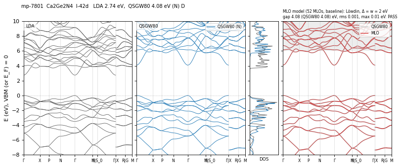

**mp-642725** Ca2H2Cl2O2 — QSGW80 **8.26** N / M ≈ eV D  — ecalj 989a18637 (tf32, t_tetrakbt -300) — MLO PASS (b2) 68 gap 8.26 rms 0.001 max 0.01 (ecalj fb2da026b)

<small>runs: M 8.27 · N 8.26 (10-04)</small>

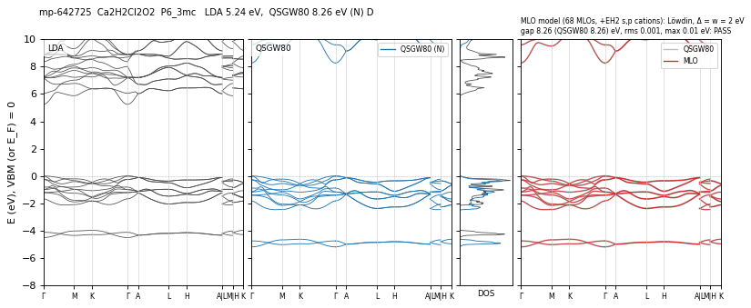

**mp-9122** Ca2P6 — QSGW80 **0.43** N / M ≈ eV D  — ecalj 989a18637 (tf32, t_tetrakbt -300) — MLO PASS (b1) 72 gap 0.43 rms 0.000 max 0.00 (ecalj fb2da026b)

<small>runs: M 0.44 · N 0.43 (10-05)</small>

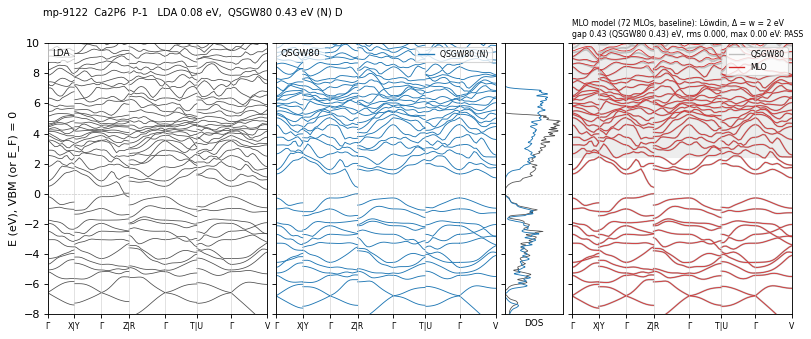

**mp-7204** Ca2Zn2S2O2 — QSGW80 **4.45** N / M ≈ eV D  — ecalj 989a18637 (tf32, t_tetrakbt -300) — MLO PASS (b2) 78 gap 4.45 rms 0.001 max 0.01 (ecalj fb2da026b)

<small>runs: M 4.42 · N 4.45 (10-04)</small>

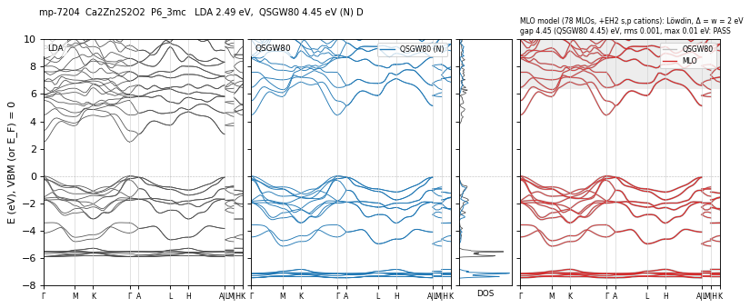

**mp-28553** Ca4I2N2 — QSGW80 **3.62** N / M 3.54 eV D differs — ecalj 989a18637 (tf32, t_tetrakbt -300) — MLO PASS (b1) 62 gap 3.69 rms 0.009 max 0.07 (ecalj fb2da026b)

<small>runs: M 3.54 · N 3.62 (10-05)</small>

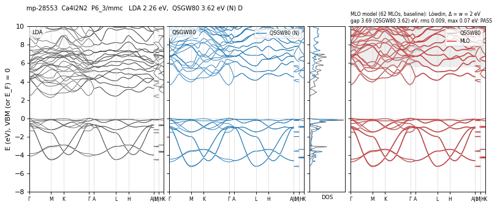

**mp-1079707** Ca4O4 — QSGW80 **4.71** E / M ≈ / R 4.85 eV D differs — ecalj 0601771b4 (tf32, t_tetrakbt -300) with ES, ES rule es-c — MLO PASS (b1, ES) 60 gap 4.71 rms 0.008 max 0.06 (ecalj f09035a49)

<small>runs: M 4.72 · R 4.85 (10-01) · E1 FAIL(1) FAIL(1) (10-05, ES 2) · E FAIL(1) FAIL(1) (10-05, ES 2, es-a) · E 4.71 (10-07, ES 2, es-c)</small>

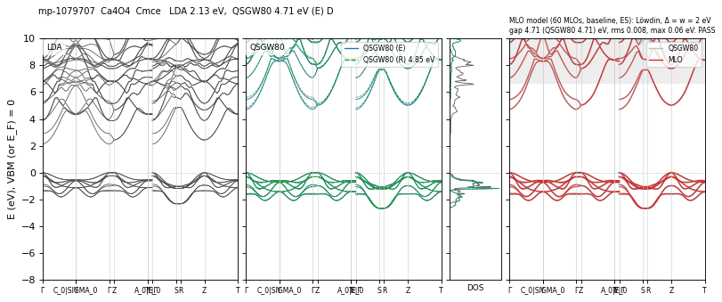

**mp-20463** CaPbF6 — QSGW80 **8.28** E / N ≈ / R ≈ eV I vs2025 — ecalj 0601771b4 (tf32, t_tetrakbt -300) with ES, ES rule es-c — MLO PASS (b1, ES) 58 gap 8.28 rms 0.000 max 0.00 (ecalj d2878d537)

<small>runs: M 10.27 · R 8.32 (10-01) · N 8.32 (10-05) · E 8.28 (10-07, ES 2, es-c)</small>

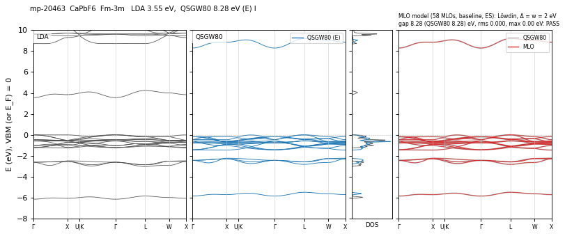

**mp-7922** CaPdF6 — QSGW80 **6.31** N / R ≈ eV I  — ecalj 989a18637 (tf32, t_tetrakbt -300) — MLO PASS (b1) 45 gap 6.31 rms 0.000 max 0.00 (ecalj fb2da026b)

<small>runs: M 6.11 · R 6.31 (10-01) · N 6.31 (10-05)</small>

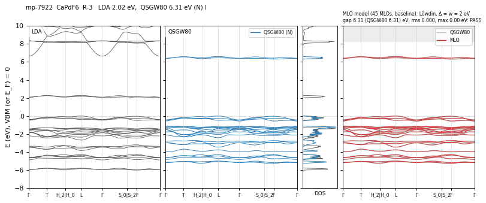

**mp-8255** CaPtF6 — QSGW80 **7.09** N / M 6.61 eV I CHECK — ecalj 989a18637 (tf32, t_tetrakbt -300) — MLO PASS (b1) 45 gap 7.09 rms 0.001 max 0.00 (ecalj fb2da026b)

<small>runs: M 6.61 · N 7.09 (10-03)</small>

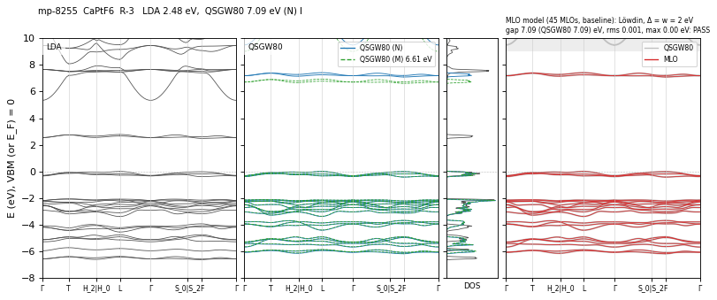

**mp-4782** CaSnF6 — QSGW80 **10.56** E / N 10.61 / R 10.61 eV D differs — ecalj 0601771b4 (tf32, t_tetrakbt -300) with ES, ES rule es-c — MLO PASS (b1, ES) 52 gap 10.56 rms 0.002 max 0.02 (ecalj f09035a49)

<small>runs: M 9.93 · R 10.61 (10-01) · N 10.61 (10-06) · E 10.56 (10-07, ES 2, es-c)</small>

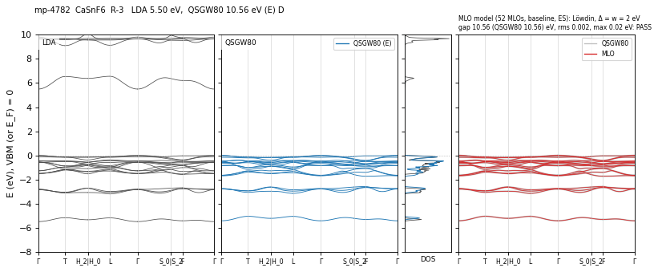

**mp-8224** CaSnF6 — QSGW80 **10.69** E / N ≈ / R ≈ eV I  — ecalj 0601771b4 (tf32, t_tetrakbt -300) with ES, ES rule es-c — MLO PASS (b1, ES) 58 gap 10.69 rms 0.000 max 0.00 (ecalj 0e7afd246)

<small>runs: M 10.69 · R 10.66 (10-01) · N 10.66 (10-05) · E 10.69 (10-07, ES 2, es-c)</small>

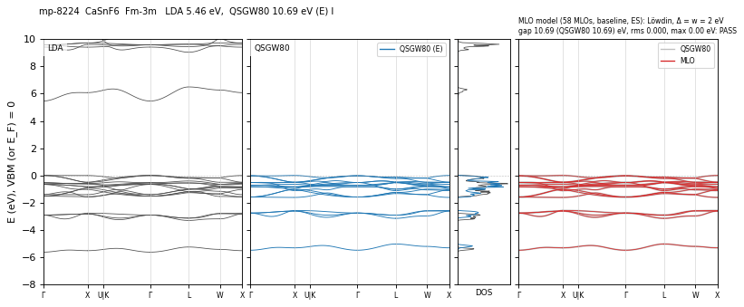

**mp-4953** Cd2Ge2As4 — QSGW80 **0.38** N / M ≈ eV D  — ecalj 989a18637 (tf32, t_tetrakbt -300) — MLO PASS (b1) 72 gap 0.38 rms 0.007 max 0.04 (ecalj fb2da026b)

<small>runs: M 0.38 · N 0.38 (10-03)</small>

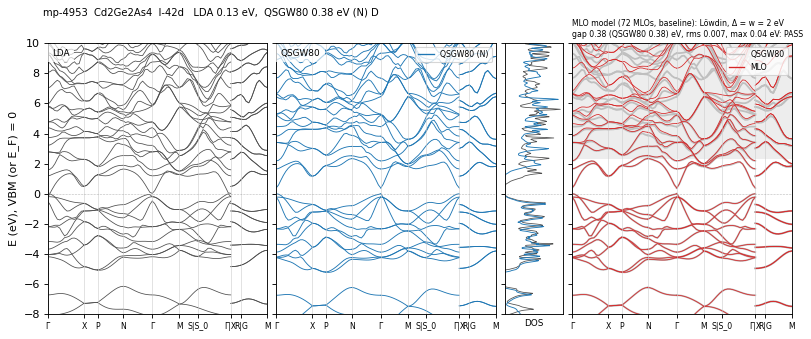

**mp-3668** Cd2Ge2P4 — QSGW80 **1.56** N / M ≈ eV D  — ecalj 989a18637 (tf32, t_tetrakbt -300) — MLO PASS (b1) 72 gap 1.56 rms 0.006 max 0.05 (ecalj fb2da026b)

<small>runs: M 1.57 · N 1.56 (10-05)</small>

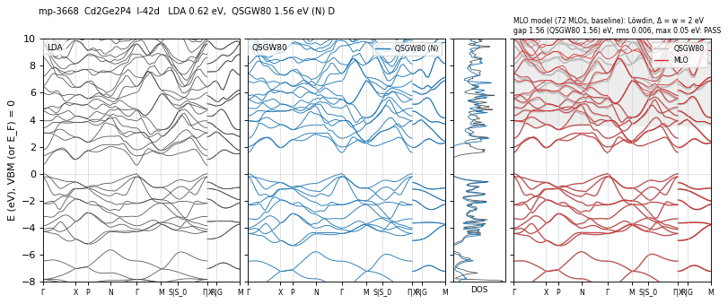

**mp-644222** Cd2H2Cl2O2 — QSGW80 **4.81** N / M 4.75 eV I differs — ecalj 989a18637 (tf32, t_tetrakbt -300) — MLO PASS (b1) 52 gap 4.83 rms 0.005 max 0.05 (ecalj fb2da026b)

<small>runs: M 4.75 · N 4.81 (10-05)</small>

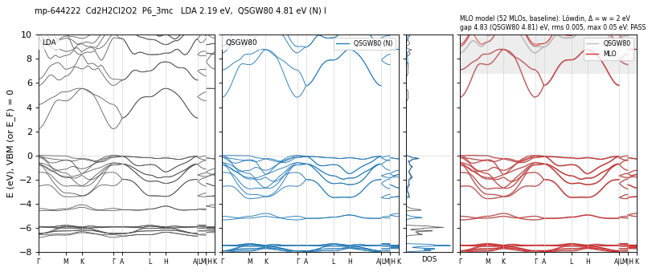

**mp-3078** Cd2Si2As4 — QSGW80 **1.38** N / R ≈ eV D  — ecalj 989a18637 (tf32, t_tetrakbt -300) — MLO PASS (b1) 72 gap 1.38 rms 0.010 max 0.07 (ecalj fb2da026b)

<small>runs: M FAILED · R 1.38 (09-30) · N 1.38 (10-06)</small>

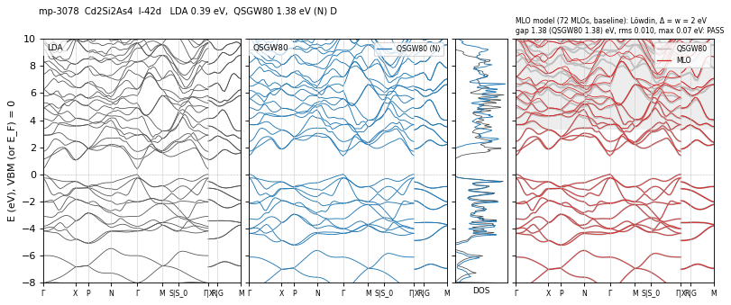

**mp-4666** Cd2Si2P4 — QSGW80 **1.99** N / M ≈ eV D  — ecalj 989a18637 (tf32, t_tetrakbt -300) — MLO PASS (b1) 72 gap 1.99 rms 0.006 max 0.06 (ecalj fb2da026b)

<small>runs: M 1.98 · N 1.99 (10-04)</small>

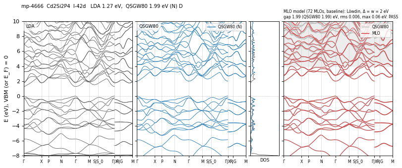

**mp-3829** Cd2Sn2As4 — QSGW80 **0.06** N / M ≈ / R ≈ eV D QSGW<LDA — ecalj 989a18637 (tf32, t_tetrakbt -300) — MLO PASS (b1) 72 gap 0.07 rms 0.007 max 0.05 (ecalj fb2da026b)

*CdSnAs2: QSGW80 (0.05-0.06 eV in M, R and N) below LDA (0.11 eV); experiment 0.26 eV. A small-gap chalcopyrite with s-p band ordering at Γ; to be checked*

<small>runs: M 0.06 · R 0.05 (10-01) · N 0.06 (10-03)</small>

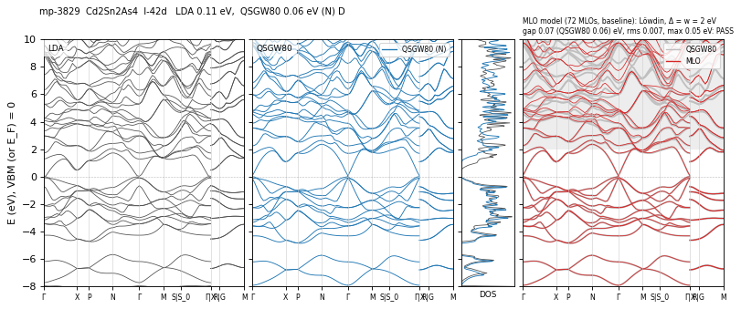

**mp-5213** Cd2Sn2P4 — QSGW80 **1.01** N / M ≈ eV D  — ecalj 989a18637 (tf32, t_tetrakbt -300) — MLO PASS (b1) 72 gap 1.01 rms 0.006 max 0.04 (ecalj fb2da026b)

<small>runs: M 1.00 · N 1.01 (10-03)</small>

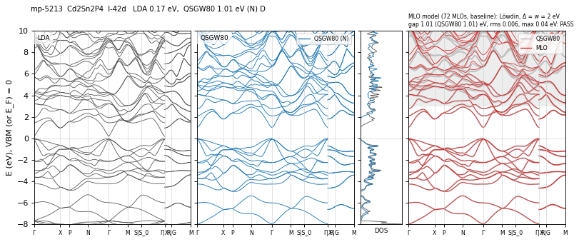

**mp-1087540** CdCu2SiTe4 — QSGW80 **1.06** N / M ≈ eV D  — ecalj 989a18637 (tf32, t_tetrakbt -300) — MLO PASS (b1) 72 gap 1.07 rms 0.009 max 0.07 (ecalj a1d6c0e11)

<small>runs: M 1.08 · N 1.06 (10-03)</small>

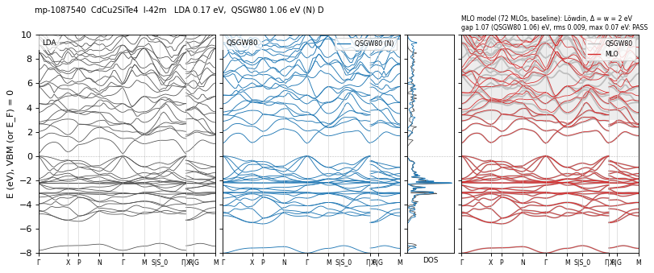

**mp-13984** CdPdF6 — QSGW80 **5.47** N / R ≈ eV D  — ecalj 989a18637 (tf32, t_tetrakbt -300) — MLO PASS (b1) 42 gap 5.47 rms 0.000 max 0.00 (ecalj fb2da026b)

<small>runs: M 4.57 · R 5.47 (10-01) · N 5.47 (10-05)</small>

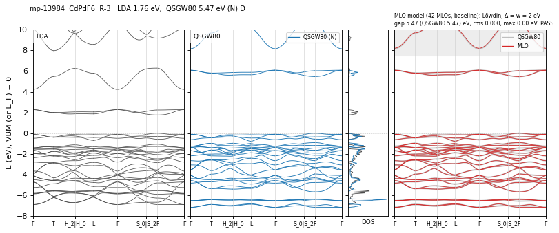

**mp-5858** CdPtF6 — QSGW80 **6.14** N / M 5.73 eV D CHECK — ecalj 989a18637 (tf32, t_tetrakbt -300) — MLO PASS (b1) 42 gap 6.14 rms 0.004 max 0.05 (ecalj fb2da026b)

<small>runs: M 5.73 · N 6.14 (10-04)</small>

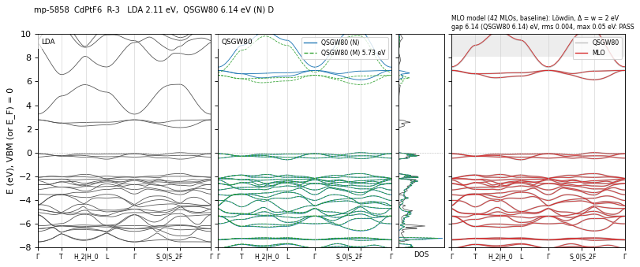

**mp-13907** CdSnF6 — QSGW80 **8.22** N / R ≈ eV D  — ecalj 989a18637 (tf32, t_tetrakbt -300) — MLO PASS (b1) 47 gap 8.23 rms 0.003 max 0.03 (ecalj fb2da026b)

<small>runs: M 5.44 · R 8.22 (10-01) · N 8.22 (10-06)</small>

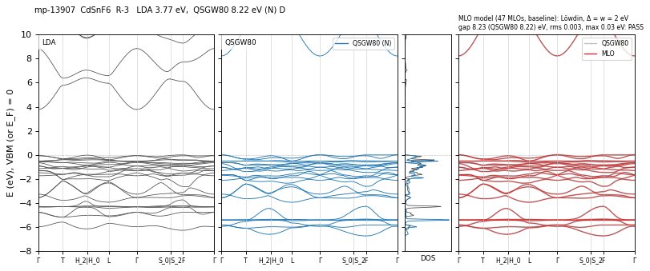

**mp-29504** Cl4F4 — QSGW80 **5.93** E / N 6.01 / R ≈ eV I differs — ecalj 0601771b4 (tf32, t_tetrakbt -300) with ES, ES rule es-c — MLO PASS (b1, ES) 60 gap 5.93 rms 0.000 max 0.00 (ecalj f16f0ea3d)

<small>runs: M 5.70 · R 5.95 (10-01) · N 6.01 (10-06) · E 5.93 (10-06, ES 8, es-c)</small>

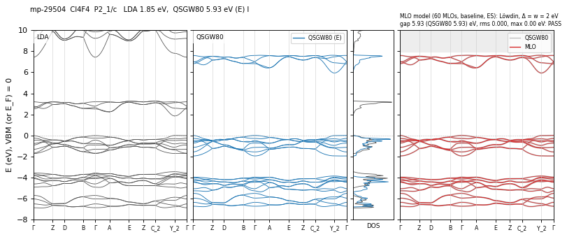

**mp-19178** Co2Ag2O4 — QSGW80 **1.73** N / M 1.84 · path 1.58 eV I differs path<mesh(mesh) — ecalj 989a18637 (tf32, t_tetrakbt -300) — MLO PASS (b1) 52 gap 1.57 rms 0.003 max 0.05 (ecalj fb2da026b)

<small>runs: M 1.84 · N 1.73 (10-05)</small>

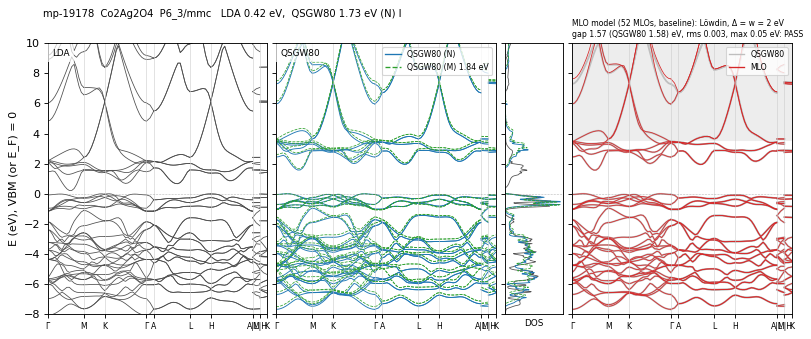

**mp-510421** Cr2O6 — QSGW80 **4.24** N / R ≈ eV I  — ecalj 989a18637 (tf32, t_tetrakbt -300) — MLO PASS (b1) 42 gap 4.23 rms 0.001 max 0.01 (ecalj fb2da026b)

<small>runs: M 4.01 · R 4.24 (10-01) · N 4.24 (10-06)</small>

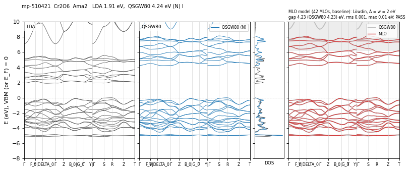

**mp-715566** Cr2O6 — QSGW80 **4.20** N / M 4.37 eV I differs — ecalj 989a18637 (tf32, t_tetrakbt -300) — MLO PASS (b1) 42 gap 4.20 rms 0.001 max 0.01 (ecalj fb2da026b)

<small>runs: M 4.37 · N 4.20 (10-04)</small>

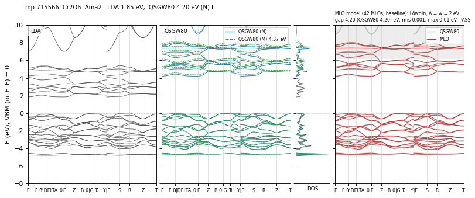

**mp-23454** Cs2Ag2Br4 — QSGW80 **4.16** N / M 4.07 eV I differs — ecalj 989a18637 (tf32, t_tetrakbt -300) — MLO PASS (b2) 86 gap 4.16 rms 0.002 max 0.04 (ecalj fb2da026b)

<small>runs: M 4.07 · N 4.16 (10-05)</small>

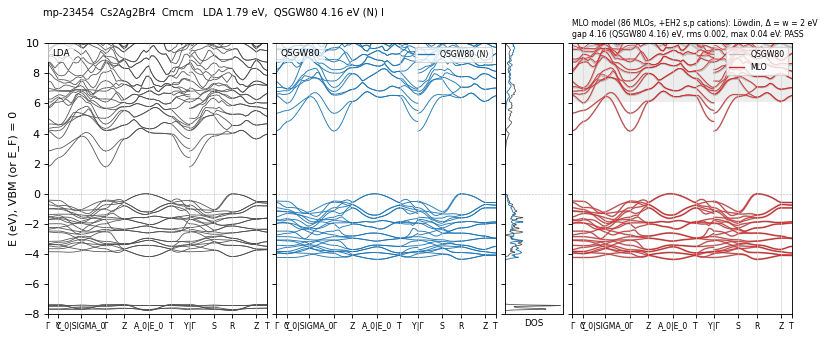

**mp-571100** Cs2Ag2Br4 — QSGW80 **3.92** E / N ≈ / R ≈ eV I  — ecalj 0601771b4 (tf32, t_tetrakbt -300) with ES, ES rule es-c — MLO PASS (b2, ES) 88 gap 3.92 rms 0.000 max 0.00 (ecalj 00792e927)

<small>runs: M 4.14 · R 3.95 (09-30) · N 3.95 (10-06) · E 3.92 (10-07, ES 2, es-c)</small>

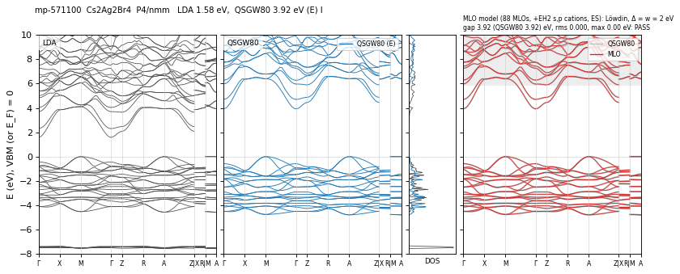

**mp-10101** Cs2Ag2C4 — QSGW80 **4.83** N / M ≈ eV D  — ecalj 989a18637 (tf32, t_tetrakbt -300) — MLO PASS (b2d) 92 gap 4.83 rms 0.004 max 0.03 (ecalj 7d5dfe714)

<small>runs: M 4.83 · N 4.83 (10-03)</small>

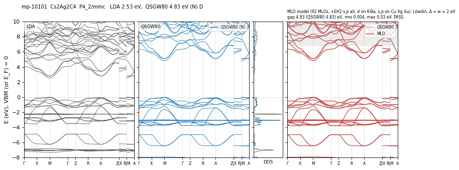

**mp-542772** Cs2Ag2Cl4 — QSGW80 **4.73** N / R ≈ eV I  — ecalj 989a18637 (tf32, t_tetrakbt -300) — MLO PASS (b2) 86 gap 4.73 rms 0.001 max 0.01 (ecalj fb2da026b)

<small>runs: M 4.55 · R 4.73 (10-01) · N 4.73 (10-06)</small>

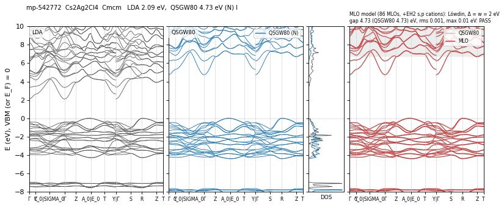

**mp-567558** Cs2Ag2Cl4 — QSGW80 **4.65** E / M ≈ / N ≈ eV I  — ecalj 0601771b4 (tf32, t_tetrakbt -300) with ES, ES rule es-c — MLO PASS (b2, ES) 88 gap 4.65 rms 0.000 max 0.00 (ecalj 6dc7758fc)

<small>runs: M 4.66 · N 4.67 (10-04) · E 4.65 (10-06, ES 2, es-c)</small>

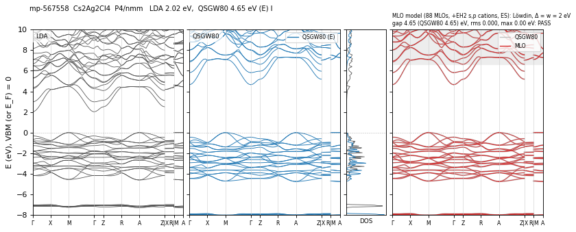

**mp-14069** Cs2Al2O4 — QSGW80 **7.18** N / M 7.06 eV I differs — ecalj 989a18637 (tf32, t_tetrakbt -300) — MLO PASS (b2) 74 gap 7.18 rms 0.002 max 0.03 (ecalj 614ab5eb8)

<small>runs: M 7.06 · N 7.18 (10-05)</small>

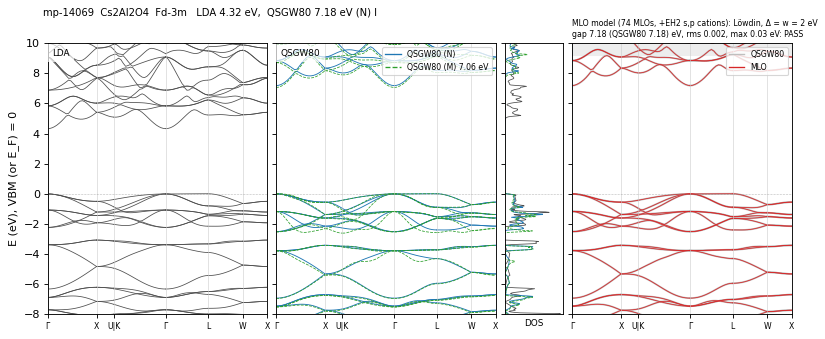

**mp-29506** Cs2Bi2O4 — QSGW80 **4.06** N / M 4.13 eV D differs — ecalj 989a18637 (tf32, t_tetrakbt -300) — MLO PASS (b2) 74 gap 4.11 rms 0.002 max 0.02 (ecalj fb2da026b)

<small>runs: M 4.13 · N 4.06 (10-03)</small>

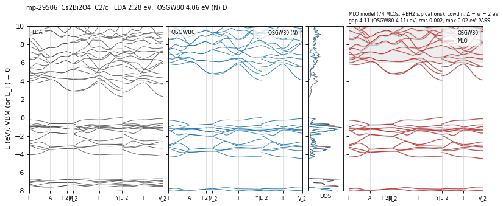

**mp-552131** Cs2Cl2O4 — QSGW80 **5.92** N / M 5.56 eV I CHECK — ecalj 989a18637 (tf32, t_tetrakbt -300) — MLO PASS (b2d) 102 gap 5.92 rms 0.002 max 0.04 (ecalj 7d5dfe714)

<small>runs: M 5.56 · N 5.92 (10-05)</small>

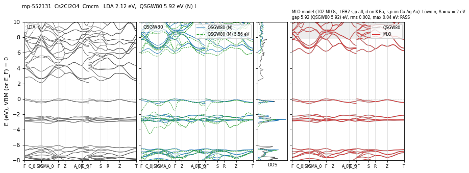

**mp-553310** Cs2Cu2O4 — QSGW80 **3.47** N / M 3.15 eV I CHECK — ecalj 989a18637 (tf32, t_tetrakbt -300) — MLO PASS (b2) 66 gap 3.47 rms 0.000 max 0.00 (ecalj fb2da026b)

<small>runs: M 3.15 · N 3.47 (10-05)</small>

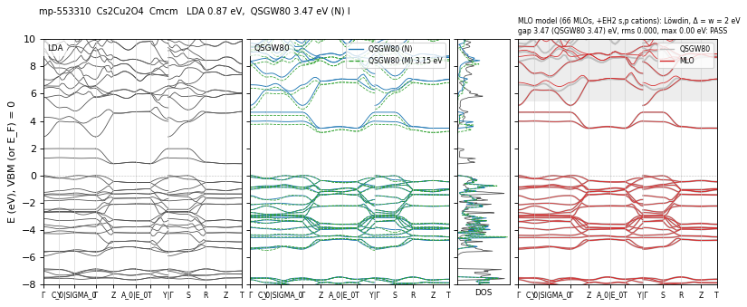

**mp-5038** Cs2Ga2S4 — QSGW80 **4.96** E / M ≈ / N 5.02 eV I differs — ecalj 0601771b4 (tf32, t_tetrakbt -300) with ES, ES rule es-c — MLO PASS (b2, ES) 106 gap 4.96 rms 0.003 max 0.02 (ecalj 6dc7758fc)

<small>runs: M 4.98 · N 5.02 (10-05) · E 4.96 (10-06, ES 2, es-c)</small>

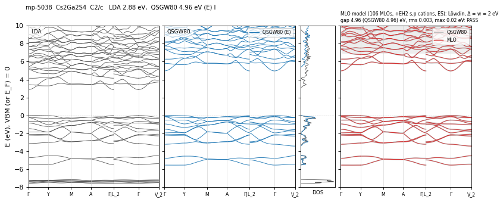

**mp-24668** Cs2H2F4 — QSGW80 **10.66** N / R ≈ eV D  — ecalj 989a18637 (tf32, t_tetrakbt -300) — MLO PASS (b2) 66 gap 10.66 rms 0.005 max 0.06 (ecalj fb2da026b)

<small>runs: M 10.45 · R 10.66 (10-01) · N 10.66 (10-06)</small>

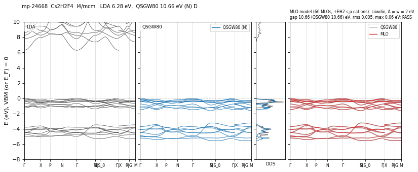

**mp-23057** Cs2Li2Br4 — QSGW80 **6.70** E / M 7.02 / N 6.77 eV I CHECK — ecalj 0601771b4 (tf32, t_tetrakbt -300) with ES, ES rule es-c — MLO PASS (b2, ES) 86 gap 6.70 rms 0.002 max 0.02 (ecalj 27d52b5af)

<small>runs: M 7.02 · N 6.77 (10-05) · E 6.70 (10-07, ES 2, es-c)</small>

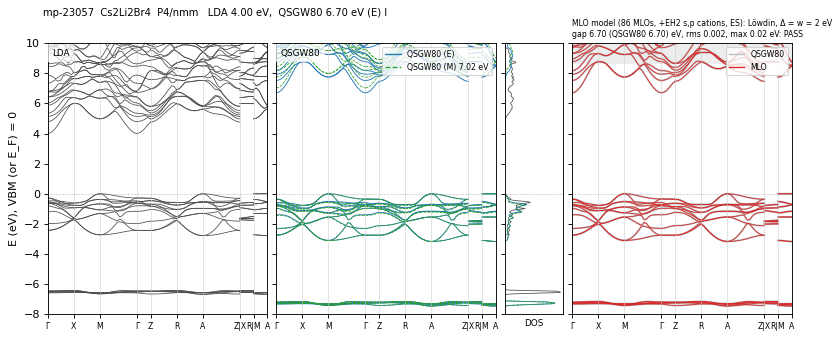

**mp-23364** Cs2Li2Cl4 — QSGW80 **7.90** E / M 7.84 / N 7.96 eV I differs — ecalj 0601771b4 (tf32, t_tetrakbt -300) with ES, ES rule es-c — MLO PASS (b2, ES) 86 gap 7.90 rms 0.001 max 0.01 (ecalj f09035a49)

<small>runs: M 7.84 · N 7.96 (10-03) · E 7.90 (10-07, ES 2, es-c)</small>

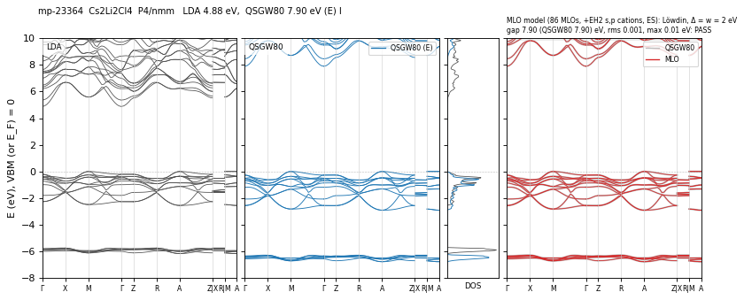

**mp-510557** Cs2N6 — QSGW80 **6.65** N / R ≈ eV I  — ecalj 989a18637 (tf32, t_tetrakbt -300) — MLO PASS (b2d) 92 gap 6.65 rms 0.005 max 0.08 (ecalj fb2da026b)

<small>runs: M FAILED · R 6.65 (09-30) · N 6.65 (10-05)</small>

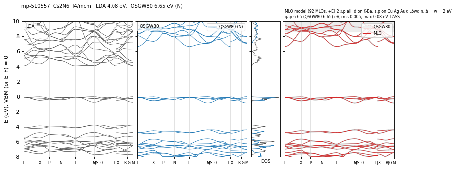

**mp-8978** Cs2Nb2N4 — QSGW80 **2.54** N / M ≈ eV I  — ecalj 989a18637 (tf32, t_tetrakbt -300) — MLO PASS (b2) 66 gap 2.54 rms 0.001 max 0.00 (ecalj fb2da026b)

<small>runs: M 2.50 · N 2.54 (10-04)</small>

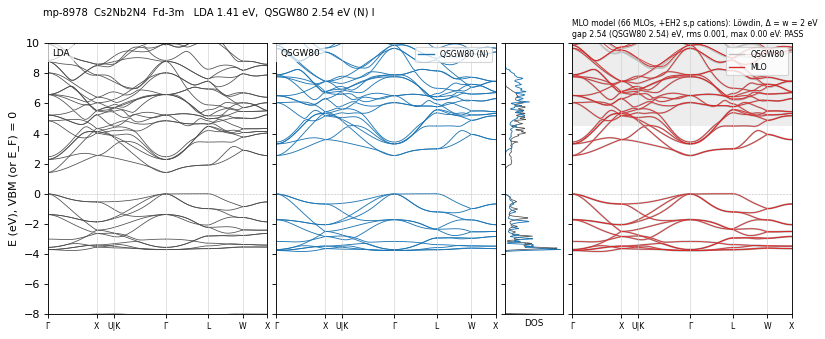

**mp-510273** Cs2Sb2O4 — QSGW80 **4.31** N / R ≈ eV I  — ecalj 989a18637 (tf32, t_tetrakbt -300) — MLO PASS (b2all) 90 gap 4.44 rms 0.002 max 0.02 (ecalj fb2da026b)

<small>runs: M 4.37 · R 4.31 (10-01) · N 4.31 (10-06)</small>

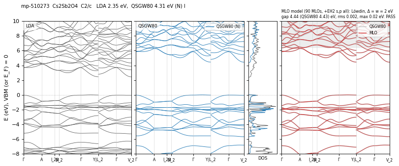

**mp-1079694** Cs4I4 — QSGW80 **5.41** M eV D N:TIMEOUT — ecalj 2026-04/05 (~/bin2, all-TF32 --mp) — MLO PASS (b2all) 116 gap 5.43 rms 0.003 max 0.02 (ecalj 27d52b5af)

*N timed out (2 h) at iteration 3 with 5.43 eV, agreeing with M 5.41; bands from that iteration (the May band plot was of the April iteration 5, 3.30 eV)*

<small>runs: M 5.41 · N 5.43 TIMEOUT (10-03) · N SKIP SKIP (10-04)</small>

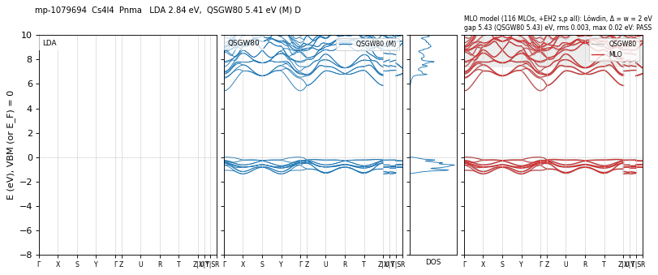

**mp-8361** Cs4Te4 — QSGW80 **2.53** R / N ≈ eV I N:TIMEOUT — ecalj 989a18637 (fp32, t_tetrakbt +300) — MLO PASS (b2all) 116 gap 2.53 rms 0.011 max 0.09 (ecalj 27d52b5af)

<small>runs: M 2.44 · R 2.53 (09-30) · N 2.52 TIMEOUT (10-06)</small>

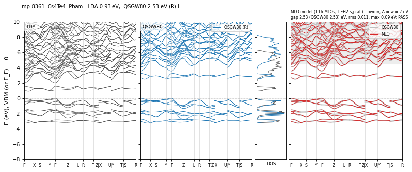

**mp-9820** CsAsF6 — QSGW80 **10.87** N / M 10.66 eV D CHECK — ecalj 989a18637 (tf32, t_tetrakbt -300) — MLO PASS (b2) 50 gap 10.88 rms 0.001 max 0.00 (ecalj fb2da026b)

<small>runs: M 10.66 · N 10.87 (10-05)</small>

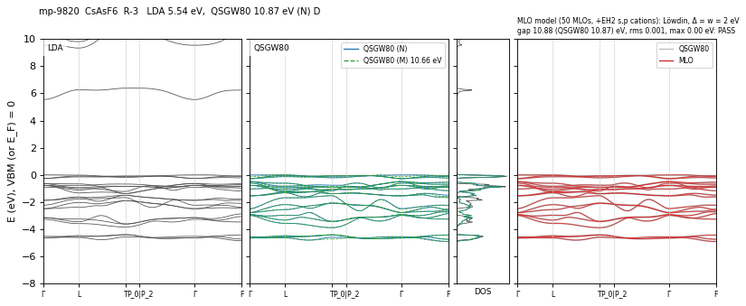

**mp-27422** CsBiF6 — QSGW80 **7.08** N / R ≈ eV I  — ecalj 989a18637 (tf32, t_tetrakbt -300) — MLO PASS (b1) 51 gap 7.09 rms 0.001 max 0.01 (ecalj fb2da026b)

<small>runs: M 7.47 · R 7.08 (10-01) · N 7.08 (10-06)</small>

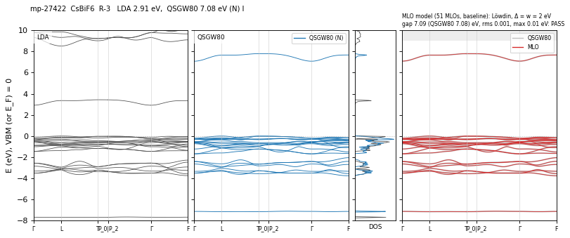

**mp-541226** CsBrF6 — QSGW80 **7.20** N / R ≈ eV D  — ecalj 989a18637 (tf32, t_tetrakbt -300) — MLO PASS (b1) 46 gap 7.20 rms 0.002 max 0.02 (ecalj fb2da026b)

<small>runs: M 8.20 · R 7.19 (10-01) · N 7.20 (10-06)</small>

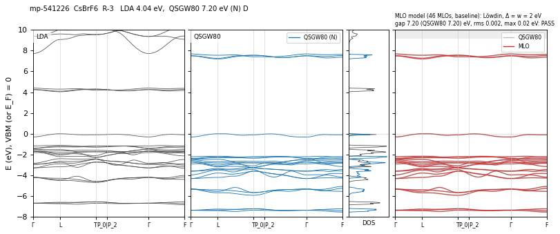

**mp-1079080** CsCd4As3 — QSGW80 **0.80** E / M ≈ / N ≈ eV D  — ecalj 0601771b4 (tf32, t_tetrakbt -300) with ES, ES rule es-c — MLO PASS (b2, ES) 95 gap 0.80 rms 0.001 max 0.01 (ecalj d2878d537)

<small>runs: M 0.80 · N 0.80 (10-04) · E 0.80 (10-07, ES 0, es-c)</small>

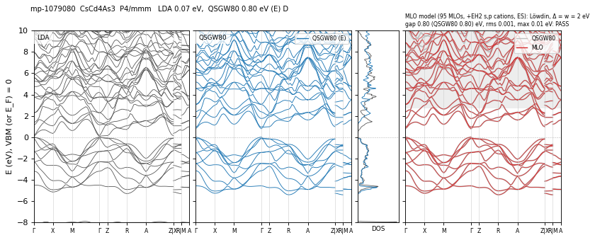

**mp-11980** CsNbF6 — QSGW80 **9.23** N / R ≈ eV I  — ecalj 989a18637 (tf32, t_tetrakbt -300) — MLO PASS (b1) 46 gap 9.23 rms 0.001 max 0.01 (ecalj fb2da026b)

<small>runs: M 9.14 · R 9.23 (10-01) · N 9.23 (10-06)</small>

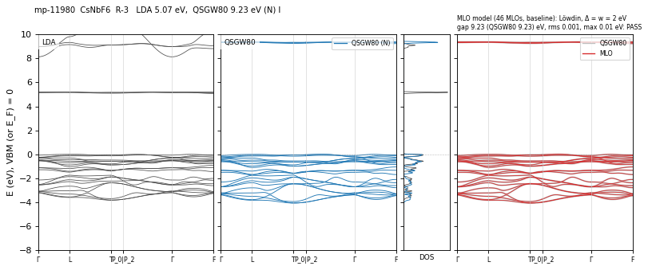

**mp-9636** CsSbF6 — QSGW80 **10.20** N / M 9.52 / R ≈ eV I CHECK — ecalj 989a18637 (tf32, t_tetrakbt -300) — MLO PASS (b2) 50 gap 10.20 rms 0.001 max 0.00 (ecalj fb2da026b)

<small>runs: M 9.52 · R 10.20 (10-01) · N 10.20 (10-03)</small>

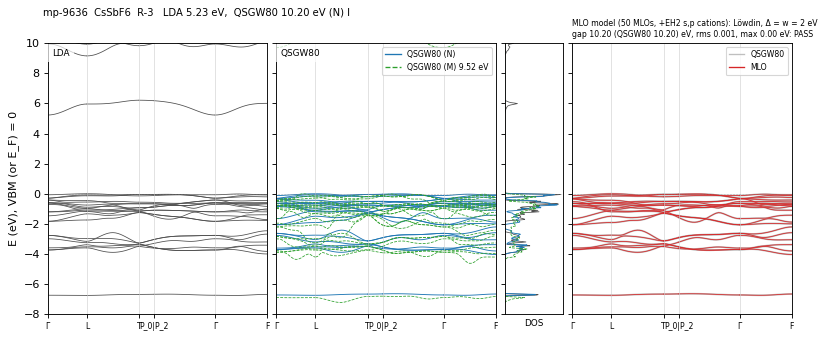

**mp-1101093** CsZn4P3 — QSGW80 **1.11** N / M ≈ eV D  — ecalj 989a18637 (tf32, t_tetrakbt -300) — MLO PASS (b1) 75 gap 1.11 rms 0.007 max 0.08 (ecalj a1d6c0e11)

<small>runs: M 1.10 · N 1.11 (10-04)</small>

**mp-12954** Cu2B2S4 — QSGW80 **2.66** N / M ≈ eV D  — ecalj 989a18637 (tf32, t_tetrakbt -300) — MLO PASS (b1) 62 gap 2.66 rms 0.001 max 0.02 (ecalj a1d6c0e11)

<small>runs: M 2.68 · N 2.66 (10-03)</small>

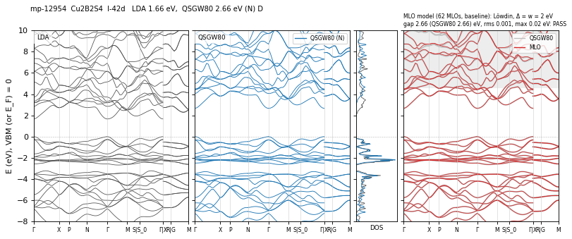

**mp-983565** Cu2B2Se4 — QSGW80 **2.29** N / M ≈ eV D  — ecalj 989a18637 (tf32, t_tetrakbt -300) — MLO PASS (b1) 62 gap 2.29 rms 0.005 max 0.05 (ecalj fb2da026b)

<small>runs: M 2.27 · N 2.29 (10-04)</small>

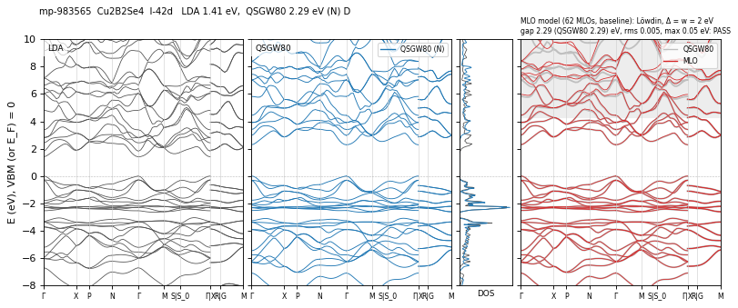

**mp-23116** Cu2Bi2Se2O2 — QSGW80 **0.85** N / M ≈ eV I  — ecalj 989a18637 (tf32, t_tetrakbt -300) — MLO PASS (b1) 62 gap 0.82 rms 0.000 max 0.00 (ecalj fb2da026b)

<small>runs: M 0.85 · N 0.85 (10-05)</small>

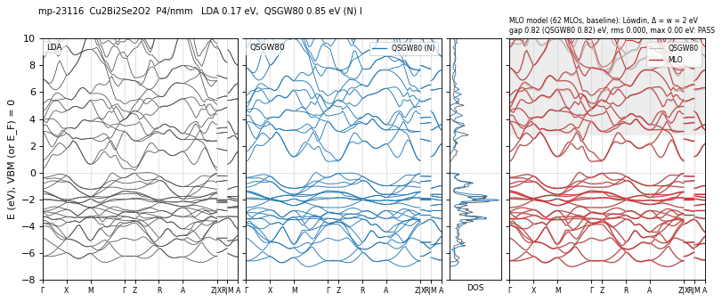

**mp-562090** Cu2C2Cl2O2 — QSGW80 **5.51** N / M 5.45 eV I differs — ecalj 989a18637 (tf32, t_tetrakbt -300) — MLO PASS (b2all) 76 gap 5.47 rms 0.001 max 0.01 (ecalj fb2da026b)

<small>runs: M 5.45 · N 5.51 (10-03)</small>

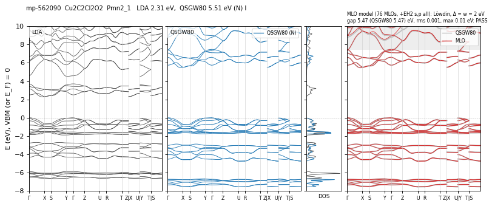

**mp-559044** Cu2C2S2N2 — QSGW80 **3.41** E / M 3.56 / N 3.56 eV D differs — ecalj 0601771b4 (tf32, t_tetrakbt -300) with ES, ES rule es-c — MLO PASS (b2all, ES) 78 gap 3.41 rms 0.001 max 0.07 (ecalj 6dc7758fc)

<small>runs: M 3.56 · N 3.56 (10-04) · E 3.41 (10-06, ES 2, es-c)</small>

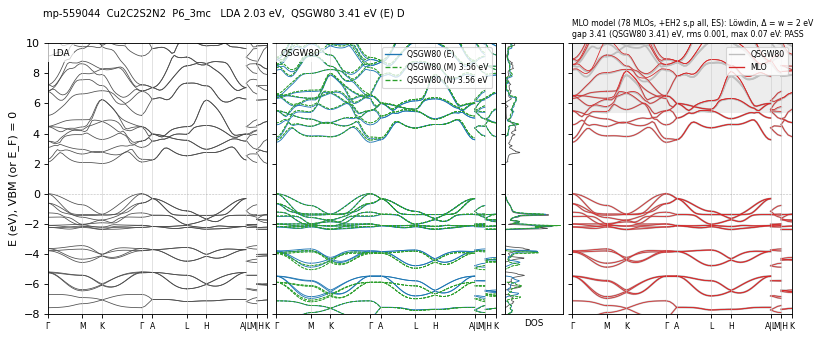

**mp-1078469** Cu2P2N4 — QSGW80 **3.12** N / M ≈ eV I  — ecalj 989a18637 (tf32, t_tetrakbt -300) — MLO PASS (b1) 52 gap 3.09 rms 0.001 max 0.02 (ecalj fb2da026b)

<small>runs: M 3.15 · N 3.12 (10-05)</small>

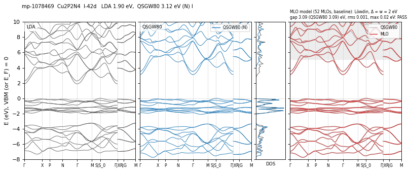

**mp-557510** Cu3TeS3Cl — QSGW80 **1.67** N / M ≈ eV I  — ecalj 989a18637 (tf32, t_tetrakbt -300) — MLO PASS (b1) 72 gap 1.67 rms 0.003 max 0.07 (ecalj fb2da026b)

<small>runs: M 1.65 · N 1.67 (10-04)</small>

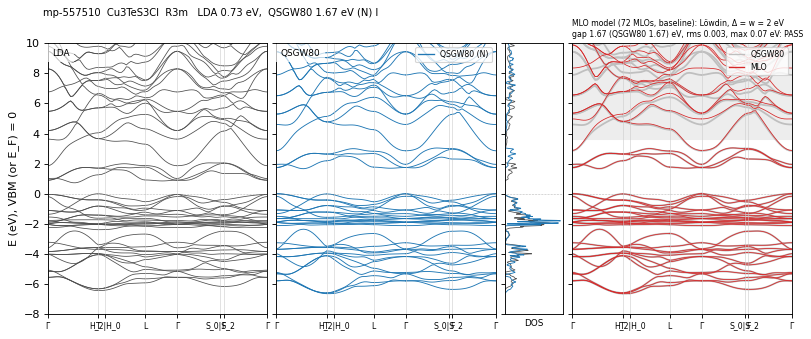

**mp-871** Fe4Si4 — QSGW80 **0.28** N / M ≈ eV I  — ecalj 989a18637 (tf32, t_tetrakbt -300) — MLO PASS (b1) 72 gap 0.28 rms 0.000 max 0.00 (ecalj fb2da026b)

<small>runs: M 0.28 · N 0.28 (10-05)</small>

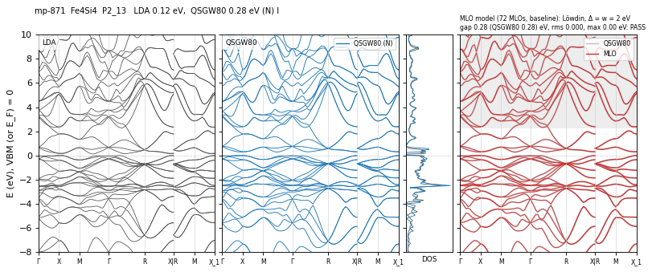

**mp-5342** Ga2Ag2S4 — QSGW80 **2.33** N / M ≈ eV D  — ecalj 989a18637 (tf32, t_tetrakbt -300) — MLO PASS (b1) 82 gap 2.34 rms 0.001 max 0.01 (ecalj fb2da026b)

<small>runs: M 2.37 · N 2.33 (10-05)</small>

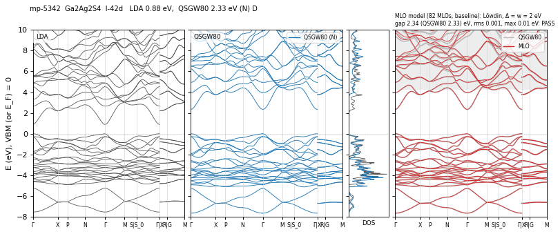

**mp-556916** Ga2Ag2S4 — QSGW80 **2.24** N / M ≈ eV D  — ecalj 989a18637 (tf32, t_tetrakbt -300) — MLO PASS (b1) 82 gap 2.24 rms 0.002 max 0.01 (ecalj fb2da026b)

<small>runs: M 2.24 · N 2.24 (10-05)</small>

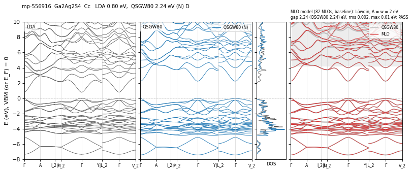

**mp-5518** Ga2Ag2Se4 — QSGW80 **1.50** N / M 1.55 eV D differs — ecalj 989a18637 (tf32, t_tetrakbt -300) — MLO PASS (b1) 82 gap 1.51 rms 0.002 max 0.02 (ecalj fb2da026b)

<small>runs: M 1.55 · N 1.50 (10-03)</small>

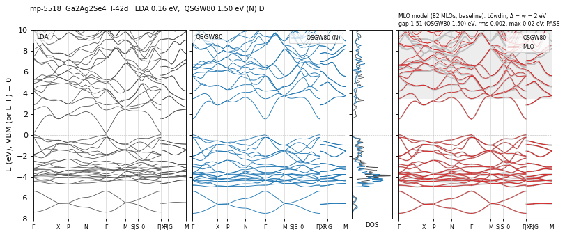

**mp-4899** Ga2Ag2Te4 — QSGW80 **1.22** N / M ≈ eV D  — ecalj 989a18637 (tf32, t_tetrakbt -300) — MLO PASS (b1) 82 gap 1.25 rms 0.008 max 0.10 (ecalj fb2da026b)

<small>runs: M 1.24 · N 1.22 (10-03)</small>

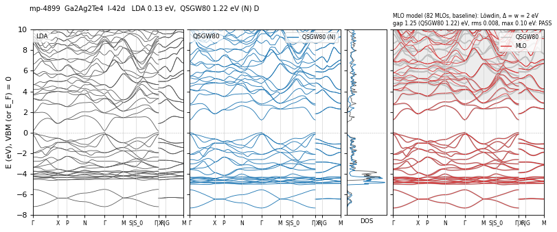

**mp-30952** Ga2Cl6 — QSGW80 **7.24** E / N 7.35 / R 7.35 eV D differs — ecalj 0601771b4 (tf32, t_tetrakbt -300) with ES, ES rule es-c — MLO PASS (b1, ES) 88 gap 7.25 rms 0.004 max 0.04 (ecalj f09035a49)

<small>runs: M 7.68 · R 7.35 (10-01) · N 7.35 (10-06) · E 7.24 (10-07, ES 6, es-c)</small>

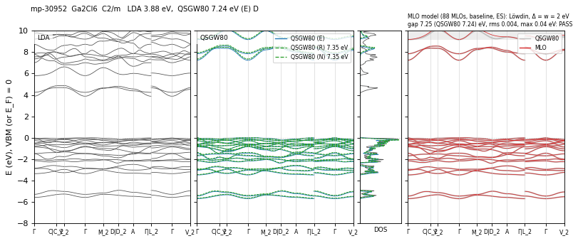

**mp-571266** Ga2Cl6 — QSGW80 **7.49** E / N 7.68 / R 7.68 eV I differs N:TIMEOUT — ecalj 0601771b4 (tf32, t_tetrakbt -300) with ES, ES rule es-c — MLO PASS (b1, ES) 93 gap 7.50 rms 0.002 max 0.01 (ecalj 00792e927)

<small>runs: M 7.45 · R 7.68 (09-30) · N 7.68 TIMEOUT (10-06) · E 7.49 (10-07, ES 5, es-c)</small>

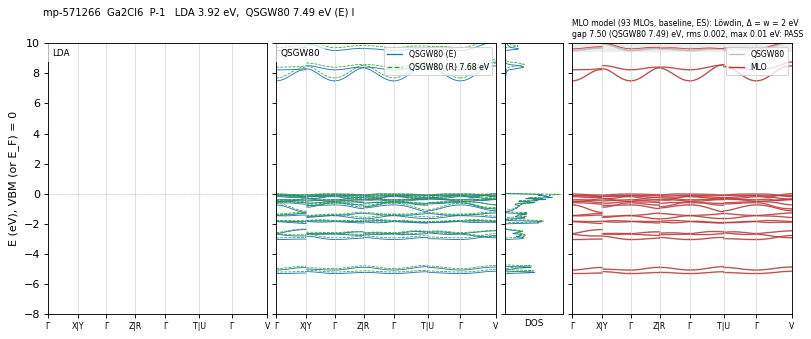

**mp-5238** Ga2Cu2S4 — QSGW80 **1.95** N / M ≈ eV D  — ecalj 989a18637 (tf32, t_tetrakbt -300) — MLO PASS (b1) 82 gap 1.97 rms 0.002 max 0.02 (ecalj fb2da026b)

<small>runs: M 1.93 · N 1.95 (10-05)</small>

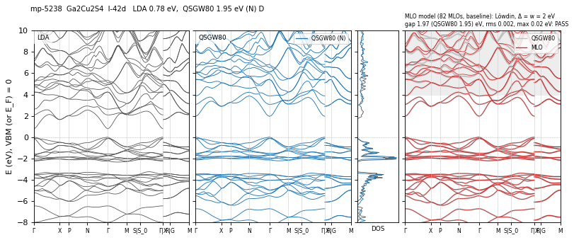

**mp-4840** Ga2Cu2Se4 — QSGW80 **1.22** N / M ≈ eV D  — ecalj 989a18637 (tf32, t_tetrakbt -300) — MLO PASS (b1) 82 gap 1.24 rms 0.003 max 0.02 (ecalj fb2da026b)

<small>runs: M 1.23 · N 1.22 (10-04)</small>

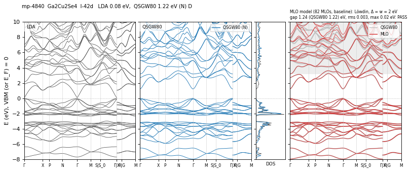

**mp-3839** Ga2Cu2Te4 — QSGW80 **1.24** N / M ≈ eV D  — ecalj 989a18637 (tf32, t_tetrakbt -300) — MLO PASS (b2) 90 gap 1.24 rms 0.002 max 0.02 (ecalj fb2da026b)

<small>runs: M 1.22 · N 1.24 (10-04)</small>

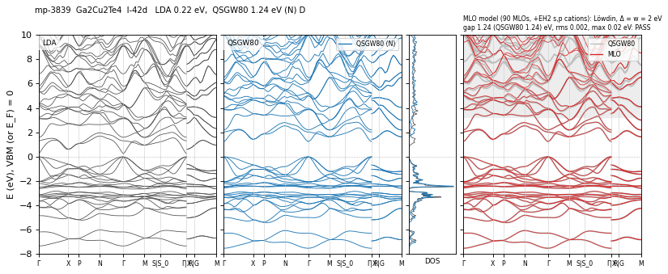

**mp-588** Ga2F6 — QSGW80 **9.77** N / R ≈ eV I  — ecalj 989a18637 (tf32, t_tetrakbt -300) — MLO PASS (b1) 52 gap 9.81 rms 0.007 max 0.06 (ecalj fb2da026b)

<small>runs: M 7.84 · R 9.77 (10-01) · N 9.77 (10-06)</small>

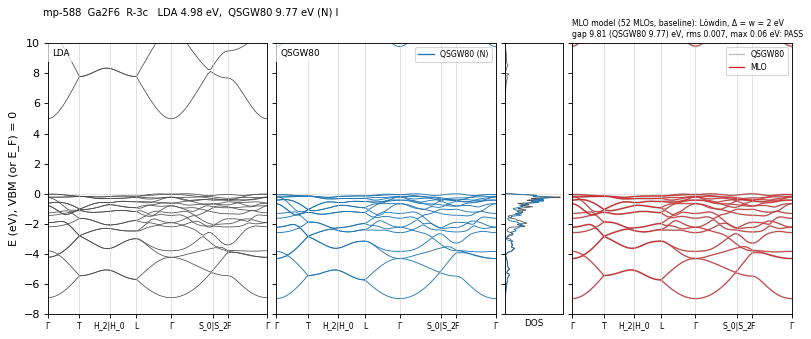

**mp-23803** Ga2H2O4 — QSGW80 **5.84** N / M ≈ eV D  — ecalj 989a18637 (tf32, t_tetrakbt -300) — MLO PASS (b1) 52 gap 5.84 rms 0.001 max 0.01 (ecalj fb2da026b)

<small>runs: M 5.85 · N 5.84 (10-03)</small>

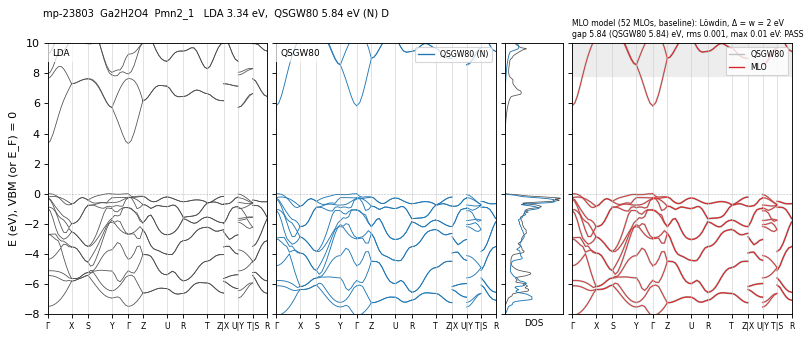

**mp-2507** Ga4S4 — QSGW80 **3.07** N / M ≈ eV I  — ecalj 989a18637 (tf32, t_tetrakbt -300) — MLO PASS (b2) 108 gap 3.07 rms 0.004 max 0.02 (ecalj fb2da026b)

<small>runs: M 3.08 · N 3.07 (10-04)</small>

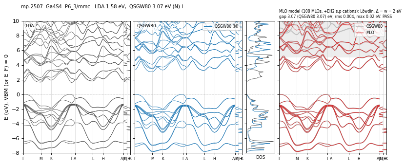

**mp-556742** Ga4S4 — QSGW80 **3.15** N / M ≈ eV I  — ecalj 989a18637 (tf32, t_tetrakbt -300) — MLO PASS (b2) 108 gap 3.16 rms 0.003 max 0.02 (ecalj fb2da026b)

<small>runs: M 3.18 · N 3.15 (10-04)</small>

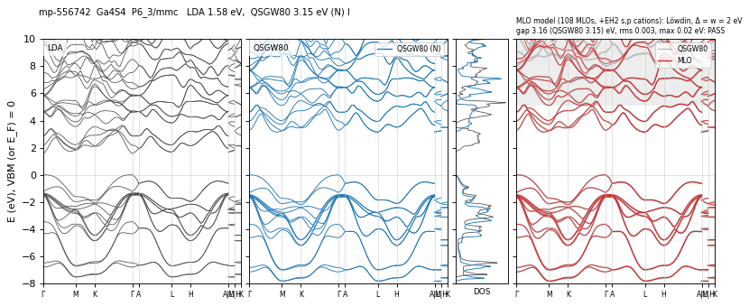

**mp-1572** Ga4Se4 — QSGW80 **2.32** E / M ≈ / N ≈ eV D  — ecalj 0601771b4 (tf32, t_tetrakbt -300) with ES, ES rule es-c — MLO PASS (b2, ES) 108 gap 2.32 rms 0.004 max 0.02 (ecalj d2878d537)

<small>runs: M 2.31 · N 2.32 (10-04) · E 2.32 (10-07, ES 0, es-c)</small>

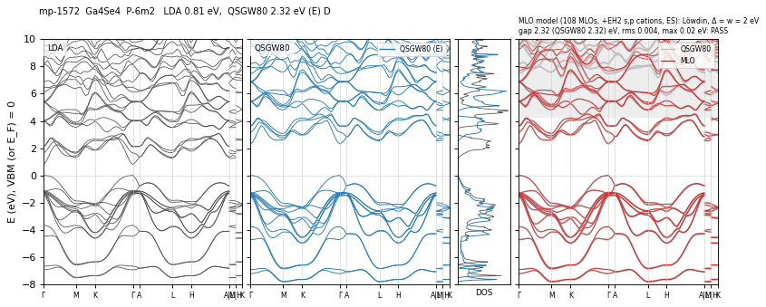

**mp-1943** Ga4Se4 — QSGW80 **2.34** N / M ≈ eV D  — ecalj 989a18637 (tf32, t_tetrakbt -300) — MLO PASS (b2) 108 gap 2.35 rms 0.004 max 0.03 (ecalj fb2da026b)

<small>runs: M 2.29 · N 2.34 (10-04)</small>

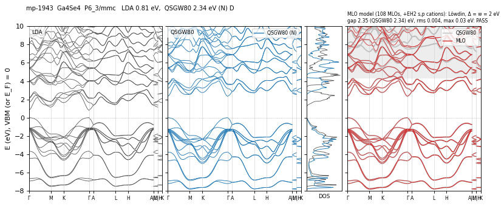

**mp-10009** Ga4Te4 — QSGW80 **1.44** E / M 1.39 / N ≈ eV I differs — ecalj 0601771b4 (tf32, t_tetrakbt -300) with ES, ES rule es-c — MLO PASS (b1, ES) 94 gap 1.44 rms 0.013 max 0.09 (ecalj f09035a49)

<small>runs: M 1.39 · N 1.39 (10-03) · E 1.44 (10-07, ES 2, es-c)</small>

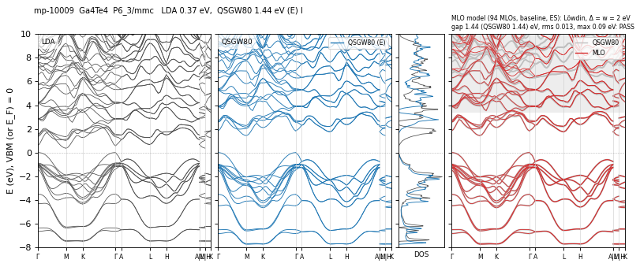

**mp-1025397** Ge4Ru4 — QSGW80 **0.26** N / M ≈ eV I  — ecalj 989a18637 (tf32, t_tetrakbt -300) — MLO PASS (b1) 72 gap 0.27 rms 0.000 max 0.00 (ecalj fb2da026b)

<small>runs: M 0.27 · N 0.26 (10-05)</small>

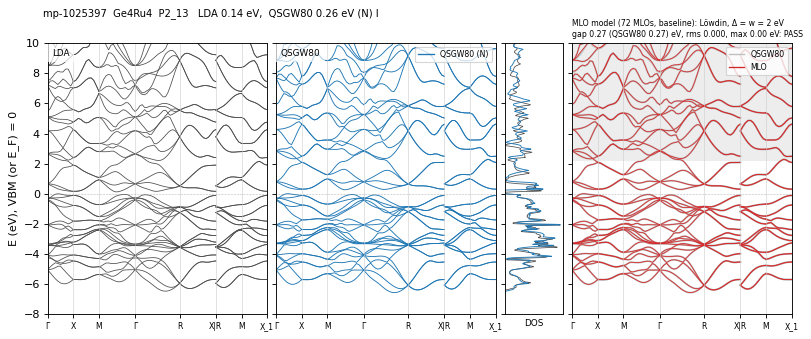

**mp-2242** Ge4S4 — QSGW80 **1.70** N / M ≈ eV I  — ecalj 989a18637 (tf32, t_tetrakbt -300) — MLO PASS (b1) 72 gap 1.71 rms 0.001 max 0.01 (ecalj fb2da026b)

<small>runs: M 1.70 · N 1.70 (10-05)</small>

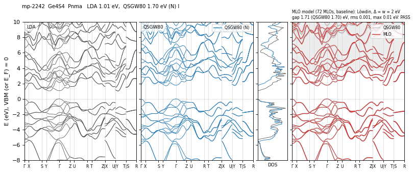

**mp-700** Ge4Se4 — QSGW80 **1.39** N / M ≈ eV D  — ecalj 989a18637 (tf32, t_tetrakbt -300) — MLO PASS (b1) 72 gap 1.39 rms 0.001 max 0.01 (ecalj fb2da026b)

<small>runs: M 1.40 · N 1.39 (10-04)</small>

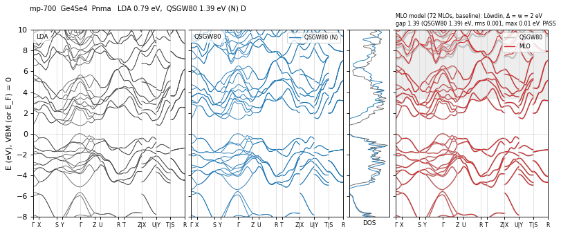

**mp-1080459** Ge4Te4 — QSGW80 **0.73** N / M ≈ eV I  — ecalj 989a18637 (tf32, t_tetrakbt -300) — MLO PASS (b1) 72 gap 0.73 rms 0.002 max 0.02 (ecalj fb2da026b)

<small>runs: M 0.73 · N 0.73 (10-05)</small>

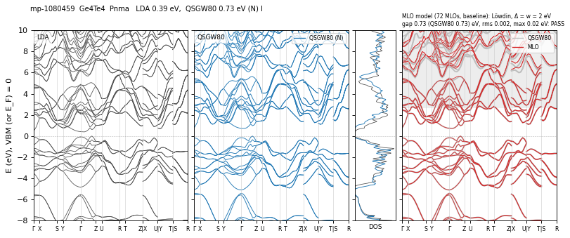

**mp-643364** H2Pb2Cl2O2 — QSGW80 **4.48** N / M 4.37 eV D differs — ecalj 989a18637 (tf32, t_tetrakbt -300) — MLO PASS (b2) 78 gap 4.52 rms 0.001 max 0.01 (ecalj fb2da026b)

<small>runs: M 4.37 · N 4.48 (10-05)</small>

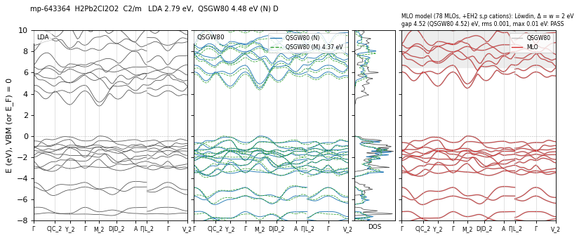

**mp-730101** H8 — QSGW80 **15.52** E / R 15.23 eV D CHECK — ecalj 0601771b4 (tf32, t_tetrakbt -300) with ES, ES rule es-c — MLO FAIR (b2, ES) 80 gap 15.53 rms 0.035 max 0.15 (ecalj d90296348)

<small>runs: M 15.22 · R 15.23 (09-30) · E1 FAIL(1) FAIL(1) (10-05, ES 3) · E FAIL(1) FAIL(1) (10-05, ES 3, es-a) · E FAIL(1) FAIL(1) (10-06, ES 4, es-a) · E 15.52 (10-06, ES 4, es-c)</small>

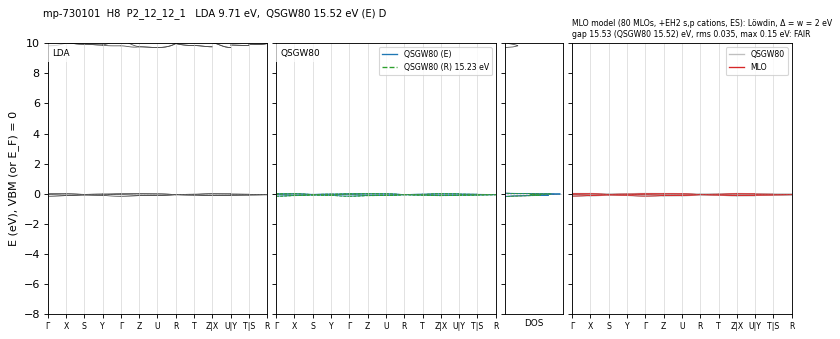

**mp-9922** Hf2S6 — QSGW80 **2.30** N / R ≈ eV I  — ecalj 989a18637 (tf32, t_tetrakbt -300) — MLO PASS (b1) 86 gap 2.30 rms 0.001 max 0.02 (ecalj fb2da026b)

<small>runs: M 2.26 · R 2.30 (09-30) · N 2.30 (10-06)</small>

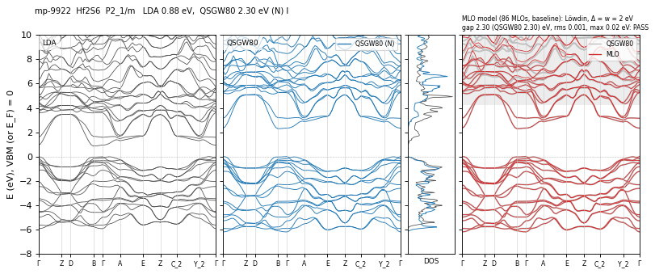

**mp-15622** Hf2Se6 — QSGW80 **1.37** N / M ≈ eV I  — ecalj 989a18637 (tf32, t_tetrakbt -300) — MLO PASS (b1) 86 gap 1.37 rms 0.001 max 0.02 (ecalj 96ec5c1ee)

<small>runs: M 1.38 · N 1.37 (10-05)</small>

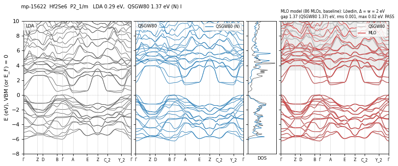

**mp-1224** Hg4O4 — QSGW80 **2.46** N / M ≈ eV I  — ecalj 989a18637 (tf32, t_tetrakbt -300) — MLO PASS (b1) 52 gap 2.45 rms 0.001 max 0.03 (ecalj a1d6c0e11)

<small>runs: M 2.49 · N 2.46 (10-03)</small>

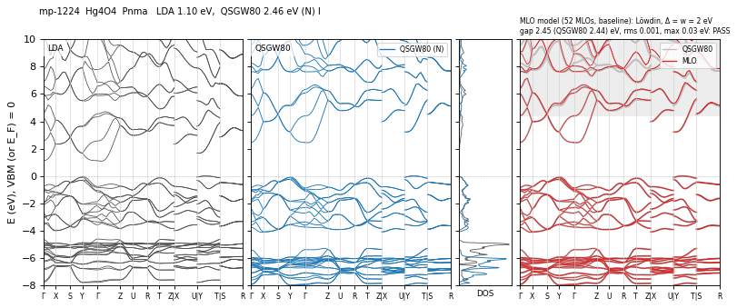

**mp-1546049** I2Cl6 — QSGW80 **3.88** E / M ≈ / N ≈ eV I  — ecalj 0601771b4 (tf32, t_tetrakbt -300) with ES, ES rule es-c — MLO PASS (b1, ES) 80 gap 3.90 rms 0.000 max 0.00 (ecalj d2878d537)

<small>runs: M 3.83 · N 3.90 (10-03) · E 3.88 (10-07, ES 8, es-c)</small>

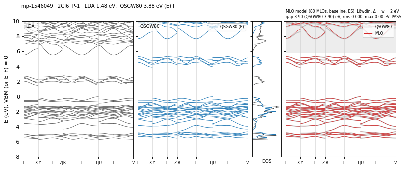

**mp-27729** I2Cl6 — QSGW80 **4.30** E / M ≈ / N 4.37 eV I differs — ecalj 0601771b4 (tf32, t_tetrakbt -300) with ES, ES rule es-c — MLO PASS (b1, ES) 84 gap 4.31 rms 0.000 max 0.00 (ecalj f09035a49)

<small>runs: M 4.35 · N 4.37 (10-04) · E 4.30 (10-07, ES 6, es-c)</small>

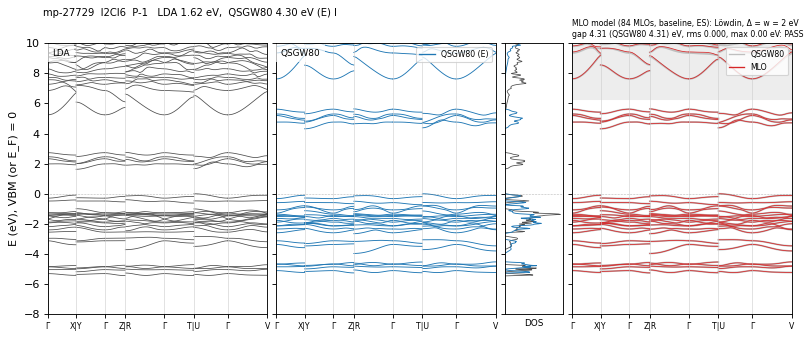

**mp-19833** In2Ag2S4 — QSGW80 **1.52** N / M 1.59 eV D differs — ecalj 989a18637 (tf32, t_tetrakbt -300) — MLO PASS (b1) 82 gap 1.53 rms 0.002 max 0.01 (ecalj fb2da026b)

<small>runs: M 1.59 · N 1.52 (10-05)</small>

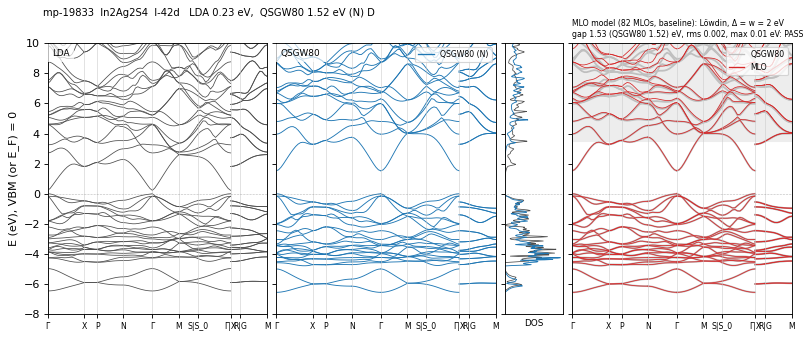

**mp-22386** In2Ag2Te4 — QSGW80 **0.98** N / M ≈ eV D  — ecalj 989a18637 (tf32, t_tetrakbt -300) — MLO PASS (b1) 82 gap 1.01 rms 0.008 max 0.08 (ecalj fb2da026b)

<small>runs: M 0.96 · N 0.98 (10-04)</small>

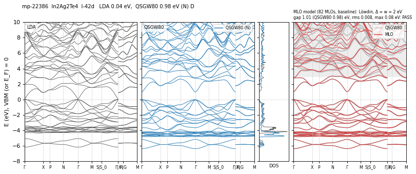

**mp-570219** In2Br6 — QSGW80 **4.61** N / R ≈ eV I  — ecalj 989a18637 (tf32, t_tetrakbt -300) — MLO PASS (b1) 82 gap 4.68 rms 0.007 max 0.06 (ecalj fb2da026b)

<small>runs: M 4.58 · R 4.61 (09-30) · N 4.61 (10-06)</small>

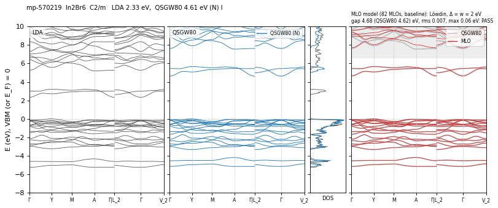

**mp-6949** In2F6 — QSGW80 **8.14** N / R ≈ eV D  — ecalj 989a18637 (tf32, t_tetrakbt -300) — MLO PASS (b1) 52 gap 8.16 rms 0.005 max 0.05 (ecalj fb2da026b)

<small>runs: M 7.06 · R 8.14 (10-01) · N 8.14 (10-06)</small>

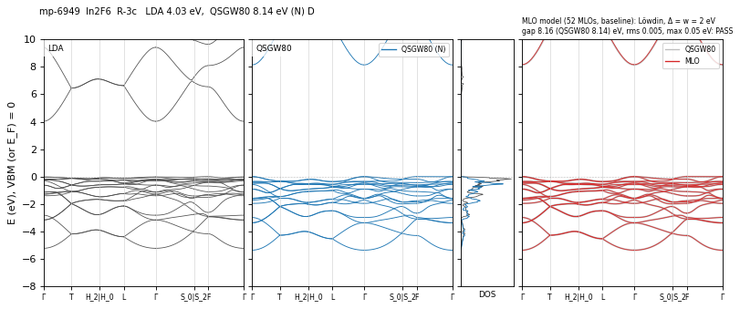

**mp-504535** In2H2O4 — QSGW80 **3.87** N / M ≈ eV D  — ecalj 989a18637 (tf32, t_tetrakbt -300) — MLO PASS (b1) 52 gap 3.87 rms 0.000 max 0.00 (ecalj fb2da026b)

<small>runs: M 3.89 · N 3.87 (10-04)</small>

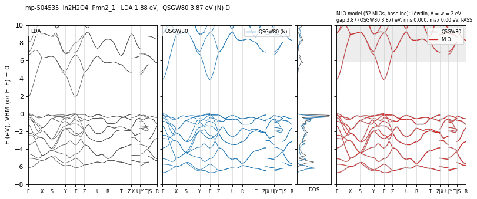

**mp-632711** In2H2O4 — QSGW80 **3.97** N / M 4.06 eV D differs — ecalj 989a18637 (tf32, t_tetrakbt -300) — MLO PASS (b1) 52 gap 3.97 rms 0.001 max 0.00 (ecalj fb2da026b)

<small>runs: M 4.06 · N 3.97 (10-03)</small>

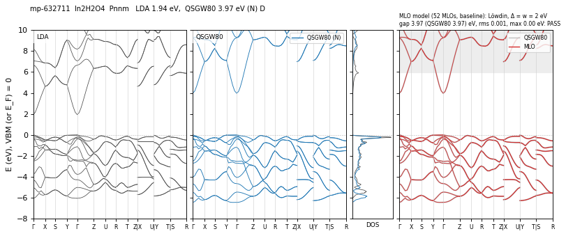

**mp-19795** In4S4 — QSGW80 **2.20** N / M ≈ eV I  — ecalj 989a18637 (tf32, t_tetrakbt -300) — MLO PASS (b1) 92 gap 2.21 rms 0.003 max 0.04 (ecalj fb2da026b)

<small>runs: M 2.20 · N 2.20 (10-05)</small>

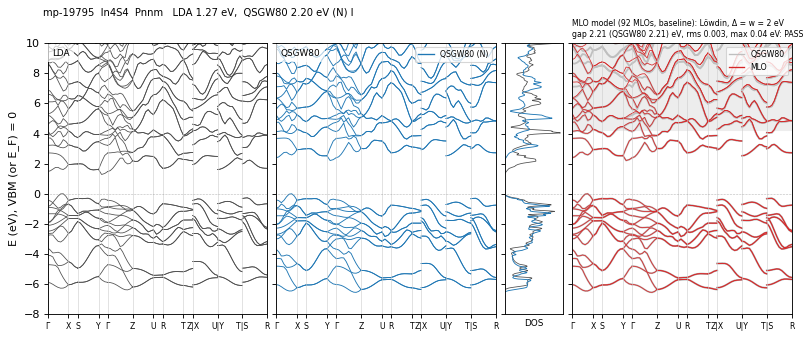

**mp-630528** In4S4 — QSGW80 **0.86** N / M ≈ eV I  — ecalj 989a18637 (tf32, t_tetrakbt -300) — MLO PASS (b1) 92 gap 0.87 rms 0.001 max 0.01 (ecalj fb2da026b)

<small>runs: M 0.86 · N 0.86 (10-04)</small>

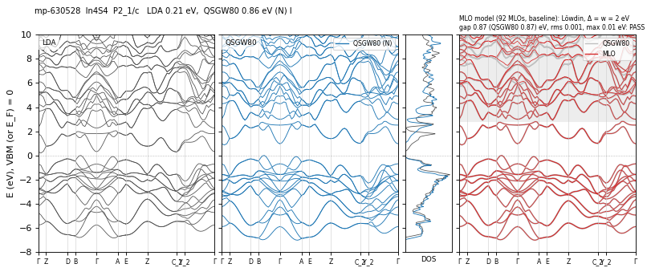

**mp-1079260** In4Se4 — QSGW80 **1.83** E / M ≈ / N ≈ eV D  — ecalj 0601771b4 (tf32, t_tetrakbt -300) with ES, ES rule es-c — MLO PASS (b1, ES) 94 gap 1.83 rms 0.010 max 0.07 (ecalj d2878d537)

<small>runs: M 1.81 · N 1.80 (10-03) · E 1.83 (10-07, ES 2, es-c)</small>

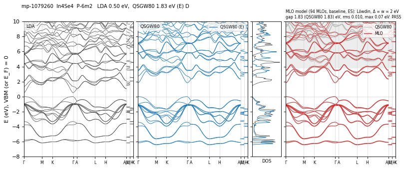

**mp-20485** In4Se4 — QSGW80 **1.49** E / M ≈ / N ≈ eV D  — ecalj 0601771b4 (tf32, t_tetrakbt -300) with ES, ES rule es-c — MLO PASS (b1, ES) 94 gap 1.49 rms 0.010 max 0.08 (ecalj d2878d537)

<small>runs: M 1.45 · N 1.46 (10-05) · E 1.49 (10-07, ES 2, es-c)</small>

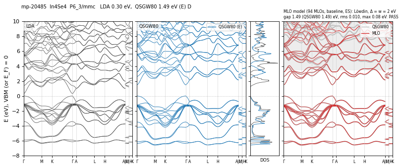

**mp-22604** InAsF6 — QSGW80 **6.95** N / R ≈ eV I  — ecalj 989a18637 (tf32, t_tetrakbt -300) — MLO PASS (b1) 47 gap 6.95 rms 0.002 max 0.01 (ecalj fb2da026b)

<small>runs: M FAILED · R 6.95 (09-30) · N 6.95 (10-05)</small>

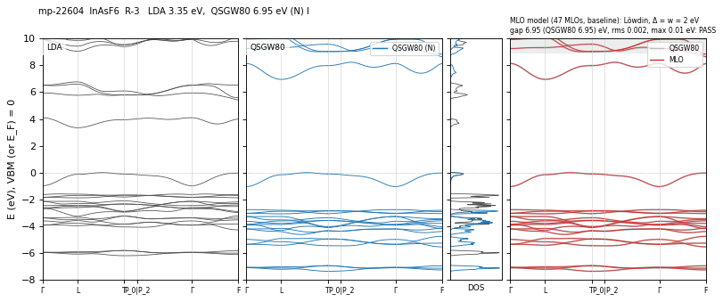

**mp-559521** InBi2S4Cl — QSGW80 **2.25** N / M ≈ eV I  — ecalj 989a18637 (tf32, t_tetrakbt -300) — MLO PASS (b1) 77 gap 2.51 rms 0.001 max 0.00 (ecalj fb2da026b)

<small>runs: M 2.27 · N 2.25 (10-04)</small>

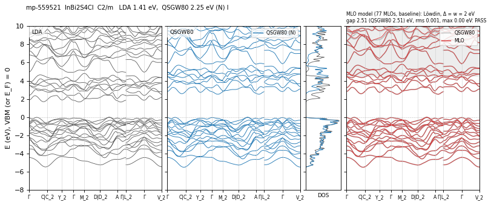

**mp-27397** Ir2Br6 — QSGW80 **3.08** N / M ≈ eV I  — ecalj 989a18637 (tf32, t_tetrakbt -300) — MLO PASS (b1) 72 gap 3.11 rms 0.002 max 0.02 (ecalj fb2da026b)

<small>runs: M 3.06 · N 3.08 (10-05)</small>

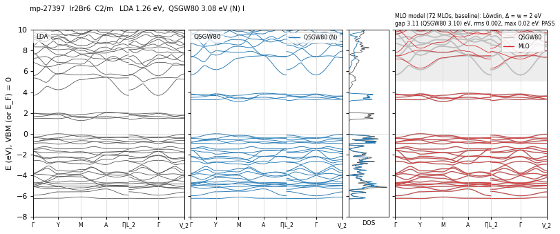

**mp-27666** Ir2Cl6 — QSGW80 **3.83** N / M 3.96 eV I differs — ecalj 989a18637 (tf32, t_tetrakbt -300) — MLO PASS (b1) 72 gap 3.84 rms 0.002 max 0.01 (ecalj fb2da026b)

<small>runs: M 3.96 · N 3.83 (10-04)</small>

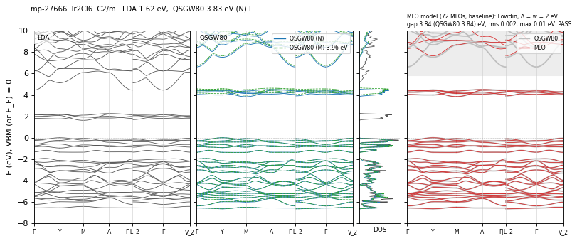

**mp-2437** Ir2F6 — QSGW80 **4.37** N / R ≈ eV I  — ecalj 989a18637 (tf32, t_tetrakbt -300) — MLO PASS (b2all) 66 gap 4.37 rms 0.001 max 0.00 (ecalj fb2da026b)

<small>runs: M 4.51 · R 4.37 (10-01) · N 4.37 (10-06)</small>

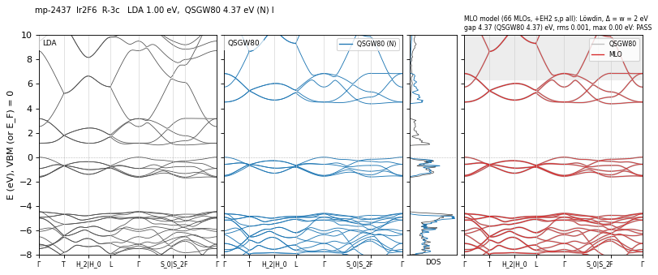

**mp-1084785** K2Al2O4 — QSGW80 **5.78** N / M 5.63 eV D differs — ecalj 989a18637 (tf32, t_tetrakbt -300) — MLO PASS (b1) 58 gap 5.78 rms 0.005 max 0.07 (ecalj fb2da026b)

<small>runs: M 5.63 · N 5.78 (10-05)</small>

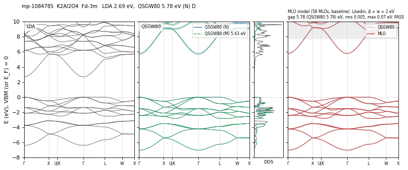

**mp-10165** K2Al2Te4 — QSGW80 **2.93** N / M ≈ eV I  — ecalj 989a18637 (tf32, t_tetrakbt -300) — MLO PASS (b2) 94 gap 2.92 rms 0.002 max 0.02 (ecalj fb2da026b)

<small>runs: M 2.92 · N 2.93 (10-05)</small>

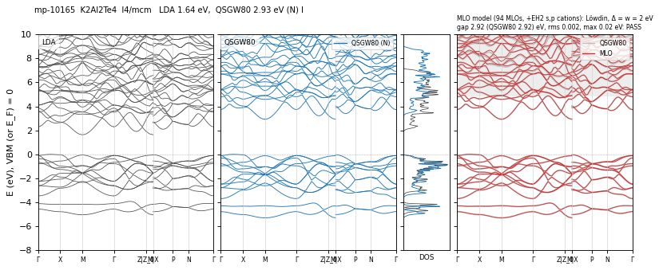

**mp-9486** K2AlF5 — QSGW80 **11.12** E / M ≈ / N 11.19 eV I differs — ecalj 0601771b4 (tf32, t_tetrakbt -300) with ES, ES rule es-c — MLO PASS (b2, ES) 66 gap 11.12 rms 0.001 max 0.01 (ecalj 0e7afd246)

<small>runs: M 11.09 · N 11.19 (10-05) · E 11.12 (10-07, ES 1, es-c)</small>

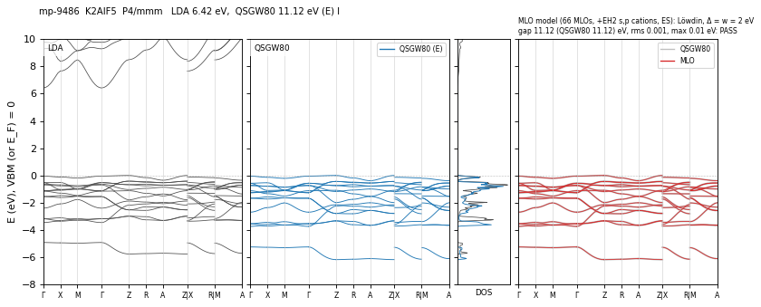

**mp-30988** K2Bi2O4 — QSGW80 **3.27** N / M 3.21 eV D differs — ecalj 989a18637 (tf32, t_tetrakbt -300) — MLO PASS (b1) 58 gap 3.28 rms 0.005 max 0.06 (ecalj fb2da026b)

<small>runs: M 3.21 · N 3.27 (10-05)</small>

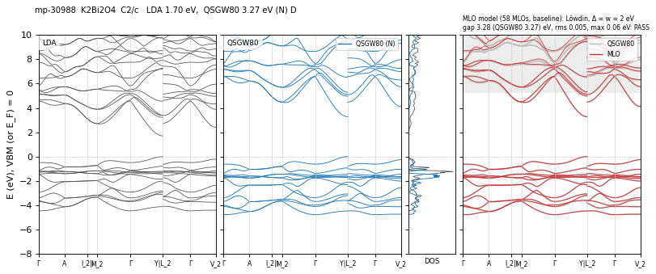

**mp-1079645** K2CdSnSe4 — QSGW80 **2.95** N / M ≈ eV I  — ecalj 989a18637 (tf32, t_tetrakbt -300) — MLO PASS (b1) 78 gap 3.01 rms 0.011 max 0.09 (ecalj fb2da026b)

<small>runs: M 2.91 · N 2.95 (10-05)</small>

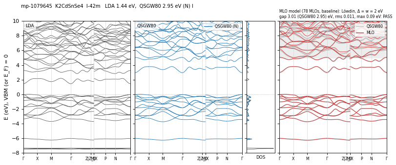

**mp-31368** K2Cl2O4 — QSGW80 **6.13** N / M 5.96 eV I differs — ecalj 989a18637 (tf32, t_tetrakbt -300) — MLO PASS (b2) 66 gap 6.13 rms 0.003 max 0.04 (ecalj fb2da026b)

<small>runs: M 5.96 · N 6.13 (10-04)</small>

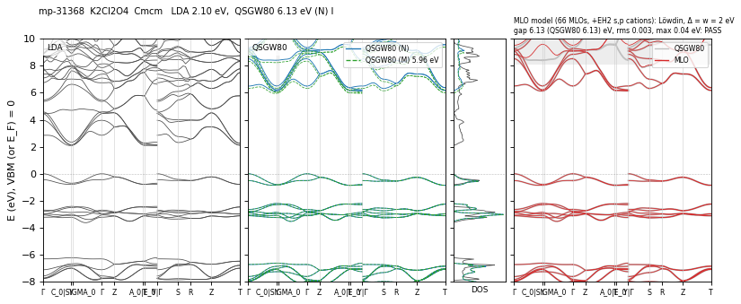

**mp-5256** K2Cu2C4 — QSGW80 **4.03** N / M ≈ eV D  — ecalj 989a18637 (tf32, t_tetrakbt -300) — MLO PASS (b2) 82 gap 4.03 rms 0.003 max 0.03 (ecalj fb2da026b)

<small>runs: M 4.00 · N 4.03 (10-04)</small>

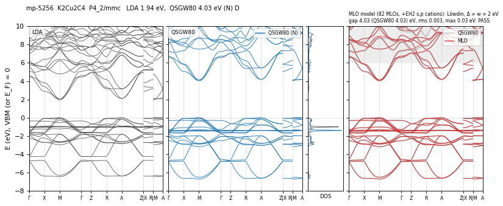

**mp-3982** K2Cu2O4 — QSGW80 **3.48** N / R ≈ eV I  — ecalj 989a18637 (tf32, t_tetrakbt -300) — MLO PASS (b1) 58 gap 3.49 rms 0.003 max 0.02 (ecalj fb2da026b)

<small>runs: M 3.81 · R 3.48 (10-01) · N 3.48 (10-06)</small>

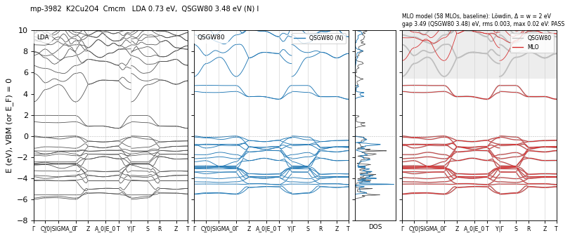

**mp-23846** K2H2F4 — QSGW80 **11.78** N / M ≈ eV D  — ecalj 989a18637 (tf32, t_tetrakbt -300) — MLO PASS (b2) 64 gap 11.77 rms 0.007 max 0.05 (ecalj fb2da026b)

<small>runs: M 11.75 · N 11.78 (10-04)</small>

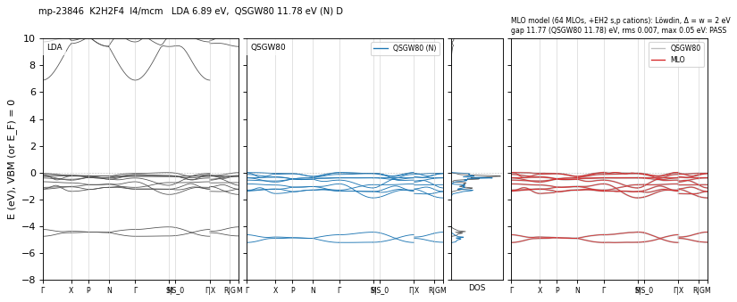

**mp-24428** K2H4N2 — QSGW80 **5.02** N / R ≈ eV D  — ecalj 989a18637 (tf32, t_tetrakbt -300) — MLO PASS (b2) 72 gap 5.02 rms 0.003 max 0.02 (ecalj fb2da026b)

<small>runs: M 4.96 · R 5.02 (10-01) · N 5.02 (10-06)</small>

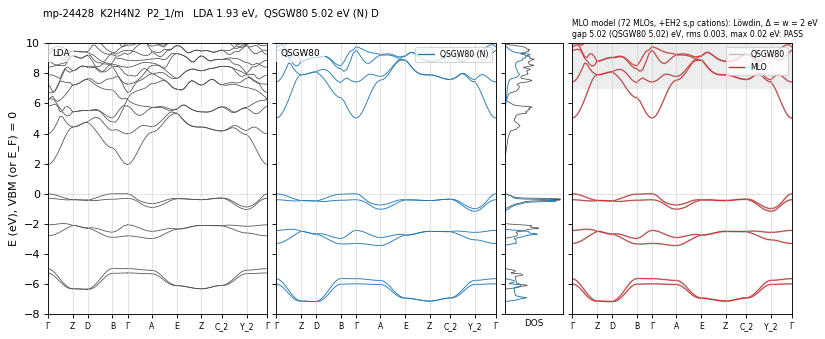

**mp-19851** K2In2Te4 — QSGW80 **2.03** N / M ≈ eV I  — ecalj 989a18637 (tf32, t_tetrakbt -300) — MLO PASS (b2) 104 gap 2.03 rms 0.000 max 0.00 (ecalj fb2da026b)

<small>runs: M 2.03 · N 2.03 (10-05)</small>

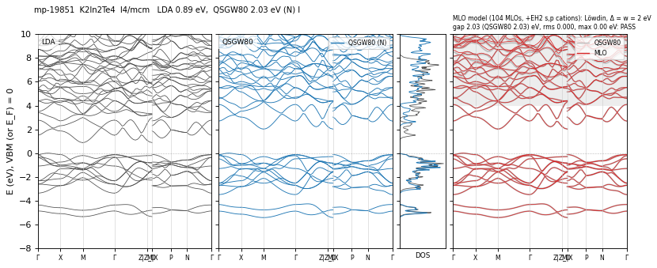

**mp-28994** K2Li4As2 — QSGW80 **1.82** N / M ≈ eV D  — ecalj 989a18637 (tf32, t_tetrakbt -300) — MLO PASS (b2) 82 gap 1.82 rms 0.001 max 0.01 (ecalj fb2da026b)

<small>runs: M 1.81 · N 1.82 (10-05)</small>

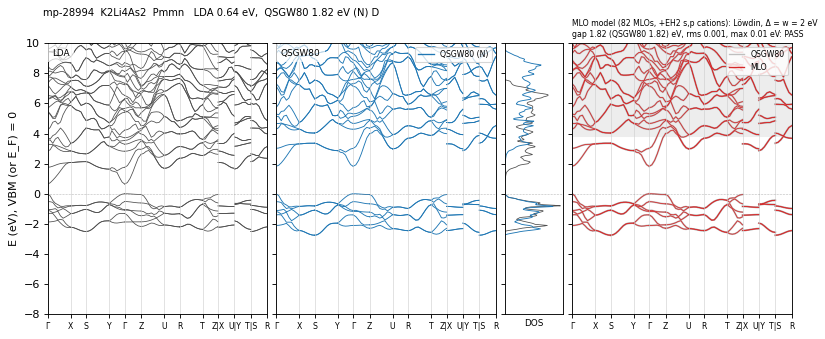

**mp-827** K2N6 — QSGW80 **7.24** N / M 7.32 eV D differs — ecalj 989a18637 (tf32, t_tetrakbt -300) — MLO PASS (b2d) 90 gap 7.24 rms 0.005 max 0.05 (ecalj 7d5dfe714)

<small>runs: M 7.32 · N 7.24 (10-05)</small>

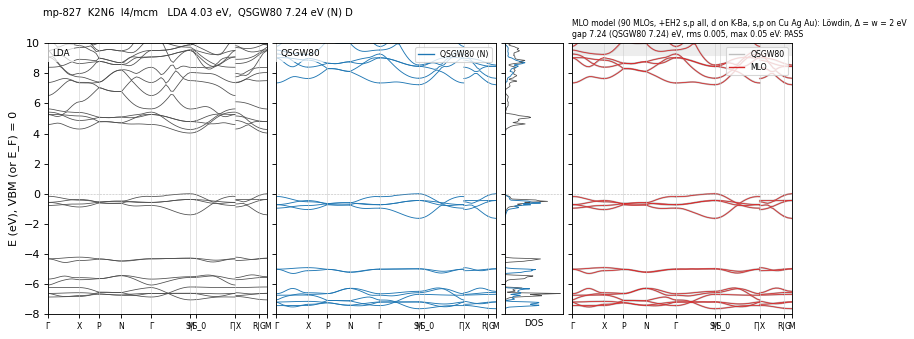

**mp-7938** K2Nb2S4 — QSGW80 **1.54** N / M ≈ eV I  — ecalj 989a18637 (tf32, t_tetrakbt -300) — MLO PASS (b1) 72 gap 1.54 rms 0.001 max 0.02 (ecalj fb2da026b)

<small>runs: M 1.52 · N 1.54 (10-05)</small>

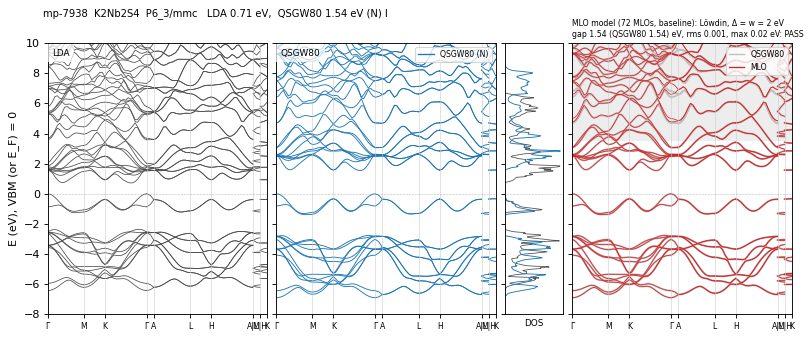

**mp-10417** K2Sb2O4 — QSGW80 **3.78** N / M 3.62 eV D differs — ecalj 989a18637 (tf32, t_tetrakbt -300) — MLO PASS (b1) 58 gap 3.82 rms 0.014 max 0.09 (ecalj a1d6c0e11)

<small>runs: M 3.62 · N 3.78 (10-04)</small>

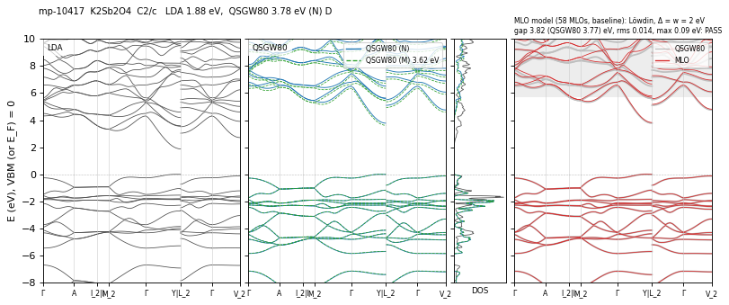

**mp-11703** K2Sb2S4 — QSGW80 **2.77** N / M ≈ eV D  — ecalj 989a18637 (tf32, t_tetrakbt -300) — MLO PASS (b2) 86 gap 2.80 rms 0.004 max 0.03 (ecalj a1d6c0e11)

<small>runs: M 2.80 · N 2.77 (10-03)</small>

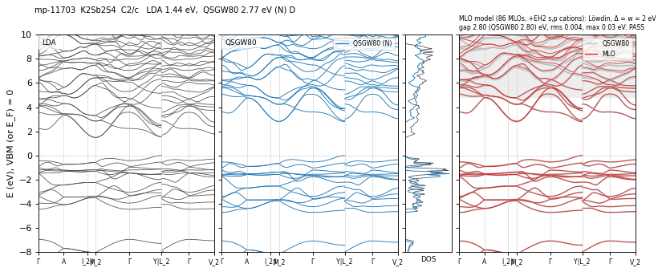

**mp-568968** K2SnHgSe4 — QSGW80 **2.60** N / M ≈ eV I  — ecalj 989a18637 (tf32, t_tetrakbt -300) — MLO PASS (b1) 78 gap 2.64 rms 0.006 max 0.05 (ecalj fb2da026b)

<small>runs: M 2.62 · N 2.60 (10-04)</small>

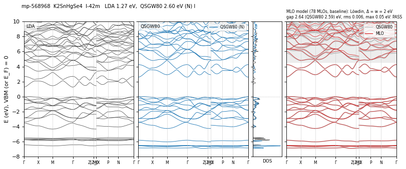

**mp-14206** K3Ag3As2 — QSGW80 **1.98** N / M ≈ eV D  — ecalj 989a18637 (tf32, t_tetrakbt -300) — MLO PASS (b1) 81 gap 1.98 rms 0.007 max 0.05 (ecalj 96ec5c1ee)

<small>runs: M 1.94 · N 1.98 (10-03)</small>

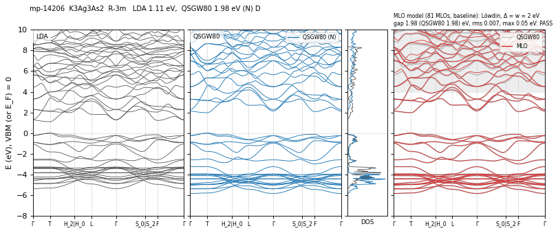

**mp-14205** K3Cu3As2 — QSGW80 **2.10** N / M ≈ eV I  — ecalj 989a18637 (tf32, t_tetrakbt -300) — MLO PASS (b1) 81 gap 2.10 rms 0.005 max 0.05 (ecalj 96ec5c1ee)

<small>runs: M 2.13 · N 2.10 (10-03)</small>

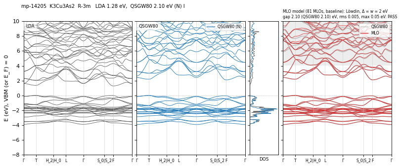

**mp-7439** K3Cu3P2 — QSGW80 **2.13** N / M 1.99 eV I differs — ecalj 989a18637 (tf32, t_tetrakbt -300) — MLO PASS (b1) 81 gap 2.14 rms 0.004 max 0.04 (ecalj fb2da026b)

<small>runs: M 1.99 · N 2.13 (10-05)</small>

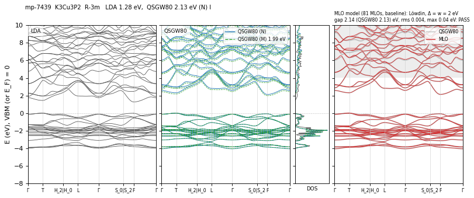

**mp-9273** K3Sb2Au3 — QSGW80 **1.62** N / R ≈ eV I  — ecalj 989a18637 (tf32, t_tetrakbt -300) — MLO PASS (b1) 81 gap 1.63 rms 0.014 max 0.10 (ecalj fb2da026b)

<small>runs: M 1.48 · R 1.62 (09-30) · N 1.62 (10-06)</small>

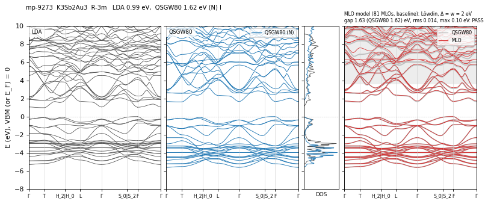

**mp-9911** K3SbS4 — QSGW80 **4.17** N / M ≈ eV I  — ecalj 989a18637 (tf32, t_tetrakbt -300) — MLO PASS (b2) 93 gap 4.17 rms 0.001 max 0.01 (ecalj fb2da026b)

<small>runs: M 4.17 · N 4.17 (10-03)</small>

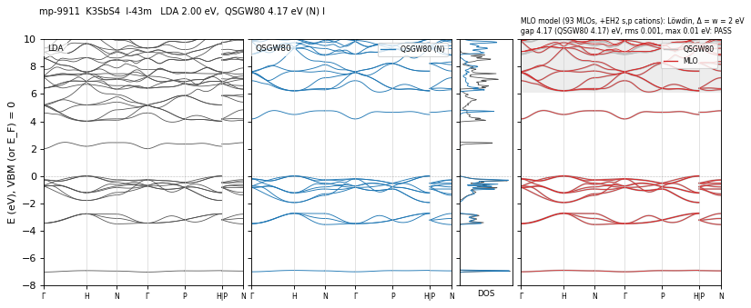

**mp-19052** K3VO4 — QSGW80 **6.18** N / R ≈ eV I  — ecalj 989a18637 (tf32, t_tetrakbt -300) — MLO PASS (b2) 73 gap 6.17 rms 0.001 max 0.00 (ecalj fb2da026b)

<small>runs: M 6.17 · R 6.18 (10-01) · N 6.18 (10-06)</small>

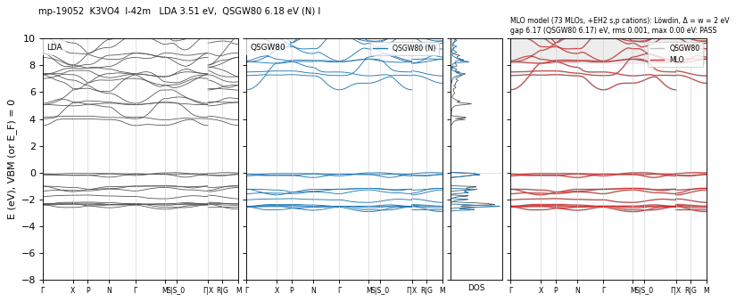

**mp-7642** K4Ag2As2 — QSGW80 **2.05** N / M ≈ eV I  — ecalj 989a18637 (tf32, t_tetrakbt -300) — MLO PASS (b2) 100 gap 2.05 rms 0.001 max 0.01 (ecalj fb2da026b)

<small>runs: M 2.08 · N 2.05 (10-04)</small>

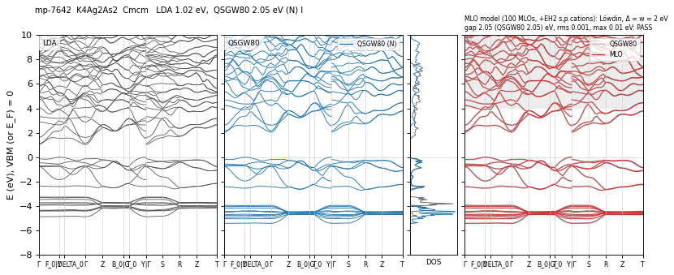

**mp-9778** K4Ag2P2 — QSGW80 **2.19** N / R ≈ eV I  — ecalj 989a18637 (tf32, t_tetrakbt -300) — MLO PASS (b2) 100 gap 2.19 rms 0.000 max 0.01 (ecalj fb2da026b)

<small>runs: M 2.21 · R 2.19 (09-30) · N 2.19 (10-06)</small>

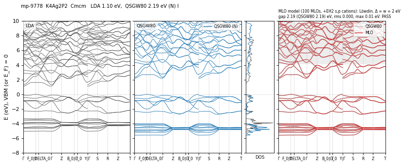

**mp-1084770** K4Bi2Au2 — QSGW80 **1.68** N / M ≈ eV I  — ecalj 989a18637 (tf32, t_tetrakbt -300) — MLO PASS (b2) 108 gap 1.68 rms 0.002 max 0.04 (ecalj a1d6c0e11)

<small>runs: M 1.71 · N 1.68 (10-04)</small>

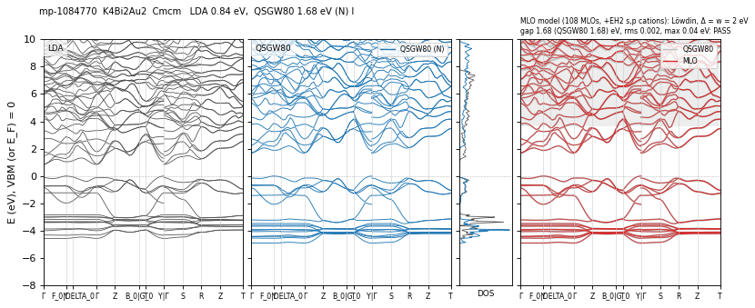

**mp-1079679** K4Cd2Sn2 — QSGW80 **0.44** N / M ≈ eV I  — ecalj 989a18637 (tf32, t_tetrakbt -300) — MLO PASS (b2) 104 gap 0.44 rms 0.001 max 0.01 (ecalj a1d6c0e11)

<small>runs: M 0.46 · N 0.44 (10-03)</small>

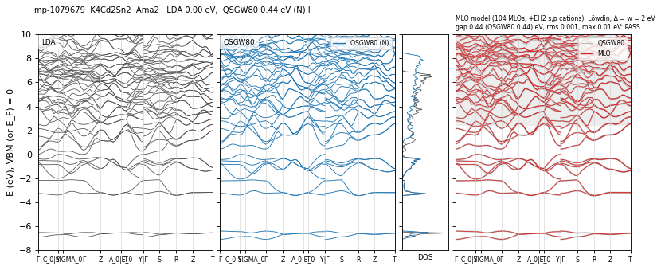

**mp-15684** K4Cu2As2 — QSGW80 **2.06** N / M ≈ eV I  — ecalj 989a18637 (tf32, t_tetrakbt -300) — MLO PASS (b2) 100 gap 2.06 rms 0.001 max 0.01 (ecalj fb2da026b)

<small>runs: M 2.06 · N 2.06 (10-05)</small>

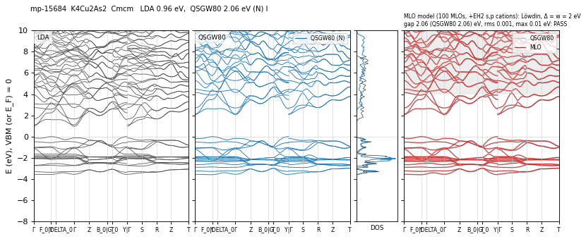

**mp-8446** K4Cu2P2 — QSGW80 **2.16** N / R ≈ eV I  — ecalj 989a18637 (tf32, t_tetrakbt -300) — MLO PASS (b2) 100 gap 2.16 rms 0.001 max 0.01 (ecalj fb2da026b)

<small>runs: M 2.14 · R 2.16 (09-30) · N 2.16 (10-06)</small>

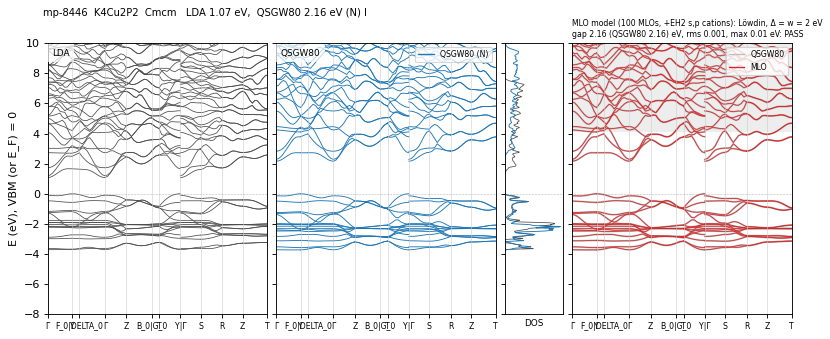

**mp-10381** K4Cu2Sb2 — QSGW80 **2.04** N / M ≈ eV I  — ecalj 989a18637 (tf32, t_tetrakbt -300) — MLO PASS (b2) 100 gap 2.04 rms 0.003 max 0.06 (ecalj a1d6c0e11)

<small>runs: M 2.04 · N 2.04 (10-03)</small>

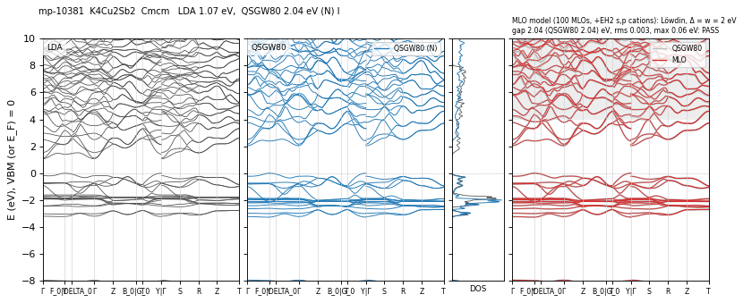

**mp-2672** K4O4 — QSGW80 **5.50** N / M 5.44 eV I differs — ecalj 989a18637 (tf32, t_tetrakbt -300) — MLO PASS (b2) 80 gap 5.50 rms 0.001 max 0.01 (ecalj fb2da026b)

<small>runs: M 5.44 · N 5.50 (10-04)</small>

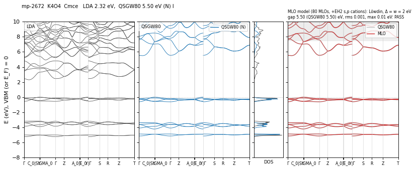

**mp-9687** K4P2Au2 — QSGW80 **1.81** N / R ≈ eV I  — ecalj 989a18637 (tf32, t_tetrakbt -300) — MLO PASS (b1) 84 gap 1.81 rms 0.008 max 0.05 (ecalj fb2da026b)

<small>runs: M 1.81 · R 1.81 (09-30) · N 1.81 (10-06)</small>

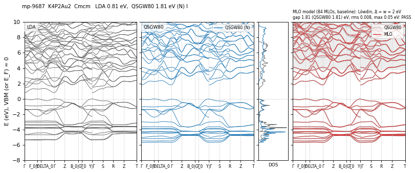

**mp-863757** K4Sb2Au2 — QSGW80 **1.78** N / R ≈ eV I  — ecalj 989a18637 (tf32, t_tetrakbt -300) — MLO PASS (b2) 100 gap 1.78 rms 0.002 max 0.04 (ecalj fb2da026b)

<small>runs: M 1.79 · R 1.78 (09-30) · N 1.78 (10-06)</small>

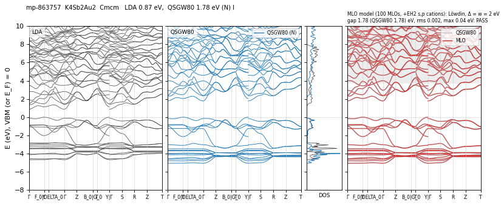

**mp-2072** K4Te4 — QSGW80 **2.29** E / M ≈ / N ≈ eV D  — ecalj 0601771b4 (tf32, t_tetrakbt -300) with ES, ES rule es-c — MLO PASS (b1, ES) 86 gap 2.36 rms 0.015 max 0.07 (ecalj d2878d537)

<small>runs: M 2.28 · N 2.30 (10-04) · E 2.29 (10-07, ES 2, es-c)</small>

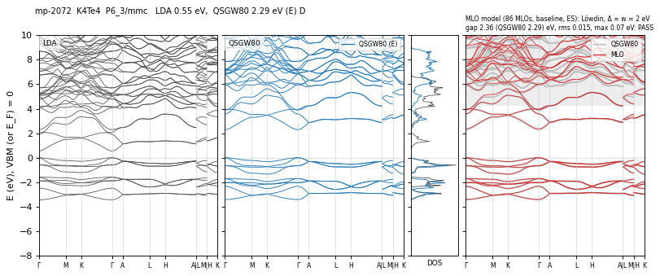

**mp-27999** K5CuSb2 — QSGW80 **1.65** N / M 1.90 / R ≈ eV I CHECK — ecalj 989a18637 (tf32, t_tetrakbt -300) — MLO PASS (b2) 107 gap 1.65 rms 0.002 max 0.02 (ecalj fb2da026b)

<small>runs: M 1.90 · R 1.65 (10-01) · N 1.65 (10-03)</small>

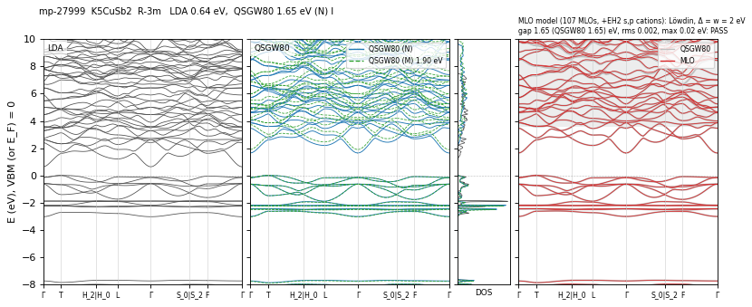

**mp-14018** K6As2 — QSGW80 **1.00** N / M ≈ eV D  — ecalj 989a18637 (tf32, t_tetrakbt -300) — MLO PASS (b2) 114 gap 0.99 rms 0.001 max 0.01 (ecalj 96ec5c1ee)

<small>runs: M 1.00 · N 1.00 (10-05)</small>

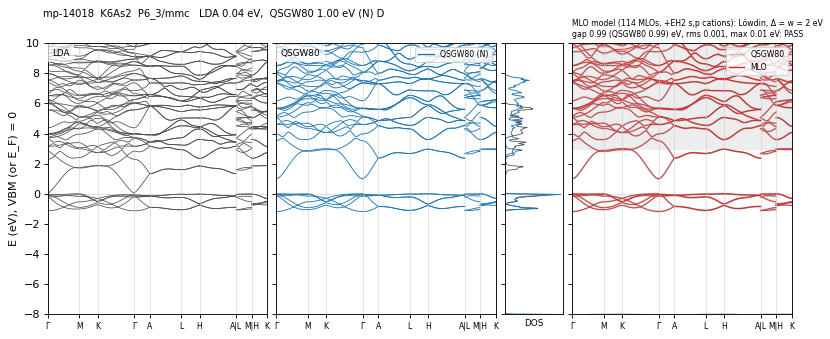

**mp-569940** K6Bi2 — QSGW80 **0.80** N / M ≈ eV D  — ecalj 989a18637 (tf32, t_tetrakbt -300) — MLO PASS (b2) 122 gap 0.80 rms 0.002 max 0.01 (ecalj fb2da026b)

<small>runs: M 0.78 · N 0.80 (10-04)</small>

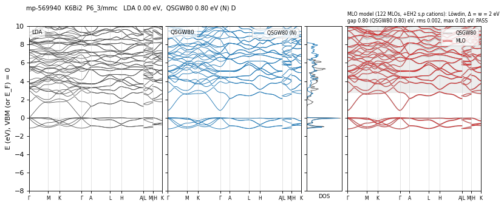

**mp-7897** K6P2 — QSGW80 **1.13** N / M ≈ eV I  — ecalj 989a18637 (tf32, t_tetrakbt -300) — MLO PASS (b2) 114 gap 1.13 rms 0.001 max 0.01 (ecalj fb2da026b)

<small>runs: M 1.14 · N 1.13 (10-04)</small>

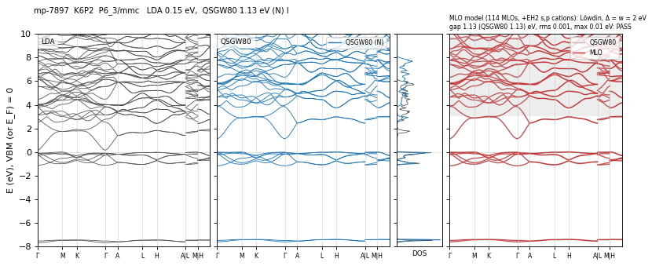

**mp-14017** K6Sb2 — QSGW80 **1.30** N / M ≈ eV D  — ecalj 989a18637 (tf32, t_tetrakbt -300) — MLO PASS (b2) 114 gap 1.30 rms 0.004 max 0.02 (ecalj 96ec5c1ee)

<small>runs: M 1.30 · N 1.30 (10-04)</small>

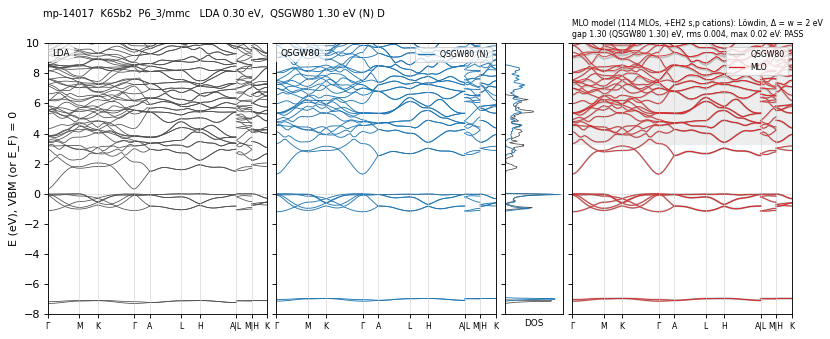

**mp-12015** KAg2AsO4 — QSGW80 **2.42** N / M 2.83 eV I CHECK — ecalj 989a18637 (tf32, t_tetrakbt -300) — MLO PASS (b1) 55 gap 2.42 rms 0.000 max 0.00 (ecalj a1d6c0e11)

<small>runs: M 2.83 · N 2.42 (10-02)</small>

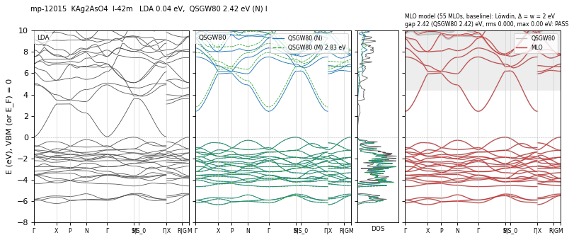

**mp-12532** KAg2PS4 — QSGW80 **2.56** N / M 2.64 eV I differs — ecalj 989a18637 (tf32, t_tetrakbt -300) — MLO PASS (b1) 75 gap 2.58 rms 0.004 max 0.04 (ecalj fb2da026b)

<small>runs: M 2.64 · N 2.56 (10-05)</small>

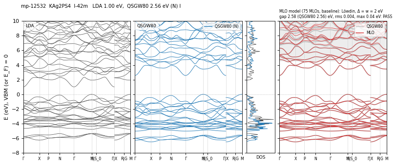

**mp-9490** KAg2SbS4 — QSGW80 **1.81** N / M ≈ eV I  — ecalj 989a18637 (tf32, t_tetrakbt -300) — MLO PASS (b1) 75 gap 1.82 rms 0.002 max 0.02 (ecalj fb2da026b)

<small>runs: M 1.82 · N 1.81 (10-05)</small>

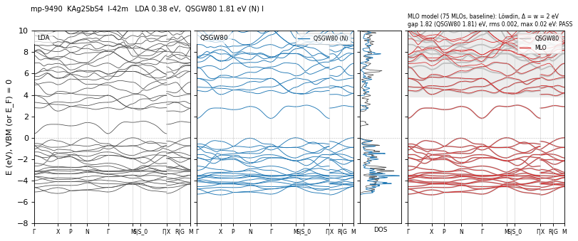

**mp-4266** KAsF6 — QSGW80 **10.59** N / M 10.32 eV D CHECK — ecalj 989a18637 (tf32, t_tetrakbt -300) — MLO PASS (b1) 45 gap 10.68 rms 0.012 max 0.09 (ecalj fb2da026b)

<small>runs: M 10.32 · N 10.59 (10-05)</small>

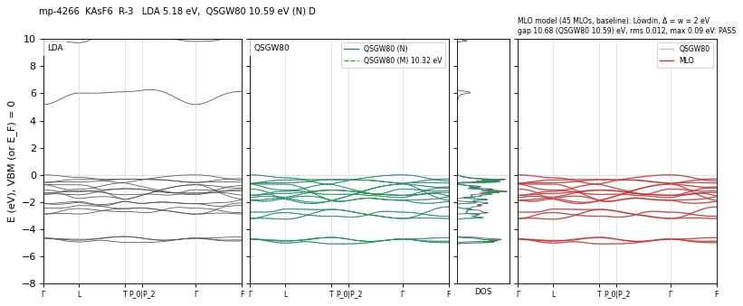

**mp-7569** KAsF6 — QSGW80 **10.54** N / R ≈ eV D  — ecalj 989a18637 (tf32, t_tetrakbt -300) — MLO PASS (b2) 49 gap 10.54 rms 0.001 max 0.00 (ecalj fb2da026b)

<small>runs: M 11.06 · R 10.54 (10-01) · N 10.54 (10-05)</small>

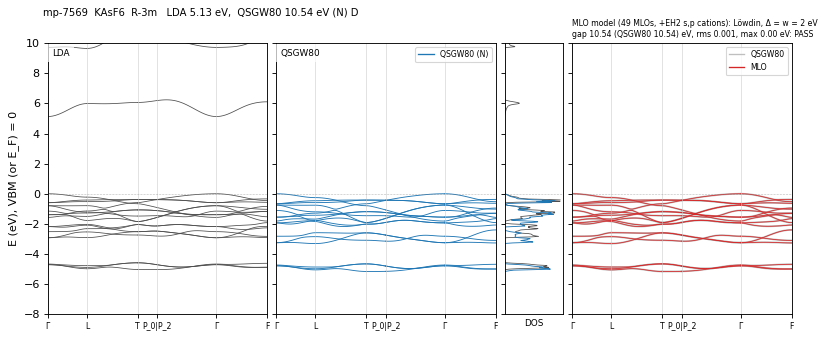

**mp-4608** KPF6 — QSGW80 **12.55** N / M 12.09 eV D CHECK — ecalj 989a18637 (tf32, t_tetrakbt -300) — MLO PASS (b2) 49 gap 12.55 rms 0.001 max 0.01 (ecalj fb2da026b)

<small>runs: M 12.09 · N 12.55 (10-03)</small>

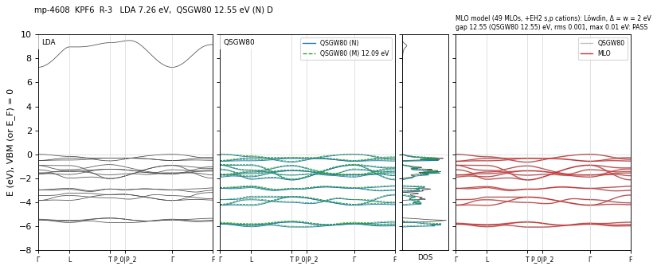

**mp-643033** KPH2SO3 — QSGW80 **7.16** N / M ≈ eV I  — ecalj 989a18637 (tf32, t_tetrakbt -300) — MLO PASS (b2all) 82 gap 7.16 rms 0.005 max 0.06 (ecalj fb2da026b)

<small>runs: M 7.14 · N 7.16 (10-04)</small>

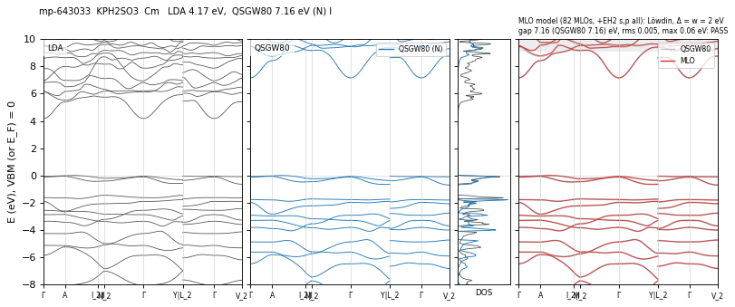

**mp-1087504** KZn4P3 — QSGW80 **1.40** N / M ≈ eV I  — ecalj 989a18637 (tf32, t_tetrakbt -300) — MLO PASS (b1) 75 gap 1.41 rms 0.013 max 0.09 (ecalj a1d6c0e11)

<small>runs: M 1.42 · N 1.40 (10-04)</small>

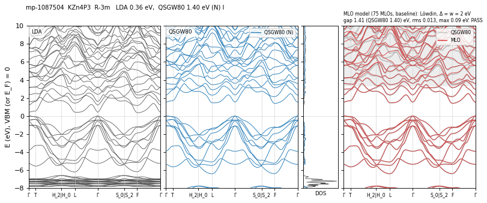

**mp-4586** Li2Al2Te4 — QSGW80 **3.44** N / M ≈ eV D  — ecalj 989a18637 (tf32, t_tetrakbt -300) — MLO PASS (b2) 78 gap 3.44 rms 0.005 max 0.03 (ecalj fb2da026b)

<small>runs: M 3.48 · N 3.44 (10-05)</small>

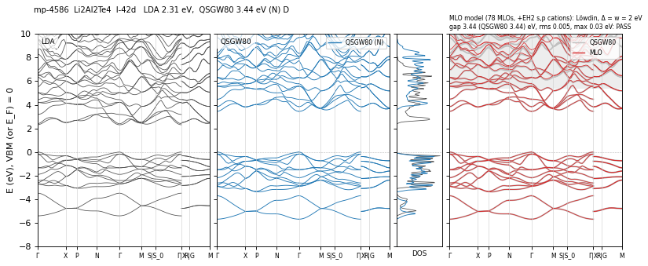

**mp-555874** Li2As2S4 — QSGW80 **1.94** N / M ≈ eV D  — ecalj 989a18637 (tf32, t_tetrakbt -300) — MLO PASS (b1) 62 gap 1.94 rms 0.003 max 0.02 (ecalj fb2da026b)

<small>runs: M 1.98 · N 1.94 (10-03)</small>

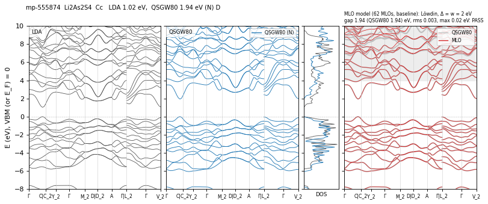

**mp-1078724** Li2As2Se4 — QSGW80 **1.41** N / M ≈ eV D  — ecalj 989a18637 (tf32, t_tetrakbt -300) — MLO PASS (b1) 62 gap 1.41 rms 0.003 max 0.03 (ecalj a1d6c0e11)

<small>runs: M 1.41 · N 1.41 (10-04)</small>

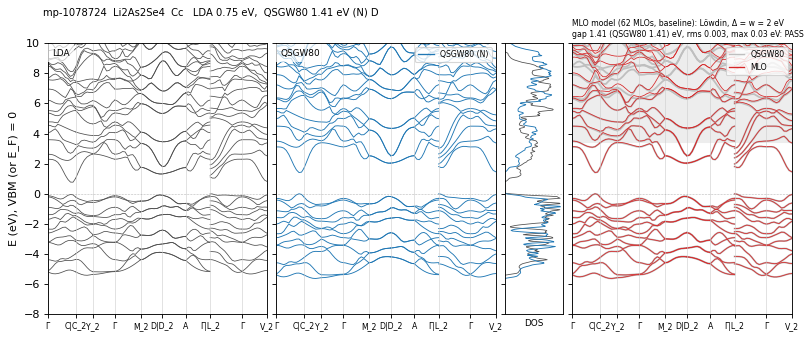

**mp-14232** Li2B2O4 — QSGW80 **10.38** N / R ≈ eV I  — ecalj 989a18637 (tf32, t_tetrakbt -300) — MLO PASS (b1) 32 gap 10.39 rms 0.002 max 0.02 (ecalj fb2da026b)

<small>runs: M 10.71 · R 10.38 (10-01) · N 10.38 (10-05)</small>

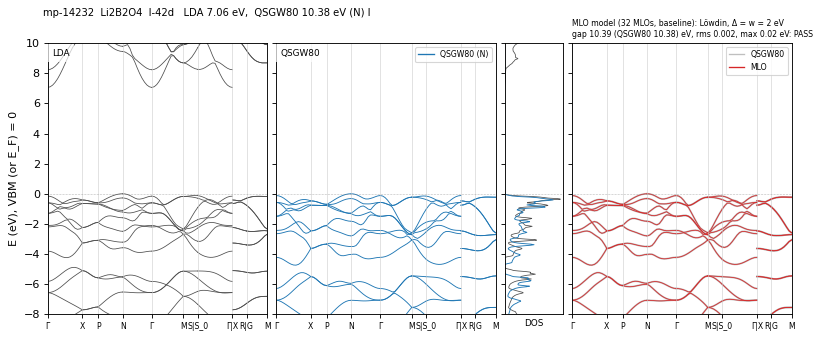

**mp-1205315** Li2Bi2O4 — QSGW80 **1.86** N / M ≈ eV I  — ecalj 989a18637 (tf32, t_tetrakbt -300) — MLO PASS (b1) 42 gap 1.88 rms 0.007 max 0.07 (ecalj a1d6c0e11)

<small>runs: M 1.91 · N 1.86 (10-04)</small>

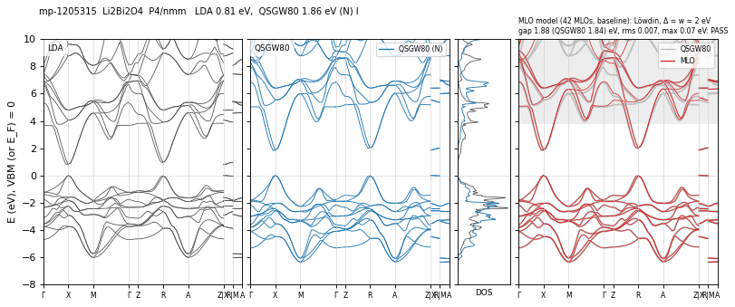

**mp-7611** Li2CaGeO4 — QSGW80 **6.80** N / M 6.69 eV I differs — ecalj 989a18637 (tf32, t_tetrakbt -300) — MLO PASS (b1) 42 gap 6.80 rms 0.000 max 0.00 (ecalj fb2da026b)

<small>runs: M 6.69 · N 6.80 (10-05)</small>

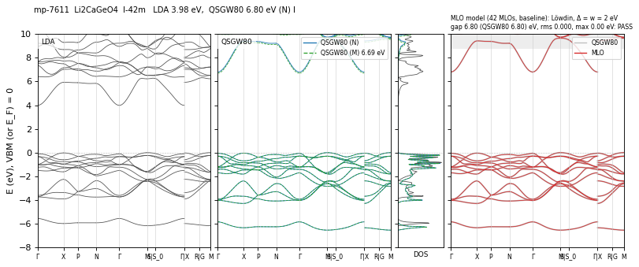

**mp-7610** Li2CaSiO4 — QSGW80 **7.98** N / M 7.86 eV I differs — ecalj 989a18637 (tf32, t_tetrakbt -300) — MLO PASS (b1) 42 gap 7.98 rms 0.000 max 0.00 (ecalj fb2da026b)

<small>runs: M 7.86 · N 7.98 (10-04)</small>

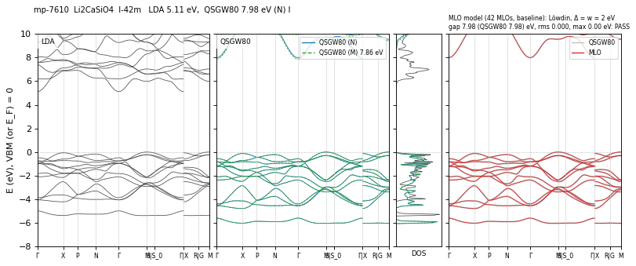

**mp-5048** Li2Ga2Te4 — QSGW80 **2.77** N / M ≈ eV I  — ecalj 989a18637 (tf32, t_tetrakbt -300) — MLO PASS (b2) 88 gap 2.77 rms 0.002 max 0.01 (ecalj fb2da026b)

<small>runs: M 2.81 · N 2.77 (10-04)</small>

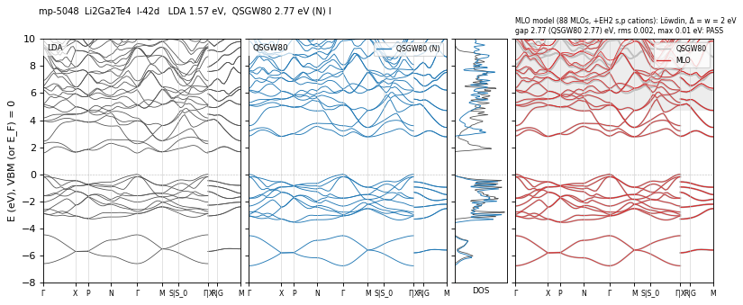

**mp-19896** Li2GePbS4 — QSGW80 **3.27** N / M 3.35 eV I differs — ecalj 989a18637 (tf32, t_tetrakbt -300) — MLO PASS (b1) 62 gap 3.26 rms 0.001 max 0.01 (ecalj fb2da026b)

<small>runs: M 3.35 · N 3.27 (10-04)</small>

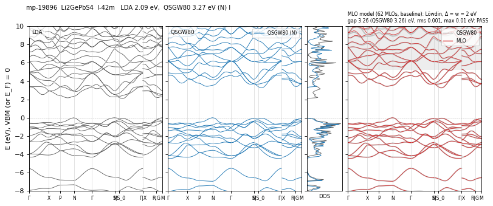

**mp-5488** Li2In2O4 — QSGW80 **3.76** N / M 3.85 eV I differs — ecalj 989a18637 (tf32, t_tetrakbt -300) — MLO PASS (b1) 52 gap 3.71 rms 0.000 max 0.00 (ecalj fb2da026b)

<small>runs: M 3.85 · N 3.76 (10-05)</small>

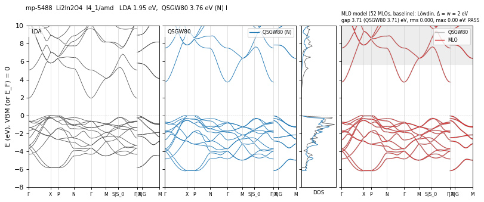

**mp-20187** Li2In2Se4 — QSGW80 **2.95** N / M ≈ eV D  — ecalj 989a18637 (tf32, t_tetrakbt -300) — MLO PASS (b1) 72 gap 2.99 rms 0.009 max 0.05 (ecalj fb2da026b)

<small>runs: M 2.95 · N 2.95 (10-03)</small>

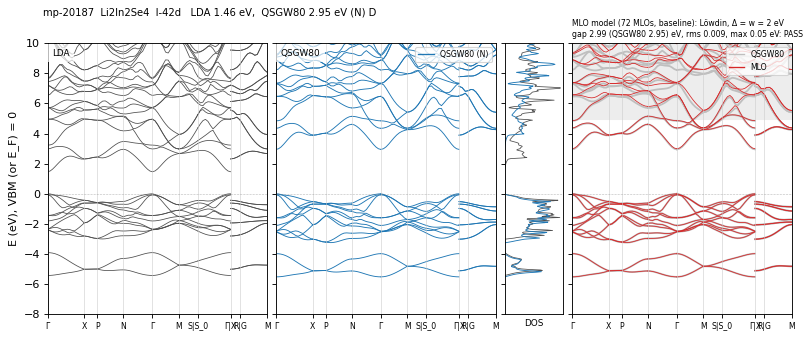

**mp-20782** Li2In2Te4 — QSGW80 **2.50** N / M ≈ eV D  — ecalj 989a18637 (tf32, t_tetrakbt -300) — MLO PASS (b2) 88 gap 2.50 rms 0.002 max 0.01 (ecalj fb2da026b)

<small>runs: M 2.48 · N 2.50 (10-04)</small>

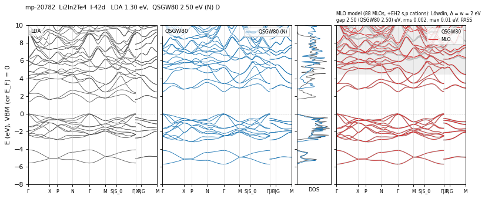

**mp-3924** Li2Nb2O4 — QSGW80 **2.74** N / M 2.80 eV I differs — ecalj 989a18637 (tf32, t_tetrakbt -300) — MLO PASS (b1) 42 gap 2.67 rms 0.003 max 0.05 (ecalj fb2da026b)

<small>runs: M 2.80 · N 2.74 (10-03)</small>

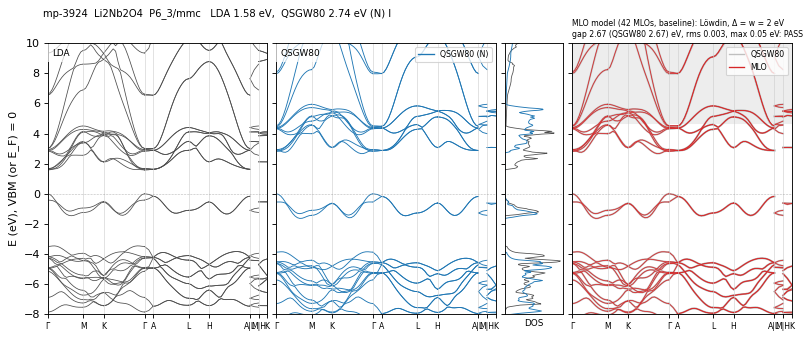

**mp-7936** Li2Nb2S4 — QSGW80 **1.40** N / M ≈ · path 1.27 eV I path<mesh(mesh) — ecalj 989a18637 (tf32, t_tetrakbt -300) — MLO PASS (b1) 62 gap 1.27 rms 0.001 max 0.00 (ecalj fb2da026b)

<small>runs: M 1.40 · N 1.40 (10-04)</small>

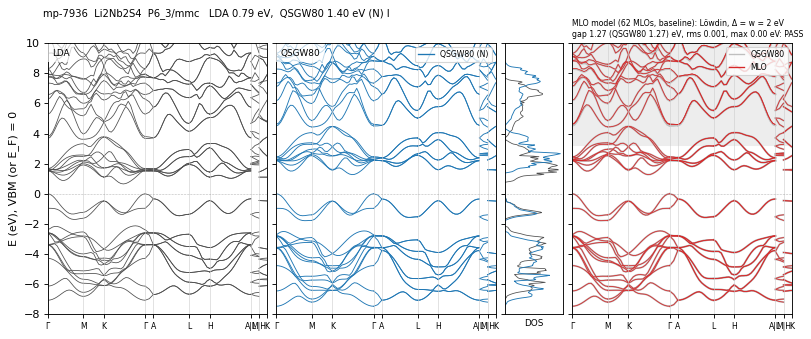

**mp-3524** Li2P2N4 — QSGW80 **5.53** N / M ≈ eV I  — ecalj 989a18637 (tf32, t_tetrakbt -300) — MLO PASS (b1) 42 gap 5.53 rms 0.001 max 0.01 (ecalj fb2da026b)

<small>runs: M 5.51 · N 5.53 (10-04)</small>

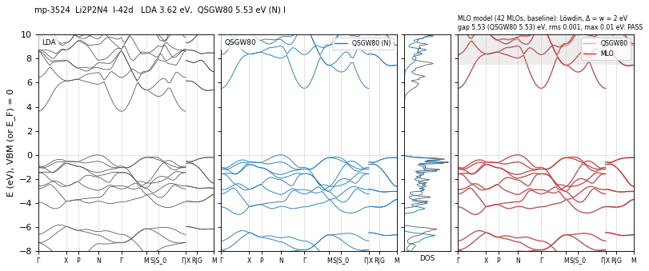

**mp-1079885** Li2Sb2S4 — QSGW80 **0.79** N / M ≈ eV I  — ecalj 989a18637 (tf32, t_tetrakbt -300) — MLO PASS (b1) 62 gap 0.76 rms 0.000 max 0.00 (ecalj fb2da026b)

<small>runs: M 0.78 · N 0.79 (10-05)</small>

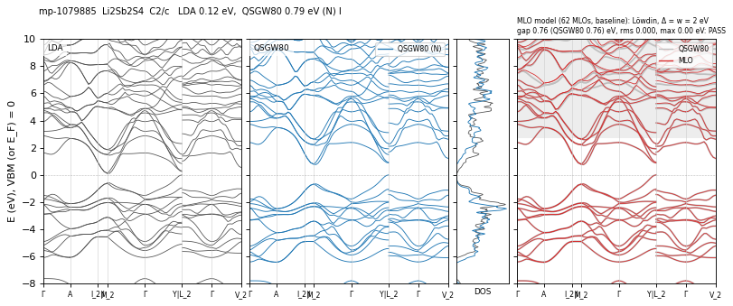

**mp-5840** Li2Sc2O4 — QSGW80 **6.82** N / R ≈ eV I  — ecalj 989a18637 (tf32, t_tetrakbt -300) — MLO PASS (b1) 42 gap 6.82 rms 0.000 max 0.00 (ecalj fb2da026b)

<small>runs: M 13.06 · R 6.82 (10-01) · N 6.82 (10-05)</small>

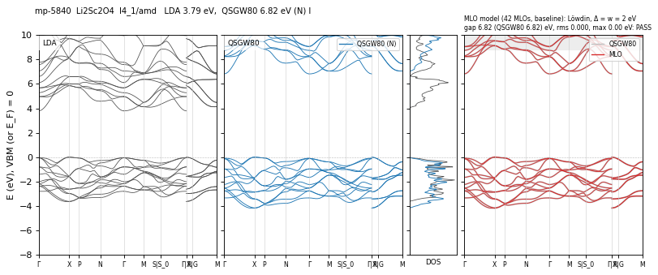

**mp-8179** Li2Tl2O4 — QSGW80 **1.19** N / M 1.39 eV I differs — ecalj 989a18637 (tf32, t_tetrakbt -300) — MLO PASS (b1) 52 gap 1.17 rms 0.000 max 0.00 (ecalj fb2da026b)

<small>runs: M 1.39 · N 1.19 (10-05)</small>

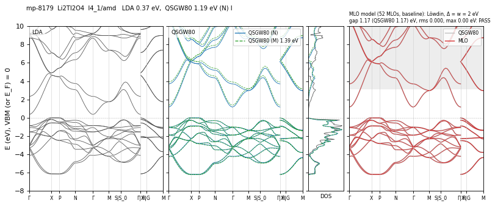

**mp-558312** Li4O4 — QSGW80 **5.42** N / M 5.61 eV D differs — ecalj 989a18637 (tf32, t_tetrakbt -300) — MLO PASS (b1) 32 gap 5.42 rms 0.001 max 0.00 (ecalj fb2da026b)

<small>runs: M 5.61 · N 5.42 (10-03)</small>

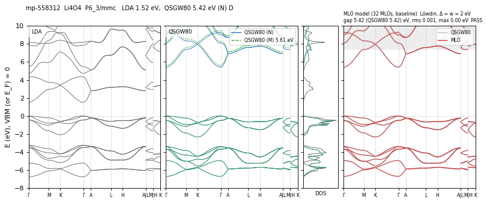

**mp-841** Li4O4 — QSGW80 **5.80** N / M ≈ eV D  — ecalj 989a18637 (tf32, t_tetrakbt -300) — MLO PASS (b1) 32 gap 5.80 rms 0.001 max 0.00 (ecalj fb2da026b)

<small>runs: M 5.84 · N 5.80 (10-05)</small>

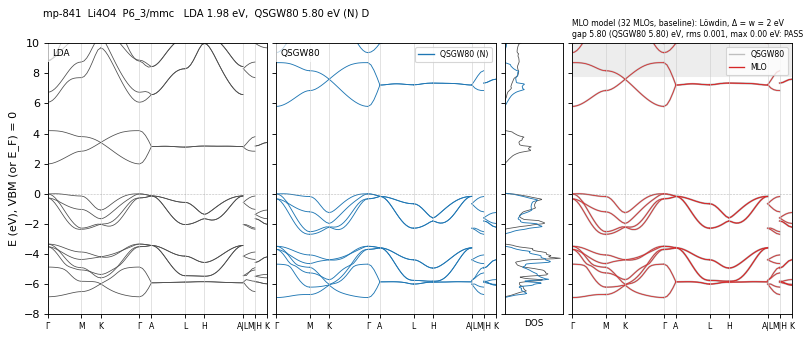

**mp-29025** Li5Br2N — QSGW80 **4.49** N / R ≈ eV I  — ecalj 989a18637 (tf32, t_tetrakbt -300) — MLO PASS (b2) 62 gap 4.48 rms 0.002 max 0.01 (ecalj fb2da026b)

<small>runs: M FAILED · R 4.49 (09-30) · N 4.49 (10-05)</small>

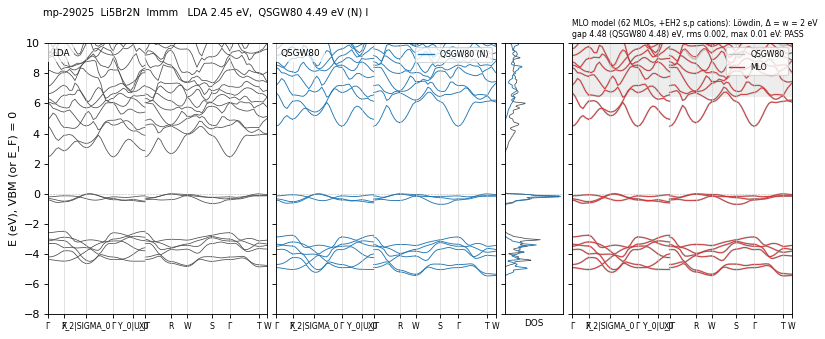

**mp-29151** Li5NCl2 — QSGW80 **4.08** N / R ≈ eV I  — ecalj 989a18637 (tf32, t_tetrakbt -300) — MLO PASS (b2) 62 gap 4.08 rms 0.002 max 0.01 (ecalj fb2da026b)

<small>runs: M FAILED · R 4.08 (09-30) · N 4.08 (10-05)</small>

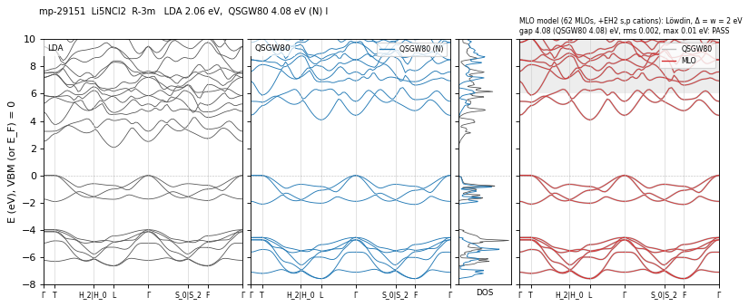

**mp-757** Li6As2 — QSGW80 **1.71** N / M ≈ · path 1.55 eV I path<mesh(mesh) — ecalj 989a18637 (tf32, t_tetrakbt -300) — MLO PASS (b1) 42 gap 1.55 rms 0.010 max 0.09 (ecalj fb2da026b)

<small>runs: M 1.72 · N 1.71 (10-05)</small>

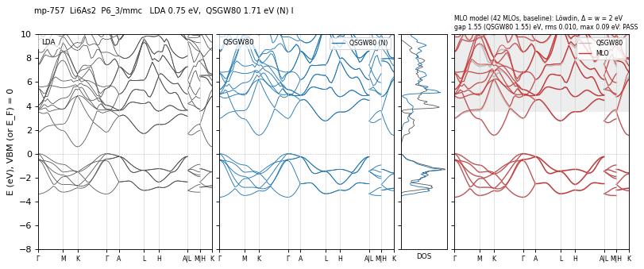

**mp-2341** Li6N2 — QSGW80 **2.87** N / M 2.81 · path 2.66 eV I differs path<mesh(mesh) — ecalj 989a18637 (tf32, t_tetrakbt -300) — MLO PASS (b1) 32 gap 2.66 rms 0.000 max 0.00 (ecalj fb2da026b)

<small>runs: M 2.81 · N 2.87 (10-03)</small>

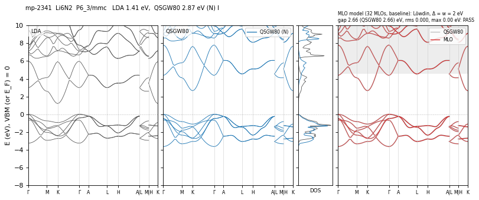

**mp-736** Li6P2 — QSGW80 **1.82** N / M ≈ · path 1.65 eV I path<mesh(mesh) — ecalj 989a18637 (tf32, t_tetrakbt -300) — MLO PASS (b1) 42 gap 1.65 rms 0.005 max 0.05 (ecalj fb2da026b)

<small>runs: M 1.82 · N 1.82 (10-05)</small>

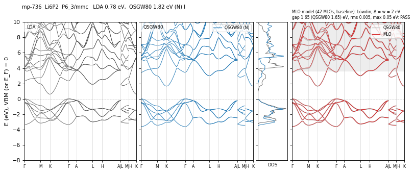

**mp-7955** Li6Sb2 — QSGW80 **1.45** N / M ≈ · path 1.30 eV I path<mesh(mesh) — ecalj 989a18637 (tf32, t_tetrakbt -300) — MLO PASS (b2) 66 gap 1.31 rms 0.002 max 0.02 (ecalj fb2da026b)

<small>runs: M 1.45 · N 1.45 (10-04)</small>

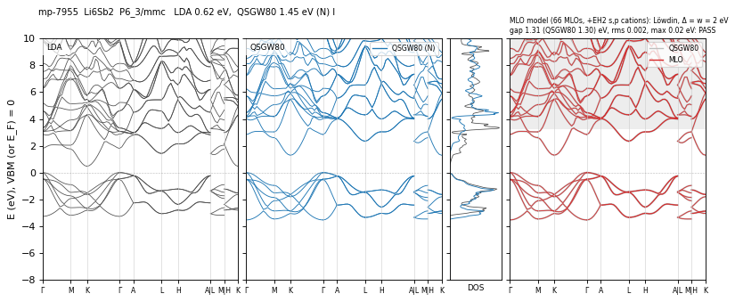

**mp-9144** LiAsF6 — QSGW80 **11.04** N / M 10.81 eV I CHECK — ecalj 989a18637 (tf32, t_tetrakbt -300) — MLO PASS (b1) 37 gap 11.09 rms 0.006 max 0.05 (ecalj fb2da026b)

<small>runs: M 10.81 · N 11.04 (10-05)</small>

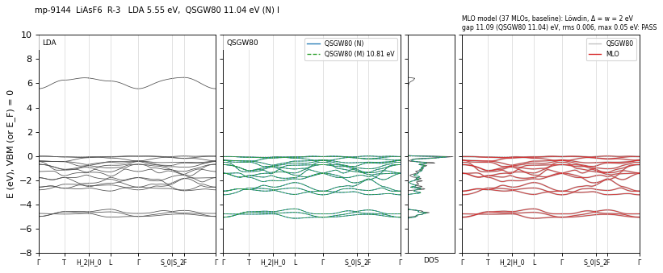

**mp-1079483** LiAuF6 — QSGW80 **6.05** N / R ≈ eV I  — ecalj 989a18637 (tf32, t_tetrakbt -300) — MLO PASS (b1) 37 gap 6.05 rms 0.000 max 0.00 (ecalj fb2da026b)

<small>runs: M 5.97 · R 6.05 (10-01) · N 6.05 (10-06)</small>

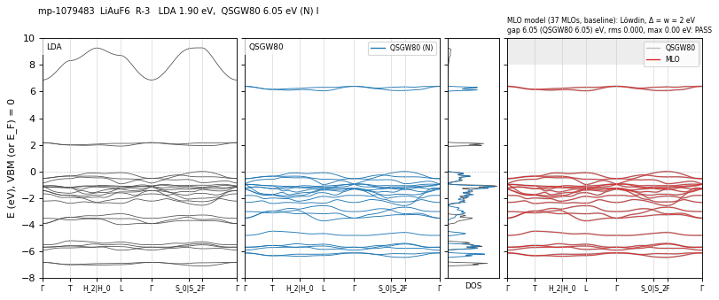

**mp-27419** LiBiF6 — QSGW80 **6.73** N / R ≈ eV I  — ecalj 989a18637 (tf32, t_tetrakbt -300) — MLO PASS (b1) 42 gap 6.73 rms 0.000 max 0.00 (ecalj fb2da026b)

<small>runs: M FAILED · R 6.73 (09-30) · N 6.73 (10-05)</small>

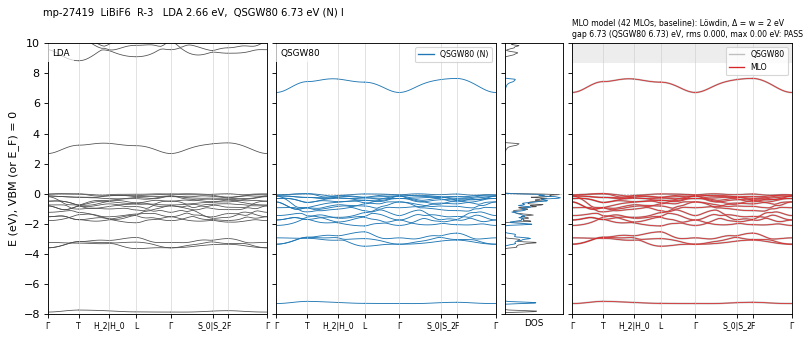

**mp-1078799** LiNbF6 — QSGW80 **9.16** N / M 8.71 eV I CHECK — ecalj 989a18637 (tf32, t_tetrakbt -300) — MLO PASS (b1) 37 gap 9.16 rms 0.001 max 0.01 (ecalj a1d6c0e11)

<small>runs: M 8.71 · N 9.16 (10-03)</small>

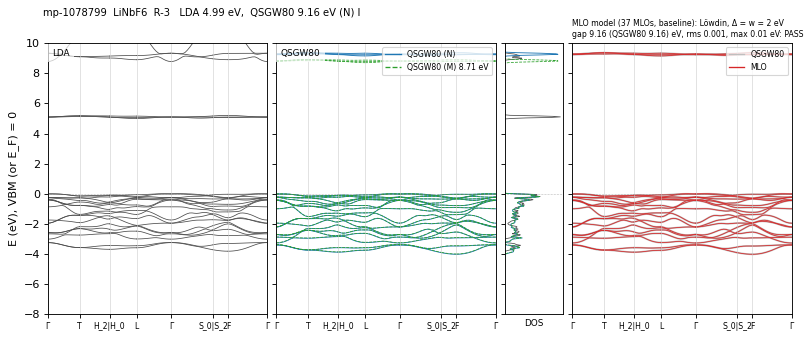

**mp-9143** LiPF6 — QSGW80 **13.52** N / R ≈ eV I  — ecalj 989a18637 (tf32, t_tetrakbt -300) — MLO PASS (b2) 41 gap 13.52 rms 0.001 max 0.01 (ecalj fb2da026b)

<small>runs: M 17.00 · R 13.52 (10-01) · N 13.52 (10-05)</small>

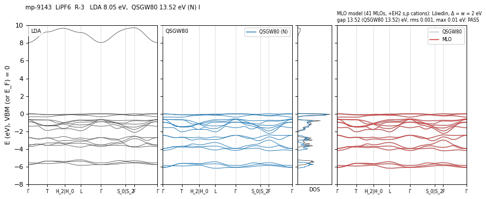

**mp-3980** LiSbF6 — QSGW80 **10.16** N / R ≈ eV I  — ecalj 989a18637 (tf32, t_tetrakbt -300) — MLO PASS (b1) 37 gap 10.20 rms 0.005 max 0.03 (ecalj fb2da026b)

<small>runs: M 10.21 · R 10.16 (10-01) · N 10.16 (10-06)</small>

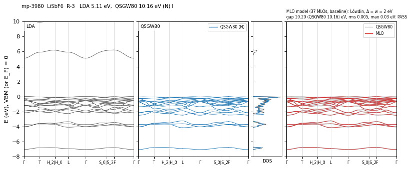

**mp-1080679** LiTaF6 — QSGW80 **10.97** N / R ≈ eV I  — ecalj 989a18637 (tf32, t_tetrakbt -300) — MLO PASS (b2all) 65 gap 10.98 rms 0.000 max 0.00 (ecalj fb2da026b)

<small>runs: M 9.00 · R 10.97 (10-01) · N 10.97 (10-06)</small>

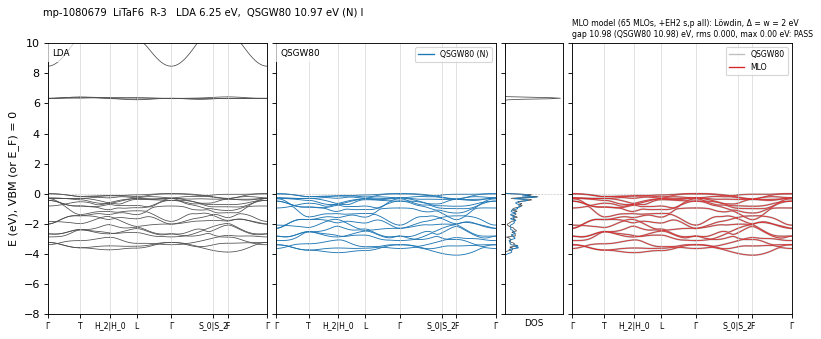

**mp-1016200** Mg2Ge2As4 — QSGW80 **1.61** N / M ≈ eV D  — ecalj 989a18637 (tf32, t_tetrakbt -300) — MLO PASS (b2) 88 gap 1.61 rms 0.001 max 0.01 (ecalj a1d6c0e11)

<small>runs: M 1.63 · N 1.61 (10-03)</small>

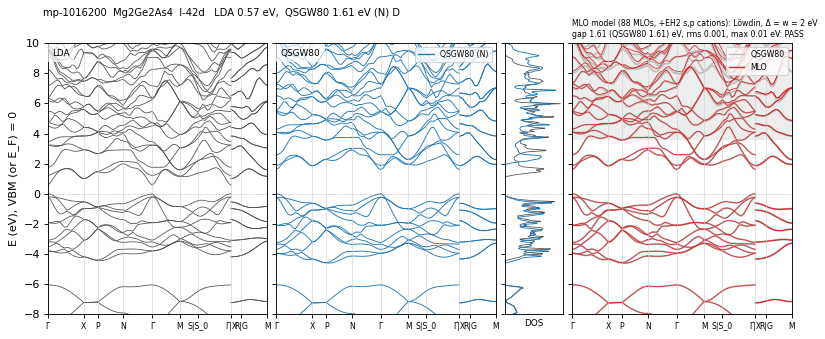

**mp-34903** Mg2Ge2P4 — QSGW80 **2.16** N / M ≈ eV D  — ecalj 989a18637 (tf32, t_tetrakbt -300) — MLO PASS (b1) 72 gap 2.16 rms 0.004 max 0.04 (ecalj fb2da026b)

<small>runs: M 2.19 · N 2.16 (10-05)</small>

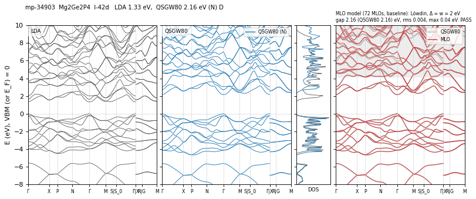

**mp-864954** Mg2Mo2N4 — QSGW80 **1.58** N / M ≈ · path 1.33 eV I path<mesh(mesh) — ecalj 989a18637 (tf32, t_tetrakbt -300) — MLO PASS (b1) 52 gap 1.32 rms 0.001 max 0.01 (ecalj fb2da026b)

<small>runs: M 1.58 · N 1.58 (10-04)</small>

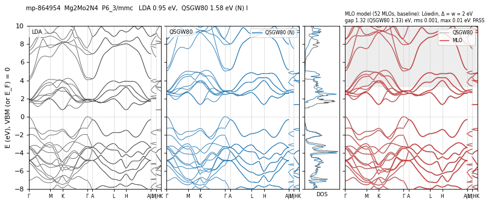

**mp-1016197** Mg2Si2As4 — QSGW80 **1.85** N / M ≈ eV D  — ecalj 989a18637 (tf32, t_tetrakbt -300) — MLO PASS (b1) 72 gap 1.86 rms 0.008 max 0.08 (ecalj a1d6c0e11)

<small>runs: M 1.83 · N 1.85 (10-04)</small>

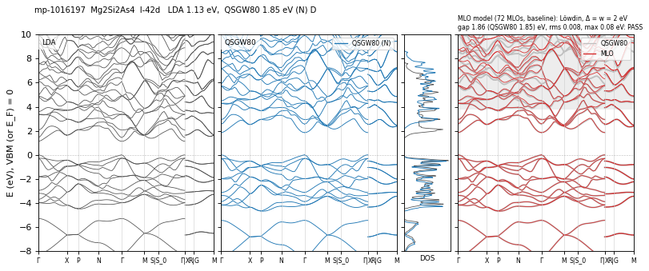

**mp-2961** Mg2Si2P4 — QSGW80 **2.11** N / M ≈ eV D  — ecalj 989a18637 (tf32, t_tetrakbt -300) — MLO PASS (b1) 72 gap 2.11 rms 0.005 max 0.04 (ecalj fb2da026b)

<small>runs: M 2.13 · N 2.11 (10-05)</small>

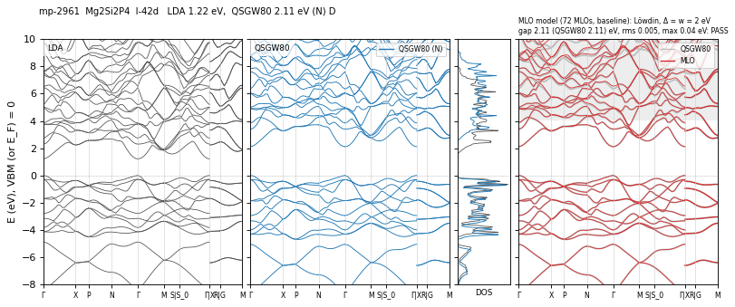

**mp-7589** Mg4N2F2 — QSGW80 **4.70** N / R ≈ eV I  — ecalj 989a18637 (tf32, t_tetrakbt -300) — MLO PASS (b1) 52 gap 4.69 rms 0.000 max 0.00 (ecalj fb2da026b)

<small>runs: M 4.99 · R 4.70 (10-01) · N 4.70 (10-05)</small>

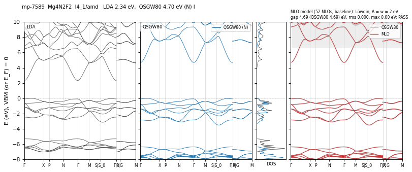

**mp-19734** MgPbF6 — QSGW80 **7.31** N / R ≈ eV I  — ecalj 989a18637 (tf32, t_tetrakbt -300) — MLO PASS (b1) 47 gap 7.32 rms 0.001 max 0.01 (ecalj fb2da026b)

<small>runs: M 1.76 · R 7.31 (10-01) · N 7.31 (10-05)</small>

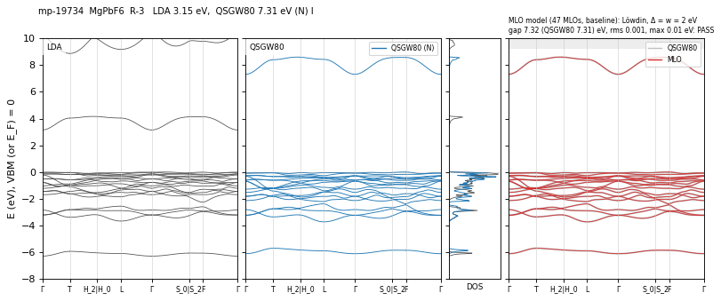

**mp-7921** MgPdF6 — QSGW80 **5.91** N / R ≈ eV D  — ecalj 989a18637 (tf32, t_tetrakbt -300) — MLO PASS (b1) 42 gap 5.91 rms 0.000 max 0.00 (ecalj fb2da026b)

<small>runs: M 5.36 · R 5.91 (10-01) · N 5.91 (10-06)</small>

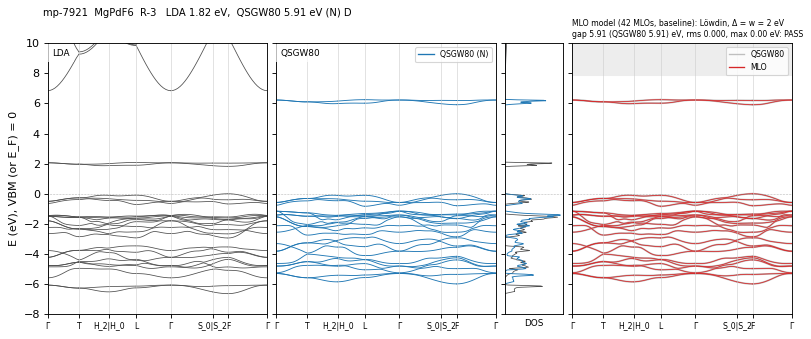

**mp-562561** Mo2O6 — QSGW80 **3.69** N / M 3.64 eV I differs — ecalj 989a18637 (tf32, t_tetrakbt -300) — MLO PASS (b1) 42 gap 3.69 rms 0.001 max 0.01 (ecalj fb2da026b)

<small>runs: M 3.64 · N 3.69 (10-05)</small>

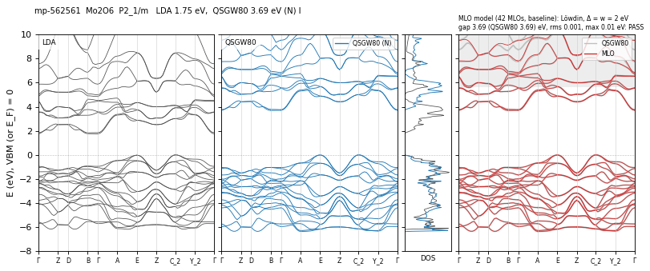

**mp-796276** Mo2O6 — QSGW80 **0.98** N / M 1.07 / R ≈ eV I differs QSGW<LDA — ecalj 989a18637 (tf32, t_tetrakbt -300) — MLO PASS (b1) 42 gap 0.98 rms 0.001 max 0.00 (ecalj fb2da026b)

*the CBM at Γ is a strongly dispersive interlayer (nearly-free-electron-like) state, which QSGW80 leaves near 1 eV while the Mo d bands go up: hence QSGW < LDA. Depends on how the basis describes the interlayer space (no empty spheres); to be checked*

<small>runs: M 1.07 · R 0.98 (10-01) · N 0.98 (10-03)</small>

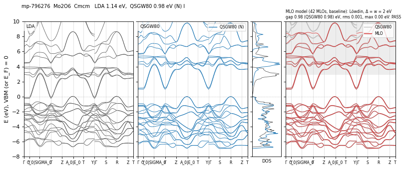

**mp-1095181** N6Cl2 — QSGW80 **6.43** E / N 6.51 / R 6.51 eV I differs — ecalj 0601771b4 (tf32, t_tetrakbt -300) with ES, ES rule es-c — MLO PASS (b1, ES) 48 gap 6.44 rms 0.005 max 0.03 (ecalj d2878d537)

<small>runs: M 7.72 · R 6.51 (10-01) · N 6.51 (10-06) · E 6.43 (10-07, ES 6, es-c)</small>

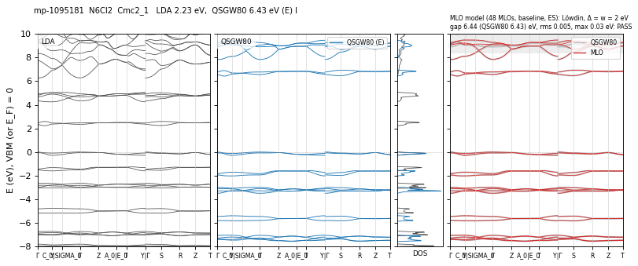

**mp-154** N8 — QSGW80 **13.64** E / M 13.93 / N 13.79 eV I CHECK — ecalj 0601771b4 (tf32, t_tetrakbt -300) with ES, ES rule es-c — MLO PASS (b2all, ES) 68 gap 13.64 rms 0.010 max 0.05 (ecalj 27d52b5af)

*ES by hand from 2026-10-07 14:38: 2.5 a.u., s (with 3.45 a.u. the QSGW80 had no gap in 10 iterations, dqp 69 eV); MLO PASS 0.054 eV*

<small>runs: M 13.93 · N 13.79 (10-04) · E MAXITER MAXITER (10-07, ES 4, es-c) · E 13.64 (10-07, ES 4, es-c)</small>

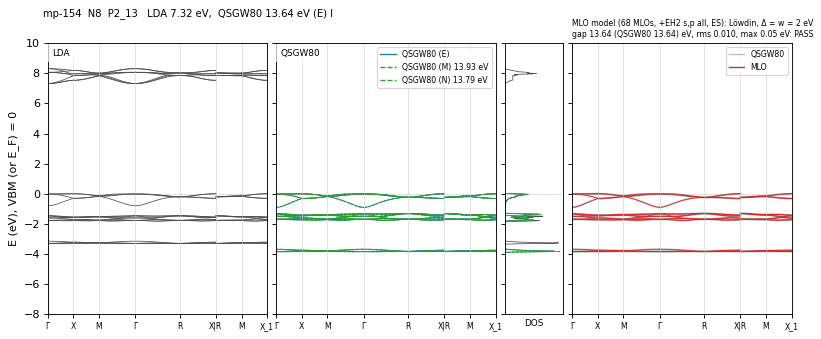

**mp-25** N8 — QSGW80 **12.65** E / N 13.39 / R 13.39 eV D CHECK vs2025 — ecalj 0601771b4 (tf32, t_tetrakbt -300) with ES, ES rule es-c — MLO PASS (b2all, ES) 80 gap 12.65 rms 0.003 max 0.02 (ecalj f09035a49)

<small>runs: M 13.34 · R 13.39 (10-01) · N 13.39 (10-05) · E 12.65 (10-07, ES 4, es-c)</small>

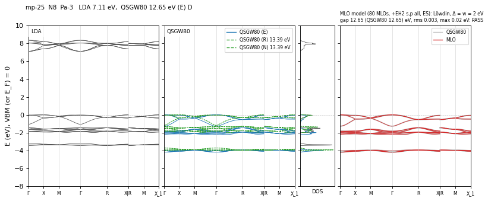

**mp-10166** Na2Al2Se4 — QSGW80 **3.76** N / M 3.82 eV I differs — ecalj 989a18637 (tf32, t_tetrakbt -300) — MLO PASS (b1) 72 gap 3.77 rms 0.004 max 0.05 (ecalj a1d6c0e11)

<small>runs: M 3.82 · N 3.76 (10-05)</small>

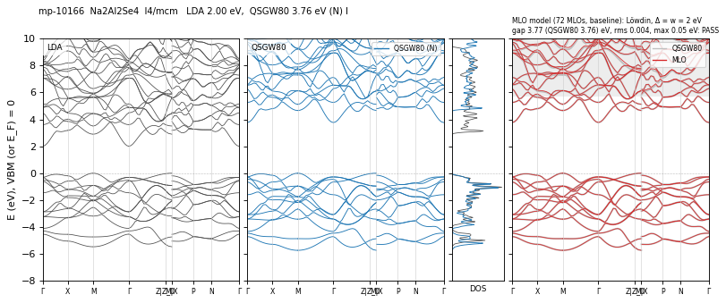

**mp-10163** Na2Al2Te4 — QSGW80 **2.35** N / M ≈ eV I  — ecalj 989a18637 (tf32, t_tetrakbt -300) — MLO PASS (b1) 72 gap 2.35 rms 0.006 max 0.05 (ecalj a1d6c0e11)

<small>runs: M 2.31 · N 2.35 (10-05)</small>

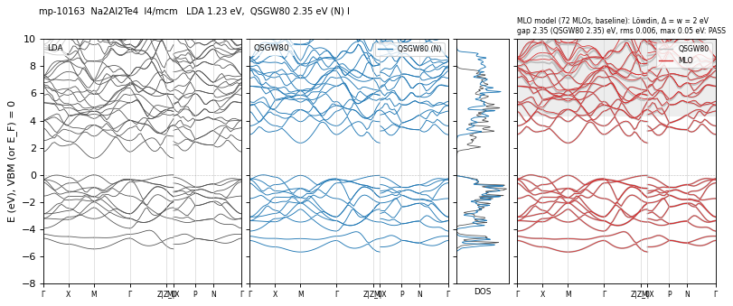

**mp-20343** Na2Au2O4 — QSGW80 **3.28** N / R ≈ eV I  — ecalj 989a18637 (tf32, t_tetrakbt -300) — MLO PASS (b1) 52 gap 3.29 rms 0.004 max 0.10 (ecalj fb2da026b)

<small>runs: M 6.64 · R 3.28 (10-01) · N 3.28 (10-06)</small>

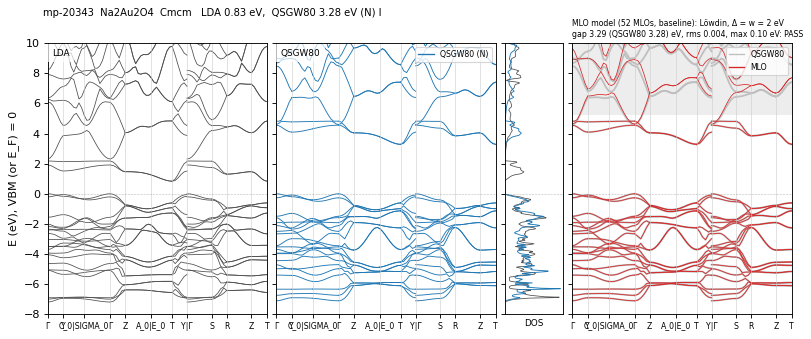

**mp-22984** Na2Bi2O4 — QSGW80 **2.25** N / M 2.31 eV D differs — ecalj 989a18637 (tf32, t_tetrakbt -300) — MLO PASS (b1) 52 gap 2.25 rms 0.000 max 0.01 (ecalj fb2da026b)

<small>runs: M 2.31 · N 2.25 (10-04)</small>

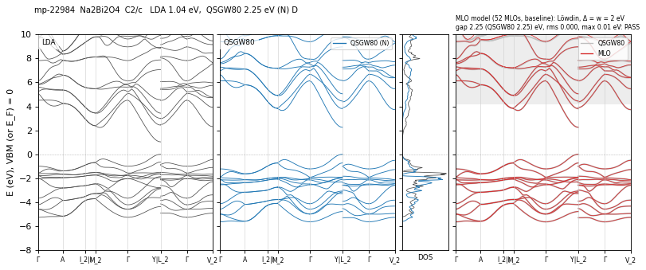

**mp-561075** Na2CdSnS4 — QSGW80 **3.45** N / M ≈ eV D  — ecalj 989a18637 (tf32, t_tetrakbt -300) — MLO PASS (b2) 88 gap 3.45 rms 0.000 max 0.00 (ecalj fb2da026b)

<small>runs: M 3.47 · N 3.45 (10-05)</small>

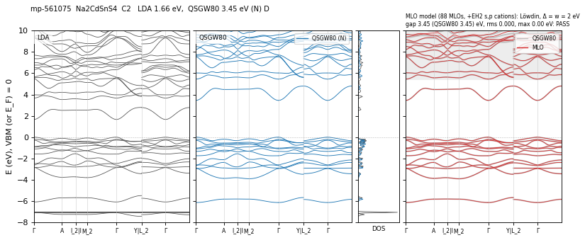

**mp-30965** Na2Cl2O4 — QSGW80 **6.22** N / M 6.40 eV D differs — ecalj 989a18637 (tf32, t_tetrakbt -300) — MLO PASS (b2) 60 gap 6.22 rms 0.002 max 0.01 (ecalj fb2da026b)

<small>runs: M 6.40 · N 6.22 (10-03)</small>

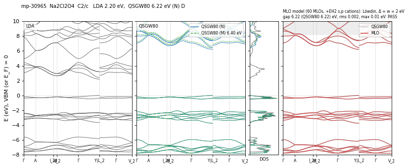

**mp-867515** Na2Co2O4 — QSGW80 **3.68** R eV I LDA≠PBE N:MAXITER — ecalj 989a18637 (fp32, t_tetrakbt +300) — MLO PASS (b1) 52 gap 3.57 rms 0.006 max 0.04 (ecalj fb2da026b)

*bands drawn again from the converged sigm (the plot was of iteration 10, before the extension to 19)*

<small>runs: M 3.65 · R 1.82 MAXITER (10-01) · N 3.57 MAXITER (10-06)</small>

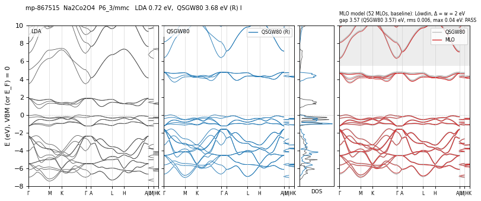

**mp-10164** Na2Ga2Te4 — QSGW80 **1.08** N / M ≈ eV I  — ecalj 989a18637 (tf32, t_tetrakbt -300) — MLO PASS (b1) 82 gap 1.08 rms 0.003 max 0.03 (ecalj fb2da026b)

<small>runs: M 1.10 · N 1.08 (10-05)</small>

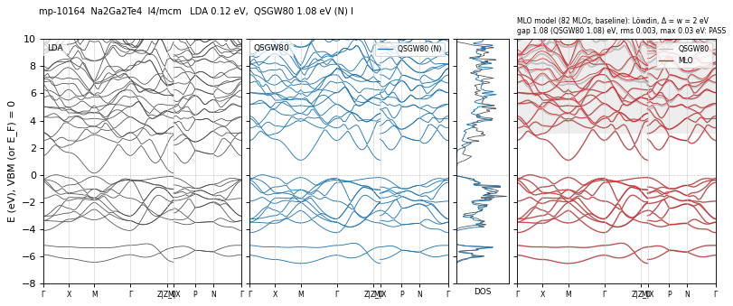

**mp-22483** Na2In2Te4 — QSGW80 **1.54** N / M ≈ eV I  — ecalj 989a18637 (tf32, t_tetrakbt -300) — MLO PASS (b1) 82 gap 1.53 rms 0.002 max 0.02 (ecalj fb2da026b)

<small>runs: M 1.54 · N 1.54 (10-04)</small>

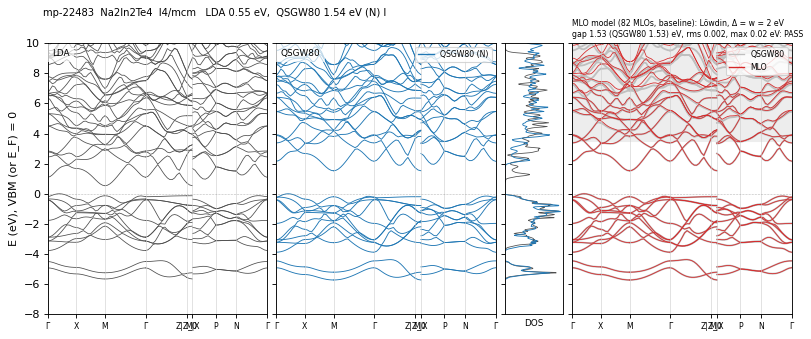

**mp-3744** Na2Nb2O4 — QSGW80 **2.70** N / M ≈ eV I  — ecalj 989a18637 (tf32, t_tetrakbt -300) — MLO PASS (b1) 52 gap 2.65 rms 0.002 max 0.01 (ecalj fb2da026b)

<small>runs: M 2.71 · N 2.70 (10-03)</small>

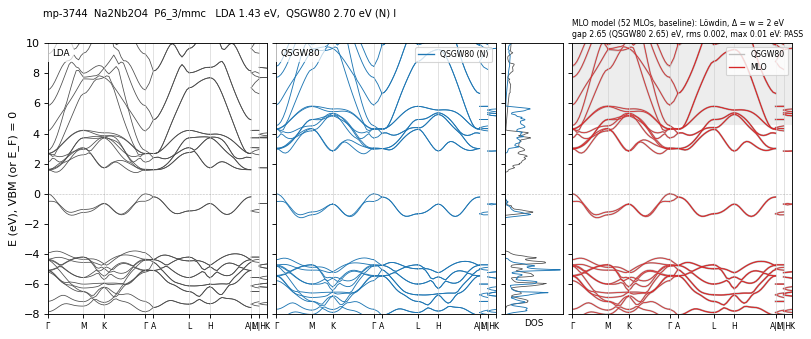

**mp-7937** Na2Nb2S4 — QSGW80 **1.38** N / M ≈ eV I  — ecalj 989a18637 (tf32, t_tetrakbt -300) — MLO PASS (b1) 72 gap 1.36 rms 0.001 max 0.00 (ecalj fb2da026b)

<small>runs: M 1.37 · N 1.38 (10-03)</small>

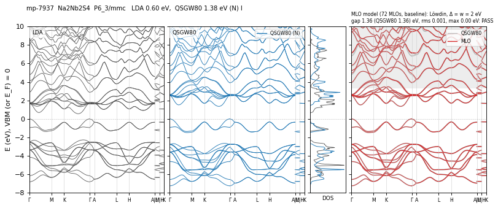

**mp-7939** Na2Nb2Se4 — QSGW80 **1.22** N / M ≈ eV I  — ecalj 989a18637 (tf32, t_tetrakbt -300) — MLO PASS (b1) 72 gap 1.17 rms 0.001 max 0.01 (ecalj fb2da026b)

<small>runs: M 1.21 · N 1.22 (10-05)</small>

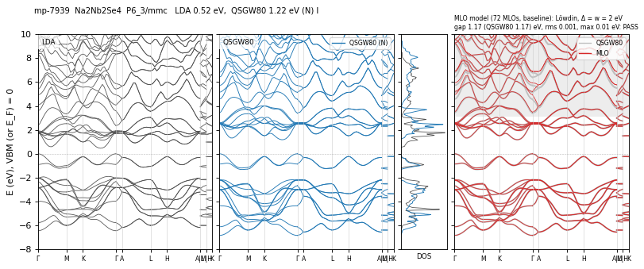

**mp-10572** Na2P2N4 — QSGW80 **6.91** N / M ≈ eV I  — ecalj 989a18637 (tf32, t_tetrakbt -300) — MLO PASS (b1) 52 gap 6.91 rms 0.002 max 0.01 (ecalj a1d6c0e11)

<small>runs: M 6.90 · N 6.91 (10-03)</small>

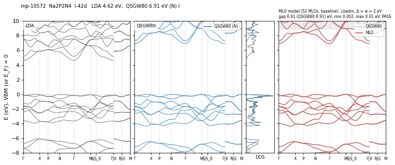

**mp-5414** Na2Sb2S4 — QSGW80 **1.79** N / M ≈ eV I  — ecalj 989a18637 (tf32, t_tetrakbt -300) — MLO PASS (b1) 72 gap 1.78 rms 0.002 max 0.01 (ecalj fb2da026b)

<small>runs: M 1.81 · N 1.79 (10-05)</small>

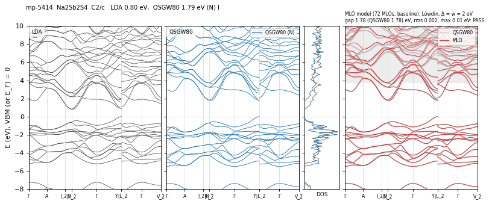

**mp-557179** Na2Sb2S4 — QSGW80 **1.43** N / M ≈ · path 0.90 eV D path<mesh(mesh) vs2025 — ecalj 989a18637 (tf32, t_tetrakbt -300) — MLO PASS (b1) 72 gap 0.90 rms 0.001 max 0.01 (ecalj fb2da026b)

<small>runs: M 1.44 · N 1.43 (10-05)</small>

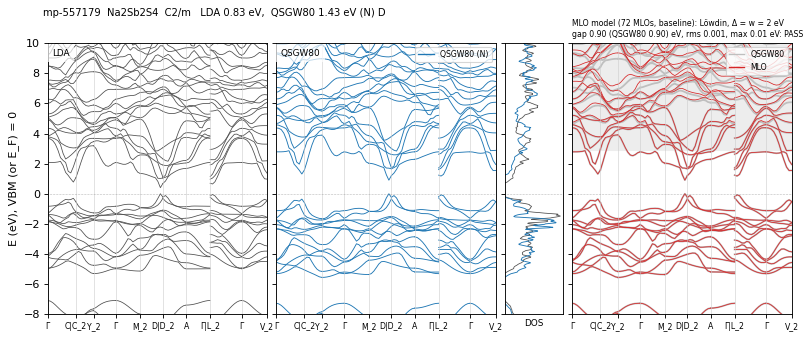

**mp-1078419** Na3PSe4 — QSGW80 **2.70** N / M ≈ eV D  — ecalj 989a18637 (tf32, t_tetrakbt -300) — MLO PASS (b1) 72 gap 2.70 rms 0.005 max 0.03 (ecalj a1d6c0e11)

<small>runs: M 2.73 · N 2.70 (10-04)</small>

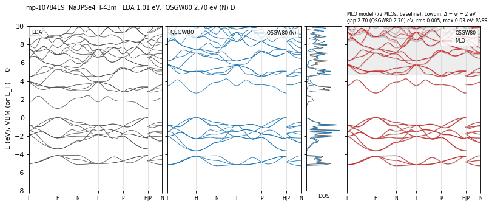

**mp-8703** Na3SbSe4 — QSGW80 **2.56** N / M ≈ eV D  — ecalj 989a18637 (tf32, t_tetrakbt -300) — MLO PASS (b1) 72 gap 2.56 rms 0.002 max 0.02 (ecalj fb2da026b)

<small>runs: M 2.54 · N 2.56 (10-05)</small>

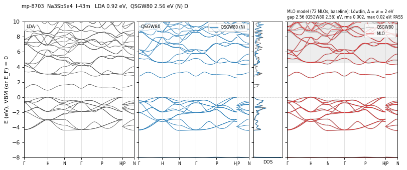

**mp-7392** Na4Ag2Sb2 — QSGW80 **1.24** N / M ≈ eV I  — ecalj 989a18637 (tf32, t_tetrakbt -300) — MLO PASS (b1) 72 gap 1.24 rms 0.002 max 0.02 (ecalj fb2da026b)

<small>runs: M 1.22 · N 1.24 (10-05)</small>

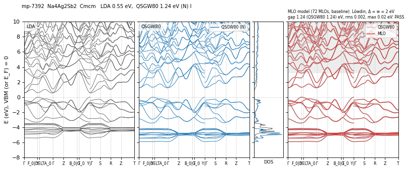

**mp-7773** Na4As2Au2 — QSGW80 **0.87** N / M ≈ eV I  — ecalj 989a18637 (tf32, t_tetrakbt -300) — MLO PASS (b1) 72 gap 0.87 rms 0.000 max 0.00 (ecalj fb2da026b)

<small>runs: M 0.88 · N 0.87 (10-03)</small>

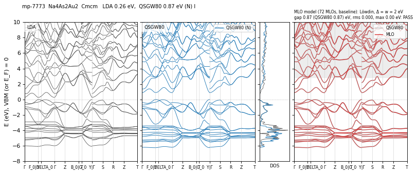

**mp-1078709** Na4Bi2Au2 — QSGW80 **0.72** N / M ≈ eV I  — ecalj 989a18637 (tf32, t_tetrakbt -300) — MLO PASS (b1) 72 gap 0.70 rms 0.002 max 0.02 (ecalj fb2da026b)

<small>runs: M 0.72 · N 0.72 (10-05)</small>

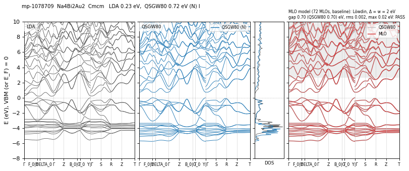

**mp-15685** Na4Cu2As2 — QSGW80 **1.32** N / M ≈ eV I  — ecalj 989a18637 (tf32, t_tetrakbt -300) — MLO PASS (b1) 72 gap 1.32 rms 0.000 max 0.00 (ecalj 0c4d16ceb)

<small>runs: M 1.34 · N 1.32 (10-03)</small>

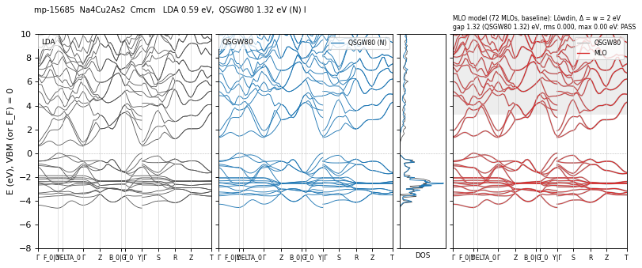

**mp-7639** Na4Cu2P2 — QSGW80 **1.37** N / M ≈ eV I  — ecalj 989a18637 (tf32, t_tetrakbt -300) — MLO PASS (b1) 72 gap 1.37 rms 0.000 max 0.00 (ecalj fb2da026b)

<small>runs: M 1.39 · N 1.37 (10-05)</small>

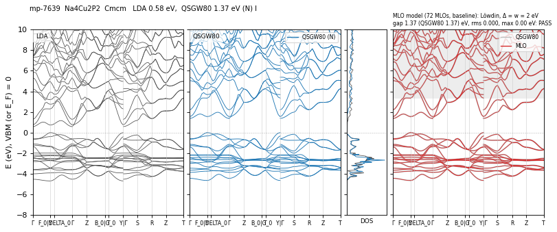

**mp-2400** Na4S4 — QSGW80 **3.43** N / M 3.36 eV D differs — ecalj 989a18637 (tf32, t_tetrakbt -300) — MLO PASS (b1) 72 gap 3.43 rms 0.005 max 0.06 (ecalj fb2da026b)

<small>runs: M 3.36 · N 3.43 (10-05)</small>

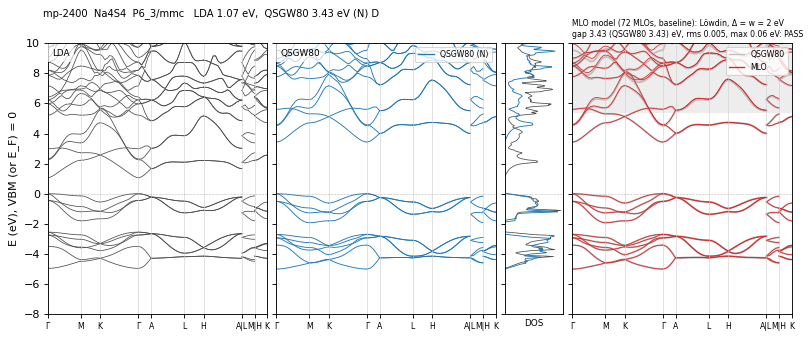

**mp-7774** Na4Sb2Au2 — QSGW80 **0.77** N / M ≈ eV I  — ecalj 989a18637 (tf32, t_tetrakbt -300) — MLO PASS (b1) 72 gap 0.77 rms 0.001 max 0.01 (ecalj fb2da026b)

<small>runs: M 0.77 · N 0.77 (10-05)</small>

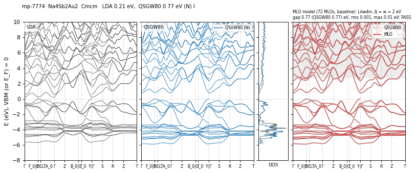

**mp-15668** Na4Se4 — QSGW80 **2.22** N / M 2.27 eV D differs — ecalj 989a18637 (tf32, t_tetrakbt -300) — MLO PASS (b2) 88 gap 2.22 rms 0.001 max 0.01 (ecalj fb2da026b)

<small>runs: M 2.27 · N 2.22 (10-05)</small>

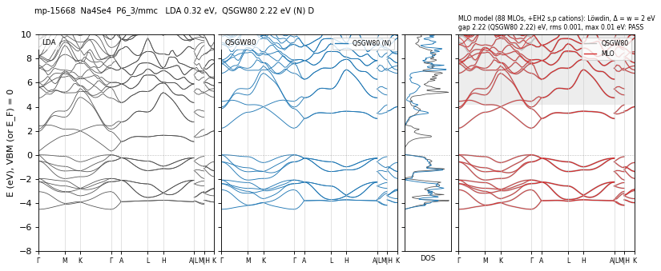

**mp-1136** Na6As2 — QSGW80 **1.13** N / M ≈ eV D  — ecalj 989a18637 (tf32, t_tetrakbt -300) — MLO PASS (b1) 72 gap 1.14 rms 0.009 max 0.05 (ecalj a1d6c0e11)

<small>runs: M 1.13 · N 1.13 (10-03)</small>

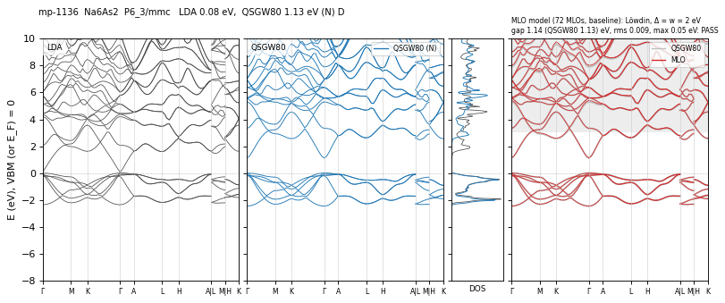

**mp-1598** Na6P2 — QSGW80 **1.43** N / M ≈ eV D  — ecalj 989a18637 (tf32, t_tetrakbt -300) — MLO PASS (b1) 72 gap 1.43 rms 0.003 max 0.02 (ecalj fb2da026b)

<small>runs: M 1.40 · N 1.43 (10-05)</small>

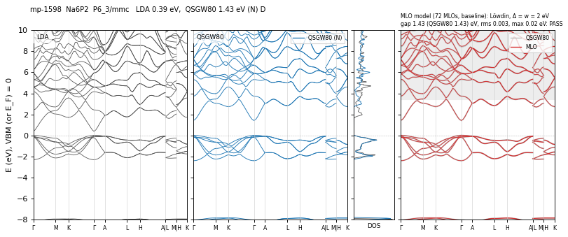

**mp-7956** Na6Sb2 — QSGW80 **1.41** N / M ≈ eV D  — ecalj 989a18637 (tf32, t_tetrakbt -300) — MLO PASS (b2) 96 gap 1.41 rms 0.001 max 0.01 (ecalj fb2da026b)

<small>runs: M 1.40 · N 1.41 (10-04)</small>

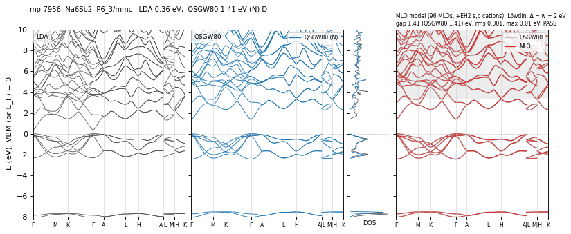

**mp-1079088** NaAsF6 — QSGW80 **11.07** N / M ≈ / R ≈ eV I  — ecalj 989a18637 (tf32, t_tetrakbt -300) — MLO PASS (b2) 49 gap 11.07 rms 0.000 max 0.00 (ecalj a1d6c0e11)

<small>runs: M 11.11 · R 11.07 (10-01) · N 11.07 (10-03)</small>

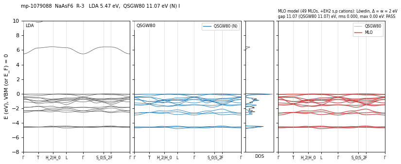

**mp-1087215** NaAsF6 — QSGW80 **11.24** E / N 11.19 / R 11.19 eV I differs — ecalj 0601771b4 (tf32, t_tetrakbt -300) with ES, ES rule es-c — MLO PASS (b1, ES) 53 gap 11.24 rms 0.001 max 0.01 (ecalj d2878d537)

<small>runs: M 13.95 · R 11.19 (10-01) · N 11.19 (10-06) · E 11.24 (10-07, ES 2, es-c)</small>

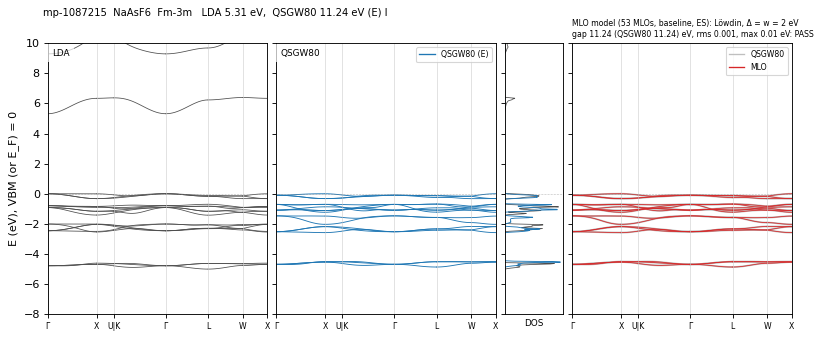

**mp-27420** NaBiF6 — QSGW80 **7.25** N / R ≈ eV I  — ecalj 989a18637 (tf32, t_tetrakbt -300) — MLO PASS (b1) 50 gap 7.26 rms 0.001 max 0.01 (ecalj fb2da026b)

<small>runs: M 6.91 · R 7.24 (10-01) · N 7.25 (10-06)</small>

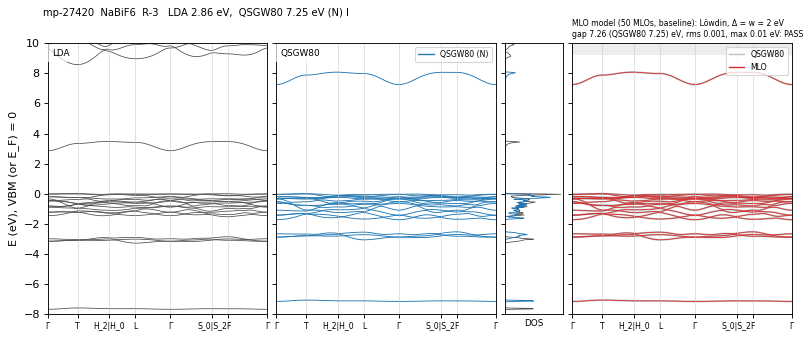

**mp-10474** NaPF6 — QSGW80 **12.78** N / M ≈ / R ≈ eV D  — ecalj 989a18637 (tf32, t_tetrakbt -300) — MLO PASS (b2all) 77 gap 12.78 rms 0.002 max 0.06 (ecalj a1d6c0e11)

<small>runs: M 12.75 · R 12.78 (10-01) · N 12.78 (10-03) · E MAXITER MAXITER (10-07, ES 2, es-c)</small>

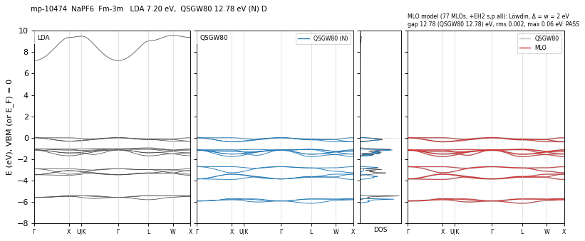

**mp-5955** NaSbF6 — QSGW80 **10.67** E / N ≈ / R ≈ eV I  — ecalj 0601771b4 (tf32, t_tetrakbt -300) with ES, ES rule es-c — MLO PASS (b1, ES) 53 gap 10.67 rms 0.000 max 0.00 (ecalj 00792e927)

<small>runs: M 8.17 · R 10.62 (10-01) · N 10.62 (10-05) · E 10.67 (10-07, ES 2, es-c)</small>

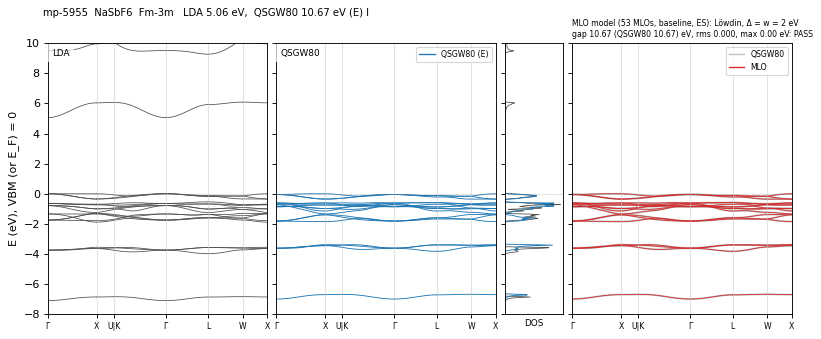

**mp-550070** Nb2Br4O2 — QSGW80 **2.12** N / M 2.38 eV I CHECK — ecalj 989a18637 (tf32, t_tetrakbt -300) — MLO PASS (b1) 62 gap 2.12 rms 0.001 max 0.01 (ecalj fb2da026b)

<small>runs: M 2.38 · N 2.12 (10-05)</small>

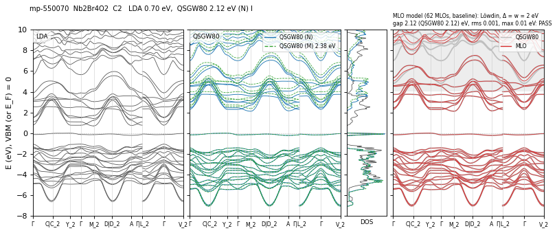

**mp-549720** Nb2I4O2 — QSGW80 **1.74** N / M ≈ eV I  — ecalj 989a18637 (tf32, t_tetrakbt -300) — MLO PASS (b1) 62 gap 1.74 rms 0.001 max 0.01 (ecalj fb2da026b)

<small>runs: M 1.69 · N 1.74 (10-03)</small>

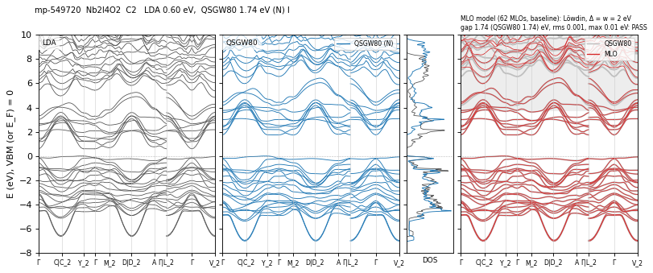

**mp-5621** NbCu3S4 — QSGW80 **2.69** N / M ≈ eV I  — ecalj 989a18637 (tf32, t_tetrakbt -300) — MLO PASS (b2all) 88 gap 2.69 rms 0.000 max 0.00 (ecalj fb2da026b)

<small>runs: M 2.68 · N 2.69 (10-04)</small>

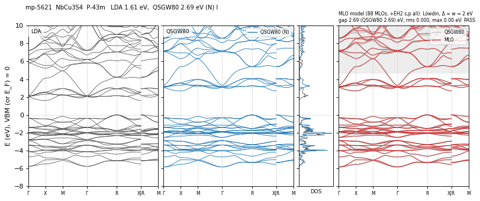

**mp-4043** NbCu3Se4 — QSGW80 **2.25** N / M ≈ eV I  — ecalj 989a18637 (tf32, t_tetrakbt -300) — MLO PASS (b2all) 88 gap 2.25 rms 0.000 max 0.00 (ecalj fb2da026b)

<small>runs: M 2.29 · N 2.25 (10-05)</small>

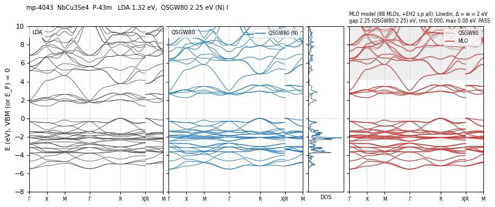

**mp-991676** NbCu3Te4 — QSGW80 **1.57** N / M ≈ eV I  — ecalj 989a18637 (tf32, t_tetrakbt -300) — MLO PASS (b2all) 88 gap 1.57 rms 0.001 max 0.01 (ecalj fb2da026b)

<small>runs: M 1.57 · N 1.57 (10-05)</small>

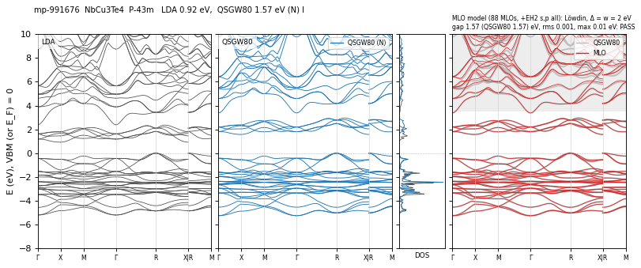

**mp-1091384** NbTl3S4 — QSGW80 **3.40** N / M ≈ eV I  — ecalj 989a18637 (tf32, t_tetrakbt -300) — MLO PASS (b1) 87 gap 3.40 rms 0.003 max 0.03 (ecalj fb2da026b)

<small>runs: M 3.45 · N 3.40 (10-05)</small>

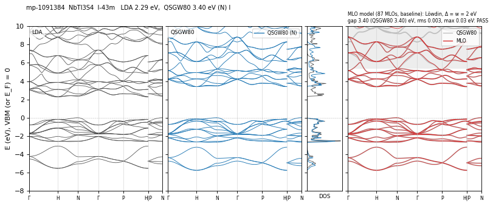

**mp-1025396** NbTl3Se4 — QSGW80 **2.90** N / M 2.97 eV D differs — ecalj 989a18637 (tf32, t_tetrakbt -300) — MLO PASS (b1) 87 gap 2.90 rms 0.003 max 0.04 (ecalj a1d6c0e11)

<small>runs: M 2.97 · N 2.90 (10-04)</small>

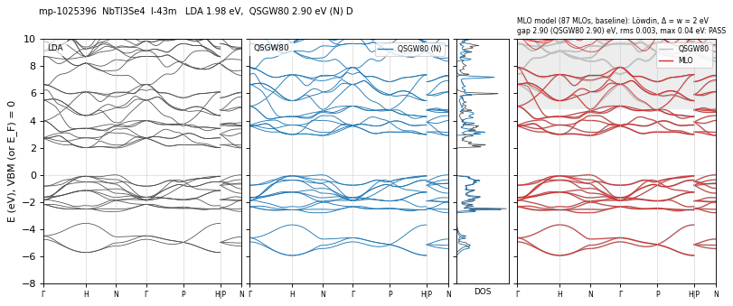

**mp-12957** O8 — QSGW80 **4.01** E / M 4.35 / N 4.19 eV I CHECK — ecalj 0601771b4 (tf32, t_tetrakbt -300) with ES, ES rule es-c — MLO PASS (b1, ES) 38 gap 4.02 rms 0.000 max 0.00 (ecalj d2878d537)

<small>runs: M 4.35 · N 4.19 (10-03) · E 4.01 (10-07, ES 6, es-c)</small>

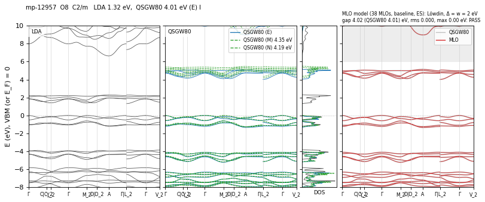

**mp-27529** P2I6 — QSGW80 **3.72** E / M 3.80 / N 3.82 eV D differs — ecalj 0601771b4 (tf32, t_tetrakbt -300) with ES, ES rule es-c — MLO PASS (b1, ES) 88 gap 3.70 rms 0.001 max 0.01 (ecalj f09035a49)

<small>runs: M 3.80 · N 3.82 (10-05) · E 3.72 (10-07, ES 4, es-c)</small>

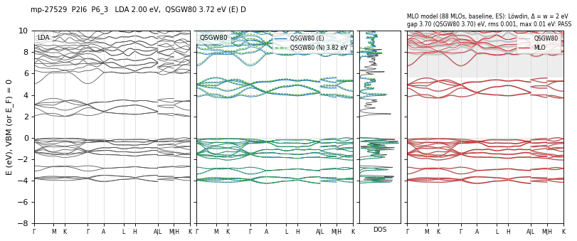

**mp-560008** P2N2F4 — QSGW80 **9.13** N / R ≈ eV D  — ecalj 989a18637 (tf32, t_tetrakbt -300) — MLO PASS (b2all) 74 gap 9.13 rms 0.001 max 0.01 (ecalj fb2da026b)

<small>runs: M 9.21 · R 9.13 (10-01) · N 9.13 (10-06)</small>

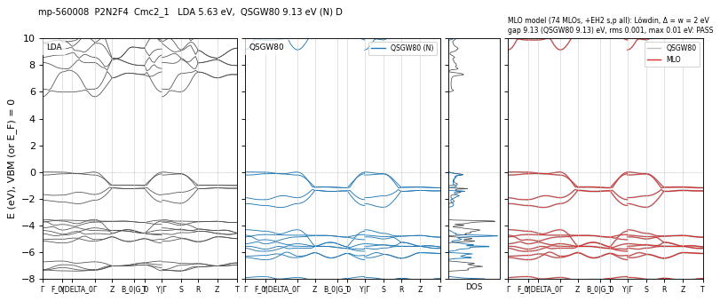

**mp-1954** P3N5 — QSGW80 **4.38** N / M 4.26 eV I differs — ecalj 989a18637 (tf32, t_tetrakbt -300) — MLO PASS (b2all) 79 gap 4.33 rms 0.004 max 0.04 (ecalj fb2da026b)

<small>runs: M 4.26 · N 4.38 (10-05)</small>

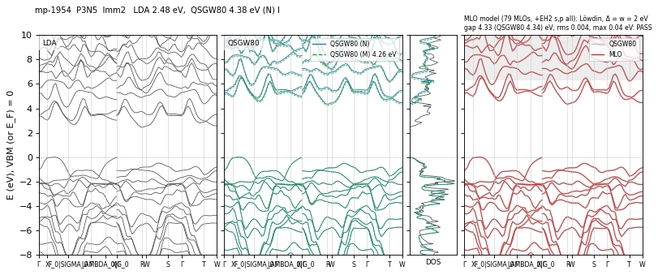

**mp-12883** P8 — QSGW80 **4.90** E / M 5.04 / N ≈ eV I differs — ecalj 0601771b4 (tf32, t_tetrakbt -300) with ES, ES rule es-c — MLO PASS (b1, ES) 82 gap 4.90 rms 0.005 max 0.03 (ecalj f16f0ea3d)

<small>runs: M 5.04 · N 4.93 (10-05) · E 4.90 (10-06, ES 10, es-c)</small>

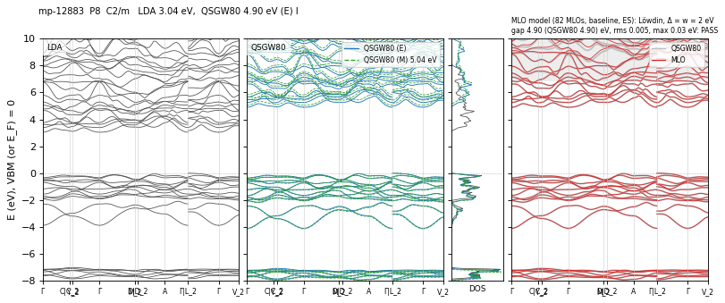

**mp-20878** Pb4O4 — QSGW80 **3.20** N / M ≈ eV I  — ecalj 989a18637 (tf32, t_tetrakbt -300) — MLO PASS (b2) 88 gap 3.20 rms 0.001 max 0.01 (ecalj fb2da026b)

<small>runs: M 3.17 · N 3.20 (10-05)</small>

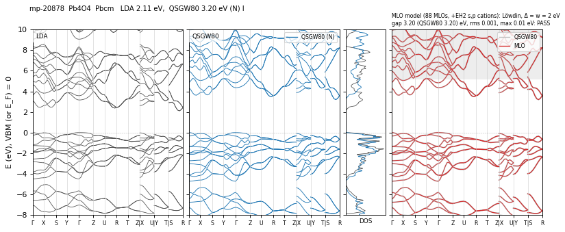

**mp-550714** Pb4O4 — QSGW80 **3.43** N / M 3.37 eV I differs — ecalj 989a18637 (tf32, t_tetrakbt -300) — MLO PASS (b2) 88 gap 3.43 rms 0.001 max 0.00 (ecalj fb2da026b)

<small>runs: M 3.37 · N 3.43 (10-05)</small>

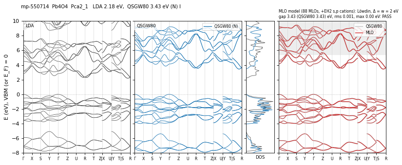

**mp-1078500** Pb4S4 — QSGW80 **1.71** N / M ≈ eV I  — ecalj 989a18637 (tf32, t_tetrakbt -300) — MLO PASS (b1) 72 gap 1.64 rms 0.001 max 0.01 (ecalj a1d6c0e11)

<small>runs: M 1.72 · N 1.71 (10-04)</small>

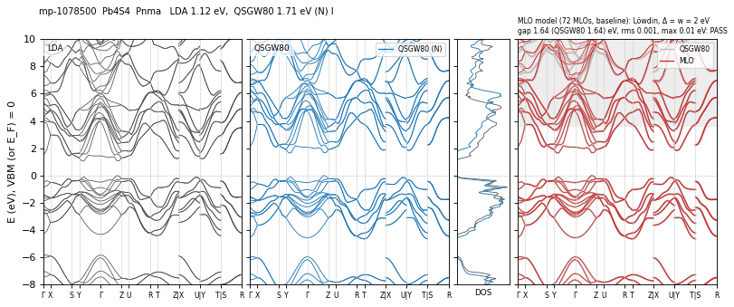

**mp-1079172** Pb4Se4 — QSGW80 **1.74** N / M ≈ eV D  — ecalj 989a18637 (tf32, t_tetrakbt -300) — MLO PASS (b1) 72 gap 1.66 rms 0.003 max 0.02 (ecalj a1d6c0e11)

<small>runs: M 1.75 · N 1.74 (10-04)</small>

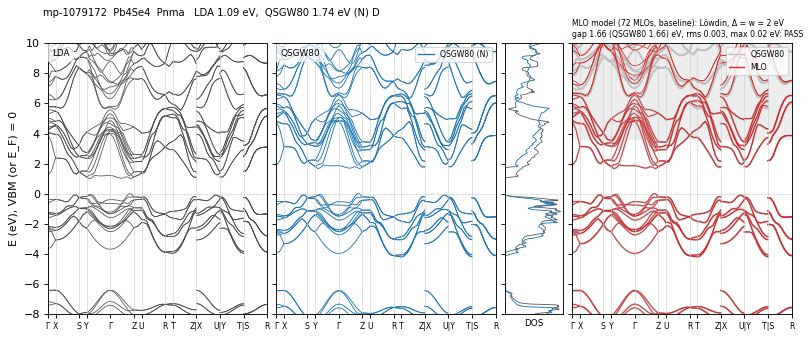

**mp-20458** PtPbF6 — QSGW80 **5.11** N / R ≈ eV I  — ecalj 989a18637 (tf32, t_tetrakbt -300) — MLO PASS (b1) 47 gap 5.10 rms 0.001 max 0.00 (ecalj fb2da026b)

<small>runs: M FAILED · R 5.11 (09-30) · N 5.11 (10-05)</small>

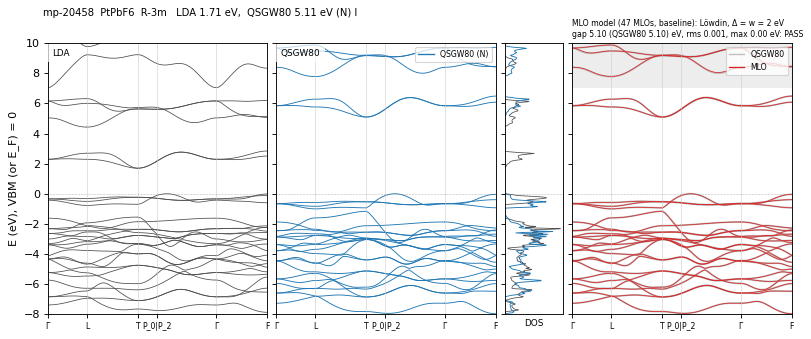

**mp-14070** Rb2Al2O4 — QSGW80 **6.35** N / R ≈ eV D  — ecalj 989a18637 (tf32, t_tetrakbt -300) — MLO PASS (b1) 58 gap 6.35 rms 0.002 max 0.03 (ecalj fb2da026b)

<small>runs: M FAILED · R 6.35 (09-30) · N 6.35 (10-05)</small>

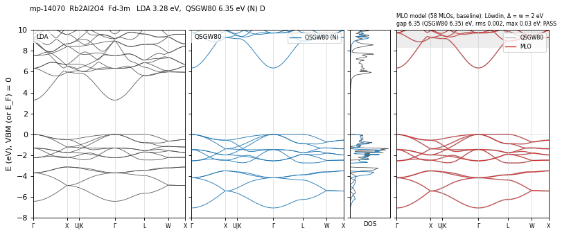

**mp-7472** Rb2Au2O4 — QSGW80 **4.08** E / N ≈ / R ≈ eV I  — ecalj 0601771b4 (tf32, t_tetrakbt -300) with ES, ES rule es-c — MLO PASS (b1, ES) 60 gap 4.08 rms 0.001 max 0.04 (ecalj 0e7afd246)

<small>runs: M 6.84 · R 4.08 (10-01) · N 4.08 (10-06) · E 4.08 (10-07, ES 2, es-c)</small>

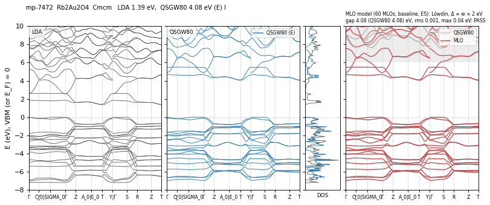

**mp-29521** Rb2Bi2O4 — QSGW80 **3.67** N / M 3.93 eV D CHECK — ecalj 989a18637 (tf32, t_tetrakbt -300) — MLO PASS (b2) 74 gap 3.67 rms 0.001 max 0.00 (ecalj fb2da026b)

<small>runs: M 3.93 · N 3.67 (10-03)</small>

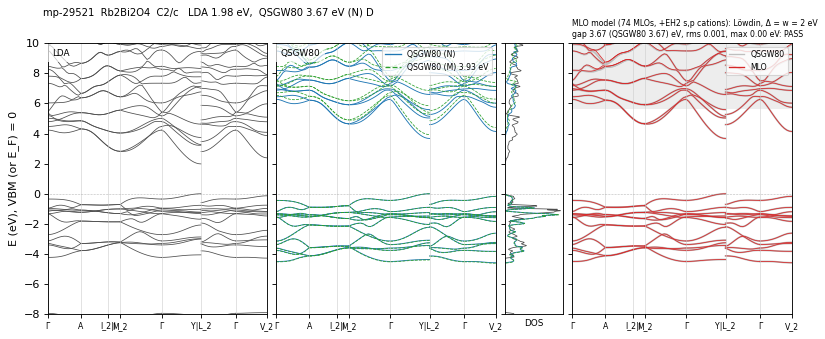

**mp-549590** Rb2Cl2O4 — QSGW80 **6.12** N / M 6.04 eV I differs — ecalj 989a18637 (tf32, t_tetrakbt -300) — MLO PASS (b2all) 90 gap 6.12 rms 0.003 max 0.03 (ecalj fb2da026b)

<small>runs: M 6.04 · N 6.12 (10-03)</small>

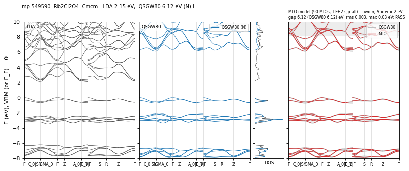

**mp-5425** Rb2Cu2C4 — QSGW80 **4.06** N / M ≈ eV D  — ecalj 989a18637 (tf32, t_tetrakbt -300) — MLO PASS (b2) 82 gap 4.06 rms 0.005 max 0.04 (ecalj fb2da026b)

<small>runs: M 4.01 · N 4.06 (10-05)</small>

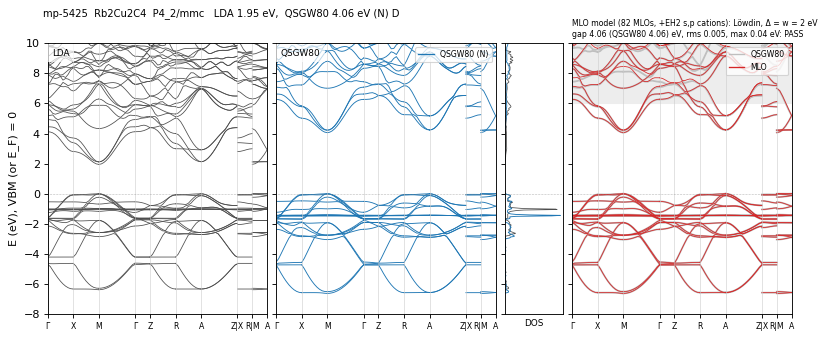

**mp-7467** Rb2Cu2O4 — QSGW80 **3.54** N / R ≈ eV I  — ecalj 989a18637 (tf32, t_tetrakbt -300) — MLO PASS (b2) 66 gap 3.53 rms 0.000 max 0.00 (ecalj fb2da026b)

<small>runs: M FAILED · R 3.53 (09-30) · N 3.54 (10-06)</small>

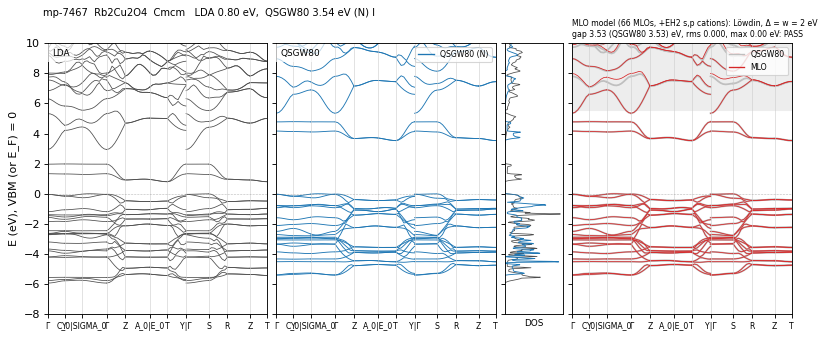

**mp-29764** Rb2H2F4 — QSGW80 **11.31** N / R ≈ eV I  — ecalj 989a18637 (tf32, t_tetrakbt -300) — MLO PASS (b2) 64 gap 11.31 rms 0.005 max 0.04 (ecalj fb2da026b)

<small>runs: M FAILED · R 11.31 (09-30) · N 11.31 (10-05)</small>

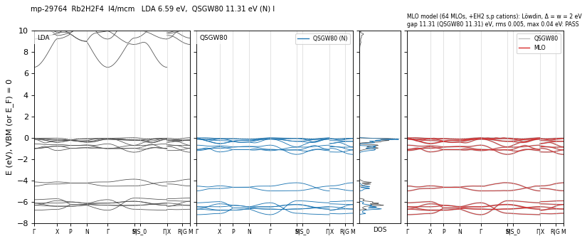

**mp-697144** Rb2H4N2 — QSGW80 **4.78** N / R ≈ eV I  — ecalj 989a18637 (tf32, t_tetrakbt -300) — MLO PASS (b2) 72 gap 4.78 rms 0.003 max 0.02 (ecalj fb2da026b)

<small>runs: M FAILED · R 4.78 (09-30) · N 4.78 (10-06)</small>

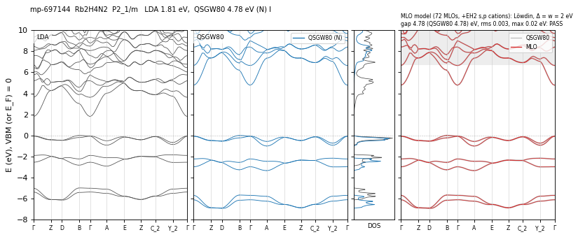

**mp-22255** Rb2In2Te4 — QSGW80 **2.21** N / M ≈ eV I  — ecalj 989a18637 (tf32, t_tetrakbt -300) — MLO PASS (b2) 104 gap 2.21 rms 0.001 max 0.01 (ecalj fb2da026b)

<small>runs: M 2.23 · N 2.21 (10-05)</small>

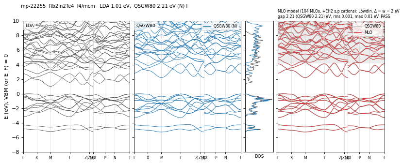

**mp-28237** Rb2Li2Br4 — QSGW80 **7.03** N / M 6.94 eV D differs — ecalj 989a18637 (tf32, t_tetrakbt -300) — MLO PASS (b2) 84 gap 7.03 rms 0.002 max 0.02 (ecalj fb2da026b)

<small>runs: M 6.94 · N 7.03 (10-04)</small>

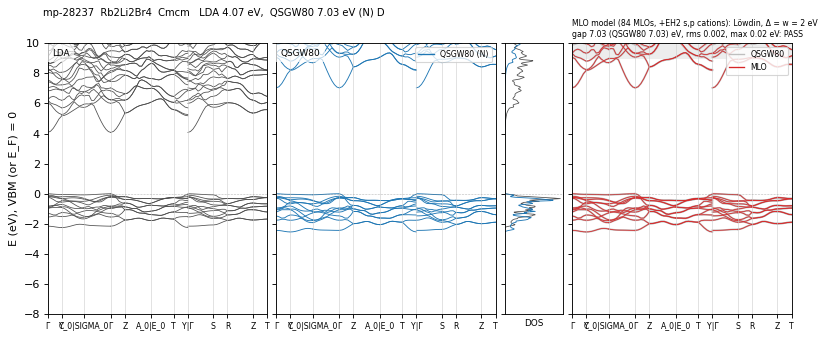

**mp-28243** Rb2Li2Cl4 — QSGW80 **8.17** N / M 8.03 eV D differs — ecalj 989a18637 (tf32, t_tetrakbt -300) — MLO PASS (b2) 84 gap 8.17 rms 0.001 max 0.01 (ecalj fb2da026b)

<small>runs: M 8.03 · N 8.17 (10-05)</small>

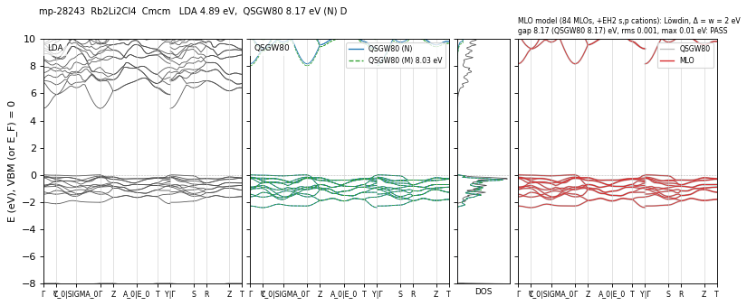

**mp-743** Rb2N6 — QSGW80 **6.98** N / M 6.89 eV I differs — ecalj 989a18637 (tf32, t_tetrakbt -300) — MLO PASS (b2all) 80 gap 6.99 rms 0.012 max 0.10 (ecalj fb2da026b)

<small>runs: M 6.89 · N 6.98 (10-04)</small>

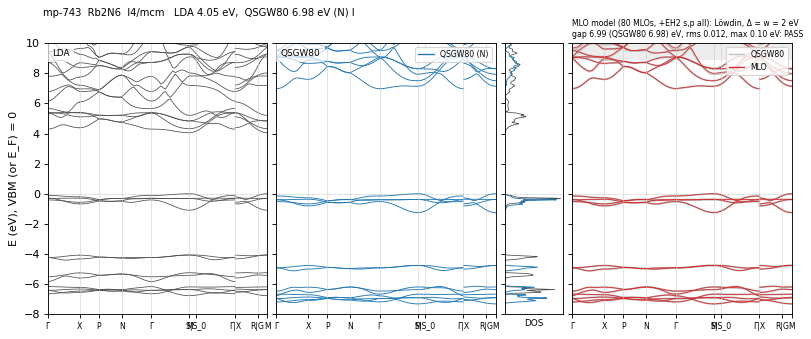

**mp-10418** Rb2Sb2O4 — QSGW80 **4.13** N / M ≈ eV D  — ecalj 989a18637 (tf32, t_tetrakbt -300) — MLO PASS (b2all) 90 gap 4.13 rms 0.001 max 0.01 (ecalj fb2da026b)

<small>runs: M 4.10 · N 4.13 (10-05)</small>

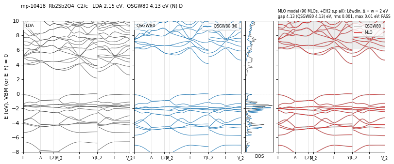

**mp-7650** Rb2Sc2O4 — QSGW80 **6.06** N / M 6.21 eV I differs vs2025 — ecalj 989a18637 (tf32, t_tetrakbt -300) — MLO PASS (b1) 58 gap 6.06 rms 0.004 max 0.04 (ecalj 26b32d5d5)

*from 2026-10-07 16:58: QSGW80 and LDA again with the Rb sphere 2.5 a.u. (ecalj_auto: by hand, run_custom): with 2.8 a.u. a ghost level near A (no degenerate partner on A-L; in LDA too) entered the MLO window; gap 6.058 eV (6.056 with 2.8); MLO b1 PASS 0.040 eV*

<small>runs: M 6.21 · N 6.06 (10-02) · N 6.06 (10-07)</small>

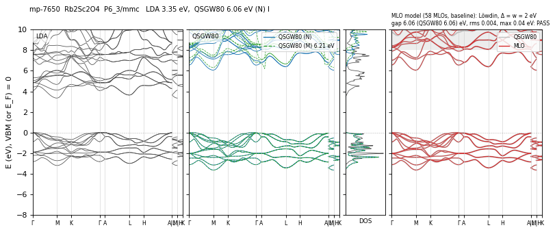

**mp-1080691** Rb2SnHgTe4 — QSGW80 **1.58** N / M ≈ eV I  — ecalj 989a18637 (tf32, t_tetrakbt -300) — MLO PASS (b1) 78 gap 1.58 rms 0.009 max 0.08 (ecalj fb2da026b)

<small>runs: M 1.57 · N 1.58 (10-05)</small>

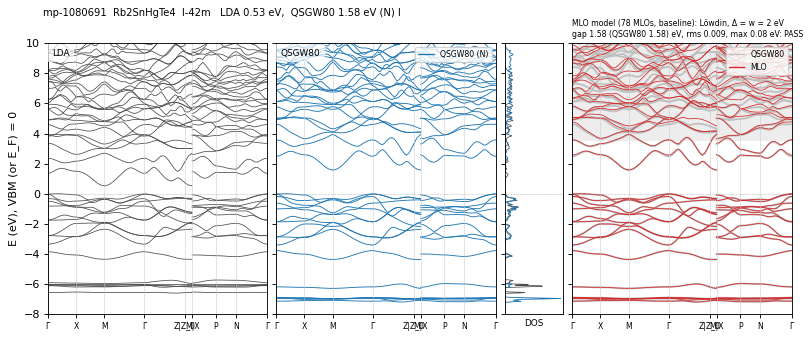

**mp-16764** Rb2Y2Te4 — QSGW80 **2.60** N / M ≈ eV I  — ecalj 989a18637 (tf32, t_tetrakbt -300) — MLO PASS (b2) 86 gap 2.60 rms 0.002 max 0.01 (ecalj fb2da026b)

<small>runs: M 2.58 · N 2.60 (10-05)</small>

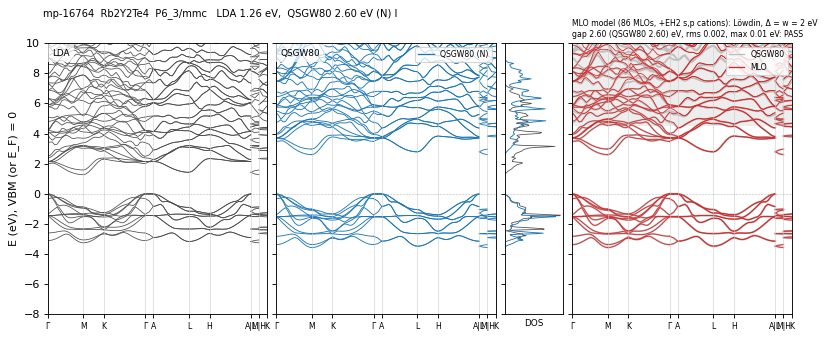

**mp-9274** Rb3Sb2Au3 — QSGW80 **1.83** N / R ≈ eV I  — ecalj 989a18637 (tf32, t_tetrakbt -300) — MLO PASS (b2) 93 gap 1.83 rms 0.002 max 0.01 (ecalj fb2da026b)

<small>runs: M 2.10 · R 1.83 (09-30) · N 1.83 (10-06)</small>

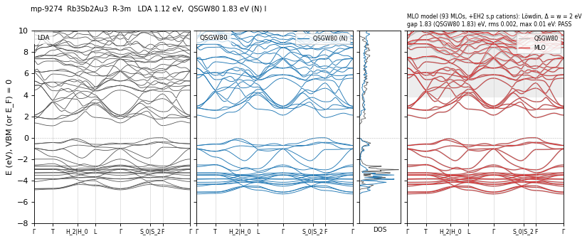

**mp-8360** Rb4Te4 — QSGW80 **2.27** N / R ≈ eV I  — ecalj 989a18637 (tf32, t_tetrakbt -300) — MLO PASS (b2) 100 gap 2.24 rms 0.001 max 0.01 (ecalj fb2da026b)

<small>runs: M 2.12 · R 2.27 (09-30) · N 2.27 (10-06)</small>

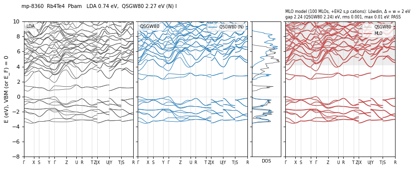

**mp-16319** Rb6Sb2 — QSGW80 **0.95** N / M ≈ eV I  — ecalj 989a18637 (tf32, t_tetrakbt -300) — MLO PASS (b2) 114 gap 0.95 rms 0.004 max 0.02 (ecalj fb2da026b)

<small>runs: M 0.91 · N 0.95 (10-05)</small>

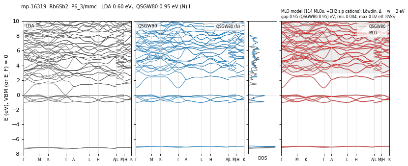

**mp-9819** RbAsF6 — QSGW80 **10.80** N / M 10.53 eV D CHECK — ecalj 989a18637 (tf32, t_tetrakbt -300) — MLO PASS (b2) 50 gap 10.80 rms 0.000 max 0.00 (ecalj fb2da026b)

<small>runs: M 10.53 · N 10.80 (10-04)</small>

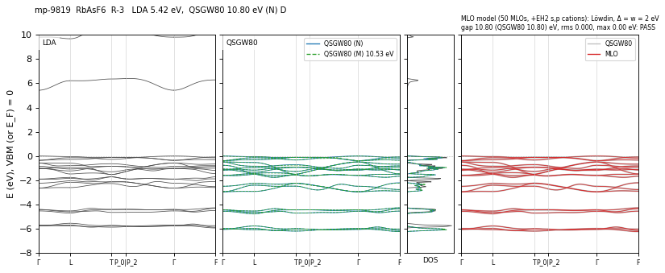

**mp-696736** RbBe2F5 — QSGW80 **11.95** N / R ≈ eV D  — ecalj 989a18637 (tf32, t_tetrakbt -300) — MLO PASS (b2) 53 gap 11.96 rms 0.001 max 0.02 (ecalj fb2da026b)

<small>runs: M 11.60 · R 11.95 (09-30) · N 11.95 (10-06)</small>

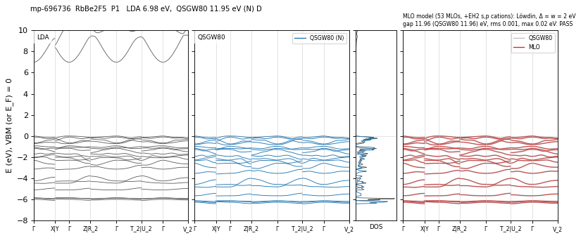

**mp-27421** RbBiF6 — QSGW80 **6.99** N / M 6.65 eV I CHECK — ecalj 989a18637 (tf32, t_tetrakbt -300) — MLO PASS (b1) 51 gap 6.99 rms 0.001 max 0.00 (ecalj fb2da026b)

<small>runs: M 6.65 · N 6.99 (10-03)</small>

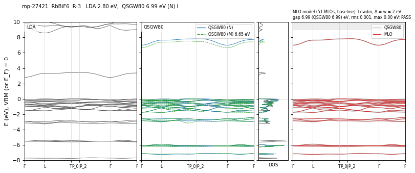

**mp-9821** RbSbF6 — QSGW80 **10.11** N / R ≈ eV I  — ecalj 989a18637 (tf32, t_tetrakbt -300) — MLO PASS (b1) 46 gap 10.18 rms 0.008 max 0.07 (ecalj fb2da026b)

<small>runs: M 10.06 · R 10.11 (10-01) · N 10.11 (10-05)</small>

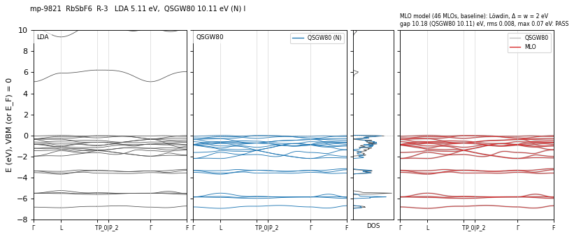

**mp-975140** RbZn4P3 — QSGW80 **1.18** N / M ≈ eV D  — ecalj 989a18637 (tf32, t_tetrakbt -300) — MLO PASS (b1) 75 gap 1.18 rms 0.006 max 0.07 (ecalj fb2da026b)

<small>runs: M 1.18 · N 1.18 (10-05)</small>

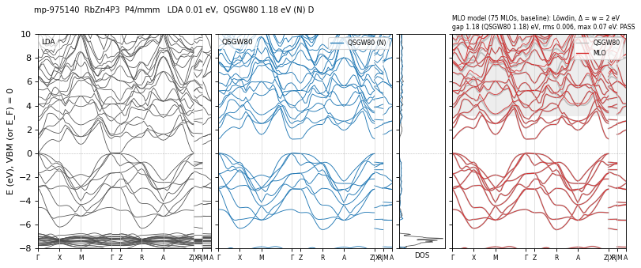

**mp-27871** Rh2Br6 — QSGW80 **2.66** N / M 2.61 eV I differs — ecalj 989a18637 (tf32, t_tetrakbt -300) — MLO PASS (b1) 72 gap 2.69 rms 0.001 max 0.01 (ecalj fb2da026b)

<small>runs: M 2.61 · N 2.66 (10-04)</small>

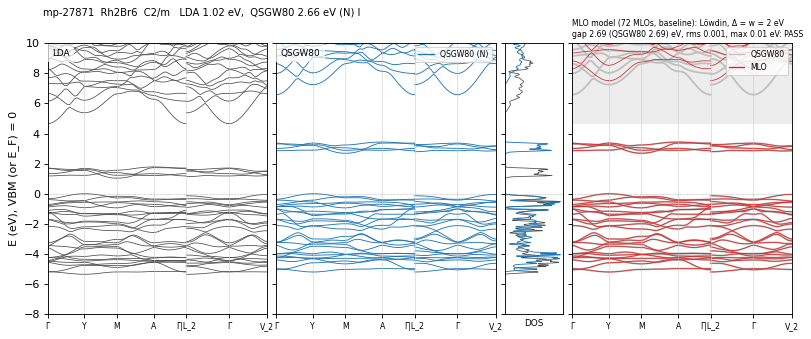

**mp-27770** Rh2Cl6 — QSGW80 **3.40** N / M ≈ eV I  — ecalj 989a18637 (tf32, t_tetrakbt -300) — MLO PASS (b1) 72 gap 3.41 rms 0.001 max 0.01 (ecalj fb2da026b)

<small>runs: M 3.39 · N 3.40 (10-03)</small>

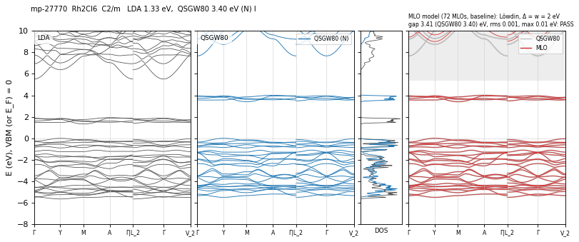

**mp-2068** Rh2F6 — QSGW80 **4.00** N / M 3.62 eV I CHECK vs2025 — ecalj 989a18637 (tf32, t_tetrakbt -300) — MLO PASS (b1) 42 gap 4.00 rms 0.001 max 0.01 (ecalj fb2da026b)

<small>runs: M 3.62 · N 4.00 (10-02)</small>

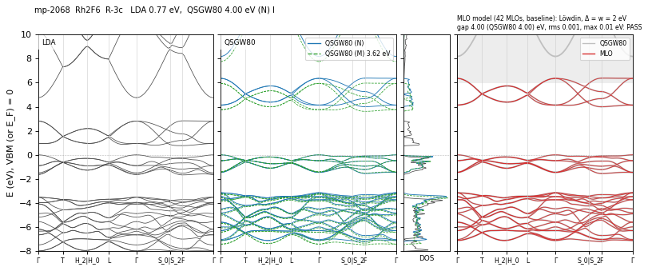

**mp-28099** S4Br4 — QSGW80 **4.11** E / M ≈ / N ≈ eV I  — ecalj 0601771b4 (tf32, t_tetrakbt -300) with ES, ES rule es-c — MLO PASS (b1, ES) 78 gap 4.10 rms 0.001 max 0.01 (ecalj f16f0ea3d)

<small>runs: M 4.10 · N 4.14 (10-05) · E 4.11 (10-06, ES 6, es-c)</small>

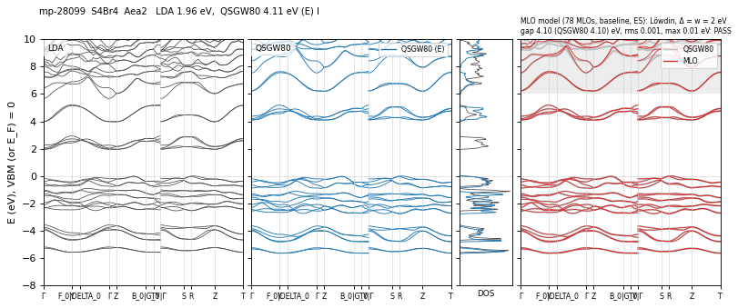

**mp-236** S4N4 — QSGW80 **5.38** E / M ≈ / N 5.46 eV I differs — ecalj 0601771b4 (tf32, t_tetrakbt -300) with ES, ES rule es-c — MLO PASS (b2all, ES) 86 gap 5.38 rms 0.001 max 0.01 (ecalj f09035a49)

<small>runs: M 5.41 · N 5.46 (10-05) · E 5.38 (10-07, ES 2, es-c)</small>

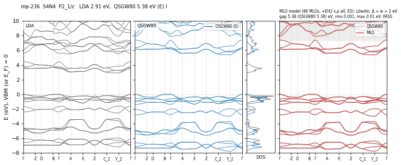

**mp-1880** Sb2F6 — QSGW80 **7.30** E / N ≈ / R ≈ eV I  — ecalj 0601771b4 (tf32, t_tetrakbt -300) with ES, ES rule es-c — MLO PASS (b1, ES) 46 gap 7.29 rms 0.003 max 0.03 (ecalj f16f0ea3d)

<small>runs: M 7.19 · R 7.31 (10-01) · N 7.31 (10-06) · E 7.30 (10-06, ES 4, es-c)</small>

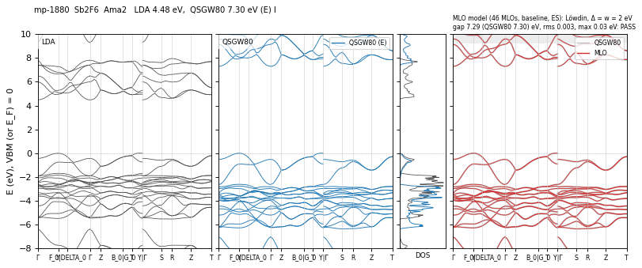

**mp-23281** Sb2I6 — QSGW80 **2.95** E / M ≈ / N ≈ eV I  — ecalj 0601771b4 (tf32, t_tetrakbt -300) with ES, ES rule es-c — MLO PASS (b1, ES) 74 gap 2.96 rms 0.003 max 0.02 (ecalj f09035a49)

<small>runs: M 2.90 · N 2.95 (10-04) · E 2.95 (10-07, ES 2, es-c)</small>

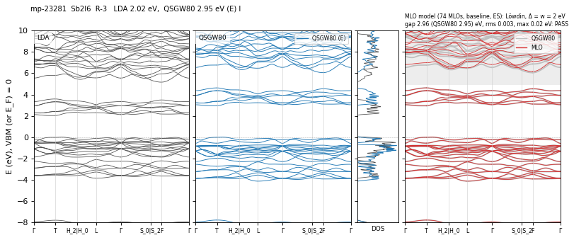

**mp-1080747** Sc2Al2C2O2 — QSGW80 **2.64** N / M ≈ eV I  — ecalj 989a18637 (tf32, t_tetrakbt -300) — MLO PASS (b1) 52 gap 2.64 rms 0.007 max 0.09 (ecalj a1d6c0e11)

<small>runs: M 2.63 · N 2.64 (10-03)</small>

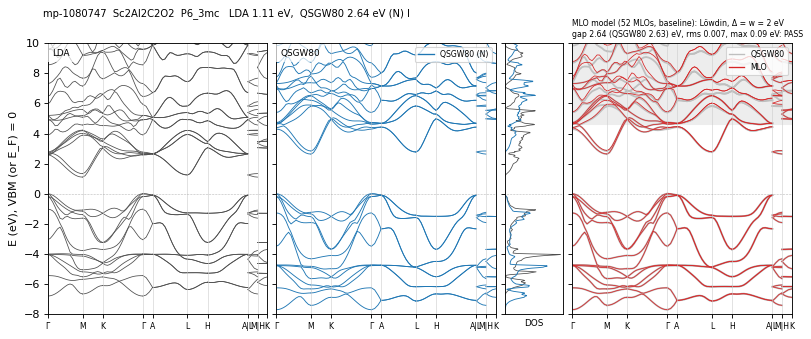

**mp-972937** Sc2Al2C2O2 — QSGW80 **1.58** N / M ≈ eV I  — ecalj 989a18637 (tf32, t_tetrakbt -300) — MLO PASS (b1) 52 gap 1.58 rms 0.004 max 0.03 (ecalj fb2da026b)

<small>runs: M 1.54 · N 1.58 (10-05)</small>

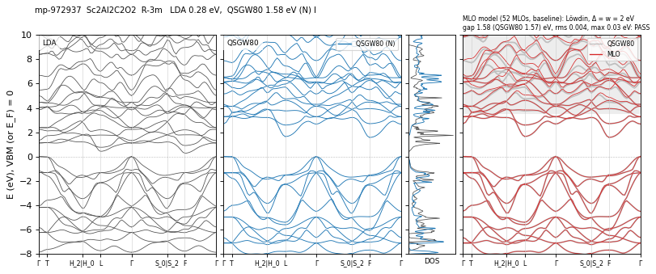

**mp-23309** Sc2Cl6 — QSGW80 **7.02** N / M 6.30 eV I CHECK — ecalj 989a18637 (tf32, t_tetrakbt -300) — MLO PASS (b1) 72 gap 7.03 rms 0.005 max 0.06 (ecalj fb2da026b)

<small>runs: M 6.30 · N 7.02 (10-03)</small>

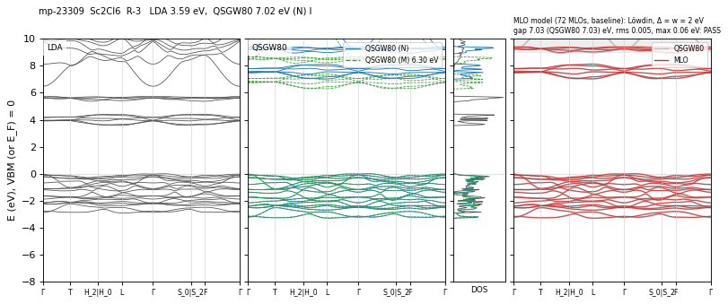

**mp-3642** Sc2Cu2O4 — QSGW80 **4.16** N / M ≈ eV I  — ecalj 989a18637 (tf32, t_tetrakbt -300) — MLO PASS (b2all) 68 gap 4.13 rms 0.005 max 0.05 (ecalj fb2da026b)

<small>runs: M 4.17 · N 4.16 (10-05)</small>

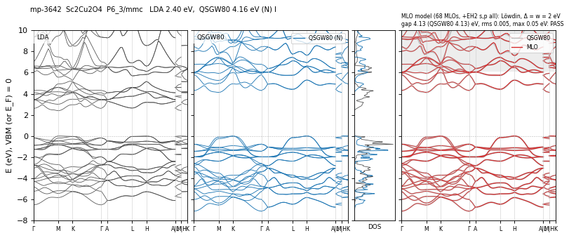

**mp-1078300** Sc2F6 — QSGW80 **11.89** E / N ≈ / R ≈ eV I  — ecalj 0601771b4 (tf32, t_tetrakbt -300) with ES, ES rule es-c — MLO PASS (b1, ES) 50 gap 11.89 rms 0.001 max 0.01 (ecalj f09035a49)

<small>runs: M 11.95 · R 11.94 (10-01) · N 11.94 (10-06) · E 11.89 (10-07, ES 2, es-c)</small>

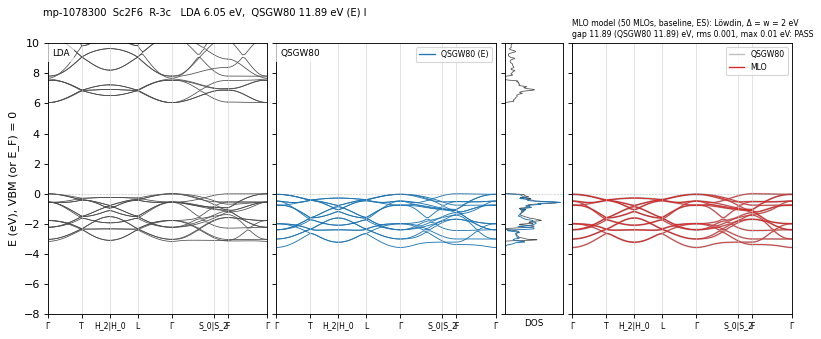

**mp-13312** Sc2Tl2S4 — QSGW80 **1.59** N / M ≈ eV I  — ecalj 989a18637 (tf32, t_tetrakbt -300) — MLO PASS (b1) 82 gap 1.59 rms 0.001 max 0.01 (ecalj fb2da026b)

<small>runs: M 1.61 · N 1.59 (10-05)</small>

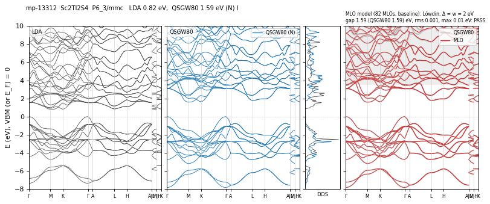

**mp-570589** Se4Br4 — QSGW80 **3.11** E / N 3.17 / R 3.17 eV I differs — ecalj 0601771b4 (tf32, t_tetrakbt -300) with ES, ES rule es-c — MLO PASS (b1, ES) 78 gap 3.09 rms 0.000 max 0.00 (ecalj f16f0ea3d)

<small>runs: M FAILED · R 3.17 (09-30) · N 3.17 (10-06) · E 3.11 (10-06, ES 6, es-c)</small>

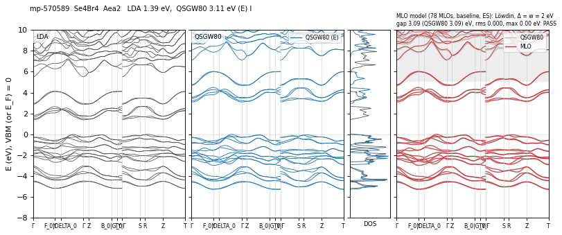

**mp-1078181** Si2Br6 — QSGW80 **6.56** E / M 6.48 / N 6.65 eV I differs — ecalj 0601771b4 (tf32, t_tetrakbt -300) with ES, ES rule es-c — MLO PASS (b1, ES) 83 gap 6.57 rms 0.009 max 0.09 (ecalj f09035a49)

<small>runs: M 6.48 · N 6.65 (10-05) · E 6.56 (10-07, ES 5, es-c)</small>

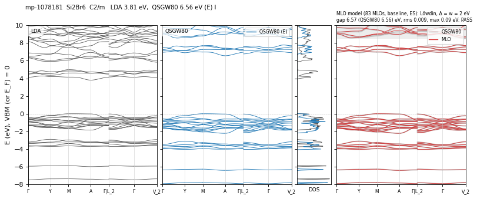

**mp-1078195** Si2I6 — QSGW80 **4.81** E / M 5.16 / N 4.94 / R 4.94 eV I CHECK — ecalj 0601771b4 (tf32, t_tetrakbt -300) with ES, ES rule es-c — MLO PASS (b1, ES) 86 gap 4.80 rms 0.005 max 0.05 (ecalj f09035a49)

<small>runs: M 5.16 · R 4.94 (10-01) · N 4.94 (10-03) · E 4.81 (10-07, ES 5, es-c)</small>

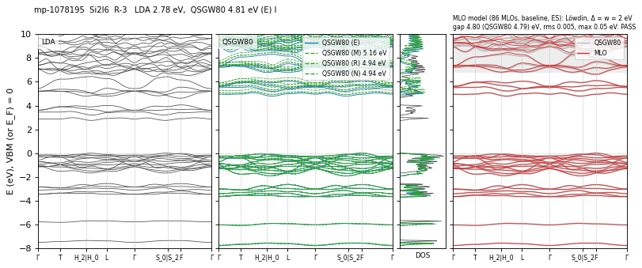

**mp-8311** Si3NiP4 — QSGW80 **0.72** N / M ≈ eV I  — ecalj 989a18637 (tf32, t_tetrakbt -300) — MLO PASS (b1) 72 gap 0.72 rms 0.002 max 0.02 (ecalj fb2da026b)

<small>runs: M 0.71 · N 0.72 (10-04)</small>

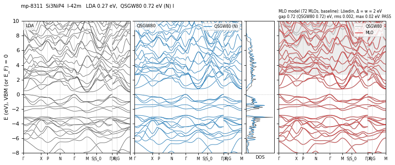

**mp-2488** Si4Os4 — QSGW80 **0.83** N / M ≈ eV I  — ecalj 989a18637 (tf32, t_tetrakbt -300) — MLO PASS (b1) 72 gap 0.81 rms 0.000 max 0.00 (ecalj fb2da026b)

<small>runs: M 0.82 · N 0.83 (10-04)</small>

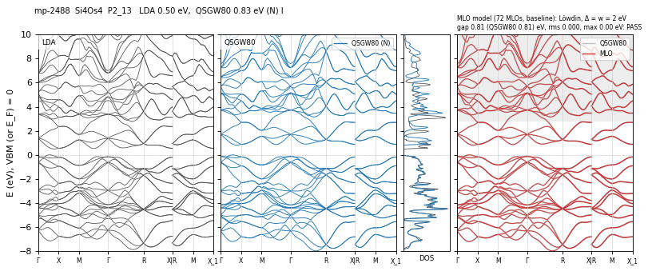

**mp-189** Si4Ru4 — QSGW80 **0.40** N / M ≈ eV I  — ecalj 989a18637 (tf32, t_tetrakbt -300) — MLO PASS (b1) 72 gap 0.40 rms 0.001 max 0.00 (ecalj 0c4d16ceb)

<small>runs: M 0.41 · N 0.40 (10-04)</small>

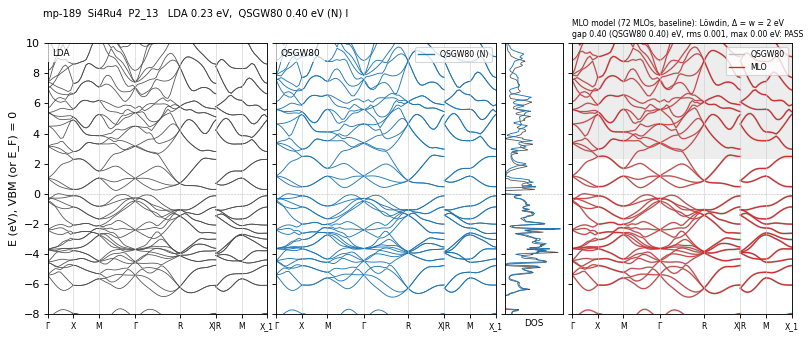

**mp-8289** Sn2F6 — QSGW80 **5.86** E / M ≈ / N 5.93 eV I differs — ecalj 0601771b4 (tf32, t_tetrakbt -300) with ES, ES rule es-c — MLO PASS (b1, ES) 60 gap 5.86 rms 0.000 max 0.01 (ecalj 0e7afd246)

<small>runs: M 5.88 · N 5.93 (10-05) · E 5.86 (10-07, ES 2, es-c)</small>

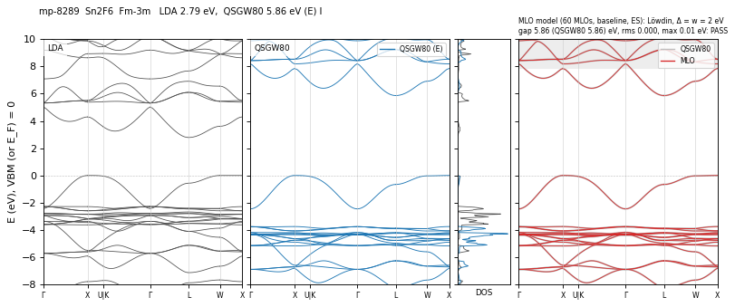

**mp-1078644** Sn4O4 — QSGW80 **2.23** N / M ≈ eV I  — ecalj 989a18637 (tf32, t_tetrakbt -300) — MLO PASS (b2) 68 gap 2.24 rms 0.002 max 0.02 (ecalj a1d6c0e11)

<small>runs: M 2.23 · N 2.23 (10-04)</small>

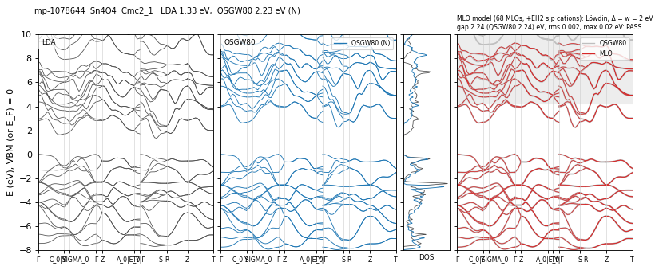

**mp-2231** Sn4S4 — QSGW80 **1.43** N / M ≈ eV I  — ecalj 989a18637 (tf32, t_tetrakbt -300) — MLO PASS (b1) 72 gap 1.33 rms 0.001 max 0.01 (ecalj fb2da026b)

<small>runs: M 1.43 · N 1.43 (10-04)</small>

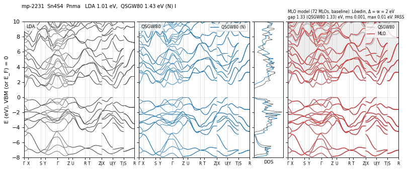

**mp-691** Sn4Se4 — QSGW80 **1.24** N / R ≈ · path 1.14 eV I path<mesh(mesh) — ecalj 989a18637 (tf32, t_tetrakbt -300) — MLO PASS (b1) 72 gap 1.14 rms 0.001 max 0.01 (ecalj fb2da026b)

<small>runs: M 1.24 · R 1.24 (09-30) · N 1.24 (10-06)</small>

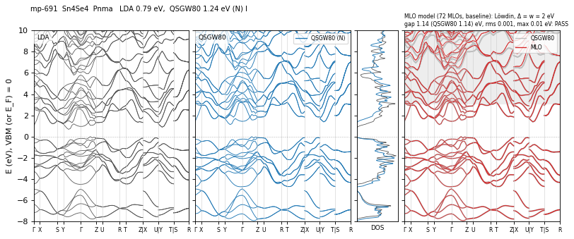

**mp-1078562** Sr2Ag2S2F2 — QSGW80 **2.65** N / M ≈ eV D  — ecalj 989a18637 (tf32, t_tetrakbt -300) — MLO PASS (b1) 68 gap 2.65 rms 0.000 max 0.00 (ecalj a1d6c0e11)

<small>runs: M 2.65 · N 2.65 (10-05)</small>

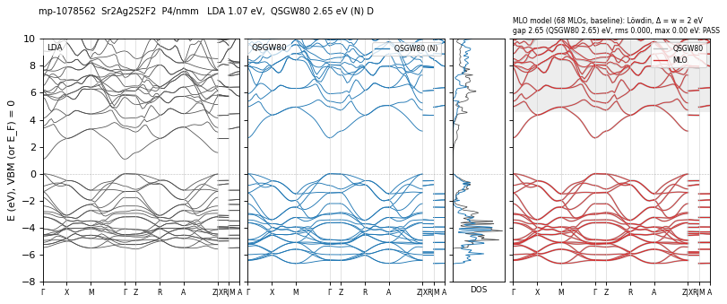

**mp-1080438** Sr2Ag2Te2F2 — QSGW80 **2.49** N / M ≈ eV D  — ecalj 989a18637 (tf32, t_tetrakbt -300) — MLO PASS (b1) 68 gap 2.49 rms 0.004 max 0.08 (ecalj fb2da026b)

<small>runs: M 2.46 · N 2.49 (10-05)</small>

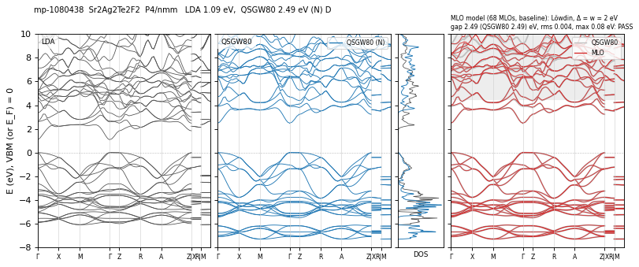

**mp-12444** Sr2Cu2S2F2 — QSGW80 **3.03** N / M ≈ eV D  — ecalj 989a18637 (tf32, t_tetrakbt -300) — MLO PASS (b1) 68 gap 3.04 rms 0.002 max 0.02 (ecalj a1d6c0e11)

<small>runs: M 3.04 · N 3.03 (10-04)</small>

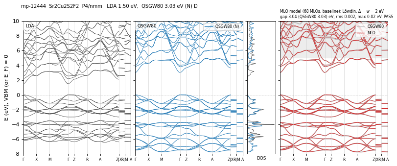

**mp-21228** Sr2Cu2Se2F2 — QSGW80 **2.59** N / M ≈ eV D  — ecalj 989a18637 (tf32, t_tetrakbt -300) — MLO PASS (b1) 68 gap 2.59 rms 0.002 max 0.03 (ecalj fb2da026b)

<small>runs: M 2.58 · N 2.59 (10-05)</small>

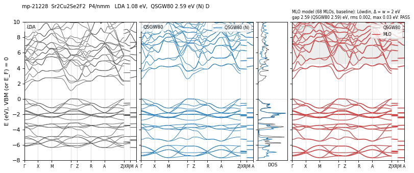

**mp-1091416** Sr2Cu2Te2F2 — QSGW80 **2.72** N / M ≈ eV D  — ecalj 989a18637 (tf32, t_tetrakbt -300) — MLO PASS (b1) 68 gap 2.72 rms 0.005 max 0.06 (ecalj a1d6c0e11)

<small>runs: M 2.70 · N 2.72 (10-04)</small>

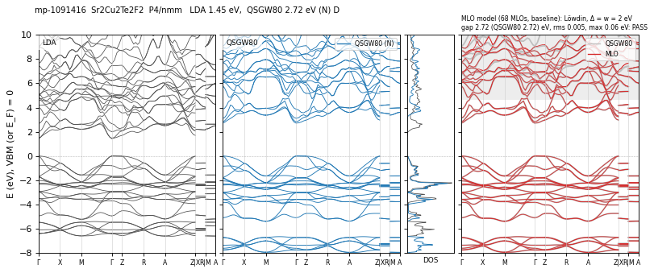

**mp-1080045** Sr2H2Br2O2 — QSGW80 **6.98** N / R ≈ eV D  — ecalj 989a18637 (tf32, t_tetrakbt -300) — MLO PASS (b2) 74 gap 6.98 rms 0.005 max 0.04 (ecalj fb2da026b)

<small>runs: M FAILED · R 6.98 (09-30) · N 6.98 (10-06)</small>

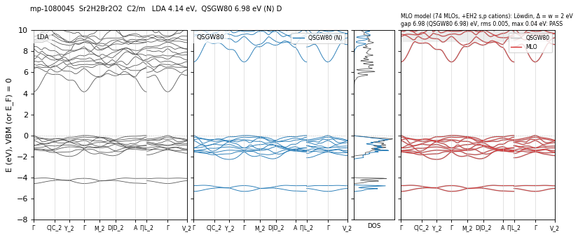

**mp-24066** Sr2H2Cl2O2 — QSGW80 **7.86** N / R ≈ eV D  — ecalj 989a18637 (tf32, t_tetrakbt -300) — MLO PASS (b2) 74 gap 7.87 rms 0.001 max 0.01 (ecalj fb2da026b)

<small>runs: M 5.54 · R 7.86 (10-01) · N 7.86 (10-06)</small>

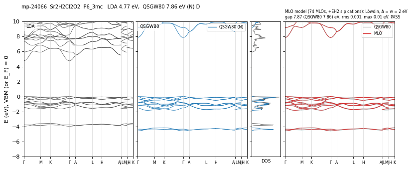

**mp-11108** Sr2P6 — QSGW80 **0.36** N / M ≈ eV D  — ecalj 989a18637 (tf32, t_tetrakbt -300) — MLO PASS (b1) 72 gap 0.36 rms 0.001 max 0.01 (ecalj a1d6c0e11)

<small>runs: M 0.35 · N 0.36 (10-03)</small>

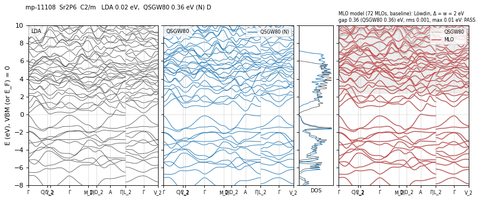

**mp-1175** Sr2S6 — QSGW80 **2.76** N / M ≈ eV D  — ecalj 989a18637 (tf32, t_tetrakbt -300) — MLO PASS (b2) 80 gap 2.76 rms 0.002 max 0.01 (ecalj fb2da026b)

<small>runs: M 2.74 · N 2.76 (10-05)</small>

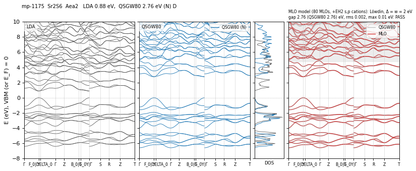

**mp-9517** Sr2Ti2N4 — QSGW80 **2.06** N / M ≈ eV D  — ecalj 989a18637 (tf32, t_tetrakbt -300) — MLO PASS (b1) 52 gap 2.06 rms 0.001 max 0.00 (ecalj fb2da026b)

<small>runs: M 2.04 · N 2.06 (10-04)</small>

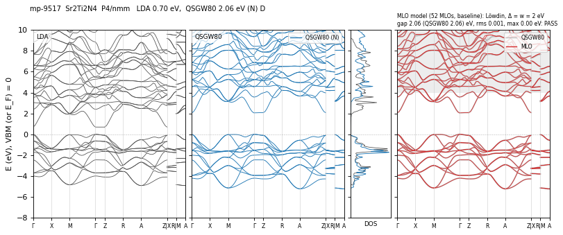

**mp-1080135** Sr2Zn2As2F2 — QSGW80 **1.83** N / M ≈ eV D  — ecalj 989a18637 (tf32, t_tetrakbt -300) — MLO PASS (b1) 78 gap 1.83 rms 0.001 max 0.01 (ecalj a1d6c0e11)

<small>runs: M 1.80 · N 1.83 (10-03)</small>

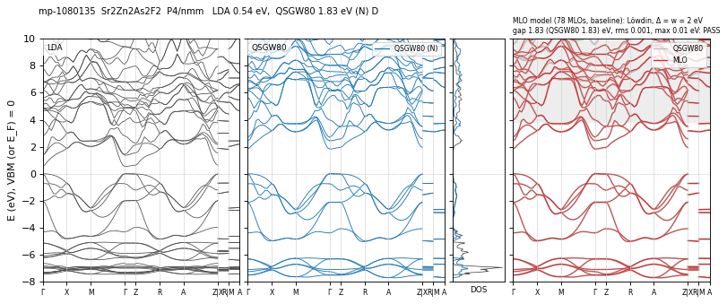

**mp-555718** SrNiF6 — QSGW80 **5.22** N / R ≈ eV I  — ecalj 989a18637 (tf32, t_tetrakbt -300) — MLO PASS (b1) 45 gap 5.22 rms 0.001 max 0.00 (ecalj fb2da026b)

<small>runs: M FAILED · R 5.22 (09-30) · N 5.22 (10-05)</small>

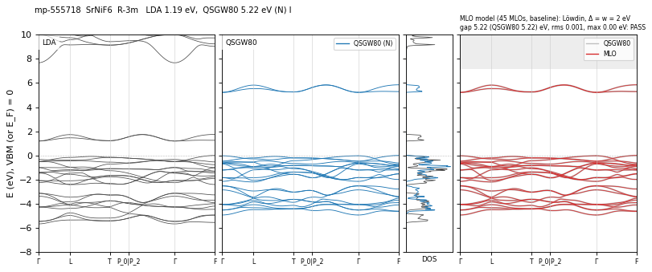

**mp-29027** Ta2I4O2 — QSGW80 **1.88** N / R ≈ eV I  — ecalj 989a18637 (tf32, t_tetrakbt -300) — MLO PASS (b1) 62 gap 1.87 rms 0.002 max 0.02 (ecalj fb2da026b)

<small>runs: M FAILED · R 1.88 (09-30) · N 1.88 (10-06)</small>

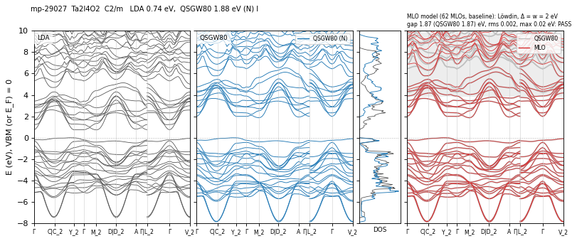

**mp-10748** TaCu3S4 — QSGW80 **3.07** N / M ≈ eV I  — ecalj 989a18637 (tf32, t_tetrakbt -300) — MLO PASS (b2all) 88 gap 3.07 rms 0.000 max 0.00 (ecalj a1d6c0e11)

<small>runs: M 3.07 · N 3.07 (10-04)</small>

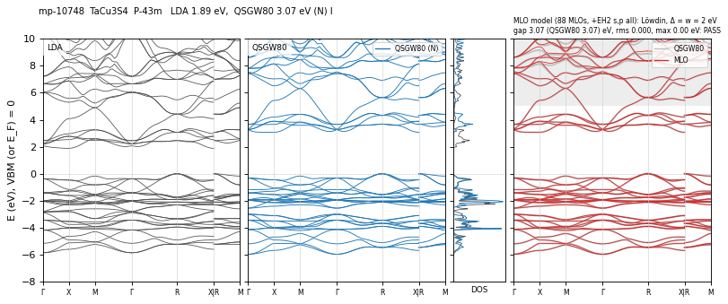

**mp-4081** TaCu3Se4 — QSGW80 **2.60** N / M ≈ eV I  — ecalj 989a18637 (tf32, t_tetrakbt -300) — MLO PASS (b2all) 88 gap 2.60 rms 0.001 max 0.01 (ecalj fb2da026b)

<small>runs: M 2.63 · N 2.60 (10-05)</small>

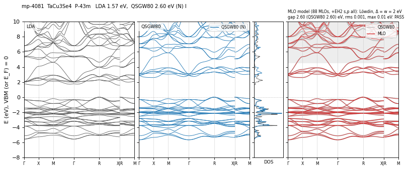

**mp-9295** TaCu3Te4 — QSGW80 **1.83** N / M ≈ eV I  — ecalj 989a18637 (tf32, t_tetrakbt -300) — MLO PASS (b2all) 88 gap 1.83 rms 0.001 max 0.01 (ecalj fb2da026b)

<small>runs: M 1.81 · N 1.83 (10-05)</small>

**mp-7562** TaTl3S4 — QSGW80 **3.56** N / M ≈ eV I  — ecalj 989a18637 (tf32, t_tetrakbt -300) — MLO PASS (b1) 87 gap 3.56 rms 0.004 max 0.04 (ecalj fb2da026b)

<small>runs: M 3.54 · N 3.56 (10-04)</small>

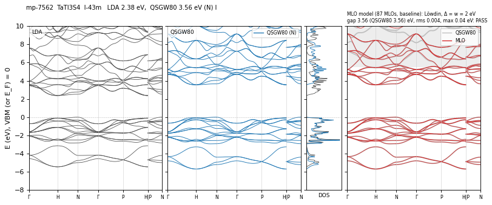

**mp-10644** TaTl3Se4 — QSGW80 **3.10** N / M ≈ eV D  — ecalj 989a18637 (tf32, t_tetrakbt -300) — MLO PASS (b1) 87 gap 3.10 rms 0.005 max 0.04 (ecalj fb2da026b)

<small>runs: M 3.07 · N 3.10 (10-05)</small>

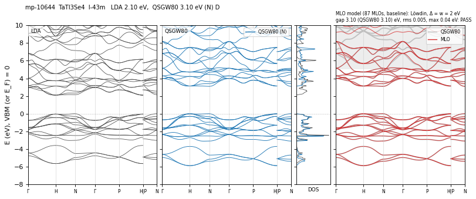

**mp-2552** Te2O6 — QSGW80 **3.62** N / M 3.17 eV I CHECK — ecalj 989a18637 (tf32, t_tetrakbt -300) — MLO PASS (b1) 42 gap 3.62 rms 0.001 max 0.00 (ecalj fb2da026b)

<small>runs: M 3.17 · N 3.62 (10-03)</small>

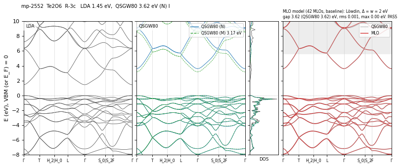

**mp-573321** Te2Pd2I4 — QSGW80 **1.14** N / R ≈ eV I  — ecalj 989a18637 (tf32, t_tetrakbt -300) — MLO PASS (b1) 72 gap 1.13 rms 0.002 max 0.03 (ecalj fb2da026b)

<small>runs: M 1.13 · R 1.14 (09-30) · N 1.14 (10-06)</small>

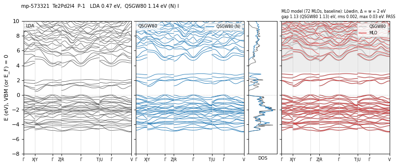

**mp-569766** Te4I4 — QSGW80 **1.53** E / M ≈ / N ≈ eV I  — ecalj 0601771b4 (tf32, t_tetrakbt -300) with ES, ES rule es-c — MLO PASS (b1, ES) 74 gap 1.53 rms 0.002 max 0.02 (ecalj 00792e927)

<small>runs: M 1.52 · N 1.54 (10-03) · E 1.53 (10-07, ES 2, es-c)</small>

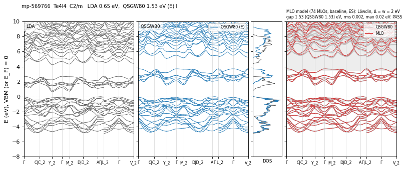

**mp-1079574** Te4Pb4 — QSGW80 **1.25** N / M ≈ eV I  — ecalj 989a18637 (tf32, t_tetrakbt -300) — MLO PASS (b1) 72 gap 1.22 rms 0.005 max 0.03 (ecalj a1d6c0e11)

<small>runs: M 1.24 · N 1.25 (10-03)</small>

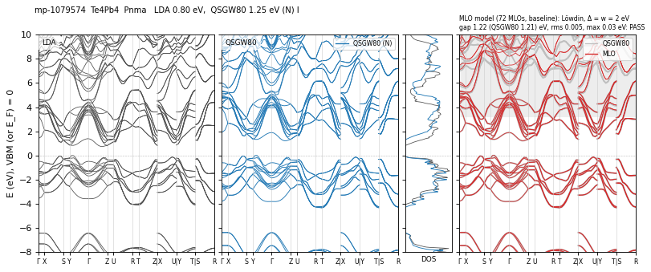

**mp-685022** Te4Pb4 — QSGW80 **1.06** N / R ≈ eV I  — ecalj 989a18637 (tf32, t_tetrakbt -300) — MLO PASS (b1) 72 gap 1.05 rms 0.001 max 0.01 (ecalj fb2da026b)

<small>runs: M 1.07 · R 1.06 (09-30) · N 1.06 (10-06)</small>

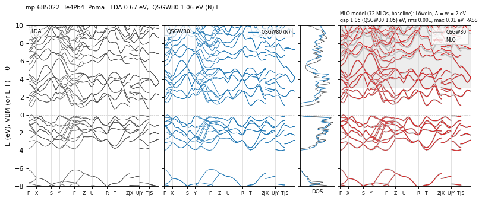

**mp-9920** Ti2S6 — QSGW80 **1.11** N / M ≈ eV I  — ecalj 989a18637 (tf32, t_tetrakbt -300) — MLO PASS (b1) 72 gap 1.11 rms 0.001 max 0.01 (ecalj fb2da026b)

<small>runs: M 1.15 · N 1.11 (10-05)</small>

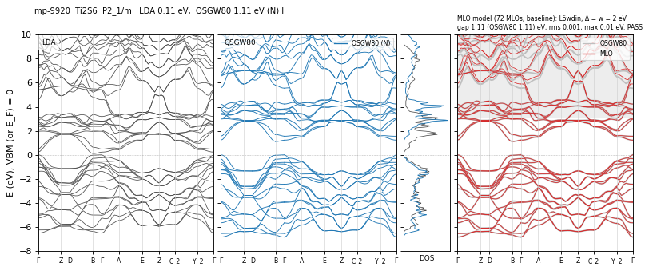

**mp-623024** TiCdF6 — QSGW80 **8.83** N / R ≈ eV D vs2025 — ecalj 989a18637 (tf32, t_tetrakbt -300) — MLO PASS (b2) 46 gap 8.83 rms 0.000 max 0.00 (ecalj fb2da026b)

<small>runs: M 7.68 · R 8.83 (10-01) · N 8.83 (10-06)</small>

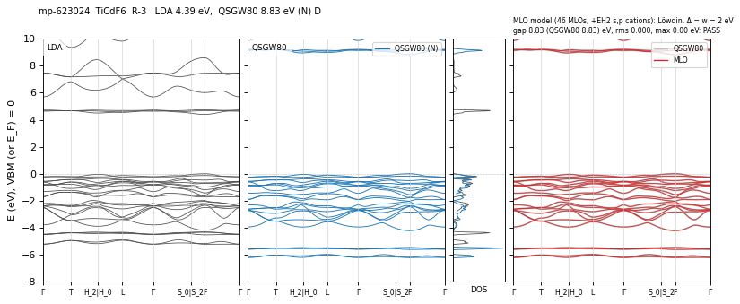

**mp-27801** Tl2Ag2I4 — QSGW80 **2.74** N / M ≈ eV D  — ecalj 989a18637 (tf32, t_tetrakbt -300) — MLO PASS (b1) 82 gap 2.74 rms 0.003 max 0.04 (ecalj fb2da026b)

<small>runs: M 2.74 · N 2.74 (10-05)</small>

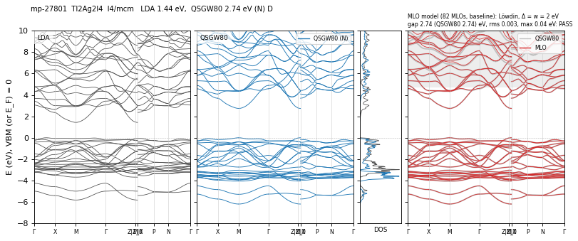

**mp-568890** Tl2CdGeTe4 — QSGW80 **0.93** N / M ≈ eV I  — ecalj 989a18637 (tf32, t_tetrakbt -300) — MLO PASS (b1) 82 gap 0.94 rms 0.001 max 0.02 (ecalj fb2da026b)

<small>runs: M 0.93 · N 0.93 (10-04)</small>

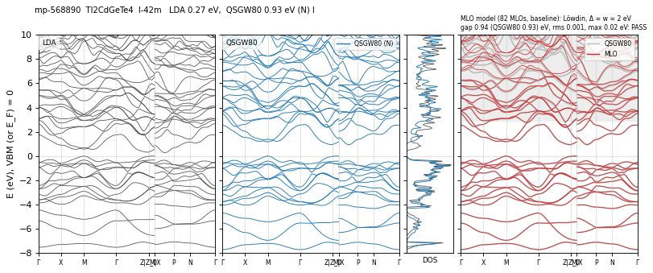

**mp-570076** Tl2CdSnTe4 — QSGW80 **0.95** N / R ≈ eV I  — ecalj 989a18637 (tf32, t_tetrakbt -300) — MLO PASS (b1) 82 gap 0.95 rms 0.001 max 0.01 (ecalj fb2da026b)

<small>runs: M 0.92 · R 0.95 (09-30) · N 0.95 (10-06)</small>

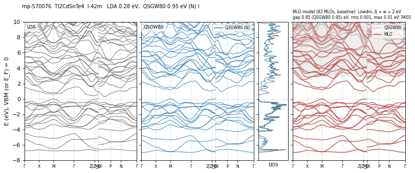

**mp-9580** Tl2Ga2Se4 — QSGW80 **1.36** N / M ≈ eV D  — ecalj 989a18637 (tf32, t_tetrakbt -300) — MLO PASS (b1) 92 gap 1.36 rms 0.001 max 0.01 (ecalj fb2da026b)

<small>runs: M 1.36 · N 1.36 (10-05)</small>

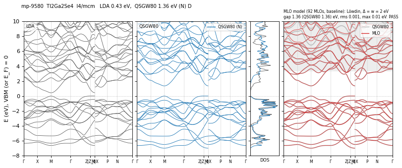

**mp-3785** Tl2Ga2Te4 — QSGW80 **1.08** N / M ≈ eV D  — ecalj 989a18637 (tf32, t_tetrakbt -300) — MLO PASS (b1) 92 gap 1.09 rms 0.002 max 0.03 (ecalj fb2da026b)

<small>runs: M 1.08 · N 1.08 (10-03)</small>

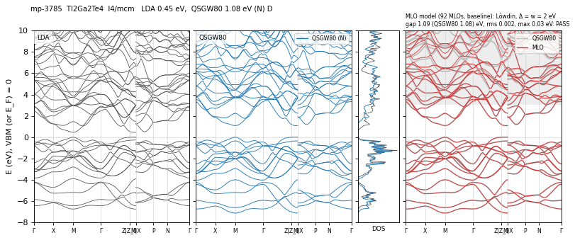

**mp-569246** Tl2HgGeTe4 — QSGW80 **0.57** N / M ≈ eV I  — ecalj 989a18637 (tf32, t_tetrakbt -300) — MLO PASS (b1) 82 gap 0.57 rms 0.001 max 0.01 (ecalj fb2da026b)

<small>runs: M 0.57 · N 0.57 (10-05)</small>

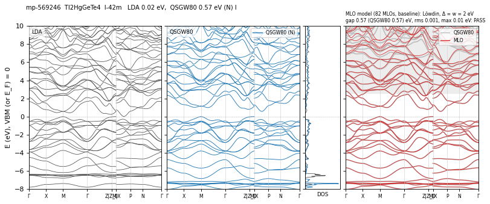

**mp-1078621** Tl2In2S4 — QSGW80 **1.76** N / M ≈ eV D  — ecalj 989a18637 (tf32, t_tetrakbt -300) — MLO PASS (b1) 92 gap 1.76 rms 0.001 max 0.01 (ecalj a1d6c0e11)

<small>runs: M 1.76 · N 1.76 (10-03)</small>

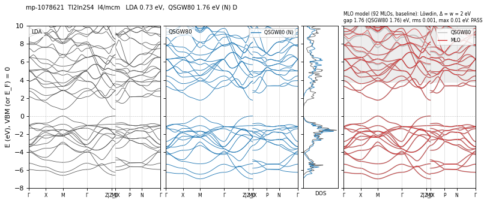

**mp-20042** Tl2In2S4 — QSGW80 **1.17** N / M ≈ · path 0.94 eV I path<mesh(mesh) — ecalj 989a18637 (tf32, t_tetrakbt -300) — MLO PASS (b1) 92 gap 0.94 rms 0.001 max 0.00 (ecalj fb2da026b)

<small>runs: M 1.17 · N 1.17 (10-04)</small>

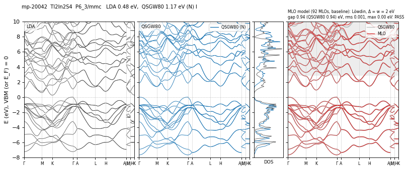

**mp-22232** Tl2In2Se4 — QSGW80 **1.44** N / M ≈ eV D  — ecalj 989a18637 (tf32, t_tetrakbt -300) — MLO PASS (b1) 92 gap 1.44 rms 0.001 max 0.01 (ecalj fb2da026b)

<small>runs: M 1.44 · N 1.44 (10-04)</small>

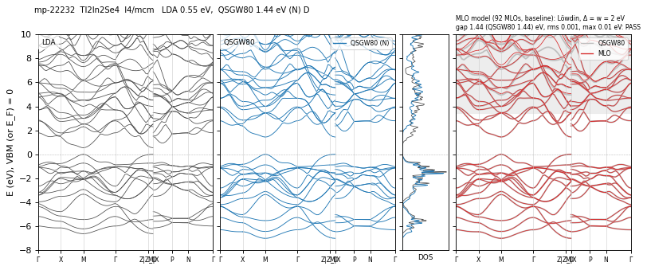

**mp-22791** Tl2In2Te4 — QSGW80 **1.18** N / M ≈ eV I  — ecalj 989a18637 (tf32, t_tetrakbt -300) — MLO PASS (b1) 92 gap 1.19 rms 0.002 max 0.02 (ecalj fb2da026b)

<small>runs: M 1.18 · N 1.18 (10-03)</small>

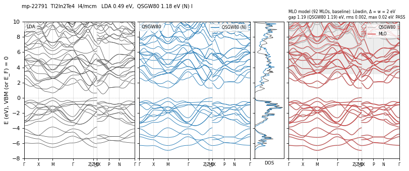

**mp-870** Tl2N6 — QSGW80 **2.96** N / R ≈ eV I  — ecalj 989a18637 (tf32, t_tetrakbt -300) — MLO PASS (b2) 60 gap 2.96 rms 0.004 max 0.07 (ecalj fb2da026b)

<small>runs: M FAILED · R 2.96 (09-30) · N 2.96 (10-06)</small>

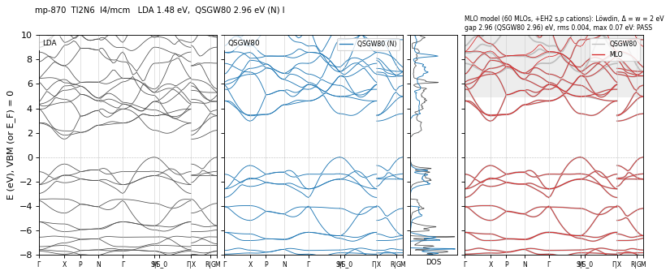

**mp-1079426** Tl2SiHgSe4 — QSGW80 **1.74** N / M ≈ eV I  — ecalj 989a18637 (tf32, t_tetrakbt -300) — MLO PASS (b1) 82 gap 1.73 rms 0.001 max 0.01 (ecalj a1d6c0e11)

<small>runs: M 1.75 · N 1.74 (10-03)</small>

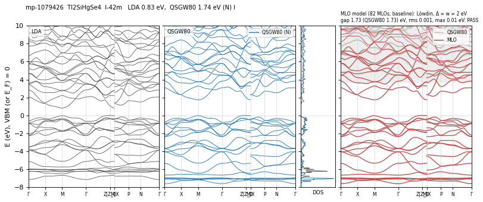

**mp-1078676** Tl2SnHgSe4 — QSGW80 **1.54** N / M 1.61 eV D differs — ecalj 989a18637 (tf32, t_tetrakbt -300) — MLO PASS (b1) 82 gap 1.54 rms 0.001 max 0.01 (ecalj a1d6c0e11)

<small>runs: M 1.61 · N 1.54 (10-05)</small>

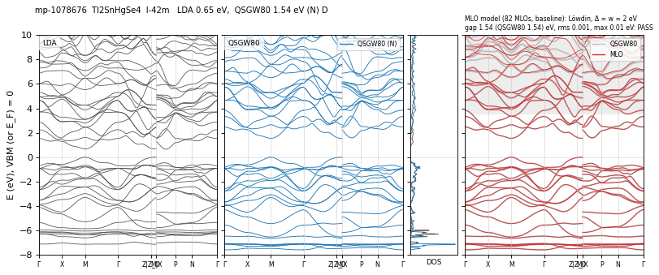

**mp-570051** Tl2SnHgTe4 — QSGW80 **0.65** N / R ≈ eV I  — ecalj 989a18637 (tf32, t_tetrakbt -300) — MLO PASS (b1) 82 gap 0.64 rms 0.001 max 0.01 (ecalj fb2da026b)

<small>runs: M 0.63 · R 0.65 (09-30) · N 0.65 (10-06)</small>

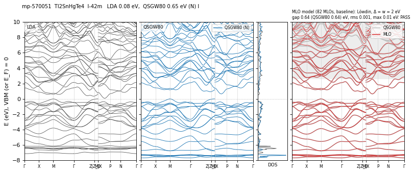

**mp-29047** Tl3VO4 — QSGW80 **3.59** N / R ≈ eV I  — ecalj 989a18637 (tf32, t_tetrakbt -300) — MLO PASS (b1) 67 gap 3.59 rms 0.001 max 0.01 (ecalj fb2da026b)

<small>runs: M FAILED · R 3.59 (09-30) · N 3.59 (10-06)</small>

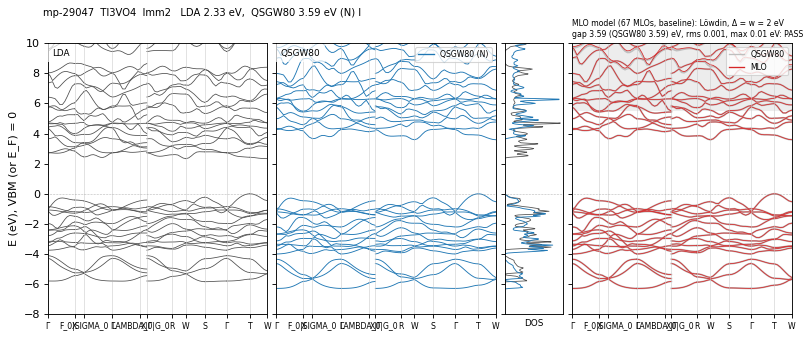

**mp-5513** Tl3VS4 — QSGW80 **2.87** N / M 2.95 eV D differs — ecalj 989a18637 (tf32, t_tetrakbt -300) — MLO PASS (b1) 87 gap 2.87 rms 0.001 max 0.01 (ecalj fb2da026b)

<small>runs: M 2.95 · N 2.87 (10-05)</small>

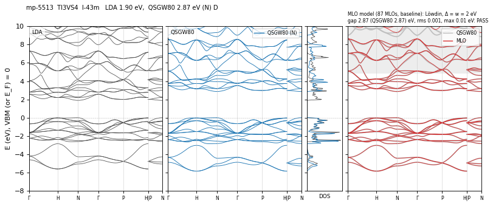

**mp-1025549** Tl3VSe4 — QSGW80 **2.31** N / M ≈ eV I  — ecalj 989a18637 (tf32, t_tetrakbt -300) — MLO PASS (b1) 87 gap 2.31 rms 0.001 max 0.01 (ecalj a1d6c0e11)

<small>runs: M 2.33 · N 2.31 (10-03)</small>

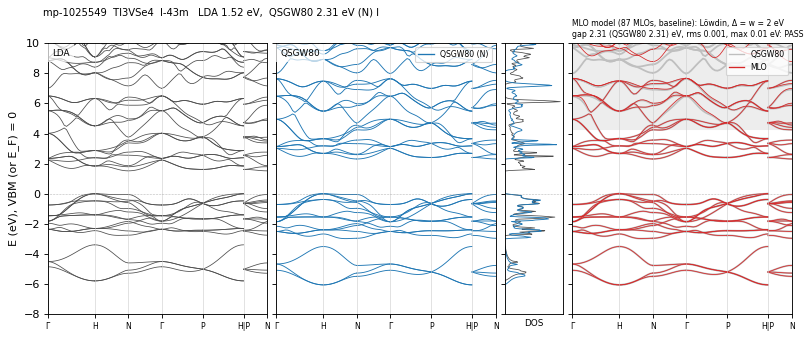

**mp-720** Tl4F4 — QSGW80 **4.73** N / R ≈ eV I  — ecalj 989a18637 (tf32, t_tetrakbt -300) — MLO PASS (b1) 72 gap 4.73 rms 0.001 max 0.01 (ecalj fb2da026b)

<small>runs: M 4.70 · R 4.73 (09-30) · N 4.73 (10-06)</small>

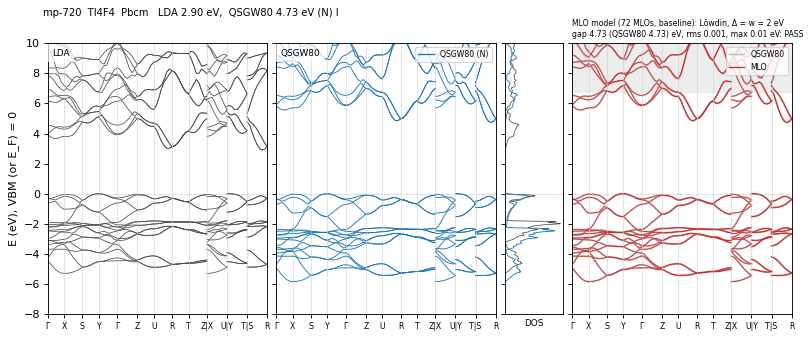

**mp-322** Tl4S4 — QSGW80 **1.43** N / M ≈ eV I  — ecalj 989a18637 (tf32, t_tetrakbt -300) — MLO PASS (b1) 92 gap 1.44 rms 0.000 max 0.00 (ecalj fb2da026b)

<small>runs: M 1.43 · N 1.43 (10-03)</small>

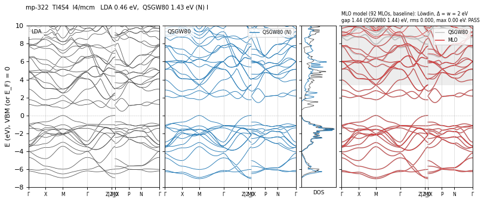

**mp-1836** Tl4Se4 — QSGW80 **0.84** N / M ≈ eV I  — ecalj 989a18637 (tf32, t_tetrakbt -300) — MLO PASS (b1) 92 gap 0.84 rms 0.001 max 0.00 (ecalj 0c4d16ceb)

<small>runs: M 0.84 · N 0.84 (10-04)</small>

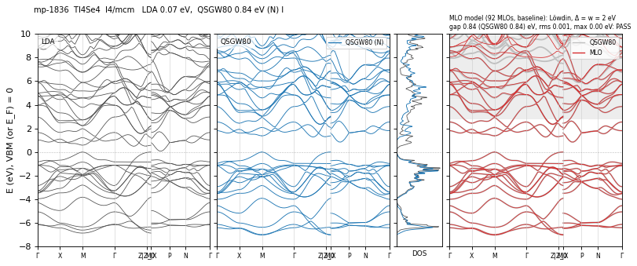

**mp-555911** TlAsF6 — QSGW80 **8.46** N / R ≈ eV I  — ecalj 989a18637 (tf32, t_tetrakbt -300) — MLO PASS (b1) 47 gap 8.47 rms 0.002 max 0.02 (ecalj fb2da026b)

<small>runs: M FAILED · R 8.46 (09-30) · N 8.46 (10-05)</small>

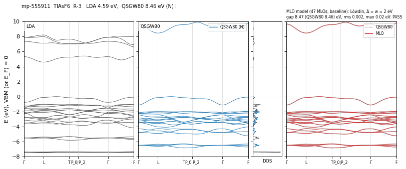

**mp-8348** TlSbF6 — QSGW80 **7.80** N / R ≈ eV I  — ecalj 989a18637 (tf32, t_tetrakbt -300) — MLO PASS (b1) 47 gap 7.81 rms 0.004 max 0.03 (ecalj fb2da026b)

<small>runs: M 1.61 · R 7.80 (09-30) · N 7.80 (10-06)</small>

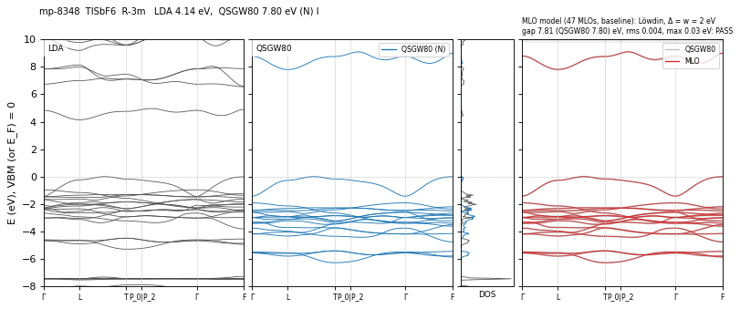

**mp-19412** VAg3O4 — QSGW80 **2.06** N / M 2.11 eV I differs — ecalj 989a18637 (tf32, t_tetrakbt -300) — MLO PASS (b1) 52 gap 2.05 rms 0.000 max 0.00 (ecalj fb2da026b)

<small>runs: M 2.11 · N 2.06 (10-05)</small>

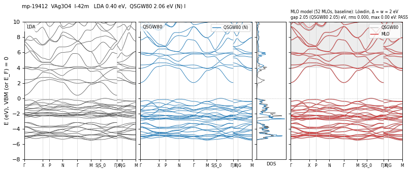

**mp-510657** VCu3O4 — QSGW80 **0.62** N / M 0.72 eV I differs — ecalj 989a18637 (tf32, t_tetrakbt -300) — MLO PASS (b1) 52 gap 0.62 rms 0.001 max 0.01 (ecalj fb2da026b)

<small>runs: M 0.72 · N 0.62 (10-05)</small>

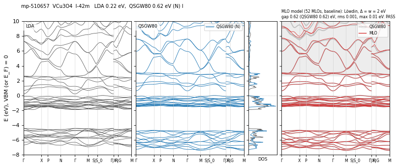

**mp-3762** VCu3S4 — QSGW80 **2.01** N / M ≈ eV I  — ecalj 989a18637 (tf32, t_tetrakbt -300) — MLO PASS (b2all) 88 gap 2.01 rms 0.000 max 0.00 (ecalj fb2da026b)

<small>runs: M 1.96 · N 2.01 (10-05)</small>

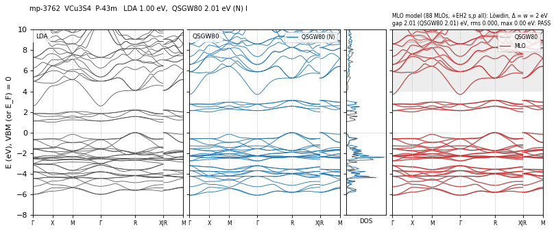

**mp-21855** VCu3Se4 — QSGW80 **1.65** N / M ≈ eV I  — ecalj 989a18637 (tf32, t_tetrakbt -300) — MLO PASS (b2all) 88 gap 1.65 rms 0.000 max 0.00 (ecalj fb2da026b)

<small>runs: M 1.66 · N 1.65 (10-04)</small>

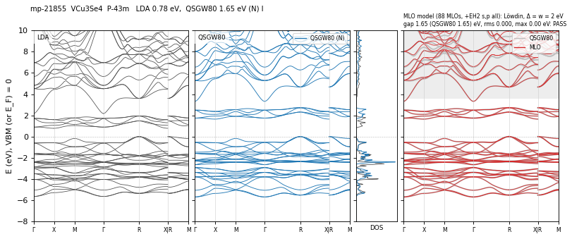

**mp-991652** VCu3Te4 — QSGW80 **1.11** N / M ≈ eV I  — ecalj 989a18637 (tf32, t_tetrakbt -300) — MLO PASS (b1) 72 gap 1.12 rms 0.002 max 0.02 (ecalj fb2da026b)

<small>runs: M 1.14 · N 1.11 (10-05)</small>

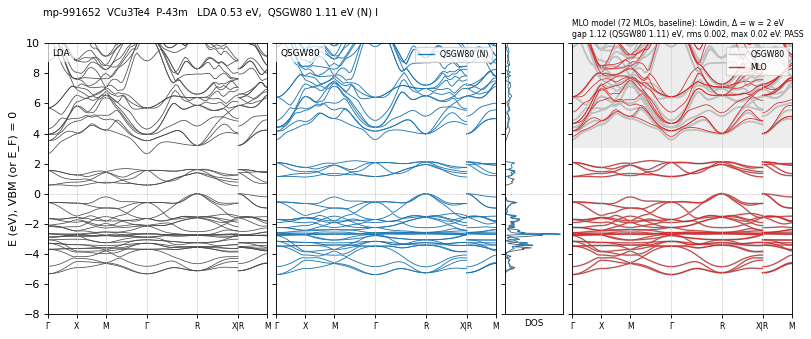

**mp-19443** W2O6 — QSGW80 **1.68** E / M 1.77 / N 1.73 eV I differs — ecalj 0601771b4 (tf32, t_tetrakbt -300) with ES, ES rule es-c — MLO PASS (b1, ES) 50 gap 1.68 rms 0.001 max 0.01 (ecalj d2878d537)

<small>runs: M 1.77 · N 1.73 (10-05) · E 1.68 (10-07, ES 2, es-c)</small>

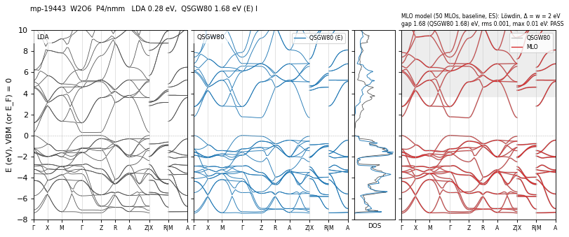

**mp-12903** Y2Ag2Te4 — QSGW80 **1.58** N / M ≈ eV I  — ecalj 989a18637 (tf32, t_tetrakbt -300) — MLO PASS (b1) 72 gap 1.52 rms 0.003 max 0.04 (ecalj a1d6c0e11)

<small>runs: M 1.58 · N 1.58 (10-03)</small>

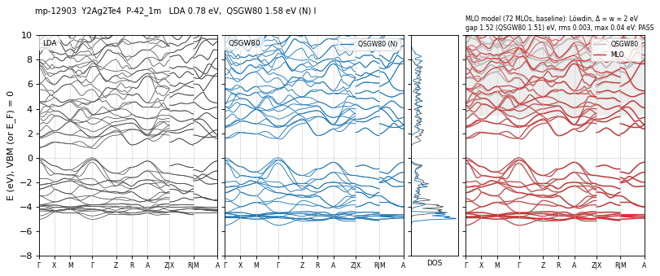

**mp-27455** Y2Cl6 — QSGW80 **7.87** E / N ≈ / R ≈ eV I  — ecalj 0601771b4 (tf32, t_tetrakbt -300) with ES, ES rule es-c — MLO PASS (b2all, ES) 99 gap 7.87 rms 0.000 max 0.00 (ecalj f09035a49)

<small>runs: M 7.77 · R 7.88 (10-01) · N 7.88 (10-06) · E 7.87 (10-07, ES 3, es-c)</small>

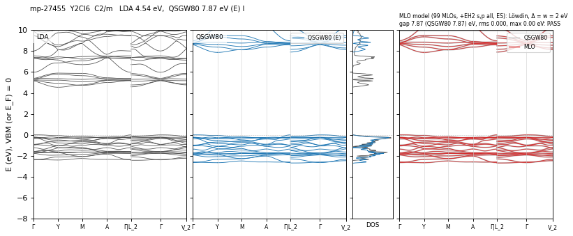

**mp-2918** Y2Cu2O4 — QSGW80 **4.46** N / R ≈ eV I  — ecalj 989a18637 (tf32, t_tetrakbt -300) — MLO PASS (b2d) 76 gap 4.43 rms 0.003 max 0.03 (ecalj fb2da026b)

<small>runs: M 3.74 · R 4.46 (10-01) · N 4.46 (10-06)</small>

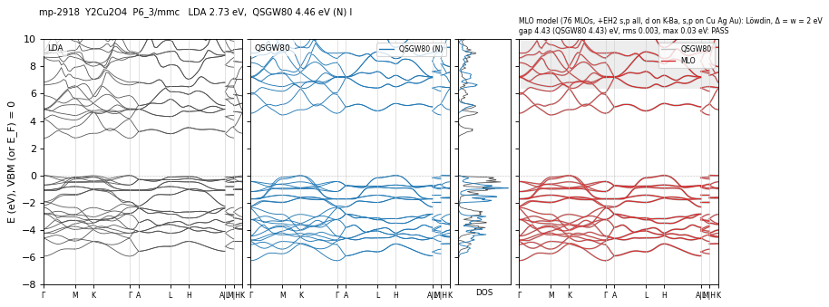

**mp-626151** Y2H2O4 — QSGW80 **6.11** N / R ≈ eV I  — ecalj 989a18637 (tf32, t_tetrakbt -300) — MLO PASS (b1) 42 gap 6.12 rms 0.010 max 0.07 (ecalj fb2da026b)

<small>runs: M FAILED · R 6.11 (09-30) · N 6.11 (10-06)</small>

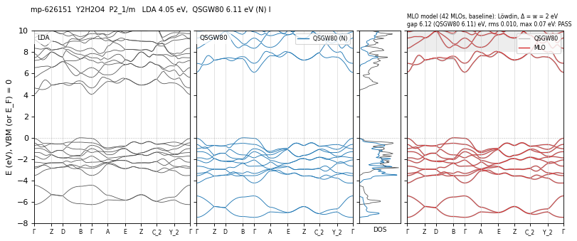

**mp-571442** Y2I6 — QSGW80 **4.83** E / N ≈ / R ≈ eV I  — ecalj 0601771b4 (tf32, t_tetrakbt -300) with ES, ES rule es-c — MLO PASS (b1, ES) 76 gap 4.83 rms 0.002 max 0.03 (ecalj 00792e927)

<small>runs: M 4.71 · R 4.84 (09-30) · N 4.84 (10-06) · E 4.83 (10-07, ES 4, es-c)</small>

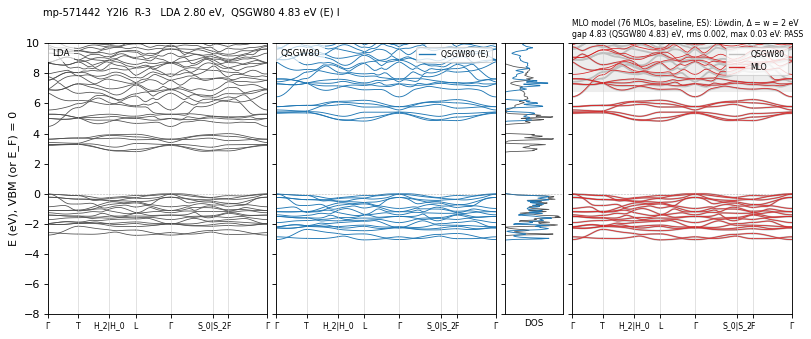

**mp-546011** Y2Zn2As2O2 — QSGW80 **1.96** N / M ≈ eV I  — ecalj 989a18637 (tf32, t_tetrakbt -300) — MLO PASS (b1) 72 gap 1.96 rms 0.002 max 0.02 (ecalj fb2da026b)

<small>runs: M 1.96 · N 1.96 (10-05)</small>

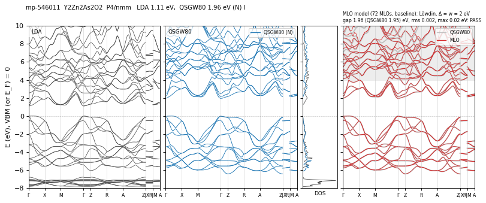

**mp-12509** Y2Zn2P2O2 — QSGW80 **2.11** N / M 2.04 eV I differs — ecalj 989a18637 (tf32, t_tetrakbt -300) — MLO PASS (b2all) 86 gap 2.11 rms 0.001 max 0.01 (ecalj a1d6c0e11)

<small>runs: M 2.04 · N 2.11 (10-04)</small>

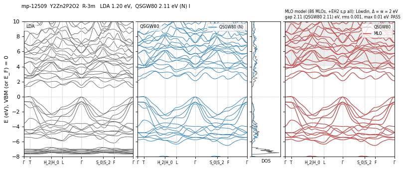

**mp-553243** YBi2BrO4 — QSGW80 **2.53** N / M ≈ eV I  — ecalj 989a18637 (tf32, t_tetrakbt -300) — MLO PASS (b1) 52 gap 2.53 rms 0.001 max 0.01 (ecalj fb2da026b)

<small>runs: M 2.53 · N 2.53 (10-04)</small>

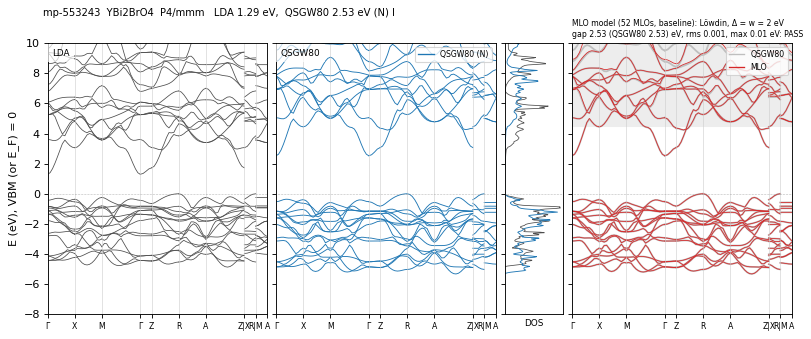

**mp-552604** YBi2ClO4 — QSGW80 **2.63** N / R ≈ eV I  — ecalj 989a18637 (tf32, t_tetrakbt -300) — MLO PASS (b1) 52 gap 2.63 rms 0.000 max 0.01 (ecalj fb2da026b)

<small>runs: M FAILED · R 2.63 (09-30) · N 2.63 (10-06)</small>

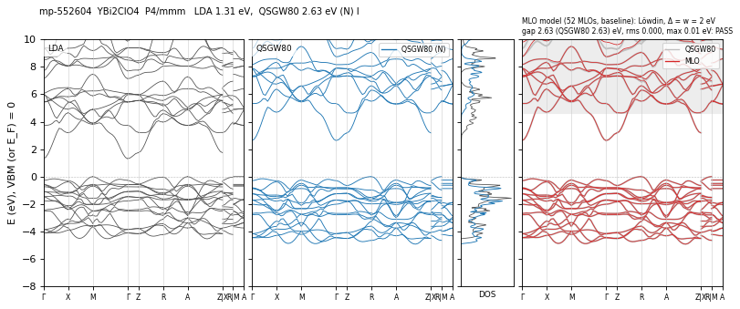

**mp-551816** YBi2IO4 — QSGW80 **2.46** N / R ≈ eV I  — ecalj 989a18637 (tf32, t_tetrakbt -300) — MLO PASS (b1) 52 gap 2.46 rms 0.001 max 0.02 (ecalj fb2da026b)

<small>runs: M FAILED · R 2.46 (09-30) · N 2.46 (10-06)</small>

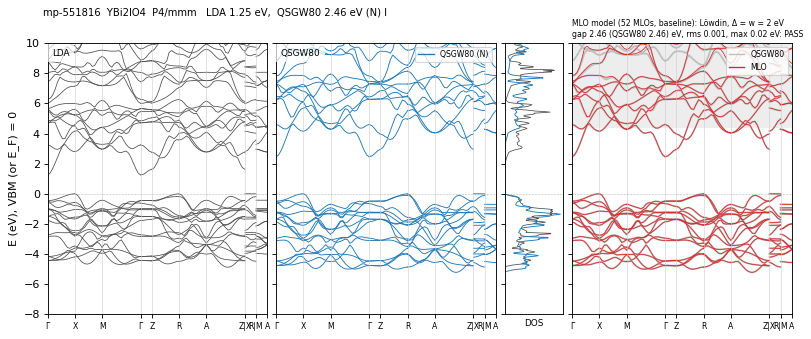

**mp-4008** Zn2Ge2As4 — QSGW80 **1.03** N / M ≈ eV D  — ecalj 989a18637 (tf32, t_tetrakbt -300) — MLO PASS (b1) 72 gap 1.04 rms 0.007 max 0.05 (ecalj fb2da026b)

<small>runs: M 1.03 · N 1.03 (10-03)</small>

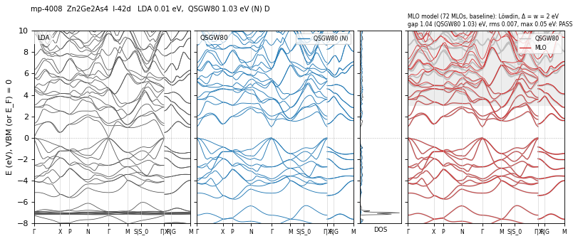

**mp-4524** Zn2Ge2P4 — QSGW80 **1.95** N / M ≈ eV I  — ecalj 989a18637 (tf32, t_tetrakbt -300) — MLO PASS (b1) 72 gap 1.89 rms 0.005 max 0.06 (ecalj fb2da026b)

<small>runs: M 1.96 · N 1.95 (10-05)</small>

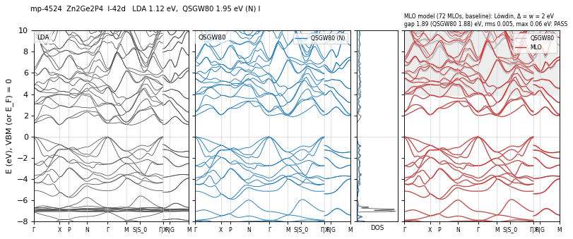

**mp-3595** Zn2Si2As4 — QSGW80 **1.71** N / R ≈ eV D  — ecalj 989a18637 (tf32, t_tetrakbt -300) — MLO PASS (b1) 72 gap 1.71 rms 0.008 max 0.07 (ecalj fb2da026b)

<small>runs: M 1.73 · R 1.71 (10-01) · N 1.71 (10-06)</small>

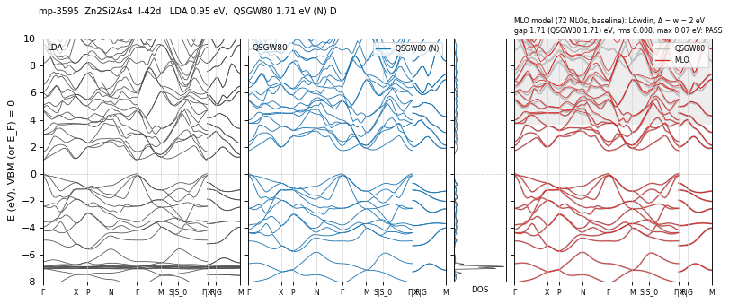

**mp-4763** Zn2Si2P4 — QSGW80 **1.98** N / M ≈ eV D  — ecalj 989a18637 (tf32, t_tetrakbt -300) — MLO PASS (b1) 72 gap 1.98 rms 0.003 max 0.02 (ecalj fb2da026b)

<small>runs: M 1.98 · N 1.98 (10-05)</small>

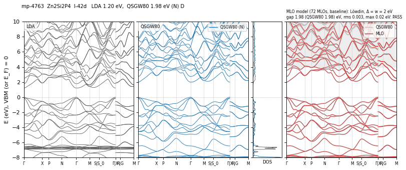

**mp-4175** Zn2Sn2P4 — QSGW80 **1.58** N / R ≈ eV D  — ecalj 989a18637 (tf32, t_tetrakbt -300) — MLO PASS (b1) 72 gap 1.59 rms 0.006 max 0.07 (ecalj fb2da026b)

<small>runs: M 1.58 · R 1.58 (10-01) · N 1.58 (10-06)</small>

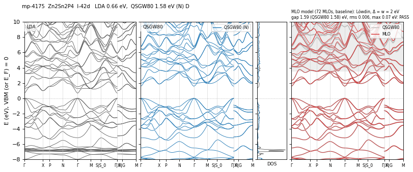

**mp-10281** Zn4S4 — QSGW80 **3.69** N / M ≈ eV D  — ecalj 989a18637 (tf32, t_tetrakbt -300) — MLO PASS (b1) 72 gap 3.72 rms 0.009 max 0.07 (ecalj fb2da026b)

<small>runs: M 3.68 · N 3.69 (10-05)</small>

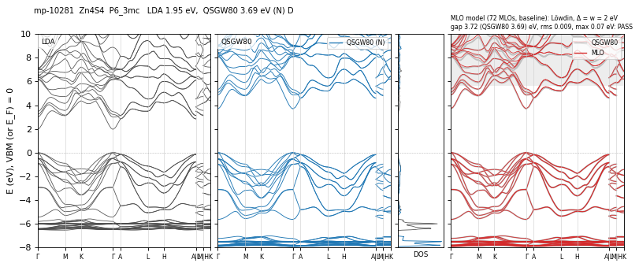

**mp-1079889** ZnAg2SnS4 — QSGW80 **1.31** N / M ≈ eV D  — ecalj 989a18637 (tf32, t_tetrakbt -300) — MLO PASS (b1) 77 gap 1.31 rms 0.001 max 0.00 (ecalj fb2da026b)

<small>runs: M 1.30 · N 1.31 (10-05)</small>

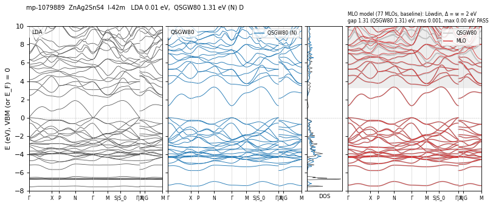

**mp-6408** ZnCu2GeS4 — QSGW80 **1.49** N / M ≈ eV D  — ecalj 989a18637 (tf32, t_tetrakbt -300) — MLO PASS (b1) 77 gap 1.50 rms 0.001 max 0.01 (ecalj fb2da026b)

<small>runs: M 1.47 · N 1.49 (10-05)</small>

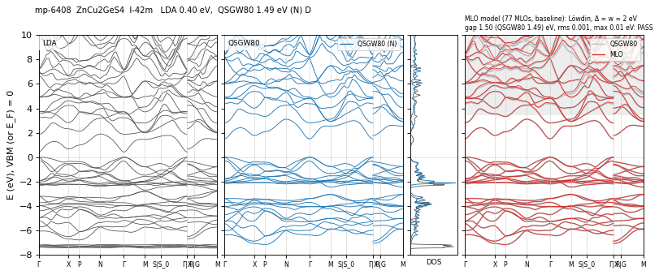

**mp-1078498** ZnCu2SiTe4 — QSGW80 **0.94** N / M ≈ eV I  — ecalj 989a18637 (tf32, t_tetrakbt -300) — MLO PASS (b1) 77 gap 0.95 rms 0.006 max 0.06 (ecalj a1d6c0e11)

<small>runs: M 0.96 · N 0.94 (10-03)</small>

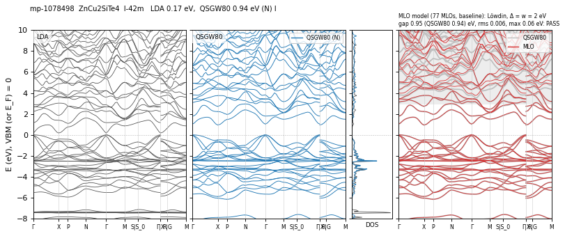

**mp-1079541** ZnCu2SnS4 — QSGW80 **1.11** N / M ≈ eV D  — ecalj 989a18637 (tf32, t_tetrakbt -300) — MLO PASS (b1) 77 gap 1.11 rms 0.001 max 0.01 (ecalj fb2da026b)

<small>runs: M 1.12 · N 1.11 (10-05)</small>

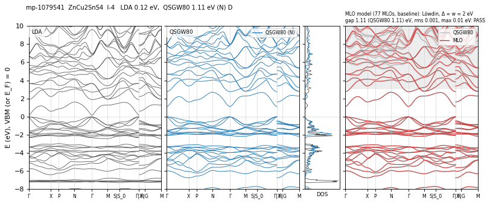

**mp-13610** ZnPbF6 — QSGW80 **5.70** N / R ≈ eV D  — ecalj 989a18637 (tf32, t_tetrakbt -300) — MLO PASS (b1) 47 gap 5.70 rms 0.000 max 0.00 (ecalj fb2da026b)

<small>runs: M 4.46 · R 5.70 (10-01) · N 5.70 (10-05)</small>

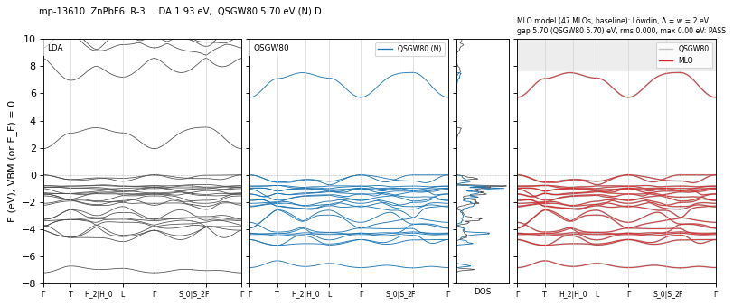

**mp-13983** ZnPdF6 — QSGW80 **5.10** N / R ≈ eV D  — ecalj 989a18637 (tf32, t_tetrakbt -300) — MLO PASS (b1) 42 gap 5.10 rms 0.000 max 0.00 (ecalj fb2da026b)

<small>runs: M 4.53 · R 5.10 (10-01) · N 5.10 (10-05)</small>

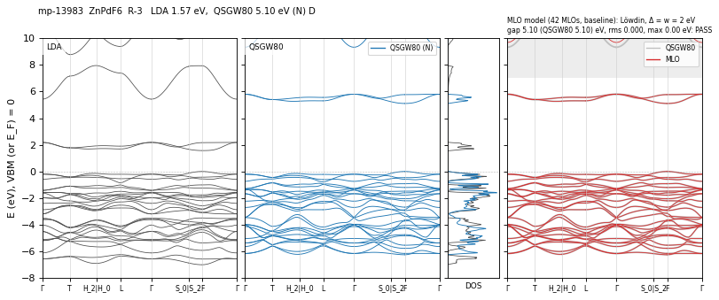

**mp-8256** ZnPtF6 — QSGW80 **6.00** N / R ≈ eV D  — ecalj 989a18637 (tf32, t_tetrakbt -300) — MLO PASS (b1) 42 gap 6.00 rms 0.000 max 0.00 (ecalj fb2da026b)

<small>runs: M 5.57 · R 6.00 (10-01) · N 6.00 (10-05)</small>

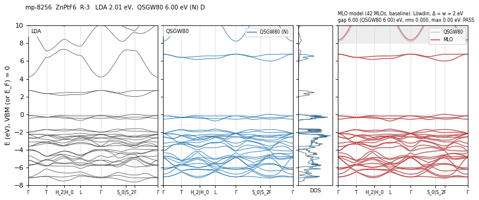

**mp-13903** ZnSnF6 — QSGW80 **8.36** N / R ≈ eV D  — ecalj 989a18637 (tf32, t_tetrakbt -300) — MLO PASS (b1) 47 gap 8.38 rms 0.004 max 0.03 (ecalj fb2da026b)

<small>runs: M 7.44 · R 8.37 (10-01) · N 8.36 (10-05)</small>

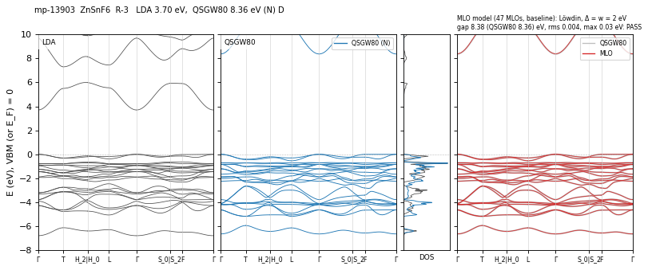

**mp-9921** Zr2S6 — QSGW80 **2.33** N / M 2.41 eV I differs — ecalj 989a18637 (tf32, t_tetrakbt -300) — MLO PASS (b1) 72 gap 2.33 rms 0.001 max 0.02 (ecalj fb2da026b)

<small>runs: M 2.41 · N 2.33 (10-03)</small>

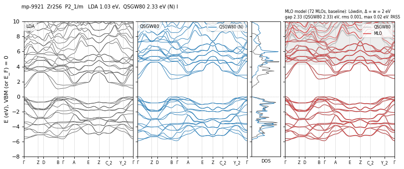

**mp-1683** Zr2Se6 — QSGW80 **1.49** N / M ≈ eV I  — ecalj 989a18637 (tf32, t_tetrakbt -300) — MLO PASS (b1) 72 gap 1.50 rms 0.002 max 0.02 (ecalj fb2da026b)

<small>runs: M 1.52 · N 1.49 (10-05)</small>

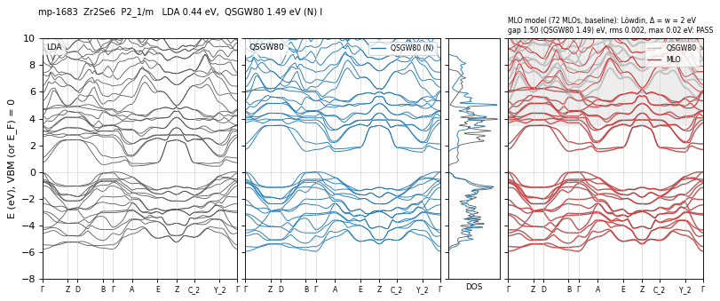

