# GW1500 QSGW80 — bands and DOS, 4 atoms per cell

[README](README.md) · [table](table.md)

Left: LDA. Middle: QSGW80 adopted (blue, condition in parentheses; green dashed: another QSGW80 result when its gap differs by more than 0.1 eV) and the total DOS. Right: the MLO model of the standard recipe (red) on the QSGW80 bands (gray), with its conditions and check; shaded: outside the window of the check ([README](README.md#mlo-models)). Energies from the VBM (insulators) or E_F (metals).

**mp-570301** Ag2Br2 — QSGW80 **2.42** N / M ≈ eV I  — ecalj b695fa65c (tf32, t_tetrakbt -300) — MLO PASS (b1) 36 gap 2.42 rms 0.000 max 0.00 (ecalj 614ab5eb8)

<small>runs: M 2.44 · N 2.42 (10-03)</small>

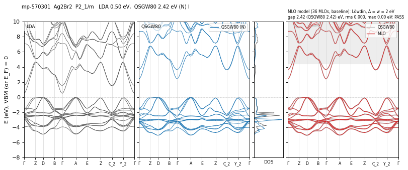

**mp-570687** Ag2Cl2 — QSGW80 **2.82** N / M ≈ eV I  — ecalj b695fa65c (tf32, t_tetrakbt -300) — MLO PASS (b1) 36 gap 2.82 rms 0.000 max 0.00 (ecalj 614ab5eb8)

<small>runs: M 2.77 · N 2.82 (10-03)</small>

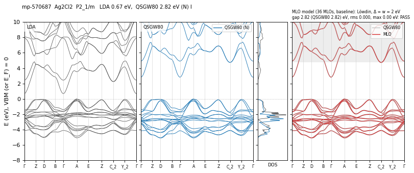

**mp-570858** Ag2Cl2 — QSGW80 **2.24** N / M ≈ eV I  — ecalj 989a18637 (tf32, t_tetrakbt -300) — MLO PASS (b1) 36 gap 2.23 rms 0.000 max 0.00 (ecalj fb2da026b)

<small>runs: M 2.28 · N 2.24 (10-03)</small>

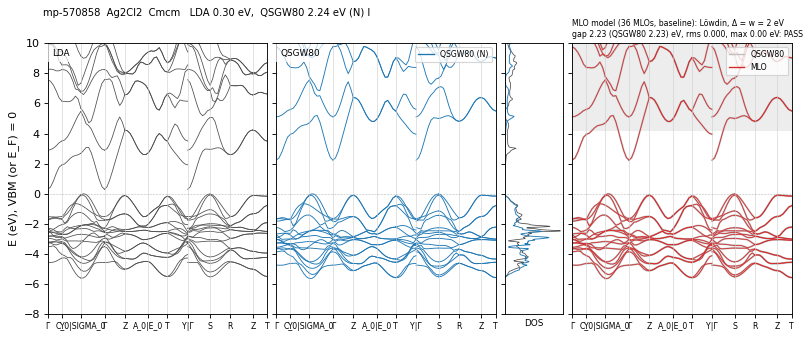

**mp-22894** Ag2I2 — QSGW80 **3.04** E / E1 ≈ / M ≈ / N ≈ eV D  — ecalj 0601771b4 (tf32, t_tetrakbt -300) with ES, ES rule es-c — MLO PASS (b1, ES) 38 gap 3.04 rms 0.002 max 0.03 (ecalj f16f0ea3d)

<small>runs: M 3.09 · N 3.03 (10-03) · E1 3.04 (10-05, ES 2) · E 3.04 (10-06, ES 2, es-c)</small>

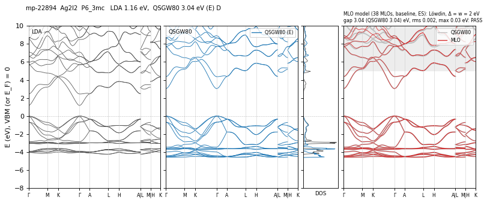

**mp-567809** Ag2I2 — QSGW80 **2.93** N / M ≈ eV D  — ecalj b695fa65c (tf32, t_tetrakbt -300) — MLO PASS (b2all) 44 gap 2.93 rms 0.001 max 0.01 (ecalj 614ab5eb8)

<small>runs: M 2.93 · N 2.93 (10-03)</small>

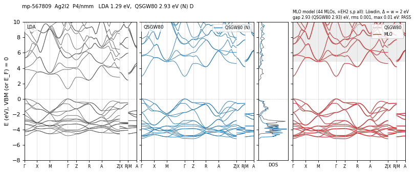

**mp-568927** Ag2I2 — QSGW80 **2.15** N / M ≈ eV I  — ecalj b695fa65c (tf32, t_tetrakbt -300) — MLO PASS (b1) 36 gap 2.17 rms 0.000 max 0.00 (ecalj 614ab5eb8)

<small>runs: M 2.16 · N 2.15 (10-03)</small>

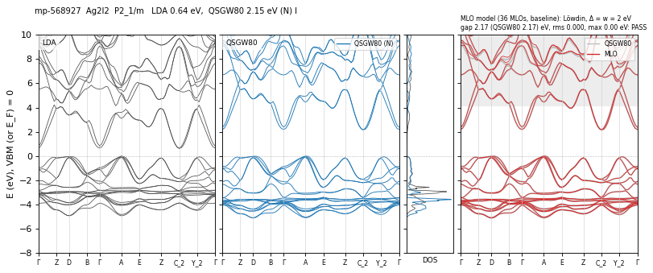

**mp-29678** AgBiS2 — QSGW80 **0.96** N / M ≈ eV I  — ecalj b695fa65c (tf32, t_tetrakbt -300) — MLO PASS (b1) 36 gap 0.92 rms 0.001 max 0.00 (ecalj fb2da026b)

<small>runs: M 0.97 · N 0.96 (10-03)</small>

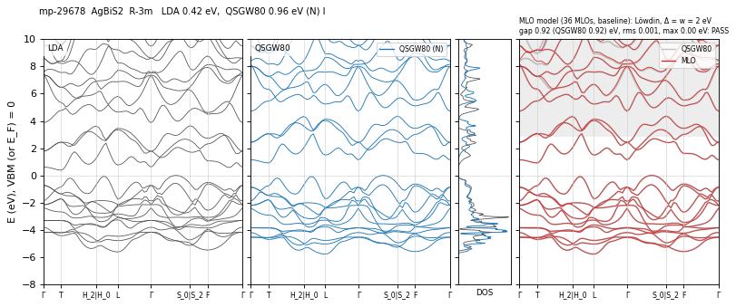

**mp-5770** AgNO2 — QSGW80 **4.97** N / R ≈ eV I  — ecalj b695fa65c (tf32, t_tetrakbt -300) — MLO PASS (b1) 21 gap 4.97 rms 0.006 max 0.08 (ecalj 614ab5eb8)

<small>runs: M 1.06 · R 4.97 (10-01) · N 4.97 (10-04)</small>

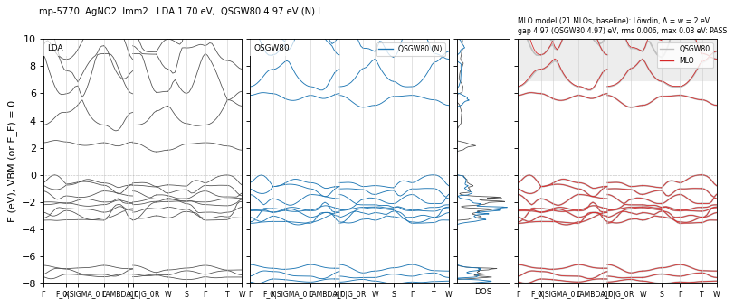

**mp-1018033** AgRhO2 — QSGW80 **1.77** N / M 1.56 · path 1.64 eV I CHECK path<mesh(mesh) — ecalj 989a18637 (tf32, t_tetrakbt -300) — MLO PASS (b1) 26 gap 1.64 rms 0.001 max 0.01 (ecalj a1d6c0e11)

<small>runs: M 1.56 · N 1.77 (10-02)</small>

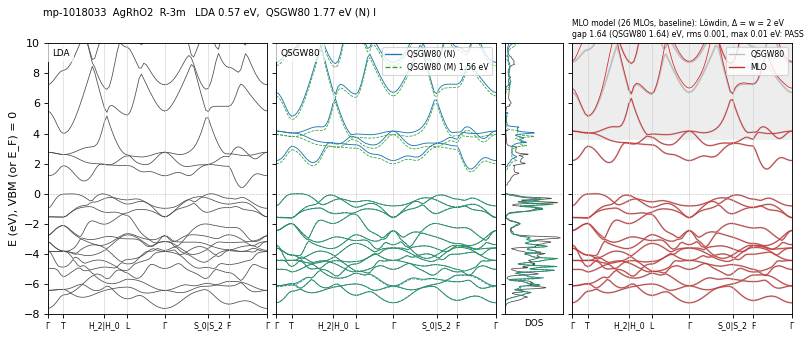

**mp-661** Al2N2 — QSGW80 **5.97** N / M 6.07 eV D differs — ecalj b695fa65c (tf32, t_tetrakbt -300) — MLO PASS (b2) 34 gap 5.97 rms 0.005 max 0.05 (ecalj 614ab5eb8)

<small>runs: M 6.07 · N 5.97 (10-03)</small>

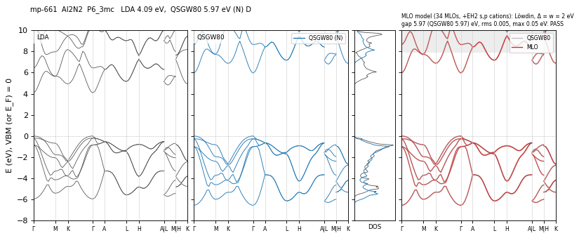

**mp-7885** AlAgS2 — QSGW80 **2.87** N / M ≈ eV I  — ecalj b695fa65c (tf32, t_tetrakbt -300) — MLO PASS (b1) 36 gap 2.88 rms 0.002 max 0.01 (ecalj 614ab5eb8)

<small>runs: M 2.87 · N 2.87 (10-03)</small>

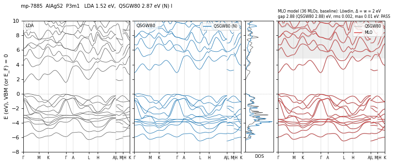

**mp-3748** AlCuO2 — QSGW80 **3.71** N / M 3.34 eV I CHECK — ecalj b695fa65c (tf32, t_tetrakbt -300) — MLO PASS (b2all) 38 gap 3.70 rms 0.003 max 0.04 (ecalj 614ab5eb8)

<small>runs: M 3.34 · N 3.71 (10-03)</small>

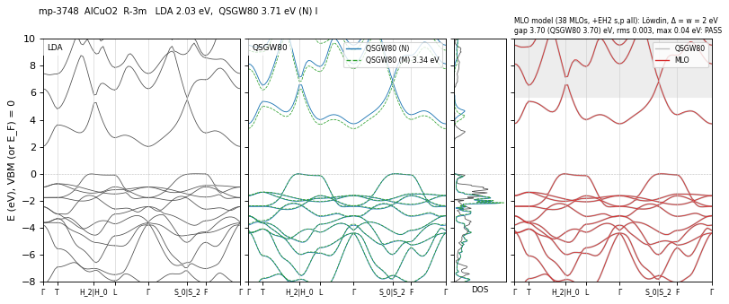

**mp-8039** AlF3 — QSGW80 **12.86** E / N ≈ / R ≈ eV I  — ecalj 614ab5eb8 (tf32, t_tetrakbt -300) with ES, ES rule es-a — MLO PASS (b1, ES) 25 gap 12.86 rms 0.002 max 0.02 (ecalj 89b832097)

<small>runs: M 13.06 · R 12.84 (10-01) · N 12.84 (10-04) · E 12.86 (10-05, ES 1, es-a)</small>

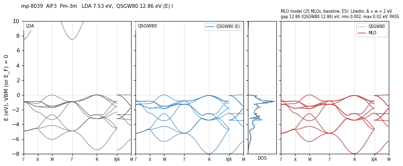

**mp-2793** Au2Se2 — QSGW80 **0.64** N / M ≈ · path 0.54 eV I path<mesh(mesh) — ecalj b695fa65c (tf32, t_tetrakbt -300) — MLO PASS (b1) 36 gap 0.54 rms 0.001 max 0.01 (ecalj fb2da026b)

<small>runs: M 0.63 · N 0.64 (10-03)</small>

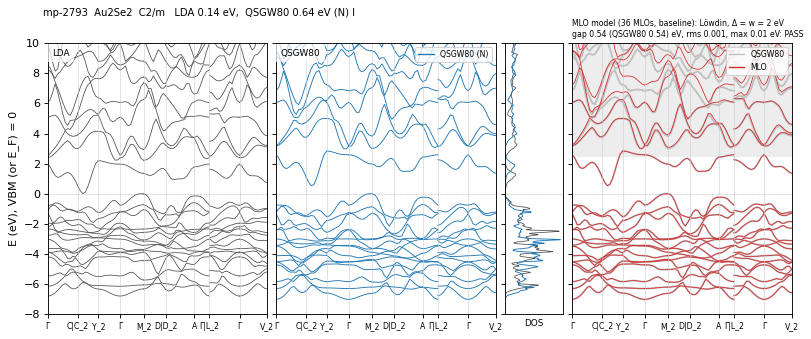

**mp-2653** B2N2 — QSGW80 **7.50** N / M ≈ · path 7.16 eV I path<mesh(mesh) — ecalj b695fa65c (tf32, t_tetrakbt -300) — MLO PASS (b2) 24 gap 7.15 rms 0.005 max 0.05 (ecalj fb2da026b)

<small>runs: M 7.49 · N 7.50 (10-03)</small>

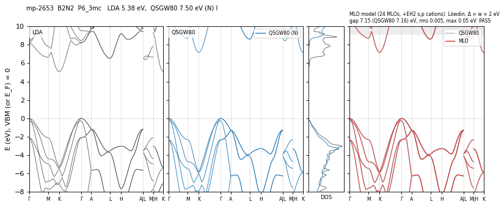

**mp-7991** B2N2 — QSGW80 **6.17** E / M 6.54 / N 6.53 · path 5.93 eV I CHECK path<mesh(mesh) — ecalj 0601771b4 (tf32, t_tetrakbt -300) with ES, ES rule es-c — MLO PASS (b2, ES) 26 gap 5.92 rms 0.013 max 0.09 (ecalj c9932cbfc)

<small>runs: M 6.54 · N 6.53 (10-03) · E 6.17 (10-06, ES 2, es-c)</small>

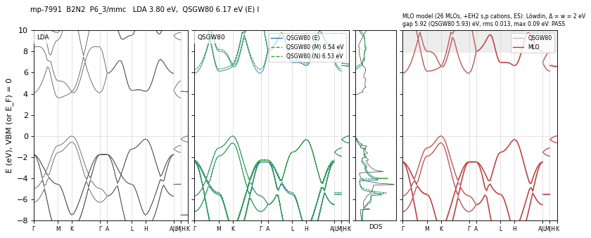

**mp-984** B2N2 — QSGW80 **6.44** E / M 6.54 / N 6.56 · path 6.32 eV I differs path<mesh(mesh) — ecalj 0601771b4 (tf32, t_tetrakbt -300) with ES, ES rule es-b — MLO PASS (b1, ES) 18 gap 6.32 rms 0.009 max 0.07 (ecalj bb1cb4dcc)

<small>runs: M 6.54 · N 6.56 (10-03) · E FAIL(1) FAIL(1) (10-05, ES 2, es-a) · E 6.44 (10-06, ES 2, es-b)</small>

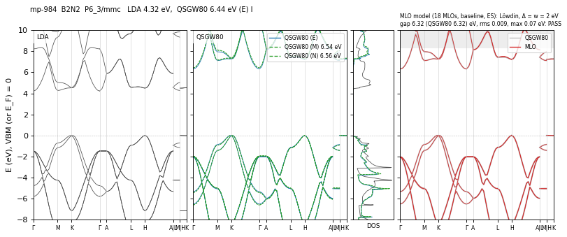

**mp-1008559** B2P2 — QSGW80 **1.96** N / M ≈ · path 1.75 eV I path<mesh(mesh) — ecalj b695fa65c (tf32, t_tetrakbt -300) — MLO PASS (b1) 26 gap 1.76 rms 0.002 max 0.02 (ecalj a1d6c0e11)

<small>runs: M 1.96 · N 1.96 (10-03)</small>

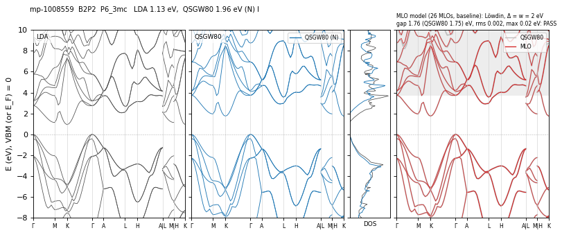

**mp-1018098** Ba2BrN — QSGW80 **2.32** N / R ≈ eV D  — ecalj b695fa65c (tf32, t_tetrakbt -300) — MLO PASS (b2) 45 gap 2.32 rms 0.004 max 0.03 (ecalj a1d6c0e11)

<small>runs: M 2.42 · R 2.32 (10-01) · N 2.32 (10-04)</small>

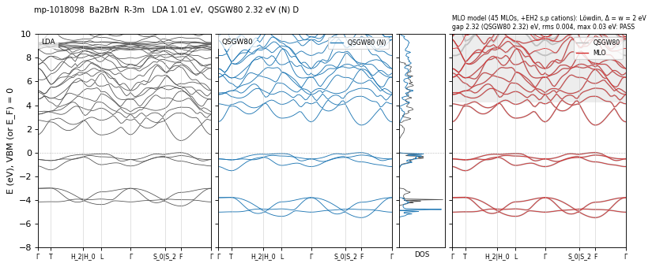

**mp-1018099** Ba2NCl — QSGW80 **2.36** N / M 2.22 eV D differs — ecalj b695fa65c (tf32, t_tetrakbt -300) — MLO PASS (b2) 45 gap 2.36 rms 0.003 max 0.02 (ecalj a1d6c0e11)

<small>runs: M 2.22 · N 2.36 (10-03)</small>

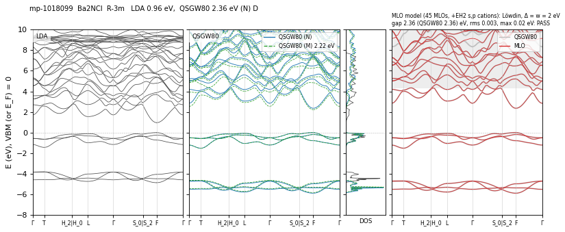

**mp-1018096** Ba2NF — QSGW80 **2.36** N / M 2.11 eV D CHECK — ecalj b695fa65c (tf32, t_tetrakbt -300) — MLO PASS (b2) 40 gap 2.36 rms 0.006 max 0.06 (ecalj a1d6c0e11)

<small>runs: M 2.11 · N 2.36 (10-03)</small>

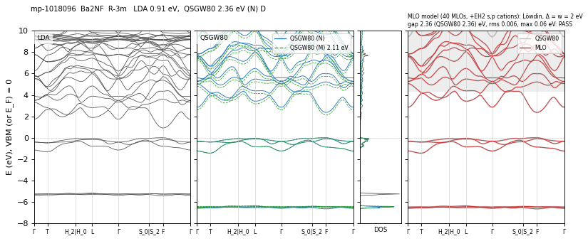

**mp-1008500** Ba2O2 — QSGW80 **4.34** N / M 4.28 eV I differs — ecalj b695fa65c (tf32, t_tetrakbt -300) — MLO PASS (b2) 50 gap 4.34 rms 0.005 max 0.04 (ecalj 839fa113b)

<small>runs: M 4.28 · N 4.34 (10-03)</small>

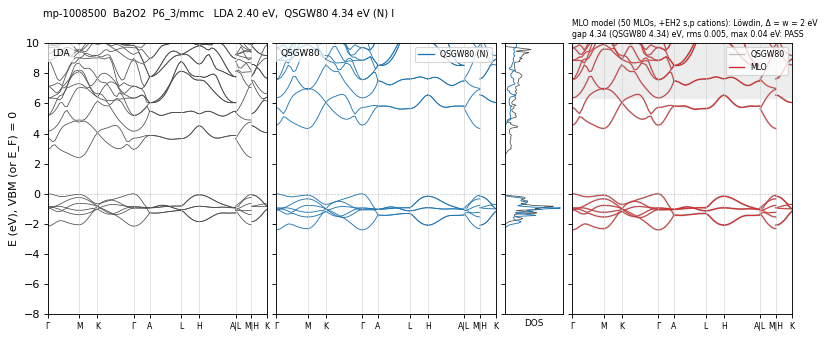

**mp-7487** Ba2O2 — QSGW80 **4.27** N / M ≈ eV I  — ecalj b695fa65c (tf32, t_tetrakbt -300) — MLO PASS (b2) 40 gap 4.25 rms 0.001 max 0.01 (ecalj 614ab5eb8)

<small>runs: M 4.25 · N 4.27 (10-03)</small>

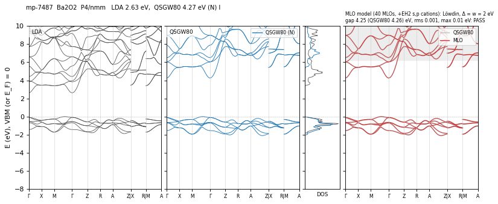

**mp-27869** Ba2PCl — QSGW80 **2.35** N / M 2.42 eV D differs — ecalj 989a18637 (tf32, t_tetrakbt -300) — MLO PASS (b2) 50 gap 2.35 rms 0.006 max 0.06 (ecalj fb2da026b)

<small>runs: M 2.42 · N 2.35 FAIL(1) (10-03) · N 2.35 (10-06)</small>

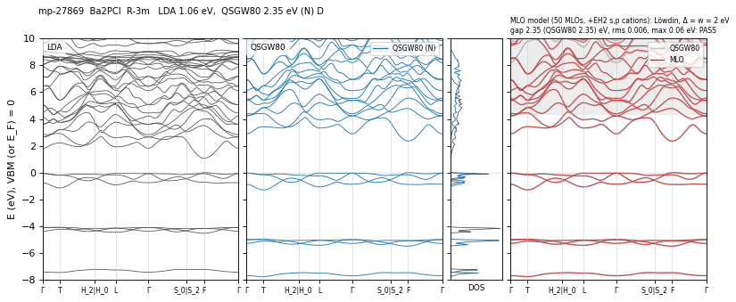

**mp-1008505** Ba2Pd2 — QSGW80 **0.30** N / M ≈ · path 0 (semimetal?) eV  path-metal — ecalj b695fa65c (tf32, t_tetrakbt -300) — MLO PASS (b2) 60 gap 0.13 rms 0.001 max 0.02 (ecalj 839fa113b)

*the bands cross E_F on the path while the mesh gives 0.29 eV*

<small>runs: M 0.29 · N 0.30 (10-03)</small>

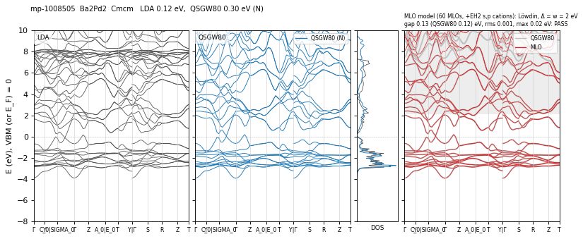

**mp-1207108** BaAlGeH — QSGW80 **1.36** N / R ≈ eV I  — ecalj b695fa65c (tf32, t_tetrakbt -300) — MLO PASS (b2) 50 gap 1.35 rms 0.003 max 0.01 (ecalj a1d6c0e11)

<small>runs: M 1.36 · R 1.36 (09-30) · N 1.36 (10-03)</small>

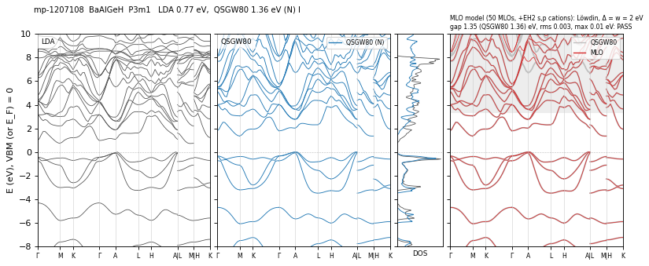

**mp-571093** BaAlSiH — QSGW80 **1.33** N / M ≈ eV I  — ecalj b695fa65c (tf32, t_tetrakbt -300) — MLO PASS (b1) 34 gap 1.28 rms 0.008 max 0.08 (ecalj 614ab5eb8)

<small>runs: M 1.34 · N 1.33 (10-03)</small>

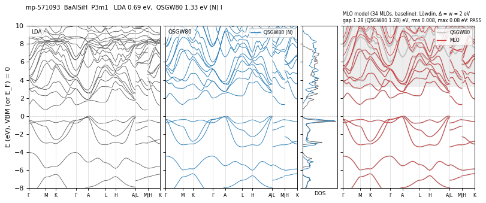

**mp-1018095** BaGaGeH — QSGW80 **0.69** N / M ≈ eV D  — ecalj b695fa65c (tf32, t_tetrakbt -300) — MLO PASS (b1) 39 gap 0.69 rms 0.006 max 0.04 (ecalj a1d6c0e11)

<small>runs: M 0.69 · N 0.69 (10-03)</small>

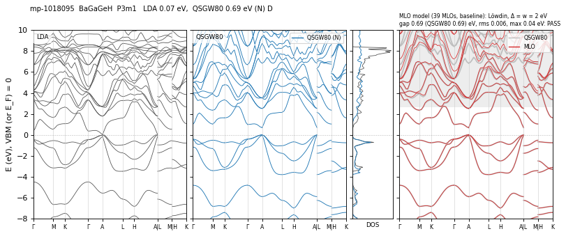

**mp-1018094** BaGaSnH — QSGW80 **0.66** N / M 0.57 eV D differs — ecalj b695fa65c (tf32, t_tetrakbt -300) — MLO PASS (b1) 39 gap 0.66 rms 0.010 max 0.08 (ecalj a1d6c0e11)

<small>runs: M 0.57 · N 0.66 (10-03)</small>

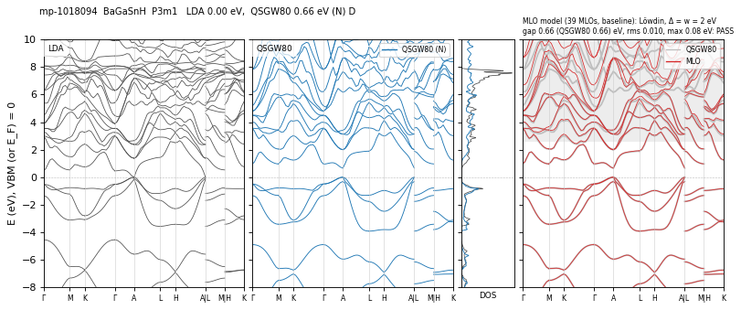

**mp-3915** BaHgO2 — QSGW80 **4.62** N / R ≈ eV I  — ecalj b695fa65c (tf32, t_tetrakbt -300) — MLO PASS (b2) 37 gap 4.62 rms 0.003 max 0.03 (ecalj 614ab5eb8)

<small>runs: M 4.05 · R 4.62 (10-01) · N 4.62 (10-04)</small>

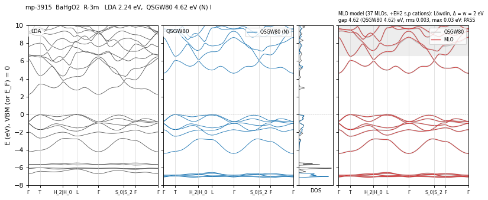

**mp-2542** Be2O2 — QSGW80 **10.76** N / M 10.96 eV D CHECK — ecalj b695fa65c (tf32, t_tetrakbt -300) — MLO PASS (b2) 24 gap 10.76 rms 0.004 max 0.03 (ecalj fb2da026b)

<small>runs: M 10.96 · N 10.76 (10-03)</small>

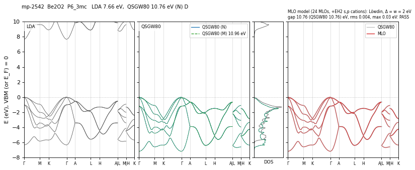

**mp-23301** BiF3 — QSGW80 **6.41** N / M ≈ · path 6.30 eV I path<mesh(mesh) — ecalj 989a18637 (tf32, t_tetrakbt -300) — MLO PASS (b1) 26 gap 6.30 rms 0.001 max 0.01 (ecalj fb2da026b)

<small>runs: M 6.40 · N 6.41 (10-03)</small>

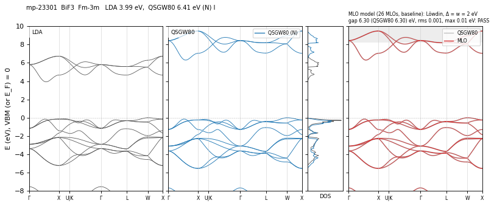

**mp-1066781** Br2Cl2 — QSGW80 **4.41** N / M ≈ eV I  — ecalj b695fa65c (tf32, t_tetrakbt -300) — MLO PASS (b1) 36 gap 4.44 rms 0.006 max 0.04 (ecalj a1d6c0e11)

<small>runs: M 4.37 · N 4.41 (10-03)</small>

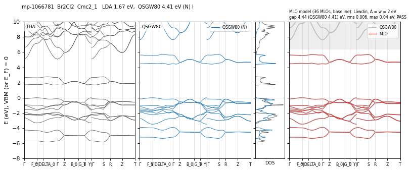

**mp-23154** Br4 — QSGW80 **3.50** E / M 3.72 / N ≈ eV I CHECK — ecalj 0601771b4 (tf32, t_tetrakbt -300) with ES, ES rule es-c — MLO PASS (b1, ES) 44 gap 3.50 rms 0.000 max 0.00 (ecalj f16f0ea3d)

<small>runs: M 3.72 · N 3.51 (10-03) · E 3.50 (10-06, ES 8, es-c)</small>

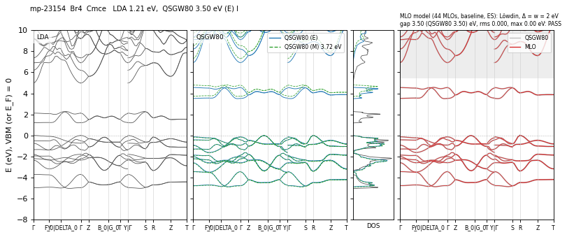

**mp-2516584** C4 — QSGW80 **2.43** E / M ≈ / N ≈ · path 0 (semimetal?) eV  path-metal vs2025 — ecalj 0601771b4 (tf32, t_tetrakbt -300) with ES, ES rule es-c — MLO PASS (b1, ES) 17 gap 0.43 rms 0.005 max 0.02 (ecalj c9932cbfc)

*graphite-like: the bands cross E_F on the path, which the 8x8x8 mesh misses; a semimetal, the gap on the mesh is not physical*

<small>runs: M 2.40 · N 2.48 (10-03) · E1 FAIL(1) FAIL(1) (10-05, ES 1) · E FAIL(1) FAIL(1) (10-05, ES 1, es-a) · E FAIL(1) FAIL(1) (10-06, ES 1, es-a) · E 2.43 (10-06, ES 1, es-c)</small>

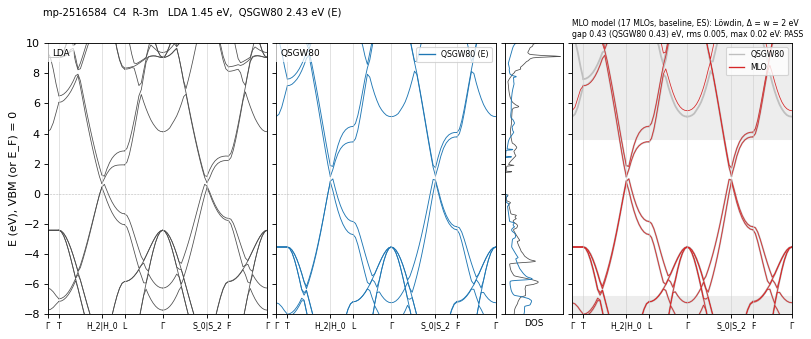

**mp-47** C4 — QSGW80 **5.23** N / M ≈ · path 4.84 eV I path<mesh(mesh) vs2025 — ecalj b695fa65c (tf32, t_tetrakbt -300) — MLO PASS (b1) 16 gap 4.82 rms 0.006 max 0.05 (ecalj 614ab5eb8)

<small>runs: M 5.24 · N 5.23 (10-03)</small>

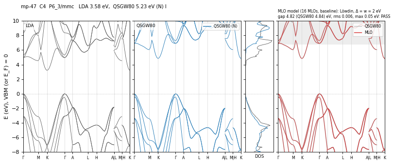

**mp-569304** C4 — QSGW80 **3.68** E / R ≈ · path 0 (semimetal?) eV  path-metal LDA≠PBE vs2025 — ecalj 0601771b4 (tf32, t_tetrakbt -300) with ES, ES rule es-c — MLO PASS (b1, ES) 17 gap 0.34 rms 0.005 max 0.02 (ecalj c9932cbfc)

*graphite-like fragment (invalid structure); the bands cross E_F on the path*

<small>runs: M 3.87 · R 3.68 (10-01) · E1 FAIL(1) FAIL(1) (10-05, ES 1) · E FAIL(1) FAIL(1) (10-05, ES 1, es-a) · E FAIL(1) FAIL(1) (10-06, ES 1, es-a) · E 3.68 (10-06, ES 1, es-c)</small>

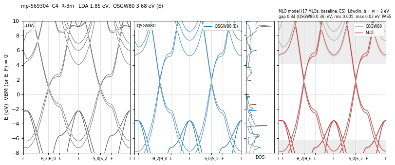

**mp-28554** Ca2AsI — QSGW80 **2.77** N / M 2.84 eV I differs — ecalj b695fa65c (tf32, t_tetrakbt -300) — MLO PASS (b2) 44 gap 2.77 rms 0.003 max 0.03 (ecalj fb2da026b)

<small>runs: M 2.84 · N 2.77 (10-03)</small>

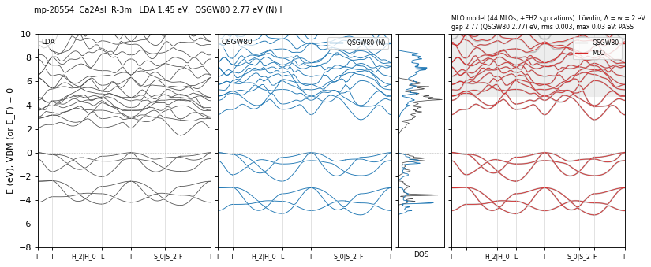

**mp-23009** Ca2BrN — QSGW80 **4.09** N / M 3.87 eV I CHECK — ecalj b695fa65c (tf32, t_tetrakbt -300) — MLO PASS (b1) 31 gap 4.09 rms 0.007 max 0.04 (ecalj fb2da026b)

<small>runs: M 3.87 · N 4.09 (10-03)</small>

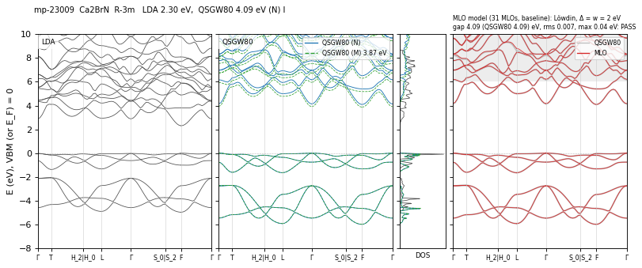

**mp-22936** Ca2NCl — QSGW80 **4.15** N / R ≈ eV I  — ecalj b695fa65c (tf32, t_tetrakbt -300) — MLO PASS (b1) 31 gap 4.15 rms 0.006 max 0.04 (ecalj fb2da026b)

<small>runs: M 3.22 · R 4.15 (10-01) · N 4.15 (10-04)</small>

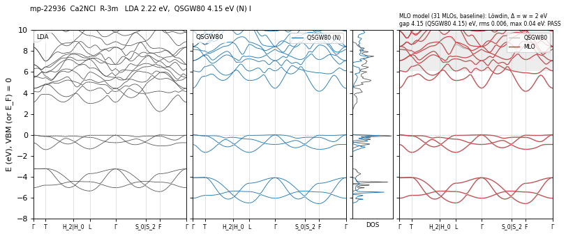

**mp-23040** Ca2PI — QSGW80 **2.94** N / R ≈ eV I  — ecalj b695fa65c (tf32, t_tetrakbt -300) — MLO PASS (b2) 44 gap 2.94 rms 0.002 max 0.02 (ecalj fb2da026b)

<small>runs: M 2.28 · R 2.94 (10-01) · N 2.94 (10-04)</small>

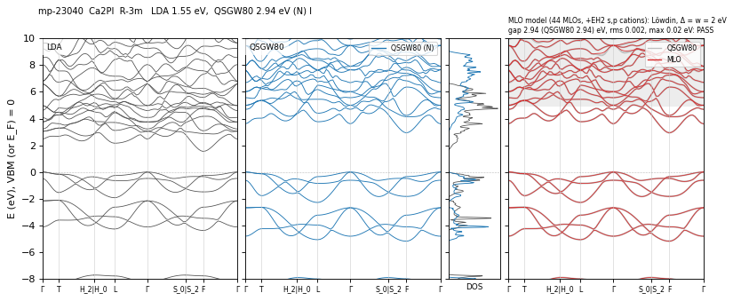

**mp-568177** CaAlSiH — QSGW80 **1.03** N / M ≈ eV I  — ecalj b695fa65c (tf32, t_tetrakbt -300) — MLO PASS (b1) 31 gap 1.03 rms 0.001 max 0.01 (ecalj 614ab5eb8)

<small>runs: M 1.03 · N 1.03 (10-03)</small>

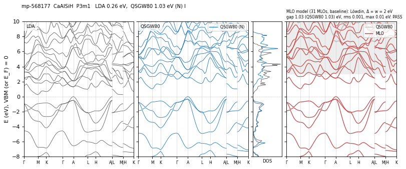

**mp-4124** CaCN2 — QSGW80 **5.48** N / R ≈ eV I  — ecalj b695fa65c (tf32, t_tetrakbt -300) — MLO PASS (b2) 29 gap 5.48 rms 0.011 max 0.10 (ecalj 614ab5eb8)

<small>runs: M 5.69 · R 5.48 (10-01) · N 5.48 (10-03)</small>

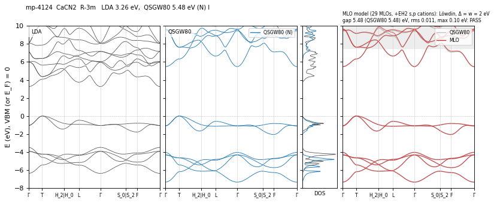

**mp-7041** CaHgO2 — QSGW80 **4.44** N / R ≈ eV I  — ecalj b695fa65c (tf32, t_tetrakbt -300) — MLO PASS (b2) 34 gap 4.44 rms 0.005 max 0.04 (ecalj 614ab5eb8)

<small>runs: M 4.57 · R 4.44 (10-01) · N 4.44 (10-03)</small>

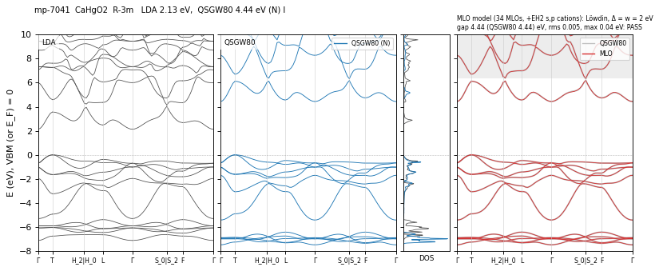

**mp-672** Cd2S2 — QSGW80 **2.41** N / M ≈ eV D  — ecalj b695fa65c (tf32, t_tetrakbt -300) — MLO PASS (b1) 36 gap 2.42 rms 0.010 max 0.05 (ecalj 614ab5eb8)

<small>runs: M 2.42 · N 2.41 (10-03)</small>

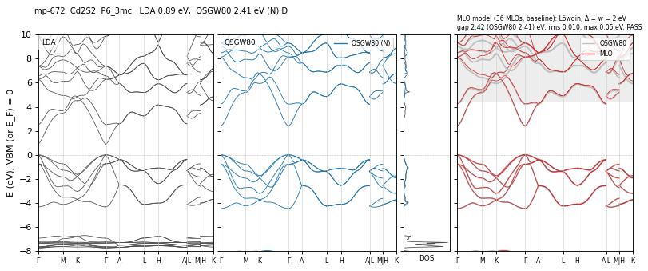

**mp-1070** Cd2Se2 — QSGW80 **1.79** N / M ≈ eV D  — ecalj b695fa65c (tf32, t_tetrakbt -300) — MLO PASS (b1) 36 gap 1.81 rms 0.011 max 0.06 (ecalj a1d6c0e11)

<small>runs: M 1.78 · N 1.79 (10-03)</small>

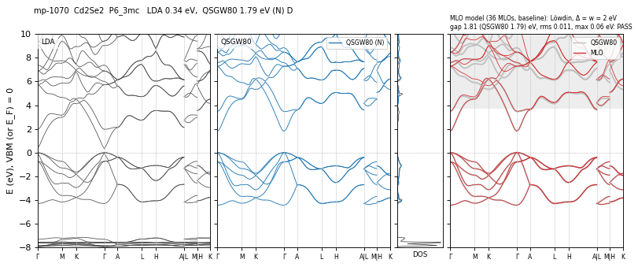

**mp-12779** Cd2Te2 — QSGW80 **1.74** E / E1 ≈ / M ≈ / N ≈ eV D  — ecalj 0601771b4 (tf32, t_tetrakbt -300) with ES, ES rule es-c — MLO PASS (b1, ES) 38 gap 1.74 rms 0.003 max 0.02 (ecalj f16f0ea3d)

<small>runs: M 1.72 · N 1.72 (10-03) · E1 1.73 (10-05, ES 2) · E 1.74 (10-06, ES 2, es-c)</small>

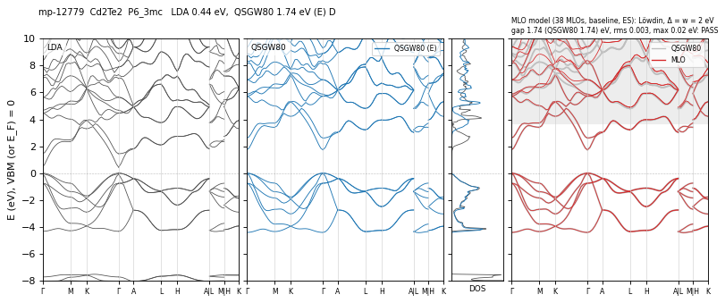

**mp-10969** CdCN2 — QSGW80 **3.82** N / R ≈ eV I  — ecalj b695fa65c (tf32, t_tetrakbt -300) — MLO PASS (b2) 29 gap 3.82 rms 0.003 max 0.01 (ecalj a1d6c0e11)

<small>runs: M FAILED · R 3.82 (09-30) · N 3.82 (10-03)</small>

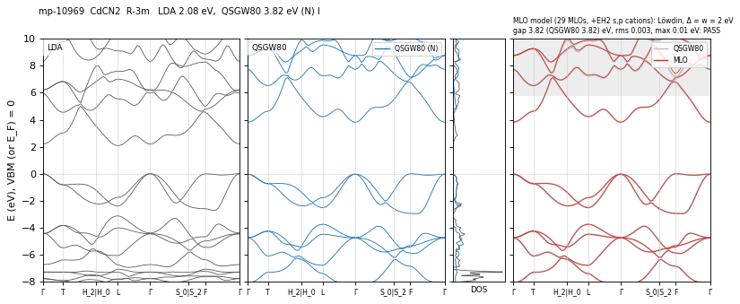

**mp-9146** CdHgO2 — QSGW80 **1.95** N / M 2.02 eV I differs — ecalj b695fa65c (tf32, t_tetrakbt -300) — MLO PASS (b1) 26 gap 1.95 rms 0.006 max 0.08 (ecalj 614ab5eb8)

<small>runs: M 2.02 · N 1.95 (10-03)</small>

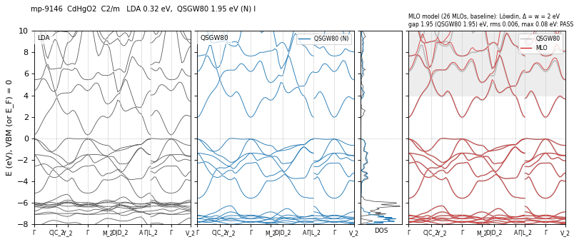

**mp-22848** Cl4 — QSGW80 **5.78** E / M ≈ / N 5.86 eV D differs — ecalj 0601771b4 (tf32, t_tetrakbt -300) with ES, ES rule es-c — MLO PASS (b1, ES) 44 gap 5.78 rms 0.000 max 0.00 (ecalj d90296348)

<small>runs: M 5.79 · N 5.86 (10-03) · E FAIL(1) FAIL(1) (10-06, ES 8, es-a) · E 5.78 (10-06, ES 8, es-c)</small>

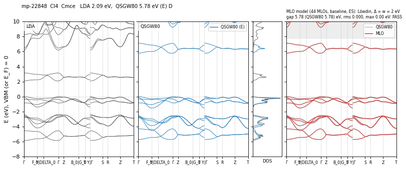

**mp-7896** Cs2O2 — QSGW80 **4.01** N / M 3.95 eV I differs — ecalj b695fa65c (tf32, t_tetrakbt -300) — MLO PASS (b2) 40 gap 3.99 rms 0.008 max 0.04 (ecalj 614ab5eb8)

<small>runs: M 3.95 · N 4.01 (10-03)</small>

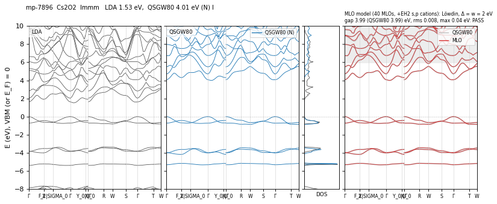

**mp-29266** Cs2S2 — QSGW80 **3.87** E / E1 ≈ / M ≈ / N 3.93 eV I differs — ecalj 0601771b4 (tf32, t_tetrakbt -300) with ES, ES rule es-c — MLO PASS (b1, ES) 46 gap 3.82 rms 0.013 max 0.10 (ecalj a45169f3c)

<small>runs: M 3.90 · N 3.93 (10-03) · E1 3.85 (10-05, ES 1) · E 3.87 (10-06, ES 1, es-c)</small>

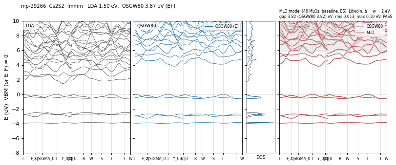

**mp-635413** Cs3Bi — QSGW80 **1.11** N / M ≈ eV I  — ecalj b695fa65c (tf32, t_tetrakbt -300) — MLO PASS (b2) 61 gap 1.11 rms 0.003 max 0.01 (ecalj 614ab5eb8)

<small>runs: M 1.07 · N 1.11 (10-03)</small>

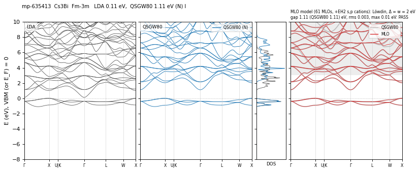

**mp-10378** Cs3Sb — QSGW80 **1.61** N / M ≈ eV I  — ecalj b695fa65c (tf32, t_tetrakbt -300) — MLO PASS (b2) 57 gap 1.61 rms 0.002 max 0.01 (ecalj a1d6c0e11)

<small>runs: M 1.66 · N 1.61 (10-03)</small>

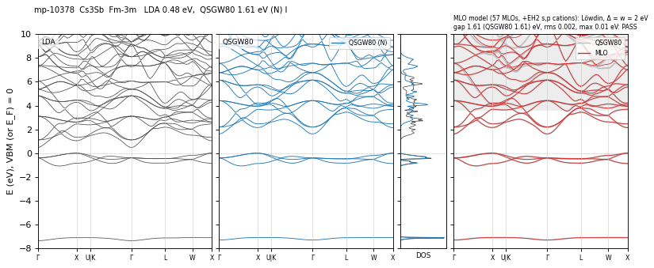

**mp-1065405** CsAuC2 — QSGW80 **4.06** N / M ≈ eV I  — ecalj b695fa65c (tf32, t_tetrakbt -300) — MLO PASS (b2d) 46 gap 4.06 rms 0.004 max 0.07 (ecalj 7d5dfe714)

<small>runs: M 4.04 · N 4.06 (10-03)</small>

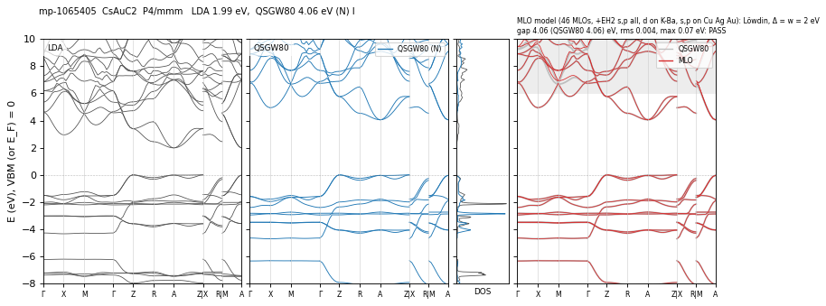

**mp-28650** CsBr2F — QSGW80 **4.70** E / E1 ≈ / M ≈ / N ≈ eV D  — ecalj 0601771b4 (tf32, t_tetrakbt -300) with ES, ES rule es-c — MLO PASS (b1, ES) 39 gap 4.70 rms 0.000 max 0.00 (ecalj f16f0ea3d)

<small>runs: M 4.72 · N 4.67 (10-03) · E1 4.69 (10-05, ES 1) · E 4.70 (10-06, ES 1, es-c)</small>

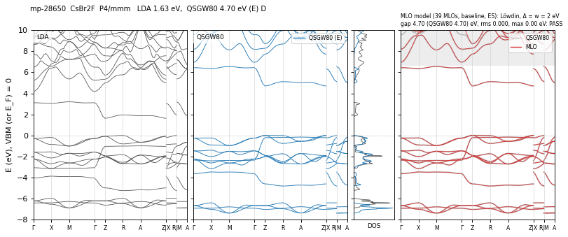

**mp-22990** CsICl2 — QSGW80 **4.81** N / M 4.98 eV I differs — ecalj b695fa65c (tf32, t_tetrakbt -300) — MLO PASS (b2) 40 gap 4.78 rms 0.002 max 0.01 (ecalj fb2da026b)

<small>runs: M 4.98 · N 4.81 (10-03)</small>

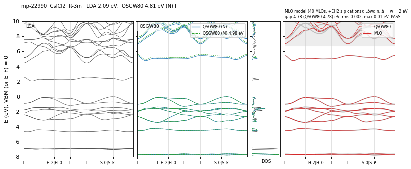

**mp-581024** CsK2Sb — QSGW80 **2.03** N / M ≈ eV D  — ecalj b695fa65c (tf32, t_tetrakbt -300) — MLO PASS (b2) 57 gap 2.03 rms 0.002 max 0.01 (ecalj 614ab5eb8)

<small>runs: M 2.02 · N 2.03 (10-03)</small>

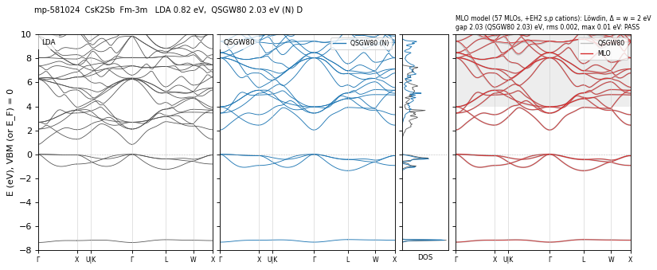

**mp-22917** Cu2Br2 — QSGW80 **2.84** N / M 2.78 eV D differs — ecalj b695fa65c (tf32, t_tetrakbt -300) — MLO PASS (b2all) 44 gap 2.84 rms 0.001 max 0.01 (ecalj fb2da026b)

<small>runs: M 2.78 · N 2.84 (10-03)</small>

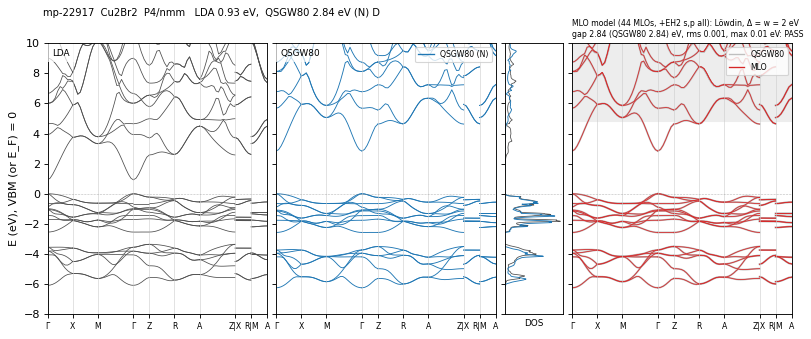

**mp-23227** Cu2Br2 — QSGW80 **2.31** N / M ≈ eV D  — ecalj 989a18637 (tf32, t_tetrakbt -300) — MLO PASS (b2all) 44 gap 2.31 rms 0.001 max 0.01 (ecalj fb2da026b)

<small>runs: M 2.34 · N 2.31 (10-03)</small>

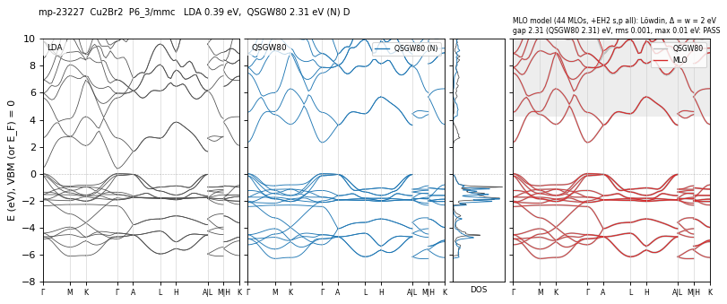

**mp-24093** Cu2H2 — QSGW80 **1.36** N / M ≈ eV I  — ecalj b695fa65c (tf32, t_tetrakbt -300) — MLO PASS (b1) 26 gap 1.35 rms 0.005 max 0.06 (ecalj fb2da026b)

<small>runs: M 1.37 · N 1.36 (10-03)</small>

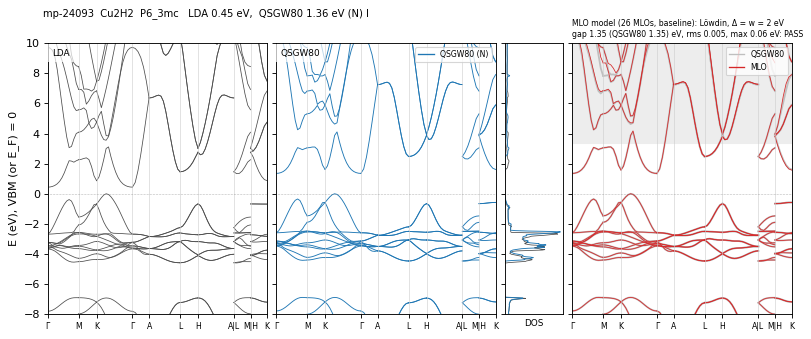

**mp-1007922** Cu2I2 — QSGW80 **2.54** N / M ≈ eV D  — ecalj b695fa65c (tf32, t_tetrakbt -300) — MLO PASS (b2all) 44 gap 2.54 rms 0.008 max 0.08 (ecalj a1d6c0e11)

<small>runs: M 2.51 · N 2.54 (10-03)</small>

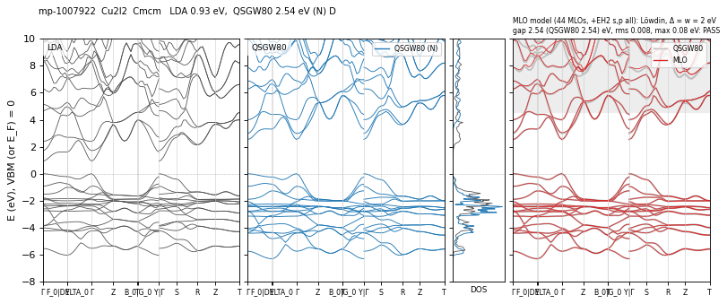

**mp-22863** Cu2I2 — QSGW80 **3.10** N / M 3.03 eV D differs — ecalj b695fa65c (tf32, t_tetrakbt -300) — MLO PASS (b2all) 44 gap 3.10 rms 0.003 max 0.05 (ecalj fb2da026b)

<small>runs: M 3.03 · N 3.10 (10-03)</small>

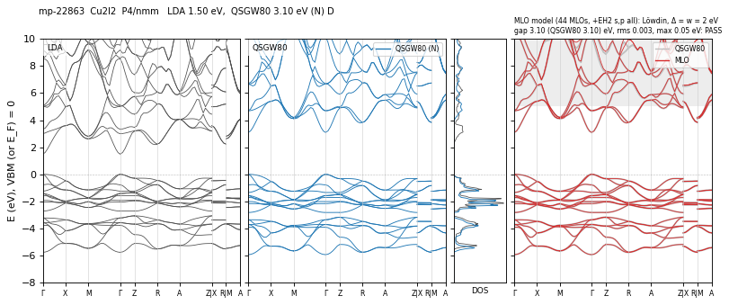

**mp-569346** Cu2I2 — QSGW80 **2.83** N / M ≈ eV D  — ecalj b695fa65c (tf32, t_tetrakbt -300) — MLO PASS (b2d) 52 gap 2.83 rms 0.001 max 0.01 (ecalj 1fd34b1c0)

<small>runs: M 2.83 · N 2.83 (10-03)</small>

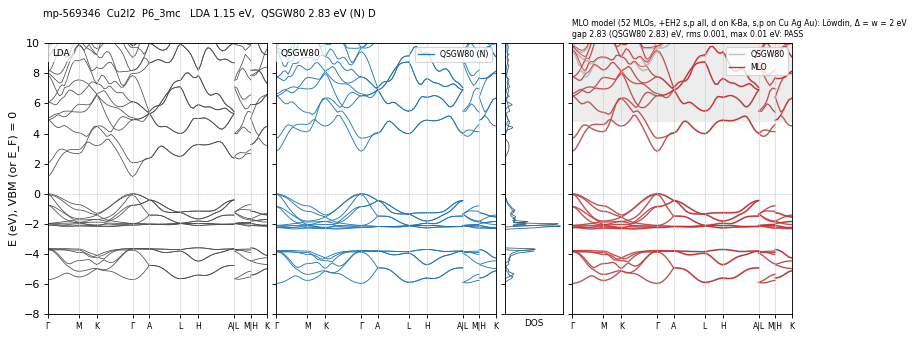

**mp-1933** Cu3N — QSGW80 **0.95** E / E1 ≈ / M 0.86 / N 0.86 eV I differs — ecalj 0601771b4 (tf32, t_tetrakbt -300) with ES, ES rule es-c — MLO PASS (b1, ES) 32 gap 0.95 rms 0.003 max 0.07 (ecalj f16f0ea3d)

<small>runs: M 0.86 · N 0.86 (10-03) · E1 0.93 (10-05, ES 1) · E 0.95 (10-06, ES 1, es-c)</small>

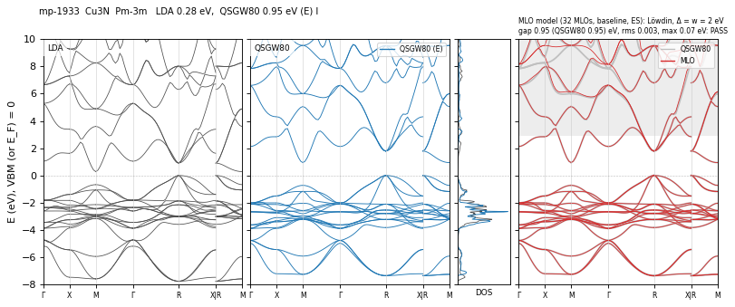

**mp-29643** CuAsSe2 — QSGW80 **0.94** N / M ≈ · path 0.52 eV I path<mesh(mesh) — ecalj b695fa65c (tf32, t_tetrakbt -300) — MLO PASS (b2all) 48 gap 0.52 rms 0.001 max 0.01 (ecalj fb2da026b)

<small>runs: M 0.95 · N 0.94 (10-03)</small>

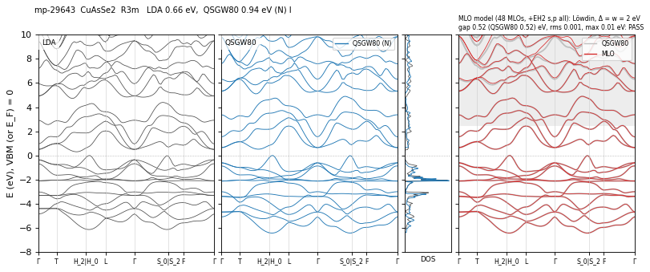

**mp-672285** CuCSN — QSGW80 **3.48** E / M 3.29 / N 3.60 eV I differs — ecalj 0601771b4 (tf32, t_tetrakbt -300) with ES, ES rule es-c — MLO PASS (b2all, ES) 39 gap 3.48 rms 0.004 max 0.05 (ecalj a45169f3c)

<small>runs: M 3.29 · N 3.60 (10-03) · E1 FAIL(1) FAIL(1) (10-05, ES 2) · E 3.48 (10-06, ES 1, es-c)</small>

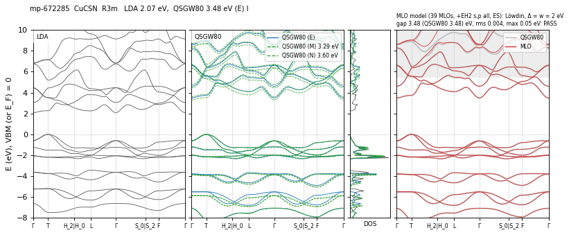

**mp-14116** CuRhO2 — QSGW80 **2.03** N / M 1.94 eV I differs — ecalj 989a18637 (tf32, t_tetrakbt -300) — MLO PASS (b1) 26 gap 1.97 rms 0.002 max 0.03 (ecalj 96ec5c1ee)

<small>runs: M 1.94 · N 2.03 (10-02)</small>

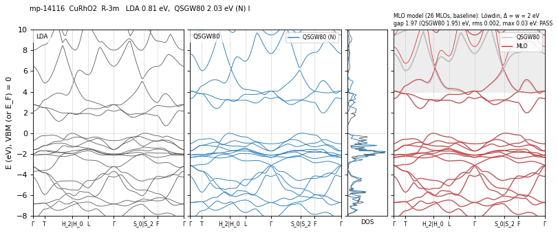

**mp-561203** F4 — QSGW80 **9.93** N / R ≈ eV D  — ecalj b695fa65c (tf32, t_tetrakbt -300) — MLO PASS (b1) 16 gap 9.93 rms 0.002 max 0.02 (ecalj 614ab5eb8)

<small>runs: M 9.86 · R 9.93 (10-01) · N 9.93 (10-04)</small>

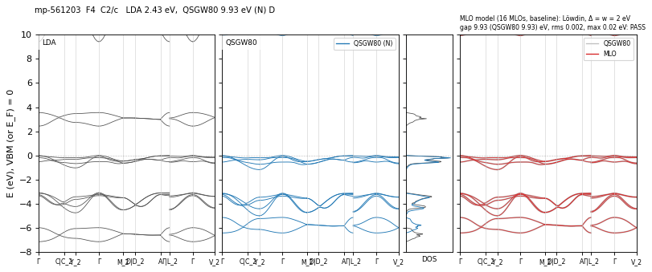

**mp-804** Ga2N2 — QSGW80 **3.30** N / M ≈ eV D  — ecalj b695fa65c (tf32, t_tetrakbt -300) — MLO PASS (b1) 36 gap 3.30 rms 0.002 max 0.02 (ecalj 614ab5eb8)

<small>runs: M 3.29 · N 3.30 (10-03)</small>

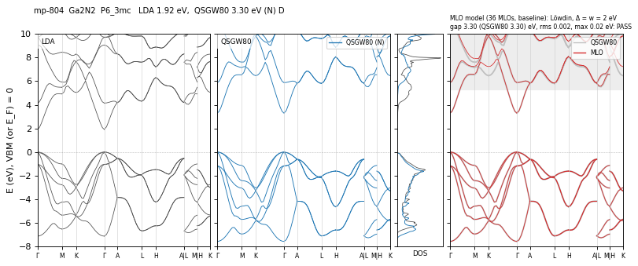

**mp-1018275** Ga2P2 — QSGW80 **1.40** N / M ≈ eV I  — ecalj b695fa65c (tf32, t_tetrakbt -300) — MLO PASS (b1) 46 gap 1.41 rms 0.004 max 0.03 (ecalj a1d6c0e11)

<small>runs: M 1.42 · N 1.40 (10-03)</small>

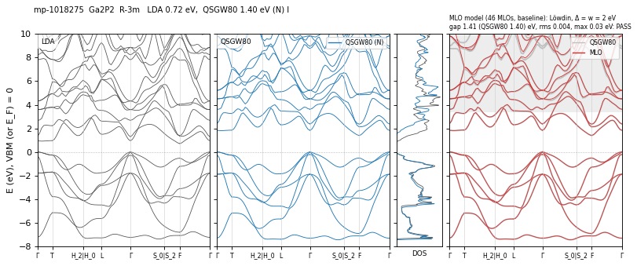

**mp-9889** Ga2S2 — QSGW80 **2.98** N / R ≈ eV D  — ecalj b695fa65c (tf32, t_tetrakbt -300) — MLO PASS (b2) 54 gap 2.99 rms 0.004 max 0.02 (ecalj 614ab5eb8)

<small>runs: M 2.79 · R 2.98 (10-01) · N 2.98 (10-04)</small>

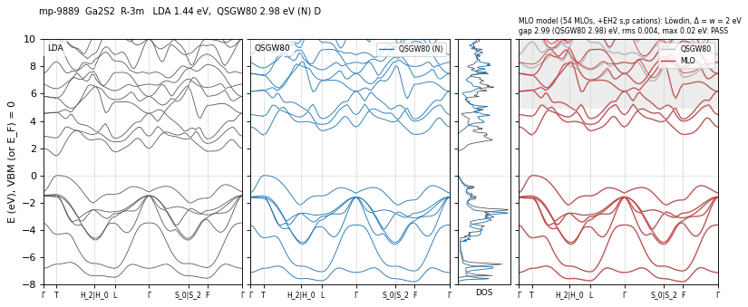

**mp-11342** Ga2Se2 — QSGW80 **2.60** E / M ≈ / N ≈ eV D  — ecalj 0601771b4 (tf32, t_tetrakbt -300) with ES, ES rule es-a — MLO PASS (b1, ES) 47 gap 2.60 rms 0.007 max 0.06 (ecalj f1c43557a)

<small>runs: M 2.58 · N 2.60 (10-03) · E1 2.54 FAIL(1) (10-05, ES 1) · E 2.54 FAIL(1) (10-05, ES 1, es-a) · E 2.60 (10-06, ES 1, es-a)</small>

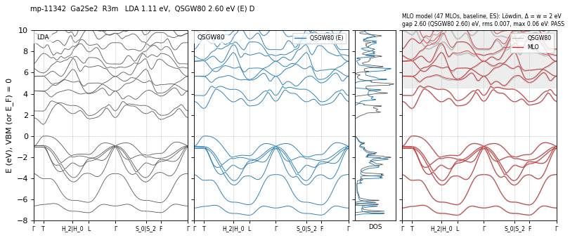

**mp-4280** GaCuO2 — QSGW80 **2.59** N / M 2.08 eV I CHECK — ecalj 989a18637 (tf32, t_tetrakbt -300) — MLO PASS (b2all) 43 gap 2.58 rms 0.005 max 0.03 (ecalj fb2da026b)

<small>runs: M 2.08 · N 2.59 (10-03)</small>

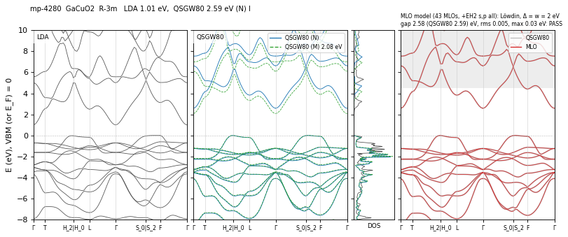

**mp-632229** H2Br2 — QSGW80 **7.71** E / E1 7.51 / M ≈ / N 7.78 eV D CHECK — ecalj 0601771b4 (tf32, t_tetrakbt -300) with ES, ES rule es-c — MLO PASS (b2all, ES) 44 gap 7.71 rms 0.005 max 0.04 (ecalj a45169f3c)

<small>runs: M 7.69 · N 7.78 (10-03) · E1 7.51 (10-05, ES 2) · E 7.71 (10-06, ES 2, es-c)</small>

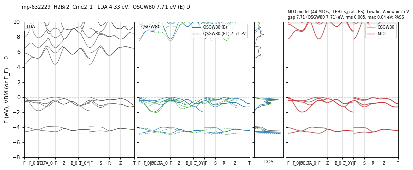

**mp-632326** H2Cl2 — QSGW80 **9.26** E / E1 9.01 / M ≈ / N ≈ eV D CHECK — ecalj 0601771b4 (tf32, t_tetrakbt -300) with ES, ES rule es-c — MLO PASS (b2all, ES) 44 gap 9.26 rms 0.004 max 0.03 (ecalj a45169f3c)

<small>runs: M 9.27 · N 9.30 (10-03) · E1 9.01 (10-05, ES 2) · E 9.26 (10-06, ES 2, es-c)</small>

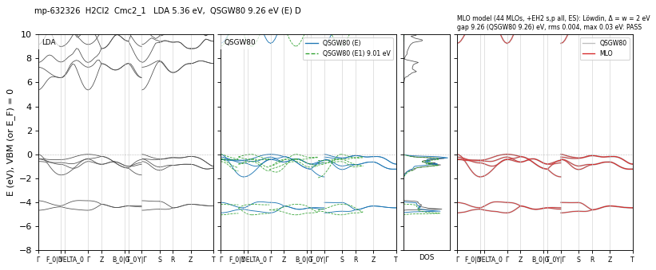

**mp-632296** H2F2 — QSGW80 **11.88** E / N 12.25 / R 12.25 eV D CHECK — ecalj 0601771b4 (tf32, t_tetrakbt -300) with ES, ES rule es-c — MLO PASS (b1, ES) 18 gap 11.88 rms 0.004 max 0.06 (ecalj f16f0ea3d)

<small>runs: M 12.35 · R 12.25 (10-01) · N 12.25 (10-03) · E 11.88 (10-06, ES 2, es-c)</small>

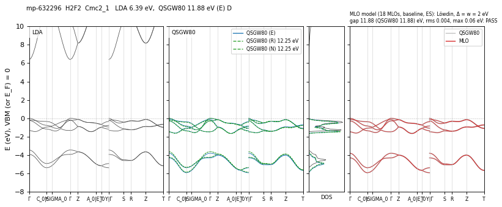

**mp-24504** H4 — QSGW80 **15.71** E / E1 15.50 / M ≈ / N ≈ eV D CHECK vs2025 — ecalj 0601771b4 (tf32, t_tetrakbt -300) with ES, ES rule es-c — MLO PASS (b2, ES) 34 gap 15.71 rms 0.007 max 0.03 (ecalj f16f0ea3d)

*2025 values equal to LDA (the 2025 QSGW of H4 had not run)*

<small>runs: M 15.71 · N 15.75 (10-02) · E1 15.50 (10-05, ES 1) · E 15.71 (10-06, ES 2, es-c)</small>

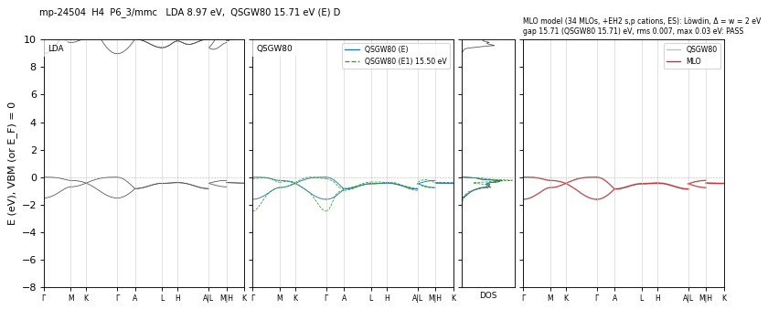

**mp-23177** Hg2Br2 — QSGW80 **3.54** E / M ≈ / N 3.60 eV I differs — ecalj 0601771b4 (tf32, t_tetrakbt -300) with ES, ES rule es-c — MLO PASS (b1, ES) 40 gap 3.44 rms 0.000 max 0.01 (ecalj f16f0ea3d)

<small>runs: M 3.59 · N 3.60 (10-03) · E 3.54 (10-06, ES 4, es-c)</small>

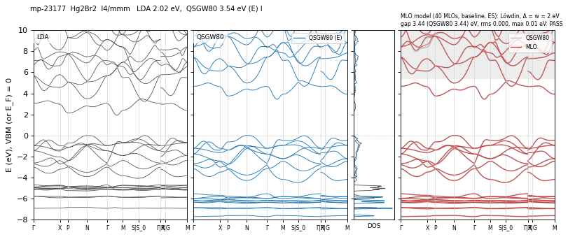

**mp-22897** Hg2Cl2 — QSGW80 **4.09** E / M ≈ / N 4.16 eV I differs — ecalj 0601771b4 (tf32, t_tetrakbt -300) with ES, ES rule es-c — MLO PASS (b1, ES) 40 gap 4.08 rms 0.001 max 0.01 (ecalj f16f0ea3d)

<small>runs: M 4.07 · N 4.16 (10-03) · E 4.09 (10-06, ES 4, es-c)</small>

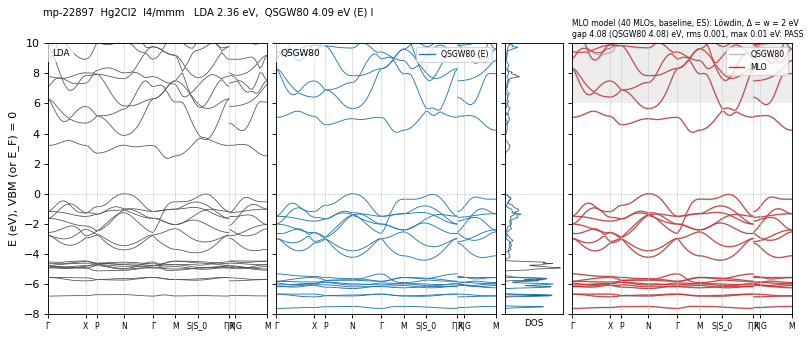

**mp-706** Hg2F2 — QSGW80 **2.89** E / N ≈ / R ≈ eV I  — ecalj 0601771b4 (tf32, t_tetrakbt -300) with ES, ES rule es-c — MLO PASS (b1, ES) 29 gap 2.89 rms 0.001 max 0.01 (ecalj f16f0ea3d)

<small>runs: M 3.01 · R 2.89 (10-01) · N 2.89 (10-04) · E 2.89 (10-06, ES 3, es-c)</small>

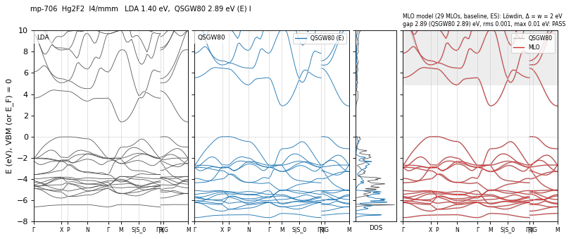

**mp-22859** Hg2I2 — QSGW80 **2.85** E / M ≈ / N 2.91 eV I differs — ecalj 0601771b4 (tf32, t_tetrakbt -300) with ES, ES rule es-c — MLO PASS (b1, ES) 40 gap 2.78 rms 0.000 max 0.00 (ecalj f16f0ea3d)

<small>runs: M 2.85 · N 2.91 (10-03) · E 2.85 (10-06, ES 4, es-c)</small>

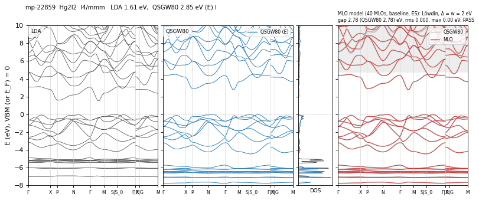

**mp-1525634** I4 — QSGW80 **2.08** E / M 2.14 / N ≈ eV I differs — ecalj 0601771b4 (tf32, t_tetrakbt -300) with ES, ES rule es-c — MLO PASS (b1, ES) 44 gap 2.08 rms 0.000 max 0.00 (ecalj d90296348)

<small>runs: M 2.14 · N 2.13 (10-03) · E FAIL(1) FAIL(1) (10-06, ES 8, es-a) · E 2.08 (10-06, ES 8, es-c)</small>

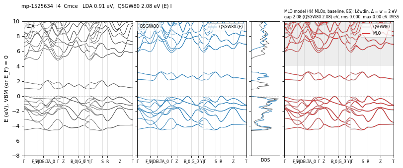

**mp-23153** I4 — QSGW80 **2.16** E / M ≈ / N ≈ eV I  — ecalj 0601771b4 (tf32, t_tetrakbt -300) with ES, ES rule es-c — MLO PASS (b1, ES) 44 gap 2.16 rms 0.000 max 0.00 (ecalj f16f0ea3d)

<small>runs: M 2.15 · N 2.16 (10-03) · E 2.16 (10-06, ES 8, es-c)</small>

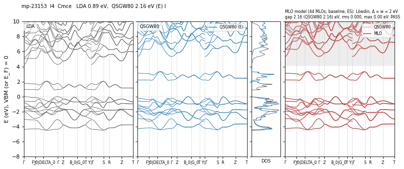

**mp-22870** In2Br2 — QSGW80 **1.99** E / M ≈ / N ≈ eV I  — ecalj 0601771b4 (tf32, t_tetrakbt -300) with ES, ES rule es-c — MLO PASS (b1, ES) 48 gap 1.97 rms 0.001 max 0.00 (ecalj f16f0ea3d)

<small>runs: M 2.03 · N 1.99 (10-03) · E 1.99 (10-06, ES 2, es-c)</small>

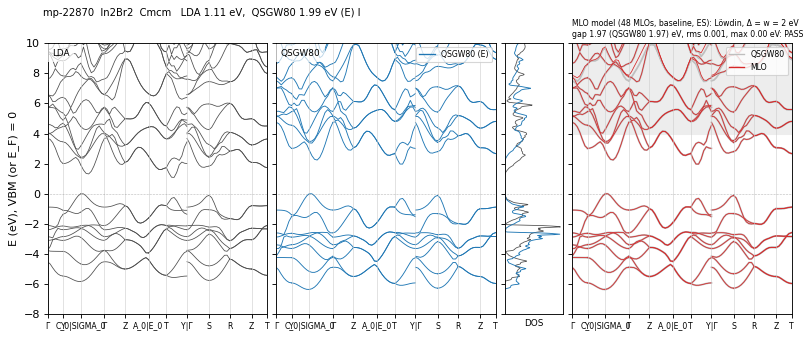

**mp-571555** In2Cl2 — QSGW80 **2.13** E / M 2.18 / N ≈ eV I differs — ecalj 0601771b4 (tf32, t_tetrakbt -300) with ES, ES rule es-c — MLO PASS (b1, ES) 48 gap 2.13 rms 0.001 max 0.00 (ecalj f16f0ea3d)

<small>runs: M 2.18 · N 2.13 (10-03) · E 2.13 (10-06, ES 2, es-c)</small>

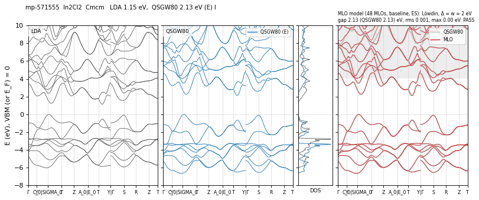

**mp-571636** In2Cl2 — QSGW80 **2.52** E / M 2.47 / N ≈ eV I differs — ecalj 0601771b4 (tf32, t_tetrakbt -300) with ES, ES rule es-c — MLO PASS (b1, ES) 48 gap 2.52 rms 0.001 max 0.01 (ecalj f16f0ea3d)

<small>runs: M 2.47 · N 2.52 (10-03) · E 2.52 (10-06, ES 2, es-c)</small>

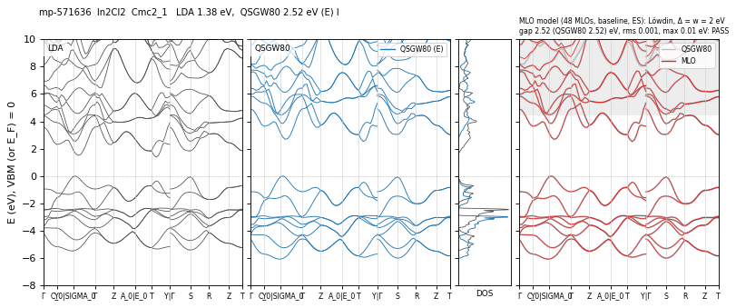

**mp-23202** In2I2 — QSGW80 **2.14** E / M ≈ / N ≈ eV I  — ecalj 0601771b4 (tf32, t_tetrakbt -300) with ES, ES rule es-c — MLO PASS (b1, ES) 48 gap 2.05 rms 0.001 max 0.00 (ecalj f16f0ea3d)

<small>runs: M 2.14 · N 2.14 (10-03) · E 2.14 (10-06, ES 2, es-c)</small>

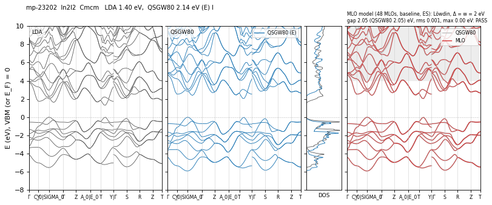

**mp-21405** In2Se2 — QSGW80 **1.91** N / M ≈ eV I  — ecalj b695fa65c (tf32, t_tetrakbt -300) — MLO PASS (b1) 46 gap 1.95 rms 0.005 max 0.06 (ecalj fb2da026b)

<small>runs: M 1.89 · N 1.91 (10-03)</small>

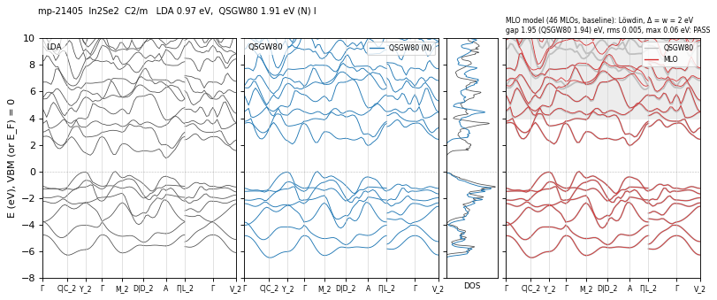

**mp-22691** In2Se2 — QSGW80 **1.28** N / M ≈ eV D  — ecalj b695fa65c (tf32, t_tetrakbt -300) — MLO PASS (b1) 46 gap 1.29 rms 0.012 max 0.09 (ecalj fb2da026b)

<small>runs: M 1.28 · N 1.28 (10-03)</small>

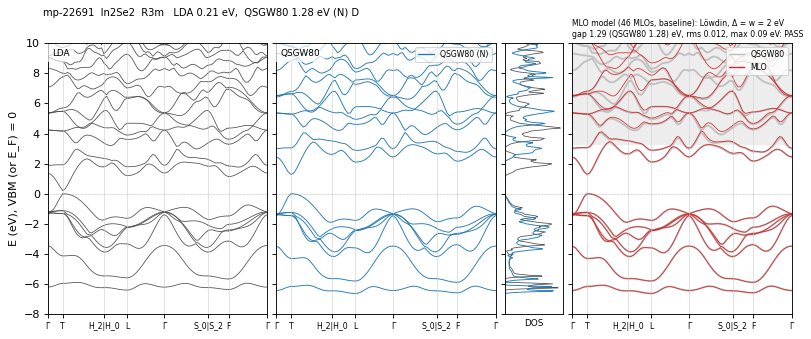

**mp-22660** InAgO2 — QSGW80 **1.97** N / R ≈ eV I  — ecalj b695fa65c (tf32, t_tetrakbt -300) — MLO PASS (b1) 31 gap 1.97 rms 0.001 max 0.01 (ecalj fb2da026b)

<small>runs: M 1.62 · R 1.98 (10-01) · N 1.97 (10-04)</small>

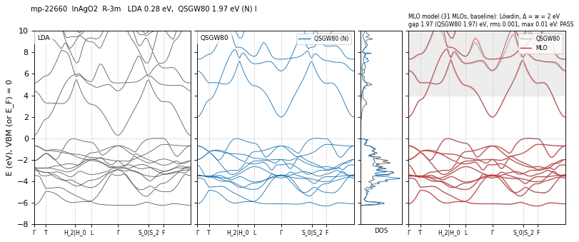

**mp-20162** InAgS2 — QSGW80 **0.81** N / M 0.73 eV D differs — ecalj b695fa65c (tf32, t_tetrakbt -300) — MLO PASS (b1) 41 gap 0.81 rms 0.001 max 0.00 (ecalj fb2da026b)

<small>runs: M 0.73 · N 0.81 (10-03)</small>

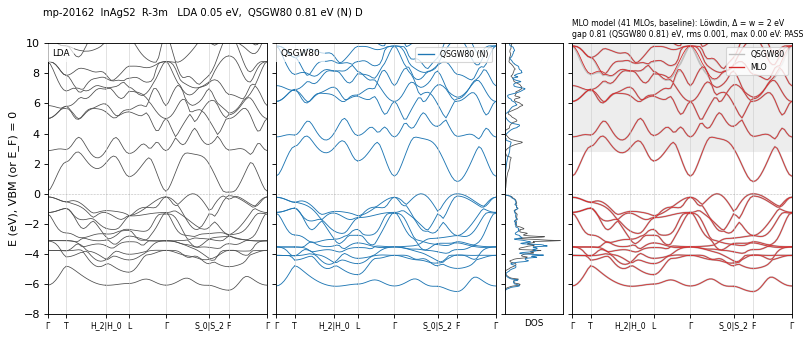

**mp-20930** InCuO2 — QSGW80 **1.96** N / R ≈ eV I  — ecalj b695fa65c (tf32, t_tetrakbt -300) — MLO PASS (b1) 31 gap 1.94 rms 0.002 max 0.04 (ecalj fb2da026b)

<small>runs: M 1.80 · R 1.96 (10-01) · N 1.96 (10-03)</small>

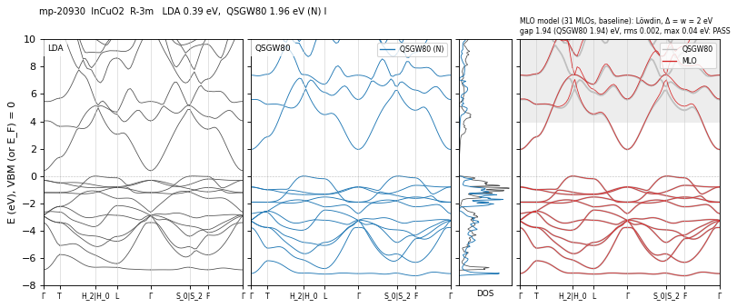

**mp-568516** K3Bi — QSGW80 **0.96** N / M ≈ eV D  — ecalj b695fa65c (tf32, t_tetrakbt -300) — MLO PASS (b2) 61 gap 0.96 rms 0.001 max 0.01 (ecalj 614ab5eb8)

<small>runs: M 0.95 · N 0.96 (10-03)</small>

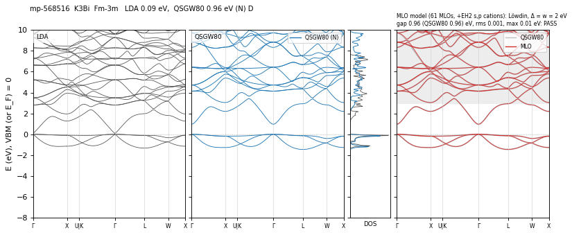

**mp-10159** K3Sb — QSGW80 **1.71** N / M ≈ eV D  — ecalj b695fa65c (tf32, t_tetrakbt -300) — MLO PASS (b2) 57 gap 1.71 rms 0.002 max 0.01 (ecalj a1d6c0e11)

<small>runs: M 1.72 · N 1.71 (10-03)</small>

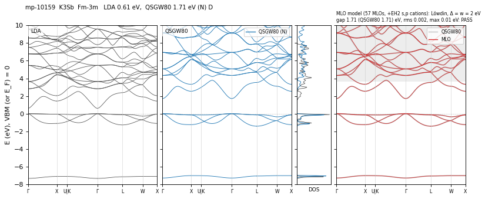

**mp-10102** KAgC2 — QSGW80 **4.63** N / M ≈ eV I  — ecalj b695fa65c (tf32, t_tetrakbt -300) — MLO PASS (b2) 41 gap 4.63 rms 0.002 max 0.03 (ecalj a1d6c0e11)

<small>runs: M 4.58 · N 4.63 (10-03)</small>

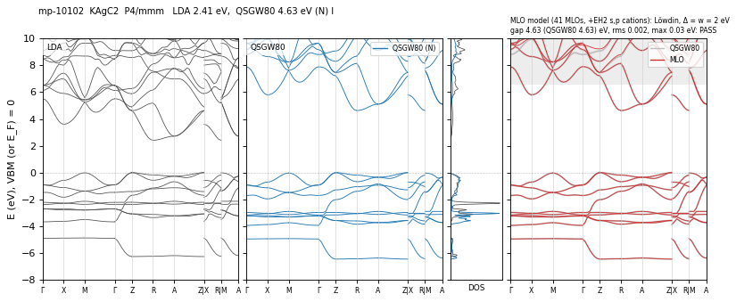

**mp-10423** KAuC2 — QSGW80 **3.93** N / M ≈ / R ≈ eV I  — ecalj 989a18637 (tf32, t_tetrakbt -300) — MLO PASS (b2) 41 gap 3.93 rms 0.002 max 0.02 (ecalj a1d6c0e11)

<small>runs: M 3.95 · R 3.93 (10-01) · N 3.93 (10-02)</small>

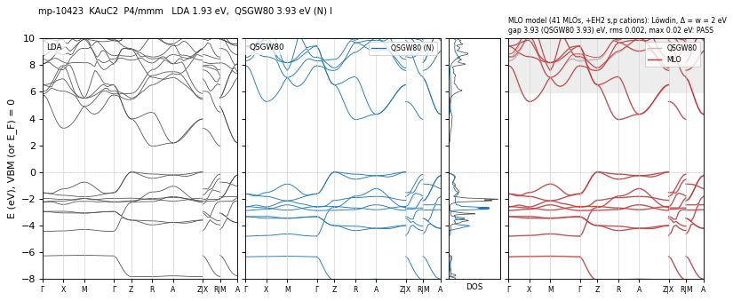

**mp-27418** KAuO2 — QSGW80 **3.41** N / M 3.46 eV I differs — ecalj b695fa65c (tf32, t_tetrakbt -300) — MLO PASS (b1) 29 gap 3.38 rms 0.001 max 0.03 (ecalj fb2da026b)

<small>runs: M 3.46 · N 3.41 (10-03)</small>

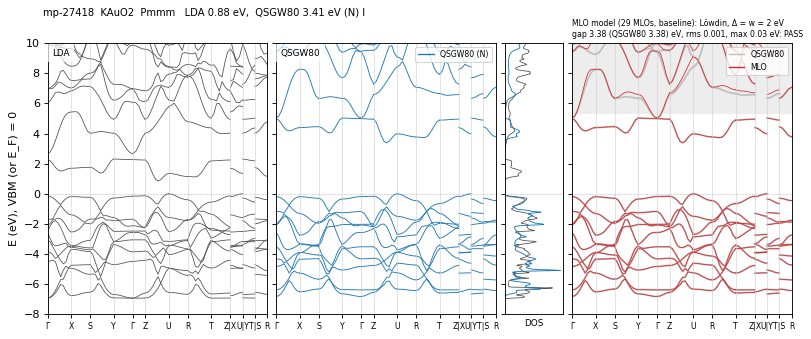

**mp-34857** KNO2 — QSGW80 **7.17** N / R ≈ eV D  — ecalj b695fa65c (tf32, t_tetrakbt -300) — MLO PASS (b2) 28 gap 7.24 rms 0.006 max 0.04 (ecalj 614ab5eb8)

<small>runs: M 8.63 · R 7.17 (10-01) · N 7.17 (10-04)</small>

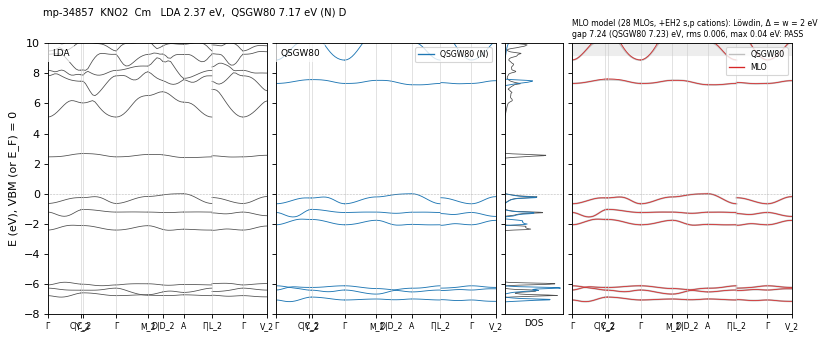

**mp-546787** KNO2 — QSGW80 **7.05** N / R ≈ eV I  — ecalj b695fa65c (tf32, t_tetrakbt -300) — MLO PASS (b2) 28 gap 7.08 rms 0.003 max 0.03 (ecalj 614ab5eb8)

<small>runs: M 6.69 · R 7.05 (10-01) · N 7.05 (10-04)</small>

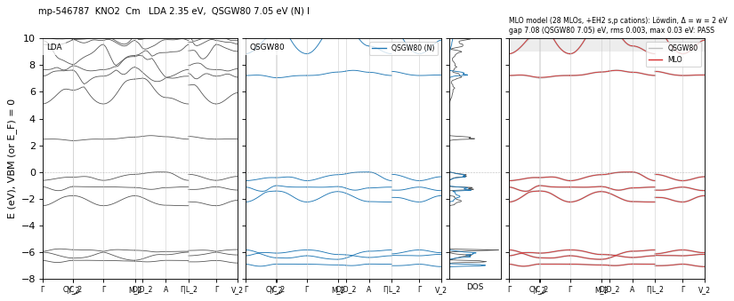

**mp-15724** KNa2Sb — QSGW80 **1.82** N / M ≈ eV D  — ecalj b695fa65c (tf32, t_tetrakbt -300) — MLO PASS (b1) 39 gap 1.82 rms 0.000 max 0.00 (ecalj 0c4d16ceb)

<small>runs: M 1.81 · N 1.82 (10-03)</small>

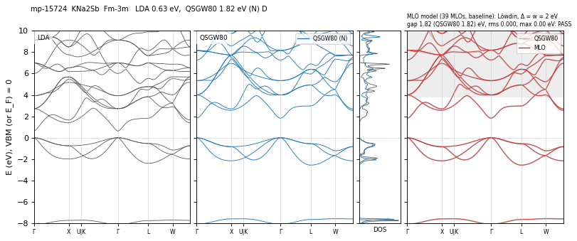

**mp-8188** KScO2 — QSGW80 **6.54** N / M 6.22 eV I CHECK — ecalj b695fa65c (tf32, t_tetrakbt -300) — MLO PASS (b1) 29 gap 6.54 rms 0.004 max 0.05 (ecalj 614ab5eb8)

<small>runs: M 6.22 · N 6.54 (10-03)</small>

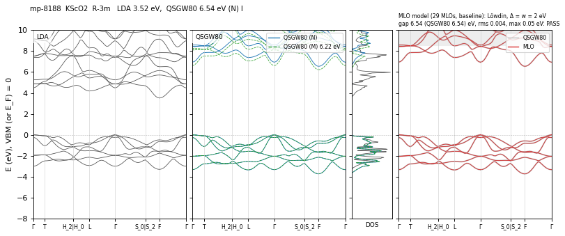

**mp-8175** KTlO2 — QSGW80 **2.23** N / R ≈ eV I  — ecalj b695fa65c (tf32, t_tetrakbt -300) — MLO PASS (b1) 34 gap 2.23 rms 0.001 max 0.01 (ecalj 614ab5eb8)

<small>runs: M 2.32 · R 2.23 (10-01) · N 2.23 (10-03)</small>

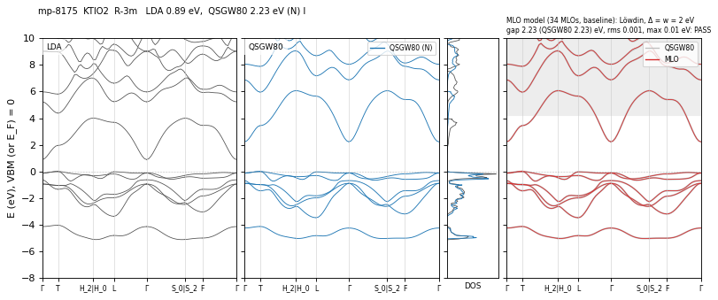

**mp-8409** KYO2 — QSGW80 **6.48** N / M 6.05 eV D CHECK — ecalj b695fa65c (tf32, t_tetrakbt -300) — MLO PASS (b1) 29 gap 6.48 rms 0.004 max 0.04 (ecalj 614ab5eb8)

<small>runs: M 6.05 · N 6.48 (10-03)</small>

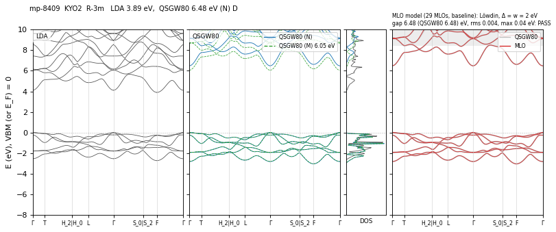

**mp-1006888** KYS2 — QSGW80 **4.02** N / M 3.42 / R ≈ eV I CHECK — ecalj 989a18637 (tf32, t_tetrakbt -300) — MLO PASS (b1) 39 gap 4.02 rms 0.004 max 0.04 (ecalj 7d5dfe714)

<small>runs: M 3.42 · R 4.02 (10-01) · N 4.02 (10-02)</small>

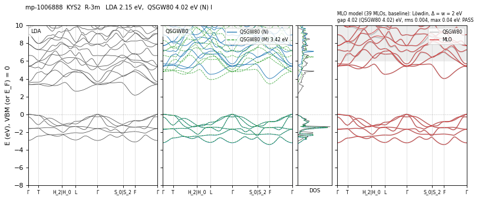

**mp-16763** KYTe2 — QSGW80 **2.44** N / R ≈ eV I  — ecalj b695fa65c (tf32, t_tetrakbt -300) — MLO PASS (b2) 43 gap 2.44 rms 0.002 max 0.01 (ecalj 0c4d16ceb)

<small>runs: M 2.48 · R 2.44 (09-30) · N 2.44 (10-04)</small>

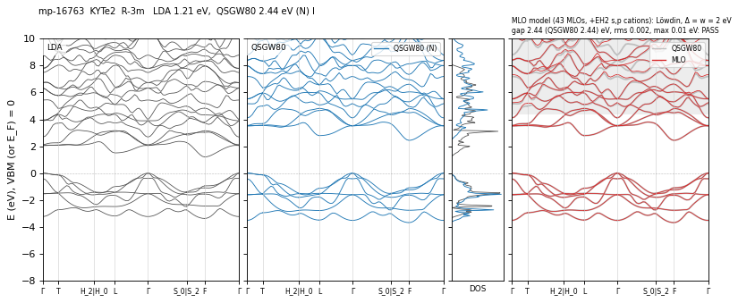

**mp-16238** Li2AgSb — QSGW80 **0.84** N / M ≈ eV D  — ecalj b695fa65c (tf32, t_tetrakbt -300) — MLO PASS (b1) 26 gap 0.84 rms 0.001 max 0.01 (ecalj 0c4d16ceb)

<small>runs: M 0.83 · N 0.84 (10-03)</small>

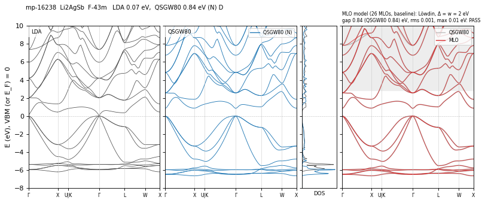

**mp-1378** Li2C2 — QSGW80 **5.81** N / M ≈ eV I  — ecalj b695fa65c (tf32, t_tetrakbt -300) — MLO PASS (b1) 16 gap 5.82 rms 0.006 max 0.07 (ecalj a1d6c0e11)

<small>runs: M 5.78 · N 5.81 (10-03)</small>

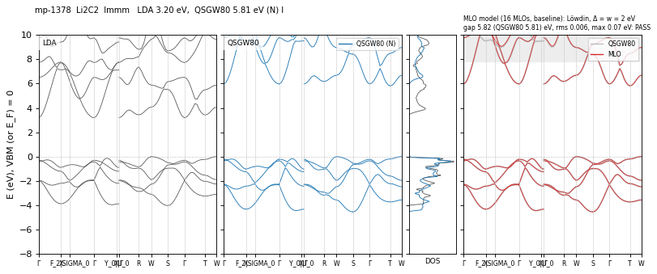

**mp-15988** Li2CuSb — QSGW80 **0.94** N / M ≈ eV I  — ecalj b695fa65c (tf32, t_tetrakbt -300) — MLO PASS (b1) 26 gap 0.94 rms 0.001 max 0.01 (ecalj 0c4d16ceb)

<small>runs: M 0.94 · N 0.94 (10-03)</small>

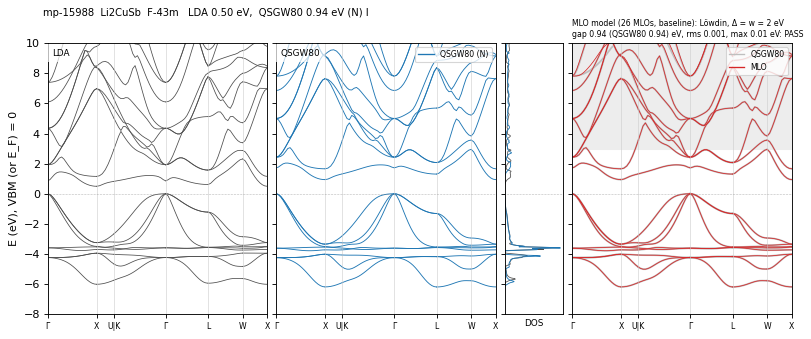

**mp-568273** Li2I2 — QSGW80 **6.32** N / M 6.23 eV I differs — ecalj b695fa65c (tf32, t_tetrakbt -300) — MLO PASS (b2) 34 gap 6.33 rms 0.003 max 0.02 (ecalj 614ab5eb8)

<small>runs: M 6.23 · N 6.32 (10-03)</small>

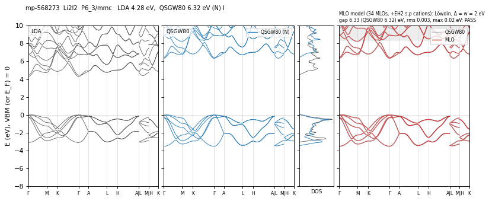

**mp-570935** Li2I2 — QSGW80 **6.57** E / E1 ≈ / M ≈ / N 6.62 eV D differs — ecalj 0601771b4 (tf32, t_tetrakbt -300) with ES, ES rule es-c — MLO PASS (b1, ES) 28 gap 6.57 rms 0.016 max 0.09 (ecalj a45169f3c)

<small>runs: M 6.61 · N 6.62 (10-03) · E1 6.56 (10-05, ES 2) · E 6.57 (10-06, ES 2, es-c)</small>

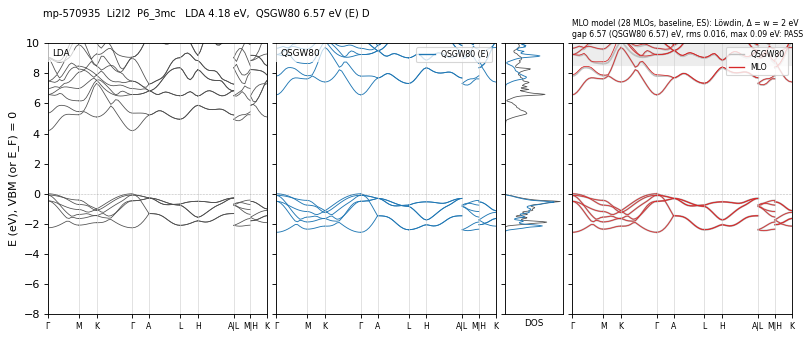

**mp-23222** Li3Bi — QSGW80 **1.06** N / M 1.00 eV I differs — ecalj b695fa65c (tf32, t_tetrakbt -300) — MLO PASS (b1) 21 gap 1.05 rms 0.001 max 0.00 (ecalj fb2da026b)

<small>runs: M 1.00 · N 1.06 (10-03)</small>

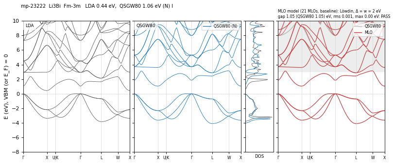

**mp-2251** Li3N — QSGW80 **2.45** N / M ≈ eV I  — ecalj b695fa65c (tf32, t_tetrakbt -300) — MLO PASS (b2) 28 gap 2.45 rms 0.012 max 0.07 (ecalj fb2da026b)

<small>runs: M 2.47 · N 2.45 (10-03)</small>

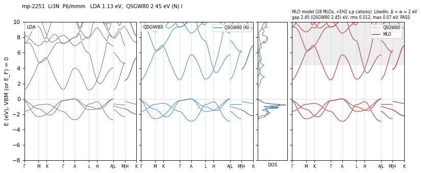

**mp-2074** Li3Sb — QSGW80 **1.48** N / M ≈ eV I  — ecalj b695fa65c (tf32, t_tetrakbt -300) — MLO PASS (b1) 21 gap 1.47 rms 0.001 max 0.00 (ecalj fb2da026b)

<small>runs: M 1.49 · N 1.48 (10-03)</small>

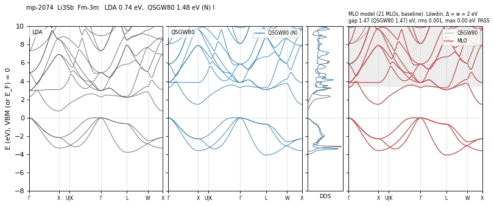

**mp-571454** LiAgC2 — QSGW80 **3.33** N / M ≈ eV I  — ecalj 989a18637 (tf32, t_tetrakbt -300) — MLO PASS (b1) 21 gap 3.28 rms 0.002 max 0.04 (ecalj fb2da026b)

<small>runs: M 3.29 · N 3.33 (10-03)</small>

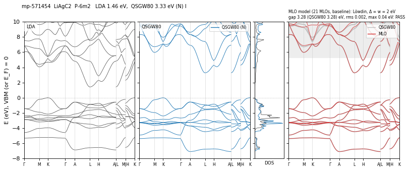

**mp-8001** LiAlO2 — QSGW80 **9.84** N / R ≈ eV I  — ecalj b695fa65c (tf32, t_tetrakbt -300) — MLO PASS (b1) 21 gap 9.80 rms 0.002 max 0.02 (ecalj 614ab5eb8)

<small>runs: M 8.37 · R 9.84 (10-01) · N 9.84 (10-03)</small>

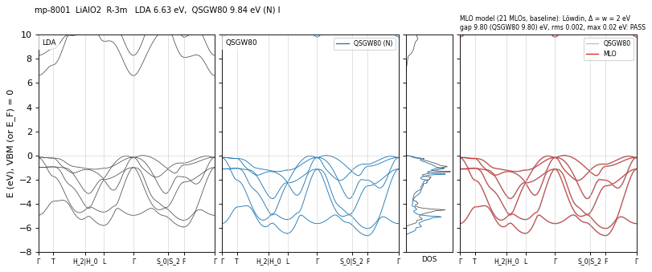

**mp-29868** LiAuC2 — QSGW80 **3.01** N / M ≈ eV I  — ecalj b695fa65c (tf32, t_tetrakbt -300) — MLO PASS (b1) 21 gap 3.02 rms 0.002 max 0.02 (ecalj fb2da026b)

<small>runs: M 3.00 · N 3.01 (10-03)</small>

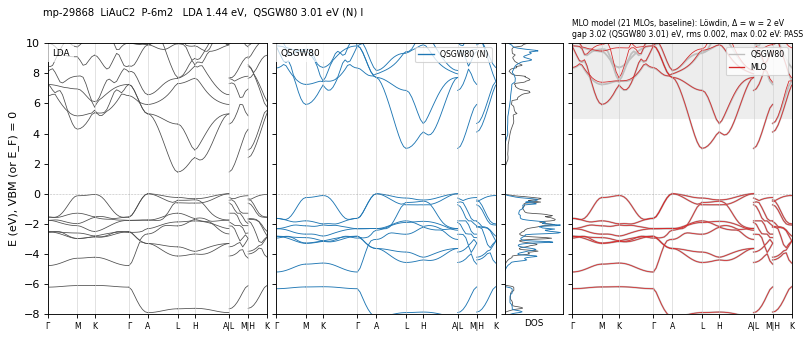

**mp-22526** LiCoO2 — QSGW80 **3.30** N / R 3.19 eV I differs — ecalj b695fa65c (tf32, t_tetrakbt -300) — MLO PASS (b1) 21 gap 3.33 rms 0.004 max 0.04 (ecalj fb2da026b)

*N 3.30 vs R 3.19 eV (NOTCONV in May): slow convergence within the 0.1 eV criterion*

<small>runs: M 2.88 · R 3.19 (10-01) · N 3.30 (10-03)</small>

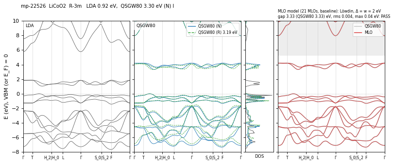

**mp-9158** LiCuO2 — QSGW80 **2.33** N / M ≈ eV I  — ecalj b695fa65c (tf32, t_tetrakbt -300) — MLO PASS (b1) 21 gap 2.25 rms 0.001 max 0.00 (ecalj 614ab5eb8)

<small>runs: M 2.32 · N 2.33 (10-03)</small>

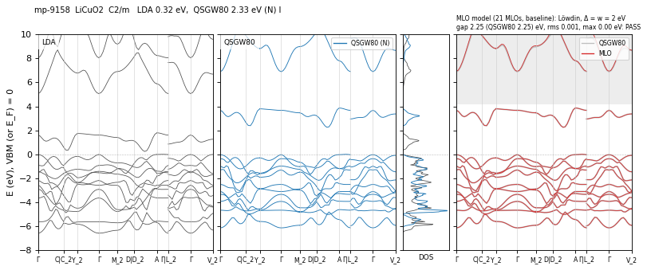

**mp-8002** LiGaO2 — QSGW80 **6.18** N / M 4.75 eV I CHECK — ecalj 989a18637 (tf32, t_tetrakbt -300) — MLO PASS (b1) 26 gap 6.16 rms 0.001 max 0.01 (ecalj fb2da026b)

*May value 4.75 eV wrong (N 6.18, 2025 6.55)*

<small>runs: M 4.75 · N 6.18 (10-02)</small>

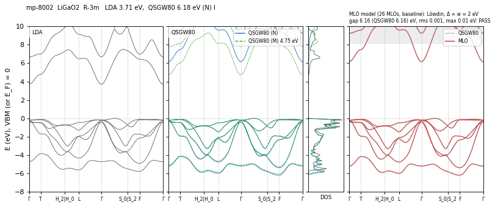

**mp-24199** LiHF2 — QSGW80 **13.03** N / M 11.96 eV I CHECK vs2025 — ecalj 989a18637 (tf32, t_tetrakbt -300) — MLO PASS (b2) 24 gap 13.03 rms 0.012 max 0.07 (ecalj fb2da026b)

<small>runs: M 11.96 · N 13.03 (10-03)</small>

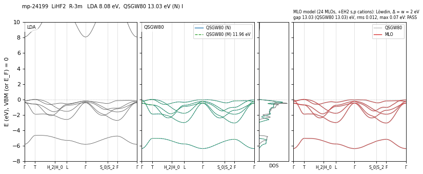

**mp-10618** LiInSe2 — QSGW80 **1.70** N / M ≈ eV I  — ecalj b695fa65c (tf32, t_tetrakbt -300) — MLO PASS (b1) 36 gap 1.73 rms 0.001 max 0.00 (ecalj a1d6c0e11)

<small>runs: M 1.70 · N 1.70 (10-03)</small>

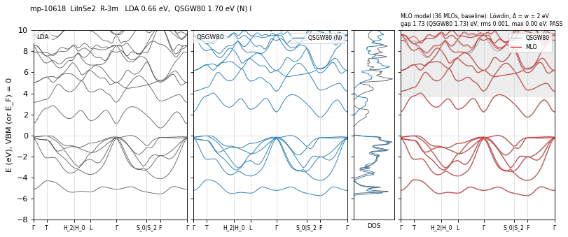

**mp-2659** LiN3 — QSGW80 **6.62** N / M 6.50 eV I differs vs2025 — ecalj 989a18637 (tf32, t_tetrakbt -300) — MLO PASS (b2all) 32 gap 6.62 rms 0.010 max 0.08 (ecalj fb2da026b)

<small>runs: M 6.50 · N 6.62 (10-03)</small>

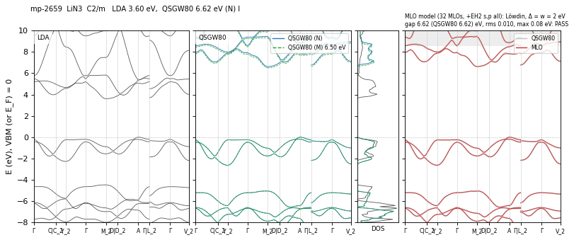

**mp-14115** LiRhO2 — QSGW80 **3.33** N / M 3.14 eV I differs — ecalj b695fa65c (tf32, t_tetrakbt -300) — MLO PASS (b1) 21 gap 3.52 rms 0.001 max 0.01 (ecalj 96ec5c1ee)

<small>runs: M 3.14 · N 3.33 (10-03)</small>

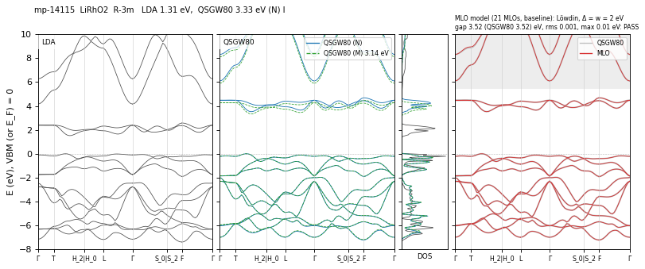

**mp-1001786** LiScS2 — QSGW80 **3.04** N / M 2.75 / R ≈ eV I CHECK — ecalj 989a18637 (tf32, t_tetrakbt -300) — MLO PASS (b1) 31 gap 3.04 rms 0.001 max 0.00 (ecalj 5baf562f0)

<small>runs: M 2.75 · R 3.04 (10-01) · N 3.04 (10-02)</small>

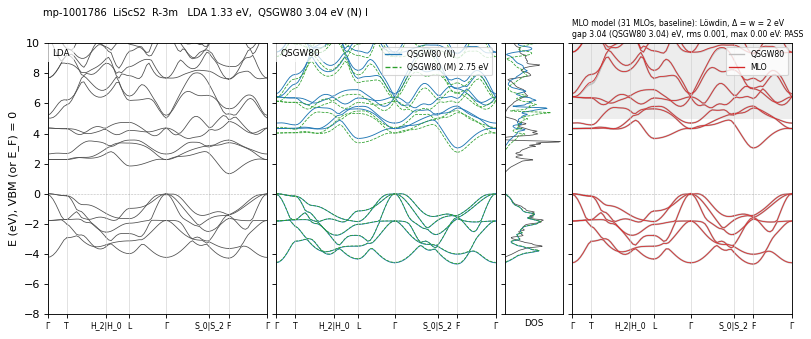

**mp-15788** LiYS2 — QSGW80 **3.29** N / M 2.99 eV I CHECK — ecalj b695fa65c (tf32, t_tetrakbt -300) — MLO PASS (b1) 31 gap 3.29 rms 0.001 max 0.01 (ecalj 0c4d16ceb)

<small>runs: M 2.99 · N 3.29 (10-03)</small>

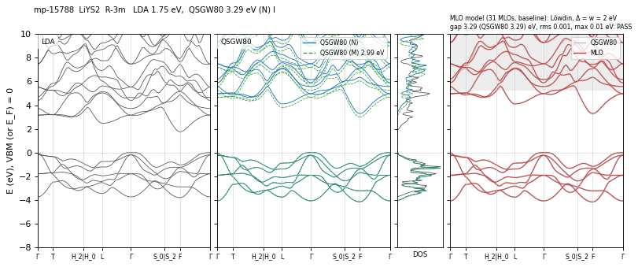

**mp-15794** LiYSe2 — QSGW80 **2.70** N / R ≈ eV I  — ecalj b695fa65c (tf32, t_tetrakbt -300) — MLO PASS (b1) 31 gap 2.70 rms 0.001 max 0.01 (ecalj 0c4d16ceb)

<small>runs: M 2.71 · R 2.70 (10-01) · N 2.70 (10-04)</small>

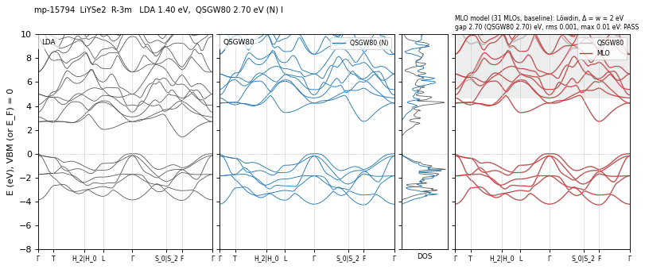

**mp-549706** Mg2O2 — QSGW80 **6.54** N / R ≈ eV D  — ecalj b695fa65c (tf32, t_tetrakbt -300) — MLO PASS (b1) 26 gap 6.59 rms 0.011 max 0.09 (ecalj 614ab5eb8)

<small>runs: M 6.58 · R 6.54 (10-01) · N 6.54 (10-03)</small>

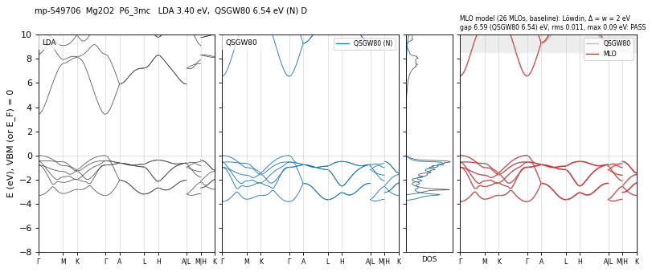

**mp-1018040** Mg2Se2 — QSGW80 **4.50** N / M ≈ eV D  — ecalj b695fa65c (tf32, t_tetrakbt -300) — MLO PASS (b2) 44 gap 4.50 rms 0.004 max 0.03 (ecalj a1d6c0e11)

<small>runs: M 4.47 · N 4.50 (10-03)</small>

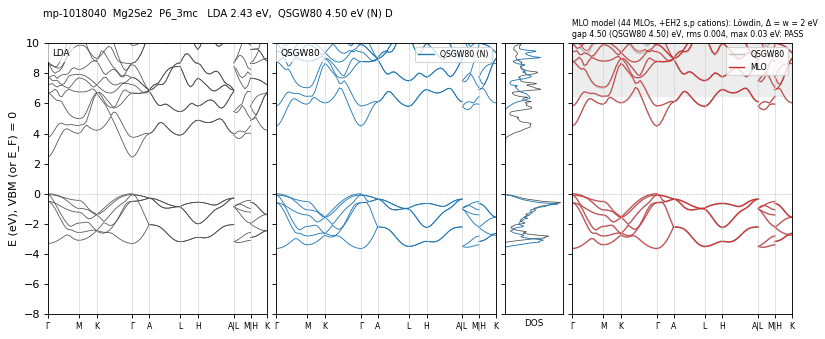

**mp-1039** Mg2Te2 — QSGW80 **3.88** E / E1 ≈ / M ≈ / N ≈ eV D  — ecalj 0601771b4 (tf32, t_tetrakbt -300) with ES, ES rule es-c — MLO PASS (b1, ES) 38 gap 3.88 rms 0.009 max 0.05 (ecalj f16f0ea3d)

<small>runs: M 3.92 · N 3.92 (10-03) · E1 3.87 (10-05, ES 2) · E 3.88 (10-06, ES 2, es-c)</small>

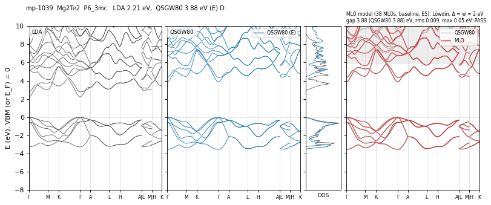

**mp-9166** MgCN2 — QSGW80 **6.28** N / R ≈ eV I  — ecalj b695fa65c (tf32, t_tetrakbt -300) — MLO PASS (b2) 29 gap 6.28 rms 0.003 max 0.03 (ecalj 614ab5eb8)

<small>runs: M 6.63 · R 6.28 (10-01) · N 6.28 (10-04)</small>

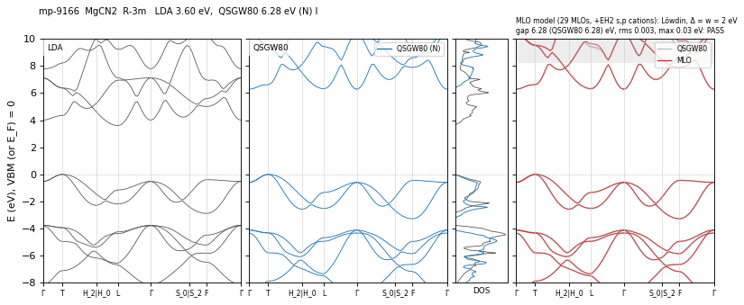

**mp-1017514** MgSiN2 — QSGW80 **6.06** N / R ≈ eV I  — ecalj b695fa65c (tf32, t_tetrakbt -300) — MLO PASS (b1) 26 gap 6.02 rms 0.003 max 0.01 (ecalj a1d6c0e11)

<small>runs: M 5.76 · R 6.07 (10-01) · N 6.06 (10-03)</small>

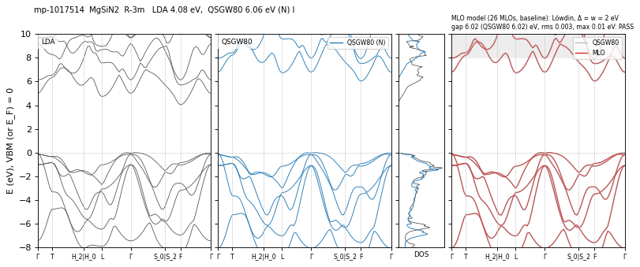

**mp-570747** N4 — QSGW80 **12.60** E / E1 12.71 / M 13.24 / N 13.25 eV I CHECK vs2025 — ecalj 0601771b4 (tf32, t_tetrakbt -300) with ES, ES rule es-c — MLO PASS (b2all, ES) 40 gap 12.59 rms 0.005 max 0.04 (ecalj a45169f3c)

<small>runs: M 13.24 · N 13.25 (10-03) · E1 12.71 (10-05, ES 2) · E 12.60 (10-06, ES 2, es-c)</small>

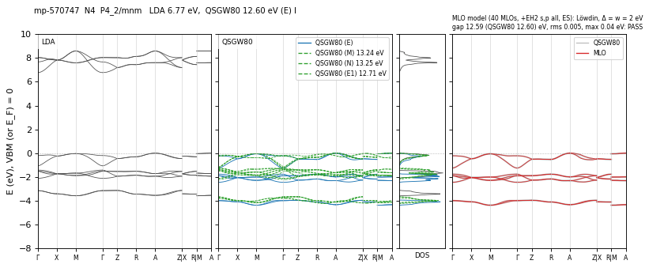

**mp-672233** N4 — QSGW80 **13.34** E / M 13.72 / N 13.50 eV I CHECK — ecalj 0601771b4 (tf32, t_tetrakbt -300) with ES, ES rule es-c — MLO PASS (b1, ES) 24 gap 13.31 rms 0.007 max 0.09 (ecalj a45169f3c)

<small>runs: M 13.72 · N 13.50 (10-03) · E1 13.11 MAXITER (10-05, ES 1) · E 13.34 (10-06, ES 2, es-c)</small>

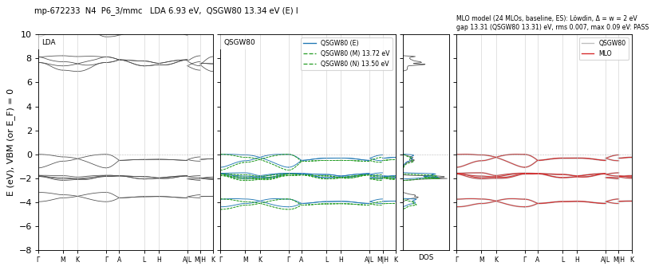

**mp-11180** Na2C2 — QSGW80 **6.18** N / M 6.24 eV I differs — ecalj b695fa65c (tf32, t_tetrakbt -300) — MLO PASS (b2) 42 gap 6.18 rms 0.005 max 0.03 (ecalj a1d6c0e11)

<small>runs: M 6.24 · N 6.18 (10-03)</small>

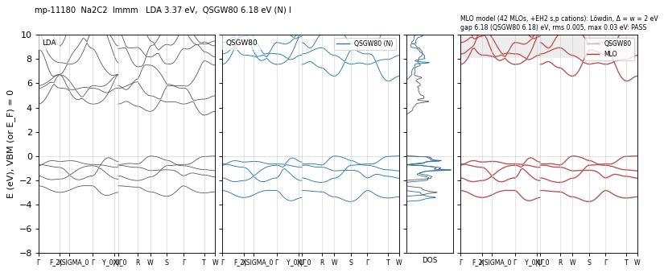

**mp-723629** Na2I2 — QSGW80 **5.41** N / M ≈ eV I  — ecalj b695fa65c (tf32, t_tetrakbt -300) — MLO PASS (b2) 44 gap 5.41 rms 0.001 max 0.01 (ecalj 614ab5eb8)

<small>runs: M 5.42 · N 5.41 (10-03)</small>

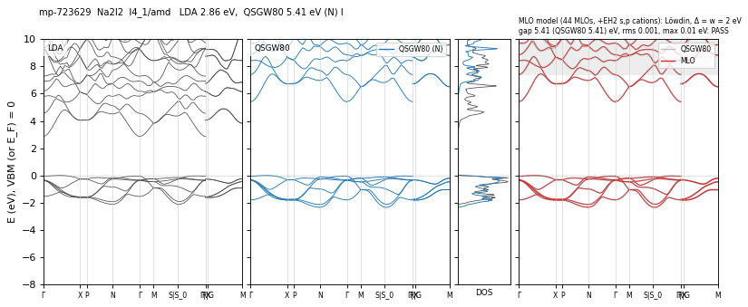

**mp-8860** Na3As — QSGW80 **1.21** N / M 1.15 eV D differs — ecalj b695fa65c (tf32, t_tetrakbt -300) — MLO PASS (b1) 36 gap 1.21 rms 0.000 max 0.00 (ecalj 614ab5eb8)

<small>runs: M 1.15 · N 1.21 (10-03)</small>

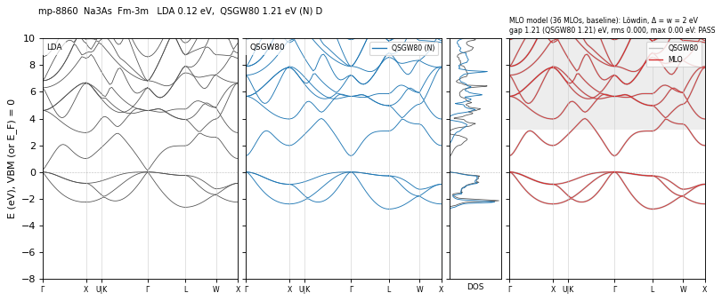

**mp-7748** NaAlO2 — QSGW80 **7.85** N / R ≈ eV D  — ecalj b695fa65c (tf32, t_tetrakbt -300) — MLO PASS (b1) 26 gap 7.85 rms 0.002 max 0.01 (ecalj 614ab5eb8)

<small>runs: M 7.28 · R 7.85 (10-01) · N 7.85 (10-03)</small>

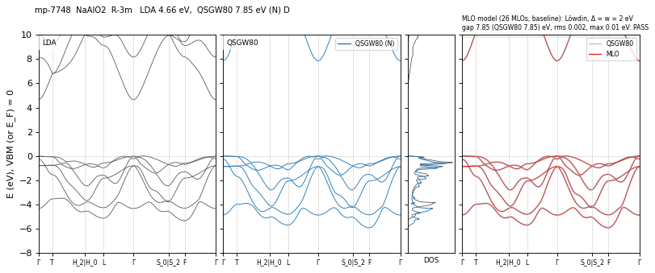

**mp-10422** NaAuC2 — QSGW80 **2.93** N / M ≈ eV I  — ecalj 989a18637 (tf32, t_tetrakbt -300) — MLO PASS (b1) 26 gap 2.96 rms 0.006 max 0.07 (ecalj a1d6c0e11)

<small>runs: M 2.97 · N 2.93 (10-02)</small>

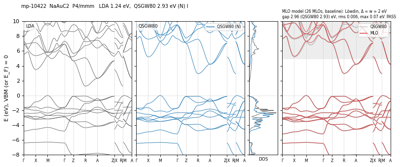

**mp-546500** NaCNO — QSGW80 **7.67** N / R ≈ eV I  — ecalj b695fa65c (tf32, t_tetrakbt -300) — MLO PASS (b2) 29 gap 7.67 rms 0.003 max 0.03 (ecalj 614ab5eb8)

<small>runs: M 8.36 · R 7.67 (10-01) · N 7.67 (10-03)</small>

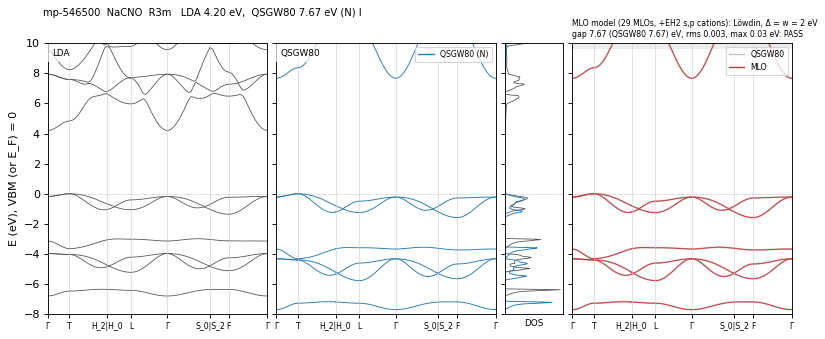

**mp-18921** NaCoO2 — QSGW80 **3.38** R eV I LDA≠PBE vs2025 N:MAXITER — ecalj 989a18637 (fp32, t_tetrakbt +300) — MLO PASS (b1) 26 gap 3.49 rms 0.003 max 0.01 (ecalj 0c4d16ceb)

<small>runs: M 2.46 · R 3.36 MAXITER (09-30) · R 3.38 (09-30) · N 3.29 MAXITER (10-04)</small>

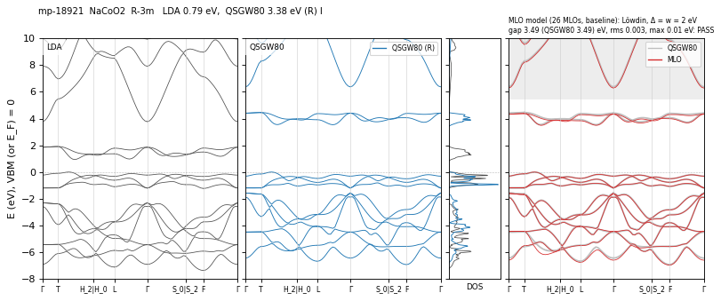

**mp-4541** NaCuO2 — QSGW80 **2.84** N / M 2.93 eV I differs — ecalj 989a18637 (tf32, t_tetrakbt -300) — MLO PASS (b1) 26 gap 2.83 rms 0.001 max 0.01 (ecalj fb2da026b)

<small>runs: M 2.93 · N 2.84 (10-03)</small>

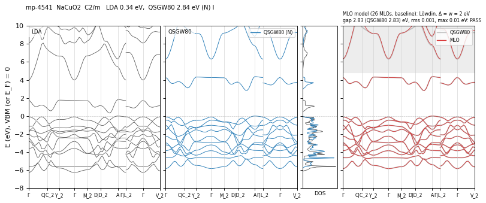

**mp-27837** NaHF2 — QSGW80 **12.06** N / R ≈ eV D  — ecalj b695fa65c (tf32, t_tetrakbt -300) — MLO PASS (b2) 32 gap 12.05 rms 0.004 max 0.02 (ecalj fb2da026b)

<small>runs: M 11.28 · R 12.06 (10-01) · N 12.06 (10-03)</small>

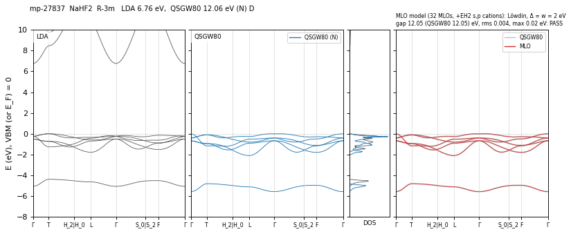

**mp-5175** NaInO2 — QSGW80 **4.11** N / R ≈ eV I  — ecalj b695fa65c (tf32, t_tetrakbt -300) — MLO PASS (b1) 31 gap 4.11 rms 0.001 max 0.00 (ecalj 614ab5eb8)

<small>runs: M 5.07 · R 4.11 (10-01) · N 4.11 (10-03)</small>

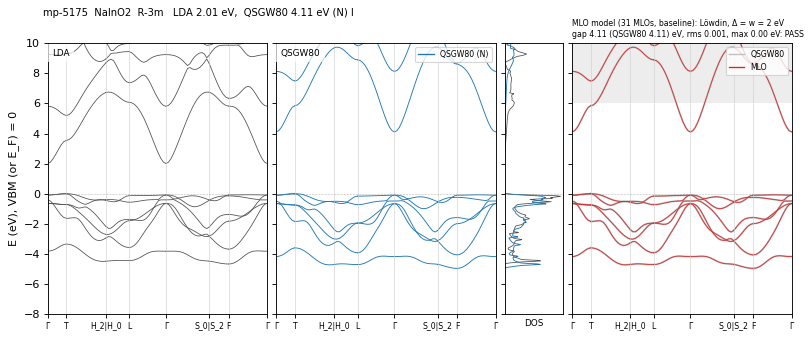

**mp-20289** NaInS2 — QSGW80 **3.11** N / M 3.03 eV I differs — ecalj 989a18637 (tf32, t_tetrakbt -300) — MLO PASS (b1) 41 gap 3.16 rms 0.001 max 0.00 (ecalj fb2da026b)

<small>runs: M 3.03 · N 3.11 (10-03)</small>

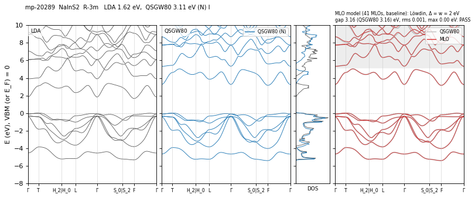

**mp-22473** NaInSe2 — QSGW80 **2.08** N / R ≈ eV I  — ecalj b695fa65c (tf32, t_tetrakbt -300) — MLO PASS (b1) 41 gap 2.14 rms 0.001 max 0.01 (ecalj fb2da026b)

<small>runs: M 2.21 · R 2.08 (10-01) · N 2.08 (10-04)</small>

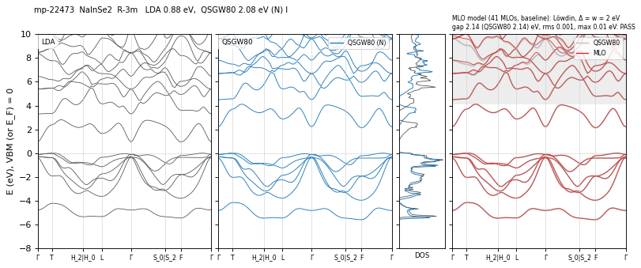

**mp-5077** NaLi2Sb — QSGW80 **1.54** N / M 1.42 eV I differs — ecalj b695fa65c (tf32, t_tetrakbt -300) — MLO PASS (b1) 26 gap 1.54 rms 0.001 max 0.00 (ecalj 614ab5eb8)

<small>runs: M 1.42 · N 1.54 (10-03)</small>

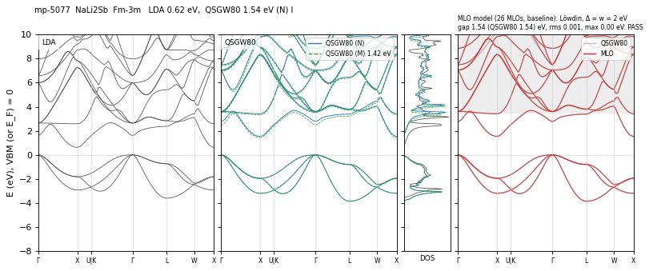

**mp-1066400** NaN3 — QSGW80 **6.87** E / M 6.71 / N 7.07 eV I differs — ecalj 0601771b4 (tf32, t_tetrakbt -300) with ES, ES rule es-c — MLO PASS (b2, ES) 26 gap 6.88 rms 0.002 max 0.01 (ecalj f09035a49)

<small>runs: M 6.71 · N 7.07 (10-03) · E1 FAIL(1) FAIL(1) (10-05, ES 2) · E FAIL(1) FAIL(1) (10-05, ES 2, es-a) · E 6.87 (10-07, ES 1, es-c)</small>

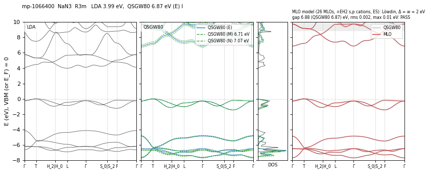

**mp-22003** NaN3 — QSGW80 **7.31** N / M 5.83 / R ≈ eV I CHECK — ecalj 989a18637 (tf32, t_tetrakbt -300) — MLO PASS (b2all) 37 gap 7.31 rms 0.006 max 0.05 (ecalj fb2da026b)

<small>runs: M 5.83 · R 7.31 (10-01) · N 7.31 (10-03)</small>

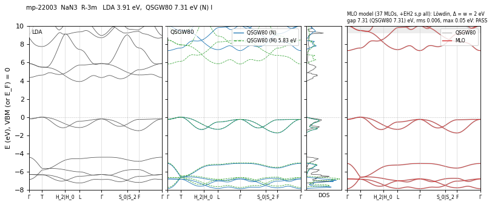

**mp-570538** NaN3 — QSGW80 **7.29** N / M 7.22 eV I differs — ecalj b695fa65c (tf32, t_tetrakbt -300) — MLO PASS (b2all) 37 gap 7.29 rms 0.007 max 0.05 (ecalj 614ab5eb8)

<small>runs: M 7.22 · N 7.29 (10-03)</small>

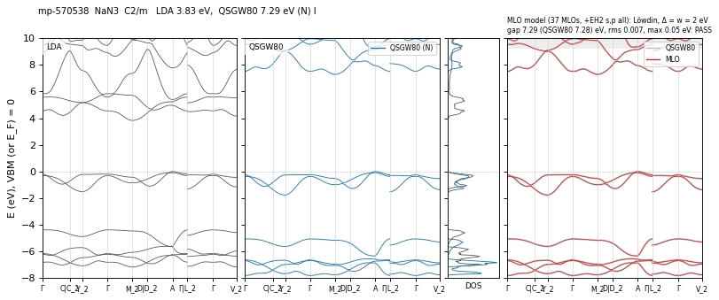

**mp-2964** NaNO2 — QSGW80 **6.93** N / M ≈ eV I  — ecalj b695fa65c (tf32, t_tetrakbt -300) — MLO PASS (b1) 21 gap 6.90 rms 0.002 max 0.01 (ecalj fb2da026b)

<small>runs: M 6.96 · N 6.93 (10-03)</small>

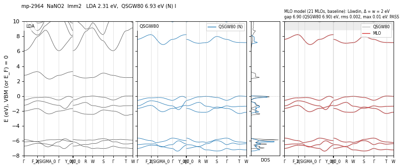

**mp-7017** NaNbN2 — QSGW80 **1.81** N / M 1.75 eV I differs — ecalj b695fa65c (tf32, t_tetrakbt -300) — MLO PASS (b1) 26 gap 1.81 rms 0.001 max 0.01 (ecalj 614ab5eb8)

<small>runs: M 1.75 · N 1.81 (10-03)</small>

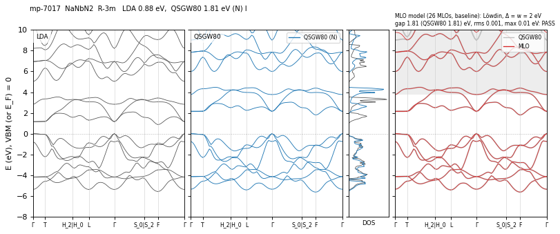

**mp-8830** NaRhO2 — QSGW80 **3.32** N / R ≈ eV I  — ecalj b695fa65c (tf32, t_tetrakbt -300) — MLO PASS (b1) 26 gap 3.52 rms 0.001 max 0.01 (ecalj 614ab5eb8)

<small>runs: M 0.13 · R 3.32 (10-01) · N 3.32 (10-04)</small>

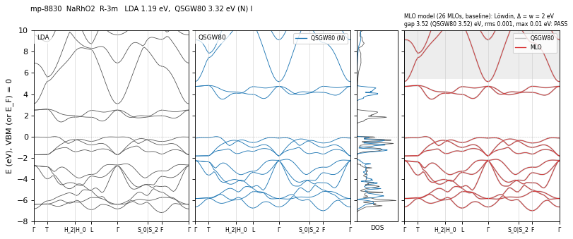

**mp-7914** NaScO2 — QSGW80 **7.09** N / M 6.53 eV I CHECK — ecalj 989a18637 (tf32, t_tetrakbt -300) — MLO PASS (b1) 26 gap 7.09 rms 0.001 max 0.01 (ecalj fb2da026b)

<small>runs: M 6.53 · N 7.09 (10-03)</small>

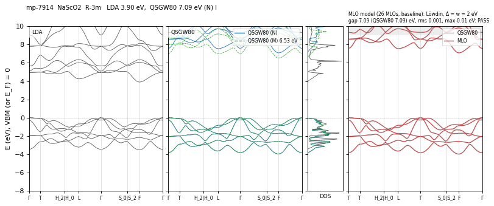

**mp-999460** NaScS2 — QSGW80 **3.41** N / R ≈ eV I  — ecalj b695fa65c (tf32, t_tetrakbt -300) — MLO PASS (b1) 36 gap 3.41 rms 0.001 max 0.00 (ecalj 614ab5eb8)

<small>runs: M 2.89 · R 3.41 (10-01) · N 3.41 (10-04)</small>

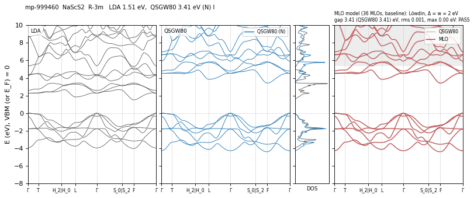

**mp-5475** NaTaN2 — QSGW80 **2.46** N / M 2.30 eV I differs — ecalj b695fa65c (tf32, t_tetrakbt -300) — MLO PASS (b1) 26 gap 2.46 rms 0.002 max 0.01 (ecalj 614ab5eb8)

<small>runs: M 2.30 · N 2.46 (10-03)</small>

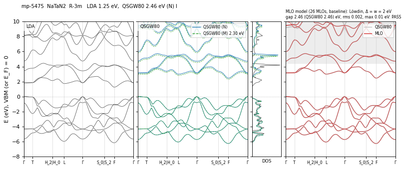

**mp-3056** NaTlO2 — QSGW80 **1.98** N / M 1.47 / R ≈ eV I CHECK — ecalj 989a18637 (tf32, t_tetrakbt -300) — MLO PASS (b1) 31 gap 1.98 rms 0.001 max 0.00 (ecalj fb2da026b)

<small>runs: M 1.47 · R 1.98 (10-01) · N 1.98 (10-03)</small>

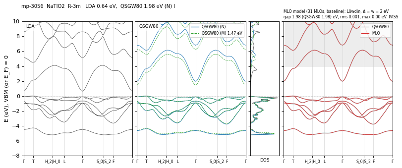

**mp-10226** NaYS2 — QSGW80 **3.87** N / R ≈ eV I  — ecalj b695fa65c (tf32, t_tetrakbt -300) — MLO PASS (b1) 36 gap 3.87 rms 0.001 max 0.01 (ecalj a1d6c0e11)

<small>runs: M FAILED · R 3.87 (09-30) · N 3.87 (10-04)</small>

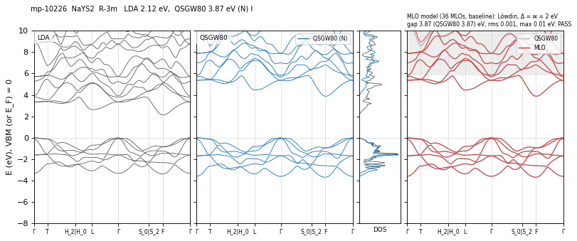

**mp-999448** NaYSe2 — QSGW80 **3.21** N / M 3.11 eV I differs — ecalj 989a18637 (tf32, t_tetrakbt -300) — MLO PASS (b1) 36 gap 3.21 rms 0.001 max 0.01 (ecalj fb2da026b)

<small>runs: M 3.11 · N 3.21 (10-03)</small>

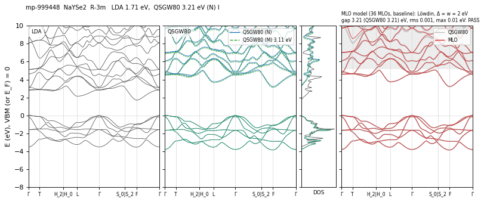

**mp-9339** Nb2P2 — QSGW80 **0.00** N / R ≈ eV metal  — ecalj 989a18637 (tf32, t_tetrakbt -300) — MLO PASS (b1) 36 rms 0.001 max 0.01 (ecalj fb2da026b)

<small>runs: M UNKNOWN · R CONVERGED_METAL (09-30) · N CONVERGED_METAL (10-03)</small>

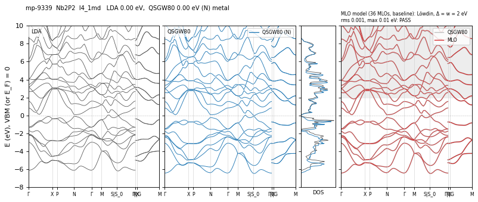

**mp-157** P4 — QSGW80 **0.72** N / M ≈ eV D  — ecalj b695fa65c (tf32, t_tetrakbt -300) — MLO PASS (b1) 36 gap 0.74 rms 0.004 max 0.03 (ecalj 0c4d16ceb)

<small>runs: M 0.75 · N 0.72 (10-03)</small>

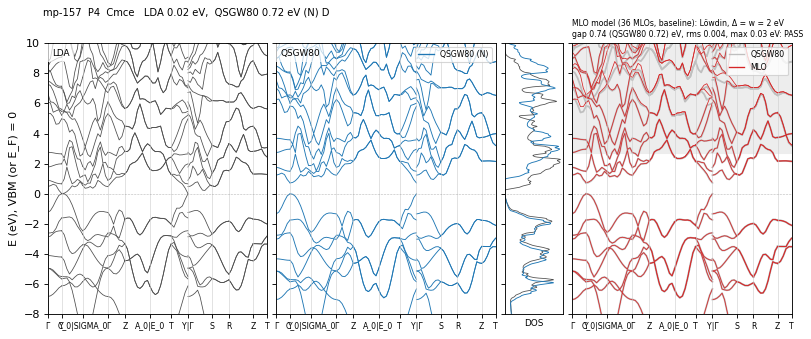

**mp-19921** Pb2O2 — QSGW80 **2.38** N / M ≈ eV I  — ecalj b695fa65c (tf32, t_tetrakbt -300) — MLO PASS (b2) 44 gap 2.38 rms 0.002 max 0.02 (ecalj fb2da026b)

<small>runs: M 2.41 · N 2.38 (10-03)</small>

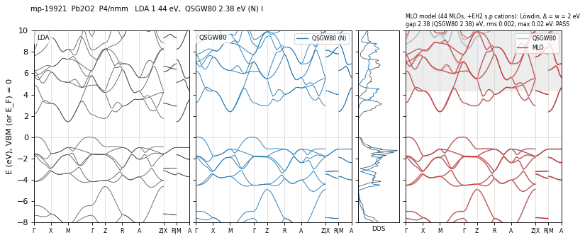

**mp-1018115** Pb2S2 — QSGW80 **1.62** N / M ≈ eV I  — ecalj b695fa65c (tf32, t_tetrakbt -300) — MLO PASS (b1) 36 gap 1.61 rms 0.000 max 0.00 (ecalj a1d6c0e11)

<small>runs: M 1.62 · N 1.62 (10-03)</small>

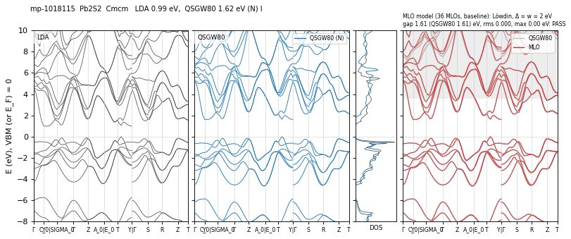

**mp-20526** Pb2S2 — QSGW80 **3.22** E / E1 ≈ / M ≈ / N ≈ eV D  — ecalj 0601771b4 (tf32, t_tetrakbt -300) with ES, ES rule es-c — MLO PASS (b2, ES) 46 gap 3.14 rms 0.007 max 0.04 (ecalj f16f0ea3d)

<small>runs: M 3.24 · N 3.24 (10-04) · E1 3.19 (10-05, ES 1) · E 3.22 (10-06, ES 2, es-c)</small>

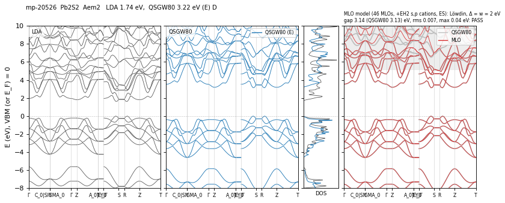

**mp-561320** Pb2S2 — QSGW80 **4.15** E / M ≈ eV I N:TIMEOUT — ecalj 0601771b4 (tf32, t_tetrakbt -300) with ES, ES rule es-d — MLO PASS (b1, ES) 72 gap 4.06 rms 0.001 max 0.01 (ecalj 1a716c894)

*from 2026-10-08 05:12 (rule es-d, the new rule for slabs): ES layers filling the vacuum (9 ES, s,p), QSGW80 4.149 eV, MLO b1 PASS 0.006 eV. The tests on the way (QSGW80, MLO b1): ES 5 s only 4.152 eV FAIL 0.38; ES 5 with p 4.151 eV FAIL 0.33; ES 9 s only 4.150 eV PASS 0.033*

<small>runs: M 4.12 · N 4.13 TIMEOUT (10-04) · E1 4.00 TIMEOUT (10-05, ES 1) · E 4.16 (10-06, ES 1, es-c) · E 4.15 (10-07, ES 4, es-c) · E 4.14 TIMEOUT (10-07, ES 5, es-c) · E 4.15 (10-07, ES 5, es-c) · E 4.15 (10-08, ES 9, es-d)</small>

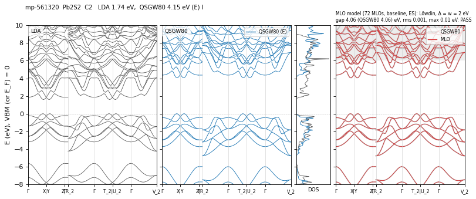

**mp-726184** Pb2S2 — QSGW80 **3.73** E / M ≈ eV D N:TIMEOUT — ecalj 0601771b4 (tf32, t_tetrakbt -300) with ES, ES rule es-c — MLO PASS (b1, ES) 41 gap 3.63 rms 0.004 max 0.04 (ecalj 99b1f6351)

*from 2026-10-07 15:14: ES outside both surfaces (4, 2.6 a.u.) plus one ES2 at the vacuum centre (2.9 a.u.); MLO PASS 0.036 eV (surface ES only: 0.22 eV)*

<small>runs: M 3.74 · N 3.71 TIMEOUT (10-04) · E 3.74 (10-06, ES 2, es-c) · E 3.73 (10-07, ES 4, es-c) · E FAIL(1) FAIL(1) (10-07, ES 8, es-c) · E 3.73 (10-07, ES 5, es-c)</small>

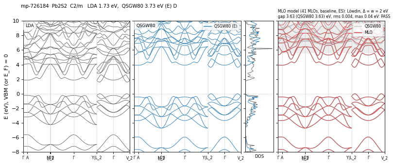

**mp-727323** Pb2S2 — QSGW80 **3.19** E / M ≈ / N ≈ eV I  — ecalj 0601771b4 (tf32, t_tetrakbt -300) with ES, ES rule es-c — MLO PASS (b2, ES) 46 gap 3.11 rms 0.008 max 0.05 (ecalj a45169f3c)

<small>runs: M 3.23 · N 3.22 (10-04) · E 3.19 (10-06, ES 2, es-c)</small>

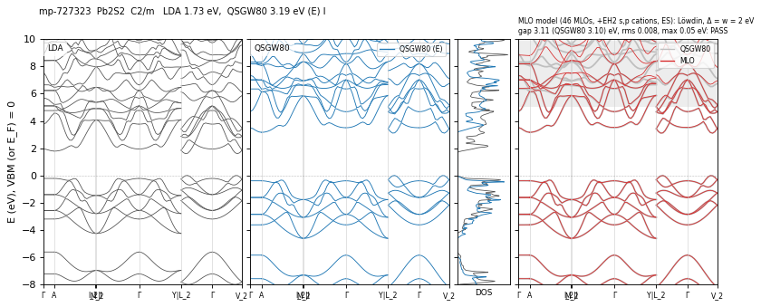

**mp-1063670** Pb2Se2 — QSGW80 **1.35** N / M ≈ eV I  — ecalj 989a18637 (tf32, t_tetrakbt -300) — MLO PASS (b1) 36 gap 1.31 rms 0.001 max 0.01 (ecalj a1d6c0e11)

<small>runs: M 1.36 · N 1.35 (10-02)</small>

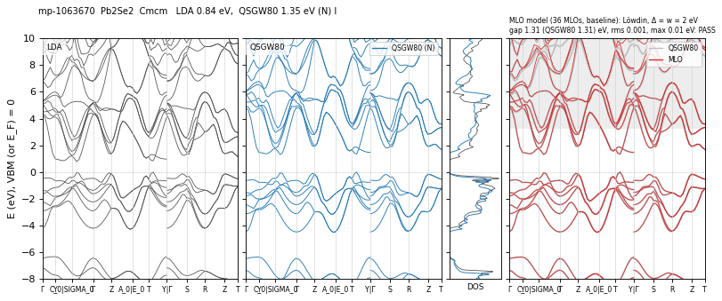

**mp-22009** Pb2Se2 — QSGW80 **2.83** E / M 2.93 / N ≈ · path 2.61 eV D differs path<mesh(mesh) — ecalj 0601771b4 (tf32, t_tetrakbt -300) with ES, ES rule es-c — MLO PASS (b2, ES) 46 gap 2.62 rms 0.007 max 0.04 (ecalj f16f0ea3d)

<small>runs: M 2.93 · N 2.84 (10-04) · E1 2.76 MAXITER (10-05, ES 1) · E 2.83 (10-06, ES 2, es-c)</small>

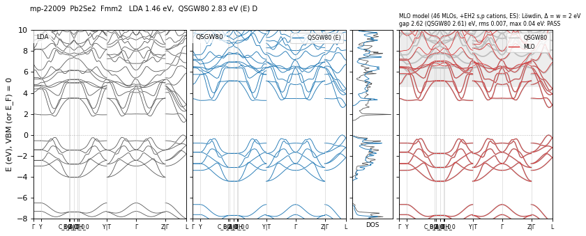

**mp-288** Pt2S2 — QSGW80 **1.20** N / M ≈ eV D  — ecalj b695fa65c (tf32, t_tetrakbt -300) — MLO PASS (b1) 36 gap 1.20 rms 0.001 max 0.02 (ecalj fb2da026b)

<small>runs: M 1.20 · N 1.20 (10-03)</small>

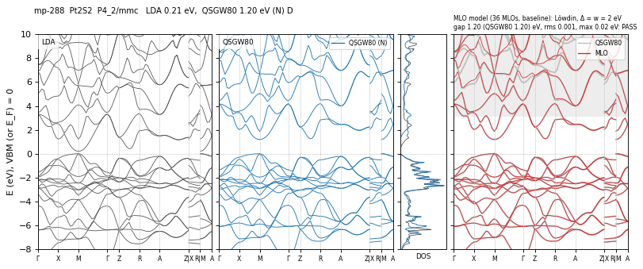

**mp-7895** Rb2O2 — QSGW80 **4.57** N / M ≈ eV I  — ecalj b695fa65c (tf32, t_tetrakbt -300) — MLO PASS (b2) 40 gap 4.58 rms 0.002 max 0.01 (ecalj 614ab5eb8)

<small>runs: M 4.53 · N 4.57 (10-03)</small>

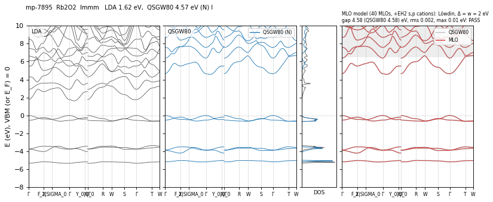

**mp-558071** Rb2S2 — QSGW80 **4.02** E / E1 3.92 / M ≈ / N ≈ eV I differs — ecalj 0601771b4 (tf32, t_tetrakbt -300) with ES, ES rule es-c — MLO PASS (b1, ES) 46 gap 4.00 rms 0.003 max 0.03 (ecalj a45169f3c)

<small>runs: M 4.06 · N 4.07 (10-03) · E1 3.92 (10-05, ES 1) · E 4.02 (10-06, ES 1, es-c)</small>

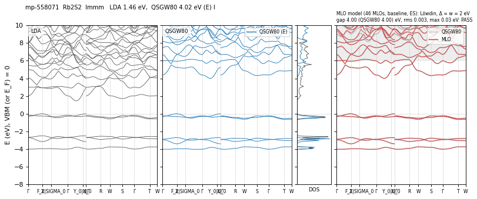

**mp-10421** RbAuC2 — QSGW80 **4.21** N / M 4.08 eV I differs — ecalj b695fa65c (tf32, t_tetrakbt -300) — MLO PASS (b2) 41 gap 4.21 rms 0.003 max 0.03 (ecalj a1d6c0e11)

<small>runs: M 4.08 · N 4.21 (10-03)</small>

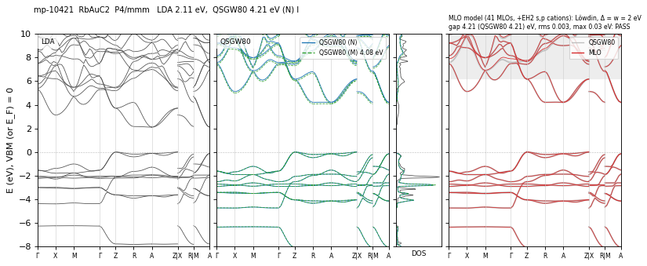

**mp-30041** RbBiS2 — QSGW80 **2.21** N / R ≈ eV I  — ecalj b695fa65c (tf32, t_tetrakbt -300) — MLO PASS (b1) 39 gap 2.21 rms 0.005 max 0.04 (ecalj fb2da026b)

<small>runs: M 3.29 · R 2.21 (10-01) · N 2.21 (10-04)</small>

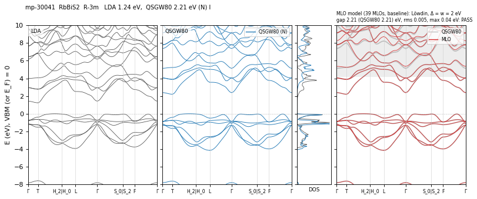

**mp-5841** RbCuC2 — QSGW80 **3.94** N / M 3.88 eV I differs — ecalj b695fa65c (tf32, t_tetrakbt -300) — MLO PASS (b2) 41 gap 3.95 rms 0.004 max 0.04 (ecalj 614ab5eb8)

<small>runs: M 3.88 · N 3.94 (10-03)</small>

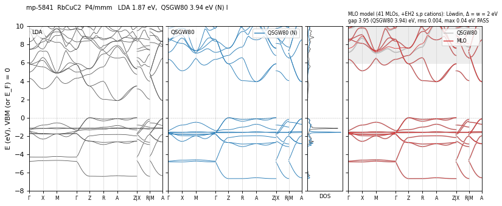

**mp-581833** RbN3 — QSGW80 **6.42** N / R ≈ eV I  — ecalj b695fa65c (tf32, t_tetrakbt -300) — MLO PASS (b2d) 45 gap 6.42 rms 0.004 max 0.04 (ecalj 7d5dfe714)

<small>runs: M FAILED · R 6.42 (09-30) · N 6.42 (10-03)</small>

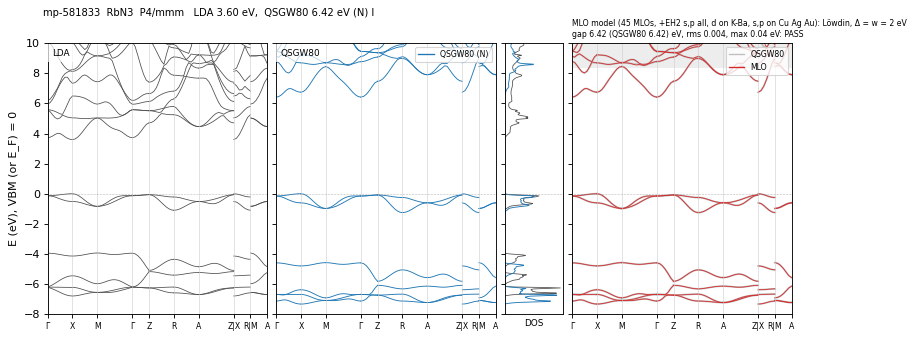

**mp-8145** RbScO2 — QSGW80 **5.81** N / M 5.41 eV I CHECK — ecalj b695fa65c (tf32, t_tetrakbt -300) — MLO PASS (b1) 29 gap 5.83 rms 0.007 max 0.07 (ecalj 614ab5eb8)

<small>runs: M 5.41 · N 5.81 (10-03)</small>

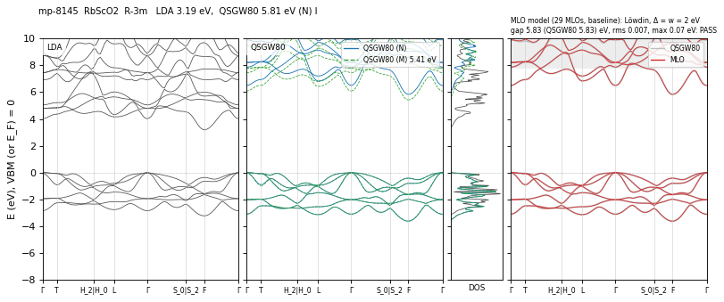

**mp-8176** RbTlO2 — QSGW80 **2.17** N / M 1.80 eV I CHECK — ecalj b695fa65c (tf32, t_tetrakbt -300) — MLO PASS (b1) 34 gap 2.17 rms 0.002 max 0.01 (ecalj 614ab5eb8)

<small>runs: M 1.80 · N 2.17 (10-03)</small>

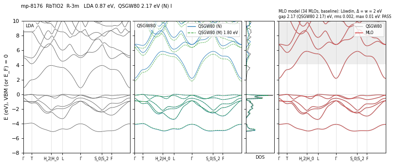

**mp-14437** RbYO2 — QSGW80 **5.95** N / R ≈ eV I  — ecalj b695fa65c (tf32, t_tetrakbt -300) — MLO PASS (b1) 29 gap 5.96 rms 0.007 max 0.07 (ecalj 96ec5c1ee)

<small>runs: M 5.93 · R 5.95 (09-30) · N 5.95 (10-03)</small>

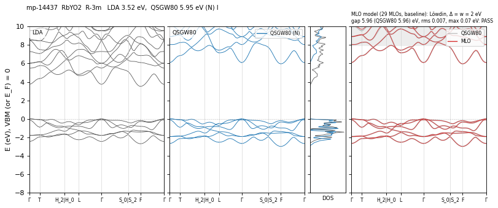

**mp-999265** RbYS2 — QSGW80 **3.93** N / M 3.57 eV I CHECK — ecalj 989a18637 (tf32, t_tetrakbt -300) — MLO PASS (b1) 39 gap 3.93 rms 0.006 max 0.07 (ecalj fb2da026b)

<small>runs: M 3.57 · N 3.93 (10-03)</small>

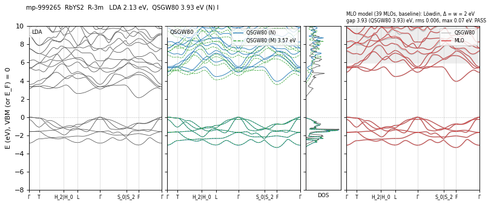

**mp-973185** ScAgO2 — QSGW80 **4.04** N / M 3.52 eV I CHECK — ecalj 989a18637 (tf32, t_tetrakbt -300) — MLO PASS (b1) 26 gap 4.05 rms 0.008 max 0.10 (ecalj fb2da026b)

<small>runs: M 3.52 · N 4.04 (10-03)</small>

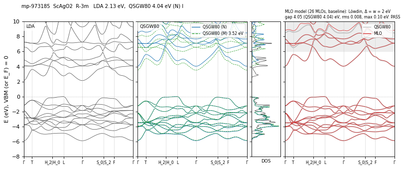

**mp-12908** ScAgSe2 — QSGW80 **1.72** N / M ≈ eV I  — ecalj b695fa65c (tf32, t_tetrakbt -300) — MLO PASS (b1) 36 gap 1.72 rms 0.001 max 0.01 (ecalj a1d6c0e11)

<small>runs: M 1.71 · N 1.72 (10-03)</small>

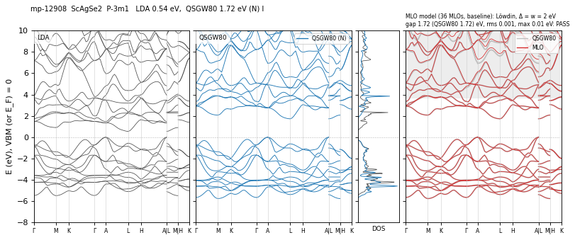

**mp-4636** ScCuO2 — QSGW80 **4.01** N / M 4.12 / R ≈ eV I differs — ecalj 989a18637 (tf32, t_tetrakbt -300) — MLO PASS (b2all) 34 gap 4.00 rms 0.006 max 0.07 (ecalj fb2da026b)

<small>runs: M 4.12 · R 4.02 (10-01) · N 4.01 (10-03)</small>

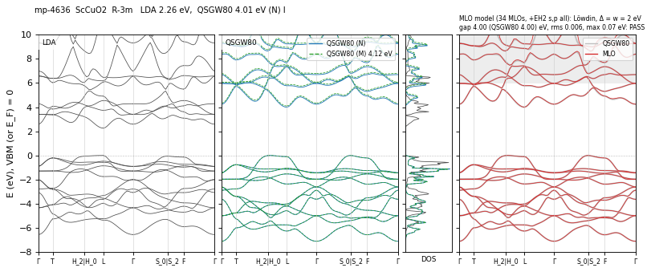

**mp-6980** ScCuS2 — QSGW80 **1.97** N / M ≈ eV I  — ecalj b695fa65c (tf32, t_tetrakbt -300) — MLO PASS (b1) 36 gap 1.97 rms 0.003 max 0.05 (ecalj 614ab5eb8)

<small>runs: M 1.97 · N 1.97 (10-03)</small>

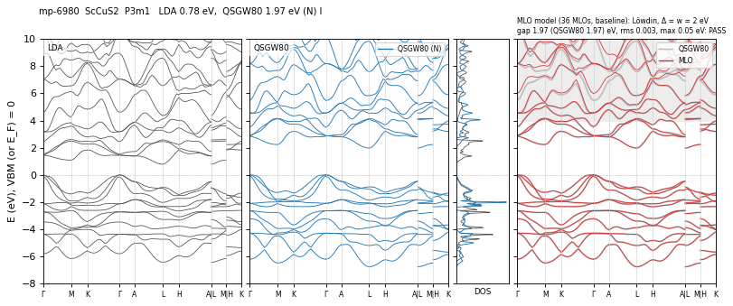

**mp-10694** ScF3 — QSGW80 **11.95** E / E1 ≈ / M 11.65 / N ≈ eV I CHECK — ecalj 0601771b4 (tf32, t_tetrakbt -300) with ES, ES rule es-c — MLO PASS (b1, ES) 25 gap 11.95 rms 0.002 max 0.02 (ecalj f16f0ea3d)

<small>runs: M 11.65 · N 11.94 (10-02) · E1 11.96 (10-05, ES 1) · E 11.95 (10-06, ES 1, es-c)</small>

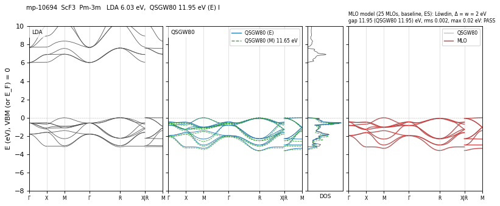

**mp-559092** ScF3 — QSGW80 **11.86** E / E1 ≈ / N ≈ / R ≈ eV I  — ecalj 0601771b4 (tf32, t_tetrakbt -300) with ES, ES rule es-c — MLO PASS (b1, ES) 25 gap 11.86 rms 0.002 max 0.03 (ecalj a45169f3c)

<small>runs: M 13.91 · R 11.88 (10-01) · N 11.88 (10-04) · E1 11.86 (10-05, ES 1) · E 11.86 (10-06, ES 1, es-c)</small>

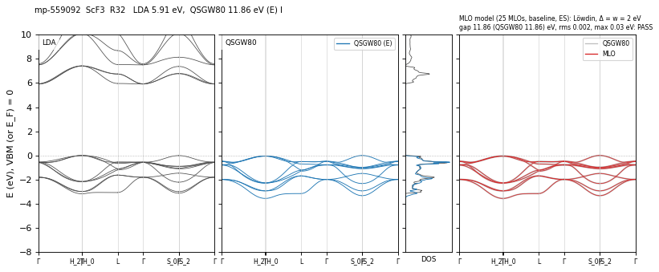

**mp-13313** ScTlSe2 — QSGW80 **1.21** N / M ≈ eV I  — ecalj b695fa65c (tf32, t_tetrakbt -300) — MLO PASS (b1) 41 gap 1.21 rms 0.001 max 0.01 (ecalj a1d6c0e11)

<small>runs: M 1.17 · N 1.21 (10-03)</small>

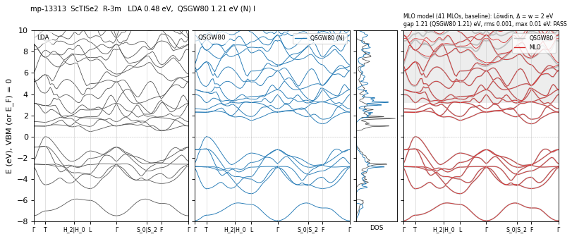

**mp-13314** ScTlTe2 — QSGW80 **0.67** N / M ≈ eV I  — ecalj b695fa65c (tf32, t_tetrakbt -300) — MLO PASS (b1) 41 gap 0.68 rms 0.001 max 0.01 (ecalj a1d6c0e11)

<small>runs: M 0.68 · N 0.67 (10-03)</small>

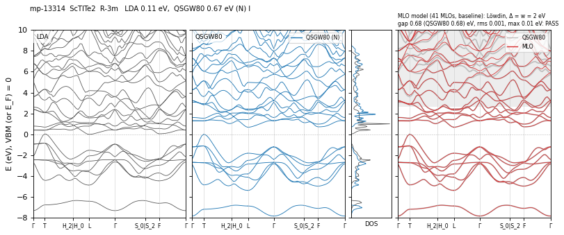

**mp-7140** Si2C2 — QSGW80 **3.55** N / M ≈ · path 3.28 eV I path<mesh(mesh) — ecalj b695fa65c (tf32, t_tetrakbt -300) — MLO PASS (b1) 26 gap 3.31 rms 0.007 max 0.07 (ecalj 614ab5eb8)

<small>runs: M 3.53 · N 3.55 (10-03)</small>

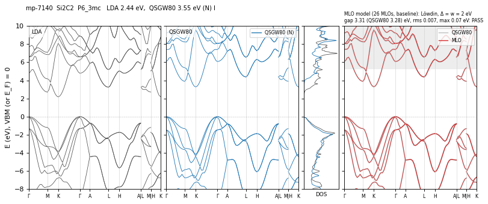

**mp-29803** Si2H2 — QSGW80 **3.71** E / E1 ≈ / M 3.78 / N ≈ eV I differs — ecalj 0601771b4 (tf32, t_tetrakbt -300) with ES, ES rule es-c — MLO PASS (b2, ES) 46 gap 3.73 rms 0.005 max 0.02 (ecalj f16f0ea3d)

<small>runs: M 3.78 · N 3.75 (10-03) · E1 3.71 (10-05, ES 1) · E 3.71 (10-06, ES 1, es-c)</small>

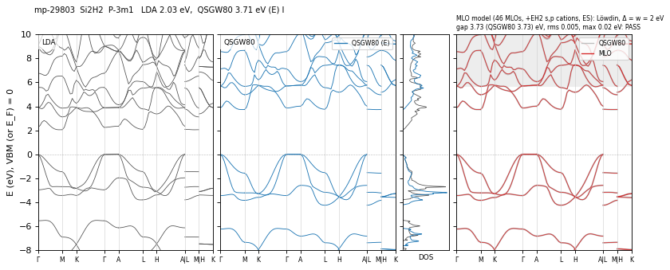

**mp-165** Si4 — QSGW80 **0.97** N / M ≈ eV I  — ecalj b695fa65c (tf32, t_tetrakbt -300) — MLO PASS (b1) 36 gap 0.97 rms 0.006 max 0.05 (ecalj 0c4d16ceb)

<small>runs: M 0.98 · N 0.97 (10-03)</small>

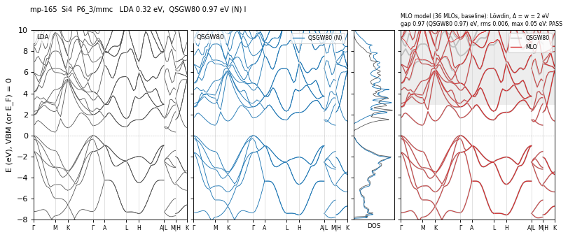

**mp-2097** Sn2O2 — QSGW80 **0.78** N / M ≈ eV I  — ecalj b695fa65c (tf32, t_tetrakbt -300) — MLO PASS (b1) 26 gap 0.79 rms 0.007 max 0.09 (ecalj fb2da026b)

<small>runs: M 0.78 · N 0.78 (10-03)</small>

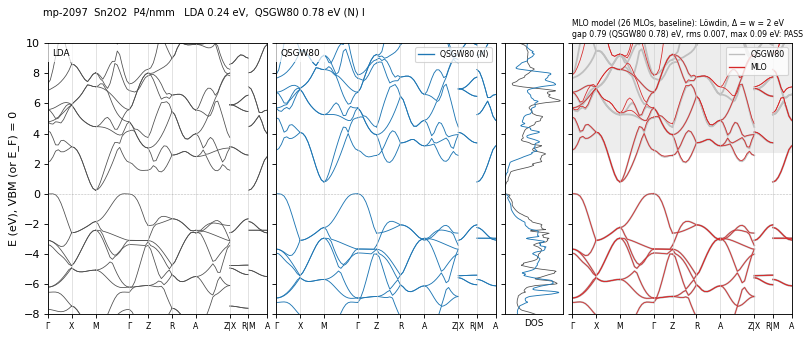

**mp-545552** Sn2O2 — QSGW80 **2.40** N / M ≈ eV I  — ecalj b695fa65c (tf32, t_tetrakbt -300) — MLO PASS (b2) 34 gap 2.35 rms 0.003 max 0.04 (ecalj 614ab5eb8)

<small>runs: M 2.38 · N 2.40 (10-03)</small>

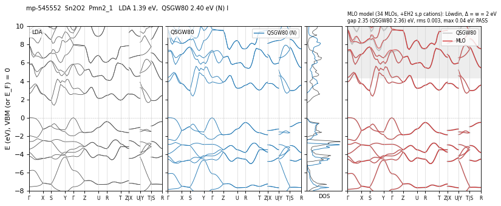

**mp-1379** Sn2S2 — QSGW80 **1.91** E / E1 ≈ / M ≈ / N ≈ eV I  — ecalj 0601771b4 (tf32, t_tetrakbt -300) with ES, ES rule es-c — MLO PASS (b1, ES) 38 gap 1.86 rms 0.001 max 0.01 (ecalj f16f0ea3d)

<small>runs: M 1.92 · N 1.91 (10-03) · E1 1.91 (10-05, ES 1) · E 1.91 (10-06, ES 2, es-c)</small>

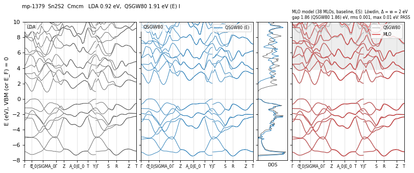

**mp-554134** Sn2S2 — QSGW80 **3.99** E / R ≈ eV I  — ecalj 0601771b4 (tf32, t_tetrakbt -300) with ES, ES rule es-c — MLO FAIR (b2all, ES) 58 gap 4.01 rms 0.004 max 0.24 (ecalj 26b32d5d5)

*from 2026-10-07 15:16: ES outside both surfaces plus two ES2 (2.65 a.u.) at the vacuum centre*

<small>runs: M 3.78 · R 4.00 (10-01) · E1 FAIL(1) FAIL(1) (10-05, ES 1) · E FAIL(1) FAIL(1) (10-05, ES 1, es-a) · E FAIL(1) FAIL(1) (10-06, ES 2, es-a) · E 4.00 (10-06, ES 2, es-c) · E 3.99 (10-07, ES 4, es-c) · E 3.99 (10-07, ES 6, es-c)</small>

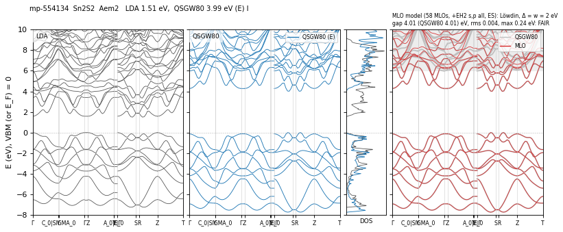

**mp-559676** Sn2S2 — QSGW80 **0.83** N / M ≈ eV I  — ecalj b695fa65c (tf32, t_tetrakbt -300) — MLO PASS (b1) 36 gap 0.75 rms 0.001 max 0.01 (ecalj 614ab5eb8)

<small>runs: M 0.85 · N 0.83 (10-03)</small>

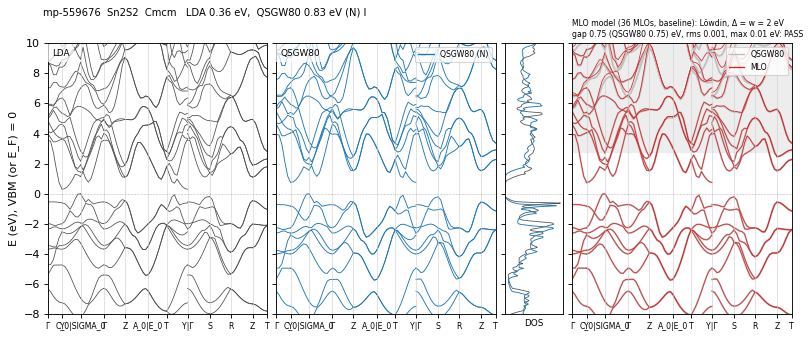

**mp-727322** Sn2S2 — QSGW80 **2.68** E / M ≈ / N ≈ eV D  — ecalj 0601771b4 (tf32, t_tetrakbt -300) with ES, ES rule es-c — MLO PASS (b1, ES) 40 gap 2.67 rms 0.005 max 0.05 (ecalj a45169f3c)

<small>runs: M 2.69 · N 2.69 (10-04) · E1 FAIL(1) FAIL(1) (10-05, ES 1) · E 2.68 (10-06, ES 1, es-c)</small>

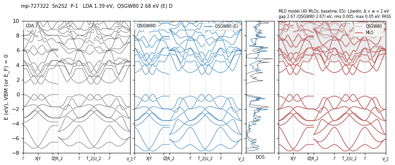

**mp-8781** Sn2S2 — QSGW80 **3.01** E / M ≈ eV D N:FAIL(1) — ecalj 614ab5eb8 (tf32, t_tetrakbt -300) with ES, ES rule es-a — MLO PASS (b2, ES) 46 gap 3.02 rms 0.006 max 0.06 (ecalj 5078fe055)

<small>runs: M 3.03 · N 3.01 FAIL(1) (10-04) · E 3.01 (10-05, ES 2, es-a)</small>

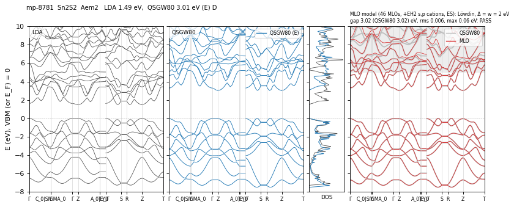

**mp-2168** Sn2Se2 — QSGW80 **0.64** N / M ≈ eV I  — ecalj b695fa65c (tf32, t_tetrakbt -300) — MLO PASS (b1) 36 gap 0.62 rms 0.001 max 0.01 (ecalj fb2da026b)

<small>runs: M 0.64 · N 0.64 (10-03)</small>

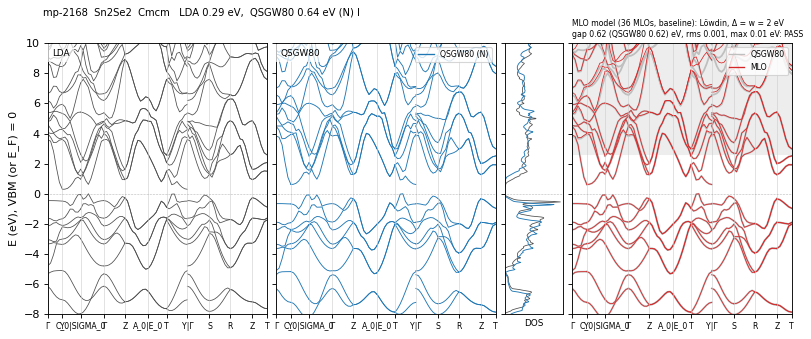

**mp-8936** Sn2Se2 — QSGW80 **1.93** E / M ≈ / N ≈ eV D  — ecalj 614ab5eb8 (tf32, t_tetrakbt -300) with ES, ES rule es-a — MLO PASS (b2, ES) 46 gap 1.88 rms 0.004 max 0.03 (ecalj 5078fe055)

<small>runs: M 1.95 · N 1.94 (10-04) · E 1.93 (10-05, ES 2, es-a)</small>

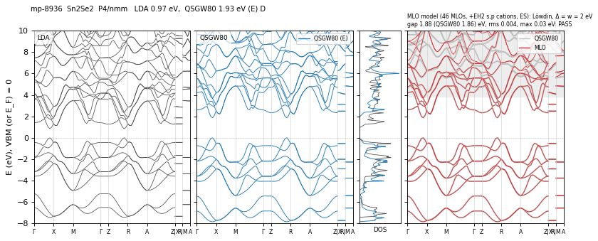

**mp-23056** Sr2BrN — QSGW80 **3.28** N / R ≈ eV D  — ecalj b695fa65c (tf32, t_tetrakbt -300) — MLO PASS (b1) 31 gap 3.29 rms 0.010 max 0.05 (ecalj fb2da026b)

<small>runs: M 2.56 · R 3.28 (10-01) · N 3.28 (10-04)</small>

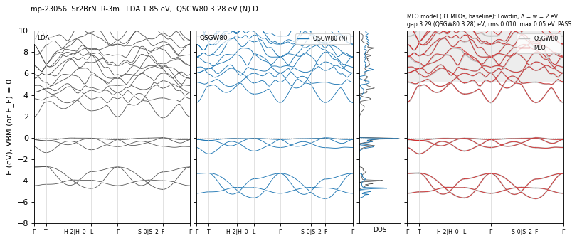

**mp-690794** Sr2HN — QSGW80 **2.99** N / M 2.80 eV D differs — ecalj b695fa65c (tf32, t_tetrakbt -300) — MLO PASS (b1) 26 gap 2.99 rms 0.001 max 0.01 (ecalj 614ab5eb8)

<small>runs: M 2.80 · N 2.99 (10-03)</small>

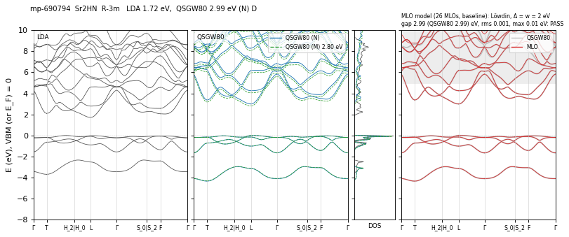

**mp-569677** Sr2IN — QSGW80 **2.98** N / M 2.80 eV I differs — ecalj b695fa65c (tf32, t_tetrakbt -300) — MLO PASS (b1) 31 gap 3.04 rms 0.011 max 0.06 (ecalj 614ab5eb8)

<small>runs: M 2.80 · N 2.98 (10-03)</small>

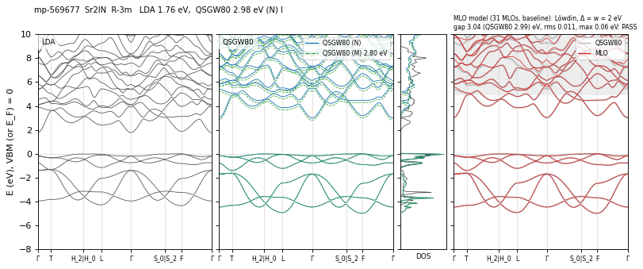

**mp-23033** Sr2NCl — QSGW80 **3.31** N / M 3.19 eV D differs — ecalj b695fa65c (tf32, t_tetrakbt -300) — MLO PASS (b1) 37 gap 3.31 rms 0.008 max 0.06 (ecalj fb2da026b)

<small>runs: M 3.19 · N 3.31 (10-03)</small>

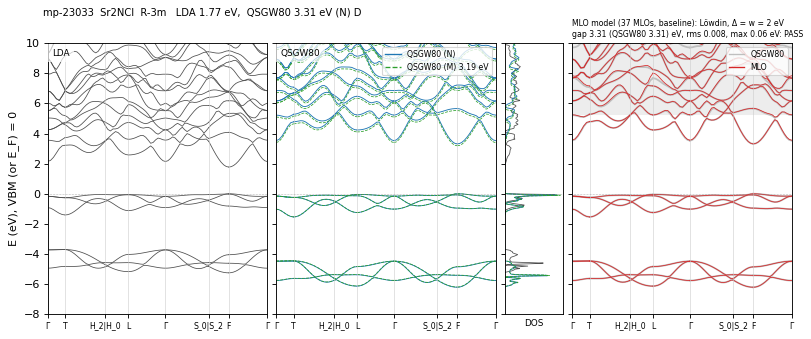

**mp-980057** SrAlGeH — QSGW80 **1.39** N / M ≈ eV I  — ecalj b695fa65c (tf32, t_tetrakbt -300) — MLO PASS (b1) 31 gap 1.39 rms 0.002 max 0.01 (ecalj 614ab5eb8)

<small>runs: M 1.44 · N 1.39 (10-03)</small>

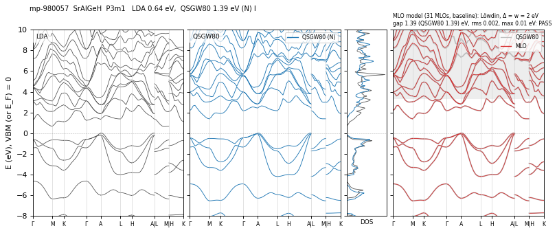

**mp-570485** SrAlSiH — QSGW80 **1.23** N / M ≈ eV I  — ecalj b695fa65c (tf32, t_tetrakbt -300) — MLO PASS (b1) 31 gap 1.23 rms 0.002 max 0.01 (ecalj 614ab5eb8)

<small>runs: M 1.24 · N 1.23 (10-03)</small>

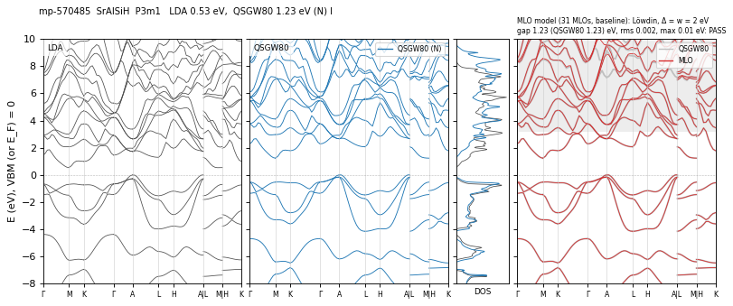

**mp-978847** SrGaGeH — QSGW80 **1.13** N / M ≈ eV I  — ecalj b695fa65c (tf32, t_tetrakbt -300) — MLO PASS (b1) 36 gap 1.13 rms 0.002 max 0.01 (ecalj 614ab5eb8)

<small>runs: M 1.13 · N 1.13 (10-03)</small>

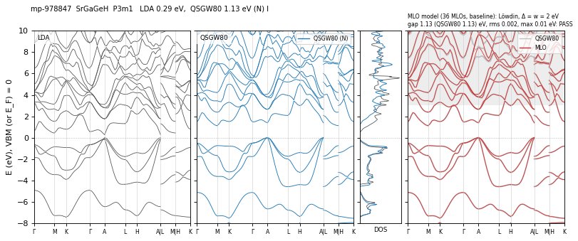

**mp-9383** SrHfN2 — QSGW80 **1.20** N / R ≈ eV I  — ecalj b695fa65c (tf32, t_tetrakbt -300) — MLO PASS (b1) 36 gap 1.20 rms 0.002 max 0.01 (ecalj 614ab5eb8)

<small>runs: M FAILED · R 1.20 (09-30) · N 1.20 (10-04)</small>

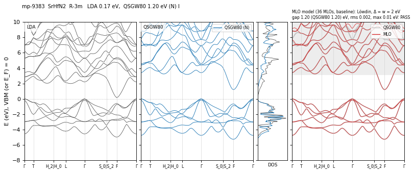

**mp-665922** SrHgO2 — QSGW80 **4.52** N / M 3.47 eV I CHECK — ecalj 989a18637 (tf32, t_tetrakbt -300) — MLO PASS (b2) 37 gap 4.52 rms 0.003 max 0.03 (ecalj fb2da026b)

<small>runs: M 3.47 · N 4.52 (10-03)</small>

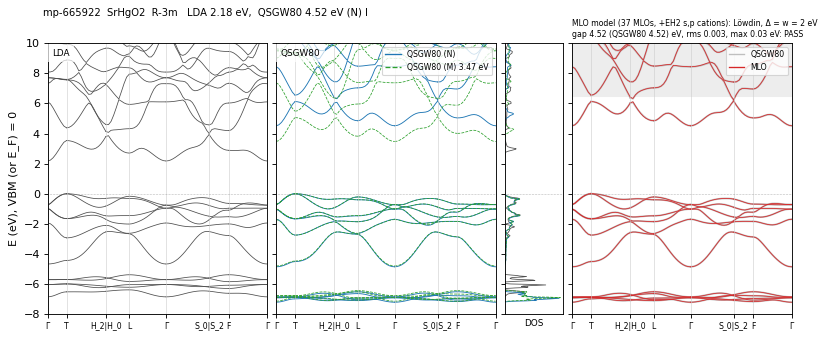

**mp-9382** SrZrN2 — QSGW80 **1.17** N / M ≈ eV I  — ecalj b695fa65c (tf32, t_tetrakbt -300) — MLO PASS (b1) 29 gap 1.17 rms 0.002 max 0.01 (ecalj 614ab5eb8)

<small>runs: M 1.15 · N 1.17 (10-03)</small>

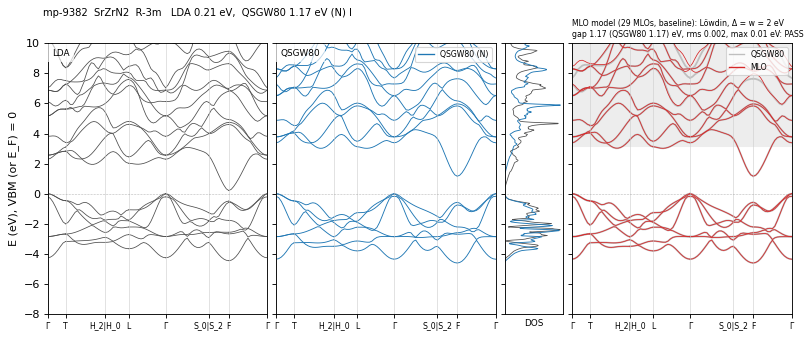

**mp-8927** TaCuN2 — QSGW80 **1.23** N / M ≈ eV I  — ecalj b695fa65c (tf32, t_tetrakbt -300) — MLO PASS (b1) 26 gap 1.24 rms 0.002 max 0.03 (ecalj 614ab5eb8)

<small>runs: M 1.20 · N 1.23 (10-03)</small>

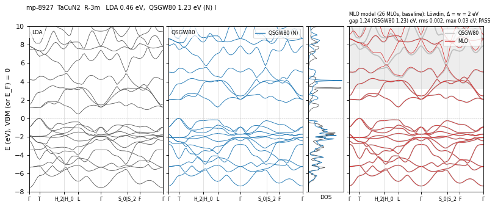

**mp-999135** TaCuN2 — QSGW80 **0.91** N / M 1.02 eV I differs — ecalj b695fa65c (tf32, t_tetrakbt -300) — MLO PASS (b1) 26 gap 0.89 rms 0.002 max 0.01 (ecalj 614ab5eb8)

<small>runs: M 1.02 · N 0.91 (10-03)</small>

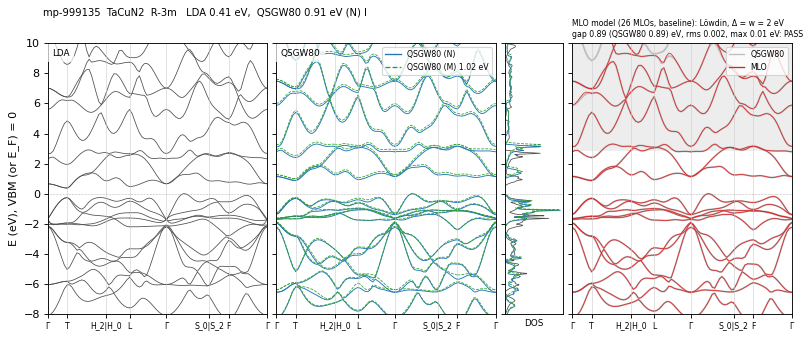

**mp-19963** TiFe2Sn — QSGW80 **0.06** N / M ≈ eV I  — ecalj b695fa65c (tf32, t_tetrakbt -300) — MLO PASS (b1) 36 gap 0.06 rms 0.001 max 0.01 (ecalj fb2da026b)

<small>runs: M 0.06 · N 0.06 (10-03)</small>

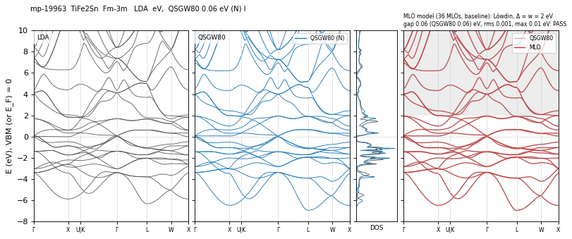

**mp-568949** Tl2Br2 — QSGW80 **3.44** E / M 3.51 / N ≈ eV D differs — ecalj 0601771b4 (tf32, t_tetrakbt -300) with ES, ES rule es-c — MLO PASS (b1, ES) 48 gap 3.41 rms 0.000 max 0.00 (ecalj f16f0ea3d)

<small>runs: M 3.51 · N 3.44 (10-03) · E 3.44 (10-06, ES 2, es-c)</small>

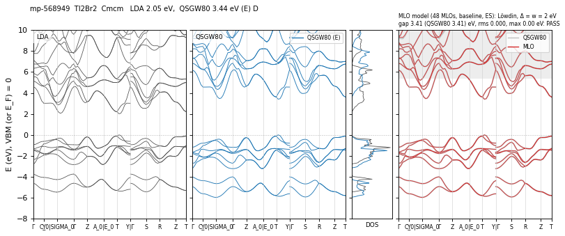

**mp-571079** Tl2Cl2 — QSGW80 **3.93** N / M ≈ eV D  — ecalj b695fa65c (tf32, t_tetrakbt -300) — MLO PASS (b1) 46 gap 3.92 rms 0.001 max 0.00 (ecalj 614ab5eb8)

<small>runs: M 3.89 · N 3.93 (10-03)</small>

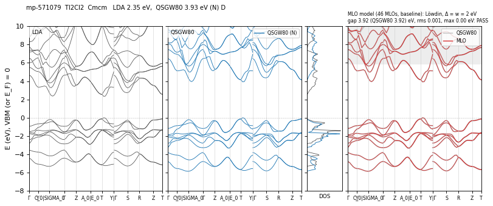

**mp-557835** Tl2F2 — QSGW80 **4.76** N / M ≈ · path 4.61 eV I path<mesh(mesh) — ecalj b695fa65c (tf32, t_tetrakbt -300) — MLO PASS (b1) 36 gap 4.61 rms 0.001 max 0.01 (ecalj 614ab5eb8)

<small>runs: M 4.72 · N 4.76 (10-03)</small>

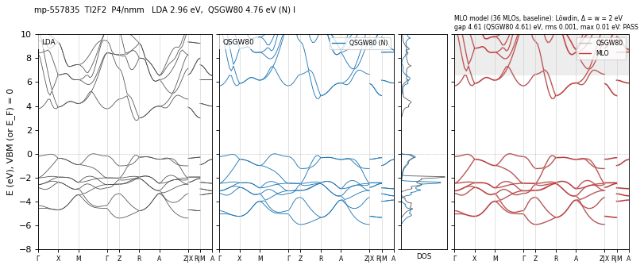

**mp-22858** Tl2I2 — QSGW80 **3.19** E / M ≈ / N ≈ eV D  — ecalj 0601771b4 (tf32, t_tetrakbt -300) with ES, ES rule es-a — MLO PASS (b1, ES) 48 gap 3.17 rms 0.000 max 0.00 (ecalj bb1cb4dcc)

<small>runs: M 3.18 · N 3.19 (10-03) · E 3.19 (10-06, ES 2, es-a)</small>

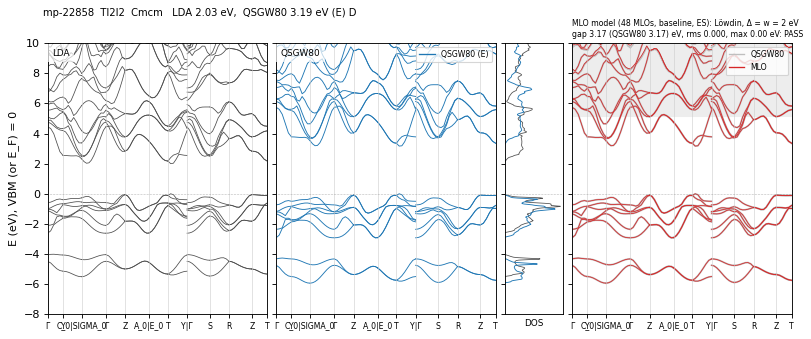

**mp-554310** TlBiS2 — QSGW80 **0.78** N / M ≈ eV D  — ecalj b695fa65c (tf32, t_tetrakbt -300) — MLO PASS (b1) 41 gap 0.78 rms 0.001 max 0.00 (ecalj 614ab5eb8)

<small>runs: M 0.81 · N 0.78 (10-03)</small>

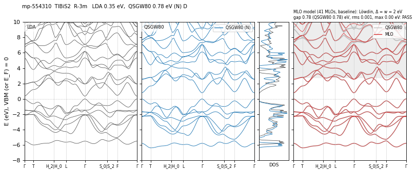

**mp-29662** TlBiSe2 — QSGW80 **0.48** N / M ≈ eV D  — ecalj b695fa65c (tf32, t_tetrakbt -300) — MLO PASS (b1) 41 gap 0.48 rms 0.001 max 0.01 (ecalj fb2da026b)

<small>runs: M 0.45 · N 0.48 (10-03)</small>

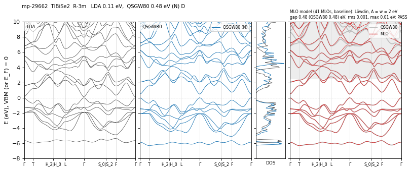

**mp-27438** TlBiTe2 — QSGW80 **0.64** N / M ≈ eV D  — ecalj b695fa65c (tf32, t_tetrakbt -300) — MLO PASS (b1) 41 gap 0.66 rms 0.001 max 0.01 (ecalj fb2da026b)

<small>runs: M 0.64 · N 0.64 (10-03)</small>

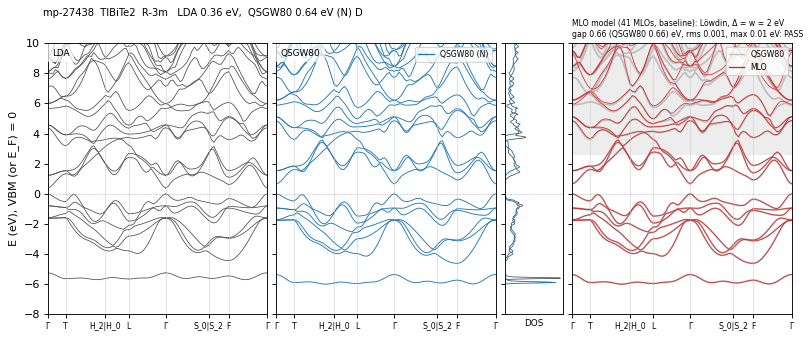

**mp-22566** TlInS2 — QSGW80 **1.30** N / M 1.45 eV I differs — ecalj 989a18637 (tf32, t_tetrakbt -300) — MLO PASS (b1) 46 gap 1.30 rms 0.001 max 0.01 (ecalj fb2da026b)

<small>runs: M 1.45 · N 1.30 (10-03)</small>

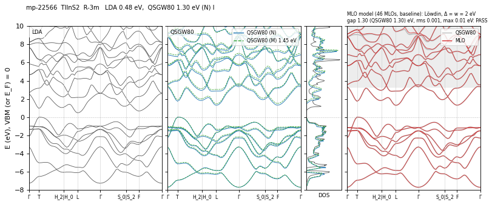

**mp-4573** TlSbTe2 — QSGW80 **0.29** N / R ≈ eV D  — ecalj 989a18637 (tf32, t_tetrakbt -300) — MLO PASS (b1) 41 gap 0.29 rms 0.001 max 0.01 (ecalj fb2da026b)

<small>runs: M UNKNOWN · R 0.29 (09-30) · N 0.29 (10-03)</small>

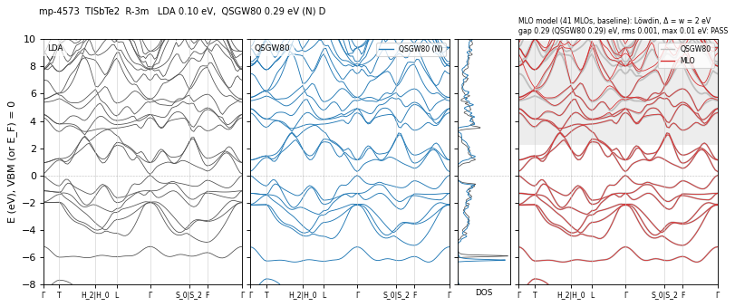

**mp-19390** WO3 — QSGW80 **1.52** E / E1 ≈ / M ≈ / N ≈ eV I  — ecalj 0601771b4 (tf32, t_tetrakbt -300) with ES, ES rule es-c — MLO PASS (b1, ES) 25 gap 1.52 rms 0.001 max 0.01 (ecalj f16f0ea3d)

<small>runs: M 1.53 · N 1.55 (10-03) · E1 1.53 (10-05, ES 1) · E 1.52 (10-06, ES 1, es-c)</small>

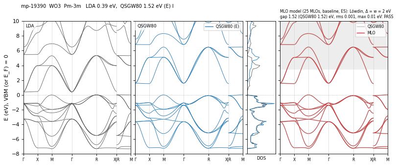

**mp-6972** YCuO2 — QSGW80 **4.37** N / R ≈ eV I  — ecalj b695fa65c (tf32, t_tetrakbt -300) — MLO PASS (b2d) 38 gap 4.35 rms 0.003 max 0.04 (ecalj 1fd34b1c0)

<small>runs: M 3.97 · R 4.37 (10-01) · N 4.37 (10-03)</small>

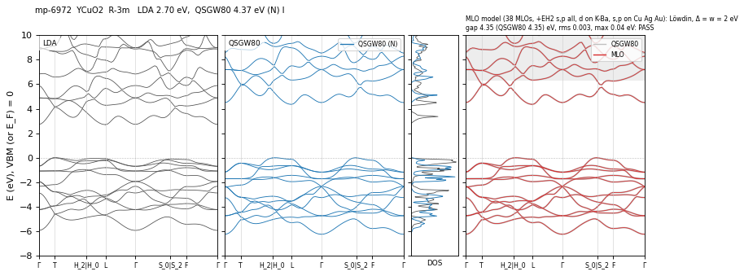

**mp-1066131** YTlS2 — QSGW80 **2.29** N / M 2.58 / R ≈ eV I CHECK — ecalj 989a18637 (tf32, t_tetrakbt -300) — MLO PASS (b1) 41 gap 2.29 rms 0.001 max 0.01 (ecalj a1d6c0e11)

<small>runs: M 2.58 · R 2.29 (10-01) · N 2.29 (10-02)</small>

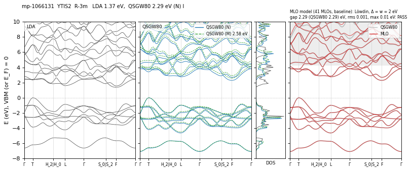

**mp-1067744** YTlSe2 — QSGW80 **2.00** N / M 1.88 eV I differs — ecalj b695fa65c (tf32, t_tetrakbt -300) — MLO PASS (b1) 41 gap 2.00 rms 0.005 max 0.04 (ecalj a1d6c0e11)

<small>runs: M 1.88 · N 2.00 (10-03)</small>

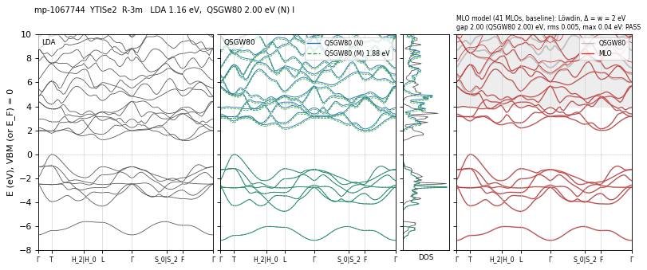

**mp-1065514** YTlTe2 — QSGW80 **1.23** N / M ≈ eV I  — ecalj b695fa65c (tf32, t_tetrakbt -300) — MLO PASS (b1) 41 gap 1.23 rms 0.005 max 0.05 (ecalj a1d6c0e11)

<small>runs: M 1.24 · N 1.23 (10-03)</small>

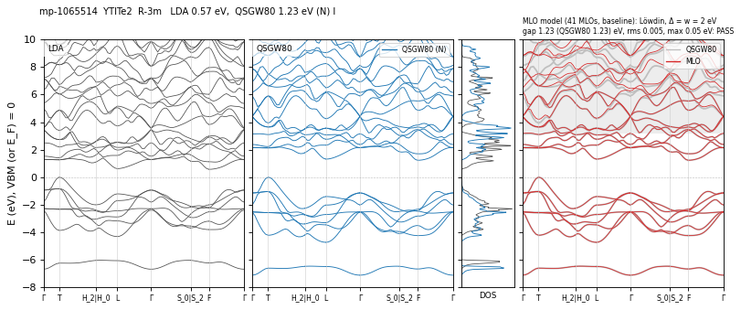

**mp-2133** Zn2O2 — QSGW80 **3.15** N / M ≈ eV D  — ecalj b695fa65c (tf32, t_tetrakbt -300) — MLO PASS (b1) 26 gap 3.15 rms 0.001 max 0.02 (ecalj fb2da026b)

<small>runs: M 3.18 · N 3.15 (10-03)</small>

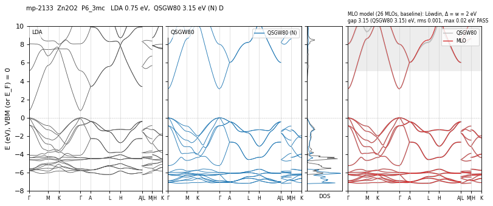

**mp-560588** Zn2S2 — QSGW80 **3.74** N / M ≈ eV D  — ecalj b695fa65c (tf32, t_tetrakbt -300) — MLO PASS (b1) 36 gap 3.77 rms 0.011 max 0.08 (ecalj 614ab5eb8)

<small>runs: M 3.78 · N 3.74 (10-03)</small>

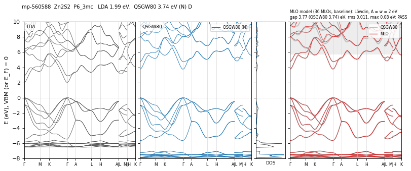

**mp-380** Zn2Se2 — QSGW80 **2.78** N / M ≈ eV D  — ecalj b695fa65c (tf32, t_tetrakbt -300) — MLO PASS (b2) 44 gap 2.78 rms 0.001 max 0.01 (ecalj 614ab5eb8)

<small>runs: M 2.77 · N 2.78 (10-03)</small>

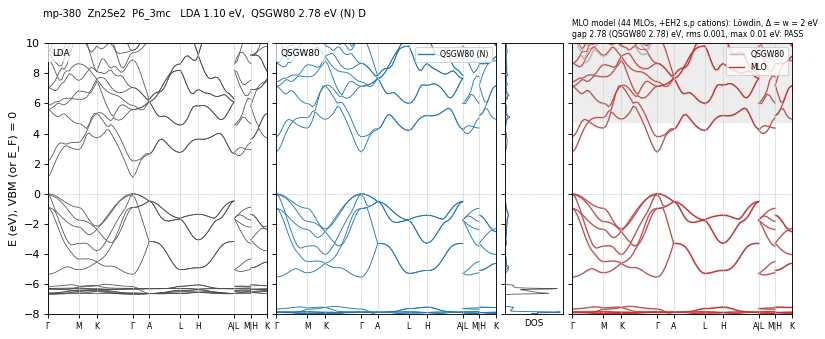

